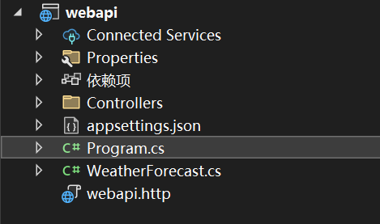

ASP.NET Core WebAPI 是一个用于构建 RESTful 服务的框架，它提供了丰富的功能和灵活的架构，使开发者能够轻松创建高性能、可扩展的 Web API。

## 快速开始

### 创建 WebAPI 项目

```bash
dotnet new webapi -n MyWebApi
cd MyWebApi
dotnet run
```

### 项目结构解析

```cs
namespace webapi
{
    // 定义一个名为 webapi 的命名空间
    public class Program
    {
        // 公共静态 void Main 方法，它是应用程序的入口点
        public static void Main(string[] args)
        {
            // 创建一个 WebApplicationBuilder 实例，用于构建 Web 应用程序
            var builder = WebApplication.CreateBuilder(args);

            // 使用 builder.Services 添加服务到依赖注入容器中
            // AddControllers 添加控制器服务，这些控制器用于处理 HTTP 请求
            builder.Services.AddControllers();
            // AddEndpointsApiExplorer 添加 Endpoints API 探索器服务，用于生成 API 文档
            builder.Services.AddEndpointsApiExplorer();
            // AddSwaggerGen 添加 Swagger 生成服务，用于生成 API 文档和 Swagger UI
            builder.Services.AddSwaggerGen();

            // 构建 Web 应用程序实例
            var app = builder.Build();

            // 配置 HTTP 请求管道
            // 如果应用程序环境是开发环境，则启用 Swagger 和 Swagger UI
            if (app.Environment.IsDevelopment())
            {
                app.UseSwagger();
                app.UseSwaggerUI();
            }

            // 使用 HttpsRedirection 中间件，确保所有请求都被重定向到 HTTPS
            app.UseHttpsRedirection();

            // 使用 Authorization 中间件，允许身份验证和授权
            app.UseAuthorization();

            // MapControllers 中间件将控制器映射到路由，以便处理 HTTP 请求
            app.MapControllers();

            // 启动应用程序并等待请求
            app.Run();
        }
    }
}
```

::: info 提示
在开发环境中，Swagger UI 默认可以通过 `https://localhost:<port>/swagger` 访问，它提供了交互式的 API 文档界面。
:::

## RESTful 架构

RESTful 是一种基于 REST（Representational State Transfer，表述性状态转移）架构风格的设计方法，主要用于构建面向资源的网络应用程序（通常是 Web API）。

### RESTful 设计原则

1. **资源导向**：使用名词而不是动词来表示资源
2. **统一接口**：使用标准的 HTTP 方法（GET、POST、PUT、DELETE 等）
3. **无状态**：每个请求都包含所有必要的信息
4. **可缓存**：响应应该明确标识是否可以缓存
5. **分层系统**：客户端不需要知道是否直接连接到服务器

### HTTP 方法与 CRUD 操作

| HTTP 方法 | CRUD 操作 | 描述 |
|-----------|----------|------|
| GET | Read | 获取资源 |
| POST | Create | 创建新资源 |
| PUT | Update | 完整更新资源 |
| PATCH | Partial Update | 部分更新资源 |
| DELETE | Delete | 删除资源 |

## API Controller

API Controller 是处理 HTTP 请求的核心组件，通过属性路由和 HTTP 方法特性来定义 API 端点。

### 基本示例

```cs
[ApiController]
[Route("api/[controller]")]
public class UsersController : ControllerBase
{
    // GET /api/users
    [HttpGet]
    public IActionResult GetUsers()
    {
        var users = new List<string> { "Alice", "Bob", "Charlie" };
        return Ok(users);
    }

    // GET /api/users/{id}
    [HttpGet("{id}")]
    public IActionResult GetUser(int id)
    {
        var user = "User" + id;
        return Ok(user);
    }

    // POST /api/users
    [HttpPost]
    public IActionResult CreateUser([FromBody] string userName)
    {
        return CreatedAtAction(nameof(GetUser), new { id = 1 }, userName);
    }

    // PUT /api/users/{id}
    [HttpPut("{id}")]
    public IActionResult UpdateUser(int id, [FromBody] string userName)
    {
        return NoContent();
    }

    // DELETE /api/users/{id}
    [HttpDelete("{id}")]
    public IActionResult DeleteUser(int id)
    {
        return NoContent();
    }
}
```

### ApiController 特性

`[ApiController]` 特性提供了以下功能：

1. **自动模型验证**：自动验证请求模型，并在验证失败时返回 400 Bad Request
2. **自动 HTTP 400 响应**：当模型验证失败时自动返回 400 状态码
3. **推断绑定源**：自动推断参数的绑定源（FromBody、FromQuery 等）
4. **Multipart/form-data 请求推断**：自动识别表单数据请求

::: tip 提示
在 ASP.NET Core 2.2 及更高版本中，建议始终在 API 控制器上使用 `[ApiController]` 特性，以获得更好的开发体验和自动化的行为。
:::

## ControllerBase 和 Controller

### ControllerBase
`ControllerBase` 是 API 控制器的基类，提供了处理 HTTP 请求所需的核心功能，但不包含视图相关的方法。

### Controller
`Controller` 类继承自 `ControllerBase`，在此基础上增加了与视图相关的方法，适用于传统的 MVC 应用程序。

### 选择指南

| 场景 | 基类 | 说明 |
|------|------|------|
| Web API | ControllerBase | 不需要视图，只返回数据 |
| MVC 应用 | Controller | 需要返回视图 |

### MVC Controller 示例

```cs
public class HomeController : Controller
{
    // GET: /Home/Index
    public IActionResult Index()
    {
        var model = new { Message = "Welcome to ASP.NET Core MVC!" };
        return View(model);  // Returns a view with the model data
    }

    // POST: /Home/Submit
    [HttpPost]
    public IActionResult Submit(string name)
    {
        // Handle form submission
        return RedirectToAction("Index"); // Redirects to another action (Index)
    }
}
```

::: info 提示
对于纯 Web API 项目，始终使用 `ControllerBase` 作为基类，这样可以避免加载不必要的视图引擎依赖，提高性能。
:::

## 路由系统

ASP.NET Core WebAPI 提供了灵活的路由系统，支持属性路由和约定路由。

### 路由模板变量

| 变量 | 说明 | 示例 |
|------|------|------|
| `[controller]` | 控制器名称（不含 Controller 后缀） | `UsersController` → `users` |
| `[action]` | 操作方法名称 | `GetUsers` → `getusers` |
| `[area]` | 区域名称 | `Admin` → `admin` |
| `{id}` | 路由参数 | `{id}` → `123` |

### 使用 `[action]`

```cs
[ApiController]

[Route("api/[controller]/[action]")]
public class ProductController : ControllerBase
{   
  // GET /api/product/getproducts
    [HttpGet]
    public IActionResult GetProducts()
    {
        return Ok(new { Products = new[] { "Laptop", "Phone", "Tablet" } });
    }
    // GET /api/product/getproductbyid/1
    [HttpGet("{id}")]
    public IActionResult GetProductById(int id)
    {
        return Ok(new { ProductId = id, Name = "Laptop" });
    }
}
```

### `{id}`

```cs
[ApiController]
[Route("api/[controller]/{id}")]
public class ProductController : ControllerBase
{ 
  // GET /api/product/1 (where 1 is the id parameter).
    [HttpGet]
    public IActionResult GetProductById(int id)
    {
        return Ok(new { ProductId = id, Name = "Laptop" });
    }
}
```

### `[action]/{id}`

```cs
[ApiController]
[Route("api/[controller]/[action]/{id}")]
public class ProductController : ControllerBase
{
    [HttpGet]
    public IActionResult GetProductById(int id)
    {
        return Ok(new { ProductId = id, Name = "Laptop" });
    }
}
```

### `[area]`

```cs
[ApiController]
[Route("api/[area]/[controller]/[action]")]
[Area("Admin")]
public class AdminProductController : ControllerBase
{   
  // Route: GET /api/admin/adminproduct/getadminproductdetails
    [HttpGet]
    public IActionResult GetAdminProductDetails()
    {
        return Ok(new { ProductId = 1, AdminAccess = true });
    }
}
```

### `{language}`

```cs
[ApiController]
[Route("api/[controller]/[action]/{language}")]
public class ProductController : ControllerBase
{
    [HttpGet]
    public IActionResult GetLocalizedProductInfo(string language)
    {
        return Ok(new { Language = language, ProductName = "Laptop" });
    }
}

```

### Routing Attribute and Action Method Name

```cs
[HttpGet("forecast")]
public IActionResult GetForecast()
{
    return Ok("Forecast data");
}
```

**Routing Attribute**

- `[HttpGet("forecast")]` 定义了方法响应的请求路径
- 代表处理`api/{controller}/forecast` 路径的 GET 请求。

```cs
[Route("api/[controller]/[action]")]
public class WeatherController : ControllerBase
{   
  // GET /api/weather/forecast2
    [HttpGet("forecast2")]
    public IActionResult GetForecast()
    {
        return Ok("Forecast data");
    }
}
```

**Action Method Name**

- 只是方法名

```cs
[Route("api/[controller]/[action]")]
public class WeatherController : ControllerBase
{   
  // GET /api/weather/forecast
    [HttpGet]
    public IActionResult GetForecast()
    {
        return Ok("Forecast data");
    }
    // GET /api/weather/getweather
    [HttpGet]
    public IActionResult GetWeather()
    {
        return Ok("Weather data");
    }
}
```

::: tip 最佳实践
- 对于 RESTful API，推荐使用资源导向的路由（不使用 `[action]`）
- 对于 RPC 风格的 API，可以使用 `[action]` 来明确操作名称
- 保持路由命名的一致性和可预测性
:::

## 参数绑定

ASP.NET Core WebAPI 提供了多种参数绑定方式，可以从不同的位置获取数据。

### 参数绑定源

| 特性 | 数据来源 | 适用场景 |
|------|----------|----------|
| `[FromBody]` | 请求体 | 复杂对象、JSON 数据 |
| `[FromQuery]` | URL 查询字符串 | 简单参数、筛选条件 |
| `[FromRoute]` | URL 路由 | 资源 ID、路径参数 |
| `[FromHeader]` | HTTP 请求头 | 认证令牌、自定义头 |
| `[FromForm]` | 表单数据 | 文件上传、表单提交 |

### `[FromBody]`

```cs
public class WeatherForecast
{
    public string Date { get; set; }
    public int TemperatureC { get; set; }
    public string Summary { get; set; }
}


[ApiController]
[Route("api/[controller]")]
public class WeatherController : ControllerBase
{
    // POST /api/weather
    [HttpPost]
    public IActionResult CreateForecast([FromBody] WeatherForecast forecast)
    {
        // The 'forecast' object will be populated from the request body
        /*
        
          {
            "Date": "2024-11-25",
            "TemperatureC": 22,
            "Summary": "Sunny"
          }
        */ 
        return Ok(forecast);
    }
}
```

::: info 注意
`[FromBody]` 特性只能应用于一个参数，因为请求体只能被读取一次。
:::

### `[FromQuery]`

从 URL 查询字符串中获取数据。

```cs
[ApiController]
[Route("api/[controller]")]
public class ProductsController : ControllerBase
{
    // GET /api/products?page=1&pageSize=10&category=laptop
    [HttpGet]
    public IActionResult GetProducts(
        [FromQuery] int page = 1,
        [FromQuery] int pageSize = 10,
        [FromQuery] string? category = null)
    {
        var result = new
        {
            Page = page,
            PageSize = pageSize,
            Category = category
        };
        return Ok(result);
    }
}
```

### `[FromRoute]`

从 URL 路由中获取数据。

```cs
[ApiController]
[Route("api/[controller]/{id}")]
public class ProductsController : ControllerBase
{
    // GET /api/products/123
    [HttpGet]
    public IActionResult GetProduct([FromRoute] int id)
    {
        return Ok(new { ProductId = id, Name = "Laptop" });
    }
}
```

### `[FromHeader]`

从 HTTP 请求头中获取数据。

```cs
[ApiController]
[Route("api/[controller]")]
public class AuthController : ControllerBase
{
    // POST /api/auth/validate
    [HttpPost("validate")]
    public IActionResult ValidateToken([FromHeader(Name = "Authorization")] string token)
    {
        // Token format: "Bearer {your-token}"
        return Ok(new { IsValid = !string.IsNullOrEmpty(token) });
    }
}
```

### `[FromForm]`

从表单数据中获取数据，常用于文件上传。

```cs
[ApiController]
[Route("api/[controller]")]
public class UploadController : ControllerBase
{
    // POST /api/upload/file
    [HttpPost("file")]
    public IActionResult UploadFile(
        [FromForm] IFormFile file,
        [FromForm] string? description = null)
    {
        if (file == null || file.Length == 0)
        {
            return BadRequest("No file uploaded");
        }

        return Ok(new
        {
            FileName = file.FileName,
            Size = file.Length,
            Description = description
        });
    }
}
```
