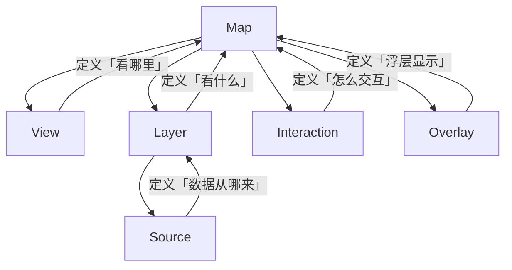

在 Web 地图开发领域，Leaflet 以轻量易用著称，但当你需要处理复杂投影、海量矢量数据、WMS/WFS 标准服务、要素编辑与空间分析时，OpenLayers 才是真正能扛起企业级需求的选择。本文将从"为什么"出发，帮你建立对 OpenLayers 的完整心智模型，再逐步深入每个核心模块，最终落地为一个可用的地图应用。

## 为什么选择 OpenLayers？

选型之前，先想清楚你要解决的问题。

如果你只需要在页面上放一个地图、标几个点、画几条线，Leaflet 足矣，它上手快、生态友好。但当需求出现以下任何一种时，OpenLayers 的优势就会显现：

- **多投影与坐标转换**：你的数据源混合了 EPSG:4326、EPSG:3857、CGCS2000，需要实时投影转换
- **OGC 标准服务**：需要对接 WMS、WMTS、WFS 等标准地图服务
- **要素编辑**：用户需要在地图上绘制、修改、删除地理要素并同步回服务端
- **大数据量渲染**：数万级矢量要素需要流畅渲染，甚至需要 WebGL 加速
- **空间计算**：测距、测面、缓冲区分析等需要在浏览器端完成
- **精细控制**：你需要对渲染管线、交互行为、图层叠加顺序有完全的控制权

OpenLayers 的设计哲学是"提供底层的、完整的 GIS 能力"，而非"提供最简单的 API"。这意味着学习曲线更陡，但上限也更高。

:::tip
如果你的项目只是展示少量标记点，不需要复杂投影，用 Leaflet 可以少写一半代码。OpenLayers 的价值在于解决复杂场景。
:::

---

## 核心架构：五个支柱

理解 OpenLayers 的关键在于理解它的架构模型。整个库围绕五个核心概念构建：



**Map** 是整个应用的入口，它把其他所有组件组装在一起。一个 Map 至少需要三个东西：渲染目标（DOM 容器）、View（定义视口状态）、至少一个 Layer（定义要显示的内容）。

**View** 控制"看哪里"和"怎么看"。它管理地图中心点、缩放级别、旋转角度和投影系统。View 是状态的载体，你可以通过 `animate()` 让它平滑过渡。

**Layer + Source** 控制"看什么"。Layer 定义数据的渲染方式（瓦片、矢量、热力图等），Source 定义数据从哪里来（OSM、XYZ、WMS、GeoJSON 等）。它们总是成对出现。

**Interaction** 控制"怎么交互"。拖拽平移、滚轮缩放、点击选中、绘制要素——这些都是 Interaction。OpenLayers 默认注入了一组常用交互，你也可以按需增减。

**Overlay** 控制"浮层显示"。信息弹窗、标注提示等 DOM 元素需要跟随地图坐标移动，Overlay 就是为此设计的。它把 HTML 元素锚定到地理坐标上。

理解了这五个概念，你就掌握了 OpenLayers 的心智模型。后面的所有内容都是在这个框架上展开的。

---

## 第一个地图：从零开始

先不急着写复杂的东西，让我们从一个最基础的地图开始，理解初始化的完整流程。

<CodePenDemo
  title="OpenLayers 基础地图"
  height="450px"
  code={`const BasicMap = () => {
  const mapRef = React.useRef(null);
  const mapInstanceRef = React.useRef(null);

  React.useEffect(() => {
    const view = new ol.View({
      center: ol.proj.fromLonLat([116.4074, 39.9042]),
      zoom: 10,
      minZoom: 3,
      maxZoom: 18
    });

    const osmLayer = new ol.layer.Tile({
      source: new ol.source.OSM()
    });

    const map = new ol.Map({
      target: mapRef.current,
      layers: [osmLayer],
      view: view
    });

    mapInstanceRef.current = map;

    return () => {
      map.setTarget(null);
    };
  }, []);

  const zoomIn = () => {
    const view = mapInstanceRef.current.getView();
    view.animate({ zoom: view.getZoom() + 1, duration: 300 });
  };

  const zoomOut = () => {
    const view = mapInstanceRef.current.getView();
    view.animate({ zoom: view.getZoom() - 1, duration: 300 });
  };

  const flyTo = (lon, lat) => {
    const view = mapInstanceRef.current.getView();
    view.animate({
      center: ol.proj.fromLonLat([lon, lat]),
      zoom: 12,
      duration: 1000
    });
  };

  return (
    <div className="flex flex-col gap-3">
      <div
        ref={mapRef}
        className="w-full h-80 border border-gray-300 rounded-lg"
      />
      <div className="flex gap-2 justify-center flex-wrap">
        <button onClick={zoomIn} className="px-3 py-1.5 bg-blue-500 text-white rounded text-sm">放大</button>
        <button onClick={zoomOut} className="px-3 py-1.5 bg-blue-500 text-white rounded text-sm">缩小</button>
        <button onClick={() => flyTo(116.4074, 39.9042)} className="px-3 py-1.5 bg-green-600 text-white rounded text-sm">北京</button>
        <button onClick={() => flyTo(121.4737, 31.2304)} className="px-3 py-1.5 bg-green-600 text-white rounded text-sm">上海</button>
        <button onClick={() => flyTo(113.2644, 23.1291)} className="px-3 py-1.5 bg-green-600 text-white rounded text-sm">广州</button>
      </div>
    </div>
  );
};

render(<BasicMap />);`}
/>

这段代码中有几个关键点值得深入理解：

<CodeAnnotation
  language="javascript"
  lines={[
    { code: "center: ol.proj.fromLonLat([116.4074, 39.9042]),", note: "经纬度坐标必须转换为地图投影坐标。OSM 默认使用 EPSG:3857（Web Mercator），而日常使用的经纬度是 EPSG:4326" },
    { code: "source: new ol.source.OSM()", note: "Source 决定数据来源。OSM 是最简单的瓦片源，无需额外配置 URL" },
    { code: "view.animate({ center, zoom, duration: 1000 })", note: "animate() 让视图平滑过渡，而非瞬间跳转。支持链式调用实现复杂的飞行动画" },
    { code: "return () => { map.setTarget(null); }", note: "在 React 中必须清理。setTarget(null) 断开 Map 与 DOM 的绑定，避免内存泄漏" },
  ]}
/>

:::warning 内存泄漏
在单页应用中，组件卸载时必须调用 `map.setTarget(null)` 或 `map.dispose()`。否则 Map 内部的事件监听器和动画循环不会被释放，导致内存持续增长。
:::

---

## 图层系统：数据与渲染的分离

OpenLayers 的图层设计遵循一个原则：**Layer 管"怎么画"，Source 管"数据从哪来"**。这种分离让你可以灵活组合不同的渲染方式和数据源。

### 图层类型总览

| 图层类型 | 渲染方式 | 典型场景 |
|---------|---------|---------|
| `ol.layer.Tile` | 瓦片拼接 | 底图（OSM、天地图、ArcGIS） |
| `ol.layer.Vector` | Canvas 矢量绘制 | GeoJSON 要素、绘制结果 |
| `ol.layer.Heatmap` | 热力图渲染 | 密度分布可视化 |
| `ol.layer.Image` | 单张图片 | WMS Image、静态图片叠加 |
| `ol.layer.VectorTile` | 矢量瓦片 | Mapbox GL 矢量瓦片、MVT |

### 多图层叠加与控制

<CodePenDemo
  title="多图层管理"
  height="500px"
  code={`const LayerManagement = () => {
  const mapRef = React.useRef(null);
  const mapInstanceRef = React.useRef(null);
  const layersRef = React.useRef({});
  const [visible, setVisible] = React.useState({ osm: true, satellite: false, labels: true });

  React.useEffect(() => {
    const osmLayer = new ol.layer.Tile({
      source: new ol.source.OSM(),
      visible: visible.osm
    });

    const satelliteLayer = new ol.layer.Tile({
      source: new ol.source.XYZ({
        url: 'https://server.arcgisonline.com/ArcGIS/rest/services/World_Imagery/MapServer/tile/{z}/{y}/{x}',
        attributions: 'Tiles &copy; Esri'
      }),
      visible: visible.satellite
    });

    const labelsLayer = new ol.layer.Tile({
      source: new ol.source.XYZ({
        url: 'https://server.arcgisonline.com/ArcGIS/rest/services/Reference/World_Boundaries_and_Places/MapServer/tile/{z}/{y}/{x}',
        attributions: 'Labels &copy; Esri'
      }),
      visible: visible.labels
    });

    const map = new ol.Map({
      target: mapRef.current,
      layers: [satelliteLayer, osmLayer, labelsLayer],
      view: new ol.View({
        center: ol.proj.fromLonLat([116.4074, 39.9042]),
        zoom: 10
      })
    });

    layersRef.current = { satellite: satelliteLayer, osm: osmLayer, labels: labelsLayer };
    mapInstanceRef.current = map;

    return () => map.setTarget(null);
  }, []);

  React.useEffect(() => {
    const layers = layersRef.current;
    if (!layers.satellite) return;
    layers.satellite.setVisible(visible.satellite);
    layers.osm.setVisible(visible.osm);
    layers.labels.setVisible(visible.labels);
  }, [visible]);

  const toggle = (key) => setVisible(prev => ({ ...prev, [key]: !prev[key] }));

  return (
    <div className="flex flex-col gap-3">
      <div ref={mapRef} className="w-full h-80 border border-gray-300 rounded-lg" />
      <div className="bg-white border border-gray-300 rounded-lg p-4">
        <h3 className="font-bold mb-3 text-gray-800 text-sm">图层控制</h3>
        <div className="flex flex-col gap-2">
          <label className="flex items-center gap-2 cursor-pointer text-sm">
            <input type="checkbox" checked={visible.osm} onChange={() => toggle('osm')} className="w-4 h-4" />
            <span>街道地图 (OSM)</span>
          </label>
          <label className="flex items-center gap-2 cursor-pointer text-sm">
            <input type="checkbox" checked={visible.satellite} onChange={() => toggle('satellite')} className="w-4 h-4" />
            <span>卫星影像 (Esri)</span>
          </label>
          <label className="flex items-center gap-2 cursor-pointer text-sm">
            <input type="checkbox" checked={visible.labels} onChange={() => toggle('labels')} className="w-4 h-4" />
            <span>地名标注</span>
          </label>
        </div>
      </div>
    </div>
  );
};

render(<LayerManagement />);`}
/>

:::tip 图层叠加顺序
图层数组中，索引越小越先渲染，越在底层。上例中 satellite 在数组最前（最底层），labels 在最后（最上层）。卫星图 + 标注的组合在关闭街道图时效果最好。
:::

---

## 坐标系统与投影

投影是 GIS 开发中最重要的基础概念，也是初学者最容易踩坑的地方。OpenLayers 默认使用 EPSG:3857（Web Mercator）作为地图投影，但地理数据通常使用 EPSG:4326（WGS84 经纬度）。两者之间的转换贯穿整个开发过程。

### 两种坐标系的区别

**EPSG:4326** 是经纬度坐标系，单位是度。北京天安门是 `[116.4074, 39.9042]`，X 范围 `[-180, 180]`，Y 范围 `[-90, 90]`。

**EPSG:3857** 是 Web Mercator 投影坐标系，单位是米。同样的北京天安门大约是 `[12958752, 4852834]`。这个坐标系把球面展平，在赤道附近精度尚可，越靠近极地变形越大。

```javascript
// 经纬度 -> Web Mercator（最常用的转换）
const mercator = ol.proj.fromLonLat([116.4074, 39.9042]);
// 结果: [12958752.28, 4852834.56]（近似值）

// Web Mercator -> 经纬度（反向转换）
const lonLat = ol.proj.toLonLat([12958752, 4852834]);
// 结果: [116.4074, 39.9042]

// 任意两个坐标系之间转换
const transformed = ol.proj.transform(
  [116.4074, 39.9042],
  'EPSG:4326',
  'EPSG:3857'
);
```

### 注册自定义投影

当你需要使用 EPSG:4326 或其他非 3857 投影作为地图投影时，需要通过 `proj4js` 注册：

<CodeTabs items={["注册 EPSG:4326 投影", "使用 proj4js 注册自定义投影"]}>
```javascript
// OpenLayers 内置了 EPSG:4326 的定义，但需要显式注册为可用投影
ol.proj.addProjection(new ol.proj.Projection({
  code: 'EPSG:4326',
  units: 'degrees',
  axisOrientation: 'neu' // 经度在前，纬度在后
}));

// 注册后可以在 View 中使用
const view = new ol.View({
  projection: 'EPSG:4326',
  center: [116.4074, 39.9042], // 不再需要 fromLonLat
  zoom: 10
});
```
---
```javascript
// 需要先加载 proj4js
// <script src="https://cdnjs.cloudflare.com/ajax/libs/proj4js/2.9.2/proj4.js"></script>

// 定义 CGCS2000 (EPSG:4490) 投影参数
proj4.defs('EPSG:4490', '+proj=longlat +ellps=GRS80 +no_defs');

// 注册到 OpenLayers
ol.proj.addProjection(new ol.proj.Projection({
  code: 'EPSG:4490',
  units: 'degrees'
}));

// 注册与 EPSG:4326 的转换关系
ol.proj.addCoordinateTransforms(
  'EPSG:4326', 'EPSG:4490',
  (coord) => proj4('EPSG:4326', 'EPSG:4490', coord),
  (coord) => proj4('EPSG:4490', 'EPSG:4326', coord)
);

// 现在可以在项目中使用 EPSG:4490
const transformed = ol.proj.transform(
  [116.4074, 39.9042],
  'EPSG:4326',
  'EPSG:4490'
);
```
</CodeTabs>

:::warning 投影一致性
最常见的 Bug：GeoJSON 数据使用 EPSG:4326 坐标，但地图 View 使用 EPSG:3857，导致要素偏移到非洲几内亚湾（坐标 [0, 0] 附近）。读取数据时务必通过 `featureProjection` 参数指定目标投影：
```javascript
new ol.format.GeoJSON().readFeatures(geojsonData, {
  featureProjection: 'EPSG:3857' // 将 4326 坐标自动转为 3857
});
```
:::

---

## 矢量数据：要素、几何与样式

矢量图层是 OpenLayers 中最灵活也最常用的图层类型。理解它的关键在于三个概念的关系：**Feature（要素） = Geometry（几何） + Properties（属性）**，而 **Style（样式）** 决定要素如何被绘制。

### 几何类型

OpenLayers 支持以下几何类型，它们对应 OGC 简单要素规范：

| 几何类型 | 类名 | 描述 |
|---------|------|------|
| 点 | `ol.geom.Point` | 单个坐标点 |
| 线 | `ol.geom.LineString` | 有序坐标序列 |
| 面 | `ol.geom.Polygon` | 闭合环（可有洞） |
| 圆 | `ol.geom.Circle` | 中心点 + 半径 |
| 多点 | `ol.geom.MultiPoint` | 多个点的组合 |
| 多线 | `ol.geom.MultiLineString` | 多条线的组合 |
| 多面 | `ol.geom.MultiPolygon` | 多个面的组合 |

### 要素创建与样式渲染

<CodePenDemo
  title="矢量要素与样式"
  height="550px"
  code={`const VectorFeatures = () => {
  const mapRef = React.useRef(null);
  const mapInstanceRef = React.useRef(null);
  const sourceRef = React.useRef(null);

  React.useEffect(() => {
    const vectorSource = new ol.source.Vector();

    const vectorLayer = new ol.layer.Vector({
      source: vectorSource,
      style: new ol.style.Style({
        fill: new ol.style.Fill({ color: 'rgba(59, 130, 246, 0.3)' }),
        stroke: new ol.style.Stroke({ color: '#3b82f6', width: 2 }),
        image: new ol.style.Circle({
          radius: 7,
          fill: new ol.style.Fill({ color: '#ef4444' }),
          stroke: new ol.style.Stroke({ color: '#fff', width: 2 })
        })
      })
    });

    sourceRef.current = vectorSource;

    const map = new ol.Map({
      target: mapRef.current,
      layers: [
        new ol.layer.Tile({ source: new ol.source.OSM() }),
        vectorLayer
      ],
      view: new ol.View({
        center: ol.proj.fromLonLat([116.4074, 39.9042]),
        zoom: 12
      })
    });

    mapInstanceRef.current = map;
    return () => map.setTarget(null);
  }, []);

  const addPoint = () => {
    const center = mapInstanceRef.current.getView().getCenter();
    const offset = () => (Math.random() - 0.5) * 20000;
    sourceRef.current.addFeature(new ol.Feature({
      geometry: new ol.geom.Point([center[0] + offset(), center[1] + offset()]),
      type: 'point'
    }));
  };

  const addLine = () => {
    const center = mapInstanceRef.current.getView().getCenter();
    sourceRef.current.addFeature(new ol.Feature({
      geometry: new ol.geom.LineString([
        [center[0] - 10000, center[1] - 10000],
        [center[0], center[1] + 10000],
        [center[0] + 10000, center[1] - 5000]
      ]),
      type: 'line'
    }));
  };

  const addPolygon = () => {
    const center = mapInstanceRef.current.getView().getCenter();
    sourceRef.current.addFeature(new ol.Feature({
      geometry: new ol.geom.Polygon([[
        [center[0] - 8000, center[1] - 8000],
        [center[0] + 8000, center[1] - 8000],
        [center[0] + 8000, center[1] + 8000],
        [center[0] - 8000, center[1] + 8000],
        [center[0] - 8000, center[1] - 8000]
      ]]),
      type: 'polygon'
    }));
  };

  const clearAll = () => sourceRef.current.clear();

  return (
    <div className="flex flex-col gap-3">
      <div ref={mapRef} className="w-full h-80 border border-gray-300 rounded-lg" />
      <div className="flex gap-2 justify-center flex-wrap">
        <button onClick={addPoint} className="px-3 py-1.5 bg-red-500 text-white rounded text-sm">添加点</button>
        <button onClick={addLine} className="px-3 py-1.5 bg-blue-500 text-white rounded text-sm">添加线</button>
        <button onClick={addPolygon} className="px-3 py-1.5 bg-green-600 text-white rounded text-sm">添加面</button>
        <button onClick={clearAll} className="px-3 py-1.5 bg-gray-500 text-white rounded text-sm">清空</button>
      </div>
    </div>
  );
};

render(<VectorFeatures />);`}
/>

### 样式函数：按属性动态渲染

当需要根据要素属性设置不同样式时，可以传入一个函数作为 `style` 属性：

<CodePenDemo
  title="样式函数 - 按属性着色"
  height="500px"
  code={`const StyleFunctionDemo = () => {
  const mapRef = React.useRef(null);
  const mapInstanceRef = React.useRef(null);

  React.useEffect(() => {
    const geojsonData = {
      type: 'FeatureCollection',
      features: [
        {
          type: 'Feature',
          properties: { name: '朝阳区', population: 3545000, area: 470.8 },
          geometry: { type: 'Polygon', coordinates: [[[116.45, 39.95], [116.55, 39.95], [116.55, 39.85], [116.45, 39.85], [116.45, 39.95]]] }
        },
        {
          type: 'Feature',
          properties: { name: '海淀区', population: 3280000, area: 430.8 },
          geometry: { type: 'Polygon', coordinates: [[[116.25, 39.95], [116.35, 39.95], [116.35, 39.85], [116.25, 39.85], [116.25, 39.95]]] }
        },
        {
          type: 'Feature',
          properties: { name: '东城区', population: 919000, area: 41.8 },
          geometry: { type: 'Polygon', coordinates: [[[116.40, 39.93], [116.44, 39.93], [116.44, 39.89], [116.40, 39.89], [116.40, 39.93]]] }
        }
      ]
    };

    const vectorSource = new ol.source.Vector({
      features: new ol.format.GeoJSON().readFeatures(geojsonData, {
        featureProjection: 'EPSG:3857'
      })
    });

    const styleFunction = (feature) => {
      const density = feature.get('population') / feature.get('area');
      let fillColor;
      if (density > 10000) fillColor = 'rgba(239, 68, 68, 0.6)';
      else if (density > 8000) fillColor = 'rgba(251, 191, 36, 0.6)';
      else fillColor = 'rgba(34, 197, 94, 0.6)';

      return new ol.style.Style({
        fill: new ol.style.Fill({ color: fillColor }),
        stroke: new ol.style.Stroke({ color: '#fff', width: 2 }),
        text: new ol.style.Text({
          text: feature.get('name'),
          font: 'bold 13px sans-serif',
          fill: new ol.style.Fill({ color: '#333' }),
          stroke: new ol.style.Stroke({ color: '#fff', width: 3 })
        })
      });
    };

    const vectorLayer = new ol.layer.Vector({
      source: vectorSource,
      style: styleFunction
    });

    const map = new ol.Map({
      target: mapRef.current,
      layers: [
        new ol.layer.Tile({ source: new ol.source.OSM() }),
        vectorLayer
      ],
      view: new ol.View({
        center: ol.proj.fromLonLat([116.4, 39.9]),
        zoom: 11
      })
    });

    mapInstanceRef.current = map;
    return () => map.setTarget(null);
  }, []);

  return (
    <div className="flex flex-col gap-3">
      <div ref={mapRef} className="w-full h-80 border border-gray-300 rounded-lg" />
      <div className="flex items-center gap-4 text-xs justify-center">
        <div className="flex items-center gap-1.5"><div className="w-3 h-3 bg-red-500 opacity-60 rounded" /> 高密度</div>
        <div className="flex items-center gap-1.5"><div className="w-3 h-3 bg-yellow-500 opacity-60 rounded" /> 中密度</div>
        <div className="flex items-center gap-1.5"><div className="w-3 h-3 bg-green-500 opacity-60 rounded" /> 低密度</div>
      </div>
    </div>
  );
};

render(<StyleFunctionDemo />);`}
/>

:::tip 样式缓存
样式函数会在每次渲染时被调用。如果要素数量大，务必使用缓存避免重复创建 Style 对象：

```javascript
const cache = {};
const styleFunction = (feature) => {
  const type = feature.get('type');
  if (!cache[type]) {
    cache[type] = new ol.style.Style({ /* ... */ });
  }
  return cache[type];
};
```
:::

---

## 交互系统：让地图可操作

OpenLayers 的交互系统（`ol.interaction`）是其区别于简单地图库的核心能力。每个交互都是独立的模块，可以按需组合。

### 绘制交互

<CodePenDemo
  title="交互式绘制工具"
  height="550px"
  code={`const DrawingTools = () => {
  const mapRef = React.useRef(null);
  const mapInstanceRef = React.useRef(null);
  const drawRef = React.useRef(null);
  const sourceRef = React.useRef(null);
  const [drawType, setDrawType] = React.useState('Point');
  const [count, setCount] = React.useState(0);

  React.useEffect(() => {
    const vectorSource = new ol.source.Vector();
    sourceRef.current = vectorSource;

    const vectorLayer = new ol.layer.Vector({
      source: vectorSource,
      style: new ol.style.Style({
        fill: new ol.style.Fill({ color: 'rgba(16, 185, 129, 0.3)' }),
        stroke: new ol.style.Stroke({ color: '#10b981', width: 3 }),
        image: new ol.style.Circle({
          radius: 7,
          fill: new ol.style.Fill({ color: '#3b82f6' }),
          stroke: new ol.style.Stroke({ color: '#fff', width: 2 })
        })
      })
    });

    const map = new ol.Map({
      target: mapRef.current,
      layers: [
        new ol.layer.Tile({ source: new ol.source.OSM() }),
        vectorLayer
      ],
      view: new ol.View({
        center: ol.proj.fromLonLat([116.4074, 39.9042]),
        zoom: 12
      })
    });

    mapInstanceRef.current = map;
    vectorSource.on('addfeature', () => setCount(vectorSource.getFeatures().length));

    return () => map.setTarget(null);
  }, []);

  React.useEffect(() => {
    const map = mapInstanceRef.current;
    if (!map) return;

    if (drawRef.current) {
      map.removeInteraction(drawRef.current);
    }

    const draw = new ol.interaction.Draw({
      source: sourceRef.current,
      type: drawType
    });
    drawRef.current = draw;
    map.addInteraction(draw);

    return () => {
      if (drawRef.current) map.removeInteraction(drawRef.current);
    };
  }, [drawType]);

  const clearAll = () => {
    sourceRef.current.clear();
    setCount(0);
  };

  const types = [
    { value: 'Point', label: '点' },
    { value: 'LineString', label: '线' },
    { value: 'Polygon', label: '面' },
    { value: 'Circle', label: '圆' }
  ];

  return (
    <div className="flex flex-col gap-3">
      <div ref={mapRef} className="w-full h-72 border border-gray-300 rounded-lg" />
      <div className="flex gap-2 justify-center flex-wrap items-center">
        {types.map(t => (
          <button
            key={t.value}
            onClick={() => setDrawType(t.value)}
            className={"px-3 py-1.5 rounded text-sm transition " + (drawType === t.value ? 'bg-blue-600 text-white' : 'bg-gray-200 text-gray-700')}
          >
            {t.label}
          </button>
        ))}
        <button onClick={clearAll} className="px-3 py-1.5 bg-red-500 text-white rounded text-sm">清空</button>
        <span className="text-xs text-gray-500 ml-2">已绘制: {count}</span>
      </div>
    </div>
  );
};

render(<DrawingTools />);`}
/>

### 选中与修改交互

除了绘制，Select（选中高亮）和 Modify（修改几何）也是常用的交互组合：

```javascript
// 选中交互 - 点击要素时高亮
const select = new ol.interaction.Select({
  style: new ol.style.Style({
    fill: new ol.style.Fill({ color: 'rgba(255, 165, 0, 0.5)' }),
    stroke: new ol.style.Stroke({ color: '#ff8c00', width: 3 }),
    image: new ol.style.Circle({
      radius: 9,
      fill: new ol.style.Fill({ color: '#ff8c00' }),
      stroke: new ol.style.Stroke({ color: '#fff', width: 2 })
    })
  })
});
map.addInteraction(select);

// 监听选中事件
select.on('select', (e) => {
  const selected = e.selected;   // 新选中的要素数组
  const deselected = e.deselected; // 取消选中的要素数组
});

// 修改交互 - 拖拽顶点编辑几何
const modify = new ol.interaction.Modify({
  source: vectorSource // 绑定到同一个数据源
});
map.addInteraction(modify);

// 监听修改完成
modify.on('modifyend', (e) => {
  e.features.forEach(feature => {
    const geometry = feature.getGeometry();
    // 将修改后的几何同步回服务端
  });
});
```

:::tip 交互顺序
`Select` 应在 `Modify` 之前添加。Modify 需要先检测到要素才能触发编辑，如果顺序反了，点击可能被 Select 拦截而无法进入修改模式。
:::

---

## Overlay：坐标锚定的弹窗

当需要在地图上显示与地理坐标关联的 HTML 内容时（信息弹窗、悬浮提示），就要用到 `ol.Overlay`。它和 Layer 的区别在于：Overlay 渲染的是 DOM 元素，而非 Canvas。

<CodePenDemo
  title="点击查询弹窗"
  height="500px"
  code={`const PopupDemo = () => {
  const mapRef = React.useRef(null);
  const popupRef = React.useRef(null);
  const overlayRef = React.useRef(null);
  const [info, setInfo] = React.useState(null);

  React.useEffect(() => {
    const features = [
      new ol.Feature({
        geometry: new ol.geom.Point(ol.proj.fromLonLat([116.4074, 39.9042])),
        name: '天安门', type: '景点', desc: '北京市中心的标志性建筑'
      }),
      new ol.Feature({
        geometry: new ol.geom.Point(ol.proj.fromLonLat([116.3972, 39.9087])),
        name: '故宫', type: '景点', desc: '明清两代的皇家宫殿'
      }),
      new ol.Feature({
        geometry: new ol.geom.Point(ol.proj.fromLonLat([116.4133, 39.9042])),
        name: '王府井', type: '商业区', desc: '北京著名商业街'
      })
    ];

    const vectorSource = new ol.source.Vector({ features });
    const vectorLayer = new ol.layer.Vector({
      source: vectorSource,
      style: new ol.style.Style({
        image: new ol.style.Circle({
          radius: 8,
          fill: new ol.style.Fill({ color: '#ef4444' }),
          stroke: new ol.style.Stroke({ color: '#fff', width: 2 })
        })
      })
    });

    const overlay = new ol.Overlay({
      element: popupRef.current,
      positioning: 'bottom-center',
      offset: [0, -15],
      autoPan: { animation: { duration: 250 } }
    });
    overlayRef.current = overlay;

    const map = new ol.Map({
      target: mapRef.current,
      layers: [
        new ol.layer.Tile({ source: new ol.source.OSM() }),
        vectorLayer
      ],
      overlays: [overlay],
      view: new ol.View({
        center: ol.proj.fromLonLat([116.4074, 39.9042]),
        zoom: 13
      })
    });

    map.on('click', (evt) => {
      const feature = map.forEachFeatureAtPixel(evt.pixel, (f) => f);
      if (feature) {
        overlay.setPosition(feature.getGeometry().getCoordinates());
        setInfo({ name: feature.get('name'), type: feature.get('type'), desc: feature.get('desc') });
      } else {
        overlay.setPosition(undefined);
        setInfo(null);
      }
    });

    map.on('pointermove', (evt) => {
      const hit = map.hasFeatureAtPixel(evt.pixel);
      map.getTargetElement().style.cursor = hit ? 'pointer' : '';
    });

    return () => map.setTarget(null);
  }, []);

  return (
    <div className="flex flex-col gap-3">
      <div ref={mapRef} className="w-full h-80 border border-gray-300 rounded-lg relative">
        <div
          ref={popupRef}
          className="absolute bg-white rounded-lg shadow-lg border p-3 min-w-[180px] text-left"
          style={{ display: info ? 'block' : 'none' }}
        >
          {info && (
            <>
              <div className="font-bold text-gray-800 mb-1">{info.name}</div>
              <div className="text-xs text-gray-500">{info.type}</div>
              <div className="text-sm text-gray-600 mt-1">{info.desc}</div>
            </>
          )}
        </div>
      </div>
      <p className="text-xs text-gray-500 text-center">点击红色标记查看信息</p>
    </div>
  );
};

render(<PopupDemo />);`}
/>

---

## 空间测量

OpenLayers 提供了 `ol.sphere` 模块来进行球面上的距离和面积计算，考虑了地球曲率，结果比平面几何更准确。

<CodePenDemo
  title="距离与面积测量"
  height="550px"
  code={`const MeasureDemo = () => {
  const mapRef = React.useRef(null);
  const mapInstanceRef = React.useRef(null);
  const drawRef = React.useRef(null);
  const sourceRef = React.useRef(null);
  const [mode, setMode] = React.useState(null);
  const [result, setResult] = React.useState('');

  React.useEffect(() => {
    const vectorSource = new ol.source.Vector();
    sourceRef.current = vectorSource;

    const vectorLayer = new ol.layer.Vector({
      source: vectorSource,
      style: new ol.style.Style({
        fill: new ol.style.Fill({ color: 'rgba(251, 191, 36, 0.3)' }),
        stroke: new ol.style.Stroke({ color: '#f59e0b', width: 3, lineDash: [10, 10] }),
        image: new ol.style.Circle({
          radius: 5,
          fill: new ol.style.Fill({ color: '#f59e0b' })
        })
      })
    });

    const map = new ol.Map({
      target: mapRef.current,
      layers: [
        new ol.layer.Tile({ source: new ol.source.OSM() }),
        vectorLayer
      ],
      view: new ol.View({
        center: ol.proj.fromLonLat([116.4074, 39.9042]),
        zoom: 12
      })
    });

    mapInstanceRef.current = map;
    return () => map.setTarget(null);
  }, []);

  React.useEffect(() => {
    const map = mapInstanceRef.current;
    if (!map || !mode) return;

    if (drawRef.current) map.removeInteraction(drawRef.current);
    sourceRef.current.clear();
    setResult('');

    const draw = new ol.interaction.Draw({
      source: sourceRef.current,
      type: mode === 'distance' ? 'LineString' : 'Polygon'
    });

    draw.on('drawend', (evt) => {
      const geom = evt.feature.getGeometry();
      if (mode === 'distance') {
        const length = ol.sphere.getLength(geom);
        setResult(length > 1000 ? (length / 1000).toFixed(2) + ' km' : length.toFixed(1) + ' m');
      } else {
        const area = ol.sphere.getArea(geom);
        setResult(area > 1000000 ? (area / 1000000).toFixed(2) + ' km\\u00B2' : area.toFixed(0) + ' m\\u00B2');
      }
    });

    drawRef.current = draw;
    map.addInteraction(draw);

    return () => {
      if (drawRef.current) map.removeInteraction(drawRef.current);
    };
  }, [mode]);

  const stop = () => {
    setMode(null);
    if (drawRef.current) mapInstanceRef.current.removeInteraction(drawRef.current);
  };

  return (
    <div className="flex flex-col gap-3">
      <div ref={mapRef} className="w-full h-72 border border-gray-300 rounded-lg" />
      <div className="flex gap-2 justify-center flex-wrap items-center">
        <button
          onClick={() => setMode('distance')}
          className={"px-3 py-1.5 rounded text-sm " + (mode === 'distance' ? 'bg-orange-600 text-white' : 'bg-gray-200 text-gray-700')}
        >测距</button>
        <button
          onClick={() => setMode('area')}
          className={"px-3 py-1.5 rounded text-sm " + (mode === 'area' ? 'bg-orange-600 text-white' : 'bg-gray-200 text-gray-700')}
        >测面</button>
        <button onClick={stop} className="px-3 py-1.5 bg-gray-600 text-white rounded text-sm">停止</button>
        <button onClick={() => { sourceRef.current.clear(); setResult(''); }} className="px-3 py-1.5 bg-red-500 text-white rounded text-sm">清空</button>
        {result && <span className="text-sm font-bold text-green-700 bg-green-50 px-3 py-1 rounded">{result}</span>}
      </div>
    </div>
  );
};

render(<MeasureDemo />);`}
/>

`ol.sphere.getLength()` 和 `ol.sphere.getArea()` 基于 WGS84 椭球体计算，结果比平面几何更精确，尤其是在大范围测量时差异明显。

---

## GeoJSON 数据加载

GeoJSON 是 WebGIS 中最常见的数据交换格式。OpenLayers 通过 `ol.format.GeoJSON` 提供了完整的读写支持。

```javascript
// 从对象读取
const features = new ol.format.GeoJSON().readFeatures(geojsonData, {
  featureProjection: 'EPSG:3857' // 自动从 4326 转换到 3857
});

// 从 URL 加载
const vectorSource = new ol.source.Vector({
  url: '/data/cities.geojson',
  format: new ol.format.GeoJSON({
    featureProjection: 'EPSG:3857'
  })
});

// 将要素导出为 GeoJSON
const geojson = new ol.format.GeoJSON().writeFeatures(features, {
  featureProjection: 'EPSG:3857', // 反向转换回 4326
  decimals: 6 // 坐标精度
});
```

:::important featureProjection 参数
`readFeatures` 的第二个参数中，`featureProjection` 指的是**目标投影**（即地图使用的投影），而非源数据的投影。GeoJSON 标准规定坐标使用 EPSG:4326，所以 OpenLayers 知道源数据的投影，只需要你告诉它目标投影是什么。如果遗漏这个参数，坐标不会被转换，要素会出现在错误的位置。
:::

---

## 热力图与聚合

当数据点密度很高时，直接渲染所有点既影响性能又难以辨认。热力图和聚合是两种常见的解决方案。

<CodePenDemo
  title="热力图"
  height="500px"
  code={`const HeatmapDemo = () => {
  const mapRef = React.useRef(null);
  const mapInstanceRef = React.useRef(null);
  const heatmapRef = React.useRef(null);
  const [blur, setBlur] = React.useState(15);
  const [radius, setRadius] = React.useState(8);

  React.useEffect(() => {
    const center = ol.proj.fromLonLat([116.4074, 39.9042]);
    const features = [];
    for (let i = 0; i < 200; i++) {
      features.push(new ol.Feature({
        geometry: new ol.geom.Point([
          center[0] + (Math.random() - 0.5) * 50000,
          center[1] + (Math.random() - 0.5) * 50000
        ]),
        weight: Math.random()
      }));
    }

    const heatmapLayer = new ol.layer.Heatmap({
      source: new ol.source.Vector({ features }),
      blur: blur,
      radius: radius,
      weight: (feature) => feature.get('weight')
    });
    heatmapRef.current = heatmapLayer;

    const map = new ol.Map({
      target: mapRef.current,
      layers: [
        new ol.layer.Tile({ source: new ol.source.OSM() }),
        heatmapLayer
      ],
      view: new ol.View({ center, zoom: 11 })
    });

    mapInstanceRef.current = map;
    return () => map.setTarget(null);
  }, []);

  React.useEffect(() => {
    if (heatmapRef.current) {
      heatmapRef.current.setBlur(blur);
      heatmapRef.current.setRadius(radius);
    }
  }, [blur, radius]);

  return (
    <div className="flex flex-col gap-3">
      <div ref={mapRef} className="w-full h-72 border border-gray-300 rounded-lg" />
      <div className="bg-white border border-gray-300 rounded-lg p-4 space-y-3">
        <div>
          <label className="flex justify-between text-xs mb-1"><span>模糊度</span><span className="font-bold">{blur}</span></label>
          <input type="range" min="5" max="30" value={blur} onChange={(e) => setBlur(Number(e.target.value))} className="w-full" />
        </div>
        <div>
          <label className="flex justify-between text-xs mb-1"><span>半径</span><span className="font-bold">{radius}</span></label>
          <input type="range" min="3" max="20" value={radius} onChange={(e) => setRadius(Number(e.target.value))} className="w-full" />
        </div>
      </div>
    </div>
  );
};

render(<HeatmapDemo />);`}
/>

聚合（Cluster）适用于需要在高密度区域合并显示标记点的场景：

```javascript
const clusterSource = new ol.source.Cluster({
  distance: 50, // 像素距离，小于此值的点聚合
  source: new ol.source.Vector({ features: manyFeatures })
});

const clusterLayer = new ol.layer.Vector({
  source: clusterSource,
  style: (feature) => {
    const size = feature.get('features').length;
    return new ol.style.Style({
      image: new ol.style.Circle({
        radius: Math.min(10 + size, 30),
        fill: new ol.style.Fill({ color: 'rgba(255, 100, 50, 0.7)' }),
        stroke: new ol.style.Stroke({ color: '#fff', width: 2 })
      }),
      text: new ol.style.Text({
        text: size > 1 ? String(size) : '',
        font: 'bold 12px sans-serif',
        fill: new ol.style.Fill({ color: '#fff' })
      })
    });
  }
});
```

---

## 综合实战：城市信息查询系统

将前面所学的知识整合到一个完整的应用中：

<CodePenDemo
  title="城市信息查询系统"
  height="650px"
  code={`const CityExplorer = () => {
  const mapRef = React.useRef(null);
  const popupRef = React.useRef(null);
  const mapInstanceRef = React.useRef(null);
  const overlayRef = React.useRef(null);
  const drawRef = React.useRef(null);
  const sourceRef = React.useRef(null);
  const [activeTab, setActiveTab] = React.useState('view');
  const [drawType, setDrawType] = React.useState('Point');
  const [coords, setCoords] = React.useState('');
  const [zoom, setZoom] = React.useState(10);
  const [popup, setPopup] = React.useState(null);

  const cities = [
    { name: '北京', lon: 116.4074, lat: 39.9042, pop: '2189万', desc: '中国首都' },
    { name: '上海', lon: 121.4737, lat: 31.2304, pop: '2487万', desc: '经济中心' },
    { name: '广州', lon: 113.2644, lat: 23.1291, pop: '1868万', desc: '南方门户' },
    { name: '深圳', lon: 114.0579, lat: 22.5431, pop: '1756万', desc: '创新之城' },
    { name: '成都', lon: 104.0665, lat: 30.5728, pop: '2094万', desc: '天府之国' },
    { name: '杭州', lon: 120.1551, lat: 30.2741, pop: '1220万', desc: '人间天堂' },
    { name: '武汉', lon: 114.3055, lat: 30.5930, pop: '1365万', desc: '九省通衢' },
    { name: '西安', lon: 108.9402, lat: 34.2610, pop: '1295万', desc: '十三朝古都' }
  ];

  React.useEffect(() => {
    const vectorSource = new ol.source.Vector();
    sourceRef.current = vectorSource;

    const cityFeatures = cities.map(c => new ol.Feature({
      geometry: new ol.geom.Point(ol.proj.fromLonLat([c.lon, c.lat])),
      name: c.name, pop: c.pop, desc: c.desc
    }));
    vectorSource.addFeatures(cityFeatures);

    const vectorLayer = new ol.layer.Vector({
      source: vectorSource,
      style: new ol.style.Style({
        image: new ol.style.Circle({
          radius: 8,
          fill: new ol.style.Fill({ color: '#ea580c' }),
          stroke: new ol.style.Stroke({ color: '#fff', width: 2 })
        }),
        text: new ol.style.Text({
          text: '', offsetY: -20,
          font: 'bold 12px sans-serif',
          fill: new ol.style.Fill({ color: '#333' }),
          stroke: new ol.style.Stroke({ color: '#fff', width: 2 })
        })
      })
    });

    const overlay = new ol.Overlay({
      element: popupRef.current,
      positioning: 'bottom-center',
      offset: [0, -15],
      autoPan: { animation: { duration: 200 } }
    });
    overlayRef.current = overlay;

    const view = new ol.View({
      center: ol.proj.fromLonLat([108, 34]),
      zoom: 5
    });

    const map = new ol.Map({
      target: mapRef.current,
      layers: [
        new ol.layer.Tile({ source: new ol.source.OSM() }),
        vectorLayer
      ],
      overlays: [overlay],
      view
    });

    view.on('change', () => {
      const c = ol.proj.toLonLat(view.getCenter());
      setCoords(c[0].toFixed(2) + ', ' + c[1].toFixed(2));
      setZoom(Math.round(view.getZoom()));
    });

    map.on('click', (evt) => {
      const f = map.forEachFeatureAtPixel(evt.pixel, (f) => f);
      if (f && f.get('name')) {
        overlay.setPosition(f.getGeometry().getCoordinates());
        setPopup({ name: f.get('name'), pop: f.get('pop'), desc: f.get('desc') });
      } else {
        overlay.setPosition(undefined);
        setPopup(null);
      }
    });

    map.on('pointermove', (evt) => {
      map.getTargetElement().style.cursor = map.hasFeatureAtPixel(evt.pixel) ? 'pointer' : '';
    });

    mapInstanceRef.current = map;
    return () => map.setTarget(null);
  }, []);

  React.useEffect(() => {
    const map = mapInstanceRef.current;
    if (!map) return;
    if (drawRef.current) map.removeInteraction(drawRef.current);

    if (activeTab === 'draw') {
      const draw = new ol.interaction.Draw({
        source: sourceRef.current,
        type: drawType
      });
      drawRef.current = draw;
      map.addInteraction(draw);
    }

    return () => { if (drawRef.current) map.removeInteraction(drawRef.current); };
  }, [activeTab, drawType]);

  const flyTo = (lon, lat) => {
    mapInstanceRef.current.getView().animate({
      center: ol.proj.fromLonLat([lon, lat]),
      zoom: 10,
      duration: 800
    });
  };

  const clearDrawn = () => {
    const features = sourceRef.current.getFeatures();
    const citiesSet = new Set(cities.map(c => c.name));
    const toRemove = features.filter(f => !citiesSet.has(f.get('name')));
    toRemove.forEach(f => sourceRef.current.removeFeature(f));
  };

  return (
    <div className="flex flex-col gap-3">
      <div ref={mapRef} className="w-full h-80 border border-gray-300 rounded-lg relative">
        <div
          ref={popupRef}
          className="absolute bg-white rounded-lg shadow-lg border p-3 min-w-[160px] text-left"
          style={{ display: popup ? 'block' : 'none' }}
        >
          {popup && (
            <>
              <div className="font-bold text-gray-800">{popup.name}</div>
              <div className="text-xs text-gray-500">人口: {popup.pop}</div>
              <div className="text-sm text-gray-600 mt-1">{popup.desc}</div>
            </>
          )}
        </div>
      </div>

      <div className="bg-gray-800 text-white px-4 py-1.5 rounded text-xs font-mono flex justify-between">
        <span>坐标: {coords || '--'}</span>
        <span>缩放: {zoom}</span>
      </div>

      <div className="border border-gray-300 rounded-lg overflow-hidden">
        <div className="flex border-b border-gray-300">
          {['view', 'draw', 'cities'].map(tab => (
            <button
              key={tab}
              onClick={() => setActiveTab(tab)}
              className={"flex-1 px-3 py-2 text-sm font-medium " + (activeTab === tab ? 'bg-blue-500 text-white' : 'bg-gray-50 text-gray-700')}
            >
              {{ view: '视图', draw: '绘制', cities: '城市' }[tab]}
            </button>
          ))}
        </div>

        <div className="p-4 bg-white">
          {activeTab === 'view' && (
            <button onClick={clearDrawn} className="px-3 py-1.5 bg-red-500 text-white rounded text-sm">清除绘制要素</button>
          )}

          {activeTab === 'draw' && (
            <div className="flex gap-2 flex-wrap">
              {['Point', 'LineString', 'Polygon', 'Circle'].map(t => (
                <button
                  key={t}
                  onClick={() => setDrawType(t)}
                  className={"px-3 py-1.5 rounded text-sm " + (drawType === t ? 'bg-green-600 text-white' : 'bg-gray-200 text-gray-700')}
                >{t}</button>
              ))}
            </div>
          )}

          {activeTab === 'cities' && (
            <div className="grid grid-cols-4 gap-2">
              {cities.map(c => (
                <button key={c.name} onClick={() => flyTo(c.lon, c.lat)} className="px-2 py-1.5 bg-purple-500 text-white rounded text-xs">{c.name}</button>
              ))}
            </div>
          )}
        </div>
      </div>
    </div>
  );
};

render(<CityExplorer />);`}
/>

---

## 性能优化与最佳实践

### 大数据量渲染策略

当矢量要素超过数万个时，默认的 Canvas 渲染会遇到性能瓶颈。以下是几种应对策略：

<CodeTabs items={["矢量瓦片 (VectorTile)", "要素聚类 (Cluster)", "图层可见范围限制"]}>
```javascript
// 矢量瓦片：数据按瓦片切分，按需加载，适合大数据量
const vectorTileLayer = new ol.layer.VectorTile({
  source: new ol.source.VectorTile({
    format: new ol.format.MVT(),
    url: 'https://example.com/tiles/{z}/{x}/{y}.pbf'
  }),
  style: styleFunction
});
```
---
```javascript
// 聚类：将密集的点合并显示
const clusterSource = new ol.source.Cluster({
  distance: 50,
  minDistance: 10,
  source: originalVectorSource
});

const clusterLayer = new ol.layer.Vector({
  source: clusterSource,
  style: (feature) => {
    const size = feature.get('features').length;
    return new ol.style.Style({
      image: new ol.style.Circle({
        radius: 10 + Math.log(size) * 3,
        fill: new ol.style.Fill({ color: 'rgba(255, 100, 50, 0.8)' }),
        stroke: new ol.style.Stroke({ color: '#fff', width: 2 })
      }),
      text: new ol.style.Text({
        text: String(size),
        font: 'bold 11px sans-serif',
        fill: new ol.style.Fill({ color: '#fff' })
      })
    });
  }
});
```
---
```javascript
// 限制图层只在特定缩放级别可见，避免无关渲染
const detailLayer = new ol.layer.Vector({
  source: vectorSource,
  minZoom: 10, // 缩放到 10 级以下不渲染
  maxZoom: 18,
  style: detailStyleFunction
});

// 粗略图层在低缩放级别显示
const overviewLayer = new ol.layer.Vector({
  source: simplifiedSource,
  minZoom: 3,
  maxZoom: 10,
  style: overviewStyleFunction
});
```
</CodeTabs>

### React 中的内存管理

在单页应用中，组件反复挂载/卸载是常态。OpenLayers 的 Map 对象持有大量事件监听器和定时器，必须正确清理：

<CodeAnnotation
  language="javascript"
  lines={[
    { code: "React.useEffect(() => {", note: "Map 的创建放在 useEffect 中，确保只在客户端执行" },
    { code: "  const map = new ol.Map({ target: containerRef.current, ... });", note: "Map 绑定到 DOM 元素" },
    { code: "", note: "" },
    { code: "  return () => {", note: "清理函数在组件卸载时执行" },
    { code: "    map.setTarget(null);", note: "断开 Map 与 DOM 的绑定，停止渲染循环" },
    { code: "    map.dispose();", note: "释放所有内部资源（WebGL 上下文、事件监听器等）" },
    { code: "  };", note: "" },
    { code: "}, []);", note: "空依赖数组确保只执行一次" },
  ]}
/>

### 导出地图为图片

```javascript
map.once('rendercomplete', () => {
  const canvas = document.createElement('canvas');
  const size = map.getSize();
  canvas.width = size[0];
  canvas.height = size[1];

  const ctx = canvas.getContext('2d');
  document.querySelectorAll('.ol-layer canvas').forEach((layerCanvas) => {
    if (layerCanvas.width > 0) {
      const opacity = layerCanvas.parentNode.style.opacity;
      ctx.globalAlpha = opacity === '' ? 1 : Number(opacity);
      ctx.drawImage(layerCanvas, 0, 0);
    }
  });

  canvas.toBlob((blob) => {
    const url = URL.createObjectURL(blob);
    const a = document.createElement('a');
    a.href = url;
    a.download = 'map-export.png';
    a.click();
    URL.revokeObjectURL(url);
  });
});

map.renderSync();
```

---

## 常见问题与排错

### 地图不显示

按以下顺序排查：

1. **容器是否有宽高**：Map 不会自动撑开容器，`target` 元素必须有明确的 `width` 和 `height`
2. **投影是否匹配**：View 的投影和 Source/Format 的投影是否一致
3. **坐标是否已转换**：EPSG:4326 的经纬度直接传给 EPSG:3857 的 View 会导致地图偏移到错误位置
4. **图层是否添加**：`layers` 数组是否非空
5. **控制台是否有跨域错误**：瓦片服务是否允许跨域

### 要素出现在非洲几内亚湾

这是投影不匹配的典型症状。几内亚湾坐标约 `[0, 0]`，当 EPSG:4326 坐标 `[116, 39]` 被当作 EPSG:3857 坐标解释时，数值远小于实际范围，被渲染到了 `[0, 0]` 附近。解决方法是在 `readFeatures` 时加上 `featureProjection: 'EPSG:3857'`。

### React 严格模式下地图渲染两次

React 18 严格模式会故意执行两次 `useEffect`。第一次创建的 Map 在清理时 `setTarget(null)`，第二次重新创建。这不会导致 Bug，但如果加载了外部数据源，可能触发两次网络请求。可以用 `useRef` 标记是否已初始化来避免。

---

## 学习资源

- [OpenLayers 官方文档](https://openlayers.org/en/latest/apidoc/)
- [OpenLayers 官方示例](https://openlayers.org/en/latest/examples/)（最实用的学习资源）
- [Proj4js](https://proj4js.org/)（自定义投影支持）
- [Turf.js](https://turfjs.org/)（浏览器端空间分析）
- [GeoServer](https://geoserver.org/)（开源地图服务器，常与 OpenLayers 搭配）
