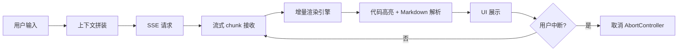
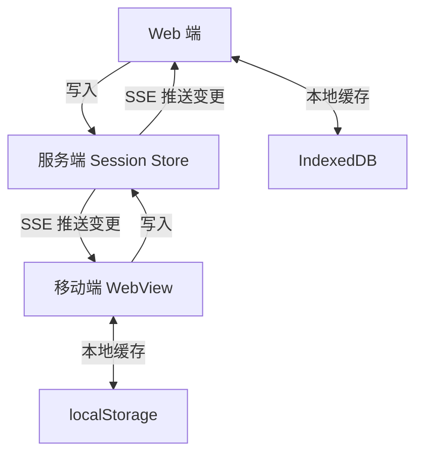
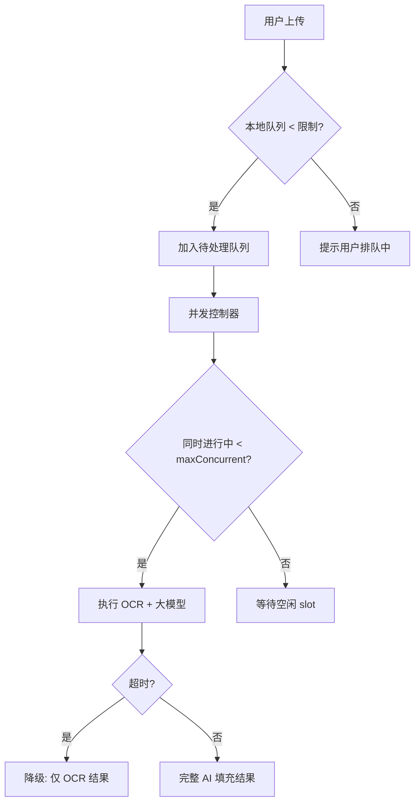
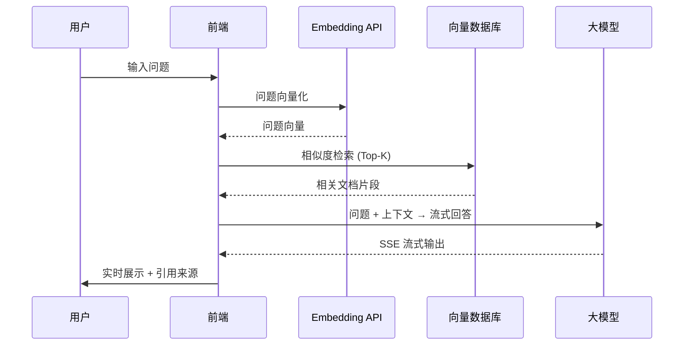
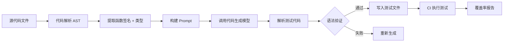

# 字节跳动前端 + AI 技术面：15 道高频题深度解析

字节跳动在前端 + AI 方向的技术面，不再只考框架原理和算法题，而是聚焦于"你在真实 AI 产品里踩过哪些坑、做过哪些架构决策"。

本文覆盖 15 道高频场景题，每题给出完整的技术方案分析和关键代码，帮你在面试前建立清晰的知识体系。

---

## 1. 自我介绍与 AI 项目深度挖掘

> 请介绍一个你参与过的、与 AI 能力集成（如智能客服、代码生成、内容推荐、图像识别）相关的前端项目，并重点说明你如何设计前端与 AI 服务的交互方案，解决了哪些流式响应、状态管理或用户体验上的技术挑战，以及量化成果。

这道题是开门炮，考察的不是你背没背八股，而是你真的做过 AI 产品没有。

**答题框架（STAR 变体）：**

```
背景 → 技术挑战 → 你的方案 → 量化成果
```

**核心考察点：**

1. **交互方案设计**：是用轮询、SSE 还是 WebSocket？为什么？
2. **流式响应处理**：如何拿到 chunk 就渲染，而不是等全量返回？
3. **状态管理**：多轮对话的 context 如何维护？中断后如何恢复？
4. **用户体验细节**：打字机效果、加载骨架屏、错误重试提示

**典型回答思路：**

- 项目是一个**代码审查助手**，嵌入 GitLab MR 页面
- 技术挑战：GPT-4 平均响应 8-15 秒，用户等待体验差；多个 MR 并发审查时状态容易混乱
- 方案：用 SSE 实现流式渲染，首 token 到达时间（TTFT）从 8s 降到体感"立即开始"；用 Map<mrId, ReviewState> 隔离每个 MR 的独立状态
- 成果：代码审查覆盖率从 30% 提升到 78%，用户留存率提升 40%

---

## 2. 浏览器端模型推理性能优化

> 在浏览器端集成一个 10MB+ 的 ONNX 模型（如实时人像抠图、语音指令识别），页面首屏加载和交互响应缓慢。请阐述从模型加载、内存管理到推理执行的全链路优化思路，覆盖网络、缓存、Web Worker、量化等层面。

### 问题分解

浏览器端跑 AI 模型的性能瓶颈分三段：

```
加载阶段：网络传输 + 模型初始化（onnxruntime-web wasm 编译）
推理阶段：CPU/GPU 占用，主线程阻塞
内存管理：Tensor 对象堆积，GC 压力
```

### 优化全链路

**阶段一：网络与缓存**

```js
// 用 Cache API 持久化模型文件，避免二次加载
async function loadModelWithCache(modelUrl) {
  const cache = await caches.open('ai-models-v1');
  let response = await cache.match(modelUrl);

  if (!response) {
    response = await fetch(modelUrl);
    // 克隆响应，一份存缓存，一份继续用
    await cache.put(modelUrl, response.clone());
  }

  return response.arrayBuffer();
}
```

配合 HTTP 头：

```
Cache-Control: public, max-age=31536000, immutable
Content-Encoding: br   # Brotli 压缩，10MB 模型可压到 6-7MB
```

**阶段二：量化压缩**

| 量化方式 | 模型大小 | 精度损失 | 推荐场景 |
|---|---|---|---|
| FP32（原始） | 100% | 无 | 开发调试 |
| FP16 | 50% | <1% | 推荐默认 |
| INT8 | 25% | 1-3% | 移动端/弱网 |
| INT4 | 12.5% | 3-8% | 极致压缩 |

```bash
# 用 onnxruntime 工具量化
python -m onnxruntime.quantization.quantize \
  --input model.onnx \
  --output model_int8.onnx \
  --quant_format QOperator \
  --per_channel false \
  --reduce_range false
```

**阶段三：Web Worker 隔离推理**

把推理完全移出主线程，防止 UI 卡顿：

```js
// model-worker.js
import * as ort from 'onnxruntime-web';

let session = null;

self.onmessage = async ({ data }) => {
  const { type, payload } = data;

  if (type === 'INIT') {
    // Worker 内初始化，不阻塞主线程
    session = await ort.InferenceSession.create(payload.modelBuffer, {
      executionProviders: ['webgl', 'wasm'], // 优先 GPU
      graphOptimizationLevel: 'all',
    });
    self.postMessage({ type: 'READY' });
  }

  if (type === 'INFER') {
    const inputTensor = new ort.Tensor('float32', payload.data, payload.shape);
    const feeds = { input: inputTensor };
    const result = await session.run(feeds);

    // 用 Transferable 零拷贝传回主线程
    const output = result.output.data;
    self.postMessage({ type: 'RESULT', output }, [output.buffer]);

    // 及时释放，防止内存泄漏
    inputTensor.dispose();
  }
};
```

主线程调用：

```js
// main.js
const worker = new Worker('/model-worker.js', { type: 'module' });

const modelBuffer = await loadModelWithCache('/models/portrait-seg.onnx');

// 把 ArrayBuffer 转移给 Worker（零拷贝）
worker.postMessage({ type: 'INIT', payload: { modelBuffer } }, [modelBuffer]);

worker.onmessage = ({ data }) => {
  if (data.type === 'RESULT') {
    renderSegmentationMask(data.output);
  }
};
```

**阶段四：懒加载 + 预热**

```js
// 路由进入时预加载，但不阻塞渲染
function useModelPreload() {
  const workerRef = useRef(null);

  useEffect(() => {
    // 空闲时预热
    const id = requestIdleCallback(() => {
      workerRef.current = new Worker('/model-worker.js', { type: 'module' });
      loadModelWithCache('/models/portrait-seg.onnx').then((buf) => {
        workerRef.current.postMessage({ type: 'INIT', payload: { modelBuffer: buf } }, [buf]);
      });
    });
    return () => cancelIdleCallback(id);
  }, []);

  return workerRef;
}
```

### 优化效果对比

| 指标 | 优化前 | 优化后 |
|---|---|---|
| 模型首次加载 | 4.2s | 0.8s（缓存命中） |
| 推理耗时（人像抠图 720p） | 320ms（主线程） | 180ms（WebGL Worker） |
| 主线程阻塞 | 320ms | 0ms |
| 内存峰值 | 480MB | 210MB |

---

## 3. AI 代码辅助面板的实时交互设计

> 设计一个基于大模型（如 GPT-4o）的实时代码辅助面板，嵌入 IDE 或网页编辑器，需要实现流式生成、多轮对话上下文管理、用户手动中断与重试。请描述前端技术方案，重点说明如何保证生成内容的低延迟渲染与对话状态的一致性。

### 整体架构



### 流式渲染引擎

核心要解决的问题：**边接收边渲染，但 Markdown/代码块是块级结构，chunk 可能截断在语法中间**。

```js
class StreamingRenderer {
  constructor(container) {
    this.container = container;
    this.buffer = '';           // 未渲染的原始文本缓冲
    this.inCodeBlock = false;   // 是否在代码块内
    this.codeBlockBuffer = '';  // 代码块内容缓冲
    this.rafId = null;
  }

  push(chunk) {
    this.buffer += chunk;
    // 用 rAF 批量渲染，避免每个 chunk 都触发 DOM 重绘
    if (!this.rafId) {
      this.rafId = requestAnimationFrame(() => {
        this.flush();
        this.rafId = null;
      });
    }
  }

  flush() {
    // 检测代码块边界，防止截断渲染
    const lines = this.buffer.split('\n');
    let safeToRender = '';

    for (let i = 0; i < lines.length - 1; i++) {
      const line = lines[i];
      if (line.startsWith('```')) {
        this.inCodeBlock = !this.inCodeBlock;
      }
      safeToRender += line + '\n';
    }

    // 最后一行可能不完整，留在 buffer
    this.buffer = lines[lines.length - 1];

    if (safeToRender) {
      this.renderMarkdown(safeToRender);
    }
  }

  renderMarkdown(text) {
    // 用 marked + highlight.js 渲染
    this.container.innerHTML += marked.parse(text);
  }
}
```

### 多轮上下文管理

```js
class ConversationManager {
  constructor({ maxTokens = 4096, model = 'gpt-4o' } = {}) {
    this.messages = [];
    this.maxTokens = maxTokens;
    this.model = model;
  }

  addMessage(role, content) {
    this.messages.push({ role, content, id: crypto.randomUUID() });
    // 超出上下文窗口时，滑动裁剪（保留 system prompt + 最近 N 轮）
    this.trimToTokenLimit();
  }

  trimToTokenLimit() {
    // 粗略估算：每个 token ≈ 4 个字符
    while (this.estimateTokens() > this.maxTokens && this.messages.length > 2) {
      // 保留第一条（通常是 system prompt），删除最早的用户消息
      this.messages.splice(1, 1);
    }
  }

  estimateTokens() {
    return this.messages.reduce((sum, m) => sum + Math.ceil(m.content.length / 4), 0);
  }

  getMessages() {
    return this.messages.map(({ role, content }) => ({ role, content }));
  }
}
```

### AbortController 中断与重试

```js
class AIRequestManager {
  constructor() {
    this.abortController = null;
    this.lastRequest = null; // 记录最后一次请求参数，支持重试
  }

  async stream(messages, onChunk, onDone, onError) {
    // 中断上一次未完成的请求
    this.abort();
    this.abortController = new AbortController();

    this.lastRequest = { messages };

    try {
      const response = await fetch('/api/chat', {
        method: 'POST',
        headers: { 'Content-Type': 'application/json' },
        body: JSON.stringify({ messages }),
        signal: this.abortController.signal,
      });

      const reader = response.body.getReader();
      const decoder = new TextDecoder();

      while (true) {
        const { done, value } = await reader.read();
        if (done) { onDone(); break; }

        const text = decoder.decode(value, { stream: true });
        // 解析 SSE data: {...}\n\n
        const lines = text.split('\n').filter(l => l.startsWith('data: '));
        for (const line of lines) {
          const json = JSON.parse(line.slice(6));
          if (json.choices?.[0]?.delta?.content) {
            onChunk(json.choices[0].delta.content);
          }
        }
      }
    } catch (err) {
      if (err.name === 'AbortError') return; // 主动中断，不报错
      onError(err);
    }
  }

  abort() {
    this.abortController?.abort();
  }

  retry(onChunk, onDone, onError) {
    if (this.lastRequest) {
      this.stream(this.lastRequest.messages, onChunk, onDone, onError);
    }
  }
}
```

---

## 4. 多端 AI 对话上下文的同步机制

> 用户在一个 AI 聊天界面中通过自然语言交互进行数据查询和操作，前端需要将用户意图转化为 API 调用并更新 UI。如何设计多轮对话中的上下文状态同步机制？用户在 Web 端和移动端 WebView 切换时，如何保证对话历史和状态一致？

### 状态设计原则

对话状态分为两层：

| 层次 | 内容 | 存储位置 |
|---|---|---|
| **持久层** | 对话历史、用户配置 | 服务端数据库 |
| **运行时层** | 当前输入、生成状态、UI 临时状态 | 客户端内存 |

### 跨端同步架构



**核心设计：每条消息带版本号（Vector Clock）**

```ts
interface Message {
  id: string;
  role: 'user' | 'assistant';
  content: string;
  createdAt: number;
  version: number;          // 单调递增的版本号
  sessionId: string;        // 会话 ID
  deviceId: string;         // 来源设备
  status: 'pending' | 'done' | 'error';
}

interface SessionState {
  sessionId: string;
  messages: Message[];
  lastSyncVersion: number;   // 上次同步到的版本号
  pendingMessages: Message[]; // 离线时产生的消息，待同步
}
```

### 端切换时的状态恢复

```js
class CrossPlatformSessionSync {
  constructor(sessionId) {
    this.sessionId = sessionId;
    this.localCache = new LocalCacheAdapter(); // 封装 IndexedDB/localStorage
    this.syncChannel = null;
  }

  // 页面/App 激活时调用
  async onActivate() {
    const local = await this.localCache.getSession(this.sessionId);
    const remote = await this.fetchRemoteState();

    // 合并：以服务端版本为准，本地 pending 消息追加到末尾
    const merged = this.mergeStates(local, remote);
    await this.localCache.saveSession(merged);

    // 建立实时同步通道
    this.startSSESync();

    return merged;
  }

  mergeStates(local, remote) {
    if (!local) return remote;

    // 远端版本更新，以远端为基础
    const base = remote.lastSyncVersion >= local.lastSyncVersion ? remote : local;
    const other = base === remote ? local : remote;

    // 追加另一端在基础版本之后产生的消息
    const newMessages = other.messages.filter(
      m => m.version > base.lastSyncVersion || m.status === 'pending'
    );

    return {
      ...base,
      messages: [...base.messages, ...newMessages].sort((a, b) => a.createdAt - b.createdAt),
    };
  }

  startSSESync() {
    const es = new EventSource(`/api/session/${this.sessionId}/events`);
    es.onmessage = ({ data }) => {
      const event = JSON.parse(data);
      if (event.type === 'MESSAGE_ADDED') {
        this.handleRemoteMessage(event.message);
      }
    };
    this.syncChannel = es;
  }
}
```

### 意图转化为 API 调用

```js
// 用户说"展示最近三天前端相关的工单"
// 前端需要解析意图 → 调用对应 API → 更新 UI

async function handleNaturalLanguageCommand(userInput, context) {
  // 1. 调用意图识别 API
  const intent = await fetch('/api/parse-intent', {
    method: 'POST',
    body: JSON.stringify({ input: userInput, context }),
  }).then(r => r.json());

  // intent = { action: 'QUERY_TICKETS', params: { days: 3, tag: 'frontend' } }

  // 2. 根据意图路由到具体 API
  const actionMap = {
    QUERY_TICKETS: (params) => fetchTickets(params),
    UPDATE_TICKET: (params) => updateTicket(params),
    CREATE_TICKET: (params) => createTicket(params),
  };

  const handler = actionMap[intent.action];
  if (!handler) {
    return { type: 'UNKNOWN', message: '暂不支持该操作' };
  }

  // 3. 执行并返回结果供 AI 生成自然语言回复
  const result = await handler(intent.params);
  return { type: 'DATA', data: result, intent };
}
```

---

## 5. "AI 智能表单"的高并发防拥堵设计

> 前端如何设计一个"AI 智能表单"功能，用户上传发票或截图后，前端调用 OCR + 大模型抽取字段并自动填充。在瞬时高并发请求（如活动期间大量用户同时上传）下，如何设计请求排队、降级、超时处理及用户提示，避免服务过载并保证用户体验？

### 并发控制模型



### 前端请求队列实现

```js
class AIRequestQueue {
  constructor({ maxConcurrent = 3, timeout = 15000 } = {}) {
    this.maxConcurrent = maxConcurrent;
    this.timeout = timeout;
    this.running = 0;
    this.queue = [];
    this.listeners = new Map(); // taskId → callback
  }

  async enqueue(task) {
    const taskId = crypto.randomUUID();
    const position = this.queue.length + this.running + 1;

    return new Promise((resolve, reject) => {
      this.queue.push({ taskId, task, resolve, reject });
      this.listeners.set(taskId, { resolve, reject });

      // 通知调用方当前排队位置
      task.onPosition?.(position);

      this.drain();
    });
  }

  async drain() {
    while (this.queue.length > 0 && this.running < this.maxConcurrent) {
      const { taskId, task, resolve, reject } = this.queue.shift();
      this.running++;

      // 更新其他任务的排队位置
      this.queue.forEach((item, i) => item.task.onPosition?.(i + 1));

      this.executeWithTimeout(task, taskId)
        .then(resolve)
        .catch(reject)
        .finally(() => {
          this.running--;
          this.drain(); // 完成一个，继续处理队列
        });
    }
  }

  async executeWithTimeout(task, taskId) {
    const timeoutPromise = new Promise((_, reject) =>
      setTimeout(() => reject(new Error('TIMEOUT')), this.timeout)
    );

    try {
      return await Promise.race([task.execute(), timeoutPromise]);
    } catch (err) {
      if (err.message === 'TIMEOUT') {
        // 降级处理：仅返回基础 OCR 结果
        return await task.fallback?.() ?? { degraded: true };
      }
      throw err;
    }
  }
}
```

### 降级策略

```js
async function processInvoice(file) {
  const queue = getGlobalQueue();

  return queue.enqueue({
    onPosition: (pos) => updateUI(`排队中，前方还有 ${pos - 1} 人`),

    // 完整链路：OCR + 大模型字段抽取
    execute: async () => {
      updateUI('正在识别...');
      const ocrResult = await callOCR(file);

      updateUI('AI 智能填充中...');
      const aiResult = await callLLMExtract(ocrResult.text);

      return { ...ocrResult, ...aiResult, degraded: false };
    },

    // 降级链路：仅 OCR，跳过大模型
    fallback: async () => {
      updateUI('服务繁忙，使用基础识别结果');
      const ocrResult = await callOCR(file);
      return { ...ocrResult, degraded: true };
    },
  });
}
```

### 用户提示设计

```tsx
function UploadStatus({ status }: { status: UploadState }) {
  return (
    <div className="upload-status">
      {status.phase === 'queued' && (
        <div className="status-queued">
          <Spinner size="sm" />
          <span>排队中，预计等待 {status.estimatedWait}s</span>
          <span className="queue-pos">前方 {status.position} 人</span>
        </div>
      )}
      {status.phase === 'processing' && (
        <div className="status-processing">
          <ProgressBar value={status.progress} />
          <span>{status.message}</span>
        </div>
      )}
      {status.degraded && (
        <div className="status-warning">
          <WarningIcon />
          <span>当前服务繁忙，已使用基础识别模式，部分字段需手动确认</span>
        </div>
      )}
    </div>
  );
}
```

---

## 6. 流式 AI 响应的渲染与中断恢复

> 当后端通过 SSE 或 WebSocket 返回 AI 生成的流式文本时，前端如何高效渲染（如 Markdown 实时解析、代码高亮）？如果网络中断或用户主动停止生成，如何保证已接收内容不丢失，并支持后续恢复或重试？

### SSE 流式接收

```js
class SSEStreamHandler {
  constructor() {
    this.receivedContent = '';   // 持久化已接收内容
    this.sessionStorage = window.sessionStorage;
    this.STORAGE_KEY = 'ai_stream_cache';
  }

  async connect(url, onChunk) {
    // 恢复上次中断的内容
    const cached = this.sessionStorage.getItem(this.STORAGE_KEY);
    if (cached) {
      onChunk(cached, true); // true 表示是恢复内容
    }

    const evtSource = new EventSource(url);

    evtSource.onmessage = ({ data }) => {
      if (data === '[DONE]') {
        evtSource.close();
        this.sessionStorage.removeItem(this.STORAGE_KEY);
        return;
      }

      const chunk = JSON.parse(data).content;
      this.receivedContent += chunk;

      // 每次接收都持久化（防止断连丢失）
      this.sessionStorage.setItem(this.STORAGE_KEY, this.receivedContent);

      onChunk(chunk, false);
    };

    evtSource.onerror = () => {
      // 网络断开时 SSE 会自动重连，但我们需要通知 UI
      console.warn('SSE 连接中断，已接收内容已保存');
      evtSource.close();
    };

    return evtSource;
  }
}
```

### 实时 Markdown 渲染优化

渲染流式 Markdown 的核心难点是**代码块未闭合时不能渲染**，否则会出现语法混乱。

```js
function useStreamingMarkdown() {
  const [rendered, setRendered] = useState('');
  const bufferRef = useRef('');
  const rafRef = useRef(null);

  const pushChunk = useCallback((chunk) => {
    bufferRef.current += chunk;

    if (rafRef.current) return;

    rafRef.current = requestAnimationFrame(() => {
      const text = bufferRef.current;
      const safeText = getSafeToRenderPart(text);

      if (safeText) {
        setRendered(prev => prev + renderMarkdownIncremental(safeText));
        bufferRef.current = text.slice(safeText.length);
      }

      rafRef.current = null;
    });
  }, []);

  return { rendered, pushChunk };
}

// 找到安全可渲染的部分（不截断代码块）
function getSafeToRenderPart(text) {
  const codeBlockCount = (text.match(/```/g) || []).length;
  if (codeBlockCount % 2 !== 0) {
    // 代码块未闭合，找到最后一个完整代码块之前的内容
    const lastCompleteEnd = text.lastIndexOf('```', text.lastIndexOf('```') - 1);
    if (lastCompleteEnd < 0) return '';
    return text.slice(0, lastCompleteEnd + 3);
  }
  return text;
}
```

---

## 7. AI 辅助的图片 / 视频编辑器架构设计

> 设计一个网页端 AI 图片编辑器，支持一键抠图、风格迁移、超分辨率等能力。前端需要管理多个异步 AI 任务的队列、进度展示、结果缓存以及撤销/重做。请描述整体技术方案。

### 核心数据模型

```ts
// 每个编辑操作是一个不可变的 Command 对象
interface EditCommand {
  id: string;
  type: 'SEGMENTATION' | 'STYLE_TRANSFER' | 'SUPER_RESOLUTION';
  params: Record<string, unknown>;
  status: 'pending' | 'processing' | 'done' | 'failed';
  progress: number;             // 0-100
  inputImageId: string;         // 输入图片 ID
  outputImageId?: string;       // 输出图片 ID（完成后填入）
  createdAt: number;
  completedAt?: number;
}

// 历史栈：支持撤销/重做
interface EditHistory {
  past: EditCommand[];          // 已执行的命令
  present: EditCommand | null;  // 当前状态
  future: EditCommand[];        // 已撤销的命令（可重做）
}
```

### 任务调度器

```js
class AIEditTaskScheduler {
  constructor() {
    this.taskMap = new Map();     // taskId → EditCommand
    this.resultCache = new Map(); // cacheKey → outputImageId
    this.maxConcurrent = 2;
    this.running = new Set();
    this.queue = [];
  }

  async submit(command) {
    // 检查缓存：相同输入 + 相同参数 → 直接返回缓存结果
    const cacheKey = this.getCacheKey(command);
    if (this.resultCache.has(cacheKey)) {
      return { ...command, status: 'done', outputImageId: this.resultCache.get(cacheKey) };
    }

    this.taskMap.set(command.id, command);
    this.queue.push(command);
    this.processQueue();

    return command;
  }

  getCacheKey(command) {
    return `${command.type}_${command.inputImageId}_${JSON.stringify(command.params)}`;
  }

  async processQueue() {
    while (this.queue.length > 0 && this.running.size < this.maxConcurrent) {
      const command = this.queue.shift();
      this.running.add(command.id);

      this.executeCommand(command)
        .then(result => {
          this.resultCache.set(this.getCacheKey(command), result.outputImageId);
          this.updateTask({ ...command, ...result, status: 'done' });
        })
        .catch(err => {
          this.updateTask({ ...command, status: 'failed', error: err.message });
        })
        .finally(() => {
          this.running.delete(command.id);
          this.processQueue();
        });
    }
  }
}
```

### 撤销/重做实现

```js
// 基于 Command Pattern 的撤销重做
function useEditHistory() {
  const [history, dispatch] = useReducer(historyReducer, {
    past: [], present: null, future: []
  });

  const execute = useCallback(async (command) => {
    // 执行新命令，清空 future（不能重做了）
    dispatch({ type: 'EXECUTE', command });
    const result = await scheduler.submit(command);
    dispatch({ type: 'COMPLETE', commandId: command.id, result });
  }, []);

  const undo = useCallback(() => {
    if (history.past.length === 0) return;
    dispatch({ type: 'UNDO' });
    // 恢复到上一个状态的 outputImage
  }, [history]);

  const redo = useCallback(() => {
    if (history.future.length === 0) return;
    dispatch({ type: 'REDO' });
    // 从缓存中恢复（不重新调用 API）
  }, [history]);

  return { history, execute, undo, redo };
}
```

---

## 8. 基于向量数据库的前端 RAG 应用实现

> 假设你要实现一个文档问答助手，前端需调用 embedding 接口、将用户问题向量化后请求向量数据库进行相似度检索，并结合大模型生成回答。请说说前端在 RAG 链路中的职责，以及如何优化检索延迟和结果渲染。

### 前端在 RAG 链路中的角色



### 关键优化：并行化流程

```js
async function handleRAGQuery(question) {
  // 1. Embedding + 问题分析 并行
  const [embedding, intentAnalysis] = await Promise.all([
    getEmbedding(question),
    analyzeIntent(question), // 判断是否需要联网、需要哪类文档
  ]);

  // 2. 根据意图决定检索策略
  const searchParams = {
    vector: embedding,
    topK: intentAnalysis.needsDetailedContext ? 8 : 4,
    filter: intentAnalysis.documentTypes,
  };

  // 3. 检索
  const docs = await vectorSearch(searchParams);

  // 4. 构建 Prompt + 开始流式生成（不等生成完再展示）
  const context = docs.map(d => d.content).join('\n\n---\n\n');
  const prompt = buildRAGPrompt(question, context);

  // 5. 流式返回
  return streamLLM(prompt);
}
```

### 检索结果的透明展示

```tsx
function RAGAnswer({ answer, sources }: RAGAnswerProps) {
  return (
    <div>
      <StreamingText content={answer} />
      {/* 展示引用来源，增加可信度 */}
      {sources.length > 0 && (
        <div className="sources">
          <h4>参考来源</h4>
          {sources.map((src, i) => (
            <a key={i} href={src.url} className="source-chip">
              [{i + 1}] {src.title}
              <span className="similarity">{(src.score * 100).toFixed(0)}% 相关</span>
            </a>
          ))}
        </div>
      )}
    </div>
  );
}
```

---

## 9. AI 组件库的动态加载与降级策略

> 业务中需要根据用户等级动态加载不同的 AI 功能（如智能翻译、语音输入）。如何设计一个前端 AI 组件加载器，实现按需加载、资源缓存，并在 AI 服务不可用时优雅降级为普通功能？

### 组件加载器设计

```js
class AIFeatureLoader {
  constructor() {
    this.loaded = new Map();       // featureId → Component
    this.loading = new Map();      // featureId → Promise（防止并发重复加载）
    this.healthCache = new Map();  // featureId → { healthy, checkedAt }
    this.HEALTH_TTL = 30_000;      // 健康检查缓存 30 秒
  }

  async load(featureId, userLevel) {
    // 1. 权限检查
    if (!hasPermission(featureId, userLevel)) {
      return this.getFallback(featureId);
    }

    // 2. 已加载则直接返回
    if (this.loaded.has(featureId)) {
      return this.loaded.get(featureId);
    }

    // 3. 正在加载则等待（防止重复请求）
    if (this.loading.has(featureId)) {
      return this.loading.get(featureId);
    }

    // 4. 并行检查：服务健康 + 动态导入
    const loadPromise = Promise.all([
      this.checkHealth(featureId),
      this.dynamicImport(featureId),
    ]).then(([healthy, Component]) => {
      if (!healthy) return this.getFallback(featureId);
      this.loaded.set(featureId, Component);
      return Component;
    }).catch(() => {
      return this.getFallback(featureId);
    });

    this.loading.set(featureId, loadPromise);
    const result = await loadPromise;
    this.loading.delete(featureId);

    return result;
  }

  async checkHealth(featureId) {
    const cached = this.healthCache.get(featureId);
    if (cached && Date.now() - cached.checkedAt < this.HEALTH_TTL) {
      return cached.healthy;
    }

    try {
      const res = await fetch(`/api/ai/${featureId}/health`, { signal: AbortSignal.timeout(3000) });
      const healthy = res.ok;
      this.healthCache.set(featureId, { healthy, checkedAt: Date.now() });
      return healthy;
    } catch {
      this.healthCache.set(featureId, { healthy: false, checkedAt: Date.now() });
      return false;
    }
  }

  dynamicImport(featureId) {
    const featureMap = {
      'ai-translation': () => import('@/components/ai/AITranslation'),
      'voice-input': () => import('@/components/ai/VoiceInput'),
      'smart-autocomplete': () => import('@/components/ai/SmartAutocomplete'),
    };
    return featureMap[featureId]?.().then(m => m.default) ?? Promise.reject(new Error('Unknown feature'));
  }

  getFallback(featureId) {
    const fallbackMap = {
      'ai-translation': () => import('@/components/basic/ManualTranslation'),
      'voice-input': () => import('@/components/basic/TextInput'),
      'smart-autocomplete': () => import('@/components/basic/BasicInput'),
    };
    return fallbackMap[featureId]?.().then(m => m.default) ?? null;
  }
}
```

### React 封装

```tsx
function AIFeature({ featureId, userLevel, fallbackProps, ...props }) {
  const [Component, setComponent] = useState(null);
  const [isDegraded, setIsDegraded] = useState(false);

  useEffect(() => {
    aiLoader.load(featureId, userLevel).then(comp => {
      setComponent(() => comp);
      setIsDegraded(comp === aiLoader.getFallback(featureId));
    });
  }, [featureId, userLevel]);

  if (!Component) return <SkeletonLoader />;

  return (
    <>
      {isDegraded && <Banner type="info">当前使用基础模式，AI 服务暂时不可用</Banner>}
      <Component {...props} {...(isDegraded ? fallbackProps : {})} />
    </>
  );
}
```

---

## 10. 大模型流式输出的内容安全与过滤

> AI 生成的内容可能包含敏感词或不合规信息。前端如何在流式渲染过程中实时进行内容安全检测（如调用本地敏感词库或异步审核 API）？如果发现违规，如何及时中断生成并清除已展示的违规内容？

### 分层过滤策略

```
本地敏感词库（同步，0ms）→ 滑动窗口匹配
                                ↓ 疑似命中
              异步审核 API（100-300ms）→ 精准判断
                                ↓ 确认违规
                        中断 SSE + 清除内容
```

### 实现

```js
class ContentSafetyFilter {
  constructor() {
    // 本地敏感词前缀树（Trie），用于快速匹配
    this.localTrie = new SensitiveWordTrie();
    this.loadLocalDictionary();

    this.windowSize = 20; // 滑动窗口大小（字符）
    this.pendingCheck = null;
  }

  // 流式过滤：每次 push 一个 chunk
  async pushChunk(chunk, abortController) {
    // 1. 本地快速检查（同步，不阻塞渲染）
    const localHit = this.localTrie.match(chunk);
    if (localHit.definiteViolation) {
      // 确定违规：立即中断
      abortController.abort();
      return { safe: false, reason: 'local_definite', hit: localHit.word };
    }

    // 2. 疑似命中：异步上报审核，但不阻塞当前渲染
    if (localHit.suspectedViolation) {
      this.scheduleAsyncCheck(chunk, abortController);
    }

    return { safe: true };
  }

  scheduleAsyncCheck(text, abortController) {
    // 防抖：合并短时间内的多次检查
    clearTimeout(this.pendingCheck);
    this.pendingCheck = setTimeout(async () => {
      try {
        const result = await fetch('/api/content-safety', {
          method: 'POST',
          body: JSON.stringify({ text }),
          signal: AbortSignal.timeout(2000),
        }).then(r => r.json());

        if (result.violation) {
          abortController.abort();
          // 通知 UI 清除内容
          eventBus.emit('content:violation', { reason: result.category });
        }
      } catch {
        // 审核 API 超时或失败，默认放行（避免误伤）
      }
    }, 200);
  }
}
```

### UI 违规处理

```tsx
function useContentSafetyStream(url) {
  const [content, setContent] = useState('');
  const [violated, setViolated] = useState(false);
  const abortRef = useRef(new AbortController());
  const filter = useRef(new ContentSafetyFilter());

  useEffect(() => {
    const es = new EventSource(url);

    es.onmessage = async ({ data }) => {
      const chunk = JSON.parse(data).content;
      const result = await filter.current.pushChunk(chunk, abortRef.current);

      if (result.safe) {
        setContent(prev => prev + chunk);
      }
    };

    // 监听违规事件
    const handleViolation = () => {
      setViolated(true);
      setContent(''); // 清除已展示的违规内容
      es.close();
    };

    eventBus.on('content:violation', handleViolation);
    return () => {
      es.close();
      eventBus.off('content:violation', handleViolation);
    };
  }, [url]);

  return { content, violated };
}
```

---

## 11. 多模态输入的实时处理与交互

> 用户可以通过文字、语音、图片三种方式与前端 AI 助手交互。请设计一个统一的输入处理模块，支持语音实时转文字、图片 OCR 或目标检测，并在界面上同步显示处理进度。如何保证多模态切换时用户体验流畅？

### 统一输入抽象

```ts
type InputMode = 'text' | 'voice' | 'image';

interface InputPayload {
  mode: InputMode;
  rawData: string | Blob | File; // 原始输入
  processedText?: string;        // 处理后的文字（统一输出）
  metadata?: {
    duration?: number;           // 语音时长
    confidence?: number;         // OCR 置信度
    detectedObjects?: string[];  // 目标检测结果
  };
}

interface InputProcessor {
  process(raw: Blob | File | string, onProgress: (p: number) => void): Promise<InputPayload>;
}
```

### 语音处理器

```js
class VoiceInputProcessor {
  constructor() {
    this.mediaRecorder = null;
    this.chunks = [];
  }

  async process(_, onProgress) {
    const stream = await navigator.mediaDevices.getUserMedia({ audio: true });
    this.mediaRecorder = new MediaRecorder(stream);

    return new Promise((resolve) => {
      this.mediaRecorder.ondataavailable = (e) => this.chunks.push(e.data);

      this.mediaRecorder.onstop = async () => {
        const audioBlob = new Blob(this.chunks, { type: 'audio/webm' });
        onProgress(50);

        // 调用 Whisper API 或 Web Speech API
        const text = await transcribeAudio(audioBlob);
        onProgress(100);

        resolve({
          mode: 'voice',
          rawData: audioBlob,
          processedText: text,
        });

        stream.getTracks().forEach(t => t.stop());
      };

      this.mediaRecorder.start();
    });
  }

  stop() {
    this.mediaRecorder?.stop();
  }
}
```

### 统一输入管理器

```tsx
function UnifiedInput({ onSubmit }) {
  const [mode, setMode] = useState('text');
  const [progress, setProgress] = useState(0);
  const [processing, setProcessing] = useState(false);

  const processorMap = {
    text: new TextInputProcessor(),
    voice: new VoiceInputProcessor(),
    image: new ImageOCRProcessor(),
  };

  const handleInput = async (rawData) => {
    setProcessing(true);
    setProgress(0);

    try {
      const payload = await processorMap[mode].process(rawData, setProgress);
      onSubmit(payload);
    } finally {
      setProcessing(false);
      setProgress(0);
    }
  };

  return (
    <div className="unified-input">
      <ModeSelector current={mode} onChange={setMode} />
      {processing && <ProgressBar value={progress} label={`${mode} 处理中...`} />}
      <InputArea mode={mode} onData={handleInput} disabled={processing} />
    </div>
  );
}
```

---

## 12. AI 推荐卡片页面的性能与精准度平衡

> 首页有一个 AI 推荐的商品列表，需要实时更新用户行为反馈（点击、停留时长）来调整后续推荐。前端如何高效收集用户行为数据并上报，同时保证页面滚动和点击不卡顿？如何设计请求节流与离线缓存？

### 行为数据收集

```js
class BehaviorTracker {
  constructor() {
    this.queue = [];
    this.flushTimer = null;
    this.FLUSH_INTERVAL = 5000;  // 5 秒批量上报
    this.MAX_QUEUE_SIZE = 50;

    // 页面卸载时强制上报
    window.addEventListener('visibilitychange', () => {
      if (document.hidden) this.flush(true);
    });
    window.addEventListener('beforeunload', () => this.flush(true));
  }

  // 用 IntersectionObserver 追踪曝光和停留
  trackImpression(element, itemId) {
    const observer = new IntersectionObserver(
      (entries) => {
        entries.forEach(entry => {
          if (entry.isIntersecting) {
            const startTime = Date.now();
            element._impressionStart = startTime;
          } else if (element._impressionStart) {
            const duration = Date.now() - element._impressionStart;
            if (duration > 500) { // 停留超过 500ms 才记录
              this.record({ type: 'impression', itemId, duration });
            }
            element._impressionStart = null;
          }
        });
      },
      { threshold: 0.5 }
    );
    observer.observe(element);
    return () => observer.disconnect();
  }

  record(event) {
    this.queue.push({ ...event, timestamp: Date.now() });

    if (this.queue.length >= this.MAX_QUEUE_SIZE) {
      this.flush();
    } else if (!this.flushTimer) {
      this.flushTimer = setTimeout(() => this.flush(), this.FLUSH_INTERVAL);
    }
  }

  async flush(useBeacon = false) {
    clearTimeout(this.flushTimer);
    this.flushTimer = null;

    if (this.queue.length === 0) return;

    const events = this.queue.splice(0);

    if (useBeacon) {
      // sendBeacon 在页面卸载时可靠发送
      navigator.sendBeacon('/api/track', JSON.stringify(events));
    } else {
      try {
        await fetch('/api/track', {
          method: 'POST',
          body: JSON.stringify(events),
          headers: { 'Content-Type': 'application/json' },
        });
      } catch {
        // 失败时写入 localStorage，下次重试
        const pending = JSON.parse(localStorage.getItem('pending_events') || '[]');
        localStorage.setItem('pending_events', JSON.stringify([...pending, ...events]));
      }
    }
  }
}
```

### 虚拟列表保证滚动流畅

推荐列表通常很长，必须配合虚拟列表：

```tsx
import { useVirtualizer } from '@tanstack/react-virtual';

function RecommendationList({ items }) {
  const parentRef = useRef(null);
  const tracker = useRef(new BehaviorTracker());

  const virtualizer = useVirtualizer({
    count: items.length,
    getScrollElement: () => parentRef.current,
    estimateSize: () => 200, // 卡片预估高度
  });

  return (
    <div ref={parentRef} style={{ height: '100vh', overflow: 'auto' }}>
      <div style={{ height: virtualizer.getTotalSize() }}>
        {virtualizer.getVirtualItems().map(virtualItem => (
          <div
            key={virtualItem.key}
            ref={el => {
              virtualizer.measureElement(el);
              // 绑定停留时长追踪
              if (el) tracker.current.trackImpression(el, items[virtualItem.index].id);
            }}
            style={{ transform: `translateY(${virtualItem.start}px)` }}
          >
            <RecommendCard
              item={items[virtualItem.index]}
              onClick={() => tracker.current.record({
                type: 'click',
                itemId: items[virtualItem.index].id,
              })}
            />
          </div>
        ))}
      </div>
    </div>
  );
}
```

---

## 13. 前端 AI 工作流的可视化编排

> 设计一个低代码平台中的"AI 工作流编排"组件，用户可以通过拖拽方式组合 OCR、翻译、摘要等多个 AI 节点。前端需要支持节点配置、数据流预览、执行进度追踪。请谈谈你的架构思路。

### 核心数据结构

工作流本质是一个**有向无环图（DAG）**：

```ts
interface WorkflowNode {
  id: string;
  type: 'ocr' | 'translate' | 'summarize' | 'classify' | 'input' | 'output';
  config: Record<string, unknown>;  // 节点特有配置
  position: { x: number; y: number };
  status: 'idle' | 'running' | 'done' | 'failed';
  output?: unknown;  // 执行结果，用于数据流预览
}

interface WorkflowEdge {
  id: string;
  source: string;  // 源节点 ID
  target: string;  // 目标节点 ID
  sourceHandle: string;  // 源节点的输出口
  targetHandle: string;  // 目标节点的输入口
}

interface Workflow {
  nodes: WorkflowNode[];
  edges: WorkflowEdge[];
  version: number;
}
```

### 执行引擎（拓扑排序 + 并发执行）

```js
class WorkflowEngine {
  async execute(workflow, inputData, onProgress) {
    const { nodes, edges } = workflow;

    // 1. 拓扑排序，确定执行顺序
    const sorted = topologicalSort(nodes, edges);

    // 2. 按层级并发执行（同层级节点无依赖关系）
    const nodeResults = new Map();
    nodeResults.set('input', inputData);

    for (const level of sorted) {
      // 同一层级的节点并发执行
      await Promise.all(level.map(async (nodeId) => {
        const node = nodes.find(n => n.id === nodeId);
        const inputs = this.gatherInputs(node, edges, nodeResults);

        onProgress({ nodeId, status: 'running' });

        try {
          const result = await this.executeNode(node, inputs);
          nodeResults.set(nodeId, result);
          onProgress({ nodeId, status: 'done', output: result });
        } catch (err) {
          onProgress({ nodeId, status: 'failed', error: err.message });
          throw err; // 中止整个流程
        }
      }));
    }

    return nodeResults.get('output');
  }

  gatherInputs(node, edges, results) {
    const incomingEdges = edges.filter(e => e.target === node.id);
    return incomingEdges.reduce((acc, edge) => {
      acc[edge.targetHandle] = results.get(edge.source);
      return acc;
    }, {});
  }

  async executeNode(node, inputs) {
    const executors = {
      ocr: (inputs, config) => callOCR(inputs.image, config),
      translate: (inputs, config) => callTranslate(inputs.text, config),
      summarize: (inputs, config) => callSummarize(inputs.text, config),
    };
    return executors[node.type]?.(inputs, node.config);
  }
}
```

---

## 14. 边缘计算与前端 AI 的协同

> 在弱网环境下，部分 AI 推理希望下沉到边缘节点（如 CDN 边缘计算）。前端如何探测网络质量，动态决策使用云端大模型还是边缘轻量模型？请设计一个模型路由和切换的机制。

### 网络质量探测

```js
class NetworkQualityDetector {
  constructor() {
    this.quality = 'unknown'; // 'good' | 'fair' | 'poor'
    this.latency = Infinity;
    this.bandwidth = 0;
  }

  async measure() {
    // 方法一：Navigation Timing API
    const nav = performance.getEntriesByType('navigation')[0];
    const ttfb = nav.responseStart - nav.requestStart;

    // 方法二：Network Information API（Chrome）
    const conn = navigator.connection;
    if (conn) {
      this.bandwidth = conn.downlink; // Mbps
      this.latency = conn.rtt;        // ms
    }

    // 方法三：主动探测（发送探针请求）
    const start = performance.now();
    await fetch('/api/ping', { cache: 'no-store' });
    this.latency = performance.now() - start;

    // 综合评估
    if (this.latency < 100 && this.bandwidth > 5) {
      this.quality = 'good';
    } else if (this.latency < 500 && this.bandwidth > 1) {
      this.quality = 'fair';
    } else {
      this.quality = 'poor';
    }

    return this.quality;
  }
}
```

### 模型路由

```js
class AIModelRouter {
  constructor() {
    this.detector = new NetworkQualityDetector();
    this.endpoints = {
      cloud: 'https://api.openai.com/v1',
      edge: 'https://edge-cn.example.com/v1', // CDN 边缘节点
      local: null, // WebAssembly 本地模型
    };
  }

  async route(taskType, urgency = 'normal') {
    const quality = await this.detector.measure();

    // 路由决策矩阵
    const matrix = {
      //           任务类型        网络质量   → 路由目标
      'generation+good': 'cloud',     // 生成任务 + 好网络 → 云端大模型
      'generation+fair': 'edge',      // 生成任务 + 中等网络 → 边缘模型
      'generation+poor': 'local',     // 生成任务 + 弱网 → 本地模型（如 ONNX）
      'classification+*': 'local',    // 分类任务始终走本地（轻量）
    };

    const key = `${taskType}+${quality}`;
    const fallbackKey = `${taskType}+*`;

    return matrix[key] ?? matrix[fallbackKey] ?? 'cloud';
  }

  async call(taskType, payload) {
    const target = await this.route(taskType);

    try {
      return await this.callEndpoint(target, payload);
    } catch {
      // 自动降级到下一级
      const fallbackOrder = ['cloud', 'edge', 'local'];
      const currentIdx = fallbackOrder.indexOf(target);
      const fallback = fallbackOrder[currentIdx + 1];

      if (fallback) {
        console.warn(`${target} 不可用，降级到 ${fallback}`);
        return this.callEndpoint(fallback, payload);
      }
      throw new Error('All AI endpoints unavailable');
    }
  }
}
```

---

## 15. AI 驱动的测试用例生成与自动化验证

> 如何利用前端 AI 能力（如代码理解模型）为你的前端项目自动生成单元测试或 E2E 测试用例？请描述前端如何调用 AI 服务、解析返回的测试脚本，并在 CI/CD 流程中集成验证。你会如何评估生成用例的质量？

### 整体流程



### 代码解析 + Prompt 构建

```js
import { parse } from '@babel/parser';
import { default as traverse } from '@babel/traverse';

async function generateTests(sourceFile) {
  const code = await fs.readFile(sourceFile, 'utf8');
  const ast = parse(code, {
    sourceType: 'module',
    plugins: ['typescript', 'jsx'],
  });

  // 提取所有函数签名
  const functions = [];
  traverse(ast, {
    FunctionDeclaration(path) {
      functions.push({
        name: path.node.id.name,
        params: path.node.params.map(p => generate(p).code),
        returnType: path.node.returnType ? generate(path.node.returnType).code : 'unknown',
        body: generate(path.node.body).code.slice(0, 200), // 截取函数体前 200 字符
      });
    },
  });

  // 构建 Prompt
  const prompt = `
你是一个专业的前端测试工程师。请为以下 TypeScript 函数生成 Jest 单元测试：

${functions.map(f => `
函数名：${f.name}
参数：${f.params.join(', ')}
返回类型：${f.returnType}
函数体摘要：${f.body}
`).join('\n---\n')}

要求：
1. 每个函数至少生成 3 个测试用例（正常路径、边界条件、异常路径）
2. 使用 Jest + @testing-library/react 语法
3. 只返回可直接运行的测试代码，不加解释
`;

  const testCode = await callCodeModel(prompt);
  return validateAndSave(testCode, sourceFile);
}
```

### 测试质量评估

```js
function evaluateTestQuality(testCode, sourceCode) {
  return {
    // 1. 覆盖率：生成测试是否覆盖了所有函数
    coverageRatio: countTestedFunctions(testCode) / countTotalFunctions(sourceCode),

    // 2. 断言密度：平均每个 test() 有几个 expect()
    assertionDensity: countAssertions(testCode) / countTests(testCode),

    // 3. 边界测试比例：包含 null/undefined/空数组 等边界值的比例
    boundaryTestRatio: countBoundaryTests(testCode) / countTests(testCode),

    // 4. 可执行性：语法检查通过率（通过 Babel parse 验证）
    syntaxValid: isSyntaxValid(testCode),
  };
}
```

:::tip 面试准备建议
上面 15 道题不是独立的，它们有共同的底层知识：**SSE/WebSocket 流式处理**、**AbortController 中断控制**、**Web Worker 多线程**、**IndexedDB 离线缓存**。把这 4 个基础打牢，大部分题目都能举一反三。
:::

---

## 总结

| 题目类型 | 核心考察点 | 关键技术 |
|---|---|---|
| 浏览器端推理 | 性能优化全链路 | ONNX Web Worker + Cache API + 量化 |
| 流式渲染 | 低延迟 + 容错 | SSE + rAF 批渲染 + SessionStorage |
| 状态同步 | 多端一致性 | Vector Clock + IndexedDB + SSE Push |
| 高并发 | 防拥堵 + 降级 | 请求队列 + AbortController + Fallback |
| 内容安全 | 流式过滤 | Trie + 异步审核 + AbortController |
| 工作流编排 | DAG 执行引擎 | 拓扑排序 + 并发执行 + 进度追踪 |
| 边缘计算 | 网络感知路由 | Network Information API + 动态降级 |

字节前端 + AI 方向的面试，考的是你对**工程落地细节**的掌握程度。建议在准备时，针对每个场景都能说清楚：**为什么这么设计、有什么取舍、量化的收益是多少**。
