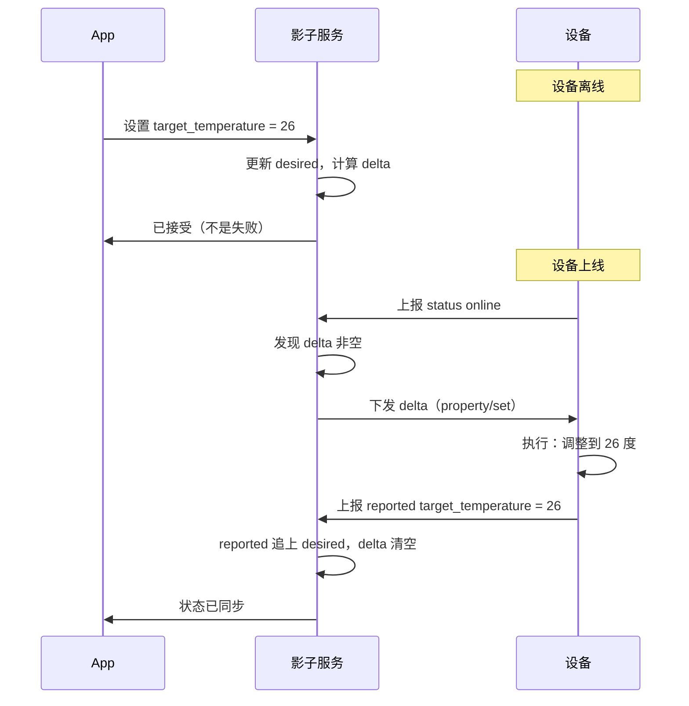

# 设备影子与在线状态：抖动抑制与期望状态同步

这一篇处理两个看起来很简单、实际上是 IoT 平台最容易做错的问题：

**"这台设备在线吗？"** —— 听起来查一下连接状态就行，实际上任何单一信号都不可靠，而且一万台设备的状态抖动能把告警系统淹没。

**"App 想改设备设置，但设备离线了怎么办？"** —— 直接返回"设备离线，操作失败"是最省事的做法，但用户体验很差。设备影子就是解决这个的。

:::tip 系列阅读顺序
本文是 [云端 IoT 平台路线图](/posts/iot/cloud-iot-roadmap) 的第六篇。第一篇 [MQTT 基础](/posts/iot/mqtt-mqttnet-basics) 里讲的 LWT 和心跳是本文的前提，第三篇 [物模型](/posts/iot/thing-model) 的属性定义是影子的数据基础。
:::

## 在线状态：不存在单一可靠信号

先明确一件事：**"在线"这个词本身就有歧义。**

| 说法 | 含义 | 够用吗 |
|---|---|---|
| TCP 连接存在 | 网络层连着 | 不够，设备程序可能已卡死 |
| MQTT 会话存在 | 协议层连着 | 不够，同上 |
| 最近有心跳 | 设备的 MQTT 栈在工作 | 较好 |
| **最近有业务数据上报** | **设备的应用逻辑在工作** | **最可信** |

一个真实场景：设备的 MQTT 库在独立线程里跑，主业务线程死锁了。**心跳正常、连接正常，但它已经不上报数据了。** 只看连接状态的系统会显示"在线"，而它实际上已经不工作了。

所以在线判定要**组合多个信号**：

| 信号 | 来源 | 特点 |
|---|---|---|
| **连接/断开事件** | Broker 推送（EMQX 的 `$SYS` Topic 或 webhook） | 最及时，但 Broker 重启时会丢 |
| **设备主动上下线消息** | 设备发布到 `status` Topic | 语义明确，但正常断开才有 |
| **LWT 遗嘱** | Broker 代发 | 异常断开的兜底，**有 1.5 倍心跳的延迟** |
| **最后活跃时间** | 收到任何消息就更新 | 最可信，但需要定时扫描才能发现超时 |

## 在线判定的实现

订阅 Broker 的系统事件拿到最及时的信号：

```csharp
// EMQX 的系统 Topic。不同 Broker 的路径不同，
// 也可以改用 Broker 的 webhook 回调你的 HTTP 端点。
private static readonly string[] SystemTopics =
[
    "$SYS/brokers/+/clients/+/connected",
    "$SYS/brokers/+/clients/+/disconnected",
];
```

三个信号汇总成一个判定服务：

```csharp
public sealed class DevicePresenceService
{
    private readonly IDevicePresenceStore _store;
    private readonly OfflineDebouncer _debouncer;
    private readonly ILogger<DevicePresenceService> _logger;

    /// <summary>
    /// 任何来自设备的消息都调用这个方法。
    /// 这是最可信的在线证据——设备的应用逻辑确实在工作。
    /// </summary>
    public async Task TouchAsync(long deviceId, CancellationToken ct)
    {
        // 高频调用（每条消息一次），必须走缓存而不是每次写库。
        // 持久化由后台定时批量刷入。
        await _store.UpdateLastSeenAsync(deviceId, DateTimeOffset.UtcNow, ct);

        // 从离线变在线是"好消息"，可以立即生效，不需要去抖
        if (await _store.GetStateAsync(deviceId, ct) != PresenceState.Online)
        {
            await TransitionOnlineAsync(deviceId, ct);
        }
    }

    /// <summary>Broker 报告断开，或收到 LWT。</summary>
    public async Task OnDisconnectSignalAsync(
        long deviceId, DisconnectSource source, CancellationToken ct)
    {
        _logger.LogDebug("收到断开信号 {Device} 来自 {Source}", deviceId, source);

        // 离线是"坏消息"，必须去抖后再确认——
        // 弱网设备的瞬时重连非常常见，立即标记离线会造成大量误报
        await _debouncer.ScheduleOfflineCheckAsync(deviceId, ct);
    }

    private async Task TransitionOnlineAsync(long deviceId, CancellationToken ct)
    {
        await _store.SetStateAsync(deviceId, PresenceState.Online, ct);

        // 取消可能还在等待的离线确认：设备已经回来了
        _debouncer.Cancel(deviceId);

        // 上线是影子同步的触发点，见后文
        await _shadowSync.OnDeviceOnlineAsync(deviceId, ct);
    }
}
```

兜底的定时扫描，解决"信号全丢了"的情况：

```csharp
public sealed class PresenceSweeper : BackgroundService
{
    protected override async Task ExecuteAsync(CancellationToken ct)
    {
        using var timer = new PeriodicTimer(TimeSpan.FromMinutes(1));

        while (await timer.WaitForNextTickAsync(ct))
        {
            // 超时阈值要大于心跳周期的 2 倍，
            // 否则正常但上报间隔较长的设备会被误判离线。
            // 上报间隔不同的产品要用不同阈值——这是必须按产品配置的参数。
            var threshold = DateTimeOffset.UtcNow - TimeSpan.FromMinutes(5);

            var stale = await _store.FindOnlineButStaleAsync(threshold, ct);

            foreach (var deviceId in stale)
            {
                _logger.LogInformation("设备 {Device} 长时间无消息，判定离线", deviceId);
                await _presence.ForceOfflineAsync(deviceId, ct);
            }
        }
    }
}
```

:::warning 超时阈值必须按产品配置
一个常见错误是全平台用同一个超时阈值。

温控器每 10 秒上报，5 分钟没消息肯定有问题。但**电池供电的水表可能每 6 小时才上报一次**——用 5 分钟阈值会让它永远显示离线。

阈值应该作为物模型/产品配置的一部分，按"预期上报间隔 × 2~3"设定。
:::

## 状态抖动抑制

这是海量设备场景的必备设计，不做的话告警系统会直接失效。

### 抖动有多严重

```text
10,000 台设备，其中 1% 每分钟发生一次瞬时掉线重连
  = 每分钟 100 条离线事件 + 100 条上线事件
  = 每天 28 万条状态变更
```

这些抖动的成因大多和设备本身无关：移动网络基站切换、Wi-Fi 信道拥塞、运营商 NAT 超时、Broker 滚动升级。**设备实际上一直在正常工作。**

不抑制的后果：告警刷屏（然后没人看告警）、状态变更表暴涨、下游订阅状态变更的服务被压垮。

### 三种抑制手段

**一、离线延迟确认（去抖）**

收到断开信号不立即标记离线，等一段时间；期间如果设备回来了，就当什么都没发生。

```csharp
public sealed class OfflineDebouncer
{
    private readonly ConcurrentDictionary<long, CancellationTokenSource> _pending = new();
    private readonly TimeSpan _debounceWindow = TimeSpan.FromMinutes(2);

    public Task ScheduleOfflineCheckAsync(long deviceId, CancellationToken ct)
    {
        var cts = new CancellationTokenSource();

        // 已有等待中的检查就替换掉，重新计时
        if (_pending.TryRemove(deviceId, out var existing))
        {
            existing.Cancel();
            existing.Dispose();
        }

        _pending[deviceId] = cts;

        // 不 await：让它在后台等待窗口期
        _ = ConfirmAfterDelayAsync(deviceId, cts.Token);

        return Task.CompletedTask;
    }

    /// <summary>设备重新上线时调用，取消待确认的离线。</summary>
    public void Cancel(long deviceId)
    {
        if (_pending.TryRemove(deviceId, out var cts))
        {
            cts.Cancel();     // 窗口内回来了，这次掉线不产生状态变更
            cts.Dispose();
        }
    }

    private async Task ConfirmAfterDelayAsync(long deviceId, CancellationToken ct)
    {
        try
        {
            await Task.Delay(_debounceWindow, ct);
        }
        catch (OperationCanceledException)
        {
            return;   // 被 Cancel 了，说明设备已恢复
        }

        // 窗口期满仍未恢复，再确认一次最后活跃时间才落定
        var lastSeen = await _store.GetLastSeenAsync(deviceId, CancellationToken.None);

        if (lastSeen < DateTimeOffset.UtcNow - _debounceWindow)
        {
            await _presence.ConfirmOfflineAsync(deviceId, CancellationToken.None);
        }

        _pending.TryRemove(deviceId, out _);
    }
}
```

**去抖窗口的取舍**：窗口越长，误报越少但发现真实故障越慢。2 分钟是常见起点；对时效性要求高的场景（安防设备）可以缩到 30 秒。

**二、上线状态不去抖**

注意上面的代码里，**离线要去抖，上线立即生效**。理由是业务上不对称：

- 误报离线 → 用户看到"设备离线"但实际能用 → 困扰、工单
- 延迟报上线 → 用户看到"离线"但操作能成功 → 也困扰

所以上线立即更新，让状态尽快趋于正确。

**三、抖动设备识别**

反复抖动的设备本身就是问题（信号差、电源不稳、固件 bug），应该单独识别出来：

```csharp
/// <summary>
/// 统计滑动窗口内的状态变更次数，识别抖动设备。
/// 这类设备要单独告警"设备不稳定"，而不是每次都报离线。
/// </summary>
public async Task<bool> IsFlappingAsync(long deviceId, CancellationToken ct)
{
    var changes = await _store.CountStateChangesAsync(
        deviceId, since: DateTimeOffset.UtcNow.AddHours(-1), ct);

    // 一小时内变更超过 10 次，认定为抖动
    return changes > 10;
}
```

抖动设备的处理：**抑制它的常规离线告警，改为产生一条"设备不稳定"告警**。这把上百条噪音变成一条有行动价值的信息。

### 上线风暴

Broker 重启或网络恢复时，**所有设备会在同一时间重连**。一万台设备同时上线，意味着瞬间一万条状态变更。

三层应对：

**设备侧随机退避。** 重连延迟加随机抖动，把洪峰摊开到几十秒。这在第一篇的示例代码里就强调过。

**服务端状态变更也要走队列。** 状态更新不要直接写库，走上一篇讲的 `Channel` + 批量更新：

```csharp
// 状态变更进队列，批量刷库。
// 一万条状态变更批量写 = 50 次数据库操作，而不是一万次
_stateChanges.Writer.TryWrite(new PresenceChange(deviceId, PresenceState.Online, now));
```

**告警侧加聚合窗口。** 短时间内大量设备同时上下线，应该聚合成一条"检测到 N 台设备批量掉线"，而不是 N 条独立告警。**批量掉线通常意味着网络或平台问题，而不是 N 个设备各自故障**，聚合后的信息反而更准确。

## 设备影子

### 它解决什么问题

设备影子（Device Shadow）是**设备状态在云端的持久化副本**。AWS IoT、阿里云都有同名功能，模型基本一致。

它解决三个具体问题：

**一、设备离线时 App 也要能显示状态。** 直接查设备是不可能的（它不在线），所以云端要存一份最后已知状态。

**二、离线设备也要能接受指令。** 用户在 App 上把目标温度改成 26℃，此时设备正好离线。合理的行为是"记下这个期望，设备上线后自动同步"，而不是报错。

**三、减少对设备的查询压力。** 十个用户同时查看同一台设备的状态，如果每次都去问设备，会白白消耗设备的电量和带宽。查影子只查云端。

### 三段结构

影子的核心是把"设备实际是什么"和"我们希望它是什么"**分开存**：

```json
{
  "deviceId": "SN20260731001",
  "version": 42,
  "state": {
    "reported": {
      "temperature": 25.5,
      "target_temperature": 24.0,
      "power": true,
      "mode": 1
    },
    "desired": {
      "target_temperature": 26.0,
      "mode": 3
    },
    "delta": {
      "target_temperature": 26.0,
      "mode": 3
    }
  },
  "metadata": {
    "reported": { "temperature": { "timestamp": 1785456000000 } },
    "desired": { "target_temperature": { "timestamp": 1785456100000 } }
  }
}
```

| 段 | 含义 | 谁写 |
|---|---|---|
| `reported` | 设备**实际**状态 | 设备上报 |
| `desired` | 期望设备变成的状态 | 云端/App |
| `delta` | `desired` 与 `reported` 的差异 | **平台自动计算** |
| `version` | 版本号，用于乐观并发 | 平台自增 |
| `metadata` | 每个字段的更新时间 | 平台记录 |

**`delta` 是这个模型的精髓**：它明确表达了"还有哪些期望没被满足"。设备上线后只需要处理 delta，不用全量同步。

### 完整流程



**"设备离线时返回已接受而不是失败"**，这就是影子最直接的用户价值。

### 实现

```csharp
public sealed class DeviceShadow
{
    public long DeviceId { get; init; }

    /// <summary>乐观并发版本号。每次更新自增，用于检测并发冲突。</summary>
    public long Version { get; set; }

    public Dictionary<string, JsonElement> Reported { get; init; } = [];
    public Dictionary<string, JsonElement> Desired { get; init; } = [];

    /// <summary>
    /// delta 是派生值，不独立存储——避免三份数据不一致。
    /// </summary>
    public Dictionary<string, JsonElement> ComputeDelta()
    {
        var delta = new Dictionary<string, JsonElement>();

        foreach (var (key, desiredValue) in Desired)
        {
            // reported 里没有，或者值不等，就是待同步项
            if (!Reported.TryGetValue(key, out var reportedValue)
                || !JsonElement.DeepEquals(desiredValue, reportedValue))
            {
                delta[key] = desiredValue;
            }
        }

        return delta;
    }
}
```

更新 `reported`（设备上报时调用）：

```csharp
public async Task UpdateReportedAsync(
    long deviceId, Dictionary<string, JsonElement> properties, CancellationToken ct)
{
    // 乐观并发重试：影子是热点数据，并发更新很常见
    for (int attempt = 0; attempt < 3; attempt++)
    {
        var shadow = await _store.GetAsync(deviceId, ct);
        var originalVersion = shadow.Version;

        // 合并而非替换：设备可能只上报了变化的属性
        foreach (var (key, value) in properties)
        {
            shadow.Reported[key] = value;

            // reported 追上 desired 的项要从 desired 里移除，
            // 否则 delta 会一直非空，导致重复下发
            if (shadow.Desired.TryGetValue(key, out var desired)
                && JsonElement.DeepEquals(desired, value))
            {
                shadow.Desired.Remove(key);
            }
        }

        shadow.Version++;

        // 带版本条件更新，冲突则重试
        if (await _store.TryUpdateAsync(shadow, expectedVersion: originalVersion, ct))
            return;

        _logger.LogDebug("影子并发冲突，重试 {Attempt}", attempt + 1);
    }

    throw new ConcurrencyException($"影子更新失败，设备 {deviceId}");
}
```

**"reported 追上 desired 就移除 desired 项"是关键一步。** 漏了它，delta 会永远非空，平台会不停给设备下发同一个指令。

更新 `desired`（App 操作时调用）：

```csharp
public async Task<ShadowUpdateResult> UpdateDesiredAsync(
    long deviceId, Dictionary<string, JsonElement> desired, CancellationToken ct)
{
    var device = await _devices.GetAsync(deviceId, ct);
    var model = await _thingModels.GetAsync(device.ProductKey, ct);

    // 按物模型校验：只有可写属性能进 desired，且值要合法。
    // 这一步不能省，否则会把非法值下发给设备
    foreach (var (key, value) in desired)
    {
        var property = model!.FindProperty(key)
            ?? throw new ValidationException($"未定义的属性 {key}");

        if (!property.IsWritable)
            throw new ValidationException($"属性 {key} 只读，不能设置");

        var outcome = _validator.Validate(model, key, value);
        if (outcome.Kind != OutcomeKind.Valid)
            throw new ValidationException($"属性 {key} 校验失败：{outcome.Message}");
    }

    var shadow = await _store.GetAsync(deviceId, ct);

    foreach (var (key, value) in desired)
        shadow.Desired[key] = value;

    shadow.Version++;
    await _store.UpdateAsync(shadow, ct);

    var delta = shadow.ComputeDelta();

    // 在线就立即下发，离线就等上线时同步
    if (await _presence.IsOnlineAsync(deviceId, ct))
    {
        await _commandSender.SendPropertySetAsync(deviceId, delta, ct);
        return ShadowUpdateResult.Sent(shadow.Version);
    }

    // 关键：告诉调用方"已接受但未生效"，而不是简单的成功或失败。
    // App 应该显示"设备离线，将在上线后生效"
    return ShadowUpdateResult.Pending(shadow.Version);
}
```

上线时补发：

```csharp
public async Task OnDeviceOnlineAsync(long deviceId, CancellationToken ct)
{
    var shadow = await _store.GetAsync(deviceId, ct);
    var delta = shadow.ComputeDelta();

    if (delta.Count == 0) return;

    // 过期的期望不要下发。
    // 用户三天前设的"打开空调"现在执行毫无意义，甚至可能造成危险
    var fresh = FilterByAge(delta, shadow, maxAge: TimeSpan.FromHours(24));

    if (fresh.Count < delta.Count)
    {
        _logger.LogInformation("设备 {Device} 有 {Count} 项过期期望被丢弃",
            deviceId, delta.Count - fresh.Count);

        await DiscardExpiredDesiredAsync(deviceId, delta.Keys.Except(fresh.Keys), ct);
    }

    if (fresh.Count > 0)
        await _commandSender.SendPropertySetAsync(deviceId, fresh, ct);
}
```

:::important 期望状态必须有时效
这是影子设计里最容易忽略的安全问题。

用户周五下班时在 App 上设了"打开加热"，设备当时离线。如果没有时效控制，设备**周一上电后会执行这个指令**——一个三天前的、用户早已忘记的操作，可能造成实际危险。

所以 `desired` 的每一项都要带时间戳，超过阈值（按业务定，通常几小时到一天）就丢弃并通知用户。

对于有安全影响的属性（加热、开锁、启动电机），时效应该更短，甚至干脆不支持离线排队——**必须设备在线时才允许操作**。
:::

## 冲突处理

真实场景里 `reported` 和 `desired` 会持续不一致，因为**设备可能被本地操作**：用户按了墙上的物理开关、设备自己的温控逻辑改变了状态。

这时的策略要明确：

| 策略 | 行为 | 适用 |
|---|---|---|
| **云端优先** | 持续下发 desired 直到设备服从 | 配置类属性（上报间隔、阈值） |
| **设备优先** | 本地操作后清空对应的 desired | **控制类属性（开关、亮度）** |
| **时间戳优先** | 谁的时间戳新谁赢 | 需要设备时钟可信 |

**控制类属性推荐设备优先**，理由是符合用户直觉：用户按了墙上开关，说明他现在就想要这个状态，云端不该反复把它改回去。

```csharp
private async Task HandleLocalOperationAsync(
    long deviceId, string propertyKey, JsonElement newValue, CancellationToken ct)
{
    var shadow = await _store.GetAsync(deviceId, ct);

    if (!shadow.Desired.ContainsKey(propertyKey)) return;

    var property = await _thingModels.FindPropertyAsync(deviceId, propertyKey, ct);

    if (property?.ConflictPolicy == ConflictPolicy.DeviceWins)
    {
        // 设备本地操作了，放弃云端的期望，避免"用户开灯、系统关灯"的拉锯
        shadow.Desired.Remove(propertyKey);
        shadow.Version++;
        await _store.UpdateAsync(shadow, ct);

        _logger.LogInformation("设备 {Device} 本地操作 {Key}，放弃云端期望",
            deviceId, propertyKey);
    }
}
```

**"用户开灯、系统关灯、用户再开灯"的拉锯是真实会发生的 bug**，而且用户会觉得设备坏了。冲突策略必须显式定义，不能靠默认行为。

## 存储与性能

影子是**读写都很热**的数据：每条上报更新一次，每次 App 打开读一次。

推荐两层结构：

```text
Redis        影子当前值（热数据，毫秒级读写）
  ↓ 异步刷入
数据库        持久化 + 历史版本（防 Redis 丢数据）
```

```csharp
public sealed class CachedShadowStore : IShadowStore
{
    public async Task<DeviceShadow> GetAsync(long deviceId, CancellationToken ct)
    {
        var cached = await _redis.StringGetAsync(Key(deviceId));

        if (cached.HasValue)
            return JsonSerializer.Deserialize<DeviceShadow>(cached!)!;

        // 缓存未命中，回源数据库并回填
        var shadow = await _db.Shadows.FindAsync([deviceId], ct)
                     ?? new DeviceShadow { DeviceId = deviceId };

        await _redis.StringSetAsync(Key(deviceId),
            JsonSerializer.Serialize(shadow), TimeSpan.FromHours(24));

        return shadow;
    }

    public async Task<bool> TryUpdateAsync(
        DeviceShadow shadow, long expectedVersion, CancellationToken ct)
    {
        // 用 Lua 脚本做"比较版本再写入"的原子操作，
        // 否则并发更新会互相覆盖
        var result = await _redis.ScriptEvaluateAsync(CompareAndSetScript,
            [Key(shadow.DeviceId)],
            [expectedVersion, JsonSerializer.Serialize(shadow)]);

        if ((int)result != 1) return false;

        // 数据库持久化走异步队列，不阻塞主流程
        _persistQueue.Writer.TryWrite(shadow);
        return true;
    }
}
```

**如果设备量不大（几千台），直接用数据库的 JSON 列 + 乐观并发就够了**，不用引入 Redis。这又回到上一篇的原则：按算出来的量选方案。

:::details 常见问题速查 | 点开看在线状态与影子的高频坑
**设备明明在跑，系统显示离线**
超时阈值小于设备的上报间隔。阈值要按产品配置，不能全平台一个值。

**离线告警刷屏**
没做去抖。离线要延迟确认，上线立即生效。

**Broker 重启后系统卡死**
上线风暴。状态变更要走队列批量更新，告警要聚合。

**设备连接正常但没有数据**
只用了连接状态判定在线。要用"最后收到业务消息的时间"作为主要依据。

**同一个指令被反复下发给设备**
reported 追上 desired 后没有移除 desired 项，delta 一直非空。

**设备上线后执行了很久以前的指令**
desired 没有时效控制。这是安全问题，必须加。

**App 显示的状态和设备实际不一致**
影子更新用了覆盖而不是合并，设备增量上报的属性被清掉了。

**用户开灯后系统又把灯关了**
冲突策略没定义。控制类属性应该设备优先。

**并发更新导致影子数据丢失**
没用乐观并发版本号。两个请求同时读改写，后写的覆盖前者。

**影子读写把数据库压垮**
影子是热数据，需要缓存层。但设备量小时不必过度设计。

**delta 里出现了只读属性**
更新 desired 时没按物模型校验 accessMode。

**设备一直抖动，告警一直响**
要识别抖动设备并转成"设备不稳定"这一条告警，而不是每次都报。
:::

## 小结

1. **"在线"有歧义**，最可信的信号是"最近收到业务消息"，不是 TCP 连着
2. **组合多个信号**：Broker 事件（及时）+ 最后活跃时间（可信）+ 定时扫描（兜底）
3. **超时阈值按产品配置**，水表和温控器不能用同一个值
4. **离线去抖、上线立即生效**，这个不对称是有意的
5. **抖动设备单独识别**，转成一条"不稳定"告警而不是上百条离线告警
6. **上线风暴要用队列 + 批量 + 告警聚合**扛
7. **影子三段结构**：reported 是实际、desired 是期望、delta 是待同步差异
8. **reported 追上就移除 desired 项**，否则会重复下发
9. **desired 必须有时效**，这是安全问题不是优化
10. **冲突策略要显式定义**，控制类属性推荐设备优先

下一篇 [指令下发与响应关联](/posts/iot/command-dispatch-reply) 是本系列最后一篇：下发是异步的，怎么把响应和请求对上、超时怎么兜底、设备离线时排队还是失败、以及批量下发的灰度与限流。
