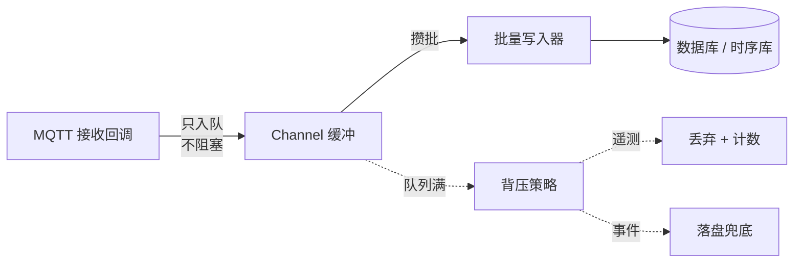

# 削峰、背压与批量入库：IoT 数据链路设计

前三篇解决的是"数据怎么进来"。这一篇解决"数据进来之后怎么不把系统压垮"。

这是 IoT 平台最容易在上线后翻车的环节。测试环境十台设备一切正常，上线两千台之后开始丢数据、延迟飙升、数据库 CPU 打满。**原因几乎总是同一个：用处理十台设备的方式处理两千台。**

:::tip 系列阅读顺序
本文是 [云端 IoT 平台路线图](/posts/iot/cloud-iot-roadmap) 的第四篇。前面几篇的代码里反复出现 `Channel` 和"回调只入队"，这一篇讲清背后的完整设计。
:::

## 先算账

**动手设计之前必须算清量。** 这一步能避免两种错误：低估导致上线崩，高估导致过度设计。

```text
消息速率 (msg/s) = 设备数 × 每台每秒上报次数
日增条数        = 消息速率 × 86400
日增字节        = 日增条数 × 单条大小
```

三档典型场景（假设单条 200 字节、每条含 5 个属性）：

| 设备数 | 上报间隔 | 消息速率 | 日增条数 | 日增数据 | 结论 |
|---|---|---|---|---|---|
| 1,000 | 60 秒 | ~17/s | 144 万 | 280 MB | **单机 PostgreSQL 轻松** |
| 10,000 | 10 秒 | 1,000/s | 8,640 万 | 17 GB | 需要批量写入 + 时序库 |
| 100,000 | 5 秒 | 20,000/s | 17 亿 | 340 GB | 需要消息队列 + 集群 |

**这张表最重要的信息是第一行。** 一千台设备每分钟上报一次只有每秒 17 条，一个 EMQX 加一个 PostgreSQL 就能轻松扛住，引入 Kafka 只是给自己增加运维负担。

:::warning 按算出来的量选方案
常见的过度设计是"以后可能有十万设备，所以现在就上 Kafka + 时序库集群 + K8s"。

问题是：**架构可以演进，但过早的复杂度是立刻要付的成本。** 三个人的团队维护一套 Kafka 集群，投入的精力本可以用来做业务功能。

而且真到十万设备的时候，你面临的问题和现在想的很可能不一样。**先按当前量的 3~5 倍设计，把扩展点留出来（比如队列抽象成接口），到量了再换实现。**
:::

## 瓶颈在哪

假设每秒 1000 条消息，逐条写库：

```csharp
// ❌ 每条消息一次数据库往返
private async Task OnMessageAsync(TelemetryMessage message)
{
    using var scope = _scopeFactory.CreateScope();
    var db = scope.ServiceProvider.GetRequiredService<AppDbContext>();

    db.Telemetry.Add(Map(message));
    await db.SaveChangesAsync();   // 1000 次/秒的独立事务
}
```

单条写入的开销拆开看：

| 开销项 | 说明 |
|---|---|
| 网络往返 | 应用到数据库的 RTT，同机房约 0.3~1ms |
| 事务开启与提交 | 每次 `SaveChanges` 一个事务，WAL 刷盘 |
| 语句解析与计划 | 参数化能缓存计划，但仍有解析开销 |
| 索引维护 | 每次插入更新所有索引 |
| 连接池竞争 | 高并发下等连接 |

**关键点不是单条有多慢，而是这些开销无法被摊薄。** 批量写入把 200 条放进一个事务、一次往返，网络和事务开销直接除以 200。数量级上的改善通常是**一到两个数量级**，这也是为什么批量写入不是优化而是必需品。

## 三层结构

完整的数据链路是三层，每层解决一个问题：



| 层 | 解决的问题 |
|---|---|
| **Channel 缓冲** | 到达速率和处理速率不匹配（突发峰值） |
| **批量写入** | 单条写入的固定开销无法摊薄 |
| **背压策略** | 缓冲也扛不住时，怎么有选择地降级 |

## 第一层：Channel 缓冲

`Channel` 的作用是把"消息到达"和"消息处理"解耦。MQTT 回调只管入队（微秒级），写库慢不会反压到接收侧。

### 绝对不要用 Unbounded

```csharp
// ❌ 无界队列是定时炸弹
var channel = Channel.CreateUnbounded<TelemetryMessage>();
```

无界队列在过载时的行为是：**内存持续增长直到 OOM，进程被杀。** 而且过程中没有任何信号——没有丢弃计数、没有拒绝，只是内存曲线慢慢爬升，最后突然死掉。

**有界队列的价值恰恰在于"它会满"。** 满了意味着你能观测到过载、能做出选择。

```csharp
// ✅ 有界队列，明确容量和满时行为
var channel = Channel.CreateBounded<TelemetryMessage>(
    new BoundedChannelOptions(capacity: 10_000)
    {
        FullMode = BoundedChannelFullMode.DropOldest,

        // 明确只有一个消费者、一个生产者时，Channel 能走优化路径
        SingleReader = true,
        SingleWriter = false,   // MQTT 回调可能并发
    });
```

### 容量怎么定

容量的物理意义是**能缓冲多长时间的峰值**：

```text
可缓冲时长 = 队列容量 ÷ (入队速率 − 出队速率)
```

举例：入队 2000/s、出队 1500/s（写库能力），容量 10000：

```text
10000 ÷ (2000 − 1500) = 20 秒
```

也就是说这个配置能扛 20 秒的过载，超过就开始丢。**如果你的峰值持续时间超过这个值，加大队列只是延后崩溃。**

内存占用也要算：

```text
10000 条 × 200 字节 ≈ 2 MB
```

很小，所以对遥测这类小消息，容量给到几万都没问题。但如果消息里带图片或大 payload，就要重新算。

:::note 容量不是越大越好
大容量的两个副作用：

**延迟变大。** 队列积压 5 万条、出队 1500/s，队尾的消息要等 33 秒才被处理。对"实时"看板来说这已经不实时了。

**故障时丢得更多。** 进程崩溃时内存队列里的数据全部丢失。队列越深，一次崩溃损失越大。

**结论**：容量按"能扛住业务上可预期的最长峰值"来定，不要盲目加大。真正的解法是提升出队速率。
:::

## 第二层：批量写入

### 双触发攒批

只按数量攒批的问题是：**低流量时最后几条会一直等着不写。** 所以必须数量和时间双触发。

一个通用的批处理器：

```csharp
/// <summary>
/// 从 Channel 读取并按"数量或超时"双触发攒批处理。
/// </summary>
public abstract class BatchProcessor<T> : BackgroundService
{
    private readonly ChannelReader<T> _reader;
    private readonly int _batchSize;
    private readonly TimeSpan _maxWait;
    private readonly ILogger _logger;

    protected abstract Task ProcessBatchAsync(IReadOnlyList<T> batch, CancellationToken ct);

    protected override async Task ExecuteAsync(CancellationToken stoppingToken)
    {
        var batch = new List<T>(_batchSize);

        while (!stoppingToken.IsCancellationRequested)
        {
            try
            {
                // 等第一条：没有数据时在这里长时间阻塞，不消耗 CPU
                if (!await _reader.WaitToReadAsync(stoppingToken))
                    break;   // Channel 已关闭

                // 攒批窗口从收到第一条开始计时
                using var windowCts = CancellationTokenSource
                    .CreateLinkedTokenSource(stoppingToken);
                windowCts.CancelAfter(_maxWait);

                try
                {
                    // 尽可能攒满，但最多等 _maxWait
                    while (batch.Count < _batchSize)
                    {
                        // TryRead 不阻塞：队列里有就立刻拿，没有就去等
                        if (_reader.TryRead(out var item))
                        {
                            batch.Add(item);
                            continue;
                        }

                        if (!await _reader.WaitToReadAsync(windowCts.Token))
                            break;
                    }
                }
                catch (OperationCanceledException) when (!stoppingToken.IsCancellationRequested)
                {
                    // 攒批窗口到时，正常情况，用当前已攒的批次处理
                }

                if (batch.Count == 0) continue;

                var sw = Stopwatch.StartNew();
                await ProcessBatchAsync(batch, stoppingToken);

                // 批次大小和耗时是最重要的两个健康指标
                _metrics.RecordBatch(batch.Count, sw.Elapsed);
            }
            catch (OperationCanceledException) when (stoppingToken.IsCancellationRequested)
            {
                break;
            }
            catch (Exception ex)
            {
                // 一批写失败不能让整个服务退出。
                // 这里的取舍：是丢掉这批还是重试？见下面的说明。
                _logger.LogError(ex, "批次处理失败，丢弃 {Count} 条", batch.Count);
                _metrics.RecordDropped(batch.Count, reason: "batch_failure");
            }
            finally
            {
                batch.Clear();
            }
        }

        // 优雅退出：把队列里剩下的尽量写完
        await DrainAsync(stoppingToken);
    }
}
```

三处值得注意：

**攒批窗口从第一条开始计时**，不是固定周期。这样低流量时最多延迟 `_maxWait`，高流量时能攒满 `_batchSize`。

**批次失败的处理是业务决策。** 遥测数据丢掉可接受；事件数据必须重试或落盘。所以这个基类应该让子类决定，或者干脆分成两个实现。

**优雅退出要 drain。** 停服时内存队列里可能还有几千条，直接退出就是丢数据。

### 真正的批量写入

`AddRange` + `SaveChanges` 比逐条好，但 EF Core 仍然是生成多条 INSERT 语句。高吞吐场景要用数据库的原生批量接口。

PostgreSQL 的 `COPY` 是最快的方式：

```csharp
protected override async Task ProcessBatchAsync(
    IReadOnlyList<TelemetryMessage> batch, CancellationToken ct)
{
    await using var conn = new NpgsqlConnection(_connectionString);
    await conn.OpenAsync(ct);

    // 二进制 COPY 比 INSERT 快一个数量级以上
    await using var writer = await conn.BeginBinaryImportAsync(
        "COPY telemetry (device_id, property_key, value, ts) FROM STDIN (FORMAT BINARY)", ct);

    foreach (var message in batch)
    {
        foreach (var (key, value) in message.Properties)
        {
            await writer.StartRowAsync(ct);
            await writer.WriteAsync(message.DeviceId, ct);
            await writer.WriteAsync(key, ct);
            await writer.WriteAsync(value, ct);
            await writer.WriteAsync(message.Timestamp, ct);
        }
    }

    await writer.CompleteAsync(ct);
}
```

SQL Server 用 `SqlBulkCopy`，时序库（InfluxDB、TDengine）都有自己的批量写入 API。

:::warning COPY 和 BulkCopy 绕过了唯一约束检查的便利
`COPY` 遇到唯一键冲突会**整批失败**，而不是跳过冲突行。上一篇讲的"用唯一约束做幂等去重"在这里不适用。

两种做法：

- **先 COPY 到临时表，再 `INSERT ... ON CONFLICT DO NOTHING` 合并**，兼顾速度和幂等
- **对纯遥测数据放弃去重**：时序数据重复一条对趋势几乎无影响，用时间戳 + 设备 ID 做主键让后写覆盖先写即可

**事件、告警这类不能重复的数据不要用 COPY**，用带 upsert 的批量插入。
:::

### 批量大小怎么定

| 批量大小 | 影响 |
|---|---|
| 太小（< 50） | 固定开销摊薄不够，收益有限 |
| 合适（100~1000） | 大多数场景的最佳区间 |
| 太大（> 5000） | 单批耗时长、内存占用高、事务日志膨胀、失败时损失大 |

**从 200 开始，看指标调。** 关键观察项是"批次写入耗时"：如果 P99 耗时超过攒批窗口，说明写入跟不上，加大批量反而会让延迟恶化。

## 第三层：背压策略

缓冲和批量都做了还是扛不住时，必须做选择。`BoundedChannelFullMode` 提供四种：

| 策略 | 行为 | 适用 |
|---|---|---|
| `DropOldest` | 丢最旧的，写入新的 | **高频遥测**（当前值才有意义） |
| `DropNewest` | 丢最新的 | 少见 |
| `DropWrite` | 丢当前这条 | 语义上等于拒绝新数据 |
| `Wait` | 生产者等待 | **绝对不要用在 MQTT 回调里** |

### 为什么 Wait 在这里很危险

看起来 `Wait` 最"负责"——不丢数据，等就是了。但它会引发连锁反应：

```text
写库变慢
  → 队列满
  → MQTT 回调阻塞在 WriteAsync
  → MQTT 客户端无法处理后续报文
  → Broker 侧消息积压 + 客户端心跳超时
  → Broker 判定客户端掉线，断开连接
  → 你的服务重连、重新订阅
  → 持久会话的积压消息一次性涌入
  → 队列立刻又满
  → 循环放大
```

**结果是从"慢"变成"完全不可用"。** 这是分布式系统里典型的级联故障：把压力向上游传导，最终把整个链路拖垮。

正确的思路是**在边界处快速失败**，让过载在可控的位置暴露，而不是传导出去。

### 分级队列

按数据语义分成两条通路，各自用合适的策略：

```csharp
public sealed class IngestQueues
{
    /// <summary>
    /// 遥测队列：高频、可丢。满了丢最旧的——
    /// 温度的旧值没有价值，下一秒就有新的。
    /// </summary>
    public Channel<TelemetryMessage> Telemetry { get; } =
        Channel.CreateBounded<TelemetryMessage>(new BoundedChannelOptions(50_000)
        {
            FullMode = BoundedChannelFullMode.DropOldest,
            SingleReader = true,
        });

    /// <summary>
    /// 事件队列：低频、不可丢。容量给小一点，
    /// 因为它一旦积压说明真出问题了，要尽早暴露。
    /// </summary>
    public Channel<DeviceEvent> Events { get; } =
        Channel.CreateBounded<DeviceEvent>(new BoundedChannelOptions(5_000)
        {
            FullMode = BoundedChannelFullMode.Wait,
            SingleReader = true,
        });
}
```

分流在 MQTT 回调里做：

```csharp
private async Task OnMessageReceivedAsync(MqttApplicationMessageReceivedEventArgs e)
{
    var topic = e.ApplicationMessage.Topic;

    try
    {
        if (topic.Contains("/property/post", StringComparison.Ordinal))
        {
            var msg = ParseTelemetry(e);

            // 遥测：非阻塞入队，满了就丢并计数
            if (!_queues.Telemetry.Writer.TryWrite(msg))
                _metrics.RecordDropped(1, "telemetry_queue_full");
        }
        else if (topic.Contains("/event/", StringComparison.Ordinal))
        {
            var evt = ParseEvent(e);

            // 事件：不能丢。先试非阻塞入队
            if (!_queues.Events.Writer.TryWrite(evt))
            {
                // 队列满了，但也不能在回调里 await 等待（会阻塞接收）。
                // 落盘兜底：写本地文件，由独立的恢复服务后续补入。
                // 磁盘比内存队列大几个数量级，是真正的最后防线。
                await _spillover.WriteAsync(evt);
                _metrics.RecordSpillover(1);
            }
        }
    }
    catch (Exception ex)
    {
        _logger.LogError(ex, "分流失败 {Topic}", topic);
    }
}
```

:::important 落盘兜底是关键设计
内存队列的容量是有限的（几万条），而磁盘可以放几亿条。**对不能丢的数据，"内存队列满了就落盘"是成本最低的可靠性方案。**

实现上不需要很复杂：按天追加写 JSON Lines 文件，一个后台服务定期读取并补入正常链路，成功后删除。这和工业系列讲的 [Outbox 模式](/posts/dotnet/aspnet-core-outbox-pattern) 是同一个思路。

它的价值在于：**数据库慢了半小时，你只是延迟入库，而不是丢了半小时的告警。**
:::

## 什么时候引入消息队列

这是最容易被"应该用 Kafka"这类结论误导的决策。**设备数不是判断标准**，下面这几个信号才是：

| 信号 | 说明 |
|---|---|
| **需要多个独立消费者** | 数据服务、告警服务、大数据分析各自消费全量数据，且消费进度独立 |
| **需要回放** | 消费逻辑有 bug，要重新处理过去三天的数据 |
| **需要跨服务解耦** | 接入服务和处理服务要独立部署、独立扩缩容 |
| **峰值持续时间超过内存队列能力** | 每天固定时段的上报洪峰持续几十分钟 |
| **需要严格不丢** | 进程崩溃也不能丢，内存队列做不到 |

**如果这几条都不满足，`Channel` + 落盘兜底就够了。**

反过来，如果满足了两条以上，引入队列是合理的：

| 选择 | 适合 |
|---|---|
| **Kafka** | 高吞吐、需要回放、多消费组独立消费、按 key 分区保序 |
| **RabbitMQ** | 复杂路由、逐条确认、优先级队列，吞吐要求中等 |
| **Redis Stream** | 已有 Redis、量不大、想省一个组件 |

要清楚引入的成本：**运维一个集群、端到端延迟增加、多一个故障点、本地开发环境变重。** 这些是实打实的支出，要用上面那几个信号带来的收益去换。

:::note MQTT Broker 本身就有缓冲能力
一个容易被忽略的点：**EMQX 这类 Broker 自带消息队列能力。**

持久会话（`CleanSession=false`）下，订阅者离线期间的 QoS 1 消息会被 Broker 保存，重连后补发。这在服务端短时间重启、发布升级的场景下已经够用了。

EMQX 还支持规则引擎直接把消息写入数据库或转发到 Kafka，某些简单场景连自己写消费服务都不需要。**评估架构时先看 Broker 已经提供了什么，不要重复建设。**
:::

## 必须有的指标

**没有队列指标，你就是在盲飞。** 五个必须有的：

```csharp
public sealed class IngestMetrics
{
    private readonly Counter<long> _received;
    private readonly Counter<long> _dropped;
    private readonly Counter<long> _spillover;
    private readonly Histogram<double> _batchSize;
    private readonly Histogram<double> _writeDuration;

    public IngestMetrics(IMeterFactory factory, IngestQueues queues)
    {
        var meter = factory.Create("IoT.Ingest");

        _received = meter.CreateCounter<long>("ingest.messages.received");
        _dropped = meter.CreateCounter<long>("ingest.messages.dropped");
        _spillover = meter.CreateCounter<long>("ingest.messages.spillover");
        _batchSize = meter.CreateHistogram<double>("ingest.batch.size");
        _writeDuration = meter.CreateHistogram<double>("ingest.write.duration", unit: "ms");

        // 队列深度是最重要的单个指标：
        // 它持续上涨意味着出队跟不上入队，崩溃只是时间问题
        meter.CreateObservableGauge("ingest.queue.depth",
            () => new Measurement<int>(queues.Telemetry.Reader.Count,
                new KeyValuePair<string, object?>("queue", "telemetry")));
    }

    public void RecordDropped(int count, string reason)
        => _dropped.Add(count, new KeyValuePair<string, object?>("reason", reason));
}
```

怎么看这些指标：

| 现象 | 含义 | 动作 |
|---|---|---|
| 队列深度持续上涨 | 出队速率 < 入队速率 | **必须处理**，加大批量或扩容写入 |
| 队列深度周期性尖峰后回落 | 正常的峰值缓冲 | 健康 |
| `dropped` 持续增长 | 已经在丢数据 | 立即告警 |
| `spillover` 增长 | 事件走了落盘兜底 | 说明数据库有问题 |
| 批次大小总是等于上限 | 一直在满批处理 | 已达吞吐上限，接近瓶颈 |
| 批次大小总是很小 | 流量低或攒批窗口太短 | 可以调大窗口降低写入频次 |

**队列深度和 `dropped` 两个指标必须配告警。** 前者是"即将出问题"，后者是"已经出问题"。

## 削峰的边界

必须说清一件事：**缓冲只能解决突发峰值，解决不了持续超载。**

```text
突发峰值：入队 5000/s 持续 10 秒，之后回到 500/s
  → 队列缓冲 5 万条，之后慢慢消化。✅ 缓冲有效

持续超载：入队 2000/s，出队能力 1500/s，一直如此
  → 每秒净增 500 条，任何容量的队列都会满。❌ 缓冲无效
```

持续超载只有三条出路：

**一、提升写入能力。** 优化批量、加索引前先减索引、换时序库、数据库扩容。这是首选。

**二、减少数据量。** 见下一节。

**三、水平扩展。** 多实例消费（MQTT 5 共享订阅）+ 数据库分片。

**加大队列容量不在出路里**——它只是把崩溃时间从 1 分钟推到 10 分钟。

## 从源头减少数据量

这是最有效但最容易被忽略的手段，因为它需要和设备侧配合：

**变化上报而非周期上报。** 温度没变就不上报，或者变化超过阈值才上报。一台温控器从"每 5 秒上报"改成"变化 0.5℃ 才上报"，数据量常能降到十分之一。

**设备侧聚合。** 设备缓存 1 分钟内的数据，一次上报 12 个采样点。消息数降到 1/12，而信息量不变——因为 MQTT 的固定开销被摊薄了。

**分级上报频率。** 实时量高频、累计量低频。不要所有属性都用最快的频率。

**服务端降采样。** 原始数据保留 7 天，之后按分钟聚合；30 天后按小时聚合。这属于时序库的能力，下一篇细讲。

:::tip 先谈需求再谈技术
"每秒必须上报一次"这个需求经常是拍出来的，不是算出来的。

一个仓库温度监控，实际业务只需要"温度异常时 1 分钟内知道"。这用"变化超阈值立即上报 + 每 5 分钟心跳"就能满足，数据量是每秒上报的百分之一。

**在花几周搭 Kafka 集群之前，先花半天确认上报频率是不是真的必要。**
:::

:::details 常见问题速查 | 点开看数据链路的高频坑
**内存持续增长最后 OOM**
用了 `CreateUnbounded`。改成有界队列。

**队列深度一直涨但没有丢弃计数**
`FullMode` 是 `Wait`，生产者被阻塞了。检查 MQTT 回调是否在 `await WriteAsync`。

**服务端反复掉线重连**
`Wait` 策略阻塞了 MQTT 报文处理，导致心跳超时。回调里必须用 `TryWrite`。

**低流量时数据要等很久才入库**
只按数量攒批，没有时间触发。必须双触发。

**批量写入报唯一键冲突，整批失败**
`COPY` / `BulkCopy` 不跳过冲突行。改用临时表 + upsert，或对遥测放弃去重。

**加大队列容量后延迟变得很大**
队列深意味着排队时间长。容量不是越大越好。

**停服时丢了几千条数据**
退出时没有 drain 队列。`ExecuteAsync` 结束前要把剩余数据写完。

**批次耗时越来越长**
表和索引在变大。检查是不是该分区、该归档、或该换时序库。

**一批写失败后这批数据就没了**
批次失败的处理没区分数据语义。事件类要重试或落盘。

**告警数据偶尔丢失**
和遥测共用了 `DropOldest` 的队列。必须分级队列。

**上线后才发现数据库扛不住**
上线前没算量。三行公式的事，一定要算。

**引入 Kafka 后端到端延迟反而变高了**
多了一跳的固有成本。如果不需要回放和多消费者，这个成本换不来收益。
:::

## 小结

数据链路的设计顺序不能颠倒：先算量，再定架构。

1. **先算账**：设备数 × 上报频率，一千台每分钟只有 17/s，不需要 Kafka
2. **绝不用 Unbounded**：有界队列的价值在于"它会满"，能让你观测到过载
3. **容量按可缓冲时长定**，不是越大越好——深队列意味着高延迟和崩溃时的大损失
4. **批量写入是必需品**，双触发攒批，用数据库原生批量接口
5. **`Wait` 策略会引发级联故障**，MQTT 回调里必须 `TryWrite`
6. **按数据语义分级队列**：遥测 `DropOldest`，事件 `Wait` + 落盘兜底
7. **消息队列看信号不看设备数**：多消费者、回放、跨服务解耦才是理由
8. **队列深度和丢弃计数必须配告警**
9. **缓冲只解决突发峰值**，持续超载必须提升写入能力或减少数据量
10. **从源头减量最有效**：变化上报、设备侧聚合、先确认频率需求是否真实

下一篇 [时序数据库](/posts/iot/timeseries-database) 讲为什么关系库存不了高频遥测，列存压缩和自动降采样是怎么工作的，InfluxDB / TDengine / TimescaleDB 怎么选。
