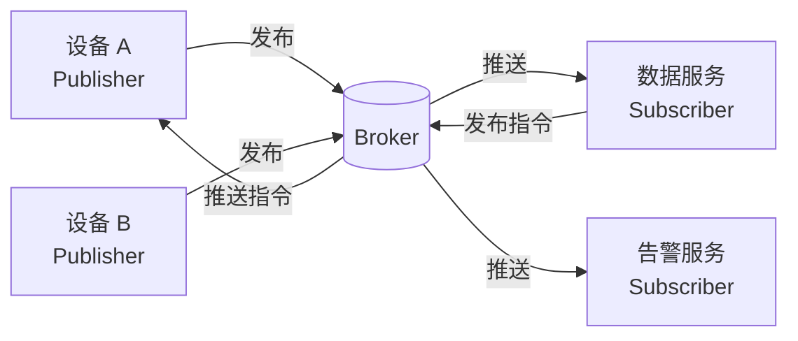
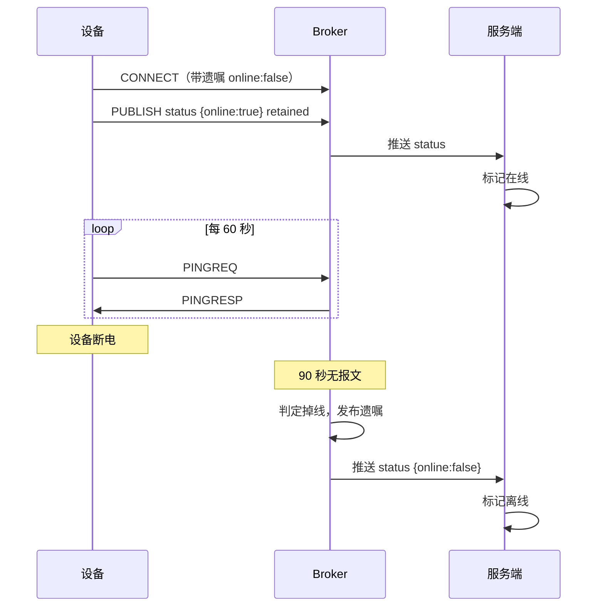

# MQTT 与 MQTTnet：从模拟设备到服务端接入

云端 IoT 的第一课是 MQTT。它不复杂——规范本身很薄——但有几个概念如果理解偏了，后面的 Topic 设计、掉线检测、指令下发全都会跑偏。

这一篇把概念讲透，然后跑通一个能实际运行的闭环：模拟设备上报 → Broker 转发 → 服务端接收入队。

:::tip 系列阅读顺序
本文是 [云端 IoT 平台路线图](/posts/iot/cloud-iot-roadmap) 的第一篇。如果你要做的是厂区内网的几台设备（地磅、门禁、摄像头），那条线在 [工业设备对接路线图](/posts/iot/industrial-device-roadmap)，技术栈完全不同。
:::

## 为什么是 MQTT 而不是 HTTP

设备上报数据，用 HTTP POST 不行吗？少量设备确实行，但设备一多问题就出来了：

| 问题 | HTTP | MQTT |
|---|---|---|
| **协议开销** | 每次请求都带完整头部，几百字节 | 最小报文 2 字节，头部固定开销极小 |
| **连接成本** | 每次请求握手（TLS 更贵） | 一次连接长期复用 |
| **服务端下推** | 做不到，只能设备轮询 | **天然支持**，Broker 主动推 |
| **掉线感知** | 不知道设备是死了还是没数据 | **心跳 + 遗嘱消息** |
| **一对多分发** | 服务端要自己实现扇出 | **订阅同一 Topic 即可** |
| **弱网表现** | 超时重试成本高 | QoS 机制 + 会话保持 |

最关键的是**服务端下推**和**掉线感知**这两条。控制设备（开关灯、下发配置）如果靠设备轮询，要么延迟高，要么轮询频繁把带宽和电量耗光。而"这台设备现在在线吗"是 IoT 平台必须回答的问题，HTTP 给不出答案。

## 核心概念

### 发布订阅：三方解耦

MQTT 里没有"客户端请求服务端"，只有三个角色：



**Broker 是必需的中间件**，所有消息都经过它。发布者和订阅者互不知道对方存在，只认 Topic。

这个解耦带来一个实际好处：**再加一个消费者不用改任何现有代码。** 数据服务在消费上报数据，现在要加个告警服务，它订阅同一个 Topic 就行，设备侧和数据服务都不用动。

### Topic：分层的字符串

Topic 是用 `/` 分隔的层级路径，没有预定义结构，完全由你设计：

```text
product/thermostat-v1/device/SN20260731001/property/post
```

订阅时可以用两个通配符：

| 通配符 | 含义 | 示例 |
|---|---|---|
| `+` | **匹配单层** | `product/+/device/+/property/post` |
| `#` | **匹配多层**，必须在末尾 | `product/thermostat-v1/#` |

```text
Topic:      product/tv1/device/SN001/property/post

product/+/device/+/property/post   ✅ 匹配
product/tv1/#                      ✅ 匹配
product/#/property/post            ❌ 非法，# 只能在末尾
product/+/property/post            ❌ 层数不对，+ 只匹配一层
```

:::warning Topic 设计错了很难改
Topic 是设备固件里硬编码的字符串。**设备量产之后改 Topic 结构等于要给所有设备做 OTA**，代价极高。

所以第一版就要把这几件事想清楚：产品标识和设备标识放在哪一层、上行下行怎么区分、权限怎么按前缀隔离。这是下一篇的主题，这里先记住"别随便定"。
:::

### QoS：三个等级的确切语义

这是最容易含糊的地方。QoS 描述的是**单次消息投递的保证级别**：

| 等级 | 名称 | 保证 | 代价 |
|---|---|---|---|
| **0** | At most once | 发出去就不管，**可能丢** | 最快，无确认 |
| **1** | At least once | 确保送达，**可能重复** | 一次确认往返 |
| **2** | Exactly once | 不丢不重 | 两次往返，最慢 |

**实践中的选择非常固定：**

- **QoS 0** —— 高频遥测数据（温度每秒上报）。丢一条无所谓，下一秒又来了
- **QoS 1** —— 绝大多数场景的默认选择：状态变更、告警事件、控制指令
- **QoS 2** —— 几乎不用

QoS 2 为什么不用？因为**它的代价换不来实质收益**。它需要四步握手，在弱网下延迟明显，而且很多 Broker 和云平台干脆不完整支持。更重要的是：

:::important QoS 1 + 业务幂等 是标准做法
QoS 2 想解决的"重复投递"问题，在业务层做幂等更简单也更可靠——**因为你无论如何都需要幂等**。

即使用了 QoS 2，设备侧断线重连后重发、你的服务处理到一半崩溃重启，同样会产生重复。**协议层的"恰好一次"保证不了端到端的"恰好一次"。**

所以正确姿势是：用 QoS 1 保证不丢，用业务幂等（消息 ID 去重、唯一约束）处理重复。这也是本系列后面所有代码遵循的原则。
:::

### 保留消息（Retained）

Broker 会把某个 Topic 上标记了 retained 的**最后一条**消息存下来，任何新订阅者一连上就立刻收到它。

用途很具体：**新连接的客户端需要立即知道当前状态，而不是等设备下次上报。**

```text
设备上报 温度=25.5（retained）→ Broker 存下
（10 分钟后）App 启动并订阅 → 立刻收到 25.5，不用等下一次上报
```

两个注意点：

- **每个 Topic 只保留一条**，新的覆盖旧的
- **发一条空 payload 的 retained 消息可以清除它**，这是标准做法

高频遥测数据不要开 retained（意义不大且增加 Broker 存储压力），设备状态、配置这类"当前值"语义的才用。

### 遗嘱消息（LWT）：掉线检测的关键

Last Will and Testament：客户端连接时告诉 Broker"如果我**异常**断开，请代我发布这条消息"。

```text
设备连接时登记遗嘱：
  Topic:   device/SN001/status
  Payload: {"online":false}

设备断电 / 网线拔掉 / 崩溃
  → Broker 检测到心跳超时
  → 自动发布上面这条消息
  → 你的服务收到，把设备标记为离线
```

**这是 MQTT 最实用的特性之一**，因为它解决了"设备突然消失"这个 HTTP 完全无法处理的问题。

关键细节：**正常调用 `DisconnectAsync()` 断开时，遗嘱不会被发送**——协议认为这是"体面的告别"。所以典型做法是：

```text
上线：连接后主动发布 {"online":true}（retained）
正常下线：主动发布 {"online":false}（retained），再断开
异常下线：由 LWT 兜底发布 {"online":false}（retained）
```

三条路径都写同一个 Topic，App 订阅它就能拿到准确状态。

### 心跳与会话

**Keep Alive**：客户端声明的心跳间隔。空闲时客户端要发 PINGREQ，**Broker 在 1.5 倍 Keep Alive 时间内没收到任何报文就判定客户端已死**，触发遗嘱。

设置多少？权衡很直接：

- 太长（比如 300 秒）→ 掉线检测最长要 450 秒才生效
- 太短（比如 10 秒）→ 心跳报文占用带宽和设备电量

**常规设备 60 秒是合理起点**，需要快速掉线感知的场景可以缩到 20~30 秒。

**Clean Session**：设置为 `false` 时，Broker 会为这个 Client ID 保存会话——订阅关系和未投递的 QoS 1/2 消息。设备重连后自动恢复，断线期间的消息也会补发。

```csharp
// 设备端：通常要持久会话，断线期间的指令不能丢
.WithCleanSession(false)

// 服务端消费者：通常用干净会话，
// 因为它订阅的是共享的上行 Topic，靠自己的消费逻辑保证不丢更可控
.WithCleanSession(true)
```

:::warning Client ID 必须唯一
Broker 用 Client ID 标识客户端。**两个客户端用同一个 ID 连接，后来的会把前面的踢下线**，然后前者重连又把后者踢掉——形成无限踢来踢去，表现是"设备频繁掉线重连"。

这是量产项目的经典事故：固件里写了固定的 Client ID，几千台设备用同一个，整个平台的连接数一直抖动。

**Client ID 必须包含设备唯一标识**（序列号、MAC）。服务端消费者也要注意：多实例部署时每个实例的 ID 要不同。
:::

### MQTT 3.1.1 还是 5.0

| 特性 | 3.1.1 | 5.0 |
|---|---|---|
| 兼容性 | 所有 Broker 和设备都支持 | 主流 Broker 支持，老设备可能不支持 |
| 错误原因 | 只有"连接失败"，不知道为什么 | **原因码**，明确告知是认证失败还是被禁 |
| 用户属性 | 无 | 可携带自定义键值对（类似 HTTP 头） |
| 会话过期 | 只能二选一（持久/不持久） | 可设置过期时间 |
| 消息过期 | 无 | 过期未投递自动丢弃，避免设备重连后收到一堆陈旧指令 |
| 共享订阅 | 无（部分 Broker 私有扩展） | **`$share/group/topic`**，多个消费者负载均衡 |

**新项目直接上 5.0**，两个特性特别值得：**原因码**让排查认证问题从"猜"变成"看"，**共享订阅**让服务端可以多实例水平扩展而不重复消费。

设备侧如果是采购的模组，要确认它支持的版本再定。

## 搭一个 Broker

本地开发用 Docker 起 EMQX 最快，自带管理面板能看连接和消息：

```bash
docker run -d --name emqx \
  -p 1883:1883 \
  -p 8083:8083 \
  -p 8883:8883 \
  -p 18083:18083 \
  emqx/emqx:latest
```

端口含义：`1883` 是 MQTT、`8883` 是 MQTT over TLS、`8083` 是 WebSocket（App 直连用）、`18083` 是管理面板。

面板地址 `http://localhost:18083`，首次登录会要求改密码。**它的"连接"和"订阅"页面在调试时非常有用**——能直接看到哪些设备连上了、订阅了什么 Topic。

生产选型简单说：自建选 **EMQX**（集群、认证、规则引擎完整）或 **Mosquitto**（轻量、单机够用）；不想运维就用云厂商的 IoT 平台，它们额外提供了设备管理、影子、OTA 这些开箱能力。

## MQTTnet：写一个模拟设备

```bash
dotnet add package MQTTnet
```

:::note 版本说明
本文代码基于 **MQTTnet 4.3**。这个库的 API 在大版本间变化不小，迁移时注意两处：

- **5.0** 把 `MqttFactory` 改名为 `MqttClientFactory`，payload 类型从 `byte[]` / `ArraySegment` 改为 `ReadOnlySequence<byte>`
- **5.0** 移除了 `ManagedClient` 扩展包，重连需要自己实现（本文给的就是手写版本，不受影响）

读取 payload 统一用 `ConvertPayloadToString()` 扩展方法，它在各版本间都可用，比直接访问 payload 属性稳定。
:::

一个完整的模拟温控设备，包含连接、遗嘱、上报、接收指令、自动重连：

```csharp
using System.Text.Json;
using MQTTnet;
using MQTTnet.Client;
using MQTTnet.Protocol;

var deviceSn = "SN20260731001";
var productKey = "thermostat-v1";

// Topic 规划：上行 property/post，下行 command/set
var baseTopic = $"product/{productKey}/device/{deviceSn}";
var propertyTopic = $"{baseTopic}/property/post";
var statusTopic = $"{baseTopic}/status";
var commandTopic = $"{baseTopic}/command/set";
var replyTopic = $"{baseTopic}/command/reply";

var factory = new MqttFactory();
var client = factory.CreateMqttClient();

var options = new MqttClientOptionsBuilder()
    .WithProtocolVersion(MQTTnet.Formatter.MqttProtocolVersion.V500)
    .WithTcpServer("localhost", 1883)

    // Client ID 必须唯一，用设备序列号
    .WithClientId($"device-{deviceSn}")
    .WithCredentials(deviceSn, "device-secret")

    // 持久会话：断线期间的指令重连后补发
    .WithCleanSession(false)

    // 心跳 60 秒，Broker 会在 90 秒无报文后判定掉线
    .WithKeepAlivePeriod(TimeSpan.FromSeconds(60))

    // 遗嘱：异常断开时由 Broker 代发离线状态
    .WithWillTopic(statusTopic)
    .WithWillPayload(JsonSerializer.Serialize(new { online = false, reason = "unexpected" }))
    .WithWillQualityOfServiceLevel(MqttQualityOfServiceLevel.AtLeastOnce)
    .WithWillRetain()

    .Build();

// ── 接收下行指令 ────────────────────────────────────────────
client.ApplicationMessageReceivedAsync += async e =>
{
    var topic = e.ApplicationMessage.Topic;
    var payload = e.ApplicationMessage.ConvertPayloadToString();

    Console.WriteLine($"[收到指令] {topic} => {payload}");

    try
    {
        var command = JsonSerializer.Deserialize<CommandMessage>(payload);

        // 真实设备在这里执行动作（调节温度、开关继电器）
        Console.WriteLine($"执行：{command!.Method}");

        // 回复必须带上原始请求 ID，服务端靠它把响应和请求对上
        var reply = JsonSerializer.Serialize(new
        {
            id = command.Id,
            code = 200,
            message = "success",
        });

        await client.PublishStringAsync(replyTopic, reply,
            MqttQualityOfServiceLevel.AtLeastOnce);
    }
    catch (Exception ex)
    {
        // 处理指令的异常绝不能让接收循环挂掉
        Console.Error.WriteLine($"指令处理失败：{ex.Message}");
    }
};

// ── 连接成功后的初始化 ──────────────────────────────────────
client.ConnectedAsync += async e =>
{
    Console.WriteLine("已连接到 Broker");

    // 上线状态用 retained，这样 App 任何时候订阅都能立刻拿到
    await client.PublishStringAsync(statusTopic,
        JsonSerializer.Serialize(new { online = true }),
        MqttQualityOfServiceLevel.AtLeastOnce, retain: true);

    // 重连后必须重新订阅（CleanSession=false 时 Broker 会恢复订阅，
    // 但显式订阅一次更保险，也兼容 CleanSession=true 的情况）
    await client.SubscribeAsync(commandTopic, MqttQualityOfServiceLevel.AtLeastOnce);
};

// ── 断线自动重连 ────────────────────────────────────────────
client.DisconnectedAsync += async e =>
{
    Console.WriteLine($"连接断开：{e.Reason}");

    // 退避重连。生产代码应该用指数退避 + 随机抖动，
    // 避免大量设备同时掉线后在同一秒集体重连打爆 Broker
    await Task.Delay(TimeSpan.FromSeconds(5));

    try
    {
        await client.ConnectAsync(options, CancellationToken.None);
    }
    catch (Exception ex)
    {
        Console.Error.WriteLine($"重连失败：{ex.Message}");
    }
};

await client.ConnectAsync(options, CancellationToken.None);

// ── 周期上报遥测 ────────────────────────────────────────────
var random = new Random();
var timer = new PeriodicTimer(TimeSpan.FromSeconds(5));

while (await timer.WaitForNextTickAsync())
{
    var payload = JsonSerializer.Serialize(new
    {
        id = Guid.NewGuid().ToString("N"),      // 消息 ID，服务端去重用
        ts = DateTimeOffset.UtcNow.ToUnixTimeMilliseconds(),
        properties = new
        {
            temperature = Math.Round(20 + random.NextDouble() * 10, 1),
            humidity = Math.Round(40 + random.NextDouble() * 20, 1),
        },
    });

    // 高频遥测用 QoS 0：丢一条无所谓，下一轮又来了
    await client.PublishStringAsync(propertyTopic, payload,
        MqttQualityOfServiceLevel.AtMostOnce);

    Console.WriteLine($"[上报] {payload}");
}

record CommandMessage(string Id, string Method, JsonElement Params);
```

跑起来之后，在 EMQX 面板的"连接"页面能看到这个设备，"订阅"页面能看到它订阅了指令 Topic。

## 服务端：订阅并入队

服务端是另一个 MQTT 客户端，只是它订阅的是通配符 Topic，接收所有设备的上报。

关键设计：**接收回调里只做反序列化和入队，绝不做数据库写入。** 这和工业系列 [串口通信](/posts/iot/serial-port-communication) 里"回调只做拷贝和入队"是同一个原则——回调阻塞会导致消息积压。

```csharp
public sealed class MqttIngestService : BackgroundService
{
    private readonly ChannelWriter<TelemetryMessage> _writer;
    private readonly MqttOptions _options;
    private readonly ILogger<MqttIngestService> _logger;
    private IMqttClient? _client;

    protected override async Task ExecuteAsync(CancellationToken stoppingToken)
    {
        var factory = new MqttFactory();
        _client = factory.CreateMqttClient();

        _client.ApplicationMessageReceivedAsync += OnMessageReceivedAsync;

        _client.DisconnectedAsync += async e =>
        {
            _logger.LogWarning("MQTT 连接断开：{Reason}", e.Reason);
            await Task.Delay(TimeSpan.FromSeconds(5), CancellationToken.None);
        };

        var options = new MqttClientOptionsBuilder()
            .WithProtocolVersion(MQTTnet.Formatter.MqttProtocolVersion.V500)
            .WithTcpServer(_options.Host, _options.Port)

            // 多实例部署时 Client ID 必须不同，否则会互相踢下线
            .WithClientId($"ingest-{Environment.MachineName}-{Guid.NewGuid():N}")
            .WithCredentials(_options.Username, _options.Password)
            .WithCleanSession()
            .Build();

        // 外层重连循环
        while (!stoppingToken.IsCancellationRequested)
        {
            try
            {
                if (!_client.IsConnected)
                {
                    await _client.ConnectAsync(options, stoppingToken);
                    await SubscribeAsync(stoppingToken);
                    _logger.LogInformation("MQTT 已连接并完成订阅");
                }

                await Task.Delay(TimeSpan.FromSeconds(5), stoppingToken);
            }
            catch (OperationCanceledException) when (stoppingToken.IsCancellationRequested)
            {
                break;
            }
            catch (Exception ex)
            {
                _logger.LogError(ex, "MQTT 连接失败，稍后重试");
                await Task.Delay(TimeSpan.FromSeconds(10), stoppingToken);
            }
        }

        // 优雅退出
        if (_client.IsConnected)
            await _client.DisconnectAsync();
    }

    private async Task SubscribeAsync(CancellationToken ct)
    {
        var subscribeOptions = new MqttFactory().CreateSubscribeOptionsBuilder()
            // 通配符订阅所有设备的属性上报
            .WithTopicFilter(f => f
                .WithTopic("product/+/device/+/property/post")
                .WithQualityOfServiceLevel(MqttQualityOfServiceLevel.AtLeastOnce))

            // 设备上下线状态
            .WithTopicFilter(f => f
                .WithTopic("product/+/device/+/status")
                .WithQualityOfServiceLevel(MqttQualityOfServiceLevel.AtLeastOnce))

            .Build();

        await _client!.SubscribeAsync(subscribeOptions, ct);
    }

    private Task OnMessageReceivedAsync(MqttApplicationMessageReceivedEventArgs e)
    {
        try
        {
            // 从 Topic 里解出设备标识。
            // 这是 Topic 设计要把标识放进路径的直接原因——
            // 不用解析 payload 就能知道消息来自谁。
            var segments = e.ApplicationMessage.Topic.Split('/');
            if (segments.Length < 6)
            {
                _logger.LogWarning("无法解析的 Topic：{Topic}", e.ApplicationMessage.Topic);
                return Task.CompletedTask;
            }

            var productKey = segments[1];
            var deviceSn = segments[3];

            var payload = e.ApplicationMessage.ConvertPayloadToString();

            var message = new TelemetryMessage(
                ProductKey: productKey,
                DeviceSn: deviceSn,
                Topic: e.ApplicationMessage.Topic,
                Payload: payload,
                ReceivedAt: DateTimeOffset.UtcNow);

            // 只入队。写库、告警判定、状态更新全部交给下游消费者。
            // 队列满时丢最旧的遥测数据是可接受的取舍。
            if (!_writer.TryWrite(message))
            {
                _logger.LogWarning("接入队列已满，丢弃消息 {Device}", deviceSn);
            }
        }
        catch (Exception ex)
        {
            // 单条消息处理失败绝不能影响后续消息
            _logger.LogError(ex, "处理 MQTT 消息失败 {Topic}", e.ApplicationMessage.Topic);
        }

        return Task.CompletedTask;
    }
}
```

注册：

```csharp
builder.Services.AddSingleton(Channel.CreateBounded<TelemetryMessage>(
    new BoundedChannelOptions(10_000)
    {
        // 遥测数据积压时丢最旧的：当前值才有意义
        FullMode = BoundedChannelFullMode.DropOldest,
    }));

builder.Services.AddHostedService<MqttIngestService>();
builder.Services.AddHostedService<TelemetryPersistService>();   // 批量写库的消费者
```

:::important 遥测可以丢，事件不能丢
上面用了 `DropOldest`，这只适用于**高频遥测**（温度、电压这类"当前值"语义的数据）。

**告警事件、状态变更、指令响应绝对不能这样丢。** 它们要用独立的队列，配 `BoundedChannelFullMode.Wait` 或者直接落库兜底。

同一个系统里两种策略并存是正常的，取决于数据语义。判断标准很简单：**丢了之后能不能从下一条恢复？** 温度能（下一秒又来了），告警不能。
:::

## 幂等：QoS 1 必须配的东西

用了 QoS 1 就要接受重复投递。加上设备重连重发、你的服务重启重放，重复是必然的。

在消息里带一个 ID，落库时靠唯一约束去重：

```csharp
public sealed class TelemetryPersistService : BackgroundService
{
    protected override async Task ExecuteAsync(CancellationToken ct)
    {
        // 批量攒够或超时就写一次，避免逐条写库
        var batch = new List<TelemetryMessage>(capacity: 200);

        await foreach (var message in _reader.ReadAllAsync(ct))
        {
            batch.Add(message);

            if (batch.Count >= 200)
            {
                await FlushAsync(batch, ct);
                batch.Clear();
            }
        }
    }

    private async Task FlushAsync(List<TelemetryMessage> batch, CancellationToken ct)
    {
        // BackgroundService 是单例，Scoped 的 DbContext 必须自己开 scope
        using var scope = _scopeFactory.CreateScope();
        var db = scope.ServiceProvider.GetRequiredService<AppDbContext>();

        foreach (var message in batch)
        {
            var parsed = JsonSerializer.Deserialize<PropertyPost>(message.Payload);

            db.Telemetry.Add(new TelemetryRecord
            {
                // (DeviceSn, MessageId) 建唯一索引，重复插入会冲突
                DeviceSn = message.DeviceSn,
                MessageId = parsed!.Id,
                Timestamp = DateTimeOffset.FromUnixTimeMilliseconds(parsed.Ts),
                PayloadJson = message.Payload,
            });
        }

        try
        {
            await db.SaveChangesAsync(ct);
        }
        catch (DbUpdateException ex) when (IsUniqueViolation(ex))
        {
            // 批量里有重复：退化成逐条插入，跳过冲突的
            // （生产环境更好的做法是用数据库的 upsert / merge 语法）
            _logger.LogDebug("批次中存在重复消息，逐条处理");
            await InsertOneByOneAsync(db, batch, ct);
        }
    }
}
```

**去重靠数据库唯一约束，不要靠"先查再插"。** 后者在并发下必然漏，这个结论和工业系列门禁那篇一致。

## 掉线检测的完整链路

把前面的概念串起来，一台设备的在线状态是这样维护的：



服务端只需要订阅 `status` Topic 就能拿到准确状态，不用自己做超时轮询：

```csharp
private async Task HandleStatusAsync(string deviceSn, string payload, CancellationToken ct)
{
    var status = JsonSerializer.Deserialize<DeviceStatus>(payload);

    await _deviceState.UpdateOnlineAsync(deviceSn, status!.Online, ct);

    if (!status.Online)
    {
        // 注意：这里不要立刻触发告警。
        // 网络抖动导致的瞬时掉线很常见，
        // 应该延迟确认（比如 2 分钟后仍离线才告警），
        // 否则运维会被海量误报淹没。
        await _offlineConfirmation.ScheduleAsync(deviceSn, TimeSpan.FromMinutes(2), ct);
    }
}
```

**掉线告警要延迟确认**，这是海量设备场景的必备设计。几千台设备的网络抖动叠加起来，不做抑制的话告警会完全失去意义。

## 安全底线

这一篇是入门，安全细节留给下一篇，但三条底线现在就要建立：

**用 8883（TLS）而不是 1883。** 明文 MQTT 传输凭据等于公开。开发可以用 1883，生产不行。

**一机一密，不要一型一密。** 同一型号所有设备共用一个密码，泄漏一台等于泄漏全部——而设备固件是可以被拆出来逆向的。

**Broker 必须配 ACL。** 默认配置下，任何连上来的客户端都能订阅 `#` 收到全部消息、也能往任意 Topic 发布。这意味着一台被攻破的设备可以监听所有设备的数据、伪造任何设备的上报。**ACL 要限制到"设备只能读写自己路径下的 Topic"。**

:::warning 不要把 EMQX 面板和 1883 端口暴露到公网
默认配置的 Broker 暴露在公网上，等于把整个设备网络敞开。管理面板的默认凭据更是首要攻击目标。

最低要求：Broker 只开 8883 并配 ACL，管理面板只在内网或通过 VPN 访问。
:::

:::details 常见问题速查 | 点开看 MQTT 接入的高频坑
**设备频繁掉线重连，日志里看到反复 Connected/Disconnected**
Client ID 重复，两个客户端互相踢。检查是不是固件里写了固定 ID，或者服务端多实例用了同一个 ID。

**连接被拒绝但不知道原因**
用 MQTT 3.1.1 时只能看到"连接失败"。切到 5.0 能拿到原因码，明确区分认证失败、被 ACL 拒绝、协议版本不支持。

**订阅了但收不到消息**
Topic 写错（大小写敏感、多余的前导 `/`）、通配符层数不对、或者 ACL 禁止了订阅。用 EMQX 面板的订阅页面确认订阅是否真的建立了。

**`#` 放在中间报错**
`#` 只能作为最后一层。要匹配中间层用 `+`。

**设备离线了但系统还显示在线**
没配遗嘱消息，或者 Keep Alive 太长（掉线检测要等 1.5 倍时间）。

**设备正常重启后系统显示离线**
正常 `DisconnectAsync()` 不触发遗嘱。设备要在主动断开前发一条 `online:false`。

**App 一启动就要等很久才看到数据**
状态类消息没开 retained。开了之后新订阅者会立刻收到最后一条。

**消息处理越来越慢，Broker 里积压**
接收回调里做了 IO（写库、调接口）。必须改成只入队。

**同一条数据入库两次**
QoS 1 的正常行为。加消息 ID + 唯一约束去重。

**掉线告警刷屏**
没做延迟确认。网络抖动的瞬时掉线要过滤。

**设备量上来后 Broker 内存暴涨**
大量 `CleanSession=false` 的会话堆积，或 retained 消息过多。MQTT 5 可以设置会话过期时间。

**遥测数据把磁盘写满**
用关系库存高频遥测的必然结果。这是后面时序数据库那篇要解决的问题。
:::

## 小结

MQTT 的概念不多，但每一个都对应后面的具体设计：

1. **发布订阅解耦三方**，加消费者不用改代码
2. **Topic 是设备固件里的硬编码**，第一版就要设计好
3. **QoS 1 + 业务幂等是标准做法**，QoS 2 换不来实质收益
4. **retained 让新订阅者立刻拿到当前状态**，适合状态不适合遥测
5. **LWT 是掉线检测的核心**，配合主动上下线消息形成完整链路
6. **Client ID 必须唯一**，重复会导致互相踢下线
7. **接收回调只入队**，遥测可丢、事件不可丢，两套队列策略
8. **掉线告警要延迟确认**，否则海量设备的抖动会淹没告警

下一篇 [Topic 设计、设备认证与 ACL](/posts/iot/mqtt-topic-auth-acl) 把这一篇里"先记住别随便定"和"必须配 ACL"两件事讲透。
