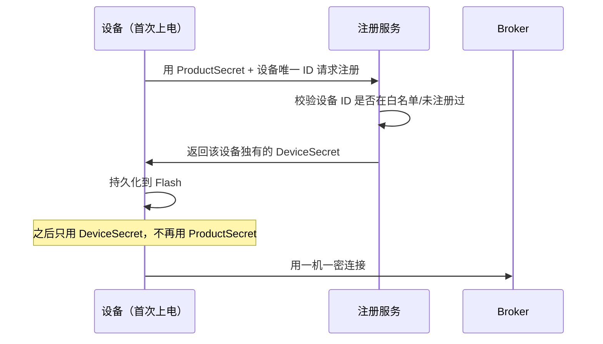

# MQTT Topic 设计、设备认证与 ACL

这一篇讲两件"改起来最贵"的决策。

**Topic 结构**是设备固件里的硬编码字符串。量产十万台之后想改结构，要给全网设备做 OTA，而且新旧固件共存期还得双套 Topic 兼容。

**认证与 ACL** 决定了一台设备被攻破之后损失有多大。默认配置的 Broker 上，任何连上来的客户端都能订阅 `#` 拿到全网数据、也能伪造任意设备的上报。

两件事都属于"上线前想清楚，上线后很难补"的范畴。

:::tip 系列阅读顺序
本文是 [云端 IoT 平台路线图](/posts/iot/cloud-iot-roadmap) 的第二篇。前一篇 [MQTT 与 MQTTnet](/posts/iot/mqtt-mqttnet-basics) 里悬着两个问题——"Topic 别随便定"和"必须配 ACL"，这里讲透。
:::

## Topic 为什么值得认真设计

三个直接影响：

**它是设备固件里的常量。** 改结构等于全网 OTA，成本极高。

**ACL 规则依赖它的结构。** "设备只能发布自己的数据"这条规则，只有在设备标识出现在 Topic 路径里时才能用通配符表达。如果设备标识藏在 payload 里，Broker 无法做权限判断——因为 Broker 不解析 payload。

**服务端路由依赖它。** 从 Topic 直接解出产品和设备标识，比反序列化 payload 快得多，而且在 payload 格式错误时仍能知道消息来自谁。

## 六条设计原则

**一、层级从粗到细**

`产品 → 设备 → 功能 → 方向`。粗的在前，这样通配符订阅才有意义：订阅一个产品下所有设备写 `product/tv1/#`，如果顺序反了就没法表达。

**二、设备标识必须在路径里**

这是 ACL 和路由的前提，前面已经讲了原因。

**三、上行下行明确分离**

设备发布的和设备订阅的要能用前缀区分开，这样 ACL 可以写成"设备对上行 Topic 只有发布权、对下行 Topic 只有订阅权"。混在一起就没法限制，一台被攻破的设备可以伪造服务端下发指令。

**四、不要用可变的业务属性做层级**

```text
❌ home/floor-3/room-302/device/SN001/property/post
```

房间号会变——设备会被搬走、房间会被重新编号。一旦变了，Topic 就得变，而 Topic 是固件里的常量。

**归属关系放数据库，不放 Topic。** Topic 里只能出现设备出厂就确定、终身不变的标识。

**五、层数控制在 4~6 层**

太浅（`data/SN001`）无法表达功能和方向；太深（十几层）通配符匹配变复杂，Broker 的路由树也会变大。

**六、字符集保守**

只用小写字母、数字、`-`、`_`。理由：

- Topic **大小写敏感**，混用大小写是纯粹的 bug 来源
- 中文和空格在部分设备的 MQTT 库里处理有问题
- `#` 和 `+` 是通配符，绝不能出现在发布的 Topic 里
- **不要以 `/` 开头**。`/a/b` 和 `a/b` 是两个不同的 Topic，第一层是空字符串，这个坑很隐蔽

## 推荐的 Topic 规范

```text
{version}/{productKey}/{deviceName}/{category}/{action}
```

一套完整的 Topic 表：

| Topic | 方向 | QoS | Retained | 用途 |
|---|---|---|---|---|
| `v1/{pk}/{dn}/property/post` | 设备 → 云 | 0 | 否 | 属性/遥测上报 |
| `v1/{pk}/{dn}/property/post/reply` | 云 → 设备 | 0 | 否 | 上报确认（可选） |
| `v1/{pk}/{dn}/property/set` | 云 → 设备 | 1 | 否 | 属性设置（改目标温度） |
| `v1/{pk}/{dn}/event/{eventId}/post` | 设备 → 云 | 1 | 否 | 事件上报（告警、故障） |
| `v1/{pk}/{dn}/service/{serviceId}/invoke` | 云 → 设备 | 1 | 否 | 调用服务（自检、重启） |
| `v1/{pk}/{dn}/service/{serviceId}/reply` | 设备 → 云 | 1 | 否 | 服务响应 |
| `v1/{pk}/{dn}/status` | 双向 | 1 | **是** | 在线状态（含 LWT） |
| `v1/{pk}/{dn}/config/get` | 设备 → 云 | 1 | 否 | 请求配置 |
| `v1/{pk}/{dn}/config/push` | 云 → 设备 | 1 | **是** | 配置下推 |
| `v1/{pk}/{dn}/ota/progress` | 设备 → 云 | 1 | 否 | 升级进度 |
| `v1/{pk}/{dn}/ota/upgrade` | 云 → 设备 | 1 | 否 | 升级指令 |

:::note 要不要在 Topic 里放版本号
上表第一层放了 `v1`。这件事有争议，我倾向于放，理由是**它是唯一能让 Topic 结构平滑演进的手段**：将来结构要改，新固件用 `v2`，服务端同时订阅 `v1/#` 和 `v2/#`，老设备不受影响，等存量设备逐步 OTA 完再下线 `v1`。

代价是每条消息多几个字节，以及所有 Topic 都长一点。

**如果你的设备不可能 OTA**（比如低成本传感器刷完就装墙里了），版本号的价值会更大——因为你永远没法改老设备，只能靠版本共存。
:::

对照几个真实见过的反例：

```text
❌ device/data                          没有设备标识，无法做 ACL 和路由
❌ /v1/pk/dn/property/post              以 / 开头，多了一个空层级
❌ v1/PK001/Device_A/Property/Post      大小写混用，早晚出 bug
❌ v1/pk/dn/data                        上下行不分，无法限制权限
❌ v1/pk/dn/room302/temp                业务属性入 Topic，房间变了就废
❌ v1/pk/dn/property/post/temperature   每个属性一个 Topic，订阅和 ACL 都爆炸
```

最后一条值得说明：**不要一个属性一个 Topic。** 一台设备十个属性就是十个 Topic，一万台设备十万个 Topic，Broker 的路由树和你的 ACL 规则都会失控。**一次上报把所有属性打包成一个 JSON**，这也是下一篇物模型的基础。

## 通配符订阅的性能考量

服务端订阅方式对 Broker 压力影响很大：

```csharp
// 方式一：一网打尽。简单，但你会收到所有类型的消息，
// 包括不关心的 OTA 进度、配置请求，然后在代码里过滤
await client.SubscribeAsync("v1/#");

// 方式二：按需精确订阅。Broker 只推你要的，
// 网络和反序列化开销都更小
await client.SubscribeAsync("v1/+/+/property/post");
await client.SubscribeAsync("v1/+/+/event/+/post");
await client.SubscribeAsync("v1/+/+/status");
```

**推荐方式二。** 设备量小时差别不明显，但十万设备场景下"收到再丢掉"的浪费很可观——那些消息占用了 Broker 的推送能力、你的网络带宽和 CPU。

更进一步，**不同职责的消费者订阅不同 Topic**：数据服务只订阅 `property/post`，告警服务只订阅 `event/+/post`，状态服务只订阅 `status`。这样任一服务的处理变慢不会影响其他消息通路。

### 多实例扩展：共享订阅

普通订阅下，**服务端部署两个实例会导致每条消息被处理两次**（两个都收到了）。这是水平扩展时的第一个坑。

MQTT 5 的共享订阅解决这个问题：

```csharp
// $share/{组名}/{真实Topic}
// 同一组内的多个客户端负载均衡，每条消息只投递给组内一个成员
await client.SubscribeAsync("$share/ingest-group/v1/+/+/property/post");
```

```csharp
private static string BuildTopicFilter(string topic, string? shareGroup)
    => string.IsNullOrEmpty(shareGroup) ? topic : $"$share/{shareGroup}/{topic}";

// 配置里给出组名，单实例部署时留空即可
var filter = BuildTopicFilter("v1/+/+/property/post", _options.ShareGroup);
```

:::warning 共享订阅下消息顺序不再保证
负载均衡意味着**同一台设备的连续两条消息可能落到不同实例**，处理顺序无法保证。

如果你的逻辑依赖顺序（比如"先收到开机事件再收到数据"），要么在消息里带序号自己排序，要么按设备哈希分片而不用共享订阅。

好消息是遥测数据通常不依赖顺序——每条自带时间戳，落库后按时间排即可。
:::

## 设备认证

三种模式，按安全性和运维成本排列：

| 模式 | 安全性 | 运维成本 | 适用 |
|---|---|---|---|
| **一型一密**（动态注册） | 低 | 最低 | 产线无法逐台写入密钥时 |
| **一机一密** | 中 | 中 | **绝大多数场景的推荐选择** |
| **X.509 双向证书** | 高 | 高 | 金融、能源、高价值资产 |

### 一机一密

每台设备出厂时烧入独立凭据，通常是三元组：

```text
ProductKey    产品标识，同型号设备相同
DeviceName    设备标识，通常是序列号，全局唯一
DeviceSecret  设备密钥，每台不同，绝不重复
```

**关键实践：不要把 `DeviceSecret` 当密码直接发出去。** 用它做 HMAC 签名，把签名当密码：

```csharp
using System.Security.Cryptography;
using System.Text;

public static class DeviceCredential
{
    /// <summary>
    /// 生成连接凭据。密钥只用于本地计算签名，不在网络上传输。
    /// 这样即使 TLS 被降级或中间环节抓包，也拿不到长期密钥。
    /// </summary>
    public static (string ClientId, string Username, string Password) Build(
        string productKey, string deviceName, string deviceSecret)
    {
        // 时间戳参与签名，让每次连接的密码都不同，
        // 抓到一次也无法长期重放（配合服务端的时间窗口校验）
        var timestamp = DateTimeOffset.UtcNow.ToUnixTimeMilliseconds().ToString();

        var clientId = $"{productKey}.{deviceName}|timestamp={timestamp},signmethod=hmacsha256|";
        var username = $"{deviceName}&{productKey}";

        // 待签名内容：把参数按固定顺序拼接。
        // 顺序必须和服务端校验时完全一致，这是最容易出错的地方
        var content = $"deviceName{deviceName}productKey{productKey}timestamp{timestamp}";

        using var hmac = new HMACSHA256(Encoding.UTF8.GetBytes(deviceSecret));
        var hash = hmac.ComputeHash(Encoding.UTF8.GetBytes(content));
        var password = Convert.ToHexString(hash).ToLowerInvariant();

        return (clientId, username, password);
    }
}
```

服务端校验时用同样的算法重算一遍，比对签名：

```csharp
public sealed class DeviceAuthService
{
    // 时间窗口：防止抓包重放。窗口太小会因设备时钟偏差误拒，
    // 太大则重放窗口变宽。15 分钟是常见折中。
    private static readonly TimeSpan MaxClockSkew = TimeSpan.FromMinutes(15);

    public async Task<AuthResult> AuthenticateAsync(
        string clientId, string username, string password, CancellationToken ct)
    {
        if (!TryParseCredential(clientId, username, out var parsed))
            return AuthResult.Deny("凭据格式错误");

        // 设备必须在册且未被禁用
        var device = await _devices.FindAsync(parsed.ProductKey, parsed.DeviceName, ct);

        if (device is null)
            return AuthResult.Deny("设备未注册");

        if (device.Status == DeviceStatus.Disabled)
            return AuthResult.Deny("设备已被禁用");

        // 时间窗口校验
        var skew = DateTimeOffset.UtcNow - parsed.Timestamp;
        if (skew.Duration() > MaxClockSkew)
            return AuthResult.Deny($"时间戳超出允许范围（偏差 {skew.TotalMinutes:F0} 分钟）");

        var expected = ComputeSignature(device, parsed);

        // 固定时间比较，避免时序攻击
        if (!CryptographicOperations.FixedTimeEquals(
                Encoding.UTF8.GetBytes(expected),
                Encoding.UTF8.GetBytes(password)))
        {
            // 记录失败次数，连续失败要触发风控（可能是被爆破）
            await _devices.RecordAuthFailureAsync(device.Id, ct);
            return AuthResult.Deny("签名校验失败");
        }

        return AuthResult.Allow();
    }
}
```

注意两处细节：**用 `FixedTimeEquals` 而不是 `==`** 比较签名，避免通过响应时间差推断正确值；**认证失败要计数**，同一设备连续失败可能意味着被爆破或固件出问题。

### 一型一密（动态注册）

产线上无法给每台设备写入独立密钥时（比如芯片厂统一烧固件），只能用同型号共享的产品密钥。**它本身不安全**——一台设备被逆向就等于整个型号泄漏。

所以正确用法是**只用它换取一机一密的凭据**：



两个必须做的防护：

**注册要有白名单。** 只允许在册的设备 ID 注册，不能任何人拿着产品密钥就能注册无限设备。

**注册要一次性。** 同一设备 ID 已注册过就拒绝再次注册（除非走人工重置流程），否则攻击者可以顶掉真实设备的凭据。

### X.509 双向证书

安全性最高：设备持有客户端证书，Broker 验证证书链，并可以直接从证书的 CN 字段提取设备标识作为身份，不需要额外的用户名密码。

代价是证书生命周期管理：签发、分发、续期、吊销（CRL/OCSP）。**证书过期导致整批设备连不上**是这条路线的典型事故，必须有到期监控。

一般只在高价值场景用。绝大多数项目一机一密 + TLS 就够了。

## 对接 EMQX：HTTP 认证端点

EMQX 支持多种认证后端（内置数据库、MySQL、PostgreSQL、Redis、JWT、HTTP）。**HTTP 认证最灵活**——把判断逻辑放在你自己的服务里，可以做任意复杂的校验（白名单、风控、动态禁用）。

EMQX 会把连接请求 POST 到你的端点：

```csharp
// EMQX 5.x 的 HTTP 认证约定：
// 返回 200 + {"result":"allow"} 放行，{"result":"deny"} 拒绝，
// {"result":"ignore"} 交给下一个认证器。
// 注意 EMQX 4.x 的约定不同（靠 HTTP 状态码），升级时要改。
app.MapPost("/mqtt/auth", async (
    MqttAuthRequest request,
    DeviceAuthService auth,
    ILogger<Program> logger,
    CancellationToken ct) =>
{
    var result = await auth.AuthenticateAsync(
        request.ClientId, request.Username, request.Password, ct);

    if (!result.IsAllowed)
    {
        // 认证失败要记日志，这是发现攻击和固件问题的主要途径
        logger.LogWarning("设备认证失败 {ClientId} 来自 {Ip}：{Reason}",
            request.ClientId, request.PeerHost, result.Reason);

        return Results.Ok(new { result = "deny" });
    }

    return Results.Ok(new
    {
        result = "allow",
        is_superuser = false,   // 设备绝不能是超级用户，否则 ACL 全部失效
    });
})
.AllowAnonymous();

public sealed record MqttAuthRequest(
    string ClientId,
    string Username,
    string Password,
    string PeerHost);
```

:::warning 认证端点自身的可用性和安全
**这个端点挂了，所有设备都连不上。** 必须考虑：

- **超时要短**（EMQX 侧配置），否则认证阻塞会拖垮 Broker 的连接处理
- **加缓存**，同一设备短时间内重连不必每次都查库
- **要限流**，防止认证端点成为放大攻击的入口
- **只监听内网**，绝不暴露到公网——它接受任意 `clientId` 和 `password` 输入

另外注意 `is_superuser` 绝不能对设备返回 `true`。超级用户会绕过所有 ACL 检查，等于把权限体系整个关掉。
:::

## ACL：最小权限

**默认配置的 Broker 是"允许一切"的。** 这意味着一台被攻破的设备可以：

- 订阅 `#`，拿到全网所有设备的数据
- 往任意设备的下行 Topic 发布，伪造服务端指令控制别人的设备
- 往任意上行 Topic 发布，伪造别的设备的数据（在计费场景里就是伪造账单）

ACL 要做到**设备只能读写自己路径下的 Topic**。EMQX 5 的文件式规则用 `${username}`、`${clientid}` 做占位符：

```erlang
%% EMQX 5 的 acl.conf。注意 EMQX 4 的占位符语法是 %u / %c，不通用。

%% 允许设备发布自己的上行 Topic
{allow, all, publish, ["v1/${username}/property/post",
                       "v1/${username}/event/+/post",
                       "v1/${username}/service/+/reply",
                       "v1/${username}/status",
                       "v1/${username}/ota/progress",
                       "v1/${username}/config/get"]}.

%% 允许设备订阅自己的下行 Topic
{allow, all, subscribe, ["v1/${username}/property/set",
                         "v1/${username}/service/+/invoke",
                         "v1/${username}/ota/upgrade",
                         "v1/${username}/config/push"]}.

%% 兜底拒绝：任何未明确允许的操作都禁止。
%% 这一条必须放在最后，也是整个 ACL 的关键。
{deny, all}.
```

这里假设 `username` 编码了 `{productKey}/{deviceName}`。如果你的用户名格式不同，就用 `${clientid}` 或改 Topic 结构配合。

**最后那条 `{deny, all}` 是整套规则的核心。** 没有它，未匹配的请求会走默认策略（通常是允许），前面的规则就都白写了。

同样可以用 HTTP 端点做动态 ACL：

```csharp
app.MapPost("/mqtt/acl", async (
    MqttAclRequest request,
    IDeviceTopicPolicy policy,
    CancellationToken ct) =>
{
    // action 是 "publish" 或 "subscribe"
    var allowed = await policy.IsAllowedAsync(
        request.Username, request.Topic, request.Action, ct);

    return Results.Ok(new { result = allowed ? "allow" : "deny" });
})
.AllowAnonymous();
```

```csharp
public sealed class DeviceTopicPolicy : IDeviceTopicPolicy
{
    private static readonly string[] PublishablePatterns =
    [
        "property/post", "event/+/post", "service/+/reply",
        "status", "ota/progress", "config/get",
    ];

    private static readonly string[] SubscribablePatterns =
    [
        "property/set", "service/+/invoke", "ota/upgrade", "config/push",
    ];

    public Task<bool> IsAllowedAsync(
        string username, string topic, string action, CancellationToken ct)
    {
        // 强制前缀：Topic 必须落在这台设备自己的命名空间下
        var prefix = $"v1/{username}/";

        if (!topic.StartsWith(prefix, StringComparison.Ordinal))
            return Task.FromResult(false);

        var suffix = topic[prefix.Length..];

        var patterns = action switch
        {
            "publish" => PublishablePatterns,
            "subscribe" => SubscribablePatterns,
            _ => [],
        };

        return Task.FromResult(patterns.Any(p => MatchesPattern(suffix, p)));
    }
}
```

**服务端账号要单独一套权限**：它需要订阅通配符 Topic、向所有设备下发指令，但同样不该是超级用户。给它一个专用账号并显式列出允许的 Topic 模式，避免服务端被入侵后损失无上限。

## TLS

**生产环境用 8883（TLS），不要用 1883。** 明文传输意味着抓包就能拿到凭据和全部数据。

```csharp
var options = new MqttClientOptionsBuilder()
    .WithTcpServer("iot.example.com", 8883)
    .WithTlsOptions(o => o
        .UseTls()
        // 生产环境必须校验证书。设为 true 等于放弃 TLS 的身份认证价值，
        // 中间人可以用自签证书解密全部流量。
        .WithAllowUntrustedCertificates(false)
        .WithIgnoreCertificateChainErrors(false))
    .Build();
```

:::warning 设备时钟不对会导致 TLS 校验失败
这是嵌入式设备的经典问题：**证书校验要比对当前时间和证书的有效期**。设备主板电池没电、首次上电还没同步 NTP 时，系统时间可能是 1970 年或 2000 年，落在证书有效期之外，TLS 握手直接失败。

现场表现是"设备连不上，但网络是通的，换台设备就好了"。

设备侧的应对：先用 NTP 或 HTTP 响应头同步时间，再建立 TLS 连接。这个顺序在固件里要写对。
:::

双向 TLS（mTLS）额外要求设备提供客户端证书，Broker 可以直接从证书提取身份，省掉用户名密码。安全性更高，但要接受证书管理的运维成本。

## 安全检查清单

上线前逐条确认：

**认证**

- 一机一密，绝不用同型号共享密钥直连
- 密钥不在网络上传输，用 HMAC 签名
- 签名含时间戳，服务端校验时间窗口
- 签名比较用 `FixedTimeEquals`
- 认证失败有日志和计数，连续失败触发风控
- 设备可被远程禁用，且禁用后现存连接会被踢下线

**授权**

- ACL 规则以 `{deny, all}` 兜底
- 设备只能读写自己命名空间下的 Topic
- 上行只有发布权，下行只有订阅权
- 设备账号 `is_superuser` 为 false
- 服务端账号权限单独定义并显式列举

**传输**

- 生产只开 8883，1883 关闭或仅限内网
- 客户端校验服务端证书，不忽略链错误
- 设备先同步时间再建 TLS
- 证书到期有监控告警

**运维面**

- EMQX 管理面板默认密码已改，且不暴露公网
- 认证/ACL 端点只监听内网、有超时和限流
- Topic 结构带版本号，为演进留了余地

:::details 常见问题速查 | 点开看认证与 ACL 的高频坑
**设备连接被拒绝，日志只说认证失败**
用 MQTT 5 能拿到原因码，区分是签名错、设备未注册还是被禁用。3.1.1 只能靠服务端日志。

**签名校验总是不通过**
待签名内容的拼接顺序和服务端不一致。这是最常见的原因，把两边的待签名字符串都打出来对比。

**部分设备认证失败，换台就好**
设备时钟偏差超出时间窗口，或 TLS 证书校验因时间不对而失败。

**配了 ACL 但设备还是能订阅 `#`**
缺少 `{deny, all}` 兜底，或者账号被标成了 `is_superuser`。

**ACL 配好后设备连不上了**
状态 Topic（含 LWT）忘了加发布权限。遗嘱消息也需要发布权，漏了会导致连接被拒。

**服务端多实例部署后每条消息处理两次**
普通订阅下所有实例都会收到。用 MQTT 5 共享订阅。

**共享订阅后消息顺序乱了**
负载均衡的固有特性。依赖顺序的逻辑要自己带序号排序，或改用按设备哈希分片。

**认证端点挂了导致全网设备连不上**
单点依赖。要加缓存、配超时，并考虑降级策略（比如短时间内允许曾认证成功的设备重连）。

**改 Topic 结构后老设备全部失联**
Topic 是固件常量。这就是建议第一层放版本号的原因——新旧结构可以共存过渡。

**Topic 里带了中文，部分设备正常部分乱码**
不同 MQTT 库对非 ASCII 的处理不一致。Topic 只用小写字母数字和 `-` `_`。

**同一个 Topic 有时收到有时收不到**
检查是否以 `/` 开头。`/a/b` 和 `a/b` 是不同的 Topic。
:::

## 小结

两件事的结论：

1. **Topic 是固件常量**，设备标识必须在路径里（ACL 和路由都依赖它），业务属性绝不入 Topic
2. **上下行分离**，才能限制"设备不能伪造服务端指令"
3. **一次上报打包所有属性**，不要一个属性一个 Topic
4. **第一层放版本号**，这是 Topic 结构唯一能平滑演进的方式
5. **服务端精确订阅而非 `#`**，多实例用 MQTT 5 共享订阅
6. **一机一密 + HMAC 签名**，密钥不上网、签名带时间戳、比较用固定时间
7. **ACL 必须以 `{deny, all}` 兜底**，设备绝不能是超级用户
8. **生产只开 TLS**，并注意设备时钟会导致证书校验失败

下一篇 [物模型：属性、事件、服务三要素](/posts/iot/thing-model) 把所有设备的能力统一成三类，让新增设备品类不用改一行代码。这也是本篇"一次上报打包所有属性"的自然延续。
