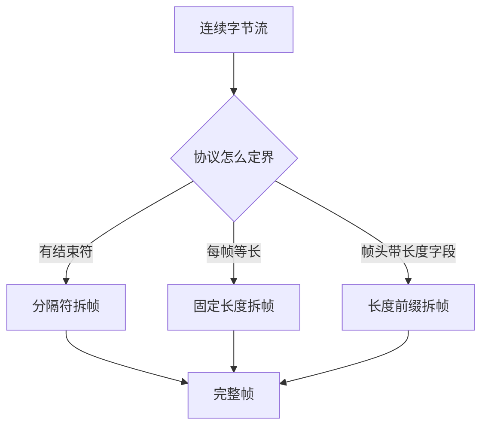

# 串口通信与设备协议拆帧：.NET 对接工业设备的地基

工业设备对接的第一课几乎必然是串口。称重仪表、老式读卡器、LED 显示屏、条码扫描枪、电子秤、部分 PLC，接口都是 RS232 或 RS485。

而这一课最大的坑不在"怎么打开串口"——那只有几行代码——**而在"怎么把连绵不断的字节流切成一帧一帧的消息"**。几乎所有"平时好用、偶尔出乱码""跑一天后数据错位"的问题，根源都在这里。

:::tip 系列阅读顺序
本文是 [.NET 对接工业设备路线图](/posts/iot/industrial-device-roadmap) 的第一篇。建议先确认你已经熟悉 [async/await](/posts/dotnet/csharp-async-await) 和 [BackgroundService](/posts/dotnet/aspnet-core-background-service)，本文最后会把采集循环放进后台服务里。
:::

## 串口到底是什么

串口（Serial Port）就是**一根线一位一位地传字节**。它没有包的概念、没有校验重传、没有连接状态，就是纯粹的字节流。理解这一点，后面拆帧的必要性就是自然结论。

现场会遇到三种电气标准，代码层面区别不大，但接线和拓扑完全不同：

| 标准 | 传输距离 | 拓扑 | 典型场景 |
|---|---|---|---|
| **RS232** | 约 15 米 | 点对点，一对一 | 称重仪表接工控机、老式打印机 |
| **RS485** | 约 1200 米 | 总线，一主多从 | 多台电表、传感器、变频器 |
| **TTL/UART** | 板内 | 点对点 | 单片机、模块间通信 |

对写代码的人来说，两个必须知道的差异：

**RS232 是全双工**，收发互不干扰，你随时可以读也可以写。

**RS485 通常是半双工**，收和发共用一对差分线。这带来一个实际约束：**总线上必须有主从，同一时刻只能有一个设备在发**。所以 RS485 的协议基本都是"主机问、从机答"的形式，每帧带一个从机地址（Modbus 就是典型）。如果你在 RS485 上写出"两边同时主动发"的代码，报文会互相冲垮。

现场还有第四种情况：**串口服务器**。它把 RS232/RS485 转成以太网，你的程序看到的是一个 IP + 端口，用 `TcpClient` 连。这非常常见，所以本文最后会把两者抽象成同一个接口。

## 五个必须两端一致的参数

串口没有协商机制，两端参数不一致就直接是垃圾数据。设备手册上一定会写明这几项，照抄即可：

| 参数 | 常见值 | 含义 |
|---|---|---|
| **波特率 BaudRate** | 9600、19200、115200 | 每秒传输多少位。最常配错的一项 |
| **数据位 DataBits** | 8（偶见 7） | 一个字符占多少位 |
| **停止位 StopBits** | 1（偶见 2） | 每个字符后的间隔标记 |
| **校验位 Parity** | None、Even、Odd | 简单的奇偶校验 |
| **流控 Handshake** | None（绝大多数） | 硬件/软件流控，工业设备基本不用 |

配错的现象是有规律的，记住能省很多时间：

- **波特率错** → 收到数据但全是乱码，且乱码长度和真实数据长度大致成比例
- **数据位/校验位错** → 部分字节正确、部分错乱，或频繁触发 `ErrorReceived`
- **停止位错** → 偶发错字节，越长的帧越容易错
- **完全收不到数据** → 先查接线（TX/RX 是否交叉、GND 是否接）和端口号，不是参数问题
- **RS485 收到自己发的内容** → 回显（echo），部分转换器特性，需要在协议层过滤

:::note 一个常被忽略的排查手段
在写任何代码之前，先用串口调试助手（SSCOM、友善串口调试助手等）连一次设备，确认参数对、能看到数据。

**先确认物理链路通，再写代码。** 否则你会花几个小时调试一个接线问题。
:::

## .NET 里打开串口

.NET Framework 时代 `SerialPort` 在 BCL 里，**.NET Core 及以后需要单独装包**：

```bash
dotnet add package System.IO.Ports
```

:::warning 跨平台注意
`System.IO.Ports` 在 Windows 上功能完整。Linux 上可用但有限制（部分属性不支持、需要用户在 `dialout` 组里）。macOS 支持最弱。

工业项目基本都部署在 Windows 工控机上，这个限制通常不构成问题。
:::

枚举和打开：

```csharp
using System.IO.Ports;

// 列出当前可用端口。Windows 返回 COM1、COM3...；Linux 返回 /dev/ttyUSB0...
foreach (var name in SerialPort.GetPortNames())
{
    Console.WriteLine(name);
}

var port = new SerialPort
{
    PortName = "COM3",
    BaudRate = 9600,
    DataBits = 8,
    StopBits = StopBits.One,
    Parity = Parity.None,
    Handshake = Handshake.None,

    // 强烈建议显式设置超时。默认是 InfiniteTimeout(-1)，
    // 同步读会永久阻塞，进程退不掉。
    ReadTimeout = 2000,
    WriteTimeout = 2000,
};

port.Open();

// 打开后先清一次缓冲区，丢掉打开前设备已经发出的半截数据
port.DiscardInBuffer();
port.DiscardOutBuffer();
```

写数据：

```csharp
// ASCII 命令（命令应答型仪表常见）
port.Write("READ\r\n");

// 二进制帧
byte[] frame = [0x01, 0x03, 0x00, 0x00, 0x00, 0x02, 0xC4, 0x0B];
port.Write(frame, 0, frame.Length);
```

## 为什么不要在 DataReceived 里直接解析

网上大多数示例是这样的，这也是最容易埋雷的写法：

```csharp
// ❌ 生产环境不要这么写
port.DataReceived += (sender, e) =>
{
    string data = port.ReadExisting();   // 读到什么就是什么
    decimal weight = ParseWeight(data);  // 直接当成一帧解析
    UpdateUI(weight);
};
```

三个问题，每一个都会在现场爆掉：

**一、`DataReceived` 给你的不是"一帧"，而是"这一刻串口缓冲区里有的字节"**

设备发 `ST,GS,+  0123.5kg\r\n` 这 20 个字节，你可能触发一次拿到全部，也可能触发三次分别拿到 `ST,GS,+`、`  0123.5`、`kg\r\n`。也可能一次拿到一帧半。**这不是偶发，是常态**，取决于波特率、缓冲区大小和操作系统调度。所以直接解析必然出现"偶尔解析失败""数字被截断"。

**二、它在线程池线程上执行，且异常会被吞掉**

事件处理器里抛出的异常不会传播到你的主逻辑，你只会看到"数据莫名其妙不更新了"。直接碰 UI 控件还会引发跨线程异常。

**三、事件是串行触发但不保证顺序处理**

处理器里做耗时操作（写库、调接口）会导致后续数据在驱动缓冲区里堆积甚至溢出。

**正确的模型是：读取和解析分离。** 用一个循环持续读原始字节丢进缓冲区，由拆帧器负责切出完整帧，再交给业务处理：

```text
读取循环 → 累积缓冲区 → 拆帧器 → 完整帧 → 解析 → 业务队列
```

## 推荐的读取循环

用 `BaseStream` 做异步读取，把字节喂给拆帧器：

```csharp
private async Task ReadLoopAsync(SerialPort port, CancellationToken ct)
{
    var buffer = new byte[1024];

    while (!ct.IsCancellationRequested)
    {
        int read;
        try
        {
            // 注意：这里读到的是"任意长度的字节片段"，不是一帧
            read = await port.BaseStream.ReadAsync(buffer, ct);
        }
        catch (OperationCanceledException)
        {
            break;
        }
        catch (Exception ex) when (ex is IOException or InvalidOperationException)
        {
            // 设备拔线、串口被关闭都会走到这里
            _logger.LogWarning(ex, "串口读取中断，准备重连");
            break;
        }

        if (read == 0) continue;

        // 原始报文落盘/记日志：出问题时这是唯一的证据
        _logger.LogTrace("RX {Hex}", Convert.ToHexString(buffer.AsSpan(0, read)));

        _framer.Append(buffer.AsSpan(0, read));
    }
}
```

:::warning SerialPort 的取消支持不完善
`SerialPort.BaseStream.ReadAsync` 对 `CancellationToken` 的支持在 .NET 上长期不完整，取消令牌不一定能中断一个正在阻塞的读取。

可靠的停止方式是**直接 `Dispose()` 掉 `SerialPort`**，让阻塞中的读取抛 `IOException` 或 `InvalidOperationException` 退出循环——所以上面的 `catch` 才要把这两种异常当成正常退出处理。
:::

## 核心：拆帧

**串口和 TCP 都是字节流，字节流没有消息边界。** 这是必须自己拆帧的根本原因。设备协议一定会用某种方式标记边界，无非三类。



### 方式一：分隔符（ASCII 协议最常见）

称重仪表、扫码枪、GPS 模块基本都以 `\r\n` 结束一帧。实现思路是维护一个累积缓冲区，每次追加后反复查找分隔符：

```csharp
using System.Buffers;

/// <summary>
/// 按分隔符拆帧。线程不安全，约定只在单个读取循环里使用。
/// </summary>
public sealed class DelimiterFramer
{
    private readonly byte[] _delimiter;
    private readonly int _maxFrameLength;
    private readonly ArrayBufferWriter<byte> _buffer = new();

    public DelimiterFramer(byte[] delimiter, int maxFrameLength = 4096)
    {
        _delimiter = delimiter;
        _maxFrameLength = maxFrameLength;
    }

    /// <summary>拆出完整帧时触发，参数是不含分隔符的帧内容。</summary>
    public event Action<ReadOnlyMemory<byte>>? FrameReceived;

    public void Append(ReadOnlySpan<byte> data)
    {
        _buffer.Write(data);

        while (true)
        {
            var span = _buffer.WrittenSpan;
            int index = span.IndexOf(_delimiter);

            if (index < 0)
            {
                // 还没收到完整帧。防御脏数据把内存吃光：
                // 超长且找不到分隔符，说明参数配错或数据错位，丢弃重新同步
                if (span.Length > _maxFrameLength)
                {
                    _buffer.Clear();
                }
                return;
            }

            // 取出一帧（不含分隔符）
            var frame = span[..index].ToArray();
            FrameReceived?.Invoke(frame);

            // 把已消费的部分从缓冲区移除
            int consumed = index + _delimiter.Length;
            var rest = span[consumed..].ToArray();
            _buffer.Clear();
            _buffer.Write(rest);
        }
    }
}
```

用起来：

```csharp
var framer = new DelimiterFramer("\r\n"u8.ToArray());

framer.FrameReceived += frame =>
{
    string text = Encoding.ASCII.GetString(frame.Span);
    Console.WriteLine($"收到一帧：{text}");
};

// 故意分三次喂进去，模拟真实的分片到达
framer.Append("ST,GS,+  012"u8);
framer.Append("3.5kg\r\nST,GS,+  0124.0k"u8);
framer.Append("g\r\n"u8);

// 输出：
// 收到一帧：ST,GS,+  0123.5kg
// 收到一帧：ST,GS,+  0124.0kg
```

这个测试值得专门写一遍：**能通过"任意位置切断"的测试，拆帧器才算对。** 现场的分片方式你无法预测。

### 方式二：固定长度

部分老设备每帧长度固定（比如 8 字节状态帧）：

```csharp
public sealed class FixedLengthFramer
{
    private readonly int _frameLength;
    private readonly ArrayBufferWriter<byte> _buffer = new();

    public FixedLengthFramer(int frameLength) => _frameLength = frameLength;

    public event Action<ReadOnlyMemory<byte>>? FrameReceived;

    public void Append(ReadOnlySpan<byte> data)
    {
        _buffer.Write(data);

        while (_buffer.WrittenCount >= _frameLength)
        {
            var span = _buffer.WrittenSpan;
            FrameReceived?.Invoke(span[.._frameLength].ToArray());

            var rest = span[_frameLength..].ToArray();
            _buffer.Clear();
            _buffer.Write(rest);
        }
    }
}
```

固定长度有个隐患：**一旦错位就会一直错**。所以协议一般还带帧头标识，实践中要先同步到帧头再按长度切。

### 方式三：长度前缀（二进制私有协议标配）

典型帧结构：

```text
+--------+--------+----------+--------+
| 帧头   | 长度   | 数据     | 校验   |
| 0x68   | 1~2字节| N 字节   | CRC16  |
+--------+--------+----------+--------+
```

这类协议用 `System.IO.Pipelines` 处理最干净，它天生解决"数据跨多次读取"的问题，不用自己搬缓冲区：

```csharp
using System.Buffers;
using System.Buffers.Binary;
using System.IO.Pipelines;

private async Task ReadWithPipelinesAsync(Stream stream, CancellationToken ct)
{
    var reader = PipeReader.Create(stream);

    while (!ct.IsCancellationRequested)
    {
        ReadResult result = await reader.ReadAsync(ct);
        ReadOnlySequence<byte> buffer = result.Buffer;

        // 一次读取里可能包含多帧，循环取到取不出为止
        while (TryReadFrame(ref buffer, out ReadOnlySequence<byte> frame))
        {
            HandleFrame(frame.ToArray());
        }

        // 告诉 Pipe：buffer.Start 之前的已消费，剩下的下次继续给我
        reader.AdvanceTo(buffer.Start, buffer.End);

        if (result.IsCompleted) break;
    }

    await reader.CompleteAsync();
}

private static bool TryReadFrame(
    ref ReadOnlySequence<byte> buffer,
    out ReadOnlySequence<byte> frame)
{
    frame = default;

    // 至少要够 帧头(1) + 长度(2)
    if (buffer.Length < 3) return false;

    var reader = new SequenceReader<byte>(buffer);

    // 同步帧头：不是 0x68 就逐字节丢弃，直到找到为止
    while (reader.TryPeek(out byte head) && head != 0x68)
    {
        reader.Advance(1);
    }

    if (reader.Remaining < 3)
    {
        // 丢掉已确认无效的部分，避免重复扫描
        buffer = buffer.Slice(reader.Position);
        return false;
    }

    Span<byte> header = stackalloc byte[3];
    reader.TryCopyTo(header);

    // 大端读长度（具体端序看设备手册，这是最容易搞反的地方）
    ushort payloadLength = BinaryPrimitives.ReadUInt16BigEndian(header[1..3]);

    int totalLength = 3 + payloadLength + 2; // 帧头+长度 + 数据 + CRC16
    if (reader.Remaining < totalLength)
    {
        // 半帧，等下次数据
        buffer = buffer.Slice(reader.Position);
        return false;
    }

    var start = reader.Position;
    frame = buffer.Slice(start, totalLength);
    buffer = buffer.Slice(buffer.GetPosition(totalLength, start));
    return true;
}
```

关键在 `AdvanceTo(consumed, examined)` 这两个参数：`consumed` 表示"这些字节我处理完了，可以回收"，`examined` 表示"这些我看过了，别在没有新数据时重复叫醒我"。半帧场景下 `consumed` 不动、`examined` 到末尾，正是这个 API 的设计意图。

## 解析：从帧到业务数据

### ASCII 帧

以称重仪表的连续输出为例。**每家仪表格式都不一样，必须拿到通信手册**，下面只是一种常见形式：

```text
ST,GS,+  0123.5kg
│  │  │      │
│  │  │      └─ 数值
│  │  └──────── 符号
│  └─────────── GS=毛重 NT=净重
└────────────── ST=稳定 US=不稳定
```

```csharp
public readonly record struct WeightReading(decimal Weight, bool IsStable, string Unit);

public static bool TryParseWeight(string frame, out WeightReading reading)
{
    reading = default;

    // ST,GS,+  0123.5kg
    var parts = frame.Split(',', StringSplitOptions.TrimEntries);
    if (parts.Length < 3) return false;

    bool isStable = parts[0] == "ST";

    var valuePart = parts[2];                    // "+  0123.5kg"
    var sign = valuePart[0] == '-' ? -1 : 1;

    // 抠出数字部分和单位
    var digits = new string(valuePart.Where(c => char.IsDigit(c) || c == '.').ToArray());
    var unit = new string(valuePart.Where(char.IsLetter).ToArray());

    if (!decimal.TryParse(digits, out var value)) return false;

    reading = new WeightReading(sign * value, isStable, unit);
    return true;
}
```

:::important 示数不等于重量
`IsStable` 为 true 只是仪表自己认为稳了，**直接拿来记账是不够的**。车辆还在晃、风载、司机没熄火都会让示数反复跳动。

生产上还要加一层判稳：连续 N 帧（比如 10 帧）的极差小于阈值（比如 10kg）才认定有效。这部分留到地磅专篇细讲，这里先记住"帧解析成功 ≠ 重量可用"。
:::

### 二进制帧与 CRC 校验

工业私有协议和 Modbus 大量使用 CRC16。Modbus 版本的实现（初值 `0xFFFF`，多项式反转为 `0xA001`）：

```csharp
public static ushort Crc16Modbus(ReadOnlySpan<byte> data)
{
    ushort crc = 0xFFFF;

    foreach (byte b in data)
    {
        crc ^= b;
        for (int i = 0; i < 8; i++)
        {
            if ((crc & 1) != 0)
                crc = (ushort)((crc >> 1) ^ 0xA001);
            else
                crc >>= 1;
        }
    }

    return crc;
}
```

校验和字段提取：

```csharp
public static bool ValidateFrame(ReadOnlySpan<byte> frame)
{
    if (frame.Length < 3) return false;

    var body = frame[..^2];
    var expected = Crc16Modbus(body);

    // Modbus 的 CRC 在帧尾是小端；其他私有协议可能是大端，看手册
    var actual = BinaryPrimitives.ReadUInt16LittleEndian(frame[^2..]);

    return expected == actual;
}
```

**校验不过的帧一定要丢弃并记日志，不要"尽力解析"。** 错误数据比没有数据更危险。

## 把串口和 TCP 抽象成同一个通道

现场很可能这样变更：原本工控机直连仪表串口，后来磅房搬远了，改用串口服务器走网线。如果 `SerialPort` 散落在解析代码里，这次变更就是重写。

抽象一层就够了：

```csharp
/// <summary>设备通信通道。屏蔽串口与 TCP 的差异。</summary>
public interface IDeviceChannel : IAsyncDisposable
{
    bool IsConnected { get; }
    Task ConnectAsync(CancellationToken ct);
    ValueTask<int> ReadAsync(Memory<byte> buffer, CancellationToken ct);
    ValueTask WriteAsync(ReadOnlyMemory<byte> data, CancellationToken ct);
}
```

串口实现：

```csharp
public sealed class SerialPortChannel : IDeviceChannel
{
    private readonly SerialPortOptions _options;
    private SerialPort? _port;

    public SerialPortChannel(SerialPortOptions options) => _options = options;

    public bool IsConnected => _port?.IsOpen == true;

    public Task ConnectAsync(CancellationToken ct)
    {
        _port = new SerialPort(_options.PortName, _options.BaudRate,
                               _options.Parity, _options.DataBits, _options.StopBits)
        {
            ReadTimeout = 2000,
            WriteTimeout = 2000,
        };

        _port.Open();
        _port.DiscardInBuffer();
        return Task.CompletedTask;
    }

    public ValueTask<int> ReadAsync(Memory<byte> buffer, CancellationToken ct)
        => _port!.BaseStream.ReadAsync(buffer, ct);

    public ValueTask WriteAsync(ReadOnlyMemory<byte> data, CancellationToken ct)
        => _port!.BaseStream.WriteAsync(data, ct);

    public ValueTask DisposeAsync()
    {
        _port?.Dispose();   // 这也是解除阻塞读取的手段
        return ValueTask.CompletedTask;
    }
}
```

TCP 实现：

```csharp
public sealed class TcpChannel : IDeviceChannel
{
    private readonly string _host;
    private readonly int _port;
    private TcpClient? _client;
    private NetworkStream? _stream;

    public TcpChannel(string host, int port) => (_host, _port) = (host, port);

    public bool IsConnected => _client?.Connected == true;

    public async Task ConnectAsync(CancellationToken ct)
    {
        _client = new TcpClient { NoDelay = true };  // 关掉 Nagle，小帧场景必须
        await _client.ConnectAsync(_host, _port, ct);
        _stream = _client.GetStream();
    }

    public ValueTask<int> ReadAsync(Memory<byte> buffer, CancellationToken ct)
        => _stream!.ReadAsync(buffer, ct);

    public ValueTask WriteAsync(ReadOnlyMemory<byte> data, CancellationToken ct)
        => _stream!.WriteAsync(data, ct);

    public ValueTask DisposeAsync()
    {
        _stream?.Dispose();
        _client?.Dispose();
        return ValueTask.CompletedTask;
    }
}
```

配置驱动选型，业务代码完全不感知：

```json
{
  "Weighing": {
    "ChannelType": "SerialPort",
    "PortName": "COM3",
    "BaudRate": 9600,
    "Host": "192.168.1.200",
    "TcpPort": 4001
  }
}
```

```csharp
builder.Services.AddSingleton<IDeviceChannel>(sp =>
{
    var cfg = sp.GetRequiredService<IConfiguration>().GetSection("Weighing");

    return cfg["ChannelType"] switch
    {
        "SerialPort" => new SerialPortChannel(new SerialPortOptions
        {
            PortName = cfg["PortName"]!,
            BaudRate = cfg.GetValue<int>("BaudRate"),
        }),
        "Tcp" => new TcpChannel(cfg["Host"]!, cfg.GetValue<int>("TcpPort")),
        var other => throw new NotSupportedException($"未知通道类型：{other}"),
    };
});
```

## 放进 BackgroundService

采集循环必须常驻，而且要能自动重连。把读到的帧丢进 `Channel`，业务侧慢慢消费，采集就不会被写库阻塞：

```csharp
public sealed class WeighingCollectorService : BackgroundService
{
    private readonly IDeviceChannel _channel;
    private readonly ChannelWriter<WeightReading> _writer;
    private readonly ILogger<WeighingCollectorService> _logger;
    private readonly DelimiterFramer _framer;

    public WeighingCollectorService(
        IDeviceChannel channel,
        Channel<WeightReading> queue,
        ILogger<WeighingCollectorService> logger)
    {
        _channel = channel;
        _writer = queue.Writer;
        _logger = logger;

        _framer = new DelimiterFramer("\r\n"u8.ToArray());
        _framer.FrameReceived += OnFrame;
    }

    protected override async Task ExecuteAsync(CancellationToken stoppingToken)
    {
        var buffer = new byte[1024];

        // 外层循环负责重连，内层循环负责读取
        while (!stoppingToken.IsCancellationRequested)
        {
            try
            {
                await _channel.ConnectAsync(stoppingToken);
                _logger.LogInformation("称重通道已连接");

                while (!stoppingToken.IsCancellationRequested)
                {
                    int read = await _channel.ReadAsync(buffer, stoppingToken);
                    if (read == 0) break;   // 对端关闭

                    _framer.Append(buffer.AsSpan(0, read));
                }
            }
            catch (OperationCanceledException) when (stoppingToken.IsCancellationRequested)
            {
                break;   // 正常停机
            }
            catch (Exception ex)
            {
                _logger.LogError(ex, "称重通道异常，5 秒后重连");
            }

            await _channel.DisposeAsync();

            try
            {
                await Task.Delay(TimeSpan.FromSeconds(5), stoppingToken);
            }
            catch (OperationCanceledException) { break; }
        }
    }

    private void OnFrame(ReadOnlyMemory<byte> frame)
    {
        var text = Encoding.ASCII.GetString(frame.Span);

        if (!TryParseWeight(text, out var reading))
        {
            _logger.LogWarning("无法解析的帧：{Frame}", text);
            return;
        }

        // 满了就丢最旧的：实时示数场景下，旧数据没有价值
        _writer.TryWrite(reading);
    }
}
```

注册：

```csharp
builder.Services.AddSingleton(Channel.CreateBounded<WeightReading>(
    new BoundedChannelOptions(100)
    {
        FullMode = BoundedChannelFullMode.DropOldest,
    }));

builder.Services.AddHostedService<WeighingCollectorService>();
```

:::note 为什么用 DropOldest
称重示数是"当前状态"，不是"必须处理的事件"。积压时保留最新的才合理。

但**刷卡记录、过磅结算这类事件必须用 `Wait` 模式或落库兜底**，不能丢。同一个系统里两种策略并存是正常的，取决于数据语义。
:::

## 没有设备时怎么开发

这是这类项目最实际的问题：设备在客户现场，你在办公室。

**第一步：虚拟串口对**

用 com0com（开源）或 Virtual Serial Port Driver 创建一对互联的虚拟串口，比如 COM10 和 COM11。你的程序连 COM10，模拟器连 COM11，两边就能通信。

**第二步：写模拟器**

一个几十行的控制台程序，按真实仪表的格式和频率发帧：

```csharp
using System.IO.Ports;

var port = new SerialPort("COM11", 9600) { NewLine = "\r\n" };
port.Open();

var random = new Random();
decimal weight = 0m;

Console.WriteLine("模拟称重仪表已启动，按 Ctrl+C 退出");

while (true)
{
    // 模拟车辆上磅：重量爬升 -> 稳定 -> 离开
    weight = weight < 30000m ? weight + random.Next(500, 2000) : 0m;

    bool stable = weight > 0 && random.Next(10) > 2;
    var jitter = stable ? 0 : random.Next(-50, 50);

    var frame = $"{(stable ? "ST" : "US")},GS,+{weight + jitter,8:F1}kg";
    port.WriteLine(frame);
    Console.WriteLine($"TX {frame}");

    await Task.Delay(200);
}
```

模拟器的价值远超"能跑起来"：你可以主动构造**异常场景**——发半帧然后停住、发乱码、发超长帧、突然断开。这些在现场极难复现，但一定会发生。**能扛住模拟器故意折腾的代码，上现场才踏实。**

**第三步：原始报文落盘**

按天滚动记录收发的原始字节（Hex + ASCII 双份）。现场出问题时，客户只会说"数据不对"，你需要的是当时的真实字节。

:::details 常见问题速查 | 点开看串口开发的高频坑
**`UnauthorizedAccessException: Access to the port 'COM3' is denied`**
端口被别的进程占用——最常见的是你自己开着的串口调试助手，或者上一次程序崩溃没释放。

**`Access to the port` 但确认没人占用**
上次进程残留。任务管理器结束进程，或换个端口验证。

**收到数据但全是乱码**
先怀疑波特率。其次是数据位/校验位。**乱码但长度合理 = 参数错；完全无数据 = 接线或端口错。**

**中文乱码（而非全乱）**
设备大概率用 GBK。.NET Core 默认不带 GBK，需要：

```csharp
// 装 System.Text.Encoding.CodePages 包，程序启动时注册一次
Encoding.RegisterProvider(CodePagesEncodingProvider.Instance);
var gbk = Encoding.GetEncoding("GBK");
```

**USB 转串口设备拔插后端口号变了**
Windows 按设备实例分配 COM 号，换 USB 口就可能变号。生产环境要么固定 USB 口，要么启动时用 `GetPortNames()` 加设备描述做匹配，不要硬编码。

**`DataReceived` 不触发**
检查是否设了 `Handshake` 但设备不支持流控；检查 `ReceivedBytesThreshold`（默认 1）；确认设备真的在发（用调试助手对照）。

**程序退出时卡住不动**
同步 `Read` 且 `ReadTimeout` 是默认的 `InfiniteTimeout`。始终显式设置超时，停机时 `Dispose` 端口。

**RS485 上收到自己发的报文**
部分转换器有回显。协议层过滤掉（比较收到的帧和刚发出的帧），或换转换器。

**多台 RS485 设备同时应答导致数据错乱**
RS485 半双工总线必须严格主从轮询：发一条、等应答或超时、再发下一条。不能并发。
:::

## 小结

这一篇的核心结论只有三条，但足以决定项目质量：

1. **读取和解析必须分离。** `DataReceived` 里直接解析是这类项目最普遍的错误写法。
2. **字节流没有边界，拆帧是必需品。** 分隔符、固定长度、长度前缀三种方式覆盖了绝大多数设备协议，拆帧器要能通过"任意位置切断"的测试。
3. **通道要抽象。** 串口和 TCP 用同一个接口，现场换成串口服务器时不用改一行解析代码。

下一篇 [私有 TCP 协议与二进制解析](/posts/iot/tcp-protocol-binary-parsing) 会在这个基础上讲完整的私有协议处理：帧结构建模、BCD 与定点小数、CRC 变体、请求应答关联与超时、心跳保活，以及断线重连的退避策略。
