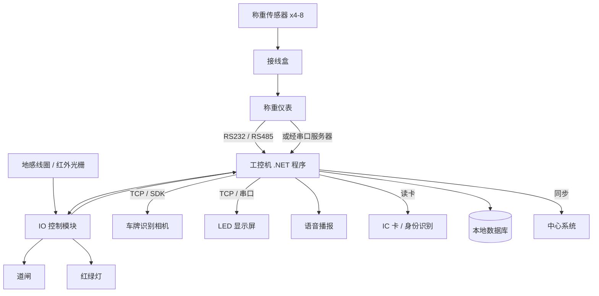
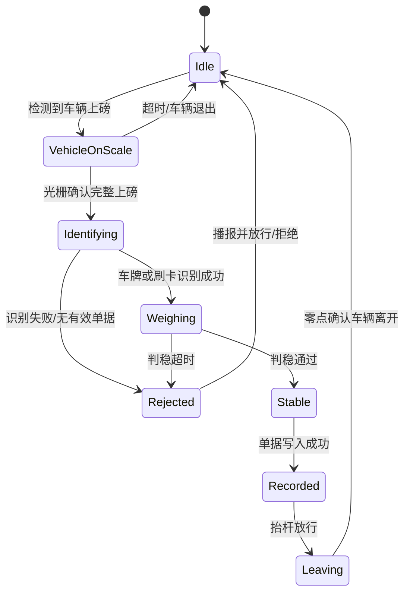

# 地磅称重对接：判稳算法、过磅状态机与防作弊

地磅项目的特殊之处在于：**它直接和钱挂钩。** 一车煤三十吨，单价差几块钱，一次过磅误差 100 公斤就是真金白银。所以这类系统的验收标准不是"能称出数"，而是"称得准、有留证、防得住作弊"。

技术上它是这个系列前面内容的一次综合应用：串口拆帧（第一篇）、外设的 TCP 私有协议（第二篇）、相机 SDK（第三篇）都会用到。但真正决定项目成败的是两个业务性的东西——**判稳算法**和**过磅状态机**。

:::tip 系列阅读顺序
本文是 [.NET 对接工业设备路线图](/posts/iot/industrial-device-roadmap) 的第五篇。强烈建议先读 [串口通信与设备协议拆帧](/posts/iot/serial-port-communication)，本文直接复用那里的拆帧器和 `IDeviceChannel` 抽象，不再重复。
:::

## 先搞清业务：一次过磅到底在做什么

**三个核心量：**

| 术语 | 含义 |
|---|---|
| **毛重（Gross）** | 车 + 货物的总重量 |
| **皮重（Tare）** | 空车重量 |
| **净重（Net）** | 毛重 − 皮重，这才是结算依据 |

**两种过磅模式，决定了你的数据模型：**

**二次过磅（最常见）**

车辆要上磅两次。进厂拉货：先空车过磅得皮重，装货后再过磅得毛重。送货进厂：先重车过磅得毛重，卸货后再过磅得皮重。

关键含义是：**一条过磅单据会跨越很长时间才完成**，中间可能间隔几小时、跨越班次、甚至跨天。所以单据必须持久化，且系统重启后要能继续。

**一次过磅**

车辆预先登记了固定皮重（常见于固定运输车队），只需称一次毛重，直接算净重。速度快，但要求皮重可信，一般配合定期复检。

**这个区别不是细节，它直接决定了系统的核心数据模型。** 二次过磅意味着"未完成单据"是一等公民，要能查询、能人工干预、能超时告警。

## 硬件构成

先看清整套硬件，你的程序在中间的位置就清楚了：



各部分的对接方式，正好对应本系列前三篇：

| 设备 | 对接方式 | 参考 |
|---|---|---|
| 称重仪表 | 串口 ASCII 帧 / 串口服务器 TCP | [第一篇](/posts/iot/serial-port-communication) |
| IO 模块、道闸、LED 屏 | 私有 TCP 或串口协议 | [第二篇](/posts/iot/tcp-protocol-binary-parsing) |
| IO 模块（标准协议型） | Modbus RTU / TCP | [第三篇](/posts/iot/modbus-protocol) |
| 车牌识别相机 | HTTP 推送 / TCP 推送 / 厂商 SDK | [第四篇](/posts/iot/pinvoke-vendor-sdk) |
| 语音播报 | 系统 TTS 或预置音频文件 | 本文 |

:::note 一个合规提醒
在中国，**用于贸易结算的衡器属于强制检定计量器具**，由计量部门定期检定并加封。

这带来一条硬性的软件约束：**你的程序绝不能修改仪表输出的原始重量。** 单位换算、去皮计算都要保留原始示数并可追溯。任何"重量校正系数"功能都可能被认定为作弊工具，涉及法律风险。

正确做法是把仪表原始报文原样存档，业务计算基于它派生，两者都可查。
:::

## 核心一：从示数到"可用的重量"

仪表每 200 毫秒左右吐一帧当前示数。**这些示数绝大多数是不能用的**——车还在往前挪、司机没熄火、车厢里的货在晃、有风。直接拿某一帧记账，误差可以到几百公斤。

上一篇讲过仪表自带 `ST`（stable）标志位，但**它不够**：仪表的判稳逻辑通常只看示数变化率，车辆匀速缓慢移动时它也可能报稳定。生产系统必须自己再判一层。

### 判稳算法

判稳的定义要三个条件同时满足：

1. **采样够多**：至少 N 帧（通常 10~20 帧，对应 2~4 秒）
2. **波动够小**：窗口内的极差（最大值 − 最小值）小于阈值（通常是量程的 0.05%，或按业务定 10~20kg）
3. **持续够久**：稳定状态维持一段时间，防止"路过式稳定"

```csharp
/// <summary>
/// 重量判稳器。滑动窗口 + 极差阈值 + 持续时长三重判定。
/// 非线程安全，约定只在单个采集循环里使用。
/// </summary>
public sealed class StabilityDetector
{
    private readonly int _windowSize;
    private readonly decimal _tolerance;
    private readonly TimeSpan _minDuration;
    private readonly Queue<decimal> _window = new();

    private DateTimeOffset? _stableSince;

    public StabilityDetector(
        int windowSize = 15,
        decimal tolerance = 10m,
        TimeSpan? minDuration = null)
    {
        _windowSize = windowSize;
        _tolerance = tolerance;
        _minDuration = minDuration ?? TimeSpan.FromSeconds(2);
    }

    /// <summary>判定为稳定时的重量，取窗口平均值以抑制噪声。</summary>
    public decimal? StableWeight { get; private set; }

    /// <summary>
    /// 喂入一帧示数。返回 true 表示"刚刚达成稳定"（只在状态跃变时返回一次）。
    /// </summary>
    public bool Feed(decimal weight, bool indicatorStable, DateTimeOffset now)
    {
        _window.Enqueue(weight);
        while (_window.Count > _windowSize) _window.Dequeue();

        // 条件一：采样不足，不作判断
        if (_window.Count < _windowSize)
        {
            Reset();
            return false;
        }

        // 条件二：仪表自己都说不稳，直接否
        if (!indicatorStable)
        {
            Reset();
            return false;
        }

        // 条件三：窗口极差在容差内
        decimal min = decimal.MaxValue, max = decimal.MinValue;
        foreach (var w in _window)
        {
            if (w < min) min = w;
            if (w > max) max = w;
        }

        if (max - min > _tolerance)
        {
            Reset();
            return false;
        }

        // 条件四：稳定状态需要持续足够时长
        _stableSince ??= now;

        if (now - _stableSince < _minDuration) return false;

        if (StableWeight is not null) return false;   // 已经报过稳定，不重复触发

        // 取平均值而非最后一帧，抑制单帧噪声
        decimal sum = 0;
        foreach (var w in _window) sum += w;
        StableWeight = decimal.Round(sum / _window.Count, 0);

        return true;
    }

    public void Reset()
    {
        _stableSince = null;
        StableWeight = null;
    }

    /// <summary>车辆离开后调用，彻底清空。</summary>
    public void Clear()
    {
        _window.Clear();
        Reset();
    }
}
```

参数怎么定？**必须去现场实测。** 拿一辆车真实上磅，把整个过程的原始示数录下来（这又是"原始报文落盘"的价值），然后离线回放调参。办公室里拍脑袋定的阈值，现场几乎一定不合适。

### 零点检测

空磅时示数应该在 0 附近。实际会有漂移——温度变化、磅体积灰、传感器老化都会导致零点偏移。

```csharp
public sealed class ZeroPointMonitor
{
    private readonly decimal _zeroBand;      // 零点带宽，如 ±20kg
    private readonly decimal _driftAlarm;    // 漂移告警阈值，如 ±50kg

    /// <summary>当前是否处于空磅状态（用于判断车辆是否已离开）。</summary>
    public bool IsAtZero(decimal weight) => Math.Abs(weight) <= _zeroBand;

    /// <summary>零点漂移过大时应告警，通常意味着需要维护或重新标定。</summary>
    public bool NeedsAttention(decimal weight) => Math.Abs(weight) > _driftAlarm;
}
```

**零点判定是"车辆已离开"的主要依据**，比地感线圈更可靠（地感可能被非称重车辆触发）。但不要在软件里做"自动清零"——那属于修改计量结果。发现漂移超限就告警，让维护人员处理。

## 核心二：过磅状态机

一次过磅要按顺序完成：检测到车、确认身份、等待稳定、记录、抬杆、确认离开。**用一堆 `if` 和布尔标志写这套逻辑，一定会失控**——因为每一步都可能超时、可能出异常、可能被人工干预。

用显式状态机建模：



```csharp
public enum WeighingState
{
    Idle,             // 空磅待机
    VehicleOnScale,   // 检测到车辆，尚未确认完整上磅
    Identifying,      // 识别车辆身份
    Weighing,         // 等待重量稳定
    Stable,           // 已稳定，准备记录
    Recorded,         // 已记录，准备放行
    Leaving,          // 已抬杆，等待车辆离开
    Rejected,         // 异常终止
}
```

状态机主体。每个状态都带超时，这是现场可靠性的关键：

```csharp
public sealed class WeighingStateMachine
{
    private readonly StabilityDetector _stability;
    private readonly ZeroPointMonitor _zero;
    private readonly IPeripheralController _peripherals;
    private readonly IWeighingRecordService _records;
    private readonly ILogger<WeighingStateMachine> _logger;

    private WeighingState _state = WeighingState.Idle;
    private DateTimeOffset _stateEnteredAt;
    private WeighingContext _context = new();

    // 各状态的超时时间。超时后统一回到 Idle，避免卡死在中间状态
    private static readonly Dictionary<WeighingState, TimeSpan> Timeouts = new()
    {
        [WeighingState.VehicleOnScale] = TimeSpan.FromSeconds(30),
        [WeighingState.Identifying]    = TimeSpan.FromSeconds(60),
        [WeighingState.Weighing]       = TimeSpan.FromSeconds(90),
        [WeighingState.Stable]         = TimeSpan.FromSeconds(15),
        [WeighingState.Recorded]       = TimeSpan.FromSeconds(15),
        [WeighingState.Leaving]        = TimeSpan.FromSeconds(120),
    };

    /// <summary>每帧重量都会调用，驱动状态推进。</summary>
    public async Task OnWeightAsync(WeightReading reading, CancellationToken ct)
    {
        var now = DateTimeOffset.Now;

        // 统一的超时兜底：任何中间状态卡太久都强制复位
        if (Timeouts.TryGetValue(_state, out var timeout) && now - _stateEnteredAt > timeout)
        {
            _logger.LogWarning("状态 {State} 超时（{Elapsed:F0}s），强制复位",
                _state, (now - _stateEnteredAt).TotalSeconds);
            await TransitionAsync(WeighingState.Rejected, ct, "处理超时");
            return;
        }

        switch (_state)
        {
            case WeighingState.Idle:
                // 重量明显离开零点，说明有车上磅
                if (!_zero.IsAtZero(reading.Weight))
                    await TransitionAsync(WeighingState.VehicleOnScale, ct);
                break;

            case WeighingState.VehicleOnScale:
                // 等光栅/地感确认车辆完整在磅上（防止只压半个车轴）
                if (_peripherals.IsVehicleFullyOnScale)
                    await TransitionAsync(WeighingState.Identifying, ct);
                else if (_zero.IsAtZero(reading.Weight))
                    await TransitionAsync(WeighingState.Idle, ct);   // 车又退出去了
                break;

            case WeighingState.Identifying:
                // 身份来自车牌识别或刷卡，由外部事件填充 _context
                if (_context.HasIdentity)
                    await TransitionAsync(WeighingState.Weighing, ct);
                break;

            case WeighingState.Weighing:
                if (_stability.Feed(reading.Weight, reading.IsStable, now))
                {
                    _context.Weight = _stability.StableWeight!.Value;
                    await TransitionAsync(WeighingState.Stable, ct);
                }
                break;

            case WeighingState.Stable:
                await RecordAsync(ct);
                break;

            case WeighingState.Recorded:
                await _peripherals.OpenGateAsync(ct);
                await TransitionAsync(WeighingState.Leaving, ct);
                break;

            case WeighingState.Leaving:
                // 零点恢复 + 光栅无遮挡，双条件确认车辆真的走了
                if (_zero.IsAtZero(reading.Weight) && !_peripherals.IsVehicleFullyOnScale)
                {
                    await _peripherals.CloseGateAsync(ct);
                    _stability.Clear();
                    _context = new WeighingContext();
                    await TransitionAsync(WeighingState.Idle, ct);
                }
                break;

            case WeighingState.Rejected:
                if (_zero.IsAtZero(reading.Weight))
                {
                    _stability.Clear();
                    _context = new WeighingContext();
                    await TransitionAsync(WeighingState.Idle, ct);
                }
                break;
        }
    }

    /// <summary>车牌识别相机推送结果时调用。</summary>
    public void OnPlateRecognized(string plateNo, byte[] snapshot)
    {
        // 只在识别阶段接受，避免车辆离开时的误识别污染当前单据
        if (_state is not (WeighingState.VehicleOnScale or WeighingState.Identifying))
        {
            _logger.LogDebug("当前状态 {State} 忽略车牌 {Plate}", _state, plateNo);
            return;
        }

        _context.PlateNo = plateNo;
        _context.Snapshot = snapshot;
    }

    private async Task TransitionAsync(
        WeighingState next, CancellationToken ct, string? reason = null)
    {
        _logger.LogInformation("状态迁移 {From} -> {To} {Reason}", _state, next, reason);

        _state = next;
        _stateEnteredAt = DateTimeOffset.Now;

        // 进入状态时的动作：播报、灯控
        switch (next)
        {
            case WeighingState.Identifying:
                await _peripherals.SetTrafficLightAsync(TrafficLight.Red, ct);
                await _peripherals.SpeakAsync("请稍候，正在识别", ct);
                break;

            case WeighingState.Weighing:
                await _peripherals.SpeakAsync("请熄火等待称重", ct);
                break;

            case WeighingState.Recorded:
                await _peripherals.SpeakAsync($"称重完成，{_context.Weight:F0} 公斤", ct);
                await _peripherals.ShowOnLedAsync($"{_context.PlateNo}\n{_context.Weight:F0}KG", ct);
                break;

            case WeighingState.Leaving:
                await _peripherals.SetTrafficLightAsync(TrafficLight.Green, ct);
                await _peripherals.SpeakAsync("请缓慢下磅", ct);
                break;

            case WeighingState.Rejected:
                await _peripherals.SpeakAsync(reason ?? "过磅失败，请联系管理员", ct);
                break;
        }
    }
}
```

状态机的两个设计要点值得单独强调：

**每个状态必须有超时。** 现场一定会出现"车上磅了但司机下车抽烟去了""识别失败司机也不管"这种情况。没有超时兜底，系统就永久卡在某个状态，后面的车全部堵住。这是无人值守项目最常见的现场投诉。

**外部事件（车牌、刷卡）要检查当前状态才接受。** 相机会持续识别，车辆离开时也会推送车牌。不加状态过滤，离开的车牌可能污染下一单。

## 核心三：防作弊

这是地磅项目的隐藏需求，甲方不一定写在文档里，但一定会问。**作弊手法都很成熟**，对策必须成套：

| 作弊手法 | 原理 | 对策 |
|---|---|---|
| **未完全上磅** | 只压部分车轴，少称一部分重量 | 红外光栅/对射检测车头车尾，双端都遮挡才算完整上磅 |
| **称重后卸货** | 称完毛重在厂内卸掉一部分 | 全程视频留证 + 毛皮重时间间隔校验 + 抓图对比 |
| **替换车辆** | 皮重用小车、毛重用大车 | 车牌识别交叉校验，两次过磅车牌必须一致 |
| **压磅/垫磅** | 车辆一侧压在磅体边缘或垫物 | 抓图留证 + 重量突变检测 + 多角度相机 |
| **遥控干扰仪表** | 用无线遥控器改变仪表示数 | 重量突变检测（相邻帧跳变超阈值即告警）+ 原始报文留存 |
| **修改单据** | 事后改数据库里的重量 | 单据只允许追加不允许修改，改动全部留审计日志 |
| **重复使用皮重** | 一次过磅模式下长期不复检皮重 | 强制皮重有效期，过期必须重新称皮 |

其中**重量突变检测**是纯软件能做的，性价比很高：

```csharp
/// <summary>检测异常的重量跳变，用于识别遥控干扰或压磅。</summary>
public sealed class AnomalyDetector
{
    private readonly decimal _maxJumpPerFrame;   // 相邻帧最大合理变化量
    private decimal? _last;

    public bool IsAnomalous(decimal weight)
    {
        try
        {
            // 车辆正常上下磅时重量是连续变化的，
            // 瞬间跳变几吨在物理上不可能，只能是干扰或故障
            return _last is { } last && Math.Abs(weight - last) > _maxJumpPerFrame;
        }
        finally
        {
            _last = weight;
        }
    }
}
```

检测到异常时**不要静默处理**：记录原始报文、抓图、生成告警单据，让人来判断。软件的职责是留下完整证据，不是自动裁决。

## 单据模型与数据一致性

二次过磅的单据会跨越很长时间，所以单据是需要独立生命周期管理的实体：

```csharp
public sealed class WeighingTicket
{
    public Guid Id { get; init; }
    public string TicketNo { get; init; } = default!;
    public string PlateNo { get; init; } = default!;

    // 毛重和皮重可能相隔数小时，各自独立记录时间和操作人
    public decimal? GrossWeight { get; set; }
    public DateTimeOffset? GrossAt { get; set; }

    public decimal? TareWeight { get; set; }
    public DateTimeOffset? TareAt { get; set; }

    /// <summary>净重是派生值，不独立存储可修改的字段。</summary>
    public decimal? NetWeight =>
        GrossWeight is { } g && TareWeight is { } t ? g - t : null;

    public TicketStatus Status { get; set; }

    /// <summary>仪表原始报文，举证用，只追加不修改。</summary>
    public List<string> RawFrames { get; init; } = [];

    /// <summary>抓图附件路径。</summary>
    public List<string> Snapshots { get; init; } = [];
}

public enum TicketStatus
{
    PendingSecondWeigh,   // 已称一次，等待第二次
    Completed,            // 两次都完成
    Cancelled,            // 人工作废（需记录原因和操作人）
    Abnormal,             // 检测到异常，待人工审核
}
```

三条必须做到的一致性要求：

**未完成单据要能从重启中恢复。** 程序半夜崩了、工控机断电了，第二天车回来称第二次，单据必须还在。状态机的中间状态可以丢，**但单据必须落库**。所以"记录"这一步要在抬杆之前完成——先写库，再放行。

**写入必须幂等。** 网络重试、状态机重入、人工重复操作都可能触发重复写入。用单据号 + 过磅类型（毛/皮）做唯一约束，重复提交直接返回已有记录。

**修改要留痕。** 重量字段只允许通过审核流程调整，且原值必须保留。这不只是技术要求，是这类系统的审计底线。

## 外设联动

道闸、红绿灯、语音、LED 屏，对接方式五花八门（继电器 IO 板、Modbus、私有 TCP、串口）。**统一抽象成一个外设接口**，状态机就不用关心这些差异：

```csharp
public interface IPeripheralController
{
    /// <summary>车辆是否完整位于磅体上（由光栅或地感判定）。</summary>
    bool IsVehicleFullyOnScale { get; }

    Task OpenGateAsync(CancellationToken ct);
    Task CloseGateAsync(CancellationToken ct);
    Task SetTrafficLightAsync(TrafficLight color, CancellationToken ct);
    Task SpeakAsync(string text, CancellationToken ct);
    Task ShowOnLedAsync(string content, CancellationToken ct);
}
```

几个实践细节：

**道闸要有兜底。** 抬杆指令可能失败。要么读道闸的到位反馈信号确认，要么失败后重试并告警。杆没抬起来而系统认为放行了，车会一直堵在那。

**语音优先用预置音频。** 系统 TTS 在工控机上依赖语音包，Windows Server 精简版可能根本没有中文语音。固定话术录成 MP3 更可靠，只有含变量的（重量数字）才需要 TTS 或数字音频拼接。

**外设操作绝不能阻塞状态机。** 语音播报要几秒钟，如果同步等待，重量帧就积压了。播报应该是"发出去就返回"，或者放到独立队列里。

## 断网降级

磅房的网络不可靠，但过磅不能停。原则是**本地优先**：

```csharp
// 1. 所有单据先写本地库（SQLite 或本机 SQL Server），这是唯一的强一致操作
await _localDb.SaveTicketAsync(ticket, ct);

// 2. 抬杆放行，不等中心系统
await _peripherals.OpenGateAsync(ct);

// 3. 同步中心系统由后台服务异步完成，失败自动重试
await _outbox.EnqueueAsync(new TicketCompletedEvent(ticket.Id), ct);
```

第三步的可靠投递就是 Outbox 模式的典型场景，实现细节可以参考 [Outbox 模式](/posts/dotnet/aspnet-core-outbox-pattern)。

:::warning 不要让中心系统成为过磅的前置条件
常见的错误设计是"过磅前先查中心系统的订单是否有效"。网络一断，整个磅房停摆。

正确做法是**订单数据提前同步到本地**，过磅时只查本地。中心系统只接收结果，不参与实时链路。
:::

## 串起来

采集、状态机、业务落库分别在不同的循环里，用 `Channel` 解耦：

```csharp
public sealed class WeighingHostService : BackgroundService
{
    private readonly ChannelReader<WeightReading> _readings;
    private readonly WeighingStateMachine _stateMachine;
    private readonly ILogger<WeighingHostService> _logger;

    protected override async Task ExecuteAsync(CancellationToken stoppingToken)
    {
        // 采集端（第一篇的 WeighingCollectorService）持续往 Channel 写，
        // 这里单线程消费，状态机因此不需要加锁
        await foreach (var reading in _readings.ReadAllAsync(stoppingToken))
        {
            try
            {
                await _stateMachine.OnWeightAsync(reading, stoppingToken);
            }
            catch (Exception ex)
            {
                // 单帧处理失败不能让整个服务退出，否则整个磅房停摆
                _logger.LogError(ex, "处理重量帧失败 {Weight}", reading.Weight);
            }
        }
    }
}
```

**状态机由单个循环驱动，这是有意的设计。** 单线程消费意味着状态机内部不需要任何锁，逻辑简单到可以完整推演。车牌识别、刷卡这些外部事件也应该转成消息进同一个 Channel，而不是从别的线程直接调状态机的方法。

:::details 常见问题速查 | 点开看地磅项目的高频坑
**重量一直在跳，永远判不稳**
容差太小或窗口太长。用现场录制的真实数据回放调参，别在办公室拍参数。

**同一辆车两次称的重量差几十公斤**
正常范围。传感器精度、温度、油量、司机是否在车上都有影响。业务上要定义可接受误差，超出才告警。

**车走了但系统还认为在磅上**
零点漂移导致 `IsAtZero` 判不成立。检查零点带宽设置，同时告警提示需要维护。

**系统卡在某个状态不动了**
状态超时没做，或超时时间设太长。每个中间状态都必须有超时兜底。

**车牌识别到上一辆车的号**
外部事件没做状态过滤。只在识别阶段接受车牌推送。

**抬杆了但杆没起来**
道闸指令失败没有反馈校验。要读到位信号或做重试 + 告警。

**语音播报把采集卡住了**
外设操作同步阻塞了状态机循环。播报改成即发即返或独立队列。

**断网后过磅完全无法进行**
业务链路依赖了中心系统。订单数据要提前同步到本地。

**重启后未完成的单据丢了**
单据没落库或落库在抬杆之后。必须先写库再放行。

**同一次过磅产生两条记录**
写入不幂等。用单据号 + 过磅类型加唯一约束。

**客户质疑重量不准，你没法举证**
原始报文和抓图没存。这类系统里留证不是可选项。
:::

## 小结

地磅项目的技术难度不在通信——串口拆帧那一篇就已经覆盖了。真正的难点是四件事：

1. **判稳不能只信仪表**：滑动窗口 + 极差阈值 + 持续时长三重判定，参数必须现场实测
2. **状态机每个状态都要有超时**：这是无人值守能不能用的分界线
3. **防作弊要成套**：光栅、车牌交叉校验、突变检测、留证审计，缺一项就有漏洞
4. **本地优先**：单据先落本地再放行，中心系统不参与实时链路

下一篇 [摄像头对接](/posts/iot/camera-integration) 按需求选路线（ISAPI 抓图、RTSP 预览、SDK 报警上传），并讲车牌识别一体机的接入——地磅无人值守的另一半就在那里。
