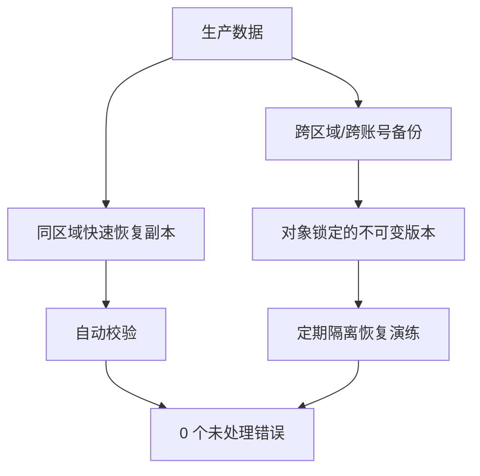

# 备份、恢复与灾难恢复：从 RPO/RTO 到可验证的恢复体系

“备份任务成功”只说明某个程序写出了文件，不代表文件完整、密钥可用、依赖齐全，更不代表团队能在事故压力下按时恢复业务。真正的目标不是拥有备份，而是**在明确的时间和数据损失预算内恢复经过验证的服务**。

本文以 Linux、对象存储和 **MySQL 8.0/8.4 LTS（InnoDB、ROW binlog、GTID）** 为主要环境。`mysqldump` 适合中小规模逻辑备份；大规模实例通常应使用云厂商快照、MySQL Enterprise Backup、Percona XtraBackup 或经过验证的物理备份方案。不同工具的版本兼容范围必须单独验证。

:::important 核心结论
备份不等于恢复成功。只有完成“生成 → 传输 → 保留 → 解密 → 校验 → 恢复 → 业务验证 → 记录耗时”的闭环，并定期重复，才有资格把它计入灾难恢复能力。
:::

<ProgressIndicator
  current="linux/backup-restore-and-disaster-recovery"
  items={[
    { slug: "linux/database-production-operations", title: "生产数据库运维" },
    { slug: "linux/backup-restore-and-disaster-recovery", title: "备份、恢复与灾难恢复" },
    { slug: "linux/production-security-baseline", title: "生产安全基线" },
    { slug: "linux/incident-response-and-oncall", title: "事件响应与值班" },
  ]}
/>

## 1. 从业务目标开始：RPO 与 RTO

### 1.1 RPO：最多允许丢多少数据

<Glossary term="RPO（Recovery Point Objective，恢复点目标）：灾难发生后，业务可接受的最大数据丢失时间窗口。">RPO</Glossary> 回答“恢复到多近”。若订单系统 RPO 为 5 分钟，任何灾难场景都必须有办法恢复到事故前最多 5 分钟；每天一次全量备份显然不够。

### 1.2 RTO：多久必须恢复服务

<Glossary term="RTO（Recovery Time Objective，恢复时间目标）：从中断开始到业务恢复到约定能力的最长时间。">RTO</Glossary> 回答“恢复多快”。RTO 不只是数据导入时间，还包括发现、决策、申请资源、取回备份、解密、恢复、校验、切流与沟通。


### 1.3 用业务分级确定目标

| 数据/服务 | 示例 RPO | 示例 RTO | 设计含义 |
|---|---:|---:|---|
| 支付与订单 | 5 分钟 | 60 分钟 | 全量 + 连续日志，预置恢复环境 |
| 用户上传 | 1 小时 | 4 小时 | 版本化对象存储 + 跨区域复制 |
| 分析报表 | 24 小时 | 24 小时 | 每日快照，可从源数据重建 |
| IaC/配置 | 每次提交 | 2 小时 | 受保护 Git + 制品归档 + 密钥另管 |

表中只是示例，必须由业务负责人签字确认。把所有系统都设成“零丢失、立即恢复”既昂贵又通常不可证明。

:::tip 先写恢复服务级别，再买工具
工具不能替代目标。先定义关键业务旅程、依赖顺序、最低可用能力、RPO/RTO 和验证标准，再决定快照频率、日志归档、跨区域复制和热备等级。
:::

## 2. 3-2-1-1-0：备份体系的最低结构

**3-2-1-1-0** 可以拆成：

- **3**：至少三份数据副本，含生产数据；
- **2**：使用至少两类介质或独立存储系统；
- **1**：至少一份位于异地/不同区域；
- **1**：至少一份离线、气隙或不可变；
- **0**：通过自动校验和恢复演练，达到零个未处理错误。



“两个目录”“同一个账号下两个桶”“同一存储阵列的两个卷”不一定是两个独立故障域。要明确控制面、身份、加密密钥、网络、区域和人员权限是否会共同失效。

## 3. 先做威胁模型

备份设计至少覆盖以下事件：

| 威胁 | 失败方式 | 对策 |
|---|---|---|
| 人为误删 | 生产和备份同时被删 | 版本控制、延迟删除、双人审批 |
| 勒索软件 | 在线挂载备份被加密 | 不可变对象锁、备份账号隔离、离线副本 |
| 云账号失陷 | 攻击者删除资源与密钥 | 跨账号副本、独立 MFA、删除保护 |
| 区域故障 | 生产与本地备份不可用 | 跨区域复制、区域级 DR 演练 |
| 静默损坏 | 文件存在但内容错误 | 校验和、数据库一致性检查、定期恢复 |
| 密钥丢失 | 密文永久不可读 | 密钥备份、托管 HSM/KMS、恢复演练 |
| 供应链问题 | 备份代理被篡改 | 固定版本、签名验证、最小权限、审计 |
| 内部人员滥用 | 合法身份删除恢复点 | 职责分离、不可变策略、审计与告警 |

:::important 不可变必须约束管理员
如果同一个日常管理员可以关闭对象锁、删除密钥并清空备份，那么“不可变”只是界面上的开关。使用合规保留模式、独立备份账号和职责分离，并通过实际删除测试验证。
:::

## 4. 备份架构与责任

一套可操作的架构如下：

```text
生产账号
├── MySQL
│   ├── 每日/每周基线备份
│   └── 连续 binlog 归档
├── 应用文件/对象
└── 配置导出（不含明文秘密）
        │
        ├── 同区域恢复层：短 RTO
        └── 备份账号：跨账号写入、生产侧无删除权
                ├── 跨区域复制
                ├── 对象锁/不可变保留
                └── 独立监控与审计
```

角色建议：

| 角色 | 权限 |
|---|---|
| 生产备份代理 | 读取指定数据、只能追加写入备份入口 |
| 备份平台管理员 | 管理保留和存储，不读业务明文 |
| 恢复操作员 | 在隔离环境取回并恢复，不改不可变策略 |
| 安全/审计 | 读取审计日志与策略，不能删除备份 |
| 业务负责人 | 批准 RPO/RTO、验证恢复后的业务正确性 |

## 5. 加密与密钥生命周期

备份同时需要：

1. **传输加密**：数据库 TLS、对象存储 HTTPS、受控网络；
2. **静态加密**：服务端 KMS 或客户端加密；
3. **密钥隔离**：备份密钥不与数据处于同一故障域；
4. **轮换与版本**：轮换后旧密钥仍可解密保留期内备份；
5. **审计**：记录谁在何时解密了哪一份备份；
6. **应急访问**：break-glass 密钥由双人控制并定期验证。

:::warning 删除密钥等于删除所有密文
设置 KMS 密钥删除等待期、MFA 和双人审批。恢复演练必须包含“在新环境取得正确密钥版本”，而不只是管理员机器上已有缓存密钥。
:::

不要把解密口令写进备份脚本、命令参数或日志。通过短期身份、文件描述符、受限权限文件或密钥代理注入。

## 6. 保留策略：按恢复需求分层

典型 GFS（Grandfather-Father-Son）示例：

| 层级 | 频率 | 保留 | 用途 |
|---|---|---:|---|
| 连续日志 | 5 分钟内归档 | 14 天 | 精细 PITR |
| 每日恢复点 | 每日 | 35 天 | 常规误删/回滚 |
| 每周恢复点 | 每周 | 13 周 | 延迟发现问题 |
| 每月恢复点 | 每月 | 13 月 | 长周期审计与恢复 |
| 年度归档 | 每年 | 按法规 | 合规，不一定可直接用于 DR |

保留策略要同时计算：容量、恢复速度、法规、删除义务和密钥生命周期。个人数据的法定删除要求可能与长周期归档冲突，应由法务和隐私负责人制定可执行例外流程。

## 7. MySQL 全量备份 + binlog PITR

### 7.1 前置条件

以下示例适用于 MySQL 8.0/8.4 LTS、InnoDB、ROW binlog。生产环境应配置：

```ini
# /etc/mysql/mysql.conf.d/pitr.cnf
[mysqld]
server_id=101
log_bin=mysql-bin
binlog_format=ROW
binlog_row_image=FULL
gtid_mode=ON
enforce_gtid_consistency=ON
binlog_expire_logs_seconds=1209600
```

`binlog_expire_logs_seconds=1209600` 是 14 天示例。必须保证日志已经可靠归档后才能由 MySQL 清理。

备份用户只授予工具需要的权限。不同 MySQL 小版本和备份参数所需权限有差异，应在实验实例验证，避免直接授予全局管理员权限。

### 7.2 安全客户端配置

```ini
# /etc/mysql/backup-client.cnf，属主 backup，权限 600
[client]
user=backup_agent
password=由密钥管理系统部署
host=127.0.0.1
port=3306
ssl-mode=VERIFY_IDENTITY
ssl-ca=/etc/mysql/certs/ca.pem
```

```bash
sudo chown backup:backup /etc/mysql/backup-client.cnf
sudo chmod 600 /etc/mysql/backup-client.cnf
```

### 7.3 可直接使用的安全 Bash 备份脚本

脚本面向中小型数据库逻辑备份。大库需改用经验证的物理备份工具，但安全结构仍可复用。

```bash
#!/usr/bin/env bash
# /usr/local/sbin/backup-mysql-logical.sh
# 适用：Bash 4.4+、MySQL 8.0/8.4 客户端、全部业务表为 InnoDB。
# 不适用：超大数据库的低 RTO 恢复；请使用经过演练的物理备份。

set -Eeuo pipefail
umask 077

readonly BACKUP_ROOT="/srv/backup/mysql"
readonly FINAL_DIR="${BACKUP_ROOT}/daily"
readonly CLIENT_CNF="/etc/mysql/backup-client.cnf"
readonly DATABASE="appdb"
readonly RETENTION_DAYS=35
readonly TS="$(date -u +'%Y%m%dT%H%M%SZ')"
readonly HOST="$(hostname -s)"
readonly NAME="${HOST}-${DATABASE}-${TS}"

WORKDIR=""

log() {
  printf '%s %s\n' "$(date -u +'%FT%TZ')" "$*" >&2
}

cleanup() {
  local exit_code=$?
  # mktemp 目录可能包含未完成的明文 SQL，退出时必须清理。
  if [[ -n "${WORKDIR}" && -d "${WORKDIR}" ]]; then
    rm -rf -- "${WORKDIR}"
  fi
  if (( exit_code != 0 )); then
    log "ERROR backup failed exit_code=${exit_code} name=${NAME}"
  fi
  exit "${exit_code}"
}
trap cleanup EXIT
trap 'log "ERROR line=${LINENO} command=${BASH_COMMAND}"' ERR
trap 'log "Interrupted"; exit 130' INT TERM

require_file() {
  [[ -f "$1" ]] || { log "missing file: $1"; return 1; }
}

main() {
  require_file "${CLIENT_CNF}"

  # 拒绝权限过宽的凭据文件；stat -c 适用于 GNU coreutils。
  local mode
  mode="$(stat -c '%a' "${CLIENT_CNF}")"
  [[ "${mode}" == "600" ]] || {
    log "credential file must be mode 600, got ${mode}"
    return 1
  }

  install -d -m 700 "${BACKUP_ROOT}" "${FINAL_DIR}"
  WORKDIR="$(mktemp -d "${BACKUP_ROOT}/.${NAME}.tmp.XXXXXX")"

  local sql_file="${WORKDIR}/${NAME}.sql"
  local archive_file="${WORKDIR}/${NAME}.sql.gz"
  local checksum_file="${WORKDIR}/${NAME}.sql.gz.sha256"
  local metadata_file="${WORKDIR}/${NAME}.metadata"

  log "starting logical backup database=${DATABASE}"

  # --single-transaction 为 InnoDB 获取一致性快照；不要同时执行 DDL。
  # 凭据只从 600 权限文件读取，不出现在命令行与进程列表中。
  mysqldump \
    --defaults-extra-file="${CLIENT_CNF}" \
    --single-transaction \
    --quick \
    --routines \
    --events \
    --triggers \
    --hex-blob \
    --set-gtid-purged=AUTO \
    --databases "${DATABASE}" \
    --result-file="${sql_file}"

  [[ -s "${sql_file}" ]] || {
    log "dump is empty"
    return 1
  }

  gzip -9 -- "${sql_file}"
  [[ -s "${archive_file}" ]] || {
    log "archive is empty"
    return 1
  }

  # 在原子发布前校验压缩流与 SHA-256。
  gzip -t -- "${archive_file}"
  (
    cd "${WORKDIR}"
    sha256sum "$(basename "${archive_file}")" \
      > "$(basename "${checksum_file}")"
    sha256sum --check "$(basename "${checksum_file}")"
  )

  {
    printf 'backup_name=%s\n' "${NAME}"
    printf 'created_at=%s\n' "$(date -u +'%FT%TZ')"
    printf 'database=%s\n' "${DATABASE}"
    printf 'mysql_client=%s\n' "$(mysql --version)"
    printf 'size_bytes=%s\n' "$(stat -c '%s' "${archive_file}")"
  } > "${metadata_file}"

  chmod 600 "${archive_file}" "${checksum_file}" "${metadata_file}"

  # 同一文件系统内 mv/rename 是原子的：消费者看不到半成品。
  mv -- "${archive_file}" "${FINAL_DIR}/${NAME}.sql.gz"
  mv -- "${checksum_file}" "${FINAL_DIR}/${NAME}.sql.gz.sha256"
  mv -- "${metadata_file}" "${FINAL_DIR}/${NAME}.metadata"

  # 清理只发生在新备份完整发布后；生产中可改为存储生命周期策略。
  find "${FINAL_DIR}" -type f -mtime "+${RETENTION_DAYS}" \
    -name "${HOST}-${DATABASE}-*" -print -delete

  log "backup completed name=${NAME}"
}

main "$@"
```

安装与手工验证：

```bash
sudo install -o root -g backup -m 750 \
  backup-mysql-logical.sh \
  /usr/local/sbin/backup-mysql-logical.sh

# 使用无登录 shell 的专用用户执行
sudo -u backup /usr/local/sbin/backup-mysql-logical.sh

# 查看最终产物；不应存在 .tmp 目录或空文件
sudo -u backup find /srv/backup/mysql/daily -maxdepth 1 -type f -ls
```

:::warning 本地落盘只是暂存层
脚本完成后必须由独立代理将产物通过加密通道上传到跨账号、跨区域、不可变存储，并确认远端校验。只有本机副本无法抵御主机故障、误删和勒索软件。
:::

### 7.4 systemd 定时执行

```ini
# /etc/systemd/system/mysql-logical-backup.service
[Unit]
Description=Create verified MySQL logical backup
After=network-online.target mysql.service
Wants=network-online.target

[Service]
Type=oneshot
User=backup
Group=backup
ExecStart=/usr/local/sbin/backup-mysql-logical.sh
PrivateTmp=true
NoNewPrivileges=true
ProtectSystem=strict
ProtectHome=true
ReadOnlyPaths=/etc/mysql/backup-client.cnf
ReadWritePaths=/srv/backup/mysql
```

```ini
# /etc/systemd/system/mysql-logical-backup.timer
[Unit]
Description=Run MySQL logical backup daily

[Timer]
OnCalendar=*-*-* 02:15:00 UTC
RandomizedDelaySec=10m
Persistent=true
Unit=mysql-logical-backup.service

[Install]
WantedBy=timers.target
```

```bash
sudo systemd-analyze verify \
  /etc/systemd/system/mysql-logical-backup.service \
  /etc/systemd/system/mysql-logical-backup.timer
sudo systemctl daemon-reload
sudo systemctl enable --now mysql-logical-backup.timer
systemctl list-timers mysql-logical-backup.timer
```

### 7.5 binlog 连续归档

全量备份只提供基线。PITR 还要求从基线位置开始的每个 binlog 完整连续。可使用 MySQL 8.0 的 `mysqlbinlog --read-from-remote-server --raw --stop-never` 拉取，或使用托管平台原生日志归档。

```bash
# 示例使用 login path；由进程管理器守护并写入受限目录
mysqlbinlog \
  --login-path=binlog-archiver \
  --read-from-remote-server \
  --raw \
  --stop-never \
  --verify-binlog-checksum \
  --result-file=/srv/backup/binlog/ \
  mysql-bin.000001
```

生产实现必须补齐：断点续传、文件完成判定、SHA-256、加密上传、远端确认、缺口告警、GTID/文件位点清单和日志轮换。不得在确认远端完整前清理源 binlog。

## 8. MySQL 时间点恢复步骤

假设误操作发生于 `2026-08-12 10:23:41 UTC`，目标是在隔离环境恢复到它之前。

:::warning 恢复目标必须是新实例
不要把首次恢复直接覆盖生产。先恢复到网络隔离的新实例，验证正确性，再通过受控切换迁移流量。恢复命令会写入大量数据，必须先演练。
:::

<Steps>
### 冻结并记录

停止自动化变更，记录事故时间、数据库时区、当前 GTID、备份 ID、binlog 清单和审批人。保留原实例以供取证，不继续尝试未知写操作。

### 准备隔离目标

创建与源版本兼容的 MySQL，限制网络，只允许恢复操作员和验证程序访问。确认磁盘空间至少覆盖数据、索引、临时空间和 binlog。

### 校验并恢复基线

```bash
cd /restore/input
sha256sum --check appdb-base.sql.gz.sha256
gzip -t appdb-base.sql.gz

# restore-client.cnf 权限必须为 600，密码不出现在命令行
zcat appdb-base.sql.gz | mysql \
  --defaults-extra-file=/etc/mysql/restore-client.cnf
```

### 生成截至目标时间的日志

```bash
# 所有时间统一为 UTC；先在实验环境确认 binlog 时间语义
mysqlbinlog \
  --verify-binlog-checksum \
  --stop-datetime='2026-08-12 10:23:40' \
  /restore/binlog/mysql-bin.000120 \
  /restore/binlog/mysql-bin.000121 \
  > /restore/work/replay-until-safe.sql
```

### 审阅并回放

```bash
# 先检查文件头、目标 GTID/时间和可疑 DDL，不把内容输出到公共日志
less /restore/work/replay-until-safe.sql

mysql \
  --defaults-extra-file=/etc/mysql/restore-client.cnf \
  < /restore/work/replay-until-safe.sql
```

### 执行技术与业务验证

运行下文验证脚本、关键表计数、财务不变量、抽样读取、应用只读冒烟测试，并由业务负责人确认恢复点可接受。

### 受控切换

更新服务发现/代理，先放少量只读流量，再恢复写入。观察错误率、延迟和数据不变量；保留回退窗口。
</Steps>

若知道误操作事务的 GTID，可用 `--exclude-gtids` 精确排除，但这可能破坏依赖关系。必须在隔离环境验证，不应在事件中临时首次尝试。

## 9. 恢复验证脚本

下面脚本不证明全部业务正确性，但能证明：文件校验通过、可在一次性数据库中导入、关键表存在且基本约束满足。适用于 Bash 4.4+、Docker Engine 24+、MySQL 8.4 镜像；镜像应在组织内固定为经过扫描的 digest。

```bash
#!/usr/bin/env bash
# verify-mysql-backup.sh
# 用法：verify-mysql-backup.sh /path/appdb.sql.gz /path/appdb.sql.gz.sha256

set -Eeuo pipefail
umask 077

readonly ARCHIVE="${1:?archive path required}"
readonly CHECKSUM="${2:?checksum path required}"
readonly IMAGE="mysql:8.4"
readonly CONTAINER="mysql-restore-check-${RANDOM}-$$"
WORKDIR=""
ROOT_PASSWORD_FILE=""
CLIENT_CNF=""

log() {
  printf '%s %s\n' "$(date -u +'%FT%TZ')" "$*" >&2
}

cleanup() {
  local code=$?
  docker rm -f "${CONTAINER}" >/dev/null 2>&1 || true
  [[ -n "${WORKDIR}" && -d "${WORKDIR}" ]] && rm -rf "${WORKDIR}"
  exit "${code}"
}
trap cleanup EXIT
trap 'log "ERROR line=${LINENO} command=${BASH_COMMAND}"' ERR
trap 'exit 130' INT TERM

[[ -f "${ARCHIVE}" && -f "${CHECKSUM}" ]]
WORKDIR="$(mktemp -d)"
ROOT_PASSWORD_FILE="${WORKDIR}/root-password"
CLIENT_CNF="${WORKDIR}/client.cnf"

# 生成一次性随机密码，并写入 600 权限 option file。
# 后续客户端只引用配置文件，密码不会出现在进程参数中。
openssl rand -base64 36 > "${ROOT_PASSWORD_FILE}"
{
  printf '[client]\n'
  printf 'user=root\n'
  printf 'password=%s\n' "$(cat "${ROOT_PASSWORD_FILE}")"
  printf 'protocol=socket\n'
} > "${CLIENT_CNF}"
chmod 600 "${ROOT_PASSWORD_FILE}" "${CLIENT_CNF}"

# 在归档所在目录验证清单，避免名称不匹配。
(
  cd "$(dirname "${ARCHIVE}")"
  sha256sum --check "$(basename "${CHECKSUM}")"
)
gzip -t "${ARCHIVE}"

# 两个敏感文件只读挂载到容器，不进入镜像层。
docker run -d --name "${CONTAINER}" \
  --tmpfs /var/lib/mysql:rw,noexec,nosuid,size=4g \
  -v "${ROOT_PASSWORD_FILE}:/run/secrets/root-password:ro" \
  -v "${CLIENT_CNF}:/run/secrets/client.cnf:ro" \
  -e MYSQL_ROOT_PASSWORD_FILE=/run/secrets/root-password \
  "${IMAGE}" \
  --skip-log-bin

for _ in $(seq 1 60); do
  if docker exec "${CONTAINER}" \
      mysqladmin --defaults-extra-file=/run/secrets/client.cnf \
      ping --silent >/dev/null 2>&1; then
    break
  fi
  sleep 2
done

docker exec "${CONTAINER}" \
  mysqladmin --defaults-extra-file=/run/secrets/client.cnf \
  ping --silent

# stdin 导入，归档本身不复制到容器层。
zcat "${ARCHIVE}" | docker exec -i "${CONTAINER}" \
  mysql --defaults-extra-file=/run/secrets/client.cnf

# 关键技术校验：数据库/表存在、无孤儿订单、行数非零。
docker exec "${CONTAINER}" \
  mysql --defaults-extra-file=/run/secrets/client.cnf \
  --batch --skip-column-names -e "
    SELECT IF(COUNT(*) > 0, 'PASS', 'FAIL')
      FROM information_schema.tables
     WHERE table_schema = 'appdb';
    SELECT IF(COUNT(*) = 0, 'PASS', 'FAIL')
      FROM appdb.orders o
      LEFT JOIN appdb.users u ON u.id = o.user_id
     WHERE u.id IS NULL;
  " | tee "${WORKDIR}/validation.txt"

if grep -q '^FAIL$' "${WORKDIR}/validation.txt"; then
  log "business validation failed"
  exit 1
fi

log "restore verification passed archive=${ARCHIVE}"
```

:::note 凭据边界
验证脚本使用一次性随机密码和 600 权限 option file，MySQL 客户端进程参数不含密码；退出时临时目录会被 `trap` 清理。脚本仍应只在隔离恢复节点运行，并把镜像固定为组织验证过的 digest。
:::

更完整的恢复验证应包括：

```text
[ ] SHA-256 与压缩流完整
[ ] 备份元数据、版本、字符集、时区一致
[ ] 所有 schema、视图、触发器、事件、存储过程存在
[ ] 关键表行数处于合理区间
[ ] 外键/业务引用无孤儿记录
[ ] 余额、库存、订单状态等业务不变量成立
[ ] 应用可启动并完成只读/受控写入冒烟测试
[ ] 查询计划和 P95 延迟可接受
[ ] 恢复耗时小于 RTO，恢复点满足 RPO
[ ] 演练日志、问题和行动项已归档
```

## 10. 应用文件与对象数据

数据库恢复成功并不代表应用完整。用户上传、生成报告、搜索索引和队列数据需要分类：

| 类型 | 策略 | 验证 |
|---|---|---|
| 用户上传 | 对象版本控制、跨区域复制、不可变保留 | 抽样下载、哈希、元数据一致性 |
| 本地共享文件 | 文件系统快照 + 文件级备份 | 清单、权限、符号链接、应用读取 |
| 缓存 | 通常重建，不纳入强一致备份 | 验证重建耗时与源数据能力 |
| 搜索索引 | 从数据库/事件重建或快照 | 文档数、索引版本、查询冒烟 |
| 消息队列 | 根据业务语义持久化 | 偏移量、重复消费与幂等验证 |

文件级备份要保留权限、所有者、扩展属性和 ACL：

```bash
# 只展示本地一致性打包；生产需先快照或停止写入，并加密上传
sudo tar \
  --acls \
  --xattrs \
  --numeric-owner \
  --one-file-system \
  -czf /secure-staging/app-files.tar.gz \
  /srv/app/uploads

sha256sum /secure-staging/app-files.tar.gz \
  > /secure-staging/app-files.tar.gz.sha256
```

:::warning 活跃目录不是一致性快照
应用持续写文件时直接 `tar` 可能得到跨时间点的不一致集合。优先使用存储快照、应用冻结接口或先写不可变对象存储；演练恢复时还要校验数据库记录与对象版本是否对应。
:::

## 11. 配置、IaC 与秘密

应备份或可重建：

- IaC 仓库、锁文件、模块和 provider 版本；
- CI/CD 流水线定义与制品清单；
- DNS、负载均衡、证书元数据和网络策略导出；
- systemd、Nginx、数据库参数与监控规则；
- 镜像 digest、SBOM 和签名证明；
- 密钥系统的恢复材料与访问策略。

不应把明文 secret 混入普通 Git 或备份包。正确做法是：配置与秘密分离，配置可版本化，秘密由专门系统加密导出；恢复演练同时验证取得密钥的授权流程。

```bash
# 导出软件包与启用服务清单，不包含 secret
apt-mark showmanual > /secure-staging/apt-manual.txt
systemctl list-unit-files --state=enabled --no-legend \
  > /secure-staging/systemd-enabled.txt
sudo nginx -T 2> /secure-staging/nginx-validation.log \
  | sed -E 's/(password|token|secret)[^;]*/\1 REDACTED/Ig' \
  > /secure-staging/nginx-redacted.conf
```

脱敏规则可能漏掉自定义字段，不能代替人工检查和 secret scanner。

## 12. 备份监控：对“缺失”告警

备份最常见的故障是静默停止。因此告警应基于结果与新鲜度，而不只是作业退出码。

| 指标 | 示例阈值 |
|---|---|
| 最近成功备份年龄 | 超过计划周期 + 余量告警 |
| 产物大小 | 偏离 30 天中位数过多告警 |
| 校验状态 | 任一失败立即告警 |
| 上传延迟 | 超过 RPO 预算告警 |
| binlog 连续性 | 发现文件/GTID 缺口立即告警 |
| 不可变副本 | 最近恢复点未锁定告警 |
| 跨区域复制 | 延迟或失败告警 |
| 恢复演练年龄 | 超过季度/约定周期告警 |
| RTO 实测 | 超过目标告警并推动整改 |

Prometheus textfile collector 输出示例：

```bash
#!/usr/bin/env bash
set -Eeuo pipefail
umask 077

readonly OUT_DIR="/var/lib/node_exporter/textfile_collector"
readonly TMP="$(mktemp "${OUT_DIR}/backup.prom.XXXXXX")"
trap 'rm -f "$TMP"' EXIT

latest_epoch="$(find /srv/backup/mysql/daily -type f -name '*.sql.gz' \
  -printf '%T@\n' | sort -nr | head -1 | cut -d. -f1)"

: "${latest_epoch:=0}"
cat > "${TMP}" <<EOF
# HELP backup_mysql_last_success_unixtime Last verified MySQL backup time.
# TYPE backup_mysql_last_success_unixtime gauge
backup_mysql_last_success_unixtime ${latest_epoch}
EOF

chmod 644 "${TMP}"
mv "${TMP}" "${OUT_DIR}/backup.prom"
trap - EXIT
```

监控应位于独立故障域。生产账号失陷时，不能同时失去备份和备份告警。

## 13. 恢复演练：从文件测试到业务切换

建议分层：

| 级别 | 频率示例 | 内容 |
|---|---|---|
| L1 自动校验 | 每次备份 | 哈希、压缩流、元数据、远端对象 |
| L2 自动恢复 | 每周 | 恢复到临时实例，运行技术校验 |
| L3 业务恢复 | 每月/季度 | 应用连接、关键旅程、业务签字 |
| L4 区域 DR | 半年/年度 | 新区域重建、切流、人员与供应商协同 |

每次演练都要计时：

```text
T0  宣布演练
T1  决策并取得授权
T2  资源准备完成
T3  备份取回并校验
T4  数据恢复完成
T5  技术验证完成
T6  业务验证完成
T7  流量切换完成

检测时间 = T1 - T0
准备时间 = T2 - T1
数据恢复 = T4 - T2
验证时间 = T6 - T4
切换时间 = T7 - T6
实测 RTO = T7 - T0
```

:::tip 演练必须允许失败
演练的价值是暴露问题。不能为了“成功率”跳过校验或手工修饰结果；失败要形成有负责人、截止日期和验收标准的行动项。
:::

## 14. 可复制的 DR Runbook

```text
# 灾难恢复 Runbook

文档版本：____
最后验证日期：____
服务负责人：____
批准的 RPO/RTO：____ / ____
主恢复区域：____  备用区域：____

## 触发条件
[ ] 主区域预计不可在 RTO 内恢复
[ ] 数据损坏需要回到历史恢复点
[ ] 生产账号/控制面失陷
[ ] 事件指挥官批准启动 DR

## 角色
事件指挥官（IC）：____
操作负责人（Ops）：____
沟通负责人（Comms）：____
记录员（Scribe）：____
安全/取证：____
业务验证人：____

## 前置检查
[ ] 建立事件频道和时间线
[ ] 冻结非必要变更与自动部署
[ ] 记录源系统状态，不销毁证据
[ ] 确认恢复点、备份 ID、校验和、密钥版本
[ ] 确认目标环境隔离、容量和网络边界
[ ] 明确停止条件和回退点

## 恢复顺序
1. 身份、KMS、网络、DNS 基础能力
2. 数据存储与 MySQL 基线
3. 连续日志回放到批准恢复点
4. 应用文件/对象数据
5. 队列、搜索、缓存等可重建依赖
6. 应用服务与后台任务
7. 监控、审计、备份任务

## 验证门禁
[ ] 哈希、版本和恢复日志无错误
[ ] 数据库技术校验通过
[ ] 业务不变量与关键旅程通过
[ ] 安全控制、审计、备份重新启用
[ ] 容量、错误率、P99 符合最低服务标准
[ ] 业务负责人和 IC 同意切流

## 切流
[ ] 降低/确认 DNS TTL 或切换全局负载均衡
[ ] 先内部与只读流量
[ ] 1% -> 10% -> 50% -> 100%，每阶段观察 ____ 分钟
[ ] 任何门禁失败立即停止并回到上一阶段

## 恢复后
[ ] 公布恢复时间、恢复点和已知数据缺口
[ ] 保护旧环境供取证，不擅自清理
[ ] 重建备份链并验证首个新恢复点
[ ] 轮换事件中暴露的临时凭据
[ ] 48 小时内安排复盘，跟踪行动项
```

## 15. 常见误区

### “云快照就是完整 DR”

快照可能与生产同账号、同区域，也可能只覆盖磁盘而不覆盖数据库一致性、密钥、DNS 和应用依赖。

### “对象存储有版本控制，所以不会丢”

高权限身份可能删除版本或密钥。必须验证对象锁、跨账号权限和删除保护。

### “校验和通过就能恢复”

校验和只证明字节未变化，不证明 SQL 可导入、版本兼容或业务数据正确。

### “恢复演练会影响生产，所以不做”

恢复应在隔离环境进行。若连隔离恢复都无法执行，真正灾难时风险更大。

### “备份越久越好”

无限保留增加成本、隐私和密钥管理风险。保留必须对应业务、法规与删除策略。

## 16. 最终检查清单

```text
目标：
[ ] 每个数据集都有业务批准的 RPO/RTO
[ ] 依赖顺序与最低可用能力明确

架构：
[ ] 满足 3-2-1-1-0
[ ] 跨账号、跨区域、不可变副本真实存在
[ ] 备份身份无删除权，管理员职责分离

数据：
[ ] MySQL 基线与 binlog 连续归档
[ ] 应用文件、配置、IaC、制品和密钥恢复材料覆盖
[ ] 传输与静态加密，密钥可恢复且可轮换

验证：
[ ] 每份产物有校验和、元数据和原子发布
[ ] 备份新鲜度、大小、连续性与复制有告警
[ ] 自动恢复、业务恢复和区域 DR 定期演练
[ ] 实测 RPO/RTO 满足目标

流程：
[ ] DR runbook 有所有者、版本和最后验证日期
[ ] 事件角色、授权、沟通与停止条件明确
[ ] 演练问题转化为有期限的行动项
```

## 17. 总结

可靠备份体系从 RPO/RTO 开始，以 3-2-1-1-0 和威胁模型设计故障域，通过加密、跨账号、跨区域和不可变保留抵御删除与入侵，再用 MySQL 全量 + binlog、应用文件、配置/IaC 和密钥恢复材料覆盖完整服务。脚本中的严格错误处理、临时目录、校验和、原子移动和权限控制只能保证单个步骤；真正的终点是定期恢复、业务验证和计时。

下一篇《[生产安全基线](/posts/linux/production-security-baseline)》将继续解决另一个关键问题：怎样让生产身份、主机、容器和软件供应链在日常运行中保持可信。