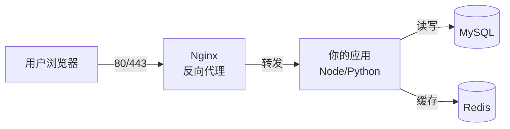

# 云服务器环境搭建：运行时、数据库与 Nginx

在上一篇《[网络排查与磁盘管理](/posts/linux/networking-and-disk)》中，我们已经掌握了网络排查方法，并把磁盘、挂载和扩容这些基础设施准备妥当。但此时服务器仍缺少运行项目所需的语言运行时、数据库和流量入口。

这篇文章的目标，是搭好一个**可用于后续部署的基础运行环境**。它并不等于完整的生产环境：高可用、监控告警、备份恢复演练、容量规划和发布回滚等能力，还需要结合业务继续建设。本文会按"一个 Web 请求从外到内的路径"来组织内容，让你清楚每个组件在系统里扮演什么角色：



我们将从最外层的 **Nginx** 概念讲起，再到中间的**运行时**，最后到底层的**数据库**，并在最后用 `systemd` 把一切串成可靠的"开机自启、崩溃自愈"的服务。

:::note 环境约定
本文以 **Ubuntu 22.04 / 24.04 LTS** 为例，包管理器使用 `apt`。如果你用的是 CentOS/RHEL 系列，把 `apt` 换成 `dnf`、把 `sudo apt install` 换成 `sudo dnf install` 即可，思路完全一致。
:::

---

## 1. 先理解三类组件的角色

在动手安装之前，先建立一个清晰的心智模型。一个典型的 Web 项目运行环境由三类组件构成：

| 组件 | 角色 | 类比 |
| :--- | :--- | :--- |
| **运行时**（Node/Python/JVM） | 真正执行你写的业务代码 | 厨房里的厨师 |
| **数据库**（MySQL/Redis） | 存储和缓存数据 | 仓库和冰箱 |
| **Web 服务器**（Nginx） | 接收外部请求、分发流量、托管静态文件、处理 HTTPS | 餐厅前台/门童 |

很多新手会问："我用 Node.js 自己就能监听 80 端口对外服务，为什么还要 Nginx？" 这个问题我们会在第 4 节专门解答。先按部就班把环境装起来。

在开始前，先更新一下软件源（这是上一篇讲过的好习惯）：

```bash
sudo apt update && sudo apt upgrade -y
```

---

## 2. 安装应用运行时

你的项目用什么语言写的，就装对应的运行时。这里以最常见的 **Node.js** 和 **Python** 为例。

### 2.1 安装 Node.js（推荐用 nvm 管理多版本）

直接用 `apt install nodejs` 装到的版本通常很旧。更好的方式是用 **nvm（Node Version Manager）**，它能让你自由切换 Node 版本，互不干扰。

```bash
# 1. 安装经过团队验证的 nvm 版本（示例版本，不要盲目替换成 latest）
curl -o- https://raw.githubusercontent.com/nvm-sh/nvm/v0.40.1/install.sh | bash

# 2. 让当前终端立即加载 nvm（或重新登录一次）
source ~/.bashrc

# 3. 示例：安装并固定经过项目验证的 Node.js 20.18.1
# 实际版本优先读取 package.json 的 engines、.nvmrc，并以 CI/预发布验证结果为准
nvm install 20.18.1
nvm alias default 20.18.1
nvm use 20.18.1

# 4. 验证
node -v
npm -v
```

:::tip 版本以项目约束和验证结果为准
本文用经过验证的 Node.js 20.18.1 演示，不表示所有项目都应使用这个版本。部署前依次检查 `package.json` 中的 `engines`、仓库中的 `.nvmrc`、包管理器锁文件，以及 CI/预发布环境验证结果；升级运行时也应先验证依赖兼容性，而不是直接安装“最新版本”。
:::

:::tip 为什么不用 root 装 nvm？
nvm 把 Node 装在**当前用户的家目录**下（`~/.nvm`），这正符合上一篇“用普通用户 deploy 操作”的原则——你的应用运行时归属于业务用户，而不需要 root 权限，更安全也更易管理。
:::

如果项目使用 `pnpm`，可以通过 Node 自带的 `corepack` 启用经过验证的版本。下面固定使用 pnpm 9.15.4 演示；实际版本应优先遵循 `package.json` 的 `packageManager` 字段和现有锁文件：

```bash
corepack enable
corepack prepare pnpm@9.15.4 --activate
pnpm --version
```

### 2.2 安装 Python（用系统自带 + venv）

Ubuntu 一般自带 Python 3。我们要补装的是创建**虚拟环境**和安装包的工具：

```bash
# 安装 venv 和 pip
sudo apt install python3 python3-venv python3-pip -y

# 验证
python3 --version
pip3 --version
```

部署 Python 项目时，**强烈建议每个项目用独立的虚拟环境**，避免依赖互相污染：

```bash
# 在项目目录下创建虚拟环境
python3 -m venv venv

# 激活它（激活后命令行前会出现 (venv) 标记）
source venv/bin/activate

# 在虚拟环境内安装依赖
pip install -r requirements.txt

# 用完退出虚拟环境
deactivate
```

---

## 3. 安装数据库

### 3.1 MySQL：关系型数据库

```bash
# 1. 安装 MySQL 服务端
sudo apt install mysql-server -y

# 2. 启动并设为开机自启
sudo systemctl start mysql
sudo systemctl enable mysql

# 3. 运行安全初始化脚本（设置 root 密码、移除匿名用户和测试库）
sudo mysql_secure_installation
```

`mysql_secure_installation` 会交互式地问你几个问题，建议这样选：

- 是否启用密码强度校验插件：学习可以选 No（`n`）。
- 设置 root 密码：**是**，设一个强密码。
- 移除匿名用户：**是**（`y`）。
- 禁止 root 远程登录：**是**（`y`，更安全）。
- 移除 test 数据库：**是**（`y`）。
- 重新加载权限表：**是**（`y`）。

接下来，**不要让应用直接用 root 连数据库**。应该为每个项目创建专用账号，遵循"最小权限原则"：

```sql
-- 用 sudo mysql 进入 MySQL 控制台后执行

-- 1. 创建数据库
CREATE DATABASE myapp CHARACTER SET utf8mb4 COLLATE utf8mb4_unicode_ci;

-- 2. 创建专用用户（'%' 表示允许任意主机，仅限内网可用时建议改成 'localhost'）
CREATE USER 'myapp_user'@'localhost' IDENTIFIED BY 'a_strong_password';

-- 3. 只授予这个用户对 myapp 库的权限，而不是所有库
GRANT ALL PRIVILEGES ON myapp.* TO 'myapp_user'@'localhost';

-- 4. 刷新权限
FLUSH PRIVILEGES;
```

:::warning 数据库不要暴露在公网
默认情况下 MySQL 监听 `127.0.0.1`（仅本机可访问），这是**安全的**。除非确有需要，否则**不要**修改 `bind-address` 让它监听公网，更**不要**在防火墙/安全组里放行 3306 端口。绝大多数"数据库被脱库勒索"的事故，都源于把数据库直接暴露在了公网。
:::

### 3.2 Redis：内存缓存数据库

Redis 常用于缓存、会话存储、消息队列等场景。

```bash
# 1. 安装
sudo apt install redis-server -y

# 2. 启动并设为开机自启
sudo systemctl enable --now redis-server

# 3. 测试连接（返回 PONG 即正常）
redis-cli ping
```

同样建议给 Redis 加上密码，编辑 `/etc/redis/redis.conf`：

```text
# 找到 requirepass 这一行，去掉注释并设置密码
requirepass your_redis_password

# 确认只监听本机（默认就是，保持即可）
bind 127.0.0.1 ::1
```

修改后重启：`sudo systemctl restart redis-server`。

### 3.3 Redis 持久化：根据数据角色做选择

Redis 的主要数据在内存中，但是否需要落盘取决于它在系统中的角色：

- 如果 Redis 只保存**可以从数据库或上游重新生成的缓存**，可以选择关闭持久化，换取更简单的磁盘管理；同时要确认缓存重建不会压垮上游。
- 如果 Redis 保存会话、队列状态或其他**不能轻易重建的数据**，就应评估 RDB、AOF、副本和备份恢复方案，不能把“缓存”当成不需要保护的数据。

Redis 提供两种主要持久化方式：

| 方式 | 原理 | 优点 | 缺点 |
| :--- | :--- | :--- | :--- |
| **RDB** | 定时把内存快照写入磁盘 | 恢复快，文件紧凑 | 故障时可能丢失最近一次快照后的写入 |
| **AOF** | 把写命令追加到日志文件 | 可按同步策略缩小数据丢失窗口 | 文件通常更大，恢复与重写成本更高 |

Ubuntu/Debian 软件包的常见配置会启用 RDB 快照，但**最终是否启用以及快照周期必须以当前发行版的 `/etc/redis/redis.conf` 为准**，不要只凭经验假定。可以先检查：

```bash
# 查看 RDB 保存规则；没有 save 规则通常表示未配置定期快照
sudo grep -E '^[[:space:]]*save[[:space:]]' /etc/redis/redis.conf

# 查看 AOF 配置
sudo grep -E '^[[:space:]]*(appendonly|appendfsync)[[:space:]]' /etc/redis/redis.conf
```

如果数据角色要求更小的故障丢失窗口，可以在评估磁盘性能后启用 AOF：

```text
# 编辑 /etc/redis/redis.conf
appendonly yes

# 通常每秒发起一次同步，在性能和数据安全之间折中
appendfsync everysec
```

`appendfsync everysec` 表示 Redis 通常按秒请求同步，但操作系统调度、存储缓存、虚拟化层和突发故障都可能扩大实际丢失窗口，**不能承诺绝对最多只丢 1 秒数据**。对数据安全有严格要求时，要结合存储语义、复制、备份和恢复演练验证目标。

修改后 `sudo systemctl restart redis-server`。验证 AOF 是否生效：

```bash
# 进入 Redis 命令行
redis-cli

# 查看持久化配置
CONFIG GET appendonly
```

### 3.4 MySQL 备份基础

数据库数据是整个项目最值钱的部分，代码可以重写，数据丢了就是灾难。备份不是"以后再说"的事，而是装好数据库的第一天就该配置的。

```bash
# 手动备份单个数据库
mysqldump -u myapp_user -p myapp > backup_$(date +%Y%m%d).sql

# 手动备份所有数据库
sudo mysqldump -u root -p --all-databases > full_backup_$(date +%Y%m%d).sql

# 恢复备份
mysql -u myapp_user -p myapp < backup_20260210.sql
```

:::tip 自动备份
把备份命令写成脚本，配合 cron 定时执行，就能实现每天自动备份。具体做法见《[系统运维与安全](/posts/linux/system-ops-and-security)》的定时任务章节。
:::

### 3.5 MySQL 字符集：utf8 vs utf8mb4

MySQL 的 `utf8` 其实是"伪 UTF-8"，最多只支持 3 字节字符，存不了 emoji 表情。真正的 UTF-8 是 `utf8mb4`（最多 4 字节）。

创建数据库时务必指定 `utf8mb4`（前面创建数据库时已经这样做了）：

```sql
CREATE DATABASE myapp CHARACTER SET utf8mb4 COLLATE utf8mb4_unicode_ci;
```

如果已有数据库用了 `utf8`，可以转换：

```sql
ALTER DATABASE myapp CHARACTER SET utf8mb4 COLLATE utf8mb4_unicode_ci;
```

同时检查连接字符集，在 `/etc/mysql/mysql.conf.d/mysqld.cnf` 中确保：

```text
[mysqld]
character-set-server=utf8mb4
collation-server=utf8mb4_unicode_ci

[client]
default-character-set=utf8mb4
```

修改后 `sudo systemctl restart mysql`。

---

## 4. Nginx：流量的入口与守门人

现在回答前面那个关键问题：**既然应用自己能监听端口，为什么还要 Nginx？**

因为 Nginx 作为专业的 Web 服务器，能优雅地承担应用不擅长的脏活累活：

- **反向代理**：把用户请求转发给后端应用，让应用安心跑在内网高位端口（如 3000），不直接暴露。
- **静态资源服务**：图片、CSS、JS 这类静态文件，Nginx 提供服务的效率远高于 Node/Python。
- **HTTPS 终止**：在 Nginx 层统一处理 SSL 证书，后端应用无需关心加密。
- **负载均衡**：流量大了，可以把请求分发到多个应用实例。
- **统一入口**：一台服务器上跑多个项目，可以通过域名/路径由 Nginx 分发到不同后端。

### 4.1 安装与基础操作

```bash
# 安装
sudo apt install nginx -y

# 启动并开机自启
sudo systemctl enable --now nginx
```

此时，在浏览器访问你的服务器公网 IP（`http://你的IP`），应该能看到 Nginx 的默认欢迎页 "Welcome to nginx!"。如果看不到，回顾上一篇：检查 **UFW** 和**云厂商安全组**是否都放行了 80 端口。

### 4.2 理解什么是反向代理

这是 Nginx 最核心的用途，务必理解清楚。

- **正向代理**：代理**客户端**。比如你用 VPN 访问外网，VPN 替你去请求，服务器只看到 VPN 的 IP。
- **反向代理**：代理**服务器**。用户以为自己在和 Nginx 对话，实际上 Nginx 在背后偷偷把请求转发给了真正的应用。


用户全程只和 Nginx（80/443 端口）打交道，完全不知道背后那个监听 3000 端口的应用的存在。

### 4.3 配置一个反向代理站点

Nginx 的站点配置放在 `/etc/nginx/sites-available/`，启用时通过软链接到 `/etc/nginx/sites-enabled/`。我们新建一个配置：

```bash
sudo nano /etc/nginx/sites-available/myapp
```

写入以下内容（假设你的应用监听本机 3000 端口）：

```nginx
server {
    listen 80;
    # 把 example.com 换成你的域名；没有域名就写服务器公网 IP
    server_name example.com;

    location / {
        # 核心：把请求转发给本机 3000 端口的应用
        proxy_pass http://127.0.0.1:3000;

        # 传递真实的客户端信息给后端应用
        proxy_set_header Host $host;
        proxy_set_header X-Real-IP $remote_addr;
        proxy_set_header X-Forwarded-For $proxy_add_x_forwarded_for;
        proxy_set_header X-Forwarded-Proto $scheme;

        # 支持 WebSocket（如果应用用到了实时通信）
        proxy_http_version 1.1;
        proxy_set_header Upgrade $http_upgrade;
        proxy_set_header Connection "upgrade";
    }
}
```

启用并生效：

```bash
# 1. 创建软链接启用站点
sudo ln -s /etc/nginx/sites-available/myapp /etc/nginx/sites-enabled/

# 2. （可选）移除默认站点，避免冲突
sudo rm /etc/nginx/sites-enabled/default

# 3. ⚠️ 关键：每次改完配置都先测试语法，避免重载后整个 Nginx 挂掉
sudo nginx -t

# 4. 测试通过后，平滑重载配置（不中断现有连接）
sudo systemctl reload nginx
```

:::tip reload 还是 restart？
- `reload`：平滑重载配置，**不中断**正在处理的请求，日常改配置用这个。
- `restart`：完全停止再启动，会**短暂中断**服务，一般只在大改动或服务异常时用。

这正是《[深入浅出 Linux](/posts/linux/linux-fundamentals)》里讲的 **SIGHUP 信号重载配置**在实际中的体现——`reload` 本质就是给 Nginx 主进程发了重载信号。
:::

### 4.4 用 Nginx 直接托管静态网站

如果你的项目是纯前端（如打包后的 React/Vue 静态文件），根本不需要后端应用，直接让 Nginx 托管即可：

```nginx
server {
    listen 80;
    server_name example.com;

    # 静态文件根目录
    root /var/www/myapp/dist;
    index index.html;

    location / {
        # 单页应用（SPA）路由回退：找不到文件时返回 index.html
        try_files $uri $uri/ /index.html;
    }
}
```

---

### 4.5 Nginx 多站点：一台服务器跑多个项目

一台服务器完全可以同时服务多个网站。Nginx 通过 **server_name** 区分不同域名的请求，转发到不同的后端。

假设你有两个项目：`blog.example.com` 和 `api.example.com`：

```bash
# 为两个站点分别创建配置
sudo nano /etc/nginx/sites-available/blog
sudo nano /etc/nginx/sites-available/api
```

```nginx
# /etc/nginx/sites-available/blog
server {
    listen 80;
    server_name blog.example.com;

    location / {
        proxy_pass http://127.0.0.1:3000;
        proxy_set_header Host $host;
        proxy_set_header X-Real-IP $remote_addr;
        proxy_set_header X-Forwarded-For $proxy_add_x_forwarded_for;
    }
}
```

```nginx
# /etc/nginx/sites-available/api
server {
    listen 80;
    server_name api.example.com;

    location / {
        proxy_pass http://127.0.0.1:8000;
        proxy_set_header Host $host;
        proxy_set_header X-Real-IP $remote_addr;
        proxy_set_header X-Forwarded-For $proxy_add_x_forwarded_for;
    }
}
```

```bash
# 启用两个站点
sudo ln -s /etc/nginx/sites-available/blog /etc/nginx/sites-enabled/
sudo ln -s /etc/nginx/sites-available/api /etc/nginx/sites-enabled/

# 测试并重载
sudo nginx -t && sudo systemctl reload nginx
```

Nginx 的匹配规则是：请求到达后，会结合监听地址/端口与 `server_name` 选择 `server` 块。如果没有任何 `server_name` 匹配，就使用该监听地址和端口上的默认服务器。应通过 `listen 80 default_server;`（HTTPS 对应 `listen 443 ssl default_server;`）显式声明默认站点，而不要依赖 `sites-enabled` 文件名或字母顺序；未显式声明时的隐式默认行为也与配置加载后的 server 顺序有关，不适合作为部署约定。

### 4.6 Nginx 常见错误排错

**502 Bad Gateway**：最常见，Nginx 成功接收了请求，但后端应用没有响应。

```bash
# 1. 后端应用是否在运行？
sudo systemctl status myapp

# 2. 应用是否真的在监听 3000 端口？
ss -lnt | grep :3000

# 3. 看 Nginx 错误日志获取具体原因
sudo tail -n 20 /var/log/nginx/error.log
```

常见原因：应用崩溃了、端口配错了（Nginx 写 3000 但应用监听 8080）、应用启动慢还没就绪。

**413 Request Entity Too Large**：上传文件太大，超过了 Nginx 默认的 1MB 限制。

```nginx
# 在 server 或 location 块中加大限制
client_max_body_size 50m;
```

**403 Forbidden**：Nginx 无权读取静态文件。

```bash
# 检查文件权限和所有者
ls -la /var/www/myapp/dist/

# Nginx 工作进程以 www-data 用户运行，确保它能读取文件
sudo chown -R www-data:www-data /var/www/myapp/dist/
```

### 4.7 Nginx 日志

Nginx 的日志是你排查问题的主要依据，默认存放在 `/var/log/nginx/`：

```bash
# 访问日志（每次请求一条记录）
sudo tail -f /var/log/nginx/access.log

# 错误日志（Nginx 自身的错误，如后端不可达）
sudo tail -f /var/log/nginx/error.log
```

Nginx 常见的 `combined` 访问日志包含客户端 IP、请求行、状态码、响应大小、Referer 和 User-Agent，**默认并不包含请求耗时或上游响应耗时**。如果要按耗时分析，应先在 `http` 块（通常位于 `/etc/nginx/nginx.conf`）显式定义格式，再让站点使用它：

```nginx
http {
    # 末尾两个字段固定写成 rt=... 和 urt=...，便于脚本稳定解析
    log_format timed_combined '$remote_addr - $remote_user [$time_local] '
                              '"$request" $status $body_bytes_sent '
                              '"$http_referer" "$http_user_agent" '
                              'rt=$request_time urt=$upstream_response_time';

    access_log /var/log/nginx/access.log timed_combined;

    # 其他 include 配置保持原样
}
```

修改后先执行 `sudo nginx -t`，通过后再执行 `sudo systemctl reload nginx`。上面的格式中，状态码仍是第 9 列，`rt=` 是倒数第二列，`urt=` 是最后一列：

```bash
# 统计每个状态码出现的次数
awk '{print $9}' /var/log/nginx/access.log | sort | uniq -c | sort -nr

# 按 rt= 请求总耗时排序，输出耗时最长的 10 条
awk '{for (i=1; i<=NF; i++) if ($i ~ /^rt=/) {split($i, a, "="); print a[2], $0}}' \
  /var/log/nginx/access.log | sort -nr | head -n 10

# 单独观察 urt= 上游响应耗时；无上游时可能记录为 -
awk '{for (i=1; i<=NF; i++) if ($i ~ /^urt=/) print $i}' \
  /var/log/nginx/access.log | sort | uniq -c
```

---

## 5. 配置 HTTPS：让网站用上小绿锁

明文的 HTTP 已经被现代浏览器标记为"不安全"。给网站配 HTTPS 不仅安全，还是很多功能（如 PWA、地理定位）的前提。最简单免费的方案是 **Let's Encrypt + Certbot**。

:::important 前提条件
配 HTTPS 需要一个**已经解析到你服务器 IP 的域名**（纯 IP 无法签发受信任证书）。请先在域名服务商处把域名的 A 记录指向你的服务器公网 IP。
:::

```bash
# 1. 安装 Certbot 及其 Nginx 插件
sudo apt install certbot python3-certbot-nginx -y

# 2. 一条命令自动签发证书并改写 Nginx 配置
sudo certbot --nginx -d example.com -d www.example.com
```

Certbot 会：自动验证域名归属、签发证书、**自动修改你的 Nginx 配置**加上 443 端口和证书路径、并配置 HTTP 自动跳转 HTTPS。证书有效期 90 天，Certbot 还会自动设置定时任务续期，你基本不用再操心。

完成后，记得在防火墙放行 443（上一篇已讲）：`sudo ufw allow 443/tcp`。

---

## 6. systemd：让你的应用变成可靠的"服务"

前面所有组件（Nginx、MySQL、Redis）都是用 `systemctl start/enable` 来管理的。这背后是 Linux 现代的**服务管理系统 systemd**。它的核心价值是：

- **开机自启**（`enable`）：服务器重启后服务自动拉起。
- **崩溃自愈**：进程意外退出后自动重启。
- **统一管理**：用一套命令管理所有后台服务，并集中收集日志。

我们也应该把**自己的应用**注册成 systemd 服务，而不是用 `nohup ... &` 这种简陋方式（一旦崩溃就再也起不来了，还记得《[深入浅出 Linux](/posts/linux/linux-fundamentals)》里讲的 nohup 吗）。

### 6.1 systemctl 常用命令速查

```bash
sudo systemctl start nginx       # 启动
sudo systemctl stop nginx        # 停止
sudo systemctl restart nginx     # 重启
sudo systemctl reload nginx      # 重载配置
sudo systemctl status nginx      # 查看运行状态（最常用，排错第一步）
sudo systemctl enable nginx      # 设为开机自启
sudo systemctl disable nginx     # 取消开机自启
```

### 6.2 把自己的 Node 应用做成 systemd 服务

systemd 启动服务时**不会加载交互式 shell 的 `~/.bashrc`，也不会自动初始化 nvm**。因此不要在 `ExecStart` 中写 `/home/deploy/.nvm/versions/node/v20.x.x/...` 这类无法执行的占位路径。一个稳定做法是：由项目维护固定入口脚本，在脚本中显式加载并选择已经验证的 Node 版本。

先创建完整的启动脚本：

```bash
sudo install -d -o deploy -g deploy /home/deploy/myapp/bin

sudo tee /home/deploy/myapp/bin/start.sh > /dev/null <<'EOF'
#!/bin/bash
set -Eeuo pipefail

# systemd 不加载 ~/.bashrc，因此在非交互环境中显式初始化 nvm
export NVM_DIR="/home/deploy/.nvm"
if [ ! -s "$NVM_DIR/nvm.sh" ]; then
  echo "nvm.sh not found: $NVM_DIR/nvm.sh" >&2
  exit 1
fi
. "$NVM_DIR/nvm.sh"

cd /home/deploy/myapp

# 与前文一致：使用项目已经验证的精确版本；实际项目可改为读取 .nvmrc
nvm use 20.18.1 > /dev/null

# 用 exec 让 Node 接收 systemd 发出的停止和重启信号
exec node server.js
EOF

sudo chown deploy:deploy /home/deploy/myapp/bin/start.sh
sudo chmod 750 /home/deploy/myapp/bin/start.sh
```

再创建服务单元文件：

```bash
sudo nano /etc/systemd/system/myapp.service
```

写入：

```ini
[Unit]
Description=My Node.js App
Wants=network-online.target
After=network-online.target

[Service]
# 用普通用户运行，而不是 root（安全！）
User=deploy
Group=deploy
WorkingDirectory=/home/deploy/myapp

# 指向项目维护的稳定启动入口，不依赖版本目录占位符
ExecStart=/home/deploy/myapp/bin/start.sh

# 崩溃后自动重启
Restart=on-failure
RestartSec=5

# 注入环境变量
Environment=NODE_ENV=production
Environment=PORT=3000

[Install]
WantedBy=multi-user.target
```

:::note 另一种做法：使用稳定系统路径
如果团队把经过验证的 Node 安装到 `/usr/bin/node` 等稳定系统路径，也可以直接写 `ExecStart=/usr/bin/node /home/deploy/myapp/server.js`，从而完全避开 nvm。只有在服务单元中通过 `Environment=PATH=/明确/列出的/bin:/usr/bin:/bin` 固定了可执行文件搜索路径时，才考虑使用 `/usr/bin/env node`；不要依赖登录用户的交互式 PATH。
:::

让它生效并启动：

```bash
# 1. 重新加载 systemd 配置（每次改 .service 文件后都要执行）
sudo systemctl daemon-reload

# 2. 启动并设为开机自启
sudo systemctl enable --now myapp

# 3. 查看状态，确认是 active (running)
sudo systemctl status myapp
```

### 6.3 用 journalctl 查看应用日志

注册成 systemd 服务后，应用的所有输出（`stdout`/`stderr`）都会被 systemd 收集，用 `journalctl` 统一查看：

```bash
# 查看 myapp 的全部日志
sudo journalctl -u myapp

# 实时跟踪最新日志（相当于第一篇讲的 tail -f）
sudo journalctl -u myapp -f

# 只看今天的日志
sudo journalctl -u myapp --since today
```

:::tip Node 项目也可以用 PM2
除了 systemd，Node 生态里还有非常流行的进程管理工具 **PM2**（`npm install -g pm2`），它内置了进程守护、日志管理、负载均衡（cluster 模式）和开机自启（`pm2 startup` + `pm2 save`）。两者选其一即可：追求"系统级统一管理"用 systemd，追求"Node 生态便捷"用 PM2。下一篇部署实战中我们会再具体演示。
:::

---

## 总结

经过这一篇，你的服务器已经具备了**承载后续部署的基础运行环境**。这仍不是完整生产体系：上线前还要结合业务补齐监控告警、备份与恢复演练、高可用、容量规划、安全策略和发布回滚。本文按照请求流转的路径串起了这些基础组件：

- **运行时**：用 `nvm` 管理经过项目约束与验证的 Node.js 版本、用 `venv` 隔离 Python，让应用代码能跑起来。
- **数据库**：安装 MySQL 与 Redis，遵循**最小权限**和**绝不暴露公网**两条铁律；MySQL 要规划备份与 utf8mb4 字符集，Redis 则按数据能否重建决定关闭持久化或配置 RDB/AOF，并验证实际恢复目标。
- **Nginx**：作为流量入口，理解并配置**反向代理**，托管静态资源，多站点配置，常见错误排错；再用 **Certbot** 配置 HTTPS。
- **systemd**：把 Nginx、数据库乃至**你自己的应用**都管理成开机自启、故障重启的服务，通过稳定启动脚本明确运行时环境，并用 `journalctl` 查日志。

基础环境准备好后，下一篇《[项目部署实战](/posts/linux/project-deployment-in-practice)》将把应用真正部署到服务器上，串联代码发布、依赖安装、进程启动、反向代理与上线验证。
