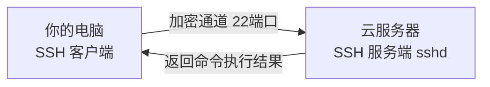
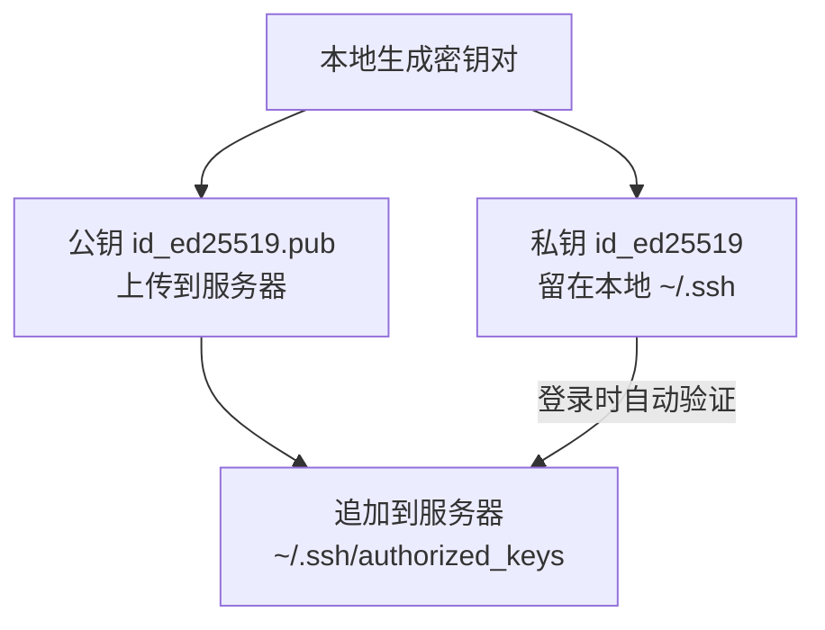

# 云服务器入门：从购买、连接到安全加固

在前两篇文章中，我们已经熟悉了 Linux 的[文件系统与基础命令](/blog/posts/linux/linux-fundamentals)，也掌握了[管道、文本处理与进程管理](/blog/posts/linux/linux-advanced-commands)等进阶技巧。但这些操作大多是在本地或虚拟机里练习的。

真正的考验是：**当你拥有一台远在千里之外、只能通过网络访问的云服务器时，你该如何安全地登录它、管理它？**

这篇文章就是这条学习链路的转折点——从"会用 Linux"走向"会运维一台真实的服务器"。我们会按照实际工作流程一步步推进：

1. 先搞清楚云服务器到底是什么，怎么选
2. 用 SSH 连接上去，并升级为更安全的密钥登录
3. 建立合理的用户体系，告别一直用 root 的坏习惯
4. 配置防火墙，做好基础安全加固

读完本文，你会得到一台**可以放心暴露在公网、用来部署项目**的服务器。

---

## 1. 云服务器是什么？该怎么选？

### 1.1 从物理机到云服务器

传统时代，想要一台联网的服务器，你得自己买一台物理机器，托管在机房里，自己管电源、网络、散热。这成本高、运维难。

**云服务器（Cloud Server / VPS / ECS）** 则是云厂商把一台或多台超强的物理服务器，通过**虚拟化技术**切分成许多台"虚拟机"，按需租给你。你拿到的就是一台拥有独立 IP、独立操作系统、可以完全控制（root 权限）的 Linux 机器。

常见的云厂商：

| 厂商 | 产品名 | 特点 |
| :--- | :--- | :--- |
| 阿里云 | ECS | 国内份额大，文档全 |
| 腾讯云 | CVM | 性价比高，活动多 |
| AWS | EC2 | 全球化，功能最全 |
| 华为云 | ECS | 政企客户多 |
| Vultr / DigitalOcean | Droplet | 海外，按小时计费，适合学习 |

### 1.2 选购时关注的核心参数

第一次买服务器，面对一堆配置选项很容易懵。抓住这几个核心参数即可：

- **CPU / 内存**：学习和小项目，`2 核 2G` 或 `2 核 4G` 足够。内存太小（如 1G）跑数据库容易被系统杀进程。
- **操作系统镜像**：新手强烈推荐 **Ubuntu 22.04 LTS** 或 **Ubuntu 24.04 LTS**。LTS（长期支持版）稳定、社区资料多，本系列也以 Ubuntu/Debian 的 `apt` 为主。
- **带宽**：决定下载/访问速度。学习用 `3~5 Mbps` 即可；如果走"按流量计费"，平时空闲时几乎不花钱。
- **地域（Region）**：服务给国内用户用就选国内节点；个人学习、需要访问海外资源可选海外节点。

:::tip 关于"备案"
如果你购买的是**国内**云服务器，并且想用**域名**通过 80/443 端口对外提供网站服务，按规定需要先完成 **ICP 备案**。纯 IP 访问、或使用海外服务器则无需备案。学习阶段可以先用 IP + 高位端口跑通流程。
:::

购买完成后，云厂商的控制台会给你三样关键信息，请记下来：

- **公网 IP**：例如 `123.45.67.89`，这是你访问服务器的地址。
- **登录用户名**：通常是 `root`（Ubuntu 有时是 `ubuntu`）。
- **初始密码**：如果创建时没设密码，可以在控制台"重置密码"。

---

## 2. 用 SSH 连接你的服务器

### 2.1 什么是 SSH？

**SSH（Secure Shell）** 是一种加密的网络协议，让你能够在**不安全的网络上安全地远程登录**另一台计算机并执行命令。它默认使用 **22 端口**。

它的工作模型很简单：你的电脑是**客户端（Client）**，云服务器是**服务端（Server）**。客户端发起连接，服务端验证你的身份，验证通过后，你在本地终端敲的每一条命令，都会被加密后发送到服务器执行。



### 2.2 第一次连接：密码登录

几乎所有系统都自带 SSH 客户端（Windows 10/11、macOS、Linux 都内置了 `ssh` 命令）。打开终端，输入：

```bash
# 语法：ssh 用户名@服务器IP
ssh root@123.45.67.89
```

第一次连接时，会出现一段提示：

```text
The authenticity of host '123.45.67.89' can't be established.
ED25519 key fingerprint is SHA256:xxxxxxxxxxxxxxxxxxxx.
Are you sure you want to continue connecting (yes/no/[fingerprint])?
```

这是 SSH 在问你："我没见过这台服务器，确定要信任它吗？" 输入 `yes` 回车，它会把服务器的指纹记录到本地 `~/.ssh/known_hosts` 文件中。之后再连接同一台服务器就不会再问了。

接着输入密码（注意：**Linux 终端输入密码时不会显示任何字符，包括星号，这是正常的**），回车即可登录成功。

登录成功后，你会看到命令提示符变成了服务器上的样子，例如：

```text
root@hostname:~#
```

恭喜，你现在正站在自己的云服务器上了。可以试试前两篇学过的命令：

```bash
# 看看系统信息
uname -a

# 看看磁盘
df -h

# 看看是谁登录的、从哪登录的
who
```

### 2.3 退出连接

输入 `exit` 或按 `Ctrl + D` 即可断开 SSH 连接，回到你自己电脑的终端。

---

## 3. 升级为密钥登录：更安全也更省事

密码登录有两个问题：**密码可能被暴力破解**，而且**每次登录都要手敲密码**。更专业的做法是使用 **SSH 密钥对（Key Pair）**。

### 3.1 密钥登录的原理

密钥对由两把"钥匙"组成，基于**非对称加密**：

- **私钥（Private Key）**：留在你自己电脑上，**绝对不能泄露**，相当于你的身份证。
- **公钥（Public Key）**：可以公开，放到服务器上，相当于一把"只认你私钥"的锁。

登录时，服务器用公钥出一道"题"，只有持有对应私钥的人才能解开，从而证明"你就是你"。整个过程私钥**永远不会离开你的电脑**，因此比密码安全得多。



### 3.2 第一步：在本地生成密钥对

在**你自己的电脑**上（不是服务器）执行：

```bash
# -t ed25519 指定使用现代、安全且短小的算法（推荐）
# -C 是注释，一般写邮箱方便区分
ssh-keygen -t ed25519 -C "your_email@example.com"
```

它会依次询问：

- **保存路径**：直接回车，使用默认的 `~/.ssh/id_ed25519`。
- **passphrase（私钥口令）**：可选。设置后即使私钥文件被偷，对方也无法直接使用。学习阶段可以直接回车留空。

完成后，`~/.ssh/` 目录下会生成两个文件：

- `id_ed25519`：私钥（**保管好，别发给任何人**）
- `id_ed25519.pub`：公钥（可以公开）

### 3.3 第二步：把公钥上传到服务器

**方法一（推荐，Linux/macOS）**：使用 `ssh-copy-id` 一条命令搞定。

```bash
ssh-copy-id root@123.45.67.89
```

它会提示你输入一次服务器密码，然后自动把公钥追加到服务器的 `~/.ssh/authorized_keys` 文件里。

**方法二（手动，适用于 Windows 或任何环境）**：先查看本地公钥内容，复制出来；再登录服务器手动追加。

```bash
# 1. 在本地查看并复制公钥内容（一整行）
cat ~/.ssh/id_ed25519.pub

# 2. SSH 登录服务器后执行（把 <你的公钥> 换成上一步复制的内容）
mkdir -p ~/.ssh && chmod 700 ~/.ssh
echo "<你的公钥>" >> ~/.ssh/authorized_keys
chmod 600 ~/.ssh/authorized_keys
```

:::warning 权限很关键
SSH 出于安全考虑，对权限要求很严格：`~/.ssh` 必须是 `700`，`authorized_keys` 必须是 `600`。权限不对会导致密钥登录失败（且不报明显错误）。还记得[第一篇](/blog/posts/linux/linux-fundamentals)讲的 `chmod` 吗？这里就是它的实战用武之地。
:::

### 3.4 第三步：验证密钥登录

现在再次连接，应该**无需输入密码**就能直接登录（如果设置了 passphrase，则会要求输入私钥口令而非服务器密码）：

```bash
ssh root@123.45.67.89
```

### 3.5 用配置文件简化连接

每次都敲 `ssh root@123.45.67.89` 很麻烦。在本地创建/编辑 `~/.ssh/config`：

```text
Host myserver
    HostName 123.45.67.89
    User root
    Port 22
    IdentityFile ~/.ssh/id_ed25519
```

之后只需一句：

```bash
ssh myserver
```

---

## 4. 用户管理：告别"一直用 root"

很多新手登录后一直用 `root` 操作，这是非常危险的习惯。`root` 拥有至高无上的权限，**一条 `rm -rf` 打错路径就能毁掉整个系统**，而且任何被它运行的恶意脚本都能为所欲为。

正确的做法是：**创建一个普通用户用于日常操作，需要管理员权限时通过 `sudo` 临时提权。**

### 4.1 创建新用户并赋予 sudo 权限

```bash
# 1. 创建用户 deploy（会引导你设置密码和一些可选信息，信息可一路回车跳过）
adduser deploy

# 2. 把 deploy 加入 sudo 组（Ubuntu/Debian 的管理员组叫 sudo）
usermod -aG sudo deploy
```

:::note adduser 和 useradd 的区别
`adduser` 是更友好的高层封装：会自动创建家目录、引导设置密码。`useradd` 更底层，需要手动加 `-m` 创建家目录、再用 `passwd` 设密码。新手用 `adduser` 即可。
:::

### 4.2 sudo 是什么？

**sudo（Substitute User DO）** 让普通用户能以 root 身份执行**单条**命令。这样做的好处是：

- 平时是普通用户，误操作的破坏范围有限；
- 需要管理员权限时，命令前加 `sudo` 即可；
- 所有 `sudo` 操作都会被记录到日志（`/var/log/auth.log`），可追溯。

```bash
# 普通用户无法直接操作系统目录
echo "test" > /etc/test.conf       # 报错：Permission denied

# 加上 sudo 即可（会要求输入"当前用户"的密码，不是 root 密码）
sudo bash -c 'echo "test" > /etc/test.conf'

# 安装软件也需要 sudo
sudo apt update
sudo apt install nginx
```

### 4.3 给新用户也配上密钥登录

为了让新用户 `deploy` 也能用密钥免密登录，把公钥也放到它的家目录下：

```bash
# 方法一：本地直接对新用户执行 ssh-copy-id
ssh-copy-id deploy@123.45.67.89

# 方法二：在服务器上从 root 复制（注意修正属主）
mkdir -p /home/deploy/.ssh
cp ~/.ssh/authorized_keys /home/deploy/.ssh/
chown -R deploy:deploy /home/deploy/.ssh
chmod 700 /home/deploy/.ssh
chmod 600 /home/deploy/.ssh/authorized_keys
```

验证 `deploy` 能正常登录、并能用 `sudo` 后，再进行下一步的安全加固。

---

## 5. SSH 安全加固

默认配置的服务器一旦暴露在公网，几乎**几分钟内就会被自动化脚本扫描和尝试爆破** 22 端口的 root 密码。我们来堵上这些口子。

SSH 服务端的配置文件是 `/etc/ssh/sshd_config`。用编辑器打开它：

```bash
sudo nano /etc/ssh/sshd_config
```

找到（或新增）以下几项关键配置：

```text
# 1. 禁止 root 直接通过 SSH 登录（强制走普通用户 + sudo）
PermitRootLogin no

# 2. 禁用密码登录，只允许密钥登录（彻底杜绝密码爆破）
PasswordAuthentication no

# 3. （可选）修改默认端口，避开绝大多数针对 22 的扫描
Port 2222
```

:::warning 改配置前务必先确认密钥能登录！
在执行 `PasswordAuthentication no` 之前，**一定要先确保新用户的密钥登录是正常工作的**，否则禁用密码后你可能把自己彻底锁在门外。稳妥做法：保持当前 SSH 会话不要断开，另开一个新终端测试登录，确认成功后再继续。
:::

修改保存后，重启 SSH 服务使其生效：

```bash
# 新版本 Ubuntu/Debian 服务名为 ssh
sudo systemctl restart ssh

# 部分系统服务名为 sshd
sudo systemctl restart sshd
```

如果修改了端口，之后连接需要带上 `-p`：

```bash
ssh -p 2222 deploy@123.45.67.89
```

（在 `~/.ssh/config` 里改一下 `Port 2222` 就能继续用 `ssh myserver`。）

---

## 6. 配置防火墙：只开该开的门

服务器上可能监听着很多端口，防火墙的作用就是**只放行必要的端口，其余一律拒绝**。Ubuntu 自带的 **UFW（Uncomplicated Firewall）** 非常简单易用。

```bash
# 1. 安装（通常已自带）
sudo apt install ufw

# 2. 设置默认策略：拒绝所有入站，允许所有出站
sudo ufw default deny incoming
sudo ufw default allow outgoing

# 3. 放行 SSH 端口（⚠️ 这一步必须在开启防火墙之前做，否则会断连！）
sudo ufw allow 22/tcp
# 如果你改了 SSH 端口，要放行新端口
# sudo ufw allow 2222/tcp

# 4. 放行 Web 服务端口（部署网站时需要）
sudo ufw allow 80/tcp     # HTTP
sudo ufw allow 443/tcp    # HTTPS

# 5. 启用防火墙
sudo ufw enable

# 6. 查看当前规则状态
sudo ufw status verbose
```

:::important 双重防火墙：别忘了云厂商的安全组
云服务器通常有**两层防火墙**：
1. **服务器内部的 UFW/iptables**（上面配置的）；
2. **云厂商控制台的"安全组（Security Group）"**。

两层都必须放行同一个端口，外部才能访问。新手最常见的"端口明明开了却连不上"，十有八九是忘了在云控制台的**安全组**里放行。配置防火墙时，请同时检查这两处。
:::

---

## 7. 一些必备的日常运维习惯

服务器跑起来后，下面这些操作会经常用到：

```bash
# 保持系统更新（修复安全漏洞）
sudo apt update && sudo apt upgrade -y

# 查看当前登录用户、谁在操作
who
w

# 查看系统资源占用（还记得进阶篇的 top/htop 吗）
htop      # 没有的话先 sudo apt install htop

# 查看 SSH 登录日志，看看有没有人在爆破
sudo grep "Failed password" /var/log/auth.log | tail -n 20

# 查看防火墙拦截/放行状态
sudo ufw status
```

:::tip 进阶：fail2ban
如果你想进一步防爆破，可以安装 `fail2ban`，它会自动分析日志，对短时间内多次登录失败的 IP 进行临时封禁。一行安装：`sudo apt install fail2ban`，安装后默认就会保护 SSH，开箱即用。
:::

---

## 总结

这篇文章我们完成了从"本地玩 Linux"到"运维一台真实云服务器"的关键跨越：

- **理解云服务器**：它就是一台你能完全控制的远程 Linux 机器，选购抓住 CPU/内存/系统/带宽/地域几个核心参数即可。
- **SSH 连接**：先用密码登录，再升级为更安全省事的**密钥登录**，并用 `~/.ssh/config` 简化操作。
- **用户体系**：创建普通用户 + `sudo` 提权，**告别全程 root**。
- **安全加固**：禁用 root 登录、关闭密码登录、配置 **UFW 防火墙**，别忘了**云厂商安全组**这层。

现在你有了一台干净、安全、可控的服务器。下一篇，我们将在这台服务器上**搭建真正的运行环境**——包括 Node.js/Python 运行时、数据库（MySQL/Redis）以及 Web 服务器 Nginx，为部署项目打好地基。
