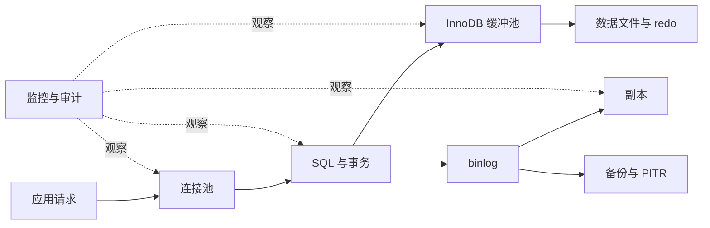

# 生产数据库运维：MySQL 8.0/8.4 LTS 的稳定性工程

数据库生产运维不是“会写 SQL”之后再补几条命令，而是一套围绕**数据正确性、可用性、可恢复性与可演进性**建立的工程系统。一次查询变慢，可能来自错误索引、锁等待、连接风暴或存储抖动；一次看似简单的字段修改，也可能同时影响复制延迟、回滚路径和容量水位。

本文主要适用于 **MySQL 8.0（截至 8.0 系列受支持版本）与 MySQL 8.4 LTS**，默认使用 InnoDB、GTID、ROW 格式 binlog。云厂商参数名、故障切换接口和备份能力各不相同，请以所用服务的当前文档为准。

:::warning 生产操作总原则
所有 `ALTER`、数据回填、主从切换、恢复、升级、删除和大批量写操作都可能造成不可逆后果。必须先在与生产规模接近的实验环境演练，记录耗时与资源曲线，准备停止条件和回滚路径，再经过审批窗口执行。本文示例中的破坏性步骤都会再次标注警告。
:::

<ProgressIndicator
  current="linux/database-production-operations"
  items={[
    { slug: "linux/database-production-operations", title: "生产数据库运维" },
    { slug: "linux/backup-restore-and-disaster-recovery", title: "备份、恢复与灾难恢复" },
    { slug: "linux/production-security-baseline", title: "生产安全基线" },
    { slug: "linux/incident-response-and-oncall", title: "事件响应与值班" },
  ]}
/>

## 1. 先建立生产数据库的心智模型

生产数据库是一条相互约束的链路：



每个局部优化都会改变其他环节。例如扩大应用连接池可能降低排队时间，却会增加 MySQL 线程、内存和锁竞争；增加索引可能加速读取，却会放大写入、备份与迁移成本。因此运维决策必须围绕四个目标：

| 目标 | 关键问题 | 典型指标 |
|---|---|---|
| 正确性 | 提交的数据是否满足约束，事务是否完整 | 约束失败、死锁、复制一致性 |
| 可用性 | 请求能否持续成功 | 错误率、连接成功率、故障切换时间 |
| 性能 | 在负载下是否满足延迟目标 | P50/P95/P99、QPS、锁等待 |
| 可恢复性 | 能否恢复到业务认可的时间点 | RPO、RTO、恢复演练成功率 |

### 1.1 托管数据库与自建数据库的责任边界

不要因为云服务“托管”就假设所有事情都由厂商负责，也不要在自建环境里重复实现已有可靠能力。

| 能力 | 托管数据库通常负责 | 业务团队仍需负责 | 自建数据库需额外负责 |
|---|---|---|---|
| 物理设施 | 机房、硬件、底层存储 | 选择区域与容灾等级 | 供电、硬件、RAID/云盘 |
| 数据库进程 | 安装、部分补丁、自动重启 | 参数、SQL、容量、兼容性 | 安装、systemd、参数与补丁 |
| 高可用 | 平台内副本与切换机制 | 验证连接重建、切换演练 | 复制拓扑、仲裁、切换自动化 |
| 备份 | 定时快照、日志归档能力 | 保留期、跨账号副本、恢复验证 | 工具、存储、加密、调度、恢复 |
| 安全 | 平台边界、磁盘加密选项 | IAM、网络、数据库账号、审计 | OS、SSH、文件权限、主机审计 |
| 性能 | 提供实例与指标 | 模型、索引、SQL、连接池 | 内核、文件系统、I/O 调优 |

:::important 共享责任不是“责任转移”
托管服务的自动备份如果与生产账号共享同一管理平面，就可能被误删或被攻击者一并删除。业务仍需设计跨账号、不可变和恢复验证，详见《[备份、恢复与灾难恢复](/posts/linux/backup-restore-and-disaster-recovery)》。
:::

## 2. 安全连接：先解决凭据，再谈命令

### 2.1 使用 `mysql_config_editor`

MySQL 8.0/8.4 客户端可把登录信息写入当前用户的加密混淆登录路径文件。它不是完整的密钥管理系统，但比命令行参数、Shell 历史和进程列表中的明文密码安全。

```bash
# 交互式输入密码；不要把密码拼到命令里
mysql_config_editor set \
  --login-path=prod-ro \
  --host=db-ro.internal.example \
  --user=ops_readonly \
  --port=3306 \
  --password

# 只查看登录路径元数据，不显示可直接使用的密码
mysql_config_editor print --all

# 建立只读会话，并强制校验 TLS
mysql --login-path=prod-ro \
  --ssl-mode=VERIFY_IDENTITY \
  --ssl-ca=/etc/mysql/certs/ca.pem
```

`mysql_config_editor` 生成的 `.mylogin.cnf` 与 OS 用户绑定。不要复制给多人共享；自动化任务优先从 Vault、云密钥服务或短期身份获取凭据。

### 2.2 使用权限为 600 的选项文件

某些备份工具不支持 login path，可使用专用 Unix 用户和严格权限文件：

```ini
# /etc/mysql/backup-client.cnf
[client]
user=backup_agent
password=由密钥管理系统在部署时写入
host=127.0.0.1
port=3306
ssl-mode=VERIFY_IDENTITY
ssl-ca=/etc/mysql/certs/ca.pem
```

```bash
# 文件只能由备份账号读取
sudo install -o backup -g backup -m 600 \
  /secure-staging/backup-client.cnf \
  /etc/mysql/backup-client.cnf

sudo -u backup mysql \
  --defaults-extra-file=/etc/mysql/backup-client.cnf \
  -e 'SELECT CURRENT_TIMESTAMP, @@version;'
```

:::warning 参数顺序
`--defaults-extra-file` 必须放在 MySQL 客户端命令的前部；执行前用测试账号验证。不要在 CI 日志中打印配置文件，也不要用 `set -x` 运行涉及凭据的脚本。
:::

## 3. 连接池：数据库的入口限流器

连接不是免费的。每个连接会消耗服务端线程/内存，并可能持有事务、临时表和锁。总连接预算应先从数据库上限扣除运维、复制和故障余量，再分配给应用实例：

$$
每实例连接上限 = \left\lfloor\frac{数据库安全连接预算 - 运维保留}{应用实例数}\right\rfloor
$$

例如数据库允许的**安全预算**为 240，保留 40 个给监控、迁移与应急，10 个应用实例最多平均 20 个，而不是每实例默认 100 个。

```text
max_connections（硬上限）: 300
安全使用上限（约 80%）:   240
运维与故障保留:            40
应用总预算:               200
应用实例数:                10
每实例 max pool:           20
```

应用侧应同时设置：

- 获取连接超时，避免请求无限挂起；
- 查询/语句超时，限制失控 SQL；
- 空闲连接回收与最大生命周期，促使 DNS/故障切换后重连；
- 有界等待队列，过载时快速失败而不是拖垮全部请求；
- 连接池指标：活跃、空闲、等待者、获取延迟、超时数。

下面是 Node.js `mysql2` 的完整配置示例，适用于 mysql2 3.x：

```js
// db.js
import mysql from 'mysql2/promise';

const pool = mysql.createPool({
  host: process.env.DB_HOST,
  port: Number(process.env.DB_PORT ?? 3306),
  user: process.env.DB_USER,
  password: process.env.DB_PASSWORD, // 由密钥注入，不写入仓库
  database: process.env.DB_NAME,
  connectionLimit: 20,              // 来自全局连接预算
  waitForConnections: true,
  queueLimit: 100,                   // 有界排队，防止内存无限增长
  connectTimeout: 3000,
  enableKeepAlive: true,
  keepAliveInitialDelay: 10000,
  ssl: {
    ca: process.env.DB_CA_PEM,
    rejectUnauthorized: true,
  },
});

export async function healthcheck() {
  // 健康检查只验证短查询，不执行大表扫描
  const [rows] = await pool.query('SELECT 1 AS ok');
  return rows[0].ok === 1;
}

export async function closePool() {
  // 优雅退出时停止接收流量，再等待在途请求，最后关闭池
  await pool.end();
}
```

:::tip 池越大不等于吞吐越高
当 CPU、磁盘或锁已经饱和，增加连接只会增加上下文切换和排队。用压测找到吞吐拐点，再留出故障余量；扩容应用副本时必须同步重算总连接数。
:::

### 3.1 连接耗尽的定位顺序

```sql
-- 适用于 MySQL 8.0/8.4；先看总量与运行状态
SHOW GLOBAL STATUS LIKE 'Threads_connected';
SHOW GLOBAL STATUS LIKE 'Threads_running';
SHOW GLOBAL STATUS LIKE 'Connection_errors%';

-- 查看按用户和主机聚合的连接，避免直接翻海量 PROCESSLIST
SELECT USER, HOST, COUNT(*) AS connections
FROM performance_schema.processlist
GROUP BY USER, HOST
ORDER BY connections DESC;

-- 找出长时间空闲且可能遗留事务的会话
SELECT p.ID, p.USER, p.HOST, p.DB, p.COMMAND, p.TIME,
       trx.trx_started, trx.trx_state
FROM performance_schema.processlist AS p
LEFT JOIN information_schema.innodb_trx AS trx
  ON trx.trx_mysql_thread_id = p.ID
WHERE p.TIME > 60
ORDER BY p.TIME DESC;
```

不要把 `KILL` 当作常规清理器。先确认会话所属应用、是否持有事务和业务影响；杀掉连接会触发回滚，超大事务的回滚可能比继续执行更慢。

## 4. 从慢查询到执行计划

### 4.1 建立可控的慢查询采集

自建 MySQL 可通过配置文件启用；托管实例通常通过参数组与日志服务配置：

```ini
# /etc/mysql/mysql.conf.d/observability.cnf
[mysqld]
slow_query_log=ON
long_query_time=0.5
min_examined_row_limit=100
log_queries_not_using_indexes=OFF

# 生产环境通常不应长期打开 general_log；其开销和敏感信息风险更高
```

```bash
# 自建环境：先检查配置，再在维护窗口重载/重启
mysqld --validate-config
sudo systemctl restart mysql
sudo systemctl is-active mysql
```

对高流量实例，慢日志应设置轮转、脱敏和访问控制。更推荐按“总耗时贡献”排序，而不是只看单次最慢：一个 100 ms、每秒执行 500 次的 SQL，通常比每天一次的 5 秒报表更值得优化。

### 4.2 `EXPLAIN ANALYZE` 的正确用法

`EXPLAIN` 只展示优化器估算；MySQL 8.0.18+ 的 `EXPLAIN ANALYZE` 会**真实执行**语句并返回实际行数与时间。

:::warning `EXPLAIN ANALYZE` 会执行语句
对写语句或未知代价查询，不得直接在生产运行。先用普通 `EXPLAIN FORMAT=JSON`，再在脱敏、近似规模的实验环境执行 `EXPLAIN ANALYZE`。即使是 SELECT，也可能消耗大量 I/O 或持有锁。
:::

```sql
-- 示例表：订单查询
EXPLAIN FORMAT=JSON
SELECT id, created_at, total_amount
FROM orders
WHERE tenant_id = 42
  AND status = 'PAID'
  AND created_at >= '2026-08-01'
ORDER BY created_at DESC
LIMIT 50;

-- 仅在已评估安全的只读查询上执行
EXPLAIN ANALYZE
SELECT id, created_at, total_amount
FROM orders
WHERE tenant_id = 42
  AND status = 'PAID'
  AND created_at >= '2026-08-01'
ORDER BY created_at DESC
LIMIT 50;
```

阅读计划时关注：

| 现象 | 含义 | 下一步 |
|---|---|---|
| `type: ALL` | 全表扫描 | 判断过滤选择性并设计索引 |
| 估算行与实际行差异大 | 统计信息失真或数据倾斜 | 更新统计信息、直方图或改写 |
| `Using temporary` | 需要临时表 | 检查分组/排序与索引顺序 |
| `Using filesort` | 额外排序 | 判断是否可由联合索引提供顺序 |
| loops 很大 | 内层操作被重复执行 | 改写 JOIN/子查询或增加索引 |

### 4.3 用 `sys` schema 找热点

```sql
-- 按总延迟查最重的语句摘要，不包含完整字面量
SELECT query, exec_count, total_latency, avg_latency,
       rows_examined, rows_sent
FROM sys.statement_analysis
ORDER BY total_latency DESC
LIMIT 20;

-- 查未使用索引的表；需结合业务周期判断，不能看到就删
SELECT *
FROM sys.schema_unused_indexes
WHERE object_schema NOT IN ('mysql', 'sys', 'performance_schema');
```

## 5. 索引：围绕访问路径设计

### 5.1 联合索引的顺序

对于下面的查询，常见索引是 `(tenant_id, status, created_at)`：等值条件在前，范围与排序列在后。

```sql
CREATE TABLE orders (
  id BIGINT UNSIGNED NOT NULL AUTO_INCREMENT,
  tenant_id BIGINT UNSIGNED NOT NULL,
  status VARCHAR(20) NOT NULL,
  created_at DATETIME(6) NOT NULL,
  total_amount DECIMAL(18,2) NOT NULL,
  PRIMARY KEY (id),
  KEY idx_orders_tenant_status_created
      (tenant_id, status, created_at DESC)
) ENGINE=InnoDB;
```

这不是机械规则。若 `status` 选择性很低、查询组合不同，索引也会不同。先列出真实访问模式，再用执行计划和压测验证：

```text
Q1: tenant_id = ? AND status = ? ORDER BY created_at DESC LIMIT 50
Q2: tenant_id = ? AND created_at BETWEEN ? AND ?
Q3: id = ?

候选：
- Q1 -> (tenant_id, status, created_at)
- Q2 -> (tenant_id, created_at)
- Q3 -> PRIMARY KEY 已覆盖
```

### 5.2 覆盖索引与代价

```sql
-- 如果该查询极其频繁，可把 total_amount 放入索引末尾形成覆盖
-- 但更宽的索引会增加写放大、缓存占用和备份体积
ALTER TABLE orders
  ADD INDEX idx_orders_list
  (tenant_id, status, created_at DESC, total_amount);
```

:::warning 破坏性/高影响操作
新增索引会消耗 CPU、I/O、临时空间并可能造成复制延迟；删除索引可能让查询瞬间退化。必须先在实验环境按生产数据量演练，检查在线 DDL 能力、磁盘余量和副本延迟，并设置停止阈值。
:::

MySQL 8.0 可先把索引设为不可见，验证优化器不使用它时的影响：

```sql
-- 先在实验环境验证；生产执行需审批和观察窗口
ALTER TABLE orders ALTER INDEX idx_orders_list INVISIBLE;

-- 若核心指标稳定，再考虑真正删除；若退化可快速恢复可见
ALTER TABLE orders ALTER INDEX idx_orders_list VISIBLE;
```

### 5.3 避免让索引失效

```sql
-- 不利：对索引列做函数运算
SELECT * FROM orders
WHERE DATE(created_at) = '2026-08-12';

-- 更利于范围索引
SELECT * FROM orders
WHERE created_at >= '2026-08-12 00:00:00'
  AND created_at <  '2026-08-13 00:00:00';
```

还要警惕隐式类型转换、前导通配符 `LIKE '%word'`、过大的 `IN` 列表和返回全部列的 `SELECT *`。

## 6. 事务、隔离级别与锁

MySQL InnoDB 默认隔离级别通常为 `REPEATABLE READ`。不要因为“默认”就忽略它：不同隔离级别会改变一致性读、间隙锁和并发行为。

```sql
SELECT @@transaction_isolation;

-- 一个完整、短小、可重试的转账事务
START TRANSACTION;

-- 固定锁顺序：先锁较小 ID，降低相反顺序造成的死锁概率
SELECT balance FROM accounts WHERE id = 1001 FOR UPDATE;
SELECT balance FROM accounts WHERE id = 1002 FOR UPDATE;

UPDATE accounts
SET balance = balance - 100.00
WHERE id = 1001 AND balance >= 100.00;

-- 应用必须检查受影响行数为 1，否则 ROLLBACK
UPDATE accounts
SET balance = balance + 100.00
WHERE id = 1002;

COMMIT;
```

事务实践：

1. 在进入事务前完成网络调用和参数校验；
2. 事务中只做必要数据库操作；
3. 对竞争资源保持全局一致的加锁顺序；
4. 对死锁和短暂故障做**有上限、带抖动、确保幂等**的重试；
5. 不在事务中等待用户输入或调用第三方 API；
6. 给批处理分批提交，避免超大 undo、锁与复制延迟。

查锁等待：

```sql
SELECT waiting_pid, waiting_query, blocking_pid, blocking_query,
       wait_age, locked_table, locked_index
FROM sys.innodb_lock_waits
ORDER BY wait_age DESC;

SELECT trx_id, trx_started, trx_state, trx_rows_locked,
       trx_rows_modified, trx_mysql_thread_id, trx_query
FROM information_schema.innodb_trx
ORDER BY trx_started;
```

:::warning 不要盲目杀阻塞者
阻塞者可能正在执行关键结算。先确认事务年龄、修改行数、业务所有者和回滚成本；处置要记录会话 ID、时间、原因与审批人。
:::

## 7. 容量管理：在到顶之前行动

容量不仅是磁盘。至少预测：

- 数据与索引增长；
- InnoDB 缓冲池命中与工作集；
- CPU 峰值与查询并发；
- IOPS、吞吐与存储延迟；
- binlog、redo、undo、临时空间；
- 连接数与每连接内存；
- 副本延迟和备份窗口。

```sql
-- 按 schema 汇总数据与索引大小
SELECT table_schema,
       ROUND(SUM(data_length) / 1024 / 1024 / 1024, 2) AS data_gib,
       ROUND(SUM(index_length) / 1024 / 1024 / 1024, 2) AS index_gib
FROM information_schema.tables
WHERE table_schema NOT IN ('mysql','sys','performance_schema','information_schema')
GROUP BY table_schema
ORDER BY data_gib + index_gib DESC;

-- 找最大表
SELECT table_schema, table_name, table_rows,
       ROUND((data_length + index_length)/1024/1024/1024, 2) AS total_gib
FROM information_schema.tables
WHERE table_type = 'BASE TABLE'
ORDER BY data_length + index_length DESC
LIMIT 20;
```

建立 30/90/180 天预测，不要只看当前值：

```text
当前占用: 1.2 TiB
近 30 天净增长: 180 GiB
平均增长: 6 GiB/天
70% 安全水位剩余: 240 GiB
预计触达安全水位: 40 天
采购/扩容提前期: 14 天
决策: 本周启动归档与扩容评审
```

建议水位只是起点：60% 关注、70% 计划、80% 执行、90% 紧急处置；快照、DDL 临时空间和恢复副本可能需要额外 1～2 倍空间。

## 8. Schema 迁移：把变更设计成可回滚过程

### 8.1 变更前检查表

| 检查 | 要回答的问题 |
|---|---|
| 兼容性 | 新旧应用能否同时读写新结构 |
| 算法 | `INSTANT`、`INPLACE` 还是会重建表 |
| 锁 | 是否会获取 metadata lock，等待多久 |
| 空间 | 临时空间、binlog 和副本空间是否足够 |
| 时长 | 生产规模演练耗时多少 |
| 停止条件 | CPU、延迟、复制延迟到多少就停止 |
| 回滚 | 是回退应用、切换读路径还是恢复数据 |

查看 DDL 支持能力时，应显式请求算法并让不支持时失败，而不是静默降级：

```sql
-- 示例：MySQL 8.0 中部分 ADD COLUMN 可 INSTANT；具体限制依版本和表结构而定
ALTER TABLE customer
  ADD COLUMN display_name VARCHAR(200) NULL,
  ALGORITHM=INSTANT;
```

:::warning 破坏性操作
任何生产 DDL 都必须先在近似数据量实验环境演练。即使声明 `INSTANT`，也要评估 metadata lock；长事务可能让 DDL 等待并阻塞后续请求。
:::

### 8.2 Expand / Contract：零停机兼容迁移

假设把 `users.name` 拆为 `display_name`，不要一步删旧列：


**阶段 1：Expand**

```sql
ALTER TABLE users
  ADD COLUMN display_name VARCHAR(200) NULL,
  ALGORITHM=INSTANT;
```

应用先兼容新旧版本：写入时同时写两列，读取时优先新列、为空时回退旧列。双写必须有指标和失败处理，不能静默产生分叉。

**阶段 2：小批量回填**

```sql
-- 每批 1000 行，应用/作业循环执行并在批间休眠
UPDATE users
SET display_name = name
WHERE display_name IS NULL
ORDER BY id
LIMIT 1000;
```

完整回填器应保存游标、限制单批耗时、观察复制延迟，并可暂停：

```python
# backfill_display_name.py，Python 3.11+ / mysql-connector-python 8.x
import os
import random
import time
import mysql.connector

BATCH = 1000
SLEEP_SECONDS = 0.2

conn = mysql.connector.connect(
    host=os.environ["DB_HOST"],
    user=os.environ["DB_USER"],
    password=os.environ["DB_PASSWORD"],  # 从密钥管理系统注入
    database=os.environ["DB_NAME"],
    autocommit=False,
    ssl_ca=os.environ["DB_CA"],
    ssl_verify_cert=True,
    connection_timeout=3,
)

try:
    while True:
        cursor = conn.cursor()
        cursor.execute(
            """
            UPDATE users
               SET display_name = name
             WHERE display_name IS NULL
             ORDER BY id
             LIMIT %s
            """,
            (BATCH,),
        )
        changed = cursor.rowcount
        conn.commit()  # 每批独立提交，限制锁和 undo 规模
        cursor.close()

        print(f"updated={changed}")
        if changed == 0:
            break
        time.sleep(SLEEP_SECONDS + random.random() * 0.1)
finally:
    conn.close()
```

**阶段 3：验证并切读**

```sql
SELECT COUNT(*) AS missing
FROM users
WHERE display_name IS NULL;

SELECT COUNT(*) AS mismatch
FROM users
WHERE NOT (display_name <=> name);
```

**阶段 4：Contract**

先停止旧列写入并观察至少一个完整业务周期。删除列是最后一步：

:::warning 破坏性操作：删除列
`DROP COLUMN` 会永久删除数据，且可能重建表。必须确认旧版本应用已全部退出、恢复点有效、实验演练完成并经过审批。很多团队选择长期保留旧列，等待下一个维护窗口再删除。
:::

```sql
-- 仅作为经审批后的最终阶段示例
ALTER TABLE users DROP COLUMN name;
```

## 9. 备份与 PITR：生产运维的最后防线

MySQL 的时间点恢复通常由“基线全量备份 + 之后连续 binlog”组成：


关键配置示例：

```ini
[mysqld]
server_id=101
log_bin=mysql-bin
binlog_format=ROW
binlog_row_image=FULL
gtid_mode=ON
enforce_gtid_consistency=ON
binlog_expire_logs_seconds=604800
```

保留时间必须大于“备份间隔 + 最坏发现时间 + 恢复准备时间”。不要只在数据库本机保留 binlog；主机损坏会让基线之后的数据一起丢失。

安全逻辑备份命令示例：

```bash
# 认证来自 600 权限配置文件，不在命令行暴露密码
mysqldump \
  --defaults-extra-file=/etc/mysql/backup-client.cnf \
  --single-transaction \
  --quick \
  --routines \
  --events \
  --triggers \
  --set-gtid-purged=AUTO \
  --databases appdb \
  > /secure-staging/appdb.sql
```

完整脚本、校验、加密、不可变存储和恢复演练见下一篇《[备份、恢复与灾难恢复](/posts/linux/backup-restore-and-disaster-recovery)》。

## 10. 复制与故障切换

### 10.1 复制不是备份

复制会快速传播 `DROP TABLE`、错误更新和逻辑损坏；它解决的是可用性和读扩展，不替代独立备份。

MySQL 8.0.22+ 推荐使用 `SOURCE`/`REPLICA` 术语和语句：

```sql
SHOW REPLICA STATUS\G

-- 重点观察字段：
-- Replica_IO_Running / Replica_SQL_Running
-- Seconds_Behind_Source（仅作参考，不能单独代表真实延迟）
-- Last_IO_Error / Last_SQL_Error
-- Retrieved_Gtid_Set / Executed_Gtid_Set
```

除了 `Seconds_Behind_Source`，还应从应用写入带时间戳/序列的心跳表，在副本读取并计算真实端到端延迟。

### 10.2 计划内切换 runbook

```text
前置：
[ ] 候选副本健康，版本/参数兼容
[ ] 复制延迟为 0，GTID 集合已追平
[ ] 备份与回滚路径有效
[ ] 应用支持短暂断连和重试
[ ] DNS/代理/服务发现切换已演练

执行：
1. 宣布变更窗口，冻结非必要写变更。
2. 将应用置于只读或停止写入口。
3. 等待候选副本追平并再次比对 GTID。
4. 提升候选节点为可写主节点。
5. 修改代理/服务发现，不在应用中硬编码 IP。
6. 逐步恢复写流量，验证读写、延迟、错误率。
7. 将旧主节点作为副本重新加入，避免双主写入。

停止条件：
- GTID 未追平；
- 候选节点出现复制错误；
- 切换后错误率或数据校验异常；
- 无法确认唯一写主节点。
```

:::warning 防止脑裂
网络分区时“旧主仍可写、新主也被提升”会产生不可自动合并的数据分叉。切换流程必须包含 fencing：确认旧主停止写入、撤销流量或隔离存储后，才能提升新主。
:::

托管数据库应调用平台官方切换能力，不要绕过控制面直接修改系统账号或复制通道；但仍需演练应用连接重建、DNS TTL、事务重试和只读窗口。

## 11. 升级：把兼容性风险前移

MySQL 8.4 是 LTS 系列；从 8.0 升级前应阅读目标小版本发布说明与弃用项。不要跨越厂商不支持的升级路径。

```text
升级流水线：
1. 盘点版本、插件、字符集、认证插件和参数。
2. 在备份恢复出的隔离副本上运行兼容性检查。
3. 用真实脱敏流量/回归测试验证 SQL 与驱动。
4. 先升级副本或新建目标版本副本。
5. 观察完整业务周期，演练切换。
6. 维护窗口切换，保留可验证的回退路径。
7. 升级后运行数据校验、性能对比和备份恢复测试。
```

MySQL Shell 8.x 可执行升级检查（具体命令以所装版本帮助为准）：

```bash
# 使用 login path 或交互认证；不要把密码放到 URI
mysqlsh --mysql --host db-lab.internal --user upgrade_checker
```

在 MySQL Shell 中：

```js
// 对实验恢复实例执行，不直接拿生产做首次检查
util.checkForServerUpgrade({
  targetVersion: '8.4.0',
  configPath: '/etc/mysql/my.cnf'
});
```

:::warning 升级回滚不是“降级二进制”
多数重大版本升级无法通过简单换回旧二进制回滚。可靠路径通常是保留旧集群、逻辑/复制切回，或从升级前备份恢复；必须在变更前证明路径可行。
:::

## 12. 监控：从资源到用户体验

建立四层指标：

| 层次 | 指标示例 | 告警意义 |
|---|---|---|
| 用户 | 数据库相关请求错误率、P99 | 用户是否已受影响 |
| SQL | QPS、慢查询、锁等待、死锁 | 哪类负载异常 |
| MySQL | 连接、buffer pool、redo、临时表 | 引擎是否接近瓶颈 |
| 主机/平台 | CPU、内存、IOPS、延迟、磁盘 | 底层资源是否饱和 |

建议至少采集：

```text
可用性：up、连接失败、只读状态、故障切换事件
连接：Threads_connected、Threads_running、Max_used_connections
查询：Questions、Com_select/insert/update/delete、慢查询率
事务：Com_commit、Com_rollback、死锁、长事务
InnoDB：buffer pool 命中、脏页、redo 等待、行锁等待
临时对象：Created_tmp_tables、Created_tmp_disk_tables
复制：I/O/SQL 线程、心跳延迟、GTID 差距、复制错误
容量：数据/索引、磁盘、binlog 增长、预计耗尽天数
备份：最近成功时间、校验、异地复制、恢复演练时间
```

Prometheus 告警思想示例（指标名按 mysqld_exporter 实际版本确认）：

```yaml
groups:
  - name: mysql-production
    rules:
      - alert: MySQLConnectionsNearBudget
        expr: mysql_global_status_threads_connected / mysql_global_variables_max_connections > 0.8
        for: 10m
        labels:
          severity: warning
        annotations:
          summary: "MySQL 连接使用超过 80%"
          runbook_url: "/posts/linux/incident-response-and-oncall"

      - alert: MySQLReplicaLagHigh
        expr: mysql_slave_status_seconds_behind_master > 30
        for: 5m
        labels:
          severity: warning
        annotations:
          summary: "副本延迟持续超过 30 秒"
```

告警必须有持续时间、业务影响、负责人和 runbook。不要对每个瞬时尖峰分页；告警应代表“需要人立即采取行动”。

## 13. 一次上线的完整数据库检查清单

### 13.1 变更前

```text
[ ] 需求、风险、负责人、审批与维护窗口明确
[ ] 生产规模实验演练完成，记录时长和资源峰值
[ ] 备份最近成功，且恢复演练在有效期内
[ ] SQL/DDL 执行计划、锁、空间、binlog 影响已评估
[ ] 新旧应用兼容，expand/contract 阶段清楚
[ ] 停止条件、回滚路径和沟通渠道明确
[ ] 仪表盘、查询和应急账号已提前打开并验证
```

### 13.2 变更中

```text
[ ] 一次只做一个可观察步骤
[ ] 记录开始时间、操作者、命令与结果
[ ] 观察错误率、P99、连接、锁、CPU、I/O、复制延迟
[ ] 不临时扩大范围，不在压力下跳过验证
[ ] 触发停止条件立即暂停或回滚
```

### 13.3 变更后

```text
[ ] 业务读写与关键不变量验证通过
[ ] 新旧数据抽样/聚合校验通过
[ ] 复制健康且延迟恢复基线
[ ] 新备份成功并可读取
[ ] 观察至少一个约定窗口
[ ] 更新 schema 文档、runbook、容量模型与事件记录
```

## 14. 常见误区

### “把 `max_connections` 调大就好了”

这只会推迟报错，可能让数据库因内存或并发竞争更快崩溃。应先找连接泄漏、长事务、池预算和慢 SQL。

### “有副本，所以不需要备份”

副本会复制误删除和逻辑损坏。必须保留独立、不可变、跨故障域的恢复点。

### “DDL 标注 online 就没有风险”

在线 DDL 仍可能消耗大量资源、等待 metadata lock、产生复制延迟或需要临时空间。

### “只要平均延迟正常就没问题”

平均值会隐藏长尾。生产容量与用户体验至少观察 P95/P99，并按租户、接口和 SQL 摘要分解。

### “托管数据库不需要运维”

托管减少了硬件和进程维护，但不会替你设计索引、事务、连接预算、恢复目标、账号权限和变更流程。

## 15. 总结

生产数据库的稳定性来自一条闭环：连接池限制入口，查询与索引控制单位成本，短事务减少竞争，容量模型预留余量，expand/contract 让结构渐进演进，复制承担可用性，备份与 PITR 承担可恢复性，升级和故障切换通过演练降低未知，监控则让每个环节可见。

最重要的不是记住某条 MySQL 命令，而是形成三个习惯：**先测量、再变更；先演练、再生产；先证明能恢复、再相信备份**。下一篇《[备份、恢复与灾难恢复](/posts/linux/backup-restore-and-disaster-recovery)》将把最后一条展开为可直接落地的系统。