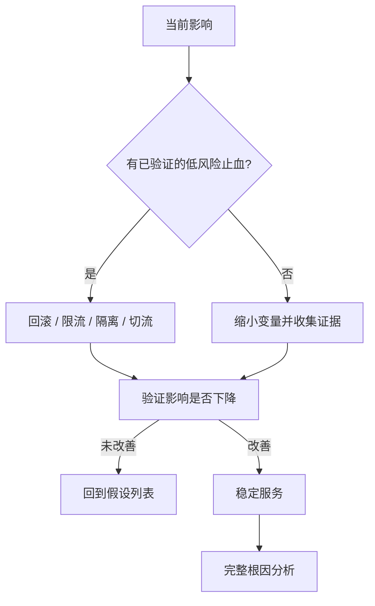

# 事件响应与值班：把凌晨故障变成可执行流程

生产事件最危险的部分往往不是第一个故障，而是信息不全、职责不清和压力下的连续误操作。成熟的事件响应不要求个人“英雄式救火”，而是让团队通过固定角色、可复制 runbook、明确停止条件和持续沟通，把不确定性逐步缩小。

本文适用于采用 Linux、反向代理、应用服务、MySQL 与常见云平台的团队。命令以 **Ubuntu 22.04/24.04 LTS、systemd、Nginx、MySQL 8.0/8.4 LTS** 为例；实际事件中必须遵守组织授权、隐私、合规和证据保全要求。

:::warning 授权边界
事件响应的目标是恢复和保护自有系统。不得在未授权情况下扫描、利用、反制、入侵或破坏外部系统；即使怀疑某个来源参与攻击，也只能做合法的防御性隔离、日志保全和向服务商/执法渠道报告。
:::

<ProgressIndicator
  current="linux/incident-response-and-oncall"
  items={[
    { slug: "linux/database-production-operations", title: "生产数据库运维" },
    { slug: "linux/backup-restore-and-disaster-recovery", title: "备份、恢复与灾难恢复" },
    { slug: "linux/production-security-baseline", title: "生产安全基线" },
    { slug: "linux/incident-response-and-oncall", title: "事件响应与值班" },
  ]}
/>

## 1. 什么是生产事件

生产事件是对服务可用性、数据正确性、安全性、合规性或业务目标产生实际/潜在影响，且需要协调响应的非计划事件。它不等于“某条告警触发”：告警是信号，事件是需要管理的业务影响。


事件响应的顺序是：**先保护人员与数据，再限制影响，再恢复最低可用服务，最后深入根因**。根因分析需要完整证据和安静环境，不应阻碍止血。

## 2. 事件分级

分级必须基于用户/数据影响、范围、持续时间和可逆性，而不是某台机器 CPU 多高。

| 级别 | 定义示例 | 响应目标 | 升级与沟通 |
|---|---|---|---|
| SEV-1 / P1 | 全站不可用、重大数据损坏/泄漏、生命安全或重大合规风险 | 立即响应 | 全员事件指挥、管理层/安全/法务按需介入，频繁外部通告 |
| SEV-2 / P2 | 核心功能大范围退化、单区域故障、有可行绕过 | 5～15 分钟 | 主值班 + 相关团队，固定节奏通告 |
| SEV-3 / P3 | 局部功能或少量客户受影响，不持续扩大 | 工作时段或约定时间 | 责任团队处理，内部记录 |
| SEV-4 / P4 | 无当前用户影响的缺陷、容量风险、监控异常 | 进入正常工单 | 产品/工程排期 |

安全事件分级还需考虑数据敏感度、攻击者权限、横向移动和法定通知时限。怀疑泄漏时，不要等“完全证实”才通知安全负责人。

### 2.1 升级原则

- 不确定时先按更高级别处理，稳定后降级；
- 影响跨团队、持续扩大或 15 分钟无进展时升级；
- 值班人员可以宣布事件，不因资历低而等待；
- 分级可变更，但必须记录时间和理由；
- 业务负责人可提高优先级，不能要求隐藏数据/安全影响。

## 3. 值班体系

### 3.1 值班不是“把电话给一个人”

可持续值班需要：

| 能力 | 最低要求 |
|---|---|
| 排班 | 主值班、备值班、交接和假期覆盖 |
| 联系 | 电话/SMS/推送至少两条独立路径 |
| 访问 | 受管设备、VPN/堡垒机、JIT、break-glass |
| 上下文 | 服务目录、依赖、仪表盘、近期变更、runbook |
| 权限 | 足以止血但非永久全局管理员 |
| 支持 | 明确升级到 SME、供应商、管理层和安全团队 |
| 健康 | 告警负担预算、轮休、事件后恢复时间 |

建议每次交接包含：正在发生的事件、已抑制告警、风险变更、容量水位、临时绕过、待办和下一位联系人。

### 3.2 值班交接模板

```text
# 值班交接
交出人：____  接收人：____
时间（UTC）：____

当前事件：
- INC-____ / 级别 / IC / 最新状态链接

风险变更：
- 变更单：____  时间：____  回滚人：____

临时措施与到期：
- 措施：____  到期：____  负责人：____

异常容量/告警：
- 指标：____  当前值：____  阈值：____

待跟进：
- [ ] ____ / 负责人 / 截止时间

访问验证：
- [ ] 电话/推送正常
- [ ] VPN/堡垒机/JIT 正常
- [ ] 仪表盘与日志可访问
```

## 4. 告警接收：只叫醒能行动的人

好的分页告警必须同时具备：

1. **症状**：用户错误率、延迟、数据不一致，而非单个资源瞬时波动；
2. **紧急性**：不立即处理会持续/扩大；
3. **可操作性**：值班人员有 runbook 和权限；
4. **所有权**：明确由哪个服务和排班接收；
5. **去重**：一个故障不会产生几十个独立页面。

告警载荷示例：

```yaml
alert: CheckoutHighErrorRate
severity: page
service: checkout-api
summary: "结账成功率低于 97%，持续 5 分钟"
impact: "用户无法完成订单"
dashboard: "https://monitoring.example/d/checkout"
runbook: "/posts/linux/incident-response-and-oncall"
recent_changes: "https://deploy.example/checkout"
owner: "payments-oncall"
```

:::note 告警疲劳是可靠性缺陷
重复、不可操作、长期无人修复的告警会训练人忽略真正故障。每个页面都应在事件/值班复盘中判断：是否应分页、阈值是否合理、能否自动化、是否应合并。
:::

## 5. 角色：让响应并行而不混乱

### 5.1 核心角色

| 角色 | 职责 | 不做什么 |
|---|---|---|
| Incident Commander（IC） | 定级、设目标、分配任务、做决策、控制节奏 | 不沉入单台主机调试 |
| Operations Lead | 组织技术诊断、执行止血与恢复 | 不独自决定业务/法律沟通 |
| Communications Lead | 内外部状态、利益相关者同步 | 不猜测根因和恢复时间 |
| Scribe | 维护时间线、命令、证据、决策和待办 | 不筛掉“看起来不重要”的事实 |
| Security/Forensics | 证据保全、攻击范围、吊销与合规协调 | 不进行未授权反击 |
| Business/Customer Lead | 影响评估、业务验证、客户优先级 | 不绕过技术安全门禁 |

小事件可一人兼任多个角色，但 P1 应尽快分开 IC、Ops、Comms 和 Scribe。

### 5.2 IC 首次声明模板

```text
我担任 INC-____ 的 Incident Commander。
当前级别：SEV-__。
已知影响：____。
当前目标：先在 ____ 分钟内 ____（例如恢复只读能力/停止错误写入）。
Operations Lead：____。
Communications Lead：____。
Scribe：____。
下一次状态更新时间：____ UTC。
除已分配任务外，暂停非必要生产变更。
```

## 6. 响应生命周期

### 6.1 检测与确认

先回答三个问题：

```text
1. 用户/数据受什么影响？从何时开始？
2. 影响还在扩大吗？哪些区域、租户、版本受影响？
3. 最近有什么变化？是否存在安全或数据损坏迹象？
```

最小确认命令应只读且带时间范围：

```bash
# 主机时间与负载
 date -u
 uptime

# 服务状态和最近 15 分钟日志
systemctl --no-pager --full status myapp.service
journalctl -u myapp.service --since '15 minutes ago' \
  --no-pager -o short-iso

# 端口与磁盘；不修改系统
ss -lntp
df -hT
df -ih
```

不要一上来重启。重启可能清除内存证据、改变时间线并暂时掩盖根因。

### 6.2 宣布事件与变更冻结

达到 P1/P2 条件后立即：

- 创建唯一事件 ID、频道、会议和文档；
- 指定 IC、Ops、Comms、Scribe；
- 冻结无关部署、schema 迁移、配置和权限变更；
- 不停止必要的安全吊销和止血，但都由 IC 记录；
- 汇总近期变更，不让所有人重复贴日志。

变更冻结不是“任何东西都不能改”，而是**只有与事件目标直接相关、可验证、可回退的变更才能执行**。

### 6.3 先止血，后根因



常见止血动作：回滚最近版本、关闭高风险功能开关、限制入口、扩容已知瓶颈、切换健康副本、将系统置只读、隔离疑似泄漏身份。每个动作都要有：假设、预期指标、负责人、时间、停止条件和回退。

:::warning 一次只改变一个主要变量
并行执行重启、扩容、改配置和回滚，会让团队无法判断什么起效，并可能叠加故障。IC 应控制变更序列；紧急并行动作也要明确互不干扰并完整记录。
:::

### 6.4 恢复与验证

“进程变绿”不是恢复。验证分层进行：

| 层 | 验证 |
|---|---|
| 基础设施 | 主机、网络、磁盘、证书、时间同步 |
| 服务 | 进程、端口、依赖连接、队列 |
| 技术 | 错误率、P95/P99、吞吐、资源、复制延迟 |
| 业务 | 登录、下单、支付、查询、关键数据不变量 |
| 安全 | 临时权限撤销、审计恢复、无持续异常访问 |

恢复流量采用阶段门禁：内部 → 1% → 10% → 50% → 100%，每阶段观察完整的请求和后台任务周期。若错误率、延迟或数据校验退化，回到上个稳定阶段。

### 6.5 关闭与观察

关闭条件示例：

```text
[ ] 用户影响已停止，关键旅程通过
[ ] 错误率、P99、容量回到约定区间
[ ] 数据正确性与复制/备份健康
[ ] 临时止血措施有负责人和到期日
[ ] 事件中创建的高权限已撤销
[ ] 客户和内部状态已更新
[ ] 观察窗口结束，无复发信号
[ ] 复盘时间、负责人和参与者确定
```

## 7. 证据保全

证据用于根因、安全调查、合规和改进。原则是：最小干预、记录来源、保持完整性、限制访问。

### 7.1 需要保存什么

- 时间同步状态、系统时间与时区；
- 云审计、IdP、SSH、sudo、应用、数据库、WAF 和网络日志；
- 近期部署、配置、IAM、DNS、证书和 schema 变更；
- 进程、连接、容器、systemd 状态；
- 可疑文件的元数据与哈希；
- 执行过的命令、操作者、结果和时间；
- 状态通告、决策和审批。

```bash
#!/usr/bin/env bash
# collect-incident-state.sh：只读采集基础状态，不替代专业取证。
# 适用于 Ubuntu 22.04/24.04。只在自有且已授权主机执行。
set -Eeuo pipefail
umask 077

readonly INCIDENT_ID="${1:?incident id required}"
readonly ROOT="/var/tmp/incident-evidence"
readonly OUT="$(mktemp -d "${ROOT}/${INCIDENT_ID}.XXXXXX")"
readonly TS="$(date -u +'%Y%m%dT%H%M%SZ')"

mkdir -p "${OUT}"
{
  date -u
  timedatectl status
  uptime
  uname -a
} > "${OUT}/system-${TS}.txt" 2>&1

ps auxfww > "${OUT}/processes-${TS}.txt"
ss -plant > "${OUT}/connections-${TS}.txt"
systemctl --no-pager --failed > "${OUT}/failed-units-${TS}.txt"
journalctl --since '2 hours ago' -o short-iso \
  > "${OUT}/journal-${TS}.log"

# 只打包采集目录，避免把未知范围数据带走。
tar -C "$(dirname "${OUT}")" -czf "${OUT}.tar.gz" "$(basename "${OUT}")"
sha256sum "${OUT}.tar.gz" > "${OUT}.tar.gz.sha256"
printf 'evidence=%s\nchecksum=%s\n' \
  "${OUT}.tar.gz" "${OUT}.tar.gz.sha256"
```

:::warning 不要擅自关机、清理或“反制”
安全事件中，重启、删除文件、杀进程、安装工具或主动连接可疑外部系统都可能破坏证据或超出授权。先隔离风险、联系安全/法务并遵守证据链流程。不得对外部目标实施攻击性操作。
:::

### 7.2 证据链记录

```text
证据 ID：E-____
事件 ID：INC-____
来源系统：____
采集人：____
采集时间（UTC）：____
采集命令/工具版本：____
原始文件：____
SHA-256：____
存储位置：____
访问权限：____
移交记录：时间 / 从谁 / 给谁 / 目的
```

## 8. 沟通：说事实、影响和下一步

沟通频率应在事件开始时确定，例如 P1 每 15～30 分钟，P2 每 30～60 分钟。即使没有新结论，也要按时更新“仍在处理、下一步是什么”。

### 8.1 内部状态模板

```text
[INC-2026-____][SEV-__] ____ 服务事件
时间：____ UTC
状态：调查中 / 已识别 / 监控中 / 已解决

影响：
- 受影响用户/区域/功能：____
- 开始时间：____
- 数据/安全影响：已确认 ____ / 尚在评估

已知事实：
- ____

已采取措施：
- ____（时间 / 负责人 / 结果）

当前工作：
- ____（负责人）

下一次更新时间：____ UTC
事件指挥官：____
```

### 8.2 客户状态通告模板

```text
标题：____ 服务部分不可用

我们正在调查影响 ____ 的问题。问题始于 ____ UTC，部分用户可能遇到 ____。
团队已采取 ____ 以限制影响，目前服务状态为 ____。

下一次更新将在 ____ UTC 前发布，或在状态发生重大变化时提前发布。
```

恢复后：

```text
标题：____ 服务已恢复

____ 服务已于 ____ UTC 恢复。受影响时间段为 ____ 至 ____ UTC，用户可能遇到 ____。
我们已完成初步验证并持续监控。关于原因和长期改进的进一步信息将在审查完成后发布。
```

不要承诺未经验证的恢复时间，不把假设写成根因，不在公共通告披露可被利用的细节、个人信息或凭据。

## 9. 可直接复制的通用 Runbook

```text
# 生产事件 Runbook

事件 ID：INC-____
服务：____
开始时间（UTC）：____
检测来源：____
当前级别：____

## 0. 安全与授权
[ ] 操作对象属于组织且当前响应已获授权
[ ] 不执行扫描、利用、反制或破坏外部系统
[ ] 涉及个人数据/安全事件时已联系安全、法务/隐私

## 1. 建立指挥
[ ] IC：____
[ ] Operations Lead：____
[ ] Communications Lead：____
[ ] Scribe：____
[ ] 事件频道/会议/文档：____
[ ] 下一更新时间：____
[ ] 非必要生产变更已冻结

## 2. 明确影响
[ ] 哪个用户旅程失败：____
[ ] 范围（区域/租户/版本）：____
[ ] 开始时间与趋势：____
[ ] 数据正确性/安全性：____
[ ] 当前错误率、P99、吞吐：____

## 3. 收集只读事实
[ ] 仪表盘与 SLO
[ ] 日志（限定时间与服务）
[ ] 最近部署/配置/IAM/schema 变更
[ ] 主机/容器/数据库/依赖状态
[ ] 时间同步与证据保全

## 4. 假设队列
| 优先级 | 假设 | 支持/反对证据 | 安全验证 | 负责人 | 结果 |
|---|---|---|---|---|---|
| 1 | ____ | ____ | ____ | ____ | ____ |

## 5. 止血
动作：____
预期指标变化：____
负责人/批准人：____ / ____
执行时间：____
停止条件：____
回退步骤：____
实际结果：____

## 6. 恢复验证
[ ] 进程/端口/依赖健康
[ ] 错误率、P95/P99、资源恢复
[ ] 关键业务旅程通过
[ ] 数据不变量与复制/备份健康
[ ] 分阶段恢复流量并完成观察

## 7. 关闭
[ ] 临时权限和凭据已撤销/轮换
[ ] 临时配置有负责人和到期日
[ ] 最终内外部通告已发送
[ ] 复盘安排：____
```

## 10. 事件记录模板

Scribe 应按事实时间记录，而不是事后重构“漂亮故事”。

```text
# INC-____ 时间线（全部 UTC）

| 时间 | 人员/系统 | 观察、决策或动作 | 结果/链接 |
|---|---|---|---|
| 02:13 | Alerting | 结账错误率 > 10% | 告警链接 |
| 02:16 | Alice | 确认多区域用户受影响，宣布 SEV-2 | 事件频道 |
| 02:20 | Bob | 假设最近部署导致；准备回滚 | deploy-123 |
| 02:24 | IC | 批准回滚，停止条件 P99 不改善 | 决策 D-01 |
| 02:28 | Bob | 回滚完成 | 错误率开始下降 |

关键决策：
- D-01：为何回滚、谁批准、依据、回退方案

命令/变更：
- 时间 / 操作者 / 目标 / 命令或变更 ID / 输出位置

未解决问题：
- ____
```

## 11. 场景 Runbook 一：Nginx 502

502 表示网关没有从上游得到有效响应。可能是应用退出、端口错误、连接被拒、上游超时、socket 权限、DNS 或容量问题。

### 11.1 只读诊断

```bash
# 1. 确认用户影响与 Nginx 配置状态
sudo nginx -t
sudo journalctl -u nginx --since '15 minutes ago' \
  --no-pager -o short-iso
sudo tail -n 200 /var/log/nginx/error.log

# 2. 确认应用和监听端口
systemctl --no-pager --full status myapp.service
ss -lntp | grep ':3000 '

# 3. 从本机直连上游，设置短超时避免挂住
curl --fail --silent --show-error \
  --connect-timeout 2 --max-time 5 \
  http://127.0.0.1:3000/health

# 4. 查询应用日志与资源
journalctl -u myapp.service --since '15 minutes ago' \
  --no-pager -o short-iso
free -h
df -hT
```

### 11.2 止血决策

| 发现 | 止血 |
|---|---|
| 最近版本启动失败 | 回滚到已验证版本 |
| 单实例异常且其余健康 | 从负载均衡摘除异常实例 |
| 全部实例过载 | 限流、关闭昂贵功能、按容量模型扩容 |
| 配置指向错误端口 | 回滚配置，`nginx -t` 后 reload |
| 下游数据库故障 | 切只读/降级，按数据库 runbook 处理 |

```bash
# 经 IC 批准且证据已记录后，才执行受控重启
sudo systemctl restart myapp.service
sudo systemctl --quiet is-active myapp.service
curl --fail --max-time 5 http://127.0.0.1:3000/health
```

:::warning 重启不是根因
重启可作为已评估的止血，但必须记录重启前状态，并在事件后分析为什么服务退出、阻塞或资源耗尽。
:::

### 11.3 恢复门禁

```text
[ ] 上游直连健康
[ ] Nginx 5xx 回到基线
[ ] 用户关键旅程通过
[ ] P99 与上游连接数稳定
[ ] 持续观察至少 15～30 分钟或一个完整峰值周期
```

## 12. 场景 Runbook 二：磁盘满

磁盘 100% 可能导致数据库只读/崩溃、日志丢失、部署失败。inode 用尽也会表现为“有空间却无法创建文件”。

### 12.1 只读诊断

```bash
df -hT
df -ih

# 同一文件系统内按顶层目录估算；-x 不跨挂载点
sudo du -x -h --max-depth=1 /var 2>/dev/null | sort -h
sudo du -x -h --max-depth=1 /srv 2>/dev/null | sort -h

# 找已删除但仍被进程打开的文件
sudo lsof +L1

# journal 占用
sudo journalctl --disk-usage

# 大文件只列清单，不直接删除
sudo find /var -xdev -type f -size +1G \
  -printf '%s %TY-%Tm-%Td %TH:%TM %p\n' | sort -nr | head -50
```

### 12.2 安全止血顺序

1. 停止产生非必要大日志/临时文件的作业；
2. 扩容卷或切换到预留空间，通常比盲删更安全；
3. 让应用/日志系统按官方轮转方式释放文件；
4. 仅删除**已确认可重建、已备份、非当前写入**的文件；
5. 数据库文件、binlog、WAL、容器 overlay 层不得凭名称手工删除。

```bash
# journald 例：先检查保留要求，再通过官方接口回收
sudo journalctl --vacuum-size=1G

# Nginx 例：先验证 logrotate 配置，再执行轮转
sudo logrotate -d /etc/logrotate.d/nginx
sudo logrotate -f /etc/logrotate.d/nginx
```

:::warning 破坏性操作
`rm`、`truncate`、清 binlog、`docker system prune` 都可能永久删除数据或证据。事件中不得复制网上的一键清理命令；必须明确文件所有者、用途、恢复路径和审批，并优先扩容或官方清理接口。
:::

### 12.3 恢复验证

```text
[ ] 文件系统使用率降到安全水位且仍在下降/稳定
[ ] inode 充足
[ ] 数据库执行一致性/复制检查
[ ] 应用可以写日志、临时文件和业务数据
[ ] 监控、日志与备份任务恢复
[ ] 容量预测、轮转和告警行动项已创建
```

## 13. 场景 Runbook 三：数据库连接耗尽

症状包括应用获取连接超时、MySQL `Too many connections`、线程激增和请求排队。

### 13.1 只读诊断

```bash
# 通过预先配置的只读运维 login path，不暴露密码
mysql --login-path=prod-ro --table -e "
  SHOW GLOBAL STATUS LIKE 'Threads_connected';
  SHOW GLOBAL STATUS LIKE 'Threads_running';
  SHOW GLOBAL STATUS LIKE 'Max_used_connections';
  SHOW GLOBAL VARIABLES LIKE 'max_connections';
"

mysql --login-path=prod-ro --table -e "
  SELECT USER, HOST, COMMAND, COUNT(*) AS connections,
         MAX(TIME) AS max_seconds
    FROM performance_schema.processlist
   GROUP BY USER, HOST, COMMAND
   ORDER BY connections DESC;
"

mysql --login-path=prod-ro --table -e "
  SELECT trx_mysql_thread_id, trx_started, trx_state,
         trx_rows_locked, trx_rows_modified, trx_query
    FROM information_schema.innodb_trx
   ORDER BY trx_started;
"
```

并检查应用连接池：实例数、每实例上限、活跃/空闲、等待者、获取延迟、近期扩容与连接泄漏。

### 13.2 止血优先级

```text
1. 阻止进一步放大：暂停自动扩容/批处理，入口限流。
2. 找到异常来源：某版本、租户、作业或泄漏。
3. 回滚泄漏版本或降低该工作负载连接预算。
4. 对长事务/阻塞进行业务确认后处理。
5. 只有在内存和线程预算允许时，临时小幅提高上限。
```

:::warning 不要批量 KILL 或无限调大连接
`KILL` 会触发事务回滚，可能加重负载；扩大 `max_connections` 可能耗尽内存。任何终止会话必须记录 ID、事务年龄、修改行数、业务所有者和审批。
:::

恢复验证：连接使用率回到预算内、池等待趋近零、错误率与 P99 正常、无长事务/锁堆积、副本延迟正常，并确认新连接在主从切换后可重建。

## 14. 场景 Runbook 四：凭据泄漏

凭据泄漏首先是**信任撤销问题**，其次才是仓库清理问题。

### 14.1 立即动作

```text
[ ] 宣布安全事件并通知安全负责人
[ ] 记录凭据类型、权限、有效期、出现位置和首次/最后暴露时间
[ ] 禁用泄漏凭据或将权限收缩到零
[ ] 撤销活跃会话、刷新令牌和派生凭据
[ ] 创建新凭据并仅发布给合法消费者
[ ] 查询该身份访问过的其他 secret 和资源
[ ] 保全 IdP、云审计、Git、CI、数据库与应用日志
[ ] 检查 Git 历史、fork、制品、镜像层、日志、缓存和工单副本
[ ] 监控旧凭据继续使用的尝试
```

不同类型：

| 泄漏项 | 吊销动作 | 验证 |
|---|---|---|
| 云密钥 | disable、撤会话、换 workload identity | 审计 API 调用、跨账号角色 |
| 数据库密码 | 新版本、切连接池、撤旧 | 认证失败、查询/导出审计 |
| SSH 私钥 | 移除公钥/吊销证书 | authorized_keys、登录与 sudo |
| TLS 私钥 | 换私钥与证书，按风险吊销 | 所有终止点部署新证书 |
| CI/registry token | 撤 token、换 runner/机器人身份 | 发布历史、镜像 digest、日志 |
| 签名密钥 | 停止信任、换根/签名者 | 已签制品和下游策略 |

### 14.2 Git 中 secret 的处理顺序

```text
1. 先吊销，假设所有历史副本都已被读取。
2. 保全证据并确认影响范围。
3. 用 secret scanner 找当前分支和历史副本。
4. 若确需重写历史，协调所有 fork/clone 和 CI 缓存。
5. 强制使用者重新同步，防止旧历史被再次推回。
6. 增加 pre-commit/CI 检测和密钥管理修复。
```

:::warning 不要未经授权测试泄漏凭据
不得使用疑似凭据登录外部系统“看看是否有效”，不得扫描或反击来源。只在组织拥有、明确授权的系统中按事件流程验证和吊销。
:::

## 15. 四个演练设计

演练不是制造真实破坏。优先使用隔离实验环境、故障注入开关或模拟指标；生产 game day 必须审批、设安全员和自动中止条件。

### 15.1 演练 A：502

```text
目标：15 分钟内识别上游不可达并恢复，验证沟通节奏。
注入：实验环境把应用端口改为错误值，或停止一个 canary 实例。
观察：是否先看 Nginx 与上游；是否避免无证据重启；能否安全回滚。
成功：P99/5xx 恢复，业务旅程通过，时间线完整。
中止：影响逃逸到生产、无法确认实验流量隔离。
```

### 15.2 演练 B：磁盘满

```text
目标：区分容量与 inode，使用安全清理/扩容流程。
注入：给隔离 VM 挂小测试卷，在测试挂载点生成文件。
禁止：不得填满宿主根分区，不删除真实日志/数据库文件。
成功：定位最大消费者、识别 open-deleted 文件、恢复写入并补容量告警。
中止：测试卷路径不明确、监控显示真实服务受影响。
```

### 15.3 演练 C：数据库连接耗尽

```text
目标：从应用池与 MySQL 两侧找到连接来源，先限流再修复。
注入：测试服务用受限账号建立超过预算的空闲连接。
观察：是否暂停自动扩容；是否识别用户/主机聚合；是否避免批量 KILL。
成功：连接回预算、错误率恢复、连接泄漏有代码修复行动项。
中止：测试账号连到生产、数据库内存/CPU超过安全阈值。
```

### 15.4 演练 D：凭据泄漏

```text
目标：在不使用真实 secret 的情况下走完发现、吊销、轮换和影响调查。
注入：向专用演练仓库提交 canary token，由 scanner 告警。
观察：是否先吊销再删历史；是否查询派生访问；是否通知安全负责人。
成功：旧 token 不可用，新 token 仅到合法消费者，证据链与通告完整。
中止：使用真实生产凭据、演练数据进入公共仓库。
```

### 15.5 演练评分表

| 项目 | 权重 | 评价问题 |
|---|---:|---|
| 检测与分级 | 15% | 是否按业务影响定级 |
| 角色与指挥 | 15% | IC 是否控制目标与变更 |
| 止血 | 20% | 是否选择可回退、低风险动作 |
| 证据与记录 | 15% | 时间线、命令、哈希是否完整 |
| 恢复验证 | 20% | 是否验证业务和数据而非只看进程 |
| 沟通 | 10% | 是否准时、准确、不猜测 |
| 安全边界 | 5% | 是否始终在授权范围内 |

演练后不只记录“完成用时”，还要记录哪些前提依赖个人记忆、哪些权限临时申请太慢、哪些仪表盘无法回答影响。

## 16. 复盘：无责，但必须负责改进

“无责”不等于没有责任，而是不把“某个人犯错”当作分析终点。要分析为什么系统允许单个动作造成影响、为什么检测/回滚/验证没有更早生效。

### 16.1 复盘模板

```text
# INC-____ 事件复盘

## 摘要
日期：____
级别：____
影响时间：____
受影响用户/请求/数据：____
检测方式：____
恢复时间：____

## 用户与业务影响
- 哪些旅程失败：____
- 数据丢失/损坏：____
- SLO/合同/合规影响：____

## 时间线
| UTC 时间 | 事件 |
|---|---|
| ____ | ____ |

## 根因与触发条件
- 直接触发：____
- 技术根因：____
- 组织/流程条件：____
- 为什么防护层未阻止：____

## 检测与响应评价
- 做得好的：____
- 增加影响的：____
- 偶然成功但不可依赖的：____

## 五个为什么（避免停在“人为错误”）
1. 为什么 ____？
2. 为什么 ____？
3. 为什么 ____？
4. 为什么 ____？
5. 为什么 ____？

## 行动项
| ID | 行动 | 类型 | 负责人 | 截止 | 验收证据 | 优先级 |
|---|---|---|---|---|---|---|
| A-01 | ____ | 预防/检测/恢复 | ____ | ____ | ____ | ____ |

## 已知风险与不处理项
- 风险：____
- 决策人：____
- 原因与复审日期：____

## 分享范围
- 团队/客户/供应商：____
```

### 16.2 行动项必须可验收

坏行动项：

```text
- 大家以后更小心
- 加强监控
- 完善文档
```

好行动项：

```text
- 2026-09-01 前由 Platform Team 为根分区添加 >75% 持续 15 分钟告警，
  在 staging 注入 80% 使用率并附上成功分页截图与 runbook 链接。

- 2026-08-25 前由 Payments Team 把连接池 queueLimit 从无限改为 100，
  增加 pool_wait_seconds 指标，并通过 2 倍峰值压测证明快速失败不会拖垮数据库。
```

行动项类型应平衡：预防、检测、限制影响、加速恢复和组织学习。不要把所有改进都压成“增加告警”。

## 17. 事件指标

可跟踪但不能用来惩罚个人：

| 指标 | 意义 | 风险 |
|---|---|---|
| MTTD | 从影响开始到检测 | 开始时间可能不精确 |
| MTTA | 从告警到有人确认 | 不能证明有效行动 |
| MTTR | 从影响到恢复 | 混合了不同复杂度事件 |
| 事件复发率 | 修复是否有效 | 分类标准要一致 |
| 行动项按期率 | 改进是否落地 | 易诱导拆小/低价值任务 |
| 告警可操作率 | 分页质量 | 需要定义“可操作” |
| 演练 RTO/RPO | 恢复能力是否真实 | 演练环境需足够接近生产 |

更重要的是趋势和定性学习：同类事件是否减少、影响半径是否缩小、值班负担是否可持续、恢复是否更可预测。

## 18. 常见误区

### “先找到根因再恢复”

错误。若有可逆、已验证的止血，应先减少用户影响，再在保留证据后深入分析。

### “重启好了就关闭事件”

重启可能只是暂时清除症状。还需业务验证、观察窗口和根因/行动项。

### “人越多越快”

没有角色和任务分配时，人越多沟通噪声越大。IC 应控制频道和并行工作流。

### “安全事件就去反击来源”

未经授权的攻击性操作可能违法、伤及无辜并破坏证据。只做合法防御、隔离、吊销、保全和报告。

### “复盘就是找谁改坏了”

这会压制报告并错过系统条件。应问为什么一次普通失误能穿过所有防护层。

### “所有 P1 都要追求更快 MTTR”

速度不能牺牲数据正确性和安全。在数据损坏或入侵场景，受控隔离和验证可能比盲目恢复写流量更重要。

## 19. 建立团队响应能力的 30/60/90 天路线

### 前 30 天：能接住事件

```text
[ ] 服务目录、主/备值班、升级联系人
[ ] P1/P2 分级与宣布权限
[ ] 事件频道、会议、记录和通告模板
[ ] Top 5 告警都有 owner、dashboard、runbook
[ ] 值班人员访问与 break-glass 演练
```

### 31～60 天：能稳定恢复

```text
[ ] 为 502、磁盘、数据库、凭据建立场景 runbook
[ ] 最近变更、依赖和业务 SLO 汇总到统一视图
[ ] 恢复验证包含业务旅程和数据不变量
[ ] 每月桌面演练，每季度技术演练
[ ] 临时措施与高权限自动到期
```

### 61～90 天：形成学习闭环

```text
[ ] P1/P2 复盘有行动项、负责人、截止与验收
[ ] 分析告警负担、复发率和演练 RTO/RPO
[ ] 把高频人工止血自动化，但保留人工停止开关
[ ] 将事件反馈到容量、备份、安全与发布基线
[ ] 管理层定期审查未接受风险和跨团队阻塞
```

## 20. 口袋卡：值班人员前十分钟

```text
0～2 分钟
[ ] 确认告警真实，判断用户/数据/安全影响
[ ] 查看时间、范围、趋势和近期变更

2～5 分钟
[ ] 达到门槛就宣布事件，不等待完美信息
[ ] 指定 IC/Ops/Comms/Scribe，冻结无关变更
[ ] 开始时间线，设置下一次通告时间

5～10 分钟
[ ] 保全关键状态和日志
[ ] 建立按概率×影响排序的假设队列
[ ] 选择一个可回退止血动作，写明预期与停止条件
[ ] 执行后观察用户指标，不凭“命令成功”判断恢复
```

## 21. 最终检查清单

```text
准备：
[ ] 分级标准、值班排班、升级树和服务所有者有效
[ ] 告警可操作，runbook/仪表盘/近期变更可访问
[ ] 权限最小、JIT、break-glass 和独立沟通路径已演练

响应：
[ ] 基于业务影响分级并建立角色
[ ] 冻结无关变更，一次改变一个主要变量
[ ] 先止血后根因，每个动作有假设、停止条件和回退
[ ] 保全证据，记录命令、决策、时间与审批
[ ] 不执行任何未授权攻击性操作

恢复：
[ ] 基础设施、服务、技术、业务、数据与安全均验证
[ ] 分阶段恢复流量并观察
[ ] 临时权限/凭据撤销，监控与备份恢复

学习：
[ ] 无责复盘解释系统条件而非停在个人错误
[ ] 行动项有负责人、截止时间和可验证证据
[ ] 四类场景定期演练并实测 RTO/RPO
[ ] 改进反馈到数据库、备份、安全、容量和发布流程
```

## 22. 总结

事件响应把技术排障变成一个可管理的社会技术过程：分级明确紧迫度，值班和告警保证信号到人，角色让诊断、沟通和记录并行，变更冻结与证据保全控制二次伤害，止血优先缩短用户影响，分层验证避免假恢复，复盘和行动项再把事件转化为系统能力。

这套流程与前面三篇构成完整闭环：数据库运维减少故障概率，备份与 DR 提供可恢复性，安全基线限制攻击面，而值班与事件响应负责在控制仍然失效时，**合法、可审计、可重复地恢复服务并让系统变得更强**。