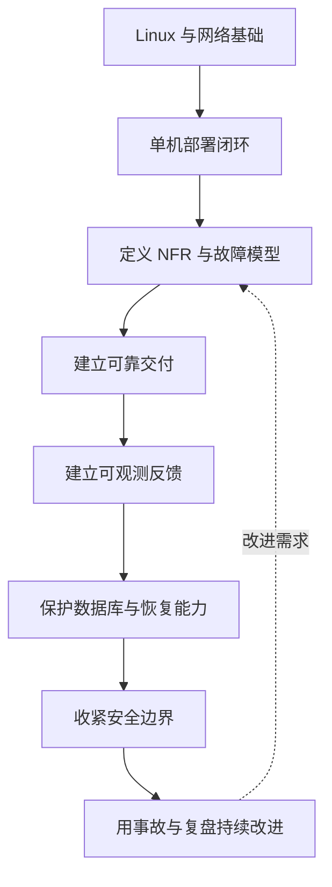
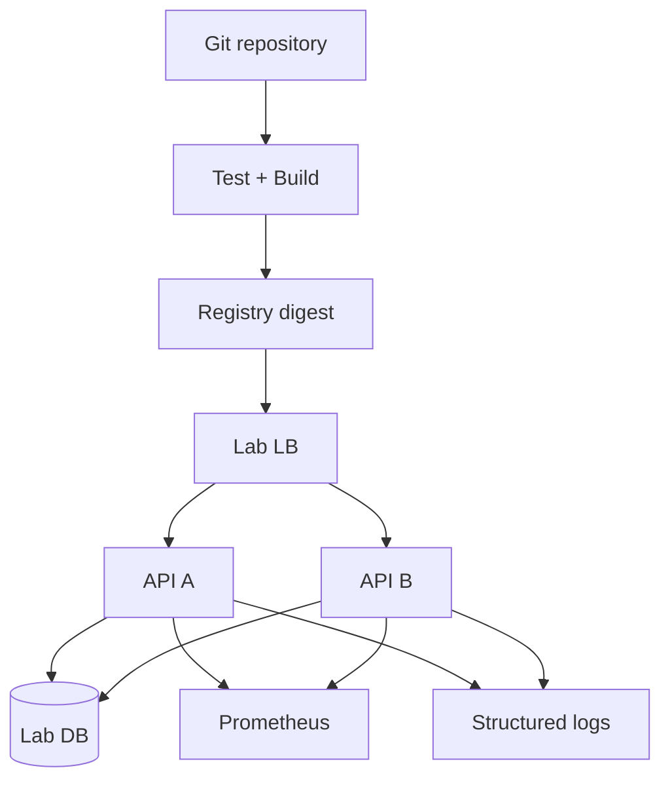

# Linux 生产工程路线图：从会部署到可验证地稳定运行

“能在服务器上启动一个进程”只是起点。真实生产系统还要面对流量波动、依赖超时、节点故障、错误发布、数据恢复、安全边界与跨团队协作。本课程把这些问题组织为一条可练习、可评审、可验证的学习路径。

:::important 先说明能力边界
读完课程、跑通示例，**不等于仅凭理论就可以独立承担金融、医疗、支付等高风险生产系统**。生产权限必须遵循组织授权；高风险变更还需要同行评审、预生产验证、演练、变更窗口与可执行回退方案。课程提供的是建立工程能力的路线，不替代真实系统经验和组织治理。
:::

## 1. 课程定位：补上“能运行”与“能负责”之间的工程层

基础 Linux 教程通常回答“命令怎么用、服务怎么启动”；生产工程还要回答：

1. **目标是什么**：可用性、延迟、吞吐、数据耐久性与恢复时间必须先被定义。
2. **系统会怎样失败**：依赖、故障域、单点和容量上限要能被画出来并验证。
3. **变更怎样不失控**：制品、审批、渐进发布、数据库迁移与回滚必须形成闭环。
4. **运行状态怎样被看见**：指标、日志、追踪要服务于 SLO 和排障，而不是只堆数据。
5. **事故怎样被处理**：告警、runbook、指挥、恢复、复盘和改进要可重复执行。

本课程不是某个云厂商产品说明，也不是“照抄 YAML 即可上线”的模板库。课程以 Linux 上的 Web 服务为主线，强调可迁移的原理、验证方法和决策依据。

### 1.1 适用读者

- 已会使用 SSH、systemd、Nginx、Shell 与基本网络排查的开发者；
- 正从单机部署转向团队化交付的后端或全栈工程师；
- 希望建立 SRE/DevOps 基础能力的运维与平台工程初学者；
- 需要参与架构评审、上线评审和值班，但尚未形成系统方法的人。

### 1.2 建议先修能力

开始生产篇前，应能独立完成以下操作：

```bash
# 查看服务状态与最近日志
systemctl status my-api --no-pager
journalctl -u my-api --since '15 minutes ago' --no-pager

# 验证监听端口、HTTP 状态和磁盘空间
ss -lntp
curl --fail-with-body --max-time 3 http://127.0.0.1:3000/health
findmnt
df -hT
```

如果这些命令的输出还难以解释，应先完成基础篇实验，再进入生产篇。

## 2. 全部 15 篇文章与推荐顺序

路线不是按工具流行度排列，而是按“主机基础 → 部署闭环 → 架构承诺 → 安全变更 → 运行反馈 → 数据与恢复 → 安全治理 → 事故学习”递进。

### 阶段 0：总览与学习契约

1. **[Linux 生产工程路线图](/posts/linux/linux-production-roadmap)**：明确能力地图、实验边界与验收方式。

### 阶段 1：现有基础篇——先获得操作系统与单机闭环

2. **[深入浅出 Linux](/posts/linux/linux-fundamentals)**：文件系统、权限、进程、管道与文本处理。
3. **[云服务器入门](/posts/linux/cloud-server-getting-started)**：SSH、用户、sudo、防火墙与基础加固。
4. **[云服务器环境搭建](/posts/linux/cloud-server-environment-setup)**：运行时、Nginx、数据库与 systemd。
5. **[网络排查与磁盘管理](/posts/linux/networking-and-disk)**：从 DNS/TCP/HTTP 分层定位问题，管理挂载与容量。
6. **[Shell 脚本编程](/posts/linux/shell-scripting)**：把可重复操作变成带错误处理的自动化脚本。
7. **[系统运维与安全](/posts/linux/system-ops-and-security)**：journal、定时任务、资源观察与主机安全。
8. **[项目部署实战](/posts/linux/project-deployment-in-practice)**：理解手动、容器与基础 CI/CD 的部署闭环。

:::warning 基础篇与生产篇的关系
基础篇中的单机部署和简化 CI/CD 用于理解机制，不应原样视为高可用生产方案。生产篇会主动修正“生产机拉源码并现场构建”“只有一个实例”“只有存活探针”等风险模式。
:::

### 阶段 2：新增生产篇——建立可评审、可恢复的系统

9. **[生产就绪与架构评审](/posts/linux/production-readiness-and-architecture)**：NFR、依赖图、故障域、HA、容量、降级与 Go/No-Go。
10. **[可靠 CI/CD 与发布策略](/posts/linux/reliable-cicd-and-release-strategies)**：不可变制品、环境晋级、最小权限、渐进发布与自动回滚。
11. **[可观测性、SLI/SLO 与告警](/posts/linux/observability-sli-slo-alerting)**：用用户结果定义信号，让告警可执行。
12. **[数据库生产运维](/posts/linux/database-production-operations)**：连接池、慢查询、复制、迁移、维护与数据风险控制。
13. **[备份、恢复与灾难恢复](/posts/linux/backup-and-disaster-recovery)**：RPO/RTO、3-2-1、恢复验证与灾备演练。
14. **[生产安全与秘密管理](/posts/linux/production-security-and-secrets)**：身份、最小权限、密钥轮换、供应链与审计边界。
15. **[事件响应与无责复盘](/posts/linux/incident-response-and-postmortems)**：分级、指挥、沟通、缓解、证据时间线与改进行动。

> 后三篇链接代表本课程规划中的后续生产篇；在对应文章发布前，路线图只定义学习顺序，不声称页面内容已经完成。

## 3. 为什么必须按这个顺序



如果没有 NFR，监控不知道什么算坏；如果没有不可变制品，回滚对象不确定；如果没有观测信号，渐进发布无法判定是否继续；如果没有恢复演练，备份只能证明“写出了文件”，不能证明“业务可恢复”。因此课程中的每一步都为下一步提供输入。

## 4. 能力矩阵：从“知道”到“在约束下完成”

| 能力域 | 入门：能解释 | 实践：能执行 | 生产：能评审与取舍 | 证据 |
| :--- | :--- | :--- | :--- | :--- |
| Linux 主机 | 权限、进程、文件系统 | systemd、日志、资源排查 | 变更窗口、加固与容量边界 | 命令记录、配置 diff |
| 网络 | DNS/TCP/HTTP 链路 | curl、ss、dig 定位层次 | 超时、重试、LB 与故障域 | 故障树、抓取结果 |
| 架构 | NFR、SPOF、HA | 画依赖图、做容量估算 | 在成本、复杂度、目标间取舍 | ADR、Go/No-Go 记录 |
| 交付 | CI 与 CD 差异 | 构建不可变镜像、晋级 | 审批、最小权限、回滚门禁 | digest、审计日志 |
| 可观测性 | metrics/logs/traces | 埋点、抓取、查询 | 从 SLO 推导告警 | dashboard、runbook |
| 数据 | 事务、复制、备份概念 | 迁移、备份、恢复 | RPO/RTO 与一致性取舍 | 恢复演练报告 |
| 安全 | 身份与最小权限 | OIDC、秘密轮换、补丁 | 威胁建模与例外审批 | 权限清单、审计证据 |
| 事件响应 | 严重度与角色 | 按 runbook 缓解 | 指挥、沟通、无责复盘 | 时间线、行动项 |

### 4.1 三个成熟度问题

每学完一篇，不要只问“我看懂了吗”，而要问：

- **我能否复现？** 在隔离环境里从空白开始执行，而不是依赖作者环境。
- **我能否证伪？** 主动注入错误，观察机制是否按预期失败。
- **我能否解释取舍？** 说明为什么选择这个阈值、拓扑或发布策略，以及何时应该换方案。

## 5. 实验环境：安全、低成本、可重置

推荐使用三台本地虚拟机或云端临时测试实例，不需要把实验服务暴露到公网。

| 节点 | 建议规格 | 角色 | 示例地址 |
| :--- | :--- | :--- | :--- |
| `lab-lb` | 1 vCPU / 1 GiB | Nginx、Prometheus | `10.20.0.10` |
| `lab-app-a` | 2 vCPU / 2 GiB | Node API A | `10.20.0.11` |
| `lab-app-b` | 2 vCPU / 2 GiB | Node API B | `10.20.0.12` |

规格只是实验起点，不是生产容量结论。优先使用 Ubuntu 22.04 或 24.04 LTS；容器实验使用 Docker Engine 24+ 与 Compose v2。Node 示例使用 20/22 LTS。

### 5.1 建立实验目录

```bash
set -euo pipefail
mkdir -p ~/linux-production-lab/{evidence,configs,scripts}
cat > ~/linux-production-lab/README.md <<'EOF'
# 实验记录

- 实验目标：
- 假设：
- 操作时间：
- 观察结果：
- 是否符合预期：
- 回滚/清理：
EOF
```

### 5.2 每次实验保留证据

```bash
#!/usr/bin/env bash
set -euo pipefail

out="$HOME/linux-production-lab/evidence/$(date -u +%Y%m%dT%H%M%SZ)"
mkdir -p "$out"
uname -a > "$out/uname.txt"
free -h > "$out/memory.txt"
df -hT > "$out/disk.txt"
ss -lntp > "$out/listeners.txt"
systemctl --failed --no-pager > "$out/failed-units.txt" || true
printf 'evidence_dir=%s\n' "$out"
```

`|| true` 只用于“即使存在失败单元也继续收集证据”，不能滥用到部署步骤，否则会掩盖真实失败。

### 5.3 实验安全规则

:::warning 不要把故障注入指向真实生产
断网、杀进程、填满磁盘、延迟代理、删除容器等操作，只能在明确标记的实验或预生产资源中执行。操作前确认主机名、账号、订阅/项目和数据等级；共享环境还需要得到负责人批准。
:::

- 使用临时数据，不复制真实用户数据和生产秘密；
- 云实验设置预算告警，并在结束后删除按量计费资源；
- 为危险脚本加入目标白名单和交互确认；
- 实验前生成快照，实验后验证清理；
- 不用“我记得这是测试机”代替身份与环境检查。

一个简单的目标保护器：

```bash
#!/usr/bin/env bash
set -euo pipefail
expected='lab-app-a'
actual="$(hostname -s)"

if [[ "$actual" != "$expected" ]]; then
  printf '拒绝执行：期望主机 %s，实际为 %s\n' "$expected" "$actual" >&2
  exit 1
fi

read -r -p '确认在隔离实验机停止 my-api？输入 LAB: ' answer
[[ "$answer" == 'LAB' ]] || exit 1
sudo systemctl stop my-api
```

## 6. 每阶段实验与验收

### 6.1 基础阶段

**任务**：建立普通运维用户、SSH 密钥、最小 sudo、UFW/nftables 规则；部署一个 systemd 服务，经 Nginx 访问；用日志和网络工具定位一次 502。

**验收证据**：

- `ss -lntp` 显示应用只监听内部接口或 loopback；
- 外部只能访问预期端口；
- 服务重启后自动恢复；
- 能从 Nginx 日志与应用日志关联一次请求。

### 6.2 架构与交付阶段

**任务**：运行两个 API 实例，经 LB 分流；构建一次镜像，记录 commit SHA 和 digest；让同一 digest 从测试环境晋级；制造一个失败健康门禁并证明发布停止。

**验收证据**：架构图、容量假设、镜像 digest、审批记录、失败流水线和回滚结果。

### 6.3 可观测与可靠性阶段

**任务**：实现 RED 指标与结构化日志；定义一个可计算 SLI；创建实验 SLO 与告警规则；停止一个实例并走一遍 runbook。

**验收证据**：PromQL、告警状态、dashboard 截图、事件时间线和改进行动。

### 6.4 数据与恢复阶段

**任务**：执行向后兼容迁移；创建备份；在全新实例恢复；核对业务不变量；记录实际 RPO/RTO。

**验收不是“备份命令退出码为 0”，而是恢复后的数据和业务行为通过核验。**

## 7. 学习成果与明确边界

完成全部课程与实验后，读者应能够：

1. 把模糊的“稳定”转化为 NFR、SLI/SLO、容量假设与故障模型；
2. 识别明显 SPOF，并提出有成本说明的冗余或降级方案；
3. 构建并晋级不可变制品，解释审批、权限、迁移与回滚边界；
4. 为 Node API 建立最小可用的 metrics/logs/traces 与 runbook；
5. 在隔离环境执行节点故障、依赖超时、错误发布和恢复演练；
6. 参与 Go/No-Go、变更评审与事件复盘，并提供可检查证据。

课程**不能单独赋予**以下能力或授权：

- 无监督操作高风险生产、直接执行不可逆数据变更；
- 对从未演练的复杂分布式系统承诺可用性；
- 替代云厂商、数据库、安全与合规领域的专项评审；
- 仅凭通用容量公式预测真实业务峰值；
- 把实验中的单节点 Prometheus、示例密钥或宽松网络策略直接搬进生产。

## 8. 推荐学习节奏

| 周次 | 内容 | 输出物 |
| :--- | :--- | :--- |
| 1–2 | Linux、SSH、环境、网络、Shell | 可重置实验主机与排障记录 |
| 3 | systemd、日志、安全、基础部署 | 单机部署与回滚手册 |
| 4 | NFR、依赖、HA、容量 | 架构图与 Go/No-Go 清单 |
| 5 | CI/CD、迁移、发布策略 | 固定 digest 的晋级流水线 |
| 6 | metrics/logs/traces、SLI/SLO | dashboard、告警与 runbook |
| 7 | 数据库、备份与恢复 | 恢复演练报告 |
| 8 | 安全、事件响应与复盘 | 权限审计、桌面演练与行动项 |

时间不是能力证明；输出物经过同行复核、实验可以重复，才说明知识开始转化为工程能力。

## 9. 路线图检查清单

- [ ] 我知道基础篇与生产篇解决的问题不同；
- [ ] 我准备了隔离、可重置、无真实数据的实验环境；
- [ ] 每个实验都记录假设、步骤、观察、结论和清理；
- [ ] 我会主动测试失败路径，而不仅测试 happy path；
- [ ] 我不会把课程示例中的数值直接当作生产阈值；
- [ ] 我理解上线、数据变更与故障注入需要授权和评审；
- [ ] 我接受“读完不等于能独立承担高风险生产”的边界。

下一步从[Linux 基础](/posts/linux/linux-fundamentals)开始补齐先修能力；如果已经能完成基础阶段验收，可直接进入[生产就绪与架构评审](/posts/linux/production-readiness-and-architecture)，但仍建议保留实验记录与评审证据。


## 10. 贯穿课程的五条工程原则

### 10.1 先定义结果，再选择工具

不要从“我要装 Prometheus/Kubernetes”出发，而要从“哪个用户结果需要保护、允许怎样失败”出发。工具选型记录至少包含：问题、约束、候选方案、决定、代价、复审触发条件。

```md
# ADR-007：应用制品晋级方式

- 状态：Accepted
- 问题：测试与生产重新构建导致字节不一致
- 决定：CI 构建一次，以 OCI digest 在环境间晋级
- 代价：需要 registry 保留策略、扫描和部署记录
- 复审触发：registry 迁移或签名方案变化
```

### 10.2 自动化之前先让手工过程正确

自动化会放大过程：正确流程被加速，错误流程也会更快造成影响。先在实验环境写出明确前置条件、失败处理、回滚与验证，再转成流水线。

```bash
#!/usr/bin/env bash
set -euo pipefail

# 一个安全步骤必须有输入校验、执行和后置验证。
image="${1:?usage: deploy IMAGE@DIGEST}"
[[ "$image" =~ @sha256:[0-9a-f]{64}$ ]] || {
  echo '必须按 digest 部署' >&2
  exit 1
}

docker pull "$image"
docker image inspect "$image" >/dev/null
```

### 10.3 可靠性来自闭环，而不是组件清单

“有备份”不是闭环；“按计划生成备份 → 异地保存 → 恢复到新环境 → 校验业务不变量 → 记录实际 RPO/RTO → 修复差距”才是闭环。同样，“有告警”也必须连接到路由、runbook、行动和恢复验证。

### 10.4 默认失败，显式证明成功

部署脚本使用非零退出码，流水线门禁在无数据时停止，恢复演练必须校验业务结果。避免把“命令执行过”误写成“目标已达到”。

```bash
# curl 的 --fail 让 4xx/5xx 成为失败；--max-time 防止永久等待。
curl --fail-with-body --max-time 3 https://api.example.invalid/readyz
```

### 10.5 人是系统的一部分

审批、值班、升级路径和沟通模板都属于生产架构。一个技术上能恢复、但只有休假中的作者知道命令的系统，仍然不具备可操作性。

## 11. 综合结业场景：把知识串成一次可验证发布

结业项目不是搭建工具展览，而是运行一个小型 Node API，并提交以下场景证据。

### 11.1 场景背景

- API 有两个无状态实例和一个负载均衡入口；
- 一个可选推荐依赖与一个关键数据库依赖；
- 发布镜像进入 registry，以 digest 标识；
- Prometheus 抓取 RED 指标，日志输出 JSON；
- 实验 SLO 为 30 天 99.9%，仅用于学习燃烧率计算。



### 11.2 必须完成的六次验证

1. **正常发布**：同一 digest 通过测试环境和生产实验环境，部署记录可关联 commit。
2. **错误发布**：新槽位 readiness 失败，流水线停止且旧槽位继续服务。
3. **单节点故障**：停止 API A，记录摘流时间、失败请求和 API B 饱和度。
4. **非核心依赖故障**：推荐依赖超时，核心 API 降级但不谎报完整结果。
5. **错误预算快速燃烧**：制造实验 503，验证多窗口规则与告警路由。
6. **数据恢复**：从备份恢复到全新实例，校验行数、关键业务不变量和应用读取。

### 11.3 证据目录

```text
capstone/
├── README.md                  # 范围、版本、环境、负责人
├── architecture/
│   ├── dependency-graph.mmd
│   ├── nfr.md
│   └── adr/
├── delivery/
│   ├── workflow.yml
│   ├── image-digest.txt
│   └── rollback.md
├── observability/
│   ├── prometheus.yml
│   ├── rules.yml
│   ├── dashboard.json
│   └── runbook.md
├── drills/
│   ├── node-failure.md
│   ├── dependency-timeout.md
│   └── restore.md
└── review/
    ├── go-no-go.md
    └── accepted-risks.md
```

不要在证据中提交秘密、真实用户数据、内部公网地址或未脱敏日志。必要时用 `<REDACTED>` 和 `.example.invalid` 占位。

## 12. 同行评审问题库

### 架构评审

- NFR 的测量点和窗口是否明确？
- 哪个依赖失败会让核心用户旅程失败？
- 两个副本是否真的跨越目标故障域？
- 缓存、队列、数据库的故障会不会触发级联重试？
- 降级结果是否诚实，恢复条件是否清楚？

### 交付评审

- 测试与生产是否使用同一 digest？
- 谁可以批准生产，谁可以修改流水线？
- action、基础镜像和依赖如何固定与更新？
- 数据库迁移是否允许新旧版本并存？
- 回滚触发条件是否来自可用信号？

### 运行评审

- page 告警是否意味着“现在行动能改善用户结果”？
- dashboard 能否从 SLO 下钻到版本、路由、依赖和资源？
- 值班人员是否拥有必要但不过度的权限？
- 备份最近一次恢复到全新环境是什么时候？
- runbook 是否由非作者执行过？

## 13. 如何判断实验通过，而不是“感觉可以”

每个实验使用统一记录：

| 字段 | 示例 |
| :--- | :--- |
| 假设 | 停止一个 API 实例后，LB 在 10 秒内摘流 |
| 前置条件 | 两实例健康，持续 20 RPS，剩余容量已验证 |
| 操作 | 对 app-a 发送 SIGTERM |
| 观察 | 3 个失败请求，8 秒后无流量到 app-a |
| 判定 | 未通过：目标要求用户失败请求为 0 |
| 改进 | 调整排空顺序和探针周期，负责人 Alice，截止日期 |
| 复验 | 变更后重复同一流量模型 |

失败的演练不是坏结果；没有证据却宣称通过才是坏结果。演练发现差距后，应把行动项放入正常工作队列，而不是只留在会议记录。

## 14. 版本与供应商差异的处理方法

课程给出 Ubuntu、Node、Docker、GitHub Actions、Prometheus 等明确适用范围，但真实环境可能不同。迁移原则是保留语义，重新验证实现：

| 课程语义 | 可能实现 |
| :--- | :--- |
| 服务守护与优雅停止 | systemd、Kubernetes、Nomad |
| 不可变制品 | OCI image、签名二进制包、VM image |
| 环境审批 | GitHub Environment、GitLab protected environment、内部变更系统 |
| 短期身份 | OIDC federation、工作负载身份、实例角色 |
| 指标与告警 | Prometheus、托管监控、兼容查询后端 |

不要假设命令行参数、默认超时、复制语义和托管服务 SLA 在不同版本/供应商间完全一致。升级前阅读 release notes，在预生产复验核心不变量，并保留回退路径。

## 15. 最终学习契约

课程完成的标准不是“15 篇都滚动到底”，而是：能清楚说出假设，能在隔离环境复现，能主动制造失败，能用证据判定，能让同行按文档重复，并能承认尚未验证的边界。

当这些习惯建立后，从[生产就绪与架构评审](/posts/linux/production-readiness-and-architecture)开始进入生产篇；任何真实高风险上线仍应由有经验的团队共同设计、演练、评审和授权。