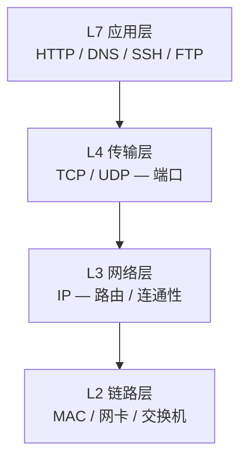
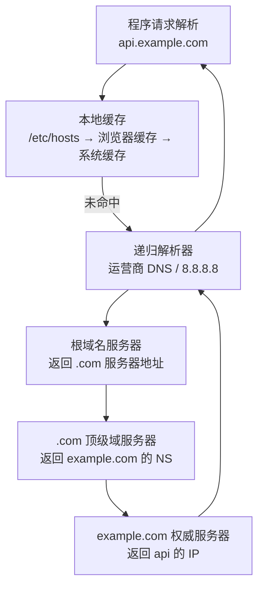
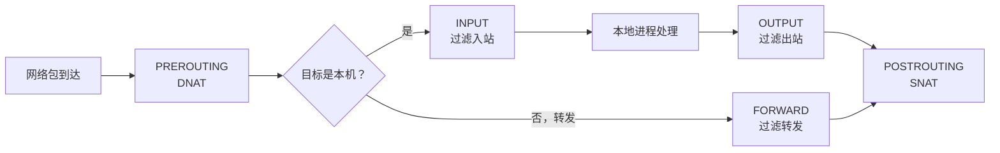

# 网络排查与磁盘管理：服务器的血管和仓库

在[上一篇文章](/posts/linux/cloud-server-getting-started)中，我们完成了一台云服务器从购买到安全加固的全过程——SSH 连上了、用户建好了、防火墙配好了。你现在有一台干净安全的服务器，可以放心地暴露在公网。

但服务器运维的现实是：**它迟早会出问题**。而服务器故障，一半以上跑不出两类——

1. **网络问题**：服务部署了但访问不了、API 调不通、DNS 解析异常……
2. **磁盘问题**：空间满了服务崩溃、日志撑爆根分区、新加了硬盘不会挂载……

网络是服务器的**血管**——请求靠它流进流出，血管堵了，服务就"缺氧"；磁盘是服务器的**仓库**——数据靠它存放，仓库满了，服务就"堆不下"。

这篇文章分成两大部分，系统讲解这两类最常见问题的排查与管理：

- **Part I：网络排查**——从 TCP/IP 模型出发，逐层掌握 `ping`、`traceroute`、`curl`、`ss`、`dig` 等工具，最后形成一套系统化的网络排查方法论。
- **Part II：磁盘管理**——从磁盘概念出发，掌握 `df`、`du`、`lsblk` 等查看工具，再深入分区挂载、LVM 弹性扩容、Swap 管理，确保你的仓库既够用又能扩。

---

# Part I：网络排查

## 1. 网络基础速览

在动手敲命令之前，先在脑海里建一个简化的网络模型。排查网络问题最关键的一步是**判断问题出在哪一层**——不同层有不同的工具，用错工具就像拿温度计量血压，白费力气。

### 1.1 服务器运维关心的四层

TCP/IP 模型可以分得很细，但对服务器日常运维来说，记住下面四层就够用了：



| 层 | 关注点 | 典型问题 | 对应工具 |
| :--- | :--- | :--- | :--- |
| L7 应用层 | HTTP 返回码对不对、DNS 解析正不正确 | 404、502、DNS 解析失败 | `curl`、`dig` |
| L4 传输层 | 端口有没有在监听、TCP 连接状态如何 | 端口未开放、连接被拒绝 | `ss`、`telnet` |
| L3 网络层 | 两台机器之间 IP 能不能通 | ping 不通、路由中断 | `ping`、`traceroute` |
| L2 链路层 | 网卡是否正常、链路是否断了 | 网卡 down、网线断了 | `ip link`（运维中较少遇到） |

### 1.2 一个 Web 请求的完整旅程

当你在浏览器输入 `http://example.com` 并按下回车，背后发生了什么？


1. **DNS 解析**：浏览器先查 `example.com` 对应的 IP 地址（L7 层问题）
2. **TCP 握手**：与目标 IP 的 80 端口建立 TCP 连接（L4 层问题）
3. **HTTP 请求/响应**：发送请求、接收响应（L7 层问题）
4. 中间经过的每一个路由器，都涉及 L3 层的 IP 转发

如果最终页面打不开，你的排查思路就是**从外到内、从底层到高层**逐层验证——先看网络通不通（L3），再看端口开不开（L4），最后看 HTTP 返回什么（L7）。下面的工具就是按这个顺序介绍的。

---

## 2. 连通性排查：从外到内

### 2.1 ping：最基本的连通性测试

`ping` 使用 **ICMP 协议**（工作在 L3 网络层），测试两台机器之间 IP 层是否连通。它是排查网络问题的**第一步**。

```bash
# 测试能否访问某台服务器
ping -c 4 123.45.67.89

# 用域名测试（同时验证 DNS 解析）
ping -c 4 example.com
```

`-c 4` 表示发 4 个包后停止（不加的话会一直 ping，得 Ctrl+C 终止）。

正常输出：

```
PING example.com (93.184.216.34) 56(84) bytes of data.
64 bytes from 93.184.216.34: icmp_seq=1 ttl=56 time=11.2 ms
64 bytes from 93.184.216.34: icmp_seq=2 ttl=56 time=11.1 ms
64 bytes from 93.184.216.34: icmp_seq=3 ttl=56 time=10.9 ms
64 bytes from 93.184.216.34: icmp_seq=4 ttl=56 time=11.0 ms

--- example.com ping statistics ---
4 packets transmitted, 4 received, 0% packet loss, time 3005ms
rtt min/avg/max/mdev = 10.917/11.058/11.221/0.134 ms
```

关注几个关键信息：

- **packet loss**：丢包率。0% 说明链路可靠；丢包 > 5% 就该注意了。
- **time**：往返延迟（RTT）。国内服务器通常 1~30ms，海外 100~300ms。
- **ttl**：每经过一个路由器减 1，可粗略估算经过的跳数。

ping 不通的可能原因：

| 现象 | 可能原因 |
| :--- | :--- |
| `Destination Host Unreachable` | 本机没有到目标的路由 |
| `Request timeout` | 对方不回应或中途被防火墙拦截 |
| `Name or service not known` | DNS 解析失败（域名写错或 DNS 服务器不可达） |

:::note ping 不通 ≠ 服务不可用
很多云服务器的防火墙/安全组会**屏蔽 ICMP**（ping 用的协议），所以 ping 不通不代表服务挂了。这时候需要用 `curl` 或 `telnet` 测试具体的端口。反过来，ping 通了也只能说明 IP 层可达，不代表具体服务（比如 HTTP）正常。
:::

### 2.2 traceroute / tracepath：定位丢包位置

`ping` 告诉你"通不通"，`traceroute` 告诉你**"哪里断了"**。它逐跳发送探测包，记录每一跳路由器的响应时间。

```bash
# 追踪到目标服务器的路由路径
traceroute example.com

# tracepath 是更轻量的替代，不需要 root 权限
tracepath example.com
```

典型输出：

```
traceroute to example.com (93.184.216.34), 30 hops max, 60 byte packets
 1  gateway (10.0.0.1)  0.321 ms  0.285 ms  0.263 ms
 2  100.64.0.1 (100.64.0.1)  1.234 ms  1.198 ms  1.165 ms
 3  * * *
 4  93.184.216.34 (93.184.216.34)  10.543 ms  10.501 ms  10.467 ms
```

- 每行是一跳，显示路由器 IP 和三次探测的延迟
- `* * *` 表示该跳没有回应（可能是路由器配置不回复 ICMP，也可能是确实丢包）
- 如果某一跳之后全部超时，问题大概率在那附近

```bash
# Ubuntu 通常需要安装 traceroute
sudo apt install traceroute

# 指定使用 ICMP 探测（比默认 UDP 更容易被防火墙放行）
sudo traceroute -I example.com
```

:::tip 看不懂输出也没关系
`traceroute` 的输出有时比较复杂（路由器不回 ICMP、负载均衡导致路径变化等）。日常排查中，它的核心价值是帮你判断：**问题在本地网络、在中间链路、还是在目标服务器**——只要看到前几跳正常、最后几跳超时，就知道问题靠近目标端。
:::

### 2.3 curl：HTTP 层的全能工具

如果说 `ping` 是"敲门"，`curl` 就是"进门坐下聊"。它能模拟完整的 HTTP 请求，是排查 Web 服务问题的**最常用工具**。

#### 基本用法

```bash
# 最简单的 GET 请求（返回响应体）
curl http://example.com

# 只看响应头（不下载正文），检查状态码和服务器信息
curl -I http://example.com
```

`-I`（大写 i）只请求头部信息，输出类似：

```
HTTP/1.1 200 OK
Content-Type: text/html; charset=UTF-8
Server: nginx/1.24.0
Content-Length: 1256
```

#### 详细模式：看完整的请求/响应过程

```bash
# -v（verbose）显示完整交互过程，包括 DNS 解析、TCP 连接、请求头、响应头
curl -v http://example.com
```

这是排查问题最常用的模式，输出包含完整的通信过程：

```
*   Trying 93.184.216.34:80...
* Connected to example.com (93.184.216.34) port 80
> GET / HTTP/1.1
> Host: example.com
> User-Agent: curl/8.5.0
> Accept: */*
>
< HTTP/1.1 200 OK
< Content-Type: text/html; charset=UTF-8
< Server: nginx/1.24.0
```

从 verbose 输出你可以看到：
- DNS 解析到了哪个 IP
- TCP 连接是否成功（Connected to ...）
- 发出的完整请求头
- 服务器返回的完整响应头

#### 测试特定端口

```bash
# 测试 8080 端口是否有 HTTP 服务
curl -v http://example.com:8080

# 测试 HTTPS（443 端口）
curl -v https://example.com

# 跳过 SSL 证书验证（自签名证书时有用）
curl -k https://self-signed.example.com
```

#### 发送 POST 请求

```bash
# 发送 JSON 数据
curl -X POST http://api.example.com/users \
  -H "Content-Type: application/json" \
  -d '{"name": "alice", "age": 25}'

# 提交表单数据
curl -X POST http://example.com/login \
  -d "username=root&password=secret"

# 从文件读取请求体
curl -X POST http://api.example.com/upload \
  -H "Content-Type: application/json" \
  -d @request.json
```

#### 其他实用参数

```bash
# -L 跟随重定向（默认 curl 不会跳转）
curl -L http://example.com

# -o 下载文件并指定保存路径
curl -o output.html http://example.com

# -w 自定义输出格式，显示 HTTP 状态码和耗时
curl -o /dev/null -s -w "HTTP Code: %{http_code}\nTime: %{time_total}s\n" http://example.com

# --connect-timeout 设置连接超时（秒），避免卡住
curl --connect-timeout 5 http://example.com

# --max-time 设置整个请求的最大耗时
curl --max-time 10 http://example.com
```

:::tip 快速检查 API 是否正常
一个极实用的组合：`curl -s -o /dev/null -w "%{http_code}" URL`，只输出 HTTP 状态码。配合 shell 判断逻辑可以做健康检查：

```bash
STATUS=$(curl -s -o /dev/null -w "%{http_code}" --max-time 5 http://localhost:8080/health)
if [ "$STATUS" != "200" ]; then
  echo "Service unhealthy! HTTP status: $STATUS"
fi
```
:::

### 2.4 wget 与 curl 的简单对比

| 特性 | curl | wget |
| :--- | :--- | :--- |
| 定位 | "请求构造器"——模拟各种 HTTP 请求 | "下载器"——下载文件 |
| 递归下载 | 不支持 | 支持（`wget -r`，整站镜像） |
| 发送 POST/自定义 Header | 原生支持 | 支持但参数更繁琐 |
| 断点续传 | 需 `-C -` | 原生支持 |
| 默认行为 | 输出到终端 | 保存为文件 |

简单记：**调试用 curl，下载用 wget**。

---

## 3. 端口与连接排查

网络通了，不代表服务能访问——你还得确认**端口在监听**、**连接状态正常**。这就是 L4 传输层的排查。

### 3.1 ss：现代端口查看工具

`ss`（Socket Statistics）是 `netstat` 的现代替代品，速度更快、信息更全。Ubuntu 系统默认已安装。

```bash
# 查看所有监听中的 TCP 端口
ss -lnt
```

参数解读：

| 参数 | 含义 |
| :--- | :--- |
| `-l` | 只显示监听（LISTEN）状态的 socket |
| `-n` | 不解析服务名（显示 80 而非 http），更快 |
| `-t` | 只显示 TCP |
| `-u` | 只显示 UDP |
| `-p` | 显示占用该端口的进程信息 |
| `-a` | 显示所有状态的连接（包括 LISTEN 和非 LISTEN） |

输出示例：

```
State   Recv-Q  Send-Q   Local Address:Port    Peer Address:Port   Process
LISTEN  0       128      0.0.0.0:22            0.0.0.0:*
LISTEN  0       511      0.0.0.0:80            0.0.0.0:*
LISTEN  0       128      127.0.0.1:3306        0.0.0.0:*
LISTEN  0       511      *:443                 *:*
```

- `0.0.0.0:80` 表示监听所有网卡的 80 端口——外部可访问
- `127.0.0.1:3306` 表示只监听本机回环地址——外部连不上（MySQL 的默认配置）

```bash
# 查看所有 TCP 连接（不仅是监听的）
ss -ant

# 查看哪个进程占用了哪个端口（需要 sudo 才能看到进程名）
sudo ss -lntp
```

`-p` 加上后的输出会多一列进程信息：

```
State   Recv-Q  Send-Q   Local Address:Port    Peer Address:Port   Process
LISTEN  0       128      0.0.0.0:22            0.0.0.0:*           users:(("sshd",pid=1234,fd=3))
LISTEN  0       511      0.0.0.0:80            0.0.0.0:*           users:(("nginx",pid=5678,fd=6))
```

#### 统计连接状态

生产环境中，如果看到大量 `TIME_WAIT` 或 `CLOSE_WAIT` 连接，可能说明程序没有正确关闭连接，需要关注。

```bash
# 统计各状态的 TCP 连接数
ss -ant | awk 'NR>1 {++state[$1]} END {for(key in state) print key, state[key]}'

# 更直观：只看连接状态统计
ss -s
```

`ss -s` 输出概览：

```
Total: 156
TCP:   28 (estab 12, closed 8, orphaned 0, timewait 8)

Transport Total     IP    IPv6
RAW       0         0      0
UDP       2         1      1
TCP       20        12     8
INET      22        13     9
```

TCP 连接状态速查：

| 状态 | 含义 | 需要关注吗 |
| :--- | :--- | :--- |
| ESTABLISHED | 连接已建立，正在通信 | 正常 |
| TIME_WAIT | 主动关闭方等待 2MSL | 少量正常，大量可能短连接过多 |
| CLOSE_WAIT | 被动关闭方等待应用关闭 | 大量堆积说明程序没调 close() |
| LISTEN | 正在监听新连接 | 正常 |
| SYN_SENT | 已发送 SYN，等待回应 | 大量可能是连接超时/被防火墙拦 |

### 3.2 netstat：老系统上的替代

在一些老旧的 CentOS 6 或嵌入式系统上可能没有 `ss`，这时可以用 `netstat`：

```bash
# 等价于 ss -lnt
netstat -lnt

# 等价于 ss -lntp
sudo netstat -lntp

# 等价于 ss -ant
netstat -ant
```

参数含义与 `ss` 基本一致。新系统建议优先用 `ss`，因为 `netstat` 在连接数多时非常慢。

---

## 4. DNS 排查

DNS（Domain Name System）是把域名翻译成 IP 地址的系统。如果 DNS 出了问题，即使服务器一切正常，用户也找不到你——就像地址簿写错了门牌号。

### 4.1 DNS 解析过程

当你的程序访问 `api.example.com` 时，DNS 解析大致经历以下过程：



1. 先查本地缓存（`/etc/hosts` 文件、系统 DNS 缓存）
2. 没有则请求**递归解析器**（你配置的 DNS 服务器，如 `8.8.8.8`）
3. 递归解析器替你从根域名服务器一路查到权威服务器，拿到最终 IP
4. 结果被各级缓存，下次访问更快

### 4.2 dig：最详细的 DNS 查询工具

`dig`（Domain Information Groper）是 DNS 排查的**首选工具**，输出信息最全。

```bash
# 基本 A 记录查询（域名 → IPv4）
dig example.com
```

输出分为几个部分：

```
;; QUESTION SECTION:
;example.com.           IN  A

;; ANSWER SECTION:
example.com.        86400   IN  A   93.184.216.34

;; Query time: 12 msec
;; SERVER: 127.0.0.53#53
;; WHEN: Mon Feb 10 10:30:00 UTC 2026
;; MSG SIZE  rcvd: 56
```

- **QUESTION SECTION**：你问了什么
- **ANSWER SECTION**：答案是什么（IP 地址、TTL 过期时间）
- **SERVER**：用的哪台 DNS 服务器

#### 常用查询模式

```bash
# 只看 IP，简洁输出
dig +short example.com
# 输出：93.184.216.34

# 查 MX 记录（邮件服务器）
dig MX example.com

# 查 CNAME 记录（别名）
dig CNAME www.example.com

# 查 NS 记录（域名服务器）
dig NS example.com

# 查 TXT 记录（SPF、验证信息等）
dig TXT example.com

# 指定 DNS 服务器查询（排除本地 DNS 缓存干扰）
dig @8.8.8.8 example.com

# 追踪完整解析路径（看递归过程）
dig +trace example.com
```

`dig +trace` 会从根服务器开始一步步追踪，非常适合排查"到底是哪个环节返回了错误记录"。

### 4.3 nslookup 和 host：更简单的替代

如果觉得 `dig` 输出太多，可以用这两个简化工具：

```bash
# nslookup：交互式或单次查询
nslookup example.com

# 指定 DNS 服务器
nslookup example.com 8.8.8.8

# host：最简洁的查询
host example.com
# 输出：example.com has address 93.184.216.34

# host 查特定记录
host -t MX example.com
```

### 4.4 常见 DNS 问题

| 问题 | 现象 | 排查方法 |
| :--- | :--- | :--- |
| DNS 记录配置错误 | `dig +short` 返回错误 IP 或无结果 | 用 `dig @8.8.8.8` 排除本地缓存干扰 |
| DNS 传播延迟 | 修改了记录但部分用户还看到旧值 | 用 `dig +trace` 看各级缓存 TTL |
| /etc/hosts 覆盖 | 域名解析到了意外 IP | 检查 `cat /etc/hosts` 是否有对应条目 |
| DNS 服务器不可达 | 所有域名都解析失败 | `ping 8.8.8.8` 看 DNS 服务器是否可达 |

:::warning /etc/hosts 优先级最高
Linux 系统默认先查 `/etc/hosts`，再查 DNS。这个文件如果配了错误条目，会覆盖真实的 DNS 记录，导致"别人能访问就我不行"的诡异问题。排查 DNS 时，先看这个文件：

```bash
cat /etc/hosts
```

如果看到类似 `123.45.67.89 example.com` 的条目而你不确定它是否正确，可以临时注释掉（行首加 `#`）再测试。
:::

DNS 的解析顺序由 `/etc/nsswitch.conf` 控制，一般配置为：

```
hosts:          files dns
```

`files` 在前意味着先查 `/etc/hosts`，再查 `dns`。

---

## 5. 防火墙补充：iptables 概念

在[上一篇文章](/posts/linux/cloud-server-getting-started)中，我们用了 `ufw` 配置防火墙——它简单好用，一条命令就能放行端口。但 `ufw` 只是一个前端，底层真正执行过滤的是 **iptables**（以及更新的 nftables）。理解 iptables 的概念，有助于排查更复杂的网络问题，尤其是在使用 Docker 等会直接操作 iptables 的场景。

### 5.1 iptables 的基本结构

iptables 按照四个维度组织规则：

```
表（Table） → 链（Chain） → 规则（Rule） → 目标（Target）
```

**四张表**（日常用到的主要是 filter 和 nat）：

| 表 | 作用 | 常用场景 |
| :--- | :--- | :--- |
| filter | 包过滤（默认表） | 放行/拒绝流量 |
| nat | 地址转换 | 端口转发、SNAT/DNAT |
| mangle | 修改包头 | TOS/DSCP 标记 |
| raw | 连接追踪豁免 | 跳过 conntrack |

**五条链**（钩子位置）：

| 链 | 触发时机 | 对应阶段 |
| :--- | :--- | :--- |
| INPUT | 收到发往本机的包 | 入站 |
| OUTPUT | 本机发出的包 | 出站 |
| FORWARD | 经本机转发的包 | 路由转发 |
| PREROUTING | 路由决策之前 | DNAT（目标地址转换） |
| POSTROUTING | 路由决策之后 | SNAT（源地址转换） |

对于一台普通服务器，最关心的是 **INPUT 链**（控制谁能连进来）。



### 5.2 规则的匹配逻辑

iptables 的规则从上到下逐条匹配，**一旦命中就执行目标，不再继续往下**：

```
规则1: -p tcp --dport 22 -j ACCEPT     → 匹配到就放行，结束
规则2: -p tcp --dport 80 -j ACCEPT     → 匹配到就放行，结束
规则3: -j DROP                          → 都没匹配到，丢弃
```

常见的目标（Target）：

| 目标 | 作用 |
| :--- | :--- |
| ACCEPT | 放行 |
| DROP | 丢弃（不回应，对发送方来说像超时） |
| REJECT | 拒绝并返回错误（对发送方来说像"端口不可达"） |
| LOG | 记录日志（不终止匹配，继续往下） |

### 5.3 查看 iptables 规则

```bash
# 查看所有规则（数字显示 IP 和端口，不反解）
sudo iptables -L -n

# 加上 -v 显示更详细信息（包计数、网卡接口）
sudo iptables -L -n -v

# 只看 INPUT 链
sudo iptables -L INPUT -n -v

# 查看 nat 表的规则（Docker 端口映射就在这里）
sudo iptables -t nat -L -n
```

### 5.4 ufw 规则与 iptables 的对应关系

当你用 `ufw allow 80` 添加规则时，ufw 实际上在 iptables 的 filter 表中创建了多条规则：

```bash
# ufw 的规则集中在这些链中
sudo iptables -L ufw-user-input -n -v

# 你会看到类似这样的输出
Chain ufw-user-input (1 references)
 pkts bytes target     prot opt in     out     source               destination
  120  7200 ACCEPT     tcp  --  *      *       0.0.0.0/0            0.0.0.0/0            tcp dpt:80
```

ufw 创建了自定义链（`ufw-user-input`、`ufw-user-forward` 等），然后把 INPUT 链的流量引导到这些链中处理。这样既用了 iptables 的能力，又不会和你手动添加的规则冲突。

### 5.5 什么时候需要直接操作 iptables

大多数情况下，`ufw` 就够了。但以下场景可能需要直接操作 iptables：

- **Docker**：Docker 会直接操作 iptables 的 nat 表和 filter 表实现端口映射和网络隔离。用 `ufw` 管不了 Docker 的规则，甚至可能冲突。
- **复杂规则**：需要按源 IP、连接状态等细粒度过滤时，ufw 语法不够灵活。
- **老系统**：CentOS 6/7 默认没有 ufw，只有 iptables（CentOS 7+ 用 firewalld）。

:::warning 不要在 Docker 环境随意改 iptables
如果你的服务器上运行了 Docker，**不要手动修改 Docker 在 iptables 中创建的规则**，也不要试图用 ufw 去管理 Docker 的流量。Docker 启动时会重建 iptables 规则，你的修改会被覆盖。Docker 网络的访问控制应该通过 Docker 自身的安全配置来实现。
:::

---

## 6. 网络排查实战：系统化方法论

学完了各个工具，现在把它们串起来。网络排查的关键不是"会用多少命令"，而是**按正确的顺序、在正确的层级使用正确的工具**。

### 6.1 排查决策流程图


### 6.2 场景一：访问不了我的网站

**症状**：浏览器输入 `http://your-server-ip` 显示无法访问。

**排查步骤**：

```bash
# 第 1 步：DNS 解析正常吗？（如果是用域名访问）
dig +short your-domain.com
# 如果返回正确 IP → 继续
# 如果无结果 → DNS 有问题，检查域名记录

# 第 2 步：从外部 ping 服务器（在自己电脑上执行）
ping -c 4 your-server-ip
# ping 通 → 网络层没问题，继续查端口
# ping 不通 → 但可能是 ICMP 被屏蔽了，不急下结论

# 第 3 步：在服务器上检查端口是否在监听
ssh your-server
sudo ss -lntp | grep :80
# 如果没有输出 → Nginx/Apache 没启动或没监听 80
# 有输出 → 端口在监听，继续

# 第 4 步：在服务器本地 curl 测试
curl -I http://localhost
# 返回 200 → 服务本身没问题，可能是防火墙拦了外部
# 返回 5xx → 应用有问题，查应用日志

# 第 5 步：检查防火墙
sudo ufw status
# 80 端口是否在放行列表？没放行则 sudo ufw allow 80
# 别忘了检查云厂商安全组！

# 第 6 步：从外部 curl 测试
curl -v http://your-server-ip
# 如果还是不行，用 traceroute 看路径
```

### 6.3 场景二：服务器连不上外网

**症状**：服务器内部 `apt update` 失败、`curl google.com` 超时。

```bash
# 第 1 步：ping 一个公网 IP（跳过 DNS）
ping -c 4 8.8.8.8
# 通 → 网络层没问题，可能是 DNS 问题
# 不通 → 网络层有问题

# 第 2 步：如果 ping IP 通了，测 DNS
dig +short google.com
# 无结果 → DNS 服务器有问题

# 检查 DNS 配置
cat /etc/resolv.conf
# 正常应该有 nameserver 条目，比如：
# nameserver 8.8.8.8
# nameserver 1.1.1.1

# 如果 DNS 有问题，临时修复
echo "nameserver 8.8.8.8" | sudo tee /etc/resolv.conf

# 第 3 步：如果 ping IP 不通
# 检查默认路由
ip route show
# 应该有一行类似：default via 10.0.0.1 dev eth0

# 检查网卡状态
ip link show
# 状态应该是 UP
```

### 6.4 场景三：端口似乎被封锁了

**症状**：服务启动了，本机 curl 正常，但外部连不上。

```bash
# 在服务器上确认端口在监听
sudo ss -lntp | grep :8080
# 注意监听地址：
# 0.0.0.0:8080 → 外部可访问
# 127.0.0.1:8080 → 只有本机能访问，需要改应用配置

# 检查 UFW
sudo ufw status numbered

# 检查 iptables（可能有非 ufw 的规则在拦截）
sudo iptables -L INPUT -n -v | grep 8080

# 从另一台机器测试端口连通性
telnet your-server-ip 8080
# Connected → 端口通
# Connection refused → 端口没开或被拦
# Timeout → 防火墙丢弃了包

# 如果 telnet 没有，用 curl 替代
curl -v --connect-timeout 5 http://your-server-ip:8080
```

:::important 三层检查口诀
外部访问不通，按这三层查：**服务监听 → 服务器防火墙（ufw/iptables） → 云厂商安全组**。三层都放行才能通，任何一层卡住都不行。
:::

---

# Part II：磁盘管理

网络排查解决"请求到不了"的问题，磁盘管理解决"数据放不下"的问题。服务器跑了一段时间后，你大概率会遇到：`No space left on device`——磁盘满了。轻则日志写不进、数据库崩溃，重则整个系统无法登录。

## 7. 磁盘基础概念

### 7.1 块设备与文件系统

Linux 中，硬盘以**块设备（Block Device）**的形式呈现，路径在 `/dev/` 下：

- `/dev/sda` —— 第一块 SCSI/SATA 硬盘
- `/dev/sdb` —— 第二块硬盘
- `/dev/nvme0n1` —— 第一块 NVMe SSD
- `/dev/vda` —— 虚拟化环境中的第一块虚拟磁盘

但块设备本身只是一堆原始的存储空间，不能直接存文件。你需要在上边建**文件系统（Filesystem）**，才能以文件和目录的方式组织数据——就像买了一块空地（块设备），得先盖好仓库架子（文件系统），才能往里面放东西（文件）。

### 7.2 分区：MBR 与 GPT

一块硬盘可以先分成几个**分区（Partition）**，再在每个分区上建文件系统。分区表有两种标准：

| 对比项 | MBR（Master Boot Record） | GPT（GUID Partition Table） |
| :--- | :--- | :--- |
| 最大磁盘 | 2 TB | 几乎无限制（18 EB） |
| 最大分区数 | 4 个主分区（或 3 主 + 1 扩展） | 128 个（默认） |
| 可靠性 | 单点故障（分区表只存一份） | 有冗余备份 |
| 启动方式 | BIOS（Legacy） | UEFI |
| 推荐度 | 老系统兼容用 | **新系统首选** |

现在的新服务器基本都使用 **GPT + UEFI**，MBR 只有在老机器上才会遇到。

### 7.3 常见文件系统类型

| 文件系统 | 特点 | 适用场景 |
| :--- | :--- | :--- |
| ext4 | Linux 默认，稳定可靠 | 通用场景，绝大多数服务器 |
| xfs | 高性能，擅长大文件和并行 IO | 数据库、大文件存储 |
| btrfs | 支持快照、压缩、子卷 | NAS、需要快照的场景（生产慎用） |
| vfat/exFAT | 跨平台兼容 | U 盘、与 Windows 共享的分区 |

**新手建议**：没有特殊需求就用 **ext4**，稳定不出事。

### 7.4 挂载模型：一切皆树

Linux 的文件系统是一个**单一目录树**，根是 `/`。不同的分区/硬盘通过**挂载（Mount）**接入这棵树的某个目录点：

```
/                ← 根分区（/dev/sda1）
├── home/        ← 可以是独立分区（/dev/sda2）
├── data/        ← 可以挂载独立的数据盘（/dev/sdb1）
├── var/         ← 日志和运行数据，也适合独立分区
└── ...
```

这种设计的精妙之处：无论物理上有几块硬盘、几个分区，用户看到的都是一棵统一的树，不需要关心文件实际存在哪个设备上。

---

## 8. 查看磁盘状态

### 8.1 df：文件系统使用概览

`df`（Disk Free）显示每个已挂载文件系统的使用情况：

```bash
# -h 人类可读格式（自动用 K/M/G）
df -h
```

输出：

```
Filesystem      Size  Used Avail Use% Mounted on
/dev/vda1        40G   12G   26G  32% /
/dev/vdb1       100G   45G   50G  47% /data
tmpfs           1.9G     0  1.9G   0% /dev/shm
```

- **Size**：分区总大小
- **Used**：已用空间
- **Avail**：剩余可用空间
- **Use%**：使用百分比
- **Mounted on**：挂载点

:::warning 磁盘使用率的安全线
- **80% 以下**：健康
- **80%~90%**：需要关注，开始清理
- **90% 以上**：危险，某些服务可能开始报错
- **100%**：紧急，系统可能无法写入日志、数据库崩溃

建议设置监控告警，使用率超过 85% 时通知运维人员。
:::

```bash
# 只看某个目录所在的文件系统
df -h /var/log

# 显示文件系统类型
df -Th
```

### 8.2 du：目录级使用分析

`df` 告诉你哪个分区快满了，`du`（Disk Usage）告诉你**哪个目录最占空间**：

```bash
# 查看当前目录下各子目录的大小
du -h --max-depth=1 /var

# 查看某个目录的总大小
du -sh /var/log

# 按大小排序，找出最大的目录
du -h --max-depth=1 /var | sort -rh | head -n 10
```

参数说明：

| 参数 | 含义 |
| :--- | :--- |
| `-h` | 人类可读格式 |
| `-s` | 只显示总计（不列子目录） |
| `--max-depth=N` | 只显示 N 层深度的子目录 |
| `-a` | 显示文件和目录 |

### 8.3 找出最大的文件

```bash
# 找出当前目录下最大的 20 个文件
du -ah / | sort -rh | head -n 20

# 只找大于 100M 的文件
find / -type f -size +100M -exec ls -lh {} \; 2>/dev/null
```

:::tip 日志文件是头号空间杀手
`/var/log` 是最常被忽略的空间黑洞。Nginx 访问日志、系统日志如果没做日志轮转（logrotate），可以轻松长到几十 GB：

```bash
# 查看日志目录大小
du -sh /var/log

# 清空一个大日志文件（不要 rm，进程可能还在写入）
> /var/log/nginx/access.log

# 更安全的做法是使用 logrotate 自动管理
# Ubuntu 默认已安装，配置在 /etc/logrotate.d/
```
:::

### 8.4 ncdu：交互式磁盘分析

`ncdu`（NCurses Disk Usage）是 `du` 的交互式增强版，支持方向键导航、按大小排序、直接删除文件：

```bash
# 安装
sudo apt install ncdu

# 扫描根目录
sudo ncdu /

# 只扫描某个分区
sudo ncdu /var
```

进入后你会看到一个按大小排序的列表，用方向键上下移动，回车进入子目录，`d` 删除文件，`q` 退出。比 `du | sort` 直观得多。

### 8.5 lsblk：块设备布局一览

`lsblk` 显示所有块设备（硬盘、分区）的层级关系，非常直观：

```bash
lsblk
```

输出：

```
NAME    MAJ:MIN RM  SIZE RO TYPE MOUNTPOINTS
vda     252:0    0   40G  0 disk
├─vda1  252:1    0   39G  0 part /
├─vda2  252:2    0    1K  0 part
└─vda5  252:5    0    1G  0 part [SWAP]
vdb     252:16   0  100G  0 disk
└─vdb1  252:17   0  100G  0 part /data
```

- **NAME**：设备名
- **SIZE**：大小
- **TYPE**：disk（整块硬盘）或 part（分区）
- **MOUNTPOINTS**：挂载点

```bash
# 显示更多信息（文件系统类型、UUID）
lsblk -f

# 只看某个设备
lsblk /dev/vdb
```

### 8.6 fdisk -l：分区表详情

```bash
# 查看所有硬盘的分区表
sudo fdisk -l

# 查看特定硬盘
sudo fdisk -l /dev/vdb
```

输出包含磁盘大小、扇区信息、分区类型（GPT/MBR）和每个分区的起止位置。

---

## 9. 分区与挂载

理论了解了，现在来做最常见的一个实操：**给服务器加一块新硬盘，挂载到 /data 目录**。

### 9.1 完整流程：添加一块数据盘

假设你在云控制台给服务器加了一块 100G 的数据盘，它应该显示为 `/dev/vdb`（或 `/dev/sdb`，取决于虚拟化类型）。

#### 第 1 步：确认新磁盘已识别

```bash
# 查看所有块设备，确认新盘出现
lsblk

# 或者
sudo fdisk -l | grep "Disk /dev"
```

如果看不到新盘，可能需要让系统重新扫描 SCSI 总线（云服务器偶尔需要）：

```bash
# 强制重新扫描 SCSI 总线
for host in /sys/class/scsi_host/*; do
  echo "- - -" | sudo tee "$host/scan"
done

# 再检查
lsblk
```

#### 第 2 步：分区

如果磁盘是全新的（没有分区表），需要先分区。对于大于 2TB 的盘，必须用 GPT 分区表，用 `parted` 而不是 `fdisk`。

**使用 fdisk（MBR 分区，< 2TB 的盘）**：

```bash
sudo fdisk /dev/vdb
```

进入交互界面后：

```
Command (m for help): n       # 新建分区
Partition type: p             # 主分区
Partition number: 1           # 分区号
First sector: 回车            # 默认起始位置
Last sector: 回车             # 默认使用全部空间
Command (m for help): w       # 写入分区表
```

**使用 parted（GPT 分区，推荐）**：

```bash
# 交互模式
sudo parted /dev/vdb

# 在 parted 交互界面中：
(parted) mklabel gpt          # 创建 GPT 分区表
(parted) mkpart primary ext4 0% 100%   # 使用全部空间
(parted) print                # 确认分区
(parted) quit
```

或者一行命令搞定：

```bash
sudo parted /dev/vdb mklabel gpt mkpart primary ext4 0% 100%
```

分区后验证：

```bash
lsblk /dev/vdb
# 应该能看到 vdb1 分区
```

#### 第 3 步：格式化（创建文件系统）

```bash
# 格式化为 ext4
sudo mkfs.ext4 /dev/vdb1

# 或格式化为 xfs
sudo mkfs.xfs /dev/vdb1
```

输出会显示文件系统创建的信息，包括块大小、inode 数量等。

#### 第 4 步：临时挂载

```bash
# 创建挂载点
sudo mkdir -p /data

# 挂载
sudo mount /dev/vdb1 /data

# 验证
df -h /data
```

#### 第 5 步：写入 /etc/fstab 实现开机自动挂载

临时挂载重启后会丢失。要让挂载永久生效，需要写入 `/etc/fstab`。

:::warning 错误的 fstab 配置可能导致系统无法启动！
修改 `/etc/fstab` 前，务必先备份，并且用 `mount -a` 验证配置正确后再重启。如果 fstab 有错，系统启动时会卡住或进入紧急模式。
:::

**推荐使用 UUID 而非设备名**，因为设备名（/dev/vdb1）在插拔硬盘后可能改变，而 UUID 是唯一的：

```bash
# 查看 UUID
sudo blkid /dev/vdb1
# 输出：/dev/vdb1: UUID="a1b2c3d4-e5f6-7890-abcd-ef1234567890" TYPE="ext4"
```

编辑 fstab：

```bash
# 备份
sudo cp /etc/fstab /etc/fstab.bak

# 添加一行
echo 'UUID=a1b2c3d4-e5f6-7890-abcd-ef1234567890  /data  ext4  defaults  0  2' | sudo tee -a /etc/fstab
```

fstab 每行的六个字段：

```
设备/UUID    挂载点    文件系统类型    挂载选项    dump    fsck顺序
```

| 字段 | 说明 | 常用值 |
| :--- | :--- | :--- |
| 设备 | 分区设备或 UUID | `UUID=xxx` 或 `/dev/vdb1` |
| 挂载点 | 目录路径 | `/data` |
| 文件系统 | ext4、xfs 等 | `ext4` |
| 挂载选项 | 权限和特性 | `defaults`（rw, suid, dev, exec, auto, nouser, async） |
| dump | dump 备份工具是否备份 | `0`（通常不需要） |
| fsck | 开机时 fsck 检查的顺序 | 根分区 `1`，其他 `2`，不检查 `0` |

**验证 fstab 配置**：

```bash
# 先卸载
sudo umount /data

# 用 fstab 重新挂载所有条目（不会重复挂载已挂载的）
sudo mount -a

# 如果没报错，验证挂载成功
df -h /data
```

如果 `mount -a` 报错，**立即修正 fstab 再重启**，否则系统可能起不来。

### 9.2 常用挂载操作

```bash
# 查看当前所有挂载
mount | grep "^/dev"

# 卸载（确保没有进程在使用该分区）
sudo umount /data

# 如果提示 "device is busy"，查看谁在用
sudo lsof /data
# 或
sudo fuser -vm /data

# 强制卸载（危险，可能导致数据丢失）
sudo umount -l /data
```

---

## 10. LVM：弹性磁盘管理

传统分区有一个致命缺点：**分多大就是多大，满了没法扩**。如果你的 /data 分区分了 50G，用满后想加到 100G，只能备份、删分区、重建、恢复——这在生产环境是不可接受的。

**LVM（Logical Volume Manager）** 就是解决这个问题的。它在物理磁盘和文件系统之间加了一层抽象，让你可以**动态地调整分区大小，甚至跨磁盘扩展**。

### 10.1 LVM 的三层概念


- **PV（Physical Volume，物理卷）**：底层载体，通常是一个分区或整块磁盘。PV 是 LVM 能管理的最小物理单位。
- **VG（Volume Group，卷组）**：把多个 PV 组成一个"存储池"。VG 中的空间可以被灵活分配。
- **LV（Logical Volume，逻辑卷）**：从 VG 中划分出来的逻辑分区，在上面建文件系统然后挂载。LV 可以随时扩大或缩小。

打个比方：PV 是砖头，VG 是砖堆，LV 是从砖堆里取出来砌的墙。墙要加高？从砖堆里再取几块砖就行——不用拆了重砌。

### 10.2 创建 LVM：完整示例

场景：有一块新盘 `/dev/vdb`（100G），用 LVM 管理它，创建一个 50G 的逻辑卷挂载到 /data，留 50G 空间备用。

```bash
# 第 1 步：创建 PV（可以直接用整块磁盘，不需要先分区）
sudo pvcreate /dev/vdb
# 输出：Physical volume "/dev/vdb" successfully created.

# 第 2 步：创建 VG
sudo vgcreate vg_data /dev/vdb
# 输出：Volume group "vg_data" successfully created

# 第 3 步：创建 LV（只分配 50G，留空间以后扩）
sudo lvcreate -L 50G -n lv_data vg_data
# 输出：Logical volume "lv_data" created.

# -L 指定大小，-n 指定名字，最后一个参数是 VG 名

# 也可以用百分比：分配 VG 中 50% 的空间
sudo lvcreate -l 50%FREE -n lv_data vg_data

# 第 4 步：格式化
sudo mkfs.ext4 /dev/vg_data/lv_data

# 第 5 步：挂载
sudo mkdir -p /data
sudo mount /dev/vg_data/lv_data /data

# 第 6 步：写入 fstab
sudo blkid /dev/vg_data/lv_data
# 记下 UUID
echo 'UUID=你的UUID  /data  ext4  defaults  0  2' | sudo tee -a /etc/fstab
sudo mount -a
```

### 10.3 查看 LVM 状态

```bash
# 查看 PV 信息
sudo pvdisplay
# 简洁版
sudo pvs

# 查看 VG 信息（重点看 Free PE / Size，即剩余空间）
sudo vgdisplay vg_data
# 简洁版
sudo vgs

# 查看 LV 信息
sudo lvdisplay
# 简洁版
sudo lvs
```

`vgs` 输出示例：

```
VG      #PV #LV #SN Attr   VSize   VFree
vg_data   1   1   0 wz--n- 100.00g 50.00g
```

`VFree` 显示还有 50G 可用空间，可以随时分配给 LV。

### 10.4 扩容逻辑卷：不停机扩展

LVM 最强大的能力就是**在线扩容**——不需要卸载、不需要停服务。

场景：/data 用了 50G 快满了，要把 lv_data 从 50G 扩到 100G（VG 里还有 50G 空闲空间）。

```bash
# 第 1 步：确认 VG 有足够空闲空间
sudo vgs
# VFree 应该 >= 50G

# 第 2 步：扩展 LV
sudo lvextend -L 100G /dev/vg_data/lv_data
# 或者：在现有基础上加 50G
sudo lvextend -L +50G /dev/vg_data/lv_data
# 或者：使用 VG 中所有剩余空间
sudo lvextend -l +100%FREE /dev/vg_data/lv_data

# 第 3 步：扩展文件系统（让文件系统识别新的空间）
# ext4 用 resize2fs：
sudo resize2fs /dev/vg_data/lv_data

# xfs 用 xfs_growfs：
sudo xfs_growfs /data

# 第 4 步：验证
df -h /data
# Size 应该从 50G 变成 100G
```

:::important 扩容顺序不能反
必须**先扩展 LV，再扩展文件系统**。先 `lvextend`，后 `resize2fs` / `xfs_growfs`。顺序反了文件系统会报错。
:::

### 10.5 给 VG 加盘：物理扩容

如果 VG 的空闲空间也不够了，可以给 VG 加新的物理磁盘：

```bash
# 假设新加了一块 200G 的盘 /dev/vdc

# 创建 PV
sudo pvcreate /dev/vdc

# 把新 PV 加入现有 VG
sudo vgextend vg_data /dev/vdc

# 现在 VG 多了 200G 空间
sudo vgs

# 然后就可以继续扩展 LV
sudo lvextend -L +200G /dev/vg_data/lv_data
sudo resize2fs /dev/vg_data/lv_data
```

这就是 LVM 的弹性：**空间不够？加盘 → 扩 VG → 扩 LV → 扩文件系统**，全程在线操作，不停服务。

::: details LVM 缩容（了解即可）
LVM 也支持缩小逻辑卷，但过程更复杂：必须先卸载文件系统、执行 fsck 检查、缩小文件系统、再缩小 LV——而且 xfs **不支持缩小**。实际生产中，几乎不会去缩小 LV，通常只做扩容。如果确实需要减少空间使用，更好的做法是新建一个更小的 LV，迁移数据过去。
:::

---

## 11. Swap 管理

### 11.1 Swap 是什么

**Swap** 是磁盘上的一块空间，当物理内存（RAM）不够用时，系统把暂时不活跃的内存页写到 swap 中，腾出 RAM 给更需要的进程。这相当于内存的**溢出缓冲区**——正常情况下用不到，但关键时刻能防止系统因内存耗尽而杀进程（OOM Kill）。

```
物理内存充足时：程序直接在 RAM 中运行（快）
物理内存不足时：把不常用的数据移到 Swap（慢，但不会 OOM）
```

### 11.2 什么时候需要 Swap

| 场景 | 是否需要 Swap | 建议 |
| :--- | :--- | :--- |
| 物理内存 2G，跑数据库+Web | 需要 | 至少 2G swap |
| 物理内存 8G，小项目 | 建议有 | 1~2G swap 作为安全网 |
| 物理内存 64G，纯计算 | 可选 | 可以不要，或 4G 作为安全网 |
| Kubernetes 节点 | 视情况 | 有些 K8s 部署默认禁用 swap |

**原则**：Swap 不是用来"替代"内存的（磁盘比内存慢几十倍），而是**安全网**。宁可不用，不能没有——除非你非常确定内存永远够用。

### 11.3 创建 Swap 文件

创建 swap 有两种方式：用 swap 分区或用 swap 文件。**swap 文件更灵活**，不需要额外分区，推荐使用。

#### 完整示例：添加 4G swap 文件

```bash
# 第 1 步：创建 swap 文件
# 方法一：用 fallocate（快，但某些文件系统不支持）
sudo fallocate -l 4G /swapfile

# 方法二：用 dd（通用，更安全但慢一点）
sudo dd if=/dev/zero of=/swapfile bs=1M count=4096 status=progress

# 第 2 步：设置正确的权限（只有 root 可读，安全）
sudo chmod 600 /swapfile

# 第 3 步：格式化为 swap
sudo mkswap /swapfile
# 输出：Setting up swapspace version 1, size = 4 GiB (4294963200 bytes)

# 第 4 步：启用 swap
sudo swapon /swapfile

# 第 5 步：验证
free -h
# Swap 行应该显示 4G
```

`free -h` 输出：

```
              total     used     free   shared  buff/cache  available
Mem:          3.8Gi    1.2Gi    1.5Gi    16Mi       1.1Gi       2.4Gi
Swap:         4.0Gi       0B    4.0Gi
```

#### 第 6 步：写入 fstab 使其永久生效

和磁盘挂载一样，重启后 swap 会消失，需要写入 fstab：

```bash
echo '/swapfile  none  swap  sw  0  0' | sudo tee -a /etc/fstab
```

### 11.4 Swap 的开关与管理

```bash
# 查看当前 swap 使用情况
swapon --show
# 或
cat /proc/swaps

# 关闭某个 swap
sudo swapoff /swapfile

# 关闭所有 swap
sudo swapoff -a

# 重新开启所有 swap
sudo swapon -a

# 修改 swap 文件大小：先关闭 → 删除 → 重新创建
sudo swapoff /swapfile
sudo rm /swapfile
sudo fallocate -l 8G /swapfile
sudo chmod 600 /swapfile
sudo mkswap /swapfile
sudo swapon /swapfile
```

### 11.5 swappiness：控制系统使用 Swap 的倾向

**swappiness** 是一个内核参数（0~200），决定系统有多积极地使用 swap：

| 值 | 含义 |
| :--- | :--- |
| 0 | 尽可能不用 swap（只在即将 OOM 时使用） |
| 10 | 尽量避免使用 swap（推荐的服务器设置） |
| 60 | 默认值（平衡） |
| 100+ | 积极使用 swap |

```bash
# 查看当前值
cat /proc/sys/vm/swappiness
# 默认输出：60

# 临时修改（重启失效）
sudo sysctl vm.swappiness=10

# 永久修改
echo 'vm.swappiness=10' | sudo tee -a /etc/sysctl.conf
sudo sysctl -p
```

:::tip 服务器建议设为 10
对于 Web 服务器和数据库服务器，建议将 swappiness 设为 **10**。默认的 60 对桌面系统合理，但服务器更希望尽量在内存中运行，只在紧急时才用 swap——因为一旦开始大量使用 swap，性能会急剧下降（磁盘 IO 比内存慢几十倍），用户体验会变得很差。
:::

---

## 总结

这篇文章覆盖了服务器运维中两类最常见问题的排查和管理：

**网络排查**——当"请求到不了"时，按层级逐层定位：

| 问题层级 | 工具 | 解决什么问题 |
| :--- | :--- | :--- |
| L3 网络层 | `ping`、`traceroute` | IP 层是否连通，哪里断了 |
| L4 传输层 | `ss`、`telnet` | 端口是否开放，谁在监听 |
| L7 应用层 | `curl`、`dig` | HTTP 是否正常，DNS 是否正确 |
| 防火墙 | `ufw`、`iptables` | 规则是否放行，哪层拦截了 |

核心方法论：**DNS → ping → 端口 → 防火墙 → 应用**，从底层到高层、从外到内逐层排查。

**磁盘管理**——当"数据放不下"时，从查看到扩容：

| 场景 | 工具/方法 |
| :--- | :--- |
| 查看使用情况 | `df -h`、`du -h`、`ncdu` |
| 查看设备布局 | `lsblk`、`fdisk -l` |
| 新加磁盘 | 分区 → 格式化 → 挂载 → fstab |
| 弹性扩容 | LVM（PV → VG → LV → 在线扩展） |
| 内存安全网 | Swap 文件（创建 → swapon → swappiness） |

现在，你的服务器网络通了、磁盘管好了。下一篇，我们将在[云服务器环境搭建：运行时、数据库与 Nginx](/posts/linux/cloud-server-environment-setup)中，在这台基础设施就绪的服务器上安装运行时（Node.js/Python）、数据库（MySQL/Redis）和 Web 服务器 Nginx——把仓库和血管用起来，让它真正能跑项目。
