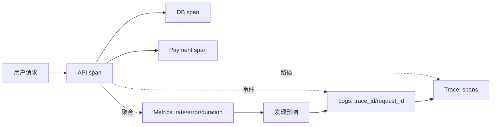
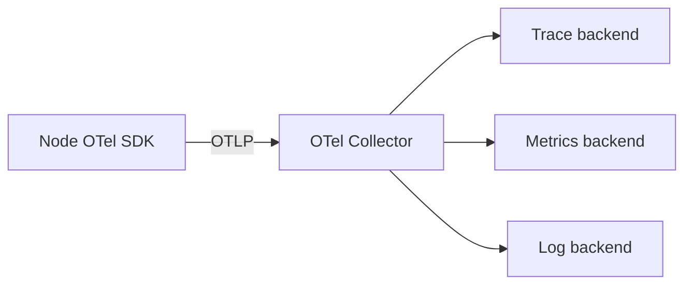

# 可观测性工程：Metrics、Logs、Traces 与 SLI/SLO 告警

可观测性不是“装一个监控面板”，而是根据系统外部输出推断内部状态的能力。它要帮助值班人员回答三个问题：用户是否受影响、问题在哪里、现在应该采取什么动作。

:::note 版本与实验范围
示例面向 **Node.js 20/22 LTS、Express 4/5、prom-client 15.x、Prometheus 2.45+ 或 3.x**。Prometheus 配置与单实例 Node 服务适合隔离实验。生产部署需要根据规模补齐 Prometheus/Alertmanager 高可用、持久化与备份、认证授权、网络隔离和 TLS；本文不会把实验拓扑描述成生产高可用方案。
:::

## 1. 三类信号不是三套孤岛

### 1.1 Metrics：聚合趋势与告警

指标是带时间戳的数值序列，适合回答“错误比例是否上升”“p95 是否恶化”“连接池是否接近上限”。它成本相对可控、查询快，但通常不保留单次请求的全部上下文。

### 1.2 Logs：离散事件与证据

日志记录某个时刻发生的事件，适合回答“请求为何失败”“哪次部署改变了行为”。结构化字段比拼接文本更易查询；日志也更可能包含敏感信息，因此必须控制采集、脱敏、保留与访问权限。

### 1.3 Traces：跨组件请求路径

追踪把一个请求经过的多个服务组织为 trace，每一段工作是 span。它适合回答“延迟消耗在哪个依赖”“错误从哪一跳开始”。追踪通常采用采样，不能假设每个请求都被保留。



一个实用调查顺序是：从 SLO/RED 指标确认用户影响与时间范围，用部署标记和分组指标缩小组件，再通过 exemplar、trace ID 或 request ID 跳到追踪和日志。三类信号应共享稳定的 `service.name`、环境和版本字段。

## 2. RED 与 USE：分别看请求和资源

**RED** 面向请求驱动服务：

- **Rate**：每秒请求数或任务数；
- **Errors**：失败请求数/比例，错误定义必须贴近用户结果；
- **Duration**：延迟分布，关注分位数而非只看平均值。

**USE** 面向 CPU、内存、磁盘、线程池、连接池等资源：

- **Utilization**：资源忙碌比例；
- **Saturation**：排队或等待程度；
- **Errors**：资源或设备错误。

| 问题 | 首选模型 | 示例信号 |
| :--- | :--- | :--- |
| 用户是否正在失败 | RED | 5xx 比例、p95、RPS |
| 为什么延迟增加 | USE + trace | CPU、事件循环、连接池等待、下游 span |
| 主机是否接近瓶颈 | USE | iowait、run queue、磁盘队列 |
| 后台任务是否健康 | RED 的任务变体 | 消费速率、失败率、处理时长、队列年龄 |

:::important 饱和度不能被利用率替代
CPU 60% 不代表没有排队：单线程 Node 进程可能有一个核心打满，或连接池已耗尽。应为真正受限资源建立队列长度、等待时长或拒绝数指标。
:::

## 3. Prometheus 指标类型

### 3.1 Counter

只增不减，进程重启可归零。适合累计请求、错误、重试。查询时用 `rate()`/`increase()` 处理重启，而不是直接告警原始值。

```promql
sum by (service) (rate(http_requests_total[5m]))
```

### 3.2 Gauge

可增可减，适合当前队列长度、活跃请求、温度。不要用 gauge 表示累计请求。

```promql
max by (instance) (process_resident_memory_bytes)
```

### 3.3 Histogram

客户端把观测值累计到 bucket，同时生成 `_count` 与 `_sum`。可跨实例聚合，并在 Prometheus 端用 `histogram_quantile()` 估算分位数。

```promql
histogram_quantile(
  0.95,
  sum by (le, route) (rate(http_request_duration_seconds_bucket[5m]))
)
```

bucket 必须围绕 SLO 和真实分布设计。直方图分位数是根据 bucket 插值的估算，不等同于原始样本精确分位数。

### 3.4 Summary

客户端计算分位数；不同实例的分位数通常不能直接正确聚合。它适合特定单进程场景，但多实例服务通常更偏向 histogram。Prometheus 原生直方图在较新版本中持续演进，是否启用应依据实际 Prometheus 与客户端版本兼容性验证，而不是假设所有环境默认可用。

## 4. 标签基数：最常见的指标成本陷阱

每一种标签组合都会形成独立时间序列。假设一个指标有：10 个实例、8 条 route、5 个状态类别、2 个方法，最多会产生：

$$
10 \times 8 \times 5 \times 2 = 800\ series
$$

如果再加 100 万个 `user_id`，规模会失控。以下值不应作为 Prometheus label：

- 用户 ID、订单 ID、request ID、trace ID；
- 原始 URL（`/orders/123`、`/orders/456` 会不断新增）；
- 完整错误消息、堆栈、SQL；
- 无界容器 ID 或时间戳。

应使用路由模板 `/orders/:id`、有限状态类别 `2xx/4xx/5xx`、稳定服务名。高基数上下文放在日志或 trace 中，通过 trace ID 关联。

```js
// 错误：每个订单都创建时间序列。
counter.inc({ path: req.originalUrl, order_id: req.params.id });

// 正确：使用有限集合的 route 模板；订单 ID 只进入受控日志。
counter.inc({ route: '/api/orders/:id', status_class: '2xx' });
```

## 5. 可运行 Node.js：Prometheus 指标 + 结构化日志

下面应用包含 RED 指标、活跃请求 gauge、默认进程指标、request ID、JSON 日志和 `/metrics`。版本固定用于复现实验；升级依赖前应阅读 release notes 并重跑测试。

```json
{
  "name": "observable-node-api",
  "version": "1.0.0",
  "private": true,
  "type": "module",
  "engines": { "node": ">=20" },
  "scripts": { "start": "node server.mjs" },
  "dependencies": {
    "express": "5.1.0",
    "prom-client": "15.1.3"
  }
}
```

```js
// server.mjs
import crypto from 'node:crypto';
import express from 'express';
import client from 'prom-client';

const app = express();
const port = Number(process.env.PORT ?? 3000);
const service = process.env.SERVICE_NAME ?? 'orders-api';
const version = process.env.APP_VERSION ?? 'dev';

app.disable('x-powered-by');
app.use(express.json({ limit: '100kb' }));

const register = new client.Registry();
register.setDefaultLabels({ service, version });
client.collectDefaultMetrics({ register, prefix: 'node_' });

const requests = new client.Counter({
  name: 'http_requests_total',
  help: 'Completed HTTP requests',
  labelNames: ['method', 'route', 'status_class'],
  registers: [register],
});

const duration = new client.Histogram({
  name: 'http_request_duration_seconds',
  help: 'HTTP request duration in seconds',
  labelNames: ['method', 'route', 'status_class'],
  // bucket 围绕实验中的延迟目标设置；生产需根据真实分布校准。
  buckets: [0.005, 0.01, 0.025, 0.05, 0.1, 0.25, 0.5, 1, 2.5],
  registers: [register],
});

const activeRequests = new client.Gauge({
  name: 'http_active_requests',
  help: 'Requests currently being processed',
  labelNames: ['method'],
  registers: [register],
});

const degradedResponses = new client.Counter({
  name: 'http_degraded_responses_total',
  help: 'Responses served in degraded mode',
  labelNames: ['feature'],
  registers: [register],
});

function log(level, event, fields = {}) {
  // 保持稳定字段；不要记录 Authorization、Cookie 或完整请求正文。
  process.stdout.write(`${JSON.stringify({
    timestamp: new Date().toISOString(),
    level,
    event,
    service,
    version,
    ...fields,
  })}\n`);
}

app.use((req, res, next) => {
  const incoming = req.get('x-request-id');
  // 只接受有限长度的安全字符，防止日志注入与超大字段。
  const requestId = incoming && /^[A-Za-z0-9._-]{1,128}$/.test(incoming)
    ? incoming
    : crypto.randomUUID();
  const started = process.hrtime.bigint();

  req.requestId = requestId;
  res.setHeader('x-request-id', requestId);
  activeRequests.inc({ method: req.method });

  res.on('finish', () => {
    const elapsedSeconds = Number(process.hrtime.bigint() - started) / 1e9;
    const route = req.route?.path
      ? `${req.baseUrl}${req.route.path}`
      : 'unmatched';
    const statusClass = `${Math.floor(res.statusCode / 100)}xx`;
    const labels = { method: req.method, route, status_class: statusClass };

    activeRequests.dec({ method: req.method });
    requests.inc(labels);
    duration.observe(labels, elapsedSeconds);

    log(res.statusCode >= 500 ? 'error' : 'info', 'http_request_completed', {
      request_id: requestId,
      method: req.method,
      route,
      status_code: res.statusCode,
      duration_ms: Math.round(elapsedSeconds * 1000),
    });
  });

  next();
});

app.get('/livez', (_req, res) => res.json({ status: 'alive' }));
app.get('/readyz', (_req, res) => res.json({ status: 'ready' }));

app.get('/api/orders/:id', async (req, res) => {
  // 用查询参数制造实验行为；生产代码不应暴露这种故障开关。
  const delayMs = Math.min(Number(req.query.delay_ms ?? 20), 2000);
  await new Promise((resolve) => setTimeout(resolve, delayMs));

  if (req.query.fail === 'true') {
    return res.status(503).json({ error: 'temporary_unavailable', request_id: req.requestId });
  }

  if (req.query.degraded === 'true') {
    degradedResponses.inc({ feature: 'recommendations' });
  }

  return res.json({
    id: req.params.id,
    status: 'created',
    recommendations: req.query.degraded === 'true' ? [] : ['sample'],
    degraded: req.query.degraded === 'true',
  });
});

// metrics 端点应只允许监控网络访问，不能直接暴露到公网。
app.get('/metrics', async (_req, res, next) => {
  try {
    res.setHeader('Content-Type', register.contentType);
    res.end(await register.metrics());
  } catch (error) {
    next(error);
  }
});

app.use((error, req, res, _next) => {
  log('error', 'unhandled_request_error', {
    request_id: req.requestId,
    error_type: error.name,
    // message 仍需经过敏感信息评估；生产可映射为受控错误码。
    message: error.message,
  });
  res.status(500).json({ error: 'internal_error', request_id: req.requestId });
});

app.listen(port, '0.0.0.0', () => {
  log('info', 'server_started', { port });
});
```

运行并生成样本：

```bash
mkdir observable-node-api && cd observable-node-api
# 保存 package.json 与 server.mjs
npm install
SERVICE_NAME=orders-api APP_VERSION=lab-v1 npm start
```

另开终端：

```bash
curl --fail 'http://127.0.0.1:3000/api/orders/42'
curl --fail 'http://127.0.0.1:3000/api/orders/42?degraded=true'
curl 'http://127.0.0.1:3000/api/orders/42?fail=true'
curl --fail 'http://127.0.0.1:3000/metrics' | grep '^http_'
```

:::note 路由标签的一个细节
Express 在未匹配路由时没有 `req.route.path`，示例统一标记为 `unmatched`，避免使用原始 URL。真实应用可在路由定义时显式附加低基数 operation 名称，让指标命名更稳定。
:::

## 6. Prometheus 抓取配置

保存为 `prometheus.yml`：

```yaml
global:
  scrape_interval: 15s
  evaluation_interval: 15s
  external_labels:
    environment: lab

rule_files:
  - /etc/prometheus/rules/orders-api.yml

scrape_configs:
  - job_name: orders-api
    metrics_path: /metrics
    scrape_timeout: 5s
    static_configs:
      - targets:
          - 10.20.0.11:3000
          - 10.20.0.12:3000
        labels:
          team: checkout
```

`15s` 是实验配置，不是普适值。抓取频率影响检测时间、存储和查询成本。生产服务发现应来自受控的服务注册或编排平台；target 地址、认证和 TLS 配置按环境管理。

使用容器启动实验 Prometheus：

```yaml
# compose.yml
services:
  prometheus:
    image: prom/prometheus:v3.2.1
    command:
      - --config.file=/etc/prometheus/prometheus.yml
      - --storage.tsdb.path=/prometheus
    volumes:
      - ./prometheus.yml:/etc/prometheus/prometheus.yml:ro
      - ./rules:/etc/prometheus/rules:ro
      - prometheus-data:/prometheus
    ports:
      - '127.0.0.1:9090:9090'

volumes:
  prometheus-data:
```

```bash
mkdir -p rules
docker compose up -d
docker compose logs prometheus
curl --fail 'http://127.0.0.1:9090/-/ready'
```

:::warning 实验拓扑不是生产方案
单个 Prometheus 容器、未配置认证的本地 UI 和一个 Docker volume 只用于学习。生产需要根据故障目标设计冗余抓取、Alertmanager 高可用、持久化/远程存储、备份与恢复、容量、租户/权限、网络隔离、TLS 和升级策略。
:::

## 7. OpenTelemetry：统一遥测语义与传递上下文

OpenTelemetry（OTel）提供 vendor-neutral 的 API、SDK、语义约定、自动插桩与 Collector。典型链路是：应用生成 span/metrics/logs，经 OTLP 发送到 Collector，再由 Collector 批处理、过滤并导出到后端。



Collector 实验配置：

```yaml
# otel-collector.yml
receivers:
  otlp:
    protocols:
      grpc:
        endpoint: 0.0.0.0:4317
      http:
        endpoint: 0.0.0.0:4318

processors:
  memory_limiter:
    check_interval: 1s
    limit_mib: 256
  batch: {}

exporters:
  debug:
    verbosity: basic

service:
  pipelines:
    traces:
      receivers: [otlp]
      processors: [memory_limiter, batch]
      exporters: [debug]
```

Node 可使用 OTel 官方 Node SDK 与 instrumentation 包自动插桩 HTTP/Express，再通过环境变量配置资源与 OTLP endpoint。由于 OTel JS 包版本与稳定级别会演进，安装时应把经过验证的一组依赖固定在 lockfile，并按对应版本官方文档初始化，不要混用不同教程的 API。

关键工程规则：

- 入站读取并校验标准 trace context，出站调用继续传播；
- `service.name`、`service.version`、`deployment.environment.name` 保持稳定；
- span 属性遵循低基数语义，业务 ID 谨慎记录并受访问控制；
- 错误 span 不替代业务错误指标；
- 采样策略要说明：头部采样可能漏掉低频错误，尾部采样成本更高且需要 Collector 状态；
- Collector 不应成为未经冗余的新单点。

## 8. 从用户承诺定义 SLI 与 SLO

**SLI** 是服务水平指标，例如“有效请求中成功的比例”。**SLO** 是某个窗口内 SLI 的目标，例如“滚动 30 天成功比例至少 99.9%”。**错误预算**是允许失败的比例：

$$
ErrorBudget = 1 - SLO
$$

若 SLO 为 99.9%，错误预算比例为 0.1%。这不表示每月一定允许停机固定分钟数，因为请求型 SLI 按事件计算，流量并不均匀。

### 8.1 可用性 SLI

先定义有效事件和良好事件。假设 5xx 算服务失败，4xx 代表有效拒绝而不算服务失败：

```promql
# 总事件速率
sum(rate(http_requests_total{service="orders-api",route!="/metrics"}[5m]))
```

```promql
# 坏事件比例
sum(rate(http_requests_total{service="orders-api",status_class="5xx"}[5m]))
/
clamp_min(
  sum(rate(http_requests_total{service="orders-api"}[5m])),
  0.000001
)
```

是否把 429、特定 4xx、客户端取消或依赖错误算坏事件，必须按用户体验和责任边界明确，不能为让数字好看而排除。

### 8.2 延迟 SLI

若目标是 99% 请求在 300 ms 内，可直接用累计 bucket 计算“好事件比例”：

```promql
sum(rate(http_request_duration_seconds_bucket{service="orders-api",le="0.5"}[5m]))
/
clamp_min(
  sum(rate(http_request_duration_seconds_count{service="orders-api"}[5m])),
  0.000001
)
```

示例 histogram 没有 `0.3` bucket，所以不能精确表达 300 ms 阈值；应在代码中加入 `0.3` bucket 后再定义 SLI。这说明指标设计必须从 SLO 倒推，而不是先随便埋点。

## 9. 错误预算与燃烧率

燃烧率（burn rate）表示消耗错误预算的速度：

$$
BurnRate = \frac{ObservedErrorRatio}{AllowedErrorRatio}
$$

99.9% SLO 的允许错误比例是 0.001。若当前错误比例 0.0144，则燃烧率为 14.4：持续下去会以预算速度的 14.4 倍消耗。

错误预算用于发布与风险决策，而不是给失败“发许可证”：

| 状态 | 可能政策 |
| :--- | :--- |
| 预算充足、趋势稳定 | 正常发布，保持门禁 |
| 快速燃烧 | 停止非必要发布，立即缓解 |
| 长期慢燃烧 | 安排可靠性工作，审查容量与依赖 |
| 预算耗尽 | 限制高风险变更，优先恢复 SLO |

政策要由组织预先约定，不能事故发生后临时改变口径。

## 10. 多窗口燃烧率告警

单一短窗口灵敏但噪声大；单一长窗口稳定但发现慢。多窗口告警同时要求长窗口和短窗口超过同一燃烧率：长窗口确认预算影响，短窗口确认问题仍在持续。

对 30 天、99.9% 可用性 SLO，一个常见的起点是：

- 快速页：1 小时与 5 分钟窗口都高于 14.4 倍；
- 较慢页：6 小时与 30 分钟窗口都高于 6 倍。

这些数值对应特定预算消耗思想，是起点而不是标准答案；应根据 SLO 窗口、流量、响应能力和历史噪声验证。

## 11. Prometheus recording 与 alert rules

保存为 `rules/orders-api.yml`：

```yaml
groups:
  - name: orders-api-sli
    interval: 30s
    rules:
      - record: service:http_requests:rate5m
        expr: sum by (service) (rate(http_requests_total{route!="/metrics"}[5m]))

      - record: service:http_errors:ratio_rate5m
        expr: |
          sum by (service) (rate(http_requests_total{route!="/metrics",status_class="5xx"}[5m]))
          /
          clamp_min(sum by (service) (rate(http_requests_total{route!="/metrics"}[5m])), 0.000001)

      - record: service:http_errors:ratio_rate30m
        expr: |
          sum by (service) (rate(http_requests_total{route!="/metrics",status_class="5xx"}[30m]))
          /
          clamp_min(sum by (service) (rate(http_requests_total{route!="/metrics"}[30m])), 0.000001)

      - record: service:http_errors:ratio_rate1h
        expr: |
          sum by (service) (rate(http_requests_total{route!="/metrics",status_class="5xx"}[1h]))
          /
          clamp_min(sum by (service) (rate(http_requests_total{route!="/metrics"}[1h])), 0.000001)

      - record: service:http_errors:ratio_rate6h
        expr: |
          sum by (service) (rate(http_requests_total{route!="/metrics",status_class="5xx"}[6h]))
          /
          clamp_min(sum by (service) (rate(http_requests_total{route!="/metrics"}[6h])), 0.000001)

  - name: orders-api-alerts
    rules:
      - alert: OrdersApiFastErrorBudgetBurn
        expr: |
          (
            service:http_errors:ratio_rate1h{service="orders-api"} > (14.4 * 0.001)
          )
          and
          (
            service:http_errors:ratio_rate5m{service="orders-api"} > (14.4 * 0.001)
          )
        for: 2m
        labels:
          severity: page
          team: checkout
          slo: availability-99.9
        annotations:
          summary: 'orders-api 正在快速消耗可用性错误预算'
          description: '1h 与 5m 窗口均超过 14.4 倍燃烧率；先确认用户影响和最近变更。'
          runbook_url: 'https://runbooks.example.invalid/orders-api/fast-burn'
          dashboard_url: 'https://grafana.example.invalid/d/orders-api'

      - alert: OrdersApiSlowErrorBudgetBurn
        expr: |
          (
            service:http_errors:ratio_rate6h{service="orders-api"} > (6 * 0.001)
          )
          and
          (
            service:http_errors:ratio_rate30m{service="orders-api"} > (6 * 0.001)
          )
        for: 15m
        labels:
          severity: ticket
          team: checkout
          slo: availability-99.9
        annotations:
          summary: 'orders-api 持续消耗可用性错误预算'
          description: '6h 与 30m 窗口均超过 6 倍燃烧率；检查依赖、容量和错误分组。'
          runbook_url: 'https://runbooks.example.invalid/orders-api/slow-burn'

      - alert: OrdersApiTargetMissing
        expr: up{job="orders-api"} == 0
        for: 5m
        labels:
          severity: ticket
          team: checkout
        annotations:
          summary: 'Prometheus 无法抓取 orders-api 实例'
          description: 'instance={{ $labels.instance }} 连续 5 分钟抓取失败。区分监控链路故障与服务故障。'
```

验证配置和规则：

```bash
# 在与 Prometheus 相同版本的镜像中运行 promtool，避免本机版本漂移。
docker run --rm \
  -v "$PWD/prometheus.yml:/etc/prometheus/prometheus.yml:ro" \
  -v "$PWD/rules:/etc/prometheus/rules:ro" \
  --entrypoint promtool \
  prom/prometheus:v3.2.1 \
  check config /etc/prometheus/prometheus.yml
```

`TargetMissing` 不一定代表用户不可用，因此示例默认 ticket 而不是立即 page；若所有副本同时缺失且外部 SLI 失败，应由面向用户影响的告警升级。

## 12. 告警路由、分组与抑制

Alertmanager 的职责是去重、分组、路由、静默与抑制，不负责决定指标是否异常。一个精简配置：

```yaml
# alertmanager.yml：接收器地址均为占位值。
global:
  resolve_timeout: 5m

route:
  receiver: default-ticket
  group_by: [alertname, service, environment]
  group_wait: 30s
  group_interval: 5m
  repeat_interval: 4h
  routes:
    - matchers:
        - severity="page"
        - team="checkout"
      receiver: checkout-oncall
      repeat_interval: 30m

receivers:
  - name: default-ticket
    webhook_configs:
      - url: 'https://alerts.example.invalid/ticket'
        send_resolved: true
  - name: checkout-oncall
    webhook_configs:
      - url: 'https://alerts.example.invalid/page/checkout'
        send_resolved: true

inhibit_rules:
  - source_matchers:
      - alertname="RegionUnavailable"
    target_matchers:
      - severity=~"ticket|page"
    equal: [region]
```

抑制表示“根因告警触发时隐藏同范围症状告警”，必须用 `equal` 限定作用域。过宽的抑制会隐藏独立故障。静默应有创建者、原因、工单与到期时间，不能作为长期解决方案。

### 12.1 什么告警应该叫醒人

一个 page 应同时满足：

1. 用户或关键业务正在受到显著影响；
2. 值班人员现在采取动作能改善结果；
3. 有明确所有者、runbook 和升级路径；
4. 信号具有足够置信度，不是仅仅“CPU 高了一下”。

没有立即动作的异常更适合 ticket、看板或容量评审。告警数量少但可执行，优于覆盖所有指标的阈值风暴。

## 13. Dashboard：从用户结果向下钻取

推荐一屏一问题，而不是一屏堆所有数据：

### 第一行：用户结果

- SLO 当前值、30 天错误预算剩余；
- 5m/1h/6h 燃烧率；
- 请求率、错误比例、p50/p95/p99；
- 按关键 operation/区域/版本分组。

### 第二行：变更与依赖

- 部署 annotation、配置变更、feature flag；
- 数据库、缓存、消息队列、第三方依赖的错误与延迟；
- 降级响应计数和重试率。

### 第三行：资源与饱和

- CPU、内存、事件循环延迟；
- 连接池使用/等待、队列年龄；
- 磁盘、网络与容器重启。

图表必须标单位、聚合范围和缺失数据含义。把 `0` 与“无数据”区分开；平均值不要掩盖实例离群值。

## 14. Runbook：让告警直接通向动作

```md
# OrdersApiFastErrorBudgetBurn

## 意义
orders-api 的 1h 与 5m 错误预算燃烧率都超过阈值，用户请求可能正在失败。

## 权限与安全
只允许当班人员在授权环境执行。涉及回滚、降级和数据库操作时遵循变更/事件流程。

## 5 分钟内确认
1. 打开 dashboard，确认错误比例、流量与影响区域。
2. 检查最近 30 分钟部署和配置变更。
3. 按 route、version、region 分组 5xx。
4. 查看依赖延迟、连接池和饱和度。

## 缓解
- 若新版本高度相关且迁移允许回滚：执行受控回滚。
- 若单区域异常：按流量手册摘除异常区域。
- 若非核心依赖故障：启用经验证的降级开关。

## 验证恢复
错误比例回落、短/长窗口燃烧率下降、合成检查通过；不要仅以进程存活判定恢复。

## 升级
10 分钟内无法限制影响，升级给事件指挥与数据库/平台负责人。

## 证据
记录事件 ID、时间线、查询链接、部署 digest、执行动作和结果。
```

Runbook 应定期演练。打不开的 dashboard、过期命令、缺失权限和模糊的“联系相关人员”都会在事故中放大恢复时间。

## 15. 结构化日志设计

前面的 Node 示例已经输出 JSON。推荐稳定字段：

```json
{
  "timestamp": "2026-08-12T08:30:00.000Z",
  "level": "error",
  "event": "payment_request_failed",
  "service": "orders-api",
  "version": "7a2fc91",
  "environment": "production",
  "request_id": "0a6f7a8d-8d21-4db2-a105-a87b4e6dcfed",
  "trace_id": "4bf92f3577b34da6a3ce929d0e0e4736",
  "dependency": "payment-api",
  "error_type": "timeout",
  "duration_ms": 2001
}
```

不要记录密码、token、session cookie、Authorization、私钥、完整卡号、无必要的个人数据或任意请求正文。脱敏应在日志进入共享系统前完成；访问控制、保留周期和删除策略必须与数据分类一致。

```js
function safeHttpFields(req) {
  return {
    method: req.method,
    route: req.route?.path ?? 'unmatched',
    request_id: req.requestId,
    // 明确白名单，不复制 req.headers 或 req.body。
    user_agent_family: classifyUserAgent(req.get('user-agent')),
  };
}
```

## 16. 故障实验：从告警走到证据

在实验应用中制造 503：

```bash
set -euo pipefail
for _ in {1..200}; do
  curl --silent --output /dev/null \
    'http://127.0.0.1:3000/api/orders/42?fail=true'
done
```

然后依次验证：

1. `/metrics` 的 5xx counter 增长；
2. Prometheus targets 为 up，规则可查询；
3. 5m error ratio 上升；
4. 满足窗口后告警进入 pending/firing；
5. Alertmanager 路由到实验接收器；
6. 日志能按 request ID 查询，但指标没有高基数 ID；
7. 停止故障流量后，短窗口先恢复，长窗口稍后恢复。

不要为了演示修改系统时钟或把生产 `for` 调得极短后忘记恢复。实验可单独创建更短窗口的测试规则，并明确加 `environment="lab"`。

## 17. 常见反模式

- **只看主机 CPU**：无法判断用户是否失败；从 SLI/RED 开始。
- **每个异常都 page**：值班人员会疲劳并忽略真正事故；按可行动性分级。
- **原始 URL 作标签**：制造无界时间序列；使用 route 模板。
- **日志写完整请求**：泄露秘密与个人数据；字段白名单和数据分类优先。
- **平均延迟代表全部用户**：长尾被掩盖；同时看分位数与阈值好事件比例。
- **追踪全量永久保留**：成本与敏感数据风险失控；设计采样和保留。
- **监控自身无监控**：抓取、规则、通知链路和存储也要有健康信号。
- **SLO 定得越高越好**：目标会驱动成本与发布政策，应来自用户需要和工程取舍。

## 18. 生产化检查清单

- [ ] 服务有明确的用户旅程、SLI 定义、SLO 窗口和所有者；
- [ ] RED 指标使用稳定、低基数标签，bucket 对齐延迟目标；
- [ ] USE 覆盖真正受限资源和饱和信号；
- [ ] 日志结构化、字段白名单、脱敏、保留和权限已评审；
- [ ] trace context 可跨服务传播，采样策略与成本已说明；
- [ ] Prometheus/Alertmanager 按目标设计 HA、持久化、权限与 TLS；
- [ ] 多窗口燃烧率规则通过历史数据或故障实验校准；
- [ ] page 告警可行动，有 dashboard、runbook 和升级路径；
- [ ] 静默与抑制有范围、原因、所有者和到期时间；
- [ ] 发布标记可与指标、日志和 trace 关联；
- [ ] 监控链路故障不会被误报为业务成功；
- [ ] runbook 已由非作者执行过一次。

可观测性的价值不是收集最多数据，而是用可信信号缩短“发现影响—形成假设—采取动作—验证恢复”的闭环。下一篇[数据库生产运维](/posts/linux/database-production-operations)会把这一方法应用到连接池、查询、复制、迁移和数据恢复边界。