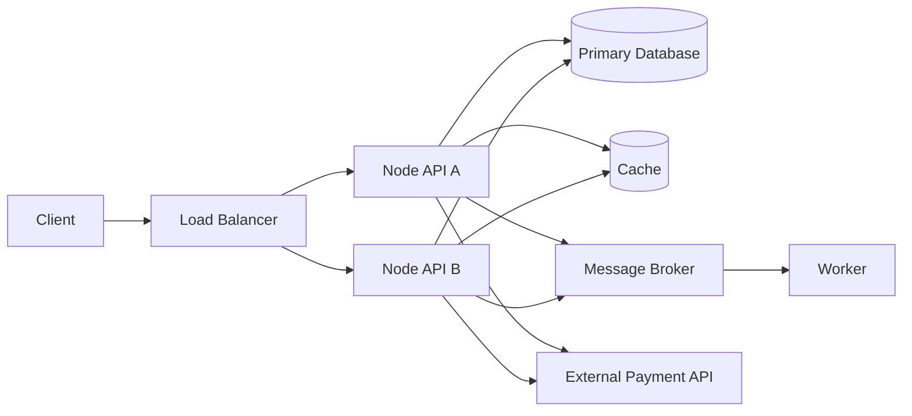
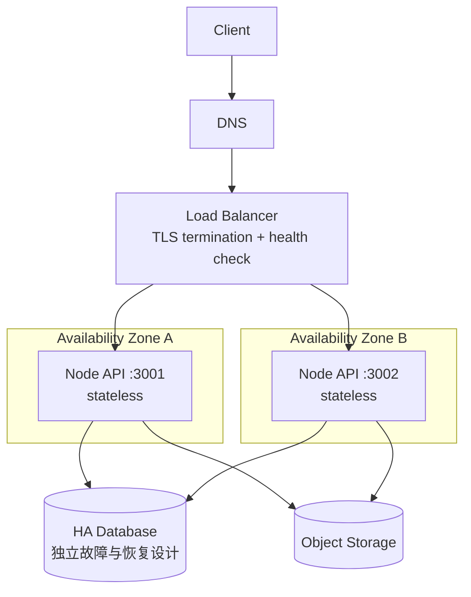

# 生产就绪与架构评审：从 NFR 到 Go/No-Go

开发环境中的“请求成功一次”不能证明系统可以上线。生产就绪评审要回答的是：在明确的负载和故障假设下，系统是否达到业务承诺；失败时能否限制影响、快速定位并安全恢复。

:::note 版本与实验范围
示例面向 **Ubuntu 22.04/24.04 LTS、Node.js 20/22 LTS、Express 4/5 与 Nginx 1.18+**。命令用于本地虚拟机或隔离的测试环境；云负载均衡器、多可用区和托管数据库的具体探针、超时与故障转移语义应以所用云厂商当前文档为准。
:::

## 1. 从功能需求走向 NFR

功能需求描述“用户能创建订单”，非功能需求（Non-Functional Requirements，NFR）描述“在什么负载、延迟、可用性和恢复约束下创建订单”。没有可测量范围的“高可用、低延迟”不能指导架构，也无法用于上线判定。

| 维度 | 可评审的示例 | 必须补充的上下文 |
| :--- | :--- | :--- |
| 可用性 | API 月度成功请求比例目标 99.9% | 哪些状态码算失败、计划维护是否计入 |
| 延迟 | 正常负载下 `/orders` 的 p95 小于 300 ms | 测量点、请求类型、窗口、样本量 |
| 吞吐 | 持续 200 RPS，10 分钟峰值 400 RPS | 请求混合、payload、依赖数据规模 |
| 恢复 | 单应用节点故障 5 分钟内恢复容量 | 探测、摘流、替换分别耗时多少 |
| 数据 | 已确认订单不能静默丢失 | 一致性、RPO/RTO、审计要求 |
| 安全 | 生产管理面只允许受控身份访问 | 身份源、MFA、审计、应急访问 |

:::warning 示例数字不是行业默认值
99.9%、300 ms 和 200 RPS 只是演示如何表达需求，不是推荐值。真实目标来自用户影响、历史流量、依赖能力、预算与合规约束，并需要业务、研发、运维和安全共同确认。
:::

一个最小 NFR 文档应包含：范围、测量方法、目标、排除项、假设、负责人和复审日期。

```yaml
service: orders-api
scope: 'POST /orders，从负载均衡器接收请求到返回响应'
traffic_assumption:
  sustained_rps: 200
  peak_rps: 400
  peak_duration_minutes: 10
latency_objective:
  percentile: 95
  threshold_ms: 300
availability_objective:
  target: 0.999
  window: '30d rolling'
review_date: '2026-09-12'
# 数字仅用于实验，必须用压测与真实分布校准。
```

## 2. 先画依赖图，再谈高可用

架构评审首先要画出同步调用、异步调用、数据存储和外部控制面。每条边至少标记：超时、重试、幂等性、失败影响和责任团队。



### 2.1 依赖清单模板

| 依赖 | 调用类型 | 超时 | 重试条件 | 不可用时行为 | 所有者 |
| :--- | :--- | :--- | :--- | :--- | :--- |
| 数据库 | 同步 | 500 ms | 只重试明确可重试错误 | 写请求失败，读可按策略降级 | Data Team |
| Redis | 同步 | 100 ms | 读操作最多一次 | 回源数据库并限流 | API Team |
| 消息队列 | 异步 | 1 s 入队 | 使用幂等键 | 暂存/拒绝，不假装成功 | Platform |
| 支付 API | 同步外部 | 2 s | 仅幂等请求，指数退避 | 返回可重试状态 | Vendor + API |

超时不能孤立设置。外层请求总预算必须大于内层调用预算与自身处理开销，同时避免多层重试相乘形成重试风暴。

## 3. 故障域、SPOF 与 HA

**故障域**是一组可能被同一事件同时影响的资源，例如同一进程、主机、机架、可用区、区域、账号或 DNS 提供商。两个实例如果位于同一主机，能抵抗进程故障，却不能抵抗主机故障。

**单点故障（SPOF）**是其失败会让关键能力失效、且没有可用替代路径的组件。识别 SPOF 后不一定全部消除：可以接受、冗余、快速恢复或降级，但必须记录业务影响与依据。

| 组件 | 可能故障域 | 当前 SPOF？ | 候选措施 |
| :--- | :--- | :--- | :--- |
| API 单实例 | 进程/主机 | 是 | 两实例，分散到不同故障域 |
| 单 Nginx VM | 主机 | 是 | 托管 LB 或双 LB + 漂移入口 |
| 单数据库主库 | 主机/AZ | 通常是 | 托管 HA、同步/异步副本与已演练切换 |
| 单区域 DNS | 提供商/账号 | 视配置 | 权限隔离、低风险变更、必要时多提供商 |

**HA 不是“有两个副本”**。它至少包含：冗余、故障检测、流量摘除、状态一致性、替换能力和定期演练。数据库复制也不自动等于零数据丢失，复制模式和故障切换决定真实 RPO。

## 4. Node API：双实例 + LB 参考架构



“多 AZ”要求实例及其关键依赖确实落在不同可用区，并确认 LB、网络、数据库和配额的区域级行为。仅给资源名加 `az-a`/`az-b` 不构成验证。

### 4.1 为什么应用要无状态

无状态不是系统没有数据，而是任意 API 实例不依赖本机独占会话或文件才能处理下一次请求。状态应进入有明确一致性、备份与访问控制的外部系统。

| 风险模式 | 问题 | 改进 |
| :--- | :--- | :--- |
| session 存进程内存 | 下一请求落到另一实例即丢失 | 签名 token 或共享 session store |
| 上传写本机目录 | 其他实例看不到，替换节点会丢 | 对象存储 + 数据库元数据 |
| 定时任务每实例都跑 | 扩容后重复执行 | 专用 worker、leader/租约、幂等键 |
| 本地内存缓存作事实源 | 重启后数据不一致 | 只缓存可重建数据，设置 TTL |

粘性会话可临时兼容遗留应用，但会造成负载倾斜并削弱故障转移，不应替代状态外置改造。

## 5. 完整 readiness/liveness Node 示例

下面的应用可直接运行。`/livez` 只证明进程还能响应；`/readyz` 检查是否处于接流状态，并可选探测关键依赖。依赖 URL 为空时适合本地实验。

```json
{
  "name": "readiness-demo",
  "version": "1.0.0",
  "private": true,
  "engines": { "node": ">=20" },
  "scripts": { "start": "node server.mjs" },
  "dependencies": { "express": "5.1.0" }
}
```

```js
// server.mjs
import express from 'express';
import http from 'node:http';

const app = express();
const port = Number(process.env.PORT ?? 3000);
const dependencyUrl = process.env.DEPENDENCY_HEALTH_URL ?? '';
let acceptingTraffic = false;
let shuttingDown = false;

app.disable('x-powered-by');
app.use(express.json({ limit: '100kb' }));

// Liveness 不访问下游：下游故障不应触发所有应用实例被反复重启。
app.get('/livez', (_req, res) => {
  res.status(200).json({ status: 'alive' });
});

async function dependencyReady() {
  if (!dependencyUrl) return { ok: true, mode: 'not-configured' };

  try {
    const response = await fetch(dependencyUrl, {
      signal: AbortSignal.timeout(300),
      headers: { 'user-agent': 'readiness-demo/1.0' },
    });
    return { ok: response.ok, status: response.status };
  } catch (error) {
    // 只返回错误类别，不泄露连接串、token 或内部响应正文。
    return { ok: false, error: error.name };
  }
}

app.get('/readyz', async (_req, res) => {
  if (!acceptingTraffic || shuttingDown) {
    return res.status(503).json({ status: 'not-ready', reason: 'draining' });
  }

  const dependency = await dependencyReady();
  if (!dependency.ok) {
    return res.status(503).json({ status: 'not-ready', dependency });
  }

  return res.status(200).json({ status: 'ready', dependency });
});

app.get('/api/hello', (_req, res) => {
  res.json({ instance: process.env.INSTANCE_ID ?? 'local', message: 'hello' });
});

const server = http.createServer(app);
server.requestTimeout = 10_000;
server.headersTimeout = 12_000;
server.keepAliveTimeout = 5_000;

server.listen(port, '0.0.0.0', () => {
  // 真实应用应在配置校验、连接池初始化与必要预热完成后再置为 true。
  acceptingTraffic = true;
  console.log(JSON.stringify({ level: 'info', event: 'listening', port }));
});

async function shutdown(signal) {
  if (shuttingDown) return;
  shuttingDown = true;
  acceptingTraffic = false; // readiness 立即失败，让 LB 先摘流。
  console.log(JSON.stringify({ level: 'info', event: 'shutdown_start', signal }));

  // 给探针与 LB 一小段时间传播摘流状态；时长需按真实探测周期校准。
  await new Promise((resolve) => setTimeout(resolve, 2_000));

  server.close((error) => {
    if (error) {
      console.error(JSON.stringify({ level: 'error', event: 'shutdown_error', message: error.message }));
      process.exitCode = 1;
    }
    process.exit();
  });

  // 防止长连接或代码缺陷让发布永久挂起。
  setTimeout(() => {
    console.error(JSON.stringify({ level: 'error', event: 'shutdown_forced' }));
    process.exit(1);
  }, 10_000).unref();
}

process.on('SIGTERM', () => void shutdown('SIGTERM'));
process.on('SIGINT', () => void shutdown('SIGINT'));
```

运行与验证：

```bash
mkdir readiness-demo && cd readiness-demo
# 保存 package.json 与 server.mjs 后执行
npm install
INSTANCE_ID=app-a PORT=3001 npm start &
INSTANCE_ID=app-b PORT=3002 npm start &

curl --fail http://127.0.0.1:3001/livez
curl --fail http://127.0.0.1:3001/readyz
curl --fail http://127.0.0.1:3002/api/hello
```

### 5.1 探针设计边界

- liveness 应轻量、稳定，不因共享依赖故障同时重启全部实例；
- readiness 只检查“是否应该接流”的关键条件，设置严格超时；
- `/readyz` 不执行写操作，不做昂贵全表查询；
- 健康端点避免返回版本秘密、连接串、堆栈与内部拓扑；
- 探针成功不等于业务正确，仍需要端到端 SLI 与合成检查。

## 6. Nginx 负载均衡实验配置

```nginx
upstream node_api {
    least_conn;
    server 127.0.0.1:3001 max_fails=2 fail_timeout=10s;
    server 127.0.0.1:3002 max_fails=2 fail_timeout=10s;
    keepalive 32;
}

server {
    listen 8080;
    server_name _;

    location / {
        proxy_pass http://node_api;
        proxy_http_version 1.1;
        proxy_set_header Connection "";
        proxy_set_header Host $host;
        proxy_set_header X-Request-Id $request_id;
        proxy_set_header X-Forwarded-For $proxy_add_x_forwarded_for;
        proxy_set_header X-Forwarded-Proto $scheme;

        proxy_connect_timeout 1s;
        proxy_send_timeout 10s;
        proxy_read_timeout 10s;
    }
}
```

```bash
sudo nginx -t
sudo systemctl reload nginx
for i in {1..6}; do curl -sS http://127.0.0.1:8080/api/hello; echo; done
```

开源 Nginx 的被动失败检测与具体重试行为受指令和请求类型影响；不要假设它会像某些托管 LB 一样主动轮询 `/readyz`。生产中应明确验证所选 LB 的健康检查、连接排空和失败转移语义。

## 7. 容量：先写假设，再算实例数

假设压测在与生产接近的请求混合下得到：

- 单实例在 CPU 70% 上限内可持续处理 `120 RPS`；
- 峰值预测 `300 RPS`；
- 为突发和模型误差保留 30% 裕量；
- 要求失去一个实例后仍承载峰值。

先把目标负载乘以裕量：

$$
R_{required} = 300 \times 1.3 = 390\ RPS
$$

正常容量需要：

$$
N_{normal} = \lceil 390 / 120 \rceil = 4
$$

还要满足 N+1 故障条件，因此部署实例数为 5；失去一个后剩余 4 个，理论容量为 `480 RPS`，高于 `390 RPS`。

```js
// capacity.mjs：把假设显式化，避免口算遗漏 N+1。
const peakRps = 300;
const measuredRpsPerInstance = 120;
const headroom = 0.30;
const toleratedInstanceFailures = 1;

const requiredRps = peakRps * (1 + headroom);
const healthyInstances = Math.ceil(requiredRps / measuredRpsPerInstance);
const deployedInstances = healthyInstances + toleratedInstanceFailures;

console.log({ requiredRps, healthyInstances, deployedInstances });
```

```bash
node capacity.mjs
# { requiredRps: 390, healthyInstances: 4, deployedInstances: 5 }
```

:::warning 公式不是容量证明
单实例 120 RPS 必须来自代表性压测，并同时观察延迟、错误率、事件循环、内存、GC、连接池和下游瓶颈。生产流量分布、缓存命中率、payload 和热点数据变化后，需要重新校准。平均 RPS 会掩盖突发。
:::

## 8. 优雅降级：保住核心路径

降级不是吞掉错误返回假成功，而是在依赖受损时停止非核心工作、限制资源消耗，并向调用方返回诚实且可恢复的结果。

| 场景 | 可接受降级 | 不可接受做法 |
| :--- | :--- | :--- |
| 推荐服务超时 | 隐藏推荐区，返回核心页面 | 让整个首页一直等待 |
| Redis 故障 | 限流回源、必要时拒绝部分请求 | 无限制打爆数据库 |
| 支付状态未知 | 返回处理中，凭幂等键查询 | 重复扣款或直接显示成功 |
| 写库不可用 | 明确 503/可重试语义 | 把数据只存在本机内存并回 200 |

一个带总超时和降级标记的示例：

```js
async function loadRecommendations(userId) {
  try {
    const response = await fetch(`http://recommendation.internal/users/${encodeURIComponent(userId)}`, {
      signal: AbortSignal.timeout(150),
    });
    if (!response.ok) throw new Error(`upstream_status_${response.status}`);
    return { items: await response.json(), degraded: false };
  } catch (error) {
    console.warn(JSON.stringify({
      level: 'warn',
      event: 'recommendation_degraded',
      error_type: error.name,
    }));
    return { items: [], degraded: true };
  }
}
```

降级必须有指标、开关所有者、触发条件和恢复条件；长期降级应被视为故障，而不是新常态。

## 9. 上线 Go/No-Go 检查清单

### 9.1 需求与架构

- [ ] NFR 有范围、测量方法、负责人和复审日期；
- [ ] 依赖图包含同步/异步/数据/第三方边界；
- [ ] 每个关键依赖有超时、重试、幂等和降级策略；
- [ ] SPOF 与故障域已识别，接受的风险有书面依据；
- [ ] 多实例不会因本地 session、文件或重复任务产生错误；
- [ ] 容量模型来自代表性测试，且验证 N+1 场景。

### 9.2 交付与数据

- [ ] 发布对象是可追踪的不可变制品与 digest；
- [ ] 预生产验证的是同一制品，而不是重新构建；
- [ ] 数据库迁移向后兼容，已评估锁和执行时长；
- [ ] 回滚步骤、触发阈值、决策人和时限明确；
- [ ] 备份存在且最近一次恢复演练通过。

### 9.3 运行与响应

- [ ] readiness、liveness 与优雅关闭已在 LB 后验证；
- [ ] dashboard 从用户结果下钻到依赖和资源；
- [ ] 告警有负责人、路由、runbook 和升级路径；
- [ ] 日志不含秘密和不必要个人数据；
- [ ] 值班人员知道如何停发、摘流、降级和回滚；
- [ ] 变更窗口内关键团队可响应。

### 9.4 判定规则

- **Go**：强制项通过，剩余风险有负责人、截止日期和明确接受者；
- **Conditional Go**：只允许低影响、可逆、受监控的例外，并书面记录限制；
- **No-Go**：回滚不可用、数据风险未知、关键监控缺失、容量未验证或高风险负责人缺席。

“项目很急”不是覆盖 No-Go 的技术证据。若业务决定接受风险，也应记录谁在什么信息基础上作出决定。

## 10. 故障演练：停止一个实例

目标：验证 LB 能把流量从故障实例移走，剩余容量满足假设，告警与 runbook 可用。

:::warning 仅在隔离实验环境执行
先确认主机、环境、授权和回滚方式。不要对生产服务直接执行 `kill`、断网或磁盘填充。
:::

```bash
#!/usr/bin/env bash
set -euo pipefail

base_url='http://127.0.0.1:8080'
app_a_pid_file='/tmp/readiness-demo-a.pid'

[[ "$(hostname -s)" == lab-* ]] || {
  echo '拒绝执行：主机名不是 lab-*' >&2
  exit 1
}
[[ -s "$app_a_pid_file" ]] || {
  echo "缺少 PID 文件：$app_a_pid_file" >&2
  exit 1
}

before_failures=0
for _ in {1..20}; do
  curl --fail --silent --max-time 2 "$base_url/api/hello" >/dev/null || ((before_failures+=1))
done

echo "停止 app-a，PID=$(cat "$app_a_pid_file")"
kill -TERM "$(cat "$app_a_pid_file")"
sleep 3

after_failures=0
for _ in {1..50}; do
  curl --fail --silent --max-time 2 "$base_url/api/hello" >/dev/null || ((after_failures+=1))
done

printf 'before_failures=%d after_failures=%d\n' "$before_failures" "$after_failures"
```

演练记录至少回答：

1. 从故障发生到摘流用了多久？期间有多少失败请求？
2. 剩余实例的 CPU、延迟和错误率是否仍在目标内？
3. 告警何时触发，是否路由到正确人员，runbook 是否可执行？
4. 实例恢复后如何预热和重新接流？是否发生流量冲击？
5. 哪项假设被证伪，谁在何时修正？

## 11. 常见误区

- **“两个实例就是 HA”**：如果同主机、同 AZ、同数据库单点，保护范围有限。
- **“探针 200 就能上线”**：探针不覆盖业务语义、容量和数据正确性。
- **“重试能提高可靠性”**：没有预算、退避、抖动和幂等性的重试会放大故障。
- **“自动扩容代替容量规划”**：扩容存在检测和启动延迟，也受配额与下游上限约束。
- **“能回滚应用就安全”**：不可逆 schema 迁移可能让旧版本无法运行。
- **“跨 AZ 一定无损切换”**：网络、复制和控制面都有具体语义，必须以测试证明。

## 12. 评审输出物

一次可追踪的生产就绪评审至少产出：NFR、依赖/数据流图、故障域与 SPOF 表、容量模型及压测报告、降级与回滚方案、Go/No-Go 清单、演练记录、已接受风险及负责人。

这些材料不是为了“过流程”，而是让下一篇[可靠 CI/CD 与发布策略](/posts/linux/reliable-cicd-and-release-strategies)能够把架构约束落实为自动化门禁。


## 附录 A：把超时、重试和总预算画清楚

假设外部 API 总超时预算是 800 ms，应用自身处理预留 100 ms，数据库查询 250 ms，支付依赖 300 ms。剩余预算不能简单地给每层“重试三次”：最坏时间会叠加并超过入口预算。

```mermaid
gantt
  title 800 ms 请求预算示意
  dateFormat X
  axisFormat %L ms
  section Request
  App validation       :0, 100
  Database             :100, 350
  Payment attempt      :350, 650
  Response serialization :650, 750
  Safety margin        :750, 800
```



一个受总 deadline 约束的调用：

```js
async function callPayment(payload, deadlineMs) {
  const remaining = deadlineMs - Date.now();
  if (remaining <= 0) throw new Error('request_deadline_exceeded');

  const timeoutMs = Math.min(300, remaining);
  const response = await fetch('https://payments.example.invalid/charge', {
    method: 'POST',
    headers: {
      'content-type': 'application/json',
      // 幂等键应来自稳定业务操作 ID；这里是占位值。
      'idempotency-key': payload.operationId,
    },
    body: JSON.stringify(payload),
    signal: AbortSignal.timeout(timeoutMs),
  });

  if (!response.ok) throw new Error(`payment_status_${response.status}`);
  return response.json();
}
```

重试只适用于明确的瞬时错误和幂等操作，并加入指数退避与随机抖动。客户端、LB、应用和 SDK 多层重试会相乘，评审时必须统计完整调用树的最大尝试次数。

## 附录 B：NFR 到测试的追踪矩阵

| NFR | 验证方法 | 通过条件 | 证据 | 复验触发 |
| :--- | :--- | :--- | :--- | :--- |
| 峰值 400 RPS | 代表性负载测试 | 延迟/错误/资源均在目标内 | 报告与原始结果 | 查询模型或实例规格变化 |
| 单节点故障 | 预生产故障注入 | 影响不超出约定 | 时间线、SLI 图 | LB/探针配置变化 |
| 30 天 99.9% | SLI 回放与规则测试 | 公式、缺失数据处理正确 | PromQL 与单元测试 | 指标 schema 变化 |
| RTO 30 分钟 | 全新环境恢复 | 业务核验在 30 分钟内完成 | 恢复报告 | 数据量显著变化 |

矩阵避免“需求写在文档、测试验证另一件事”。每一项都要有负责人和最近证据日期。

## 附录 C：基础压测脚本与解释

下面 Node 脚本不依赖第三方压测工具，适合验证实验入口与粗略观察错误；它不是严谨性能测试器，不能替代固定请求分布、连接模型、预热、资源采样和统计分析。

```js
// load.mjs
const target = process.env.TARGET ?? 'http://127.0.0.1:8080/api/hello';
const concurrency = Number(process.env.CONCURRENCY ?? 10);
const durationMs = Number(process.env.DURATION_MS ?? 30_000);
const deadline = Date.now() + durationMs;
const latencies = [];
let ok = 0;
let failed = 0;

async function worker() {
  while (Date.now() < deadline) {
    const start = performance.now();
    try {
      const response = await fetch(target, { signal: AbortSignal.timeout(2_000) });
      await response.arrayBuffer();
      response.ok ? ok++ : failed++;
    } catch {
      failed++;
    } finally {
      latencies.push(performance.now() - start);
    }
  }
}

await Promise.all(Array.from({ length: concurrency }, () => worker()));
latencies.sort((a, b) => a - b);
const percentile = (p) => latencies[Math.min(latencies.length - 1, Math.floor(latencies.length * p))];
console.log({
  requests: ok + failed,
  ok,
  failed,
  p50_ms: percentile(0.50),
  p95_ms: percentile(0.95),
  elapsed_s: durationMs / 1000,
});
```

```bash
TARGET=http://127.0.0.1:8080/api/hello \
CONCURRENCY=20 \
DURATION_MS=60000 \
node load.mjs
```

结果解释必须同时关联服务端指标。客户端 p95 正常而服务端 CPU 95% 可能意味着已经没有突发余量；平均吞吐高但 1% 请求超时也可能不满足 SLO。

## 附录 D：多 AZ 失效演练设计

直接关闭整个可用区通常超出团队权限和实验成本，可以先做分层演练：

1. 停止一个进程，验证进程级故障；
2. 停止一台 VM，验证主机级故障；
3. 在预生产阻断一个 AZ 子网到 LB 的路径，验证区域分布；
4. 使用云厂商支持的故障注入能力模拟目标事件；
5. 最后在审批下执行完整灾难恢复演练。

每层都定义 blast radius、停止条件与观察信号：

```yaml
experiment: az-a-app-isolation
scope: staging-only
steady_state:
  - external_success_ratio_above: 0.999
  - app_b_cpu_below: 0.70
fault:
  target: app-a-network
  duration_seconds: 120
abort_if:
  - external_error_ratio_above: 0.01
  - database_connections_above: 0.90
owner: platform-team
```

YAML 是实验契约，不代表某个故障注入工具会自动理解这些字段。执行器必须由团队明确实现和审查。

## 附录 E：架构评审记录模板

```md
# Production Readiness Review

## 范围
服务、版本、入口、关键用户旅程、明确排除项。

## NFR
SLI/SLO、延迟、吞吐、数据、RPO/RTO、安全与合规。

## 依赖与故障域
同步/异步依赖、超时、重试、幂等、SPOF、跨 AZ 证据。

## 容量
请求模型、数据规模、压测版本、单实例安全容量、N+1、配额。

## 发布与恢复
制品 digest、迁移、健康门禁、回滚、备份恢复证据。

## 运行
Dashboard、告警、runbook、值班、升级和故障演练。

## 决定
Go / Conditional Go / No-Go；决定人、时间、证据链接。

## 接受风险
风险、业务影响、临时控制、负责人、到期日期。
```

评审材料需要随架构变化更新。缓存从可选依赖变成关键事实源、数据库换复制模式、入口跨区域等变化，都应触发重新评审，而不是沿用旧的 Go 结论。