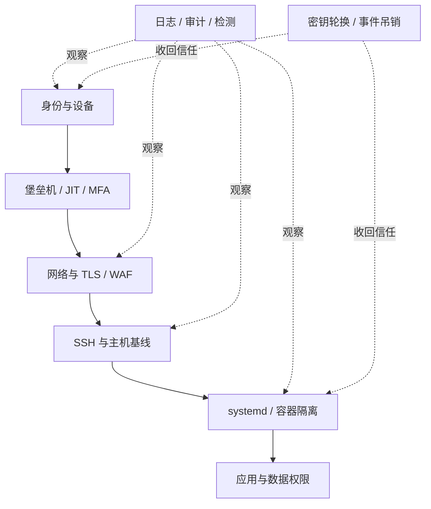
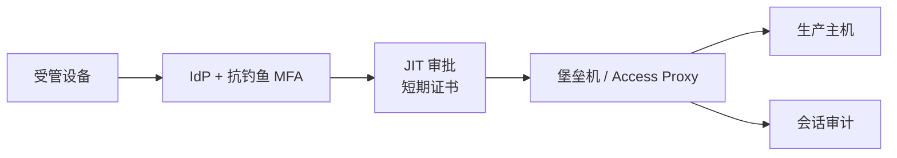
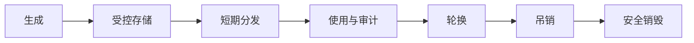
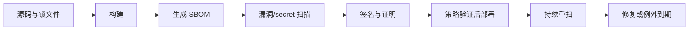

# 生产安全基线：从身份、主机到容器与供应链

生产安全不是安装一个防护软件，而是用多层控制把“攻击者拿到一个入口”限制为“仍然无法扩大影响”。有效基线应回答四个问题：**谁能访问、能做什么、系统如何保持可信、出事后怎样迅速撤销信任**。

本文以 **Ubuntu 22.04/24.04 LTS、OpenSSH 8.9+、systemd 249+、Docker Engine 24+ 与 Compose v2** 为示例。RHEL 系列需要将 AppArmor 对应为 SELinux、`apt` 对应为 `dnf`。具体加固项必须结合业务兼容性和组织风险评估验证，不能机械套用。

:::warning 先保证不会把自己锁在门外
调整 SSH、sudo、防火墙或身份策略前，保留一个已验证的独立管理会话和云控制台/带外访问；先运行语法检查，再灰度到非关键主机。安全配置错误同样会造成生产中断。
:::

<ProgressIndicator
  current="linux/production-security-baseline"
  items={[
    { slug: "linux/database-production-operations", title: "生产数据库运维" },
    { slug: "linux/backup-restore-and-disaster-recovery", title: "备份、恢复与灾难恢复" },
    { slug: "linux/production-security-baseline", title: "生产安全基线" },
    { slug: "linux/incident-response-and-oncall", title: "事件响应与值班" },
  ]}
/>

## 1. 用分层防御理解安全基线

安全基线不是一张“打勾即安全”的表，而是一组默认控制。它的目标是：减少入口、限制权限、缩短暴露窗口、提高可见性，并在身份失陷时快速撤销信任。



一个控制失效时，下一层应继续限制影响。例如开发者凭据泄漏后，MFA 降低直接登录概率；JIT 让长期权限不存在；堡垒机限制来源；主机最小权限阻止横向移动；审计则支持快速发现和吊销。

## 2. 资产、数据与信任边界

无法盘点的资产无法加固。最小资产清单应包含：

| 字段 | 示例 |
|---|---|
| 资产 ID / 负责人 | `prod-api-01` / payments-team |
| 环境与重要性 | production / critical |
| OS 与生命周期 | Ubuntu 24.04 LTS / 支持至组织规定日期 |
| 暴露面 | 443 公网，22 仅管理网 |
| 身份入口 | IdP + MFA + bastion |
| 数据分类 | 机密、个人数据、支付元数据 |
| 补丁组 | critical-linux-weekly |
| 日志去向 | central-siem-prod |
| 备份与恢复等级 | RPO 5m / RTO 1h |

每季度对云账号、DNS、证书、镜像仓库、Git 组织、CI runner、主机和数据库做一次“所有者为空”检查。没有所有者的资产应隔离或下线，而不是无限期保留。

## 3. IAM：最小权限从“默认拒绝”开始

### 3.1 人员身份与工作负载身份分离

- 人员通过企业 IdP、MFA 和短期会话访问；
- 应用使用 workload identity、实例角色或短期令牌；
- 禁止多人共享账号和长期云访问密钥；
- 机器账号不能交互登录，人员账号不能被应用使用；
- 权限绑定角色/组，不直接散落在个人账号；
- 离职、转岗、休假和供应商到期有自动回收流程。

```text
错误：应用读取某位工程师的永久 Access Key
正确：运行平台向应用签发短期身份，仅允许读取指定 secret

错误：所有运维人员永久拥有 production-admin
正确：默认只读；需要变更时经审批获得 60 分钟 JIT 角色
```

### 3.2 用权限矩阵审查最小权限

| 主体 | 资源 | 允许动作 | 条件 | 时效 |
|---|---|---|---|---|
| oncall-read | 生产日志/指标 | read | 公司设备 + MFA | 常驻 |
| db-migrator | 指定 schema | DDL | 工单 + 维护窗口 | 60 分钟 |
| backup-agent | 数据库/备份入口 | read + append | 指定主机身份 | 自动轮换 |
| incident-admin | 生产控制面 | restricted admin | P1/P2 + 双人审批 | 90 分钟 |

每条权限都要能回答：为何需要、谁批准、何时过期、日志在哪里。权限审查不应只看“是否使用过”，还要确认动作和资源范围能否继续缩小。

## 4. sudo：可审计的本机提权

### 4.1 不给整组无限 root

用 `/etc/sudoers.d/` 定义命令白名单，必须通过 `visudo` 创建和校验。

```sudoers
# /etc/sudoers.d/oncall-myapp
# 适用于 sudo 1.9.x。命令路径必须与目标系统 `command -v` 结果一致。

User_Alias MYAPP_ONCALL = alice, bob
Cmnd_Alias MYAPP_STATUS = \
    /usr/bin/systemctl status myapp.service, \
    /usr/bin/journalctl -u myapp.service *, \
    /usr/bin/systemctl restart myapp.service

# 记录输入/输出；日志存储和隐私策略需另行配置。
Defaults!MYAPP_STATUS log_input, log_output

# restart 有生产影响，是否免密应按组织策略决定；此处要求再次认证。
MYAPP_ONCALL ALL=(root) MYAPP_STATUS
```

安全安装：

```bash
sudo visudo -f /etc/sudoers.d/oncall-myapp
sudo chmod 440 /etc/sudoers.d/oncall-myapp
sudo visudo -c
sudo -l -U alice
```

:::warning sudoers 通配符风险
sudo 对参数通配符的匹配可能比预期宽，某些命令还能通过编辑器、分页器、插件、配置文件或路径参数逃逸到 shell。优先调用参数固定的 root-owned 包装脚本，并用测试账号验证无法越权。
:::

包装脚本示例：

```bash
#!/usr/bin/env bash
# /usr/local/sbin/restart-myapp，属主 root:root，权限 0755
set -Eeuo pipefail

/usr/bin/systemctl restart myapp.service
/usr/bin/systemctl --quiet is-active myapp.service
/usr/bin/logger -t myapp-admin \
  "service restarted by sudo_user=${SUDO_USER:-unknown}"
```

对应 sudoers 只允许 `/usr/local/sbin/restart-myapp`，避免开放任意 `systemctl` 参数。

## 5. 堡垒机、JIT 与 MFA

生产 SSH 推荐路径：



核心要求：

1. 堡垒机不是共享跳板账号，每个会话保持个人身份；
2. 使用短期 SSH 证书或动态账号，不分发永久私钥；
3. 管理入口只允许受管设备和管理网络；
4. 高风险权限需要 JIT、审批、自动过期；
5. MFA 优先 FIDO2/WebAuthn 等抗钓鱼方式；
6. break-glass 账号离线保管、双人启用、每次使用后轮换并复盘。

## 6. SSH 基线：先验证，再切换

下面配置适用于 Ubuntu 22.04/24.04 的 OpenSSH 8.9+。发行版默认值和支持算法可能不同，先执行 `sshd -T` 查看实际生效值。

```conf
# /etc/ssh/sshd_config.d/60-production-baseline.conf

# 禁止 root 与口令登录，改用个人身份 + sudo。
PermitRootLogin no
PasswordAuthentication no
KbdInteractiveAuthentication no
PubkeyAuthentication yes

# 若使用 OpenSSH CA，配置组织 CA 公钥；路径由 root 管理。
TrustedUserCAKeys /etc/ssh/trusted-user-ca-keys.pem

# 只允许受控组登录。
AllowGroups ssh-production

# 限制会话与认证尝试。
LoginGraceTime 30
MaxAuthTries 3
MaxSessions 4
ClientAliveInterval 300
ClientAliveCountMax 2

# 管理主机通常不需要这些转发能力；确有需求时按组 Match 放行。
AllowAgentForwarding no
AllowTcpForwarding no
X11Forwarding no
PermitTunnel no
GatewayPorts no
PermitUserEnvironment no

# 显式记录认证事件。
LogLevel VERBOSE

# SFTP 使用进程内实现，减少外部依赖。
Subsystem sftp internal-sftp
```

部署步骤：

```bash
# 1. 保留当前已登录管理会话，不要关闭
sudo install -o root -g root -m 644 \
  60-production-baseline.conf \
  /etc/ssh/sshd_config.d/60-production-baseline.conf

# 2. 语法检查；无输出且退出码 0 才继续
sudo sshd -t

# 3. 查看关键项最终值，识别被其他片段覆盖的配置
sudo sshd -T | grep -E \
  'permitrootlogin|passwordauthentication|kbdinteractiveauthentication|allowgroups|allowtcpforwarding'

# 4. reload 不终止现有连接
sudo systemctl reload ssh

# 5. 从新的终端验证个人密钥/证书登录和 sudo
ssh -o PreferredAuthentications=publickey user@host
```

:::warning 不要盲目复制算法列表
加密算法建议会随 OpenSSH 版本变化。发行版安全团队通常会维护合理默认值；硬编码过时算法列表反而可能阻止未来升级。只有合规要求明确且经过兼容测试时才覆盖 `Ciphers`、`MACs` 和 `KexAlgorithms`。
:::

网络层还应让 22 端口仅从堡垒机/管理网可达。更改端口不能提供实质安全，只能减少日志噪声。

## 7. Secrets：存储、使用与轮换

秘密包括数据库密码、API token、TLS 私钥、SSH CA 密钥、签名密钥和恢复密钥。生命周期必须覆盖：



### 7.1 基线规则

- 不进入 Git、镜像层、工单、聊天、命令参数和应用日志；
- 应用按启动/请求动态取得，优先短期凭据；
- 每个服务、环境和租户使用独立 secret，限制爆炸半径；
- secret 文件由专用用户读取，通常权限 0400/0600；
- 轮换支持双版本重叠：先发布新值、切换消费者、验证、再撤销旧值；
- 对读取、失败、管理员导出和策略变更告警。

### 7.2 零停机数据库密码轮换

```text
1. 创建/启用新凭据版本 B，保留 A。
2. 把 B 发布到密钥系统，应用刷新连接池。
3. 观察所有实例使用 B 建立新连接。
4. 等待旧连接自然退出或有序重建。
5. 撤销 A，并观察认证失败指标。
6. 更新轮换时间、负责人和异常记录。
```

若数据库账号不支持多密码，可创建新账号并复制最小权限，切换后删除旧账号。删除前先确认没有遗留客户端。

## 8. 补丁与漏洞管理

补丁不是“自动更新全部”或“永不更新”的二选一，而是风险驱动的流水线：

```text
资产与版本清单 -> 漏洞情报 -> 可达性/利用评估 -> 测试环境
-> canary 主机 -> 分批生产 -> 健康验证 -> 必要时回滚
```

建议时限示例需由组织批准：已知在野利用的互联网暴露严重漏洞 24～72 小时，其他 critical 7 天，high 30 天。无法按时修复时必须有隔离、WAF 规则、关闭功能等补偿控制和到期日。

Ubuntu 安全更新配置示例：

```conf
// /etc/apt/apt.conf.d/52production-security
APT::Periodic::Update-Package-Lists "1";
APT::Periodic::Unattended-Upgrade "1";

Unattended-Upgrade::Allowed-Origins {
    "${distro_id}:${distro_codename}-security";
};

// 关键生产主机不应在未知时间自动重启。
Unattended-Upgrade::Automatic-Reboot "false";
Unattended-Upgrade::Remove-Unused-Dependencies "true";
```

```bash
# 先在 canary 主机模拟
sudo unattended-upgrade --dry-run --debug

# 查看需要重启的服务/主机（Ubuntu 工具可用性依安装包而定）
if command -v needrestart >/dev/null; then
  sudo needrestart -r l
fi
```

内核、OpenSSL、glibc、数据库和容器运行时更新后要安排重启/服务重载与验证。只“安装包成功”不等于修复已加载进内存的旧库。

## 9. TLS、边界与 WAF

### 9.1 TLS 基线

- 公网服务仅提供 TLS 1.2/1.3，优先 TLS 1.3；
- 自动签发、续期、到期告警和私钥权限；
- 内部高价值服务考虑 mTLS 与工作负载身份；
- 证书覆盖域名、链、OCSP/吊销策略按客户端生态验证；
- 不在负载均衡终止后用明文跨越不可信网络。

Nginx 示例适用于 Nginx 1.18+，具体 cipher 应结合 OpenSSL 版本和客户端矩阵测试：

```nginx
server {
    listen 443 ssl http2;
    server_name api.example.com;

    ssl_certificate     /etc/letsencrypt/live/api.example.com/fullchain.pem;
    ssl_certificate_key /etc/letsencrypt/live/api.example.com/privkey.pem;
    ssl_protocols TLSv1.2 TLSv1.3;
    ssl_session_timeout 1d;
    ssl_session_cache shared:TLS:10m;
    ssl_session_tickets off;

    add_header Strict-Transport-Security "max-age=31536000" always;
    add_header X-Content-Type-Options "nosniff" always;
    add_header Referrer-Policy "strict-origin-when-cross-origin" always;

    location / {
        proxy_pass http://app_backend;
        proxy_set_header Host $host;
        proxy_set_header X-Request-ID $request_id;
        proxy_set_header X-Forwarded-Proto https;
    }
}
```

HSTS 上线前必须确认所有子域和 HTTP 兼容性；`includeSubDomains`/`preload` 不应未经盘点直接启用。

### 9.2 WAF 的边界

WAF 可用于托管规则、速率限制、虚拟补丁和机器人流量治理，但不是修复应用漏洞的替代品：

| 能做 | 不能保证 |
|---|---|
| 阻挡已知模式与异常速率 | 理解所有业务授权逻辑 |
| 临时缓解已知 CVE | 替代补丁和代码修复 |
| 提供边界请求日志 | 发现内部横向移动 |
| 限制上传大小和方法 | 阻止合法账号滥用 |

规则应先观察模式、再灰度阻断，并监控误报率。紧急规则必须有负责人、到期日和移除条件。

## 10. 主机基线

### 10.1 最小化与文件权限

```bash
# 监听端口与进程
sudo ss -lntup

# 启用服务清单
systemctl list-unit-files --state=enabled

# 查找无属主文件，先审阅，不自动删除
sudo find / -xdev \( -nouser -o -nogroup \) -print

# 查找 SUID/SGID，建立允许清单后再处理
sudo find / -xdev -type f \( -perm -4000 -o -perm -2000 \) -print

# 检查关键目录权限
namei -l /etc/ssh/sshd_config.d/60-production-baseline.conf
```

原则：只安装运行需要的软件；移除编译器、调试器与不用的守护进程；`/tmp`、上传目录等按兼容性考虑 `nodev,nosuid,noexec`；为服务使用独立 Unix 用户；启用 AppArmor/SELinux，不把权限问题通过关闭 MAC “解决”。

### 10.2 sysctl 网络基线示例

```conf
# /etc/sysctl.d/60-production-security.conf
# 这些值适用于普通非路由主机；网关、Kubernetes 节点需单独评估。
net.ipv4.conf.all.accept_redirects = 0
net.ipv4.conf.default.accept_redirects = 0
net.ipv4.conf.all.send_redirects = 0
net.ipv4.conf.default.send_redirects = 0
net.ipv4.conf.all.accept_source_route = 0
net.ipv4.conf.default.accept_source_route = 0
net.ipv4.icmp_echo_ignore_broadcasts = 1
net.ipv4.tcp_syncookies = 1
kernel.kptr_restrict = 2
kernel.dmesg_restrict = 1
fs.protected_hardlinks = 1
fs.protected_symlinks = 1
```

```bash
sudo sysctl --system
sysctl net.ipv4.conf.all.accept_redirects kernel.kptr_restrict
```

:::warning 不要在容器节点机械套用
Kubernetes、服务网格、路由器和高性能网络可能依赖转发、bridge netfilter 或特定内核参数。先在相同角色的 canary 节点验证网络和回滚。
:::

## 11. systemd 服务加固

适用于 systemd 249+ 的示例：

```ini
# /etc/systemd/system/myapp.service
[Unit]
Description=Production application
After=network-online.target
Wants=network-online.target

[Service]
Type=simple
User=myapp
Group=myapp
WorkingDirectory=/opt/myapp
ExecStart=/usr/bin/node /opt/myapp/server.js
Restart=on-failure
RestartSec=5s

# 只从 root 管理的 0600 文件读取；更优方案是 systemd credentials/密钥代理。
EnvironmentFile=/etc/myapp/myapp.env

# 权限与命名空间隔离
NoNewPrivileges=true
PrivateTmp=true
PrivateDevices=true
ProtectSystem=strict
ProtectHome=true
ProtectKernelTunables=true
ProtectKernelModules=true
ProtectKernelLogs=true
ProtectControlGroups=true
ProtectClock=true
RestrictSUIDSGID=true
LockPersonality=true
MemoryDenyWriteExecute=true

# 限制能力、地址族和可写路径
CapabilityBoundingSet=
AmbientCapabilities=
RestrictAddressFamilies=AF_UNIX AF_INET AF_INET6
ReadWritePaths=/var/lib/myapp /var/log/myapp
UMask=0077

# 资源边界，数值按压测结果调整
LimitNOFILE=65536
MemoryMax=1G
TasksMax=512

[Install]
WantedBy=multi-user.target
```

验证而不是直接重启：

```bash
sudo systemd-analyze verify /etc/systemd/system/myapp.service
systemd-analyze security myapp.service
sudo systemctl daemon-reload
sudo systemctl restart myapp.service
sudo systemctl is-active myapp.service
sudo journalctl -u myapp.service --since '5 minutes ago'
```

`MemoryDenyWriteExecute` 可能与 JIT 运行时、某些语言或 APM agent 冲突；`PrivateDevices` 可能影响硬件访问。逐项启用并记录例外，不要为通过评分而破坏服务。

## 12. 审计与日志

安全日志至少覆盖：

- IdP 登录、MFA、角色授予和 JIT 审批；
- SSH 登录、sudo、break-glass 使用；
- 云控制面、IAM、KMS、网络和对象存储策略变更；
- secret 读取、轮换、失败与管理员导出；
- 容器编排 API、镜像拉取和部署变更；
- 数据库登录、权限、DDL 和高风险查询；
- WAF、反向代理、应用认证和管理操作。

日志应集中存储、传输加密、限制修改/删除、时间同步，并避免记录密码、token、完整支付数据等秘密。

`auditd` 规则示例适用于 Ubuntu 的 audit 子系统：

```text
# /etc/audit/rules.d/60-production.rules
-w /etc/sudoers -p wa -k sudoers_changes
-w /etc/sudoers.d/ -p wa -k sudoers_changes
-w /etc/ssh/sshd_config -p wa -k sshd_changes
-w /etc/ssh/sshd_config.d/ -p wa -k sshd_changes
-w /etc/systemd/system/ -p wa -k systemd_changes
-w /usr/local/bin/ -p wa -k local_binary_changes
-w /usr/local/sbin/ -p wa -k local_binary_changes
```

```bash
sudo augenrules --check
sudo augenrules --load
sudo auditctl -s
sudo ausearch -k sshd_changes --start today
```

审计规则过多会产生大量噪声和性能成本。应围绕高价值事件设计，并验证告警有人处理。

:::note Fail2ban 与 rkhunter 的正确定位
Fail2ban 可减少重复登录尝试和日志噪声，`rkhunter`/`chkrootkit` 可提供有限的启发式信号，但它们都不是核心防线。核心仍是强身份与 MFA、关闭口令登录、网络限制、最小权限、补丁、MAC、集中审计、不可变基础设施和可信重建。已获 root 的攻击者可能欺骗主机内检测工具。
:::

## 13. Docker 权限边界

### 13.1 Docker 组近似 root

能访问 Docker daemon 的用户通常可以挂载宿主机 `/`、启动特权容器并读取宿主机文件，因此 **`docker` 组权限近似 root**。不要把普通开发者加入生产主机的 docker 组。

```bash
# 审查 docker 组成员
getent group docker

# 审查 daemon socket 权限
stat /var/run/docker.sock
```

优先方案：通过受控部署系统操作 daemon；需要非 root 容器管理时评估 rootless Docker；不要把 `/var/run/docker.sock` 挂进应用容器。

### 13.2 非 root 镜像

```dockerfile
# syntax=docker/dockerfile:1.7
FROM node:22.11.0-bookworm-slim AS build
WORKDIR /src
COPY package*.json ./
RUN npm ci --ignore-scripts
COPY . .
RUN npm run build && npm prune --omit=dev

FROM node:22.11.0-bookworm-slim
ENV NODE_ENV=production
WORKDIR /app

# 使用镜像内预置的非 root node 用户。
COPY --from=build --chown=node:node /src/package*.json ./
COPY --from=build --chown=node:node /src/node_modules ./node_modules
COPY --from=build --chown=node:node /src/dist ./dist

USER node
EXPOSE 3000
CMD ["node", "dist/server.js"]
```

生产中应把基础镜像固定为 digest，并通过自动化更新工具提交受审查的升级，而不是长期使用漂移的 tag。

### 13.3 Docker Compose 加固示例

适用于 Docker Compose v2：

```yaml
services:
  app:
    # 生产替换为内部仓库和经过验证的不可变 digest。
    image: registry.example.com/myapp@sha256:REPLACE_WITH_VERIFIED_DIGEST
    user: "10001:10001"
    init: true
    read_only: true

    # 默认移除全部 Linux capabilities，再按真实需求最小添加。
    cap_drop:
      - ALL
    security_opt:
      - no-new-privileges:true
      # 使用 Docker 默认 seccomp，或引用经过测试的自定义 profile。
      - seccomp=default

    tmpfs:
      - /tmp:rw,noexec,nosuid,nodev,size=64m,mode=1777
      - /run:rw,noexec,nosuid,nodev,size=16m,mode=755

    # 不暴露到所有网卡，只供宿主机反向代理访问。
    ports:
      - "127.0.0.1:3000:3000"

    environment:
      NODE_ENV: production
    secrets:
      - db_password

    pids_limit: 256
    mem_limit: 1g
    cpus: 1.5
    restart: unless-stopped
    stop_grace_period: 30s

    healthcheck:
      test: ["CMD", "node", "dist/healthcheck.js"]
      interval: 30s
      timeout: 3s
      retries: 3
      start_period: 20s

    networks:
      - app_internal

secrets:
  db_password:
    # 本地 Compose secret 是只读文件挂载，不等同于完整秘密管理系统。
    file: /etc/myapp/secrets/db_password

networks:
  app_internal:
    internal: true
```

注意：Compose 的 `internal: true` 会阻止外部连通；若应用确需访问外部 API，应设计显式出口代理或单独网络。`seccomp=default` 的具体语法与运行时版本有关，部署前执行 `docker compose config` 并在目标版本验证。

```bash
# 静态展开和语法校验，不启动服务
docker compose config --quiet

# 检查最终配置中是否误挂载 daemon socket 或特权模式
docker compose config | grep -E \
  'privileged: true|/var/run/docker.sock' && exit 1 || true
```

### 13.4 容器基线清单

```text
[ ] USER 非 root，运行 UID/GID 明确
[ ] root filesystem read-only，仅最小 tmpfs/volume 可写
[ ] cap_drop: ALL，无 privileged
[ ] no-new-privileges 与默认/定制 seccomp
[ ] 不挂载 Docker socket、宿主机根目录或敏感路径
[ ] 资源、PID、文件描述符与优雅退出限制
[ ] secret 通过受控文件/代理，不进入 image/env dump
[ ] 网络按服务分段，入口和出口最小化
[ ] 健康检查不泄漏敏感数据
[ ] 日志有大小/速率限制并集中采集
```

## 14. 镜像扫描、SBOM 与签名

### 14.1 扫描不是一次性门禁

镜像在构建时无漏洞，第二天也可能因新 CVE 变为高风险。流程应包含：



以 Syft、Grype、Cosign 为例；命令语法需按组织固定版本验证：

```bash
# 生成 CycloneDX JSON SBOM
syft registry.example.com/myapp@sha256:... \
  -o cyclonedx-json > myapp.sbom.cdx.json

# 扫描固定 digest，严重漏洞让流水线失败
grype registry.example.com/myapp@sha256:... \
  --fail-on high

# 使用无密钥 OIDC 或受保护 KMS 签名；这里展示验证而非私钥分发
cosign verify \
  --certificate-identity-regexp='^https://github.com/example/myapp/' \
  --certificate-oidc-issuer='https://token.actions.githubusercontent.com' \
  registry.example.com/myapp@sha256:...
```

SBOM 要与镜像 digest、源码提交、构建器身份和部署记录关联。漏洞例外必须说明可达性、补偿控制、负责人和到期日，不能永久忽略。

## 15. 软件供应链

供应链基线覆盖：

- 保护分支、强制评审和签名/可追溯提交；
- 锁定依赖与 action/plugin 版本，优先固定 commit/digest；
- CI runner 隔离，不让不可信 PR 接触生产 secret；
- 构建环境短生命周期、最小网络与最小权限；
- 制品一次构建、多环境提升，不在生产重建；
- 生成 provenance/SBOM，签名并在部署时验证；
- registry 禁止覆盖 tag，生产按 digest 部署；
- 依赖混淆防护、私有 namespace 与 registry 显式配置；
- 定期轮换 CI、registry 和签名身份。

CI 示例片段：

```yaml
permissions:
  contents: read
  id-token: write

jobs:
  build:
    runs-on: ubuntu-24.04
    steps:
      - uses: actions/checkout@11bd71901bbe5b1630ceea73d27597364c9af683
      - name: Install dependencies exactly from lockfile
        run: npm ci --ignore-scripts
      - name: Test
        run: npm test
      - name: Build
        run: docker build --pull --tag "$IMAGE" .
      - name: Scan source for accidentally committed secrets
        run: secret-scanner --redact .
```

示例 SHA 仅表达“固定到完整 commit”的做法，实际使用前应核对官方 action 当前可信版本和 commit。第三方 Action 本质上是在 runner 上执行代码，必须像依赖一样评审。

## 16. 事件中的密钥吊销

当凭据疑似泄漏，优先限制影响，而不是等待完整根因。吊销顺序依资产而定：

```text
1. 宣布安全事件，冻结非必要身份/策略变更。
2. 识别 secret 类型、权限、使用者、日志与最后可信时间。
3. 禁用或缩小泄漏凭据；必要时隔离受影响 workload。
4. 创建新凭据，发布到合法消费者并验证。
5. 撤销所有旧会话、刷新令牌和派生凭据。
6. 查找该身份访问过的其他 secret，处理横向影响。
7. 搜索 Git 历史、镜像层、日志、缓存和工单中的副本。
8. 保全审计证据，监控旧凭据继续使用的尝试。
9. 事件结束后修复产生、分发和扫描流程。
```

不同 secret 的动作：

| 类型 | 立即动作 | 后续检查 |
|---|---|---|
| 云 Access Key | disable，再删除 | Cloud audit、派生 token、跨账号角色 |
| 数据库密码 | 启用新版本、切池、撤旧 | 查询审计、导出量、权限范围 |
| TLS 私钥 | 换证与私钥，按风险吊销 | CDN/LB/主机副本、证书透明日志 |
| SSH 私钥 | 移除公钥/吊销证书 | authorized_keys、堡垒机会话、sudo |
| 签名密钥 | 停签、撤信任、换根 | 已签制品清单、部署策略、下游缓存 |
| CI token | 撤销、换 runner 身份 | workflow 日志、制品与发布历史 |

详细响应角色和模板见《[事件响应与值班](/posts/linux/incident-response-and-oncall)》。

## 17. 基线落地：从审计到持续验证

<Steps>
### 建立基线即代码

把 sshd 片段、sudoers、sysctl、systemd、audit 规则和容器策略放入受保护配置仓库，配套 schema/语法测试。

### 在测试与 canary 验证

验证登录、sudo、服务启动、网络、性能、日志和回滚。每次只改变一类控制。

### 分批部署

按非关键主机、单个可用区、部分生产、全量推进，每阶段设错误率和可用性门禁。

### 持续检测漂移

定期比较实际状态与声明基线；对人工例外要求工单、负责人、原因和到期日。

### 用事件反馈基线

每次事件和演练都应回答：哪个预防/检测/恢复控制失效，是否需要修改默认基线。
</Steps>

可审计检查脚本示例：

```bash
#!/usr/bin/env bash
# production-baseline-check.sh：只读检查，不自动修复
set -Eeuo pipefail

failures=0

check() {
  local description="$1"
  shift
  if "$@"; then
    printf 'PASS %s\n' "$description"
  else
    printf 'FAIL %s\n' "$description"
    failures=$((failures + 1))
  fi
}

has_sshd_setting() {
  local expected="$1"
  sudo sshd -T | grep -Fqx -- "${expected}"
}

is_time_synced() {
  [[ "$(timedatectl show -p NTPSynchronized --value)" == "yes" ]]
}

check "sshd syntax" sudo sshd -t
check "root login disabled" has_sshd_setting "permitrootlogin no"
check "password auth disabled" \
  has_sshd_setting "passwordauthentication no"
check "auditd active" systemctl --quiet is-active auditd
check "time sync active" is_time_synced

# 报告 docker 组成员；是否允许由组织策略判断。
printf 'INFO docker_group=%s\n' "$(getent group docker || true)"
printf 'SUMMARY failures=%d\n' "${failures}"
exit "${failures}"
```

脚本只读取状态，不自动“修复”主机；这样既不会在审计时制造未审批变更，也便于把失败项交给配置管理系统处理。实际落地前仍应经过 ShellCheck、单元测试和目标系统试运行。

## 18. 常见误区

### “改 SSH 端口就安全了”

只能减少扫描噪声，无法替代密钥/证书、MFA、管理网络和最小权限。

### “在 docker 组里不是 root”

错误。Docker daemon 通常以 root 运行，能控制它就能通过挂载和特权配置控制宿主机。

### “容器里是非 root 就够了”

还需要只读文件系统、capabilities、seccomp、无特权、资源边界、网络分段和安全挂载。

### “镜像扫描无 high 就可信”

扫描器可能漏报，也不理解业务漏洞、构建器身份和制品替换。需要 SBOM、签名、provenance 和部署验证。

### “装 Fail2ban/rkhunter 就完成安全加固”

它们只是辅助信号。强身份、补丁、最小权限、隔离和审计才是核心。

### “秘密从 Git 删除就没事了”

历史、fork、CI 日志、镜像层和缓存仍可能保留副本。必须先吊销，再清理与调查。

## 19. 生产安全基线清单

```text
身份：
[ ] 企业 IdP、MFA、个人身份、短期会话
[ ] 人员与工作负载身份分离
[ ] JIT 权限、自动过期、季度复核
[ ] break-glass 双人控制并定期演练

主机：
[ ] SSH 禁 root/口令，仅管理网或堡垒机可达
[ ] sudo 命令白名单、审计和包装脚本
[ ] 最小软件/服务/端口，AppArmor/SELinux 强制模式
[ ] 安全补丁分批部署，重启与验证流程明确
[ ] sysctl、文件权限、时间同步和集中日志

服务与网络：
[ ] TLS 1.2/1.3、自动续期、到期告警
[ ] WAF/速率限制有观察、误报和到期机制
[ ] systemd NoNewPrivileges、ProtectSystem、能力与资源限制

容器与供应链：
[ ] Docker 组按 root 权限管理，不挂 daemon socket
[ ] 非 root、只读、cap_drop ALL、seccomp、无 privileged
[ ] 镜像按 digest，扫描、SBOM、签名与部署验证
[ ] CI runner 隔离，依赖/action 固定版本，制品不可覆盖

事件准备：
[ ] secret 可双版本轮换并快速吊销
[ ] 身份、KMS、云控制面、SSH、sudo、容器和数据库均有审计
[ ] 例外有负责人、风险、补偿控制和到期日
[ ] 关键主机可从可信镜像重建并恢复数据
```

## 20. 总结

生产安全基线是一条信任链：身份由 IdP、MFA 和 JIT 约束；sudo、SSH 和堡垒机限制管理面；补丁、TLS、WAF、主机 MAC 与审计减少暴露并提供证据；systemd 与容器控制进程能力；扫描、SBOM、签名和供应链策略保证部署的是预期制品；最后通过密钥轮换和事件吊销迅速收回信任。

下一篇《[事件响应与值班](/posts/linux/incident-response-and-oncall)》将把这些预防控制与生产故障响应连接起来：当基线仍未阻止事件时，团队如何分级、止血、保全证据、恢复并复盘。