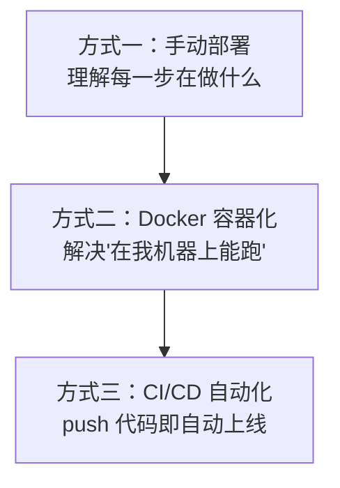
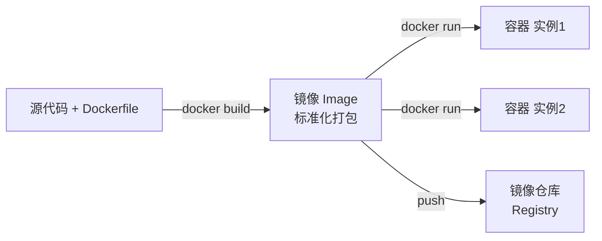
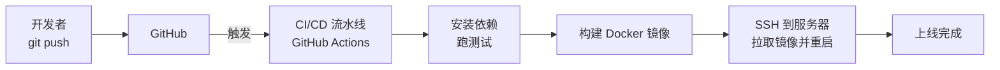

# 项目部署实战：从代码到上线

在上一篇《[云服务器环境搭建](/posts/linux/cloud-server-environment-setup)》中，我们准备好了 Node.js、数据库与 Nginx。现在要把应用真正放到服务器上，建立一套可重复、可检查、可回退的**单机部署基础**。

本文会循序渐进地讲解三种部署方式，它们代表了从手动理解原理，到容器化交付，再到自动化发布的演进：



强烈建议**按顺序读完**：手动部署让你理解部署的本质，Docker 解决环境一致性问题，CI/CD 则把这一切自动化。理解了前者，才能真正用好后者。

我们以一个典型的 **Node.js + Express** 应用为示例，但所有思路对 Python、Go、Java 等同样适用。

---

## 1. 部署到底是在做什么？

在动手之前，先想清楚"部署"这件事的本质。无论用什么工具，部署都绕不开这四个步骤：

1. **拿到代码**：把最新代码从仓库弄到服务器上。
2. **准备依赖**：安装项目所需的第三方库（`npm install` 等）。
3. **构建产物**：如果需要编译/打包（如 TypeScript、前端打包），生成可运行的产物。
4. **运行并守护**：启动应用，并保证它崩溃后能自动重启、开机能自启。

之后还要解决：让 Nginx 把流量转发给它（上一篇已讲）、记录日志、出问题能回滚。

记住这四步，后面三种方式只是**用不同的工具实现同样的目标**而已。

我们的示例应用结构如下：

```text
myapp/
├── package.json
├── server.js          # 入口文件
├── src/               # 业务代码
└── .env.example       # 环境变量示例
```

`server.js` 大致长这样：

```js
const express = require('express');
const app = express();
const PORT = process.env.PORT || 3000;

app.get('/', (req, res) => {
  res.send('Hello from my deployed app!');
});

app.get('/healthz', (req, res) => {
  res.status(200).json({ status: 'ok' });
});

const server = app.listen(PORT, () => {
  console.log(`Server running on port ${PORT}`);
  // 配合 PM2 的 wait_ready：确认监听成功后再接收流量
  if (process.send) process.send('ready');
});

// 收到退出信号后停止接收新连接，等待已有请求结束
function shutdown(signal) {
  console.log(`${signal} received, shutting down gracefully`);
  server.close((error) => {
    process.exit(error ? 1 : 0);
  });
  setTimeout(() => process.exit(1), 9000).unref();
}

process.on('SIGINT', () => shutdown('SIGINT'));
process.on('SIGTERM', () => shutdown('SIGTERM'));
```

---

## 2. 方式一：手动部署（理解本质）

手动部署虽然"原始"，但它能让你**清楚地看到每一步在做什么**，是理解后续自动化的基础。

### 2.1 把代码弄上服务器

最推荐的方式是用 **Git**，因为更新代码时只需 `git pull`，干净又方便。

```bash
# SSH 登录服务器后，用 deploy 用户操作
cd ~

# 从远程仓库克隆代码（公开仓库直接 https，私有仓库需配 SSH key 或 token）
git clone https://github.com/yourname/myapp.git
cd myapp
```

:::tip 私有仓库怎么拉？
私有仓库无法直接 clone。两种常见做法：
1. 在服务器上**生成一个新的 SSH key**（`ssh-keygen`），把公钥添加到 GitHub 仓库的 **Deploy Keys**（只读部署密钥）里；
2. 或使用 Personal Access Token（个人访问令牌）拼到 https 地址中。

第一种更安全，推荐使用。这里又用到了第三篇讲的 SSH 密钥知识。
:::

如果项目不在 Git 上，也可以用 `scp` / `rsync` 从本地直接传：

```bash
# 在本地执行：把整个项目目录传到服务器（rsync 更智能，只传变化的部分）
rsync -avz --exclude 'node_modules' ./myapp/ deploy@123.45.67.89:~/myapp/
```

### 2.2 安装依赖与配置环境变量

```bash
cd ~/myapp

# 严格按 package-lock.json 安装，生产运行不需要开发依赖时省略它们
npm ci --omit=dev

# 根据示例创建真实的环境变量文件
cp .env.example .env
nano .env       # 填入数据库密码、密钥等敏感信息
```

:::warning .env 绝不要提交到 Git
数据库密码、API 密钥这类敏感信息**永远不要写进代码或提交到仓库**。把 `.env` 加进 `.gitignore`，只在服务器上手动维护。仓库里只保留不含真实值的 `.env.example` 作为模板。
:::

### 2.3 用 PM2 运行并守护进程

上一篇我们介绍了用 `systemd` 守护应用。这里演示 Node 生态更便捷的 **PM2**，两者都能管理进程，但配置与发布语义不同。

先创建 `ecosystem.config.cjs`。要让 `reload` 在单机上做到**近零停机**，至少需要 cluster 多实例、就绪握手和优雅退出共同配合：

```js
module.exports = {
  apps: [{
    name: 'myapp',
    script: './server.js',
    exec_mode: 'cluster',
    instances: 2,
    wait_ready: true,
    listen_timeout: 10000,
    kill_timeout: 10000,
    env: { NODE_ENV: 'production', PORT: 3000 },
  }],
};
```

前面的 `server.js` 已在真正监听后发送 `ready`，并处理 `SIGINT` / `SIGTERM`，因此 PM2 可以等新实例就绪后再终止旧实例：

```bash
# 1. 全局安装 PM2
npm install -g pm2

# 2. 按配置启动 cluster 多实例
pm2 start ecosystem.config.cjs

# 3. 查看状态与日志
pm2 status
pm2 logs myapp

# 4. 配置开机自启（按 pm2 startup 输出继续执行）
pm2 startup
pm2 save
```

更新时先准备好代码与依赖，再触发滚动 reload：

```bash
cd ~/myapp
git pull --ff-only
npm ci --omit=dev
pm2 reload ecosystem.config.cjs --update-env
```

:::warning 单实例不承诺零停机
`instances: 1` 时，旧进程退出与新进程就绪之间仍可能出现空窗；即使是多实例，进程崩溃、长连接、数据库迁移或宿主机故障也会影响可用性。因此这里称为“近零停机”，上线后仍要用健康检查和真实请求验证。
:::

### 2.4 接上 Nginx 反向代理

应用现在监听 3000 端口，但只能本机访问。按上一篇配置 Nginx 反向代理，把 80 端口的流量转发给它：

```nginx
server {
    listen 80;
    server_name example.com;
    location / {
        proxy_pass http://127.0.0.1:3000;
        proxy_set_header Host $host;
        proxy_set_header X-Real-IP $remote_addr;
        proxy_set_header X-Forwarded-For $proxy_add_x_forwarded_for;
    }
}
```

`sudo nginx -t && sudo systemctl reload nginx`，访问域名即可看到你的应用。至此，**第一个版本已经上线了**。

但手动部署有个致命痛点：**"在我电脑上明明能跑"**。本地 Node 18、服务器 Node 20；本地装了某个系统库、服务器没装……环境差异会带来各种诡异问题。这正是 Docker 要解决的。

---

## 3. 方式二：Docker 容器化部署

### 3.1 为什么需要 Docker？

**Docker 把"应用代码 + 运行时 + 系统依赖 + 配置"一起打包成一个标准化的"镜像（Image）"**，这个镜像在任何装了 Docker 的机器上跑起来的"容器（Container）"，行为完全一致。

打个比方：以前搬家（部署）你要把家具、电器、装修一件件搬过去重新组装（在新环境重装依赖），很容易出错；Docker 则像**集装箱**——把整个房间原封不动装进集装箱，到哪都一样。



### 3.2 安装 Docker

Ubuntu 上优先使用 Docker 官方 apt 仓库，这样来源、签名与后续升级路径都更清晰；不要把远程脚本直接通过管道交给 shell 执行。

```bash
# 1. 准备仓库签名与目录
sudo apt update
sudo apt install -y ca-certificates curl
sudo install -m 0755 -d /etc/apt/keyrings
sudo curl -fsSL https://download.docker.com/linux/ubuntu/gpg \
  -o /etc/apt/keyrings/docker.asc
sudo chmod a+r /etc/apt/keyrings/docker.asc

# 2. 添加与当前 Ubuntu 版本匹配的官方仓库
. /etc/os-release
echo "deb [arch=$(dpkg --print-architecture) signed-by=/etc/apt/keyrings/docker.asc] https://download.docker.com/linux/ubuntu ${UBUNTU_CODENAME:-$VERSION_CODENAME} stable" \
  | sudo tee /etc/apt/sources.list.d/docker.list > /dev/null

# 3. 安装 Engine、Buildx 与 Compose 插件
sudo apt update
sudo apt install -y docker-ce docker-ce-cli containerd.io \
  docker-buildx-plugin docker-compose-plugin
sudo systemctl enable --now docker
sudo docker run --rm hello-world
```

如果确实需要让部署用户免 `sudo` 操作 Docker，可以加入 `docker` 组并重新登录：

```bash
sudo usermod -aG docker deploy
```

:::warning docker 组等价于高权限
Docker daemon 通常以 root 身份运行，能访问 Docker socket 的用户可挂载宿主机目录、启动特权容器，效果接近获得 root 权限。只把受控部署账号加入 `docker` 组；权限要求更高时，评估 rootless 模式或通过严格限定的自动化入口部署。
:::

### 3.3 编写 Dockerfile

`Dockerfile` 是一份"如何构建镜像"的说明书。在项目根目录创建：

```dockerfile
# 固定 major/minor 与发行版，避免无意跨大版本升级
FROM node:20.18-alpine3.20 AS deps
WORKDIR /app
COPY package.json package-lock.json ./
RUN npm ci --omit=dev && npm cache clean --force

FROM node:20.18-alpine3.20 AS runtime
WORKDIR /app
ENV NODE_ENV=production

# tini 作为 PID 1 转发信号并回收僵尸进程
RUN apk add --no-cache tini
COPY --from=deps --chown=node:node /app/node_modules ./node_modules
COPY --chown=node:node . .

USER node
EXPOSE 3000
HEALTHCHECK --interval=30s --timeout=3s --start-period=10s --retries=3 \
  CMD wget -qO- http://127.0.0.1:3000/healthz >/dev/null || exit 1
ENTRYPOINT ["/sbin/tini", "--"]
CMD ["node", "server.js"]
```

这里用两阶段构建把依赖安装与运行环境分开，最终镜像只保留运行所需内容。示例固定了 Node major/minor 与 Alpine 版本；关键生产环境还应把验证过的基础镜像固定到 digest（`image@sha256:...`），并通过受控流程更新 digest，避免同名 tag 漂移。

同时建一个 `.dockerignore`，避免把无用文件和本地秘密打进镜像：

```text
node_modules
.git
.env
npm-debug.log
```

### 3.4 构建并运行容器

```bash
# 1. 构建镜像，-t 打标签（名字:版本）
docker build -t myapp:1.0 .

# 2. 只把宿主端口绑定到回环地址，由 Nginx 对外提供入口
docker run -d \
  --name myapp \
  -p 127.0.0.1:3000:3000 \
  --env-file .env \
  --restart unless-stopped \
  myapp:1.0
```

逐项解释这些参数：

- `-d`：后台运行（detached）。
- `--name myapp`：给容器命名，方便管理。
- `-p 127.0.0.1:3000:3000`：把容器内 3000 只映射到宿主机回环地址，公网不能绕过 Nginx 直接访问应用端口（左边是宿主机，右边是容器）。
- `--env-file .env`：从文件注入环境变量。
- `--restart unless-stopped`：容器崩溃或服务器重启后自动拉起（相当于 Docker 版的"开机自启"）。

常用管理命令：

```bash
docker ps                 # 查看运行中的容器
docker logs -f myapp      # 实时查看日志
docker exec -it myapp sh  # 进入容器内部排查
docker stop myapp         # 停止
docker rm myapp           # 删除容器
```

Nginx 配置完全不变——它依然把流量转发给本机 3000 端口，根本不关心后面是裸进程还是容器。

### 3.5 用 Docker Compose 编排多个服务

真实项目往往不止一个容器。下面把应用与 Redis 放进一个 Compose 项目；生产数据库通常由独立主机或托管服务提供，不把 MySQL root 密码和数据库生命周期塞进这个入门示例。

```yaml
services:
  app:
    image: ${APP_IMAGE:?请设置不可变镜像标签}
    init: true
    ports:
      - "127.0.0.1:3000:3000"
    env_file:
      - .env
    depends_on:
      redis:
        condition: service_healthy
    healthcheck:
      test: ["CMD", "wget", "-qO-", "http://127.0.0.1:3000/healthz"]
      interval: 10s
      timeout: 3s
      retries: 5
      start_period: 15s
    restart: unless-stopped
    deploy:
      resources:
        limits:
          cpus: "1.0"
          memory: 512M

  redis:
    image: redis:7.4-alpine
    command: ["redis-server", "--appendonly", "yes"]
    volumes:
      - redis_data:/data
    healthcheck:
      test: ["CMD", "redis-cli", "ping"]
      interval: 5s
      timeout: 3s
      retries: 10
    restart: unless-stopped

volumes:
  redis_data:
```

`depends_on.condition: service_healthy` 只保证启动 app 前 Redis 的健康检查通过，不代表依赖在整个运行期永不失败；应用仍需设置连接超时、重试与降级策略。端口绑定 `127.0.0.1`，继续由 Nginx 作为唯一公网入口。

一键操作：

```bash
# 使用固定镜像标签启动
export APP_IMAGE="ghcr.io/yourname/myapp:0123456789abcdef"
docker compose pull app
docker compose up -d --no-build

# 查看容器状态与日志
docker compose ps
docker compose logs -f app
```

:::warning 资源限制要验证实际生效
`deploy.resources` 来自 Compose Deploy 规范；普通 `docker compose`、Swarm 以及其他 Compose 实现对它的支持范围并不完全相同。部署前先查当前版本文档，可按运行模式改用受支持的 Compose 字段，或直接使用 `docker run --cpus ... --memory ...`。无论写在哪，都要用 `docker inspect`、运行时指标和压测确认限制确实生效，而不是只看 YAML。
:::

:::important 数据卷不是备份
Redis 持久化卷让容器重建后仍能读取本机数据，但卷会随磁盘故障、误删或主机丢失一起受损。关键数据仍要按恢复目标做独立备份与异地副本；生产数据库则需要单独设计权限、备份和高可用方案。
:::

---

## 4. 方式三：CI/CD 自动化部署

到这里，每次更新还是要手动 SSH 登录、`git pull`、重新构建……既繁琐又容易出错。**CI/CD** 就是把这套流程**全自动化**：你只管 `git push`，剩下的交给机器。

### 4.1 什么是 CI/CD？

- **CI（Continuous Integration，持续集成）**：每次提交代码，自动**拉取、安装依赖、跑测试、构建**，尽早发现问题。
- **CD（Continuous Deployment，持续部署）**：构建通过后，自动**部署到服务器**。



我们用最流行的 **GitHub Actions** 来演示。

### 4.2 准备工作：最小化生产机入口

流水线仍需要 SSH 触发部署，但生产机不再 `git pull`、安装依赖或构建镜像。准备工作如下：

1. 生成一对**专用于部署**的 SSH 密钥，把公钥放进部署用户的 `authorized_keys`，并限制该账号权限。
2. 在仓库的 **Settings → Secrets and variables → Actions** 中保存 `SERVER_HOST`、`SERVER_USER`、`SSH_PRIVATE_KEY` 与经过核验的 `SSH_KNOWN_HOSTS`；不要在流水线中临时信任未知主机指纹。
3. 在服务器 `/opt/myapp/compose.yaml` 放好上一节的 Compose 配置及权限受控的 `.env`。若 GHCR 包不是公开的，预先用只有 `read:packages` 权限的凭据登录 GHCR。
4. 在 GitHub 的 **Settings → Environments → production** 配置 required reviewers 等审批规则。工作流里的 `environment: production` 只有配合这些规则才会形成上线审批门禁。

### 4.3 构建不可变镜像并按 SHA 部署

下面的工作流先测试，再把镜像以 `github.sha` 作为不可变 tag 推送到 GHCR，最后让生产机只拉取这一固定 tag：

```yaml
name: Build and deploy

on:
  push:
    branches: [main]

permissions:
  contents: read
  packages: write

concurrency:
  group: production-deploy
  cancel-in-progress: false

env:
  IMAGE_NAME: ghcr.io/${{ github.repository }}

jobs:
  build:
    runs-on: ubuntu-latest
    steps:
      - name: Checkout
        uses: actions/checkout@v4

      - name: Setup Node.js
        uses: actions/setup-node@v4
        with:
          node-version: '20.18'
          cache: npm

      - name: Test
        run: |
          npm ci
          npm test

      - name: Login to GHCR
        uses: docker/login-action@v3
        with:
          registry: ghcr.io
          username: ${{ github.actor }}
          password: ${{ secrets.GITHUB_TOKEN }}

      - name: Setup Buildx
        uses: docker/setup-buildx-action@v3

      - name: Build and push immutable image
        uses: docker/build-push-action@v6
        with:
          context: .
          push: true
          tags: ${{ env.IMAGE_NAME }}:${{ github.sha }}

  deploy:
    needs: build
    runs-on: ubuntu-latest
    environment: production
    steps:
      - name: Configure SSH
        env:
          SSH_PRIVATE_KEY: ${{ secrets.SSH_PRIVATE_KEY }}
          SSH_KNOWN_HOSTS: ${{ secrets.SSH_KNOWN_HOSTS }}
        run: |
          install -m 700 -d ~/.ssh
          printf '%s\n' "$SSH_PRIVATE_KEY" > ~/.ssh/deploy_key
          chmod 600 ~/.ssh/deploy_key
          printf '%s\n' "$SSH_KNOWN_HOSTS" > ~/.ssh/known_hosts
          chmod 600 ~/.ssh/known_hosts

      - name: Pull SHA image, smoke test, and restore on failure
        env:
          SERVER_HOST: ${{ secrets.SERVER_HOST }}
          SERVER_USER: ${{ secrets.SERVER_USER }}
          TARGET_IMAGE: ${{ env.IMAGE_NAME }}:${{ github.sha }}
        run: |
          ssh -i ~/.ssh/deploy_key "$SERVER_USER@$SERVER_HOST" \
            bash -s -- "$TARGET_IMAGE" <<'REMOTE'
          set -Eeuo pipefail
          cd /opt/myapp

          TARGET_IMAGE="$1"
          PREVIOUS_IMAGE="$(cat .deployed-image 2>/dev/null || true)"

          APP_IMAGE="$TARGET_IMAGE" docker compose pull app
          APP_IMAGE="$TARGET_IMAGE" docker compose up -d --no-build app

          healthy=false
          for attempt in $(seq 1 30); do
            if curl --fail --silent --show-error \
              http://127.0.0.1:3000/healthz >/dev/null; then
              healthy=true
              break
            fi
            sleep 2
          done

          if [ "$healthy" != true ]; then
            echo "Smoke test failed; restoring PREVIOUS_IMAGE" >&2
            if [ -n "$PREVIOUS_IMAGE" ]; then
              APP_IMAGE="$PREVIOUS_IMAGE" docker compose pull app
              APP_IMAGE="$PREVIOUS_IMAGE" docker compose up -d --no-build app
              curl --fail --silent --show-error \
                --retry 15 --retry-delay 2 --retry-connrefused \
                http://127.0.0.1:3000/healthz >/dev/null
            fi
            exit 1
          fi

          tmp="$(mktemp .deployed-image.XXXXXX)"
          printf '%s\n' "$TARGET_IMAGE" > "$tmp"
          mv -f "$tmp" .deployed-image
          REMOTE
```

示例使用 `actions/checkout@v4`、`docker/login-action@v3` 等稳定主版本，便于教学阅读；真实企业环境应把第三方 Action 固定到审核过的**完整 commit SHA**，并通过依赖更新流程评估升级。生产包还要设置合适的可见性、保留策略和镜像扫描。

这条流水线不会在生产服务器拉源码或 build。每次发布都能由 `github.sha` 精确定位；烟雾测试失败时，脚本读取上次成功记录的 `PREVIOUS_IMAGE`，重新 `pull` 并 `up -d` 恢复。若变更包含不向后兼容的数据库迁移，仅切镜像可能无法恢复，必须另行设计可回退迁移。
---

## 5. 上线之后：日志、备份与回滚

部署成功不是终点，**稳定运行**才是。下面这些运维实践能帮你在出问题时从容应对。

### 5.1 看日志（排错第一步）

排查线上问题，第一件事永远是看日志：

```bash
# Docker 容器日志
docker compose logs -f app

# PM2 日志
pm2 logs myapp

# systemd 日志（上一篇讲过）
sudo journalctl -u myapp -f

# Nginx 访问日志和错误日志
sudo tail -f /var/log/nginx/access.log
sudo tail -f /var/log/nginx/error.log
```

结合第二篇学的文本三剑客，定位问题事半功倍：

```bash
# 统计访问最多的 10 个 IP（第二篇的经典组合拳）
awk '{print $1}' /var/log/nginx/access.log | sort | uniq -c | sort -nr | head -10

# 找出所有 5xx 服务端错误
grep -E ' 5[0-9]{2} ' /var/log/nginx/access.log
```

### 5.2 数据库备份：先保证凭据与产物可信

代码可以重新部署，数据通常不能。不要把数据库密码放在命令行、脚本变量或 crontab 中：命令行可能被进程列表、历史记录或任务日志看到。先创建仅用于逻辑备份的账号；以下权限适合示例中的 InnoDB 单库、无存储过程备份，实际权限要按 MySQL 版本、存储引擎和备份参数逐项评估：

```sql
CREATE USER 'backup'@'localhost' IDENTIFIED BY 'replace-with-a-strong-secret';
GRANT SELECT, SHOW VIEW, TRIGGER, EVENT ON myapp.* TO 'backup'@'localhost';
```

把客户端凭据放进只有部署用户可读的配置文件：

```ini
# /home/deploy/.my-backup.cnf
[client]
user=backup
password=replace-with-a-strong-secret
host=localhost
```

```bash
chmod 600 /home/deploy/.my-backup.cnf
```

备份脚本同时检查管道、压缩包与原子落盘；只有成功后才清理旧备份：

```bash
#!/usr/bin/env bash
set -Eeuo pipefail
umask 077

BACKUP_DIR="/home/deploy/backups/mysql"
MYSQL_CNF="/home/deploy/.my-backup.cnf"
DATE="$(date +%Y%m%d_%H%M%S)"
FINAL="$BACKUP_DIR/myapp_${DATE}.sql.gz"

mkdir -p "$BACKUP_DIR"
TEMP="$(mktemp "$BACKUP_DIR/.myapp_${DATE}.XXXXXX.tmp")"
trap 'rm -f "$TEMP"' EXIT

mysqldump --defaults-extra-file="$MYSQL_CNF" \
  --single-transaction --quick --skip-lock-tables --no-tablespaces myapp \
  | gzip -c > "$TEMP"

gzip -t "$TEMP"
# TEMP 与 FINAL 位于同一文件系统，mv 才能作为原子发布步骤
mv -f "$TEMP" "$FINAL"
trap - EXIT

# 成功产出并校验后再执行保留策略
find "$BACKUP_DIR" -type f -name 'myapp_*.sql.gz' -mtime +7 -delete
printf 'backup completed: %s\n' "$FINAL"
```

Cron 只调用脚本，不携带密码：

```cron
0 3 * * * /home/deploy/scripts/backup-mysql.sh >> /home/deploy/backups/backup.log 2>&1
```

备份文件存在不等于可恢复。定期在隔离的临时数据库中用单独、受控的恢复凭据执行演练，并做表数量、关键查询或校验和验证：

```bash
# 不要直接覆盖生产库；先恢复到隔离的 myapp_restore
set -o pipefail
gzip -dc /home/deploy/backups/mysql/myapp_20260211_030000.sql.gz \
  | mysql --defaults-extra-file=/home/deploy/.my-restore.cnf myapp_restore
```

最后，把备份加密复制到不同主机、区域或对象存储，并监控复制失败；本机磁盘上的唯一副本无法覆盖磁盘损坏、误删和主机失陷。

### 5.3 回滚：按固定旧 SHA 恢复

回滚不是改写 Git 历史，也不需要先停止整套服务。选择一个已经验证过的旧 `github.sha` 镜像 tag，更新 app 并立即做健康检查；若旧版本也未通过检查，再恢复发布前镜像：

```bash
set -Eeuo pipefail
cd /opt/myapp

PREVIOUS_IMAGE="$(cat .deployed-image)"
ROLLBACK_IMAGE="ghcr.io/yourname/myapp:4f2c9d7b1a6e"

APP_IMAGE="$ROLLBACK_IMAGE" docker compose pull app
APP_IMAGE="$ROLLBACK_IMAGE" docker compose up -d --no-build app

if curl --fail --silent --show-error \
  --retry 15 --retry-delay 2 --retry-connrefused \
  http://127.0.0.1:3000/healthz >/dev/null; then
  tmp="$(mktemp .deployed-image.XXXXXX)"
  printf '%s\n' "$ROLLBACK_IMAGE" > "$tmp"
  mv -f "$tmp" .deployed-image
  echo "rollback succeeded: $ROLLBACK_IMAGE"
else
  echo "rollback image is unhealthy; restoring $PREVIOUS_IMAGE" >&2
  APP_IMAGE="$PREVIOUS_IMAGE" docker compose pull app
  APP_IMAGE="$PREVIOUS_IMAGE" docker compose up -d --no-build app
  exit 1
fi
```

固定 SHA tag 能让操作指向明确镜像，但仍应记录操作者、原因和验证结果。回滚前还要确认旧程序是否兼容当前数据库 schema、队列消息与配置；不兼容时需要专门的恢复方案，而不是反复重启容器。

:::note 蓝绿部署与灰度发布
更成熟的团队会用**蓝绿部署**（准备好新版本环境，瞬间切换流量，出问题秒切回）或**灰度发布**（先放一小部分流量到新版本，验证无误再全量）。它们的目标都是**让上线变更对用户无感、且随时可退**。这超出了入门范围，但值得在你成长路上去深入了解。
:::

---

## 总结：单机部署基础已经打通

这篇文章把一份本地代码带到了可重复发布的单机服务：

- **看清本质**：部署仍是“准备产物 → 注入配置 → 启动守护 → 验证结果”，工具只是手段。
- **PM2**：只有 cluster 多实例、就绪握手与优雅退出共同工作时，reload 才能争取近零停机；单实例不作保证。
- **Docker 与 Compose**：用多阶段、非 root、健康检查和回环端口缩小运行边界，并明确卷、依赖顺序和资源限制的能力边界。
- **CI/CD**：在 CI 构建并推送 SHA 镜像，生产机只拉不可变产物，通过审批、并发控制、烟雾测试和旧镜像恢复降低发布风险。
- **数据与回退**：备份需要最小权限、完整性检查、恢复演练和异地副本；回退则始终指向明确的旧 SHA 镜像。

这些内容解决的是**单机部署基础**，不是成熟生产体系的终点。单机仍有宿主机故障、容量、数据库、观测、发布兼容性和人为操作等风险，后续要进入更系统的生产工程。

下一篇《[系统运维与安全](/posts/linux/system-ops-and-security)》，我们会继续建立日志、定时任务、监控、备份与安全加固能力，让已经上线的服务更可观察、更容易维护。
