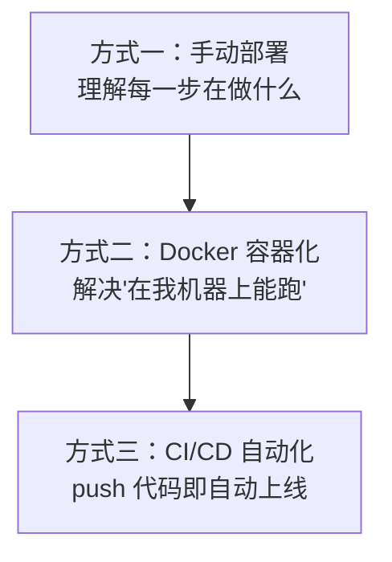
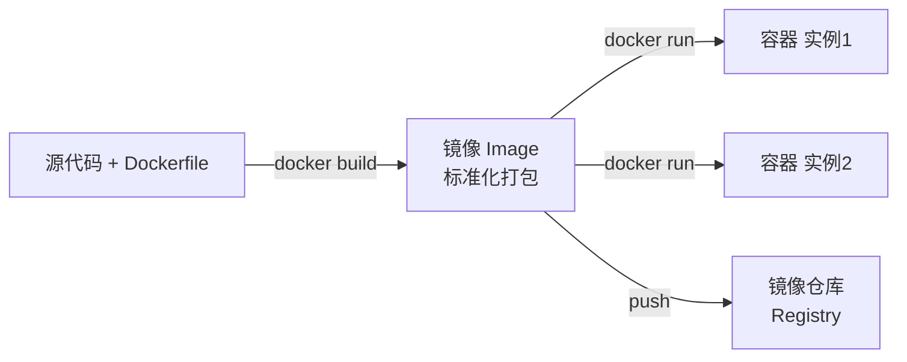
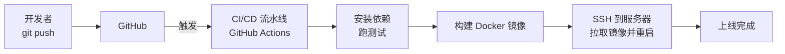

# 项目部署实战：从代码到上线

这是 Linux 系列的收官之作。回顾一下我们的学习路径：

1. 《[深入浅出 Linux](/posts/linux/linux-fundamentals)》——从基础命令到管道与文本三剑客；
2. 《[Shell 脚本编程](/posts/linux/shell-scripting)》——让 Linux 替你干活；
3. 《[云服务器入门](/posts/linux/cloud-server-getting-started)》——连接、用户与安全加固；
4. 《[网络排查与磁盘管理](/posts/linux/networking-and-disk)》——服务器的血管和仓库；
5. 《[云服务器环境搭建](/posts/linux/cloud-server-environment-setup)》——运行时、数据库与 Nginx；
6. 《[系统运维与安全](/posts/linux/system-ops-and-security)》——日志、定时任务、监控与加固。

现在，我们手握一台安全、环境齐备的服务器，终于要把项目**真正搬上线**了。本文将循序渐进地讲解三种部署方式，它们代表了从"手工作坊"到"现代工业化"的演进：



强烈建议**按顺序读完**：手动部署让你理解部署的本质，Docker 解决环境一致性问题，CI/CD 则把这一切自动化。理解了前者，才能真正用好后者。

我们以一个典型的 **Node.js + Express** 应用为示例，但所有思路对 Python、Go、Java 等同样适用。

---

## 1. 部署到底是在做什么？

在动手之前，先想清楚"部署"这件事的本质。无论用什么工具，部署都绕不开这四个步骤：

1. **拿到代码**：把最新代码从仓库弄到服务器上。
2. **准备依赖**：安装项目所需的第三方库（`npm install` 等）。
3. **构建产物**：如果需要编译/打包（如 TypeScript、前端打包），生成可运行的产物。
4. **运行并守护**：启动应用，并保证它崩溃后能自动重启、开机能自启。

之后还要解决：让 Nginx 把流量转发给它（上一篇已讲）、记录日志、出问题能回滚。

记住这四步，后面三种方式只是**用不同的工具实现同样的目标**而已。

我们的示例应用结构如下：

```text
myapp/
├── package.json
├── server.js          # 入口文件
├── src/               # 业务代码
└── .env.example       # 环境变量示例
```

`server.js` 大致长这样：

```js
const express = require('express');
const app = express();
const PORT = process.env.PORT || 3000;

app.get('/', (req, res) => {
  res.send('Hello from my deployed app!');
});

app.listen(PORT, () => {
  console.log(`Server running on port ${PORT}`);
});
```

---

## 2. 方式一：手动部署（理解本质）

手动部署虽然"原始"，但它能让你**清楚地看到每一步在做什么**，是理解后续自动化的基础。

### 2.1 把代码弄上服务器

最推荐的方式是用 **Git**，因为更新代码时只需 `git pull`，干净又方便。

```bash
# SSH 登录服务器后，用 deploy 用户操作
cd ~

# 从远程仓库克隆代码（公开仓库直接 https，私有仓库需配 SSH key 或 token）
git clone https://github.com/yourname/myapp.git
cd myapp
```

:::tip 私有仓库怎么拉？
私有仓库无法直接 clone。两种常见做法：
1. 在服务器上**生成一个新的 SSH key**（`ssh-keygen`），把公钥添加到 GitHub 仓库的 **Deploy Keys**（只读部署密钥）里；
2. 或使用 Personal Access Token（个人访问令牌）拼到 https 地址中。

第一种更安全，推荐使用。这里又用到了第三篇讲的 SSH 密钥知识。
:::

如果项目不在 Git 上，也可以用 `scp` / `rsync` 从本地直接传：

```bash
# 在本地执行：把整个项目目录传到服务器（rsync 更智能，只传变化的部分）
rsync -avz --exclude 'node_modules' ./myapp/ deploy@123.45.67.89:~/myapp/
```

### 2.2 安装依赖与配置环境变量

```bash
cd ~/myapp

# 安装生产依赖（--production 跳过开发依赖，更轻量）
npm install --production

# 根据示例创建真实的环境变量文件
cp .env.example .env
nano .env       # 填入数据库密码、密钥等敏感信息
```

:::warning .env 绝不要提交到 Git
数据库密码、API 密钥这类敏感信息**永远不要写进代码或提交到仓库**。把 `.env` 加进 `.gitignore`，只在服务器上手动维护。仓库里只保留不含真实值的 `.env.example` 作为模板。
:::

### 2.3 用 PM2 运行并守护进程

上一篇我们介绍了用 `systemd` 守护应用。这里演示 Node 生态更便捷的 **PM2**，两者效果相同，你可任选其一。

```bash
# 1. 全局安装 PM2
npm install -g pm2

# 2. 启动应用（--name 给进程起个名字）
pm2 start server.js --name myapp

# 3. 查看运行状态
pm2 list
pm2 status

# 4. 查看日志
pm2 logs myapp

# 5. ⭐ 配置开机自启（关键，否则服务器重启后应用不会启动）
pm2 startup          # 它会输出一条命令，复制并执行那条命令
pm2 save             # 保存当前进程列表
```

更新代码时，手动部署的流程就是：

```bash
cd ~/myapp
git pull                    # 拉取最新代码
npm install --production    # 更新依赖
pm2 reload myapp            # 平滑重启（0 秒停机）
```

### 2.4 接上 Nginx 反向代理

应用现在监听 3000 端口，但只能本机访问。按上一篇配置 Nginx 反向代理，把 80 端口的流量转发给它：

```nginx
server {
    listen 80;
    server_name example.com;
    location / {
        proxy_pass http://127.0.0.1:3000;
        proxy_set_header Host $host;
        proxy_set_header X-Real-IP $remote_addr;
        proxy_set_header X-Forwarded-For $proxy_add_x_forwarded_for;
    }
}
```

`sudo nginx -t && sudo systemctl reload nginx`，访问域名即可看到你的应用。至此，**第一个版本已经上线了**。

但手动部署有个致命痛点：**"在我电脑上明明能跑"**。本地 Node 18、服务器 Node 20；本地装了某个系统库、服务器没装……环境差异会带来各种诡异问题。这正是 Docker 要解决的。

---

## 3. 方式二：Docker 容器化部署

### 3.1 为什么需要 Docker？

**Docker 把"应用代码 + 运行时 + 系统依赖 + 配置"一起打包成一个标准化的"镜像（Image）"**，这个镜像在任何装了 Docker 的机器上跑起来的"容器（Container）"，行为完全一致。

打个比方：以前搬家（部署）你要把家具、电器、装修一件件搬过去重新组装（在新环境重装依赖），很容易出错；Docker 则像**集装箱**——把整个房间原封不动装进集装箱，到哪都一样。



### 3.2 安装 Docker

```bash
# 用官方便捷脚本安装 Docker
curl -fsSL https://get.docker.com | sudo sh

# 把当前用户加入 docker 组，之后无需每次 sudo（需重新登录生效）
sudo usermod -aG docker $USER

# 启动并开机自启
sudo systemctl enable --now docker

# 重新登录后验证
docker --version
docker run hello-world
```

### 3.3 编写 Dockerfile

`Dockerfile` 是一份"如何构建镜像"的说明书。在项目根目录创建：

```dockerfile
# 1. 基础镜像：选官方 Node 镜像，alpine 版极其轻量（还记得第一篇提到 Alpine 吗）
FROM node:20-alpine

# 2. 设置容器内的工作目录
WORKDIR /app

# 3. 先只复制 package 文件并安装依赖
#    —— 利用 Docker 的层缓存：只要依赖没变，这一层就不用重新构建，加速后续构建
COPY package*.json ./
RUN npm install --production

# 4. 再复制其余源代码
COPY . .

# 5. 声明应用监听的端口（仅作文档说明）
EXPOSE 3000

# 6. 容器启动时执行的命令
CMD ["node", "server.js"]
```

同时建一个 `.dockerignore`，避免把无用文件打进镜像：

```text
node_modules
.git
.env
npm-debug.log
```

### 3.4 构建并运行容器

```bash
# 1. 构建镜像，-t 打标签（名字:版本）
docker build -t myapp:1.0 .

# 2. 运行容器
docker run -d \
  --name myapp \
  -p 3000:3000 \
  --env-file .env \
  --restart unless-stopped \
  myapp:1.0
```

逐项解释这些参数：

- `-d`：后台运行（detached）。
- `--name myapp`：给容器命名，方便管理。
- `-p 3000:3000`：端口映射，把**容器内的 3000** 映射到**宿主机的 3000**（左边宿主机，右边容器）。
- `--env-file .env`：从文件注入环境变量。
- `--restart unless-stopped`：容器崩溃或服务器重启后自动拉起（相当于 Docker 版的"开机自启"）。

常用管理命令：

```bash
docker ps                 # 查看运行中的容器
docker logs -f myapp      # 实时查看日志
docker exec -it myapp sh  # 进入容器内部排查
docker stop myapp         # 停止
docker rm myapp           # 删除容器
```

Nginx 配置完全不变——它依然把流量转发给本机 3000 端口，根本不关心后面是裸进程还是容器。

### 3.5 用 Docker Compose 编排多个服务

真实项目往往不止一个容器：应用 + 数据库 + 缓存。一个个 `docker run` 太繁琐，**Docker Compose** 让你用一个 `docker-compose.yml` 文件描述并一键启停所有服务。

```yaml
services:
  app:
    build: .
    ports:
      - "3000:3000"
    env_file: .env
    depends_on:
      - db
      - redis
    restart: unless-stopped

  db:
    image: mysql:8.0
    environment:
      MYSQL_ROOT_PASSWORD: ${DB_ROOT_PASSWORD}
      MYSQL_DATABASE: myapp
    volumes:
      # 数据卷：让数据库数据持久化到宿主机，容器删了数据也不丢
      - db_data:/var/lib/mysql
    restart: unless-stopped

  redis:
    image: redis:7-alpine
    restart: unless-stopped

volumes:
  db_data:
```

一键操作：

```bash
# 后台启动所有服务
docker compose up -d

# 查看所有服务状态
docker compose ps

# 查看日志
docker compose logs -f

# 停止并移除所有容器
docker compose down
```

:::important 数据卷（Volume）至关重要
容器是"无状态、用完即弃"的——删掉容器，里面的数据就没了。所以**数据库的数据必须存在数据卷（volume）里**，挂载到宿主机持久化保存。上面的 `db_data:/var/lib/mysql` 就是把 MySQL 的数据目录持久化了，这样即使重建容器，数据依然还在。
:::

---

## 4. 方式三：CI/CD 自动化部署

到这里，每次更新还是要手动 SSH 登录、`git pull`、重新构建……既繁琐又容易出错。**CI/CD** 就是把这套流程**全自动化**：你只管 `git push`，剩下的交给机器。

### 4.1 什么是 CI/CD？

- **CI（Continuous Integration，持续集成）**：每次提交代码，自动**拉取、安装依赖、跑测试、构建**，尽早发现问题。
- **CD（Continuous Deployment，持续部署）**：构建通过后，自动**部署到服务器**。



我们用最流行的 **GitHub Actions** 来演示。

### 4.2 准备工作：让 GitHub 能安全访问服务器

CI/CD 流水线需要 SSH 登录你的服务器去执行部署。但绝不能把私钥明文写进代码！正确做法是用 GitHub 的 **Secrets**（加密的环境变量）。

1. 生成一对**专用于部署**的 SSH 密钥（建议独立于你日常用的）。
2. 把**公钥**加到服务器 `~/.ssh/authorized_keys`（第三篇讲过）。
3. 在 GitHub 仓库 → **Settings → Secrets and variables → Actions** 里添加：
   - `SERVER_HOST`：服务器 IP
   - `SERVER_USER`：部署用户（如 `deploy`）
   - `SSH_PRIVATE_KEY`：那把**私钥**的完整内容

### 4.3 编写工作流文件

在项目里创建 `.github/workflows/deploy.yml`：

```yaml
name: Deploy to Server

# 触发条件：push 到 main 分支时
on:
  push:
    branches: [main]

jobs:
  deploy:
    runs-on: ubuntu-latest
    steps:
      # 1. 检出代码
      - name: Checkout code
        uses: actions/checkout@v4

      # 2. （CI 部分）安装依赖并运行测试
      - name: Setup Node.js
        uses: actions/setup-node@v4
        with:
          node-version: '20'
      - name: Install & Test
        run: |
          npm ci
          npm test

      # 3. （CD 部分）通过 SSH 登录服务器执行部署
      - name: Deploy via SSH
        uses: appleboy/ssh-action@v1.0.0
        with:
          host: ${{ secrets.SERVER_HOST }}
          username: ${{ secrets.SERVER_USER }}
          key: ${{ secrets.SSH_PRIVATE_KEY }}
          script: |
            cd ~/myapp
            git pull origin main
            docker compose up -d --build
            docker image prune -f
```

现在，**每次往 `main` 分支推送代码，GitHub Actions 就会自动跑测试、登录服务器、拉取最新代码、重新构建并重启容器**。从写完代码到线上更新，你只需要一个 `git push`。

### 4.4 更进一步：构建镜像推送到仓库

更专业的做法是：在 CI 阶段**构建好镜像并推送到镜像仓库**（如 Docker Hub、GitHub Container Registry），服务器只负责**拉取镜像并运行**，无需在生产服务器上安装构建工具链，也更快、更干净。这是大型项目的标准做法，原理与上面一致，只是把"在服务器上 build"换成了"在服务器上 pull 现成镜像"。

---

## 5. 上线之后：日志、备份与回滚

部署成功不是终点，**稳定运行**才是。下面这些运维实践能帮你在出问题时从容应对。

### 5.1 看日志（排错第一步）

排查线上问题，第一件事永远是看日志：

```bash
# Docker 容器日志
docker compose logs -f app

# PM2 日志
pm2 logs myapp

# systemd 日志（上一篇讲过）
sudo journalctl -u myapp -f

# Nginx 访问日志和错误日志
sudo tail -f /var/log/nginx/access.log
sudo tail -f /var/log/nginx/error.log
```

结合第二篇学的文本三剑客，定位问题事半功倍：

```bash
# 统计访问最多的 10 个 IP（第二篇的经典组合拳）
awk '{print $1}' /var/log/nginx/access.log | sort | uniq -c | sort -nr | head -10

# 找出所有 5xx 服务端错误
grep -E ' 5[0-9]{2} ' /var/log/nginx/access.log
```

### 5.2 数据库备份（最重要的事）

代码可以重新部署，**数据丢了就真没了**。务必定期备份数据库：

```bash
# 手动备份 MySQL（导出为 SQL 文件）
mysqldump -u myapp_user -p myapp > backup_$(date +%Y%m%d).sql

# 恢复
mysql -u myapp_user -p myapp < backup_20260211.sql
```

把它写成脚本，配合 `cron` 定时执行，实现每天自动备份：

```bash
# 编辑当前用户的定时任务
crontab -e

# 加入这一行：每天凌晨 3 点自动备份
0 3 * * * mysqldump -u myapp_user -pYOUR_PASS myapp > ~/backups/db_$(date +\%Y\%m\%d).sql
```

:::tip cron 表达式速记
五个字段依次是：`分 时 日 月 周`。`0 3 * * *` 即"每天 3 点 0 分"。这是 Linux 定时任务的标准语法，部署后台清理、日志轮转、备份等都靠它。
:::

### 5.3 回滚：出事了怎么快速退回

新版本上线后发现严重 bug，最快的止血方式是**回滚到上一个正常版本**。

```bash
# Git 方式：回退到上一个提交再重新部署
git reset --hard HEAD~1
docker compose up -d --build

# Docker 镜像方式（推荐）：直接切回上一个版本的镜像 tag
# 这也是为什么镜像要打版本号而非只用 latest
docker compose down
# 修改 compose 文件里镜像 tag 为旧版本，再 up
docker compose up -d
```

:::note 蓝绿部署与灰度发布
更成熟的团队会用**蓝绿部署**（准备好新版本环境，瞬间切换流量，出问题秒切回）或**灰度发布**（先放一小部分流量到新版本，验证无误再全量）。它们的目标都是**让上线变更对用户无感、且随时可退**。这超出了入门范围，但值得在你成长路上去深入了解。
:::

---

## 总结：一条完整的闭环

这篇文章我们把整个 Linux 系列收束成了一条完整闭环——从一份本地代码，到稳定运行在公网上的服务：

- **看清本质**：部署无非"拿代码 → 装依赖 → 构建 → 运行守护"四步，工具只是手段。
- **手动部署**：用 Git + PM2 + Nginx 跑通第一个版本，理解每一步的意义。
- **Docker 容器化**：用镜像彻底解决环境一致性问题，用 Compose 编排多服务，用数据卷持久化数据。
- **CI/CD 自动化**：用 GitHub Actions 实现 `git push` 即自动上线，把人从重复劳动里解放出来。
- **长期运维**：看日志、定时备份、随时能回滚，才能让服务真正稳定地活下去。

回望整个系列，你已经从"认识 `ls` 和 `cd`"，一路走到了"独立把一个项目安全、自动化地部署上线并稳定运维"。这正是一名后端 / 运维 / 全栈工程师的核心基本功。

剩下的，就是找一台真实的服务器，把你自己的项目跑起来——**实践，永远是掌握 Linux 最好的方式。**
