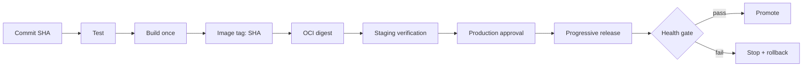

# 可靠 CI/CD 与发布策略：不可变制品、健康门禁与自动回滚

可靠交付不是“push 后自动执行一串命令”，而是让同一个、可验证的不可变制品经过测试、审批和健康门禁逐级晋级；任何一步失败，都能停止扩散并回到已知良好版本。

:::note 版本与示例范围
本文以 **GitHub Actions、Docker Engine 24+、Compose v2、GHCR、Ubuntu 22.04/24.04 LTS** 为例。工作流中的仓库、主机、environment 与 digest 均为占位值。GitHub 托管 runner 上可用的 action 主版本会变化；生产中必须把第三方 action 固定到审核过的完整 commit SHA，并由依赖更新流程定期升级。
:::

## 1. 交付链路的核心不变量

一条可靠流水线应维持以下不变量：

1. **构建一次**：测试通过后只构建一个制品，不在每个环境重新构建。
2. **身份可追踪**：源 commit SHA、镜像 tag、OCI digest、SBOM/签名和部署记录能够关联。
3. **按 digest 晋级**：环境之间移动的是同一组字节，不是含义可变的 `latest`。
4. **权限按 job 拆分**：测试不需要部署权，构建只需要写包，部署才接触目标环境。
5. **生产有门禁**：审批、并发控制、健康检查、观测窗口与自动停止扩散。
6. **失败可恢复**：保留已知良好 digest，应用回滚与数据库兼容策略同时成立。



## 2. 不可变制品：tag 是名字，digest 才是内容身份

Git commit SHA 标识源码快照；容器 tag 是仓库中可变的引用；镜像 digest 是内容寻址标识。发布记录至少同时保留三者：

```text
source_commit=7a2f...c91
image_tag=ghcr.io/example-org/orders-api:7a2f...c91
image_digest=sha256:4f2a...9bd
```

`latest`、`production` 可以作为方便人类观察的别名，但不能作为审计与回滚的唯一依据。部署命令最好直接使用：

```bash
docker pull 'ghcr.io/example-org/orders-api@sha256:<FULL_DIGEST>'
```

### 2.1 构建上下文必须可重复

- 锁定依赖并在 CI 使用 `npm ci`，不要忽略 lockfile；
- 指定基础镜像 digest，避免同名基础镜像漂移；
- `.dockerignore` 排除 `.git`、本地依赖、日志与秘密；
- 不把构建时间、随机值写入影响运行的文件；
- 构建日志和镜像层都不能包含 token、私钥或 `.env`。

一个最小 Node 镜像：

```dockerfile
# 示例 digest 是占位符；实际值应从可信 registry 查询并经更新流程替换。
FROM node:22.14.0-bookworm-slim@sha256:<PINNED_BASE_IMAGE_DIGEST> AS deps
WORKDIR /app
COPY package.json package-lock.json ./
RUN npm ci --omit=dev

FROM node:22.14.0-bookworm-slim@sha256:<PINNED_BASE_IMAGE_DIGEST>
ENV NODE_ENV=production
WORKDIR /app
COPY --from=deps /app/node_modules ./node_modules
COPY package.json server.mjs ./
USER node
EXPOSE 3000
CMD ["node", "server.mjs"]
```

占位 digest 不能直接构建，替换是有意的安全门槛；不要为了“能跑”删掉 digest 固定。

## 3. 环境晋级，而不是环境重建

推荐状态流：

```text
candidate digest
  -> integration（自动）
  -> staging（自动部署 + 测试）
  -> production（受保护 environment 审批）
```

环境差异应来自运行时配置和秘密，而不是重新编译：同一 digest 在 staging 和 production 运行，不同的是数据库端点、容量、域名和权限。配置也应版本化并经过评审，秘密则由专用存储在运行时注入。

:::important 不在生产机 git pull 或 build
生产机不应 `git pull`、`npm install`、`docker build`。这些操作让生产结果依赖当时网络、包源、工具链和工作目录，既难审计也难回滚。生产节点只接收经过验证的 digest，拉取并启动它。
:::

## 4. 身份与最小权限：OIDC 优先于长期云密钥

GitHub Actions 可以向支持工作负载身份联合的云平台申请短期凭据。仓库工作流只获得 OIDC 身份令牌，云端信任策略再根据仓库、分支和 environment 限制可扮演角色；这避免在 GitHub Secret 中长期保存云访问密钥。

权限要在 job 级显式声明：

```yaml
permissions: {}

jobs:
  cloud-deploy:
    permissions:
      contents: read
      id-token: write # 仅允许此 job 请求 OIDC token
```

以 AWS 官方 action 为例，角色 ARN 是占位值：

```yaml
- name: Exchange GitHub OIDC identity for short-lived AWS credentials
  uses: aws-actions/configure-aws-credentials@v4
  with:
    role-to-assume: arn:aws:iam::<ACCOUNT_ID>:role/<GITHUB_PRODUCTION_ROLE>
    aws-region: <AWS_REGION>
```

云端角色信任策略应约束 GitHub OIDC 的 `sub`/`aud` 等声明，角色自身只允许本次部署需要的 API。具体声明格式与策略语义应按 GitHub 和云平台当前官方文档验证。

:::warning OIDC 不能神奇地替代所有协议
本文后面的传统 VM 示例通过 SSH 连接生产机，因此仍需要 SSH 身份。它不应伪装成 OIDC：应使用专用部署账号、受限 authorized key/证书、短期化方案或堡垒机，并限制 sudo。若目标云支持实例管理通道，优先评估无需开放 SSH 的原生方案。
:::

## 5. GitHub production environment 与并发控制

在仓库设置中创建名为 `production` 的 Environment，并配置 required reviewers、允许部署的分支以及 environment secrets。审批发生在引用该 environment 的 job 开始前。

`concurrency` 防止两个生产发布同时修改流量：

```yaml
concurrency:
  group: production-orders-api
  cancel-in-progress: false
```

生产发布通常不应自动取消正在执行的前一个发布，因为它可能正处于迁移或切流步骤；让新发布排队更可预测。测试分支可根据成本选择 `cancel-in-progress: true`。

## 6. 完整 GitHub Actions 示例

此工作流执行测试、构建一次、推送 commit SHA tag 到 GHCR、记录 digest，随后进入受保护的 production environment，通过 SSH 让服务器只拉固定 SHA 镜像，并验证 digest。所有尖括号值都必须替换；不会把真实秘密写进仓库。

```yaml
name: test-build-deploy

on:
  push:
    branches: [main]
  workflow_dispatch:

# 默认无权限，每个 job 按需申请。
permissions: {}

env:
  REGISTRY: ghcr.io

jobs:
  test-and-build:
    runs-on: ubuntu-24.04
    permissions:
      contents: read
      packages: write
    outputs:
      image: ${{ steps.meta.outputs.image }}
      digest: ${{ steps.build.outputs.digest }}
    steps:
      - name: Checkout exact commit
        uses: actions/checkout@v4

      - name: Set up Node.js
        uses: actions/setup-node@v4
        with:
          node-version: '22.14.0'
          cache: npm

      - name: Install and test
        run: |
          set -euo pipefail
          npm ci
          npm test

      - name: Compute lowercase image name
        id: meta
        shell: bash
        run: |
          set -euo pipefail
          repo="${GITHUB_REPOSITORY,,}"
          image="${REGISTRY}/${repo}"
          echo "image=$image" >> "$GITHUB_OUTPUT"

      - name: Log in to GHCR with scoped workflow token
        uses: docker/login-action@v3
        with:
          registry: ghcr.io
          username: ${{ github.actor }}
          password: ${{ secrets.GITHUB_TOKEN }}

      - name: Set up Buildx
        uses: docker/setup-buildx-action@v3

      - name: Build once and push immutable SHA tag
        id: build
        shell: bash
        env:
          IMAGE: ${{ steps.meta.outputs.image }}
        run: |
          set -euo pipefail
          docker buildx build \
            --file Dockerfile \
            --tag "${IMAGE}:${GITHUB_SHA}" \
            --label "org.opencontainers.image.revision=${GITHUB_SHA}" \
            --metadata-file build-metadata.json \
            --push .

          digest="$(jq -r '."containerimage.digest"' build-metadata.json)"
          [[ "$digest" =~ ^sha256:[0-9a-f]{64}$ ]] || {
            echo '构建未返回合法 digest' >&2
            exit 1
          }
          echo "digest=$digest" >> "$GITHUB_OUTPUT"
          echo "Built ${IMAGE}:${GITHUB_SHA}@${digest}"

  deploy-production:
    needs: test-and-build
    runs-on: ubuntu-24.04
    environment: production
    concurrency:
      group: production-orders-api
      cancel-in-progress: false
    permissions:
      contents: read
      id-token: write # 预留给受支持云平台的短期身份；SSH 本身不使用它。
    steps:
      - name: Validate immutable deployment inputs
        shell: bash
        env:
          IMAGE: ${{ needs.test-and-build.outputs.image }}
          DIGEST: ${{ needs.test-and-build.outputs.digest }}
        run: |
          set -euo pipefail
          [[ "$GITHUB_SHA" =~ ^[0-9a-f]{40}$ ]]
          [[ "$DIGEST" =~ ^sha256:[0-9a-f]{64}$ ]]
          [[ "$IMAGE" == ghcr.io/* ]]

      - name: Configure SSH key
        shell: bash
        env:
          DEPLOY_SSH_KEY: ${{ secrets.DEPLOY_SSH_KEY }}
          DEPLOY_HOST_KEY: ${{ secrets.DEPLOY_HOST_KEY }}
        run: |
          set -euo pipefail
          install -m 700 -d ~/.ssh
          printf '%s\n' "$DEPLOY_SSH_KEY" > ~/.ssh/deploy_key
          chmod 600 ~/.ssh/deploy_key
          # DEPLOY_HOST_KEY 保存预先核验的 known_hosts 行，不使用 ssh-keyscan 临时信任。
          printf '%s\n' "$DEPLOY_HOST_KEY" > ~/.ssh/known_hosts
          chmod 600 ~/.ssh/known_hosts

      - name: Deploy exact SHA image and verify digest
        shell: bash
        env:
          DEPLOY_HOST: ${{ secrets.DEPLOY_HOST }}
          DEPLOY_USER: ${{ secrets.DEPLOY_USER }}
          IMAGE: ${{ needs.test-and-build.outputs.image }}
          EXPECTED_DIGEST: ${{ needs.test-and-build.outputs.digest }}
        run: |
          set -euo pipefail
          ssh -i ~/.ssh/deploy_key \
            -o BatchMode=yes \
            -o StrictHostKeyChecking=yes \
            "$DEPLOY_USER@$DEPLOY_HOST" \
            'bash -s' -- "${IMAGE}:${GITHUB_SHA}" "$EXPECTED_DIGEST" <<'REMOTE'
          set -euo pipefail
          image="$1"
          expected_digest="$2"

          [[ "$image" =~ ^ghcr\.io/[a-z0-9._/-]+:[0-9a-f]{40}$ ]]
          [[ "$expected_digest" =~ ^sha256:[0-9a-f]{64}$ ]]

          # 主机已通过只读 registry 凭据登录；流水线不把 registry 密钥传到命令行。
          docker pull "$image"
          repo_digests="$(docker image inspect --format '{{json .RepoDigests}}' "$image")"
          grep -Fq -- "@$expected_digest" <<<"$repo_digests" || {
            echo '拉取镜像的 digest 与 CI 输出不一致' >&2
            exit 1
          }

          exec /opt/orders-api/bin/blue-green-deploy "$image" "$expected_digest"
          REMOTE
```

### 6.1 为什么示例仍写 `@v4`、`@v3`

为了让教程可读，示例展示官方 action 的主版本 tag；**生产仓库应把每个 `uses:` 替换为审核过的完整 40 位 commit SHA**，并在行尾注释对应发布版本，例如：

```yaml
# 示意格式：<FULL_40_CHAR_COMMIT_SHA> 必须替换为官方仓库核验值。
- uses: actions/checkout@<FULL_40_CHAR_COMMIT_SHA> # v4.x.y
```

不要猜 SHA，也不要复制来源不明的值。固定 SHA 可避免可变 tag 被移动，但仍需审查 action 源码、限制权限，并通过 Dependabot/Renovate 或受控流程升级。

### 6.2 Secret 处理边界

- `DEPLOY_SSH_KEY` 与已核验的 `DEPLOY_HOST_KEY` 存放在 production environment secrets；
- 不使用 `StrictHostKeyChecking=no`，否则会失去主机身份验证；
- 不在 `run` 中 `echo` secret，不开启 `set -x`；
- 生产机 registry 凭据只读，最好使用 credential helper 或受保护文件；
- 部署账号不加入通用管理员组，只允许运行部署脚本及必要的 Nginx 切流命令；
- action 日志脱敏不能替代“不把秘密放入命令参数和输出”。

## 7. 生产机 blue/green 部署脚本

下面脚本约定 Nginx 主配置已经 `include /etc/nginx/snippets/orders-api-upstream.conf;`，两个槽位端口为 3101/3102，应用秘密位于 root 管理的 `/etc/orders-api/prod.env`。脚本本身不读取源码、不构建镜像。

```bash
#!/usr/bin/env bash
# /opt/orders-api/bin/blue-green-deploy
set -Eeuo pipefail

image="${1:?usage: blue-green-deploy IMAGE EXPECTED_DIGEST}"
expected_digest="${2:?missing digest}"
state_dir='/var/lib/orders-api-deploy'
slot_file="$state_dir/current-slot"
nginx_snippet='/etc/nginx/snippets/orders-api-upstream.conf'
env_file='/etc/orders-api/prod.env'

[[ "$image" =~ ^ghcr\.io/[a-z0-9._/-]+:[0-9a-f]{40}$ ]]
[[ "$expected_digest" =~ ^sha256:[0-9a-f]{64}$ ]]
[[ -r "$env_file" ]] || { echo "env file unavailable" >&2; exit 1; }
install -d -m 750 "$state_dir"

current='blue'
[[ -s "$slot_file" ]] && current="$(cat "$slot_file")"
[[ "$current" == blue || "$current" == green ]] || exit 1

if [[ "$current" == blue ]]; then
  target='green'; target_port=3102; previous_port=3101
else
  target='blue'; target_port=3101; previous_port=3102
fi
container="orders-api-$target"

rollback() {
  status=$?
  if (( status == 0 )); then return; fi
  echo "deployment failed; restoring previous upstream" >&2
  printf 'proxy_pass http://127.0.0.1:%s;\n' "$previous_port" \
    | sudo tee "$nginx_snippet" >/dev/null || true
  sudo nginx -t && sudo systemctl reload nginx || true
  docker rm -f "$container" >/dev/null 2>&1 || true
  exit "$status"
}
trap rollback ERR

docker rm -f "$container" >/dev/null 2>&1 || true
docker run -d \
  --name "$container" \
  --restart unless-stopped \
  --env-file "$env_file" \
  --read-only \
  --tmpfs /tmp:rw,noexec,nosuid,size=64m \
  -p "127.0.0.1:${target_port}:3000" \
  "$image"

# 新槽位在接流前必须连续通过 readiness。
consecutive=0
for _ in {1..60}; do
  if curl --fail --silent --show-error --max-time 1 \
    "http://127.0.0.1:${target_port}/readyz" >/dev/null; then
    ((consecutive+=1))
    (( consecutive >= 3 )) && break
  else
    consecutive=0
  fi
  sleep 1
done
(( consecutive >= 3 )) || { echo 'readiness gate failed' >&2; false; }

printf 'proxy_pass http://127.0.0.1:%s;\n' "$target_port" \
  | sudo tee "$nginx_snippet" >/dev/null
sudo nginx -t
sudo systemctl reload nginx

# 通过真实入口做短窗口 smoke test，而不是只测容器端口。
for _ in {1..10}; do
  curl --fail --silent --show-error --max-time 2 \
    -H 'Host: api.example.invalid' \
    'http://127.0.0.1/readyz' >/dev/null
  sleep 1
done

printf '%s\n' "$target" > "$slot_file"
printf '%s %s %s\n' "$(date -u +%FT%TZ)" "$image" "$expected_digest" \
  >> "$state_dir/deployments.log"
trap - ERR

echo "deployment succeeded: slot=$target image=$image digest=$expected_digest"
# 暂不删除旧槽位；经过观测窗口后由独立清理任务处理。
```

这个脚本演示事务式思路，但不是所有生产环境的通用发布器。并发由流水线控制，生产还应增加文件锁、日志采集、磁盘容量检查、部署记录签名、权限隔离和经过验证的 Nginx 配置结构。

## 8. 数据库迁移：Expand / Migrate / Contract

应用回滚常被数据库 schema 阻断。安全迁移要让新旧应用在发布窗口内都能工作。

假设把 `users.full_name` 拆成 `given_name` 与 `family_name`：

### 8.1 Expand：只做向后兼容添加

```sql
-- PostgreSQL 示例；先加可空列，避免立刻要求旧版本写入新字段。
ALTER TABLE users ADD COLUMN given_name text;
ALTER TABLE users ADD COLUMN family_name text;
```

新应用先双写旧列与新列；读取时优先新列，缺失时回退旧列。双写必须监控失败，不要吞掉不一致。

### 8.2 Migrate：小批量回填并核验

```sql
-- 实验示意：真实姓名拆分规则通常涉及业务语义，不能仅靠 split_part。
-- 使用主键分页、小事务、限速与可恢复 checkpoint，避免长事务和大锁。
UPDATE users
SET given_name = full_name,
    family_name = ''
WHERE id > :last_id
  AND id <= :batch_end_id
  AND given_name IS NULL;
```

每批记录行数、耗时、复制延迟与失败，回填后查询不变量：

```sql
SELECT count(*) AS missing_new_fields
FROM users
WHERE full_name IS NOT NULL
  AND given_name IS NULL;
```

### 8.3 Contract：确认旧版本退出后再收缩

停止旧列读取与写入，观察一个约定窗口，确认没有旧消费者，再单独发布删除操作：

```sql
-- 这是独立、经审批的后续变更，不与首次应用发布绑在一起。
ALTER TABLE users DROP COLUMN full_name;
```

:::warning 回滚边界
删除列后，应用回滚可能不再安全。Contract 前必须确认回滚策略已经转向“修复前进”或有经过验证的数据恢复方案。DDL 的锁行为、在线能力和事务语义依数据库及版本而异，必须在相同版本和代表性数据量上验证。
:::

## 9. 发布策略怎么选

| 策略 | 流量方式 | 优点 | 主要代价/风险 | 适用情况 |
| :--- | :--- | :--- | :--- | :--- |
| 滚动 | 逐批替换实例 | 资源开销较小 | 新旧版本共存、回滚需再滚一次 | 向后兼容、实例较多 |
| 蓝绿 | 两套环境切换 | 切换与回切快 | 约两倍应用资源、数据仍共享 | 入口可快速切流 |
| 金丝雀 | 小比例真实流量逐步扩大 | 早期限制影响 | 需要可靠分流、指标与统计判断 | 风险高、流量足够 |

### 9.1 滚动发布

设置 `maxUnavailable` 和 `maxSurge` 时要验证剩余容量。若每个实例启动需要 3 分钟，而探针过早成功，新实例可能在缓存未热时被打满。

### 9.2 蓝绿发布

蓝绿适合应用层快速回切，但两套应用通常仍共享数据库、消息队列和第三方依赖。因此 schema 与消息格式必须兼容，蓝绿不是数据回滚方案。

### 9.3 金丝雀发布

典型阶段可以是 1% → 5% → 25% → 50% → 100%，但比例和观察时长必须由流量规模、风险与信号噪声决定。低流量服务在 5 分钟内可能没有足够样本，不能因为“零错误”就判定安全。

## 10. Health gate：把“看起来没问题”变成判定

门禁至少包含：

- 新实例 readiness 连续成功；
- 真实入口 smoke test；
- 新旧版本按 HTTP 路由比较错误比例与延迟；
- 关键业务 SLI 没有超出预设边界；
- 资源、连接池与下游没有异常饱和；
- 观察窗口获得足够样本。

一个实验用的 Prometheus 查询门禁：

```bash
#!/usr/bin/env bash
set -euo pipefail
prom='http://prometheus.lab:9090'
query='sum(rate(http_requests_total{service="orders",version="canary",status_class="5xx"}[5m])) / clamp_min(sum(rate(http_requests_total{service="orders",version="canary"}[5m])), 0.001)'

result="$(curl --fail --silent --get "$prom/api/v1/query" \
  --data-urlencode "query=$query" | jq -r '.data.result[0].value[1] // "NaN"')"

[[ "$result" != NaN ]] || { echo '无足够样本，停止晋级' >&2; exit 1; }
awk -v value="$result" 'BEGIN { exit !(value < 0.01) }' || {
  echo "错误比例门禁失败: $result" >&2
  exit 1
}
```

`1%` 仍是实验阈值；生产门禁应由 SLO、基线、样本量和发布风险推导。监控系统不可用时默认停止晋级，比盲目继续更安全。

## 11. 自动回滚：能自动化的与必须人工判断的

适合自动回滚的条件：信号明确、影响与新版本高度相关、回滚本身已验证且不破坏数据。例如新版本 5xx 明显高于基线、readiness 持续失败。

不应盲目自动回滚的情况：

- 已执行不向后兼容迁移；
- 消息格式导致旧消费者无法读取；
- 故障来自共享数据库或外部依赖，回滚会增加负载；
- 指标缺失或样本不足；
- 回滚版本本身存在已知安全风险。

自动化控制器应保存 `last_known_good_digest`，先停止继续放量，再按策略回切，并发出包含版本、指标、时间线和 runbook 的通知。自动回滚后仍需事件分析，不能把流水线绿色当作问题消失。

## 12. 发布前后检查清单

### 发布前

- [ ] 源 commit 已评审，测试可重复；
- [ ] 镜像使用 SHA tag 并记录 digest；
- [ ] action 固定到审核过的 commit SHA；
- [ ] job 权限最小化，云身份使用受限 OIDC 信任；
- [ ] production environment 有审批和分支限制；
- [ ] 数据库迁移符合 expand/contract；
- [ ] 已知良好 digest 与回滚步骤可用；
- [ ] dashboard、告警和负责人已就位。

### 发布中

- [ ] 同一环境只有一个变更在执行；
- [ ] 新实例先健康再接流；
- [ ] 按阶段观察足够样本；
- [ ] 门禁失败即停止扩散；
- [ ] 记录每次切流、审批和 digest。

### 发布后

- [ ] 关键 SLI、资源与依赖保持正常；
- [ ] 部署标记可在 dashboard 与日志中关联；
- [ ] 旧槽位只在回滚窗口后清理；
- [ ] 临时权限与开关已回收；
- [ ] 失败或人工干预形成改进行动。

可靠 CI/CD 的终点不是“部署成功”，而是发布风险被限制、证据可追踪、恢复路径可执行。下一篇[可观测性工程](/posts/linux/observability-sli-slo-alerting)会建立 health gate 和运行决策所依赖的信号。