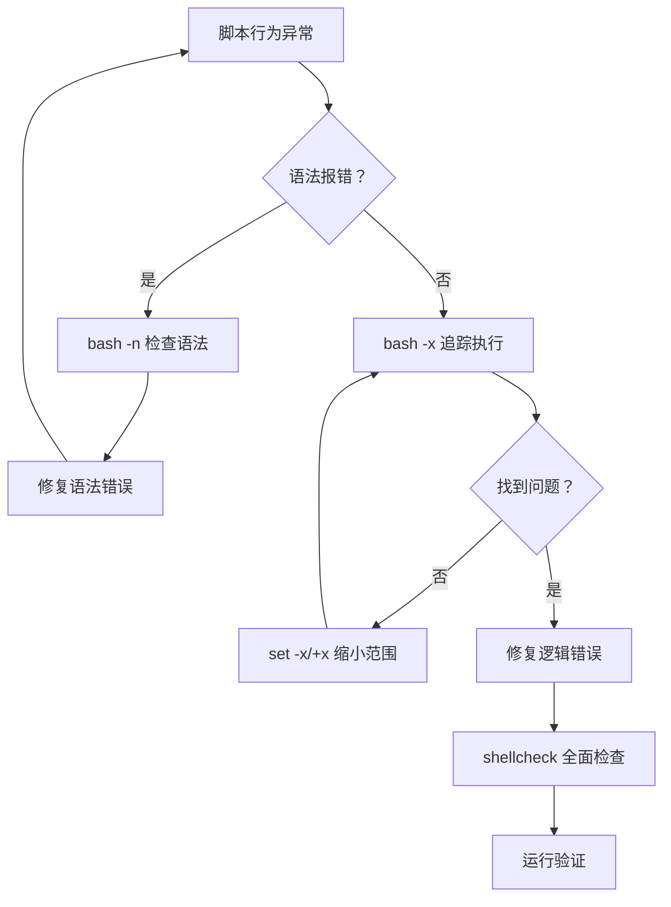

# Shell 脚本编程：让 Linux 替你干活

在上一篇[《深入浅出 Linux》](/posts/linux/linux-fundamentals)中，我们学会了用管道把命令串联起来、用 grep/awk/sed 处理文本、用 find 定位文件、用 ps/top 管理进程。这些技能已经让你能完成很多复杂操作——但每次都要手动输入一长串命令，既容易出错，也无法复用。

**脚本就是把这些一次性命令固化成可重复执行的程序。** 把你每天手动做的备份、清理、检查工作写成脚本，配合 cron 定时任务，就能让 Linux 在凌晨自动替你干活。

本文从零开始讲 Shell 脚本编程，依次介绍变量、条件判断、循环、函数和安全模式，再通过三个实战脚本串联知识，最后讲清楚如何使用 cron 定时运行脚本以及怎样调试问题。适合已经熟悉基本 Linux 命令、想迈入自动化门槛的读者。

---

## 1. 从命令到脚本：第一个 Shell 脚本

### 1.1 什么是 Shell 脚本

Shell 脚本本质上就是一个文本文件，里面按顺序写着你本来要手动输入的命令。Bash 逐行读取这个文件并执行，就像有人在键盘上依次敲下每一行一样。

### 1.2 Shebang：告诉系统用谁执行

脚本第一行 `#!/bin/bash` 叫做 **shebang**（也叫 hashbang），它的作用是告诉操作系统：请用 `/bin/bash` 来解释这个文件。

```bash
#!/bin/bash
echo "Hello, Shell Script!"
```

:::tip 为什么不写 #!/bin/sh
`/bin/sh` 是 POSIX 标准的 Shell，功能比 Bash 少。如果你的脚本用到了 Bash 特有语法（如 `[[ ]]`、数组），用 `/bin/sh` 执行会报错。除非你有意写可移植脚本，否则一律用 `#!/bin/bash`。
:::

### 1.3 创建、授权、执行

```bash
# 创建脚本文件
cat > hello.sh << 'EOF'
#!/bin/bash
echo "Hello, Shell Script!"
EOF

# 添加可执行权限
chmod +x hello.sh

# 三种执行方式
./hello.sh           # 方式1：作为可执行程序运行（需要 shebang 和 +x 权限）
bash hello.sh        # 方式2：显式用 bash 解释执行（不需要 +x 权限）
source hello.sh      # 方式3：在当前 shell 环境中执行（会影响当前环境变量）
```

三种方式的区别至关重要：

| 方式 | 子进程？ | 需要 shebang？ | 需要 +x？ | 影响当前环境？ |
|------|---------|---------------|----------|--------------|
| `./script.sh` | 是（新子进程） | 是 | 是 | 否 |
| `bash script.sh` | 是（新子进程） | 否 | 否 | 否 |
| `source script.sh` | 否（当前进程） | 否 | 否 | **是** |

:::warning source 的副作用
`source` 在当前 shell 中执行脚本，脚本里的变量修改、目录切换（`cd`）都会影响你当前的终端环境。通常只用于加载配置文件（如 `source ~/.bashrc`），执行业务脚本时应该用前两种方式。
:::

---

## 2. 变量与字符串

变量是脚本的核心——没有变量，脚本就只是命令的复读机；有了变量，脚本才能根据不同输入做出不同行为。

### 2.1 变量赋值与使用

```bash
#!/bin/bash

name="Linux"
# 注意：等号两边不能有空格！
# name = "Linux"  ← 错误，Bash 会把 name 当命令执行

echo $name
echo "Hello, ${name}!"
```

**核心规则：赋值时等号两边不能有空格。** 这是最常踩的坑——`name = "Linux"` 会被 Bash 解析为"执行命令 `name`，参数是 `=` 和 `Linux`"。

### 2.2 读取用户输入

```bash
#!/bin/bash

echo "What is your name?"
read username
echo "Welcome, ${username}!"

# read 也可以带提示符（-p 参数）
read -p "Enter your age: " age
echo "You are ${age} years old."

# 静默输入（用于密码）
read -s -p "Enter password: " password
echo
echo "Password received (length: ${#password})"
```

### 2.3 字符串操作

Bash 内置了丰富的字符串处理能力，很多场景下不需要再调用 `awk` 或 `sed`：

```bash
#!/bin/bash

str="Hello World"

# 字符串长度
echo ${#str}                    # 11

# 子字符串（从索引 0 开始，取 5 个字符）
echo ${str:0:5}                 # Hello

# 从第 6 个字符取到末尾
echo ${str:6}                   # World

# 从右边截取（取最后 5 个字符）
echo ${str: -5}                 # World（注意冒号后有空格）

# 替换（只替换第一个匹配）
echo ${str/World/Bash}          # Hello Bash

# 替换所有匹配
file="photo.jpg.bak.jpg"
echo ${file//jpg/png}           # photo.png.bak.png

# 删除前缀
filepath="/home/user/docs/report.txt"
echo ${filepath#/home/user}     # /docs/report.txt（删除最短前缀）
echo ${filepath##*/}            # report.txt（删除最长前缀，取文件名）

# 删除后缀
filename="report.txt"
echo ${filename%.txt}           # report（删除最短后缀）
echo ${filename##*.}            # txt（取扩展名）
```

### 2.4 特殊变量

Bash 预定义了一组特殊变量，在脚本中极为常用：

```bash
#!/bin/bash

# 演示所有特殊变量
echo "Script name: $0"          # 脚本自身的名称
echo "First arg: $1"            # 第 1 个参数
echo "Second arg: $2"           # 第 2 个参数
echo "All args: $@"             # 所有参数（各自独立）
echo "All args as one: $*"      # 所有参数（合为一个字符串）
echo "Arg count: $#"            # 参数个数
echo "Last exit code: $?"       # 上一条命令的退出码
echo "Current PID: $$"          # 当前脚本的进程 ID
```

执行 `./special.sh foo bar baz`，输出：

```
Script name: ./special.sh
First arg: foo
Second arg: bar
All args: foo bar baz
All args as one: foo bar baz
Arg count: 3
Last exit code: 0
Current PID: 12345
```

`$@` 和 `$*` 的区别在循环中体现：

```bash
#!/bin/bash

echo 'Using $*:'
for arg in "$*"; do
  echo "  $arg"
done

echo 'Using $@:'
for arg in "$@"; do
  echo "  $arg"
done
```

执行 `./args.sh "hello world" foo`：

```
Using $*:
  hello world foo        ← 所有参数合为一个字符串
Using $@:
  hello world            ← 各参数保持独立
  foo
```

:::tip 始终用双引号包裹 `$@`
循环中写 `for arg in "$@"` 而不是 `for arg in $@`。不加双引号时，含空格的参数会被拆散。
:::

---

## 3. 条件判断

条件判断让脚本拥有"思考"能力——根据不同情况走不同路径。

### 3.1 if/elif/else/fi

```bash
#!/bin/bash

age=25

if [ "$age" -ge 60 ]; then
  echo "Senior"
elif [ "$age" -ge 18 ]; then
  echo "Adult"
else
  echo "Minor"
fi
```

注意 `if` 和 `then` 的配合：`then` 必须换行或用 `;` 隔开。`fi` 是 `if` 的倒写，表示条件块结束。

### 3.2 测试操作符一览

**文件测试：**

| 操作符 | 含义 |
|--------|------|
| `-e file` | 文件存在（不限类型） |
| `-f file` | 存在且是普通文件 |
| `-d file` | 存在且是目录 |
| `-r file` | 文件可读 |
| `-w file` | 文件可写 |
| `-x file` | 文件可执行 |
| `-s file` | 文件存在且非空 |

**字符串测试：**

| 操作符 | 含义 |
|--------|------|
| `-z str` | 字符串为空 |
| `-n str` | 字符串非空 |
| `str1 = str2` | 字符串相等 |
| `str1 != str2` | 字符串不等 |

**整数比较：**

| 操作符 | 含义 |
|--------|------|
| `-eq` | 等于 |
| `-ne` | 不等于 |
| `-gt` | 大于 |
| `-ge` | 大于等于 |
| `-lt` | 小于 |
| `-le` | 小于等于 |

:::important 整数比较不要用 < > =
`[ "$a" > "$b" ]` 不会报整数比较错误，而是做字符串的字典序比较——`[ 9 -gt 10 ]` 为假，但 `[ "9" \> "10" ]` 为真（因为 "9" 字典序在 "10" 之后）。整数比较一定要用 `-gt`、`-lt` 等。
:::

### 3.3 `[[ ]]` vs `[ ]` vs `test`

```bash
# 方式1：test 命令（最古老）
if test "$age" -ge 18; then ...

# 方式2：[ ] 是 test 的语法糖（POSIX 标准）
if [ "$age" -ge 18 ]; then ...

# 方式3：[[ ]] 是 Bash 增强版（推荐）
if [[ $age -ge 18 ]]; then ...
```

`[[ ]]` 相比 `[ ]` 的优势：

- 变量不需要加双引号保护（`[[ $str = "" ]]` 安全，`[ $str = "" ]` 在 str 为空时会语法错误）
- 支持 `&&`、`||`、`!` 逻辑运算符（`[ ]` 只能用 `-a`、`-o`）
- 支持 `=~` 正则匹配
- 支持 `<`、`>` 字符串比较（不需要转义）

```bash
#!/bin/bash

read -p "Enter an email: " email

if [[ $email =~ ^[a-zA-Z0-9._%+-]+@[a-zA-Z0-9.-]+\.[a-zA-Z]{2,}$ ]]; then
  echo "Valid email format"
else
  echo "Invalid email format"
fi
```

:::note 可移植性
如果你的脚本可能在 dash 或其他非 Bash 的 shell 上运行，应该用 `[ ]`。如果确定运行在 Bash 上，优先用 `[[ ]]`。
:::

### 3.4 case/esac：多分支匹配

当你需要判断一个变量可能等于多个值时，`case` 比 `if/elif` 链更清晰：

```bash
#!/bin/bash

read -p "Enter file extension: " ext

case "$ext" in
  jpg|jpeg|png|gif)
    echo "Image file"
    ;;
  mp4|avi|mkv)
    echo "Video file"
    ;;
  mp3|flac|wav)
    echo "Audio file"
    ;;
  *)
    echo "Unknown file type"
    ;;
esac
```

每个分支以 `;;` 结束，`*)` 是默认分支（类似其他语言的 `default`）。`esac` 是 `case` 的倒写。

### 3.5 完整示例：检查服务是否运行

```bash
#!/bin/bash

read -p "Enter service name: " service

if ! command -v systemctl &> /dev/null; then
  echo "systemctl not found, trying service command..."
  if service "$service" status &> /dev/null; then
    echo "Service '$service' is running."
  else
    echo "Service '$service' is NOT running."
  fi
else
  case "$(systemctl is-active "$service" 2>/dev/null)" in
    active)
      echo "Service '$service' is running (active)."
      ;;
    inactive)
      echo "Service '$service' is stopped (inactive)."
      ;;
    failed)
      echo "Service '$service' has failed! Check 'journalctl -u $service'."
      ;;
    *)
      echo "Unable to determine status of '$service'."
      ;;
  esac
fi
```

---

## 4. 循环

循环让脚本拥有重复执行的能力——处理一批文件、遍历一组参数、等待某个条件满足。

### 4.1 for 循环

**列表迭代：**

```bash
#!/bin/bash

for fruit in apple banana cherry; do
  echo "I like $fruit"
done
```

**遍历文件：**

```bash
#!/bin/bash

for file in /var/log/*.log; do
  echo "Processing: $file ($(wc -l < "$file") lines)"
done
```

**C 风格 for 循环（适合数值迭代）：**

```bash
#!/bin/bash

for ((i = 1; i <= 10; i++)); do
  echo "Count: $i"
done
```

### 4.2 while 循环

**计数器：**

```bash
#!/bin/bash

count=1
while [[ $count -le 5 ]]; do
  echo "Round $count"
  ((count++))
done
```

**逐行读取文件：**

```bash
#!/bin/bash

while IFS= read -r line; do
  echo "Line: $line"
done < /etc/hostname
```

:::tip IFS= 和 -r 不能省略
- `IFS=` 防止行首尾的空白被截断
- `-r` 防止反斜杠被当作转义符处理

这是逐行读取文件的标准写法，务必记住。
:::

### 4.3 until 循环

`until` 是 `while` 的反面——条件为假时执行，为真时停止：

```bash
#!/bin/bash

response=""
until [[ "$response" == "yes" || "$response" == "no" ]]; do
  read -p "Do you agree? (yes/no): " response
done

echo "You chose: $response"
```

### 4.4 break 与 continue

```bash
#!/bin/bash

# break：跳出整个循环
for i in 1 2 3 4 5; do
  if [[ $i -eq 3 ]]; then
    break
  fi
  echo "i = $i"
done
# 输出：i = 1, i = 2

# continue：跳过本次，进入下一次
for i in 1 2 3 4 5; do
  if [[ $i -eq 3 ]]; then
    continue
  fi
  echo "i = $i"
done
# 输出：i = 1, i = 2, i = 4, i = 5
```

### 4.5 完整示例：批量重命名文件

```bash
#!/bin/bash

if [[ $# -lt 2 ]]; then
  echo "Usage: $0 <old_extension> <new_extension>"
  echo "Example: $0 txt md"
  exit 1
fi

old_ext="$1"
new_ext="$2"
count=0

for file in *."$old_ext"; do
  if [[ ! -e "$file" ]]; then
    echo "No .${old_ext} files found."
    exit 0
  fi

  new_name="${file%."$old_ext"}.${new_ext}"
  mv "$file" "$new_name"
  echo "Renamed: $file -> $new_name"
  ((count++))
done

echo "Done. $count file(s) renamed."
```

执行 `./rename.sh txt md` 会把当前目录所有 `.txt` 文件重命名为 `.md` 文件。

---

## 5. 函数

当脚本变长，函数是组织代码的基本手段——把重复逻辑封装起来，让脚本更清晰、更易维护。

### 5.1 定义与调用

```bash
#!/bin/bash

greet() {
  echo "Hello, $1!"
}

greet "Alice"
greet "Bob"
```

函数定义必须在调用之前（Bash 是从上到下解释的）。函数名后跟 `()`，函数体用 `{}` 包裹。

### 5.2 参数与返回值

函数通过位置参数（`$1`、`$2`...）接收参数，通过 `return` 返回退出码（0-255 的整数）：

```bash
#!/bin/bash

is_even() {
  local num="$1"
  if [[ $((num % 2)) -eq 0 ]]; then
    return 0
  else
    return 1
  fi
}

for n in 1 2 3 4 5; do
  if is_even "$n"; then
    echo "$n is even"
  else
    echo "$n is odd"
  fi
done
```

:::note return 不是 return value
Shell 函数的 `return` 返回的是**退出码**（0 表示成功，非 0 表示失败），不是返回值。如果需要函数"返回"一个字符串，用 `echo` 输出，然后调用方用 `$(func)` 捕获：
:::

```bash
#!/bin/bash

get_absolute_path() {
  local path="$1"
  cd "$(dirname "$path")"
  echo "$(pwd)/$(basename "$path")"
  cd - > /dev/null
}

abs=$(get_absolute_path "../config.yaml")
echo "Absolute path: $abs"
```

### 5.3 local 与作用域

```bash
#!/bin/bash

global_var="I am global"

demo() {
  local local_var="I am local to demo()"
  global_var="Modified inside function"
  echo "Inside: local_var=$local_var, global_var=$global_var"
}

demo
echo "Outside: local_var=$local_var, global_var=$global_var"
```

输出：

```
Inside: local_var=I am local to demo(), global_var=Modified inside function
Outside: local_var=, global_var=Modified inside function
```

函数内的 `local` 变量不会污染外部，但未声明 `local` 的变量会修改全局作用域。**养成习惯：函数内的变量一律加 `local`。**

### 5.4 完整示例：可复用的日志函数

```bash
#!/bin/bash

LOG_FILE="/tmp/myapp.log"

log() {
  local level="$1"
  local message="$2"
  local timestamp
  timestamp=$(date '+%Y-%m-%d %H:%M:%S')
  local entry="[$timestamp] [$level] $message"

  case "$level" in
    ERROR)
      echo -e "\033[31m$entry\033[0m" >&2
      ;;
    WARN)
      echo -e "\033[33m$entry\033[0m" >&2
      ;;
    INFO)
      echo -e "\033[32m$entry\033[0m"
      ;;
    DEBUG)
      echo -e "\033[36m$entry\033[0m"
      ;;
    *)
      echo "$entry"
      ;;
  esac

  echo "$entry" >> "$LOG_FILE"
}

log INFO "Application started"
log WARN "Disk usage above 80%"
log ERROR "Database connection failed"
log DEBUG "Query execution time: 0.3s"
```

这个日志函数同时输出到终端（带颜色）和日志文件，`ERROR` 和 `WARN` 还会输出到 stderr，方便与其他输出分离。

---

## 6. 安全模式与最佳实践

Shell 脚本有一个臭名昭著的特点：**默认太宽容。** 命令失败了？继续执行。变量拼错了？当作空字符串。管道中某个命令崩了？只看最后一个的退出码。这些"宽容"在自动化脚本中是灾难。

### 6.1 set -e：出错即停

```bash
#!/bin/bash

# 没有 set -e 时：
mkdir /root/backup    # 这行会失败（权限不够）
echo "Backup complete" # 但这行仍然会执行！输出误导信息
```

加上 `set -e`：

```bash
#!/bin/bash
set -e

mkdir /root/backup    # 失败 → 脚本立即退出
echo "Backup complete" # 不会执行
```

### 6.2 set -u：未定义变量报错

```bash
#!/bin/bash

# 没有 set -u 时：
echo "Hello, $USERNAME"  # 拼错了变量名 → 输出 "Hello, "（空字符串）
rm -rf "$HOMEDIR/backups" # $HOMEDIR 为空 → rm -rf /backups ← 灾难！
```

加上 `set -u`：

```bash
#!/bin/bash
set -u

echo "Hello, $USERNAMEE"  # 报错：USERNAMEE: unbound variable，脚本退出
```

### 6.3 set -o pipefail：管道中任何一步失败都算失败

```bash
#!/bin/bash
set -e

# 没有 pipefail 时：
cat /nonexistent | grep "pattern" | wc -l
# cat 失败了，但 wc -l 成功返回 0 → 整个管道退出码为 0 → set -e 不会触发
echo "This still runs"
```

加上 `pipefail`：

```bash
#!/bin/bash
set -eo pipefail

cat /nonexistent | grep "pattern" | wc -l  # cat 失败 → 管道退出码非 0 → 脚本退出
echo "This won't run"
```

### 6.4 组合使用：set -euo pipefail

这是 Shell 脚本的事实标准安全头：

```bash
#!/bin/bash
set -euo pipefail
```

| 选项 | 作用 | 防止的坑 |
|------|------|---------|
| `-e` | 命令失败即退出 | 错误被静默忽略 |
| `-u` | 未定义变量报错 | 拼错变量名变成空字符串 |
| `-o pipefail` | 管道任何步骤失败都报错 | 管道中前面的错误被吞掉 |

:::important 所有生产脚本都应加上这一行
除非你有意让脚本在错误后继续（比如检查某个可选命令是否存在），否则不要省略。不写 `set -euo pipefail` 的脚本就像不系安全带开车——大部分时候没事，出事就是大事。
:::

### 6.5 shellcheck：你的 Shell 脚本 linter

即使加了安全模式，很多隐患仍靠人眼发现不了。`shellcheck` 是一个静态分析工具，能自动检测数百种常见错误：

```bash
# 安装
sudo apt install shellcheck

# 使用
shellcheck myscript.sh
```

示例——shellcheck 能发现的问题：

```bash
#!/bin/bash
# SC2086: Double quote to prevent globbing and word splitting
echo $1                          # 应改为 echo "$1"

# SC2006: Use $(...) instead of legacy backticks
today=`date +%Y-%m-%d`           # 应改为 today=$(date +%Y-%m-%d)

# SC2164: Use 'cd ... || exit' in case cd fails
cd /tmp                          # 应改为 cd /tmp || exit 1

# SC2034: var appears unused
unused_var="hello"               # 变量定义后从未使用
```

### 6.6 防御性编程模式

```bash
#!/bin/bash
set -euo pipefail

# 模式1：检查必需命令是否存在
for cmd in jq curl aws; do
  if ! command -v "$cmd" &> /dev/null; then
    echo "Error: Required command '$cmd' not found." >&2
    exit 1
  fi
done

# 模式2：cd 失败时退出
cd /opt/myapp || { echo "Failed to cd to /opt/myapp" >&2; exit 1; }

# 模式3：锁定脚本，防止并发执行
LOCKFILE="/tmp/myapp.lock"
if ! mkdir "$LOCKFILE" 2>/dev/null; then
  echo "Another instance is already running." >&2
  exit 1
fi
trap 'rm -rf "$LOCKFILE"' EXIT

# 模式4：验证输入参数
if [[ $# -ne 2 ]]; then
  echo "Usage: $0 <source> <destination>" >&2
  exit 1
fi

source_dir="$1"
dest_dir="$2"

if [[ ! -d "$source_dir" ]]; then
  echo "Error: Source directory '$source_dir' does not exist." >&2
  exit 1
fi
```

---

## 7. 实战脚本

现在把前面学到的所有知识串起来，写三个可作为起点、并应按运行环境调整的脚本。

### 7.1 批量备份脚本

需求：备份指定目录，文件名带时间戳，保留最近 N 份，自动清理旧备份。

```bash
#!/bin/bash
set -euo pipefail

SOURCE_DIR="${1:?Usage: $0 <source_dir> [keep_count]}"
KEEP_COUNT="${2:-5}"
BACKUP_DIR="/backup"

for cmd in date tar find sort du cut dirname basename mkdir rm; do
  if ! command -v "$cmd" >/dev/null 2>&1; then
    echo "Error: Required command '$cmd' not found." >&2
    exit 1
  fi
done

if [[ ! "$KEEP_COUNT" =~ ^[1-9][0-9]*$ ]]; then
  echo "Error: keep_count must be a positive integer, got '$KEEP_COUNT'." >&2
  exit 1
fi

if [[ ! -d "$SOURCE_DIR" ]]; then
  echo "Error: Source directory '$SOURCE_DIR' does not exist." >&2
  exit 1
fi

mkdir -p "$BACKUP_DIR"

echo "Backing up '$SOURCE_DIR' ..."
if ! tar -czf "$BACKUP_PATH" -C "$(dirname "$SOURCE_DIR")" "$(basename "$SOURCE_DIR")" 2>/dev/null; then
  echo "Error: Backup failed!" >&2
  rm -f -- "$BACKUP_PATH"
  exit 1
fi

SIZE=$(du -sh -- "$BACKUP_PATH" | cut -f1)
echo "Backup created: ${BACKUP_NAME} (${SIZE})"

# 每条记录以 NUL 结尾，排序和数组读取都不会按空格或换行拆分路径
backup_records=()
while IFS= read -r -d '' record; do
  backup_records+=("$record")
done < <(
  find "$BACKUP_DIR" -maxdepth 1 -type f -name 'backup_*.tar.gz' \
    -printf '%T@ %p\0' | sort -z -n
)

count=${#backup_records[@]}
if (( count > KEEP_COUNT )); then
  delete_count=$((count - KEEP_COUNT))
  echo "Cleaning up old backups (keeping ${KEEP_COUNT}, removing ${delete_count})..."
  for ((i = 0; i < delete_count; i++)); do
    # 去掉记录开头的时间戳和第一个空格，剩余内容是完整路径
    old_backup="${backup_records[$i]#* }"
    rm -f -- "$old_backup"
  done
  echo "Cleanup done."
fi

echo "Backup completed successfully."
```

:::tip 参数缺失时报错的写法
`${1:?Usage: ...}` 是一种简洁的参数校验写法——如果 `$1` 为空或未设置，脚本会输出冒号后的消息并退出（退出码 1）。比手动写 if 判断更紧凑。
:::

### 7.2 日志清理脚本

需求：删除 N 天前的旧日志，支持 dry-run 模式（只显示将删除什么，不真删），备份重要日志后再删。

```bash
#!/bin/bash
set -euo pipefail

LOG_DIR="/var/log/app"
DAYS=30
DRY_RUN=false
ARCHIVE_DIR="/var/log/archive"
PARTIAL_ARCHIVE=""

cleanup_partial_archive() {
  if [[ -n "${PARTIAL_ARCHIVE:-}" && -e "$PARTIAL_ARCHIVE" ]]; then
    rm -f -- "$PARTIAL_ARCHIVE"
  fi
}

# 正常退出或收到中断/终止信号时，清理尚未完成的归档
trap cleanup_partial_archive EXIT
trap 'exit 130' INT
trap 'exit 143' TERM

for arg in "$@"; do
  case "$arg" in
    --dry-run)
      DRY_RUN=true
      ;;
    --days=*)
      DAYS="${arg#--days=}"
      ;;
    --help)
      echo "Usage: $0 [--days=N] [--dry-run]"
      echo "  --days=N    Delete logs older than N days (default: 30)"
      echo "  --dry-run   Show what would be deleted without actually deleting"
      exit 0
      ;;
  esac
done

if ! [[ "$DAYS" =~ ^[0-9]+$ ]]; then
  echo "Error: --days must be a non-negative integer, got '$DAYS'" >&2
  exit 1
fi

for cmd in date find tar stat numfmt mkdir mv rm; do
  if ! command -v "$cmd" >/dev/null 2>&1; then
    echo "Error: Required command '$cmd' not found." >&2
    exit 1
  fi
done

if [[ ! -d "$LOG_DIR" ]]; then
  echo "Error: Log directory '$LOG_DIR' does not exist." >&2
  exit 1
fi

old_files=()
while IFS= read -r -d '' file; do
  old_files+=("$file")
done < <(find "$LOG_DIR" -type f -name '*.log' -mtime +"$DAYS" -print0)

if [[ ${#old_files[@]} -eq 0 ]]; then
  echo "No log files older than $DAYS days found."
  exit 0
fi

total_size=0
for file in "${old_files[@]}"; do
  size=$(stat -c '%s' -- "$file")
  total_size=$((total_size + size))
  if $DRY_RUN; then
    printf '[DRY RUN] Would delete: %q (%s)\n' \
      "$file" "$(numfmt --to=iec "$size")"
  fi
done

if $DRY_RUN; then
  echo "[DRY RUN] Total: ${#old_files[@]} files, $(numfmt --to=iec "$total_size") would be freed."
  exit 0
fi

mkdir -p "$ARCHIVE_DIR"
ARCHIVE_NAME="logs_before_cleanup_$(date '+%Y%m%d_%H%M%S').tar.gz"
ARCHIVE_PATH="${ARCHIVE_DIR}/${ARCHIVE_NAME}"
PARTIAL_ARCHIVE="${ARCHIVE_PATH}.partial.$$"

# tar 在 LOG_DIR 下接收数组参数，文件名中的空格和换行不会被再次拆分
relative_files=()
for file in "${old_files[@]}"; do
  relative_files+=("${file#"$LOG_DIR"/}")
done

if ! tar -czf "$PARTIAL_ARCHIVE" -C "$LOG_DIR" -- "${relative_files[@]}"; then
  echo "Error: Archive failed; no log files were deleted." >&2
  exit 1
fi

if ! tar -tzf "$PARTIAL_ARCHIVE" >/dev/null; then
  echo "Error: Archive verification failed; no log files were deleted." >&2
  exit 1
fi

# 归档创建并验证成功后再改为最终名称；mv 失败时同样不会进入删除阶段
mv -- "$PARTIAL_ARCHIVE" "$ARCHIVE_PATH"
PARTIAL_ARCHIVE=""
echo "Archived old logs to $ARCHIVE_PATH"

for file in "${old_files[@]}"; do
  rm -f -- "$file"
done

echo "Deleted ${#old_files[@]} log files, freed $(numfmt --to=iec "$total_size")."
```

:::important 归档失败与恢复
脚本只会在归档创建、校验并改为最终名称后删除原日志；任何一步失败都会退出，原日志保持不动。`trap` 会清理正常退出、`Ctrl+C` 或终止信号留下的 `.partial.*` 文件。断电或 `SIGKILL` 无法触发 `trap`，若发现残留的部分归档，可先用 `tar -tzf <部分归档>` 检查：校验通过后可人工改名保留，校验失败则删除它并重新运行脚本。部署前还应按日志写入方式、权限、存储空间与恢复流程做演练。
:::

### 7.3 健康检查脚本

需求：检查磁盘空间、内存使用、关键服务状态、负载，任何一项超标就发送告警。

```bash
#!/bin/bash
set -euo pipefail

DISK_THRESHOLD=80
MEM_THRESHOLD=85
LOAD_THRESHOLD=$(nproc)
# Ubuntu/Debian 的 OpenSSH systemd 服务名通常是 ssh
SERVICES=(nginx ssh cron)
ALERT_EMAIL="admin@example.com"
ALERT=false
REPORT=""

send_alert() {
  local subject="$1"
  local body="$2"
  if command -v mail &> /dev/null; then
    echo "$body" | mail -s "$subject" "$ALERT_EMAIL"
  else
    echo "ALERT (mail not configured): $subject"
    echo "$body"
  fi
}

check_disk() {
  local section=""
  section+="=== Disk Usage ===\n"
  while IFS= read -r line; do
    partition=$(echo "$line" | awk '{print $1}')
    usage=$(echo "$line" | awk '{print $5}' | tr -d '%')
    mount=$(echo "$line" | awk '{print $6}')
    section+="  $partition ($mount): ${usage}%"

    if [[ $usage -ge $DISK_THRESHOLD ]]; then
      section+=" ⚠ EXCEEDED ${DISK_THRESHOLD}%\n"
      ALERT=true
    else
      section+=" OK\n"
    fi
  done < <(df -h | grep '^/dev/')

  REPORT+="$section"
}

check_memory() {
  local section=""
  section+="=== Memory Usage ===\n"
  local total used pct
  if command -v free &> /dev/null; then
    read -r _ total used _ _ pct _ < <(free -m | grep '^Mem:')
    pct=$(free | grep '^Mem:' | awk '{print $3/$2 * 100.0}' | cut -d. -f1)
    section+="  Total: ${total}MB, Used: ${used}MB (${pct}%)\n"

    if [[ $pct -ge $MEM_THRESHOLD ]]; then
      section+="  ⚠ EXCEEDED ${MEM_THRESHOLD}%\n"
      ALERT=true
    else
      section+="  OK\n"
    fi
  fi
  REPORT+="$section"
}

check_load() {
  local section=""
  section+="=== System Load ===\n"
  local load1 load5 load15
  read -r load1 load5 load15 _ < /proc/loadavg
  section+="  1min: ${load1}, 5min: ${load5}, 15min: ${load15} (cores: $(nproc))\n"

  load_int=$(echo "$load1" | cut -d. -f1)
  if [[ $load_int -ge $LOAD_THRESHOLD ]]; then
    section+="  ⚠ 1-min load exceeds core count!\n"
    ALERT=true
  else
    section+="  OK\n"
  fi
  REPORT+="$section"
}

check_services() {
  local section=""
  section+="=== Service Status ===\n"
  for svc in "${SERVICES[@]}"; do
    if systemctl is-active --quiet "$svc" 2>/dev/null; then
      section+="  $svc: Running\n"
    else
      section+="  $svc: ⚠ NOT RUNNING\n"
      ALERT=true
    fi
  done
  REPORT+="$section"
}

echo "Running health check at $(date '+%Y-%m-%d %H:%M:%S')..."
echo

check_disk
check_memory
check_load
check_services

echo -e "$REPORT"

if $ALERT; then
  HOSTNAME=$(hostname)
  send_alert "[$HOSTNAME] Health Check Alert" "$(echo -e "$REPORT")"
  echo "Alert sent to $ALERT_EMAIL"
  exit 1
else
  echo "All checks passed."
  exit 0
fi
```

上面的健康检查脚本可以由 cron 定时运行，但不要把下面的定时表达式直接粘贴到普通终端。在自动执行之前，还要先理解 cron 的配置位置、时间字段和运行环境。

---

## 8. 使用 cron 定时运行脚本

### 8.1 cron 与 crontab 分别是什么

**cron** 是按时间计划启动任务的系统服务；一条计划任务通常称为 cron job。**crontab** 是用户查看和编辑这些计划任务的命令。

```bash
crontab -l    # 列出当前用户的计划任务
crontab -e    # 使用编辑器打开当前用户的计划任务
```

第一次运行 `crontab -e` 时，系统可能要求选择文本编辑器。保存并退出后，cron 会读取新配置，不需要手动执行其中的每一行。

`crontab -r` 会删除当前用户的全部计划任务，并且一些实现默认不会逐项确认，因此不要把它当成普通清理命令使用。

每个用户拥有独立的 crontab，其中的命令会以该用户身份运行。例如 `ecs-user` 通过 `crontab -e` 添加的任务通常没有 root 权限，也就可能无法写入 `/var/log`。

### 8.2 五个时间字段怎么读

用户 crontab 中，每个非空配置行的结构是：

```text
分钟 小时 月中日期 月份 星期  要执行的命令
```

五个时间字段的位置固定：

```text
┌──────── 分钟：0～59
│ ┌────── 小时：0～23
│ │ ┌──── 月中日期：1～31
│ │ │ ┌── 月份：1～12
│ │ │ │ ┌ 星期：通常 0～7，其中 0 和 7 表示星期日
│ │ │ │ │
* * * * * 要执行的命令
```

`*` 表示该字段允许所有值。下面这行表示每天早上 8:00 执行一次：

```cron
0 8 * * * /opt/scripts/health-check.sh
```

逐字段拆解：

| 字段 | 值 | 含义 |
| :--- | :--- | :--- |
| 分钟 | `0` | 第 0 分钟 |
| 小时 | `8` | 8 点 |
| 月中日期 | `*` | 每一天 |
| 月份 | `*` | 每个月 |
| 星期 | `*` | 不限制星期 |

其他常见写法：

```cron
30 2 * * *     /path/to/script.sh  # 每天 02:30
*/10 * * * *   /path/to/script.sh  # 每 10 分钟
0 9 * * 1-5    /path/to/script.sh  # 周一到周五 09:00
0 0 1 * *      /path/to/script.sh  # 每月 1 日 00:00
```

`*/10` 表示在该字段范围内每隔 10 个单位，`1-5` 表示从 1 到 5。不同 cron 实现对“月中日期”和“星期”同时受限时的匹配规则可能令人意外，初学时应尽量避免在一条规则中同时限制这两个字段。

### 8.3 配置每天 8 点执行健康检查

先在终端中手动确认脚本存在、拥有执行权限并且能够正常运行：

```bash
ls -l /opt/scripts/health-check.sh
chmod u+x /opt/scripts/health-check.sh
/opt/scripts/health-check.sh
```

如果脚本不在 `/opt/scripts`，必须把后面的 cron 配置替换成真实的**绝对路径**。可以先用 `pwd` 查看当前目录，再与脚本文件名组合成完整路径。

普通用户往往不能写入 `/var/log`。下面假设实际用户名是 `ecs-user`，并把日志保存到该用户的家目录；使用时必须把用户名和路径替换成当前服务器上的真实值：

```bash
mkdir -p /home/ecs-user/logs
crontab -e
```

在编辑器中添加：

```cron
0 8 * * * /opt/scripts/health-check.sh >> /home/ecs-user/logs/health-check.log 2>&1
```

这行配置可以分成两部分：

1. `0 8 * * *`：每天 8:00 触发。
2. 后面的命令：运行脚本，把 stdout 追加到日志，再让 stderr 写入同一个日志。

`>>` 和 `2>&1` 已在上一篇文章中讲解：`>>` 保留旧日志并追加新内容，`2>&1` 让错误输出跟随正常输出。保存 crontab 后可以检查：

```bash
crontab -l
```

如果确实需要写入 `/var/log`，可以由管理员创建合适的日志文件并授予最小必要权限，或者谨慎使用 root 的 crontab。不要仅为解决日志权限而让整个脚本长期以 root 身份运行。

### 8.4 cron 环境为什么和手动运行不同

cron 启动任务时没有日常交互式终端环境，常见差异包括：

- **工作目录不同**：不要假设任务从脚本所在目录启动；脚本应使用绝对路径，或主动切换到确定的目录。
- **PATH 较精简**：某些手动可用的命令在 cron 中可能找不到。重要脚本可在开头设置明确的 `PATH`，或使用命令的绝对路径。
- **用户权限不同**：用户 crontab 以所属用户身份运行，不会自动获得 `sudo` 权限。
- **环境变量较少**：不要默认交互式 Shell 配置中的自定义变量和别名存在。
- **没有可见终端**：应把 stdout 和 stderr 保存到日志，否则失败信息可能难以发现。

例如可以在脚本开头设置一个明确的命令搜索路径：

```bash
#!/bin/bash
PATH=/usr/local/sbin:/usr/local/bin:/usr/sbin:/usr/bin:/sbin:/bin

# 后面再执行脚本逻辑
```

cron 按服务器的时区计算时间。可以运行下面的命令检查当前时间和时区：

```bash
date                 # 显示服务器当前时间
timedatectl status   # 在使用 systemd 的系统上显示时区等信息
```

夏令时切换也可能导致某个本地时间重复或不存在。对时间要求严格的任务，应明确服务器时区并检查所在地区的夏令时规则。

### 8.5 cron 没有执行时怎么检查

按下面的顺序排查：

1. 在终端中以同一用户手动运行脚本，确认脚本本身成功。
2. 运行 `crontab -l`，确认规则确实保存，并检查五个时间字段。
3. 检查脚本和日志路径是否使用绝对路径，以及当前用户是否有相应权限。
4. 查看重定向后的日志中是否有 `command not found`、`Permission denied` 等错误。
5. 确认 cron 服务正在运行。Debian/Ubuntu 常用 `systemctl status cron`，RHEL 系常用 `systemctl status crond`；服务名取决于发行版。
6. 检查服务器时区，不要直接按本地电脑时间推断触发时刻。

:::warning 先手动验证，再交给 cron
定时任务会在无人观察时重复执行。涉及删除、覆盖、发送通知或修改生产数据的脚本，应先在测试目录手动验证，并确保重复运行不会造成额外破坏，再配置 cron。
:::

---

## 9. 调试技巧

脚本写出来了，但运行结果和预期不一样？以下方法帮你快速定位问题。

### 9.1 bash -x：追踪执行过程

`-x` 选项（xtrace）会在执行每条命令前先打印该命令（变量已展开），是调试的首选工具：

```bash
bash -x myscript.sh
```

输出类似：

```
+ name=Linux
+ echo 'Hello, Linux'
Hello, Linux
+ '[' Linux = Linux ']'
+ echo 'Match!'
Match!
```

每行前的 `+` 表示这是脚本中的命令（不是脚本的输出）。通过这种方式你能看到每一步实际执行了什么。

### 9.2 bash -n：语法检查

`-n` 只检查语法，不执行脚本。适合在编辑后快速验证：

```bash
bash -n myscript.sh
```

如果没有任何输出，说明语法正确。有错误时会报告行号：

```
myscript.sh: line 10: syntax error near unexpected token `fi'
myscript.sh: line 10: `fi'
```

### 9.3 选择性追踪

不想追踪整个脚本，只想看某一段的执行过程：

```bash
#!/bin/bash

echo "This line is NOT traced"

set -x
# 以下部分会被追踪
for i in 1 2 3; do
  echo "i = $i"
done
set +x

echo "This line is NOT traced either"
```

### 9.4 trap：退出时的清理工作

`trap` 可以捕获信号或脚本退出事件，执行指定的清理操作——无论脚本是正常结束还是被 Ctrl+C 中断：

```bash
#!/bin/bash
set -euo pipefail

TEMP_DIR=$(mktemp -d)

cleanup() {
  echo "Cleaning up temp directory: $TEMP_DIR"
  rm -rf "$TEMP_DIR"
}

trap cleanup EXIT

echo "Working in $TEMP_DIR"
echo "important data" > "$TEMP_DIR/data.txt"
cat "$TEMP_DIR/data.txt"

# 无论脚本正常结束还是被中断，cleanup 都会被调用
```

`trap` 常见的信号：

| 信号 | 触发场景 |
|------|---------|
| `EXIT` | 脚本退出时（无论原因） |
| `INT` | Ctrl+C |
| `TERM` | kill 命令默认信号 |
| `ERR` | 命令失败时（配合 set -e 使用） |

更完善的 trap 示例——同时记录错误行号：

```bash
#!/bin/bash
set -euo pipefail

error_handler() {
  local line_no=$1
  echo "Error at line $line_no" >&2
  cleanup
}

cleanup() {
  rm -rf "$TEMP_DIR"
}

TEMP_DIR=$(mktemp -d)
trap 'error_handler $LINENO' ERR
trap cleanup EXIT

echo "Script running..."
false   # 这行会触发 ERR trap
echo "This won't print"
```

### 9.5 调试流程小结



---

## 总结

这篇文章我们走完了从"敲命令"到"写脚本"的跃迁：

- **脚本基础**：shebang、执行方式、变量与字符串操作
- **控制流**：`if/case` 条件判断、`for/while/until` 循环
- **函数**：参数传递、返回值、`local` 变量作用域
- **安全编程**：`set -euo pipefail` + `shellcheck` 是底线
- **实战**：备份、清理、健康检查三个可按实际环境调整的脚本
- **定时执行**：cron 五字段表达式、用户权限、日志、时区和运行环境
- **调试**：`-x` 追踪、`-n` 语法检查、`trap` 清理

写脚本的终极原则：**让脚本替你做重复的事，让你自己去做更有价值的事。**

下一篇[《云服务器入门：从购买、连接到安全加固》](/posts/linux/cloud-server-getting-started)中，我们将把这些脚本搬到真实的服务器上。你写的备份脚本、健康检查脚本，都将在云端真正发挥作用——但在那之前，先得有一台服务器，并通过密钥登录、防火墙等基础配置降低公网暴露风险。
