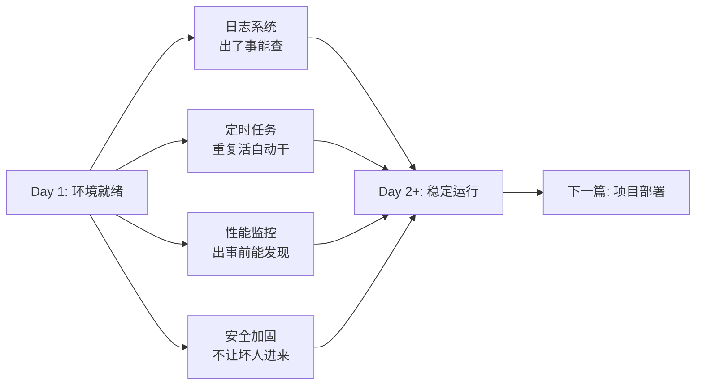
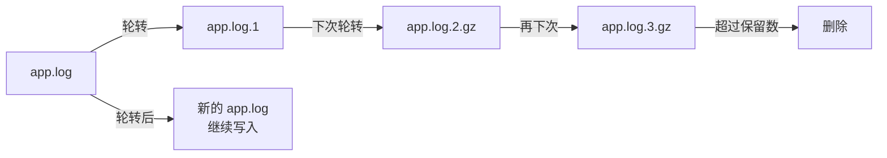

# 系统运维与安全：日志、定时任务、监控与加固

在上一篇《[云服务器环境搭建](/posts/linux/cloud-server-environment-setup)》中，我们给服务器装好了 Node.js、Python、MySQL、Redis 和 Nginx，用 systemd 把它们托管为可靠的服务。此时你的服务器已经"能跑了"——但"能跑"和"能放心跑"之间，还差着一整层运维能力。

这是所谓的 **Day 2 问题**：Day 1 把东西搭起来，Day 2 开始才会遇到真正的麻烦——

- 凌晨三点 Nginx 突然 502，你怎么查原因？→ **日志**
- 每天凌晨要备份数据库，总不能自己爬起来敲命令？→ **定时任务**
- 内存明明还有，进程却被杀了？→ **监控**
- SSH 端口开放不到一天，已经有上千次暴力破解尝试？→ **安全**

这四个问题恰好对应运维的四大支柱：**可观测性（日志）、自动化（定时任务）、警觉性（监控）、防御性（安全）**。本文就围绕这四大支柱展开，让你从"搭好环境"进阶到"稳稳当当运行"。



:::note 环境约定
本文以 **Ubuntu 22.04 / 24.04 LTS** 为例。CentOS/RHEL 用户把 `apt` 换成 `dnf`、`systemctl` 用法一致、部分工具名称略有差异，文中会特别标注。
:::

---

## 1. 日志系统：一切皆可查

### 1.1 为什么日志如此重要

日志是服务器的"黑匣子"。飞机坠毁后，调查人员靠黑匣子还原真相；服务器出故障后，你同样只能靠日志来回答：

- "昨天晚上十点到底发生了什么？"
- "Nginx 返回 502 的时候，上游应用还在跑吗？"
- "谁在什么时候用 SSH 登录了系统？"

没有日志，排障就是盲人摸象。更关键的是，**日志必须提前配置好**——等出事再去想"日志存哪了"，往往已经来不及了。

### 1.2 journalctl：systemd 的日志引擎

在上一篇中，我们用 systemd 管理了所有服务。systemd 不仅管服务启停，它还**自动收集所有服务的日志**——这就是 `journalctl` 的数据来源。

**基本查询：**

```bash
# 查看全部日志（量很大，一般不直接用）
journalctl

# 只看最近 50 行
journalctl -n 50

# 实时跟踪日志（类似 tail -f）
journalctl -f
```

**按服务过滤（最常用的姿势）：**

```bash
# 只看 nginx 的日志
journalctl -u nginx

# 只看 mysql 的日志
journalctl -u mysql

# 只看你自己应用的服务日志
journalctl -u myapp
```

**按时间过滤：**

```bash
# 从今天开始的日志
journalctl --since today

# 最近一小时的日志
journalctl --since "1 hour ago"

# 指定时间段
journalctl --since "2026-02-10 20:00" --until "2026-02-10 22:00"
```

**按优先级过滤：**

systemd 把日志分为 0（emerg）到 7（debug）八个级别：

| 优先级 | 代码 | 含义 |
|--------|------|------|
| 0 | emerg | 系统不可用 |
| 1 | alert | 必须立即处理 |
| 2 | crit | 严重情况 |
| 3 | err | 错误 |
| 4 | warning | 警告 |
| 5 | notice | 正常但重要 |
| 6 | info | 信息 |
| 7 | debug | 调试 |

```bash
# 只看错误及以上级别
journalctl -p err

# 只看警告及以上级别
journalctl -p warning
```

**组合过滤（强大之处）：**

```bash
# 今天 nginx 的错误日志
journalctl -u nginx --since today -p err

# 最近一小时 mysql 的所有日志
journalctl -u mysql --since "1 hour ago"

# 同时看多个服务的日志
journalctl -u nginx -u myapp --since today
```

**输出格式控制：**

```bash
# JSON 格式（方便程序解析）
journalctl -u nginx -o json

# 只显示消息本身（去掉时间戳等元信息）
journalctl -u nginx -o cat

# 带完整时间戳的详细格式
journalctl -u nginx -o verbose
```

**磁盘占用与清理：**

```bash
# 查看日志占用多少磁盘
journalctl --disk-usage

# 清理日志，只保留最近 3 天
sudo journalctl --vacuum-time=3d

# 清理日志，只保留 100MB
sudo journalctl --vacuum-size=100M
```

日志的持久化与大小限制在 `/etc/systemd/journald.conf` 中配置：

```conf
# /etc/systemd/journald.conf
[Journal]
# 日志持久化存储（默认 auto，建议改为 persist）
Storage=persistent

# 日志最大占用空间
SystemMaxUse=500M

# 单个日志文件最大大小
SystemMaxFileSize=50M

# 日志保留天数
MaxRetentionSec=7day
```

修改后重启 journald 服务生效：

```bash
sudo systemctl restart systemd-journald
```

:::tip journalctl 速查
日常排障最常用的就是 `journalctl -u <服务名> --since <时间> -p <级别>`，记住这一个模式就够了。
:::

### 1.3 传统日志文件

除了 journalctl 收集的 systemd 日志，很多程序还会把日志直接写到 `/var/log/` 目录下：

```bash
# 查看 /var/log 的结构
ls -la /var/log/

# 常见的日志文件：
# /var/log/syslog      —— 系统总日志（Ubuntu）
# /var/log/auth.log    —— 认证日志（SSH 登录等）
# /var/log/kern.log    —— 内核日志
# /var/log/nginx/      —— Nginx 访问和错误日志
# /var/log/mysql/      —— MySQL 日志
```

**实时查看日志：**

```bash
# tail -f：实时追踪文件末尾
tail -f /var/log/nginx/error.log

# less +F：先看已有内容，按 F 进入追踪模式，按 Ctrl+C 暂停
less +F /var/log/nginx/error.log
```

**在日志中搜索：**

```bash
# 搜索包含 "error" 的行
grep "error" /var/log/nginx/error.log

# 搜索今天的 502 错误
grep "502" /var/log/nginx/access.log | grep "$(date +%d/%b/%Y)"

# 统计各 IP 出现次数（排查攻击）
awk '{print $1}' /var/log/nginx/access.log | sort | uniq -c | sort -rn | head -20
```

:::note 两种日志系统的关系
`journalctl` 和 `/var/log/` 并不冲突——它们是两个日志收集管道。systemd 管理的服务日志由 journald 收集，同时也可能写入 `/var/log/`（取决于程序自身的配置）。日常用 `journalctl -u <服务>` 更方便，但某些老程序或第三方应用的日志只能去 `/var/log/` 里找。
:::

### 1.4 logrotate：日志轮转

日志文件会无限增长。一个繁忙的 Nginx 服务器，access.log 每天可能增长几百 MB 甚至数 GB。不处理的话，磁盘迟早被撑满。

**logrotate** 就是解决这个问题的工具——它定期把日志文件**轮转（rotate）**：重命名旧日志 → 创建新日志文件 → 压缩旧日志 → 删除过老的日志。

**工作原理：**



**全局配置：** `/etc/logrotate.conf`

```conf
# /etc/logrotate.conf
weekly          # 默认每周轮转一次
rotate 4        # 默认保留 4 份旧日志
create          # 轮转后创建新的空文件
compress        # 压缩旧日志
delaycompress   # 延迟一次再压缩（保留 .1 不压缩，.2 才压缩）
missingok       # 日志文件不存在不报错
notifempty      # 空文件不轮转
```

**单个程序的配置：** `/etc/logrotate.d/` 目录

系统为很多服务预置了轮转配置：

```bash
ls /etc/logrotate.d/
# nginx  mysql  redis-server  ...
```

来看 Nginx 的默认配置：

```bash
cat /etc/logrotate.d/nginx
```

```conf
/var/log/nginx/*.log {
    daily
    missingok
    rotate 14
    compress
    delaycompress
    notifempty
    create 0640 www-data adm
    sharedscripts
    prerotate
        if [ -d /etc/logrotate.d/httpd-prerotate ]; then \
            run-parts /etc/logrotate.d/httpd-prerotate; \
        fi
    endscript
    postrotate
        invoke-rc.d nginx rotate >/dev/null 2>&1 || true
    endscript
}
```

**为自己应用添加轮转配置：**

假设你的应用把日志写到 `/var/log/myapp/app.log`：

```conf
# /etc/logrotate.d/myapp
/var/log/myapp/*.log {
    daily               # 每天轮转
    rotate 7            # 保留 7 天
    compress            # 压缩旧日志
    delaycompress       # 最近一份不压缩，方便查看
    missingok           # 文件不存在不报错
    notifempty          # 空文件不轮转
    create 0644 deploy deploy   # 新文件属主和权限
    dateext             # 旧文件加日期后缀（app.log-20260212）
    postrotate
        # 轮转后通知应用重新打开日志文件
        systemctl kill myapp --signal=USR1 >/dev/null 2>&1 || true
    endscript
}
```

**测试配置（干跑模式）：**

```bash
# -d：debug 模式，只输出会做什么，不实际执行
logrotate -d /etc/logrotate.d/myapp

# -f：强制轮转（即使还没到时间）
sudo logrotate -f /etc/logrotate.d/myapp
```

:::tip 日志轮转 vs 日志库
如果你的应用使用日志库（如 winston、log4j），通常可以在代码里配置日志轮转（如 `winston-daily-rotate-file`），就不需要依赖系统的 logrotate 了。但对于 Nginx、MySQL 这类你不能改代码的服务，logrotate 是唯一的轮转方案。
:::

---

## 2. 定时任务：让系统自己干活

日志系统让"事后能查"，但很多运维任务需要"事前自动做"——数据库备份、证书续期、日志清理、健康检查……这些重复性任务不应该靠人肉记着，而应该交给定时任务。

Linux 上有两种主流方案：经典的 **crontab** 和现代的 **systemd timer**。

### 2.1 crontab：经典定时任务

Cron 是 Unix 世界最古老的定时任务机制，从 1970 年代至今仍在广泛使用。

**Cron 表达式语法：**

一个 cron 表达式由 5 个字段组成：

```
┌──────── 分钟 (0-59)
│ ┌────── 小时 (0-23)
│ │ ┌──── 日 (1-31)
│ │ │ ┌── 月 (1-12)
│ │ │ │ ┌─ 星期 (0-7, 0 和 7 都是周日)
│ │ │ │ │
* * * * *  命令
```

**常用模式速查：**

| 表达式 | 含义 |
|--------|------|
| `* * * * *` | 每分钟 |
| `*/5 * * * *` | 每 5 分钟 |
| `0 * * * *` | 每小时整点 |
| `0 3 * * *` | 每天凌晨 3 点 |
| `0 3 * * 0` | 每周日凌晨 3 点 |
| `0 0 1 * *` | 每月 1 号零点 |
| `30 6 * * 1-5` | 工作日早上 6:30 |

**用户级 crontab：**

```bash
# 编辑当前用户的 crontab
crontab -e

# 查看当前用户的 crontab
crontab -l
```

编辑时会打开一个文本文件，每行一条任务：

```cron
# 每天凌晨 2 点备份 MySQL
0 2 * * * /home/deploy/scripts/backup-mysql.sh >> /var/log/backup.log 2>&1

# 每 10 分钟检查服务健康
*/10 * * * * /home/deploy/scripts/health-check.sh

# 每周一凌晨 4 点清理临时文件
0 4 * * 1 find /tmp -type f -mtime +7 -delete
```

**系统级 crontab：**

系统级任务写在 `/etc/crontab` 或 `/etc/cron.d/` 目录中，格式多了一个**用户字段**：

```cron
# /etc/crontab 格式
# 分 时 日 月 周 用户  命令
0  3  *  *  *  deploy  /home/deploy/scripts/backup.sh
```

更推荐的方式是放到 `/etc/cron.d/` 下，每个文件独立管理：

```bash
# 创建一个独立的 cron 任务文件
sudo tee /etc/cron.d/myapp-backup << 'EOF'
0 2 * * * deploy /home/deploy/scripts/backup-mysql.sh >> /var/log/backup.log 2>&1
EOF

# 必须设置正确的权限
sudo chmod 644 /etc/cron.d/myapp-backup
```

还有几个预置的定时目录，按频率分类：

```bash
/etc/cron.daily/    # 每天执行一次
/etc/cron.hourly/   # 每小时执行一次
/etc/cron.weekly/   # 每周执行一次
/etc/cron.monthly/  # 每月执行一次
```

把脚本放到对应目录即可，无需写 cron 表达式：

```bash
sudo cp /home/deploy/scripts/daily-cleanup.sh /etc/cron.daily/
sudo chmod +x /etc/cron.daily/daily-cleanup.sh
```

:::warning cron 环境陷阱
Cron 执行环境和你交互式 shell **完全不同**：

1. **PATH 很小**：通常只有 `/usr/bin:/bin`，你装的 Node.js、Python 可能不在路径中
2. **没有 shell profile**：`.bashrc`、`.zshrc` 里的环境变量都不会加载
3. **工作目录是 HOME**：不是你脚本所在目录

**解决方案：** 在 cron 任务或脚本中显式设置环境：

```bash
# 在 crontab 中设置 PATH
PATH=/usr/local/bin:/usr/bin:/bin
0 2 * * * /home/deploy/scripts/backup.sh

# 或者在脚本开头设置
#!/bin/bash
export PATH="/usr/local/bin:/usr/bin:/bin"
export NODE_ENV="production"
source /home/deploy/.bashrc 2>/dev/null
```
:::

**cron 输出与日志：**

cron 默认会把任务的 stdout/stderr 通过邮件发送给用户（需要装 mailx）。更实用的做法是重定向到文件：

```cron
# 输出追加到日志文件
0 2 * * * /home/deploy/scripts/backup.sh >> /var/log/backup.log 2>&1

# 丢弃输出（只保留 cron 自身的执行记录）
*/10 * * * * /home/deploy/scripts/check.sh > /dev/null 2>&1
```

cron 自身的执行日志在 `/var/log/syslog`（Ubuntu）或 `/var/log/cron`（CentOS）中：

```bash
grep CRON /var/log/syslog | tail -20
```

**完整示例：每日 MySQL 备份脚本 + cron 任务**

```bash
#!/bin/bash
# /home/deploy/scripts/backup-mysql.sh

export PATH="/usr/local/bin:/usr/bin:/bin"

BACKUP_DIR="/home/deploy/backups/mysql"
RETENTION_DAYS=7
MYSQL_USER="backup"
MYSQL_PASS="your-secure-password"
DATE=$(date +%Y%m%d_%H%M%S)

mkdir -p "$BACKUP_DIR"

mysqldump -u"$MYSQL_USER" -p"$MYSQL_PASS" --all-databases \
  | gzip > "$BACKUP_DIR/all_databases_${DATE}.sql.gz"

if [ $? -eq 0 ]; then
  echo "[$DATE] MySQL backup succeeded" >> /var/log/backup.log
  find "$BACKUP_DIR" -name "*.sql.gz" -mtime +$RETENTION_DAYS -delete
  echo "[$DATE] Old backups cleaned (retention: ${RETENTION_DAYS}d)" >> /var/log/backup.log
else
  echo "[$DATE] ERROR: MySQL backup failed!" >> /var/log/backup.log
fi
```

```bash
chmod +x /home/deploy/scripts/backup-mysql.sh
```

```cron
# crontab -e
0 2 * * * /home/deploy/scripts/backup-mysql.sh
```

### 2.2 systemd timer：现代替代方案

systemd timer 是 systemd 提供的定时任务机制，相比 cron 有几个显著优势：

- **日志集成**：每次执行的日志自动被 journald 收集，用 `journalctl -u <任务名>` 就能查看
- **更灵活的调度**：支持"开机后 X 分钟执行"、"上次执行后 X 秒再执行"等 cron 做不到的调度
- **依赖管理**：可以声明"网络就绪后再执行"
- **精确到秒**：cron 最小粒度是分钟

**systemd timer 的结构：**

一个定时任务需要**两个文件**配合工作：


**Timer 类型：**

| 类型 | 含义 | 类比 |
|------|------|------|
| `OnCalendar=` | 日历式调度 | 类似 cron 表达式 |
| `OnBootSec=` | 开机后多少秒执行 | cron 做不到 |
| `OnUnitActiveSec=` | 上次执行后多少秒再执行 | 类似"每隔 X" |
| `OnUnitInactiveSec=` | 上次执行完（停止后）多少秒再执行 | 更精确的"间隔" |

**完整示例：每 5 分钟执行健康检查**

首先创建 service 文件，定义要做什么：

```ini
; /etc/systemd/system/healthcheck.service
[Unit]
Description=Health check for web services
After=network.target

[Service]
Type=oneshot
ExecStart=/home/deploy/scripts/health-check.sh
User=deploy
```

然后创建 timer 文件，定义什么时候做：

```ini
; /etc/systemd/system/healthcheck.timer
[Unit]
Description=Run health check every 5 minutes

[Timer]
OnCalendar=*:0/5
Persistent=true

[Install]
WantedBy=timers.target
```

`OnCalendar=*:0/5` 表示每 5 分钟执行一次。更常见的日历格式示例：

```
OnCalendar=hourly           # 每小时
OnCalendar=daily            # 每天
OnCalendar=weekly           # 每周
OnCalendar=monthly          # 每月
OnCalendar=*-*-* 03:00:00   # 每天凌晨 3 点
OnCalendar=Mon *-*-* 04:00:00  # 每周一凌晨 4 点
```

`Persistent=true` 表示：如果系统在预定时间处于关机状态，开机后会补执行一次错过的人物。这是 cron 做不到的。

启用 timer：

```bash
sudo systemctl daemon-reload
sudo systemctl enable --now healthcheck.timer
```

查看所有 timer：

```bash
systemctl list-timers
```

输出类似：

```
NEXT                        LEFT          LAST                        PASSED     UNIT              ACTIVATES
Thu 2026-02-12 10:05:00 UTC 2min left     Thu 2026-02-12 10:00:00 UTC 2min ago   healthcheck.timer healthcheck.service
Thu 2026-02-12 14:46:00 UTC 4h left      Thu 2026-02-12 14:46:00 UTC 9h ago     apt-daily.timer   apt-daily.service
```

查看某次执行的日志：

```bash
journalctl -u healthcheck.service
```

**对比：crontab vs systemd timer**

| 特性 | crontab | systemd timer |
|------|---------|---------------|
| 最小粒度 | 1 分钟 | 1 秒 |
| 日志集成 | 需手动重定向 | 自动收集到 journald |
| 错过补执行 | 不支持 | `Persistent=true` 支持 |
| 依赖声明 | 不支持 | 可声明 After/Wants |
| 开机后执行 | 需要 `@reboot` | `OnBootSec=` |
| 环境变量 | 最小 PATH | 可在 [Service] 中设置 |
| 配置复杂度 | 简单 | 稍复杂（两个文件） |
| 适用场景 | 简单定时、快速配置 | 需要日志追踪和依赖管理 |

:::tip 什么时候用哪个
- **简单任务、临时任务** → crontab，快速搞定
- **长期运行、需要日志追踪、需要依赖管理** → systemd timer，更可靠
- **系统级任务** → 两种都可以，systemd timer 更规范
:::

---

## 3. 性能监控：知道系统在干什么

日志告诉你"过去发生了什么"，监控告诉你"现在正在发生什么"。一个成熟的运维体系，应该能在问题**导致故障之前**就发现苗头——CPU 持续高位、磁盘快满了、内存开始频繁换页……这些都是故障的前兆。

### 3.1 实时监控工具

**top：经典进程监控**

```bash
top
```

top 是 Linux 自带的进程监控工具，界面如下（简化）：

```
top - 10:30:00 up 30 days,  2 users,  load average: 0.5, 0.3, 0.1
Tasks:  120 total,   1 running, 119 sleeping,   0 stopped,   0 zombie
%Cpu(s):  5.0 us,  2.0 sy,  0.0 ni, 92.0 id,  0.5 wa,  0.5 hi,  0.0 si
MiB Mem:   7823.0 total,   2000.0 free,   3500.0 used,   2323.0 buff/cache
MiB Swap:  2048.0 total,   2048.0 free,      0.0 used,   4023.0 avail Mem

  PID USER      PR  NI    VIRT    RES    SHR S  %CPU  %MEM     TIME+ COMMAND
 1234 mysql     20   0 1500000 500000  20000 S  15.0   6.2  120:30.12 mysqld
 5678 deploy    20   0  800000 200000  15000 S   5.0   2.5   30:10.05 node
 9012 www-data  20   0  100000  30000   5000 S   2.0   0.4    5:20.10 nginx
```

关键列含义：

| 列 | 含义 | 关注点 |
|----|------|--------|
| %CPU | CPU 占用率 | 持续 > 80% 需关注 |
| %MEM | 内存占用率 | 单进程 > 30% 需关注 |
| RES | 实际物理内存（RSS） | 比 VIRT 更有参考价值 |
| VIRT | 虚拟内存大小 | 通常远大于 RES，参考意义不大 |
| S | 进程状态 | R=运行，S=睡眠，Z=僵尸 |

**htop：更好用的 top**

```bash
sudo apt install htop
htop
```

htop 相比 top 的优势：

- **彩色界面**，一眼区分 CPU/内存/交换区
- **F5 树形视图**：看进程父子关系
- **F6 排序**：按任意列排序
- **F9 杀进程**：直接选择并发送信号
- **鼠标支持**：点击选中进程

**atop：历史资源记录**

```bash
sudo apt install atop
```

atop 的特殊之处在于它**持续记录**资源使用数据到文件，可以回看历史：

```bash
# 查看今天的记录
atop -r /var/log/atop/atop_$(date +%Y%m%d)

# 在 atop 交互界面中：
# t —— 跳到下一个时间点
# T —— 跳到上一个时间点
# b —— 跳到指定时间
```

### 3.2 系统级统计

实时工具适合"盯着看"，但有时候你需要一个**概览**——系统整体健康状况怎么样？

**free -h：内存概览**

```bash
free -h
```

```
               total        used        free      shared  buff/cache   available
Mem:           7.6Gi       3.4Gi       2.0Gi       256Mi       2.2Gi       4.0Gi
Swap:          2.0Gi          0B       2.0Gi
```

:::important "available" 比 "free" 更重要
新手常看 "free" 列判断内存是否够用，这是错误的。Linux 会把空闲内存用作磁盘缓存（buff/cache），这部分内存在需要时可以立即释放。所以 **"available" 才是真正可用的内存量**——它等于 free + 可回收的缓存。

上例中 free 只有 2.0Gi，但 available 有 4.0Gi，说明内存并不紧张。
:::

**vmstat：系统活动快照**

```bash
# 每 2 秒输出一次，共输出 5 次
vmstat 2 5
```

```
procs -----------memory---------- ---swap-- -----io---- -system-- ------cpu-----
 r  b   swpd   free   buff  cache   si   so    bi    bo   in   cs us sy id wa st
 1  0      0 2048000 500000 1700000    0    0    10     5   50  100  5  2 92  1  0
 0  0      0 2045000 500000 1702000    0    0    15    20   55  120  6  3 90  1  0
```

关键列：

| 列 | 含义 | 健康值 | 异常信号 |
|----|------|--------|----------|
| si/so | swap in/out（换入/换出） | 0 或很小 | 持续 > 0 说明内存不足 |
| bi/bo | block in/out（磁盘读写） | 取决于负载 | 突然飙升可能有问题 |
| us | 用户态 CPU | 取决于业务 | 持续 > 80% 需优化 |
| sy | 内核态 CPU | 通常 < 10% | > 20% 说明系统调用过多 |
| id | 空闲 CPU | — | 持续 < 10% 需关注 |
| wa | I/O 等待 | < 5% | > 20% 说明磁盘是瓶颈 |
| r | 等待运行的进程数 | < CPU 核数 | 持续 > CPU 核数说明过载 |

**iostat：磁盘 I/O 统计**

```bash
sudo apt install sysstat
iostat -x 2 3
```

```
Device            r/s     w/s     rkB/s     wkB/s   rrqm/s   wrqm/s  %util  await
sda             100.00   50.00   800.00   400.00     0.00    10.00  80.00   5.00
```

关键列：

| 列 | 含义 | 关注点 |
|----|------|--------|
| %util | 磁盘忙碌时间占比 | > 80% 说明磁盘是瓶颈 |
| await | 平均 I/O 等待时间（ms） | > 10ms 需关注，> 50ms 需优化 |
| r/s, w/s | 每秒读写次数 | 结合 %util 判断 |

### 3.3 OOM Killer 排查

**什么是 OOM Killer？**

当系统物理内存和交换空间都耗尽时，Linux 内核的 OOM（Out of Memory）Killer 机制会介入——它选择一个"最该死"的进程，强制杀掉，释放内存，防止整个系统崩溃。

OOM Killer 的选择依据是 `/proc/<pid>/oom_score`（分值越高越容易被杀），分值由内核根据进程占用的内存量、CPU 时间等因素自动计算。

**发现 OOM 事件：**

```bash
# 方法一：dmesg 查看内核消息
dmesg | grep -i "oom\|out of memory\|killed process"

# 方法二：journalctl 查看内核日志
journalctl -k | grep -i "oom\|out of memory\|killed process"

# 更详细的输出
dmesg -T | grep -i -A 5 "oom"
```

典型的 OOM 日志：

```
[12345.678] Out of memory: Killed process 5678 (node) total-vm:800000kB, anon-rss:500000kB, file-rss:0kB, shmem-rss:0kB
```

这说明 PID 5678 的 node 进程被 OOM Killer 杀掉了，它占了约 500MB 内存。

**防止关键进程被 OOM Killer 杀掉：**

```bash
# 查看进程的 oom_score（分值越高越容易被杀）
cat /proc/$(pgrep -f "my-critical-app")/oom_score

# 降低被杀概率（-1000 到 1000，负值越低越安全）
sudo tee /proc/$(pgrep -f "my-critical-app")/oom_score_adj <<< -500

# 彻底禁用 OOM Killer 对某进程（设为 -1000 = "永远不杀"）
sudo tee /proc/$(pgrep -f "my-critical-app")/oom_score_adj <<< -1000
```

:::warning 不要给所有进程都设 -1000
OOM Killer 是系统的最后一道防线。如果你把所有进程都设成"不可杀"，当内存真的耗尽时，内核只能选择** panic（死机）**，这比杀一个进程严重得多。只在确实关键的进程上使用，并且**从根本上解决内存不足**的问题更重要。
:::

**从根本上预防 OOM：**

1. **加交换空间**：临时缓解内存压力（但会降低性能）

```bash
# 创建 2GB swap 文件
sudo fallocate -l 2G /swapfile
sudo chmod 600 /swapfile
sudo mkswap /swapfile
sudo swapon /swapfile

# 持久化（写入 fstab）
echo '/swapfile none swap sw 0 0' | sudo tee -a /etc/fstab

# 调整 swappiness（越低越不倾向用 swap，默认 60，服务器建议 10-30）
sudo sysctl vm.swappiness=10
echo 'vm.swappiness=10' | sudo tee -a /etc/sysctl.conf
```

2. **增加物理内存**：最直接的解决方案

3. **优化应用内存使用**：检查内存泄漏、调整 Node.js 的 `--max-old-space-size`、配置 MySQL 的 `innodb_buffer_pool_size` 等

4. **设置内存限制**：用 systemd 或 cgroup 限制单个服务的内存使用

```ini
; 在 .service 文件的 [Service] 段中添加
MemoryMax=512M
MemoryHigh=450M
```

---

## 4. 安全加固：堵住常见的漏洞

监控和日志是"被动防御"——出了事能发现。安全加固则是"主动防御"——尽量让坏事不发生。一台暴露在公网上的服务器，默认配置下远比你想象的脆弱。

### 4.1 Fail2ban：防暴力破解

**问题背景：** 把一台服务器放到公网，SSH 端口 22 开放，几小时内就会出现大量暴力破解尝试：

```bash
# 查看有多少次失败的 SSH 登录尝试
sudo grep "Failed password" /var/log/auth.log | wc -l
# 输出可能是：3847

# 看看是谁在尝试
sudo grep "Failed password" /var/log/auth.log | awk '{print $(NF-3)}' | sort | uniq -c | sort -rn | head
#   1200 103.45.67.89
#    800 45.33.32.156
#    ...
```

虽然密钥登录让暴力破解几乎不可能成功，但这些尝试仍然**消耗服务器资源、污染日志**，而且攻击者可能在尝试其他端口和服务。

**Fail2ban 的工作原理：**


**安装与基本配置：**

```bash
sudo apt install fail2ban -y
```

:::warning 不要直接改 jail.conf
Fail2ban 的主配置文件是 `/etc/fail2ban/jail.conf`，但**绝对不要直接修改它**——软件更新时会被覆盖。所有自定义配置应写在 `/etc/fail2ban/jail.local` 或 `/etc/fail2ban/jail.d/` 目录中。
:::

创建本地配置：

```conf
# /etc/fail2ban/jail.local
[DEFAULT]
# 封禁时长（秒），默认 10 分钟，建议设长一些
bantime = 3600

# 在多长时间内统计失败次数（秒）
findtime = 600

# 失败几次触发封禁
maxretry = 5

# 封禁动作：用 iptables 封禁
banaction = iptables-multiport

# 通知邮箱（可选）
# destemail = your-email@example.com
# sendername = Fail2Ban
# action = %(action_mwl)s

# 白名单：永远不封禁的 IP
ignoreip = 127.0.0.1/8 ::1

[sshd]
enabled = true
port = ssh
filter = sshd
logpath = /var/log/auth.log
maxretry = 3
bantime = 7200
```

启动并设置开机自启：

```bash
sudo systemctl enable --now fail2ban
```

**查看状态：**

```bash
# 查看所有 jail 的状态
sudo fail2ban-client status

# 查看 SSH jail 的详细状态（包括被封禁的 IP）
sudo fail2ban-client status sshd

# 手动解封某个 IP
sudo fail2ban-client set sshd unbanip 103.45.67.89

# 手动封禁某个 IP
sudo fail2ban-client set sshd banip 103.45.67.89
```

**自定义 jail：保护 Web 应用登录**

假设你的 WordPress/Nginx 应用登录接口频繁被暴力尝试，可以创建自定义 jail：

```conf
# /etc/fail2ban/jail.d/nginx-auth.conf
[nginx-http-auth]
enabled = true
port = http,https
filter = nginx-http-auth
logpath = /var/log/nginx/error.log
maxretry = 5
bantime = 1800
```

Fail2ban 内置了很多 filter（匹配规则），查看可用的：

```bash
ls /etc/fail2ban/filter.d/
# apache-auth.conf  nginx-http-auth.conf  postfix.conf  ...
```

也可以自定义 filter，比如匹配某个 API 的登录失败：

```ini
; /etc/fail2ban/filter.d/myapp-login.conf
[Definition]
failregex = ^<HOST> -.* "POST /api/login HTTP.*" 401
ignoreregex =
```

对应的 jail 配置：

```conf
# /etc/fail2ban/jail.d/myapp-login.conf
[myapp-login]
enabled = true
port = http,https
filter = myapp-login
logpath = /var/log/nginx/access.log
maxretry = 10
bantime = 3600
findtime = 300
```

修改后重载配置：

```bash
sudo fail2ban-client reload
```

### 4.2 SELinux / AppArmor 概念

传统的 Linux 权限模型是 **自主访问控制（DAC）**：文件属主可以自由设置谁有权访问。这意味着，如果一个进程被入侵，攻击者获得了该进程的权限，就可以访问该用户有权限的所有文件。

**强制访问控制（MAC）** 增加了一层由系统强制执行的策略——即使文件权限是 777，如果 MAC 策略不允许，进程也访问不了。

- **CentOS/RHEL** 使用 **SELinux**
- **Ubuntu/Debian** 使用 **AppArmor**

**AppArmor（Ubuntu）：**

```bash
# 查看状态
sudo aa-status

# 查看某个进程是否被 AppArmor 保护
cat /proc/<pid>/attr/current

# 列出所有配置的 profile
sudo aa-status | head
```

AppArmor 的 profile 在 `/etc/apparmor.d/` 下，通常由软件包自动安装。大多数时候你不需要手动配置，只需要**知道它的存在**——当遇到"权限被拒但文件权限正确"的诡异问题时，检查是不是 AppArmor 在拦。

**SELinux（CentOS/RHEL）：**

```bash
# 查看当前模式
getenforce
# Enforcing  —— 强制模式（违规会被阻止）
# Permissive —— 宽容模式（违规只记录不阻止）
# Disabled   —— 关闭

# 临时切换为宽容模式（用于调试，重启后恢复）
sudo setenforce 0

# 临时切换为强制模式
sudo setenforce 1

# 查看 SELinux 日志（为什么被拒绝）
sudo ausearch -m AVC,USER_AVC -ts recent
```

:::warning 不要永久关闭 SELinux/AppArmor
遇到权限问题时，正确做法是**调整策略**让应用正常工作，而不是关闭整个安全框架。关闭 MAC 相当于拆掉大楼的防火门，隐患远大于当前的问题。

调试方法：先临时设为 Permissive 模式（只记录不阻止），从日志中分析需要放行什么，然后调整策略，最后恢复 Enforcing 模式。
:::

### 4.3 自动安全更新

服务器上每天都会发现新的安全漏洞。手动更新不现实——你需要一个机制自动安装安全补丁。

**unattended-upgrades：自动安全更新（Ubuntu/Debian）**

```bash
sudo apt install unattended-upgrades -y
```

安装后通常会自动启用。确认一下：

```bash
cat /etc/apt/apt.conf.d/20auto-upgrades
```

```conf
APT::Periodic::Update-Package-Lists "1";
APT::Periodic::Unattended-Upgrade "1";
```

核心配置在 `/etc/apt/apt.conf.d/50unattended-upgrades`：

```conf
// /etc/apt/apt.conf.d/50unattended-upgrades
Unattended-Upgrade::Allowed-Origins {
    // 默认只自动安装安全更新
    "${distro_id}:${distro_codename}-security";
    // 如果也想自动安装常规更新（有风险，可能引入兼容性问题）
    // "${distro_id}:${distro_codename}-updates";
};

// 自动清理不再需要的包
Unattended-Upgrade::Remove-Unused-Dependencies "true";

// 自动重启（如果更新了内核等需要重启的包）
Unattended-Upgrade::Automatic-Reboot "true";
Unattended-Upgrade::Automatic-Reboot-Time "03:00";

// 邮件通知（可选）
// Unattended-Upgrade::Mail "your-email@example.com";
```

**建议：只自动安装安全更新**，常规更新手动处理，因为常规更新可能引入不兼容的变化。

**查看自动更新日志：**

```bash
cat /var/log/unattended-upgrades/unattended-upgrades.log
```

**CentOS/RHEL 的替代方案：dnf-automatic**

```bash
sudo dnf install dnf-automatic -y
```

编辑 `/etc/dnf/automatic.conf`：

```conf
[commands]
upgrade_type = security
apply_updates = yes

[emitters]
emit_via = stdio
```

```bash
sudo systemctl enable --now dnf-automatic-install.timer
```

### 4.4 入侵检测基础

即使做了安全加固，也不能 100% 保证不被入侵。重要的是**能及时发现**异常。

**基本排查清单：**

```bash
# 1. 检查异常进程
ps auxf | less
# 或者
top -c

# 2. 检查监听端口（看有没有不认识的）
sudo ss -tlnp
# 或
sudo netstat -tlnp

# 3. 检查定时任务有没有被篡改
crontab -l
sudo crontab -l
ls -la /etc/cron.d/

# 4. 检查 authorized_keys 有没有不认识的公钥
cat ~/.ssh/authorized_keys
sudo cat /root/.ssh/authorized_keys

# 5. 检查最近登录的用户
last -20
lastlog

# 6. 检查当前登录的用户
who
w

# 7. 检查系统文件有没有被篡改
# 检查关键二进制文件的修改时间
ls -la /usr/bin/passwd /usr/bin/sudo /usr/sbin/sshd
```

**Rootkit 检测工具：**

```bash
# 安装
sudo apt install rkhunter chkrootkit -y

# 运行 chkrootkit
sudo chkrootkit

# 运行 rkhunter（更全面）
sudo rkhunter --update
sudo rkhunter --check
```

rkhunter 的报告在 `/var/log/rkhunter.log` 中。

**重要原则：如果确认被入侵，重建而非"清理"**

一旦攻击者获得了 root 权限，系统中的**一切**都不可信——`ps` 可能被替换为隐藏进程的版本，`ls` 可能隐藏了攻击者的文件，内核模块可能被植入后门。试图"清理"一个被入侵的系统就像试图打扫一间屋子，却不确定清洁工自己是不是入侵者。

正确做法：

1. **立即隔离**：断开网络（或只允许你的 IP 访问）
2. **保留证据**：在重建前，把 `/var/log/`、`/home/`、`/root/` 打包备份（用于事后分析攻击路径）
3. **重建系统**：从干净镜像重新安装
4. **修补漏洞**：分析被入侵的原因，在新系统上堵住同样的漏洞

:::details 入侵迹象速查表
| 迹象 | 检查命令 |
|------|----------|
| 不认识的进程 | `ps auxf`、`top -c` |
| 不认识的监听端口 | `ss -tlnp` |
| 不认识的定时任务 | `crontab -l`、`ls /etc/cron.d/` |
| 不认识的 SSH 公钥 | `cat ~/.ssh/authorized_keys` |
| 不认识的用户账号 | `grep "sh$" /etc/passwd` |
| 异常网络连接 | `ss -tnp`、`netstat -tnp` |
| 系统文件被篡改 | `rkhunter --check`、`chkrootkit` |
| 异常登录记录 | `last`、`lastb`、`/var/log/auth.log` |
:::

---

## 5. 运维工具箱：一键巡检脚本

前面的知识都是碎片化的——日志用 journalctl、监控用 top/vmstat、安全用 fail2ban……真正出问题时，你需要**快速全面地了解系统状态**。下面这个巡检脚本把所有检查项串起来，一个命令出完整报告：

```bash
#!/bin/bash
# /home/deploy/scripts/server-healthcheck.sh
# 一键巡检脚本 —— 可以手动运行，也可以用 cron/systemd timer 定期运行

set -euo pipefail

RED='\033[0;31m'
GREEN='\033[0;32m'
YELLOW='\033[0;33m'
NC='\033[0m'

WARN_THRESHOLD_DISK=80
WARN_THRESHOLD_MEM=85
WARN_THRESHOLD_LOAD_MULTI=2

report=""
warnings=0

section() {
  report+="\n━━━ $1 ━━━\n"
}

ok() {
  report+="${GREEN}[OK]${NC} $1\n"
}

warn() {
  report+="${YELLOW}[WARN]${NC} $1\n"
  warnings=$((warnings + 1))
}

fail() {
  report+="${RED}[FAIL]${NC} $1\n"
  warnings=$((warnings + 1))
}

hostname=$(hostname)
timestamp=$(date '+%Y-%m-%d %H:%M:%S')
uptime_info=$(uptime -p)
load1=$(awk '{print $1}' /proc/loadavg)
load5=$(awk '{print $2}' /proc/loadavg)
load15=$(awk '{print $3}' /proc/loadavg)
cpu_cores=$(nproc)

report+="╔══════════════════════════════════════╗\n"
report+="║  服务器巡检报告                      ║\n"
report+="╚══════════════════════════════════════╝\n"
report+="主机: ${hostname}  时间: ${timestamp}\n"
report+="运行: ${uptime_info}\n\n"

section "1. 系统负载"
load_threshold=$(echo "$cpu_cores * $WARN_THRESHOLD_LOAD_MULTI" | bc)
report+="负载: ${load1} / ${load5} / ${load15}  (CPU 核数: ${cpu_cores})\n"
if awk "BEGIN{exit !($load1 > $load_threshold)}"; then
  warn "1 分钟负载 ${load1} 超过阈值 ${load_threshold}"
else
  ok "1 分钟负载正常 (${load1})"
fi

section "2. 内存"
mem_info=$(free -m | head -2)
mem_total=$(echo "$mem_info" | awk '/Mem:/{print $2}')
mem_used=$(echo "$mem_info" | awk '/Mem:/{print $3}')
mem_available=$(echo "$mem_info" | awk '/Mem:/{print $7}')
mem_pct=$(echo "scale=1; $mem_used * 100 / $mem_total" | bc)

report+="总计: ${mem_total}MB  已用: ${mem_used}MB (${mem_pct}%)  可用: ${mem_available}MB\n"

if awk "BEGIN{exit !($mem_pct > $WARN_THRESHOLD_MEM)}"; then
  warn "内存使用率 ${mem_pct}% 超过 ${WARN_THRESHOLD_MEM}%"
else
  ok "内存使用率 ${mem_pct}%"
fi

swap_info=$(free -m | awk '/Swap:/{print $2, $3, $4}')
swap_total=$(echo $swap_info | awk '{print $1}')
swap_used=$(echo $swap_info | awk '{print $2}')
if [ "$swap_total" -gt 0 ] && [ "$swap_used" -gt 0 ]; then
  warn "Swap 已使用 ${swap_used}MB / ${swap_total}MB"
else
  ok "Swap 未使用"
fi

section "3. 磁盘"
df_output=$(df -h --output=target,pcent,used,size | grep -v tmpfs | grep -v devtmpfs | tail -n +2)
while IFS= read -r line; do
  mount=$(echo "$line" | awk '{print $1}')
  pct=$(echo "$line" | awk '{print $2}' | tr -d '%')
  used=$(echo "$line" | awk '{print $3}')
  total=$(echo "$line" | awk '{print $4}')
  report+="  ${mount}: ${used}/${total} (${pct}%)\n"
  if [ "$pct" -ge "$WARN_THRESHOLD_DISK" ]; then
    warn "${mount} 磁盘使用率 ${pct}% 超过 ${WARN_THRESHOLD_DISK}%"
  fi
done <<< "$df_output"
ok "磁盘检查完成"

section "4. 服务状态"
services="nginx mysql redis-server sshd"
for svc in $services; do
  if systemctl is-active --quiet "$svc" 2>/dev/null; then
    ok "${svc} 正在运行"
  else
    if systemctl list-unit-files | grep -q "^${svc}.service"; then
      fail "${svc} 未运行！"
    else
      report+="  ${svc} 未安装（跳过）\n"
    fi
  fi
done

section "5. SSH 安全"
failed_logins=$(grep "Failed password" /var/log/auth.log 2>/dev/null | wc -l || echo "0")
report+="最近失败登录尝试: ${failed_logins} 次\n"
if [ "$failed_logins" -gt 100 ]; then
  warn "失败登录次数较多 (${failed_logins})，考虑检查 Fail2ban 是否生效"
else
  ok "失败登录次数正常 (${failed_logins})"
fi

section "6. OOM 事件"
oom_count=$(dmesg 2>/dev/null | grep -ci "oom\|out of memory\|killed process" || echo "0")
if [ "$oom_count" -gt 0 ]; then
  warn "发现 ${oom_count} 条 OOM 记录，请检查内存使用情况"
  dmesg 2>/dev/null | grep -i "killed process" | tail -3 | while read -r line; do
    report+="  ${line}\n"
  done
else
  ok "无 OOM 事件"
fi

section "7. Fail2ban"
if systemctl is-active --quiet fail2ban 2>/dev/null; then
  ok "Fail2ban 正在运行"
  banned_count=$(sudo fail2ban-client status sshd 2>/dev/null | grep "Banned IP" | grep -oP '\d+' || echo "0")
  report+="  当前 SSH 封禁 IP 数: ${banned_count}\n"
else
  warn "Fail2ban 未运行"
fi

report+="\n━━━━━━━━━━━━━━━━━━━━━━━━━━━━━━━━━━━━\n"
if [ "$warnings" -gt 0 ]; then
  report+="${RED}发现 ${warnings} 个警告，请及时处理！${NC}\n"
else
  report+="${GREEN}系统状态良好，无异常${NC}\n"
fi

echo -e "$report"
```

设置权限：

```bash
chmod +x /home/deploy/scripts/server-healthcheck.sh
```

手动运行：

```bash
./server-healthcheck.sh
```

搭配 systemd timer 定期巡检并记录日志：

```ini
; /etc/systemd/system/server-healthcheck.service
[Unit]
Description=Server health check
After=network.target

[Service]
Type=oneshot
ExecStart=/home/deploy/scripts/server-healthcheck.sh
User=root
```

```ini
; /etc/systemd/system/server-healthcheck.timer
[Unit]
Description=Run health check every hour

[Timer]
OnCalendar=hourly
Persistent=true

[Install]
WantedBy=timers.target
```

```bash
sudo systemctl daemon-reload
sudo systemctl enable --now server-healthcheck.timer
```

之后随时可以查看巡检记录：

```bash
journalctl -u server-healthcheck.service --since "1 hour ago"
```

---

## 小结

回顾一下我们搭建的四大运维支柱：

| 支柱 | 解决什么问题 | 核心工具 |
|------|-------------|----------|
| **可观测性** | 出了事能查 | journalctl、/var/log、logrotate |
| **自动化** | 重复活不用人干 | crontab、systemd timer |
| **警觉性** | 出事前能发现 | top/htop、vmstat、iostat、巡检脚本 |
| **防御性** | 不让坏人进来 | Fail2ban、SELinux/AppArmor、unattended-upgrades |

这四个支柱环环相扣：日志让你能排障，定时任务让备份和巡检自动执行，监控让问题早发现，安全加固让攻击者难以入侵。一个没有日志的服务器出故障时只能猜，一个没有定时备份的服务器丢数据时只能哭，一个没有监控的服务器宕机时只能等用户投诉，一个没有安全加固的服务器被入侵时只能重建。

现在，你的服务器终于从"能跑"变成了"能放心跑"——环境搭好了、日志记着了、任务定时跑着了、性能盯着了、漏洞堵上了。是时候把项目真正部署上去了。

下一篇《[项目部署实战](/posts/linux/project-deployment-in-practice)》，我们将完整演示从代码到上线的三种方式：手动部署、Docker 容器化、以及 CI/CD 自动化，把整个 Linux 系列收束为一条完整的闭环。