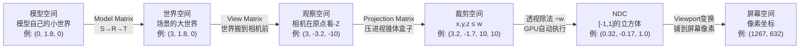

# 坐标系与变换流水线：图形学数学的第五层枢纽

前四层我们分别学会了：函数处理数字、向量处理箭头、矩阵变换空间、三角函数连接圆周。但直到现在，这些知识还是散的——你知道怎么构造一个旋转矩阵，知道怎么算点积，却不知道它们在 3D 渲染中到底**排成一条什么样的流水线**。

第五层就是把这些知识串起来的**枢纽**。一个顶点从模型文件走到屏幕像素，要经过五个空间、五次变换。如果你不能一口气说出这条链路，3D 开发的核心你就还没摸到。

---

## 零、 为什么需要多个坐标系？

一个问了一万次的问题：**为什么不直接用一个坐标系？**

想象你在做一个 3D 场景：一棵树、一辆车、一个角色，每个模型都是美术在建模软件里单独做的。树的根在 (0, 0, 0)，车的根也在 (0, 0, 0)，角色的根还在 (0, 0, 0)——它们的坐标系原点都重叠了。

但场景里，树在 (10, 0, 5)，车在 (-3, 0, 8)，角色在 (0, 0, 0)。你不能让三个模型都待在原点——你需要一种方式，把每个模型"从自己的小世界搬到场景的大世界"。

这就是**坐标系变换**的初衷：每个模型有自己的局部空间，场景有一个世界空间，渲染时需要一个相机空间，GPU 又需要裁剪空间和屏幕空间。

**同一个点，在不同坐标系里有不同的坐标数值**，但这些数值描述的是同一个物理位置。变换矩阵就是"翻译器"——把一个坐标系里的数翻译成另一个坐标系里的数。

---

## 一、 五个空间与五次变换：一个顶点的完整旅程

在展开每一站之前，先用一个**具体数字**走完全程——这样你脑子里会有"手感"，而不是只在概念上打转。

假设场景里有一个角色，头顶有个顶点，它在模型空间的坐标是 $(0, 1.8, 0)$（脚底在原点，Y 朝上）。相机放在世界 $(0, 5, 10)$ 看向原点。屏幕 1920×1080。

```
模型空间          世界空间           观察空间          裁剪空间          NDC            屏幕空间
(0, 1.8, 0)  →  (3, 1.8, 0)  →  (3, -3.2, -10)  →  (3.2, -1.7, 10, 10)  →  (0.32, -0.17, 1.0)  →  (1267, 632)
   ↑Model          ↑View             ↑Proj           ↑÷w             ↑Viewport
```

下面逐站展开，每站都告诉你：**这个空间长什么样、坐标值怎么算、为什么要做这一步**。



---

## 二、 模型空间 → 世界空间：Model Matrix

### 1. 模型空间长什么样

美术在 Blender/Maya 里建模时，模型有一个自己的坐标系：原点在模型中心（或脚底），Y 轴朝上，单位是米（或厘米）。

- 一棵树：根在原点，高 5 个单位，Y 朝上
- 一辆车：中心在原点，长 4、宽 2、高 1.5
- 一个角色：脚底在原点，高 1.8，面朝 -Z

**模型空间的坐标只在建模时有用**——它让美术可以专注于"这个模型本身长什么样"，不用关心场景里其他东西。

<ShaderPreview title="模型空间：每个模型有自己的小世界" code={`
varying vec2 vUv;
uniform float uTime;

void main() {
    vec2 uv = vUv * 2.0 - 1.0;
    
    vec3 color = vec3(0.05, 0.05, 0.08);
    
    for (int i = -4; i <= 4; i++) {
        float val = float(i);
        float gx = smoothstep(0.015, 0.005, abs(uv.x - val));
        float gy = smoothstep(0.015, 0.005, abs(uv.y - val));
        color = mix(color, vec3(0.12, 0.12, 0.18), max(gx, gy) * 0.25);
    }
    
    float axisX = smoothstep(0.008, 0.003, abs(uv.y)) * step(0.0, uv.x) * step(uv.x, 0.8);
    float axisY = smoothstep(0.008, 0.003, abs(uv.x)) * step(0.0, uv.y) * step(uv.y, 0.8);
    color = mix(color, vec3(0.9, 0.3, 0.3), axisX);
    color = mix(color, vec3(0.3, 0.9, 0.3), axisY);
    
    float originDot = 1.0 - step(0.03, length(uv));
    color = mix(color, vec3(1.0), originDot);
    
    vec2 treeBase = vec2(-0.6, -0.5);
    float trunk = smoothstep(0.02, 0.01, abs(uv.x - treeBase.x)) * step(treeBase.y, uv.y) * step(uv.y, treeBase.y + 0.4);
    float crown = smoothstep(0.18, 0.17, length(uv - vec2(treeBase.x, treeBase.y + 0.55)));
    color = mix(color, vec3(0.55, 0.35, 0.15), trunk);
    color = mix(color, vec3(0.2, 0.6, 0.2), crown * 0.7);
    
    vec2 carCenter = vec2(0.5, -0.5);
    float carBody = step(abs(uv.x - carCenter.x), 0.2) * step(abs(uv.y - carCenter.y), 0.08);
    float carTop = step(abs(uv.x - carCenter.x + 0.04), 0.1) * step(abs(uv.y - carCenter.y - 0.12), 0.07);
    color = mix(color, vec3(0.3, 0.5, 0.9), carBody * 0.6);
    color = mix(color, vec3(0.25, 0.45, 0.8), carTop * 0.6);
    
    vec2 charBase = vec2(0.0, -0.5);
    float charBody = step(abs(uv.x - charBase.x), 0.06) * step(charBase.y, uv.y) * step(uv.y, charBase.y + 0.35);
    float charHead = smoothstep(0.07, 0.06, length(uv - vec2(charBase.x, charBase.y + 0.42)));
    color = mix(color, vec3(0.9, 0.6, 0.2), charBody * 0.6);
    color = mix(color, vec3(0.9, 0.7, 0.5), charHead * 0.7);
    
    float label = step(0.82, vUv.y) * step(vUv.x, 0.18);
    
    gl_FragColor = vec4(color, 1.0);
}
`} />

三个模型的原点都是 $(0, 0)$——在各自的小世界里，它们都在"中心"或"脚底"。但场景不能让三个模型重叠在同一个原点。

### 2. Model Matrix 做了什么：SRT 变换

Model Matrix 把模型"搬到"场景中正确的位置、朝向和大小。它就是第三层学的 **SRT 变换**：

$$ M_{model} = T \cdot R \cdot S $$

从右往左读：先缩放（调整大小）→ 再旋转（调整朝向）→ 最后平移（搬到位置）。

$$ \vec{p}_{world} = M_{model} \cdot \vec{p}_{local} $$

### 3. 手算一遍

假设角色模型头顶的顶点，局部坐标 $\vec{p}_{local} = (0, 1.8, 0, 1)$。我们要把它放到世界坐标 $(3, 0, 0)$，绕 Y 轴旋转 30°，不缩放。

**第一步：缩放 $S$**（这里 $S = I$，不缩放）

$$ S \cdot \vec{p}_{local} = \begin{bmatrix}1&0&0&0\\0&1&0&0\\0&0&1&0\\0&0&0&1\end{bmatrix} \begin{bmatrix}0\\1.8\\0\\1\end{bmatrix} = \begin{bmatrix}0\\1.8\\0\\1\end{bmatrix} $$

**第二步：旋转 $R_y(30°)$**

$$ R_y \cdot \begin{bmatrix}0\\1.8\\0\\1\end{bmatrix} = \begin{bmatrix}\cos 30°&0&\sin 30°&0\\0&1&0&0\\-\sin 30°&0&\cos 30°&0\\0&0&0&1\end{bmatrix} \begin{bmatrix}0\\1.8\\0\\1\end{bmatrix} = \begin{bmatrix}0\\1.8\\0\\1\end{bmatrix} $$

注意：Y 轴旋转不影响 y 坐标，而且这个顶点恰好在 Y 轴上（x=0, z=0），所以旋转后位置不变。

换一个顶点试试——角色鼻尖在局部坐标 $(0, 1.6, -0.3, 1)$（面朝 -Z，鼻子往前伸 0.3）：

$$ R_y(30°) \cdot \begin{bmatrix}0\\1.6\\-0.3\\1\end{bmatrix} = \begin{bmatrix}0.866 \times 0 + 0.5 \times (-0.3)\\1.6\\-0.5 \times 0 + 0.866 \times (-0.3)\\1\end{bmatrix} = \begin{bmatrix}-0.15\\1.6\\-0.26\\1\end{bmatrix} $$

鼻子从 -Z 方向转到了偏 -X 方向。

**第三步：平移 $T(3, 0, 0)$**

$$ T \cdot \begin{bmatrix}-0.15\\1.6\\-0.26\\1\end{bmatrix} = \begin{bmatrix}-0.15 + 3\\1.6\\-0.26\\1\end{bmatrix} = \begin{bmatrix}2.85\\1.6\\-0.26\\1\end{bmatrix} $$

鼻尖的世界坐标是 $(2.85, 1.6, -0.26)$——角色站在 $(3, 0, 0)$，微微转向，鼻子偏左偏前。

<ShaderPreview title="SRT 变换逐步执行" code={`
varying vec2 vUv;
uniform float uTime;

mat2 rotate2d(float a) {
    return mat2(cos(a), -sin(a), sin(a), cos(a));
}

void main() {
    vec2 uv = vUv * 2.0 - 1.0;
    
    vec3 color = vec3(0.05, 0.05, 0.08);
    
    for (int i = -4; i <= 4; i++) {
        float val = float(i);
        float gx = smoothstep(0.015, 0.005, abs(uv.x - val));
        float gy = smoothstep(0.015, 0.005, abs(uv.y - val));
        color = mix(color, vec3(0.12, 0.12, 0.18), max(gx, gy) * 0.2);
    }
    
    float axisX = smoothstep(0.008, 0.003, abs(uv.y)) * step(0.0, uv.x) * step(uv.x, 0.8);
    float axisY = smoothstep(0.008, 0.003, abs(uv.x)) * step(0.0, uv.y) * step(uv.y, 0.8);
    color = mix(color, vec3(0.4, 0.15, 0.15), axisX);
    color = mix(color, vec3(0.15, 0.4, 0.15), axisY);
    
    float phase = fract(uTime * 0.15);
    vec2 boxCenter = vec2(-0.5, -0.3);
    
    vec2 origLocal = uv - boxCenter;
    float origBox = step(abs(origLocal.x), 0.15) * step(abs(origLocal.y), 0.2);
    color = mix(color, vec3(0.3, 0.3, 0.4), origBox * 0.2);
    
    float curS = mix(1.0, 0.6, smoothstep(0.0, 0.33, phase));
    float curR = smoothstep(0.33, 0.66, phase) * 0.8;
    vec2 curT = vec2(0.7, 0.3) * smoothstep(0.66, 1.0, phase);
    
    vec2 tp = uv - boxCenter;
    tp = tp / max(curS, 0.01);
    tp = rotate2d(-curR) * tp;
    tp = tp + boxCenter + curT;
    
    float transBox = step(abs(tp.x), 0.15) * step(abs(tp.y), 0.2);
    
    float alpha = smoothstep(0.28, 0.33, phase) * 0.5 + smoothstep(0.61, 0.66, phase) * 0.5;
    color = mix(color, vec3(0.9, 0.4, 0.2), transBox * max(0.3, alpha));
    
    float od = 1.0 - step(0.03, length(uv - boxCenter));
    color = mix(color, vec3(0.5), od * 0.5);
    
    vec2 newDot = boxCenter + curT;
    float nd = 1.0 - step(0.03, length(uv - newDot));
    color = mix(color, vec3(1.0, 0.8, 0.2), nd);
    
    vec2 arrowD = newDot - boxCenter;
    float aLen = length(arrowD);
    vec2 aN = normalize(arrowD + vec2(0.0001));
    float aAlong = dot(uv - boxCenter, aN);
    float aPerp = length((uv - boxCenter) - aAlong * aN);
    float aLine = smoothstep(0.008, 0.003, aPerp) * step(0.0, aAlong) * step(aAlong, aLen) * step(0.01, aLen);
    color = mix(color, vec3(0.6, 0.8, 0.4), aLine);
    
    gl_FragColor = vec4(color, 1.0);
}
`} />

**几个要点**：

- **缩放**：如果建模时用厘米，场景用米，Model Matrix 里就有一个 0.01 的缩放
- **旋转**：角色的"面朝方向"和世界坐标系的"前方"可能不同，Model Matrix 负责对齐
- **平移**：最直观——把模型搬到场景里的正确位置
- **层次化**：一个角色有身体、手臂、手指——手臂的 Model = 身体的 Model × 手臂相对身体的 Local。这就是**场景图（Scene Graph）**的原理

:::tip 场景图 = 嵌套的 Model Matrix
```
世界
├── 太阳  M_sun = T(0,10,0)
├── 地球  M_earth = T(5,0,0) × R(earthOrbitAngle)
│   └── 月亮  M_moon = M_earth × T(1,0,0) × R(moonOrbitAngle)
```
月亮的世界坐标 = `M_moon × 月亮局部坐标`。嵌套变换让天体运动自然成立。
:::

---

## 三、 世界空间 → 观察空间：View Matrix

### 1. 世界空间的问题

世界空间里，所有物体都在正确的位置了。但相机放在哪里？看向哪里？

渲染需要的是"**相机眼中的世界**"——如果相机在 $(0, 5, 10)$ 看向原点，那 $(0, 5, 10)$ 应该变成观察空间的原点，视线方向应该变成 -Z 轴。

### 2. View Matrix 的直觉：不是移动相机，是移动世界

View Matrix **不是移动相机到原点**——它是**移动整个世界，让相机出现在原点**。

$$ \vec{p}_{view} = M_{view} \cdot \vec{p}_{world} $$

想象你站在原地不动，整个世界向你平移过来、旋转过来——这就是 View Matrix 做的事。

更准确地说：如果相机的世界坐标变换是 $M_{camera}$（把相机从原点放到场景中），那：

$$ M_{view} = M_{camera}^{-1} $$

**View Matrix = 相机 Model Matrix 的逆。** 相机"去了哪里"，View Matrix 就把世界"从那里搬回来"。

### 3. 手算一遍

相机放在世界 $(0, 5, 10)$，看向原点。那相机的 Model Matrix 是 $T(0, 5, 10)$：

$$ M_{camera} = \begin{bmatrix}1&0&0&0\\0&1&0&5\\0&0&1&10\\0&0&0&1\end{bmatrix} $$

View Matrix 就是它的逆——平移取反：

$$ M_{view} = M_{camera}^{-1} = \begin{bmatrix}1&0&0&0\\0&1&0&-5\\0&0&1&-10\\0&0&0&1\end{bmatrix} $$

验证——角色头顶的世界坐标 $(3, 1.8, 0)$：

$$ M_{view} \cdot \begin{bmatrix}3\\1.8\\0\\1\end{bmatrix} = \begin{bmatrix}3\\1.8 - 5\\0 - 10\\1\end{bmatrix} = \begin{bmatrix}3\\-3.2\\-10\\1\end{bmatrix} $$

观察空间坐标 $(3, -3.2, -10)$：x=3 说明物体在相机右边，y=-3.2 说明在相机下方，z=-10 说明在相机前方 10 个单位——完全符合直觉！

### 4. LookAt 矩阵：从"相机看哪"直接构造 View Matrix

上面用的是最简单的情况（只有平移，没有旋转）。但相机通常会转头——它不仅在一个位置，还有一个朝向。这时求 $M_{camera}^{-1}$ 就很麻烦，因为 $M_{camera}$ 里混合了旋转和平移。

**LookAt** 是一种更直接的构造方法：给定三个参数——eye（相机位置）、target（看向的目标点）、up（世界的上方），**直接算出 View Matrix**，不需要先算 $M_{camera}$ 再求逆。

#### 推导过程

**已知**：eye = $(0, 5, 10)$，target = $(0, 0, 0)$，up = $(0, 1, 0)$

**第一步：算前方向 $\vec{f}$**——从眼睛指向目标

$$ \vec{f} = \text{normalize}(\text{target} - \text{eye}) = \text{normalize}((0,0,0) - (0,5,10)) = \text{normalize}(0, -5, -10) = (0, -0.447, -0.894) $$

**第二步：算右方向 $\vec{r}$**——前方向和世界上方的叉积

$$ \vec{r} = \text{normalize}(\text{cross}(\vec{f},\ \text{up})) = \text{normalize}(\text{cross}((0, -0.447, -0.894),\ (0, 1, 0))) $$

叉积计算：
$$ \vec{r} = \begin{vmatrix}\hat{x}&\hat{y}&\hat{z}\\0&-0.447&-0.894\\0&1&0\end{vmatrix} = ((-0.447)(0) - (-0.894)(1),\ (-0.894)(0) - (0)(0),\ (0)(1) - (-0.447)(0)) = (0.894, 0, 0) $$

归一化：$\vec{r} = (1, 0, 0)$。合理——相机正对着原点看，右方向就是世界的 +X。

**第三步：算真正的上方向 $\vec{u}$**——右方向和前方向的叉积

$$ \vec{u} = \text{cross}(\vec{r},\ \vec{f}) = \text{cross}((1, 0, 0),\ (0, -0.447, -0.894)) = (0 \times (-0.894) - 0 \times (-0.447),\ 0 \times 0 - 1 \times (-0.894),\ 1 \times (-0.447) - 0 \times 0) = (0, 0.894, -0.447) $$

这三个向量 $(\vec{r}, \vec{u}, -\vec{f})$ 就是相机坐标系的三个轴——它们分别对应观察空间的 +X、+Y、-Z 方向。

**第四步：组装 View Matrix**

$$ M_{view} = \begin{bmatrix} r_x & r_y & r_z & -\vec{r} \cdot \text{eye} \\ u_x & u_y & u_z & -\vec{u} \cdot \text{eye} \\ -f_x & -f_y & -f_z & \vec{f} \cdot \text{eye} \\ 0 & 0 & 0 & 1 \end{bmatrix} = \begin{bmatrix} 1 & 0 & 0 & 0 \\ 0 & 0.894 & 0 & -0.894 \times 5 \\ 0 & 0.447 & 0.894 & -(0.447 \times 5 + 0.894 \times 10) \\ 0 & 0 & 0 & 1 \end{bmatrix} $$

为什么第三行是 $-\vec{f}$？因为观察空间中，相机看向 **-Z 方向**（OpenGL 约定）。$\vec{f}$ 指向相机看到的东西，也就是 +Z 方向的反方向——所以要取反。

为什么第四列是 $-\vec{r} \cdot \text{eye}$ 等？这是旋转后的平移分量——先把世界旋转到相机坐标系，再平移让相机来到原点。

<ShaderPreview title="LookAt 构造过程：eye, f, r, u 三步推导" code={`
varying vec2 vUv;
uniform float uTime;

void main() {
    vec2 uv = vUv * 2.0 - 1.0;
    
    vec3 color = vec3(0.05, 0.05, 0.08);
    
    for (int i = -4; i <= 4; i++) {
        float val = float(i);
        float gx = smoothstep(0.012, 0.004, abs(uv.x - val));
        float gy = smoothstep(0.012, 0.004, abs(uv.y - val));
        color = mix(color, vec3(0.1, 0.1, 0.15), max(gx, gy) * 0.2);
    }
    
    float angle = uTime * 0.3;
    vec2 eye2d = vec2(3.0 * cos(angle), 2.0 * sin(angle * 0.7));
    vec2 target2d = vec2(0.0, 0.0);
    
    vec2 fwd = normalize(target2d - eye2d);
    vec2 right = vec2(fwd.y, -fwd.x);
    vec2 up = vec2(-fwd.x, -fwd.y);
    
    float eyeDot = 1.0 - step(0.04, length(uv - eye2d));
    color = mix(color, vec3(1.0, 0.8, 0.2), eyeDot);
    
    float fwdLine = smoothstep(0.008, 0.003, length(uv - eye2d - clamp(dot(uv - eye2d, fwd), 0.0, 0.8) * fwd));
    float rightLine = smoothstep(0.008, 0.003, length(uv - eye2d - clamp(dot(uv - eye2d, right), -0.4, 0.4) * right));
    float upLine = smoothstep(0.008, 0.003, length(uv - eye2d - clamp(dot(uv - eye2d, up), -0.4, 0.4) * up));
    
    color = mix(color, vec3(0.3, 0.3, 0.9), fwdLine);
    color = mix(color, vec3(0.9, 0.3, 0.3), rightLine);
    color = mix(color, vec3(0.3, 0.9, 0.3), upLine);
    
    float fwdTip = 1.0 - step(0.025, length(uv - (eye2d + fwd * 0.8)));
    float rightTip = 1.0 - step(0.025, length(uv - (eye2d + right * 0.4)));
    float upTip = 1.0 - step(0.025, length(uv - (eye2d + up * 0.4)));
    color = mix(color, vec3(0.3, 0.3, 1.0), fwdTip);
    color = mix(color, vec3(1.0, 0.3, 0.3), rightTip);
    color = mix(color, vec3(0.3, 1.0, 0.3), upTip);
    
    float targetDot = 1.0 - step(0.035, length(uv - target2d));
    color = mix(color, vec3(0.9, 0.9, 0.9), targetDot);
    
    for (int i = -3; i <= 3; i++) {
        for (int j = -3; j <= 3; j++) {
            vec2 objPos = vec2(float(i) * 1.2, float(j) * 0.8);
            float d = 1.0 - step(0.03, length(uv - objPos));
            float nearCenter = step(float(abs(i)), 1.5) * step(float(abs(j)), 1.5);
            vec3 objColor = mix(vec3(0.4, 0.6, 0.5), vec3(0.8, 0.5, 0.3), nearCenter);
            color = mix(color, objColor, d * 0.5);
        }
    }
    
    float fov = 0.5;
    vec2 l1 = eye2d + fwd * 1.0 + right * fov;
    vec2 l2 = eye2d + fwd * 1.0 - right * fov;
    float frustL = smoothstep(0.005, 0.002, length(uv - eye2d - clamp(dot(uv - eye2d, normalize(l1 - eye2d)), 0.0, 1.2) * normalize(l1 - eye2d)));
    float frustR = smoothstep(0.005, 0.002, length(uv - eye2d - clamp(dot(uv - eye2d, normalize(l2 - eye2d)), 0.0, 1.2) * normalize(l2 - eye2d)));
    color = mix(color, vec3(0.5, 0.5, 0.2), (frustL + frustR) * 0.3);
    
    gl_FragColor = vec4(color, 1.0);
}
`} />

```glsl
// Three.js 中
const viewMatrix = new THREE.Matrix4().lookAt(eye, target, up);

// 手动构造（GLSL 中一般不手动构造，由 CPU 传入）
// 但理解原理至关重要
```

:::important eye、target、up 的含义
- **eye**：相机在世界的位置
- **target**：相机看向的点（不是方向向量！是目标位置！）
- **up**：世界的"上方"——通常是 $(0, 1, 0)$。如果相机是倒着看的，up 就要手动设为 $(0, -1, 0)$

**常见 Bug**：`up` 和视线方向平行时，`cross(f, up) = 0`，LookAt 矩阵崩溃。比如相机正上方俯视（eye = $(0, 10, 0)$，target = $(0, 0, 0)$），$\vec{f} = (0, -1, 0)$ 和 $\text{up} = (0, 1, 0)$ 反平行。这时需要把 up 设为 $(0, 0, 1)$ 或其他非平行方向。
:::

---

## 四、 观察空间 → 裁剪空间：Projection Matrix

### 1. 观察空间的问题

观察空间里，相机在原点、看向 -Z。但这个世界仍然是"无限大"的——你看得见身后的东西，看得见 100 公里外的山，看得见身后脚下的地面。

GPU 需要一个**有限范围**的空间来做裁剪：只有在这个范围内的东西才渲染，范围外的一律扔掉。这个范围就是**视锥体（Frustum）**——一个截掉尖头的金字塔。

<ShaderPreview title="视锥体：相机的可视范围" code={`
varying vec2 vUv;
uniform float uTime;

void main() {
    vec2 uv = vUv * 2.0 - 1.0;
    
    vec3 color = vec3(0.05, 0.05, 0.08);
    
    float axisX = smoothstep(0.008, 0.003, abs(uv.y)) * step(-1.0, uv.x) * step(uv.x, 1.0);
    float axisY = smoothstep(0.008, 0.003, abs(uv.x)) * step(-1.0, uv.y) * step(uv.y, 1.0);
    color = mix(color, vec3(0.15, 0.15, 0.2), axisX);
    color = mix(color, vec3(0.15, 0.15, 0.2), axisY);
    
    float near = 0.3;
    float far = 1.5;
    float fov = 0.5;
    
    vec2 nearL = vec2(-fov * near + 0.0, -near);
    vec2 nearR = vec2(fov * near + 0.0, -near);
    vec2 farL = vec2(-fov * far + 0.0, -far);
    vec2 farR = vec2(fov * far + 0.0, -far);
    
    vec2 topL = vec2(0.0, 0.0);
    
    float topNearL = smoothstep(0.008, 0.003, length(uv - topL - clamp(dot(uv - topL, normalize(nearL - topL)), 0.0, length(nearL - topL)) * normalize(nearL - topL)));
    float topNearR = smoothstep(0.008, 0.003, length(uv - topL - clamp(dot(uv - topL, normalize(nearR - topL)), 0.0, length(nearR - topL)) * normalize(nearR - topL)));
    float topFarL = smoothstep(0.008, 0.003, length(uv - topL - clamp(dot(uv - topL, normalize(farL - topL)), 0.0, length(farL - topL)) * normalize(farL - topL)));
    float topFarR = smoothstep(0.008, 0.003, length(uv - topL - clamp(dot(uv - topL, normalize(farR - topL)), 0.0, length(farR - topL)) * normalize(farR - topL)));
    
    float nearLine = smoothstep(0.008, 0.003, abs(uv.y + near)) * step(nearL.x, uv.x) * step(uv.x, nearR.x);
    float farLine = smoothstep(0.008, 0.003, abs(uv.y + far)) * step(farL.x, uv.x) * step(uv.x, farR.x);
    
    float nearTopL = smoothstep(0.008, 0.003, length(uv - nearL - clamp(dot(uv - nearL, normalize(farL - nearL)), 0.0, length(farL - nearL)) * normalize(farL - nearL)));
    float nearTopR = smoothstep(0.008, 0.003, length(uv - nearR - clamp(dot(uv - nearR, normalize(farR - nearR)), 0.0, length(farR - nearR)) * normalize(farR - nearR)));
    
    color = mix(color, vec3(0.3, 0.6, 0.9), (topNearL + topNearR + topFarL + topFarR + nearTopL + nearTopR) * 0.6);
    color = mix(color, vec3(0.9, 0.6, 0.3), (nearLine + farLine) * 0.8);
    
    float eyeDot = 1.0 - step(0.035, length(uv - topL));
    color = mix(color, vec3(1.0, 0.8, 0.2), eyeDot);
    
    for (int i = 0; i < 5; i++) {
        float z = near + float(i) * (far - near) / 4.0;
        float hw = fov * z;
        vec2 objPos = vec2(hw * 0.3, -z);
        float d = 1.0 - step(0.02 + z * 0.01, length(uv - objPos));
        vec3 objColor = vec3(0.8, 0.3, 0.3) * (1.0 - z / far);
        color = mix(color, objColor, d);
    }
    
    gl_FragColor = vec4(color, 1.0);
}
`} />

### 2. 透视投影矩阵

透视投影把视锥体（一个截头锥体）变换成一个**轴对齐的立方体**。这个立方体就是裁剪空间。

视锥体由四个参数定义：

| 参数 | 含义 | 典型值 | 影响 |
|------|------|--------|------|
| **fov** | 垂直视场角 | 45°~90° | fov 越大视野越广，物体越小（广角镜效果） |
| **aspect** | 宽高比 | 16/9 = 1.778 | 防止画面拉伸 |
| **near** | 近裁剪面距离 | 0.1 | 太小会导致远处 Z-Fighting |
| **far** | 远裁剪面距离 | 100~1000 | 太大会导致深度精度不足 |

推导透视投影矩阵是图形学最经典的推导之一。这里给出结果并解释每一行的含义：

$$ M_{proj} = \begin{bmatrix} \frac{1}{\text{aspect} \cdot \tan(\text{fov}/2)} & 0 & 0 & 0 \\ 0 & \frac{1}{\tan(\text{fov}/2)} & 0 & 0 \\ 0 & 0 & -\frac{\text{far}+\text{near}}{\text{far}-\text{near}} & -\frac{2 \cdot \text{far} \cdot \text{near}}{\text{far}-\text{near}} \\ 0 & 0 & -1 & 0 \end{bmatrix} $$

**逐行解读**：

- **第一行**：x 方向的缩放，把 fov + aspect 决定的水平范围映射到 [-1, 1]
- **第二行**：y 方向的缩放，把 fov 决定的垂直范围映射到 [-1, 1]
- **第三行**：z 方向的映射，把 [near, far] 映射到 [-1, 1]（非线性！远处的精度低）
- **第四行**：把 z 复制到 w，为透视除法做准备——这是透视效果的核心。注意这行是 $(0, 0, -1, 0)$，所以 $w_c = -z_{view}$——观察空间的 z 是负数（相机前方），取反后 w 是正数

### 3. 手算一遍

用 fov=60°, aspect=1.778, near=0.1, far=100。先算 $\tan(\text{fov}/2) = \tan(30°) = 0.577$。

观察空间中角色头顶坐标 $(3, -3.2, -10)$（注意 z 是负数——在相机前方）：

$$ M_{proj} \cdot \begin{bmatrix}3\\-3.2\\-10\\1\end{bmatrix} = \begin{bmatrix}\frac{1}{1.778 \times 0.577} \times 3 + 0 + 0 + 0\\0 + \frac{1}{0.577} \times (-3.2) + 0 + 0\\0 + 0 + (-\frac{100.1}{99.9}) \times (-10) + (-\frac{20}{99.9}) \times 1\\0 + 0 + (-1) \times (-10) + 0\end{bmatrix} = \begin{bmatrix}2.92\\-5.55\\10.02\\10\end{bmatrix} $$

裁剪空间坐标 $(2.92, -5.55, 10.02, 10)$。注意 $w = 10$——它等于 $-z_{view} = 10$。

裁剪判断：$|2.92| \leq 10$ ✓, $|-5.55| \leq 10$ ✓, $|10.02| \leq 10$... 勉强，但通过了——这个顶点在视锥体内。

<FunctionPlotter
  xMin={0.1} xMax={5} yMin={-1.2} yMax={1.2}
  expressions={[
    { expr: "-(1+0.1)/(x*1-0.1) - 2*0.1*1/(x*1-0.1)", color: "#ff6b6b" },
  ]}
  editable={false}
  height={200}
/>

上面的曲线展示了深度缓冲的映射：**近处 z 值覆盖了 [-1, 0] 的绝大部分范围，远处 z 值挤在 [0, 1] 的狭窄区间**——这就是为什么近处深度精度高，远处深度精度低（Z-Fighting 的根源）。

### 4. 正交投影矩阵

正交投影没有近大远小的透视效果——平行线仍然平行。常用于 2D 游戏、UI 渲染、阴影贴图、CAD 软件。

$$ M_{ortho} = \begin{bmatrix} \frac{2}{r-l} & 0 & 0 & -\frac{r+l}{r-l} \\ 0 & \frac{2}{t-b} & 0 & -\frac{t+b}{t-b} \\ 0 & 0 & \frac{-2}{f-n} & -\frac{f+n}{f-n} \\ 0 & 0 & 0 & 1 \end{bmatrix} $$

其中 $(l, r, t, b, n, f)$ 是视锥体的六个面。注意第四行是 $(0, 0, 0, 1)$——**没有透视除法**，w 始终为 1。

```glsl
// Three.js
const perspCamera = new THREE.PerspectiveCamera(fov, aspect, near, far);
const orthoCamera = new THREE.OrthographicCamera(left, right, top, bottom, near, far);
```

<ShaderPreview title="透视 vs 正交：近大远小 vs 平行" code={`
varying vec2 vUv;
uniform float uTime;

void main() {
    vec2 uvL = vec2(vUv.x * 0.5, vUv.y) * 2.0 - 1.0;
    vec2 uvR = vec2(vUv.x * 0.5 + 0.5, vUv.y) * 2.0 - 1.0;
    
    vec3 color = vec3(0.05, 0.05, 0.08);
    
    float divLine = smoothstep(0.008, 0.002, abs(vUv.x - 0.5));
    color = mix(color, vec3(0.3), divLine);
    
    for (int i = 1; i <= 5; i++) {
        float z = float(i) * 0.15 + 0.1;
        float perspScale = 1.0 / z;
        float orthoScale = 1.0;
        
        float size = 0.04;
        
        for (int j = -1; j <= 1; j++) {
            vec2 perspPos = vec2(float(j) * size * perspScale * 3.0, 0.6 - z * 1.5);
            float d = smoothstep(size * perspScale, size * perspScale * 0.5, length(uvL - perspPos));
            color = mix(color, vec3(0.3, 0.7, 0.9), d * 0.7);
            
            vec2 orthoPos = vec2(float(j) * size * orthoScale * 3.0, 0.6 - z * 1.5);
            float d2 = smoothstep(size * orthoScale, size * orthoScale * 0.5, length(uvR - orthoPos));
            color = mix(color, vec3(0.9, 0.5, 0.3), d2 * 0.7);
        }
    }
    
    gl_FragColor = vec4(color, 1.0);
}
`} />

---

## 五、 裁剪空间 → NDC：透视除法

这是整个流水线中最容易忽略的一步，也是透视效果真正发生的地方。

### 1. 裁剪空间里发生了什么

Projection Matrix 输出的是裁剪空间坐标 $\vec{p}_{clip} = (x_c, y_c, z_c, w_c)$。

关键在于 $w_c$——在透视投影中，$w_c = -z_{view}$（观察空间的深度取反）。在正交投影中，$w_c = 1$。

**裁剪**在裁剪空间中进行：GPU 检查 $|x_c| \leq w_c$、$|y_c| \leq w_c$、$|z_c| \leq w_c$，不满足的图元被裁剪或丢弃。

### 2. 透视除法：除以 w

$$ \vec{p}_{ndc} = \frac{\vec{p}_{clip}}{w_c} = \left(\frac{x_c}{w_c},\ \frac{y_c}{w_c},\ \frac{z_c}{w_c}\right) $$

NDC（Normalized Device Coordinates）是一个**立方体**——无论你用什么投影、什么视锥体，除完 w 之后，所有可见的东西都落在同一个 [-1, 1]³ 的盒子里。

<ShaderPreview title="NDC 立方体：所有可见的东西都在 [-1,1]³ 盒子里" code={`
varying vec2 vUv;
uniform float uTime;

void main() {
    vec2 uv = vUv * 2.0 - 1.0;
    
    vec3 color = vec3(0.05, 0.05, 0.08);
    
    float s = 0.65;
    
    float borderL = smoothstep(0.006, 0.002, abs(uv.x + s)) * step(abs(uv.y), s);
    float borderR = smoothstep(0.006, 0.002, abs(uv.x - s)) * step(abs(uv.y), s);
    float borderB = smoothstep(0.006, 0.002, abs(uv.y + s)) * step(abs(uv.x), s);
    float borderT = smoothstep(0.006, 0.002, abs(uv.y - s)) * step(abs(uv.x), s);
    float border = borderL + borderR + borderB + borderT;
    color = mix(color, vec3(0.4, 0.6, 0.9), border * 0.7);
    
    float fill = step(abs(uv.x), s) * step(abs(uv.y), s);
    color = mix(color, vec3(0.06, 0.08, 0.14), fill * 0.3);
    
    float axisX = smoothstep(0.005, 0.002, abs(uv.y)) * step(-s, uv.x) * step(uv.x, s) * step(0.0, uv.x);
    float axisY = smoothstep(0.005, 0.002, abs(uv.x)) * step(-s, uv.y) * step(uv.y, s) * step(0.0, uv.y);
    color = mix(color, vec3(0.4, 0.15, 0.15), axisX * 0.5);
    color = mix(color, vec3(0.15, 0.4, 0.15), axisY * 0.5);
    
    float originDot = 1.0 - step(0.03, length(uv));
    color = mix(color, vec3(1.0), originDot);
    
    float pulse = 0.5 + 0.5 * sin(uTime * 2.0);
    
    vec2 pt1 = vec2(0.292, -0.555) * s;
    float d1 = smoothstep(0.025, 0.008, length(uv - pt1));
    color = mix(color, vec3(1.0, 0.6, 0.2) * (0.7 + 0.3 * pulse), d1);
    
    vec2 pt2 = vec2(-0.5, 0.3) * s;
    float d2 = smoothstep(0.02, 0.008, length(uv - pt2));
    color = mix(color, vec3(0.4, 0.8, 0.5), d2 * 0.8);
    
    vec2 pt3 = vec2(0.7, 0.7) * s;
    float d3 = smoothstep(0.02, 0.008, length(uv - pt3));
    color = mix(color, vec3(0.5, 0.5, 0.9), d3 * 0.8);
    
    vec2 pt4 = vec2(-0.2, -0.8) * s;
    float d4 = smoothstep(0.02, 0.008, length(uv - pt4));
    color = mix(color, vec3(0.9, 0.4, 0.6), d4 * 0.8);
    
    vec2 pt5 = vec2(0.1, 0.1) * s;
    float d5 = smoothstep(0.015, 0.006, length(uv - pt5));
    color = mix(color, vec3(0.7, 0.7, 0.3), d5 * 0.7);
    
    float grid = 0.0;
    for (int i = 1; i < 4; i++) {
        float v = float(i) / 4.0;
        float gV = smoothstep(0.003, 0.001, abs(uv.x - v * s)) * step(abs(uv.y), s);
        float gVL = smoothstep(0.003, 0.001, abs(uv.x + v * s)) * step(abs(uv.y), s);
        float gH = smoothstep(0.003, 0.001, abs(uv.y - v * s)) * step(abs(uv.x), s);
        float gHL = smoothstep(0.003, 0.001, abs(uv.y + v * s)) * step(abs(uv.x), s);
        grid += gV + gVL + gH + gHL;
    }
    color = mix(color, vec3(0.15, 0.18, 0.25), grid * 0.3);
    
    gl_FragColor = vec4(color, 1.0);
}
`} />

NDC 的坐标范围：

| API | x 范围 | y 范围 | z 范围 |
|-----|--------|--------|--------|
| **OpenGL / WebGL / Vulkan** | [-1, 1] | [-1, 1] | [-1, 1] |
| **DirectX / Metal** | [-1, 1] | [-1, 1] | [0, 1] |

**NDC 的核心意义**：它是一个"标准化的"空间——不管你的窗口是 1920×1080 还是 320×240，不管 fov 是 45° 还是 90°，所有可见的东西在 NDC 里都是 [-1, 1]³。GPU 的裁剪判断变得极其简单：x > 1 → 丢弃，x < -1 → 丢弃，以此类推。

### 3. 手算一遍

上一节我们算出了裁剪空间坐标 $(2.92, -5.55, 10.02, 10)$。透视除法：

$$ x_{ndc} = \frac{2.92}{10} = 0.292 $$
$$ y_{ndc} = \frac{-5.55}{10} = -0.555 $$
$$ z_{ndc} = \frac{10.02}{10} = 1.002 $$
$$ w_{ndc} = \frac{10}{10} = 1 $$

NDC 坐标 $(0.292, -0.555, 1.002)$。x 和 y 都在 [-1, 1] 内——这个顶点在屏幕上。z 约等于 1——在远裁剪面上。

**透视效果就在这一步产生**：远处物体 $w_c$ 大，除完后 $x_{ndc}$ 和 $y_{ndc}$ 小，所以远处物体在屏幕上占的面积小。近处物体 $w_c$ 小，除完后坐标大，占的面积大。

### 4. 另一个例子：远处 vs 近处的物体

假设有两个同样大小的正方体，一个在 $z = -1$（近处），一个在 $z = -50$（远处）。

近处物体中心观察空间坐标 $(0, 0, -1)$：
$$ M_{proj} \cdot \begin{bmatrix}0\\0\\-1\\1\end{bmatrix} = \begin{bmatrix}0\\0\\1.002\\1\end{bmatrix} \xrightarrow{\div w} (0, 0, 1.002) $$

远处物体中心观察空间坐标 $(0, 0, -50)$：
$$ M_{proj} \cdot \begin{bmatrix}0\\0\\-50\\1\end{bmatrix} = \begin{bmatrix}0\\0\\50.2\\50\end{bmatrix} \xrightarrow{\div w} (0, 0, 1.004) $$

z 几乎一样——这就是深度精度问题。但它们的边缘顶点就不同了：

近处物体右上角 $(0.5, 0.5, -1)$ → 裁剪 $(0.49, 0.87, 1.002, 1)$ → NDC $(0.49, 0.87, 1.002)$
远处物体右上角 $(0.5, 0.5, -50)$ → 裁剪 $(0.49, 0.87, 50.2, 50)$ → NDC $(0.0098, 0.017, 1.004)$

**同一个正方体，远处版本在 NDC 里只有 0.01 × 0.01 的大小，近处版本有 0.49 × 0.87 的大小**——近大远小就是这么来的。

<ShaderPreview title="透视除法：远处物体 ÷ 更大的 w = 更小的 NDC 坐标" code={`
varying vec2 vUv;
uniform float uTime;

void main() {
    vec2 uv = vUv * 2.0 - 1.0;
    
    vec3 color = vec3(0.05, 0.05, 0.08);
    
    float axisX = smoothstep(0.006, 0.003, abs(uv.y)) * step(-1.0, uv.x) * step(uv.x, 1.0);
    float axisY = smoothstep(0.006, 0.003, abs(uv.x)) * step(-1.0, uv.y) * step(uv.y, 1.0);
    color = mix(color, vec3(0.15, 0.15, 0.2), axisX);
    color = mix(color, vec3(0.15, 0.15, 0.2), axisY);
    
    float border = smoothstep(0.005, 0.002, abs(uv.x - 1.0)) + smoothstep(0.005, 0.002, abs(uv.x + 1.0)) + smoothstep(0.005, 0.002, abs(uv.y - 1.0)) + smoothstep(0.005, 0.002, abs(uv.y + 1.0));
    color = mix(color, vec3(0.4, 0.6, 0.8), border * 0.5);
    
    float nearSize = 0.5 + 0.1 * sin(uTime);
    float nearBox = step(abs(uv.x), nearSize) * step(abs(uv.y), nearSize);
    color = mix(color, vec3(0.2, 0.7, 0.4), nearBox * 0.4);
    float nearBorder = step(abs(uv.x), nearSize + 0.008) * step(nearSize - 0.008, abs(uv.x)) + step(abs(uv.y), nearSize + 0.008) * step(nearSize - 0.008, abs(uv.y));
    color = mix(color, vec3(0.3, 0.9, 0.5), nearBorder * 0.6);
    
    float farSize = 0.03 + 0.01 * sin(uTime);
    float farBox = step(abs(uv.x - 0.3), farSize) * step(abs(uv.y - 0.2), farSize);
    color = mix(color, vec3(0.9, 0.4, 0.2), farBox * 0.6);
    float farBorder = step(abs(uv.x - 0.3), farSize + 0.008) * step(farSize - 0.008, abs(uv.x - 0.3)) + step(abs(uv.y - 0.2), farSize + 0.008) * step(farSize - 0.008, abs(uv.y - 0.2));
    color = mix(color, vec3(1.0, 0.5, 0.3), farBorder * 0.8);
    
    gl_FragColor = vec4(color, 1.0);
}
`} />

:::warning 透视除法是 GPU 自动做的
在你的 Shader 里，你只需要写 `gl_Position = MVP * vec4(position, 1.0)`。GPU 会在光栅化之前自动执行 `gl_Position.xyz / gl_Position.w`。**你不需要手动除 w**——但你要理解它发生了，否则你无法理解 NDC 坐标的含义。
:::

### 5. 为什么 w ≠ 1 这么重要

- **顶点位置**：`vec4(pos, 1.0)` → w=1 → 平移有效
- **方向向量**：`vec4(dir, 0.0)` → w=0 → 平移被忽略（方向不受平移影响）
- **裁剪空间**：w 存储了深度信息，透视除法依赖它

在第三层我们说"平移藏在第四列"，现在你知道为什么了——`w=1` 让平移列参与运算，`w=0` 让它被忽略。这一个 0/1 的选择，区分了"位置"和"方向"。

---

## 六、 NDC → 屏幕空间：Viewport 变换

NDC 是 GPU 友好的 [-1, 1] 空间，但屏幕是以像素为单位的。Viewport 变换把 NDC 映射到屏幕像素坐标。

### 1. 映射公式

$$ x_{screen} = \frac{x_{ndc} + 1}{2} \cdot \text{width} + x_0 $$
$$ y_{screen} = \left(1 - \frac{y_{ndc} + 1}{2}\right) \cdot \text{height} + y_0 $$

拆开来看：

- $\frac{x_{ndc} + 1}{2}$：把 [-1, 1] 映射到 [0, 1]（线性缩放 + 偏移）
- $\times \text{width}$：把 [0, 1] 映射到 [0, width]（乘以像素宽度）
- $+ x_0$：加上 viewport 左上角的 x 偏移

y 轴有个**翻转**：`1 - ...`——NDC 的 y=1 在上方，屏幕的 y=0 在上方。所以 NDC 的 y=1 映射到屏幕 y=0（顶部），NDC 的 y=-1 映射到屏幕 y=height（底部）。

### 2. 手算一遍

上一节我们算出了 NDC 坐标 $(0.292, -0.555, 1.002)$。屏幕 1920×1080，viewport 从 (0,0) 开始：

$$ x_{screen} = \frac{0.292 + 1}{2} \times 1920 = 0.646 \times 1920 = 1240 $$
$$ y_{screen} = \left(1 - \frac{-0.555 + 1}{2}\right) \times 1080 = \left(1 - 0.223\right) \times 1080 = 0.778 \times 1080 = 840 $$

屏幕坐标 $(1240, 840)$——在屏幕偏右偏下的位置，符合"相机右下方前方"的直觉。

几个关键映射点：

| NDC 坐标 | 屏幕坐标 (1920×1080) | 含义 |
|----------|---------------------|------|
| (-1, 1) | (0, 0) | 屏幕左上角 |
| (1, 1) | (1920, 0) | 屏幕右上角 |
| (-1, -1) | (0, 1080) | 屏幕左下角 |
| (1, -1) | (1920, 1080) | 屏幕右下角 |
| (0, 0) | (960, 540) | 屏幕中心 |

<ShaderPreview title="Viewport 变换：NDC [-1,1] 映射到屏幕像素" code={`
varying vec2 vUv;
uniform float uTime;

void main() {
    vec2 uv = vUv;
    
    vec3 color = vec3(0.05, 0.05, 0.08);
    
    float screenW = 16.0;
    float screenH = 9.0;
    
    float screenBorder = smoothstep(0.025, 0.018, min(min(uv.x, 1.0 - uv.x) * screenW / screenH, min(uv.y, 1.0 - uv.y)));
    float screenInner = 1.0 - smoothstep(0.015, 0.01, min(min(uv.x, 1.0 - uv.x) * screenW / screenH, min(uv.y, 1.0 - uv.y)));
    color = mix(color, vec3(0.08, 0.1, 0.15), screenInner * 0.3);
    color = mix(color, vec3(0.3, 0.5, 0.7), (1.0 - screenBorder) * 0.5);
    
    vec2 ndcCenter = vec2(0.5, 0.5);
    float ndcR = length((uv - ndcCenter) * vec2(screenW / screenH, 1.0));
    
    float gridX = smoothstep(0.003, 0.001, abs(fract(uv.x * screenW) - 0.5) - 0.48);
    float gridY = smoothstep(0.003, 0.001, abs(fract(uv.y * screenH) - 0.5) - 0.48);
    color = mix(color, vec3(0.15, 0.15, 0.2), (gridX + gridY) * 0.15);
    
    float centerCrossH = smoothstep(0.004, 0.001, abs(uv.y - 0.5));
    float centerCrossV = smoothstep(0.004, 0.001, abs(uv.x - 0.5));
    color = mix(color, vec3(0.25, 0.25, 0.35), (centerCrossH + centerCrossV) * 0.4);
    
    vec2 ndcPoint = vec2(0.292, -0.555);
    vec2 screenPoint = vec2((ndcPoint.x + 1.0) / 2.0, 1.0 - (ndcPoint.y + 1.0) / 2.0);
    float pt = smoothstep(0.012, 0.005, length((uv - screenPoint) * vec2(screenW / screenH, 1.0)));
    color = mix(color, vec3(1.0, 0.6, 0.2), pt);
    
    float markerLeft = smoothstep(0.003, 0.001, abs(uv.x - 0.0)) * step(0.0, uv.y) * step(uv.y, 1.0);
    float markerRight = smoothstep(0.003, 0.001, abs(uv.x - 1.0)) * step(0.0, uv.y) * step(uv.y, 1.0);
    float markerTop = smoothstep(0.003, 0.001, abs(uv.y - 0.0)) * step(0.0, uv.x) * step(uv.x, 1.0);
    float markerBottom = smoothstep(0.003, 0.001, abs(uv.y - 1.0)) * step(0.0, uv.x) * step(uv.x, 1.0);
    color = mix(color, vec3(0.4, 0.6, 0.9), (markerLeft + markerRight + markerTop + markerBottom) * 0.5);
    
    float triSize = 0.03;
    float triAngle = uTime * 1.5;
    vec2 triCenter = screenPoint + vec2(cos(triAngle), sin(triAngle)) * 0.05;
    float triDot = smoothstep(triSize, triSize * 0.5, length((uv - triCenter) * vec2(screenW / screenH, 1.0)));
    color = mix(color, vec3(0.4, 0.8, 0.5), triDot * 0.6);
    
    gl_FragColor = vec4(color, 1.0);
}
`} />

```glsl
glViewport(x0, y0, width, height);
```

这一步你基本不需要手动计算——GPU 在光栅化时自动完成。但理解它的存在很重要：**NDC 和屏幕坐标不是一回事**，它们之间有一次线性映射 + y 轴翻转。

---

## 七、 完整流水线速查

把五个空间和五次变换压缩成一张表：

| 阶段 | 输入空间 | 变换 | 输出空间 | 谁来执行 | 坐标范围 |
|------|----------|------|----------|----------|----------|
| 1 | 模型空间 | Model Matrix | 世界空间 | CPU (JS) | 无限 |
| 2 | 世界空间 | View Matrix | 观察空间 | CPU (JS) | 无限 |
| 3 | 观察空间 | Projection Matrix | 裁剪空间 | CPU (JS) | $|x|,|y|,|z| \leq w$ |
| 4 | 裁剪空间 | ÷w（透视除法） | NDC | GPU（自动） | [-1, 1]³ |
| 5 | NDC | Viewport 变换 | 屏幕空间 | GPU（自动） | 像素坐标 |

**你在 Shader 中写的**：

```glsl
// 顶点着色器
uniform mat4 modelMatrix;
uniform mat4 viewMatrix;
uniform mat4 projectionMatrix;

void main() {
    vec4 worldPos = modelMatrix * vec4(position, 1.0);
    vec4 viewPos = viewMatrix * worldPos;
    vec4 clipPos = projectionMatrix * viewPos;
    
    gl_Position = clipPos;
}
```

更常见的写法（合并为 MVP）：

```glsl
uniform mat4 modelViewProjection; // = projection * view * model

void main() {
    gl_Position = modelViewProjection * vec4(position, 1.0);
}
```

:::tip 验证你的理解
你能回答以下问题吗？
1. 为什么 Model 是 $T \cdot R \cdot S$ 而不是 $S \cdot R \cdot T$？
2. 为什么 View Matrix 是相机 Model Matrix 的逆？
3. 透视效果（近大远小）是在哪一步产生的？
4. `vec4(dir, 0.0)` 和 `vec4(pos, 1.0)` 的区别是什么？
5. NDC 的 z 值为什么非线性？

如果犹豫了，回头再看对应章节。
:::

---

## 八、 左手系 vs 右手系：图形学最混乱的标准之争

### 1. 用你的手来理解

伸出**右手**：拇指朝右（+X），食指朝上（+Y），中指朝**自己**（+Z 朝屏幕外）——这就是**右手坐标系**。

换用**左手**做同样的动作：拇指朝右（+X），食指朝上（+Y），中指朝**屏幕里面**（+Z 朝屏幕内）——这就是**左手坐标系**。

**唯一的区别就是 Z 轴方向反了。** X 和 Y 都一样——右和上。但"前方"的定义不同。

<ShaderPreview title="右手系 vs 左手系：3D 坐标轴对比" code={`
varying vec2 vUv;
uniform float uTime;

void main() {
    vec3 color = vec3(0.05, 0.05, 0.08);
    
    float div = smoothstep(0.008, 0.002, abs(vUv.x - 0.5));
    color = mix(color, vec3(0.25), div);
    
    float angle = uTime * 0.3;
    float ca = cos(angle);
    float sa = sin(angle);
    
    vec2 center = vec2(0.0, -0.1);
    vec2 xEnd = center + vec2(ca * 0.5, 0.0);
    vec2 yEnd = center + vec2(0.0, 0.7);
    vec2 zEndR = center + vec2(-sa * 0.5, ca * 0.5);
    vec2 zEndL = center + vec2(sa * 0.5, -ca * 0.5);
    
    vec2 uvL = vec2(vUv.x * 0.48 + 0.01, vUv.y * 0.92 + 0.04);
    vec2 uvR = vec2(vUv.x * 0.48 + 0.51, vUv.y * 0.92 + 0.04);
    
    vec3 colL = vec3(0.05, 0.05, 0.08);
    vec3 colR = vec3(0.05, 0.05, 0.08);
    
    float xL = length(xEnd - center);
    vec2 xN = normalize(xEnd - center);
    float xAL = dot(uvL - center, xN);
    float xPL = length((uvL - center) - xAL * xN);
    float xLineL = smoothstep(0.008, 0.003, xPL) * step(0.0, xAL) * step(xAL, xL);
    colL = mix(colL, vec3(0.9, 0.3, 0.3) * 0.6, xLineL);
    colL = mix(colL, vec3(0.9, 0.3, 0.3), smoothstep(0.03, 0.012, length(uvL - xEnd)));
    
    float xAR = dot(uvR - center, xN);
    float xPR = length((uvR - center) - xAR * xN);
    float xLineR = smoothstep(0.008, 0.003, xPR) * step(0.0, xAR) * step(xAR, xL);
    colR = mix(colR, vec3(0.9, 0.3, 0.3) * 0.6, xLineR);
    colR = mix(colR, vec3(0.9, 0.3, 0.3), smoothstep(0.03, 0.012, length(uvR - xEnd)));
    
    float yL = length(yEnd - center);
    vec2 yN = normalize(yEnd - center);
    float yAL = dot(uvL - center, yN);
    float yPL = length((uvL - center) - yAL * yN);
    float yLineL = smoothstep(0.008, 0.003, yPL) * step(0.0, yAL) * step(yAL, yL);
    colL = mix(colL, vec3(0.3, 0.9, 0.3) * 0.6, yLineL);
    colL = mix(colL, vec3(0.3, 0.9, 0.3), smoothstep(0.03, 0.012, length(uvL - yEnd)));
    
    float yAR = dot(uvR - center, yN);
    float yPR = length((uvR - center) - yAR * yN);
    float yLineR = smoothstep(0.008, 0.003, yPR) * step(0.0, yAR) * step(yAR, yL);
    colR = mix(colR, vec3(0.3, 0.9, 0.3) * 0.6, yLineR);
    colR = mix(colR, vec3(0.3, 0.9, 0.3), smoothstep(0.03, 0.012, length(uvR - yEnd)));
    
    float zRL = length(zEndR - center);
    vec2 zRN = normalize(zEndR - center);
    float zRAL = dot(uvL - center, zRN);
    float zRPL = length((uvL - center) - zRAL * zRN);
    float zRLineL = smoothstep(0.008, 0.003, zRPL) * step(0.0, zRAL) * step(zRAL, zRL);
    colL = mix(colL, vec3(0.3, 0.5, 1.0) * 0.6, zRLineL);
    colL = mix(colL, vec3(0.3, 0.5, 1.0), smoothstep(0.03, 0.012, length(uvL - zEndR)));
    
    float zLL = length(zEndL - center);
    vec2 zLN = normalize(zEndL - center);
    float zLAL = dot(uvR - center, zLN);
    float zLPL = length((uvR - center) - zLAL * zLN);
    float zLLineR = smoothstep(0.008, 0.003, zLPL) * step(0.0, zLAL) * step(zLAL, zLL);
    colR = mix(colR, vec3(0.3, 0.5, 1.0) * 0.6, zLLineR);
    colR = mix(colR, vec3(0.3, 0.5, 1.0), smoothstep(0.03, 0.012, length(uvR - zEndL)));
    
    colL = mix(colL, vec3(1.0), (1.0 - step(0.025, length(uvL - center))) * 1.0);
    colR = mix(colR, vec3(1.0), (1.0 - step(0.025, length(uvR - center))) * 1.0);
    
    float maskL = step(vUv.x, 0.5) * step(0.02, vUv.x) * step(0.02, vUv.y) * step(vUv.y, 0.98);
    float maskR = step(0.5, vUv.x) * step(0.02, vUv.y) * step(vUv.y, 0.98);
    color = mix(color, colL, maskL);
    color = mix(color, colR, maskR);
    
    gl_FragColor = vec4(color, 1.0);
}
`} />

上面两个 3D 坐标轴在旋转——**左侧右手系，Z 轴（蓝色）指向屏幕外**；**右侧左手系，Z 轴（蓝色）指向屏幕内**。注意红色 X 轴和绿色 Y 轴方向相同，只有蓝色 Z 轴方向相反。

| 坐标系 | +X | +Y | +Z | 代表 |
|--------|-----|-----|-----|------|
| 右手系 | 右 | 上 | **朝屏幕外（朝你）** | OpenGL, WebGL, Vulkan, Blender |
| 左手系 | 右 | 上 | **朝屏幕内（远离你）** | DirectX, Unity, Three.js |

:::tip 右手定则验证法
用右手做叉积：$\hat{x} \times \hat{y} = \hat{z}$。如果 X 朝右、Y 朝上、Z 朝你——这就是右手系。如果 Z 朝屏幕里面——那就是左手系。
:::

### 2. 这影响什么？

| 受影响的方面 | 右手系 | 左手系 | 后果 |
|-------------|--------|--------|------|
| **正面判定** | 逆时针绕序 = 正面 | 顺时针绕序 = 正面 | 导出模型时面朝向可能反了 |
| **叉积方向** | $\hat{x} \times \hat{y} = +\hat{z}$ | $\hat{x} \times \hat{y} = -\hat{z}$ | 法线方向可能反了 |
| **旋转方向** | 绕 +Y 旋转：+X → -Z | 绕 +Y 旋转：+X → +Z | 旋转矩阵的 sin 符号不同 |
| **NDC z 范围** | [-1, 1] | [0, 1] | 深度缓冲精度分布不同 |
| **相机朝向** | 看向 -Z | 看向 +Z | View Matrix 第三行符号不同 |

<ShaderPreview title="正面判定差异：逆时针 vs 顺时针" code={`
varying vec2 vUv;
uniform float uTime;

void main() {
    vec2 uvL = vec2(vUv.x * 0.48 + 0.01, vUv.y * 0.92 + 0.04);
    vec2 uvR = vec2(vUv.x * 0.48 + 0.51, vUv.y * 0.92 + 0.04);
    
    vec3 color = vec3(0.05, 0.05, 0.08);
    float div = smoothstep(0.008, 0.002, abs(vUv.x - 0.5));
    color = mix(color, vec3(0.25), div);
    
    vec2 c = vec2(0.0, 0.1);
    float r = 0.25;
    vec2 p0 = c + vec2(0.0, r);
    vec2 p1 = c + vec2(-r * 0.866, -r * 0.5);
    vec2 p2 = c + vec2(r * 0.866, -r * 0.5);
    
    float s1 = sign((uvL.x - p0.x) * (p1.y - p0.y) - (uvL.y - p0.y) * (p1.x - p0.x));
    float s2 = sign((uvL.x - p1.x) * (p2.y - p1.y) - (uvL.y - p1.y) * (p2.x - p1.x));
    float s3 = sign((uvL.x - p2.x) * (p0.y - p2.y) - (uvL.y - p2.y) * (p0.x - p2.x));
    float triL = step(0.5, s1 * 0.5 + 0.5) * step(0.5, s2 * 0.5 + 0.5) * step(0.5, s3 * 0.5 + 0.5);
    
    float r1 = sign((uvR.x - p0.x) * (p2.y - p0.y) - (uvR.y - p0.y) * (p2.x - p0.x));
    float r2 = sign((uvR.x - p2.x) * (p1.y - p2.y) - (uvR.y - p2.y) * (p1.x - p2.x));
    float r3 = sign((uvR.x - p1.x) * (p0.y - p1.y) - (uvR.y - p1.y) * (p0.x - p1.x));
    float triR = step(0.5, r1 * 0.5 + 0.5) * step(0.5, r2 * 0.5 + 0.5) * step(0.5, r3 * 0.5 + 0.5);
    
    vec3 colL = vec3(0.05, 0.05, 0.08);
    vec3 colR = vec3(0.05, 0.05, 0.08);
    colL = mix(colL, vec3(0.2, 0.6, 0.4), triL * 0.5);
    colR = mix(colR, vec3(0.2, 0.6, 0.4), triR * 0.5);
    
    colL = mix(colL, vec3(1.0), (smoothstep(0.015, 0.005, length(uvL - p0)) + smoothstep(0.015, 0.005, length(uvL - p1)) + smoothstep(0.015, 0.005, length(uvL - p2))) * 0.3);
    
    float e01 = smoothstep(0.006, 0.003, abs((uvL.x - p0.x) * (p1.y - p0.y) - (uvL.y - p0.y) * (p1.x - p0.x)) / length(p1 - p0)) * step(0.0, dot(uvL - p0, normalize(p1 - p0))) * step(dot(uvL - p0, normalize(p1 - p0)), length(p1 - p0));
    colL = mix(colL, vec3(0.4, 0.8, 0.6), e01 * 0.5);
    float e01R = smoothstep(0.006, 0.003, abs((uvR.x - p0.x) * (p1.y - p0.y) - (uvR.y - p0.y) * (p1.x - p0.x)) / length(p1 - p0)) * step(0.0, dot(uvR - p0, normalize(p1 - p0))) * step(dot(uvR - p0, normalize(p1 - p0)), length(p1 - p0));
    colR = mix(colR, vec3(0.4, 0.8, 0.6), e01R * 0.5);
    
    float e12 = smoothstep(0.006, 0.003, abs((uvL.x - p1.x) * (p2.y - p1.y) - (uvL.y - p1.y) * (p2.x - p1.x)) / length(p2 - p1)) * step(0.0, dot(uvL - p1, normalize(p2 - p1))) * step(dot(uvL - p1, normalize(p2 - p1)), length(p2 - p1));
    colL = mix(colL, vec3(0.4, 0.8, 0.6), e12 * 0.5);
    float e12R = smoothstep(0.006, 0.003, abs((uvR.x - p1.x) * (p2.y - p1.y) - (uvR.y - p1.y) * (p2.x - p1.x)) / length(p2 - p1)) * step(0.0, dot(uvR - p1, normalize(p2 - p1))) * step(dot(uvR - p1, normalize(p2 - p1)), length(p2 - p1));
    colR = mix(colR, vec3(0.4, 0.8, 0.6), e12R * 0.5);
    
    float e20 = smoothstep(0.006, 0.003, abs((uvL.x - p2.x) * (p0.y - p2.y) - (uvL.y - p2.y) * (p0.x - p2.x)) / length(p0 - p2)) * step(0.0, dot(uvL - p2, normalize(p0 - p2))) * step(dot(uvL - p2, normalize(p0 - p2)), length(p0 - p2));
    colL = mix(colL, vec3(0.4, 0.8, 0.6), e20 * 0.5);
    float e20R = smoothstep(0.006, 0.003, abs((uvR.x - p2.x) * (p0.y - p2.y) - (uvR.y - p2.y) * (p0.x - p2.x)) / length(p0 - p2)) * step(0.0, dot(uvR - p2, normalize(p0 - p2))) * step(dot(uvR - p2, normalize(p0 - p2)), length(p0 - p2));
    colR = mix(colR, vec3(0.4, 0.8, 0.6), e20R * 0.5);
    
    vec2 arrowPulse = p0 + vec2(0.0, 0.05 + 0.02 * sin(uTime * 3.0));
    colL = mix(colL, vec3(1.0, 0.8, 0.2), smoothstep(0.02, 0.008, length(uvL - arrowPulse)));
    
    float maskL = step(vUv.x, 0.5) * step(0.02, vUv.x) * step(0.02, vUv.y) * step(vUv.y, 0.98);
    float maskR = step(0.5, vUv.x) * step(0.02, vUv.y) * step(vUv.y, 0.98);
    color = mix(color, colL, maskL);
    color = mix(color, colR, maskR);
    
    gl_FragColor = vec4(color, 1.0);
}
`} />

### 3. Three.js 的特殊情况

Three.js 使用**右手系**，但相机默认看向 **-Z** 方向（OpenGL 约定）。这与 Unity（左手系，相机看向 +Z）相反。

:::warning 跨引擎协作时的坑
如果你把 Blender（右手系）的模型导出到 Unity（左手系），**模型的 Z 轴需要翻转**，否则面朝向反了，背面剔除会让你看到模型的"内侧"。解决方法：导出时选择翻转 Z 轴，或者在引擎中设置 `scale.z = -1`。
:::

---

## 九、 行主序 vs 列主序：调试矩阵的关键

### 1. 两种内存布局

同样的矩阵 $\begin{bmatrix}1&2&3\\4&5&6\\7&8&9\end{bmatrix}$，在内存中有两种存放方式：

**行主序**（Row-Major）：`[1, 2, 3, 4, 5, 6, 7, 8, 9]`
- 第一行 → 第二行 → 第三行
- 代表：C/C++、Unity、大多数数学教材

**列主序**（Column-Major）：`[1, 4, 7, 2, 5, 8, 3, 6, 9]`
- 第一列 → 第二列 → 第三列
- 代表：OpenGL、GLSL、GLM、Three.js（内部存储）

### 2. 为什么这会导致 Bug

**矩阵是同一个矩阵，数学上没有区别。** 但当你把 CPU 端的矩阵数据传给 GPU 端的 Shader 时，如果两端的"理解"不一致，结果就会错乱。

```javascript
// JavaScript / Three.js (列主序存储，但以行主序数组形式初始化)
const m = new THREE.Matrix4();
m.set(
  1, 2, 3, 4,   // 第一行
  5, 6, 7, 8,   // 第二行
  9, 10, 11, 12, // 第三行
  13, 14, 15, 16 // 第四行
);
// 但内部存储是转置的！
console.log(m.elements); // [1, 5, 9, 13, 2, 6, 10, 14, 3, 7, 11, 15, 4, 8, 12, 16]
```

```glsl
// GLSL (列主序语法)
mat4 m = mat4(
    1, 5, 9, 13,   // 第一列
    2, 6, 10, 14,  // 第二列
    3, 7, 11, 15,  // 第三列
    4, 8, 12, 16   // 第四列
);
// 等价于数学上的同一矩阵
```

:::tip 一条规则
**Three.js 的 `matrix.elements` 数组可以直接传给 GLSL 的 `mat4` uniform**——因为两者内部都是列主序。但如果你用其他数学库（如 glMatrix），需要确认它的内存布局是否和你的 Shader 预期一致。
:::

### 3. 调试矩阵的技巧

当你怀疑矩阵传错了，打印它：

```javascript
const m = camera.matrixWorldInverse;
// 把列主序的 elements 转成人类可读的行主序
console.log([
  [m.elements[0], m.elements[4], m.elements[8], m.elements[12]],
  [m.elements[1], m.elements[5], m.elements[9], m.elements[13]],
  [m.elements[2], m.elements[6], m.elements[10], m.elements[14]],
  [m.elements[3], m.elements[7], m.elements[11], m.elements[15]],
]);
```

---

## 十、 法线变换：逆转置矩阵再探

在第三层我们提到法线变换需要用逆转置矩阵。现在我们把整个变换流水线串联起来，看看法线在流水线中怎么走。

### 1. 为什么不能直接用 Model Matrix

如果 Model Matrix 包含非均匀缩放（$s_x \neq s_y$），直接用 $M$ 变换法线会破坏法线与表面的垂直关系。

### 2. 修正方法

$$ \vec{n}_{world} = (M^{-1})^T \cdot \vec{n}_{local} $$

在 GLSL 中：

```glsl
// CPU 端预计算
normalMatrix = transpose(inverse(mat3(modelMatrix)));

// 或者用 Three.js 的内置方法
// three.js 会自动计算 objectMatrixNormal
```

### 3. 简化情况

如果 Model Matrix **只有旋转和均匀缩放**，逆转置就等于 Model Matrix 本身（乘以缩放因子的倒数）：

```glsl
// 只有旋转 + 均匀缩放时
vec3 worldNormal = normalize(mat3(modelMatrix) * localNormal);
```

这也是为什么很多简单 Demo 里直接用 `mat3(modelMatrix)` 变换法线而不出 Bug——因为它们恰好没有非均匀缩放。

---

## 十一、 实战：用 Three.js 走一遍完整流水线

把前面的所有知识串成一个完整的代码示例：

```javascript
import * as THREE from 'three';

const scene = new THREE.Scene();

const camera = new THREE.PerspectiveCamera(
  75,                         // fov
  window.innerWidth / window.innerHeight, // aspect
  0.1,                        // near
  1000                        // far
);

camera.position.set(0, 5, 10); // eye
camera.lookAt(0, 0, 0);        // target
// View Matrix = inverse(camera.matrixWorld)

const geometry = new THREE.BoxGeometry(1, 1, 1); // 模型空间：中心在原点
const material = new THREE.MeshNormalMaterial();  // 用法线着色，验证法线变换
const mesh = new THREE.Mesh(geometry, material);

mesh.position.set(3, 0, 0);    // 平移
mesh.rotation.y = Math.PI / 4; // 旋转 45°
mesh.scale.set(2, 1, 1);       // 非均匀缩放！法线会出问题吗？
// Model Matrix = T * R * S

scene.add(mesh);

function animate() {
  requestAnimationFrame(animate);

  mesh.rotation.y += 0.01; // 每帧更新 Model Matrix

  renderer.render(scene, camera);
  // 内部：gl_Position = projectionMatrix * viewMatrix * modelMatrix * position
  //       顶点：Model → View → Projection → ÷w → NDC → Viewport → 屏幕
  //       法线：normalMatrix * normal（Three.js 自动处理逆转置）
}
```

:::important 整个流水线的一句话总结
**一个顶点从模型文件走到屏幕像素：Model 搬它到世界，View 把世界搬到相机面前，Projection 把无限空间压进一个盒子，÷w 让远处的变小，Viewport 把盒子铺到屏幕上。**
:::

---

## 小结

坐标系与变换流水线是图形学的**任督二脉**。关键只有六件事：

1. **五个空间**：模型 → 世界 → 观察 → 裁剪 → NDC → 屏幕，每个空间解决一个特定问题
2. **Model Matrix**：$T \cdot R \cdot S$，把模型从局部空间搬到世界空间
3. **View Matrix**：相机 Model Matrix 的逆，把世界搬到相机面前
4. **Projection Matrix**：把视锥体压成立方体；透视 vs 正交的区别在于第四行
5. **透视除法**：÷w 才是近大远小的真正来源，GPU 自动执行
6. **左右手系 + 行列主序**：跨引擎/跨 API 协作时最容易踩的坑

当你能一口气说出"Model-View-Projection-÷w-Viewport"五个阶段，能解释为什么法线要用逆转置、为什么 `vec4(pos, 1.0)` 的 w=1 如此关键，这一层就算通关了。下一层，我们要深入旋转的数学——欧拉角、轴角、四元数，理解为什么 3D 旋转是数学上最复杂的变换。
