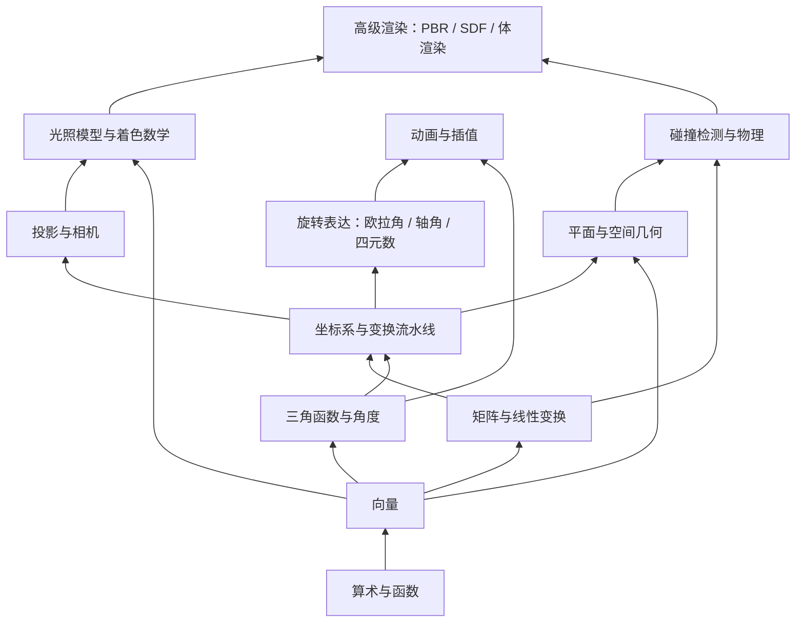

---
title: '图形学数学知识全景图：3D 与 2D 开发者的查漏补缺清单'
date: '2026-07-16'
description: '开发 3D/2D 项目到底需要哪些数学？本文将图形学所需的数学知识按层级梳理成一张完整的知识地图，帮你看清全貌、定位薄弱环节，并提供每个知识点与现有文章的对应关系，让你可以按图索骥地查漏补缺。'
tags: ['Math', 'Graphics', 'Roadmap', 'Checklist']
---

# 图形学数学知识全景图：3D 与 2D 开发者的查漏补缺清单

你可能已经写过一些 Shader，调过一些 Three.js 的参数，但总觉得"数学上差了点什么"——看到别人讨论四元数、SDF、BSDF，心里发虚，不知道自己到底缺了哪块。

这篇文章的目的，就是帮你把图形学数学**全景**铺开，让你一眼看到：有哪些知识域、哪些是必须掌握的、哪些可以按需学习，以及你自己目前站在哪一层。

---

## 一、 知识地图总览

下面这张图，把图形学数学按**依赖层级**从下往上排列。下层是上层的基础——你不可能跳过向量去学矩阵，也不可能跳过矩阵去学投影。

接下来，我们逐层展开，列出**每个知识域的核心知识点**，标注掌握优先级，并关联已有文章。

---

## 二、 第一层：算术与函数（基石）

这是最底层的工具。你不需要精通数学分析，但以下内容必须像呼吸一样自然。
**详细讲解见 [函数即图形：图形学数学的第一层基石](/blog/posts/math/functions-as-graphics)**。

| 知识点 | 优先级 | 说明 |
|--------|--------|------|
| 基本四则运算与运算优先级 | ★★★★★ | 不解释 |
| 幂与开方（$x^2$, $\sqrt{x}$） | ★★★★★ | 距离公式、对比度控制 |
| 绝对值（$\|x\|$） | ★★★★☆ | SDF 中的对称操作 |
| 取模（mod / fract） | ★★★★☆ | 纹理重复、周期动画 |
| 符号函数（sign） | ★★★☆☆ | 区分正负侧 |
| 阶跃函数（step） | ★★★★☆ | 硬边界、遮罩 |
| 平滑阶跃（smoothstep） | ★★★★★ | Shader 中最常用的平滑过渡 |
| 线性插值（mix / lerp） | ★★★★★ | 动画、颜色混合、参数过渡 |
| 反函数与复合函数 | ★★★☆☆ | 理解 `1.0 - x` 即反色、`pow(x, 2.2)` 即 gamma 校正 |
| 对数（log）与指数（exp） | ★★★☆☆ | HDR 曝光、衰减曲线 |

> **自检**：你能不查资料写出 `smoothstep` 的公式吗？你能解释 `mix(colorA, colorB, t)` 在 `t=0.3` 时的结果吗？如果犹豫了，先补这一层。

---

## 三、 第二层：向量（最核心的工具）

向量是图形学的**原子**。光、颜色、位置、方向、速度——全都是向量。

| 知识点 | 优先级 | 说明 | 已有文章 |
|--------|--------|------|----------|
| 向量与点的区别 | ★★★★★ | 位置 vs 位移 | [向量圣经](/blog/posts/math/vector-bible) |
| 加减法 | ★★★★★ | 位移合成、方向计算 | 同上 |
| 数乘 | ★★★★★ | 缩放、反向 | 同上 |
| 长度（length / magnitude） | ★★★★★ | 距离、归一化前提 | 同上 |
| 归一化（normalize） | ★★★★★ | 光照计算的第一步 | 同上 |
| 点积（dot product） | ★★★★★ | 夹角、投影、朝向判断 | 同上 |
| 叉积（cross product） | ★★★★★ | 法线、左右判定、面积 | 同上 |
| 反射向量（reflect） | ★★★★☆ | 光照反射、弹球 | 同上 |
| 折射向量（refract） | ★★★☆☆ | 透明材质、水面 | 同上 |
| 向量的分量访问（swizzle） | ★★★★☆ | `v.xz`、`v.yyy` 等 GLSL 特性 | — |
| 齐次坐标（4D 向量） | ★★★★★ | `vec4(x,y,z,w)`，平移变换的关键 | [矩阵革命](/blog/posts/math/matrix-in-webgl) |

:::tip 快速判断你的向量水平
如果你能解释"为什么法线要用 `normalize(cross(edge1, edge2))` 计算"，你的向量知识已经够用了。
:::

---

## 四、 第三层：矩阵与线性变换

矩阵是图形学的**动词**——它让向量"动"起来。

| 知识点 | 优先级 | 说明 | 已有文章 |
|--------|--------|------|----------|
| 矩阵乘法规则 | ★★★★★ | 行列对应，不可交换 | [矩阵革命](/blog/posts/math/matrix-in-webgl) |
| 缩放矩阵 | ★★★★★ | 对角线元素 | 同上 |
| 旋转矩阵（2D/3D） | ★★★★★ | 绕各轴旋转的公式 | 同上 |
| 平移矩阵（仿射变换） | ★★★★★ | 齐次坐标的妙用 | 同上 |
| 复合变换与乘法顺序 | ★★★★★ | `TRS` 顺序、`MVP` 顺序 | 同上 |
| 逆矩阵 | ★★★★☆ | 从世界坐标反推局部坐标 | 同上 |
| 转置矩阵 | ★★★★☆ | 法线变换需用逆转置 | 同上 |
| 正交矩阵 | ★★★★☆ | 旋转矩阵的特例，逆 = 转置 | — |
| 行列式 | ★★★☆☆ | 判断变换是否翻转/缩放 | — |
| 特征值与特征向量 | ★★☆☆☆ | PCA、主轴对齐，高级用途 | — |

:::warning 最常见的坑
矩阵乘法**不满足交换律**！`Rotate * Translate`（先平移再旋转）和 `Translate * Rotate`（先旋转再平移）结果完全不同。在写 `MVP` 矩阵时，顺序是 `Projection * View * Model * vertex`，从右往左读。
:::

---

## 五、 第四层：三角函数与角度

旋转、波浪、周期运动——三角函数是连接线性世界与周期世界的桥梁。

| 知识点 | 优先级 | 说明 |
|--------|--------|------|
| 弧度制 vs 角度制 | ★★★★★ | GPU 内部只用弧度 |
| sin / cos / tan | ★★★★★ | 旋转、波浪、振荡 |
| 反三角函数（asin, acos, atan） | ★★★★☆ | 从点积反推角度 |
| atan2(y, x) | ★★★★★ | 2D 角度计算、极坐标转换，比 atan 强 |
| 正弦波与参数方程 | ★★★★☆ | 动画路径、水面波纹 |
| 三角恒等式 | ★★★☆☆ | 和角公式、半角公式，优化 Shader |

> **实战提示**：在 Shader 中，`sin(iTime * speed) * 0.5 + 0.5` 是最常见的"让它动起来"公式。`atan2(z, x)` 是最常见的"求朝向角度"函数。

---

## 六、 第五层：坐标系与变换流水线

这是把前面所有知识串联起来的**枢纽层**。

| 知识点 | 优先级 | 说明 | 已有文章 |
|--------|--------|------|----------|
| 局部空间 → 世界空间 | ★★★★★ | Model Matrix | [坐标系与变换](/blog/posts/math/coordinate-systems-and-transformations) |
| 世界空间 → 观察空间 | ★★★★★ | View Matrix | [相机与投影](/blog/posts/math/camera-and-projection) |
| 观察空间 → 裁剪空间 | ★★★★★ | Projection Matrix | 同上 |
| 裁剪空间 → NDC | ★★★★★ | 透视除法（w 除法） | 同上 |
| NDC → 屏幕空间 | ★★★★★ | Viewport 变换 | — |
| 法线变换（逆转置矩阵） | ★★★★☆ | 非均匀缩放时法线会变形 | — |
| 左手系 vs 右手系 | ★★★★★ | OpenGL vs DirectX，影响面朝向 | 同上 |
| 行主序 vs 列主序 | ★★★★☆ | 内存布局差异，调试矩阵的关键 | — |

:::important 变换流水线是图形学的"任督二脉"
如果你不能一口气说出一个顶点从模型空间到屏幕像素的完整变换路径，你需要重读 [坐标系与变换](/blog/posts/math/coordinate-systems-and-transformations) 和 [相机与投影](/blog/posts/math/camera-and-projection) 这两篇文章。这是 3D 开发最核心的知识。
:::

---

## 七、 第六层：旋转表达

旋转是 3D 数学中最复杂的子领域，没有之一。

| 知识点 | 优先级 | 说明 | 已有文章 |
|--------|--------|------|----------|
| 欧拉角（Pitch/Yaw/Roll） | ★★★★★ | 最直观，但有万向节死锁 | [旋转的奥义](/blog/posts/math/3d-rotation) |
| 万向节死锁（Gimbal Lock） | ★★★★★ | 必须理解的问题 | 同上 |
| 轴角表示（Axis-Angle） | ★★★★☆ | 绕任意轴旋转 | 同上 |
| 四元数（Quaternion） | ★★★★★ | 无死锁、平滑插值 | 同上 |
| 四元数乘法与 Slerp | ★★★★☆ | 旋转组合与插值 | 同上 |
| 欧拉角 ↔ 四元数 ↔ 矩阵 互转 | ★★★★☆ | 实际开发中频繁用到 | — |

:::tip 什么时候用四元数？
- **角色动画、相机旋转**：用四元数（避免死锁 + 平滑插值）
- **Inspector 面板显示**：用欧拉角（人类可读）
- **Shader 内部计算**：用矩阵（GPU 最友好）
:::

---

## 八、 第七层：投影与相机

| 知识点 | 优先级 | 说明 | 已有文章 |
|--------|--------|------|----------|
| 透视投影矩阵推导 | ★★★★★ | 视锥体 → NDC | [相机与投影](/blog/posts/math/camera-and-projection) |
| 正交投影矩阵推导 | ★★★★☆ | 2D 游戏、UI 渲染、阴影贴图 | 同上 |
| 视锥体（Frustum）定义 | ★★★★★ | fov / aspect / near / far | 同上 |
| LookAt 矩阵构建 | ★★★★★ | eye / target / up | 同上 |
| 深度缓冲与 Z-Fighting | ★★★★★ | near/far 的设置影响精度 | — |
| 透视校正插值 | ★★★☆☆ | 为什么属性要除以 w | — |

---

## 九、 第八层：平面与空间几何

| 知识点 | 优先级 | 说明 | 已有文章 |
|--------|--------|------|----------|
| 平面的点法式定义 | ★★★★★ | 法线 + 点 | [平面与空间几何](/blog/posts/math/plane-geometry) |
| 点到平面的有向距离 | ★★★★★ | SDF、视锥体剔除 | 同上 |
| 射线与平面的交点 | ★★★★★ | 鼠标拾取、碰撞检测 | — |
| 射线与三角形相交（Möller–Trumbore） | ★★★★☆ | 光线追踪、拾取 | — |
| 射线与球/Box 相交 | ★★★★☆ | 碰撞检测 | — |
| 球面坐标与经纬度 | ★★★☆☆ | 天空盒、地球 | — |
| 凸包与分离轴定理（SAT） | ★★★☆☆ | 碰撞检测 | — |

---

## 十、 第九层：光照模型与着色数学

| 知识点 | 优先级 | 说明 | 已有文章 |
|--------|--------|------|----------|
| Lambert 漫反射 | ★★★★★ | $N \cdot L$ | [光照模型](/blog/posts/math/lighting-math) |
| Phong / Blinn-Phong 高光 | ★★★★★ | 半角向量、反射向量 | 同上 |
| 环境光 | ★★★★☆ | 最简近似 | 同上 |
| 菲涅尔效应 | ★★★★☆ | 边缘反射增强 | 同上 |
| 法线贴图的数学原理 | ★★★★☆ | 切线空间、TBN 矩阵 | — |
| PBR 核心公式（Cook-Torrance） | ★★★★☆ | 微表面理论、GGX、Schlick | — |
| 色彩空间（Linear vs sRGB） | ★★★★★ | 所有光照必须在 Linear 空间计算 | — |
| HDR 与色调映射（Tone Mapping） | ★★★★☆ | ACES、Reinhard | — |

---

## 十一、 第十层：动画与插值

| 知识点 | 优先级 | 说明 |
|--------|--------|------|
| 线性插值（lerp） | ★★★★★ | 万物起点 |
| 球面线性插值（Slerp） | ★★★★★ | 旋转插值，必须用四元数 |
| 缓动函数（Easing） | ★★★★★ | easeIn/easeOut/easeInOut |
| 贝塞尔曲线 | ★★★★☆ | 路径动画、UI 动画 |
| 三次样条（Catmull-Rom） | ★★★☆☆ | 相机路径 |
| 关键帧插值 | ★★★★☆ | 动画系统基础 |
| 弹簧阻尼模型 | ★★★☆☆ | UI 弹性动画 |

---

## 十二、 第十一层：碰撞检测与物理

| 知识点 | 优先级 | 适用场景 |
|--------|--------|----------|
| AABB 碰撞检测 | ★★★★★ | 2D/3D 游戏 |
| 球体碰撞检测 | ★★★★★ | 简单 3D 游戏 |
| 分离轴定理（SAT） | ★★★★☆ | 凸多边形/多面体 |
| 碰撞响应与冲量 | ★★★★☆ | 物理引擎 |
| 射线检测（Raycast） | ★★★★★ | 鼠标拾取、射击 |
| 重叠检测（Overlap） | ★★★★☆ | 触发器 |
| 速度与加速度（运动学） | ★★★★★ | 基础物理运动 |

---

## 十三、 第十二层：高级渲染数学

这些是进阶内容，当你掌握了前面所有层级后，再按需学习。

| 知识点 | 优先级 | 适用场景 |
|--------|--------|----------|
| SDF（有向距离场） | ★★★★☆ | 字体渲染、Ray Marching |
| Ray Marching 算法 | ★★★☆☆ | 体积云、分形 |
| 渲染方程 | ★★★☆☆ | 全局光照的理论基础 |
| 蒙特卡洛积分 | ★★★☆☆ | 路径追踪 |
| 球谐函数（SH） | ★★☆☆☆ | 环境光照探头 |
| 预计算辐射度传递（PRT） | ★☆☆☆☆ | 实时全局光照 |
| 体渲染与传输方程 | ★★☆☆☆ | 烟雾、云 |

---

## 十四、 按开发场景的速查表

不同的开发场景，需要的数学层级不同。以下按场景列出**最低必须掌握**的层级。

| 开发场景 | 最低必须掌握的层级 | 建议进阶 |
|----------|---------------------|----------|
| **2D Canvas 游戏** | 1-2 层 + 三角函数 + AABB 碰撞 | 贝塞尔曲线 |
| **2D WebGL / Shader Art** | 1-5 层（不需要相机/投影） | SDF |
| **Three.js 基础使用** | 1-7 层 | 法线贴图 |
| **Three.js 自定义 Shader** | 1-9 层 | PBR |
| **WebGIS / 地图** | 1-8 层 + 球面坐标 | 投影变换 |
| **3D 游戏开发** | 1-11 层 | 物理引擎集成 |
| **光线追踪 / 路径追踪** | 1-9 层 + 渲染方程 | 蒙特卡洛 |
| **Shader Art / Creative Coding** | 1-5 层 + SDF + Ray Marching | 分形数学 |
| **XR / VR 开发** | 1-8 层 + 四元数（必须精通） | 立体渲染 |

---

## 十五、 你的知识体检清单

用下面的清单快速自检。**能毫不犹豫地回答"会"，才算真正掌握。**

:::details 第一层：算术与函数
- [ ] 能手写 smoothstep 的实现
- [ ] 能解释 mix(a, b, t) 的三个参数含义
- [ ] 知道 pow(x, 2.2) 是什么操作
- [ ] 知道 step(edge, x) 和 sign(x) 的区别
:::

:::details 第二层：向量
- [ ] 能解释点和向量的区别
- [ ] 能手算两个 2D 向量的点积
- [ ] 能解释点积的三个核心用途（夹角/投影/朝向）
- [ ] 能手算两个 3D 向量的叉积
- [ ] 能解释叉积的几何意义（法线/面积/左右判定）
- [ ] 能写出反射向量的公式
- [ ] 知道为什么光照计算前必须归一化
:::

:::details 第三层：矩阵
- [ ] 能手算 2x2 矩阵乘法
- [ ] 能写出 2D 缩放矩阵、旋转矩阵
- [ ] 能解释齐次坐标（为什么需要 4x4）
- [ ] 能写出 3D 平移矩阵
- [ ] 知道矩阵乘法不满足交换律及其后果
- [ ] 知道 MVP 矩阵的正确乘法顺序
:::

:::details 第四层：三角函数
- [ ] 知道弧度与角度的换算
- [ ] 知道什么时候用 atan2 而不是 atan
- [ ] 能用 sin/cos 写一个圆周运动
- [ ] 知道为什么 Shader 里角度都用弧度
:::

:::details 第五层：坐标系与变换
- [ ] 能一口气说出顶点从局部空间到屏幕的完整路径
- [ ] 能解释 Model/View/Projection 三个矩阵各自的作用
- [ ] 知道 NDC 是什么
- [ ] 知道透视除法是什么
- [ ] 知道左手系和右手系的区别
:::

:::details 第六层：旋转
- [ ] 能解释万向节死锁
- [ ] 知道四元数相比欧拉角的优势
- [ ] 知道什么时候用欧拉角、什么时候用四元数
- [ ] 能解释 Slerp 的作用
:::

:::details 第七层：投影与相机
- [ ] 能解释透视投影和正交投影的区别
- [ ] 知道 fov / aspect / near / far 的含义
- [ ] 知道 Z-Fighting 是怎么产生的以及如何避免
- [ ] 能构建一个 LookAt 矩阵
:::

:::details 第八层：平面与空间几何
- [ ] 能用点法式定义一个平面
- [ ] 能计算点到平面的有向距离
- [ ] 能计算射线与平面的交点
- [ ] 知道 SDF 中"有向距离"的含义
:::

:::details 第九层：光照
- [ ] 能写出 Lambert 漫反射公式
- [ ] 能写出 Blinn-Phong 高光公式
- [ ] 知道为什么光照必须在 Linear 色彩空间计算
- [ ] 知道菲涅尔效应的表现和原理
- [ ] 知道法线贴图使用的坐标空间（切线空间）
:::

:::details 第十层：动画
- [ ] 能区分 lerp 和 Slerp 的适用场景
- [ ] 知道常见缓动函数的效果
- [ ] 能用贝塞尔曲线做路径动画
:::

:::details 第十一层：碰撞检测
- [ ] 能实现 AABB 碰撞检测
- [ ] 能实现射线与平面的相交测试
- [ ] 知道碰撞检测和碰撞响应的区别
:::

---

## 十六、 文章索引与学习路线

本系列已有文章与知识层级的对应关系：

| 层级 | 已有文章 |
|------|----------|
| 算术与函数 | [函数即图形：图形学数学的第一层基石](/blog/posts/math/functions-as-graphics) |
| 向量 | [向量圣经：图形学数学的第一块基石](/blog/posts/math/vector-bible) |
| 矩阵 | [矩阵革命：为什么图形学离不开矩阵？](/blog/posts/math/matrix-in-webgl) |
| 坐标系与变换 | [坐标系与变换：构建 3D 世界的时空法则](/blog/posts/math/coordinate-systems-and-transformations) |
| 旋转 | [旋转的奥义：从欧拉角到四元数](/blog/posts/math/3d-rotation) |
| 投影与相机 | [把世界装进盒子：相机与投影矩阵的数学推导](/blog/posts/math/camera-and-projection) |
| 平面与空间几何 | [上帝的切纸刀：平面与空间几何完全指南](/blog/posts/math/plane-geometry) |
| 光照 | [追光者：光照模型的数学原理](/blog/posts/math/lighting-math) |
| Shader 数学入门 | [重拾数学：写给前端的 GLSL 数学补习班](/blog/posts/math/math-for-shader-programming) |

**建议学习顺序**：先读"Shader 数学补习班"建立信心 → 再按层级从下往上依次学习 → 遇到具体问题时回查对应文章。

---

## 十七、 尚未覆盖的知识点

以下知识点在本系列中尚未有专门文章，如果你感兴趣，可以作为后续学习的方向：

- **法线贴图与切线空间**：TBN 矩阵的构建与应用
- **射线检测**：射线与各种几何体的相交算法
- **PBR 数学**：微表面理论、GGX 分布函数、Schlick 菲涅尔近似
- **SDF 与 Ray Marching**：有向距离场的基本运算与光线步进
- **贝塞尔曲线与样条**：路径动画的数学基础
- **碰撞检测算法**：SAT、GJK 等经典算法
- **色彩科学**：Linear vs sRGB、色彩空间转换、Tone Mapping

这些"空白地带"正是你可以继续深入的方向。图形学数学不是一座你一次性攀越的山峰，而是一片你可以在其中持续探索的海洋——随时可以潜得更深，但每一层都有足够的美景值得停留。
