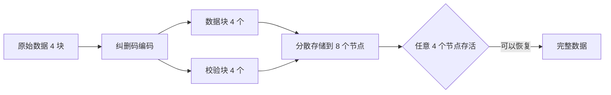
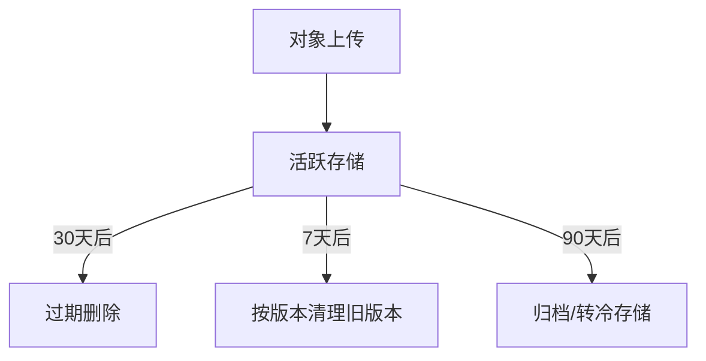
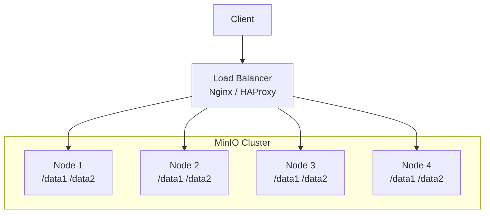
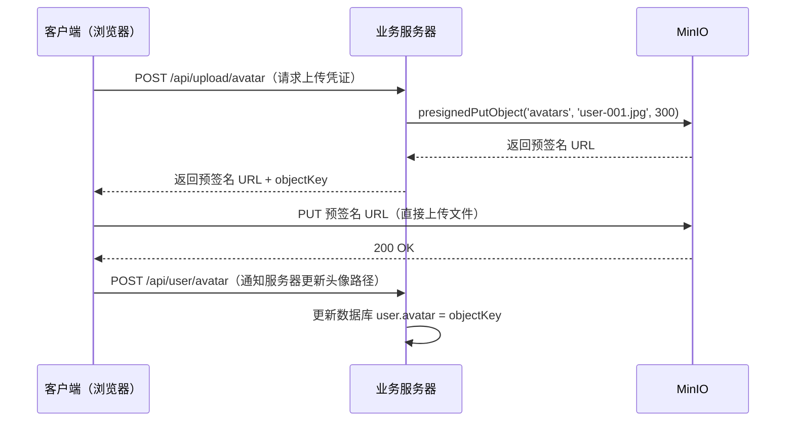

# MinIO 完全指南：从对象存储原理到生产级部署

MinIO 是一个高性能的开源对象存储系统，兼容 Amazon S3 API。它既可以单机运行用于开发测试，也能组建分布式集群承载 PB 级数据，是云原生应用存储图片、视频、备份文件的首选方案之一。

本文目标：让你从理解"对象存储是什么"开始，掌握 MinIO 的核心操作、权限管理、生命周期、分布式部署，以及实际项目中的最佳实践。

---

## 1. 为什么需要对象存储？

在聊 MinIO 之前，先理解"对象存储"解决了什么问题。

### 1.1 三种存储模型对比

| 类型 | 代表 | 特点 | 适合场景 |
|---|---|---|---|
| **块存储** | AWS EBS、本地磁盘 | 按块读写，低延迟 | 数据库、操作系统 |
| **文件存储** | NFS、HDFS | 树形目录结构 | 共享文件系统 |
| **对象存储** | S3、MinIO、OSS | 扁平键值结构，HTTP 访问 | 非结构化数据（图片、视频、文档） |

对象存储的核心设计哲学：**用 HTTP 访问任意大小的文件，以 Bucket + Key 定位对象，水平扩展近乎无限**。

### 1.2 对象存储的核心优势

- **水平扩展**：不受目录树深度限制，横向扩展节点即可增加容量
- **高可用性**：数据以纠删码（Erasure Code）分散在多个节点，单节点故障不影响数据
- **HTTP/S3 兼容**：标准接口，SDK 生态完善
- **成本低**：使用普通 x86 服务器，不需要专用存储硬件

---

## 2. MinIO 核心概念

在动手之前，先建立清晰的概念模型。

### 2.1 基本术语

```
MinIO Server
├── Bucket（存储桶）        ← 类似"目录"，但扁平化，不可嵌套
│   ├── Object（对象）      ← 文件本体 = 数据 + 元数据
│   │   ├── Key（键）       ← 对象的唯一标识，如 "2024/avatar/user-001.jpg"
│   │   ├── Value（值）     ← 实际文件内容（字节流）
│   │   └── Metadata        ← 自定义元数据 + 系统元数据（ETag、Content-Type 等）
│   └── Policy（策略）      ← Bucket 级别的访问控制
└── User/AccessKey          ← 身份认证（类似 IAM）
```

### 2.2 Key 的命名惯例

Key 虽然是扁平的字符串，但通常用 `/` 模拟目录结构：

```
avatars/users/2024/01/user-001.jpg
backups/mysql/daily/2024-01-15.sql.gz
videos/product/demo-001.mp4
```

这只是命名约定，对象存储内部不存在真正的目录层级。

### 2.3 纠删码（Erasure Code）

MinIO 默认使用纠删码而非传统的多副本策略：



MinIO 默认 EC:4（4 个数据块 + 4 个校验块），8 个驱动器，允许任意 4 个驱动器失效。与 3 副本（存储放大 3x）相比，纠删码存储放大仅约 1.5x，在保持高可用的同时节省空间。

---

## 3. 安装与快速启动

### 3.1 Docker 单机启动（开发环境首选）

```bash
docker run -d \
  --name minio \
  -p 9000:9000 \
  -p 9001:9001 \
  -e MINIO_ROOT_USER=minioadmin \
  -e MINIO_ROOT_PASSWORD=minioadmin123 \
  -v /data/minio:/data \
  quay.io/minio/minio server /data --console-address ":9001"
```

启动后：
- **API 端口**：`http://localhost:9000`（S3 兼容接口）
- **控制台**：`http://localhost:9001`（Web UI 管理界面）

### 3.2 Docker Compose 部署

生产环境推荐用 Docker Compose 管理：

```yaml
# docker-compose.yml
version: '3.8'
services:
  minio:
    image: quay.io/minio/minio:latest
    container_name: minio
    restart: unless-stopped
    ports:
      - "9000:9000"
      - "9001:9001"
    environment:
      MINIO_ROOT_USER: ${MINIO_ROOT_USER:-minioadmin}
      MINIO_ROOT_PASSWORD: ${MINIO_ROOT_PASSWORD:-minioadmin123}
      MINIO_VOLUMES: /data
    volumes:
      - minio_data:/data
    command: server /data --console-address ":9001"
    healthcheck:
      test: ["CMD", "curl", "-f", "http://localhost:9000/minio/health/live"]
      interval: 30s
      timeout: 20s
      retries: 3

volumes:
  minio_data:
```

```bash
docker-compose up -d
```

### 3.3 mc（MinIO Client）命令行工具

`mc` 是 MinIO 官方命令行客户端，功能类似 `aws s3`：

```bash
# 安装（Linux/macOS）
curl -O https://dl.min.io/client/mc/release/linux-amd64/mc
chmod +x mc
sudo mv mc /usr/local/bin/

# 添加 MinIO 实例（alias）
mc alias set local http://localhost:9000 minioadmin minioadmin123

# 验证连接
mc admin info local
```

---

## 4. 基本操作：存储桶与对象

### 4.1 存储桶管理

```bash
# 创建 Bucket
mc mb local/my-bucket

# 列出所有 Bucket
mc ls local

# 删除 Bucket（必须先清空）
mc rb local/my-bucket

# 强制删除（含内容）
mc rb --force local/my-bucket
```

:::warning
Bucket 名称规则：3-63 个字符，只能包含小写字母、数字和连字符，不能以连字符开头或结尾，不能包含连续连字符。
:::

### 4.2 对象操作

```bash
# 上传文件
mc cp ./photo.jpg local/my-bucket/images/photo.jpg

# 批量上传（递归）
mc cp --recursive ./photos/ local/my-bucket/images/

# 下载文件
mc cp local/my-bucket/images/photo.jpg ./downloaded.jpg

# 列出对象
mc ls local/my-bucket
mc ls --recursive local/my-bucket

# 删除对象
mc rm local/my-bucket/images/photo.jpg

# 查看对象信息（元数据）
mc stat local/my-bucket/images/photo.jpg

# 同步目录（类似 rsync）
mc mirror ./local-dir local/my-bucket/backup/
```

### 4.3 对象 URL 与预签名

对象存储的典型用法是生成**预签名 URL**，让客户端直接上传/下载，绕过业务服务器：

```bash
# 生成 1 小时有效的预签名下载链接
mc share download --expire 1h local/my-bucket/images/photo.jpg

# 生成上传链接（有效 15 分钟）
mc share upload --expire 15m local/my-bucket/images/
```

:::tip
预签名 URL 的价值：业务服务器只负责"签发授权"，实际的文件传输由客户端直接与 MinIO 通信，大幅减轻服务器带宽压力。
:::

---

## 5. 用 SDK 操作 MinIO

实际项目中通常通过 SDK 与 MinIO 交互。由于 MinIO 兼容 S3 API，官方 AWS SDK 可直接使用。

### 5.1 Node.js（使用 minio 官方 SDK）

```bash
npm install minio
```

```js
// 可运行
// 注意：此示例需要本地运行 MinIO 实例，这里仅展示 API 结构
const Minio = require('minio');

// 创建客户端
const minioClient = new Minio.Client({
  endPoint: 'localhost',
  port: 9000,
  useSSL: false,
  accessKey: 'minioadmin',
  secretKey: 'minioadmin123',
});

// 演示配置对象的属性
console.log('MinIO Client 配置:');
console.log('- endPoint:', minioClient.host);
console.log('- port:', minioClient.port);
console.log('- useSSL:', minioClient.protocol === 'https:');
console.log('\nS3 兼容的核心操作:');
const operations = ['makeBucket', 'putObject', 'getObject', 'removeObject', 'presignedGetObject'];
operations.forEach(op => console.log(`  minioClient.${op}(...)`));
```

核心 API 示例：

```js
// 上传文件
async function uploadFile(bucketName, objectName, filePath) {
  // 确保 bucket 存在
  const exists = await minioClient.bucketExists(bucketName);
  if (!exists) {
    await minioClient.makeBucket(bucketName, 'us-east-1');
    console.log(`Bucket '${bucketName}' 创建成功`);
  }

  // 上传文件
  const metadata = {
    'Content-Type': 'image/jpeg',
    'X-Custom-Meta': 'user-avatar',  // 自定义元数据
  };
  await minioClient.fPutObject(bucketName, objectName, filePath, metadata);
  console.log(`文件 '${objectName}' 上传成功`);
}

// 生成预签名下载 URL（有效期 1 小时）
async function getPresignedUrl(bucketName, objectName) {
  const url = await minioClient.presignedGetObject(bucketName, objectName, 60 * 60);
  return url;
}

// 从流中上传（适合处理用户上传的 HTTP 请求）
async function uploadFromStream(bucketName, objectName, stream, size, contentType) {
  await minioClient.putObject(bucketName, objectName, stream, size, {
    'Content-Type': contentType,
  });
}

// 列出对象（分页）
async function listObjects(bucketName, prefix = '') {
  return new Promise((resolve, reject) => {
    const objects = [];
    const stream = minioClient.listObjectsV2(bucketName, prefix, true);
    stream.on('data', obj => objects.push(obj));
    stream.on('end', () => resolve(objects));
    stream.on('error', reject);
  });
}
```

### 5.2 Python（使用 boto3，S3 兼容）

```python
import boto3
from botocore.client import Config

# 使用 boto3 连接 MinIO（S3 兼容）
s3_client = boto3.client(
    's3',
    endpoint_url='http://localhost:9000',
    aws_access_key_id='minioadmin',
    aws_secret_access_key='minioadmin123',
    config=Config(signature_version='s3v4'),
    region_name='us-east-1'  # MinIO 不强制 region，但 boto3 需要
)

# 创建 Bucket
s3_client.create_bucket(Bucket='my-bucket')

# 上传文件
s3_client.upload_file(
    Filename='./photo.jpg',
    Bucket='my-bucket',
    Key='images/photo.jpg',
    ExtraArgs={'ContentType': 'image/jpeg'}
)

# 生成预签名 URL（5 分钟有效）
url = s3_client.generate_presigned_url(
    ClientMethod='get_object',
    Params={'Bucket': 'my-bucket', 'Key': 'images/photo.jpg'},
    ExpiresIn=300
)
print(f"下载链接: {url}")

# 下载文件
s3_client.download_file('my-bucket', 'images/photo.jpg', './downloaded.jpg')

# 删除对象
s3_client.delete_object(Bucket='my-bucket', Key='images/photo.jpg')
```

### 5.3 Go（使用官方 minio-go SDK）

```go
package main

import (
    "context"
    "fmt"
    "log"
    "github.com/minio/minio-go/v7"
    "github.com/minio/minio-go/v7/pkg/credentials"
)

func main() {
    ctx := context.Background()

    // 初始化客户端
    client, err := minio.New("localhost:9000", &minio.Options{
        Creds:  credentials.NewStaticV4("minioadmin", "minioadmin123", ""),
        Secure: false,
    })
    if err != nil {
        log.Fatalln(err)
    }

    bucketName := "my-bucket"

    // 创建 Bucket
    err = client.MakeBucket(ctx, bucketName, minio.MakeBucketOptions{})
    if err != nil {
        // 检查是否已存在
        exists, errBucketExists := client.BucketExists(ctx, bucketName)
        if !(errBucketExists == nil && exists) {
            log.Fatalln(err)
        }
    }
    fmt.Printf("Bucket '%s' 就绪\n", bucketName)

    // 上传文件
    info, err := client.FPutObject(ctx, bucketName, "images/photo.jpg", "./photo.jpg", minio.PutObjectOptions{
        ContentType: "image/jpeg",
    })
    if err != nil {
        log.Fatalln(err)
    }
    fmt.Printf("上传成功: size=%d bytes\n", info.Size)
}
```

---

## 6. 访问控制与权限管理

### 6.1 Bucket 策略（Policy）

MinIO 使用与 AWS IAM 兼容的 JSON 策略语法控制 Bucket 访问。

**公开读策略（适合静态资源）：**

```json
{
  "Version": "2012-10-17",
  "Statement": [
    {
      "Effect": "Allow",
      "Principal": {"AWS": ["*"]},
      "Action": ["s3:GetObject"],
      "Resource": ["arn:aws:s3:::public-assets/*"]
    }
  ]
}
```

```bash
# 应用策略
mc anonymous set-json ./public-policy.json local/public-assets

# 快捷设置：公开读
mc anonymous set download local/public-assets

# 查看当前策略
mc anonymous get local/public-assets

# 撤销公开访问（恢复私有）
mc anonymous set none local/public-assets
```

**精细化策略（限制 IP 或操作）：**

```json
{
  "Version": "2012-10-17",
  "Statement": [
    {
      "Effect": "Allow",
      "Principal": {"AWS": ["*"]},
      "Action": ["s3:GetObject"],
      "Resource": ["arn:aws:s3:::uploads/*"],
      "Condition": {
        "IpAddress": {
          "aws:SourceIp": ["192.168.1.0/24"]
        }
      }
    }
  ]
}
```

### 6.2 用户与 AccessKey 管理

:::note
MinIO 支持两种身份模型：**内置用户**（本地 IAM）和**外部 OIDC/LDAP** 集成。中小型部署通常用内置用户即可。
:::

```bash
# 创建用户
mc admin user add local developer dev-secret-key

# 列出所有用户
mc admin user list local

# 给用户绑定策略
mc admin policy attach local readwrite --user developer

# 查看内置策略
mc admin policy list local
# 常见内置策略：readonly、readwrite、writeonly、diagnostics、consoleAdmin

# 创建自定义策略
mc admin policy create local my-policy ./my-policy.json

# 创建 Service Account（独立 AccessKey，归属于某个用户）
mc admin user svcacct add local developer
```

### 6.3 最小权限实践

生产环境推荐为每个服务创建独立的 Service Account，而非共用 Root 账户：

```bash
# 为后端服务创建专用 AccessKey
mc admin user svcacct add \
  --access-key my-app-access-key \
  --secret-key my-app-secret-key \
  --policy ./app-policy.json \
  local developer
```

对应的 Policy 只授予该服务必要的权限，例如只允许写入特定 Bucket：

```json
{
  "Version": "2012-10-17",
  "Statement": [
    {
      "Effect": "Allow",
      "Action": ["s3:PutObject", "s3:GetObject", "s3:DeleteObject"],
      "Resource": ["arn:aws:s3:::app-uploads/*"]
    },
    {
      "Effect": "Allow",
      "Action": ["s3:ListBucket"],
      "Resource": ["arn:aws:s3:::app-uploads"]
    }
  ]
}
```

---

## 7. 生命周期管理

大量文件积累后，自动化管理文件生命周期非常重要。MinIO 支持与 S3 兼容的生命周期规则。

### 7.1 常见生命周期场景



### 7.2 配置生命周期规则

通过 mc 命令配置（推荐，直观）：

```bash
# 30 天后自动删除对象
mc ilm rule add \
  --expiry-days 30 \
  local/temp-uploads

# 针对特定前缀的对象设置 60 天过期
mc ilm rule add \
  --prefix "logs/" \
  --expiry-days 60 \
  local/app-bucket

# 查看生命周期规则
mc ilm rule list local/app-bucket

# 删除规则
mc ilm rule remove --id <rule-id> local/app-bucket
```

通过 JSON 配置（精细控制）：

```json
{
  "Rules": [
    {
      "ID": "expire-old-logs",
      "Status": "Enabled",
      "Filter": {
        "Prefix": "logs/"
      },
      "Expiration": {
        "Days": 90
      }
    },
    {
      "ID": "cleanup-temp",
      "Status": "Enabled",
      "Filter": {
        "Prefix": "temp/"
      },
      "Expiration": {
        "Days": 7
      }
    }
  ]
}
```

```bash
mc ilm import local/app-bucket < lifecycle.json
```

### 7.3 版本控制与生命周期

开启版本控制后，对象不会被立即删除，而是生成"删除标记"。配合生命周期清理旧版本：

```bash
# 开启版本控制
mc version enable local/important-bucket

# 清理 30 天前的非当前版本
mc ilm rule add \
  --noncurrent-expire-days 30 \
  local/important-bucket

# 删除所有删除标记（cleanup）
mc ilm rule add \
  --expire-delete-marker \
  local/important-bucket
```

---

## 8. 事件通知（Webhook/消息队列）

MinIO 支持在对象创建、删除等事件发生时推送通知，可对接 Kafka、RabbitMQ、Redis、Webhook 等。

### 8.1 配置 Webhook 通知

```bash
# 1. 配置 Webhook 目标
mc admin config set local notify_webhook:mywebhook \
  endpoint="https://my-api.example.com/minio-events" \
  auth_token="Bearer my-secret-token"

# 重启使配置生效
mc admin service restart local

# 2. 绑定事件到 Bucket
mc event add local/my-bucket arn:minio:sqs::mywebhook:webhook \
  --event put,delete \
  --prefix "uploads/"

# 3. 查看已绑定的事件
mc event list local/my-bucket
```

### 8.2 Webhook 接收到的事件结构

```json
{
  "EventName": "s3:ObjectCreated:Put",
  "Key": "my-bucket/uploads/2024/photo.jpg",
  "Records": [
    {
      "eventVersion": "2.0",
      "eventSource": "minio:s3",
      "awsRegion": "",
      "eventTime": "2024-01-15T10:30:00.000Z",
      "eventName": "s3:ObjectCreated:Put",
      "s3": {
        "bucket": {
          "name": "my-bucket",
          "arn": "arn:aws:s3:::my-bucket"
        },
        "object": {
          "key": "uploads/2024/photo.jpg",
          "size": 204800,
          "eTag": "d41d8cd98f00b204e9800998ecf8427e",
          "contentType": "image/jpeg"
        }
      }
    }
  ]
}
```

:::tip
事件通知的典型用法：用户上传图片 → MinIO 触发 Webhook → 后端服务收到通知 → 异步做图片压缩/生成缩略图/入库。这样主上传流程无需等待图片处理完成。
:::

---

## 9. 分布式集群部署

生产环境中，MinIO 通过分布式模式实现高可用和大容量。

### 9.1 分布式模式原理



MinIO 分布式要求：
- **最少 4 个节点**（或 4 个驱动器），以支持纠删码
- 各节点**时钟同步**（NTP），时差不超过 3 秒
- 节点间**网络互通**，推荐 10GbE 及以上

### 9.2 Docker Compose 4 节点集群示例

```yaml
# docker-compose-cluster.yml
version: '3.8'

x-minio-common: &minio-common
  image: quay.io/minio/minio:latest
  command: server --console-address ":9001" http://minio{1...4}/data{1...2}
  environment:
    MINIO_ROOT_USER: minioadmin
    MINIO_ROOT_PASSWORD: minioadmin123
  expose:
    - "9000"
    - "9001"
  healthcheck:
    test: ["CMD", "curl", "-f", "http://localhost:9000/minio/health/live"]
    interval: 30s
    timeout: 20s
    retries: 3

services:
  minio1:
    <<: *minio-common
    hostname: minio1
    volumes:
      - minio1-data1:/data1
      - minio1-data2:/data2

  minio2:
    <<: *minio-common
    hostname: minio2
    volumes:
      - minio2-data1:/data1
      - minio2-data2:/data2

  minio3:
    <<: *minio-common
    hostname: minio3
    volumes:
      - minio3-data1:/data1
      - minio3-data2:/data2

  minio4:
    <<: *minio-common
    hostname: minio4
    volumes:
      - minio4-data1:/data1
      - minio4-data2:/data2

  nginx:
    image: nginx:latest
    ports:
      - "9000:9000"
      - "9001:9001"
    volumes:
      - ./nginx.conf:/etc/nginx/nginx.conf:ro
    depends_on:
      - minio1
      - minio2
      - minio3
      - minio4

volumes:
  minio1-data1:
  minio1-data2:
  minio2-data1:
  minio2-data2:
  minio3-data1:
  minio3-data2:
  minio4-data1:
  minio4-data2:
```

对应的 Nginx 负载均衡配置：

```nginx
# nginx.conf
upstream minio_api {
    server minio1:9000;
    server minio2:9000;
    server minio3:9000;
    server minio4:9000;
}

upstream minio_console {
    server minio1:9001;
}

server {
    listen 9000;
    location / {
        proxy_pass http://minio_api;
        proxy_set_header Host $http_host;
        proxy_set_header X-Real-IP $remote_addr;
        client_max_body_size 0;  # 不限制上传大小
        proxy_buffering off;
        proxy_request_buffering off;
    }
}

server {
    listen 9001;
    location / {
        proxy_pass http://minio_console;
        proxy_set_header Host $http_host;
        proxy_http_version 1.1;
        proxy_set_header Upgrade $http_upgrade;
        proxy_set_header Connection "upgrade";
    }
}
```

### 9.3 集群扩容：Server Pool

MinIO 支持通过 **Server Pool** 方式不停机横向扩容：

```bash
# 原始集群：4 个节点
minio server http://minio{1...4}/data{1...2}

# 添加新的 Server Pool（再加 4 个节点）
minio server \
  http://minio{1...4}/data{1...2} \
  http://minio{5...8}/data{1...2}
```

:::warning
Server Pool 扩容后，新数据会写入新 Pool，旧 Pool 数据不会自动迁移。需要在低峰期规划数据均衡（rebalance），或接受两个 Pool 负载不均匀的现状。
:::

---

## 10. 与业务系统集成的典型场景

### 10.1 用户头像上传（预签名 URL 方案）

最佳实践是"客户端直传"，减少服务器中转：



Node.js 服务端实现：

```js
// 生成上传凭证的 API
app.post('/api/upload/presign', async (req, res) => {
  const { fileName, contentType, userId } = req.body;

  // 生成唯一的 objectKey，避免覆盖和暴露用户 ID
  const ext = path.extname(fileName);
  const objectKey = `avatars/${userId}/${Date.now()}${ext}`;

  // 生成预签名上传 URL（5 分钟有效）
  const uploadUrl = await minioClient.presignedPutObject('user-uploads', objectKey, 5 * 60);

  res.json({
    uploadUrl,
    objectKey,
    // 上传成功后的访问 URL（如果 Bucket 是公开读）
    accessUrl: `https://cdn.example.com/${objectKey}`,
  });
});
```

### 10.2 数据库备份自动上传

```python
import boto3
import subprocess
import datetime
import gzip

def backup_mysql_to_minio(host, database, user, password, bucket, prefix):
    """自动备份 MySQL 并上传到 MinIO"""
    timestamp = datetime.datetime.now().strftime('%Y-%m-%d_%H-%M-%S')
    filename = f"{prefix}/{database}_{timestamp}.sql.gz"

    # 执行 mysqldump 并压缩
    dump_cmd = [
        'mysqldump',
        f'--host={host}',
        f'--user={user}',
        f'--password={password}',
        database
    ]

    s3 = boto3.client(
        's3',
        endpoint_url='http://minio:9000',
        aws_access_key_id='backup-access-key',
        aws_secret_access_key='backup-secret-key',
    )

    # 流式上传（不需要本地落盘）
    proc = subprocess.Popen(dump_cmd, stdout=subprocess.PIPE)
    compressed = gzip.GzipFile(fileobj=proc.stdout)

    s3.upload_fileobj(compressed, bucket, filename)
    proc.wait()

    print(f"备份完成: s3://{bucket}/{filename}")
    return filename

# 每天凌晨 3 点通过 cron 调用
backup_mysql_to_minio(
    host='mysql-primary',
    database='myapp',
    user='backup_user',
    password='backup_pass',
    bucket='db-backups',
    prefix='mysql/daily'
)
```

---

## 11. 监控与运维

### 11.1 内置健康检查端点

MinIO 提供了标准的健康检查 HTTP 端点：

```bash
# 节点健康检查
curl http://localhost:9000/minio/health/live

# 集群读写就绪检查
curl http://localhost:9000/minio/health/ready

# 集群存储容量信息
mc admin info local
```

### 11.2 Prometheus 监控

MinIO 原生支持 Prometheus 指标抓取：

```bash
# 生成 Prometheus 配置（含认证 token）
mc admin prometheus generate local

# 输出类似：
# - job_name: minio-job
#   bearer_token: <token>
#   metrics_path: /minio/v2/metrics/cluster
#   scheme: http
#   static_configs:
#   - targets: ['localhost:9000']
```

常用 Prometheus 指标：

| 指标 | 说明 |
|---|---|
| `minio_cluster_capacity_raw_total_bytes` | 总原始存储容量 |
| `minio_cluster_capacity_usable_total_bytes` | 可用存储容量 |
| `minio_s3_requests_total` | S3 请求总数（按方法分） |
| `minio_s3_traffic_received_bytes` | 入流量 |
| `minio_s3_traffic_sent_bytes` | 出流量 |
| `minio_node_drive_errors_total` | 磁盘错误数 |

### 11.3 常用运维命令

```bash
# 查看集群状态（节点、磁盘、版本）
mc admin info local

# 查看实时指标
mc admin top api local

# 检查数据完整性（慎用，I/O 密集）
mc admin heal local/my-bucket --recursive

# 查看服务器配置
mc admin config get local

# 在线更新 MinIO
mc admin update local

# 导出 IAM 配置（用于备份或迁移）
mc admin cluster iam export local
```

---

## 12. 常见问题与生产注意事项

:::warning
**永远不要用 Root 账户直接对接业务服务**。Root 账户用于初始化配置，之后应立即创建独立用户和 Service Account，并设置强密码（随机 32+ 字符）。
:::

### 12.1 大文件上传：分片上传

超过 5GB 的文件必须使用分片上传（Multipart Upload）。MinIO SDK 已自动处理：

```js
// minio-go 和 minio-js 在文件超过阈值时自动使用分片上传
// Node.js SDK 默认当对象大于 64MB 时自动切片
await minioClient.fPutObject(bucket, key, filePath, {
  partSize: 64 * 1024 * 1024, // 每片 64MB（默认）
});
```

未完成的分片上传会占用存储空间。应配置生命周期规则自动清理：

```json
{
  "Rules": [{
    "ID": "cleanup-incomplete-multipart",
    "Status": "Enabled",
    "Filter": {},
    "AbortIncompleteMultipartUpload": {
      "DaysAfterInitiation": 7
    }
  }]
}
```

### 12.2 性能调优要点

| 场景 | 建议 |
|---|---|
| 大量小文件 | 考虑打包成 tar 后存储，或使用对象合并 |
| 高并发上传 | 多实例分流，使用多个 Bucket 或前缀分区 |
| CDN 加速 | MinIO 前置 Nginx/CloudFlare，对 public Bucket 做 CDN 缓存 |
| 网络传输慢 | 开启 TLS 并确认 cipher suite；内网部署关闭不必要的 TLS 握手 |
| 磁盘 I/O 瓶颈 | 每个节点多个驱动器（MinIO 并行写入），避免跨 HDD/SSD 混用 |

### 12.3 数据迁移：mc mirror

从其他 S3 兼容存储（AWS S3、阿里云 OSS）迁移到 MinIO：

```bash
# 配置源（AWS S3）
mc alias set aws https://s3.amazonaws.com MY_AWS_KEY MY_AWS_SECRET

# 配置目标（MinIO）
mc alias set local http://localhost:9000 minioadmin minioadmin123

# 全量镜像迁移（保持对象键不变）
mc mirror aws/source-bucket local/dest-bucket

# 增量同步（只同步新增和修改）
mc mirror --watch aws/source-bucket local/dest-bucket
```

---

## 小结

| 功能 | 核心命令/概念 |
|---|---|
| 单机部署 | `docker run quay.io/minio/minio server /data` |
| 存储桶操作 | `mc mb`、`mc ls`、`mc rb` |
| 对象操作 | `mc cp`、`mc rm`、`mc stat`、`mc mirror` |
| 权限控制 | Bucket Policy（JSON）、mc anonymous |
| 用户管理 | `mc admin user`、`mc admin policy` |
| 生命周期 | `mc ilm rule add`，配合 JSON 规则 |
| 事件通知 | `mc admin config set notify_webhook`、`mc event add` |
| 分布式集群 | 4+ 节点，Server Pool 扩容，Nginx 负载均衡 |
| 监控 | Prometheus 指标、`mc admin info`、健康检查端点 |
| SDK 支持 | Node.js（minio）、Python（boto3）、Go（minio-go）、Java（aws-sdk） |

MinIO 的设计哲学是"简单、高性能、S3 兼容"。掌握了本文的内容，你已经能在生产环境中部署并运维一个可靠的 MinIO 集群。后续可以进一步探索：WORM（写一次读多次）合规存储、Bucket Replication（跨数据中心复制）、KES 密钥加密服务等进阶特性。
