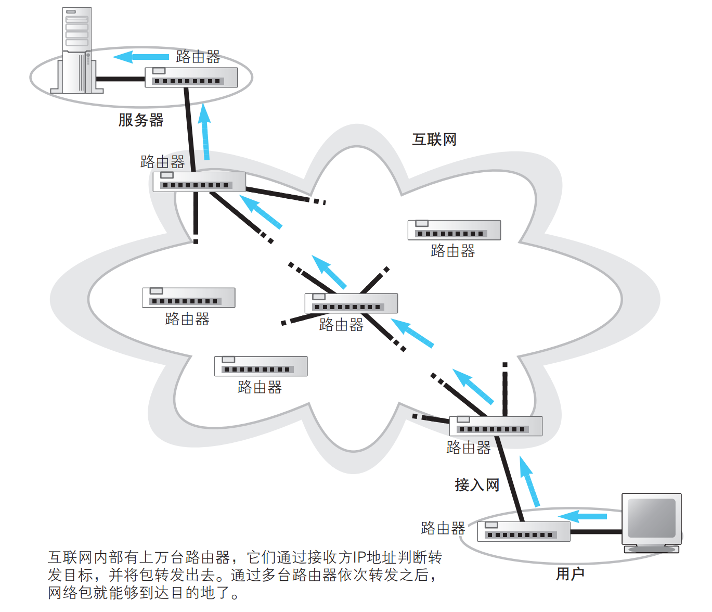
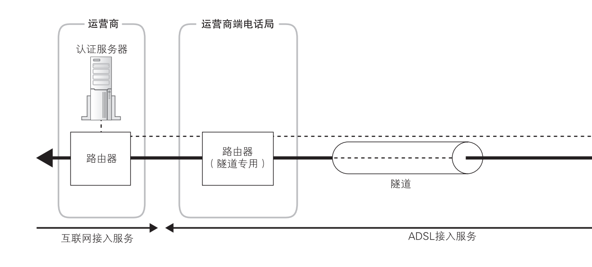
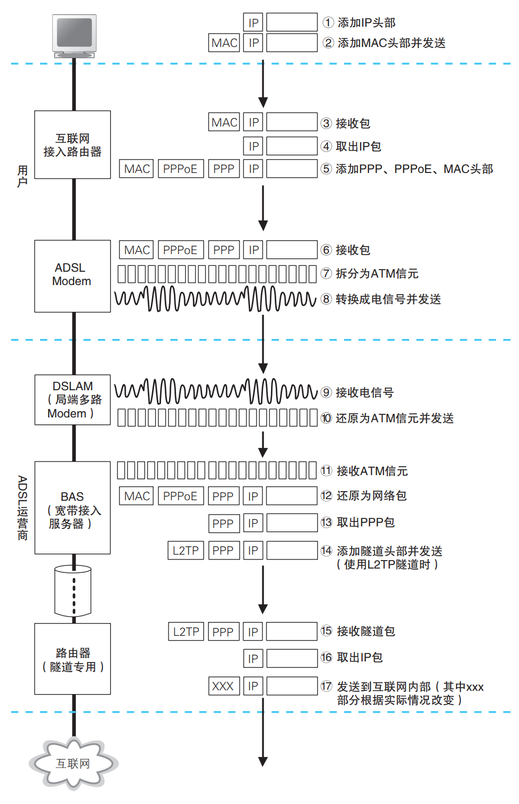
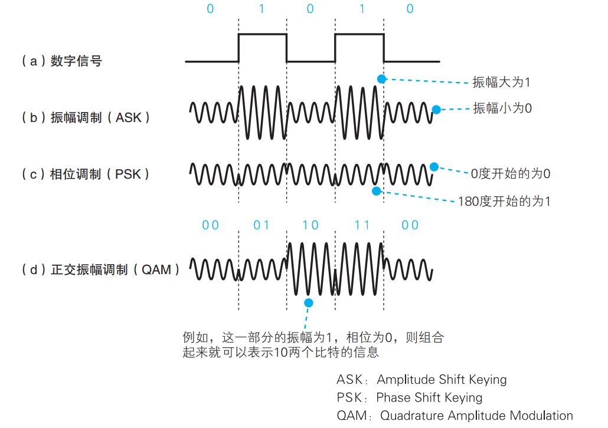
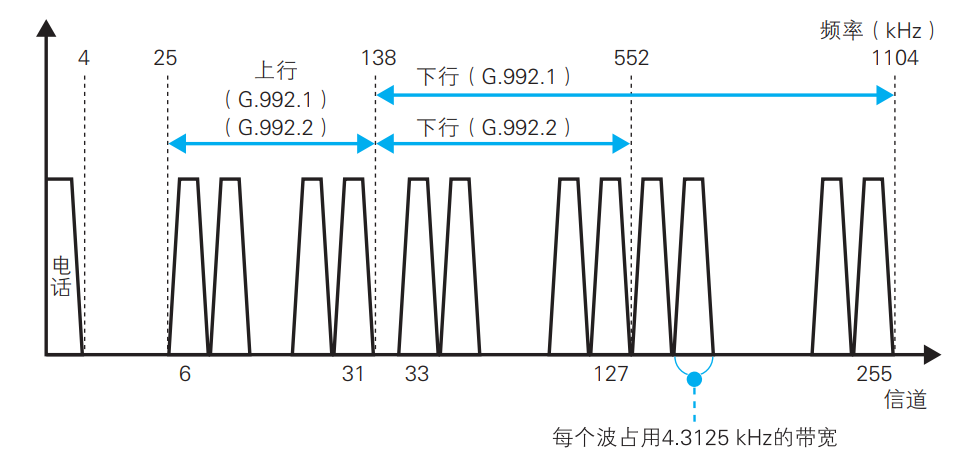
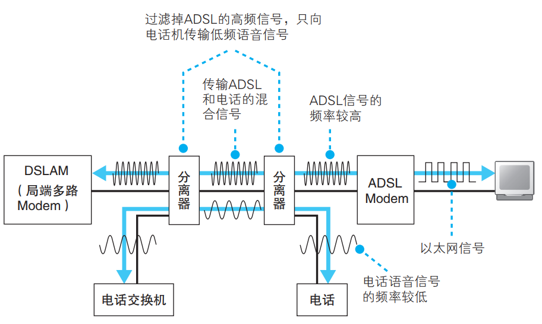
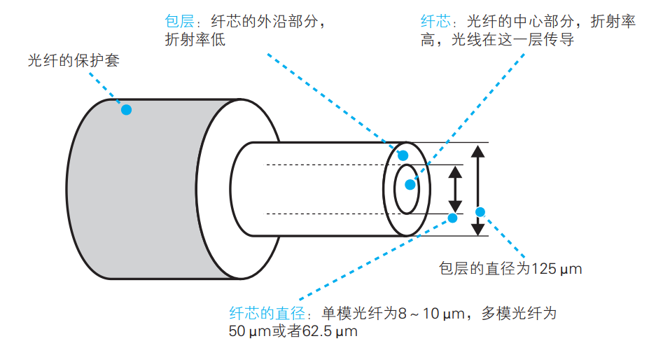
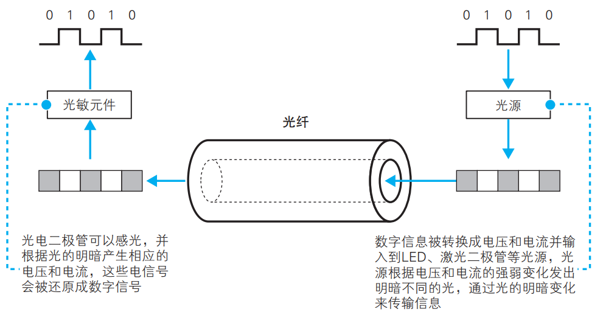

在[前三篇文章](/posts/network/how-networks-work-part1)中，我们跟踪了网络包从浏览器生成 HTTP 请求、经过 DNS 查询、TCP/IP 协议栈封装、转换为电信号在线缆中传输，再通过集线器、交换机和路由器逐步转发的完整过程。现在，网络包已经到达了互联网接入路由器，即将迈入互联网的世界。

本篇是系列的最后一部分，将覆盖以下关键环节：

1. **接入网**：家庭和公司网络如何通过 ADSL 或 FTTH 等接入网技术与互联网相连
2. **PPP 和隧道**：接入网中的身份验证机制和数据传输管道
3. **网络运营商内部**：运营商网络的结构与路由交换
4. **跨越运营商**：不同运营商之间如何互联，网络包如何穿越运营商边界

## ADSL 接入网的结构和工作方式

家庭和公司的内网是通过接入网连接到网络运营商的。接入网有很多类型，这里我们将介绍 ADSL 接入网的知识，重点包括 ADSL 接入网的结构、电话线中传输的信号以及与电话共用的方式

### 互联网的基本结构和家庭、公司网络是相同的

和家庭、公司网络一样，互联网也是通过路由器来转发包的

互联网也是根据路由表中的记录来判断转发目标的，但路由表记录的维护方式不同

距离的不同和路由的维护方式，就是互联网与家庭、公司网络之间最主要的两个不同点

### 连接用户与互联网的接入网

网络包通过交换机和路由器的转发一步一步地接近它的目的地，在通过互联网接入路由器之后，就进入了互联网

根据包 IP 头部中的接收方 IP 地址在路由表的目标地址中进行匹配，找到相应的路由记录后将包转发到这条路由的目标网关。

互联网接入路由器发送网络包的操作和以太网路由器有一点不同，互联网接入路由器是按照接入网规则来发送包的

所谓接入网，就是指连接互联网与家庭、公司网络的通信线路。一般家用的接入网方式包括 ADSL、FTTH、CATV、电话线、ISDN 等

### ADSL Modem 将包拆分成信元

ADSL 技术使用的接入线路

互联网接入路由器会在网络包前面加上 MAC 头部、PPPoE 头部、PPP 头部总共 3 种头部，然后发送给 ADSL Modem

ADSL Modem 将包拆分成信元，并转换成电信号发送给分离器。

### ADSL 将信元"调制"成信号

ADSL Modem 采用了一种用圆滑波形（正弦波）对信号进行合成来表示 0 和 1 的技术，这种技术称为调制

振幅调制是用信号的强弱，也就是信号振幅的大小来对应 0 和 1 的方式。振幅小的信号为 0，振幅大的信号为 1

正交振幅调制中，通过增加振幅和相位的级别，就可以增加能表示的比特数。

### ADSL 通过使用多个波来提高速率

实际上信号不一定要限制在一个频率。不同频率的波可以合成，也可以用滤波器从合成的波中分离出某个特定频率的波。

使用多个频率合成的波来传输信号，能够表示的比特数就可以成倍提高

ADSL 使用间隔为 4.3125 kHz 的上百个不同频率的波进行合成，每个波都采用正交振幅调制

### 分离器的作用

分离器的作用是将电话语音信号和 ADSL 数据信号分离开来。当电话和 ADSL 同时使用一条电话线时，分离器确保两种信号互不干扰——语音信号被送往电话机，而高频的数据信号则被送往 ADSL Modem。

## 光纤接入网（FTTH）

与 ADSL 技术利用率不相上下的是光纤接入技术。下面重点介绍光纤结构、单模和多模的区别，以及光纤用作接入网时的工作方式。

### 光纤的基本知识

将数字信息转换成电信号，然后再将电信号转换成光信号。高电压发光亮，低电压发光暗

光纤的核心原理是全反射：光在光纤内部通过不断反射来传播，就像水在水管中流动一样。光纤由折射率较高的纤芯和折射率较低的包层组成，当光以大于临界角的角度射入纤芯时，就会在纤芯和包层的界面上发生全反射，从而被束缚在纤芯中向前传播。

### 单模与多模

根据纤芯直径的不同，光纤分为单模光纤和多模光纤两种类型。

**多模光纤**的纤芯直径较粗（约 50~62.5μm），光可以从多个角度射入纤芯，形成多条传播路径（即多种"模式"）。由于不同路径的光到达终点的时间略有差异，信号在长距离传输后会产生色散（模间色散），导致信号波形展宽、失真。因此多模光纤适合短距离传输（通常在几百米以内），常用于建筑物内部或机房内的布线。

**单模光纤**的纤芯直径非常细（约 8~10μm），只允许光以一条路径传播，从根本上消除了模间色散的问题。单模光纤的传输距离远大于多模光纤，可以达到几十公里甚至上百公里，因此被广泛用于接入网和长距离通信干线。

简单来说：纤芯越细，光路越单纯，传输距离越远；纤芯越粗，光路越多，信号分散越快，传输距离越短。

## 接入网中使用的 PPP 和隧道

网络包通过 ADSL 或光纤等物理介质到达运营商之前，还需要解决两个关键问题：**如何验证用户身份**，以及**如何建立一条虚拟的数据通道**。

接入网需要通过用户名和密码验证用户的身份，然后由网络运营商向用户分配公有地址。这一过程使用的是 **PPP（Point-to-Point Protocol，点对点协议）**。PPP 最初是为电话拨号上网设计的协议，后来被扩展到 ADSL 和光纤接入网中，用于在用户和运营商之间建立点对点连接、完成身份认证（如 CHAP/PAP）以及分配 IP 地址。在以太网上运行 PPP 的变体称为 PPPoE（PPP over Ethernet），这也是目前家用宽带最常见的认证方式。

此外，从接入网向网络运营商传输网络包时还使用了隧道技术。隧道（Tunnel）的原理类似于在两个节点之间架设一条虚拟的管道：发送方将原始网络包用新的头部封装起来，通过接入网传输到运营商端后，运营商再拆除外层封装，取出原始包继续转发。对原始包来说，接入网就像一条"看不见"的直通管道，它无需关心途中的具体路由细节。常见的隧道协议包括 L2TP 等。

## 网络运营商的内部

通过接入网后，网络包就进入了网络运营商的内部网络。运营商网络也是以路由器为核心组成的，这一点和家庭、公司网络是一样的，包转发的工作原理也没有区别。不过，运营商网络也使用了一些和家庭、公司网络不同的技术，比如运营商之间可以自动交换路由信息和更新路由表。

运营商网络的核心由 **POP（Point of Presence，接入点）** 和 **NOC（Network Operation Center，网络运营中心）** 两类设施组成。POP 是用户接入运营商网络的入口点，分布在全国各城市，用户通过接入网连接到就近的 POP。NOC 则是运营商的核心枢纽，多个 POP 通过高速骨干线路连接到 NOC，NOC 之间再通过更高等级的骨干网互联，形成运营商内部的层级化网络结构。

在路由信息的维护方面，运营商网络使用 **BGP（Border Gateway Protocol，边界网关协议）** 等路由协议来自动交换路由信息。与家庭、公司网络中手动配置静态路由不同，BGP 能够在运营商之间动态传播可达性信息，使路由表自动更新，这也是运营商网络能够覆盖全球范围的关键所在。

## 跨越运营商的网络包

互联网是由多个运营商网络相互连接形成的巨大网络，而多个运营商之间相互连接的部分可以说就是互联网的核心部分。

不同运营商的用户要互相通信，网络包就必须跨越运营商的边界。运营商之间通过 **IX（Internet Exchange，互联网交换中心）** 进行互联。IX 是一个中立的物理设施，多个运营商将自己的路由器连接到 IX 提供的交换机上，从而实现彼此之间的直接数据交换。通过 IX，运营商之间可以"对等互联（Peering）"，无需经过第三方即可直接交换流量，这大大提高了传输效率并降低了延迟。

当网络包需要从运营商 A 传送到运营商 B 的用户时，运营商 A 的路由器会根据 BGP 路由信息找到前往目标地址的最优路径，将包转发到与运营商 B 相连的 IX，再由运营商 B 的路由器接手，继续在自己的网络中转发，直到送达目标服务器。

## 系列总结：一个网络包的完整旅程

至此，我们已经跟随一个网络包走完了从浏览器到服务器的全部旅程。让我们回顾一下这条路径上的每一个关键阶段：

1. **浏览器生成 HTTP 请求**（[第一篇](/posts/network/how-networks-work-part1)）：浏览器解析 URL，生成 HTTP 请求消息，通过 DNS 查询获取目标服务器的 IP 地址
2. **协议栈封装**（[第二篇](/posts/network/how-networks-work-part2)）：操作系统将 HTTP 消息交给 TCP/IP 协议栈，依次添加 TCP 头部、IP 头部，完成可靠传输和路由寻址的封装
3. **信号传输与设备转发**（[第三篇](/posts/network/how-networks-work-part3)）：网卡将数字数据转换为电信号在网线中传输，经过集线器、交换机和路由器的逐级转发，网络包一步步接近目标
4. **接入网与互联网**（本篇）：网络包通过 ADSL/FTTH 接入网，借助 PPP 认证和隧道技术穿越接入网进入运营商网络，再经运营商内部路由和 IX 跨运营商互联，最终抵达目标服务器

一个简单的 HTTP 请求背后，是这一整套精密而复杂的网络体系在运转。理解了这个全貌，再回过头来看网络中的任何一个环节，都会发现它不再是一个孤立的黑盒，而是整条数据通路中不可或缺的一环。
