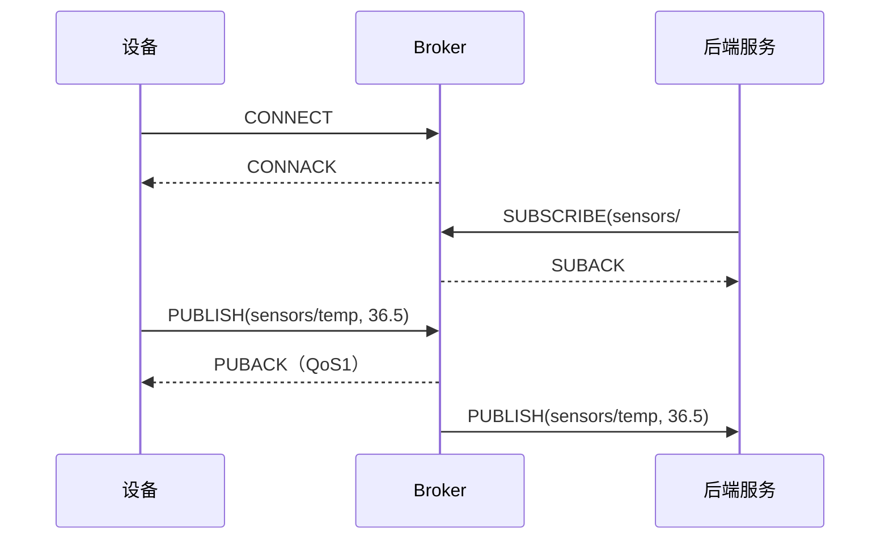
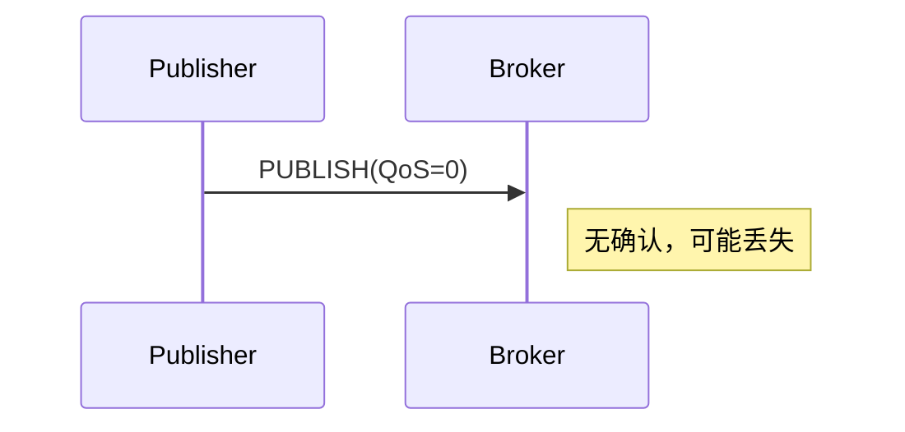
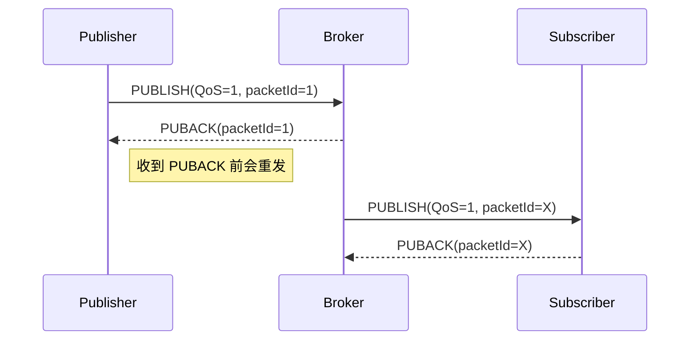
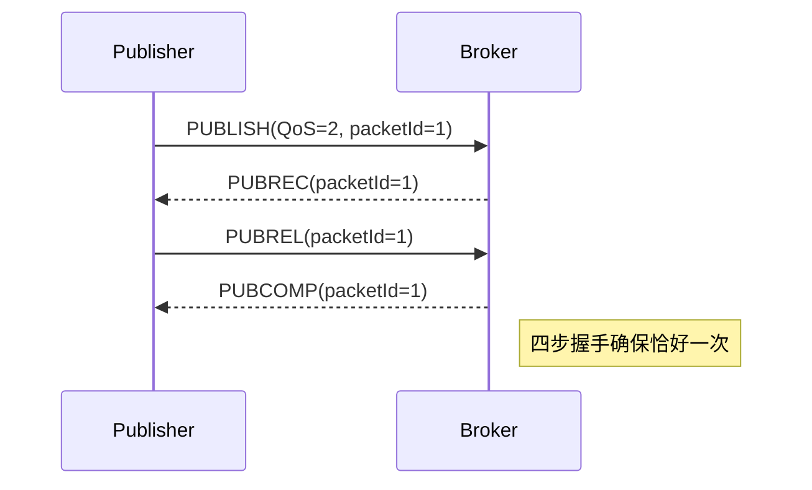
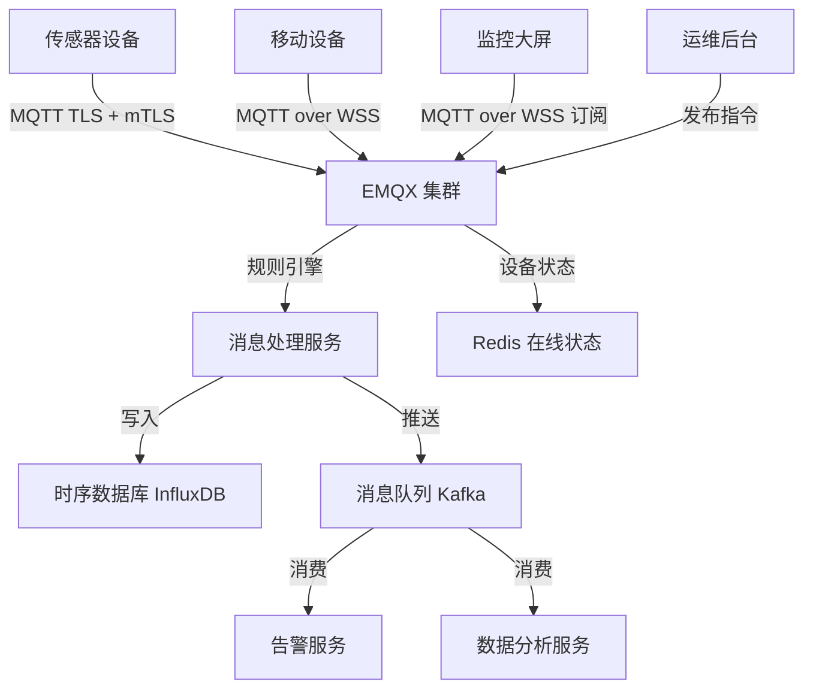

# MQTT 完整指南：从协议原理到生产实战

如果你接触过物联网、车联网、工业自动化，或者任何需要设备实时上报数据的场景，你一定遇到过 MQTT。

它轻量、低带宽消耗、支持不稳定网络，几乎是这类场景下的事实标准协议。

但很多人对 MQTT 的理解停留在"一个发布/订阅协议"，对于它真正解决什么问题、QoS 三个级别的本质区别、主题设计的正确姿势、生产环境下的安全与扩容，却知之甚少。

这篇文章的目标是：**从协议原理讲到工程实战，帮你建立完整的 MQTT 认知。**

---

## 一、为什么需要 MQTT？它解决了什么问题

在 IoT 场景里，常见的通信挑战是这样的：

- 设备端资源极其有限（几 KB 内存、低功耗芯片）
- 网络环境不稳定（2G/3G、信号弱、时断时续）
- 海量设备同时在线（百万级连接）
- 数据需要实时推送，不能轮询
- 部分场景要求消息绝对不丢

HTTP 协议在这里非常不合适：

- 请求/响应模型，服务端无法主动推送
- 每次请求都要携带大量 Header，带宽浪费
- 短连接模式在弱网环境下反复建连代价很高
- 没有内置的消息可靠性机制

WebSocket 解决了双向通信和长连接问题，但它面向 Web 浏览器设计，协议本身仍然偏重，并且没有内置的发布/订阅语义和 QoS 保证。

MQTT 在 1999 年由 IBM 设计，专门为这类场景定制：

- **极小的报文头**：最小只有 2 字节固定头
- **发布/订阅解耦**：设备只需关注主题，不关心谁在消费
- **三级 QoS 语义**：可以按需选择消息传递可靠性
- **长连接 + 心跳**：天然适应弱网环境
- **遗嘱消息**：设备异常下线时自动通知其他订阅者

---

## 二、核心模型：发布/订阅

理解 MQTT 的第一步，是理解发布/订阅（Pub/Sub）模型与传统请求/响应模型的本质区别。

### 1. 三角关系：Publisher、Broker、Subscriber

```
Publisher（设备/传感器）
    |
    | publish("sensors/temp", "36.5")
    v
  Broker（消息代理）
    |
    | 按主题分发
    v
Subscriber（后端服务/监控面板）
```

**Publisher（发布者）**：负责发送消息，只关心往哪个主题发，不关心谁在接收。

**Broker（代理）**：核心中间层，负责接收所有消息，按主题路由给订阅了该主题的客户端。所有客户端都只和 Broker 通信，彼此之间没有直接连接。

**Subscriber（订阅者）**：订阅感兴趣的主题，Broker 有匹配消息时会主动推送。

这种解耦方式有一个关键优势：**发布者和订阅者在时间和空间上完全解耦**。

- 发布者发消息时，订阅者不需要在线（结合 QoS 和持久会话可以离线补发）
- 订阅者接收消息时，不需要知道消息从哪台设备来

### 2. 和 HTTP 的根本区别



HTTP 是"拉"模型，客户端必须主动请求。MQTT 是"推"模型，一旦订阅，消息自动到达。

---

## 三、主题（Topic）：消息路由的核心

MQTT 的消息路由完全依赖主题，主题设计得好不好，直接影响系统的扩展性。

### 1. 主题的基本规则

主题是一个 **UTF-8 字符串**，用 `/` 分隔层级：

```
factory/line1/machine3/temperature
home/bedroom/sensor/humidity
vehicle/V001/gps/location
```

:::tip
主题区分大小写，`sensors/Temp` 和 `sensors/temp` 是两个不同的主题。
:::

### 2. 通配符

MQTT 支持两种通配符，**只能用于订阅，不能用于发布**：

#### `+`：单层通配符

匹配单个层级的任意字符：

```
sensors/+/temperature
# 可以匹配：
# sensors/room1/temperature
# sensors/room2/temperature
# 不能匹配：
# sensors/building1/room1/temperature（跨两层）
```

#### `#`：多层通配符

匹配当前层及其所有子层，**必须放在末尾**：

```
sensors/#
# 可以匹配：
# sensors/temp
# sensors/room1/humidity
# sensors/building1/floor3/device5/voltage
```

### 3. 系统主题 `$SYS`

Broker 通常会将自身运行状态发布到以 `$SYS` 开头的特殊主题，例如：

```
$SYS/broker/clients/connected    # 当前在线客户端数
$SYS/broker/messages/received    # 收到的消息总数
$SYS/broker/uptime               # 运行时长
```

`#` 通配符不会匹配 `$SYS` 主题，需要显式订阅。

### 4. 主题设计原则

好的主题结构应该是层级化的、从大到小的：

```
# 推荐格式（从粗到细）
{tenant}/{location}/{deviceType}/{deviceId}/{dataType}

# 示例
acme/shanghai/sensor/s-0042/temperature
acme/beijing/camera/c-0007/status
```

:::warning
避免以 `/` 开头的主题，如 `/sensors/temp`——它会产生一个空字符串的第一层，虽然合法但容易引发混淆。
:::

---

## 四、QoS：消息传递可靠性的核心机制

QoS（Quality of Service）是 MQTT 最重要的特性之一。**这里的 QoS 描述的是 Client 与 Broker 之间的消息传递保证级别**，不是端到端的。

### QoS 0：最多一次（At most once）



- 发出去就完了，没有任何确认
- 网络抖动会导致消息丢失
- **适用场景**：允许丢失的高频数据，如传感器每秒上报的实时读数

### QoS 1：至少一次（At least once）



- 发送方保存消息，直到收到 `PUBACK` 才删除
- 如果网络超时没收到 `PUBACK`，会重发（带 DUP 标志）
- **可能重复**：如果 PUBACK 在返回途中丢失，消息会被重发
- **适用场景**：需要确保送达但能容忍重复的场景，如告警上报

### QoS 2：恰好一次（Exactly once）



- 四步握手协议，确保消息**有且仅有一次**被处理
- 代价是四倍的报文交换
- **适用场景**：不能重复的关键指令，如设备开/关命令、支付指令

### QoS 对比总结

| QoS | 保证 | 报文开销 | 延迟 | 适用场景 |
|-----|------|----------|------|----------|
| 0 | 最多一次，可能丢失 | 最低 | 最低 | 高频实时数据，允许丢失 |
| 1 | 至少一次，可能重复 | 中 | 中 | 告警、事件上报 |
| 2 | 恰好一次 | 最高 | 最高 | 关键命令、账单操作 |

:::warning
**发布和订阅时的 QoS 是独立的**。消息最终被投递时的 QoS 取两者的**最小值**。例如发布方用 QoS 2，订阅方用 QoS 1，则 Broker 到订阅方这段用 QoS 1。
:::

---

## 五、连接与会话

### 1. CONNECT 报文的关键参数

客户端建立连接时，CONNECT 报文包含几个关键字段：

```
ClientId    必须唯一，同一个 ClientId 重连会踢掉旧连接
CleanSession  是否清除上一次会话（MQTT 3.1.1）
KeepAlive   心跳间隔（秒），0 表示禁用
Username / Password 认证凭据（可选）
Will Message  遗嘱消息（可选）
```

### 2. 持久会话（Persistent Session）

当 `CleanSession = false` 时，Broker 会为该 ClientId 保留：

- 订阅关系（无需重连后重新订阅）
- 未送达的 QoS 1/2 消息（离线期间的消息，重连后补发）

这对于偶发性在线的设备（如定期上报的传感器）非常关键。

```
CleanSession = true  → 连接断开后，会话数据全部清除
CleanSession = false → 连接断开后，Broker 保留会话状态，等待重连
```

:::tip
持久会话不是免费的。如果设备永久下线但 ClientId 还在，Broker 会一直保存它的会话和积压消息，浪费内存。生产环境需要有过期清理策略。
:::

### 3. KeepAlive 与心跳

MQTT 的心跳机制非常简洁：

- 客户端在 `KeepAlive` 间隔内没有发送任何报文，就发一个 `PINGREQ`
- Broker 收到后回 `PINGRESP`
- 如果 Broker 在 `1.5 × KeepAlive` 内没收到任何报文，认为客户端下线，断开连接

这个机制让 Broker 能快速感知设备离线，是遗嘱消息触发的前提。

---

## 六、保留消息（Retained Message）

保留消息解决了一个经典问题：**订阅者连接上来之前，错过的最后一条消息怎么办？**

当发布者设置 `RETAIN = true` 时，Broker 会把这条消息**按主题保存一份**：

```javascript
// 发布一条保留消息
client.publish('devices/sensor-001/status', 'online', { retain: true })
```

任何**之后**订阅该主题的客户端，会立即收到这条保存的消息。

**典型应用场景**：

- 设备状态（在线/离线），新订阅者立刻知道当前状态
- 配置信息推送，设备上线后立刻获取最新配置
- 系统公告，新接入的客户端立刻收到最新通知

每个主题只能有**一条**保留消息。发布新的保留消息会覆盖旧的；发布 payload 为空的保留消息会删除它。

---

## 七、遗嘱消息（Last Will and Testament, LWT）

遗嘱消息是 MQTT 的一个优雅设计：**设备在连接时预先告诉 Broker，如果我异常下线，请替我发这条消息。**

```javascript
const client = mqtt.connect('mqtt://broker.example.com', {
  will: {
    topic: 'devices/sensor-001/status',
    payload: 'offline',
    qos: 1,
    retain: true   // 通常配合保留消息使用
  }
})
```

**触发条件**（不正常断开时触发，正常断开不触发）：

- KeepAlive 超时
- 网络中断
- 客户端崩溃
- Broker 收到格式错误的报文

**正常断开**（客户端主动发 `DISCONNECT`）时，遗嘱消息**不会**被发送。

遗嘱消息和保留消息通常搭配使用，构成完整的设备在线状态追踪：

```
设备上线时发布：devices/xxx/status = "online"（retain=true）
遗嘱消息设置： devices/xxx/status = "offline"（retain=true）
```

这样任何时候订阅该主题，都能拿到设备的最新状态。

---

## 八、实战：Node.js 连接 MQTT Broker

### 1. 安装依赖

```bash
npm install mqtt
```

### 2. 基础连接与发布订阅

```javascript
import mqtt from 'mqtt'

const client = mqtt.connect('mqtt://broker.emqx.io:1883', {
  clientId: `node-client-${Math.random().toString(16).slice(2, 8)}`,
  clean: true,       // CleanSession
  keepalive: 60,
  reconnectPeriod: 2000,  // 断线后 2 秒重连
})

// 连接成功
client.on('connect', () => {
  console.log('已连接到 Broker')

  // 订阅主题（支持通配符）
  client.subscribe('sensors/#', { qos: 1 }, (err) => {
    if (!err) console.log('订阅成功')
  })

  // 发布消息
  client.publish(
    'sensors/room1/temperature',
    JSON.stringify({ value: 26.5, unit: '°C', ts: Date.now() }),
    { qos: 1, retain: false }
  )
})

// 收到消息
client.on('message', (topic, payload) => {
  console.log(`收到 [${topic}]:`, payload.toString())
})

// 错误处理
client.on('error', (err) => {
  console.error('MQTT 错误:', err.message)
})

// 断线通知
client.on('disconnect', () => {
  console.log('与 Broker 断开连接')
})

// 重连中
client.on('reconnect', () => {
  console.log('正在重连...')
})
```

### 3. 带遗嘱消息的完整连接

```javascript
import mqtt from 'mqtt'

const DEVICE_ID = 'sensor-0042'
const STATUS_TOPIC = `devices/${DEVICE_ID}/status`

const client = mqtt.connect('mqtt://broker.example.com:1883', {
  clientId: DEVICE_ID,
  clean: false,         // 持久会话，重连后恢复订阅和离线消息
  keepalive: 30,
  username: 'device_user',
  password: 'secret',
  // 遗嘱消息：异常下线时 Broker 自动发出
  will: {
    topic: STATUS_TOPIC,
    payload: JSON.stringify({ status: 'offline', ts: Date.now() }),
    qos: 1,
    retain: true,
  },
})

client.on('connect', () => {
  // 上线后主动发布在线状态（保留消息）
  client.publish(
    STATUS_TOPIC,
    JSON.stringify({ status: 'online', ts: Date.now() }),
    { qos: 1, retain: true }
  )

  // 订阅下行指令（服务端 → 设备）
  client.subscribe(`devices/${DEVICE_ID}/commands`, { qos: 2 })
})

client.on('message', (topic, payload) => {
  if (topic === `devices/${DEVICE_ID}/commands`) {
    const cmd = JSON.parse(payload.toString())
    handleCommand(cmd)
  }
})

function handleCommand(cmd) {
  console.log('收到指令:', cmd)
  // 执行指令后回包
  client.publish(
    `devices/${DEVICE_ID}/response`,
    JSON.stringify({ cmdId: cmd.id, result: 'ok', ts: Date.now() }),
    { qos: 1 }
  )
}
```

### 4. 服务端：接收所有设备上报

```javascript
import mqtt from 'mqtt'

// 服务端也是一个 MQTT 客户端，连接到 Broker 后订阅设备主题
const server = mqtt.connect('mqtt://broker.example.com:1883', {
  clientId: 'backend-service-main',
  clean: true,
  username: 'backend',
  password: 'backend-secret',
})

server.on('connect', () => {
  // 订阅所有设备上报
  server.subscribe('devices/+/telemetry', { qos: 1 })
  server.subscribe('devices/+/status', { qos: 1 })
  console.log('后端服务已连接，开始监听设备数据')
})

server.on('message', (topic, payload) => {
  // 从主题中提取设备 ID
  const parts = topic.split('/')
  const deviceId = parts[1]
  const dataType = parts[2]

  const data = JSON.parse(payload.toString())

  if (dataType === 'telemetry') {
    // 存储遥测数据到时序数据库
    saveTelemetry(deviceId, data)
  } else if (dataType === 'status') {
    // 更新设备在线状态
    updateDeviceStatus(deviceId, data.status)
  }
})

async function saveTelemetry(deviceId, data) {
  // 写入 InfluxDB / TimescaleDB 等时序数据库
  console.log(`设备 ${deviceId} 遥测数据:`, data)
}

async function updateDeviceStatus(deviceId, status) {
  console.log(`设备 ${deviceId} 状态变更为: ${status}`)
}
```

---

## 九、常用 Broker 对比

| Broker | 语言 | 特点 | 适用场景 |
|--------|------|------|----------|
| **Mosquitto** | C | 轻量、开源、单机 | 开发测试、小规模部署 |
| **EMQX** | Erlang | 高并发、集群、企业功能全 | 大规模 IoT 生产环境 |
| **HiveMQ** | Java | 企业级、插件生态 | 商业 IoT 平台 |
| **VerneMQ** | Erlang | 分布式集群 | 中大规模部署 |
| **Aedes** | Node.js | 可嵌入 Node.js 应用 | 小规模、快速集成 |

### 本地快速启动 Mosquitto（Docker）

```bash
docker run -d \
  --name mosquitto \
  -p 1883:1883 \
  -p 9001:9001 \
  eclipse-mosquitto
```

### 本地快速启动 EMQX（Docker）

```bash
docker run -d \
  --name emqx \
  -p 1883:1883 \
  -p 8083:8083 \  # WebSocket
  -p 18083:18083 \ # Dashboard
  emqx/emqx:latest
```

访问 `http://localhost:18083`，默认账号 `admin / public`，可以在 Dashboard 查看连接数、消息统计、客户端详情。

---

## 十、安全：生产环境不能裸奔

### 1. 传输加密：TLS/SSL

默认 MQTT 使用 1883 端口，明文传输，任何中间人都能抓包。

生产环境必须启用 TLS，使用 8883 端口（MQTT over TLS）：

```javascript
import fs from 'fs'
import mqtt from 'mqtt'

const client = mqtt.connect('mqtts://broker.example.com:8883', {
  // 单向 TLS（验证服务端证书）
  ca: fs.readFileSync('./certs/ca.crt'),

  // 双向 TLS（mTLS，服务端也验证客户端证书）
  cert: fs.readFileSync('./certs/client.crt'),
  key: fs.readFileSync('./certs/client.key'),

  rejectUnauthorized: true,   // 不跳过证书验证
})
```

:::warning
不要在生产环境设置 `rejectUnauthorized: false`，这等于禁用了证书校验，TLS 形同虚设。
:::

### 2. 认证：Username/Password

最基础的认证方式，确保只有合法客户端能连接：

```javascript
const client = mqtt.connect('mqtts://broker.example.com:8883', {
  username: process.env.MQTT_USERNAME,
  password: process.env.MQTT_PASSWORD,
})
```

更安全的做法是每台设备分配独立的 ClientId 和凭据，而不是所有设备共用一套。

### 3. 授权：ACL（访问控制列表）

认证解决"你是谁"，授权解决"你能做什么"。

以 EMQX 的 ACL 规则为例：

```
# 设备只能发布自己的主题，不能发布别的设备的
allow  client "sensor-0042"  publish  "devices/sensor-0042/#"
deny   client "sensor-0042"  publish  "devices/#"

# 后端服务可以订阅所有设备主题
allow  client "backend-service"  subscribe  "devices/#"
```

常见的安全边界划分：
- **设备**：只能发布自己的遥测数据，只能订阅自己的命令
- **后端服务**：可以订阅所有设备数据，可以向设备发布命令
- **管理后台**：可以发布系统主题，可以订阅所有主题

### 4. ClientId 安全

如果 ClientId 可以被随意伪造，攻击者可以用合法设备的 ClientId 连上来，把真实设备踢下线（同 ClientId 后连的会踢掉先连的）。

防御策略：
- ClientId 由服务端统一分配，不允许客户端自定义
- 或者在鉴权逻辑中校验 ClientId 和 Username 的绑定关系

---

## 十一、MQTT over WebSocket

在浏览器中无法直接使用 TCP，但可以通过 WebSocket 承载 MQTT 协议。

Broker 通常会同时开放两个端口：
- `1883`：原生 TCP
- `8083` / `9001`：WebSocket

```javascript
// 浏览器端，使用 WebSocket 连接
import mqtt from 'mqtt'

const client = mqtt.connect('ws://broker.example.com:8083/mqtt')
// 或者加密版本
const client = mqtt.connect('wss://broker.example.com:8084/mqtt')

client.on('connect', () => {
  client.subscribe('dashboard/updates')
})

client.on('message', (topic, payload) => {
  updateDashboard(JSON.parse(payload.toString()))
})
```

这在 IoT 监控大屏、设备管理后台等场景下非常常用——浏览器直接订阅设备数据，实时刷新界面。

---

## 十二、集群与扩容

### 1. 单机 Broker 的瓶颈

单台 Mosquitto 在几万连接下就会遇到瓶颈，真正的 IoT 系统动辄百万设备，必须考虑水平扩展。

### 2. EMQX 集群架构

EMQX 天然支持集群，各节点之间通过 Erlang 分布式通信同步路由表：

```text
设备 ──────> EMQX Node 1 ─┐
                           ├──> 共享路由表（跨节点同步）
设备 ──────> EMQX Node 2 ─┤
                           └──> 后端服务（订阅任意节点均可收到消息）
设备 ──────> EMQX Node 3 ─┘
```

消息路由流程：
1. 设备 A 连接 Node 1，发布消息
2. Node 1 查路由表，发现订阅者在 Node 3
3. Node 1 通过集群内部通道转发给 Node 3
4. Node 3 推送给订阅者

### 3. 共享订阅（Shared Subscription）

共享订阅是 MQTT 5.0 引入（部分 Broker 在 3.x 也支持）的负载均衡机制。

普通订阅：所有订阅者都会收到消息（广播）。

共享订阅：消息在订阅者之间**轮流分发**，每条消息只投递给组内一个订阅者（负载均衡）：

```javascript
// 普通订阅（所有消费者都收到）
client.subscribe('sensors/#')

// 共享订阅（同组内轮流收到，格式：$share/{groupName}/{topicFilter}）
client.subscribe('$share/data-processors/sensors/#')
```

**典型应用**：后端部署多个消费实例，每条传感器数据只被处理一次，避免重复入库。

---

## 十三、MQTT 5.0 关键新特性

MQTT 5.0（2019 年正式发布）在 3.1.1 的基础上增加了大量工程实用特性：

### 1. 原因码（Reason Code）

3.1.1 中很多操作的失败只有一个模糊的返回码，5.0 提供了细化的原因码：

```
CONNACK 0x87 = Not authorized（认证失败）
CONNACK 0x88 = Bad User Name or Password（用户名密码错误）
CONNACK 0x8D = Keep Alive timeout（心跳超时）
PUBACK  0x97 = Quota exceeded（配额超限）
```

调试和排查问题时不再是盲猜。

### 2. 用户属性（User Properties）

可以在任何 MQTT 报文中附加自定义键值对：

```javascript
client.publish('sensors/temp', '36.5', {
  properties: {
    userProperties: {
      deviceModel: 'SHT30',
      firmwareVersion: '1.2.3',
      region: 'cn-east',
    }
  }
})
```

这让 MQTT 消息能携带上下文元信息，无需把所有元数据都塞进 payload。

### 3. 消息过期时间（Message Expiry Interval）

```javascript
client.publish('alerts/fire', 'FIRE_ALARM', {
  qos: 1,
  retain: false,
  properties: {
    messageExpiryInterval: 30  // 30 秒内未送达则丢弃
  }
})
```

对于有时效性的告警，过期后不再投递，避免消费者处理"过时的紧急告警"。

### 4. 请求/响应模式（Request/Response）

5.0 内置了请求/响应模式，通过 `ResponseTopic` 和 `CorrelationData` 属性：

```javascript
// 发送方
const correlationData = Buffer.from(crypto.randomUUID())
client.publish('devices/sensor-001/commands', JSON.stringify({ cmd: 'reboot' }), {
  properties: {
    responseTopic: 'backend/responses/reboot',
    correlationData,
  }
})

// 接收方（设备）收到命令后，回复到 responseTopic
client.on('message', (topic, payload, packet) => {
  if (topic === 'devices/sensor-001/commands') {
    // 执行命令...
    client.publish(
      packet.properties.responseTopic,
      JSON.stringify({ result: 'ok' }),
      {
        properties: {
          correlationData: packet.properties.correlationData
        }
      }
    )
  }
})
```

### 5. 会话过期时间（Session Expiry Interval）

3.1.1 的持久会话要么永久保留要么立即清除，5.0 可以精确控制：

```javascript
const client = mqtt.connect('mqtt://broker.example.com', {
  properties: {
    sessionExpiryInterval: 3600  // 会话保留 1 小时，超过则清除
  }
})
```

### 6. 主题别名（Topic Alias）

高频发布时，主题字符串每次都要传输，浪费带宽。5.0 允许用一个整数来代替主题字符串：

```javascript
// 第一次发布时建立别名
client.publish('sensors/building-a/floor-3/room-306/temperature', '25.3', {
  properties: { topicAlias: 1 }
})

// 后续发布时使用别名（主题字段留空）
client.publish('', '25.8', {
  properties: { topicAlias: 1 }
})
```

对于主题名很长、消息很短且频率很高的场景，这能显著降低带宽占用。

---

## 十四、常见问题与注意事项

### 1. 消息风暴：设备大批量上线

海量设备在同一时刻重启（如停电恢复后），会瞬间发起大量 CONNECT 请求，可能压垮 Broker。

防御措施：
- 客户端实现随机退避重连（Jitter），避免同时重连
- Broker 侧做连接速率限制（Rate Limiting）
- 使用持久会话减少重连后的重订阅开销

```javascript
// 指数退避重连（mqtt.js 支持配置）
const client = mqtt.connect('mqtt://broker.example.com', {
  reconnectPeriod: 1000,         // 初始重连间隔 1 秒
  // mqtt.js 会自动退避，也可自定义策略
})
```

### 2. ClientId 冲突导致反复踢线

症状：设备连上后立刻断开，循环往复。

原因：两台设备使用了相同的 ClientId，互相踢对方下线。

排查方式：
- 检查 Broker 日志，看是否有 "Existing client disconnected" 日志
- 确保 ClientId 生成逻辑真正唯一（建议用设备序列号或 UUID）

### 3. 持久会话消息积压

离线的设备有持久会话，在线期间积压了大量 QoS 1/2 消息。设备重连后，Broker 瞬间推送大量积压消息，设备来不及处理。

解决方式：
- 为持久会话设置消息积压上限（EMQX 支持 `max_mqueue_len` 配置）
- 对时效性数据发布时使用消息过期时间（MQTT 5.0）
- 针对不重要的历史数据，考虑用 QoS 0 发布，不积压

### 4. 保留消息没有及时清理

传感器从场地移除了，但对应主题的保留消息还在，后续订阅的客户端仍会收到过时数据。

清理方式：向该主题发布一条 payload 为空的保留消息：

```javascript
client.publish('sensors/removed-device/status', '', { retain: true })
```

### 5. QoS 选择不当

- 所有消息都用 QoS 2：四步握手大量消耗 Broker 资源，在 IoT 场景下通常是过度设计
- 所有消息都用 QoS 0：一旦网络抖动，关键告警丢失，排查问题时无从追溯

**建议原则**：
- 实时遥测数据（温度、位置等）→ QoS 0 或 1
- 状态变更通知、告警 → QoS 1
- 关键控制指令、不可重复的操作 → QoS 2

---

## 十五、完整架构：一个典型的 IoT 数据流

把前面所有知识串起来，一个典型的 IoT 数据接入架构大致如下：



**数据上行链路**（设备 → 平台）：
1. 设备通过 mTLS 连接 EMQX，使用持久会话
2. 遥测数据发布到 `devices/{deviceId}/telemetry`（QoS 1）
3. EMQX 规则引擎将消息分发到 Kafka
4. 消费者入库时序数据库，触发告警逻辑

**数据下行链路**（平台 → 设备）：
1. 后台服务发布命令到 `devices/{deviceId}/commands`（QoS 2）
2. EMQX 投递给设备（持久会话确保离线设备重连后也能收到）
3. 设备执行命令后通过 `devices/{deviceId}/response` 回包

**设备状态追踪**：
1. 设备连接时发布在线保留消息
2. 遗嘱消息在异常下线时自动发布离线状态
3. Redis 缓存最新状态，供 API 查询

---

## 十六、总结

MQTT 看起来简单，但真正用好它需要理解几个核心设计：

1. **Pub/Sub 解耦**：发布者和订阅者通过 Broker 完全解耦，这是 IoT 场景下扩展性的基础。

2. **QoS 是一个权衡**：没有免费的可靠性，QoS 越高，握手越多，延迟越大，资源消耗越高。根据业务场景选合适的级别，而不是一律用最高。

3. **保留消息 + 遗嘱消息 = 状态同步基础设施**：这两个机制组合在一起，解决了设备状态感知的核心问题，是 MQTT 比其他协议更适合 IoT 的关键原因之一。

4. **持久会话是双刃剑**：它让离线设备重连后能补收消息，但也带来了积压和清理的问题，需要配套的超时和限流机制。

5. **安全是基础**：生产环境必须 TLS + 认证 + ACL，三者缺一不可。

6. **MQTT 5.0 值得迁移**：原因码、用户属性、消息过期、共享订阅等特性大幅提升了工程实用性，新项目直接上 5.0。

MQTT 的设计哲学是：**在资源受限、网络不可靠的环境下，用最小的开销做最稳定的消息传递**。理解了这一点，你就理解了 MQTT 为什么是 IoT 协议的首选。
