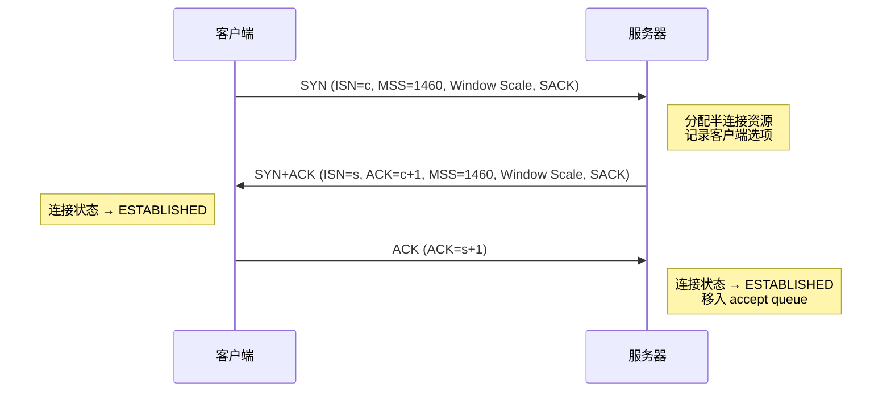
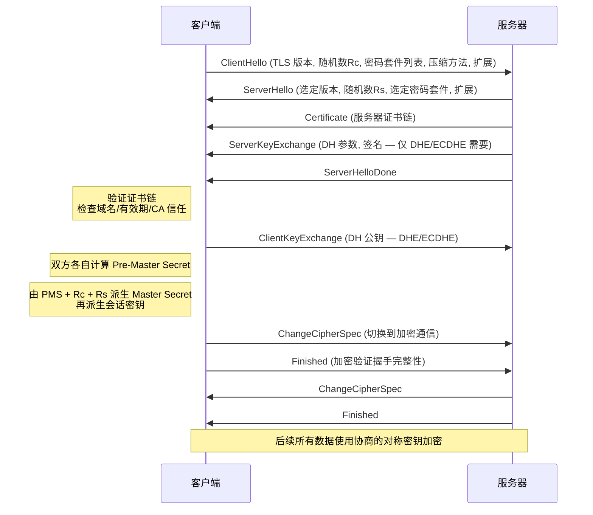
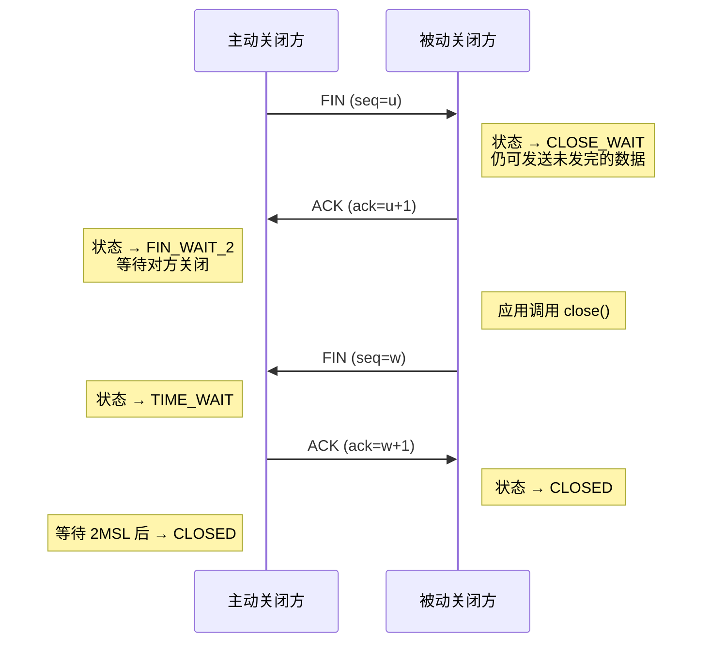
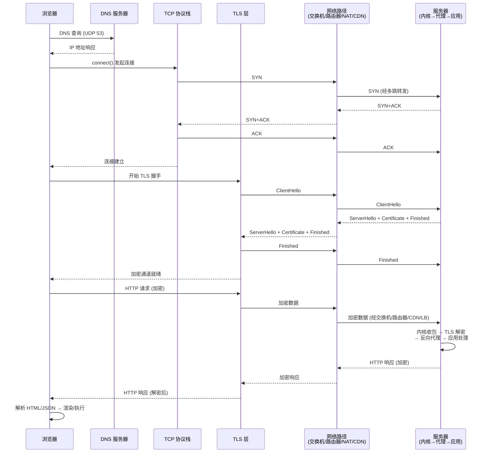

当你在浏览器里输入一个 URL 并回车，或者 App 里点了一下"刷新"，你看到的是"请求发出 → 页面/数据回来"。
但在底层，这是一条跨越硬件与软件、跨越多台设备与多个网络的流水线：从应用进程构造 HTTP 报文，到操作系统协议栈封装成 TCP/IP 包，再到网卡把比特流送进链路，经交换机/路由器一跳跳转发，最终到服务器网卡、内核、反向代理与业务程序，再把响应沿原路送回。

这篇文章按"从客户端出发 → 穿过网络 → 到达服务器 → 再返回"的顺序，把关键步骤讲清楚，并在每一段标出对应的硬件与软件。

---

## 0. 先给你一个总览（10 秒心智模型）

一次典型的 HTTPS 请求（浏览器访问网站）可以粗略拆成这些阶段：

1. 应用层：浏览器/客户端代码决定要访问哪个 URL，准备请求头、Cookie、请求体
2. 解析：把域名解析成 IP（DNS）
3. 建连：与目标 IP 建立传输连接（TCP 三次握手 / 或 QUIC）
4. 加密：协商加密参数并建立安全通道（TLS 握手）
5. 传输：请求被分段、封装、发送，沿路由转发到服务器
6. 处理：服务器内核接收连接 → Web 服务器/反向代理 → 应用程序 → 可能访问缓存/数据库
7. 返回：响应沿网络返回，浏览器解析并渲染页面/交给 JS

对应到分层协议就是：

- 应用层：HTTP、DNS
- 传输层：TCP/UDP/QUIC
- 网络层：IP（路由）
- 链路层：以太网/Wi‑Fi（同一段链路内传输）
- 物理层：电/光/无线电波（真正传比特）

---

## 1. 客户端：从"我要请求一个 URL"开始

### 1.1 浏览器/应用进程做了什么（软件）

以浏览器为例，用户触发请求后，会经历这些软件步骤：

- URL 解析：确定协议（`http/https`）、主机名（域名）、端口（默认 80/443）、路径、查询参数
- 缓存判断：是否命中内存缓存/磁盘缓存；是否需要带上 `If-None-Match`/`If-Modified-Since`
- 安全与策略：同源策略、CORS、Cookie/SameSite、HSTS、Mixed Content 等
- 组装请求：方法（GET/POST…）、请求行、请求头（Host、User-Agent、Accept…）、请求体（JSON/表单/文件）

#### 浏览器缓存机制：强缓存与协商缓存

浏览器缓存检查分为两层：

**强缓存**——不需要向服务器发请求，直接使用本地副本：

- `Cache-Control`（HTTP/1.1，优先级更高）：`max-age=3600` 表示资源在 3600 秒内可直接使用；`no-cache` 跳过强缓存但允许协商缓存；`no-store` 完全不缓存
- `Expires`（HTTP/1.0，绝对时间点）：受客户端时钟影响，已被 `Cache-Control` 取代但仍作降级

强缓存命中时返回 `200 (from disk cache)` 或 `200 (from memory cache)`，不会产生任何网络请求。

**协商缓存**——需要向服务器发一个验证请求，由服务器决定是否继续使用缓存：

- `ETag`/`If-None-Match`：服务器在响应中返回 `ETag: "abc123"`，下次请求带上 `If-None-Match: "abc123"`，服务器比较 ETag 不变则返回 `304 Not Modified`（无响应体）
- `Last-Modified`/`If-Modified-Since`：基于文件修改时间验证，精度为秒级，不如 ETag 精确

协商缓存命中时服务器返回 `304`，浏览器直接使用本地缓存副本，节省了响应体的传输。

#### 连接复用与连接池

浏览器不会每次请求都新建 TCP 连接。Chromium 内核维护了一个**连接池**（connection pool），对同一 origin（协议 + 域名 + 端口）的连接可以复用：

- HTTP/1.1 默认启用 `Connection: keep-alive`，一个 TCP 连接可以串行发送多个请求（受浏览器并发限制，Chrome 对同一域名最多 6 个并发连接）
- 连接池中已建立的空闲连接可以被新请求直接复用，跳过 DNS → TCP → TLS 的完整建连过程
- 空闲连接有超时时间（服务器通常设 60s 左右），超时后服务器主动关闭

如果连接池中已有可用连接，浏览器会优先复用而非新建，这也是为什么"第二个请求通常比第一个快很多"的重要原因。

#### Chromium 多进程架构中的网络请求

Chrome 的网络请求涉及多个进程协作：

- **Renderer 进程**：运行页面 JS、调用 `fetch()`/`XHR` 等 Web API，将请求需求通过 IPC 发给 Browser 进程
- **Browser 进程**：拥有网络栈，负责实际的 DNS 查询、TCP 连接、TLS 握手、HTTP 请求发送
- **Network Service 进程**（Chrome 73+）：网络功能独立为单独进程，所有 Renderer 进程的网络请求都通过它统一处理，避免 Renderer 崩溃影响网络功能

这种多进程设计意味着：当 JS 调用 `fetch()` 时，请求实际上要跨进程传递——Renderer 进程通过 Mojo IPC 将请求参数发给 Network Service，后者调用操作系统 socket API 完成真正的网络 I/O。

如果是 JavaScript 的 `fetch()` 或 XHR，本质上是"浏览器网络栈 API → 浏览器进程/网络进程 → 调用操作系统 socket"。

### 1.2 把"域名"变成"IP"（软件 + 一点网络设备）

域名不能直接用来转发，网络里真正做路由的是 IP。DNS 解析大致是：

1. 浏览器/系统先查缓存：浏览器 DNS 缓存、系统缓存、hosts
2. 没命中就问递归 DNS（通常是路由器/运营商/公共 DNS，比如 114、8.8.8.8）
3. 递归 DNS 代表你去"层层问"：根域 → 顶级域（.com）→ 权威 DNS，拿到 A/AAAA 记录
4. 得到目标 IP（可能是 CDN 边缘节点 IP，而不是源站）

DNS 使用 UDP 很常见（53 端口），遇到大响应或特殊情况会退回 TCP。

硬件上，这一步已经会发生真实的数据包收发：你的设备通过网卡把 DNS 查询发出去，路由器/交换机/运营商设备把它转发到 DNS 服务器。

#### DNS 报文格式

DNS 查询和响应使用统一的报文格式，主要包含以下部分：

- **Header**：16 字节，包含事务 ID、标志位（QR 区分查询/响应、Opcode、RD/RA 等）、以及各 section 的记录数量
- **Question Section**：查询的问题，包含域名（以长度前缀 + 内容的标签格式编码，如 `\x03www\x07example\x03com\x00`）、查询类型（A/AAAA/CNAME/MX 等）、查询类（通常为 IN）
- **Answer Section**：响应中返回的资源记录，每条记录包含域名、类型、类、TTL（缓存时间）、数据长度、数据（如 A 记录的 4 字节 IP 地址）
- **Authority Section**：权威名称服务器信息
- **Additional Section**：附加信息（如 Glue Record——附带权威 DNS 的 IP 地址，避免再次查询）

一个典型的 A 记录查询：Question 里是 `www.example.com IN A`，Answer 里返回 `www.example.com 300 IN A 93.184.216.34`，TTL 300 秒表示递归 DNS 可以缓存 5 分钟。

#### DNS 递归查询与迭代查询

DNS 解析过程中涉及两种查询方式，理解它们的区别很重要：

**递归查询（Recursive）**：客户端向本地递归 DNS 服务器发出的查询。客户端问"给我 www.example.com 的 IP"，递归 DNS 负责一路追查到底，最终返回最终答案给客户端。客户端只需要等一个结果。

**迭代查询（Iterative）**：递归 DNS 服务器向各级 DNS 服务器发出的查询。递归 DNS 先问根域服务器，根域不直接给最终答案，而是告诉"你去问 .com 顶级域服务器"；递归 DNS 再问 .com 服务器，.com 再指向 example.com 权威 DNS；如此逐级迭代，直到拿到最终记录。

整个流程是：客户端 →（递归查询）→ 递归 DNS →（迭代查询）→ 根域 → .com TLD → 权威 DNS。客户端只发一次请求，递归 DNS 做了多次迭代。

#### CNAME 记录与 CDN

CNAME（Canonical Name）记录将一个域名别名指向另一个域名，是 CDN 工作的基础：

1. 网站配置 `www.example.com CNAME www.example.com.cdncloud.com`
2. DNS 解析到 CNAME 后，继续解析 CNAME 指向的域名
3. CDN 的权威 DNS 根据**请求来源 IP 的地理位置**（或 Anycast 路由），返回离用户最近的边缘节点 IP
4. 浏览器最终拿到 CDN 节点 IP 而非源站 IP

这也是为什么 CDN 可以"就近响应"——DNS 层面就已经把用户导向了最近的节点。

#### DNS 预解析

浏览器会在多个时机提前做 DNS 查询，避免真正请求时被 DNS 延迟阻塞：

- **浏览器自动预解析**：Chrome 会扫描页面中的链接（`<a href>`），对未访问过的域名提前做 DNS 解析
- **`dns-prefetch` 提示**：开发者可以在 HTML 中显式指定 `<link rel="dns-prefetch" href="//cdn.example.com">`，浏览器会在空闲时提前解析该域名
- **预解析时机**：通常在 HTML 解析阶段、页面空闲时进行，不会阻塞页面渲染

---

## 2. 客户端操作系统：从 socket 到"一个个包"

### 2.1 socket：应用与内核网络栈的分界线（软件）

应用程序不会自己"发包"，它调用操作系统提供的 socket 接口：

- 创建 socket：选择 TCP 还是 UDP（HTTPS 基本是 TCP；HTTP/3 是 QUIC/UDP）
- `connect()`：向目标 `IP:port` 发起连接（目标端口通常是 443）
- 选择源端口：系统分配一个临时端口（ephemeral port）
- 路由决策：根据路由表决定下一跳（通常是默认网关，也就是家用路由器）

#### socket 的内核数据结构

在 Linux 内核中，每个 socket 对应一个 `struct socket` 和 `struct sock` 结构体，其中包含：

- **发送缓冲区（send buffer）**：应用写入的数据暂存于此，等待 TCP 发送并收到 ACK 后才清除。大小由 `sk_sndbuf` 控制，默认约 16KB，可通过 `SO_SNDBUF` 调整
- **接收缓冲区（receive buffer）**：TCP 重组后的有序字节流暂存于此，等待应用 `read()`/`recv()` 读取。大小由 `sk_rcvbuf` 控制，默认约 87380 字节
- **状态与元数据**：socket 状态（SS_CONNECTED 等）、五元组（源/目的 IP、源/目的端口、协议）、TCP 状态机当前状态、拥塞控制参数等

当应用调用 `send()` 时，数据从用户空间拷贝到发送缓冲区，TCP 协议栈异步地将数据分段发出；当网卡收到 ACK 后，已确认的数据才从缓冲区移除。如果发送缓冲区满了，`send()` 会阻塞（或返回 EAGAIN）。

#### `connect()` 如何变成一个 SYN 包

当应用调用 `connect(fd, sockaddr, len)` 时，内核执行一系列操作：

1. 内核分配临时端口，将 socket 状态设为 `TCP_SYN_SENT`
2. 构造 TCP SYN 报文段：设置 SYN 标志位，生成初始序列号（ISN），携带 MSS（最大段大小）等 TCP 选项
3. 将 SYN 报文段交给 IP 层，IP 层封装为 IP 包，查路由表确定出口设备和下一跳
4. 通过 ARP 解析下一跳的 MAC 地址，最终由网卡驱动将帧发送出去
5. 启动重传定时器，如果超时未收到 SYN+ACK 则重发 SYN

`connect()` 调用本身会阻塞（默认模式），直到收到 SYN+ACK 并发出 ACK（三次握手完成）后才返回。

#### 临时端口与端口耗尽

客户端每次新建连接都需要一个临时端口（ephemeral port），范围由 `/proc/sys/net/ipv4/ip_local_port_range` 控制，默认 `32768-60999`（约 28000 个端口）。

端口耗尽的场景：一台客户端对同一目标 IP:端口 的并发连接数受限于临时端口数量。每个 TCP 连接由五元组唯一标识，因此对**不同**目标 IP 可以复用同一本地端口。但如果做大量对同一目标的短连接（如压测），就可能耗尽临时端口。

此时 `connect()` 返回 `EADDRNOTAVAIL`，解决方法包括：增大端口范围、启用 `tcp_tw_reuse`（复用 TIME_WAIT 端口）、使用长连接/连接池减少短连接。

### 2.2 TCP 三次握手：先把"可靠通道"搭起来（软件）

如果是 HTTPS over TCP，会先做三次握手：

1. 客户端 → 服务器：`SYN`
2. 服务器 → 客户端：`SYN+ACK`
3. 客户端 → 服务器：`ACK`

握手建立后，TCP 才开始可靠传输：序列号、确认 ACK、超时重传、拥塞控制（例如 CUBIC/BBR）等都在这里发生。

#### SYN/SYN+ACK/ACK 里面有什么

三次握手的每个报文段都携带了关键信息：

**第一次：SYN**
- 标志位：SYN=1，ACK=0
- 序列号：客户端初始序列号（ISN，随机生成，约 32 位，防止预测攻击）
- TCP 选项：
  - `MSS`（Maximum Segment Size）：通告本端能接受的最大 TCP 段大小，通常为 MTU-40（如以太网 MSS=1460）
  - `Window Scale`：窗口缩放因子，扩大滑动窗口的表示范围（原始 16 位窗口最大 64KB，缩放后可达 1GB）
  - `SACK Permitted`：声明支持选择性确认（SACK），丢包时只需重传丢失的段而非整个窗口

**第二次：SYN+ACK**
- 标志位：SYN=1，ACK=1
- 序列号：服务器 ISN
- 确认号：客户端 ISN + 1
- TCP 选项：服务器端的 MSS、Window Scale、SACK Permitted

**第三次：ACK**
- 标志位：ACK=1
- 序列号：客户端 ISN + 1
- 确认号：服务器 ISN + 1
- 可以携带应用数据（TCP Fast Open 场景下 SYN 就可以带数据）

#### 为什么是三次而不是两次

三次握手的核心目的是**防止历史重复 SYN 引起的错误连接**：

假设只有两次握手：客户端发出一个 SYN，因网络延迟长时间未到达服务器。客户端超时后重发新 SYN，完成连接、传输数据、关闭连接。此时那个"迟到的旧 SYN"终于到达服务器，服务器回复 SYN+ACK 就认为连接建立了——但客户端早已不想要这个连接。如果只有两次握手，服务器已经分配了资源，却没有对端确认。

三次握手要求客户端必须对服务器的 SYN+ACK 回复 ACK，这样服务器在收到第三次 ACK 后才真正建立连接。如果是旧 SYN 触发的 SYN+ACK，客户端会发现序列号不匹配，回复 RST 而非 ACK，服务器就不会误建连接。

#### SYN Flood 攻击与 SYN Cookie 防御

SYN Flood 是一种经典的 DoS 攻击：攻击者大量发送伪造源 IP 的 SYN 包，服务器对每个 SYN 都分配资源（SYN backlog 中的半连接）并回复 SYN+ACK。由于源 IP 是伪造的，SYN+ACK 不会收到 ACK，半连接一直占用资源直到超时。当半连接队列被打满，正常的 SYN 也无法处理。

**SYN Cookie** 是一种无状态防御方案：服务器不在 SYN backlog 中保存半连接状态，而是将状态信息编码到 SYN+ACK 的初始序列号中（ISN = hash(源/目的 IP + 端口 + 时间戳 + MSS)）。当收到第三次 ACK 时，服务器从确认号反算出是否为合法连接，如果是则直接建立全连接。这样 SYN backlog 不会被消耗，攻击无效。

Linux 可通过 `tcp_syncookies` 启用（默认 1，即在 SYN backlog 满时自动启用）。



### 2.3 TLS 握手：再把"加密通道"套上去（软件）

TCP 建好以后，HTTPS 会进行 TLS 握手：

- 协商协议版本与密码套件
- 服务器出示证书链，客户端验证（域名匹配、CA 信任、有效期、吊销状态等）
- 通过密钥交换生成会话密钥，后续 HTTP 数据用对称加密传输

这一步属于"软件密集型"工作：在客户端是浏览器/系统加密库；在服务器端可能是 Nginx/Envoy/应用框架或专用 TLS 终止设备。

#### TLS 1.2 完整握手流程

TLS 1.2 的完整握手需要 **2 个 RTT**（额外延迟），步骤如下：



关键步骤说明：

- **ClientHello**：客户端发送支持的 TLS 版本（如 1.2）、随机数 `Rc`、支持的密码套件列表（如 `TLS_ECDHE_RSA_WITH_AES_128_GCM_SHA256`）和各种扩展（SNI、ALPN 等）
- **ServerHello**：服务器选定一个密码套件，返回自己的随机数 `Rs`
- **Certificate**：服务器发送证书链（服务器证书 → 中间 CA 证书 → 可能还有根 CA），客户端逐级验证签名
- **ServerKeyExchange**：使用 DHE/ECDHE 时，服务器发送 Diffie-Hellman 参数和签名（用服务器私钥对参数签名，客户端用证书中的公钥验证，证明参数来自服务器）
- **ClientKeyExchange**：客户端发送自己的 DH 公钥，双方各自计算出 Pre-Master Secret
- **密钥派生**：由 Pre-Master Secret + 两个随机数，通过 PRF 函数派生 Master Secret，再派生出对称加密密钥、MAC 密钥、IV 等

#### TLS 1.3 的改进

TLS 1.3（RFC 8446）对握手做了重大简化：

- **1-RTT 握手**：ClientHello 直接携带密钥共享参数（Key Share），服务器在 ServerHello 中选定参数并返回加密的证书和 Finished，握手只需 1 个 RTT
- **0-RTT 恢复**：如果客户端保存了之前的会话信息（PSK），可以在第一个飞行中就携带应用数据，实现 0-RTT。但 0-RTT 数据没有前向安全性，且可能受重放攻击，仅适用于幂等请求
- **移除不安全算法**：删除了 RSA 静态密钥交换、CBC 模式、RC4、SHA-1、MD5 等，只保留 AEAD 加密（AES-GCM、ChaCha20-Poly1305）和 ECDHE 密钥交换
- **握手加密**：ServerHello 之后的所有握手消息都是加密的（包括证书），窃听者无法看到证书内容

#### 证书链与验证

TLS 证书验证的核心是**证书链（Certificate Chain）**：

```
根 CA 证书 (Root CA, 自签名, 预装在浏览器/操作系统中)
  └─ 中间 CA 证书 (Intermediate CA, 由根 CA 签发)
       └─ 服务器证书 (End-entity, 由中间 CA 签发, 包含域名和公钥)
```

验证过程：

1. 浏览器收到服务器证书，检查域名是否匹配（CN 或 SAN 扩展中的域名）
2. 找到签发该证书的 CA 证书（中间 CA），用 CA 的公钥验证签名
3. 递归验证中间 CA 证书，直到到达根 CA
4. 根 CA 的公钥预装在浏览器/操作系统的信任库中，如果根 CA 在信任库中，整条链就是可信的
5. 检查证书有效期（Not Before / Not After）和吊销状态（CRL 或 OCSP）

如果任何一级验证失败（签名不匹配、过期、域名不符、被吊销），浏览器会显示证书错误。

#### 会话恢复

完整的 TLS 握手开销大（CPU + RTT），因此 TLS 提供了会话恢复机制：

- **Session ID**：服务器在握手时分配一个 Session ID，客户端下次连接时在 ClientHello 中带上该 ID，服务器如果在缓存中找到对应会话状态，就可以跳过完整握手，直接用之前的密钥（1-RTT 恢复）。缺点是服务器需要保存会话状态，集群环境下需要共享。
- **Session Ticket**：服务器将会话状态加密后作为 Ticket 发给客户端，客户端下次连接时带回 Ticket。服务器无需保存状态（无状态），只需用密钥解密 Ticket 即可恢复。更适合大规模部署。TLS 1.3 中 PSK 模式本质上就是 Ticket 机制。

---

## 3. 客户端硬件：网卡如何把数据送进网络

### 3.1 从"字节"到"电/光/无线"（硬件 + 驱动）

当内核决定发送一个 IP 包，真正把它发出去依赖这些硬件：

- 网卡（NIC）：以太网卡或 Wi‑Fi 网卡
- 物理介质：网线（铜缆）、光纤、或无线电波（Wi‑Fi/蜂窝）

典型过程：

1. 内核把要发送的数据放进发送队列（ring buffer）
2. 网卡通过 DMA 直接从内存读数据，减少 CPU 拷贝
3. 网卡按链路层协议封装帧（以太网帧 / 802.11 帧），加上目的 MAC、源 MAC、FCS
4. 通过 PHY 芯片把比特编码为电信号/光信号/无线信号发射出去

现代网卡还会做很多"硬件卸载"：

- 校验和卸载（checksum offload）
- 分段卸载（TSO/GSO）与合并接收（GRO）
- 多队列与中断合并（减少 CPU 中断压力）

#### Ring Buffer 与 DMA 描述符

网卡的 Ring Buffer 是一个**环形队列**，由一组 DMA 描述符（descriptor）组成，每个描述符指向内存中的一个缓冲区：

- **发送方向**：内核将待发送数据写入内存缓冲区，在发送 Ring Buffer 的描述符中填入缓冲区地址和长度，然后"通知"网卡（写寄存器触发）。网卡通过 DMA 直接从内存读取数据并发送，完成后更新描述符状态位，内核回收该描述符
- **接收方向**：内核预先在接收 Ring Buffer 的描述符中填入空闲缓冲区地址。网卡收到帧后，通过 DMA 将帧数据写入描述符指向的缓冲区，更新描述符长度和状态位，然后触发中断通知内核

Ring Buffer 的大小有限（如 512 或 4096 个描述符），如果内核来不及处理（发送方向来不及填新数据、接收方向来不及取走已收数据），Ring Buffer 就会溢出导致丢包。这是高性能网络调优中常见的问题。

#### 中断与 NAPI 轮询

网卡收到数据包后通知内核有两种模式：

**传统中断模式**：每个数据包到达都触发一次硬件中断，内核在中断处理程序中把数据包从 Ring Buffer 取走。问题：高吞吐场景下（如万兆网卡），每秒可能收到数百万包，中断风暴会导致 CPU 全部时间花在中断处理上，正常业务无法运行。

**NAPI（New API）轮询机制**：Linux 内核的解决方案，结合了中断和轮询：
1. 第一个包到达时触发中断，内核在中断处理中将该网卡加入轮询列表，并**禁用该网卡的中断**
2. 内核在软中断（softirq）上下文中批量轮询该网卡的 Ring Buffer，一次处理多个包
3. 轮询达到预算（budget，如 64 个包）或 Ring Buffer 为空时停止，重新启用中断
4. 下一个包到达时再重复上述流程

NAPI 在低流量时响应快（中断唤醒），高流量时效率高（批量轮询避免中断风暴），是现代高性能网卡驱动的标准模式。

#### MTU 与路径 MTU 发现

**MTU（Maximum Transmission Unit）** 是链路层一次能传输的最大帧大小（不含以太网帧头尾），以太网默认 1500 字节。如果 IP 包超过 MTU，需要分片（fragmentation），但分片影响性能且增加丢包风险。

**路径 MTU 发现（PMTUD）** 的工作方式：
1. 发送端将 IP 包的 DF（Don't Fragment）标志置 1，禁止中间路由分片
2. 如果某个路由器的出接口 MTU 小于包大小，丢弃该包并返回 ICMP "Fragmentation Needed" 消息（包含下一跳 MTU）
3. 发送端收到 ICMP 后减小包大小重发
4. 重复直到找到整条路径的最小 MTU

问题：某些网络会丢弃 ICMP 消息（防火墙策略），导致 PMTUD 失败，连接卡住（称为 PMTUD 黑洞）。TCP 层的 MSS 选项在握手时限制了最大段大小，可以部分避免这个问题。

#### 数据包封装层次

一个 HTTP 请求从应用层到链路层，层层封装：

```
应用层:  HTTP 请求 (GET / HTTP/1.1\r\nHost: example.com\r\n...)
         │
传输层:  TCP 段 = [TCP 头 (20B+) | HTTP 数据]
         │
网络层:  IP 包 = [IP 头 (20B+) | TCP 段]
         │
链路层:  以太网帧 = [以太网头 (14B: 目的MAC+源MAC+类型) | IP 包 | FCS (4B)]
```

以一个典型的小请求为例：HTTP 请求约 300 字节，加上 TCP 头 20 字节 = 320 字节 TCP 段，加上 IP 头 20 字节 = 340 字节 IP 包，加上以太网头尾 18 字节 = 358 字节以太网帧，远小于 1500 字节 MTU，不需要分片。

### 3.2 先找到"下一跳"的 MAC：ARP/ND（软件 + 链路硬件）

在同一条链路里（比如你家局域网），链路层靠 MAC 寻址。

- IPv4 用 ARP：询问"这个 IP 的 MAC 是多少"
- IPv6 用邻居发现 ND

通常下一跳是默认网关（路由器）的 MAC。

---

## 4. 穿过网络：交换机、路由器、NAT、运营商与 CDN

### 4.1 交换机做什么（硬件为主）

交换机工作在链路层：

- 根据目的 MAC 把以太网帧转发到正确端口
- 学习 MAC 地址表（哪个 MAC 在哪个端口）
- 同一 VLAN 内转发速度很快（很多是 ASIC 芯片硬转发）

#### MAC 地址表学习机制

交换机的 MAC 地址表（也叫 CAM 表）是动态学习的，过程如下：

1. 交换机初始时 MAC 地址表为空
2. 端口 1 收到来自设备 A（MAC: AA:AA:AA:AA:AA:AA）的帧，交换机记录 "AA:AA:AA → 端口 1"
3. 该帧的目的 MAC 是 BB:BB:BB:BB:BB:BB，地址表中没有该 MAC 的记录，交换机向**所有其他端口**泛洪（flooding）
4. 端口 3 上的设备 B（MAC: BB:BB:BB:BB:BB:BB）收到帧并回复，交换机从端口 3 收到源 MAC 为 BB:BB:BB 的帧，记录 "BB:BB:BB → 端口 3"
5. 此后 A → B 的帧不再泛洪，直接从端口 3 转发

每条表项有老化时间（通常 300 秒），长时间无流量则删除，保证表项与拓扑同步。CAM 表容量有限（廉价交换机可能只有 4K-8K 条目），表满后新 MAC 只能泛洪，可能被攻击者利用（MAC 泛洪攻击）。

#### 存储转发与直通交换

交换机转发帧的方式有两种：

- **存储转发（Store-and-Forward）**：接收完整帧后校验 FCS，无误则转发。延迟较高（需要接收完整帧），但能过滤错误帧。大多数企业级交换机使用此模式
- **直通交换（Cut-Through）**：只读取目的 MAC（前 14 字节）就立即转发。延迟极低，但不检查帧完整性，会转发错误帧。适用于对延迟敏感的场景（如金融交易网络）

### 4.2 路由器做什么（硬件 + 软件/固件）

路由器工作在网络层：

- 根据目的 IP 查路由表，决定下一跳
- 每转发一跳 TTL 减 1，TTL 归零会丢包并可能返回 ICMP
- 可能做 QoS、ACL、防火墙、流量整形

在家庭网络里，你常见的"路由器"通常还同时承担：

- AP（Wi‑Fi 接入点）
- NAT（把内网私有地址转换成公网地址）
- DHCP（给家里设备分配内网 IP）
- 简单防火墙（丢弃外网主动入站）

#### 路由表与最长前缀匹配

路由器的核心工作是查路由表，路由表由多条规则组成，每条规则格式为：`目标网络/前缀长度 → 下一跳/出接口`。例如：

```
10.0.1.0/24    → 192.168.1.2
10.0.0.0/16    → 192.168.1.3
0.0.0.0/0      → 192.168.1.1  (默认路由)
```

当目的 IP 为 `10.0.1.5` 时，它同时匹配 `10.0.1.0/24` 和 `10.0.0.0/16`，路由器选择**前缀最长**的那条——`10.0.1.0/24`，因为更长前缀意味着更精确的匹配。这是路由决策的基本原则。

### 4.3 NAT 的关键影响（软件）

很多人家里设备拿到的是私有 IP（例如 `192.168.x.x`）。对外访问需要 NAT：

- 出站时：把 `源 IP:源端口` 映射成 `公网 IP:公网端口`
- 回包时：根据映射表把数据转回正确的内网设备

这也是"为什么外网直接访问你家电脑很难"的核心原因之一（除非端口映射/UPnP/反向代理）。

#### SNAT 与 DNAT

NAT 按转换方向分为两类：

- **SNAT（Source NAT）**：修改源地址。最常见的就是家庭路由器做的 NAT——内网设备的源 IP `192.168.1.100` 被替换为公网 IP `203.0.113.5`。服务器看到的是公网 IP，不知道内网设备的存在。SNAT 发生在路由决策**之后**（POSTROUTING 链）
- **DNAT（Destination NAT）**：修改目的地址。典型场景是端口映射/端口转发——外网访问 `203.0.113.5:8080`，路由器将目的地址改为 `192.168.1.100:80`，将流量导向内网服务器。DNAT 发生在路由决策**之前**（PREROUTING 链），这样路由器可以根据转换后的新目的地址做路由

#### NAT 映射表的工作原理

以家庭路由器为例，内网设备 `192.168.1.100:54321` 访问外部服务器 `93.184.216.34:443`：

1. 路由器创建映射表项：

   | 内部源            | 外部源              | 目的                  |
   | ----------------- | ------------------- | --------------------- |
   | 192.168.1.100:54321 | 203.0.113.5:12345 | 93.184.216.34:443 |

2. 出站包：源地址从 `192.168.1.100:54321` 替换为 `203.0.113.5:12345`
3. 回包到达 `203.0.113.5:12345`，路由器查表，将目的地址还原为 `192.168.1.100:54321`，转发到内网

NAT 映射表项有超时时间（TCP 通常几分钟无活动后清除），这也是长连接需要保活心跳的原因之一。

#### NAT 穿透技术

P2P 应用（语音通话、文件共享）需要穿越 NAT 建立直连，常见方案：

- **STUN（Session Traversal Utilities for NAT）**：客户端向公网 STUN 服务器发请求，STUN 服务器告诉客户端它看到的公网 IP:端口（即 NAT 映射后的地址）。客户端获得自己的"外部地址"后告知对端，对端尝试直接连接。对于锥形 NAT（Cone NAT）有效，对称 NAT 则不行
- **TURN（Traversal Using Relays around NAT）**：当直连失败时，双方通过 TURN 服务器中继所有数据。可靠但增加延迟和服务器成本
- **ICE（Interactive Connectivity Establishment）**：综合框架，按优先级依次尝试：直连 → STUN 穿透 → TURN 中继。WebRTC 使用 ICE 完成连接建立

### 4.4 运营商网络与 BGP（软件 + 大型专用硬件）

出了你家路由器以后，数据会进入 ISP 的网络：大量的路由器、交换机、光传输设备。

- 城域网/骨干网：核心设备往往是高性能路由器 + 专用转发芯片
- 跨运营商与跨地区：依赖 BGP 来选择"去往某个前缀（IP 段）的路径"

### 4.5 CDN 与负载均衡：你未必直连源站（软件 + 硬件）

很多网站的 DNS 会把域名解析到 CDN 边缘节点（离你更近），从而：

- 降低 RTT（时延），提升首包速度
- 缓存静态资源，减少源站压力
- 把流量分散到多个机房（容灾）

即使没有 CDN，源站前面也常有负载均衡（L4/L7）：

- L4：按 TCP/UDP 连接转发（更像"端口级分流"）
- L7：理解 HTTP，根据 Host、Path、Header 规则路由

#### DNS-based CDN 路由

CDN 将用户导向最近节点的两种主要方式：

**Geo-DNS（基于地理位置的 DNS）**：CDN 的权威 DNS 服务器根据请求来源的 IP 地址判断用户地理位置，返回距离最近的边缘节点 IP。例如：北京用户的 DNS 查询返回北京节点 IP，上海用户返回上海节点 IP。精度取决于 IP 地理库的准确度。

**Anycast（任播）**：多个边缘节点使用相同的 IP 地址，BGP 路由协议根据最短路径原则将流量导向拓扑上最近的节点。用户无需感知节点选择，路由系统自动完成。Anycast 还天然提供 DDoS 缓解——攻击流量被分散到多个节点。

#### L4 与 L7 负载均衡详解

**L4 负载均衡**（传输层）：只看 TCP/UDP 的四元组（源/目的 IP + 源/目的端口），不解析应用层内容：

- 示例：HAProxy 配置为 TCP 模式（`mode tcp`），监听 443 端口，将新建连接按轮询/最少连接等算法分配到后端服务器
- 优点：性能高（不需要解析应用层协议）、可以负载均衡任何 TCP 服务（不仅是 HTTP）
- 缺点：无法基于 URL/Host/Header 做路由，无法做连接内的请求级调度

**L7 负载均衡**（应用层）：解析 HTTP 请求，基于应用层信息做决策：

- 示例：Nginx 根据不同 Host 路由到不同后端（`proxy_pass http://backend_api`），根据 URL 路径 `/api/*` 和 `/static/*` 分流，做 URL 重写、限流、Header 改写
- 优点：灵活的路由规则、可以做内容缓存、压缩、认证等
- 缺点：需要完整解析 HTTP 请求，延迟略高，消耗更多 CPU/内存

实际生产中常常组合使用：L4 LB（如 LVS/DPDK）在最前端做四层分发，L7 LB（如 Nginx/Envoy）在后面做七层路由。

#### 健康检查与故障转移

负载均衡器需要持续检测后端服务器的健康状态：

- **主动健康检查**：LB 定期向后端发送探测请求（HTTP GET `/healthz` 或 TCP 连接尝试），根据响应状态码/超时判定健康/不健康
- **被动健康检查**：LB 监控实际请求的失败率，连续 N 次失败则标记为不健康
- **故障转移**：不健康的后端被从调度池中移除，流量自动分配到健康节点；恢复后重新加入

---

## 5. 服务器：从网卡进来，到业务代码处理

### 5.1 服务器网卡与内核收包路径（硬件 + 软件）

回到服务器这边，流程与客户端发包的"镜像"相反：

1. 服务器网卡收到电/光信号并还原比特流
2. DMA 把数据写入内存，触发中断或采用 NAPI 轮询
3. 内核解析链路层帧 → IP 包 → TCP 段
4. 根据五元组（源/目的 IP、源/目的端口、协议）找到对应 socket
5. TCP 重组字节流，放入接收缓冲区，唤醒等待的进程/线程

这一步常见的性能瓶颈包括：中断风暴、丢包、接收队列溢出、连接队列（SYN backlog/accept queue）被打满。

#### 从中断到 socket 的完整路径

服务器收包的内核处理路径比看起来复杂得多：

1. **网卡收到帧** → DMA 写入 Ring Buffer → 网卡触发硬件中断
2. **硬中断处理**（IRQ handler）：只做最少的工作——禁用该网卡中断，触发软中断（NET_RX_SOFTIRQ），立即返回
3. **软中断处理**（softirq / ksoftirqd 线程）：调用 NAPI poll 函数，批量从 Ring Buffer 取包
4. **网络协议栈处理**：`netif_receive_skb()` → 进入协议栈
   - 链路层：检查帧类型（IPv4/IPv6/ARP），剥离以太网头
   - 网络层：IP 头校验、分片重组、路由查找（决定是本机接收还是转发）
   - 传输层：TCP 输入处理——校验和验证、序列号检查、ACK 处理、数据放入 socket 接收缓冲区
5. **唤醒用户进程**：socket 接收缓冲区有新数据后，内核唤醒在该 socket 上等待的进程（epoll_wait 返回、read 不再阻塞等）

整个路径中，软中断是性能关键——在高 PPS 场景下，`ksoftirqd` 的 CPU 占用可能非常高。通过 RSS（Receive Side Scaling，网卡多队列）和 RPS（软件实现的多队列分发），可以将包处理分散到多个 CPU 核心上。

#### SYN Backlog 与 Accept Queue

TCP 连接在服务器端经过两个队列：

- **SYN Backlog（半连接队列）**：收到 SYN 后、三次握手完成前，连接存放在此队列。连接处于 `SYN_RCVD` 状态，服务器已回复 SYN+ACK 但尚未收到 ACK。受 `tcp_max_syn_backlog` 控制
- **Accept Queue（全连接队列）**：三次握手完成、连接处于 `ESTABLISHED` 状态，但应用尚未调用 `accept()` 取走。受 `listen()` 的 backlog 参数和 `net.core.somaxconn` 共同控制，取两者较小值

#### `listen()` backlog 与队列满时的行为

应用调用 `listen(fd, backlog)` 时，`backlog` 参数指定 Accept Queue 的最大长度。当队列满时：

- 收到新连接的 ACK（完成三次握手）：取决于 `tcp_abort_on_overflow` 设置
  - 默认值 0：直接丢弃 ACK，客户端以为连接已建立但服务器没记录，等客户端发数据时服务器回复 RST
  - 设为 1：直接发送 RST 拒绝连接
- 收到新 SYN：如果 SYN Backlog 也满了，新 SYN 被直接丢弃（不回复 SYN+ACK），客户端超时重试

这也是为什么高并发服务器需要合理设置 `somaxconn` 和 `tcp_max_syn_backlog`，并且应用要尽快 `accept()` 取走连接。Nginx 的 `listen` 指令可以指定 backlog 值。

### 5.2 TLS 终止与反向代理（软件）

很多生产架构里，请求先到：

- Nginx/Envoy/HAProxy（TLS 解密、HTTP 解析、压缩、缓存、限流、路由）
- WAF（应用层防火墙）
- Service Mesh Sidecar（内部服务间的 mTLS 与路由）

如果 TLS 在代理层终止，后端应用可能接收到的是明文 HTTP（内网），也可能继续 TLS 透传。

#### 为什么 TLS 通常在反向代理层终止

将 TLS 终止放在 Nginx/Envoy 等反向代理层而非应用服务器，是业界最常见的架构模式，原因包括：

- **CPU 卸载**：TLS 的非对称加密（握手阶段）和对称加密（数据传输）都是 CPU 密集型操作，由代理服务器集中处理可以让应用服务器专注业务逻辑。代理服务器可以使用硬件加速（AES-NI 指令集）或专用加速卡
- **证书集中管理**：所有域名的证书在代理层统一管理、自动续期（如 certbot/Let's Encrypt），应用服务器无需关心证书
- **连接复用**：客户端与代理之间的 TLS 连接可以复用，代理与后端之间可以用长连接池，减少后端的 TCP/TLS 开销
- **灵活路由**：代理解密后可以看到 HTTP 内容，才能基于 Host/Path/Header 做七层路由

#### 代理到后端的通信模式

TLS 终止后，代理需要将请求转发给后端，同时保留客户端的原始信息：

- **Proxy Protocol**：HAProxy 发明的协议，在 TCP 连接建立后、HTTP 数据之前，代理插入一行明文信息，包含客户端真实 IP 和端口。后端应用解析 Proxy Protocol 行即可获得客户端 IP，无需修改 HTTP Header
- **X-Forwarded-For（XFF）**：HTTP Header 方式，代理在转发时添加 `X-Forwarded-For: 客户端IP`，多级代理时追加：`X-Forwarded-For: 客户端IP, 一级代理IP`。后端取 XFF 第一个值即为客户端 IP。注意 XFF 可以被伪造，需配合 `X-Forwarded-Proto`（原始协议 http/https）使用
- **X-Real-IP**：Nginx 常用的 Header，只放客户端真实 IP，不追加，但多级代理场景不如 XFF 完整

#### Service Mesh Sidecar 模式

在微服务架构中，Service Mesh（如 Istio/Linkerd）为每个服务实例部署一个 Sidecar 代理：

- 所有入站/出站流量都经过 Sidecar，应用代码无需修改
- Sidecar 负责 mTLS（服务间双向 TLS 认证）、流量管理（灰度发布、重试、超时）、可观测性（指标、日志、追踪）
- 控制面（Control Plane）下发配置和证书给所有 Sidecar，数据面（Sidecar 代理）执行实际流量转发

Sidecar 增加了一跳（应用 → Sidecar → 对端 Sidecar → 对端应用），带来一定延迟，但换来了统一的流量治理能力。

### 5.3 应用程序处理请求（软件 + 服务器硬件）

业务处理的本质是"CPU 计算 + 内存读写 + 可能的 I/O"：

- 路由与参数解析：匹配 URL/方法，解析 JSON/表单
- 权限与会话：校验 Token、Cookie、权限策略
- 访问缓存：Redis/本地缓存，减少数据库压力
- 访问数据库：MySQL/PostgreSQL 等（这又是一轮网络请求）
- 访问存储：对象存储、磁盘文件、搜索引擎
- 组装响应：状态码、响应头、响应体（可能压缩、分块传输）

硬件层面影响很直接：

- CPU：决定加解密、序列化/反序列化、业务逻辑吞吐
- 内存：决定缓存命中率、减少 I/O
- 磁盘/SSD：决定落盘与随机读写性能
- 网卡：决定带宽上限与 PPS（每秒包数）能力

#### 线程模型：每连接一线程 vs 事件驱动

服务器处理并发连接有两种主要模型：

**Thread-per-Connection（每连接一线程）**：
- 每个客户端连接分配一个线程，线程阻塞在 `read()`/`write()` 上等待数据
- 优点：编程简单，逻辑直观
- 缺点：线程是昂贵资源（栈空间通常 1-8MB），并发连接数受线程数限制；大量空闲连接浪费线程资源；线程上下文切换开销大
- 典型应用：Tomcat 的传统 BIO 模式、Apache MPM Prefork

**事件驱动（Event-driven，epoll/kqueue）**：
- 少量线程（通常等于 CPU 核心数）通过 I/O 多路复用（`epoll`/`kqueue`）同时监听数千个连接，只在有数据可读/可写时才处理
- 优点：极少的线程即可处理大量并发连接；空闲连接几乎不消耗 CPU
- 缺点：编程复杂（异步/回调/Promise 链）；CPU 密集型任务会阻塞事件循环，需要 Worker 线程分担
- 典型应用：Nginx、Node.js、Go runtime（goroutine 调度器内部用 epoll）、Netty

现代高性能服务器几乎都采用事件驱动模型，Go 的 goroutine 模型则是"轻量级线程 + 事件驱动"的折中方案——用户代码写起来像同步阻塞，但运行时在底层用 epoll + 非阻塞 I/O 实现高并发。

#### 中间件链模式

大多数 Web 框架（Express/Koa/Spring/FastAPI/Django）使用中间件（Middleware/Filter/Interceptor）链来组织请求处理：

```
请求 → [日志中间件] → [认证中间件] → [限流中间件] → [路由处理] → [响应压缩中间件] → 响应
```

每个中间件可以：
- 在请求到达处理器之前执行前处理（如解析 Token、记录开始时间）
- 调用 `next()` 将请求传递给下一个中间件
- 在响应返回时执行后处理（如记录耗时、压缩响应体、添加 Header）
- 直接中断链路返回响应（如认证失败返回 401）

这种模式使得横切关注点（认证、日志、限流、CORS）与业务逻辑解耦，非常灵活。

#### 数据库/Redis 连接池

应用访问数据库或 Redis 时不会每次请求都新建连接（TCP + TLS 握手开销大），而是使用连接池：

- 应用启动时创建一组到数据库的空闲连接（如 10-50 个）
- 请求到来时从池中借出一个连接，执行查询，归还到池中
- 连接池维护连接的健康检查（心跳）、超时回收、最大/最小连接数控制
- 当池中所有连接都在使用时，新请求会等待（或超时失败），而非无限新建连接

连接池大小需要权衡：太小则请求排队等待，太大则数据库压力过重。一个常用经验公式：`连接数 = (CPU 核心数 * 2) + 有效磁盘数`（来自 PostgreSQL 文档建议）。

---

## 6. 响应返回：从服务器再回到你的屏幕

### 6.1 HTTP 响应长什么样（软件）

服务器会返回类似这样的结构：

- 状态行：`HTTP/1.1 200 OK`
- 响应头：`Content-Type`、`Cache-Control`、`ETag`、`Set-Cookie`、`Content-Encoding`（gzip/br）等
- 响应体：HTML/JSON/图片/二进制

浏览器收到后：

- 校验证书与连接状态
- 解析响应头，决定是否缓存、是否解压
- 把 HTML 交给渲染引擎，或把 JSON 交给 JS

#### 分块传输编码（Chunked Transfer Encoding）

当服务器在开始发送响应时还不知道响应体的总大小（如动态生成的内容、流式 API），可以使用分块传输编码：

- 响应头包含 `Transfer-Encoding: chunked`，不包含 `Content-Length`
- 响应体被分成多个块，每个块前写明该块的大小（十六进制），格式：

  ```
  1a\r\n          ← 块大小（26 字节，十六进制）
  <26 字节数据>\r\n
  0\r\n           ← 大小为 0 表示结束
  \r\n            ← 结束标记
  ```

- 浏览器逐块接收并拼接，收到大小为 0 的块后知道响应结束

常见场景：服务器端渲染（SSR）边生成 HTML 边发送、大文件下载、流式 JSON（NDJSON）。

#### 内容编码与压缩协商

HTTP 响应体可以在传输前压缩以减少体积：

1. 客户端在请求中发送 `Accept-Encoding: gzip, deflate, br, zstd`，声明支持的压缩算法
2. 服务器从中选择一种，压缩响应体，在响应头中返回 `Content-Encoding: br`
3. 浏览器收到后根据 `Content-Encoding` 自动解压

常见压缩算法对比：

- **gzip**：通用性好，所有浏览器支持，压缩率中等
- **br（Brotli）**：压缩率比 gzip 高约 15-25%，主流浏览器均支持，CDN 上静态资源优先使用
- **zstd（Zstandard）**：压缩率接近 Brotli，解压速度更快，较新浏览器开始支持

注意：已经压缩的格式（JPEG、PNG、MP4、ZIP）再压缩几乎不会变小，甚至可能更大，服务器通常对这些格式跳过压缩。

#### 重定向的处理

服务器可以通过 3xx 状态码让浏览器跳转到另一个 URL：

- **301 Moved Permanently**：永久重定向，浏览器会**缓存**这个重定向，后续请求直接跳转而不访问原 URL。适合域名迁移、HTTP→HTTPS
- **302 Found**：临时重定向（HTTP/1.0 语义），浏览器不缓存重定向。但 302 对 POST 请求的行为不一致（某些浏览器将 POST 改为 GET）
- **307 Temporary Redirect**：临时重定向（HTTP/1.1），保证请求方法不变（POST 重定向后仍是 POST），替代 302
- **308 Permanent Redirect**：永久重定向（HTTP/1.1），保证请求方法不变，替代 301

### 6.2 TCP 如何"保证一定送到"（软件）

返回的数据仍然走 TCP：

- 分段发送、滑动窗口
- ACK 确认与丢包重传
- 拥塞控制：网络堵了就慢一点，避免把链路打爆

连接结束时，会经历四次挥手（FIN/ACK）或直接复用连接（Keep‑Alive、HTTP/2 多路复用）。

#### TCP 四次挥手

TCP 关闭连接需要四次交互，因为 TCP 是全双工的——每个方向需要单独关闭：



为什么需要四次而非三次？因为被动关闭方收到 FIN 后可能还有数据没发完——它先回 ACK 表示"我知道你要关了"，等自己数据发完后再发 FIN。如果 ACK 和 FIN 可以合并（即没有待发数据），就变成三次，但这只是特殊情况。

#### TIME_WAIT 状态与 2MSL

主动关闭方发送最后一个 ACK 后进入 `TIME_WAIT` 状态，等待 **2MSL**（Maximum Segment Lifetime，报文最大生存时间，通常 60 秒，2MSL = 120 秒）后才真正关闭。原因：

1. **确保最后的 ACK 到达**：如果主动关闭方的 ACK 丢失，被动关闭方会重发 FIN。如果主动关闭方已关闭，就无法回复 ACK，被动关闭方会一直重试。TIME_WAIT 期间可以重发 ACK
2. **让网络中残留的延迟包消亡**：2MSL 确保本次连接的所有报文段在网络中都已消失，防止新连接（恰好复用了同样的五元组）收到旧连接的残留数据

TIME_WAIT 的问题是：高并发短连接场景下，大量 TIME_WAIT 状态占用端口资源，可能导致端口耗尽。解决方法包括：启用 `tcp_tw_reuse`（允许复用 TIME_WAIT 端口给新连接）、使用长连接/连接池、调低 `tcp_fin_timeout`（不推荐，违反 RFC）。

#### HTTP/2 多路复用 vs HTTP/1.1 Keep-Alive

**HTTP/1.1 Keep-Alive**：一个 TCP 连接可以串行处理多个请求，但必须等前一个请求完成后才能发下一个——这就是**队头阻塞（Head-of-Line Blocking）**。如果一个请求的响应很慢，后续所有请求都得等。

浏览器通过打开多个并发连接（Chrome 最多 6 个/域名）来缓解，但根本问题没解决。

**HTTP/2 多路复用**：在同一个 TCP 连接上，多个请求/响应通过**流（Stream）**并发传输，每个流有唯一 ID，帧（Frame）中标注所属流 ID，接收端按流 ID 重新组装。不再有应用层的队头阻塞。

但 HTTP/2 仍有**传输层队头阻塞**：TCP 不知道流的存在，一个 TCP 段丢包会导致所有流的数据被阻塞直到重传完成。HTTP/3 使用 QUIC（基于 UDP）解决了这个问题——每个流独立，一个流的丢包不影响其他流。

---

## 7. 把硬件与软件对应起来：一张"清单式对照表"

### 7.1 常见硬件链路

- 客户端：CPU、内存、网卡（以太网/Wi‑Fi/蜂窝基带）、路由器/AP
- 局域网：交换机（或路由器内置交换芯片）、网线/光纤
- 运营商：接入设备、汇聚/核心路由器、光传输设备
- 机房：ToR 交换机、Leaf/Spine 交换网络、负载均衡设备
- 服务器：网卡、CPU、内存、SSD、（有时还有硬件加速卡：TLS/压缩/DPDK）

### 7.2 关键软件模块

- 客户端：浏览器网络栈、证书验证、缓存系统、Service Worker（如有）
- 操作系统：socket API、TCP/IP 协议栈、路由表、网卡驱动
- 网络设备：交换/路由固件、NAT、ACL、防火墙策略
- 服务器：内核网络栈、反向代理（Nginx/Envoy）、应用框架、缓存、数据库

---

## 各阶段典型耗时参考

下面给出一次 HTTPS 请求各阶段的典型耗时范围，帮助你在排查性能问题时有一个直觉基准：

| 阶段 | 典型耗时 | 说明 |
|------|----------|------|
| DNS 解析 | 1–100 ms | 本地缓存命中 <1ms；递归查询首次约 20–120ms；跨运营商/海外可达数百 ms |
| TCP 三次握手 | 1 RTT | 同机房 <1ms；同城 1–5ms；跨省 20–50ms；跨洲 100–300ms |
| TLS 握手 | 1–2 RTT | TLS 1.2 完整握手 2 RTT；1.3 握手 1 RTT；会话恢复 0–1 RTT |
| 服务器处理（TTFB） | 10–500 ms | 静态资源/缓存命中 <10ms；简单 API 50–200ms；复杂查询/数据库慢查询可达秒级 |
| 内容传输 | 取决于大小/带宽 | 10KB 文件在 10Mbps 链路上约 8ms；1MB 文件约 800ms；大文件受带宽瓶颈 |
| 连接关闭 | 0–4 RTT | Keep-Alive 复用则 0 RTT；四次挥手 2 RTT + TIME_WAIT 2MSL（不影响后续请求） |

:::note 实际耗时受多种因素影响
以上为粗略参考，实际耗时受网络质量、服务器负载、CDN 命中率、协议版本等因素影响。Chrome DevTools 的 Network 面板可以查看每个请求的详细阶段耗时（Timing 标签页）。
:::

---

## 8. 最常见的慢点/断点（用来排查很实用）

- DNS 慢：递归 DNS 距离远、缓存失效、DNS 污染/劫持
- 建连慢：RTT 高、丢包导致握手重传、SYN 被防火墙丢弃
- TLS 慢：证书链长、没有会话复用、客户端/服务器 CPU 忙
- 首包慢（TTFB 高）：后端排队、数据库慢查询、缓存未命中
- 传输慢：带宽不足、拥塞控制降速、MTU 问题、Wi‑Fi 干扰

---

## 9. 一个"从点击到响应"的简化时序图


