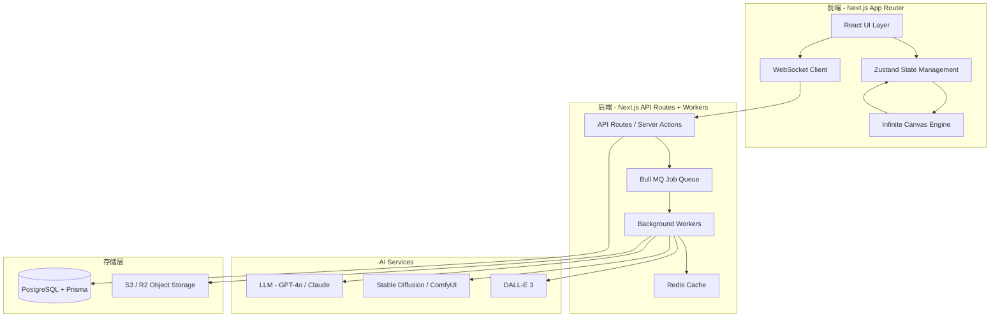
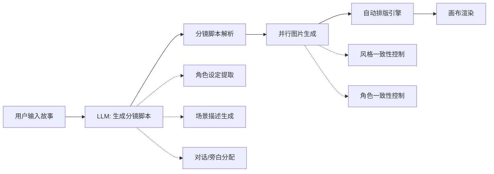
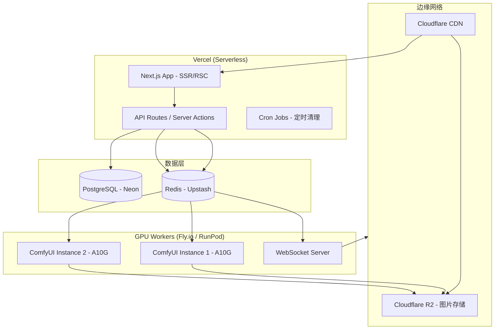

## 引言

想象这样一个产品：用户输入一段故事梗概，AI 自动将其拆解为分镜脚本，逐帧生成漫画风格的图片，然后在一张无限画布上自动排版为漫剧格式——用户可以自由缩放、拖拽、编辑每一格画面，还能对任意区域进行 AI 重绘或局部修改。

这不是一个遥远的设想。本文将从**系统架构**出发，完整拆解如何用 Next.js 实现这样一个平台，覆盖三大核心模块：

1. **AI 漫剧生成管线**：从文本到分镜脚本，再到多帧图片生成与自动排版
2. **无限画布引擎**：基于 Canvas/WebGL 的高性能渲染与交互系统
3. **AI 图片创作工作流**：集成 Stable Diffusion / DALL-E / ComfyUI 的图片生成与编辑能力

本文适合有 Next.js 开发经验、对 AI 应用和 Canvas 编程有兴趣的中高级前端/全栈开发者。

---

## 整体架构设计

### 系统全景



### 技术选型表

| 层级 | 技术选型 | 选型理由 |
|------|---------|---------|
| 框架 | Next.js 14+ (App Router) | RSC + Server Actions 减少前端 bundle；API Routes 做 BFF |
| 状态管理 | Zustand + Immer | 轻量、支持 middleware、适合画布状态 |
| 画布引擎 | 自研（Canvas 2D + WebGL fallback） | 完全可控，避免第三方库的抽象泄漏 |
| 实时通信 | WebSocket (via Socket.IO) | 任务进度推送、多人协作 |
| AI 编排 | LangChain.js + 自研 Pipeline | 链式调用 LLM，结构化输出控制 |
| 图片生成 | ComfyUI API + DALL-E 3 | ComfyUI 灵活可控，DALL-E 快速原型 |
| 任务队列 | BullMQ (Redis-backed) | 可靠的异步任务调度，支持重试和优先级 |
| 数据库 | PostgreSQL + Prisma | 结构化数据存储，关系模型适合项目管理 |
| 对象存储 | Cloudflare R2 / AWS S3 | 海量图片存储，CDN 分发 |
| 部署 | Vercel + Railway/Fly.io Workers | 前端边缘部署 + GPU Worker 独立部署 |

### 项目目录结构

```plaintext
src/
├── app/                          # Next.js App Router
│   ├── (marketing)/              # 营销页面组
│   ├── (workspace)/              # 工作空间（需登录）
│   │   ├── canvas/[projectId]/   # 无限画布编辑器页面
│   │   ├── projects/             # 项目列表
│   │   └── gallery/              # AI 创作画廊
│   ├── api/
│   │   ├── ai/                   # AI 相关 API
│   │   │   ├── comic/generate/   # 漫剧生成
│   │   │   ├── image/generate/   # 图片生成
│   │   │   └── image/edit/       # 图片编辑（inpaint/outpaint）
│   │   ├── canvas/               # 画布数据 CRUD
│   │   ├── ws/                   # WebSocket 端点
│   │   └── webhook/              # ComfyUI 回调
│   └── layout.tsx
├── engine/                       # 画布引擎核心（框架无关）
│   ├── core/
│   │   ├── Canvas.ts             # 画布主类
│   │   ├── Camera.ts             # 视口变换
│   │   ├── Renderer.ts           # 渲染管线
│   │   └── EventSystem.ts        # 事件处理
│   ├── nodes/
│   │   ├── BaseNode.ts           # 节点基类
│   │   ├── ImageNode.ts          # 图片节点
│   │   ├── TextNode.ts           # 文本节点
│   │   ├── ComicPanelNode.ts     # 漫画格子节点
│   │   └── GroupNode.ts          # 组合节点
│   ├── plugins/
│   │   ├── SelectionPlugin.ts    # 选择框
│   │   ├── DragPlugin.ts         # 拖拽
│   │   ├── ZoomPlugin.ts         # 缩放
│   │   └── HistoryPlugin.ts      # 撤销/重做
│   └── index.ts
├── features/
│   ├── comic/                    # 漫剧功能模块
│   │   ├── pipeline.ts           # 漫剧生成管线
│   │   ├── script-parser.ts      # 分镜脚本解析
│   │   └── layout-engine.ts      # 漫画自动排版
│   ├── ai-image/                 # AI 图片功能模块
│   │   ├── providers/            # 多 provider 适配
│   │   ├── prompt-builder.ts     # 提示词构建器
│   │   └── post-processor.ts     # 后处理
│   └── collaboration/            # 协作模块
├── stores/                       # Zustand stores
├── hooks/                        # React Hooks
├── components/                   # UI 组件
└── lib/                          # 通用工具
```

---

## 模块一：无限画布引擎

无限画布是整个平台的核心交互载体。所有漫画面板、AI 生成的图片、文字、标注等都作为「节点」存在于一张理论上无限大的二维平面上。

### 核心概念：世界坐标与屏幕坐标

无限画布的核心在于**坐标变换**——用户看到的屏幕像素坐标，需要经过 Camera（相机/视口）变换，映射到世界坐标系：

```typescript
// engine/core/Camera.ts

export class Camera {
  // 相机参数
  private x: number = 0;       // 视口中心 X（世界坐标）
  private y: number = 0;       // 视口中心 Y（世界坐标）
  private zoom: number = 1;    // 缩放比例

  // 视口尺寸（像素）
  private viewportWidth: number;
  private viewportHeight: number;

  /**
   * 屏幕坐标 → 世界坐标
   * 用于：鼠标点击位置转换为画布上的实际位置
   */
  screenToWorld(screenX: number, screenY: number): { x: number; y: number } {
    return {
      x: (screenX - this.viewportWidth / 2) / this.zoom + this.x,
      y: (screenY - this.viewportHeight / 2) / this.zoom + this.y,
    };
  }

  /**
   * 世界坐标 → 屏幕坐标
   * 用于：将画布元素的位置映射到屏幕上进行渲染
   */
  worldToScreen(worldX: number, worldY: number): { x: number; y: number } {
    return {
      x: (worldX - this.x) * this.zoom + this.viewportWidth / 2,
      y: (worldY - this.y) * this.zoom + this.viewportHeight / 2,
    };
  }

  /**
   * 获取当前可视区域的世界坐标边界
   * 用于：视口裁剪，只渲染可见区域内的节点
   */
  getVisibleBounds(): Rect {
    const halfW = this.viewportWidth / (2 * this.zoom);
    const halfH = this.viewportHeight / (2 * this.zoom);
    return {
      x: this.x - halfW,
      y: this.y - halfH,
      width: halfW * 2,
      height: halfH * 2,
    };
  }

  /** 平移相机 */
  pan(deltaX: number, deltaY: number): void {
    this.x -= deltaX / this.zoom;
    this.y -= deltaY / this.zoom;
  }

  /** 缩放相机（以某个屏幕点为锚点） */
  zoomAt(screenX: number, screenY: number, factor: number): void {
    // 缩放前的世界坐标
    const worldBefore = this.screenToWorld(screenX, screenY);

    // 应用缩放（限制范围）
    this.zoom = Math.max(0.05, Math.min(50, this.zoom * factor));

    // 缩放后同一屏幕点对应的世界坐标
    const worldAfter = this.screenToWorld(screenX, screenY);

    // 调整相机位置，使锚点不动
    this.x += worldBefore.x - worldAfter.x;
    this.y += worldBefore.y - worldAfter.y;
  }
}
```

### 渲染管线：分层渲染 + 视口裁剪

高性能的关键在于**只渲染可见区域内的元素**，并通过分层减少重绘：

```typescript
// engine/core/Renderer.ts

import type { Camera } from './Camera';
import type { BaseNode } from '../nodes/BaseNode';
import { SpatialIndex } from './SpatialIndex';

export class Renderer {
  private canvas: HTMLCanvasElement;
  private ctx: CanvasRenderingContext2D;
  private camera: Camera;
  private spatialIndex: SpatialIndex; // R-Tree 空间索引

  // 多层 canvas：背景层、内容层、交互层
  private layers: Map<string, HTMLCanvasElement> = new Map();

  constructor(container: HTMLElement, camera: Camera) {
    this.camera = camera;
    this.setupLayers(container);
    this.spatialIndex = new SpatialIndex();
  }

  /**
   * 主渲染循环
   * 使用 requestAnimationFrame 驱动，配合 dirty flag 避免无效重绘
   */
  render(nodes: BaseNode[]): void {
    const ctx = this.ctx;
    const { width, height } = this.canvas;

    // 清空画布
    ctx.clearRect(0, 0, width, height);

    // 获取可见区域
    const visibleBounds = this.camera.getVisibleBounds();

    // 通过空间索引快速查询可见节点（O(log n) 而非 O(n)）
    const visibleNodes = this.spatialIndex.query(visibleBounds);

    // 应用相机变换矩阵
    ctx.save();
    const zoom = this.camera.getZoom();
    const offset = this.camera.worldToScreen(0, 0);
    ctx.setTransform(zoom, 0, 0, zoom, offset.x, offset.y);

    // 按 z-index 排序后逐个渲染
    const sorted = visibleNodes.sort((a, b) => a.zIndex - b.zIndex);
    for (const node of sorted) {
      node.render(ctx, this.camera);
    }

    ctx.restore();

    // 渲染交互层（选择框、辅助线等）— 不随缩放变化
    this.renderInteractionLayer();
  }

  /** 空间索引更新（节点移动/增删时调用） */
  updateSpatialIndex(nodes: BaseNode[]): void {
    this.spatialIndex.clear();
    for (const node of nodes) {
      this.spatialIndex.insert(node.getBounds(), node);
    }
  }

  private setupLayers(container: HTMLElement): void {
    // 创建三层 canvas 叠加
    const layerNames = ['background', 'content', 'interaction'];
    for (const name of layerNames) {
      const canvas = document.createElement('canvas');
      canvas.style.position = 'absolute';
      canvas.style.inset = '0';
      container.appendChild(canvas);
      this.layers.set(name, canvas);
    }
    this.canvas = this.layers.get('content')!;
    this.ctx = this.canvas.getContext('2d')!;
  }

  private renderInteractionLayer(): void {
    // 选择框、hover 高亮、对齐辅助线等
  }
}
```

### 空间索引：R-Tree 加速查询

当画布上有成百上千个节点时，逐一检测是否在可视区域内是不可接受的。我们使用 **R-Tree** 空间索引实现 O(log n) 的范围查询：

```typescript
// engine/core/SpatialIndex.ts

import RBush from 'rbush';

interface SpatialItem {
  minX: number;
  minY: number;
  maxX: number;
  maxY: number;
  node: BaseNode;
}

/**
 * 基于 RBush 的空间索引
 * RBush 是一个高性能的 2D 空间索引库，基于 R-Tree 数据结构
 */
export class SpatialIndex {
  private tree: RBush<SpatialItem>;

  constructor() {
    this.tree = new RBush();
  }

  insert(bounds: Rect, node: BaseNode): void {
    this.tree.insert({
      minX: bounds.x,
      minY: bounds.y,
      maxX: bounds.x + bounds.width,
      maxY: bounds.y + bounds.height,
      node,
    });
  }

  /** 范围查询：返回与给定矩形相交的所有节点 */
  query(bounds: Rect): BaseNode[] {
    const results = this.tree.search({
      minX: bounds.x,
      minY: bounds.y,
      maxX: bounds.x + bounds.width,
      maxY: bounds.y + bounds.height,
    });
    return results.map(item => item.node);
  }

  clear(): void {
    this.tree.clear();
  }
}
```

### 节点系统设计

画布上的每个元素都是一个节点，所有节点继承自 `BaseNode`：

```typescript
// engine/nodes/BaseNode.ts

export interface NodeData {
  id: string;
  type: string;
  x: number;
  y: number;
  width: number;
  height: number;
  rotation: number;
  opacity: number;
  zIndex: number;
  locked: boolean;
  visible: boolean;
  metadata: Record<string, unknown>;
}

export abstract class BaseNode {
  public data: NodeData;

  constructor(data: Partial<NodeData> & { id: string; type: string }) {
    this.data = {
      x: 0, y: 0,
      width: 100, height: 100,
      rotation: 0,
      opacity: 1,
      zIndex: 0,
      locked: false,
      visible: true,
      metadata: {},
      ...data,
    };
  }

  get id() { return this.data.id; }
  get zIndex() { return this.data.zIndex; }

  /** 获取世界坐标下的边界矩形 */
  getBounds(): Rect {
    return {
      x: this.data.x,
      y: this.data.y,
      width: this.data.width,
      height: this.data.height,
    };
  }

  /** 点是否在节点内（用于点击检测） */
  hitTest(worldX: number, worldY: number): boolean {
    const { x, y, width, height } = this.data;
    return worldX >= x && worldX <= x + width
        && worldY >= y && worldY <= y + height;
  }

  /** 渲染方法，子类必须实现 */
  abstract render(ctx: CanvasRenderingContext2D, camera: Camera): void;

  /** 序列化为 JSON（用于持久化） */
  serialize(): NodeData {
    return { ...this.data };
  }
}
```

```typescript
// engine/nodes/ImageNode.ts

export class ImageNode extends BaseNode {
  private image: HTMLImageElement | null = null;
  private loaded: boolean = false;

  constructor(data: Partial<NodeData> & { id: string; src: string }) {
    super({ ...data, type: 'image' });
    this.loadImage(data.src);
  }

  private async loadImage(src: string): Promise<void> {
    const img = new Image();
    img.crossOrigin = 'anonymous';
    img.onload = () => {
      this.image = img;
      this.loaded = true;
    };
    img.src = src;
  }

  render(ctx: CanvasRenderingContext2D): void {
    if (!this.loaded || !this.image) {
      // 渲染占位符
      ctx.fillStyle = '#f0f0f0';
      ctx.fillRect(this.data.x, this.data.y, this.data.width, this.data.height);
      return;
    }

    ctx.save();
    ctx.globalAlpha = this.data.opacity;
    ctx.drawImage(
      this.image,
      this.data.x, this.data.y,
      this.data.width, this.data.height
    );
    ctx.restore();
  }
}
```

```typescript
// engine/nodes/ComicPanelNode.ts — 漫画格子节点

export class ComicPanelNode extends BaseNode {
  // 格子包含：背景图、对话气泡、音效文字
  private backgroundImage: ImageNode | null = null;
  private bubbles: TextBubble[] = [];
  private borderWidth: number = 3;
  private borderColor: string = '#000000';
  private borderRadius: number = 0;

  constructor(data: Partial<NodeData> & {
    id: string;
    panelIndex: number;       // 在漫剧中的序号
    dialogues: Dialogue[];    // 对话内容
    imageUrl?: string;        // AI 生成的图片 URL
  }) {
    super({ ...data, type: 'comic-panel' });
    this.data.metadata = {
      panelIndex: data.panelIndex,
      dialogues: data.dialogues,
    };
    if (data.imageUrl) {
      this.backgroundImage = new ImageNode({
        id: `${data.id}-bg`,
        src: data.imageUrl,
        x: data.x ?? 0,
        y: data.y ?? 0,
        width: data.width ?? 400,
        height: data.height ?? 300,
      });
    }
  }

  render(ctx: CanvasRenderingContext2D): void {
    const { x, y, width, height } = this.data;

    // 1. 渲染边框（漫画格子的黑色边框）
    ctx.strokeStyle = this.borderColor;
    ctx.lineWidth = this.borderWidth;
    ctx.strokeRect(x, y, width, height);

    // 2. 裁剪区域，防止内容溢出格子
    ctx.save();
    ctx.beginPath();
    ctx.rect(x, y, width, height);
    ctx.clip();

    // 3. 渲染背景图
    if (this.backgroundImage) {
      this.backgroundImage.render(ctx);
    }

    // 4. 渲染对话气泡
    for (const bubble of this.bubbles) {
      this.renderBubble(ctx, bubble);
    }

    ctx.restore();
  }

  private renderBubble(ctx: CanvasRenderingContext2D, bubble: TextBubble): void {
    // 绘制椭圆形气泡 + 三角形指向箭头 + 文字
    const { x, y, width, height, text } = bubble;

    ctx.fillStyle = '#ffffff';
    ctx.beginPath();
    ctx.ellipse(x + width / 2, y + height / 2, width / 2, height / 2, 0, 0, Math.PI * 2);
    ctx.fill();
    ctx.stroke();

    // 文字渲染（自动换行）
    ctx.fillStyle = '#000000';
    ctx.font = '14px "Comic Sans MS", cursive';
    ctx.textAlign = 'center';
    ctx.textBaseline = 'middle';
    ctx.fillText(text, x + width / 2, y + height / 2);
  }
}
```

### React 集成：useCanvas Hook

```typescript
// hooks/useCanvas.ts

import { useEffect, useRef, useCallback } from 'react';
import { Canvas } from '@/engine/core/Canvas';
import { useCanvasStore } from '@/stores/canvas-store';

export function useCanvas(projectId: string) {
  const containerRef = useRef<HTMLDivElement>(null);
  const canvasRef = useRef<Canvas | null>(null);

  const { nodes, addNode, removeNode, updateNode } = useCanvasStore();

  useEffect(() => {
    if (!containerRef.current) return;

    // 初始化画布引擎
    const canvas = new Canvas(containerRef.current, {
      backgroundColor: '#f8f9fa',
      gridEnabled: true,
      snapToGrid: true,
      gridSize: 20,
    });

    canvasRef.current = canvas;

    // 注册事件监听
    canvas.on('node:select', (node) => {
      useCanvasStore.getState().setSelectedNode(node.id);
    });

    canvas.on('node:move', (node, newPosition) => {
      updateNode(node.id, newPosition);
    });

    canvas.on('viewport:change', (viewport) => {
      useCanvasStore.getState().setViewport(viewport);
    });

    // 开始渲染循环
    canvas.start();

    return () => {
      canvas.destroy();
    };
  }, []);

  // 加载项目数据
  useEffect(() => {
    if (!canvasRef.current) return;

    async function loadProject() {
      const res = await fetch(`/api/canvas/${projectId}`);
      const data = await res.json();
      canvasRef.current!.loadFromJSON(data.nodes);
    }

    loadProject();
  }, [projectId]);

  const addImageNode = useCallback((src: string, position: { x: number; y: number }) => {
    canvasRef.current?.addNode('image', { src, ...position });
  }, []);

  const addComicPanel = useCallback((panelData: ComicPanelData) => {
    canvasRef.current?.addNode('comic-panel', panelData);
  }, []);

  return {
    containerRef,
    canvas: canvasRef,
    addImageNode,
    addComicPanel,
  };
}
```

---

## 模块二：AI 漫剧生成管线

漫剧生成是整个产品最核心的 AI 功能。它的本质是一个**多步骤、多模态的 AI 管线**：文本输入 → 结构化分镜 → 逐帧图片生成 → 自动排版。

### 管线总览



### Step 1：LLM 生成结构化分镜脚本

这一步使用 GPT-4o 或 Claude 将用户的故事文本转换为结构化的 JSON 分镜脚本：

```typescript
// features/comic/pipeline.ts

import { ChatOpenAI } from '@langchain/openai';
import { StructuredOutputParser } from 'langchain/output_parsers';
import { z } from 'zod';

// 定义分镜脚本的数据结构
const PanelSchema = z.object({
  panelIndex: z.number().describe('面板序号，从 1 开始'),
  sceneDescription: z.string().describe('场景的视觉描述，用于图片生成 prompt'),
  cameraAngle: z.enum(['wide', 'medium', 'close-up', 'bird-eye', 'low-angle'])
    .describe('镜头角度'),
  characters: z.array(z.object({
    name: z.string(),
    expression: z.string().describe('表情：happy, sad, angry, surprised, neutral 等'),
    action: z.string().describe('动作描述'),
    position: z.enum(['left', 'center', 'right', 'background']),
  })),
  dialogues: z.array(z.object({
    speaker: z.string(),
    text: z.string(),
    type: z.enum(['speech', 'thought', 'narration', 'sfx']),
  })),
  mood: z.string().describe('画面整体氛围：紧张、温馨、搞笑、悲伤等'),
  timeOfDay: z.enum(['dawn', 'morning', 'afternoon', 'evening', 'night']),
});

const ComicScriptSchema = z.object({
  title: z.string(),
  style: z.string().describe('漫画整体风格：日漫、美漫、欧漫、水墨等'),
  characters: z.array(z.object({
    name: z.string(),
    appearance: z.string().describe('角色外貌的详细文字描述，保证图片生成的一致性'),
    personality: z.string(),
  })),
  panels: z.array(PanelSchema),
});

type ComicScript = z.infer<typeof ComicScriptSchema>;

/**
 * 漫剧生成管线的第一步：故事 → 分镜脚本
 */
export async function generateComicScript(
  storyText: string,
  options: {
    panelCount?: number;   // 期望的面板数量
    style?: string;        // 画风偏好
    language?: string;     // 对话语言
  } = {}
): Promise<ComicScript> {
  const { panelCount = 6, style = '日式漫画', language = '中文' } = options;

  const llm = new ChatOpenAI({
    model: 'gpt-4o',
    temperature: 0.7,
  });

  const parser = StructuredOutputParser.fromZodSchema(ComicScriptSchema);

  const prompt = `你是一位专业的漫画分镜师。请根据以下故事内容，创作一份${panelCount}格漫画的分镜脚本。

要求：
1. 画风：${style}
2. 对话语言：${language}
3. 每一格都要有明确的视觉描述（用英文，因为要给图片生成模型用）
4. 角色描述要详细且一致（发型、服装、体型等）
5. 注意镜头语言的变化（远景→中景→特写的切换）
6. 对话要自然，推动故事发展

故事内容：
${storyText}

${parser.getFormatInstructions()}`;

  const response = await llm.invoke(prompt);
  return parser.parse(response.content as string);
}
```

### Step 2：角色一致性控制 + Prompt 构建

AI 图片生成最大的挑战之一是**角色一致性**——同一个角色在不同面板中要看起来像同一个人。我们通过组合策略来解决：

```typescript
// features/comic/prompt-builder.ts

interface PromptBuildOptions {
  panel: Panel;
  characters: CharacterDefinition[];
  globalStyle: string;
  consistencySeeds: Map<string, number>; // 角色名 → seed
}

/**
 * 为每一格漫画构建图片生成 prompt
 * 策略：全局风格前缀 + 角色描述锚定 + 场景描述 + 质量后缀
 */
export function buildImagePrompt(options: PromptBuildOptions): string {
  const { panel, characters, globalStyle } = options;

  // 1. 全局风格前缀（保证整体风格统一）
  const stylePrefix = getStylePrefix(globalStyle);

  // 2. 角色描述（从角色表中提取，保证每格一致）
  const characterDescriptions = panel.characters
    .map(pc => {
      const charDef = characters.find(c => c.name === pc.name);
      if (!charDef) return '';
      return `${charDef.appearance}, ${pc.expression} expression, ${pc.action}`;
    })
    .filter(Boolean)
    .join('; ');

  // 3. 场景描述
  const sceneDesc = panel.sceneDescription;

  // 4. 镜头角度映射
  const angleMap: Record<string, string> = {
    'wide': 'wide shot, full body visible',
    'medium': 'medium shot, waist up',
    'close-up': 'close-up shot, face and shoulders',
    'bird-eye': 'bird eye view, top-down angle',
    'low-angle': 'low angle shot, looking up',
  };
  const angle = angleMap[panel.cameraAngle] || '';

  // 5. 氛围/光照
  const lighting = getLightingFromTimeOfDay(panel.timeOfDay);

  // 6. 质量后缀
  const qualitySuffix = 'masterpiece, best quality, highly detailed, sharp focus';

  // 7. 负面提示词
  const negativePrompt = 'lowres, bad anatomy, bad hands, text, error, missing fingers, extra digit, fewer digits, cropped, worst quality, low quality, blurry, watermark';

  return {
    positive: `${stylePrefix}, ${angle}, ${characterDescriptions}, ${sceneDesc}, ${lighting}, ${qualitySuffix}`,
    negative: negativePrompt,
  };
}

function getStylePrefix(style: string): string {
  const styleMap: Record<string, string> = {
    '日式漫画': 'manga style, black and white ink drawing, screen tones, dynamic lines',
    '日漫彩色': 'anime style, vibrant colors, cel shading, clean lines',
    '美漫': 'american comic style, bold colors, strong shadows, dynamic composition',
    '欧漫': 'european comic style, ligne claire, detailed backgrounds, muted colors',
    '水墨': 'chinese ink wash painting style, flowing brushstrokes, minimalist',
    '赛博朋克': 'cyberpunk manga, neon colors, dark atmosphere, high contrast',
  };
  return styleMap[style] || style;
}

function getLightingFromTimeOfDay(time: string): string {
  const map: Record<string, string> = {
    'dawn': 'golden hour lighting, warm orange and pink sky',
    'morning': 'bright natural lighting, clear sky',
    'afternoon': 'harsh midday sun, strong shadows',
    'evening': 'sunset lighting, dramatic long shadows, warm tones',
    'night': 'moonlit scene, cool blue tones, dramatic shadows',
  };
  return map[time] || '';
}
```

### Step 3：并行图片生成（ComfyUI 集成）

使用 ComfyUI 作为图片生成后端，通过 API 调用 Stable Diffusion 模型：

```typescript
// features/ai-image/providers/comfyui-provider.ts

interface ComfyUIConfig {
  baseUrl: string;         // ComfyUI 服务地址
  workflowId: string;      // 预设工作流 ID
}

interface GenerateOptions {
  prompt: string;
  negativePrompt: string;
  width: number;
  height: number;
  seed?: number;            // 固定 seed 提高角色一致性
  steps?: number;
  cfgScale?: number;
  checkpoint?: string;      // 模型选择
  controlNet?: {            // ControlNet 用于姿态控制
    type: 'openpose' | 'canny' | 'depth';
    image: string;          // base64 参考图
    strength: number;
  };
}

export class ComfyUIProvider {
  private config: ComfyUIConfig;
  private ws: WebSocket | null = null;

  constructor(config: ComfyUIConfig) {
    this.config = config;
  }

  /**
   * 提交图片生成任务到 ComfyUI
   * 返回一个 Promise，在图片生成完成时 resolve
   */
  async generate(options: GenerateOptions): Promise<{ imageUrl: string; seed: number }> {
    // 构建 ComfyUI workflow JSON
    const workflow = this.buildWorkflow(options);

    // 提交任务
    const response = await fetch(`${this.config.baseUrl}/prompt`, {
      method: 'POST',
      headers: { 'Content-Type': 'application/json' },
      body: JSON.stringify({ prompt: workflow }),
    });

    const { prompt_id } = await response.json();

    // 通过 WebSocket 监听生成进度
    return new Promise((resolve, reject) => {
      this.connectWebSocket();

      const timeout = setTimeout(() => reject(new Error('Generation timeout')), 120000);

      this.ws!.addEventListener('message', (event) => {
        const data = JSON.parse(event.data);

        if (data.type === 'executed' && data.data.prompt_id === prompt_id) {
          clearTimeout(timeout);
          const outputImages = data.data.output.images;
          const imageUrl = `${this.config.baseUrl}/view?filename=${outputImages[0].filename}`;
          resolve({ imageUrl, seed: options.seed ?? data.data.seed });
        }

        if (data.type === 'execution_error' && data.data.prompt_id === prompt_id) {
          clearTimeout(timeout);
          reject(new Error(data.data.exception_message));
        }
      });
    });
  }

  /**
   * 批量生成（漫剧场景：并行生成多格画面）
   * 使用信号量控制并发数，避免 GPU 过载
   */
  async generateBatch(
    optionsList: GenerateOptions[],
    concurrency: number = 2,
    onProgress?: (completed: number, total: number) => void
  ): Promise<Array<{ imageUrl: string; seed: number }>> {
    const results: Array<{ imageUrl: string; seed: number }> = [];
    const semaphore = new Semaphore(concurrency);
    let completed = 0;

    const tasks = optionsList.map(async (options) => {
      await semaphore.acquire();
      try {
        const result = await this.generate(options);
        results.push(result);
        completed++;
        onProgress?.(completed, optionsList.length);
        return result;
      } finally {
        semaphore.release();
      }
    });

    await Promise.all(tasks);
    return results;
  }

  private buildWorkflow(options: GenerateOptions): object {
    // 构建 ComfyUI 标准工作流 JSON
    // 这里简化展示核心节点
    return {
      '1': {
        class_type: 'CheckpointLoaderSimple',
        inputs: { ckpt_name: options.checkpoint || 'animagineXL_v3.safetensors' },
      },
      '2': {
        class_type: 'CLIPTextEncode',
        inputs: { text: options.prompt, clip: ['1', 1] },
      },
      '3': {
        class_type: 'CLIPTextEncode',
        inputs: { text: options.negativePrompt, clip: ['1', 1] },
      },
      '4': {
        class_type: 'KSampler',
        inputs: {
          seed: options.seed ?? Math.floor(Math.random() * 2147483647),
          steps: options.steps ?? 28,
          cfg: options.cfgScale ?? 7,
          sampler_name: 'dpmpp_2m',
          scheduler: 'karras',
          model: ['1', 0],
          positive: ['2', 0],
          negative: ['3', 0],
          latent_image: ['5', 0],
        },
      },
      '5': {
        class_type: 'EmptyLatentImage',
        inputs: { width: options.width, height: options.height, batch_size: 1 },
      },
      '6': {
        class_type: 'VAEDecode',
        inputs: { samples: ['4', 0], vae: ['1', 2] },
      },
      '7': {
        class_type: 'SaveImage',
        inputs: { images: ['6', 0], filename_prefix: 'comic_panel' },
      },
    };
  }

  private connectWebSocket(): void {
    if (this.ws?.readyState === WebSocket.OPEN) return;
    this.ws = new WebSocket(`${this.config.baseUrl.replace('http', 'ws')}/ws`);
  }
}

/** 简单信号量实现，控制并发数 */
class Semaphore {
  private permits: number;
  private queue: Array<() => void> = [];

  constructor(permits: number) {
    this.permits = permits;
  }

  async acquire(): Promise<void> {
    if (this.permits > 0) {
      this.permits--;
      return;
    }
    return new Promise<void>(resolve => this.queue.push(resolve));
  }

  release(): void {
    const next = this.queue.shift();
    if (next) {
      next();
    } else {
      this.permits++;
    }
  }
}
```

### Step 4：漫画自动排版引擎

生成的图片需要自动排列成漫画的格式——这涉及到格子大小变化、阅读顺序、视觉节奏等排版规则：

```typescript
// features/comic/layout-engine.ts

interface LayoutConfig {
  pageWidth: number;         // 页面宽度
  pageHeight: number;        // 页面高度
  gutterSize: number;        // 格子间距
  panelCount: number;        // 格子数量
  readingDirection: 'ltr' | 'rtl';  // 阅读方向（日漫从右到左）
}

interface PanelLayout {
  x: number;
  y: number;
  width: number;
  height: number;
  panelIndex: number;
}

/**
 * 漫画自动排版引擎
 *
 * 布局策略：
 * 1. 基础网格布局（规则的 2x3, 3x3 等）
 * 2. 动态布局（根据内容重要性调整格子大小）
 * 3. 电影式布局（宽银幕横条 + 小格子混排）
 */
export class ComicLayoutEngine {

  /**
   * 生成动态漫画布局
   * 根据每一格的「重要性」分配不同的面积
   */
  generateDynamicLayout(
    panels: Panel[],
    config: LayoutConfig
  ): PanelLayout[] {
    const { pageWidth, pageHeight, gutterSize } = config;
    const layouts: PanelLayout[] = [];

    // 计算每格的重要性权重（决定面积比例）
    const weights = panels.map(panel => this.calculateWeight(panel));

    // 使用 Treemap 算法进行面积分配
    const rects = this.squarifiedTreemap(
      weights,
      { x: 0, y: 0, width: pageWidth, height: pageHeight },
      gutterSize
    );

    // 根据阅读方向排序
    const sorted = this.sortByReadingOrder(rects, config.readingDirection);

    return sorted.map((rect, index) => ({
      ...rect,
      panelIndex: index,
    }));
  }

  /**
   * 模板化布局：预设的经典漫画排版模板
   */
  generateTemplateLayout(
    panelCount: number,
    config: LayoutConfig
  ): PanelLayout[] {
    const { pageWidth, pageHeight, gutterSize } = config;
    const templates = this.getLayoutTemplates(panelCount);

    // 随机选择一个模板（或根据内容智能选择）
    const template = templates[Math.floor(Math.random() * templates.length)];

    return template.map((cell, index) => ({
      x: cell.col * (pageWidth / template.cols) + gutterSize / 2,
      y: cell.row * (pageHeight / template.rows) + gutterSize / 2,
      width: cell.colSpan * (pageWidth / template.cols) - gutterSize,
      height: cell.rowSpan * (pageHeight / template.rows) - gutterSize,
      panelIndex: index,
    }));
  }

  /**
   * 计算面板重要性权重
   * 特写镜头、高潮场景、多对话面板 → 更大面积
   */
  private calculateWeight(panel: Panel): number {
    let weight = 1;

    // 特写镜头需要更大空间展示表情
    if (panel.cameraAngle === 'close-up') weight *= 1.3;

    // 远景需要更大空间展示场景
    if (panel.cameraAngle === 'wide') weight *= 1.5;

    // 多角色对话需要更大空间
    if (panel.dialogues.length > 2) weight *= 1.2;

    // 动作场景（根据描述关键词判断）
    if (panel.mood === '紧张' || panel.mood === '激烈') weight *= 1.4;

    return weight;
  }

  /**
   * Squarified Treemap 算法
   * 将权重数组映射为尽量接近正方形的矩形分区
   */
  private squarifiedTreemap(
    weights: number[],
    bounds: Rect,
    gutter: number
  ): Rect[] {
    const totalWeight = weights.reduce((sum, w) => sum + w, 0);
    const totalArea = bounds.width * bounds.height;
    const results: Rect[] = [];

    let remaining = [...weights.map((w, i) => ({ weight: w, index: i }))];
    let currentBounds = { ...bounds };

    while (remaining.length > 0) {
      const isHorizontal = currentBounds.width >= currentBounds.height;
      const { row, rest } = this.layoutRow(remaining, currentBounds, totalArea, totalWeight, isHorizontal);

      // 计算这一行占据的空间
      const rowWeight = row.reduce((sum, item) => sum + item.weight, 0);
      const rowFraction = rowWeight / remaining.reduce((sum, item) => sum + item.weight, 0);

      let offset = isHorizontal ? currentBounds.x : currentBounds.y;
      const rowSize = isHorizontal
        ? currentBounds.width * rowFraction
        : currentBounds.height * rowFraction;

      for (const item of row) {
        const itemFraction = item.weight / rowWeight;
        const itemSize = (isHorizontal ? currentBounds.height : currentBounds.width) * itemFraction;

        results.push({
          x: (isHorizontal ? currentBounds.x : offset) + gutter / 2,
          y: (isHorizontal ? offset : currentBounds.y) + gutter / 2,
          width: (isHorizontal ? rowSize : itemSize) - gutter,
          height: (isHorizontal ? itemSize : rowSize) - gutter,
        });

        offset += itemSize;
      }

      // 更新剩余空间
      if (isHorizontal) {
        currentBounds = {
          x: currentBounds.x + rowSize,
          y: currentBounds.y,
          width: currentBounds.width - rowSize,
          height: currentBounds.height,
        };
      } else {
        currentBounds = {
          x: currentBounds.x,
          y: currentBounds.y + rowSize,
          width: currentBounds.width,
          height: currentBounds.height - rowSize,
        };
      }

      remaining = rest;
    }

    return results;
  }

  private layoutRow(items: any[], bounds: Rect, totalArea: number, totalWeight: number, horizontal: boolean) {
    // Treemap row layout 细节实现省略
    // 核心逻辑：贪心地将元素加入当前行，直到纵横比开始变差
    const row = [items[0]];
    const rest = items.slice(1);
    return { row, rest };
  }

  private sortByReadingOrder(rects: Rect[], direction: 'ltr' | 'rtl'): Rect[] {
    return rects.sort((a, b) => {
      // 先按行（Y 坐标）排序
      const rowDiff = a.y - b.y;
      if (Math.abs(rowDiff) > 50) return rowDiff; // 不同行

      // 同行内按阅读方向排序
      return direction === 'ltr' ? a.x - b.x : b.x - a.x;
    });
  }

  private getLayoutTemplates(count: number) {
    // 预设模板库，根据格子数返回合适的模板
    // 实际实现中会有大量预设模板
    return [];
  }
}
```

### 完整管线编排：Server Action

将以上步骤串联成一个完整的 Server Action：

```typescript
// app/api/ai/comic/generate/route.ts

import { NextRequest, NextResponse } from 'next/server';
import { generateComicScript } from '@/features/comic/pipeline';
import { buildImagePrompt } from '@/features/comic/prompt-builder';
import { ComfyUIProvider } from '@/features/ai-image/providers/comfyui-provider';
import { ComicLayoutEngine } from '@/features/comic/layout-engine';
import { getRedisClient } from '@/lib/redis';
import { prisma } from '@/lib/prisma';

export async function POST(req: NextRequest) {
  const { storyText, options, projectId } = await req.json();
  const userId = await getUserId(req); // 从 session 获取

  // 创建任务记录
  const task = await prisma.comicTask.create({
    data: {
      userId,
      projectId,
      status: 'processing',
      storyText,
      options,
    },
  });

  // 异步执行管线（不阻塞响应）
  executeComicPipeline(task.id, storyText, options, projectId).catch(console.error);

  // 立即返回任务 ID，客户端通过 WebSocket 监听进度
  return NextResponse.json({ taskId: task.id, status: 'processing' });
}

async function executeComicPipeline(
  taskId: string,
  storyText: string,
  options: any,
  projectId: string
) {
  const redis = await getRedisClient();
  const progress = (step: string, percent: number) => {
    redis.publish(`task:${taskId}`, JSON.stringify({ step, percent }));
  };

  try {
    // Step 1: 生成分镜脚本
    progress('generating_script', 10);
    const script = await generateComicScript(storyText, options);
    progress('script_ready', 20);

    // Step 2: 为每一格构建图片 prompt
    const prompts = script.panels.map(panel =>
      buildImagePrompt({
        panel,
        characters: script.characters,
        globalStyle: script.style,
        consistencySeeds: new Map(), // 首次生成不固定 seed
      })
    );
    progress('prompts_ready', 30);

    // Step 3: 并行生成图片
    const comfyui = new ComfyUIProvider({
      baseUrl: process.env.COMFYUI_URL!,
      workflowId: 'comic-panel-v1',
    });

    const generateOptions = prompts.map((prompt, i) => ({
      prompt: prompt.positive,
      negativePrompt: prompt.negative,
      width: 768,
      height: 768,
      steps: 28,
      cfgScale: 7,
    }));

    const images = await comfyui.generateBatch(
      generateOptions,
      2, // 并发数
      (completed, total) => {
        const percent = 30 + (completed / total) * 50;
        progress('generating_images', percent);
      }
    );
    progress('images_ready', 80);

    // Step 4: 自动排版
    const layoutEngine = new ComicLayoutEngine();
    const layouts = layoutEngine.generateDynamicLayout(script.panels, {
      pageWidth: 1200,
      pageHeight: 1600,
      gutterSize: 12,
      panelCount: script.panels.length,
      readingDirection: script.style.includes('日') ? 'rtl' : 'ltr',
    });
    progress('layout_ready', 90);

    // Step 5: 保存结果并通知前端
    const result = {
      script,
      panels: script.panels.map((panel, i) => ({
        ...panel,
        imageUrl: images[i].imageUrl,
        seed: images[i].seed,
        layout: layouts[i],
      })),
    };

    await prisma.comicTask.update({
      where: { id: taskId },
      data: { status: 'completed', result: JSON.stringify(result) },
    });

    progress('completed', 100);
    redis.publish(`task:${taskId}`, JSON.stringify({ step: 'completed', result }));

  } catch (error) {
    await prisma.comicTask.update({
      where: { id: taskId },
      data: { status: 'failed', error: (error as Error).message },
    });
    redis.publish(`task:${taskId}`, JSON.stringify({ step: 'failed', error: (error as Error).message }));
  }
}
```

---

## 模块三：AI 图片创作工作流

除了漫剧的批量生成，平台还需要支持用户对单张图片的精细化 AI 创作，包括：文生图、图生图、局部重绘（Inpainting）、扩图（Outpainting）、风格迁移等。

### Provider 抽象层

为了支持多个 AI 图片服务（ComfyUI、DALL-E、Midjourney 等），我们设计一个统一的 Provider 接口：

```typescript
// features/ai-image/providers/base-provider.ts

export interface ImageGenerationResult {
  imageUrl: string;
  width: number;
  height: number;
  seed?: number;
  metadata?: Record<string, unknown>;
}

export interface TextToImageOptions {
  prompt: string;
  negativePrompt?: string;
  width: number;
  height: number;
  seed?: number;
  model?: string;
  steps?: number;
  guidanceScale?: number;
}

export interface InpaintOptions extends TextToImageOptions {
  sourceImage: string;       // base64 或 URL
  mask: string;              // base64 蒙版（白色区域为需要重绘的部分）
  strength?: number;         // 重绘强度 0-1
}

export interface OutpaintOptions {
  sourceImage: string;
  prompt: string;
  direction: 'top' | 'bottom' | 'left' | 'right' | 'all';
  expandSize: number;        // 扩展像素数
}

export interface ImageToImageOptions extends TextToImageOptions {
  sourceImage: string;
  strength: number;          // 参考强度 0-1
}

/**
 * AI 图片生成 Provider 统一接口
 * 所有具体实现（ComfyUI、DALL-E、Replicate 等）都实现此接口
 */
export abstract class BaseImageProvider {
  abstract readonly name: string;

  abstract textToImage(options: TextToImageOptions): Promise<ImageGenerationResult>;
  abstract imageToImage(options: ImageToImageOptions): Promise<ImageGenerationResult>;
  abstract inpaint(options: InpaintOptions): Promise<ImageGenerationResult>;
  abstract outpaint(options: OutpaintOptions): Promise<ImageGenerationResult>;

  /** 检查服务是否可用 */
  abstract healthCheck(): Promise<boolean>;

  /** 获取当前队列等待数 */
  abstract getQueueLength(): Promise<number>;
}
```

### DALL-E 3 Provider 实现

```typescript
// features/ai-image/providers/dalle-provider.ts

import OpenAI from 'openai';
import { BaseImageProvider, type TextToImageOptions, type ImageGenerationResult } from './base-provider';

export class DalleProvider extends BaseImageProvider {
  readonly name = 'dalle-3';
  private client: OpenAI;

  constructor() {
    super();
    this.client = new OpenAI({ apiKey: process.env.OPENAI_API_KEY });
  }

  async textToImage(options: TextToImageOptions): Promise<ImageGenerationResult> {
    const response = await this.client.images.generate({
      model: 'dall-e-3',
      prompt: options.prompt,
      n: 1,
      size: this.mapSize(options.width, options.height),
      quality: 'hd',
      style: 'vivid',
    });

    const imageUrl = response.data[0].url!;

    // 下载图片并上传到自己的 S3，避免 OpenAI 临时链接过期
    const permanentUrl = await this.persistImage(imageUrl);

    return {
      imageUrl: permanentUrl,
      width: options.width,
      height: options.height,
      metadata: { revisedPrompt: response.data[0].revised_prompt },
    };
  }

  async imageToImage(options: any): Promise<ImageGenerationResult> {
    // DALL-E 3 不直接支持 img2img，需要通过 variation 或 edit API
    const response = await this.client.images.edit({
      model: 'dall-e-2', // edit 目前只支持 dall-e-2
      image: await this.urlToFile(options.sourceImage),
      prompt: options.prompt,
      n: 1,
      size: '1024x1024',
    });

    return {
      imageUrl: response.data[0].url!,
      width: 1024,
      height: 1024,
    };
  }

  async inpaint(options: any): Promise<ImageGenerationResult> {
    const response = await this.client.images.edit({
      model: 'dall-e-2',
      image: await this.urlToFile(options.sourceImage),
      mask: await this.urlToFile(options.mask),
      prompt: options.prompt,
      n: 1,
      size: '1024x1024',
    });

    return {
      imageUrl: response.data[0].url!,
      width: 1024,
      height: 1024,
    };
  }

  async outpaint(options: any): Promise<ImageGenerationResult> {
    // DALL-E 原生不支持 outpaint，通过 padding + inpaint 模拟
    throw new Error('Outpaint not supported by DALL-E, use ComfyUI provider');
  }

  async healthCheck(): Promise<boolean> {
    try {
      await this.client.models.retrieve('dall-e-3');
      return true;
    } catch {
      return false;
    }
  }

  async getQueueLength(): Promise<number> {
    return 0; // DALL-E 没有公开队列信息
  }

  private mapSize(width: number, height: number): '1024x1024' | '1792x1024' | '1024x1792' {
    const ratio = width / height;
    if (ratio > 1.3) return '1792x1024';
    if (ratio < 0.77) return '1024x1792';
    return '1024x1024';
  }

  private async persistImage(url: string): Promise<string> {
    // 下载并上传到 S3/R2
    const response = await fetch(url);
    const buffer = await response.arrayBuffer();
    // ... upload to S3
    return `https://cdn.example.com/images/${Date.now()}.png`;
  }

  private async urlToFile(url: string): Promise<File> {
    const response = await fetch(url);
    const blob = await response.blob();
    return new File([blob], 'image.png', { type: 'image/png' });
  }
}
```

### 智能 Provider 路由

根据任务类型、负载、可用性等因素，智能选择最合适的 Provider：

```typescript
// features/ai-image/provider-router.ts

import { BaseImageProvider } from './providers/base-provider';
import { ComfyUIProvider } from './providers/comfyui-provider';
import { DalleProvider } from './providers/dalle-provider';

interface RouteDecision {
  provider: BaseImageProvider;
  reason: string;
}

/**
 * 智能路由器：根据任务需求自动选择最佳 Provider
 */
export class ProviderRouter {
  private providers: Map<string, BaseImageProvider> = new Map();

  constructor() {
    this.providers.set('comfyui', new ComfyUIProvider({
      baseUrl: process.env.COMFYUI_URL!,
      workflowId: 'default',
    }));
    this.providers.set('dalle', new DalleProvider());
  }

  async route(taskType: string, options: any): Promise<RouteDecision> {
    // 规则优先级：
    // 1. Inpaint/Outpaint → 必须用 ComfyUI（DALL-E 支持有限）
    // 2. 需要 ControlNet → 必须用 ComfyUI
    // 3. 需要固定 Seed 的角色一致性 → ComfyUI
    // 4. 快速原型/高质量单图 → DALL-E 3
    // 5. 批量生成 → ComfyUI（成本更低）

    if (['inpaint', 'outpaint'].includes(taskType)) {
      return { provider: this.providers.get('comfyui')!, reason: 'Task requires ComfyUI capabilities' };
    }

    if (options.controlNet) {
      return { provider: this.providers.get('comfyui')!, reason: 'ControlNet required' };
    }

    if (options.seed !== undefined) {
      return { provider: this.providers.get('comfyui')!, reason: 'Seed control required' };
    }

    // 检查 ComfyUI 负载
    const comfyui = this.providers.get('comfyui')!;
    const queueLength = await comfyui.getQueueLength();

    if (queueLength > 10 && taskType === 'text-to-image') {
      // ComfyUI 繁忙，路由到 DALL-E
      return { provider: this.providers.get('dalle')!, reason: 'ComfyUI busy, fallback to DALL-E' };
    }

    // 默认使用 ComfyUI（成本更低，更灵活）
    return { provider: this.providers.get('comfyui')!, reason: 'Default provider' };
  }
}
```

### 局部重绘：Inpainting 交互

用户在画布上框选区域后进行 AI 重绘，这是一个前后端配合的交互流程：

```typescript
// components/canvas/InpaintTool.tsx
'use client';

import { useState, useCallback, useRef } from 'react';
import { useCanvasStore } from '@/stores/canvas-store';

/**
 * 局部重绘工具组件
 * 用户用画笔在图片上涂抹要重绘的区域，生成 mask，然后发送 inpaint 请求
 */
export function InpaintTool() {
  const [isDrawing, setIsDrawing] = useState(false);
  const [prompt, setPrompt] = useState('');
  const [strength, setStrength] = useState(0.75);
  const [isGenerating, setIsGenerating] = useState(false);
  const maskCanvasRef = useRef<HTMLCanvasElement>(null);

  const { selectedNode, updateNode } = useCanvasStore();

  // 生成蒙版画布（白色 = 重绘区域）
  const handleMouseDown = useCallback((e: React.MouseEvent) => {
    setIsDrawing(true);
    const ctx = maskCanvasRef.current!.getContext('2d')!;
    ctx.beginPath();
    ctx.moveTo(e.nativeEvent.offsetX, e.nativeEvent.offsetY);
  }, []);

  const handleMouseMove = useCallback((e: React.MouseEvent) => {
    if (!isDrawing) return;
    const ctx = maskCanvasRef.current!.getContext('2d')!;
    ctx.lineWidth = 30;
    ctx.lineCap = 'round';
    ctx.strokeStyle = '#ffffff';
    ctx.lineTo(e.nativeEvent.offsetX, e.nativeEvent.offsetY);
    ctx.stroke();
  }, [isDrawing]);

  const handleMouseUp = useCallback(() => {
    setIsDrawing(false);
  }, []);

  // 提交重绘请求
  const handleInpaint = async () => {
    if (!selectedNode || !prompt) return;
    setIsGenerating(true);

    try {
      const maskDataUrl = maskCanvasRef.current!.toDataURL('image/png');

      const response = await fetch('/api/ai/image/edit', {
        method: 'POST',
        headers: { 'Content-Type': 'application/json' },
        body: JSON.stringify({
          type: 'inpaint',
          sourceImage: selectedNode.data.src,
          mask: maskDataUrl,
          prompt,
          strength,
        }),
      });

      const { imageUrl } = await response.json();

      // 更新画布节点的图片
      updateNode(selectedNode.id, { src: imageUrl });
    } finally {
      setIsGenerating(false);
    }
  };

  return (
    <div className="fixed bottom-4 left-1/2 -translate-x-1/2 bg-white rounded-xl shadow-2xl p-4 flex gap-4 items-end">
      {/* 蒙版绘制区域（覆盖在选中图片上） */}
      <canvas
        ref={maskCanvasRef}
        className="absolute inset-0 cursor-crosshair"
        onMouseDown={handleMouseDown}
        onMouseMove={handleMouseMove}
        onMouseUp={handleMouseUp}
      />

      {/* 控制面板 */}
      <div className="flex flex-col gap-2">
        <input
          type="text"
          value={prompt}
          onChange={e => setPrompt(e.target.value)}
          placeholder="描述你想要重绘的内容..."
          className="px-3 py-2 border rounded-lg w-64"
        />
        <div className="flex items-center gap-2">
          <label className="text-sm text-gray-600">强度:</label>
          <input
            type="range"
            min={0} max={1} step={0.05}
            value={strength}
            onChange={e => setStrength(Number(e.target.value))}
          />
          <span className="text-sm">{strength}</span>
        </div>
      </div>

      <button
        onClick={handleInpaint}
        disabled={isGenerating || !prompt}
        className="px-4 py-2 bg-blue-600 text-white rounded-lg disabled:opacity-50"
      >
        {isGenerating ? '生成中...' : '重绘'}
      </button>
    </div>
  );
}
```

---

## 实时通信与任务进度

AI 图片生成通常需要 10-60 秒，用户需要实时看到进度。我们使用 WebSocket 实现双向通信：

### WebSocket 服务端

```typescript
// app/api/ws/route.ts — 注意：Next.js 原生不支持 WebSocket
// 实际部署时需要独立的 WebSocket 服务器或使用 Socket.IO

// lib/websocket-server.ts（独立进程）

import { Server } from 'socket.io';
import { createClient } from 'redis';

const io = new Server(3001, {
  cors: { origin: process.env.NEXT_PUBLIC_APP_URL },
});

// 订阅 Redis 频道，转发任务进度到对应客户端
const subscriber = createClient({ url: process.env.REDIS_URL });
await subscriber.connect();

await subscriber.pSubscribe('task:*', (message, channel) => {
  const taskId = channel.replace('task:', '');
  const data = JSON.parse(message);

  // 找到订阅了该任务的所有客户端并推送
  io.to(`task:${taskId}`).emit('task:progress', data);
});

io.on('connection', (socket) => {
  console.log('Client connected:', socket.id);

  // 客户端订阅某个任务的进度
  socket.on('subscribe:task', (taskId: string) => {
    socket.join(`task:${taskId}`);
  });

  // 客户端取消订阅
  socket.on('unsubscribe:task', (taskId: string) => {
    socket.leave(`task:${taskId}`);
  });

  socket.on('disconnect', () => {
    console.log('Client disconnected:', socket.id);
  });
});
```

### 客户端 Hook

```typescript
// hooks/useTaskProgress.ts

import { useEffect, useState, useCallback } from 'react';
import { io, Socket } from 'socket.io-client';

interface TaskProgress {
  step: string;
  percent: number;
  result?: any;
  error?: string;
}

let socket: Socket | null = null;

function getSocket(): Socket {
  if (!socket) {
    socket = io(process.env.NEXT_PUBLIC_WS_URL!, {
      transports: ['websocket'],
    });
  }
  return socket;
}

export function useTaskProgress(taskId: string | null) {
  const [progress, setProgress] = useState<TaskProgress | null>(null);
  const [isCompleted, setIsCompleted] = useState(false);
  const [error, setError] = useState<string | null>(null);

  useEffect(() => {
    if (!taskId) return;

    const ws = getSocket();

    ws.emit('subscribe:task', taskId);

    const handler = (data: TaskProgress) => {
      setProgress(data);

      if (data.step === 'completed') {
        setIsCompleted(true);
      }

      if (data.step === 'failed') {
        setError(data.error ?? 'Unknown error');
      }
    };

    ws.on('task:progress', handler);

    return () => {
      ws.emit('unsubscribe:task', taskId);
      ws.off('task:progress', handler);
    };
  }, [taskId]);

  return { progress, isCompleted, error };
}
```

---

## 状态管理：Zustand Store 设计

画布应用的状态非常复杂，我们使用 Zustand + Immer 来管理，并通过 middleware 实现撤销/重做：

```typescript
// stores/canvas-store.ts

import { create } from 'zustand';
import { immer } from 'zustand/middleware/immer';
import { temporal } from 'zundo'; // 撤销/重做中间件
import type { NodeData } from '@/engine/nodes/BaseNode';

interface Viewport {
  x: number;
  y: number;
  zoom: number;
}

interface CanvasState {
  // 节点数据
  nodes: Map<string, NodeData>;
  nodeOrder: string[]; // z-index 顺序

  // 选择状态
  selectedNodeIds: Set<string>;
  hoveredNodeId: string | null;

  // 视口
  viewport: Viewport;

  // 工具状态
  activeTool: 'select' | 'pan' | 'draw' | 'text' | 'inpaint';

  // 项目元数据
  projectId: string | null;
  isDirty: boolean; // 有未保存的修改
}

interface CanvasActions {
  // 节点操作
  addNode: (node: NodeData) => void;
  removeNode: (id: string) => void;
  updateNode: (id: string, updates: Partial<NodeData>) => void;
  moveNode: (id: string, x: number, y: number) => void;
  reorderNode: (id: string, newIndex: number) => void;

  // 批量操作
  addNodes: (nodes: NodeData[]) => void;
  removeNodes: (ids: string[]) => void;

  // 选择
  selectNode: (id: string, multi?: boolean) => void;
  selectAll: () => void;
  clearSelection: () => void;

  // 视口
  setViewport: (viewport: Viewport) => void;

  // 工具
  setActiveTool: (tool: CanvasState['activeTool']) => void;

  // 持久化
  saveToServer: () => Promise<void>;
  loadFromServer: (projectId: string) => Promise<void>;
}

export const useCanvasStore = create<CanvasState & CanvasActions>()(
  temporal(
    immer((set, get) => ({
      // 初始状态
      nodes: new Map(),
      nodeOrder: [],
      selectedNodeIds: new Set(),
      hoveredNodeId: null,
      viewport: { x: 0, y: 0, zoom: 1 },
      activeTool: 'select',
      projectId: null,
      isDirty: false,

      // 节点操作
      addNode: (node) => set((state) => {
        state.nodes.set(node.id, node);
        state.nodeOrder.push(node.id);
        state.isDirty = true;
      }),

      removeNode: (id) => set((state) => {
        state.nodes.delete(id);
        state.nodeOrder = state.nodeOrder.filter(nid => nid !== id);
        state.selectedNodeIds.delete(id);
        state.isDirty = true;
      }),

      updateNode: (id, updates) => set((state) => {
        const node = state.nodes.get(id);
        if (node) {
          Object.assign(node, updates);
          state.isDirty = true;
        }
      }),

      moveNode: (id, x, y) => set((state) => {
        const node = state.nodes.get(id);
        if (node) {
          node.x = x;
          node.y = y;
          state.isDirty = true;
        }
      }),

      reorderNode: (id, newIndex) => set((state) => {
        const currentIndex = state.nodeOrder.indexOf(id);
        if (currentIndex === -1) return;
        state.nodeOrder.splice(currentIndex, 1);
        state.nodeOrder.splice(newIndex, 0, id);
        state.isDirty = true;
      }),

      addNodes: (nodes) => set((state) => {
        for (const node of nodes) {
          state.nodes.set(node.id, node);
          state.nodeOrder.push(node.id);
        }
        state.isDirty = true;
      }),

      removeNodes: (ids) => set((state) => {
        for (const id of ids) {
          state.nodes.delete(id);
          state.selectedNodeIds.delete(id);
        }
        state.nodeOrder = state.nodeOrder.filter(id => !ids.includes(id));
        state.isDirty = true;
      }),

      selectNode: (id, multi = false) => set((state) => {
        if (multi) {
          if (state.selectedNodeIds.has(id)) {
            state.selectedNodeIds.delete(id);
          } else {
            state.selectedNodeIds.add(id);
          }
        } else {
          state.selectedNodeIds.clear();
          state.selectedNodeIds.add(id);
        }
      }),

      selectAll: () => set((state) => {
        state.selectedNodeIds = new Set(state.nodeOrder);
      }),

      clearSelection: () => set((state) => {
        state.selectedNodeIds.clear();
      }),

      setViewport: (viewport) => set((state) => {
        state.viewport = viewport;
      }),

      setActiveTool: (tool) => set((state) => {
        state.activeTool = tool;
      }),

      // 自动保存（防抖）
      saveToServer: async () => {
        const state = get();
        if (!state.projectId || !state.isDirty) return;

        const serialized = {
          nodes: Array.from(state.nodes.values()),
          nodeOrder: state.nodeOrder,
          viewport: state.viewport,
        };

        await fetch(`/api/canvas/${state.projectId}`, {
          method: 'PUT',
          headers: { 'Content-Type': 'application/json' },
          body: JSON.stringify(serialized),
        });

        set((state) => { state.isDirty = false; });
      },

      loadFromServer: async (projectId) => {
        const res = await fetch(`/api/canvas/${projectId}`);
        const data = await res.json();

        set((state) => {
          state.projectId = projectId;
          state.nodes = new Map(data.nodes.map((n: NodeData) => [n.id, n]));
          state.nodeOrder = data.nodeOrder;
          state.viewport = data.viewport ?? { x: 0, y: 0, zoom: 1 };
          state.isDirty = false;
        });
      },
    })),
    {
      // zundo 配置：限制历史记录数量
      limit: 100,
      // 只追踪节点变更，不追踪视口和选择
      partialize: (state) => ({
        nodes: state.nodes,
        nodeOrder: state.nodeOrder,
      }),
    }
  )
);
```

---

## 数据库设计

```typescript
// prisma/schema.prisma 核心模型

/*
  model User {
    id        String   @id @default(cuid())
    email     String   @unique
    name      String?
    projects  Project[]
    createdAt DateTime @default(now())
  }

  model Project {
    id          String   @id @default(cuid())
    name        String
    userId      String
    user        User     @relation(fields: [userId], references: [id])
    canvasData  Json?    // 画布序列化数据
    thumbnail   String?  // 缩略图 URL
    comicTasks  ComicTask[]
    createdAt   DateTime @default(now())
    updatedAt   DateTime @updatedAt
  }

  model ComicTask {
    id         String   @id @default(cuid())
    projectId  String
    project    Project  @relation(fields: [projectId], references: [id])
    userId     String
    status     String   // processing | completed | failed
    storyText  String   @db.Text
    options    Json?
    result     Json?    // 生成结果
    error      String?
    createdAt  DateTime @default(now())
    updatedAt  DateTime @updatedAt
  }

  model GeneratedImage {
    id         String   @id @default(cuid())
    userId     String
    projectId  String?
    provider   String   // comfyui | dalle | midjourney
    prompt     String   @db.Text
    negPrompt  String?  @db.Text
    imageUrl   String
    width      Int
    height     Int
    seed       Int?
    metadata   Json?
    createdAt  DateTime @default(now())
  }
*/
```

---

## 性能优化策略

### 1. 画布渲染优化

```typescript
// engine/core/RenderOptimizer.ts

export class RenderOptimizer {
  private lastFrameTime: number = 0;
  private targetFPS: number = 60;
  private dirtyRegions: Rect[] = [];
  private isIdle: boolean = true;

  /**
   * 策略 1：脏区域渲染
   * 只重绘发生变化的区域，而非整个画布
   */
  markDirty(region: Rect): void {
    this.dirtyRegions.push(region);
    this.isIdle = false;
  }

  getDirtyRegion(): Rect | null {
    if (this.dirtyRegions.length === 0) return null;
    // 合并所有脏区域为一个包围盒
    return this.mergeBounds(this.dirtyRegions);
  }

  /**
   * 策略 2：LOD（Level of Detail）
   * 缩放比例很小时，不渲染细节（文字、小元素等）
   */
  shouldRenderDetail(zoom: number, nodeSize: number): boolean {
    const screenSize = nodeSize * zoom;
    // 屏幕上小于 20px 的元素不渲染细节
    return screenSize > 20;
  }

  /**
   * 策略 3：图片分辨率自适应
   * 缩小时使用低分辨率缩略图，放大时才加载原图
   */
  getOptimalImageResolution(node: ImageNode, zoom: number): 'thumb' | 'medium' | 'full' {
    const screenWidth = node.data.width * zoom;
    if (screenWidth < 200) return 'thumb';      // < 200px 用缩略图
    if (screenWidth < 800) return 'medium';     // < 800px 用中等分辨率
    return 'full';                               // 大于 800px 用原图
  }

  /**
   * 策略 4：离屏 Canvas 缓存
   * 静态内容渲染到 OffscreenCanvas 缓存，避免重复绘制
   */
  createNodeCache(node: BaseNode): OffscreenCanvas {
    const cache = new OffscreenCanvas(
      node.data.width * window.devicePixelRatio,
      node.data.height * window.devicePixelRatio
    );
    const ctx = cache.getContext('2d')!;
    ctx.scale(window.devicePixelRatio, window.devicePixelRatio);
    node.render(ctx);
    return cache;
  }

  private mergeBounds(rects: Rect[]): Rect {
    let minX = Infinity, minY = Infinity, maxX = -Infinity, maxY = -Infinity;
    for (const r of rects) {
      minX = Math.min(minX, r.x);
      minY = Math.min(minY, r.y);
      maxX = Math.max(maxX, r.x + r.width);
      maxY = Math.max(maxY, r.y + r.height);
    }
    return { x: minX, y: minY, width: maxX - minX, height: maxY - minY };
  }
}
```

### 2. 大量节点场景优化

```typescript
// 虚拟化渲染：只实例化可视区域内的节点
// 类似虚拟列表（Virtual List）的思想应用于 2D 平面

export class VirtualizedCanvas {
  private nodePool: Map<string, BaseNode> = new Map(); // 活跃节点池
  private nodeDataStore: Map<string, NodeData> = new Map(); // 所有节点数据

  /**
   * 每帧调用：根据视口范围决定哪些节点需要实例化
   */
  updateVisibleNodes(viewport: Rect): void {
    const visibleIds = this.spatialIndex.query(viewport).map(n => n.id);
    const visibleSet = new Set(visibleIds);

    // 回收视口外的节点
    for (const [id, node] of this.nodePool) {
      if (!visibleSet.has(id)) {
        node.dispose(); // 释放 Image、Canvas 等资源
        this.nodePool.delete(id);
      }
    }

    // 实例化新进入视口的节点
    for (const id of visibleIds) {
      if (!this.nodePool.has(id)) {
        const data = this.nodeDataStore.get(id)!;
        const node = NodeFactory.create(data); // 根据 type 创建对应节点
        this.nodePool.set(id, node);
      }
    }
  }
}
```

### 3. 图片懒加载与预加载策略

```typescript
// lib/image-loader.ts

export class SmartImageLoader {
  private cache: Map<string, HTMLImageElement> = new Map();
  private loading: Map<string, Promise<HTMLImageElement>> = new Map();
  private preloadQueue: string[] = [];

  /**
   * 预加载策略：根据用户操作方向，提前加载即将出现的图片
   */
  predictAndPreload(viewport: Rect, panDirection: { dx: number; dy: number }): void {
    // 在平移方向上扩展视口，预加载即将出现的区域
    const expandedViewport = {
      x: viewport.x + panDirection.dx * viewport.width * 0.5,
      y: viewport.y + panDirection.dy * viewport.height * 0.5,
      width: viewport.width * 2,
      height: viewport.height * 2,
    };

    const upcomingNodes = this.spatialIndex.query(expandedViewport);
    for (const node of upcomingNodes) {
      if (node.type === 'image' && !this.cache.has(node.src)) {
        this.preloadQueue.push(node.src);
      }
    }

    // 低优先级加载（使用 requestIdleCallback）
    this.processPreloadQueue();
  }

  private processPreloadQueue(): void {
    requestIdleCallback((deadline) => {
      while (deadline.timeRemaining() > 10 && this.preloadQueue.length > 0) {
        const src = this.preloadQueue.shift()!;
        this.loadImage(src); // 开始加载但不阻塞
      }
    });
  }

  async loadImage(src: string): Promise<HTMLImageElement> {
    if (this.cache.has(src)) return this.cache.get(src)!;
    if (this.loading.has(src)) return this.loading.get(src)!;

    const promise = new Promise<HTMLImageElement>((resolve, reject) => {
      const img = new Image();
      img.crossOrigin = 'anonymous';
      img.onload = () => {
        this.cache.set(src, img);
        this.loading.delete(src);
        resolve(img);
      };
      img.onerror = reject;
      img.src = src;
    });

    this.loading.set(src, promise);
    return promise;
  }
}
```

---

## 部署架构



### 部署清单

| 组件 | 服务 | 配置 | 月成本估算 |
|------|------|------|-----------|
| Next.js 应用 | Vercel Pro | 自动扩缩 | $20-50 |
| PostgreSQL | Neon | Serverless，按量 | $0-25 |
| Redis | Upstash | Serverless，按请求 | $0-10 |
| 图片存储 | Cloudflare R2 | 无出口费 | $5-20 |
| GPU Worker | RunPod Serverless | A10G，按秒计费 | $50-200 |
| WebSocket | Fly.io | 1 台小规格常驻 | $5-10 |
| 域名 + CDN | Cloudflare | 免费计划 | $0 |
| **总计** | | | **$80-315/月** |

---

## 常见问题与注意事项

### 1. 角色一致性的现实挑战

:::warning 重要限制
当前 AI 图片生成模型（包括 SDXL、DALL-E 3）在**多帧角色一致性**上仍有明显不足。即使使用相同的 seed + 相同的角色描述，不同构图下的角色外观也会有差异。
:::

**缓解策略：**
- 使用 IP-Adapter 或 InstantID 注入参考人脸
- 使用 LoRA 为特定角色训练轻量模型（需要 5-10 张参考图）
- 使用 ControlNet OpenPose 固定人物姿态
- 后期使用 face-swap 模型统一人脸
- 接受一定程度的差异，通过漫画风格化（如高对比黑白线稿）降低违和感

### 2. 成本控制

:::tip 成本优化建议
- 使用 SDXL Turbo / LCM 加速模型，4-8 步即可出图，速度提升 5-10 倍
- 图片先生成小尺寸（512x512），用户确认后再 upscale 到高分辨率
- 使用 RunPod Serverless 按秒计费，闲时自动缩容到 0
- 对频繁使用的 prompt 模板做缓存，避免重复调用 LLM
:::

### 3. Canvas 性能瓶颈

当画布上有超过 500 个节点时，性能会开始下降。解决方案：

- **空间索引** — R-Tree 保证查询效率
- **虚拟化** — 只渲染可见区域的节点
- **WebGL 后备方案** — 超过 1000 节点时切换到 WebGL 渲染（使用 PixiJS 或自研）
- **Web Worker 计算** — 将空间索引查询、碰撞检测等放到 Worker 线程

### 4. 安全性考量

:::important 安全提醒
- 所有 AI 生成的 prompt 必须经过内容审核（OpenAI Moderation API / 自建审核模型）
- 用户上传的参考图需要做 NSFW 检测
- ComfyUI 服务不应暴露到公网，通过内网 + API Key 访问
- 生成的图片 URL 使用签名 URL，设置过期时间
- 实现用户级别的速率限制（Rate Limiting）
:::

### 5. 未来扩展方向

- **多人实时协作**：基于 CRDT（如 Yjs）实现多人同时编辑画布
- **AI 语音配音**：使用 TTS 模型为漫剧生成配音
- **动态漫画**：在漫画格子中加入简单动画（CSS 动画 / Lottie）
- **一键导出**：导出为 PDF 漫画、竖屏漫画（条漫格式）、短视频
- **社区生态**：用户分享漫剧模板、角色 LoRA、风格预设

---

## 总结

本文从架构设计到具体实现，完整梳理了一个基于 Next.js 的 AI 漫剧创作平台的技术方案。核心要点：

1. **无限画布引擎**是交互的基石——通过 Camera 坐标变换、R-Tree 空间索引、分层渲染和虚拟化实现高性能
2. **AI 漫剧管线**是产品的灵魂——LLM 生成结构化分镜 → 并行图片生成 → 自动排版，形成完整的创作闭环
3. **Provider 抽象 + 智能路由**保证了系统的灵活性和可扩展性
4. **异步任务架构**（BullMQ + Redis Pub/Sub + WebSocket）确保了长时间 AI 任务的可靠执行和进度反馈

这个方案的每个模块都可以独立落地、渐进式开发。建议从**无限画布 + 单图 AI 生成**开始 MVP，验证核心交互体验后，再逐步加入漫剧管线和高级编辑功能。
