# Python 异步编程系统教程：从同步到 asyncio 实战

这篇文章解决一个核心问题：**Python 的异步编程到底是怎么回事，什么时候该用，怎么用对？**

如果你写过网络请求、数据库查询、文件读写，你的程序大部分时间都在"等"——等网络响应、等磁盘 IO、等数据库返回。异步编程就是让程序在等待的时间里去做别的事，而不是干等着。

适合读者：已掌握 Python 基础（函数、类、生成器），需要系统理解 asyncio 的开发者。如果你还没看过 Python 基础，可以先读 [Python 系统教程](/posts/python/python-complete-guide)。

---

## 一、为什么需要异步编程

### IO 密集 vs CPU 密集

程序的性能瓶颈分两类：

- **IO 密集型**：大部分时间花在等待外部响应——网络请求、数据库查询、文件读写。CPU 大部分时间在空转。
- **CPU 密集型**：大部分时间花在计算——数值计算、图像处理、加密解密。CPU 一直在忙。

异步编程解决的是**IO 密集型**问题。核心思路：当一个任务在等 IO 的时候，让出 CPU 给其他任务用。

```python
import time
import asyncio
import aiohttp

URLS = [
    "https://httpbin.org/delay/1",
    "https://httpbin.org/delay/1",
    "https://httpbin.org/delay/1",
]

def fetch_sync() -> None:
    start = time.perf_counter()
    for url in URLS:
        import urllib.request
        urllib.request.urlopen(url).read()
    print(f"同步耗时: {time.perf_counter() - start:.2f}s")

async def fetch_async() -> None:
    start = time.perf_counter()
    async with aiohttp.ClientSession() as session:
        tasks = [session.get(url) for url in URLS]
        responses = await asyncio.gather(*tasks)
        for resp in responses:
            await resp.text()
    print(f"异步耗时: {time.perf_counter() - start:.2f}s")

fetch_sync()
asyncio.run(fetch_async())
```

同步约 3 秒（串行），异步约 1 秒（三个请求并发）。

### 异步 vs 多线程 vs 多进程

| 方案 | 适用场景 | 并发模型 | 复杂度 |
|------|---------|---------|--------|
| asyncio | IO 密集，大量连接 | 单线程协程 | 中等 |
| threading | IO 密集，少量连接 | 多线程，有 GIL 限制 | 高（锁、竞态） |
| multiprocessing | CPU 密集 | 多进程，无 GIL | 高（进程间通信） |

:::note
Python 的 GIL 使得多线程无法真正并行执行 CPU 密集型代码。但 IO 操作期间会释放 GIL，所以多线程对 IO 密集型也有效——只是协程更轻量，一个线程就能处理成千上万个连接。
:::

---

## 二、从同步到异步：核心概念建立

### 阻塞 vs 非阻塞 IO

用一个餐厅的比喻来理解：

**同步阻塞**：你去了餐厅，点完菜后站在取餐口死等，什么都不干。菜好了拿走，再去点下一个。一次只能处理一个请求。

**异步非阻塞**：你点完菜后拿了个号码牌，回去继续工作。菜好了叫号你再去取。在等待的时间里你可以处理别的事。

映射到程序中：

```python
import asyncio

def sync_blocking() -> None:
    import time
    time.sleep(2)
    print("同步：等了 2 秒，什么都没干")

async def async_non_blocking() -> None:
    task = asyncio.create_task(asyncio.sleep(2))
    print("异步：已发起等待，可以做别的事")
    await task
    print("异步：2 秒到了")
```

### 事件循环心智模型

asyncio 的核心是一个**事件循环**（Event Loop），运行在单线程中，按以下流程工作：

1. 从队列中取出一个就绪的任务（协程）
2. 执行该任务，直到遇到 `await`
3. `await` 挂起当前任务，将控制权交还事件循环
4. 事件循环去执行其他就绪的任务
5. 当被 `await` 的操作完成后，事件循环恢复之前挂起的任务

这叫**协作式多任务**：每个任务主动让出控制权（通过 `await`），而不是被操作系统强制抢占。

### 演进历程：回调 → 生成器 → async/await

Python 异步编程经历了三个阶段：

**第一阶段：回调（callback）**——多层嵌套，错误处理困难，"回调地狱"。

**第二阶段：生成器（yield）**——Python 2.5 引入 `yield` 可以实现协程，但语法不够直观，需要手动驱动。

**第三阶段：async/await**——Python 3.5 引入 `async def` 和 `await` 关键字，语法清晰，语义明确：

```python
async def fetch_data(url: str) -> str:
    async with aiohttp.ClientSession() as session:
        async with session.get(url) as response:
            return await response.text()
```

### 同步 vs 异步执行时间线

```mermaid
gantt
    title 同步 vs 异步执行时间线
    dateFormat X
    axisFormat %s秒

    section 同步执行
    请求A (等待IO)     :a1, 0, 2
    请求B (等待IO)     :a2, 2, 4
    请求C (等待IO)     :a3, 4, 6

    section 异步执行
    请求A (等待IO)     :b1, 0, 2
    请求B (等待IO)     :b2, 0, 2
    请求C (等待IO)     :b3, 0, 2
```



同步：总耗时 6 秒。异步：总耗时 2 秒，三个请求并发。

---

## 三、协程基础：async def 与 await

### 定义协程

用 `async def` 定义的函数叫**协程函数**，调用它返回的是**协程对象**：

```python
async def greet(name: str) -> str:
    return f"Hello, {name}"

coro = greet("Alice")
print(type(coro))
```

输出 `<class 'coroutine'>`。注意，调用协程函数**不会执行其中的代码**，只是创建了一个协程对象。

### await 关键字

`await` 做了两件事：

1. **等待**：等待一个可等待对象（协程、Task、Future）完成，拿到结果
2. **让出控制权**：在等待期间，把控制权交还给事件循环，让其他任务可以执行

```python
import asyncio

async def slow_operation() -> int:
    print("开始慢操作")
    await asyncio.sleep(2)
    print("慢操作完成")
    return 42

async def main() -> None:
    print("main 开始")
    result = await slow_operation()
    print(f"得到结果: {result}")

asyncio.run(main())
```

执行顺序：`main 开始` → `开始慢操作` → （2 秒等待，事件循环空闲） → `慢操作完成` → `得到结果`。

### 协程对象 vs Task 对象

协程对象是被动的，需要被调度才会执行。Task 是协程的包装，创建后立即被事件循环调度：

```python
import asyncio

async def work(name: str, seconds: float) -> str:
    print(f"{name} 开始")
    await asyncio.sleep(seconds)
    print(f"{name} 完成")
    return f"{name} 结果"

async def main() -> None:
    task1 = asyncio.create_task(work("任务1", 2))
    task2 = asyncio.create_task(work("任务2", 1))

    result1 = await task1
    result2 = await task2
    print(result1, result2)

asyncio.run(main())
```

输出中"任务2"会先完成（只等 1 秒），说明两个任务是并发执行的。

### 运行协程的几种方式

```python
import asyncio

async def hello() -> str:
    return "hello"

result = asyncio.run(hello())
print(result)

loop = asyncio.new_event_loop()
result = loop.run_until_complete(hello())
print(result)
loop.close()
```

:::warning
`asyncio.run()` 是 Python 3.7+ 推荐的入口方式，自动创建/关闭事件循环。不要在已有事件循环内再调用 `asyncio.run()`。
:::

### 常见错误

**忘记 await**——协程不会执行，也不会报错：

```python
import asyncio

async def fetch_data() -> str:
    return "数据"

async def wrong() -> None:
    coro = fetch_data()
    print(type(coro))

async def right() -> None:
    result = await fetch_data()
    print(result)

asyncio.run(right())
```

`wrong()` 打印 `<class 'coroutine'>`，不是 `"数据"`。Python 不会抛异常，只给你一个协程对象。

**直接调用不调度**：

```python
async def main() -> None:
    fetch_data()  # RuntimeWarning: coroutine was never awaited

asyncio.run(main())
```

---

## 四、事件循环（Event Loop）

### 事件循环的职责

事件循环是 asyncio 的心脏，负责：

- **调度任务**：从就绪队列中取出任务执行
- **处理 IO 回调**：当 IO 操作完成时，恢复等待该 IO 的协程
- **管理定时器**：处理 `call_later`、`call_at` 注册的延时回调
- **驱动 Future**：当 Future 被设值时，唤醒等待它的协程

### 获取和创建事件循环

```python
import asyncio

loop = asyncio.get_event_loop()
print(type(loop))

new_loop = asyncio.new_event_loop()
asyncio.set_event_loop(new_loop)
new_loop.close()
```

:::note
Python 3.10+ 推荐使用 `asyncio.run()` 而不是手动管理事件循环。直接操作事件循环主要出现在需要精细控制的场景，比如集成到已有事件循环（GUI 框架）中。
:::

### loop.run_forever 与 run_until_complete

```python
import asyncio

loop = asyncio.new_event_loop()

async def periodic() -> None:
    for i in range(3):
        print(f"第 {i+1} 次")
        await asyncio.sleep(1)

loop.run_until_complete(periodic())
loop.close()
```

`run_until_complete` 运行直到给定协程完成。`run_forever` 会一直运行直到 `loop.stop()` 被调用：

```python
loop = asyncio.new_event_loop()
loop.call_later(3, lambda: loop.stop())
loop.run_forever()
loop.close()
```

### 定时调度：call_soon / call_later / call_at

```python
import asyncio
from datetime import datetime

def show_time(label: str) -> None:
    print(f"[{label}] {datetime.now().strftime('%H:%M:%S.%f')[:-3]}")

async def main() -> None:
    loop = asyncio.get_running_loop()

    loop.call_soon(show_time, "call_soon")
    loop.call_later(1.0, show_time, "call_later 1s")
    loop.call_later(2.0, show_time, "call_later 2s")
    loop.call_at(loop.time() + 1.5, show_time, "call_at +1.5s")

    await asyncio.sleep(3)

asyncio.run(main())
```

输出顺序：`call_soon`（立即） → `call_later 1s` → `call_at +1.5s` → `call_later 2s`。

### 事件循环与操作系统 IO 多路复用

asyncio 底层使用操作系统的 IO 多路复用机制：Linux 用 `epoll`，macOS 用 `kqueue`，Windows 用 `IOCP`。

当你 `await` 一个网络操作时，事件循环将该 socket 注册到 epoll/kqueue，然后去执行其他任务。当操作系统通知该 socket 有数据到达时，事件循环恢复对应的协程。这意味着单线程就能管理成千上万个连接。

---

## 五、Task 与并发调度

### asyncio.create_task()

`create_task` 将协程包装成 Task 并立即调度到事件循环中：

```python
import asyncio

async def download(url: str) -> str:
    await asyncio.sleep(1)
    return f"{url} 的内容"

async def main() -> None:
    task1 = asyncio.create_task(download("https://a.com"))
    task2 = asyncio.create_task(download("https://b.com"))

    print("任务已创建，可以做别的事")
    await asyncio.sleep(0.5)
    print("0.5 秒过去了，任务还在跑")

    r1, r2 = await task1, await task2
    print(r1, r2)

asyncio.run(main())
```

:::tip
`create_task` 必须在运行中的事件循环内调用。在 `asyncio.run()` 外面调用会报错。如果需要在事件循环启动前创建任务，可以用 `asyncio.ensure_future()`。
:::

### Task 状态

```python
import asyncio

async def show_task_states() -> None:
    async def work() -> str:
        await asyncio.sleep(1)
        return "完成"

    task = asyncio.create_task(work())
    print(f"刚创建: {task.done()=}, {task.cancelled()=}")

    await asyncio.sleep(0.5)
    print(f"运行中: {task.done()=}, {task.cancelled()=}")

    result = await task
    print(f"已完成: {task.done()=}, 结果={result}")

asyncio.run(show_task_states())
```

| 状态 | 说明 |
|------|------|
| pending | 已创建，等待执行 |
| running | 正在执行 |
| done | 执行完毕（正常返回或抛异常） |
| cancelled | 被取消 |

### asyncio.wait_for() 超时控制

```python
import asyncio

async def slow_task() -> str:
    await asyncio.sleep(10)
    return "不应该到达这里"

async def main() -> None:
    try:
        result = await asyncio.wait_for(slow_task(), timeout=2.0)
    except asyncio.TimeoutError:
        print("超时了！任务被取消")

asyncio.run(main())
```

`wait_for` 在超时后会自动取消底层任务，并抛出 `asyncio.TimeoutError`。

### Task 取消

```python
import asyncio

async def cancellable_work() -> None:
    try:
        print("工作开始")
        await asyncio.sleep(5)
        print("工作完成（不会到这里）")
    except asyncio.CancelledError:
        print("任务被取消了，做清理工作")
        raise

async def main() -> None:
    task = asyncio.create_task(cancellable_work())
    await asyncio.sleep(1)
    task.cancel()

    try:
        await task
    except asyncio.CancelledError:
        print("main 捕获到取消")

asyncio.run(main())
```

:::important
捕获 `CancelledError` 后**最佳实践是清理后重新抛出**，让调用者知道任务确实被取消了。Python 3.9+ 中 `CancelledError` 是 `BaseException` 的子类，`except Exception` 不会捕获它。
:::

### 获取 Task 结果

- `task.result()`：返回结果，异常则重新抛出
- `task.exception()`：返回异常对象，无异常返回 `None`

```python
import asyncio

async def main() -> None:
    task = asyncio.create_task(asyncio.sleep(0.5, result="成功"))
    await task
    print(f"结果: {task.result()}")
    print(f"异常: {task.exception()}")

asyncio.run(main())
```

---

## 六、并发模式：gather / wait / as_completed

### asyncio.gather()

`gather` 并发运行多个可等待对象，按输入顺序返回所有结果：

```python
import asyncio
import time

async def fetch(name: str, delay: float) -> str:
    await asyncio.sleep(delay)
    return f"{name} 完成（耗时 {delay}s）"

async def main() -> None:
    start = time.perf_counter()
    results = await asyncio.gather(
        fetch("A", 2), fetch("B", 1), fetch("C", 3),
    )
    print(f"总耗时: {time.perf_counter() - start:.2f}s")
    for r in results:
        print(r)

asyncio.run(main())
```

结果顺序与输入一致（A, B, C），总耗时约 3 秒（取决于最慢的那个）。

`return_exceptions=True` 让异常作为结果返回，而不是立刻抛出：

```python
async def success() -> str:
    return "成功"

async def failure() -> str:
    raise ValueError("失败了")

async def main() -> None:
    results = await asyncio.gather(success(), failure(), return_exceptions=True)
    print(results)

asyncio.run(main())
```

输出：`['成功', ValueError('失败了')]`。

### asyncio.wait()

`wait` 提供更细粒度的控制，通过 `return_when` 决定何时返回：

```python
import asyncio
import random

async def random_task(name: str) -> str:
    delay = random.uniform(0.5, 3.0)
    await asyncio.sleep(delay)
    return f"{name}（{delay:.1f}s）"

async def main() -> None:
    tasks = [asyncio.create_task(random_task(f"任务{i}")) for i in range(5)]

    done, pending = await asyncio.wait(tasks, return_when=asyncio.FIRST_COMPLETED)

    print(f"第一个完成的: {done.pop().result()}")
    for t in pending:
        t.cancel()
    await asyncio.gather(*pending, return_exceptions=True)

asyncio.run(main())
```

| 值 | 说明 |
|----|------|
| `ALL_COMPLETED` | 等全部完成（默认） |
| `FIRST_COMPLETED` | 有一个完成就返回 |
| `FIRST_EXCEPTION` | 有一个抛异常就返回（无异常则等同 ALL_COMPLETED） |

### asyncio.as_completed()

按完成顺序（而非输入顺序）产出 Future，适合"谁先完成就先处理谁"：

```python
import asyncio
import random

async def random_task(name: str) -> str:
    delay = random.uniform(0.5, 3.0)
    await asyncio.sleep(delay)
    return f"{name}（{delay:.1f}s）"

async def main() -> None:
    tasks = [random_task(f"任务{i}") for i in range(5)]
    for coro in asyncio.as_completed(tasks):
        result = await coro
        print(f"最早完成: {result}")

asyncio.run(main())
```

### asyncio.TaskGroup（Python 3.11+）

TaskGroup 提供结构化并发——如果任何任务抛异常，所有其他任务自动取消：

```python
import asyncio

async def work(name: str, delay: float) -> str:
    await asyncio.sleep(delay)
    if name == "B":
        raise RuntimeError(f"{name} 出错了")
    return f"{name} 完成"

async def main() -> None:
    try:
        async with asyncio.TaskGroup() as tg:
            t1 = tg.create_task(work("A", 1))
            t2 = tg.create_task(work("B", 2))
            t3 = tg.create_task(work("C", 3))
    except* RuntimeError as eg:
        print(f"捕获到异常组: {eg.exceptions}")

    print(f"t1 结果: {t1.result()}")
    print(f"t3 取消: {t3.cancelled()}")

asyncio.run(main())
```

:::important
`except*` 是 Python 3.11 新语法，用于捕获 ExceptionGroup。TaskGroup 中只要有一个任务失败，其余任务会被取消，所有异常收集到 ExceptionGroup 中统一抛出。
:::

### 性能对比：顺序 vs 并发

```python
import asyncio
import time

async def io_task(n: int) -> int:
    await asyncio.sleep(1)
    return n * 2

async def sequential() -> None:
    start = time.perf_counter()
    results = [await io_task(i) for i in range(10)]
    print(f"顺序: {time.perf_counter() - start:.2f}s")

async def concurrent() -> None:
    start = time.perf_counter()
    results = await asyncio.gather(*[io_task(i) for i in range(10)])
    print(f"并发: {time.perf_counter() - start:.2f}s")

async def main() -> None:
    await sequential()
    await concurrent()

asyncio.run(main())
```

顺序约 10 秒，并发约 1 秒——10 个 IO 操作同时等待，总时间等于最慢的一个。

---

## 七、异步 IO 操作

### asyncio.sleep()

最简单的异步操作，用于模拟 IO 延迟或定时逻辑：

```python
import asyncio

async def countdown(n: int) -> None:
    for i in range(n, 0, -1):
        print(i)
        await asyncio.sleep(1)
    print("时间到！")

asyncio.run(countdown(3))
```

:::warning
永远不要在异步代码中使用 `time.sleep()`——它会阻塞整个事件循环。用 `asyncio.sleep()` 代替。
:::

### aiohttp：异步 HTTP 客户端

**基本 GET/POST 请求**：

```python
import asyncio
import aiohttp

async def http_examples() -> None:
    async with aiohttp.ClientSession() as session:
        async with session.get("https://httpbin.org/get") as resp:
            print(f"状态码: {resp.status}")
            data = await resp.json()
            print(f"origin: {data['origin']}")

        payload = {"name": "Alice", "age": 30}
        async with session.post("https://httpbin.org/post", json=payload) as resp:
            data = await resp.json()
            print(data["json"])

asyncio.run(http_examples())
```

**Session 复用与并发请求**：

一个 `ClientSession` 应该复用，不要为每个请求创建新的：

```python
async def fetch_all_concurrent(urls: list[str]) -> list[str]:
    async with aiohttp.ClientSession() as session:
        tasks = [session.get(url) for url in urls]
        responses = await asyncio.gather(*tasks)
        results = []
        for resp in responses:
            results.append(await resp.text())
            await resp.release()
        return results
```

**超时和重试**：

```python
import asyncio
import aiohttp

async def fetch_with_retry(
    url: str,
    max_retries: int = 3,
    timeout: float = 5.0,
) -> str:
    last_error: Exception | None = None
    for attempt in range(max_retries):
        try:
            async with aiohttp.ClientSession() as session:
                async with session.get(
                    url, timeout=aiohttp.ClientTimeout(total=timeout)
                ) as resp:
                    return await resp.text()
        except (aiohttp.ClientError, asyncio.TimeoutError) as e:
            last_error = e
            wait_time = 2 ** attempt
            print(f"第 {attempt+1} 次失败，{wait_time}s 后重试: {e}")
            await asyncio.sleep(wait_time)
    raise last_error

asyncio.run(fetch_with_retry("https://httpbin.org/get"))
```

### aiofiles：异步文件 IO

```python
import asyncio
import aiofiles

async def write_and_read() -> None:
    async with aiofiles.open("example.txt", mode="w") as f:
        await f.write("第一行\n")
        await f.write("第二行\n")

    async with aiofiles.open("example.txt", mode="r") as f:
        content = await f.read()
        print(content)

    async with aiofiles.open("example.txt", mode="r") as f:
        async for line in f:
            print(f"行: {line.rstrip()}")

asyncio.run(write_and_read())
```

### asyncio.open_connection()：原始 TCP

```python
import asyncio

async def tcp_echo_client() -> None:
    reader, writer = await asyncio.open_connection("127.0.0.1", 8888)

    writer.write(b"Hello, Server!\n")
    await writer.drain()

    data = await reader.readline()
    print(f"收到: {data.decode()}")

    writer.close()
    await writer.wait_closed()

async def handle_client(reader: asyncio.StreamReader, writer: asyncio.StreamWriter) -> None:
    data = await reader.readline()
    message = data.decode().strip()
    writer.write(f"Echo: {message}\n".encode())
    await writer.drain()
    writer.close()
    await writer.wait_closed()
```

### 标准库异步同步原语

asyncio 提供了和 `threading` 对应的异步版本：

**asyncio.Queue**：

```python
import asyncio

async def producer(queue: asyncio.Queue[int]) -> None:
    for i in range(5):
        await queue.put(i)
        print(f"生产: {i}")
    await queue.put(None)

async def consumer(queue: asyncio.Queue[int]) -> None:
    while True:
        item = await queue.get()
        if item is None:
            queue.task_done()
            break
        print(f"消费: {item}")
        queue.task_done()

async def main() -> None:
    queue: asyncio.Queue[int] = asyncio.Queue()
    await asyncio.gather(producer(queue), consumer(queue))

asyncio.run(main())
```

**asyncio.Lock**——保护共享状态，防止竞态条件：

```python
import asyncio

counter: int = 0
lock = asyncio.Lock()

async def increment(name: str, n: int) -> None:
    global counter
    for _ in range(n):
        async with lock:
            temp = counter
            await asyncio.sleep(0)
            counter = temp + 1
    print(f"{name}: counter={counter}")

async def main() -> None:
    await asyncio.gather(increment("A", 100), increment("B", 100))
    print(f"最终: {counter}")

asyncio.run(main())
```

**asyncio.Event**——通知机制，`wait()` 等待直到 `set()` 被调用：

```python
event = asyncio.Event()

async def waiter(name: str) -> None:
    await event.wait()
    print(f"{name} 收到事件！")

async def setter() -> None:
    await asyncio.sleep(2)
    event.set()

async def main() -> None:
    await asyncio.gather(waiter("A"), waiter("B"), setter())

asyncio.run(main())
```

**asyncio.Semaphore**——限制并发数，常用于控制同时打开的连接数：

```python
sem = asyncio.Semaphore(3)

async def limited_task(name: str) -> None:
    async with sem:
        print(f"{name} 获得信号量")
        await asyncio.sleep(1)

async def main() -> None:
    tasks = [limited_task(f"任务{i}") for i in range(10)]
    await asyncio.gather(*tasks)

asyncio.run(main())
```

Semaphore 限制同时执行的任务数为 3，10 个任务会分 4 批执行。

---

## 八、异步迭代器与异步上下文管理器

### async for 与 __aiter__ / __anext__

当数据源本身就是异步的（比如逐行读取网络响应），就需要异步迭代器：

```python
import asyncio
from typing import AsyncIterator

class AsyncRange:
    def __init__(self, count: int, delay: float = 0.5) -> None:
        self.count = count
        self.delay = delay

    def __aiter__(self) -> AsyncIterator[int]:
        self._current = 0
        return self

    async def __anext__(self) -> int:
        if self._current >= self.count:
            raise StopAsyncIteration
        await asyncio.sleep(self.delay)
        value = self._current
        self._current += 1
        return value

async def main() -> None:
    async for i in AsyncRange(5):
        print(f"迭代: {i}")

asyncio.run(main())
```

:::note
`StopAsyncIteration` 是异步迭代器的终止信号。不要在 `__anext__` 中抛出 `StopIteration`。
:::

### async with 与 __aenter__ / __aexit__

异步上下文管理器用于需要异步初始化或清理的资源：

```python
import asyncio

class AsyncDBConnection:
    def __init__(self, db_url: str) -> None:
        self.db_url = db_url
        self.connected = False

    async def __aenter__(self) -> "AsyncDBConnection":
        print(f"连接到 {self.db_url}...")
        await asyncio.sleep(0.5)
        self.connected = True
        print("连接成功")
        return self

    async def __aexit__(self, exc_type, exc_val, exc_tb) -> None:
        print("关闭连接...")
        await asyncio.sleep(0.2)
        self.connected = False
        print("连接已关闭")

    async def execute(self, query: str) -> str:
        if not self.connected:
            raise RuntimeError("未连接")
        await asyncio.sleep(0.1)
        return f"查询结果: {query}"

async def main() -> None:
    async with AsyncDBConnection("postgresql://localhost/mydb") as db:
        result = await db.execute("SELECT * FROM users")
        print(result)

asyncio.run(main())
```

### 使用 contextlib.asynccontextmanager

用装饰器创建异步上下文管理器，不需要写类：

```python
import asyncio
from contextlib import asynccontextmanager

@asynccontextmanager
async def db_transaction(conn_url: str):
    print(f"开始事务: {conn_url}")
    await asyncio.sleep(0.1)
    try:
        yield "db_connection"
    finally:
        print("回滚/提交事务")
        await asyncio.sleep(0.1)

async def main() -> None:
    async with db_transaction("postgresql://localhost/mydb") as conn:
        print(f"使用 {conn} 执行操作")

asyncio.run(main())
```

`asyncio.StreamReader` 也是异步迭代器，可以用 `async for line in reader` 逐行读取 TCP 数据流。

## 九、经典模式：生产者-消费者

### 基于 asyncio.Queue 的完整示例

```python
import asyncio
import random

async def producer(
    queue: asyncio.Queue[int],
    producer_id: int,
    count: int,
) -> None:
    for i in range(count):
        item = producer_id * 100 + i
        await queue.put(item)
        print(f"生产者 {producer_id} -> {item}")
        await asyncio.sleep(random.uniform(0.1, 0.5))
    await queue.put(None)

async def consumer(
    queue: asyncio.Queue[int],
    consumer_id: int,
    producer_count: int,
) -> None:
    sentinel_count = 0
    while sentinel_count < producer_count:
        item = await queue.get()
        if item is None:
            sentinel_count += 1
            queue.task_done()
            continue
        print(f"  消费者 {consumer_id} <- {item}")
        await asyncio.sleep(random.uniform(0.2, 0.8))
        queue.task_done()

async def main() -> None:
    queue: asyncio.Queue[int] = asyncio.Queue(maxsize=10)
    producer_count = 3
    items_per_producer = 5

    producers = [
        producer(queue, pid, items_per_producer)
        for pid in range(producer_count)
    ]
    consumers = [
        consumer(queue, cid, producer_count)
        for cid in range(2)
    ]

    await asyncio.gather(*producers, *consumers)
    print("全部完成")

asyncio.run(main())
```

这个例子包含：

- **多个生产者**：3 个生产者各自生产 5 个商品
- **多个消费者**：2 个消费者同时消费
- **队列限流**：`maxsize=10` 限制队列长度，防止生产者过快
- **优雅关闭**：每个生产者结束后放入 `None` 哨兵值，消费者收到全部哨兵后退出

### 改进：使用 Event 通知退出

哨兵值模式在生产者数量不确定时不方便。用 `Event` 更灵活——所有生产者完成后 `set()` 事件，消费者收到信号后退出：

```python
async def consumer(
    queue: asyncio.Queue[str],
    cid: int,
    stop_event: asyncio.Event,
) -> None:
    while not stop_event.is_set() or not queue.empty():
        try:
            item = await asyncio.wait_for(queue.get(), timeout=0.5)
            print(f"  消费者{cid} <- {item}")
            queue.task_done()
        except asyncio.TimeoutError:
            continue
```

---

## 十、常见陷阱与调试

### 陷阱 1：忘记 await

协程没有被 await 就不会执行，而且**不会报错**（只有 RuntimeWarning）：

```python
async def send_email(to: str) -> None:
    await asyncio.sleep(1)
    print(f"邮件已发送给 {to}")

async def wrong() -> None:
    send_email("alice@example.com")  # 不会执行，也不会报错！

async def right() -> None:
    await send_email("alice@example.com")
```

开启调试模式可以检测到：

```python
asyncio.run(main(), debug=True)
```

或设置环境变量 `PYTHONASYNCIODEBUG=1`。

### 陷阱 2：阻塞事件循环

在协程中调用同步阻塞函数会卡住整个事件循环。常见替换：`time.sleep()` → `asyncio.sleep()`，`requests` → `aiohttp`，`open().read()` → `aiofiles`，`socket` → `asyncio.open_connection()`。

### 用 run_in_executor 处理不可避免的阻塞调用

有些阻塞调用无法替换（第三方库只有同步接口），用 `run_in_executor` 在线程池中运行：

```python
import asyncio
import concurrent.futures

def blocking_io(url: str) -> str:
    import urllib.request
    return urllib.request.urlopen(url).read().decode()[:100]

async def main() -> None:
    loop = asyncio.get_running_loop()
    result = await loop.run_in_executor(None, blocking_io, "https://httpbin.org/get")
    print(f"结果: {result[:50]}...")

asyncio.run(main())
```

`None` 表示使用默认的 `ThreadPoolExecutor`，也可传入自定义线程池。

### 陷阱 3：竞态条件

虽然 asyncio 是单线程的，但在 `await` 挂起点之间仍然可能出现竞态条件。以下代码可能输出 `balance=100` 而非 300：

```python
import asyncio

balance: int = 0

async def deposit(amount: int) -> None:
    global balance
    temp = balance
    await asyncio.sleep(0)
    balance = temp + amount

async def main_unsafe() -> None:
    global balance
    balance = 0
    await asyncio.gather(deposit(100), deposit(200))
    print(f"不安全: balance={balance}")
```

用 `asyncio.Lock` 解决（见第七节 Lock 示例）。

### 陷阱 4：gather 中异常处理

`gather` 默认在某个任务失败时立刻抛出异常，但其他任务仍在运行（不会被取消）：

```python
import asyncio

async def fail_after(delay: float) -> str:
    await asyncio.sleep(delay)
    raise ValueError(f"延迟 {delay}s 后失败")

async def succeed(delay: float) -> str:
    await asyncio.sleep(delay)
    return f"延迟 {delay}s 成功"

async def main() -> None:
    results = await asyncio.gather(
        fail_after(1), succeed(2), return_exceptions=True,
    )
    for r in results:
        if isinstance(r, Exception):
            print(f"异常: {r}")
        else:
            print(f"结果: {r}")

asyncio.run(main())
```

`return_exceptions=True` 收集所有结果（包括异常），不会中断。

### 调试技巧

**1. 开启 asyncio 调试模式**：

```python
asyncio.run(main(), debug=True)
```

调试模式会检测未 await 的协程，报告执行时间过长的回调，检测阻塞操作。还可以设置 `loop.slow_callback_duration` 来控制慢回调的阈值。

**2. 设置环境变量**：`PYTHONASYNCIODEBUG=1` 也能全局开启调试。

**3. 使用日志**：

```python
import logging
logging.basicConfig(level=logging.DEBUG)
asyncio.run(main(), debug=True)
```

---

## 十一、综合实战：异步爬虫

把前面学的所有知识点串起来：并发请求、信号量限流、重试机制、异常处理、结果收集。

```python
import asyncio
import aiohttp
import time
from dataclasses import dataclass, field

@dataclass
class CrawlResult:
    url: str
    status: int = 0
    content: str = ""
    error: str = ""
    attempts: int = 0

@dataclass
class AsyncCrawler:
    urls: list[str]
    max_concurrency: int = 5
    max_retries: int = 3
    timeout: float = 10.0
    results: list[CrawlResult] = field(default_factory=list)

    async def fetch_one(
        self,
        session: aiohttp.ClientSession,
        semaphore: asyncio.Semaphore,
        url: str,
    ) -> CrawlResult:
        result = CrawlResult(url=url)
        for attempt in range(1, self.max_retries + 1):
            result.attempts = attempt
            try:
                async with semaphore:
                    async with session.get(
                        url,
                        timeout=aiohttp.ClientTimeout(total=self.timeout),
                    ) as resp:
                        result.status = resp.status
                        result.content = await resp.text()
                        if resp.status < 400:
                            return result
                        result.error = f"HTTP {resp.status}"
            except (aiohttp.ClientError, asyncio.TimeoutError) as e:
                result.error = str(e)
            if attempt < self.max_retries:
                wait = 2 ** (attempt - 1)
                await asyncio.sleep(wait)
        return result

    async def crawl(self) -> list[CrawlResult]:
        semaphore = asyncio.Semaphore(self.max_concurrency)
        async with aiohttp.ClientSession() as session:
            tasks = [
                self.fetch_one(session, semaphore, url)
                for url in self.urls
            ]
            self.results = await asyncio.gather(*tasks)
        return self.results

    def report(self) -> None:
        success = sum(1 for r in self.results if r.status and r.status < 400)
        failed = len(self.results) - success
        print(f"\n{'='*50}")
        print(f"总数: {len(self.results)}, 成功: {success}, 失败: {failed}")
        for r in self.results:
            status = "OK" if r.status and r.status < 400 else "FAIL"
            print(f"  [{status}] {r.url} -> {r.status} (尝试 {r.attempts} 次)")
            if r.error:
                print(f"         错误: {r.error}")

async def demo_sequential(urls: list[str]) -> None:
    print("--- 顺序请求 ---")
    start = time.perf_counter()
    import urllib.request
    for url in urls:
        try:
            resp = urllib.request.urlopen(url, timeout=10)
            print(f"  {url} -> {resp.status}")
        except Exception as e:
            print(f"  {url} -> 错误: {e}")
    print(f"顺序耗时: {time.perf_counter() - start:.2f}s")

async def demo_concurrent(urls: list[str]) -> None:
    print("\n--- 并发请求 ---")
    start = time.perf_counter()
    crawler = AsyncCrawler(urls=urls, max_concurrency=5, max_retries=2)
    await crawler.crawl()
    crawler.report()
    print(f"并发耗时: {time.perf_counter() - start:.2f}s")

async def main() -> None:
    urls = [
        "https://httpbin.org/get",
        "https://httpbin.org/ip",
        "https://httpbin.org/headers",
        "https://httpbin.org/user-agent",
        "https://httpbin.org/delay/1",
        "https://httpbin.org/delay/2",
        "https://httpbin.org/status/404",
        "https://httpbin.org/json",
    ]
    await demo_sequential(urls)
    await demo_concurrent(urls)

asyncio.run(main())
```

这个爬虫整合了以下知识点：

- **`asyncio.gather()`**：并发发起所有请求
- **`asyncio.Semaphore`**：限制并发数，防止同时打开太多连接
- **`aiohttp.ClientSession`**：复用 HTTP 连接
- **`aiohttp.ClientTimeout`**：超时控制
- **指数退避重试**：`2^(attempt-1)` 秒后重试
- **`@dataclass`**：结构化数据，替代字典

---

## 十二、总结与下一步

### 核心要点

1. **异步编程解决 IO 密集型问题**：CPU 密集型请用多进程
2. **事件循环是核心**：单线程协作式多任务，通过 `await` 让出控制权
3. **`async def` 定义协程，`await` 等待并让出**：忘记 await 是最常见的 bug
4. **不要阻塞事件循环**：用 `asyncio.sleep()` 代替 `time.sleep()`，用 aiohttp 代替 requests
5. **`gather` 收集所有结果，`wait` 精细控制，`as_completed` 按完成顺序处理**
6. **TaskGroup（3.11+）提供结构化并发**：异常安全，自动取消
7. **共享状态需要 Lock**：单线程也有竞态条件
8. **阻塞代码用 `run_in_executor`**：在线程池中运行

### 下一步

- **FastAPI**：将 asyncio 用于 Web API 开发，框架层面处理了事件循环管理。参见 [FastAPI 系统教程](/posts/python/fastapi-complete-guide)
- **trio**：另一个异步框架，以"结构化并发"为核心理念，API 更友好
- **anyio**：兼容 asyncio 和 trio 的抽象层，FastAPI 底层就用了 anyio
