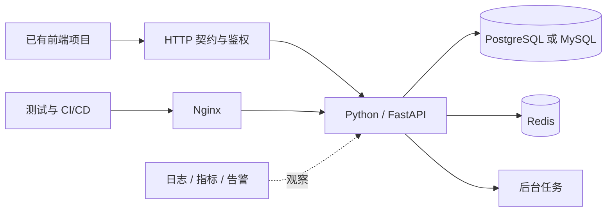

# Python学习路线路线

你已经会拆组件、管理状态、调用 HTTP API，也理解 TypeScript、包管理、测试与 CI；缺的不是另一轮入门，而是把这些工程经验迁移到后端：**让数据在并发、失败、权限边界和持续发布中仍然正确**。

这篇路线图不重复讲语法、SQL、Redis 命令或 Linux 配置。它负责回答三个问题：先学什么，做到什么程度才进入下一阶段，以及怎样把分散专题收束成一个可上线、可恢复的服务。最终作品是[团队知识库 API](/posts/python/python-backend-capstone)，前端直接接入你已有的项目。


:::important 全系列技术主线
数据库访问统一采用**同步 SQLAlchemy 2.x + Psycopg 3**，FastAPI 数据库路由使用普通 `def`；后续引入异步 Redis 或异步 HTTP 客户端时，不改变数据库栈，也不把同步 `Session` 跨线程传递。确需同时等待异步 I/O 时，把“创建 Session → 完成事务 → 关闭 Session”的整个同步工作单元明确隔离到线程池。
:::

<ProgressIndicator
  current="python/python-fullstack-roadmap"
  items={[
    { slug: "python/python-fullstack-roadmap", title: "Python 后端路线" },
    { slug: "python/python-complete-guide", title: "Python 核心" },
    { slug: "python/python-package-management", title: "包管理" },
    { slug: "python/python-type-system", title: "类型系统" },
    { slug: "python/python-testing", title: "pytest 测试" },
    { slug: "python/python-asyncio", title: "asyncio" },
    { slug: "python/fastapi-complete-guide", title: "FastAPI 基础" },
    { slug: "python/fastapi-sqlalchemy-alembic", title: "持久化与迁移" },
    { slug: "python/fastapi-authentication-authorization", title: "认证与授权" },
    { slug: "python/fastapi-redis-background-tasks", title: "缓存与任务" },
    { slug: "python/python-backend-integration-testing", title: "集成测试" },
    { slug: "python/python-backend-capstone", title: "综合实战" },
  ]}
/>
## 1. 先换一张后端能力地图

前端常以一次交互为边界，后端则要对**跨请求、跨进程、跨发布周期**的状态负责。同样是 `async/await`，浏览器侧多是在隐藏延迟；服务端还必须考虑连接池耗尽、事务未提交、超时传播、重复请求和进程崩溃。



把学习成果分为四层，会比“看完多少篇”更可靠：

1. **语言与工程层**：能写可类型检查、可测试、可安装的 Python 包。
2. **应用与数据层**：能定义稳定 API，在事务和权限边界内维护数据不变量。
3. **基础设施层**：会用缓存、任务、反向代理，但知道它们的失败方式。
4. **生产闭环层**：能发布、观测、回滚、恢复，并用演练证明这些能力。

建议每阶段都保留 `README`、命令输出、测试报告或演练记录作为证据。阅读不是验收，**可重复的结果才是验收**。

## 2. 总路线与分支选择

| 阶段 | 主要产物 | 建议投入 | 通过条件 |
| --- | --- | ---: | --- |
| 0. 建立后端基线 | 最小 API 与环境说明 | 0.5–1 天 | 陌生机器按 README 启动 |
| 1. Python 工程化 | 类型化领域包 | 1–2 周 | lint/type/test 一条命令通过 |
| 2. HTTP 与 FastAPI | 内存版知识库 API | 3–5 天 | 契约、错误与依赖边界清楚 |
| 3. SQL 与数据库 | 可解释的数据模型 | 1–2 周 | 事务正确，能读执行计划 |
| 4. 持久化与权限 | 带迁移和 RBAC 的 API | 1–2 周 | 越权测试与迁移回滚通过 |
| 5. Redis、任务与测试 | 可降级的集成系统 | 1–2 周 | 依赖故障不会静默破坏数据 |
| 6. 生产工程 | 可发布、可观测、可恢复服务 | 1–2 周 | 完成回滚与恢复演练 |
| 7. 综合实战 | 团队知识库 API | 1–2 周 | 逐项通过交付清单 |

时间只是节奏参考。你可以压缩熟悉内容，但不要跳过验收。

:::info PostgreSQL / MySQL 二选一
通用 SQL 四篇必须完成；数据库产品专题选择一条主线即可。新项目推荐 PostgreSQL；已有 MySQL 工作环境就选 MySQL。不要为了“全栈”同时维护两套方言、驱动与运维流程。另一条只需知道差异存在，等业务需要再补。
:::

## 3. 阶段 0：把前端经验翻译成后端问题

**目标**：建立最小开发闭环，并识别可以迁移与不能照搬的经验。

**前置**：能使用 Git、终端、HTTP 调试工具和任意前端项目。

先写一个契约，不急着写框架代码：

```http
POST /api/v1/articles
Authorization: Bearer <token>
Idempotency-Key: 8e39e9d6-17aa-4dc2-b979-e6ebcd82b313
Content-Type: application/json

{"title":"发布手册","body":"# Runbook"}
```

这一个请求已经引出后端的核心问题：token 属于谁、谁能创建、重复提交怎么办、写入是否在事务内、标题冲突如何表达、失败能否安全重试、日志是否会泄漏 token。

**练习**：创建空仓库，约定 `src/`、`tests/`、`.env.example`、`pyproject.toml` 和 `README.md`；README 只写可复制命令，不写“先配置好环境”之类隐含步骤。

**验收标准**：

- 新终端能创建虚拟环境、安装依赖并启动 `/health`。
- 配置来自环境变量，密钥不进入 Git。
- 能解释 4xx 与 5xx 的责任边界，以及为什么超时不等于请求一定未生效。

## 4. 阶段 1：Python 语言与工程化

**目标**：不是“会写 Python 语法”，而是能维护一个多人协作的 Python 包。

**前置**：阶段 0。TypeScript 经验有帮助，但不要假设 Python 类型注解会改变运行时语义。

按下面顺序学习：

1. [Python 系统教程](/posts/python/python-complete-guide)：重点关注可变对象、异常、迭代器、上下文管理器、装饰器与模块；已懂的控制流可快速通过练习。
2. [包管理与虚拟环境](/posts/python/python-package-management)：建立 `pyproject.toml`、隔离环境和锁文件意识。
3. [类型系统与 mypy](/posts/python/python-type-system)：理解 `Protocol`、可空值、类型收窄与静态检查边界。
4. [pytest 工程实践](/posts/python/python-testing)：让 fixture、参数化、mock 和覆盖率成为开发反馈。
5. [asyncio](/posts/python/python-asyncio)：理解协作式调度、取消、超时和“异步不等于更快”。

**练习**：写一个不依赖 Web 框架的 `knowledge_core` 包，包含 `Article`、`ArticleRepository` 协议和 `publish()` 用例。用内存仓储测试“不允许发布空正文”“已发布文章重复发布保持幂等”。

```python
from dataclasses import dataclass
from enum import StrEnum
from typing import Protocol

class Status(StrEnum):
    DRAFT = "draft"
    PUBLISHED = "published"

@dataclass
class Article:
    title: str
    body: str
    status: Status = Status.DRAFT

class ArticleRepository(Protocol):
    def save(self, article: Article) -> None: ...

def publish(article: Article, repo: ArticleRepository) -> Article:
    if not article.body.strip():
        raise ValueError("正文不能为空")
    article.status = Status.PUBLISHED
    repo.save(article)
    return article
```

这段代码用于验证分层心智模型；测试、异步和包配置请在对应专题中完成，不在路线图重复展开。

**验收标准**：

- `python -m pytest` 全绿，核心规则不启动数据库也能测试。
- mypy 对业务包无错误，边界处不滥用 `Any`。
- 能解释何时用同步函数、何时用协程，以及阻塞调用为何会卡住事件循环。
- 删除本地虚拟环境后，仍能依靠项目元数据与锁文件恢复一致环境。

## 5. 阶段 2：HTTP 契约与 FastAPI

**目标**：把领域用例暴露为稳定、可演进、可观测的 HTTP 接口。

**前置**：阶段 1；会从浏览器 Network 面板观察请求响应。

完成 [FastAPI 系统教程](/posts/python/fastapi-complete-guide)，把重点放在 Pydantic v2 输入输出模型、依赖注入、异常映射、生命周期与测试客户端。前端经验能帮助你设计消费体验，但**不要让页面组件结构决定数据库表结构**。

**练习**：为内存仓储增加 `POST /articles`、`GET /articles/{id}`、`POST /articles/{id}/publish`。定义统一错误体：

```json
{
  "error": {
    "code": "ARTICLE_NOT_FOUND",
    "message": "文章不存在",
    "request_id": "01J..."
  }
}
```

**验收标准**：

- OpenAPI 能准确表达请求、响应和 4xx；响应模型不会泄漏内部字段。
- 资源不存在、输入错误、状态冲突分别使用稳定错误码。
- 路由只做协议转换，用例不依赖 `Request` 或 ORM 模型。
- 至少有一个超时或取消实验，能说明客户端断开后服务端工作是否继续。

## 6. 阶段 3：SQL 与一个主数据库

**目标**：从“ORM 会生成 SQL”进阶到能维护数据不变量、理解执行代价。

**前置**：阶段 2；基本集合、布尔逻辑与数据建模能力。

先走完数据库中立的四篇主线：

1. [SQL 入门指南](/posts/sql/sql-beginner-guide)：查询、连接、聚合、事务和索引基础。
2. [基础业务练习](/posts/sql/sql-exercises)：把常见查询练成肌肉记忆。
3. [复杂业务练习](/posts/sql/sql-practice-lab)：CTE、窗口函数、对账与报表。
4. [执行计划与查询优化](/posts/sql/sql-advanced-performance)：学会用证据定位慢查询。

然后只选一条产品线：

- **PostgreSQL**：[PostgreSQL 深度实战](/posts/postgresql/postgresql-guide)，适合本项目默认技术栈。
- **MySQL**：先读 [MySQL 入门](/posts/mysql/mysql-beginner-guide) 与 [InnoDB、锁和高可用](/posts/mysql/mysql-advanced-guide)；出现性能问题时再读 [索引与 EXPLAIN](/posts/mysql/mysql-optimization-guide)。复制、分片不是毕业项目前置，确有容量或可用性需求再进入对应专题。

**练习**：为工作区、成员、文章和版本记录画 ER 图；手写 SQL 回答“某工作区最近发布的 20 篇文章及作者”“每位作者本月发布数”。为 `(workspace_id, status, published_at)` 设计联合索引并比较执行计划。

**验收标准**：

- 外键、唯一约束和事务共同保护不变量，而不是只靠前端校验。
- 能复现一次并发更新冲突，并选择悲观锁、乐观版本号或可交换操作。
- 能读懂目标数据库的执行计划，不以“加索引试试”代替分析。
- 能说明 chosen DB 的隔离级别、时间类型、JSON 与索引行为边界。

## 7. 阶段 4：ORM、迁移、认证与授权

**目标**：让模型变化可发布，让身份和权限在服务端强制执行。

**前置**：阶段 3；已经能手写并解释 ORM 最终执行的 SQL。

:::important 阶段 4 数据库实现约定
本系列数据库主线固定为**同步 SQLAlchemy 2.x + Psycopg 3**：使用同步 `Engine`、同步 `Session`，所有访问数据库的 FastAPI 路由都写成普通 `def`。不要在练习中替换为 `asyncpg`、`AsyncEngine` 或 `AsyncSession`，也不要把同步 `Session` 传入协程、线程或后台任务共享。
:::

依次完成：

- [FastAPI、SQLAlchemy 与 Alembic](/posts/python/fastapi-sqlalchemy-alembic)：会话生命周期、事务边界、关系加载与迁移流程。
- [FastAPI 认证与授权](/posts/python/fastapi-authentication-authorization)：密码存储、token 生命周期、RBAC/资源级授权与安全测试。

**练习**：把内存仓储换成 SQLAlchemy 仓储；增加 `workspace_members` 与角色；实现“viewer 只读已发布文章、editor 管理文章、owner 管理成员”。编写一次 `expand → migrate → contract` 的无停机字段改名方案，而不是直接删除旧列。

**验收标准**：

- 空数据库可执行全部 Alembic 迁移，已有数据库可前进升级；回滚边界有文档。
- 请求结束必定关闭会话，异常路径会回滚事务，不出现隐式跨请求会话。
- 未认证、无权限、资源不存在的行为经过测试，且不会通过错误差异泄漏资源存在性。
- token、密码和个人信息不会进入日志；密钥可轮换。

## 8. 阶段 5：Redis、后台任务与集成测试

**目标**：引入速度和异步能力，同时守住数据库这一事实源。

**前置**：阶段 4；先有可工作的无缓存同步版本。

这一阶段可以按专题使用 `redis.asyncio`、异步 HTTP 客户端并继续学习 `asyncio`，但这些异步 I/O 边界**不代表数据库层改走异步路线**：数据库访问仍保持同步 SQLAlchemy 2.x + Psycopg 3，数据库路由仍使用普通 `def`，不切换为 `asyncpg` 或 `AsyncSession`。若同一用例确需等待异步 I/O，应把完整的同步数据库工作单元隔离执行，不能跨线程共享请求中的 `Session`。

阅读 [Redis 核心概念](/posts/redis/redis-core-concepts) 与 [缓存实战](/posts/redis/redis-cache-in-depth)，再完成 [FastAPI Redis 与后台任务](/posts/python/fastapi-redis-background-tasks)。用 [Redis 练习题](/posts/redis/redis-exercises-with-answers) 验证数据结构、原子性和锁的边界，最后进入 [Python 后端集成测试](/posts/python/python-backend-integration-testing)。

**练习**：

- 对已发布文章详情使用 cache-aside；写入事务提交后删除缓存，TTL 作为最后防线。
- 发布文章后写 outbox，由 worker 更新搜索索引；任务携带幂等键并记录重试。
- 用真实 PostgreSQL/MySQL 与 Redis 容器测试事务、缓存失效和重复投递，不把所有依赖都 mock 掉。

**验收标准**：

- Redis 停机时读取可降级到数据库；系统不因缓存可用而改变授权结论。
- 任务至少投递一次时仍保持幂等；死信或最终失败可被观察和重放。
- 单元测试快且隔离，集成测试验证真实边界，端到端测试只覆盖关键旅程。
- 测试能证明未提交数据不触发外部副作用，缓存不会泄漏草稿或跨工作区数据。

## 9. 阶段 6：Nginx 与 Linux 生产闭环

**目标**：从“本机能跑”升级为可安全发布、观测、回滚和恢复。

**前置**：阶段 5；应用已经有健康检查、结构化日志和迁移命令。

先通过 [Nginx 完全指南](/posts/nginx/nginx-complete-guide) 理解反向代理、TLS、超时、请求体限制和真实客户端地址，再沿 [Linux 生产工程路线图](/posts/linux/linux-production-roadmap) 完成主机基础、可靠 CI/CD、可观测性、数据库运维、备份恢复、安全与事件响应。

不要把 Nginx 当成应用正确性的补丁：代理重试非幂等请求可能重复写入；增大超时可能只是把资源耗尽推迟；健康检查通过也不代表服务能完成用户请求。

**练习**：在一台非生产 Linux 主机或本地等价环境部署 API 与 worker；由 Nginx 终止 TLS/反代；制作不可变镜像；先迁移再滚动应用；注入 Redis 中断、数据库连接耗尽和一个坏版本。

**验收标准**：

- CI 依次执行静态检查、单元/集成测试、镜像构建与扫描，生产不现场编译源码。
- readiness 与 liveness 分离；日志含 request ID，指标能观察延迟、错误率、饱和度与任务积压。
- 能在约定时间回滚应用；数据库变更与旧版本兼容。
- 完成一次从备份恢复到隔离环境的演练，并验证数据而不只看命令退出码。

## 10. 阶段 7：用综合项目收口

**目标**：独立交付一个有数据、权限、异步副作用和生产运行闭环的后端，而不是继续扩展零散 Demo。

**前置**：阶段 1–6 的验收证据齐全；尤其要能从空库迁移、运行真实依赖集成测试，并解释缓存和任务失败时的行为。

**练习**：进入 [团队知识库 API 综合实战](/posts/python/python-backend-capstone) 后，不要按章节机械抄代码。先建立看板，再按“可演示纵切”迭代：

1. 健康检查与单篇文章读写。
2. 工作区、成员与权限。
3. 迁移、并发控制与审计。
4. 缓存、任务和附件边界。
5. 集成测试与故障注入。
6. 发布、观测、备份恢复与演练。

**验收标准**：每个里程碑都保持主分支可运行；功能完成的定义至少包括契约、迁移、授权、测试、日志/指标和运行手册，而不只是接口返回 200。最终还要由另一位开发者只按 README 启动系统，并按 runbook 完成一次回滚与恢复。

## 11. 常见绕路与纠偏

### 一上来同时学两种数据库

通用原理只学一次，产品行为在选定主库上做深。多数据库兼容会把精力消耗在方言、迁移和测试矩阵，而不是后端核心能力。

### 把 ORM 当作 SQL 的替代品

ORM 管理对象映射和会话，不会替你选择正确事务、索引或加载策略。任何慢接口都应能追到实际 SQL 和执行计划。

### 先加 Redis，再寻找问题

先测量数据库路径，再为明确的延迟或负载目标加缓存。缓存键必须包含租户与权限相关维度，敏感资源宁可不缓存。

### 用大量 mock 获得“全绿”

mock 适合隔离业务规则，但无法证明驱动、事务、迁移、Redis Lua 或代理配置正确。真实基础设施边界需要容器化集成测试。

### 把部署成功当成生产就绪

一次成功发布不能证明可回滚、可恢复。必须主动演练失败，记录检测时间、恢复步骤和改进项。

## 12. 最终验收：你是否已经能独立负责一个后端

完成路线时，你应能拿出以下证据：

- 一份版本化 OpenAPI 契约，错误码、分页、幂等与认证方式明确。
- 一组保护领域规则、权限矩阵和关键基础设施边界的自动化测试。
- 可从空库执行的迁移历史，以及至少一次兼容发布记录。
- 一份带执行计划的慢查询分析和索引取舍说明。
- Redis 不可用、任务重复、数据库超时场景的降级或恢复证据。
- 一个不可变部署制品、可靠流水线、仪表盘和可执行告警。
- 一次真实恢复演练与一次故障复盘。

如果其中某项答不上来，就回到对应阶段补证据，而不是继续收藏下一门框架。后端进阶的终点不是“工具都用过”，而是**能对系统在正常与异常状态下的行为作出可验证承诺**。