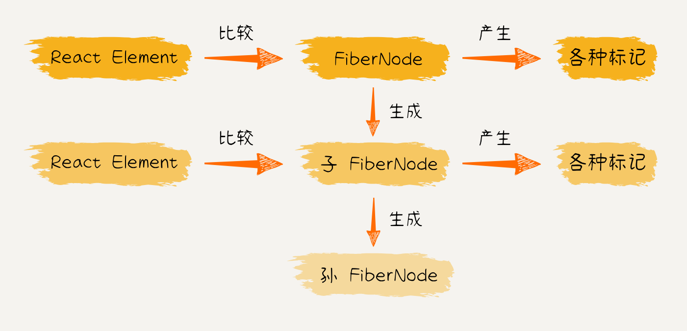
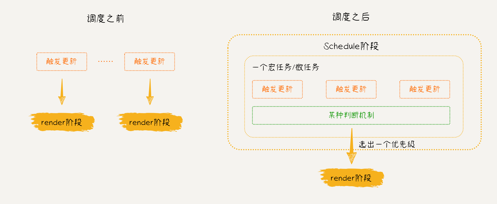
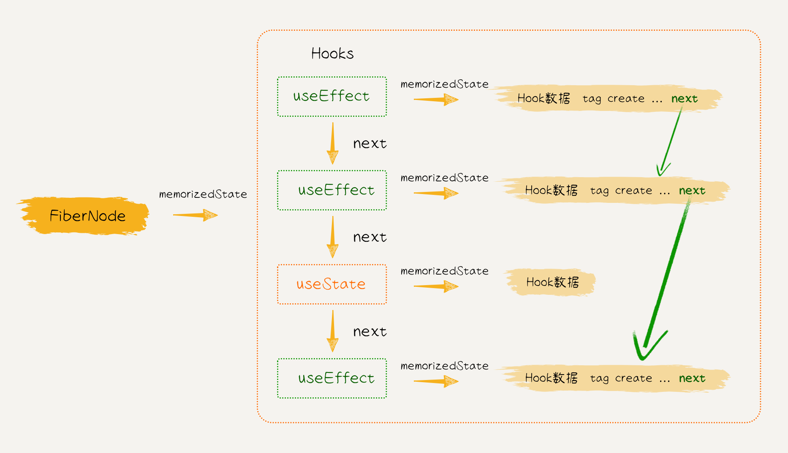

# React 源码手写实战总览：从 JSX 到 Reconciler 再到 Hooks

这篇文章是对 **《手写 React 源码》** 系列内容的系统化汇总，目标不是逐行抄代码，而是把 16 章内容串成一条完整的技术链路，让你能看清：

- React 如何从 JSX 变成 Fiber 树
- Fiber 树如何进入 Render 和 Commit
- 更新、Diff、事件、Hooks、调度如何协同

如果你之前学 React 只停留在 API 层，这篇文章可以帮你补上"底层发生了什么"。

---


---

## 一、先搭好地基：工程化与包结构

系列一开始没有急着写 `useState`，而是先做工程基础，这个顺序非常对。

核心做法：

1. 使用 `pnpm workspace` 搭建 Mono-repo
2. 约束代码规范（ESLint + Prettier）
3. 约束提交规范（Husky + Commitlint）
4. 用 TypeScript 统一类型与路径别名
5. 用 Rollup 做库打包

为什么这一步重要？

- 因为 React 本身就是多包协作（`react`、`react-dom`、`react-reconciler`、`shared`）
- 没有清晰的包边界，后面实现会很快失控

这也对应了真实框架开发的第一原则：

> 先搭可演进的工程骨架，再堆功能。


::: details 查看 Mono-repo 目录结构
```
my-react/
├── packages/
│   ├── react/              # 核心 API：createElement、jsx
│   ├── react-dom/          # 浏览器宿主环境
│   ├── react-reconciler/   # 协调器（核心逻辑）
│   ├── shared/             # 公共类型与工具
│   └── scheduler/          # 调度器
├── scripts/
│   ├── rollup/             # 打包脚本
│   └── vite/               # 开发调试配置
├── pnpm-workspace.yaml
├── tsconfig.json
└── package.json
```
:::

::: details 查看 ESLint 配置
```json
{
  "env": {
    "browser": true,
    "es2021": true,
    "node": true,
    "jest": true
  },
  "extends": [
    "eslint:recommended",
    "plugin:@typescript-eslint/recommended",
    "prettier",
    "plugin:prettier/recommended"
  ],
  "parser": "@typescript-eslint/parser",
  "parserOptions": {
    "ecmaVersion": "latest",
    "sourceType": "module"
  },
  "plugins": ["@typescript-eslint", "prettier"],
  "rules": {
    "prettier/prettier": "error",
    "no-case-declarations": "off",
    "no-constant-condition": "off",
    "@typescript-eslint/ban-ts-comment": "off",
    "@typescript-eslint/no-unused-vars": "off"
  }
}
```
:::

::: details 查看 Rollup 打包配置
```javascript
// scripts/rollup/react.config.js
import { getPackageJSON, resolvePkgPath, getBaseRollupPlugins } from './utils';
import generatePackageJson from 'rollup-plugin-generate-package-json';

const { name, module } = getPackageJSON('react');
const pkgPath = resolvePkgPath(name);
const pkgDistPath = resolvePkgPath(name, true);

export default [
  // react/index.js
  {
    input: `${pkgPath}/${module}`,
    output: {
      file: `${pkgDistPath}/index.js`,
      name: 'React',
      format: 'umd'
    },
    plugins: [
      ...getBaseRollupPlugins(),
      generatePackageJson({
        inputFolder: pkgPath,
        outputFolder: pkgDistPath,
        baseContents: ({ name, description, version }) => ({
          name, description, version, main: 'index.js'
        })
      })
    ]
  },
  // jsx-runtime + jsx-dev-runtime
  {
    input: `${pkgPath}/src/jsx.ts`,
    output: [
      { file: `${pkgDistPath}/jsx-runtime.js`, name: 'jsx-runtime', format: 'umd' },
      { file: `${pkgDistPath}/jsx-dev-runtime.js`, name: 'jsx-dev-runtime', format: 'umd' }
    ],
    plugins: getBaseRollupPlugins()
  }
];
```
:::

---

## 二、入口：JSX 只是语法糖，核心是 ReactElement

这条主线主要做了三件事：

1. 实现 `jsx` / `jsxDEV`
2. 实现 `React.createElement`
3. 定义统一 `ReactElement` 数据结构

关键认知：

- JSX 在编译后会变成 `jsx(...)` 或 `createElement(...)`
- 运行时真正流动的是 `ReactElement` 对象
- `$$typeof` 用于标识元素类型（普通元素、Fragment 等）

换句话说，React 的第一层抽象不是 DOM，而是 `ReactElement`。

::: details 查看 JSX 编译前后对比
```javascript
// JSX 源代码
function App() {
  return <h1>Hello World</h1>;
}

// React 17 之前编译结果
function App() {
  return React.createElement('div', null, 'Hello world!');
}

// React 17 之后编译结果
import { jsx as _jsx } from 'react/jsx-runtime';
function App() {
  return _jsx('div', { children: 'Hello world!' });
}
```
:::

::: details 查看 ReactElement 数据结构实现
```typescript
// packages/react/src/jsx.ts
import { REACT_ELEMENT_TYPE } from 'shared/ReactSymbols';
import { Type, Ref, Key, Props, ReactElementType, ElementType } from 'shared/ReactTypes';

const ReactElement = function (type: Type, key: Key, ref: Ref, props: Props): ReactElementType {
  const element = {
    $$typeof: REACT_ELEMENT_TYPE,
    type,
    key,
    ref,
    props,
    __mark: 'erxiao'
  };
  return element;
};
```
:::

::: details 查看 jsx 方法完整实现
```typescript
// packages/react/src/jsx.ts
export const jsx = (type: ElementType, config: any, ...children: any) => {
  let key: Key = null;
  let ref: Ref = null;
  const props: Props = {};

  for (const prop in config) {
    const val = config[prop];
    if (prop === 'key') {
      if (val !== undefined) key = '' + val;
      continue;
    }
    if (prop === 'ref') {
      if (val !== undefined) ref = val;
      continue;
    }
    if ({}.hasOwnProperty.call(config, prop)) {
      props[prop] = val;
    }
  }

  const childrenLength = children.length;
  if (childrenLength) {
    if (childrenLength === 1) {
      props.children = children[0];
    } else {
      props.children = children;
    }
  }

  return ReactElement(type, key, ref, props);
};

// jsxDEV 与 jsx 的区别是不处理 children 参数
export const jsxDEV = (type: ElementType, config: any) => {
  let key: Key = null;
  let ref: Ref = null;
  const props: Props = {};

  for (const prop in config) {
    const val = config[prop];
    if (prop === 'key') {
      if (val !== undefined) key = '' + val;
      continue;
    }
    if (prop === 'ref') {
      if (val !== undefined) ref = val;
      continue;
    }
    if ({}.hasOwnProperty.call(config, prop)) {
      props[prop] = val;
    }
  }

  return ReactElement(type, key, ref, props);
};
```
:::

::: details 查看 shared 包中的类型定义
```typescript
// packages/shared/ReactSymbols.ts
const supportSymbol = typeof Symbol === 'function' && Symbol.for;
export const REACT_ELEMENT_TYPE = supportSymbol
  ? Symbol.for('react.element')
  : 0xeac7;

// packages/shared/ReactTypes.ts
export type Type = any;
export type Key = any;
export type Props = any;
export type Ref = any;
export type ElementType = any;

export interface ReactElementType {
  $$typeof: symbol | number;
  key: Key;
  props: Props;
  ref: Ref;
  type: ElementType;
  __mark: string;
}
```
:::

---

## 三、核心：Reconciler + Fiber = React 的引擎

这一部分是全系列最关键的内容。Reconciler 的中文名叫协调器，它负责处理 React 元素的更新并在内部构建虚拟 DOM。

### 1. FiberNode 的本质

每个 Fiber 节点至少包含：

- 树结构关系：`return`、`child`、`sibling`
- 组件信息：`type`、`pendingProps`、`memoizedState`
- 更新控制：`flags`、`subtreeFlags`
- 双缓冲关系：`alternate`

这让 React 可以同时维护：

- `current`（屏幕上正在显示的树）
- `workInProgress`（本轮正在计算的树）

::: details 查看 FiberNode 完整实现
```typescript
// packages/react-reconciler/src/fiber.ts
import { Props, Key, Ref } from 'shared/ReactTypes';
import { WorkTag } from './workTags';
import { NoFlags, Flags } from './fiberFlags';

export class FiberNode {
  tag: WorkTag;
  key: Key;
  stateNode: any;
  type: any;
  return: FiberNode | null;
  sibling: FiberNode | null;
  child: FiberNode | null;
  index: number;
  ref: Ref;
  pendingProps: Props;
  memoizedProps: Props | null;
  memoizedState: any;
  alternate: FiberNode | null;
  flags: Flags;
  subtreeFlags: Flags;
  updateQueue: unknown;

  constructor(tag: WorkTag, pendingProps: Props, key: Key) {
    // 类型
    this.tag = tag;
    this.key = key;
    this.ref = null;
    this.stateNode = null;
    this.type = null;

    // 构成树状结构
    this.return = null;
    this.sibling = null;
    this.child = null;
    this.index = 0;

    // 作为工作单元
    this.pendingProps = pendingProps;
    this.memoizedProps = null;
    this.memoizedState = null;

    this.alternate = null;
    this.flags = NoFlags;
    this.subtreeFlags = NoFlags;
    this.updateQueue = null;
  }
}
```
:::

::: details 查看 WorkTag 与 Flags 定义
```typescript
// packages/react-reconciler/src/workTags.ts
export type WorkTag =
  | typeof FunctionComponent
  | typeof HostRoot
  | typeof HostComponent
  | typeof HostText;

export const FunctionComponent = 0;
export const HostRoot = 3;
export const HostComponent = 5;
export const HostText = 6;

// packages/react-reconciler/src/fiberFlags.ts
export type Flags = number;

export const NoFlags = 0b0000000;
export const PerformedWork = 0b0000001;
export const Placement = 0b0000010;
export const Update = 0b0000100;
export const ChildDeletion = 0b0001000;
```
:::

### 2. Render 阶段做什么

Render 阶段本质上是一次 DFS：

- 向下：`beginWork`（比较、计算、创建/复用子 Fiber）
- 向上：`completeWork`（收集 flags、生成宿主更新计划）

::: details 查看 workLoop 工作循环实现
```typescript
// packages/react-reconciler/src/workLoop.ts
import { FiberNode } from './fiber';

let workInProgress: FiberNode | null = null;

function renderRoot(root: FiberNode) {
  prepareFreshStack(root);
  try {
    workLoop();
  } catch (e) {
    console.warn('workLoop发生错误：', e);
    workInProgress = null;
  }
}

function prepareFreshStack(root: FiberNode) {
  workInProgress = root;
}

// 深度优先遍历，向下递归子节点
function workLoop() {
  while (workInProgress !== null) {
    performUnitOfWork(workInProgress);
  }
}

function performUnitOfWork(fiber: FiberNode) {
  const next = beginWork(fiber);
  fiber.memoizedProps = fiber.pendingProps;

  if (next == null) {
    completeUnitOfWork(fiber);
  } else {
    workInProgress = next;
  }
}

// 深度优先遍历兄弟节点或父节点
function completeUnitOfWork(fiber: FiberNode) {
  let node: FiberNode | null = fiber;
  do {
    completeWork(node);
    const sibling = node.sibling;
    if (sibling !== null) {
      workInProgress = sibling;
      return;
    }
    node = node.return;
    workInProgress = node;
  } while (node !== null);
}
```
:::

::: details 查看 beginWork 中处理 FunctionComponent
```typescript
// packages/react-reconciler/src/beginWork.ts
export const beginWork = (workInProgress: FiberNode) => {
  switch (workInProgress.tag) {
    case HostRoot:
      return updateHostRoot(workInProgress);
    case HostComponent:
      return updateHostComponent(workInProgress);
    case FunctionComponent:
      return updateFunctionComponent(workInProgress);
    case HostText:
      return updateHostText();
    default:
      if (__DEV__) {
        console.warn('beginWork 未实现的类型', workInProgress.tag);
      }
      break;
  }
};

function updateFunctionComponent(workInProgress: FiberNode) {
  const nextChildren = renderWithHooks(workInProgress);
  reconcileChildren(workInProgress, nextChildren);
  return workInProgress.child;
}
```
:::

### 3. Commit 阶段做什么

Commit 阶段把更新计划落到宿主环境：

- 插入（Placement）
- 更新（Update）
- 删除（ChildDeletion）

而且它不是"整树重建"，而是按 flags 精确执行。

---



---

## 四、更新机制：UpdateQueue、Lane 与批处理

### 1. UpdateQueue

状态更新不是立即执行，而是先进队列。这个队列最终改造成环状链表，支持：

- 多次更新合并
- 顺序消费
- 按优先级过滤

### 2. Lane 模型

每个更新带一个 Lane（优先级位），根节点维护 `pendingLanes`。

调度时流程大概是：

1. 取最高优先级 Lane
2. 同步任务进微任务队列
3. 执行 Render + Commit
4. 从根节点移除已完成 Lane

这就是"多次 setState 不一定多次渲染"的底层原因之一。

::: details 查看 Update 与 UpdateQueue 数据结构
```typescript
// packages/react-reconciler/src/updateQueue.ts
import { Action } from 'shared/ReactTypes';

export interface Update<State> {
  action: Action<State>;
}

export interface UpdateQueue<State> {
  shared: {
    pending: Update<State> | null;
  };
  dispatch: (action: Action<State>) => void | null;
}

export const createUpdate = <State>(action: Action<State>): Update<State> => {
  return { action };
};

export const createUpdateQueue = <State>(): UpdateQueue<State> => {
  return {
    shared: { pending: null },
    dispatch: null
  };
};

export const enqueueUpdate = <State>(
  updateQueue: UpdateQueue<State>,
  update: Update<State>
) => {
  updateQueue.shared.pending = update;
};

// 环状链表处理
export const processUpdateQueue = <State>(
  baseState: State,
  updateQueue: UpdateQueue<State>
): { memoizedState: State } => {
  let update = updateQueue.shared.pending;
  let memoizedState = baseState;

  while (update !== null) {
    if (typeof update.action === 'function') {
      memoizedState = update.action(memoizedState);
    } else {
      memoizedState = update.action;
    }
    update = update.next;
  }

  return { memoizedState };
};
```
:::

---



---

## 五、Diff 算法：复用、插入、删除、移动

系列把 Diff 从简单到复杂分三层实现：

1. 单节点 Diff
2. 多节点 Diff（含 key）
3. Fragment 与数组嵌套场景

核心策略：

- 同层比较，不跨层
- `key + type` 决定可复用性
- 多节点用 Map 加速匹配
- 通过 `Placement` 区分"新插入"与"需要移动"

这正是 React 列表渲染中"为什么 key 如此重要"的底层答案。

::: details 查看单节点 Diff 实现
```typescript
// packages/react-reconciler/src/childFiber.ts
function reconcileSingleElement(
  returnFiber: FiberNode,
  currentFiber: FiberNode | null,
  element: ReactElementType
) {
  while (currentFiber !== null) {
    if (currentFiber.key === element.key) {
      if (element.$$typeof === REACT_ELEMENT_TYPE) {
        if (currentFiber.type === element.type) {
          // key 和 type 都相同，复用旧的 Fiber 节点
          const existing = useFiber(currentFiber, element.props);
          existing.return = returnFiber;
          // 剩下的兄弟节点标记删除
          deleteRemainingChildren(returnFiber, currentFiber.sibling);
          return existing;
        }
        // key 相同，但 type 不同，删除所有旧的 Fiber 节点
        deleteRemainingChildren(returnFiber, currentFiber);
        break;
      }
    } else {
      // key 不同，删除当前旧的 Fiber 节点，继续遍历兄弟节点
      deleteChild(returnFiber, currentFiber);
      currentFiber = currentFiber.sibling;
    }
  }
  const fiber = createFiberFromElement(element);
  fiber.return = returnFiber;
  return fiber;
}
```
:::

::: details 查看多节点 Diff 核心逻辑
```typescript
// packages/react-reconciler/src/childFiber.ts
function reconcileChildrenArray(
  returnFiber: FiberNode,
  currentFirstChild: FiberNode | null,
  newChild: any[]
) {
  let lastPlacedIndex: number = 0;
  let firstNewFiber: FiberNode | null = null;
  let lastNewFiber: FiberNode | null = null;

  // 1. 保存同级节点信息到 Map
  const existingChildren: ExistingChildren = new Map();
  let current = currentFirstChild;
  while (current !== null) {
    const keyToUse = current.key !== null ? current.key : current.index.toString();
    existingChildren.set(keyToUse, current);
    current = current.sibling;
  }

  // 2. 遍历新节点数组，判断是否可复用
  for (let i = 0; i < newChild.length; i++) {
    const after = newChild[i];
    const newFiber = updateFromMap(returnFiber, existingChildren, i, after);

    if (newFiber == null) continue;

    // 3. 标记插入或移动操作
    newFiber.index = i;
    newFiber.return = returnFiber;

    if (lastNewFiber == null) {
      lastNewFiber = newFiber;
      firstNewFiber = newFiber;
    } else {
      lastNewFiber.sibling = newFiber;
      lastNewFiber = lastNewFiber.sibling;
    }

    if (!shouldTrackSideEffects) continue;

    const current = newFiber.alternate;
    if (current !== null) {
      const oldIndex = current.index;
      if (oldIndex < lastPlacedIndex) {
        // 标记移动
        newFiber.flags |= Placement;
        continue;
      } else {
        lastPlacedIndex = oldIndex;
      }
    } else {
      // 首屏渲染阶段，标记插入
      newFiber.flags |= Placement;
    }
  }

  // 4. 标记删除操作
  existingChildren.forEach((fiber) => {
    deleteChild(returnFiber, fiber);
  });

  return firstNewFiber;
}
```
:::

::: details 查看 Diff 中的节点复用逻辑
```typescript
// packages/react-reconciler/src/childFiber.ts
function updateFromMap(
  returnFiber: FiberNode,
  existingChildren: ExistingChildren,
  index: number,
  element: any
): FiberNode | null {
  const keyToUse = element.key !== null ? element.key : index.toString();
  const before = existingChildren.get(keyToUse);

  // HostText（文本节点）
  if (typeof element === 'string' || typeof element === 'number') {
    if (before && before.tag === HostText) {
      existingChildren.delete(keyToUse);
      return useFiber(before, { content: element + '' });
    }
    return new FiberNode(HostText, { content: element + '' }, null);
  }

  // HostComponent（普通 DOM 节点）
  if (typeof element === 'object' && element !== null) {
    switch (element.$$typeof) {
      case REACT_ELEMENT_TYPE:
        if (before && before.type === element.type) {
          existingChildren.delete(keyToUse);
          return useFiber(before, element.props);
        }
        return createFiberFromElement(element);
      default:
        break;
    }
  }

  return null;
}
```
:::

---

## 六、事件系统：从原生事件到合成事件

系列实现了一个简化版事件系统，核心思路包括：

1. 在根容器做事件委托
2. 在 DOM 节点缓存 props（保存回调）
3. 触发时收集 capture/bubble 路径
4. 构造 SyntheticEvent
5. 按捕获和冒泡顺序执行回调

这样做的价值是：

- 统一事件处理模型
- 屏蔽部分浏览器差异
- 和 Fiber 更新流程对接更自然

::: details 查看事件委托核心原理
```typescript
// 事件委托：在根容器上监听所有事件
// 当事件触发时，通过 Fiber 树找到对应的组件节点
const ReactDOM = {
  createRoot(container: Container) {
    const root = createContainer(container);
    // 在根容器上注册所有事件
    return {
      render(element: ReactElementType) {
        updateContainer(element, root, null);
      }
    };
  }
};

// 事件触发时的处理流程
function handleEvent(e: Event) {
  // 1. 获取触发事件的 DOM 节点
  const targetDOM = e.target;

  // 2. 从 DOM 节点上获取对应的 Fiber 节点
  const fiber = getClosestInstanceFromNode(targetDOM);

  // 3. 收集捕获和冒泡路径
  const { capture, bubble } = collectPaths(fiber);

  // 4. 构造 SyntheticEvent
  const syntheticEvent = createSyntheticEvent(e);

  // 5. 按顺序执行回调
  triggerCallbacks(capture, syntheticEvent);
  triggerCallbacks(bubble, syntheticEvent);
}
```
:::

---

## 七、Hooks：useState 与 useEffect 的关键机制

### 1. useState

核心不是"返回数组"，而是两条链路：

- Fiber 上的 Hooks 链表
- 每个 Hook 上的 UpdateQueue

mount 和 update 阶段通过不同 Dispatcher 分发到不同实现：

- `mountState`
- `updateState`

这也是为什么 Hooks 必须按固定顺序调用。

::: details 查看 useState 的 Dispatcher 机制
```typescript
// packages/react/src/currentDispatcher.ts
export interface Dispatcher {
  useState: <S>(initialState: (() => S) | S) => [S, Dispatch<S>];
}

const currentDispatcher: { current: Dispatcher | null } = {
  current: null
};

export const resolveDispatcher = (): Dispatcher => {
  const dispatcher = currentDispatcher.current;
  if (dispatcher == null) {
    throw new Error('Hooks 只能在函数组件中执行');
  }
  return dispatcher;
};
```
:::

::: details 查看 mountState 实现
```typescript
// packages/react-reconciler/src/fiberHooks.ts
function mountState<State>(
  initialState: (() => State) | State
): [State, Dispatch<State>] {
  const hook = mountWorkInProgressHook();

  let memoizedState;
  if (initialState instanceof Function) {
    memoizedState = initialState();
  } else {
    memoizedState = initialState;
  }
  hook.memoizedState = memoizedState;

  const queue = createUpdateQueue<State>();
  hook.queue = queue;

  const dispatch = dispatchSetState.bind(null, currentlyRenderingFiber, queue);
  queue.dispatch = dispatch;

  return [memoizedState, dispatch];
}

function mountWorkInProgressHook(): Hook {
  const hook: Hook = {
    memoizedState: null,
    queue: null,
    next: null
  };

  if (workInProgressHook == null) {
    if (currentlyRenderingFiber !== null) {
      workInProgressHook = hook;
      currentlyRenderingFiber.memoizedState = workInProgressHook;
    } else {
      throw new Error('Hooks 只能在函数组件中执行');
    }
  } else {
    workInProgressHook.next = hook;
    workInProgressHook = hook;
  }

  return workInProgressHook;
}
```
:::

::: details 查看 Hooks 链表与 Fiber 的关系
```typescript
// Hook 数据结构
export interface Hook {
  memoizedState: any;  // 保存 Hook 的数据
  queue: any;          // UpdateQueue
  next: Hook | null;   // 下一个 Hook
}

// FiberNode.memoizedState -> Hook 链表
// Hook.memoizedState -> Hook 数据
//
// 关系图：
// Fiber.memoizedState -> Hook1 -> Hook2 -> Hook3 -> ...
//                   (useState) (useState) (useEffect)
```
:::

### 2. useEffect

`useEffect` 的难点在执行时机，不在 API 形态。

系列实现了：

- Effect 数据结构
- 依赖比较
- destroy/create 的收集与执行
- 在 Commit 后异步调度副作用

执行顺序上体现了真实 React 的关键语义：

- 先清理旧 effect，再执行新 effect
- 卸载时执行对应 destroy

::: details 查看 Effect 数据结构
```typescript
// packages/react-reconciler/src/fiberHooks.ts
export interface Effect {
  tag: EffectTags;
  create: EffectCallback | void;
  destroy: EffectCallback | void;
  deps: EffectDeps;
  next: Effect | null;
}

// packages/react-reconciler/src/hookEffectTags.ts
export type EffectTags = number;

export const HookHasEffect = 0b0001;  // 本次更新需要触发回调
export const Passive = 0b0010;        // useEffect 类型
export const Layout = 0b0100;         // useLayoutEffect 类型
```
:::

::: details 查看 useEffect 执行流程
```typescript
// packages/react-reconciler/src/workLoop.ts
function flushPassiveEffects(pendingPassiveEffects: PendingPassiveEffects) {
  // 1. 先触发所有 unmount destroy
  pendingPassiveEffects.unmount.forEach((effect) => {
    commitHookEffectListUnmount(Passive, effect);
  });
  pendingPassiveEffects.unmount = [];

  // 2. 再触发所有上次更新的 destroy
  pendingPassiveEffects.update.forEach((effect) => {
    commitHookEffectListDestory(Passive | HookHasEffect, effect);
  });

  // 3. 再触发所有这次更新的 create
  pendingPassiveEffects.update.forEach((effect) => {
    commitHookEffectListCreate(Passive | HookHasEffect, effect);
  });
  pendingPassiveEffects.update = [];

  // 4. 执行 useEffect 过程中可能触发新的更新
  flushSyncCallback();
}
```
:::

::: details 查看 useEffect 副作用收集
```typescript
// packages/react-reconciler/src/commitWork.ts
const commitPassiveEffect = (
  fiber: FiberNode,
  root: FiberRootNode,
  type: keyof PendingPassiveEffects
) => {
  if (
    fiber.tag !== FunctionComponent ||
    (type == 'update' && (fiber.flags & PassiveEffect) == NoFlags)
  ) {
    return;
  }
  const updateQueue = fiber.updateQueue as FCUpdateQueue<any>;
  if (updateQueue !== null) {
    root.pendingPassiveEffects[type].push(updateQueue.lastEffect as Effect);
  }
};
```
:::

---



---

## 八、ReactDOM 与 Noop Renderer：同一套 reconciler，多个宿主环境

这个系列非常有价值的一点是：不仅实现了 `react-dom`，还实现了 `react-noop-renderer`。

这说明了 React 架构最重要的分层思想：

- `react-reconciler` 负责"算什么更新"
- `hostConfig` 负责"怎么落地更新"

浏览器环境用 DOM API，Noop 环境用内存对象模拟节点。

这就是 React 能跨平台（Web / Native / Custom Renderer）的架构基础。

::: details 查看 hostConfig 抽象层
```typescript
// packages/react-dom/src/hostConfig.ts（浏览器环境）
export const createInstance = (type: string, props: any): Instance => {
  return document.createElement(type);
};

export const appendChildToContainer = (
  child: Instance,
  container: Container
) => {
  container.appendChild(child);
};

// packages/react-noop-renderer/src/hostConfig.ts（调试环境）
export const createInstance = (type: string, props: any): Instance => {
  return { type, props, children: [] };
};

export const appendChildToContainer = (
  child: Instance,
  container: Container
) => {
  container.children.push(child);
};
```
:::

::: details 查看 Vite 开发调试配置
```javascript
// scripts/vite/vite.config.js
import { defineConfig } from 'vite';
import react from '@vitejs/plugin-react';
import replace from '@rollup/plugin-replace';
import { resolvePkgPath } from '../rollup/utils';

export default defineConfig({
  plugins: [react(), replace({ __DEV__: true, preventAssignment: true })],
  resolve: {
    alias: [
      { find: 'react', replacement: resolvePkgPath('react') },
      { find: 'react-dom', replacement: resolvePkgPath('react-dom') },
      {
        find: 'hostConfig',
        replacement: path.resolve(resolvePkgPath('react-dom'), './src/hostConfig.ts')
      }
    ]
  }
});
```
:::

---

## 九、你可以直接带走的学习路径

如果你准备真正啃 React 源码，建议按这个顺序：

1. ReactElement 与 JSX Runtime
2. FiberNode 与双缓冲
3. beginWork / completeWork
4. commit 阶段与 flags
5. 单节点 Diff -> 多节点 Diff -> Fragment
6. useState（Hook 链表 + UpdateQueue）
7. useEffect（effect 链表 + 调度）
8. 调度优先级（Lane）
9. 事件系统与宿主环境适配

这样你对 React 的理解会从"会用"升级到"能解释、能定位、能设计"。

---

## 总结

这套手写 React 的路线，本质是在搭一套"迷你版 React 18 核心链路"：

- 输入：JSX / ReactElement
- 计算：Reconciler(Fiber)
- 输出：Host Renderer(DOM / Noop)
- 增强：Diff / Hooks / 调度 / 事件

当你把这四层连起来，你就不再只是在调用 React API，而是已经开始用框架作者的视角看 React。

---

## 参考地址

- 原站总目录：`https://cccdk.github.io/my-react/`
- 原站首页：`https://cccdk.github.io/my-react/`
- 分章节（1-16）：
  - `https://cccdk.github.io/my-react/1.html`
  - `https://cccdk.github.io/my-react/2.html`
  - `https://cccdk.github.io/my-react/3.html`
  - `https://cccdk.github.io/my-react/4.html`
  - `https://cccdk.github.io/my-react/5.html`
  - `https://cccdk.github.io/my-react/6.html`
  - `https://cccdk.github.io/my-react/7.html`
  - `https://cccdk.github.io/my-react/8.html`
  - `https://cccdk.github.io/my-react/9.html`
  - `https://cccdk.github.io/my-react/10.html`
  - `https://cccdk.github.io/my-react/11.html`
  - `https://cccdk.github.io/my-react/12.html`
  - `https://cccdk.github.io/my-react/13.html`
  - `https://cccdk.github.io/my-react/14.html`
  - `https://cccdk.github.io/my-react/15.html`
  - `https://cccdk.github.io/my-react/16.html`
- GitHub 仓库：`https://github.com/CCCdk/CCCdk.github.io`
