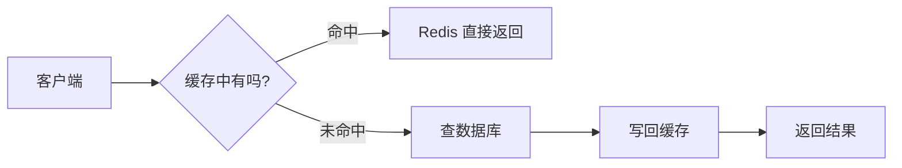
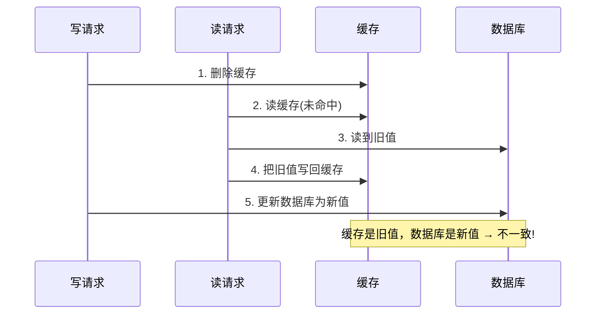
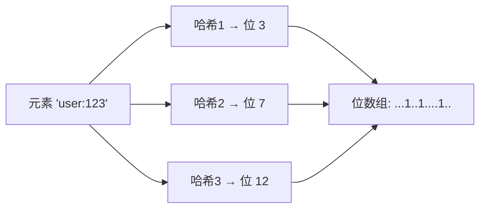
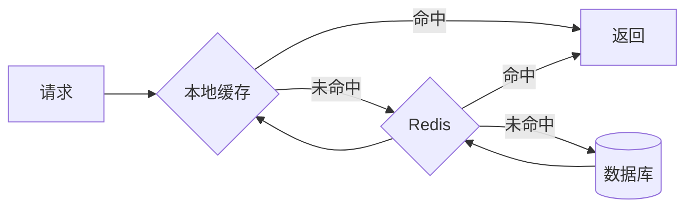

# Redis 缓存实战：从读写模式到一致性与三大问题

几乎每个后端开发都会用 Redis 做缓存，但真正把缓存用对、用稳的人并不多。原因在于——缓存看起来简单（"不就是先查 Redis 吗"），但它引入了一个绕不开的难题：

> 同一份数据现在存在了**两个地方**（数据库和缓存），怎么保证它们不打架？

这篇文章就沿着这条主线，从"为什么要缓存"讲到"怎么把缓存用稳"。我们会依次讲清楚：缓存的读写模式、一致性问题、三大经典事故、以及多级缓存和热点 key，最后用一段可运行的代码把知识点串起来。

:::note
阅读本文最好先了解 Redis 的基本数据结构和命令，可以先看[《Redis 核心概念与数据结构》](/posts/redis/redis-core-concepts)。本文示例命令以 Redis 6/7 为参考。
:::

---

## 一、缓存到底解决什么问题

先想清楚"为什么用"，比急着学"怎么用"更重要。

数据库（尤其是关系型数据库）的数据存在磁盘上，虽然有自己的缓冲，但在高并发读的场景下，它的性能是有上限的。当每秒有成千上万次读请求打过来时，数据库很容易被拖垮。

缓存的思路很直接：**在数据库前面放一层内存存储（Redis），把热点数据放进去。大部分读请求直接从内存返回，只有少部分需要真正查数据库。**



:::important
缓存的本质是一种**取舍**：用"数据可能短暂不是最新"的风险，换取"读性能大幅提升"。所以缓存天然适合**读多写少、且能容忍短暂不一致**的数据（商品详情、用户资料、配置）；而对**强一致要求**的数据（账户余额、库存扣减的最终结果）要格外谨慎。
:::

---

## 二、缓存的四种读写模式

初学者往往只知道一种缓存用法，其实业界有四种成型的模式。理解它们的区别，你才能在不同场景下选对方案。

### 1. Cache Aside（旁路缓存）—— 最常用

应用代码自己负责协调缓存和数据库，缓存"在一旁"辅助。这是 90% 场景的默认选择。

**读流程：**
1. 先查缓存，命中就直接返回。
2. 未命中，查数据库。
3. 把查到的结果写回缓存，再返回。

**写流程：**
1. 先更新数据库。
2. 再**删除**缓存（注意是删除，不是更新，原因下一章讲）。

### 2. Read Through（读穿透）

应用只跟缓存打交道，缓存未命中时**由缓存层自己去查数据库并回填**，应用感知不到数据库的存在。

和 Cache Aside 的区别：Cache Aside 是应用代码手动回填，Read Through 是缓存组件封装了这个逻辑。需要专门的缓存中间件支持。

### 3. Write Through（写穿透）

写数据时，应用只写缓存，**由缓存层同步地把数据写到数据库**。缓存和数据库总是同步更新。

优点是一致性好，缺点是每次写都要等数据库，写性能受影响。

### 4. Write Behind / Write Back（异步回写）

写数据时只写缓存就立即返回，**缓存层异步、批量地把数据刷到数据库**。

写性能极高，但风险也大：如果缓存在刷库前宕机，数据会丢。适合能容忍少量数据丢失、写入量极大的场景（比如计数器）。

:::tip
**新手记住一句话：默认用 Cache Aside 就对了。** 其余三种要么依赖专门的中间件，要么有明显的取舍，等你遇到具体瓶颈时再考虑。本文后面的实战也基于 Cache Aside。
:::

---

## 三、缓存一致性：整个缓存最难的部分

这是缓存的核心难点，也是最能体现功力的地方。请慢慢看。

### 1. 为什么写操作要"删缓存"而不是"更新缓存"

Cache Aside 的写流程是"更新库 + 删缓存"。为什么不是"更新库 + 更新缓存"？两个原因：

- **省计算**：缓存里存的可能是多张表算出来的结果。更新缓存要重新算一遍，而删除缓存则让下次读时自然回源、按需重建，很多数据可能根本没人再读，重建就白费了。
- **防并发写脏**：两个请求同时"更新缓存"，写入顺序可能和数据库不一致，反而留下脏数据。

### 2. 先更库还是先删缓存？

这是个经典的顺序问题。两种顺序在并发下都有可能出问题，我们逐一分析。

**方案 A：先删缓存，再更新数据库**

存在这样的并发时序问题：



问题：写请求刚删完缓存还没来得及更新库，读请求就把旧值又塞回了缓存。之后缓存里一直是旧值。

**方案 B：先更新数据库，再删缓存（更推荐）**

这个顺序出问题的概率小得多，但理论上仍有极端时序：读请求在写请求"更新库"之前查到旧值，却在写请求"删缓存"之后才写回。不过这要求"读数据库"比"写数据库 + 删缓存"还慢，实际中很罕见。

:::important
结论：**优先选择"先更新数据库，再删除缓存"**。它不是 100% 完美，但出错概率最低，是业界主流做法。
:::

### 3. 延迟双删：进一步降低不一致概率

如果想让方案更稳，可以用**延迟双删**：更新数据库后删一次缓存，**过一小段时间再删一次**。

```
1. 删除缓存
2. 更新数据库
3. 睡眠一小段时间（比如 500ms，覆盖住可能的并发读回填）
4. 再次删除缓存
```

第二次删除的目的，是清掉"在这段时间里可能被其他读请求写回的旧值"。延迟多久取决于你的读操作耗时，一般几百毫秒。

:::warning
延迟双删也不是银弹，它只是把不一致的窗口进一步缩小。**对一致性要求极高的数据（比如金额），不要单纯依赖缓存 + 删除策略**，应该结合数据库事务、订阅 binlog（如 Canal）或消息队列等更强的手段。
:::

---

## 四、三大经典问题：穿透、击穿、雪崩

这三个名字很像，很多人分不清。用一句话先区分：

- **穿透**：查的数据**根本不存在**，缓存永远挡不住。
- **击穿**：某个**热点 key 突然失效**，瞬间大量请求砸向数据库。
- **雪崩**：**大量 key 同时失效**（或 Redis 挂了），数据库被整体压垮。

### 1. 缓存穿透（Cache Penetration）

**现象**：请求一个数据库里也不存在的数据（比如查 id = -1 的用户）。因为数据库查不到，缓存永远不会被填充，于是每次请求都"穿透"缓存直达数据库。恶意攻击常利用这一点。

**解决方案一：缓存空值**

数据库查不到时，也往缓存里写一个特殊的"空标记"，并设一个较短的 TTL：

```redis
SET user:profile:404 "__NULL__" EX 60
```

业务读到 `__NULL__` 就当作"不存在"，直接返回，不再查库。缺点是会占用一些内存存空值。

**解决方案二：布隆过滤器（Bloom Filter）**

布隆过滤器是防穿透最经典的方案，但很多文章只提名字不讲原理。这里讲清楚：

> 布隆过滤器是一个**空间效率极高的概率型数据结构**，用来判断"一个元素**是否可能存在**于一个集合中"。

它的核心特性是：
- 判断"**不存在**"时，结果**一定准确**（如果它说没有，那就真没有）。
- 判断"**存在**"时，**可能误判**（它说有，也许实际没有）。

原理简述：底层是一个很长的二进制位数组（初始全 0）。加入一个元素时，用多个哈希函数算出多个位置，把这些位置置为 1。查询时，同样算出这些位置，只要有**任何一位是 0**，就说明这个元素**一定没被加入过**。



用在防穿透上：把数据库里所有存在的 id 预先放进布隆过滤器。请求进来先问过滤器"这个 id 可能存在吗？"，如果回答"一定不存在"，直接拒绝，根本不查缓存和数据库。

:::note
布隆过滤器无法删除元素，且有误判率（可通过调大位数组和哈希函数个数来降低）。Redis 可以用 [RedisBloom 模块](https://redis.io/docs/latest/develop/data-types/probabilistic/bloom-filter/)提供开箱即用的布隆过滤器。
:::

### 2. 缓存击穿（Cache Breakdown）

**现象**：某个**被高并发访问的热点 key** 突然过期，在它过期的一瞬间，成千上万的请求同时未命中，全部涌向数据库去重建缓存，数据库瞬间被打爆。

**解决方案一：互斥锁（单飞）**

热点 key 失效时，只让**第一个**请求去查库重建缓存，其他请求短暂等待后重试读缓存：

```redis
SET lock:rebuild:hotkey <token> NX PX 3000
```

拿到锁的请求负责回源并回填，没拿到锁的请求 sleep 一小会儿再重试读缓存。这样数据库只承受一次查询。

**解决方案二：逻辑过期（热点永不物理过期）**

给热点 key 不设置真正的 TTL，而是把"过期时间"作为一个字段存在 value 里。读取时判断逻辑上是否过期，过期了就**异步**开一个线程去更新，当前请求先返回旧值。这样用户永远不会等待重建，代价是可能读到短暂的旧数据。

### 3. 缓存雪崩（Cache Avalanche）

**现象**：大量 key 在**同一时刻集中过期**，或者 **Redis 实例整体宕机**，导致海量请求瞬间全部打到数据库，引发连锁崩溃。

**解决方案：**

- **TTL 加随机抖动**：给过期时间加一个随机值，避免大批 key 同时过期。这是最简单有效的一招：

```
ttl = 3600 + random(0, 300)   # 基础 1 小时，再随机加 0~5 分钟
```

- **多级缓存**：本地缓存 + Redis，Redis 挂了还有本地缓存兜底（下一章讲）。
- **服务降级与限流**：Redis 故障时，对数据库访问限流，宁可拒绝部分请求也不让数据库崩溃。
- **缓存预热**：系统上线或重启前，提前把热点数据加载进缓存，避免冷启动瞬间全部未命中。

下面这张表帮你把三者彻底记牢：

| 问题 | 根本原因 | 一句话记忆 | 主要对策 |
|------|---------|-----------|---------|
| 穿透 | 数据本就不存在 | 查了个"空" | 缓存空值 / 布隆过滤器 |
| 击穿 | 单个热点 key 失效 | 一个点被击穿 | 互斥锁 / 逻辑过期 |
| 雪崩 | 大量 key 同时失效 | 一片全崩了 | TTL 抖动 / 多级缓存 / 限流降级 |

---

## 五、多级缓存与热点 key

### 1. 多级缓存：本地缓存 + Redis

Redis 虽然快，但每次访问仍要走一次网络。对于访问极其频繁的数据，可以再加一层**进程内的本地缓存**（如 Java 的 Caffeine、Go 的内存 map）：



好处：本地缓存没有网络开销，最快；还能在 Redis 故障时兜底（缓解雪崩）。
代价：本地缓存分散在各台机器上，**一致性更难保证**（一台机器更新了，其他机器的本地缓存还是旧的），所以本地缓存通常只用于变化极少的数据，并设较短的 TTL。

### 2. 热点 key 问题

即使有缓存，如果某个 key 被访问得特别集中（比如爆款商品、明星微博），所有请求都落在存这个 key 的那一个 Redis 节点上，可能把单个节点打满。应对思路：

- **发现热点**：通过监控命令、客户端统计等手段找出热点 key。
- **热点打散**：把一个热点 key 拆成多个副本（如 `hotkey:1`、`hotkey:2`……），请求随机读其中一个，把压力分散到不同节点。
- **本地缓存兜底**：把热点 key 也缓存到本地，减少对 Redis 的直接冲击。

---

## 六、完整实战：封装一个缓存读写工具

前面的知识点比较散，这里用一段**可运行的 JavaScript** 把 Cache Aside 的读写逻辑、空值防穿透、TTL 抖动串起来，让你看到它们如何协作。代码用 Map 模拟 Redis 和数据库，重点看逻辑：

```js
// 可运行
// ===== 模拟环境 =====
const redis = new Map();                          // 假装是 Redis
const database = { 1: 'Alice', 2: 'Bob' };        // 假装是数据库（只有 1、2 存在）
const NULL_FLAG = '__NULL__';                     // 空值标记，防穿透

// TTL 加随机抖动，防雪崩（这里只做演示，不真正计时）
function ttlWithJitter(base) {
  return base + Math.floor(Math.random() * 300);
}

// ===== 读：Cache Aside + 空值防穿透 =====
function getUser(id) {
  // 1. 先查缓存
  if (redis.has(id)) {
    const cached = redis.get(id);
    if (cached === NULL_FLAG) return `[缓存命中-空值] 用户 ${id} 不存在`;
    return `[缓存命中] ${cached}`;
  }
  // 2. 未命中，查数据库
  const user = database[id];
  if (user) {
    redis.set(id, user);                          // 3a. 回填真实值
    console.log(`  (回填缓存 id=${id}, ttl=${ttlWithJitter(3600)}s)`);
    return `[查库回填] ${user}`;
  } else {
    redis.set(id, NULL_FLAG);                     // 3b. 回填空值，防穿透
    console.log(`  (回填空值 id=${id}, 防止反复穿透)`);
    return `[查库-不存在] 用户 ${id} 不存在`;
  }
}

// ===== 写：先更新库，再删缓存 =====
function updateUser(id, name) {
  database[id] = name;                            // 1. 先更新数据库
  redis.delete(id);                               // 2. 再删除缓存
  console.log(`  (更新库 id=${id}=${name}, 并删除缓存)`);
}

// ===== 演示 =====
console.log(getUser(1)); // 第一次：查库回填
console.log(getUser(1)); // 第二次：缓存命中
console.log(getUser(99)); // 不存在：查库并回填空值
console.log(getUser(99)); // 再查：命中空值，不打库（防穿透生效）
updateUser(1, 'Alice-V2'); // 更新
console.log(getUser(1)); // 缓存已删，重新查库回填新值
```

这段代码浓缩了本文的核心实践：**Cache Aside 读写 + 空值防穿透 + TTL 抖动 + 先更库后删缓存**。真实项目里 Redis 换成客户端调用、加上分布式锁防击穿即可，骨架是一样的。

---

## 七、常见误区

::: details 缓存是不是加得越多越好？
不是。缓存会带来一致性负担和内存成本。只对"读多写少、能容忍短暂不一致"的数据加缓存。频繁变化又要求强一致的数据（如库存最终值、账户余额），加缓存反而是给自己挖坑。
:::

::: details 为什么不直接"更新数据库时同步更新缓存"，省得删了再查？
一是缓存值可能由多表计算得来，更新成本高且易漏字段；二是并发下多个写请求更新缓存的顺序可能与数据库不一致，产生脏数据。删除缓存 + 下次读回源重建，是更简单可靠的策略。
:::

::: details 布隆过滤器说"存在"，能百分百相信吗？
不能。布隆过滤器判断"不存在"一定准确，但判断"存在"有一定误判率。所以它用来做"提前拦截一定不存在的请求"，而不是用来确认数据真的存在。
:::

::: details 只用 Redis 一层缓存不够吗，为什么要多级缓存？
大多数场景一层 Redis 足够。多级缓存主要用于两种情况：访问极其频繁、想省掉网络开销；或者需要在 Redis 故障时用本地缓存兜底防雪崩。它的代价是本地缓存一致性更难维护，不要盲目上。
:::

---

## 小结

缓存的所有复杂度，都来自"数据存在了两个地方"这一个事实。回顾本文主线：

1. **为什么用**：用一致性风险换读性能，适合读多写少、可容忍短暂不一致的数据。
2. **怎么读写**：默认用 Cache Aside，写时"先更库、再删缓存"。
3. **一致性**：理解并发脏数据的时序，用"先更库后删缓存 + 延迟双删"降低不一致，极端场景上 binlog/MQ。
4. **三大问题**：穿透（空值/布隆）、击穿（互斥锁/逻辑过期）、雪崩（TTL 抖动/多级缓存/限流）。
5. **进阶**：多级缓存兜底、热点 key 打散。

把这条链路想透，你就能在项目里把缓存用得既快又稳。想动手练习，可以继续做[《Redis 练习题（含答案）》](/posts/redis/redis-exercises-with-answers)里的缓存综合题。
