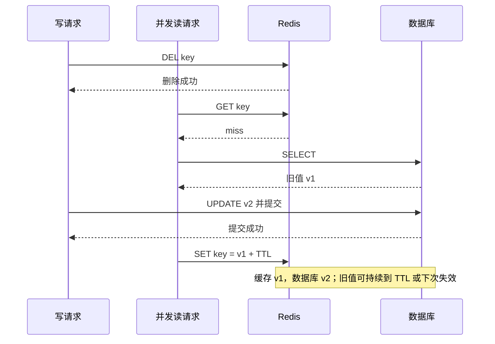
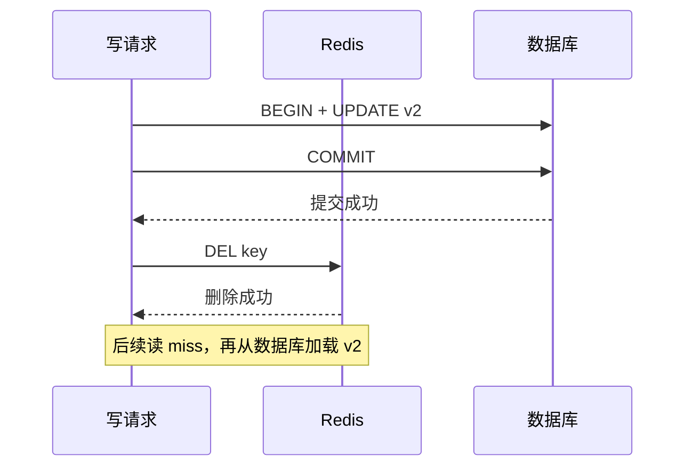
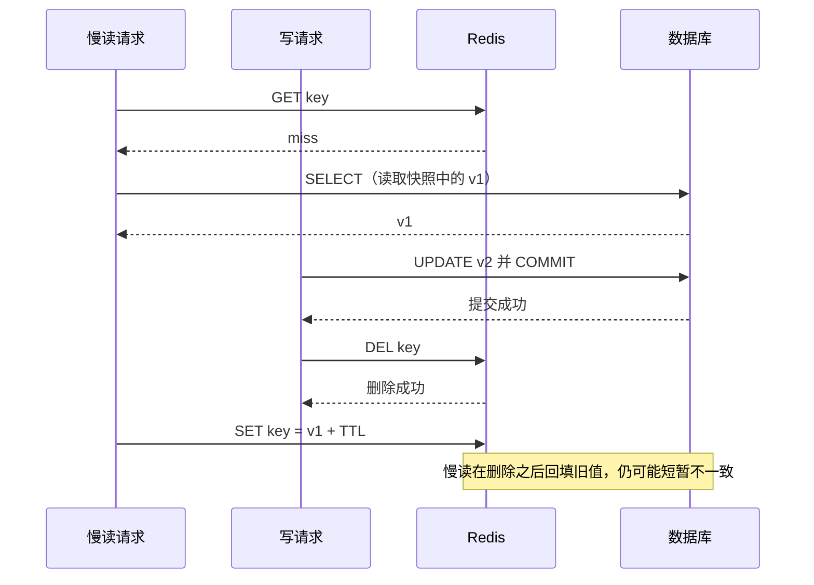
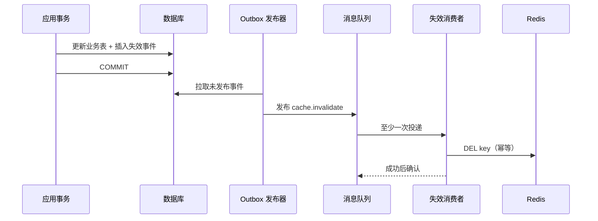
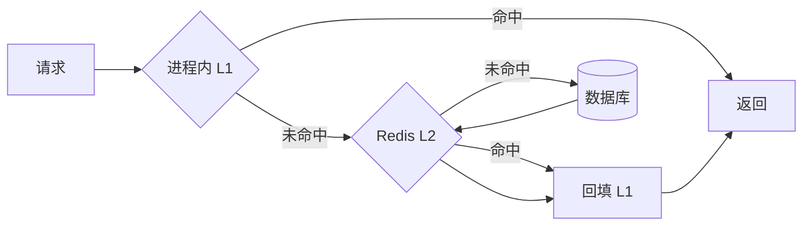

# Redis 缓存实战指南：一致性、穿透、击穿与雪崩

缓存不是“在数据库前加一个 Redis”就结束了。它把一份数据复制到了至少两个地方，以短暂陈旧、额外故障点和运维成本，换取更低延迟与更高读吞吐。

本文以 **Redis 7.x 的常见能力**为基线，目标是让初学者能够：

- 判断某份数据是否值得缓存，并给出 TTL 与陈旧容忍度；
- 在项目中正确实现 Cache Aside 与可靠失效；
- 用并发时序解释缓存一致性问题；
- 区分并治理缓存穿透、击穿、雪崩；
- 知道高可用、多级缓存、热点 key 和 Redis Cluster 的边界；
- 用监控与上线检查表验证方案，而不是只看“能不能跑”。

:::note
如果还不熟悉 String、Hash、过期、淘汰和持久化，先读[《Redis 核心概念与数据结构》](/posts/redis/redis-core-concepts)。读完本文后，可继续做[《Redis 练习题（含答案）》](/posts/redis/redis-exercises-with-answers)。
:::

---

## 一、先判断：这份数据该不该加缓存

不要从 Redis 命令开始设计。先回答下面四个问题。

### 1. 命中率能有多高

命中率定义为：

$$
\text{hit rate} = \frac{\text{cache hits}}{\text{cache hits} + \text{cache misses}}
$$

缓存对象若几乎每次都不同、访问一次后不再访问，命中率可能很低，缓存只会增加一次网络访问与序列化开销。高复用的商品详情、配置、权限快照更可能受益。命中率必须按业务和 key 类型拆分观察，整体平均值容易掩盖某类 key 的问题。
### 2. 读写比是否合适

缓存通常适合**读多写少**。若每次写都要失效缓存，而数据在下一次读取前又被改掉，缓存重建成本可能高于收益。需要关注的不是抽象的“系统读写比”，而是单个缓存对象或 key 空间的读写比。

### 3. 能容忍多旧的数据

先定义陈旧容忍度，例如：

- 商品描述允许旧 30 秒；
- 功能开关允许旧 5 秒；
- 余额展示只能作为提示，最终扣款必须以数据库事务结果为准；
- 权限撤销若必须立即生效，就不能只依赖长 TTL 缓存。

TTL 不是越长越好，也不是越短越安全。TTL 越短，回源与重建越频繁；TTL 越长，最坏陈旧窗口越大。还要把删缓存失败、主从切换、本地缓存等额外窗口算进去。

### 4. 回源成本和失败后果是什么

数据库单次查询是否昂贵？能否批量回源？数据库能承受多少缓存未命中？Redis 不可用时是拒绝请求、返回旧值，还是直连数据库？如果没有容量测算和降级策略，缓存可能只是把数据库故障变成“延迟发生”。

可以用这张决策表做第一轮筛选：

| 判断项 | 更适合缓存 | 需要谨慎或不缓存 |
|---|---|---|
| 访问特征 | 热点明显、重复读取多 | 一次性、随机访问为主 |
| 读写比 | 读多写少 | 高频写、缓存频繁失效 |
| 一致性 | 可容忍有界陈旧 | 每次读取都要求最新提交值 |
| 回源成本 | 查询昂贵、数据库压力高 | 查询已经很便宜 |
| 数据尺寸 | value 可控 | 超大 value、序列化成本高 |

:::important
缓存通常不应成为余额、订单状态、库存扣减等关键事实的唯一依据。数据库或具备明确一致性协议的存储仍应是事实源；缓存用于加速读取，并接受已设计好的陈旧边界。
:::

---

## 二、先建立心智模型：模式不是 Redis 命令

**Cache Aside、Read Through、Write Through、Write Behind 是架构读写模式，不是 Redis 命令。** Redis 提供 `GET`、`SET`、`DEL`、过期、脚本、事务等原语；由应用、缓存代理或数据平台把这些原语组合成模式。Redis 本身不会因为执行了某条命令，就自动把你的关系数据库同步好。

### 1. Cache Aside（旁路缓存）

应用同时知道缓存与数据库，是普通业务系统最常见的选择。

**读：**

1. 读取缓存，命中则返回；
2. 未命中则查询数据库；
3. 将结果写入缓存，再返回。

**写：**

1. 在数据库事务中更新数据；
2. 事务提交成功后删除缓存。

回填缓存不是数据库事务的一部分；在并发下仍可能有短暂不一致，后文会推导。

### 2. Read Through（读穿透）

应用只调用抽象缓存层。未命中时，由该缓存层加载数据库并回填。它和 Cache Aside 的主要区别是**谁负责加载**，不是用了不同的 Redis 命令。需要缓存框架、代理或自建封装支持。

### 3. Write Through（写穿透）

应用写缓存抽象层，由缓存层**同步**写入事实存储；通常要等数据库写成功后才向调用方确认。它简化调用方，但写延迟仍受数据库约束，失败语义和事务边界必须由架构明确。

### 4. Write Behind / Write Back（异步回写）

写请求先进入缓存或日志，再异步、合并写入数据库。它能提高写吞吐，却引入数据丢失窗口、乱序、重复消费、积压和恢复问题。需要持久化队列、幂等写入、顺序策略与监控，不能把“Redis 很快”当成可靠性证明。

| 模式 | 谁查数据库 | 写入事实存储 | 主要取舍 |
|---|---|---|---|
| Cache Aside | 应用 | 应用同步写库，再失效缓存 | 简单常用，但应用承担一致性逻辑 |
| Read Through | 缓存抽象层 | 取决于写模式 | 读逻辑统一，需要专门组件 |
| Write Through | 缓存抽象层 | 同步 | 一致性语义集中，写延迟较高 |
| Write Behind | 异步回写组件 | 异步 | 写吞吐高，可靠性与顺序复杂 |

本文后续默认使用 **Cache Aside**。

---

## 三、Cache Aside 的正确读写骨架

### 1. 读路径：不要把 falsy 当作未命中

值可能合法地为 `0`、`false` 或空字符串，所以不要用 `if (value)` 判断是否命中。真实客户端通常用 `null` 表示 key 不存在；反序列化后再区分空值标记和业务值。

```text
value = cache.get(key)
if value != CACHE_MISS:
    return decode(value)

row = database.query(id)
if row does not exist:
    cache.set(key, NULL_MARKER, shortTTL)
    return NOT_FOUND

cache.set(key, encode(row), normalTTLWithJitter)
return row
```

回填 `SET` 失败通常不应让本来成功的数据库读取失败，但应记录指标。空值 TTL 一般短于正常值，避免“刚创建的数据仍被空值挡住”太久；写入成功后也应删除对应空值 key。

### 2. 写路径：事务提交后删除

```text
begin database transaction
update business rows
commit transaction

try:
    cache.del(key)
catch error:
    enqueue durable invalidation event or retry with idempotency
```

推荐的是**数据库事务提交成功后删除缓存**：

- 事务回滚时，不应提前删掉仍然有效的缓存；
- 删除天然幂等，重试多次通常仍安全；
- 相比同步更新缓存，删除不必重算复杂派生值，也减少并发写乱序覆盖。

注意“更新数据库”和“删除 Redis”无法被普通本地事务原子包住。真正难点不是写出 `await redis.del(key)`，而是删除失败后如何可靠补偿。

---

## 四、一致性：从并发时序推导，而不是背口诀

### 1. 为什么“先删缓存，再写数据库”风险更大



关键窗口是：删缓存后、数据库提交前，读请求仍能读到旧值并回填。只要这个时序发生，旧缓存就可能存活一个完整 TTL。

### 2. 为什么推荐“先写数据库，提交后删缓存”

正常情况很直接：



它仍不是数学上的强一致。一个少见但可能的竞态是：旧缓存本来就 miss，慢读先读到旧值 v1，写请求提交 v2 并删除缓存后，慢读才把 v1 回填。



尽管仍有窗口，这个时序通常要求一次旧值读取与后续处理拖得足够久，发生概率往往低于“先删后写”的窗口。因此通用默认建议是：

> **数据库事务提交成功后删除缓存，并为删除失败建立可靠重试；同时保留合理 TTL 作为最终兜底。**

### 3. 删除失败：必须设计可靠补偿

数据库已提交而 `DEL` 超时或失败时，不能只打日志。应根据业务等级选择以下方案：

#### 方案 A：进程内有限重试

适合低风险缓存。使用指数退避和随机抖动，设置总时限；`DEL` 是幂等操作，可以安全重试。进程崩溃会丢失重试任务，所以它不是高可靠方案。

#### 方案 B：Transactional Outbox + MQ

在**同一个数据库事务**里同时写业务数据和 outbox 事件。后台发布器把未发送事件投递到消息队列，消费者执行 `DEL`，失败则重试或进入死信队列。



要处理重复投递、积压、死信和监控。消息至少一次投递并不可怕，因为删除是幂等的；不要在删除真正成功前确认消息。

#### 方案 C：CDC

通过数据库变更日志捕获已提交变更，再发布缓存失效事件。它能减少业务代码耦合，但要处理表到 key 的映射、事件延迟、乱序、重复和 CDC 管道故障。CDC 提升可靠性，不等于自动获得强一致。

:::warning
MQ、outbox、CDC 都只能把失败窗口变得可恢复、可观测。只要读缓存与读数据库不是一个强一致事务，普通 Cache Aside 通常提供的是最终一致或有界陈旧，而不是绝对强一致。
:::

### 4. 延迟二次删除：只有一种清晰流程

如果确实存在“慢读在删除后回填旧值”的证据，可在**提交后删除**基础上增加二次删除：

1. 数据库事务提交成功；
2. 立即删除缓存；
3. 向延迟队列提交一条失效事件；
4. 延迟时间到后，由后台消费者再次删除同一个 key；
5. 二次删除失败继续走持久化重试或死信处理。

这不是在请求线程中 `sleep(500)`。请求线程 sleep 会占用资源、拉高延迟，进程重启还会丢任务。延迟值应覆盖观测到的高分位旧读与回填耗时，并加入容量评估。

延迟二次删除只能缩小特定竞态窗口：延迟选短会漏掉更慢的读，选长会延长旧数据可能存在的时间；队列和删除也可能失败。**它不能保证强一致，也不应替代可靠的第一次删除。**

### 5. 什么时候需要更强语义

若业务不能容忍任何旧值，可以考虑：关键读直接读主库、版本号校验、写后读绕过缓存、把缓存仅用于非关键展示，或重新选择具备所需一致性协议的数据架构。不要靠无限缩短 TTL 或多删几次来宣称强一致。

---

## 五、缓存穿透：请求的数据根本不存在

### 1. 现象与识别

缓存 miss 后数据库也返回不存在；如果不缓存这个结果，每次请求都会穿透到数据库。攻击者批量生成随机 ID 时尤其危险。典型指标是**缓存 miss 高，同时数据库 not-found 比例也高**。

### 2. 缓存空值

```redis
SET user:profile:404 "__NULL__" EX 60
```

空值必须有短 TTL，编码要与合法业务值明确区分。创建或恢复该对象后，应主动删除空值 key，否则在 TTL 内仍可能返回不存在。

优点是准确、简单；缺点是随机不存在 key 太多时会占内存，因此仍需入口参数校验、鉴权和限流。

### 3. 布隆过滤器

布隆过滤器回答的是“**一定不存在**”或“**可能存在**”：

- 任意相关位为 0：一定未加入，可直接拒绝；
- 所有相关位为 1：可能存在，仍需查缓存或数据库；
- 它可能假阳性，标准布隆过滤器通常不支持安全删除。

Redis 7.x 核心发行版不自带布隆过滤器数据类型。可使用 Redis Stack 中的 RedisBloom 模块，或在应用侧采用其他实现；部署前要确认服务端模块能力，不能假设任意 Redis 实例都有 `BF.ADD`。

布隆过滤器还要处理新增数据同步、重建、容量和误判率。它适合较稳定且规模大的合法 ID 集合，不替代鉴权与限流。

### 4. 组合治理

实际入口通常组合：参数格式校验 → 鉴权/限流 → 布隆过滤器（可选）→ 缓存空值 → 数据库。不存在结果的 TTL 要短，并监控空值 key 数与 not-found 比例。

---

## 六、缓存击穿：单个热点 key 失效

热点 key 到期时，大量请求同时 miss 并回源。仅加一把锁还不够；正确的“单飞”至少包含：**唯一 token、安全释放、拿锁后二次检查、等待上限与降级**。

### 1. 互斥重建的完整流程

```text
1. GET dataKey；命中则返回
2. SET lockKey uniqueToken NX PX lockTTL
3. 拿到锁：
   3.1 再次 GET dataKey（二次检查，避免重复回源）
   3.2 仍 miss 才查询数据库并 SET dataKey
   3.3 用 compare-and-delete 原子释放锁
4. 没拿到锁：
   4.1 带抖动地短暂等待，再读 dataKey
   4.2 到达等待上限后停止等待
   4.3 按策略返回旧值、降级结果、限流或失败；不要无限自旋打 Redis
```

锁命令示意：

```redis
SET lock:rebuild:user:42 9f6c... NX PX 3000
```

释放锁不能直接 `DEL lockKey`。若持锁者停顿超过租约，锁过期后被别人获得，旧持锁者醒来直接 `DEL` 会删掉新锁。Redis 7.x 可使用 Lua 脚本原子比较 token 后删除：

```lua
if redis.call('GET', KEYS[1]) == ARGV[1] then
  return redis.call('DEL', KEYS[1])
end
return 0
```

锁 TTL 应大于正常重建高分位耗时，并避免无限锁死；若任务可能超时，需谨慎设计续租。即便有锁，数据库仍需限流，因为锁服务故障或 key 分散时仍可能回源。

### 2. 为什么必须二次检查

请求 A 拿锁并重建完成后，请求 B 可能刚好拿到下一轮锁。如果 B 不在锁内再查一次缓存，就会无意义地再次访问数据库。二次检查把竞争窗口闭合。

### 3. 逻辑过期也必须单飞

逻辑过期把 `{ data, expireAt }` 存在 value 中，Redis key 可以设置一个更长的物理 TTL 作为清理兜底。读到逻辑过期值时：

- 当前请求可返回旧值，前提是业务允许；
- 只允许一个重建者异步刷新；
- 其他请求继续使用旧值或执行降级；
- 刷新必须有超时、监控和失败重试。

如果每个发现逻辑过期的请求都启动刷新任务，仍会形成回源洪峰，所以逻辑过期并不消除单飞需求。它牺牲新鲜度换取稳定延迟，不适合不能返回旧值的场景。

---

## 七、缓存雪崩：大量 key 或整个缓存层同时失效

雪崩不是“一个热点没了”，而是大面积 miss：批量 key 同时过期、缓存冷启动、网络故障、错误淘汰策略、Redis 整体不可用，都可能触发。

### 1. TTL 抖动

对相似数据使用基础 TTL 加随机抖动：

```text
effectiveTTL = baseTTL + random(0, jitterRange)
```

也可在允许范围内使用对称抖动。抖动范围应结合数据新鲜度和 key 数量，而不是机械地都加 5 分钟。永久 key 不会集中到期，却可能长期占内存，并不能替代容量治理。

### 2. 预热与冷启动

发布、扩容或数据迁移前，根据真实热点清单预加载缓存。预热应限速、可重试、可观测，避免“为了保护数据库而预热，结果预热先打垮数据库”。热点会变化，预热清单也要更新。

### 3. 限流、熔断与降级

- 对回源数据库设置独立并发上限，不让每个请求都直通；
- Redis 错误率或数据库压力超过阈值时熔断非关键路径；
- 可接受时返回短期旧值、静态默认值或排队结果；
- 对关键请求保留隔离舱容量，防止被非关键流量耗尽。

限流意味着主动拒绝一部分请求，但通常比数据库整体崩溃更可控。降级内容必须符合业务安全边界，不能给余额或权限随意造默认值。

### 4. Redis 高可用的边界

Redis Sentinel、主从和 Redis Cluster 能提高可用性，但不能消灭所有故障：

- 主从复制通常是异步的，故障切换可能丢失尚未复制的最近写入；
- 故障检测和切换存在时间窗口，客户端也要正确刷新拓扑并设置超时；
- Cluster 提供分片与故障转移，不会自动保护后端数据库免受 miss 洪峰；
- 跨区域网络分区、错误配置、客户端连接池耗尽仍会造成不可用；
- 持久化用于恢复，不等于缓存数据永不丢失。

因此高可用拓扑必须和限流、降级、重试预算、数据库保护一起设计。不要把“有三副本”写成绝对可用保证。

---

## 八、多级缓存：更快，但一致性副本更多

典型链路是进程内 L1 → Redis L2 → 数据库：



L1 没有网络开销，也能短暂缓冲 Redis 压力；但每个应用实例都有一份副本。只删除 L2 不会自动删除所有 L1。

常见策略是：

1. L1 使用比 L2 更短的 TTL，并设置容量上限；
2. 数据库提交后发布失效事件，各实例删除 L1，同时删除 L2；
3. 实例订阅中断、重启或漏消息时，靠短 TTL 最终收敛；
4. 关键“写后读”可在当前请求或用户会话内暂时绕过 L1；
5. 监控每层命中率、陈旧窗口和失效消息延迟。

Pub/Sub 适合低延迟通知，但订阅者离线时消息不会持久保留；需要可靠补偿时，应使用可持久消费的消息系统或 Redis Streams，并处理积压与重复。多级缓存通常进一步放宽一致性，不应被描述为无条件的高可用兜底。

---

## 九、热点 key 与 Redis Cluster 槽

Redis Cluster 用 key 的 CRC16 结果映射到 16384 个槽；一个 key 只属于一个槽，也就由一个主节点处理。**增加 Cluster 节点不会自动拆分单个超热点 key 的流量。**

### 1. 先发现热点

结合客户端埋点、代理指标、服务端采样和业务流量识别热点。`redis-cli --hotkeys` 依赖 LFU 淘汰策略提供的访问频率近似值，并且扫描本身有成本；生产环境使用前应评估权限、版本和负载。也可观察每 key 类型 QPS、网络带宽、序列化耗时和单节点 CPU。

### 2. 常见治理

- 在应用 L1 缓存超热点只读数据；
- 把相同值复制为多个 key，例如 `product:42:replica:0..N-1`，随机读取；
- 更新时删除或更新所有副本，接受更复杂的一致性与内存成本；
- 对可拆分的数据按业务维度分片，但不要为了分片改变正确语义；
- 避免大 value，减少单次网络和事件循环占用。

副本 key 只有在落到不同槽、槽分布到不同节点时才可能分散压力。Cluster 的 hash tag 会让 `{相同内容}` 的 key 强制进入同一槽，适合多 key 原子操作，却不适合用来打散热点。例如 `product:{42}:r1` 和 `product:{42}:r2` 会进入同一槽。

---

## 十、可运行 Map 演示：真实 TTL 与合法 falsy 值

下面代码用 `Map` 模拟 Redis。它真的检查过期时间，并用 `Map.has` 区分 miss，因此 `0`、`false`、`''` 都能正确命中。为让演示立即结束，使用可推进的模拟时钟。

```js
// 可运行
const store = new Map();
let nowMs = 0;

const db = new Map([
  ['score:1', 0],       // 合法 falsy 值
  ['enabled:1', false], // 合法 falsy 值
  ['name:1', ''],       // 合法 falsy 值
]);
const NULL_MARKER = Symbol('NULL_MARKER');

function cacheSet(key, value, ttlMs) {
  store.set(key, { value, expiresAt: nowMs + ttlMs });
}

function cacheGet(key) {
  if (!store.has(key)) return { hit: false };
  const entry = store.get(key);
  if (entry.expiresAt <= nowMs) {
    store.delete(key); // 惰性删除过期项
    return { hit: false };
  }
  return { hit: true, value: entry.value };
}

function ttlWithJitter(baseMs, jitterMs) {
  return baseMs + Math.floor(Math.random() * (jitterMs + 1));
}

function getValue(key) {
  const cached = cacheGet(key);
  if (cached.hit) {
    return cached.value === NULL_MARKER
      ? `[cache null] ${key} 不存在`
      : `[cache hit] ${key}=${JSON.stringify(cached.value)}`;
  }

  // Map.has 而不是 if (db.get(key))，避免把 0/false/'' 当作不存在
  if (!db.has(key)) {
    cacheSet(key, NULL_MARKER, 1_000); // 空值使用较短 TTL
    return `[db not found] ${key}`;
  }

  const value = db.get(key);
  cacheSet(key, value, ttlWithJitter(3_000, 500));
  return `[db load] ${key}=${JSON.stringify(value)}`;
}

function updateValue(key, value) {
  db.set(key, value); // 模拟数据库事务已提交
  store.delete(key);  // 提交成功后删除缓存
}

console.log(getValue('score:1'));
console.log(getValue('score:1'));   // 0 仍然命中
console.log(getValue('enabled:1'));
console.log(getValue('name:1'));
console.log(getValue('missing'));
console.log(getValue('missing'));   // 命中空值，不回源

nowMs += 4_000;                     // 推进时钟，所有演示 TTL 均已到期
console.log(getValue('score:1'));   // TTL 真正生效，重新查库

updateValue('score:1', 8);
console.log(getValue('score:1'));   // 删除后读取新值 8
```

这段演示只表达缓存语义，不模拟网络失败、并发锁与数据库事务。真实项目不能用进程内 `Map` 替代 Redis 分布式缓存。

---

## 十一、无新增依赖的项目模板

下面是接近 Node.js Redis 客户端风格的伪代码。它不绑定具体客户端，也不要求新增依赖；把 `redis.get/set/del/eval` 和 `db` 替换为项目已有实例即可。模板包含 Cache Aside、空值、TTL 抖动、可靠失效入口与完整单飞约束。

```js
const NULL_VALUE = '__cache_null_v1__';
const sleep = (ms) => new Promise(resolve => setTimeout(resolve, ms));
const jitter = (baseSeconds, rangeSeconds) =>
  baseSeconds + Math.floor(Math.random() * (rangeSeconds + 1));

async function getUser(id, { redis, db }) {
  const key = `user:${id}`;
  const raw = await redis.get(key);
  if (raw !== null) {
    return raw === NULL_VALUE ? null : JSON.parse(raw);
  }

  return rebuildUserSingleFlight(id, { redis, db });
}

async function rebuildUserSingleFlight(id, { redis, db }) {
  const key = `user:${id}`;
  const lockKey = `lock:rebuild:${key}`;
  const token = crypto.randomUUID(); // Node.js 内置能力，无新增依赖
  const locked = await redis.set(lockKey, token, { NX: true, PX: 3000 });

  if (locked === 'OK') {
    try {
      // 二次检查：等待锁期间，其他请求可能已经完成回填
      const secondRead = await redis.get(key);
      if (secondRead !== null) {
        return secondRead === NULL_VALUE ? null : JSON.parse(secondRead);
      }

      const user = await db.findUserById(id);
      if (user === null) {
        await redis.set(key, NULL_VALUE, { EX: 60 });
        return null;
      }

      await redis.set(key, JSON.stringify(user), {
        EX: jitter(1800, 300),
      });
      return user;
    } finally {
      // 必须原子比较 token 后删除；这里调用预先准备的 Lua 脚本
      await redis.eval(RELEASE_LOCK_SCRIPT, {
        keys: [lockKey],
        arguments: [token],
      });
    }
  }

  // 未拿锁者：有等待上限、有抖动，不无限轮询
  const deadline = Date.now() + 500;
  while (Date.now() < deadline) {
    await sleep(30 + Math.floor(Math.random() * 40));
    const value = await redis.get(key);
    if (value !== null) return value === NULL_VALUE ? null : JSON.parse(value);
  }

  // 这里按业务选择：限流错误、允许的旧值或静态降级；不要无界回源
  throw new Error('CACHE_REBUILD_BUSY');
}

async function updateUser(id, patch, { redis, db, outbox }) {
  // db.transaction 内同时提交业务更新与 outbox 事件
  const updated = await db.transaction(async tx => {
    const user = await tx.updateUser(id, patch);
    await outbox.insert(tx, {
      type: 'CACHE_INVALIDATE',
      key: `user:${id}`,
      eventId: crypto.randomUUID(),
    });
    return user;
  });

  // 可做一次低延迟的尽力删除；即使失败，outbox 消费者仍会重试
  try {
    await redis.del(`user:${id}`);
  } catch (error) {
    metrics.increment('cache.invalidate.immediate_failed');
  }
  return updated;
}
```

模板中的 `RELEASE_LOCK_SCRIPT` 就是前文 compare-and-delete 脚本。还需要在项目中明确：

- Redis 命令超时、连接池上限与重试预算；
- JSON 解析失败和 schema 版本变化如何处理；
- outbox 发布器、消费者、死信和告警；
- 数据库回源并发上限；
- `CACHE_REBUILD_BUSY` 如何映射成业务降级响应。

:::note
若重建查询可能超过锁租约，简单固定 TTL 会让第二个请求重新拿锁。应先优化查询与设置合理租约；确需续租时，续租也必须校验 token，并限制最长持锁时间。分布式锁降低重复回源，不应被扩展成业务数据强一致承诺。
:::

---

## 十二、监控：没有指标就不知道缓存是否有效

至少按业务、key 类型和实例维度观察：

| 指标 | 用途 |
|---|---|
| 命中率、miss 率 | 判断缓存收益和异常回源 |
| 请求延迟 p50/p95/p99 | 识别尾延迟、连接池和大 key 问题 |
| Redis 错误率、超时率 | 区分业务 miss 与基础设施故障 |
| 数据库回源 QPS、并发、延迟 | 验证数据库保护是否有效 |
| not-found 与空值命中率 | 发现穿透、攻击或 key 构造错误 |
| 重建锁成功率、等待时长、超时数 | 发现击穿和锁租约不合理 |
| 缓存回填/删除失败数 | 追踪一致性风险 |
| outbox/MQ/CDC 延迟、积压、重试、死信 | 验证失效链路是否收敛 |
| 过期数、淘汰数、内存占用、碎片率 | 判断 TTL、容量和淘汰策略 |
| 热点 key、单节点 CPU/带宽 | 发现 Cluster 中的负载偏斜 |
| 主从复制延迟、故障切换次数 | 评估高可用窗口 |
| L1/L2 分层命中率与失效延迟 | 验证多级缓存一致性 |

Redis 的 `keyspace_hits` / `keyspace_misses` 是实例级参考，不等于某个业务的真实命中率；业务客户端埋点通常更容易按 key 类型拆分。告警应基于基线和容量，而不是照抄固定阈值。

---

## 十三、上线检查表

### 业务语义

- [ ] 明确了事实源，以及缓存是否允许返回旧值；
- [ ] 记录了目标命中率、读写比、陈旧容忍度和回源容量；
- [ ] key 命名、租户隔离、value schema 与最大尺寸已评审；
- [ ] 合法的 `0`、`false`、空字符串与 miss 能正确区分。

### 读写与一致性

- [ ] 使用数据库事务提交成功后删缓存；事务失败不误删；
- [ ] 删除失败有有限即时重试或 outbox/MQ/CDC 可靠补偿；
- [ ] 消费者幂等，具备积压、重试和死信告警；
- [ ] TTL 与抖动符合陈旧容忍度，空值 TTL 更短；
- [ ] 如使用延迟二次删除，由延迟队列执行而非请求线程 sleep；
- [ ] 没有把 Cache Aside 描述为强一致保证。

### 三大问题与故障保护

- [ ] 穿透有参数校验、鉴权/限流、空值或布隆过滤器方案；
- [ ] 击穿锁有唯一 token、原子安全释放、二次检查；
- [ ] 未拿锁请求有等待上限和明确降级，不会无限自旋；
- [ ] 逻辑过期刷新使用单飞，并允许业务返回旧值；
- [ ] 冷启动有受控预热，数据库回源有并发上限；
- [ ] Redis 故障时的限流、熔断、降级和恢复流程演练过。

### Redis 与运维

- [ ] 配置命令超时、连接池、重试预算和熔断；
- [ ] 内存上限、淘汰策略、持久化与高可用拓扑符合用途；
- [ ] Cluster 多 key 操作的槽约束和热点 key 分布已验证；
- [ ] 多级缓存的 L1 失效、漏消息和短 TTL 兜底已设计；
- [ ] 仪表盘和告警覆盖命中、回源、删除失败、失效积压与尾延迟；
- [ ] 压测包含缓存全 miss、热点到期、Redis 超时和故障切换。

---

## 十四、常见面试题

::: details 1. Cache Aside、Read Through、Write Through、Write Behind 是 Redis 命令吗？
不是。它们是架构读写模式。Redis 只提供读写、过期、删除、脚本等基础能力，应用或中间件负责按模式协调缓存和数据库。
:::

::: details 2. Cache Aside 为什么通常“更新数据库后删除缓存”，而不是更新缓存？
删除能避免重算复杂派生值，并降低并发写按不同顺序覆盖缓存的风险。推荐在数据库事务提交成功后删除；它仍是最终一致方案，删除失败要可靠重试。
:::

::: details 3. 先删缓存再写数据库有什么问题？
删除后、数据库提交前的并发读可能读到旧值并重新回填，使缓存旧值持续到 TTL。先提交数据库再删除缓存通常窗口更小，但慢读仍可能在删除后回填，因此不是强一致。
:::

::: details 4. 如何处理数据库提交成功但删缓存失败？
低风险场景可有限重试；更可靠的做法是在数据库事务内写 outbox，再通过 MQ 消费者幂等删除，或用 CDC 捕获已提交变更。要监控积压、重试和死信，并以 TTL 作为兜底，而不是只记录日志。
:::

::: details 5. 延迟二次删除能保证一致吗？
不能。正确流程是提交数据库、立即删除、向延迟队列投递事件、后台到期后二次删除；不能在请求线程 sleep。它只能降低慢读回填旧值的概率，还受延迟选择与任务失败影响。
:::

::: details 6. 穿透、击穿、雪崩怎样区分？
穿透是数据根本不存在，重点是空值、过滤、鉴权和限流；击穿是单个热点 key 失效，重点是单飞或逻辑过期；雪崩是大面积失效或缓存层故障，重点是 TTL 抖动、预热、限流、熔断、降级和高可用。
:::

::: details 7. 一个正确的缓存重建锁需要什么？
唯一 token；`SET key token NX PX ttl` 获取；持锁后二次检查；只有持有相同 token 才能用原子 compare-and-delete 释放；未拿锁者有抖动等待、等待上限和降级；重建本身还要超时和数据库限流。
:::

::: details 8. 逻辑过期为什么还要加锁？
因为大量请求会同时发现逻辑过期。如果都启动后台刷新，数据库仍会被并发回源击穿。应由一个请求刷新，其他请求在业务允许时返回旧值。
:::

::: details 9. Redis Cluster 能自动解决热点 key 吗？
不能。单个 key 只在一个槽和一个主节点上。可用 L1、只读副本 key、业务拆分等方式分散压力，但要承担额外一致性和内存成本；相同 hash tag 的 key 反而会被固定到同一槽。
:::

::: details 10. Redis 有主从或 Cluster，为什么还要限流降级？
复制和故障切换都有窗口，客户端、网络和连接池也会故障；切换后大量 miss 仍可能压垮数据库。高可用减少部分单点故障，不替代数据库保护和业务降级。
:::

::: details 11. 如何选择 TTL？
从业务陈旧容忍度出发，再结合访问频率、回源成本、内存容量和更新频率压测。批量同类 key 增加抖动，空值使用较短 TTL；不要用一个固定 TTL 套所有数据。
:::

::: details 12. 怎样证明缓存上线后真的有价值？
比较上线前后的数据库 QPS/延迟、端到端 p95/p99、按业务拆分的命中率、Redis 成本、回源峰值和错误率；同时通过全 miss、热点到期和 Redis 故障演练验证数据库不会被击穿。
:::

---

## 总结

一套可工作的缓存方案，不是一个 `GET` 加一个 `SET`，而是一组明确的取舍：

1. **先判断价值**：看命中率、读写比、陈旧容忍度和回源成本；
2. **选对模式**：普通业务默认从 Cache Aside 开始，记住模式不是 Redis 命令；
3. **控制一致性窗口**：数据库事务提交后删除，删除失败通过 outbox/MQ/CDC 可靠收敛；
4. **治理三大问题**：穿透拦不存在，击穿对热点单飞，雪崩保护整个后端；
5. **理解基础设施边界**：TTL 抖动、预热、高可用、多级缓存和 Cluster 都有适用条件；
6. **用指标证明**：监控、压测、故障演练和上线检查表比“理论上没问题”更可信。

缓存通常追求的是可量化、可恢复、可观测的最终一致，而不是随口承诺绝对一致。接下来可通过[《Redis 练习题（含答案）》](/posts/redis/redis-exercises-with-answers)检验自己是否真正掌握了这些判断与时序。