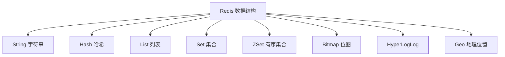

# Redis 核心概念与数据结构：从内存模型到八大数据类型

很多人对 Redis 的第一印象是"缓存"，但这只是它最出名的一个用途。要真正用好 Redis，得先搞清楚两个更根本的问题：

1. **它凭什么这么快？**（理解这个，你才知道什么操作能用、什么操作会拖垮它）
2. **它提供了哪些数据结构，分别适合干什么？**（选对数据结构，是用好 Redis 的一半）

这篇文章不讲缓存的具体套路（那是[缓存专题](/posts/redis/redis-cache-in-depth)的内容），而是先把地基打牢：Redis 的内存模型和数据结构。读完你会对"该在什么场景下用哪种结构"有清晰的判断。

:::note
本文以 Redis 6/7 的常见能力为参考。不同版本命令与实现细节可能略有差异，涉及版本相关特性时会特别说明。
:::

---

## 一、Redis 是什么：一句话认知

先给一个准确的定义：

> Redis（**Re**mote **Di**ctionary **S**erver）是一个**以内存为主存储**、支持**多种数据结构**、提供**可选持久化**与**高可用**能力的键值（Key-Value）数据库。

拆开看三个关键词：

- **以内存为主**：数据主要放在内存里，所以读写极快，但也意味着容量受内存限制、断电会丢（靠持久化弥补）。
- **多种数据结构**：它不像普通 KV 那样只能存字符串，还能存列表、哈希、集合、有序集合等，这是它比 Memcached 强大的地方。
- **键值数据库**：所有数据都通过一个唯一的 key 来存取。

---

## 二、Redis 为什么快：三个核心原因

理解"为什么快"不是为了背面试题，而是为了知道**什么操作是安全的、什么操作会出事**。

### 1. 数据在内存里

内存的读写速度比磁盘快几个数量级。传统数据库很多时间花在磁盘 I/O 上，而 Redis 直接操作内存，这是它快的最根本原因。

### 2. 单线程处理命令（避免了锁竞争）

这是最反直觉、也最重要的一点：**Redis 处理命令的核心是单线程的**。

初学者常问：单线程不是更慢吗？恰恰相反，在 Redis 的场景下单线程反而是优势：

- 内存操作本身极快，CPU 几乎不是瓶颈，瓶颈在网络和内存带宽。
- 单线程意味着**没有多线程的锁竞争和上下文切换开销**。
- 所有命令**串行执行**，天然保证了单个命令的原子性——这一点后面理解并发和原子操作时非常关键。

:::important
"单线程"是理解 Redis 的钥匙。因为命令是一条条排队执行的，所以**一条慢命令会阻塞后面所有请求**。这就是为什么线上要极力避免 `KEYS *`、大 key 的全量遍历这类操作——它们会让整个 Redis 卡住。
:::

:::note
严格来说，Redis 6 引入了多线程 I/O（用多线程处理网络读写），但**命令的执行**依然是单线程的。所以"单线程"这个心智模型仍然成立。
:::

### 3. 高效的底层数据结构 + I/O 多路复用

Redis 为每种数据类型都做了精心优化的底层实现（比如小数据用紧凑编码省内存），并用 I/O 多路复用（epoll 等）在单线程里高效处理成千上万的连接。这些是锦上添花的工程优化。

---

## 三、Key 的设计：一个容易被忽视的基本功

在讲数据结构前，先说 key。很多线上问题都源于 key 设计不当。

### 命名规范：用冒号分隔的层级结构

推荐用 `业务:对象:标识` 的命名方式：

```redis
user:profile:1001
order:detail:90001
rate_limit:ip:1.2.3.4
```

好处是可读、不易冲突、便于用 `SCAN` 批量管理。

### 每个 key 都该考虑 TTL（过期时间）

Redis 支持给 key 设置存活时间，到点自动删除：

```redis
SET code:login:alice 123456 EX 300   # 300 秒后自动过期
TTL code:login:alice                  # 查看剩余存活时间（秒）
```

:::warning
**临时数据一定要设 TTL**。验证码、会话、临时锁这类数据如果忘了设过期，会在内存里越积越多，最终导致内存暴涨。这是初学者最常踩的坑之一。
:::

---

## 四、八大数据结构：原理与适用场景

这是本文的核心。Redis 的威力来自它丰富的数据结构。下面按"最常用 → 进阶"的顺序讲，每种都配上适用场景。



### 1. String（字符串）—— 最基础、最常用

String 是最简单的类型，一个 key 对应一个值。别被"字符串"三个字骗了，它能存的远不止文本。

```redis
SET user:name:1001 "Alice"
GET user:name:1001

INCR page:view:home        # 计数器：原子 +1
INCRBY counter:download 10 # 原子 +10
```

**适用场景：**
- 缓存对象（通常把对象序列化成 JSON 存进去）
- 计数器（`INCR` 是原子操作，天然线程安全，适合 PV/点赞数）
- 分布式 ID 生成（配合 `INCR`）

### 2. Hash（哈希）—— 存对象的字段

Hash 就像"key 里面又装了一个小 map"，适合存有多个字段的对象。

```redis
HSET user:1001 name "Alice" age 18 city "Shanghai"
HGET user:1001 name        # 只取一个字段
HGETALL user:1001          # 取所有字段
HINCRBY user:1001 age 1    # 对某个字段做原子自增
```

**Hash vs String 存对象怎么选？**
- 如果经常需要**单独更新对象的某个字段**（比如只改 age），用 Hash，避免每次读写整段 JSON。
- 如果总是整体读写，用 String 存 JSON 更简单。

### 3. List（列表）—— 有序的双端队列

List 是一个有序的字符串列表，可以从两端插入和弹出。

```redis
LPUSH queue:email job1     # 从左边推入
LPUSH queue:email job2
RPOP queue:email           # 从右边弹出 → 实现 FIFO 队列
BRPOP queue:email 5        # 阻塞式弹出，最多等 5 秒
```

**适用场景：**
- 简单的消息队列（`LPUSH` + `BRPOP`）
- 小规模的时间线、最新消息列表

:::note
List 做队列缺少"消息确认、重试"等机制。需要可靠消息时，用后面会提到的 Stream 更合适。
:::

### 4. Set（集合）—— 无序、去重

Set 存的是一堆不重复的元素，且支持集合运算。

```redis
SADD user:1001:tags "vip" "new"
SISMEMBER user:1001:tags "vip"   # 判断是否存在
SCARD user:1001:tags             # 元素个数

# 集合运算
SINTER follow:a follow:b         # 交集 → 共同关注
SUNION tags:a tags:b             # 并集
```

**适用场景：**
- 去重（比如用户标签、独立访客 UV）
- 集合运算（共同好友、共同关注）

### 5. Sorted Set / ZSet（有序集合）—— 排行榜神器

ZSet 是 Set 的升级版：每个元素额外带一个 **score（分数）**，Redis 会按 score 自动排序。这是非常强大的一种结构。

```redis
ZADD leaderboard 100 "alice" 95 "bob" 120 "cindy"
ZREVRANGE leaderboard 0 9 WITHSCORES  # 取分数最高的前 10 名
ZINCRBY leaderboard 5 "bob"           # 给 bob 加 5 分
ZREVRANK leaderboard "bob"            # 查 bob 的排名（从 0 开始）
```

**适用场景：**
- 排行榜（按分数排序，实时更新）
- 延迟队列（把"执行时间戳"当作 score，按时间取出到期任务）
- 滑动窗口限流（把时间戳当 score）

### 6. Bitmap（位图）—— 用比特省内存

Bitmap 本质上是 String，但把它当作一长串二进制位来操作。适合"只有两种状态"的海量数据。

```redis
SETBIT sign:1001:2026-07 0 1   # 第 1 天签到（偏移量 0 置 1）
SETBIT sign:1001:2026-07 4 1   # 第 5 天签到
BITCOUNT sign:1001:2026-07     # 统计签到了多少天
```

**适用场景：** 签到、日活标记、布尔状态统计。一个用户一个月的签到只占 31 个 bit，极省内存。

### 7. HyperLogLog —— 超省内存的近似计数

当你要统计"有多少个不重复的元素"（比如网站 UV），但数据量巨大、又不需要绝对精确时，HyperLogLog 能用极小的内存（约 12KB）估算出接近真实的数量。

```redis
PFADD uv:2026-07-01 user1 user2 user3
PFCOUNT uv:2026-07-01          # 返回近似的去重数量
```

:::note
关键词是"近似"：它省内存，但结果有约 0.81% 的标准误差，不适合需要精确计数的场景（比如金额、库存）。
:::

### 8. Geo（地理位置）—— 附近的人/店

Geo 基于 ZSet 实现，用来存储经纬度并做距离计算。

```redis
GEOADD shops 121.4737 31.2304 "shop_a"
GEOSEARCH shops FROMLONLAT 121.4737 31.2304 BYRADIUS 3 km WITHDIST ASC
```

**适用场景：** "附近的店铺/司机/用户"、按距离排序。

---

## 五、时间复杂度意识：不是所有操作都 O(1)

Redis 快，但**不代表每个命令都快**。因为是单线程，一条慢命令会拖垮整个实例。记住这几类"危险命令"：

| 命令 | 复杂度 | 风险 |
|------|--------|------|
| `GET` / `SET` / `INCR` | O(1) | 安全 |
| `HGET` / `SADD` | O(1) | 安全 |
| `LRANGE` / `SMEMBERS` / `HGETALL` | O(N) | 大集合时慢 |
| `KEYS pattern` | O(N) 全库 | **线上禁用** |

:::warning
线上要遍历 key，**永远用 `SCAN` 而不是 `KEYS`**。`KEYS *` 会一次性遍历全部 key 并阻塞 Redis，在生产环境几乎等于一次事故。`SCAN` 则是分批游标式扫描，不会长时间阻塞：

```redis
SCAN 0 MATCH user:* COUNT 100
```
:::

---

## 六、一页速查：需求到数据结构怎么选

| 需求 | 推荐结构 | 关键命令 |
|------|---------|---------|
| 缓存对象、计数器 | String | `SET` / `INCR` |
| 存对象且要局部更新 | Hash | `HSET` / `HINCRBY` |
| 简单队列 | List | `LPUSH` / `BRPOP` |
| 去重、集合运算 | Set | `SADD` / `SINTER` |
| 排行榜、延迟队列 | ZSet | `ZADD` / `ZREVRANGE` |
| 签到、布尔统计 | Bitmap | `SETBIT` / `BITCOUNT` |
| 海量近似去重计数 | HyperLogLog | `PFADD` / `PFCOUNT` |
| 附近的人/店 | Geo | `GEOADD` / `GEOSEARCH` |

---

## 小结

这篇文章帮你建立了用好 Redis 的两块地基：

1. **内存 + 单线程模型** —— 它是快的原因，也是"慢命令会阻塞一切"的原因。理解它，你就懂了为什么要避免大 key 和 `KEYS *`。
2. **八大数据结构** —— 选对结构是用好 Redis 的一半。记住那张速查表，遇到需求先想"这该用哪种结构"。

打好这个地基后，下一步就是把 Redis 最经典的用途——**缓存**——彻底搞明白。这部分内容多、坑也多，我单独放在了[《Redis 缓存实战：从读写模式到一致性与三大问题》](/posts/redis/redis-cache-in-depth)里。

想动手巩固数据结构，可以配合[《Redis 练习题（含答案）》](/posts/redis/redis-exercises-with-answers)一起做。
