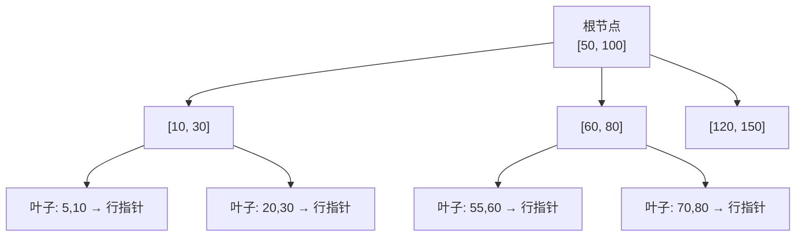
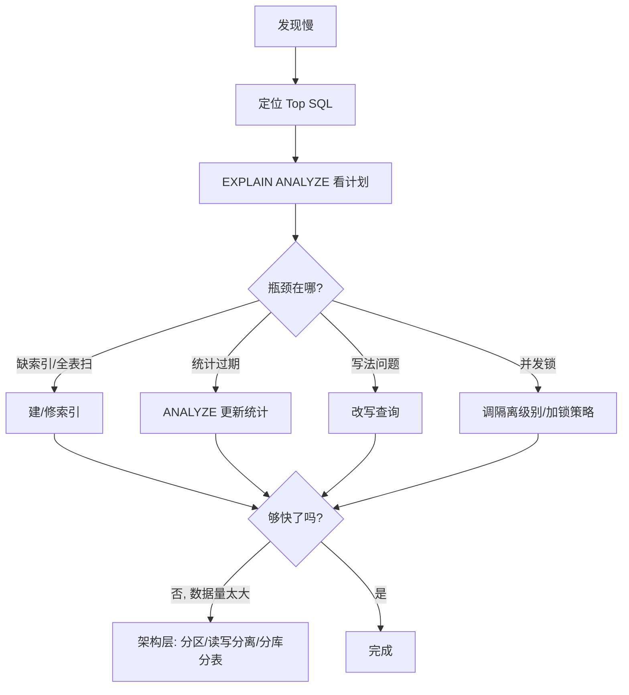

# SQL 系统进阶 · Part 4：执行计划、索引原理与查询优化

:::info 本文是「SQL 从入门到专家」系列的第四篇
1. [Part 1 · 入门指南](/blog/sql/sql-beginner-guide) —— 建立 SQL 心智模型
2. [Part 2 · 实战练习（一）：基础巩固](/blog/sql/sql-exercises) —— 10 道题巩固单表与双表基础
3. [Part 3 · 实战练习（二）：进阶应用](/blog/sql/sql-practice-lab) —— 21 道电商数据集题
4. **Part 4 · 进阶：执行计划、索引原理与查询优化（本文）** —— 从「会写」到「写得快」的方法论
5. [Part 5 · PostgreSQL 深度实战](/blog/sql/postgresql-guide) —— 把进阶知识落到一个具体数据库
:::

在 Part 1~3 里，你学会了写出**正确**的 SQL。但在真实生产中，"正确"只是及格线：同一个结果，写法不同、有没有索引，性能可能差 10 倍甚至 1000 倍。

这一篇要回答的核心问题是：**为什么一条 SQL 慢，以及如何让它变快？**

我们会刻意保持**数据库中立**——讲的是所有关系型数据库（MySQL、PostgreSQL、SQL Server、Oracle、SQLite）共通的原理。具体到某个数据库的命令细节会标注差异，但思维方式是通用的。读完这一篇，你再去看 [Part 5 的 PostgreSQL 专精](/blog/sql/postgresql-guide)，会发现那些"高级特性"背后都是这里讲的同一套逻辑。

:::tip 阅读前提
本文假设你已经能熟练写出 `JOIN`、`GROUP BY`、子查询和窗口函数（即完成了 Part 1~3）。如果对这些还不熟，建议先回头补一补。
:::

---

## 1. 先建立模型：数据库是怎么执行一条 SQL 的？

优化的前提，是理解数据库**到底做了什么**。很多人把 SQL 当成"一句话描述需求"，但数据库内部要把它翻译成一连串具体的物理操作。

### 1.1 声明式 vs 命令式：你说"要什么"，引擎决定"怎么做"

SQL 是**声明式**语言：你写 `SELECT name FROM users WHERE age > 30`，只是声明"我要 age 大于 30 的用户的 name"，但**没有规定**数据库是该全表扫一遍，还是走索引。

这中间的"翻译官"，就是**查询优化器（Query Optimizer）**。它会为同一条 SQL 生成多个可能的**执行计划（Execution Plan）**，估算每个计划的代价，挑一个最便宜的去执行。


关键认知：**你写的 SQL 文本，和数据库实际执行的物理计划，是两回事。** 优化的本质，就是引导优化器选到更好的计划。

### 1.2 逻辑执行顺序：为什么 WHERE 里不能用 SELECT 的别名？

在 Part 1 里提过 SQL 的逻辑执行顺序，这里再强调一次，因为它是理解性能的基础：

```
FROM / JOIN     -- 1. 确定数据来源，组合行
WHERE           -- 2. 行级过滤（越早过滤掉越多行越好）
GROUP BY        -- 3. 分组
HAVING          -- 4. 分组后过滤
SELECT          -- 5. 计算输出列、别名
DISTINCT        -- 6. 去重
ORDER BY        -- 7. 排序
LIMIT / OFFSET  -- 8. 截取
```

这解释了几个常见困惑：

- **`WHERE` 用不了 `SELECT` 的别名**：因为 `WHERE`（第 2 步）比 `SELECT`（第 5 步）先执行，那时别名还不存在。
- **`HAVING` 能用聚合结果，`WHERE` 不能**：聚合发生在 `GROUP BY`（第 3 步），`WHERE` 比它早。
- **越早过滤越省**：`WHERE` 能筛掉的行，就不要拖到后面再处理。一个能过滤掉 99% 数据的 `WHERE` 条件，价值远大于事后的优化。

:::note 注意
"逻辑执行顺序"是 SQL 语义层面的概念，描述结果**应该**等价于按这个顺序计算。真正的物理执行里，优化器会做大量重排（比如把过滤下推、把 `LIMIT` 提前），但最终结果必须和逻辑顺序一致。
:::

### 1.3 数据库的最大瓶颈：磁盘 I/O

理解性能，绕不开一个事实：**内存访问比磁盘访问快几个数量级。**

| 操作 | 大致耗时（数量级） |
|------|-------------------|
| 内存随机访问 | ~100 纳秒 |
| SSD 随机读 | ~100 微秒（慢 1000 倍） |
| 机械硬盘随机读 | ~10 毫秒（慢 10 万倍） |

所以数据库的性能优化，本质是**尽量少读磁盘**。数据库以"页（Page/Block，通常 4KB~16KB）"为单位读写磁盘，并用**缓冲池（Buffer Pool）**把热数据缓存在内存里。

这条原理推导出后面几乎所有优化手段：

- **索引**：用一个小的、有序的结构，避免扫描整张表（少读页）。
- **覆盖索引**：让索引本身就包含所需列，连表数据都不用读（更少读页）。
- **合适的 JOIN 算法**：避免重复读取同一份数据。
- **只取需要的列和行**：`SELECT *` 和无 `LIMIT` 的查询，会读回大量用不上的数据。

---

## 2. 索引：性能优化的第一抓手

90% 的慢查询问题，根因都和索引有关。要会用索引，先得知道它**是什么**。

### 2.1 索引为什么快？类比"字典的目录"

想象一本一万页、没有目录的字典，要找"数据库"这个词，你只能从第一页翻到最后一页——这就是**全表扫描（Full Table Scan / Seq Scan）**，时间复杂度 O(n)。

而有了**按拼音排序的目录**，你可以快速定位到 "shujuku" 大致在哪一页，几次跳转就找到——这就是索引，把 O(n) 降到约 O(log n)。

### 2.2 B-Tree 索引：关系数据库的默认主力

绝大多数关系数据库的默认索引是 **B-Tree（准确说是 B+Tree）**。它的核心特点：

- **有序**：键值在树中按顺序排列。
- **多路平衡树**：每个节点存很多键，树很"矮"（通常 3~4 层就能索引上亿行），查找时磁盘 I/O 次数极少。
- **叶子节点串成链表**：天然支持范围扫描和排序。



正因为 B-Tree **有序**，它能高效支持这些操作：

- 等值查询：`WHERE id = 100`
- 范围查询：`WHERE age BETWEEN 20 AND 30`
- 前缀匹配：`WHERE name LIKE 'Ali%'`（注意是前缀，不是 `%Ali`）
- 排序：`ORDER BY created_at`（索引顺序就是结果顺序，省去排序）
- 取最值：`MAX(id)` / `MIN(id)`

### 2.3 复合索引与"最左前缀"原则（最重要的规律）

复合索引（多列索引）是面试和实战的高频考点。假设有索引 `(a, b, c)`，它的排序规则是：**先按 a 排，a 相同再按 b 排，b 也相同再按 c 排**——就像字典里先按首字母、再按第二个字母排序。

这导出**最左前缀原则**：查询条件必须从最左列开始连续使用，索引才能生效。

| 查询条件 | 能否用上 `(a, b, c)` 索引 |
|----------|---------------------------|
| `WHERE a = 1` | ✅ 用到 a |
| `WHERE a = 1 AND b = 2` | ✅ 用到 a, b |
| `WHERE a = 1 AND b = 2 AND c = 3` | ✅ 全部用到 |
| `WHERE a = 1 AND c = 3` | ⚠️ 只能用到 a，c 无法用（b 断了） |
| `WHERE b = 2 AND c = 3` | ❌ 缺最左列 a，索引基本失效 |
| `WHERE a = 1 AND b > 2 AND c = 3` | ⚠️ a、b 用到，但 b 是范围后 c 用不上 |

最后一行很关键：**范围查询（`>`、`<`、`BETWEEN`、`LIKE 'x%'`）之后的列无法继续用索引**。因为范围一旦展开，后面的列在索引里就不再有序了。

:::tip 复合索引的列顺序怎么定？
经验法则：**等值列放前面，范围列放后面**。比如查询 `WHERE status = 'PAID' AND created_at > '2026-01-01'`，索引应建成 `(status, created_at)` 而非 `(created_at, status)`，这样 `status` 等值定位后，`created_at` 的范围扫描仍然有序。
:::

### 2.4 覆盖索引：连表数据都不用读

普通索引查到匹配后，还要拿着行指针**回表**（回到主表读取完整行），这是额外的随机 I/O。

如果一个索引**恰好包含了查询所需的全部列**，数据库就能直接从索引返回结果，**完全不碰主表**——这叫**覆盖索引（Covering Index）**，在执行计划里通常显示为 `Index Only Scan`（PG）或 `Using index`（MySQL）。

```sql
-- 索引：(user_id, status, amount)
-- 这条查询的所有列都在索引里 → 覆盖索引，无需回表
SELECT status, amount
FROM orders
WHERE user_id = 42;

-- 这条要查 created_at，不在索引里 → 需要回表
SELECT status, created_at
FROM orders
WHERE user_id = 42;
```

### 2.5 这些写法会让索引"失效"

加了索引却没用上，是最让人困惑的问题。常见原因：

**1. 在索引列上做运算或函数变换**

```sql
-- ❌ 对列做了函数，索引失效（数据库不知道 YEAR(created_at) 的有序性）
SELECT * FROM orders WHERE YEAR(created_at) = 2026;

-- ✅ 改成范围条件，保留列的"裸"形态
SELECT * FROM orders
WHERE created_at >= '2026-01-01' AND created_at < '2027-01-01';
```

**2. 隐式类型转换**

```sql
-- 假设 phone 是 VARCHAR 类型
-- ❌ 传入数字，数据库要把每行的 phone 转成数字再比，等于对列做了函数
SELECT * FROM users WHERE phone = 13800138000;

-- ✅ 类型对齐
SELECT * FROM users WHERE phone = '13800138000';
```

**3. 前导通配的 `LIKE`**

```sql
-- ❌ 以 % 开头，无法利用 B-Tree 的有序性
SELECT * FROM users WHERE name LIKE '%son';

-- ✅ 前缀匹配可以走索引
SELECT * FROM users WHERE name LIKE 'John%';
```

（如果确实需要"包含"搜索，应该用全文检索或专门的索引，比如 PG 的 `pg_trgm`，详见 Part 5。）

**4. 条件选择性太差**

如果 `WHERE gender = 'M'` 能匹配全表 50% 的行，数据库反而会判断"走索引回表的随机 I/O，还不如直接顺序扫全表"，于是放弃索引。这是**优化器的正确决策**，不是 bug。索引适合**高选择性**（能过滤掉大部分行）的列。

**5. `OR` 连接的条件**

```sql
-- 若只有 a 上有索引，b 上没有，OR 会导致整体走全表扫描
SELECT * FROM t WHERE a = 1 OR b = 2;
-- 优化方向：给 b 也建索引，或改写为 UNION
```

### 2.6 索引不是越多越好

索引是**用空间和写入性能，换查询性能**：

- 每个索引都要占额外存储。
- 每次 `INSERT / UPDATE / DELETE`，所有相关索引都要同步维护，写入变慢。
- 索引太多会让优化器"选择困难"，甚至选错。

实践原则：**为高频、慢的查询建必要的索引，定期清理从不被使用的索引**（参见 Part 5 中查询索引使用情况的方法）。

---

## 3. JOIN 的代价：三种连接算法

多表 `JOIN` 是性能差异最大的地方。理解优化器在背后用的三种算法，你才知道为什么有的 JOIN 秒回、有的卡死。

### 3.1 Nested Loop Join（嵌套循环）

最朴素的算法：对外层表的每一行，去内层表里找匹配。

```
for 外层表的每一行 r:
    for 内层表的每一行 s:
        if r 和 s 匹配: 输出
```

- 朴素实现是 O(n × m)，灾难性的慢。
- 但如果**内层表的连接列上有索引**，内层查找就变成索引查找（O(log m)），整体变成 O(n × log m)——这时它非常高效。
- **适合**：外层表小、内层表连接列有索引的场景。

:::warning 这是"嵌套循环慢"的真相
当你看到一个两表 JOIN 慢得离谱，十有八九是优化器选了 Nested Loop，但**内层连接列没有索引**，退化成了 O(n × m)。解决办法通常就是给连接列加索引。
:::

### 3.2 Hash Join（哈希连接）

先把小表的连接列全部读进内存，建一张哈希表；再扫描大表，每行去哈希表里 O(1) 查找。

- 复杂度约 O(n + m)，处理**大表 JOIN 大表**时通常最快。
- 需要足够内存放下哈希表；内存不够时会落盘（变慢）。
- **不要求连接列有索引**，但只能用于等值连接（`a.id = b.id`），不能用于 `a.x > b.y`。
- MySQL 8.0+ 和 PostgreSQL 都支持。

### 3.3 Merge Join（归并连接）

要求两表都**按连接列有序**（通常来自索引或预排序），然后像拉链一样并行扫描归并。

- 复杂度约 O(n + m)（不含排序成本）。
- **适合**：两表都已经有序（比如都有连接列上的索引），或本来就要按该列排序。

### 3.4 小结：优化器怎么选？

| 算法 | 适用场景 | 是否需要索引 |
|------|----------|--------------|
| Nested Loop | 一表很小，另一表连接列有索引 | 内层强烈建议有 |
| Hash Join | 大表 ⋈ 大表，等值连接 | 不需要 |
| Merge Join | 两表都已按连接列有序 | 有序输入（常来自索引） |

你不需要手动指定算法（大多数数据库也不鼓励），但**理解这三种算法，能帮你看懂执行计划、判断该加哪个索引**。

---

## 4. 读懂执行计划：性能排查的"X 光片"

光靠猜没用，**执行计划是唯一可靠的诊断工具**。所有关系数据库都提供 `EXPLAIN`。

### 4.1 EXPLAIN 的两种形态

```sql
-- 只看计划，不真正执行（快，但只有估算值）
EXPLAIN SELECT ...;

-- 真正执行并收集实际数据（PostgreSQL）
EXPLAIN ANALYZE SELECT ...;

-- MySQL 8.0+ 也支持 ANALYZE
EXPLAIN ANALYZE SELECT ...;
```

| 数据库 | 命令 |
|--------|------|
| PostgreSQL | `EXPLAIN (ANALYZE, BUFFERS) ...` |
| MySQL | `EXPLAIN ...` / `EXPLAIN ANALYZE ...`（8.0+） |
| SQL Server | `SET SHOWPLAN_ALL ON` 或图形化执行计划 |
| Oracle | `EXPLAIN PLAN FOR ...` + `DBMS_XPLAN` |

:::tip 永远优先用 ANALYZE
不带 `ANALYZE` 的 `EXPLAIN` 只给优化器的**估算**；带 `ANALYZE` 会真正跑一遍，给出**实际行数和耗时**。诊断时，对比"估算行数"和"实际行数"的差距，是发现统计信息过期的关键。
:::

### 4.2 计划里要盯紧的几个关键词

不同数据库措辞不同，但概念相通：

| 你看到 | 含义 | 是好是坏 |
|--------|------|----------|
| `Seq Scan` / `Full Table Scan` | 全表扫描 | 大表上通常是问题信号 |
| `Index Scan` / `Index Range Scan` | 走索引，但要回表 | 一般 ✅ |
| `Index Only Scan` / `Using index` | 覆盖索引，不回表 | 最优 ✅✅ |
| `Nested Loop` | 嵌套循环连接 | 内层有索引才好 |
| `Hash Join` | 哈希连接 | 大表 JOIN 通常 ✅ |
| `rows` | 该步骤处理的行数 | 估算 vs 实际差距大 = 统计过期 |
| `cost` | 估算代价 | 越大越贵 |
| `actual time` | 实际耗时（ANALYZE） | 找出最耗时的步骤 |

### 4.3 一个实战诊断流程

```sql
EXPLAIN ANALYZE
SELECT u.name, COUNT(o.id) AS cnt
FROM users u
LEFT JOIN orders o ON o.user_id = u.id
WHERE u.city = 'Beijing'
GROUP BY u.id, u.name;
```

诊断时按这个顺序看：

1. **有没有大表上的 `Seq Scan`？** 如果 `users` 表很大却全表扫，考虑给 `city` 加索引。
2. **JOIN 用的什么算法？** 如果是 Nested Loop 且 `orders.user_id` 没索引，加上它。
3. **估算行数和实际行数差多少？** 差一个数量级以上，说明统计信息过期，跑一次 `ANALYZE <表名>` 更新。
4. **哪一步 `actual time` 最大？** 优化要打在最痛的地方，不要凭感觉。

:::important 优化的黄金法则
**先测量，再优化。** 永远用执行计划定位真正的瓶颈，而不是凭直觉到处加索引。优化一个占总耗时 5% 的步骤，最多只能提升 5%。
:::

---

## 5. 查询改写：等价但更快的写法

有时候问题不在索引，而在 SQL 本身的写法。以下是几类常见的、能在不改变结果的前提下提速的改写。

### 5.1 只取需要的列和行

```sql
-- ❌ SELECT * 读回所有列，浪费 I/O，还可能让覆盖索引失效
SELECT * FROM orders WHERE user_id = 42;

-- ✅ 只取需要的列，有机会走覆盖索引
SELECT id, status FROM orders WHERE user_id = 42;
```

### 5.2 用 EXISTS 改写 IN（处理大子查询）

```sql
-- 当子查询返回大量结果时，IN 可能较慢
SELECT * FROM users u
WHERE u.id IN (SELECT user_id FROM orders);

-- EXISTS 找到第一个匹配就停止，相关子查询场景常更优
SELECT * FROM users u
WHERE EXISTS (SELECT 1 FROM orders o WHERE o.user_id = u.id);
```

现代优化器（PG、MySQL 8+）大多能把两者优化成相同计划，但 `EXISTS` 在语义上更贴近"判断是否存在"，也更不容易踩 `NULL` 的坑。

### 5.3 `NOT IN` 遇到 NULL 是陷阱，改用 `NOT EXISTS`

```sql
-- ❌ 危险：只要子查询结果里有一个 NULL，NOT IN 整体返回空集！
SELECT * FROM users
WHERE id NOT IN (SELECT user_id FROM orders);  -- user_id 可能含 NULL

-- ✅ NOT EXISTS 不受 NULL 影响，语义清晰
SELECT * FROM users u
WHERE NOT EXISTS (SELECT 1 FROM orders o WHERE o.user_id = u.id);
```

原因：`NOT IN (..., NULL, ...)` 中的比较会产生 `UNKNOWN`，导致整体永远不为真。这是一个非常隐蔽、生产事故级别的坑。

### 5.4 分页：深分页用"游标"代替大 OFFSET

```sql
-- ❌ OFFSET 100000 意味着数据库要先扫过前 10 万行再丢弃，越翻越慢
SELECT * FROM orders ORDER BY id LIMIT 20 OFFSET 100000;

-- ✅ 基于游标（记住上一页最后一个 id），每次都走索引定位
SELECT * FROM orders WHERE id > 100020 ORDER BY id LIMIT 20;
```

游标分页（Keyset Pagination）的代价与翻到第几页**无关**，是处理大数据集列表的标准做法。

### 5.5 把过滤尽早下推

```sql
-- ❌ 先 JOIN 出全部，再过滤，中间结果很大
SELECT *
FROM orders o
JOIN users u ON u.id = o.user_id
WHERE o.status = 'PAID';

-- 等价但思路更清晰：用 CTE/子查询先把 orders 缩小
WITH paid AS (
  SELECT * FROM orders WHERE status = 'PAID'
)
SELECT * FROM paid o JOIN users u ON u.id = o.user_id;
```

优化器通常会自动下推过滤条件，但当查询复杂时，显式地先缩小数据集，既好读，有时也能引导出更好的计划。

### 5.6 警惕 JOIN 导致的行"倍增"

这是结果不对（而不只是慢）的常见原因。当连接键在一侧不唯一时，行数会成倍放大，导致 `SUM`、`COUNT` 算错。

```sql
-- ❌ 一个订单有多个 items，下面的 SUM(payments.amount) 会被 items 行数放大
SELECT o.id, SUM(p.amount)
FROM orders o
JOIN order_items oi ON oi.order_id = o.id
JOIN payments p ON p.order_id = o.id   -- 与 items 形成笛卡尔放大
GROUP BY o.id;

-- ✅ 先各自聚合，再 JOIN，避免维度交叉
WITH item_amt AS (
  SELECT order_id, SUM(quantity * unit_price) AS amt
  FROM order_items GROUP BY order_id
), pay_amt AS (
  SELECT order_id, SUM(amount) AS paid FROM payments GROUP BY order_id
)
SELECT o.id, i.amt, pay.paid
FROM orders o
LEFT JOIN item_amt i ON i.order_id = o.id
LEFT JOIN pay_amt pay ON pay.order_id = o.id;
```

排查倍增的方法：**先单表 `COUNT(*)`，再逐步加 JOIN，每加一个就看行数是否符合预期。**

---

## 6. 事务、锁与并发：正确性的另一面

性能不只是"快"，在并发下还要"对"。当多个连接同时读写同一份数据，事务和隔离级别决定了你会看到什么。

### 6.1 ACID 与隔离级别（快速回顾）

事务保证一组操作"要么全成、要么全败"，由 ACID 描述：原子性、一致性、隔离性、持久性（详见 [Part 1 第 12 节](/blog/sql/sql-beginner-guide)）。

并发的核心难点是**隔离性**。SQL 标准定义了 4 个隔离级别，权衡"一致性 vs 性能"：

| 隔离级别 | 脏读 | 不可重复读 | 幻读 |
|----------|------|------------|------|
| READ UNCOMMITTED | 可能 | 可能 | 可能 |
| READ COMMITTED | 不可能 | 可能 | 可能 |
| REPEATABLE READ | 不可能 | 不可能 | 可能* |
| SERIALIZABLE | 不可能 | 不可能 | 不可能 |

> \*不同数据库实现有差异：MySQL InnoDB 的 RR 通过间隙锁避免大部分幻读；PostgreSQL 基于 MVCC 的 RR 也避免了幻读。各数据库的默认级别也不同（PG/Oracle 默认 READ COMMITTED，MySQL InnoDB 默认 REPEATABLE READ）。

这三种"读异常"是必须建立的概念：

- **脏读**：读到了别的事务**还没提交**的修改（对方可能回滚）。
- **不可重复读**：同一事务内两次读同一行，值变了（被别人提交的 `UPDATE` 改了）。
- **幻读**：同一事务内两次读同一范围，行数变了（被别人 `INSERT` 了新行）。

### 6.2 MVCC：现代数据库为什么"读不阻塞写"

PostgreSQL、MySQL InnoDB、Oracle 都采用 **MVCC（多版本并发控制）**：写入时不直接覆盖旧数据，而是创建新版本；每个事务看到的是"某个时间点的快照"。

这带来一个巨大好处：**读操作不会阻塞写操作，写也不阻塞读**。读永远读到一个一致的快照，不用等锁。

代价是旧版本数据需要后台清理（PG 的 `VACUUM`、InnoDB 的 purge），否则会膨胀——这部分在 [Part 5](/blog/sql/postgresql-guide) 会展开。

### 6.3 悲观锁 vs 乐观锁

并发更新同一行时，两种典型策略：

**悲观锁**——假设会冲突，先锁住再改：

```sql
BEGIN;
-- 锁定这一行，其他事务想改它必须等待
SELECT stock FROM products WHERE id = 1 FOR UPDATE;
-- 检查并扣减库存
UPDATE products SET stock = stock - 1 WHERE id = 1;
COMMIT;
```

**乐观锁**——假设很少冲突，靠版本号在提交时检测：

```sql
-- 读出时记下 version = 5
-- 更新时带上 version 条件，若期间被人改过（version 变了），影响行数为 0
UPDATE products
SET stock = stock - 1, version = version + 1
WHERE id = 1 AND version = 5;
-- 应用层检查"影响行数"，为 0 则重试
```

经验：**冲突频繁用悲观锁，冲突稀少用乐观锁。**

### 6.4 死锁：成因与避免

当两个事务互相等待对方持有的锁，就形成**死锁**。数据库会自动检测并回滚其中一方。

```
事务 A: 锁住 行1 → 想锁 行2（等 B）
事务 B: 锁住 行2 → 想锁 行1（等 A）   ← 死锁
```

避免死锁最有效的办法：**在所有事务中以相同的固定顺序访问/加锁资源**（比如永远先操作 id 较小的行）。此外，缩短事务、减少持锁时间也能降低死锁概率。

---

## 7. 当单表优化到头：架构层面的思路

索引和查询改写有上限。当数据量到达千万、上亿级，需要从数据模型和架构层面下手。这里只建立概念，具体落地在 Part 5 及后续运维主题。

### 7.1 适度反范式

规范化（避免冗余）让写入安全，但过度规范会导致查询要 JOIN 很多表。在**读多写少**的场景，可以**适度反范式**：冗余存储一些可推导字段（如订单表直接冗余 `total_amount`），用写入时的额外维护，换查询时的少 JOIN。

权衡点：反范式数据需要保证一致性（通常靠触发器或应用层），是用"一致性维护成本"换"读性能"。

### 7.2 分区表（Partitioning）

把一张大表按某个键（最常见是时间）拆成多个物理子表，逻辑上仍是一张表：

```sql
-- 概念示意：按月分区的日志表
CREATE TABLE logs (...) PARTITION BY RANGE (created_at);
```

好处：

- **分区裁剪**：查询带时间条件时，只扫相关分区。
- **维护性**：删除旧数据直接 `DROP` 整个分区，比 `DELETE` 快几个数量级，也不产生表膨胀。

### 7.3 读写分离与分库分表

- **读写分离**：主库写、多个从库读，分摊读压力（适合读多写少）。
- **分库分表（Sharding）**：按某个键把数据水平拆到多个库/表，突破单机容量与性能上限。代价是跨分片查询、分布式事务变复杂。

:::note 不要过早优化
分库分表是"最后的手段"。在引入它之前，先确认索引、查询、缓存、读写分离都已经用尽。架构复杂度的提升，往往比性能收益更昂贵。
:::

---

## 8. 系统化的优化方法论（速查清单）

把前面的内容收敛成一个可执行的排查顺序。遇到慢查询，按这个流程走：

1. **定位**：用慢查询日志 / `pg_stat_statements`（PG）/ `performance_schema`（MySQL）找出最耗时的 Top SQL。不要凭感觉。
2. **看计划**：对慢 SQL 跑 `EXPLAIN ANALYZE`，找到最耗时的步骤和大表 `Seq Scan`。
3. **查索引**：缺索引就建（注意复合索引列顺序、覆盖索引）；索引没生效就检查是否踩了第 2.5 节的失效写法。
4. **核对统计**：估算行数与实际差距大，跑 `ANALYZE` 更新统计信息。
5. **改写查询**：减少返回列/行、`NOT EXISTS` 替 `NOT IN`、游标分页替深 `OFFSET`、先聚合再 JOIN 防倍增。
6. **看并发**：并发场景检查隔离级别、锁等待、死锁，必要时引入乐观/悲观锁。
7. **上架构**：单表手段用尽后，再考虑反范式、分区、读写分离、分库分表。



---

## 9. 小结与下一步

这一篇把"SQL 为什么慢、如何变快"的通用原理讲了一遍：

1. **执行模型**：数据库是声明式的，优化器把 SQL 翻译成物理计划，I/O 是核心瓶颈。
2. **索引**：B-Tree 的有序性是一切的基础，掌握最左前缀、覆盖索引、失效场景。
3. **JOIN 算法**：Nested Loop / Hash / Merge 各有适用场景，看懂它们才看得懂计划。
4. **执行计划**：`EXPLAIN ANALYZE` 是唯一可靠的诊断工具，先测量再优化。
5. **查询改写**：在不改变结果的前提下，有大量提速空间。
6. **并发**：隔离级别、MVCC、锁、死锁，是正确性的保障。
7. **架构**：单表到头时，反范式、分区、分片是下一层抓手。

这些原理是**数据库中立**的。但纸上谈兵不如落到实处——

**下一步：** 进入系列最后一篇 [Part 5 · PostgreSQL 深度实战](/blog/sql/postgresql-guide)，看这些通用原理如何在一个功能最完善的开源数据库上具体落地：PG 的 MVCC 实现、丰富的索引类型（GIN/GiST/BRIN）、`EXPLAIN` 实战、`pg_stat_statements` 找 Top SQL、`VACUUM` 与表膨胀、连接池、分区表，以及一个完整的博客系统数据模型设计。
