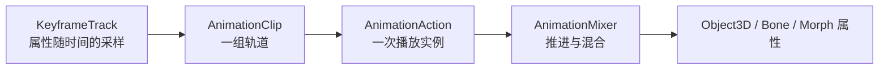

# Three.js 动画系统详解：Clip、Mixer、混合与角色状态机

让一个物体“动起来”很容易：每帧改一次 `rotation` 即可。真正的动画系统还要回答：关键帧怎样找到目标属性？多个动作怎样混合？一次性攻击结束后怎样回到跑步？标签页隐藏后时间怎样处理？角色位移究竟来自游戏逻辑还是动画资产？

本文面向已经理解场景图、TRS 与 `delta` 时间的读者，从底层数据一路搭到可运行的 `idle / walk / run / action` 状态机。示例不下载任何模型，所有对象与动画片段都在程序中创建；最后再把同一控制器接到真实 glTF。

:::important 版本说明
示例按本项目 Three.js **r182** API 编写。核心类在较早版本已存在，但升级时仍应核对 `AnimationAction`、`AnimationUtils` 与加载器文档。
:::

## 一、先建立四层心智模型

Three.js 动画链路可以压缩为四层：



### 1. KeyframeTrack：时间轴上的一个属性

`KeyframeTrack` 保存三件事：**绑定路径、时间数组、值数组**。它不是“某个对象在播放”，而是“某个属性在这些时刻应取什么值”。

```javascript
const track = new THREE.NumberKeyframeTrack(
  'Arm.rotation[z]',       // 从 mixer 根节点寻找名为 Arm 的节点
  [0, 0.25, 0.5],         // 秒，必须单调递增
  [0, Math.PI / 3, 0]     // 每个时间点对应一个标量
)
```

常用具体类型包括 `NumberKeyframeTrack`、`VectorKeyframeTrack`、`QuaternionKeyframeTrack`、`ColorKeyframeTrack`、`BooleanKeyframeTrack` 与 `StringKeyframeTrack`。位置/缩放每个采样需要 3 个值，四元数需要 4 个；布尔和字符串通常使用离散插值。绑定失败不会神奇地“自动猜中”，名称、层级与属性必须真实存在。
### 2. AnimationClip：可复用的动作数据

`AnimationClip(name, duration, tracks)` 把多条轨道包装成一个动作，例如 `Walk` 同时驱动躯干起伏、左右手臂和左右腿。`duration = -1` 会根据最后一个关键帧自动计算时长。

```javascript
const clip = new THREE.AnimationClip('Wave', -1, [
  new THREE.NumberKeyframeTrack('Arm.rotation[z]', [0, 0.3, 0.6], [0, 1.2, 0]),
  new THREE.NumberKeyframeTrack('.position[y]', [0, 0.3, 0.6], [0, 0.1, 0]),
])

clip.validate()  // 开发期检查时间和值是否合法
clip.optimize()  // 删除可安全移除的冗余关键帧
```

Clip 是数据，可以被多个 Mixer 使用。不要把“Clip 已经播放过”当作状态；播放状态属于 Action。

### 3. AnimationMixer：一个动画根节点的播放器

Mixer 绑定一个根对象，并负责寻找轨道目标、推进时间、采样和混合结果：

```javascript
const mixer = new THREE.AnimationMixer(characterRoot)
const action = mixer.clipAction(clip)
action.play()

const clock = new THREE.Clock()
function frame() {
  requestAnimationFrame(frame)
  const delta = Math.min(clock.getDelta(), 0.1)
  mixer.update(delta)
}
frame()
```

常见架构是“每个独立角色一个 Mixer”。同一骨架上的动作必须进入同一个 Mixer 才能正确混合。`mixer.timeScale = 0` 可以暂停该 Mixer，`mixer.setTime(t)` 则直接求值到指定绝对时间，适合编辑器预览。

### 4. AnimationAction：Clip 的播放实例

`mixer.clipAction(clip)` 返回 Action。Action 保存 `time`、`timeScale`、`weight`、循环方式、淡入淡出计划和是否启用等运行状态。同一 `clip + root` 通常会由 Mixer 缓存并返回同一 Action，因此切换前要明确是否 `reset()`。

```javascript
const action = mixer.clipAction(clip)
action
  .reset()                  // time 回到 0，清掉 paused/循环计数等播放状态
  .setLoop(THREE.LoopRepeat, Infinity)
  .setEffectiveWeight(1)
  .setEffectiveTimeScale(1)
  .play()                   // 激活；reset 本身不会开始播放
```

可以把它们记成：**Track 描述一个属性，Clip 描述一个动作，Action 描述怎样播放，Mixer 描述谁来推进和混合。**

## 二、delta 更新：动画时间必须由应用推进

AnimationMixer 不会自己读取系统时间。每帧只调用一次：

```javascript
const delta = Math.min(clock.getDelta(), 0.1)
mixer.update(delta)
```

`delta` 单位是秒。不要传 `clock.elapsedTime`，否则 Mixer 会把不断变大的“总时间”当成每帧增量。也不要同时在两个渲染循环更新同一个 Mixer，否则动画会加速。

在 React Three Fiber 中写法更直接：

```jsx
useFrame((_, delta) => {
  mixer.update(Math.min(delta, 0.1))
})
```

截断大 delta 能避免恢复标签页时突然跨过大段动画，但不会把动画变成确定性物理模拟；需要碰撞与刚体时，仍应使用固定时间步。
## 三、Loop、Clamp 与 finished：结束到底意味着什么

### 循环模式

```javascript
action.setLoop(THREE.LoopRepeat, Infinity) // idle / walk / run
action.setLoop(THREE.LoopPingPong, 3)      // 往返播放
action.setLoop(THREE.LoopOnce, 1)          // attack / jump / emote
```

- `LoopRepeat`：到末尾回到开头；
- `LoopPingPong`：交替正放与倒放；
- `LoopOnce`：播放一遍，`repetitions` 对它没有实际意义。

一次性动作常配合：

```javascript
action.setLoop(THREE.LoopOnce, 1)
action.clampWhenFinished = true
action.reset().play()
```

`clampWhenFinished = true` 会在终点保持最后姿势，而不是结束后让该 Action 自动失效并露出下面的姿势。它适合“倒地后保持”，却不适合所有攻击动作：攻击若应回到 locomotion，应在 `finished` 中切回并淡出。

### finished 是 Mixer 事件

```javascript
function onFinished(event) {
  if (event.action === attackAction) {
    attackAction.fadeOut(0.15)
    walkAction.reset().fadeIn(0.15).play()
  }
}

mixer.addEventListener('finished', onFinished)
// 卸载时必须使用同一个函数引用：
mixer.removeEventListener('finished', onFinished)
```

事件属于 Mixer，不是 Action。还有 `loop` 事件可观察循环边界。不要用 `setTimeout(clip.duration * 1000)` 模拟结束：`timeScale`、暂停、warp、标签页策略都会让墙钟时间与动画时间分离。

:::warning Clamp 不是“停止并清理”
Clamp 后 Action 仍占有混合结果。若它权重为 1，底层 idle 即使在播放也看不见。根据业务显式 `fadeOut()`、`stop()` 或禁用它。
:::

## 四、reset、play、stop、enabled 与 weight

这些方法职责不同：

| 操作 | 含义 | 常见用途 |
|---|---|---|
| `play()` | 激活 Action；若已经激活，不保证从头开始 | 继续或确保参与 Mixer |
| `reset()` | 时间归零、恢复可播放状态；不激活 | 每次重播 one-shot 前调用 |
| `stop()` | 停用并重置该 Action | 明确终止且无需过渡 |
| `paused = true` | 冻结 Action 的局部时间 | 暂停单个动作 |
| `enabled = false` | 让 Action 不影响结果 | 临时剔除，但保留配置 |
| `setEffectiveWeight(w)` | 设置实际混合权重并启用 | 手动 blend space |
| `setEffectiveTimeScale(s)` | 设置实际播放速度并解除暂停 | 调速、反向播放 |

权重只在 Action **已调度、已启用且时间有效**时有意义。两个普通动作都写同一属性且各为 `0.5`，Mixer 会混合二者；总权重不足 1 时，原始绑定姿势也可能参与结果。`weight = 0` 不等于 `stop()`：零权重 Action 仍可能推进时间。

```javascript
walk.play()
run.play()
walk.setEffectiveWeight(0.25)
run.setEffectiveWeight(0.75)
```

如果只是硬切，先停旧 Action 再播放新 Action；如果需要连续视觉结果，使用 fade 或 cross-fade。

## 五、fade、crossFade 与 warp

`fadeIn(d)` / `fadeOut(d)` 在 `d` 秒内调度权重变化：

```javascript
next.reset().setEffectiveWeight(1).fadeIn(0.25).play()
current.fadeOut(0.25)
```

Cross-fade 同时处理一出一入：

```javascript
next.reset().setEffectiveWeight(1).play()
current.crossFadeTo(next, 0.3, true)
```

第三个参数是 `warp`。为 `true` 时，过渡期间会临时调整两个 Action 的有效 `timeScale`，让时长不同的周期在切换窗口中更接近同步；例如 0.8 秒 walk 与 0.5 秒 run。它不是步态相位匹配器，也不知道哪一帧是左脚落地。高质量 locomotion 仍需要统一周期、事件标记或专门的相位同步。

独立的 `warp(startTimeScale, endTimeScale, duration)` 会让播放速率渐变；`halt(duration)` 则平滑减速到 0。开始新计划前可用 `stopFading()` / `stopWarping()` 取消旧计划，避免快速连按时多个调度互相覆盖。
## 六、状态机：把业务意图与动画命令分开

当代码里到处出现 `actions.Run.fadeIn()`，很快会发生攻击未结束又切跑步、重复订阅 finished、多个 Action 同时权重为 1。状态机先定义合法状态和转移：

```text
idle <-> walk <-> run
  \        |       /
   +---- action ---+
          |
     finished 后返回进入 action 前的 locomotion
```

建议把状态分两层：

- **持续状态（locomotion）**：`idle / walk / run`，循环播放，可互相 cross-fade；
- **一次性状态（one-shot）**：`action`，`LoopOnce`，暂时锁住普通输入，收到自己的 `finished` 后返回此前状态。

状态机保存的是业务真相，Action 是它驱动的输出。输入层只发出“速度变为 4”或“触发攻击”，不要直接操纵五个 Action。

```javascript
function locomotionFromSpeed(speed) {
  if (speed < 0.05) return 'idle'
  if (speed < 3) return 'walk'
  return 'run'
}
```

真实项目还应定义中断规则：受击能否打断攻击？死亡是否拥有最高优先级？同一个 action 请求是否排队？这些不是 AnimationMixer 能替你决定的。

## 七、完整 Demo：程序创建 Clips 与状态切换

下面的角色只由 BoxGeometry、Group 和程序化 Clip 组成，不下载远程模型。点击按钮可观察循环动作之间的 cross-fade，以及 one-shot 结束后依靠 `finished` 返回原状态。

<CodePenDemo title="Programmatic Animation State Machine" height="620px" code={`
function createCharacterClips() {
  const number = (path, times, values) =>
    new THREE.NumberKeyframeTrack(path, times, values)

  // 首尾值一致，循环时不会跳变。
  const idle = new THREE.AnimationClip('idle', 2, [
    number('Body.position[y]', [0, 1, 2], [1.35, 1.39, 1.35]),
    number('Head.rotation[z]', [0, 1, 2], [-0.03, 0.03, -0.03]),
    number('ArmL.rotation[x]', [0, 1, 2], [0.06, -0.06, 0.06]),
    number('ArmR.rotation[x]', [0, 1, 2], [-0.06, 0.06, -0.06]),
  ])

  const walkTimes = [0, 0.25, 0.5, 0.75, 1]
  const walk = new THREE.AnimationClip('walk', 1, [
    number('Body.position[y]', walkTimes, [1.35, 1.3, 1.35, 1.3, 1.35]),
    number('ArmL.rotation[x]', walkTimes, [0.55, 0, -0.55, 0, 0.55]),
    number('ArmR.rotation[x]', walkTimes, [-0.55, 0, 0.55, 0, -0.55]),
    number('LegL.rotation[x]', walkTimes, [-0.55, 0, 0.55, 0, -0.55]),
    number('LegR.rotation[x]', walkTimes, [0.55, 0, -0.55, 0, 0.55]),
  ])

  const runTimes = [0, 0.15, 0.3, 0.45, 0.6]
  const run = new THREE.AnimationClip('run', 0.6, [
    number('Body.position[y]', runTimes, [1.35, 1.24, 1.35, 1.24, 1.35]),
    number('Body.rotation[x]', runTimes, [0.12, 0.16, 0.12, 0.16, 0.12]),
    number('ArmL.rotation[x]', runTimes, [0.95, 0, -0.95, 0, 0.95]),
    number('ArmR.rotation[x]', runTimes, [-0.95, 0, 0.95, 0, -0.95]),
    number('LegL.rotation[x]', runTimes, [-0.9, 0, 0.9, 0, -0.9]),
    number('LegR.rotation[x]', runTimes, [0.9, 0, -0.9, 0, 0.9]),
  ])

  const action = new THREE.AnimationClip('action', 0.8, [
    number('Body.position[y]', [0, 0.25, 0.5, 0.8], [1.35, 1.5, 1.38, 1.35]),
    number('Body.rotation[y]', [0, 0.4, 0.8], [0, Math.PI, Math.PI * 2]),
    number('ArmL.rotation[z]', [0, 0.2, 0.55, 0.8], [0, 1.25, -0.7, 0]),
    number('ArmR.rotation[z]', [0, 0.2, 0.55, 0.8], [0, -1.25, 0.7, 0]),
  ])

  return [idle, walk, run, action]
}

function Limb({ name, position, color }) {
  return (
    <group name={name} position={position}>
      <mesh position={[0, -0.38, 0]}>
        <boxGeometry args={[0.26, 0.76, 0.3]} />
        <meshStandardMaterial color={color} />
      </mesh>
    </group>
  )
}

function Character() {
  const root = useRef()
  const mixerRef = useRef(null)
  const actionsRef = useRef({})
  const baseStateRef = useRef('idle')
  const returnStateRef = useRef('idle')
  const [state, setState] = useState('idle')

  useEffect(() => {
    const boundRoot = root.current
    const mixer = new THREE.AnimationMixer(boundRoot)
    const clips = createCharacterClips()
    const actions = Object.fromEntries(
      clips.map((clip) => [clip.name, mixer.clipAction(clip)])
    )

    for (const name of ['idle', 'walk', 'run']) {
      actions[name].setLoop(THREE.LoopRepeat, Infinity)
    }
    actions.action.setLoop(THREE.LoopOnce, 1)
    // Demo 要在结束后立刻交回 locomotion，因此不钳在最后一帧。
    actions.action.clampWhenFinished = false

    actions.idle.play()
    mixerRef.current = mixer
    actionsRef.current = actions

    const onFinished = (event) => {
      if (event.action !== actions.action) return

      const nextName = returnStateRef.current
      const next = actions[nextName]
      actions.action.fadeOut(0.18)
      next.reset().setEffectiveWeight(1).fadeIn(0.18).play()
      baseStateRef.current = nextName
      setState(nextName)
    }

    mixer.addEventListener('finished', onFinished)
    return () => {
      mixer.removeEventListener('finished', onFinished)
      mixer.stopAllAction()
      mixer.uncacheRoot(boundRoot)
      mixerRef.current = null
      actionsRef.current = {}
    }
  }, [])

  useFrame((_, delta) => {
    mixerRef.current?.update(Math.min(delta, 0.1))
  })

  const changeLocomotion = (nextName) => {
    if (state === 'action' || nextName === baseStateRef.current) return

    const actions = actionsRef.current
    const current = actions[baseStateRef.current]
    const next = actions[nextName]
    if (!current || !next) return

    next.reset().setEffectiveWeight(1).play()
    // true 开启临时 warp，让不同时长的循环过渡更自然。
    current.crossFadeTo(next, 0.3, true)
    baseStateRef.current = nextName
    setState(nextName)
  }

  const playAction = () => {
    if (state === 'action') return

    const actions = actionsRef.current
    const current = actions[baseStateRef.current]
    const oneShot = actions.action
    if (!current || !oneShot) return

    returnStateRef.current = baseStateRef.current
    oneShot.reset().setEffectiveWeight(1).play()
    current.crossFadeTo(oneShot, 0.18, false)
    setState('action')
  }

  const buttonStyle = (active) => ({
    border: 0,
    borderRadius: 6,
    padding: '6px 10px',
    color: 'white',
    cursor: state === 'action' ? 'not-allowed' : 'pointer',
    background: active ? '#2563eb' : '#334155',
    opacity: state === 'action' && !active ? 0.55 : 1,
  })

  return (
    <group ref={root}>
      <mesh name="Body" position={[0, 1.35, 0]}>
        <boxGeometry args={[0.9, 1.15, 0.5]} />
        <meshStandardMaterial color="#f59e0b" />
      </mesh>
      <mesh name="Head" position={[0, 2.2, 0]}>
        <boxGeometry args={[0.58, 0.58, 0.58]} />
        <meshStandardMaterial color="#fde68a" />
      </mesh>
      <Limb name="ArmL" position={[-0.62, 1.72, 0]} color="#fbbf24" />
      <Limb name="ArmR" position={[0.62, 1.72, 0]} color="#fbbf24" />
      <Limb name="LegL" position={[-0.25, 0.78, 0]} color="#2563eb" />
      <Limb name="LegR" position={[0.25, 0.78, 0]} color="#2563eb" />

      <Html position={[0, 3.15, 0]} center>
        <div style={{
          width: 300,
          padding: 10,
          borderRadius: 10,
          color: 'white',
          fontFamily: 'sans-serif',
          textAlign: 'center',
          background: 'rgba(15, 23, 42, 0.9)',
        }}>
          <div style={{ marginBottom: 8 }}>当前状态：<b>{state}</b></div>
          <div style={{ display: 'flex', gap: 6, justifyContent: 'center' }}>
            {['idle', 'walk', 'run'].map((name) => (
              <button
                key={name}
                disabled={state === 'action'}
                style={buttonStyle(state === name)}
                onClick={() => changeLocomotion(name)}
              >
                {name}
              </button>
            ))}
            <button
              style={buttonStyle(state === 'action')}
              onClick={playAction}
            >
              action
            </button>
          </div>
        </div>
      </Html>
    </group>
  )
}

function Demo() {
  return (
    <Canvas camera={{ position: [4.5, 3.2, 6], fov: 45 }}>
      <color attach="background" args={['#0f172a']} />
      <ambientLight intensity={1.3} />
      <directionalLight position={[4, 7, 5]} intensity={2.2} />
      <Character />
      <mesh rotation={[-Math.PI / 2, 0, 0]}>
        <circleGeometry args={[4, 48]} />
        <meshStandardMaterial color="#1e293b" />
      </mesh>
      <OrbitControls target={[0, 1.2, 0]} enablePan={false} />
    </Canvas>
  )
}

render(<Demo />)
`} />

Demo 中有三个关键保护：one-shot 播放前总是 `reset()`；只响应目标 Action 的 `finished`；卸载时同时移除事件、停止 Action 并 `uncacheRoot()`。这三点比“能动”更接近可维护的角色控制器。
## 八、Additive Animation：在基础动作上叠加差值

普通混合是在多个**绝对姿势**之间插值；Additive Animation 保存的是相对参考姿势的**差值**。典型用途是：下半身继续 walk，上半身叠加呼吸、瞄准后坐力或轻微受击。

```javascript
const recoil = sourceRecoilClip.clone()

// 把第 0 帧当参考姿势，将绝对关键帧转换为差值。
THREE.AnimationUtils.makeClipAdditive(recoil, 0, sourceRecoilClip, 30)

const recoilAction = mixer.clipAction(recoil)
recoilAction.setLoop(THREE.LoopOnce, 1)
recoilAction.clampWhenFinished = false
recoilAction.setEffectiveWeight(0.65).reset().play()
```

`makeClipAdditive` 会把目标 Clip 转为 additive blend mode。参考帧必须与基础动作使用兼容姿势；参考姿势错了，第一帧就会产生巨大偏移。Additive 也不会自动只影响上半身：若 Clip 含根节点和腿部轨道，它们同样会叠加。工程上通常在 DCC 导出专用 additive Clip，或过滤轨道：

```javascript
const upperBodyTracks = clip.tracks.filter((track) =>
  /Spine|Chest|Shoulder|Arm|Hand/.test(track.name)
)
const upperBodyClip = new THREE.AnimationClip('UpperBodyAction', -1, upperBodyTracks)
```

字符串过滤只是项目约定，不是可靠的通用骨骼遮罩。资产重命名会让它失效，生产管线应维护明确的骨骼名单并在构建时校验。

## 九、Root Motion：位移究竟由谁负责

Root Motion 通常来自动画资产中**根骨骼或髋骨的平移轨道**。例如跑步 Clip 的 `Hips.position[z]` 从 0 走到 2 米，播放后视觉角色会离开场景节点原点。

它有两种处理策略：

### 策略 A：In-place 动画，游戏逻辑移动角色

删除或归零根骨骼水平位移，只保留脚步和身体起伏；控制器执行：

```javascript
const speed = state === 'run' ? 5 : state === 'walk' ? 2 : 0
character.position.addScaledVector(forward, speed * delta)
mixer.update(delta)
```

优点是碰撞、网络同步、导航和速度控制有唯一权威来源，Web 游戏通常更容易维护。资产侧应保证 walk/run 循环首尾连续，并记录它们对应的设计速度。

### 策略 B：提取 Root Motion，再转交控制器

每次更新前后读取根骨骼局部位置差，将水平增量转换到角色朝向，累加到角色外层 gameplay root，然后把骨骼水平位移抵消：

```javascript
const before = hips.position.clone()
mixer.update(delta)
const localDelta = hips.position.clone().sub(before)
localDelta.y = 0
localDelta.applyQuaternion(character.quaternion)
character.position.add(localDelta)
hips.position.x = bindPoseX
hips.position.z = bindPoseZ
```

这只是原理示意。生产实现还必须处理循环回绕、倒放、cross-fade 中多个 Clip 的贡献、父骨骼空间、瞬移、固定物理步和网络校正。直接读取“更新后减更新前”在循环边界会得到一个反向大跳；应按动作时间识别回绕并加入该 Clip 的完整周期位移，或在离线阶段生成独立 motion curve。

:::important 只允许一个位置权威
不要让物理刚体、导航代理、网络快照和动画根骨骼同时写角色世界位置。常见分层是 `GameplayRoot（权威位移） > VisualRoot（朝向/模型轴修正） > Skeleton（姿势）`。
:::

## 十、骨骼动画：SkinnedMesh 如何让顶点跟随 Bone

骨骼动画不是移动很多独立 Mesh，而是让每个顶点按权重跟随若干 Bone：

- `Bone`：继承 `Object3D`，组成父子层级；
- `Skeleton`：保存 bones 与 bind pose 的逆矩阵；
- `SkinnedMesh`：把 Geometry、Material 与 Skeleton 绑定；
- `skinIndex`：每个顶点引用哪些骨骼索引；
- `skinWeight`：这些骨骼各占多少权重。

常见 Geometry 中 `skinIndex` 和 `skinWeight` 都是 itemSize 为 4 的 attribute，也就是每个顶点最多列出 4 个影响项。权重通常应归一化，使和约等于 1：

```javascript
geometry.setAttribute(
  'skinIndex',
  new THREE.Uint16BufferAttribute(indices, 4)
)
geometry.setAttribute(
  'skinWeight',
  new THREE.Float32BufferAttribute(weights, 4)
)

const skeleton = new THREE.Skeleton([rootBone, spineBone, headBone])
const mesh = new THREE.SkinnedMesh(geometry, material)
mesh.add(rootBone)
mesh.bind(skeleton)
mesh.normalizeSkinWeights()
```

概念上，一个 bind-pose 顶点会被各骨骼矩阵变换后按权重相加。`skinIndex` 越界、权重全为 0、Skeleton 与 Geometry 不匹配，都会造成顶点粘在原点或飞散。调试时可加入：

```javascript
scene.add(new THREE.SkeletonHelper(skinnedMesh))
console.table(skinnedMesh.skeleton.bones.map((bone, index) => ({ index, name: bone.name })))
```

AnimationTrack 实际上仍是在写 Bone 的 `position/quaternion/scale`；蒙皮着色器随后用更新后的骨骼矩阵变形顶点。
## 十一、Morph Target：同拓扑形状之间的顶点混合

Morph Target 保存同一网格的另一套顶点位置（也可包含法线）。它要求基础形状与目标形状具有对应的顶点数量和顺序，因此适合表情、眨眼、肌肉鼓起，不适合拓扑完全不同的物体变换。

```javascript
const mesh = gltf.scene.getObjectByName('Face')
const smileIndex = mesh.morphTargetDictionary?.Smile

if (smileIndex === undefined) {
  throw new Error('模型缺少 Smile morph target')
}
mesh.morphTargetInfluences[smileIndex] = 0.8
```

它同样可以被 Clip 驱动。glTF 导入后，轨道常绑定到 `morphTargetInfluences`；实际名称应打印 `clip.tracks` 和 `morphTargetDictionary` 确认，不要猜：

```javascript
const smileTrack = new THREE.NumberKeyframeTrack(
  'Face.morphTargetInfluences[Smile]',
  [0, 0.2, 0.8],
  [0, 1, 0]
)
const smileClip = new THREE.AnimationClip('Smile', 0.8, [smileTrack])
```

多个 morph 权重可以同时非零，最终形状是各目标贡献的组合。权重超出 `[0, 1]` 在技术上可能产生外插，但容易导致夸张或破面，应由明确需求控制。

## 十二、程序动画、关键帧与物理动画的边界

三者不是互斥技术，而是不同的“权威来源”：

| 类型 | 适合 | 不适合独自负责 |
|---|---|---|
| 程序动画 | 看向目标、呼吸、相机抖动、UI 反馈、IK 修正 | 精细表演与复杂接触动作 |
| 关键帧动画 | 走跑、攻击、表情、导演式演出 | 对未知碰撞的真实响应 |
| 物理动画 | 布料、摆件、ragdoll、碰撞和受力 | 精确复现美术设计的姿势节奏 |

组合时要按属性分层：Mixer 先计算基础骨骼姿势，程序层再做 `lookAt` 或 IK 修正，物理层只接管明确的一组骨骼。若三层都在每帧写同一个 Bone quaternion，最后执行的一层会覆盖前面结果，表现会依赖更新顺序。

一个常见更新顺序是：

```javascript
readInput()
updateStateMachine()
mixer.update(delta)          // 关键帧基础姿势
applyAimAndIK(delta)         // 程序修正
physicsWorld.step(fixedDt)   // 物理权威对象
syncVisualsFromPhysics()
renderer.render(scene, camera)
```

物理引擎的固定步与渲染 delta 应分开。不要把 AnimationMixer 当物理求解器，也不要用刚体去追逐每一根动画骨骼，除非你明确实现的是 active ragdoll。

## 十三、接入真实 glTF：控制器不变，只替换数据源

<Steps>
### 加载并确认场景根与动画清单

```javascript
import { GLTFLoader } from 'three/addons/loaders/GLTFLoader.js'

const loader = new GLTFLoader()
loader.load(
  '/models/hero.glb',
  (gltf) => {
    scene.add(gltf.scene)
    console.table(gltf.animations.map((clip) => ({
      name: clip.name,
      duration: clip.duration,
      tracks: clip.tracks.length,
    })))
  },
  undefined,
  (error) => console.error('角色资源加载失败，请稍后重试', error)
)
```

不要假设动画一定叫 `Idle`。在 DCC/导出管线中统一命名，或建立业务名到资产名的显式映射。

### 用模型根创建 Mixer 和 Action 表

```javascript
const mixer = new THREE.AnimationMixer(gltf.scene)
const byName = Object.fromEntries(gltf.animations.map((clip) => [clip.name, clip]))

for (const required of ['Idle', 'Walk', 'Run', 'Attack']) {
  if (!byName[required]) throw new Error('GLB 缺少必要动画：' + required)
}

const actions = Object.fromEntries(
  Object.entries(byName).map(([name, clip]) => [name, mixer.clipAction(clip)])
)
```

### 配置循环与状态映射

`Idle/Walk/Run` 配置为 `LoopRepeat`，`Attack` 配置为 `LoopOnce`。把本文 Demo 的状态机保留，只将 `idle -> Idle` 等名字映射到真实 Action。若动画前向轴、单位或 bind pose 不一致，应回到资产管线修复，不要在运行时代码中累积神秘旋转。

### 明确 Root Motion 与骨骼遮罩

检查轨道：

```javascript
for (const track of byName.Run.tracks) console.log(track.name)
```

决定 Hips/Root 水平位移是删除、提取还是直接使用；检查 additive Clip 是否以正确参考姿势导出。若要过滤上半身，使用经验证的骨骼名单。

### 多实例必须克隆骨架

同一个 glTF 角色要创建多个独立实例时，使用 `SkeletonUtils.clone()` 克隆场景，使每个实例拥有正确的骨骼关联，再为每个实例创建自己的 Mixer：

```javascript
import { clone } from 'three/addons/utils/SkeletonUtils.js'

const actorA = clone(gltf.scene)
const actorB = clone(gltf.scene)
const mixerA = new THREE.AnimationMixer(actorA)
const mixerB = new THREE.AnimationMixer(actorB)
```

### 卸载时按所有权清理

移除 finished/loop 监听，`stopAllAction()`，再 `uncacheRoot(modelRoot)`。只有当前模块确实拥有 Geometry、Material 与 Texture 时才 dispose；共享缓存资源由缓存拥有者统一释放。
</Steps>
## 十四、页面隐藏、Mixer 清理与缓存资源所有权

### 页面隐藏时显式暂停

浏览器通常会节流或暂停后台标签页的 `requestAnimationFrame`。恢复时第一帧 delta 可能很大，导致 one-shot 直接结束。除了截断 delta，还应把页面可见性纳入应用暂停状态：

```javascript
let lastTime = performance.now()
let animationPaused = document.hidden

function onVisibilityChange() {
  animationPaused = document.hidden
  // 丢弃隐藏期间的墙钟时间，恢复后的第一帧从这里重新计时。
  lastTime = performance.now()
}

document.addEventListener('visibilitychange', onVisibilityChange)

function frame(now) {
  requestAnimationFrame(frame)
  const delta = Math.min((now - lastTime) / 1000, 0.1)
  lastTime = now

  if (!animationPaused) mixer.update(delta)
  renderer.render(scene, camera)
}
requestAnimationFrame(frame)

// 页面或组件销毁时：
document.removeEventListener('visibilitychange', onVisibilityChange)
```

多人游戏可能仍需在后台推进**服务器时间与业务状态**，但视觉 Mixer 可以暂停；恢复后根据权威状态重新选择动作，而不是补跑隐藏期间每一帧。

### Mixer 缓存必须显式解除

Mixer 会缓存 Clip、Action 与绑定。角色销毁时推荐：

```javascript
mixer.removeEventListener('finished', onFinished)
mixer.stopAllAction()
mixer.uncacheRoot(characterRoot)
```

只移除一个动作时，可以在停用后调用 `uncacheAction(clip, root)`；不再有任何实例使用某 Clip 时才考虑 `uncacheClip(clip)`。不要在 Action 仍播放时直接 uncache。

### 谁创建资源，谁决定 dispose

`scene.remove(model)` 只解除场景树关系，不会释放 GPU 资源。另一方面，多个实例或加载缓存可能共享 Geometry、Material、Texture、Clip；叶子组件擅自 `dispose()` 会让仍在使用它们的对象渲染异常。

明确三类所有权：

1. **实例状态**：Mixer、Action、事件监听，随角色实例清理；
2. **共享资产**：Geometry、Material、Texture、Clip，由资产缓存统一引用计数/释放；
3. **实例独占资产**：运行时 clone 后独立修改的材质、骨架等，由实例拥有者释放。

如果资源来自 `useGLTF` 等全局缓存，先遵循缓存库的清理 API；不要一边缓存，一边由任意组件递归 dispose。

## 十五、错误路径：从现象回到层级

| 现象 | 常见原因 | 处理 |
|---|---|---|
| 控制台提示找不到绑定节点 | Track 名称与实际节点/属性不一致，或 Mixer 根选错 | 打印 `track.name`，遍历 `root` 的节点名 |
| Action 调用了 `play()` 却不动 | 忘记 `mixer.update(delta)`、Mixer/Action timeScale 为 0、weight 为 0 | 逐项打印 effective 状态与 delta |
| one-shot 第二次点击停在末尾 | 未 `reset()`，或 Clamp 后仍在终点 | 重播使用 `reset().play()` |
| 攻击结束后角色冻结 | `clampWhenFinished = true` 且未退出；finished 监听遗漏 | 明确结束转移并淡出/停止 |
| cross-fade 突然跳姿势 | 目标未 `reset().play()`、bind pose 不兼容、旧 fade 未取消 | 初始化目标，检查资产参考姿势 |
| 快速切换后权重混乱 | 多个 fade/warp 调度重叠 | 状态机限流，必要时 `stopFading/stopWarping` |
| finished 触发多次业务逻辑 | 重复注册监听，或未检查 `event.action` | 单点订阅、卸载移除、按 Action 过滤 |
| 后台恢复后动作瞬间结束 | 恢复帧 delta 过大 | visibility pause，并重置计时基准 |
| 角色每个循环向后瞬移 | 直接做 Root 前后位置差，未处理回绕 | 识别周期位移或离线生成 motion curve |
| 多角色骨骼互相影响 | 复用了同一骨架实例 | 使用 `SkeletonUtils.clone`，每角色一个 Mixer |
| 顶点飞散或粘原点 | skinIndex 越界、skinWeight 无效、bind pose 不匹配 | 验证 attribute、归一化权重、检查 Skeleton |
| 表情轨道无效 | Morph 名称不存在或目标拓扑不一致 | 检查 dictionary、influences 与导出结果 |
| 角色删除后内存仍增长 | 监听、Mixer 绑定或共享资产所有权未清理 | stop + uncache，资产缓存统一释放 |

调试 Action 时可以集中打印：

```javascript
function inspectAction(action) {
  console.table({
    clip: action.getClip().name,
    time: action.time,
    enabled: action.enabled,
    paused: action.paused,
    weight: action.weight,
    effectiveWeight: action.getEffectiveWeight(),
    timeScale: action.timeScale,
    effectiveTimeScale: action.getEffectiveTimeScale(),
    running: action.isRunning(),
    scheduled: action.isScheduled(),
  })
}
```

## 十六、练习

1. 给 Demo 增加 `jump`：`LoopOnce`，结束后返回进入 jump 前的 locomotion；action 播放时 jump 请求应被拒绝。
2. 给 walk/run 增加 0～1 的速度滑杆，不再二选一，而是同时播放并手动设置互补权重。
3. 制作只包含 `Head.rotation[y]` 的 additive “环顾” Clip，验证 walk 不会停。
4. 故意把 `ArmL` 写成 `LeftArmMissing`，观察绑定错误，再用节点遍历定位。
5. 为一个程序创建的 Morph Target 编写 Smile Clip，并在结束后回到权重 0。
6. 实现一个 Root Motion 周期，先复现循环边界反跳，再记录完整周期位移修复它。
7. 连续创建/销毁 100 个角色，确认事件监听与 Mixer 缓存不会持续增长。

::: details 练习 2 的核心公式
设速度归一化参数为 `t ∈ [0,1]`：

```javascript
walk.setEffectiveWeight(1 - t)
run.setEffectiveWeight(t)
walk.setEffectiveTimeScale(THREE.MathUtils.lerp(1, 1.2, t))
run.setEffectiveTimeScale(THREE.MathUtils.lerp(0.85, 1, t))
```

这是最小一维 blend space。实际速度还要与资产脚步周期和角色世界移动速度校准。
:::

## 十七、验收清单

完成本文后，应该能逐项通过：

- [ ] 能解释 Track、Clip、Action、Mixer 各自保存什么，以及为何 Clip 不保存播放状态；
- [ ] 同一 Demo 在不同刷新率下速度一致，每帧只更新一次 Mixer；
- [ ] idle/walk/run 能平滑互切，目标 Action 在 cross-fade 前已激活；
- [ ] action 每次都从头播放，只处理自己的 finished，并正确返回此前状态；
- [ ] 能说明 LoopOnce、Clamp 和 stop 的差异，不再用 setTimeout 判断动画结束；
- [ ] 能用 weight 混合动作，并说明 warp 只做时长调整、不等于脚步相位匹配；
- [ ] 能解释 additive 的参考姿势与轨道过滤风险；
- [ ] 能选择 in-place 或 extracted Root Motion，并明确世界位置的唯一权威；
- [ ] 能指出 Skeleton、Bone、SkinnedMesh、skinIndex、skinWeight 的关系；
- [ ] 能检查 Morph Target 名称、权重与拓扑要求；
- [ ] 页面隐藏恢复后不会补上巨大 delta；
- [ ] 角色卸载后监听被移除、Action 被停止、Mixer 解除缓存；
- [ ] 共享 glTF 资产不会被某个角色实例提前 dispose；
- [ ] 真实 GLB 缺少动作或绑定错误时能给出明确错误，而不是静默失败。

## 总结与下一步

Three.js 动画系统的核心不是“播放一个 Clip”，而是建立清晰边界：Track/Clip 是动画数据，Action 是播放实例，Mixer 负责按 delta 求值和混合，状态机负责业务转移；Root Motion、程序修正和物理则必须明确谁拥有最终变换。骨骼与 Morph Target 只是不同的被驱动属性，仍走同一条动画管线。

接下来建议沿两条路线继续：

- 把 Blender、glTF、压缩、命名与发布串起来：[Three.js 资产与内容管线：从 Blender 到 Web](/posts/threejs/asset-pipeline-explained)；
- 让输入、拾取和角色状态机连接起来：[Three.js 交互系统详解：让 3D 世界活起来](/posts/threejs/interaction-system-explained)。