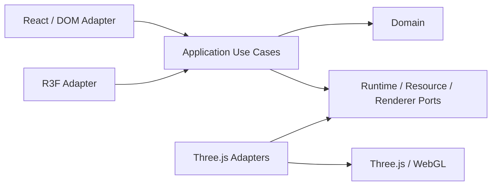

# Three.js 生产级架构参考：状态、资源与场景切换

“企业级”不是用了几个设计模式，而是系统在**重复挂载、并发切换、加载失败、GPU 上下文丢失和低端设备**上仍有可解释、可测试的行为。本文给出一套生产级参考，不承诺它适合所有团队；如果没有预算门禁、故障演练和真实设备数据，最多只能称为“面向生产设计”。

本文适合已经能完成 Three.js 或 React Three Fiber（R3F）场景，希望解决生命周期与复杂度问题的读者。示例使用 TypeScript 风格伪实现：省略具体 loader、材质和业务代码，但状态转移、取消、回滚与释放路径是完整的。

## 目录骨架

```text
src/3d/
├─ application/                 # 用例编排，只依赖 ports 与领域类型
│  ├─ SceneSwitchCoordinator.ts
│  └─ QualityPolicy.ts
├─ domain/                      # 无 React/Three 依赖的业务状态与命令
│  ├─ model.ts
│  └─ scene-config.ts
├─ runtime/                     # 唯一逐帧运行时
│  ├─ Ticker.ts
│  ├─ FrameState.ts
│  └─ InputSnapshot.ts
├─ scenes/                      # SceneDefinition 与场景适配器
│  ├─ showroom.ts
│  └─ fallback.ts
├─ resources/
│  ├─ AssetCache.ts             # key、去重、容量、淘汰、失败缓存
│  ├─ ResourceScope.ts          # acquire/release 与所有权层级
│  └─ loaders.ts                # AbortSignal、解码器与估算成本
├─ rendering/
│  ├─ RendererHost.ts           # renderer/composer/canvas/context 事件
│  ├─ CapabilityProbe.ts
│  └─ StaticFallback.ts
├─ adapters/
│  ├─ react/                    # store selector、DOM UI、生命周期桥
│  └─ r3f/                      # Canvas/useFrame/Suspense 适配
├─ observability/               # 指标、结构化事件、采样和脱敏
└─ tests/
   ├─ unit/
   ├─ race/
   ├─ visual/
   ├─ e2e/
   └─ performance/
```

依赖方向必须单向：



`domain` 不导入 React、Three.js 或浏览器 API；`application` 不读取组件 ref；底层 adapter 实现上层定义的 port。场景可以依赖领域类型和运行时接口，但不能反向调用 React setState。这样业务规则可在 Node 测试，渲染实现也可替换。

## 一、先划清三类状态边界

最常见的架构错误，是把所有状态都塞进 React store，或者把业务真相藏进 `mesh.userData`。应区分三个时钟：

| 状态 | 例子 | 权威来源 | 更新频率 | 读取方式 |
|---|---|---|---|---|
| 业务状态 | 当前产品、权限、订单状态、已确认选择 | domain/store/server | 事件驱动 | React selector、命令处理器 |
| React/UI 状态 | 面板开关、表单、加载提示、无障碍文案 | React | 事件驱动 | props/hooks |
| Three 逐帧状态 | 相机阻尼、骨骼姿态、粒子、临时矩阵 | runtime/Object3D | 每帧或固定步 | tick 系统直接读写 |

边界规则：

1. 业务状态是可序列化、可审计的真相。Mesh 点击只发出 `SelectProduct(id)`，不直接修改订单。
2. React 负责声明式 UI，不承担 60Hz 数据泵。每帧 `setState` 会引起不必要的协调和渲染。
3. Three 状态由单一 tick 更新。逐帧对象可变是有意为之，但不得成为业务事实的唯一副本。
4. 桥接是**低频命令向下、节流快照向上**：store 变化转成 runtime command；相机位置若要展示，按 5–10Hz 采样，而不是逐帧写 React。
5. 提交新场景时发布一次 `activeSceneId`；预加载过程不能提前污染当前业务选择。

```ts
// domain：不含 THREE.Object3D
export interface BusinessState {
  selectedProductId: string | null
  activeSceneId: string
  permissions: ReadonlySet<string>
}

export type RuntimeCommand =
  | { type: 'selection.changed'; objectId: string | null }
  | { type: 'camera.focus'; targetId: string }
  | { type: 'quality.changed'; tier: QualityTier }

// React effect/store subscriber 只在业务事件发生时投递。
export interface RuntimeCommandPort {
  dispatch(command: RuntimeCommand): void
}

// runtime 可变对象不会放回 React store。
export interface FrameState {
  frame: number
  nowMs: number
  renderDeltaSec: number
  simulationTimeSec: number
  alpha: number
}
```

不要维护“两份真相”。例如选中项 ID 在业务 store 中只有一份；Three 高亮系统订阅命令并维护派生的材质状态，DOM 详情面板读取同一个 ID。恢复上下文或重建场景时，派生状态可从业务真相重新投影。

## 二、模块职责与依赖方向

一套足够小、又能承载复杂项目的模块划分如下：

- **ApplicationShell**：启动/停止应用，组装依赖，不加载具体资产。
- **SceneSwitchCoordinator**：唯一有权提交活动场景；实现切换状态机、并发仲裁和回滚。
- **SceneDefinition**：声明配置、资产需求、构建、验证和首帧准备，不持有全局 renderer。
- **RendererHost**：拥有 canvas、renderer、composer 与 context 事件；只接受可渲染场景。
- **Ticker**：唯一 `requestAnimationFrame` 来源；按阶段调度系统。
- **AssetCache**：请求去重、失败短缓存、预算、LRU 淘汰；不决定场景生命周期。
- **ResourceScope**：记录“谁 acquire 了什么”，保证 release 成对且幂等。
- **CapabilityProbe / QualityPolicy**：把能力事实映射为质量档位，不散落设备 UA 判断。
- **Observability**：接收结构化事件；业务模块不直接调用第三方埋点 SDK。

禁止的依赖包括：loader 导入 React store、Mesh 直接切路由、场景调用 `renderer.setAnimationLoop`、缓存主动销毁仍被 scope 引用的资源，以及监控 SDK 收集完整 URL/对象名称后再“事后脱敏”。

## 三、资源所有权：先定义谁释放，再创建资源

资源按寿命分四层，而不是按“是否全局变量”判断：

| 层级 | 典型资源 | 创建者 | 释放时机 |
|---|---|---|---|
| `renderer` | renderer、composer、render target、PMREM 基础设施 | RendererHost | 应用最终关闭或不可恢复重建 |
| `app` | 跨场景字体、共享环境贴图、解码器/worker 池 | AppScope | ApplicationShell 停止 |
| `scene` | 当前场景 GLB、材质实例、mixer、场景 render target | SceneScope | 新场景首帧确认后释放旧场景 |
| `transient` | 拾取临时目标、截图 RT、一次性过渡纹理 | 操作用子 scope | 操作结束、取消或失败的 `finally` |

“从 scene remove”不等于释放 GPU 资源；`Object3D` 本身通常没有统一 `dispose()`，需要释放 geometry、material、texture、render target、skeleton 等真正分配资源的对象。共享资源绝不能通过遍历旧场景并无条件 `dispose()` 处理。

```ts
export type ResourceLevel = 'renderer' | 'app' | 'scene' | 'transient'
export type ResourceKey = string & { readonly __resourceKey: unique symbol }

export interface DisposableResource {
  readonly key: ResourceKey
  readonly estimatedBytes: number
  dispose(): void | Promise<void> // 实现自身也应幂等
}

export interface ResourceLease<T> {
  readonly key: ResourceKey
  readonly value: T
  release(): void                 // 多次调用无副作用
}

export interface ResourceManager {
  acquire<T>(request: AssetRequest<T>, signal: AbortSignal): Promise<ResourceLease<T>>
  createScope(level: ResourceLevel, label: string): ResourceScope
}

export interface ResourceScope {
  readonly level: ResourceLevel
  adopt<T>(lease: ResourceLease<T>): T
  releaseAll(): Promise<void>     // 逆序、幂等；单项失败不阻断其余释放
}
```

引用计数的语义必须明确：缓存条目存在不代表正在使用；每次成功 `acquire` 增加引用，每个 lease 恰好一次有效 `release`。`refs > 0` 的条目不可淘汰；`refs === 0` 只是“可淘汰”，不必立即销毁。场景若需要同一纹理两次，应得到两个 lease，或者由 scope 内部对相同 lease 做显式 retain，不能靠猜测对象引用数。

幂等释放可用闭包封住：

```ts
function onceRelease(releaseImpl: () => void): () => void {
  let released = false
  return () => {
    if (released) return
    released = true
    releaseImpl()
  }
}
```

共享 geometry/texture/material 的所有权属于缓存或 app scope，场景只持 lease。场景自己 clone 的材质属于 scene scope。把共享纹理挂在场景私有材质上，不会自动转移纹理所有权；释放材质时不能顺手释放共享 map。

## 四、缓存不是一个 `Map<url, object>`

### 4.1 稳定 key

URL 相同不代表产物相同。key 至少覆盖会改变解码结果或 GPU 表示的参数：

```ts
export interface AssetRequest<T> {
  url: string
  kind: 'gltf' | 'texture' | 'hdr' | 'audio'
  version: string               // manifest hash，而不是当前时间
  variant: string               // draco/meshopt、KTX2 target、LOD 等
  colorSpace?: 'srgb' | 'linear'
  mipmaps?: boolean
  transformRevision?: string    // 运行时后处理规则版本
  load(ctx: { signal: AbortSignal }): Promise<DisposableResource & { value: T }>
}

function cacheKey(r: AssetRequest<unknown>): ResourceKey {
  const canonical = JSON.stringify({
    url: new URL(r.url, location.origin).href,
    kind: r.kind,
    version: r.version,
    variant: r.variant,
    colorSpace: r.colorSpace ?? null,
    mipmaps: r.mipmaps ?? null,
    transformRevision: r.transformRevision ?? null,
  })
  return canonical as ResourceKey
}
```

签名 URL 若 token 会变化，应在可信 manifest 中提供稳定资产 ID/version；不要武断删除所有 query 参数，否则可能把不同变体合并。

### 4.2 去重、容量与淘汰

缓存条目需要区分 `pending | ready | failed`。并发 acquire 共用同一个 pending Promise；每个调用仍获得独立 lease。容量同时限制条目数与估算字节数，且只从 `refs === 0` 的 ready 条目按 LRU 淘汰。若全部条目都在使用，缓存应拒绝低优先级预加载或上报预算压力，不能销毁活跃资源。

```ts
interface CachePolicy {
  maxEntries: number
  maxEstimatedBytes: number
  failureTtlMs: number
  maxFailureEntries: number
}

interface ReadyEntry<T> {
  state: 'ready'
  resource: DisposableResource & { value: T }
  refs: number
  lastUsedMs: number
}

interface PendingEntry<T> {
  state: 'pending'
  promise: Promise<DisposableResource & { value: T }>
  waiters: number
}

interface FailedEntry {
  state: 'failed'
  errorCode: 'network' | 'decode' | 'invalid' | 'unsupported'
  retryAfterMs: number
}
```

`estimatedBytes` 是预算近似值：纹理应按解码后尺寸、格式和 mipmap 估算，geometry 按 attribute/index 字节估算；网络 Content-Length 不能代表显存。定期用 `renderer.info`、浏览器性能数据和真实设备校准，但不要把估算值伪装成精确显存。

### 4.3 失败缓存

失败也需要短期缓存，防止十个组件同时重试同一个坏资源形成风暴。只缓存稳定错误码和到期时间，不长期缓存 Error/堆栈；超时、离线、5xx 使用短 TTL 与指数退避，配置非法或格式不支持可保持到 manifest 版本变化。用户主动“重试”可以清除对应失败条目。失败缓存也受 `maxFailureEntries` 限制。

## 五、异步加载：Abort 只是第一道门

`fetch` 可以响应 `AbortSignal`，但某些 loader、图片解码、worker 解码或 GPU 上传不一定能被真正中止。因此必须同时使用：

1. **AbortController**：尽量停止网络和支持取消的工作。
2. **session token**：阻止旧会话的晚返回提交状态。
3. **晚返回释放**：失效会话若最终拿到新资源，立即 release/dispose。
4. **finally 清理**：无论成功、失败或取消，都移除监听器和 transient 资源。

```ts
class SessionGate {
  #current = 0

  next(): number { return ++this.#current }
  isCurrent(token: number): boolean { return token === this.#current }
  invalidate(): void { this.#current++ }
}

async function guardedAcquire<T>(
  gate: SessionGate,
  token: number,
  manager: ResourceManager,
  request: AssetRequest<T>,
  signal: AbortSignal,
): Promise<ResourceLease<T>> {
  const lease = await manager.acquire(request, signal)
  if (signal.aborted || !gate.isCurrent(token)) {
    lease.release() // loader 不可取消时，晚返回也不会泄漏
    throw new DOMException('Stale scene session', 'AbortError')
  }
  return lease
}
```

不要只在 `catch` 中判断取消：Promise 可能成功后才发现 session 已过期。也不要让旧请求的 `finally` 无条件把全局 `loading=false`；loading 必须按 session ID 更新，否则旧请求会清掉新切换的进度。

## 六、场景切换是一项事务

直接把 `currentScene = await load(next)` 会产生白屏、竞态与半提交状态。可靠切换使用如下状态机：

```text
idle
  └─ request → preload → validate → commit → first-frame → release → idle
                   │          │         │            │
                   └──────────┴─────────┴─ failure ──┴→ rollback → idle

任意阶段收到更新请求：旧 session 失效并 abort；只有最新 session 可 commit。
context lost：暂停在安全点，不把“未渲染”误判成 first-frame。
```

各阶段的提交边界：

- **preload**：在独立 `SceneScope` 中 acquire、构建候选场景；活动场景不变。
- **validate**：校验 schema、必需节点、相机、资源预算和目标设备能力；可预编译 shader，但预编译成功不等于首帧成功。
- **commit**：极短的同步操作，把 renderer 指向候选场景；保留旧场景和旧 scope 作为回滚点。
- **first-frame**：等待候选场景真正成功渲染一帧。超时或渲染异常则回滚。
- **release**：首帧确认后才释放旧场景；释放失败记录告警，但不能撤销已成功的新场景。
- **rollback**：重新绑定旧场景，释放候选 scope，并恢复旧的业务 scene ID。

### 6.1 场景与端口接口

```ts
export type SceneId = string & { readonly __sceneId: unique symbol }
export type QualityTier = 'static' | 'low' | 'medium' | 'high'

export interface SceneConfig {
  id: SceneId
  revision: string
  entryCamera: string
  assets: readonly AssetRequest<unknown>[]
  requiredNodeNames: readonly string[]
  estimatedPeakBytes: number
}

export interface PreparedScene {
  readonly id: SceneId
  readonly revision: string
  readonly root: THREE.Scene
  readonly camera: THREE.Camera
  readonly scope: ResourceScope
  validate(ctx: ValidationContext): Promise<void>
  onEnter(): void
  onExit(): void
}

export interface SceneFactory {
  prepare(
    config: SceneConfig,
    ctx: { scope: ResourceScope; signal: AbortSignal; session: number },
  ): Promise<PreparedScene>
}

export interface RendererHost {
  readonly contextState: 'ready' | 'lost' | 'restoring'
  getBinding(): { scene: THREE.Scene; camera: THREE.Camera } | null
  bind(scene: THREE.Scene, camera: THREE.Camera): void
  compile(scene: THREE.Scene, camera: THREE.Camera): Promise<void>
  waitForSuccessfulFrame(options: {
    scene: THREE.Scene
    session: number
    timeoutMs: number
    signal: AbortSignal
  }): Promise<void>
}

export interface SceneStorePort {
  publish(input: { activeSceneId: SceneId; switchSession: number }): void
  publishFailure(input: { requestedSceneId: SceneId; code: string; switchSession: number }): void
}
```

### 6.2 完整场景切换伪实现

下面实现采用 **latest-wins**：新请求会取消旧请求。另一种合理策略是串行队列，但必须显式定义，不能让两个 commit 竞争。这里的 mutex 只保护 commit/rollback 短临界区，耗时 preload 不持锁。

```ts
type SwitchPhase =
  | 'idle' | 'preload' | 'validate' | 'commit'
  | 'first-frame' | 'release' | 'rollback'

interface ActiveScene {
  prepared: PreparedScene
  binding: { scene: THREE.Scene; camera: THREE.Camera }
}

class AsyncMutex {
  #tail: Promise<void> = Promise.resolve()

  async runExclusive<T>(work: () => Promise<T>): Promise<T> {
    const previous = this.#tail
    let unlock!: () => void
    this.#tail = new Promise<void>((resolve) => { unlock = resolve })
    await previous
    try { return await work() } finally { unlock() }
  }
}

class SceneSwitchCoordinator {
  #session = 0
  #controller: AbortController | null = null
  #phase: SwitchPhase = 'idle'
  #active: ActiveScene | null = null
  #commitMutex = new AsyncMutex()
  #switchSettled: Promise<void> = Promise.resolve()

  constructor(
    private readonly resources: ResourceManager,
    private readonly factory: SceneFactory,
    private readonly renderer: RendererHost,
    private readonly store: SceneStorePort,
    private readonly telemetry: { emit(name: string, fields: Record<string, unknown>): void },
  ) {}

  async switchTo(config: SceneConfig): Promise<void> {
    // latest-wins：令上一会话失效，并尽力取消其 I/O。
    // preload 可并发，但新会话 commit 前必须等上一事务完成回滚/释放交接。
    const waitForPriorSettlement = this.#switchSettled
    let markSettled!: () => void
    this.#switchSettled = new Promise<void>((resolve) => { markSettled = resolve })

    const session = ++this.#session
    this.#controller?.abort('superseded')
    const controller = new AbortController()
    this.#controller = controller
    const signal = controller.signal

    const candidateScope = this.resources.createScope(
      'scene',
      `scene:${config.id}:session:${session}`,
    )
    let candidate: PreparedScene | null = null
    let committed = false
    let previous: ActiveScene | null = null
    const startedAt = performance.now()

    const ensureCurrent = () => {
      if (signal.aborted || session !== this.#session) {
        throw new DOMException('Scene switch superseded', 'AbortError')
      }
    }

    try {
      this.#setPhase('preload', session, config.id)
      // factory 的所有 acquire 都必须 adopt 到 candidateScope。
      candidate = await this.factory.prepare(config, {
        scope: candidateScope,
        signal,
        session,
      })
      ensureCurrent() // 捕获不可取消 loader 的晚返回

      this.#setPhase('validate', session, config.id)
      await candidate.validate({
        quality: this.#qualityForCurrentDevice(),
        maxPeakBytes: this.#sceneBudgetBytes(),
      })
      ensureCurrent()
      await this.renderer.compile(candidate.root, candidate.camera)
      ensureCurrent()

      // 上一会话若已 commit，必须先完成其回滚/交接；否则本会话的
      // rollback target 可能被上一会话提前释放。
      await waitForPriorSettlement
      ensureCurrent()

      await this.#commitMutex.runExclusive(async () => {
        ensureCurrent()
        if (this.renderer.contextState !== 'ready') {
          throw new Error('RENDER_CONTEXT_NOT_READY')
        }

        this.#setPhase('commit', session, config.id)
        previous = this.#active
        if (previous) {
          try { previous.prepared.onExit() } catch (exitError) {
            // 生命周期通知失败不能把 renderer 留在半提交状态；记录后继续切换。
            this.#reportCleanupError(exitError, 'previous-onExit')
          }
        }

        this.renderer.bind(candidate!.root, candidate!.camera)
        this.#active = {
          prepared: candidate!,
          binding: { scene: candidate!.root, camera: candidate!.camera },
        }
        committed = true
        // active/committed 先与 binding 对齐；onEnter 抛错会进入下面的回滚路径。
        candidate!.onEnter()
      })

      this.#setPhase('first-frame', session, config.id)
      // host 只在该 scene/session 的 render 成功后 resolve；context lost 不算成功。
      await this.renderer.waitForSuccessfulFrame({
        scene: candidate.root,
        session,
        timeoutMs: 8_000,
        signal,
      })
      ensureCurrent()

      // 到首帧为止，业务 store 才承认新场景生效。
      this.store.publish({ activeSceneId: config.id, switchSession: session })

      this.#setPhase('release', session, config.id)
      if (previous) {
        // 此后释放旧场景失败只告警，不回滚已显示的新场景。
        await this.#safeRelease(previous.prepared, 'replaced-scene')
        previous = null
      }

      this.telemetry.emit('scene_switch_succeeded', {
        sceneId: config.id,
        session,
        durationMs: performance.now() - startedAt,
      })
    } catch (error) {
      const stale = signal.aborted || session !== this.#session

      if (committed) {
        await this.#commitMutex.runExclusive(async () => {
          // 只有失败会话仍占据 active 时才可回滚；不能覆盖更新会话。
          if (this.#active?.prepared === candidate) {
            this.#setPhase('rollback', session, config.id)
            try { candidate?.onExit() } catch (exitError) {
              this.#reportCleanupError(exitError, 'candidate-onExit')
            }

            if (previous) {
              try {
                this.renderer.bind(previous.binding.scene, previous.binding.camera)
                this.#active = previous
                previous.prepared.onEnter()
              } catch (restoreError) {
                this.#reportCleanupError(restoreError, 'rollback-previous')
                this.#active = null
                this.#bindRuntimeFallback()
              }
            } else {
              // 首次启动无旧场景：RendererHost 绑定静态/最小 fallback。
              this.#active = null
              this.#bindRuntimeFallback()
            }
          }
        })
      }

      // 候选无论在 preload、validate、首帧还是回滚阶段失败都必须释放。
      if (candidate) await this.#safeRelease(candidate, 'failed-candidate')
      else await this.#safeReleaseScope(candidateScope, 'failed-preparation')

      if (!stale) {
        this.store.publishFailure({
          requestedSceneId: config.id,
          code: this.#publicErrorCode(error),
          switchSession: session,
        })
        this.telemetry.emit('scene_switch_failed', {
          sceneId: config.id,
          session,
          phase: this.#phase,
          code: this.#publicErrorCode(error),
        })
        throw error
      }
      // 被更新请求取代属于预期控制流，不显示错误 toast。
    } finally {
      if (this.#controller === controller) this.#controller = null
      if (session === this.#session) this.#phase = 'idle'
      markSettled()
    }
  }

  cancelCurrent(reason = 'user-cancelled'): void {
    ++this.#session
    this.#controller?.abort(reason)
    this.#controller = null
  }

  #setPhase(phase: SwitchPhase, session: number, sceneId: SceneId): void {
    if (session !== this.#session) return
    this.#phase = phase
    this.telemetry.emit('scene_switch_phase', { phase, session, sceneId })
  }

  async #safeRelease(scene: PreparedScene, reason: string): Promise<void> {
    // onExit 只在已经 onEnter 的场景离开 active binding 时调用一次；
    // 未 commit 的候选只需释放 scope，避免重复执行生命周期回调。
    await this.#safeReleaseScope(scene.scope, reason)
  }

  async #safeReleaseScope(scope: ResourceScope, reason: string): Promise<void> {
    try { await scope.releaseAll() } catch (error) { this.#reportCleanupError(error, reason) }
  }

  // 以下策略由注入配置实现，这里只展示调用边界。
  #qualityForCurrentDevice(): QualityTier { return 'medium' }
  #sceneBudgetBytes(): number { return 256 * 1024 * 1024 }
  #bindRuntimeFallback(): void { /* bind minimal scene or stop WebGL and show DOM fallback */ }
  #publicErrorCode(_e: unknown): string { return 'SCENE_SWITCH_FAILED' }
  #reportCleanupError(_e: unknown, _where: string): void { /* local structured log */ }
}
```

实现中的关键不变量是：任意时刻只有一个 active binding；候选在首帧前不能释放旧场景；旧 session 不能提交、回滚或改写新 session 的 loading；每个失败/取消路径最终都释放 candidate scope。

若两个场景同时驻留会超过峰值预算，应在 validate 前选择替代策略：降低候选 LOD、使用过渡静态图后提前释放旧场景，或拒绝切换并保留旧场景。不要等浏览器杀掉 context 才处理。

## 七、单一 tick：阶段固定，模拟固定步

应用中只能有一个 `requestAnimationFrame` 或 `renderer.setAnimationLoop` 所有者。React 组件、controls、physics 和 tween 都注册到 Ticker，而不是各自开循环。推荐阶段顺序：

1. **input**：快照化自上一帧以来的输入，清空事件队列。
2. **commands**：应用低频业务/runtime 命令。
3. **fixed simulation**：以固定 `step` 推进物理、确定性玩法；限制追帧次数。
4. **animation**：更新 mixer、tween 和程序动画。
5. **transform**：同步模拟结果、约束、骨骼与世界矩阵。
6. **camera**：controls/相机跟随读取最新目标。
7. **visibility**：视锥、LOD、按需资源决策。
8. **render**：主渲染与后处理，只执行一次。
9. **post-frame**：解析首帧 waiter、低频指标采样；不得回头修改本帧画面。

```ts
type TickPhase =
  | 'input' | 'commands' | 'fixed' | 'animation'
  | 'transform' | 'camera' | 'visibility' | 'render' | 'post-frame'

type TickSystem = (state: FrameState, fixedStepSec?: number) => void

class Ticker {
  private accumulator = 0
  private previousMs = 0
  private frame = 0
  private simulationTime = 0
  private running = false
  private readonly systems = new Map<TickPhase, TickSystem[]>()
  private readonly fixedStep = 1 / 60
  private readonly maxCatchUpSteps = 5

  start(): void {
    if (this.running) return
    this.running = true
    this.previousMs = performance.now()
    requestAnimationFrame(this.tick)
  }

  stop(): void { this.running = false }

  private tick = (nowMs: number): void => {
    if (!this.running) return

    // 限制切后台后的超大 delta，避免“死亡螺旋”。
    const delta = Math.min((nowMs - this.previousMs) / 1000, 0.1)
    this.previousMs = nowMs
    this.accumulator += delta

    const state: FrameState = {
      frame: ++this.frame,
      nowMs,
      renderDeltaSec: delta,
      simulationTimeSec: 0,
      alpha: 0,
    }

    this.run('input', state)
    this.run('commands', state)

    let steps = 0
    while (this.accumulator >= this.fixedStep && steps < this.maxCatchUpSteps) {
      this.simulationTime += this.fixedStep
      state.simulationTimeSec = this.simulationTime
      this.run('fixed', state, this.fixedStep)
      this.accumulator -= this.fixedStep
      steps++
    }
    if (steps === this.maxCatchUpSteps && this.accumulator >= this.fixedStep) {
      // 丢弃过多欠债并计数；不能无限追帧拖垮主线程。
      this.accumulator %= this.fixedStep
    }

    state.alpha = this.accumulator / this.fixedStep
    this.run('animation', state)
    this.run('transform', state)
    this.run('camera', state)
    this.run('visibility', state)
    this.run('render', state)
    this.run('post-frame', state)

    requestAnimationFrame(this.tick)
  }

  private run(phase: TickPhase, state: FrameState, step?: number): void {
    for (const system of this.systems.get(phase) ?? []) system(state, step)
  }
}
```

固定步只用于需要稳定模拟的系统；视觉动画仍可用 render delta。渲染时以 `alpha` 在前后模拟状态间插值。页面隐藏、reduced-motion、context lost 和按需渲染都由 Ticker 策略统一处理。

## 八、Context Lost 不是 React ErrorBoundary

WebGL context 丢失通过 canvas 原生事件报告，通常不会变成 React render 异常。ErrorBoundary 可以兜住组件渲染错误，但不能替代以下真实事件处理：

```ts
class WebGLContextLifecycle {
  private state: 'ready' | 'lost' | 'restoring' = 'ready'

  constructor(
    private readonly canvas: HTMLCanvasElement,
    private readonly ticker: Ticker,
    private readonly rendererHost: {
      pauseGpuWork(): void
      rebuildGpuResourcesFromCpuState(): Promise<void>
      renderRecoveryFrame(): Promise<void>
    },
    private readonly showFallback: (reason: string) => void,
    private readonly hideFallback: () => void,
  ) {}

  attach(): () => void {
    const onLost = (event: WebGLContextEvent) => {
      // 请求浏览器允许稍后恢复；同时必须停止继续提交 GPU 工作。
      event.preventDefault()
      this.state = 'lost'
      this.ticker.stop()
      this.rendererHost.pauseGpuWork()
      this.showFallback('graphics-context-lost')
    }

    const onRestored = async () => {
      if (this.state !== 'lost') return
      this.state = 'restoring'
      try {
        // 从 CPU 配置/缓存重新建立 render target、材质程序和自定义 GPU 资源。
        await this.rendererHost.rebuildGpuResourcesFromCpuState()
        await this.rendererHost.renderRecoveryFrame()
        this.state = 'ready'
        this.hideFallback()
        this.ticker.start()
      } catch {
        // 恢复失败保持静态 fallback，并提供明确重试/刷新入口。
        this.state = 'lost'
        this.showFallback('graphics-restore-failed')
      }
    }

    this.canvas.addEventListener('webglcontextlost', onLost)
    this.canvas.addEventListener('webglcontextrestored', onRestored)
    return () => {
      this.canvas.removeEventListener('webglcontextlost', onLost)
      this.canvas.removeEventListener('webglcontextrestored', onRestored)
    }
  }
}
```

恢复时不要假设旧 WebGL handle 仍有效。Three.js 能重建其管理的一部分内部状态，但自定义 render target、raw WebGL 资源、第三方后处理和 worker/GPU 桥仍需逐项验证。场景切换的 first-frame waiter 在 lost 期间必须暂停或失败，不能因 RAF 回调执行过就 resolve。

开发环境可用 `WEBGL_lose_context` 扩展触发演练，但生产代码不能依赖该扩展存在。监听还要在 Canvas 卸载时移除，防止 StrictMode 重复挂载产生双重恢复。

## 九、能力检测、质量档位与静态 fallback

不要用 UA 字符串判断“手机=低配”。能力检测给出事实，质量策略再作决定：

```ts
interface GraphicsCapabilities {
  webgl2: boolean
  maxTextureSize: number
  maxSamples: number
  floatRenderTarget: boolean
  compressedTextureFamilies: readonly string[]
  deviceMemoryGB?: number       // 浏览器可能不提供，只能作弱信号
  hardwareConcurrency?: number
  reducedMotion: boolean
  saveData: boolean
}

interface QualityProfile {
  tier: QualityTier
  dpr: [number, number]
  shadowMapSize: 0 | 512 | 1024 | 2048
  postprocessing: boolean
  maxTextureDimension: number
  particleBudget: number
  targetFrameMs: number
}
```

质量档位应由启动能力、资产兼容性和运行时迟滞共同决定：连续多个采样窗口超预算才降级，稳定足够久才升级，避免每秒跳档。升级要比降级更保守；切换纹理/阴影档位应走资源事务，不能在一帧中无预算地成倍驻留。

`prefers-reduced-motion: reduce` 不是“降低一点速度”：应关闭自动运镜、循环视差、粒子风暴和非必要转场；保留用户主动操作的即时反馈，并确保内容仍可访问。`saveData` 可禁用非必要 3D 预加载。

静态 fallback 是正式产品路径，不是错误页：

- 服务端/首屏先输出海报、产品图、关键文本和 DOM 操作入口。
- WebGL 不可用、能力不足、reduced-motion 策略要求、持续 context 恢复失败时保留静态内容。
- Canvas 成功首帧后再隐藏海报，避免黑屏。
- 核心业务（价格、购买、表单、导航）不得只存在于 3D 场景。
- fallback 图片需要版本、alt 文本和响应式尺寸，也要纳入视觉测试。

## 十、配置驱动之前，先做 schema 验证

TypeScript 只检查编译期，后端 JSON、CMS 和本地缓存仍是不可信输入。配置应在进入 scene factory 前解析成已验证类型；拒绝未知版本、重复 ID、非有限数、非法 URL、越界纹理尺寸和不受支持的节点类型。

```ts
import { z } from 'zod'

const finite = z.number().finite()
const vec3 = z.tuple([finite, finite, finite])

const sceneConfigSchema = z.object({
  schemaVersion: z.literal(1),
  id: z.string().min(1).max(80).regex(/^[a-z0-9-]+$/),
  revision: z.string().min(1).max(128),
  entryCamera: z.string().min(1),
  objects: z.array(z.object({
    id: z.string().min(1).max(80),
    type: z.enum(['model', 'light', 'hotspot']),
    assetId: z.string().min(1).optional(),
    position: vec3,
    scale: vec3.refine((v) => v.every((n) => n > 0 && n <= 100), 'scale 超出范围'),
  }).strict()).max(5_000),
  assets: z.array(z.object({
    id: z.string().min(1),
    url: z.string().url().refine((url) => new URL(url).protocol === 'https:', '仅允许 HTTPS'),
    sha256: z.string().regex(/^[a-f0-9]{64}$/),
    estimatedBytes: z.number().int().nonnegative().max(512 * 1024 * 1024),
  }).strict()).max(1_000),
}).strict().superRefine((config, ctx) => {
  const ids = new Set<string>()
  config.objects.forEach((object, index) => {
    if (ids.has(object.id)) {
      ctx.addIssue({ code: 'custom', path: ['objects', index, 'id'], message: '对象 ID 重复' })
    }
    ids.add(object.id)
  })
})

type ValidSceneConfig = z.infer<typeof sceneConfigSchema>

export function parseSceneConfig(input: unknown): ValidSceneConfig {
  const result = sceneConfigSchema.safeParse(input)
  if (!result.success) {
    // 客户端只显示稳定错误码；详细路径进入受控本地日志，不上报原始配置。
    throw new Error('SCENE_CONFIG_INVALID')
  }
  return result.data
}
```

URL 校验还应结合允许的 CDN origin 白名单；`https:` 不是内容可信证明。哈希、签名 manifest、CSP 与资产管线负责完整性和来源约束。schema 版本升级应提供纯函数 migration，并保留旧配置 fixture 回归测试。

## 十一、原生 Three.js 与 R3F：所有权模型不同

| 问题 | 原生 Three.js | R3F |
|---|---|---|
| renderer/循环 | 应由 RendererHost 明确拥有 | `<Canvas>` 通常拥有 renderer 与 frameloop；不要另开 RAF |
| 声明式对象 | 手动创建、挂载、移除和释放 | reconciler 创建的对象卸载时通常会处理 dispose |
| `<primitive object={x}>` | 不适用 | 外部对象的所有权仍在调用方，不能假设自动释放 |
| loader 缓存 | 自建 acquire/release | `useLoader`/生态 loader 可能共享缓存，单组件不能擅自 dispose 共享结果 |
| 禁止自动释放 | 自己控制 | `dispose={null}` 会改变自动释放行为，必须另有 owner |
| 场景切换 | coordinator 绑定 scene/camera | 可用 key/Suspense/route，但事务、晚返回与旧场景保留仍需应用层协调 |

R3F 的“自动 dispose”不是全局垃圾回收器。由 JSX 创建且仅属于该子树的 geometry/material，卸载时通常可交给 R3F；缓存模型、跨组件共享纹理、全局环境、手工 clone、postprocessing target 和 primitive 必须按真实 owner 管理。尤其不要在某个组件 cleanup 中遍历并释放 `useGLTF` 返回的共享场景，这会破坏其他挂载者。

R3F 中仍应保持单一帧阶段。可以由一个最高优先级的 `useFrame` adapter 调用领域 Ticker 阶段，或约定 `useFrame` priority；不要依赖组件挂载顺序形成隐式调度。若接管正优先级渲染，必须确保最终只有一次显式 render。

## 十二、测试策略：测试不变量，而不只是截图

### 12.1 单元测试

优先测试不依赖浏览器/GPU 的纯逻辑：

- cache key 对参数顺序稳定，关键变体不同必得不同 key；
- 同 key 并发 acquire 只调用一次 loader，但生成独立 lease；
- release/dispose 幂等，引用降至 0 才进入可淘汰集合；
- LRU 不淘汰 `refs > 0`，字节与条目预算同时生效；
- 失败缓存到期、手动重试和 manifest 版本变化行为；
- schema 对重复 ID、NaN/Infinity、未知字段、超预算配置拒绝；
- fixed-step 在不同 render delta 序列下得到相同模拟结果。

资源对象使用 spy，不要求单元测试真的创建 WebGL context：

```ts
it('同 key 去重，并在最后一个 lease 释放后才允许淘汰', async () => {
  const load = vi.fn().mockResolvedValue(fakeResource({ bytes: 1024 }))
  const [a, b] = await Promise.all([
    cache.acquire(request(load), new AbortController().signal),
    cache.acquire(request(load), new AbortController().signal),
  ])

  expect(load).toHaveBeenCalledTimes(1)
  a.release()
  expect(cache.inspect(a.key).refs).toBe(1)
  b.release()
  b.release() // 幂等
  expect(cache.inspect(a.key).refs).toBe(0)
})
```

### 12.2 竞态与生命周期测试

使用可控 Promise 和 fake timer，而不是依赖“碰巧够慢”的网络：

1. 发起 A，随后发起 B；让 B 先完成、A 晚返回。断言 active=B，A lease 已释放，A 不改 loading。
2. A 已 commit 但首帧失败。断言重新绑定旧场景，候选 scope 释放，业务 ID 未变。
3. A 释放旧场景期间发起 B。断言 B 不会被 A 的 finally 或 rollback 覆盖。
4. Abort 后 loader 仍成功返回。断言 guardedAcquire 立即 release。
5. context lost 发生在 preload、commit 和 first-frame 三个位置，断言不会误报成功。
6. React StrictMode 下反复 mount/unmount 100 次，监听器、RAF、worker、cache refs 回到基线；dispose 每个资源至多一次。

反复挂载测试应记录 `getEventListeners` 的等价封装计数、活动 RAF、scope 数、worker 数和 `renderer.info` 趋势。JS heap 一次增长不等于泄漏；先强制进入稳定空闲点并多轮观察趋势。

### 12.3 视觉、E2E 与性能门禁

- **视觉回归**：固定相机、固定随机种子、固定时间和质量档位；比较关键场景、静态 fallback、reduced-motion 与恢复后首帧。为抗锯齿差异设置经验证的容差，不掩盖大面积变化。
- **E2E**：覆盖首次加载、A→B、快速 A→B→C、离线、404/损坏 GLB、取消、context lost/restored、WebGL 不可用和键盘可达的 DOM fallback。
- **性能门禁**：在固定设备/浏览器或稳定 CI 环境测量 p75 首帧、切换耗时、长任务、draw calls、triangles、纹理/geometry 计数和稳态帧时；移动真机另做发布门禁。

示例预算必须由项目基线校准，不能照抄：

```ts
interface PerformanceBudget {
  firstInteractiveFrameP75Ms: number
  sceneSwitchP75Ms: number
  steadyFrameP95Ms: number
  maxLongTasksOver50Ms: number
  maxDrawCalls: number
  maxTriangles: number
  maxEstimatedGpuBytes: number
  maxResourceGrowthAfter20Switches: number
}
```

门禁比较同一场景、档位、视口和缓存冷热状态。平均 FPS 会隐藏尖峰，至少看 p95/p99 帧时与长任务。GPU 型号不同的公共 CI 不适合像素级和绝对性能硬比较，应使用受控 runner 或分设备基线。

## 十三、可观测性：能定位问题，也要保护隐私

建议事件采用稳定 schema，而不是自由文本：

```ts
interface TelemetryEventMap {
  scene_switch_phase: {
    sceneId: string
    phase: SwitchPhase
    session: number
    elapsedMs: number
  }
  asset_load_finished: {
    assetClass: 'gltf' | 'texture' | 'hdr' | 'audio'
    assetVersion: string
    cache: 'hit' | 'miss' | 'deduped' | 'negative-hit'
    durationMs: number
    estimatedBytes: number
    result: 'ok' | 'aborted' | 'network' | 'decode' | 'invalid'
  }
  frame_health: {
    qualityTier: QualityTier
    frameP95Ms: number
    drawCalls: number
    triangles: number
    contextLossCount: number
  }
}
```

必须能回答：哪个发布版本、哪个场景版本、哪个质量档位、在哪个阶段失败、是否 cache hit、是否发生取消或 context loss，以及释放后资源计数是否回落。指标使用直方图和计数器；详细 trace 只做低比例采样，故障会话可提高采样但仍受上限约束。

隐私边界同样属于架构：

- 不上传相机完整轨迹、原始指针流、用户输入、完整资产 URL query、对象自定义名称或 GPU 未加工标识。
- scene/asset 使用白名单 ID 或不可逆、带版本的分类标识；删除 token、签名 URL、用户 ID 和配置正文。
- GPU/设备信息做粗粒度分桶，并评估指纹识别风险；不是“能读到就能上报”。
- 明确同意、保留周期、采样率、地区合规和删除机制；关闭遥测不能破坏应用。
- 客户端只展示稳定错误码和可操作提示，详细堆栈留在本地受控日志；上报前再次脱敏。

可观测模块应有字段 allowlist 和 payload 大小上限。日志发送失败不能进入逐帧重试；离线队列要限容量、限保留期，并在 session 结束后清理敏感上下文。

## 十四、故障演练手册

演练不是“拔网线看看”。每个实验都要写明注入点、预期状态转移、用户体验和资源不变量。

### 演练 1：A→B→C 并发切换，A 最晚返回

**注入**：对 A/B loader 使用 deferred Promise；先请求 A，再 B，再 C，按 C、B、A 顺序 resolve。

**预期**：A/B 收到 abort；即使不响应 abort，晚返回 lease 也立即 release。只有 C 进入 commit/first-frame，store 的 activeSceneId 只发布 C。A/B 的 finally 不关闭 C 的 loading。

**检查**：`scene_switch_succeeded` 仅 C 一次；A/B scope 均已释放；cache refs 与 active C 的资源集合一致。

### 演练 2：候选首帧 shader/渲染失败

**注入**：让 `waitForSuccessfulFrame` 对 B reject，旧场景 A 保持可用。

**预期**：状态 `commit → first-frame → rollback → idle`；renderer 重新绑定 A，A.onEnter 恢复交互；B.onExit 与 B.scope.releaseAll 执行；业务 scene ID 仍为 A，用户看到可重试提示而非黑屏。

**检查**：B 从未被业务层宣布 active；B 的 transient/render target 无残留；回滚后 A 下一帧成功。

### 演练 3：旧场景释放部分失败

**注入**：新场景 B 首帧成功后，让 A 的一个自定义资源 `dispose` 抛错。

**预期**：scope 继续逆序释放其余资源；B 保持 active，不做错误回滚；产生 cleanup 告警和资源 key 分类，但不上传原始 URL。

**检查**：除故障资源外引用回到基线；告警不会每帧重复；后续场景切换仍可工作。

### 演练 4：context 在 first-frame 前丢失并恢复

**注入**：测试环境通过浏览器支持的调试扩展触发丢失，随后恢复。

**预期**：`webglcontextlost` 被 `preventDefault`，Ticker 停止，静态 fallback 显示；first-frame 不 resolve。恢复后重建 GPU 资源并成功渲染恢复帧，再继续或重新发起当前切换。

**检查**：没有第二个 RAF、重复监听器或重复 renderer；业务状态未因 context 丢失清空；恢复失败时核心 DOM 功能仍可用。

### 演练 5：缓存压力且所有条目仍被引用

**注入**：把预算调低到不足以同时容纳 A/B，保持 A 的 refs > 0，再预加载 B。

**预期**：缓存不淘汰 A；QualityPolicy 选择 B 的低档资源、静态过渡后释放 A，或以 `RESOURCE_BUDGET_EXCEEDED` 拒绝切换。绝不随机 dispose 活跃纹理。

**检查**：无材质变黑/采样已释放纹理；拒绝时 A 保持交互；指标记录预算分桶，不记录资源 URL。

### 演练 6：损坏配置与失败缓存

**注入**：返回重复对象 ID、Infinity 坐标或哈希不符的 manifest；十个调用方同时请求同一损坏资产。

**预期**：schema/完整性验证在构建前失败；同 key 只有一次底层加载，随后命中短期失败缓存；用户主动重试或版本变化后允许新请求。

**检查**：没有半构建 Object3D 挂入 active scene；错误消息不暴露配置正文、签名 URL或堆栈；失败缓存受容量限制。

## 十五、上线检查清单

- [ ] 业务、React、逐帧状态各有唯一权威来源，桥接频率明确。
- [ ] 依赖只朝 domain/port 方向；具体 scene、React 与 loader 不互相反向导入。
- [ ] renderer/app/scene/transient scope 可被检查，所有 release/dispose 幂等。
- [ ] cache key 包含产物变体；pending 去重、引用计数、双重预算、LRU 与失败 TTL 有测试。
- [ ] Abort、session token 和晚返回 release 三者同时存在。
- [ ] 切换严格经过 preload→validate→commit→first-frame→release，并能回滚。
- [ ] 并发策略是明确的 latest-wins 或队列，而不是 Promise 竞速。
- [ ] 全应用只有一个 tick 所有者，阶段和固定步追帧上限固定。
- [ ] 真实监听 `webglcontextlost/restored`；ErrorBoundary 仅承担 React 异常职责。
- [ ] 能力检测、质量档位、reduced-motion、save-data 和静态 fallback 可独立验证。
- [ ] 外部配置运行时校验、版本化、限额，并约束资产来源。
- [ ] 原生/R3F/primitive/loader cache 的 owner 已逐项标注。
- [ ] 单元、竞态、反复 mount、视觉、E2E 和性能预算进入 CI/发布流程。
- [ ] 遥测有 allowlist、采样、保留期、脱敏和关闭路径。
- [ ] 六类故障演练至少在预发布环境执行并留有结果。

## 总结

生产级 Three.js 架构的核心不是类的数量，而是几个可验证的不变量：业务真相不被逐帧状态污染；资源的 acquire/release 成对且共享安全；旧异步结果永远不能提交；新场景首帧成功前旧场景仍可回滚；全应用只有一条帧时间线；context 丢失有真实恢复路径；不能运行 3D 时核心业务仍然成立。

做到这些，系统才从“能展示的 Demo”进入“可以运营的产品”。至于能否称为企业级，还取决于团队是否真的执行容量规划、隐私评审、性能门禁、故障演练和长期线上观测，而不是标题里写了什么。
