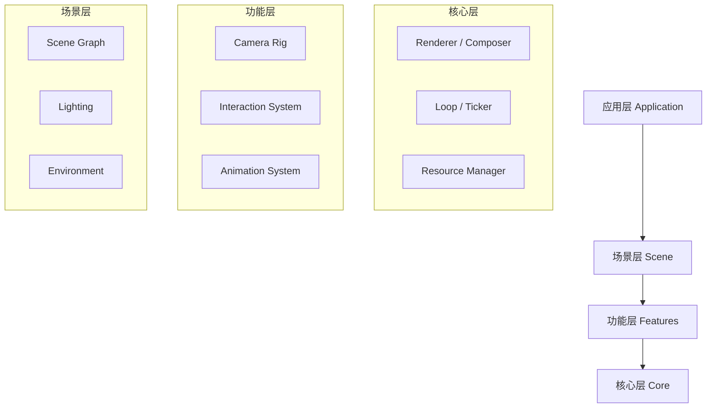

# Three.js 架构设计指南：构建企业级 Web 3D 应用

写一个旋转的立方体很容易，但构建一个包含几十个场景、复杂交互、动态资源加载的大型 Web 3D 应用却很难。

如果没有良好的架构设计，你的项目很快就会变成一团“面条代码”：资源无法释放导致内存泄漏、交互逻辑耦合严重、改一个材质牵一发而动全身。

本文将基于实际工程经验，探讨如何设计一个**模块化、数据驱动、可观测**的 Three.js 应用架构。

---

## 一、 模块化与分层架构

一个健壮的 3D 应用应该像千层饼一样分层清晰。

### 1. 架构分层图



### 2. 各层职责详解

#### **渲染层 (Renderer / Composer)**
这是最底层，负责“怎么画”。
*   **职责**: 管理 `WebGLRenderer` 实例、配置后期处理 (`EffectComposer`)、处理屏幕适配 (`Resize`)。
*   **原则**: 全局单例。整个应用通常只需要一个 Canvas/Renderer。

#### **资源层 (Asset Manager)**
负责“画什么”。
*   **职责**: 加载模型、纹理、音频。管理缓存、去重、以及最重要的——**资源释放**。
*   **R3F 实践**: 使用 `useLoader` 或 `useGLTF`，React Suspense 会自动处理加载状态。

#### **交互层 (Interaction Layer)**
负责“怎么玩”。
*   **职责**: 统一管理鼠标/触控输入，维护交互状态（Hover, Active, Dragging）。
*   **设计**: 推荐使用**事件总线 (Event Bus)** 或 **全局状态 (Zustand)** 来解耦。不要在 Mesh 组件里直接写业务逻辑。

#### **动画层 (Animation Layer)**
负责“怎么动”。
*   **职责**: 统一的时间循环 (`requestAnimationFrame`)。
*   **原则**: 所有的动画更新（GSAP, TWEEN, Physics）都应该挂载到同一个 `Tick` 系统中，统一暂停/恢复。

---

## 二、 场景管理与生命周期

Three.js 开发中最臭名昭著的问题就是**内存泄漏**。

### 1. 资源释放 (Dispose)
在原生 Three.js 中，当你移除一个 Mesh，它的 Geometry 和 Material 并不会自动从显存中删除。你必须手动调用 `dispose()`。

```javascript
// 原生 Three.js 的噩梦
scene.remove(mesh);
mesh.geometry.dispose();
mesh.material.dispose();
mesh.material.map.dispose(); // 别忘了贴图！
```

**React Three Fiber (R3F)** 的最大优势就在这里：**它会自动处理 Dispose**。当组件卸载时，R3F 会自动追踪并释放所有资源。

### 2. 多场景切换
在大型应用中（如展厅漫游），我们经常需要在不同场景间切换。
*   **策略**: 使用路由 (Router) 或状态管理来切换根组件。
*   **转场**: 在卸载旧场景前，先截图作为背景，然后加载新场景，实现无缝过渡。

### 3. 统一的 Update/Tick 系统
不要在每个组件里自己写 `requestAnimationFrame`。R3F 提供了 `useFrame` 钩子，它会将回调注册到全局的渲染循环中。

```javascript
// 好的实践：统一的时间驱动
useFrame((state, delta) => {
  // delta 是两帧之间的时间差，用它来保证动画速度在不同帧率下一致
  mesh.rotation.y += speed * delta 
})
```

---

## 三、 配置驱动 (Configuration Driven)

硬编码是维护性的天敌。把场景数据从代码中剥离出来，用 JSON 或后端 API 来驱动生成。

### 1. 什么是配置驱动？
不要写死 `position={[10, 0, 0]}`，而是定义一份 Schema。
这让非开发人员（策划、美术）也能通过编辑器修改场景。

### 2. 实战：JSON 驱动的展厅
在这个 Demo 中，场景里的物体完全由 `config` 对象生成。你可以想象这个 JSON 是从后端 API 拉取的。

<CodePenDemo title="Config Driven Scene" code={`
// 模拟从后端获取的配置数据
const sceneConfig = {
  items: [
    { id: 1, type: 'box', position: [-2, 0, 0], color: 'orange', label: '产品 A' },
    { id: 2, type: 'sphere', position: [0, 0, 0], color: 'hotpink', label: '核心组件' },
    { id: 3, type: 'cone', position: [2, 0, 0], color: 'cyan', label: '配件 B' }
  ],
  lighting: {
    ambient: 0.5,
    directional: { position: [5, 5, 5], intensity: 1 }
  }
}

// 通用组件工厂
function ItemFactory({ type, ...props }) {
  const meshRef = useRef()
  const [hovered, setHover] = useState(false)
  
  // 简单的交互动画
  useFrame((state, delta) => {
    if (hovered) meshRef.current.rotation.y += delta * 2
    else meshRef.current.rotation.y += delta * 0.5
  })

  return (
    <mesh 
      ref={meshRef}
      position={props.position}
      onPointerOver={() => setHover(true)}
      onPointerOut={() => setHover(false)}
    >
      {type === 'box' && <boxGeometry />}
      {type === 'sphere' && <sphereGeometry args={[0.7]} />}
      {type === 'cone' && <coneGeometry args={[0.7, 1.5]} />}
      <meshStandardMaterial color={props.color} />
      
      {/* 动态生成的标签 */}
      <Html position={[0, -1.2, 0]} center>
        <div className="bg-black/50 text-white text-xs px-2 py-1 rounded whitespace-nowrap">
          {props.label}
        </div>
      </Html>
    </mesh>
  )
}

function GeneratedScene() {
  return (
    <>
      {/* 渲染配置中的所有物体 */}
      {sceneConfig.items.map(item => (
        <ItemFactory key={item.id} {...item} />
      ))}
      
      {/* 渲染配置中的光照 */}
      <ambientLight intensity={sceneConfig.lighting.ambient} />
      <directionalLight 
        position={sceneConfig.lighting.directional.position} 
        intensity={sceneConfig.lighting.directional.intensity} 
      />
      
      <OrbitControls />
    </>
  )
}

render(
  <Canvas camera={{ position: [0, 2, 6] }}>
    <GeneratedScene />
  </Canvas>
)
`} />

---

## 四、 可测试性与可观测性

Web 3D 应用往往是“黑盒”，出了 Bug 很难复现。我们需要给它装上仪表盘。

### 1. 性能监控 (Stats)
时刻关注 FPS (帧率)、Draw Calls (绘制调用次数)、Triangles (面数)。
使用 `r3f-perf` 或 `stats.js`。

```javascript
import { Stats } from '@react-three/drei'

<Canvas>
  <Stats /> {/* 在左上角显示性能面板 */}
</Canvas>
```

### 2. 错误边界 (Error Boundary)
WebGL 上下文丢失 (Context Lost) 是常见且致命的错误。
使用 `ErrorBoundary` 包裹 Canvas，当渲染崩溃时，显示一个友好的降级 UI（比如显示一张静态图片），而不是让整个页面白屏。

### 3. 日志与埋点
不要只 `console.log`。封装一个 `Logger` 模块。
*   **加载耗时**: 记录 `useGLTF` 开始和结束的时间。
*   **交互路径**: 记录用户点击了哪些 3D 物体，摄像机停留的位置（热力图数据）。
*   **设备信息**: 上报用户的 GPU 型号 (`renderer.capabilities`)，便于分析低端机兼容性问题。

## 五、 综合实战：智能家居控制台

最后，我们将所有概念整合到一个“智能家居控制台”的 Demo 中。
这个示例包含了：
*   **配置驱动**: 设备列表由数据定义。
*   **状态管理**: 使用简单的 Context 模拟全局状态。
*   **交互层**: 点击开关设备，触发状态变更。
*   **动画层**: 设备状态改变触发平滑动画。
*   **UI 融合**: HTML 标签显示实时数据。
*   **性能监控**: 集成了 Stats 面板。

<CodePenDemo title="Smart Home Dashboard" code={`
import { Stats } from '@react-three/drei'

// 1. 数据层 (Data Layer)
const initialConfig = [
  { id: 'lamp', type: 'lamp', name: '台灯', position: [-1.5, 0, 0], color: '#facc15' },
  { id: 'fan', type: 'fan', name: '风扇', position: [1.5, 0, 0], color: '#60a5fa' }
]

// 2. 状态管理 (State Management)
// 简单的 Context 用于跨组件通信
const AppContext = React.createContext(null)

function AppProvider({ children }) {
  // 存储设备开关状态: { lamp: true, fan: false }
  const [deviceStates, setDeviceStates] = useState({})

  const toggleDevice = (id) => {
    setDeviceStates(prev => ({
      ...prev,
      [id]: !prev[id]
    }))
  }

  return (
    <AppContext.Provider value={{ deviceStates, toggleDevice }}>
      {children}
    </AppContext.Provider>
  )
}

// 3. 功能层 (Feature Layer) - 设备组件
function SmartDevice({ config }) {
  const { deviceStates, toggleDevice } = React.useContext(AppContext)
  const isOn = !!deviceStates[config.id]
  const meshRef = useRef()
  
  // 4. 动画层 (Animation Layer)
  useFrame((state, delta) => {
    // 简单的动画逻辑：根据状态改变行为
    if (config.type === 'fan' && isOn) {
      meshRef.current.rotation.y += delta * 5 // 风扇旋转
    }
    
    // 台灯的呼吸灯效果
    if (config.type === 'lamp' && isOn) {
      meshRef.current.position.y = Math.sin(state.clock.elapsedTime * 2) * 0.1
    } else {
      meshRef.current.position.y = THREE.MathUtils.lerp(meshRef.current.position.y, 0, 0.1)
    }
  })

  return (
    <group position={config.position}>
      <mesh 
        ref={meshRef}
        onClick={(e) => {
          e.stopPropagation()
          toggleDevice(config.id)
        }}
        onPointerOver={() => document.body.style.cursor = 'pointer'}
        onPointerOut={() => document.body.style.cursor = 'auto'}
      >
        {config.type === 'lamp' ? (
          <coneGeometry args={[0.5, 1, 32]} />
        ) : (
          <boxGeometry args={[1, 0.2, 0.2]} />
        )}
        
        <meshStandardMaterial 
          color={isOn ? config.color : '#666'} 
          emissive={isOn ? config.color : '#000'}
          emissiveIntensity={isOn ? 1 : 0}
        />
      </mesh>
      
      {/* UI 层 */}
      <Html position={[0, -1, 0]} center>
        <div className="flex flex-col items-center gap-1">
          <div className="bg-black/70 text-white text-xs px-2 py-1 rounded backdrop-blur-md whitespace-nowrap">
            {config.name}
          </div>
          <button 
            className={\`px-3 py-1 rounded text-xs font-bold transition-colors \${
              isOn ? 'bg-green-500 text-white' : 'bg-gray-200 text-gray-800'
            }\`}
            onClick={() => toggleDevice(config.id)}
          >
            {isOn ? 'ON' : 'OFF'}
          </button>
        </div>
      </Html>
      
      {/* 状态指示灯 (光源) */}
      {config.type === 'lamp' && isOn && (
        <pointLight position={[0, -0.5, 0]} intensity={2} distance={3} color={config.color} />
      )}
    </group>
  )
}

// 5. 场景层 (Scene Layer)
function Scene() {
  return (
    <>
      <group position={[0, 0.5, 0]}>
        {initialConfig.map(item => (
          <SmartDevice key={item.id} config={item} />
        ))}
      </group>
      
      <mesh rotation={[-Math.PI/2, 0, 0]} position={[0, -0.5, 0]} receiveShadow>
        <planeGeometry args={[10, 10]} />
        <meshStandardMaterial color="#222" />
        <gridHelper args={[10, 10, '#444', '#333']} rotation={[-Math.PI/2, 0, 0]} />
      </mesh>

      <ambientLight intensity={0.2} />
      <directionalLight position={[5, 10, 5]} intensity={0.5} />
      
      <OrbitControls makeDefault />
      
      {/* 6. 监控层 (Monitoring) */}
      <Stats className="!absolute !top-0 !left-0" />
    </>
  )
}

render(
  <AppProvider>
    <Canvas camera={{ position: [0, 2, 5] }}>
      <Scene />
    </Canvas>
  </AppProvider>
)
`} />

## 总结

好的架构不是设计出来的，是演进出来的。但在开始写第一行代码前，心中要有图谱：
1.  **分层**：渲染、场景、交互、数据分离。
2.  **生命周期**：时刻警惕资源释放。
3.  **数据驱动**：让 JSON 定义世界，代码只负责解释 JSON。
4.  **监控**：让黑盒变白盒。

遵循这些原则，你的 Three.js 应用才能从一个 Demo 进化为产品。
