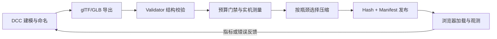

# Three.js 资产管线实战：用一个真实 glTF 从 DCC 走到发布

这篇文章直接使用真实资产。仓库已经包含一个合法、自包含的 glTF 2.0 文件：

```text
public/models/threejs-course-product.gltf
浏览器 URL：/blog/models/threejs-course-product.gltf
```

它把二进制 buffer 以内嵌 Base64 data URI 保存，因此离线运行本站时不需要模型 CDN、外部 `.bin` 或纹理文件。资产声明为 `CC0-1.0`，包含 4 个命名 node、3 个命名 mesh、3 个命名 PBR material，以及一段 3 秒的 `StatusControlSpin` 旋转动画。三个网格都引用同一组立方体 attribute/index 数据，用不同 node 变换组成产品外壳、显示面板和状态控件。

:::important 路径为何带 `/blog`
本站在 `next.config.ts` 中配置了 `basePath: '/blog'`。`public` 中的静态资源在部署后要使用带 basePath 的 URL。若把示例复制到没有 basePath 的独立 Vite 项目，请改成 `/models/threejs-course-product.gltf`。
:::

本文要建立的不是“会调用 Loader”这一项技能，而是一条可审计的链路：



## 一、先解剖课程资产：glTF 保存的不是“一个 Mesh”

打开 `threejs-course-product.gltf` 可以看到顶层的 `scenes`、`nodes`、`meshes`、`materials`、`accessors`、`bufferViews`、`buffers` 和 `animations`。它们不是重复信息，而是不同层级的语义：
| glTF 概念 | 本文件中的例子 | 运行时意义 |
| --- | --- | --- |
| scene/node | `CourseProductRoot`、`DisplayPanel` | 场景图、父子关系与 TRS 变换；node 本身不等于几何体 |
| mesh/primitive | `DisplayMesh` 的一个 primitive | primitive 把 attribute、index、material 组合成一次可绘制单元 |
| geometry 数据 | `CubePositions`、`CubeNormals`、`CubeIndices` | position 决定形状，normal 参与光照，index 组装三角形 |
| material | `CasingMat`、`ScreenMat`、`AccentMat` | PBR 参数描述表面，不等于 Three.js 某个材质实例的所有运行时状态 |
| texture/image/sampler | 本课程资产刻意没有纹理 | 真实项目中分别表达纹理引用、图像字节与采样方式；颜色纹理和数据纹理还涉及不同色彩空间 |
| animation | `StatusControlSpin` | sampler 保存时间与值，channel 指向 node 的 `rotation`；这里输出值是四元数 |

本文件的 buffer 布局可以直接算清：

```text
0..287     24 × VEC3 float32 position = 288 bytes
288..575   24 × VEC3 float32 normal   = 288 bytes
576..647   36 × uint16 index           = 72 bytes
648..659   3 × float32 time            = 12 bytes
660..707   3 × VEC4 float32 rotation   = 48 bytes
总计                                      708 bytes
```

`accessor` 给 byte 区间加上 component type、元素数量、向量类型和可选 min/max；`bufferView` 再把 accessor 映射到底层 buffer。文件合法的必要条件之一，是每个 accessor 所需字节都落在其 bufferView 内，所有 bufferView 又都落在声明的 708 字节 buffer 内。Base64 只是二进制的文本编码，并不会改变这些偏移。

:::note 资产小不等于生产策略
课程资产没有 UV、纹理、蒙皮和 morph target，目的是让 JSON 可读、离线且容易验证。它不是产品模型质量或预算的模板。真实资产是否需要这些数据，要由视觉目标和目标设备决定。
:::

## 二、DCC：先约定语义，再讨论导出按钮

Blender、Maya、3ds Max 等 DCC 是资产语义的源头。导出器只能转换已有信息，不能替团队猜测“哪个节点是屏幕”“哪个动画允许循环”。建议在源文件评审中固定以下约定：

1. **单位与尺度**：团队明确米、厘米等工作单位，并用已知尺寸的参照物验收；不要只凭“看起来差不多”。
2. **坐标与朝向**：glTF 使用右手坐标、`+Y` 向上、`+Z` 向前的约定；交给导出器转换 DCC 坐标，并在 Validator/查看器中复核，避免代码层长期挂一个神秘补偿旋转。
3. **原点与层级**：原点应服务于实际旋转、放置或装配。课程资产的 `StatusControl` 有独立 node，动画才能只作用在控件上。
4. **变换**：冻结/应用变换不是无条件规则。静态网格通常适合清理非预期负缩放和剪切；需要保留的层级动画、实例关系、骨骼 bind pose 则不能盲目应用。
5. **命名**：node、mesh、material、animation 分别命名；名称用于诊断和弱契约，不应成为唯一业务 ID。命名重复在 DCC 中可能合法，却会让按名称生成的对象映射发生覆盖或后缀变化。
6. **材质边界**：一个 mesh 的多个 material slot 通常导出为多个 primitive，可能增加 draw call。合并材质、做图集是否值得，要结合复用、清晰度和更新成本评估。
7. **动画范围**：明确 clip 名称、起止帧、是否循环、root motion、事件点和骨骼集合；删除导出范围外的测试 action。

导出后不要覆盖 DCC 源文件。推荐保留三层产物：

```text
source/       可编辑的 .blend/.ma 等源文件
exchange/     从 DCC 导出的未压缩、可检查 glTF/GLB
dist/         经过验证、优化、hash 后可发布的资产
```

这样出现压缩伪影时，可以区分问题来自建模、导出还是优化步骤，而不是对一个文件反复做不可逆处理。

## 三、`.gltf` 与 `.glb`：容器选择，不是质量等级

两者都承载 glTF 2.0 语义，Three.js 最终得到的场景能力没有天然高低之分。

| 形式 | 优点 | 代价与适用边界 |
| --- | --- | --- |
| `.gltf` + 外部 `.bin`/图片 | JSON 易 diff/检查；图片可能独立缓存和替换 | 多个 URL 必须保持相对路径、CORS 与发布原子性；漏传任一依赖就会失败 |
| `.gltf` + Base64 data URI | 真正单文件、文本可读；本课程资产采用此形式 | Base64 本身有编码膨胀，JSON 解析和内存峰值也不理想，不适合据此断言生产最优 |
| `.glb` | JSON、BIN、可选内嵌图片在一个二进制容器中；单请求和版本管理简单 | 无法独立缓存其中纹理；任何局部修改通常改变整个文件；并不保证比拆分方案总字节更小 |

选择应回答四个问题：依赖是否要独立缓存？资产是否经常只更新纹理？发布系统能否原子切换一组文件？请求/连接和 CDN 策略是什么？课程资产选内嵌 `.gltf` 是为了教学与离线，不代表线上必须跟随。

## 四、导出后第一关：Validator，而不是肉眼看一眼

“某个查看器能打开”只能说明一条加载路径容忍了它，不等于规范合法。每次 DCC 导出和每次优化之后都应运行 Khronos glTF Validator，并把 error 作为 CI 失败条件；warning 是否允许应建立显式白名单并写明原因。

Validator 关注版本、schema、引用、accessor 边界、索引范围、动画输入递增、四元数与扩展使用等结构问题。它不会替你判断模型是否符合品牌外观、是否太重、动画是否穿模，所以还需要预算与视觉回归。

使用官方 Validator 的 JavaScript API 时，可以做成类似下面的 CI 脚本；实际项目应锁定经团队验证的包版本：

```javascript
// validate-gltf.mjs
import fs from 'node:fs/promises';
import { validateString } from 'gltf-validator';

const file = 'public/models/threejs-course-product.gltf';
const jsonText = await fs.readFile(file, 'utf8');
const report = await validateString(jsonText, {
  uri: file,
  externalResourceFunction: async (uri) => {
    // 本课程文件使用 data URI，不会走这里；拆分 glTF 需按 glTF 文件目录解析 uri。
    return new Uint8Array(await fs.readFile(new URL(uri, `file://${file}`)));
  },
});

console.log(JSON.stringify(report.info, null, 2));
if (report.issues.numErrors > 0) process.exitCode = 1;
```

除了规范校验，仓库还可以加入一个小型一致性检查：解码 `buffers[0].uri`，断言实际为 708 字节；按 accessor 的 component size、type 分量数、count 和 byteStride 计算末端；再断言最大 index 小于 position count。这个检查不能替代官方 Validator，但能及时发现手改 Base64、offset 或 count 的低级错误。

## 五、第二关：预算是多维门禁，不是只看 MB

先定义目标设备、网络档位和使用场景，再建立基线。不要从别人的博客复制固定阈值。至少记录：

- 传输字节：容器、几何、纹理、动画分别占多少；
- 解码/解析时间、主线程长任务、峰值 JS/WASM 内存；
- GPU 侧 vertex/index/texture 估算与纹理 mip 成本；
- primitive/draw call、三角形、材质/着色器变体；
- 首次可交互、模型首次可见和动画可播放时间；
- 最低目标设备上的稳态帧率与卡顿分位数。

课程资产的静态事实是：内嵌 buffer 为 708 字节，存一套 12 三角形的立方体数据，3 个 mesh primitive 各绘制一次，因此完整产品通常贡献 3 个 draw call 和 36 个绘制三角形；文件没有纹理。JSON、Base64 与 HTTP 压缩后的传输大小要另测，不能拿 708 字节代替整个响应大小。

预算最好由“总预算 + 单资产上限 + 场景峰值”构成。单个模型都合格，并不保证同屏二十个模型合格；反之，首屏外按需加载的高细节资产可能不应占用首屏预算。

## 六、第三关：按瓶颈选择 Draco、Meshopt、KTX2

压缩不是固定套餐，也不存在对所有模型都成立的收益比例。保留未优化 exchange 版本，分别生成候选产物，在目标设备测传输、解码、内存、画质和首帧。

### 1. Draco 与 Meshopt：主要处理几何传输

- **Draco** 通过 `KHR_draco_mesh_compression` 表达压缩 primitive，压缩率、量化误差和解码成本与网格有关。需要 `DRACOLoader` 及匹配的 decoder 文件。
- **Meshopt** 通过 `EXT_meshopt_compression` 压缩 bufferView，常与顶点缓存/抓取优化配合；需要 Meshopt decoder。它与 Draco 是不同方案，通常为同一几何选择并比较，而不是默认叠加。
- 小资产、程序生成几何、CPU 紧张设备或已被传输压缩有效覆盖的内容，可能不值得增加 decoder 与启动成本。

### 2. KTX2：让纹理以 GPU 友好格式交付

KTX2/Basis Universal 常通过 `KHR_texture_basisu` 引用。`KTX2Loader.detectSupport(renderer)` 会根据设备选择可采样格式。它能减少某些纹理的传输和 GPU 占用，但编码模式会影响质量、alpha、法线数据和转码成本。颜色贴图、法线贴图、遮罩图不能无脑共用同一编码参数。

本课程资产没有这些扩展，所以**加载它不需要任何 decoder**。下面配置仅用于你把候选产物压缩之后：

```javascript
import { GLTFLoader } from 'three/addons/loaders/GLTFLoader.js';
import { DRACOLoader } from 'three/addons/loaders/DRACOLoader.js';
import { KTX2Loader } from 'three/addons/loaders/KTX2Loader.js';
import { MeshoptDecoder } from 'three/addons/libs/meshopt_decoder.module.js';

const draco = new DRACOLoader().setDecoderPath('/blog/decoders/draco/');
const ktx2 = new KTX2Loader()
  .setTranscoderPath('/blog/decoders/basis/')
  .detectSupport(renderer);

const loader = new GLTFLoader()
  .setDRACOLoader(draco)
  .setMeshoptDecoder(MeshoptDecoder)
  .setKTX2Loader(ktx2);

// 课程资产没有压缩扩展，因此这些 decoder 不会被调用；仍加载真实本地文件。
// 换成压缩候选 URL 后，同一 loader 才会按 extensionsRequired 启用对应 decoder。
const gltf = await loader.loadAsync('/blog/models/threejs-course-product.gltf');

// 整个 viewer 结束时再释放 decoder/transcoder 辅助资源。
draco.dispose();
ktx2.dispose();
```

decoder 路径也必须被版本化、可离线访问并与 loader 兼容。依赖公共 CDN 会破坏“离线可用”，还会增加 CORS、供应链和版本漂移风险。
## 七、原生 Three.js：真实加载、检查并播放本地动画

下面是一个可直接放进现代构建项目入口的完整示例。它没有硬编码 `gltf.nodes.DisplayPanel`，而是先遍历并检查实际类型；课程资产改名后会给出可理解的错误，而不是在深层属性访问处崩溃。

```javascript
import * as THREE from 'three';
import { GLTFLoader } from 'three/addons/loaders/GLTFLoader.js';
import { OrbitControls } from 'three/addons/controls/OrbitControls.js';

const PRODUCT_URL = '/blog/models/threejs-course-product.gltf';
const canvas = document.querySelector('canvas.webgl');
const status = document.querySelector('[data-status]');

const scene = new THREE.Scene();
scene.background = new THREE.Color(0x10151f);

const camera = new THREE.PerspectiveCamera(45, innerWidth / innerHeight, 0.1, 100);
camera.position.set(3.8, 2.6, 4.8);

const renderer = new THREE.WebGLRenderer({ canvas, antialias: true });
renderer.setPixelRatio(Math.min(devicePixelRatio, 2));
renderer.setSize(innerWidth, innerHeight);
renderer.outputColorSpace = THREE.SRGBColorSpace;

const controls = new OrbitControls(camera, renderer.domElement);
controls.enableDamping = true;
scene.add(new THREE.HemisphereLight(0xffffff, 0x263040, 2.2));
const keyLight = new THREE.DirectionalLight(0xffffff, 3);
keyLight.position.set(3, 4, 5);
scene.add(keyLight);

const loader = new GLTFLoader();
const clock = new THREE.Clock();
let mixer = null;

try {
  status.textContent = '正在加载课程资产…';
  const gltf = await loader.loadAsync(PRODUCT_URL, (event) => {
    // Content-Length 缺失时 total 可能为 0，不能伪造百分比。
    status.textContent = event.total > 0
      ? `正在加载 ${Math.round(event.loaded / event.total * 100)}%`
      : `已接收 ${event.loaded} 字节`;
  });

  gltf.scene.traverse((object) => {
    const kind = object.isMesh ? 'Mesh' : object.type;
    console.log(`${kind}: ${object.name || '(未命名)'}`);
  });

  const control = gltf.scene.getObjectByName('StatusControl');
  if (!control || !control.isMesh) {
    throw new Error('资产契约不满足：StatusControl 不存在或不是 Mesh');
  }

  scene.add(gltf.scene);

  const clip = THREE.AnimationClip.findByName(gltf.animations, 'StatusControlSpin');
  if (clip) {
    mixer = new THREE.AnimationMixer(gltf.scene);
    mixer.clipAction(clip).play();
  } else {
    console.warn('资产没有 StatusControlSpin，继续显示静态模型');
  }

  status.textContent = '加载完成';
} catch (error) {
  console.error('课程资产加载失败', error);
  status.textContent = '模型加载失败，请检查 Network 与 Console';
}

renderer.setAnimationLoop(() => {
  mixer?.update(clock.getDelta());
  controls.update();
  renderer.render(scene, camera);
});

addEventListener('resize', () => {
  camera.aspect = innerWidth / innerHeight;
  camera.updateProjectionMatrix();
  renderer.setSize(innerWidth, innerHeight);
});
```

对应的最小 HTML 容器是：

```html
<canvas class="webgl"></canvas>
<p data-status aria-live="polite">等待加载</p>
```

:::warning 名称是契约，但不要把导出结构当类型声明
`getObjectByName()` 可能返回任意 `Object3D`，名称也可能缺失或重复。先遍历记录真实结构，再检查对象存在且 `isMesh`/`isSkinnedMesh` 等能力符合要求。若名称是业务关键契约，在资产 CI 中检查它；不要把 `nodes.SomeName.geometry` 当作永远成立。
:::

## 八、R3F：`useGLTF`、Suspense、错误与重试

`useGLTF` 基于 Suspense 缓存加载结果。相同 URL 的并发调用通常共享同一加载任务，组件不必各自维护 `loading` 布尔值。但 Suspense 只解决“等待期间显示什么”，**不会自动处理失败 UI 或重试策略**；失败需要 Error Boundary。

下面是完整的 R3F 组件。它加载的仍是仓库中的真实课程资产，并播放真实 clip：

```jsx
import React, { Suspense, useEffect, useMemo, useState } from 'react';
import { Canvas } from '@react-three/fiber';
import { Html, OrbitControls, useAnimations, useGLTF } from '@react-three/drei';

const PRODUCT_URL = '/blog/models/threejs-course-product.gltf';

function Loading() {
  return <Html center><p style={{ color: 'white' }}>正在加载产品模型…</p></Html>;
}

function CourseProduct({ url }) {
  const { scene, animations } = useGLTF(url);

  // scene 只能有一个 parent。克隆 Object3D 层级，避免两个实例争抢 parent；
  // geometry/material 仍共享，降低重复 GPU 资源。
  const model = useMemo(() => scene.clone(true), [scene]);
  const { actions } = useAnimations(animations, model);

  useEffect(() => {
    const action = actions.StatusControlSpin;
    action?.reset().play();
    return () => action?.stop();
  }, [actions]);

  useEffect(() => {
    const control = model.getObjectByName('StatusControl');
    if (!control?.isMesh) {
      console.warn('StatusControl 缺失或类型改变；跳过控件交互');
    }
  }, [model]);

  // useGLTF 的缓存可能被其他组件共享，禁止卸载时递归 dispose。
  return <primitive object={model} dispose={null} />;
}

class ModelErrorBoundary extends React.Component {
  constructor(props) {
    super(props);
    this.state = { error: null };
  }

  static getDerivedStateFromError(error) {
    return { error };
  }

  componentDidCatch(error, info) {
    console.error('R3F 模型加载失败', error, info);
  }

  render() {
    if (!this.state.error) return this.props.children;
    return (
      <Html center>
        <div style={{ color: 'white', textAlign: 'center', width: 260 }}>
          <p>模型加载失败。请检查网络、响应类型与解码器。</p>
          <button onClick={this.props.onRetry}>重试</button>
        </div>
      </Html>
    );
  }
}

function Experience() {
  const [attempt, setAttempt] = useState(0);
  const url = attempt === 0 ? PRODUCT_URL : `${PRODUCT_URL}?retry=${attempt}`;

  const retry = () => {
    // 清除失败 URL 的缓存；新 query 也确保本次是新的资源键。
    useGLTF.clear(url);
    setAttempt((value) => value + 1);
  };

  return (
    <Canvas camera={{ position: [3.8, 2.6, 4.8], fov: 45 }}>
      <color attach="background" args={['#10151f']} />
      <hemisphereLight intensity={2.2} />
      <directionalLight position={[3, 4, 5]} intensity={3} />
      <ModelErrorBoundary key={attempt} onRetry={retry}>
        <Suspense fallback={<Loading />}>
          <CourseProduct url={url} />
        </Suspense>
      </ModelErrorBoundary>
      <OrbitControls makeDefault />
    </Canvas>
  );
}

export default Experience;
```

已知 URL 可以提前调用 `useGLTF.preload(PRODUCT_URL)`，把等待移到更早时机；这不会减少资产成本，只是改变开始加载的时刻。不要对用户永远不会访问的模型全部 preload。

### 加载状态的四条边界

1. fallback 要能长期存在：离线、慢网或 decoder 丢失时，不能只显示永不结束的 spinner；可配合超时提示，但超时不等于请求已经取消。
2. Error Boundary 要包住真正会 suspend/throw 的子树；普通 `try/catch` 包 JSX 捕获不到异步渲染错误。
3. 重试要让失败缓存失效。只把 Error Boundary 的 `error` 清空，若 hook 仍命中同一失败记录，组件会立刻再次失败。
4. URL query 作为重试键适合示例；生产中应限制次数、退避并记录原因，不能无限制造请求。

## 九、从症状定位 404、CORS、MIME 与 decoder 失败

按浏览器 Network → Response/Headers → Console 的顺序检查，不要把所有异常都显示成“模型坏了”。

| 症状 | 常见根因 | 检查与修复 |
| --- | --- | --- |
| 404，响应内容是 HTML | basePath 错、hash/manifest 指向不存在版本、相对依赖漏传 | 直接打开最终 URL；本站应为 `/blog/models/threejs-course-product.gltf` |
| CORS blocked | 模型或其 `.bin`/纹理/decoder 跨域，响应缺少允许当前 Origin 的头 | 在资产域配置精确的 CORS；不要用 `no-cors`，opaque response 不能正常解析 |
| JSON parse error / unexpected token `<` | 404 页面或登录页被当 glTF JSON | 看状态码与 Response，不能只看文件扩展名 |
| MIME/下载策略异常 | CDN 元数据错误、严格代理或安全策略拒绝 | `.gltf` 使用 `model/gltf+json`，`.glb` 使用 `model/gltf-binary`；decoder WASM 也要正确 MIME |
| `setDRACOLoader`/Meshopt/KTX2 相关错误 | 文件声明压缩扩展但 loader 未配置、decoder 路径 404、版本不匹配或 CSP 阻止 Worker/WASM | 读取 `extensionsUsed/Required`，检查 decoder 每个请求；让 loader 与 decoder 同版本发布 |
| 进度始终无百分比 | 服务端未提供可用 `Content-Length`，或经过流式/压缩传输 | 显示已接收字节或不确定进度，不要除以 0 |

课程资产同源、无外部依赖、无压缩扩展，因此不应触发 CORS 或 decoder 请求。若它仍返回 404，优先检查 `/blog` basePath 与部署是否包含 `public/models`。
## 十、缓存去重与异步竞态：URL 相同不代表生命周期相同

### 1. 原生 Loader 的请求去重

`GLTFLoader` 实例本身不承诺把两次 `loadAsync(url)` 合成同一个解析任务。原生项目可以用 Promise cache 显式定义策略：

```javascript
const loader = new GLTFLoader();
const gltfCache = new Map();

export function loadGLTFOnce(url) {
  if (!gltfCache.has(url)) {
    const task = loader.loadAsync(url).catch((error) => {
      // 失败不永久缓存，否则“重试”只会拿到同一个 rejected Promise。
      gltfCache.delete(url);
      throw error;
    });
    gltfCache.set(url, task);
  }
  return gltfCache.get(url);
}

export function evictGLTF(url) {
  // 这里只删除 JS cache；是否 dispose 要由资源所有者另行决定。
  gltfCache.delete(url);
}
```

这会同时缓存已完成结果。返回的 scene、geometry、material 因而是共享对象；调用方若要改变 node 变换，应 clone 场景层级，若要改材质参数，还要 clone 对应材质。缓存淘汰与 GPU 释放不是同一个操作。

`useGLTF` 已按 URL 做缓存，所以通常不应再在组件外套一层重复 Promise cache。关键是让 URL 稳定：同一文件加上无意义且不同的 query，会绕过去重。

### 2. Abort 只能取消它能触及的阶段

组件从 URL A 快速切到 B 时，A 可能后返回并覆盖 B。`GLTFLoader.loadAsync()` 没有提供一个能统一中止主文件、外部 buffer、图片、decoder 与解析工作的公共 Abort 句柄。可控场景中可以先用 `fetch(signal)` 取得主文件，再 `parseAsync`，同时用 session ID 阻止过期结果提交：

```jsx
import { useEffect, useRef, useState } from 'react';
import { GLTFLoader } from 'three/addons/loaders/GLTFLoader.js';

export function usePrivateGLTF(url) {
  const session = useRef(0);
  const [state, setState] = useState({ gltf: null, error: null });

  useEffect(() => {
    const current = ++session.current;
    const controller = new AbortController();
    const loader = new GLTFLoader();

    setState({ gltf: null, error: null });

    (async () => {
      try {
        const absoluteURL = new URL(url, window.location.href);
        const response = await fetch(absoluteURL, { signal: controller.signal });
        if (!response.ok) throw new Error(`模型请求失败：HTTP ${response.status}`);

        const bytes = await response.arrayBuffer();
        // path 用于解析拆分 .gltf 中的相对 URI；课程资产自包含，但仍正确传入。
        const resourcePath = new URL('.', absoluteURL).href;
        const gltf = await loader.parseAsync(bytes, resourcePath);

        if (session.current !== current) {
          // 此 hook 约定结果私有；过期且从未发布的结果可以在这里释放。
          disposePrivateScene(gltf.scene);
          return;
        }
        setState({ gltf, error: null });
      } catch (error) {
        if (error.name !== 'AbortError' && session.current === current) {
          setState({ gltf: null, error });
        }
      }
    })();

    return () => {
      controller.abort(); // 能中止 fetch；已经开始的 parse/decode 未必会停止。
      if (session.current === current) session.current += 1;
    };
  }, [url]);

  return state;
}
```

这里的 `disposePrivateScene` 只适用于“该 hook 独占加载结果”的契约。若结果来自 `useGLTF` 或全局 cache，过期组件无权释放共享资源。对于带外部 `.bin`、纹理或 decoder 的 glTF，上述 `fetch` 只直接取消主文件；session 检查仍是防止陈旧结果写入当前 UI 的最后边界。

## 十一、clone、`SkinnedMesh` 与资源所有权

`Object3D.clone(true)` 会复制 node 层级和变换，但通常仍共享 geometry、material、texture。它适合课程资产这种静态 mesh 的多实例展示，却不意味着“深拷贝了所有 GPU 资源”。

```javascript
const instance = gltf.scene.clone(true);
instance.position.x = 2; // 只改实例 node，不影响原场景的 position。

instance.traverse((object) => {
  if (!object.isMesh) return;

  // 只有确实要独立修改材质时才 clone；geometry 继续共享。
  object.material = Array.isArray(object.material)
    ? object.material.map((material) => material.clone())
    : object.material.clone();
});
```

普通 clone 不足以正确重建复杂蒙皮层级中 skeleton、bone 与 `SkinnedMesh` 的绑定。对蒙皮模型使用 `SkeletonUtils.clone()`：

```javascript
import * as SkeletonUtils from 'three/addons/utils/SkeletonUtils.js';

const animatedInstance = SkeletonUtils.clone(skinnedGLTF.scene);
const mixer = new THREE.AnimationMixer(animatedInstance);
mixer.clipAction(skinnedGLTF.animations[0]).play();
```

每个需要独立动画状态的实例通常要有自己的 `AnimationMixer`；共享 clip 数据没有问题。若模型使用 morph target，也要检查实例间权重是否按预期独立。

### 谁创建，谁释放；共享者不能擅自 dispose

建议明确三种所有权：

| 来源 | 典型所有者 | 卸载时策略 |
| --- | --- | --- |
| 组件私有 `new Geometry/Material/Texture` | 该组件 | 最后一次使用后 dispose |
| `useGLTF` / 全局 URL cache | 缓存层或应用级资产管理器 | 普通组件只解除引用，不递归 dispose |
| clone 的 node + 共享 geometry/material | node 由实例拥有，GPU 资源由源缓存拥有 | 移除 clone，不 dispose 共享资源 |
| clone 后新建的独立 material | clone 实例 | 实例销毁时只 dispose 这些独立材质 |

私有场景可以使用去重集合避免同一资源被重复释放：

```javascript
function disposePrivateScene(root) {
  const geometries = new Set();
  const materials = new Set();
  const textures = new Set();

  root.traverse((object) => {
    if (!object.isMesh) return;
    if (object.geometry) geometries.add(object.geometry);

    const list = Array.isArray(object.material) ? object.material : [object.material];
    for (const material of list) {
      if (!material) continue;
      materials.add(material);
      for (const value of Object.values(material)) {
        if (value?.isTexture) textures.add(value);
      }
    }
  });

  textures.forEach((texture) => texture.dispose());
  materials.forEach((material) => material.dispose());
  geometries.forEach((geometry) => geometry.dispose());
}
```

这段函数故意叫 `disposePrivateScene`：只有确认 texture/material/geometry 没有被缓存、其他场景或环境贴图共享时才能调用。`scene.remove(object)` 只移除场景关系，不释放 GPU 资源；反过来，错误 dispose 共享资源会迫使其他使用者重新上传，造成闪烁或性能抖动。对 ImageBitmap 等底层图像资源，还要按其创建方式考虑额外关闭责任。

在 R3F 中，声明式创建的资源通常由 reconciler 处理卸载，但 `<primitive>` 引入的是外部对象；文章示例使用 `dispose={null}` 明确保护 `useGLTF` 缓存共享的资源。若你建立自己的引用计数资产管理器，应由它统一 `acquire/release`，而不是让叶子组件猜测自己是不是最后一个使用者。

## 十二、发布：hash、manifest、CDN 原子切换与回滚

“给模型文件名加 hash”只解决缓存寻址，还没有解决多文件一致性。拆分 `.gltf` 可能同时引用 `.bin`、纹理和 decoder；若 manifest 先上线、依赖后上传，用户会在发布窗口看到 404。

推荐发布顺序：

<Steps>
### 构建 release 目录
从已通过 Validator 和预算门禁的产物计算内容 hash。外部依赖也使用内容 hash，或把整组资源放进不可变 release 前缀。

### 先上传所有不可变对象
上传模型、buffer、纹理、decoder 和 release manifest。对每个对象检查状态码、字节数与摘要，并做一次 CDN 回源/边缘 smoke test。

### 最后切换小型指针
原子覆盖一个短缓存或 `no-cache` 的 `current.json`，让它指向新的不可变 release manifest。对象存储对单对象替换通常可提供原子可见性，但仍要核对所用平台保证。

### 保留旧 release
监控加载成功率、首帧与 decoder 错误。回滚只需把 `current.json` 指回上一个已验证 manifest，不要覆盖旧 hash 文件。
</Steps>

一个 release manifest 可以是：

```json
{
  "release": "2026-01-16.1",
  "models": {
    "courseProduct": {
      "url": "/blog/models/threejs-course-product.4f2c9a.gltf",
      "sha256": "<完整摘要>",
      "bytes": 2460,
      "requiredExtensions": []
    }
  },
  "decoders": {}
}
```

上面的文件名、摘要和字节数是结构示意，不是当前未 hash 课程文件的真实 manifest，不能直接发布。CI 必须从构建产物生成这些字段，不能手填。

缓存策略通常分层：

```text
带内容 hash 的模型/纹理/decoder：Cache-Control: public, max-age=31536000, immutable
release manifest（URL 自身带 release/hash）：同样可 immutable
current.json 指针：Cache-Control: no-cache（或业务可接受的短 TTL）
```

`no-cache` 表示复用前重新验证，不等于完全不存储；若必须每次取最新指针可评估 `no-store`。CDN purge 不是原子发布的替代品。回滚时也不要“把旧内容覆盖到新 hash URL”，因为 immutable URL 的内容必须永不变化。

离线应用还需让 Service Worker/离线包把 **manifest 指向的资产与所需 decoder** 一并缓存，并验证首次离线启动，而不是只验证在线访问后断网。课程文件无外部依赖，因此很适合作为离线 smoke test。

## 十三、一条可落地的资产 CI

把前文串起来，一个可维护流水线应执行：

```text
DCC export
  → glTF Validator（结构 error = fail）
  → inspect/report（primitive、attribute、纹理、动画、扩展）
  → 未压缩基线预算
  → 生成 Draco 或 Meshopt、KTX2 等候选，而非默认全选
  → 再次 Validator
  → 自动截图/动画视觉回归 + 目标设备性能采样
  → 选择达到质量与性能目标的产物
  → 内容 hash + release manifest
  → 上传不可变依赖并校验
  → 原子切 current 指针
  → 线上监控，异常则指针回滚
```

构建报告应保存工具版本和参数。相同源文件在导出器、量化参数或纹理编码器升级后可能产生不同结果；没有这些元数据，就无法稳定复现和二分回归。

## 十四、交付前检查清单

### 资产生产

- [ ] 单位、坐标、原点、层级、命名与动画范围经过 DCC 评审；
- [ ] 保留源文件、未压缩 exchange 和最终 dist，不对唯一源产物反复有损处理；
- [ ] 每次导出及每个优化候选都通过 Validator；warning 有明确处置；
- [ ] accessor、bufferView、index、动画时间与外部 URI 有自动检查；
- [ ] 预算同时覆盖字节、解码、内存、draw call、三角形、纹理和实机帧表现；
- [ ] Draco、Meshopt、KTX2 根据测量选择，decoder 与资产共同版本化。

### 运行时

- [ ] 真实 URL 能直接打开，basePath、404 页面、CORS、MIME 与 CSP 均已验证；
- [ ] Suspense fallback、Error Boundary、有限重试和可观察错误信息齐全；
- [ ] 先遍历/检查 node 类型，不假设导出后的 `nodes.X.geometry` 永远存在；
- [ ] 相同 URL 去重，URL 切换或卸载有 Abort 能力边界和 session 失效保护；
- [ ] 静态 clone 与 `SkinnedMesh` clone 方案区分，动画 mixer 生命周期正确；
- [ ] 私有与共享资源所有权清楚，缓存使用者不擅自 dispose。

### 发布

- [ ] 所有模型依赖、纹理与 decoder 先上传并校验，manifest/指针最后切换；
- [ ] hash 对象 immutable，指针短缓存或重新验证；
- [ ] 上一 release 被保留且能通过单次指针切换回滚；
- [ ] 在线、慢网、404、decoder 缺失与首次离线启动都有 smoke test。

## 总结

资产管线的目标不是产出“尽可能小的 GLB”，而是产出**合法、可测、可加载、可追踪、可回滚**的版本。仓库中的 `threejs-course-product.gltf` 把这条链路缩成一个可验证样本：真实的 node/mesh/material/accessor、真实的内嵌 708 字节 buffer，以及真实的 `StatusControlSpin` 动画。

从它出发，可以清楚地区分 geometry、material、texture 与 animation 的职责；可以同时用原生 `GLTFLoader` 和 R3F `useGLTF` 加载；也可以在没有 Draco、Meshopt、KTX2 的干扰下先验证路径、缓存、Suspense、错误、竞态和所有权。随后再依据目标设备的测量结果引入压缩，并通过 hash、manifest 与原子指针把优化结果安全发布。