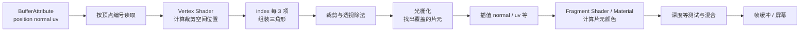

# Three.js Geometry、BufferGeometry 与 Mesh 详解：从三角形读懂网格

在零基础阶段，我们用 `BoxGeometry + Material + Mesh` 很快画出了立方体。但如果只记住这三个类名，后面很容易遇到一连串“看起来像玄学”的问题：

- 为什么一个矩形明明只有 4 个角，`position.count` 却可能远大于 4？
- 为什么 `itemSize` 写错后，图形会彻底变形？
- 为什么有些模型换成光照材质后是黑的？
- 为什么纹理在球体背后有一条缝？
- 为什么 `DoubleSide` 能让背面出现，却不能修好错误的光照？
- `Geometry`、`BufferGeometry` 和 `Mesh` 到底谁负责形状，谁负责出现在场景中？

本文是零基础之后的第二阶段基础课。我们不深入 LOD，也不制作 Shader 特效；目标是先建立一套足够稳定的网格心智模型：

> `BufferGeometry` 保存顶点数据和三角形连接方式，Material 规定表面如何着色，Mesh 把两者组合成一个可放进场景图的对象。

本文示例以 **Three.js 0.182.x** 为基准。你只需要已经会创建 `Scene`、`Camera`、`Renderer`，并能把一个 `Mesh` 加入场景。

## 一、Geometry 是概念，BufferGeometry 是数据结构

在图形学里，**Geometry（几何）**泛指一个物体的形状数据：点在哪里、点如何连成线或三角形，以及每个点还携带哪些信息。

在现代 Three.js 中，实际承载这些数据的是 `THREE.BufferGeometry`。早期 Three.js 曾有一个由 JavaScript 顶点对象组成的旧 `Geometry` 类，但它已经被移除；现在 `BoxGeometry`、`SphereGeometry`、`PlaneGeometry` 等内置类最终都继承自 `BufferGeometry`。

```text
BufferGeometry
├── attributes
│   ├── position  顶点位置（必需，Mesh 要靠它形成轮廓）
│   ├── normal    顶点法线（光照常用）
│   ├── uv        纹理坐标（贴图常用）
│   └── color     顶点颜色（可选）
├── index         顶点连接顺序（可选）
├── groups        多材质分组（可选）
├── drawRange     本次绘制范围
└── boundingBox / boundingSphere  边界信息
```

`BufferGeometry` 本身不会出现在屏幕上。它更像一份“施工数据”：材料还没有指定，位置、旋转、父子关系也没有指定。后面会看到，真正进入场景图的是 `Mesh`。
## 二、从一个三角形开始：读懂 position、itemSize 与 count

三角形是普通网格渲染的基本单元。先手工创建三个顶点：

```javascript
import * as THREE from 'three';

const geometry = new THREE.BufferGeometry();

const positions = new Float32Array([
  // x,    y,   z
  -1.0, -0.8, 0, // 顶点 0：左下
   1.0, -0.8, 0, // 顶点 1：右下
   0.0,  1.0, 0, // 顶点 2：上方
]);

const positionAttribute = new THREE.BufferAttribute(positions, 3);
geometry.setAttribute('position', positionAttribute);

console.log(positionAttribute.itemSize); // 3
console.log(positionAttribute.count);    // 3
```

这里最重要的不是 API，而是数组的解释方式。

### 1. `position` 是 attribute 的名字

`geometry.setAttribute('position', ...)` 把一份逐顶点数据登记为 `position`。Three.js 的内置材质会读取这个约定名称；在顶点着色阶段，它对应每个顶点的局部坐标。

数组本身只是一串连续数字。它不知道哪里是一个顶点的结尾，所以还需要 `itemSize`。

### 2. `BufferAttribute` 描述“数组怎样切组”

构造签名的核心部分是：

```javascript
new THREE.BufferAttribute(typedArray, itemSize);
```

- `typedArray`：连续存储的数据，例如 `Float32Array`。
- `itemSize`：**每个顶点在这份 attribute 中占几个分量**。
- `count`：attribute 中有多少项，由 `array.length / itemSize` 得出。

对于三维位置，一项是 `(x, y, z)`，所以 `itemSize = 3`：

```text
数组长度 = 9
itemSize = 3
count = 9 / 3 = 3 个顶点位置
```

常见 attribute 的典型 `itemSize`：

| attribute | 一项表示什么 | 常见 `itemSize` |
| --- | --- | ---: |
| `position` | `(x, y, z)` | 3 |
| `normal` | `(nx, ny, nz)` | 3 |
| `uv` | `(u, v)` | 2 |
| `color` | `(r, g, b)` 或 `(r, g, b, a)` | 3 或 4 |

:::warning `itemSize` 不是顶点数量
同一个长度为 12 的数组，用 `itemSize = 3` 会被解释成 4 项，用 `itemSize = 2` 会被解释成 6 项。它不会替你判断语义。对 `position` 错写成 2，后续 attribute 数量也会错位，最终可能变形、报错或绘制出不可预测的结果。
:::

### 3. attribute 必须按“同一个顶点编号”对齐

如果 `position.count === 3`，并且同时提供 normal 和 uv，那么通常也应满足：

```javascript
geometry.attributes.normal.count === 3;
geometry.attributes.uv.count === 3;
```

顶点 1 的位置、法线和 UV 分别来自每个 attribute 的第 1 项。GPU 不会根据坐标猜测它们之间的关系。

## 三、非索引几何：每三个 position 直接组成一个三角形

上面的 geometry 没有设置 `index`，所以它是**非索引几何（non-indexed geometry）**。当 `Mesh` 按三角形模式绘制时，顶点按顺序每三个组成一组三角形：

```text
position 0, 1, 2  → 三角形 0
position 3, 4, 5  → 三角形 1
position 6, 7, 8  → 三角形 2
...
```

因此两个互不复用顶点的三角形需要 6 份 position：

```javascript
const positions = new Float32Array([
  // 三角形 1：A B C
  -1, -1, 0,
   1, -1, 0,
   1,  1, 0,

  // 三角形 2：A C D（A、C 又存了一次）
  -1, -1, 0,
   1,  1, 0,
  -1,  1, 0,
]);

geometry.setAttribute(
  'position',
  new THREE.BufferAttribute(positions, 3),
);
```

这里的“每三个”指每三项 `position`，不是每三个浮点数。每项 position 又包含三个浮点分量。

非索引结构直观，并且允许三角形的每个角拥有完全独立的 normal、uv、color；代价是共享位置可能重复存储。

## 四、索引几何：用 index 复用顶点

矩形的两个三角形共享 A 和 C。我们可以只保存 4 个顶点，再用 index 指定取哪三个顶点：

```javascript
const geometry = new THREE.BufferGeometry();

geometry.setAttribute('position', new THREE.Float32BufferAttribute([
  -1, -1, 0, // 0：A
   1, -1, 0, // 1：B
   1,  1, 0, // 2：C
  -1,  1, 0, // 3：D
], 3));

geometry.setIndex([
  0, 1, 2, // 三角形 0：A B C
  0, 2, 3, // 三角形 1：A C D
]);

console.log(geometry.getAttribute('position').count); // 4
console.log(geometry.getIndex().count);               // 6
console.log(geometry.getIndex().count / 3);           // 2 个三角形
```

有 index 时，组装规则变为：

```text
index 0, 1, 2  → 三角形 0
index 3, 4, 5  → 三角形 1
...
```

也就是仍然**每三个索引组成一个三角形**，只是索引值会去查询 attribute：

```text
索引值 2
  ├── position[2] → (1, 1, 0)
  ├── normal[2]   → 顶点 2 的法线
  └── uv[2]       → 顶点 2 的 UV
```

:::important 一个索引选择的是“整套顶点属性”
`BufferGeometry` 不是 position 用一套索引、uv 再用另一套索引。索引 2 会同时选择 position、normal、uv 等 attribute 的第 2 项。这条规则正是 seam 和硬边需要“拆点”的根本原因。
:::

判断三角形数量时，不要一律使用 `position.count / 3`：

```javascript
const triangleCount = geometry.index
  ? geometry.index.count / 3
  : geometry.attributes.position.count / 3;
```
## 五、绕序、正反面与 `side`

三角形不仅由三个点决定，还由三个点的**顺序**决定朝向。对顶点 A、B、C，可用叉积理解它的几何法线：

```javascript
const ab = new THREE.Vector3().subVectors(b, a);
const ac = new THREE.Vector3().subVectors(c, a);
const faceNormal = new THREE.Vector3().crossVectors(ab, ac).normalize();
```

交换 B、C 后，叉积方向会反转。通常从三角形正面观察，顶点按**逆时针（counter-clockwise，CCW）**排列；默认的 `THREE.FrontSide` 只绘制正面，背面会被剔除。

```javascript
const frontMaterial = new THREE.MeshBasicMaterial({
  color: 0x38bdf8,
  side: THREE.FrontSide, // 默认值
});

const backMaterial = new THREE.MeshBasicMaterial({
  color: 0xf97316,
  side: THREE.BackSide,
});

const doubleMaterial = new THREE.MeshBasicMaterial({
  color: 0xa78bfa,
  side: THREE.DoubleSide,
});
```

三种 `side` 的用途不同：

| 设置 | 绘制哪一侧 | 常见用途 |
| --- | --- | --- |
| `FrontSide` | 正面 | 普通封闭模型，默认且通常最快 |
| `BackSide` | 背面 | 从内部观察的房间、天空穹顶 |
| `DoubleSide` | 两面 | 纸片、叶片、暂时排查绕序问题 |

:::warning `DoubleSide` 不是通用修复按钮
它会减少背面剔除带来的收益，还可能增加片元处理。更重要的是，它只能让背面“被画出来”，不能修复错误索引、混乱法线或错误 UV。封闭模型出现破面时，应优先检查绕序和法线。
:::

如果对对象使用负缩放形成镜像，变换会改变朝向。Three.js 渲染器会处理对象矩阵行列式导致的正面翻转，但建模数据中的法线、切线和导出结果仍值得检查；不要把负缩放当作整理错误拓扑的替代方案。

## 六、normal：位置相同，不代表顶点可以共享

`normal` 是表面朝向向量，常用于光照。内置光照材质会根据法线、光线和视线计算明暗。

如果只手写 position，可以让 Three.js 根据三角形关系生成法线：

```javascript
geometry.computeVertexNormals();
```

它适合静态网格的基础法线生成，但必须先保证索引与绕序正确。对于一个平面，所有顶点法线都可以是 `(0, 0, 1)`；对于球面，法线通常近似从球心指向顶点；对于立方体，同一个空间角点在三个面上需要三个不同方向的法线。

这引出一个关键事实：

> 图形学中的“顶点”不是只由 position 定义，而更像 `(position, normal, uv, color, ...)` 的完整属性组合。

立方体看起来只有 8 个角，但 `BoxGeometry(1, 1, 1)` 默认有 24 个 position 项：六个面各自保留 4 个顶点。这样同一空间角点在三个面上可以分别拥有 X、Y、Z 方向的面法线，棱边才会保持锐利。

如果强行把这些角点合并，并只给每个角一条平均法线，立方体会被照得像一个鼓起的圆角物体。

## 七、UV 与 seam：为什么接缝处必须拆点

UV 是二维纹理坐标，通常使用 `[0, 1] × [0, 1]` 范围：

```javascript
geometry.setAttribute('uv', new THREE.Float32BufferAttribute([
  0, 0, // A：纹理左下
  1, 0, // B：纹理右下
  1, 1, // C：纹理右上
  0, 1, // D：纹理左上
], 2));
```

把一张矩形纹理包到球面时，纹理左边 `u = 0` 与右边 `u = 1` 会在球体同一条经线上相遇。空间位置可以相同，但 UV 不能同时既是 0 又是 1，于是这条经线必须保存两份顶点数据：

```text
同一空间位置 P
├── 顶点 P-left： position=P, uv=(0, v)
└── 顶点 P-right：position=P, uv=(1, v)
```

这就是 **UV seam（UV 接缝）**。拆点本身不是错误，而是让不连续属性得以表达的必要手段。类似情况还有：

- 立方体棱边两侧法线不同，需要拆点；
- 一张纹理图集的两个 UV 岛边界不同，需要拆点；
- 同一位置在两个面上使用不同顶点颜色，也需要拆点。

所以 `position.count` 表示的是**顶点属性记录数**，不是模型中肉眼可见的独立空间点数量。

## 八、Mesh：把 geometry 与 material 变成场景对象

创建 Mesh 的核心语句是：

```javascript
const mesh = new THREE.Mesh(geometry, material);
scene.add(mesh);
```

职责可以这样拆分：

| 对象 | 负责什么 | 不负责什么 |
| --- | --- | --- |
| `BufferGeometry` | 顶点 attribute、index、边界、分组 | 世界位置、表面颜色、场景父子关系 |
| `Material` | 表面着色、贴图、透明、深度、side 等 | 顶点连接关系、对象变换 |
| `Mesh` | 持有 geometry/material，发起三角形网格绘制 | 不会自动创造缺失的 UV 或正确法线 |

`Mesh` 继承自 `Object3D`，所以它天然拥有：

```javascript
mesh.position.set(1, 2, 3);
mesh.rotation.y = Math.PI / 4;
mesh.scale.setScalar(2);
mesh.add(child);
mesh.visible = true;
mesh.layers.enable(1);
```

同一份 geometry 可以被多个 Mesh 共享：

```javascript
const sharedGeometry = new THREE.BoxGeometry(1, 1, 1);

const redBox = new THREE.Mesh(
  sharedGeometry,
  new THREE.MeshBasicMaterial({ color: 'red' }),
);
const blueBox = new THREE.Mesh(
  sharedGeometry,
  new THREE.MeshBasicMaterial({ color: 'blue' }),
);

redBox.position.x = -1;
blueBox.position.x = 1;
scene.add(redBox, blueBox);
```

共享能减少重复 geometry 数据，但释放资源时要注意所有使用者：任意一处调用 `sharedGeometry.dispose()` 都会释放其 GPU 资源，其他 Mesh 下一次绘制时需要重新上传，频繁误释放会造成抖动和额外开销。
## 九、PlaneGeometry：尺寸与网格密度是两回事

构造函数：

```javascript
new THREE.PlaneGeometry(
  width,
  height,
  widthSegments,
  heightSegments,
);
```

`width`、`height` 控制局部坐标中的物理尺寸；`widthSegments`、`heightSegments` 控制横纵方向被切成多少段。对于横向段数 $w$、纵向段数 $h$：

$$
\text{vertexCount} = (w + 1)(h + 1)
$$

$$
\text{triangleCount} = 2wh
$$

$$
\text{indexCount} = 6wh
$$

例如：

```javascript
const plane = new THREE.PlaneGeometry(4, 2, 4, 2);

console.log(plane.attributes.position.count); // (4 + 1) × (2 + 1) = 15
console.log(plane.index.count);               // 4 × 2 × 6 = 48
console.log(plane.index.count / 3);           // 16 个三角形
```

默认 `PlaneGeometry(1, 1, 1, 1)` 只有：

- `(1 + 1) × (1 + 1) = 4` 个顶点；
- `2 × 1 × 1 = 2` 个三角形；
- `6` 个索引。

它默认位于局部 **XY 平面**，正面朝局部 **+Z**。因此把它当水平地面时常旋转到 XZ 平面：

```javascript
const ground = new THREE.Mesh(geometry, material);
ground.rotation.x = -Math.PI / 2;
```

:::important 大尺寸不等于高细分
`PlaneGeometry(100, 100, 1, 1)` 仍只有 4 个顶点；`PlaneGeometry(1, 1, 100, 100)` 虽然只有 1 个单位宽，却有 10201 个顶点。前两项决定范围，后两项决定密度。
:::

细分只有在你需要顶点级形变、更精细轮廓或其他逐顶点数据时才有价值。只是显示一张平面图片，通常两个三角形就足够，像素细节来自纹理采样和光栅化，不来自更多顶点。

## 十、Box、Sphere、Circle：名字简单，拓扑完全不同

内置几何体都提供 position、normal、uv 和通常可用的 index，但它们组织数据的方式并不相同。

| Geometry | 拓扑 | normal | UV | 常见边界 |
| --- | --- | --- | --- | --- |
| `BoxGeometry` | 六张独立网格面拼成封闭盒子 | 每个面方向固定，棱边是硬边 | 每个面独立映射到矩形区域 | 空间角点会按面拆成多份 |
| `SphereGeometry` | 经纬线网格，左右闭合，上下收束 | 通常沿球心到表面方向，形成平滑外观 | 矩形 UV 包裹球面 | 经线 seam 拆点，极点有汇聚和拉伸 |
| `CircleGeometry` | 一个中心点连接一圈圆周点，形成三角扇 | 全部朝 +Z | 圆盘映射到 UV 正方形中央 | 中心汇聚，圆周首尾位置重复以闭合 |

### 1. BoxGeometry：8 个角不等于 8 条顶点记录

```javascript
const box = new THREE.BoxGeometry(1, 1, 1);
console.log(box.attributes.position.count); // 24
console.log(box.index.count / 3);           // 12
```

默认盒子有 6 个面，每面 4 条顶点记录、2 个三角形。面内可以通过 index 复用 4 个顶点，但相邻面不能共享同一条完整顶点记录，因为它们的法线方向不同，UV 也按面定义。

增加 `widthSegments`、`heightSegments`、`depthSegments` 会细分对应方向的面，但不会自动把盒子变成圆润曲面；法线仍按各个平面朝向。

### 2. SphereGeometry：经纬网格不是均匀三角网格

```javascript
const sphere = new THREE.SphereGeometry(
  1,  // radius
  32, // widthSegments：经度方向
  16, // heightSegments：纬度方向
);
```

完整球体中，经线左右两列位置重合但 UV 分别接近 0 和 1，所以会拆成两列顶点。纬线向极点收束，同一纬度带的三角形面积会随位置变化；极点附近许多经度落在同一小片区域，二维纹理容易出现拉伸。

对于未裁切的完整球体，其常见计数为：

$$
\text{vertexCount} = (\text{widthSegments}+1)(\text{heightSegments}+1)
$$

$$
\text{triangleCount} = 2 \times \text{widthSegments} \times (\text{heightSegments}-1)
$$

极点行不会像普通网格单元那样各生成两个有效三角形，因此第二个公式不是简单的 `2 × widthSegments × heightSegments`。当使用 `phiStart`、`phiLength`、`thetaStart`、`thetaLength` 裁切球面时，边界计数还会随是否包含极点而变化。

### 3. CircleGeometry：真实圆盘是三角扇

```javascript
const circle = new THREE.CircleGeometry(1, 32);
console.log(circle.attributes.position.count); // 32 + 2 = 34
console.log(circle.index.count / 3);           // 32
```

默认结构是一条中心顶点记录，加上 `segments + 1` 条圆周记录；最后一条圆周记录与第一条空间位置相同，用来闭合圆环。每个三角形都引用中心点，所以变形后可能显出放射状拓扑。

它与“在 PlaneGeometry 上用透明纹理画圆”不同：

- `CircleGeometry` 的圆外没有三角形，轮廓、射线检测都是真圆盘；
- 带圆形透明区域的 Plane 仍是矩形拓扑，圆外片元可能只是透明或被丢弃；
- Circle 的 UV 从圆心向外放射，Plane 的 UV 是规则矩形网格。

### 4. 如何选择

- 图片、海报、规则地面：优先 Plane；
- 有硬边的盒状物：Box；
- 行星、球形标记、平滑球面：Sphere，但要留意 seam 与极点；
- 仪表盘、圆形标牌、二维圆盘：Circle；
- 内置拓扑不符合需求时，再手写 BufferGeometry，而不是无条件堆高 segments。
## 十一、从 attribute 到屏幕：最小渲染链路

理解下面这条链路，能把“JavaScript 数组”和“屏幕像素”连接起来：



逐步看：

1. **attribute 读取**：GPU 按顶点编号取得 position、normal、uv。
2. **顶点处理**：顶点位置经过模型、观察、投影变换，得到裁剪空间坐标。
3. **图元组装**：有 index 就每三个索引取三个顶点；无 index 就每三个顶点直接组装。
4. **裁剪与投影**：视锥外的部分被裁剪，再映射到屏幕。
5. **光栅化**：三角形覆盖哪些屏幕采样点，会产生对应的候选片元。
6. **插值**：三角形三个角的 UV、法线、颜色等，会在内部按位置插值。
7. **片元着色**：Material 对应的片元程序计算颜色、透明度等。
8. **测试与混合**：深度测试、模板测试和透明混合等决定结果是否写入帧缓冲。

:::note 顶点不等于像素，片元也不严格等于最终像素
三个顶点可以覆盖几十万个屏幕采样点；一个候选片元也可能因深度测试失败、透明混合或丢弃而不直接成为最终像素。入门阶段先把片元理解为“光栅化产生、等待着色与测试的屏幕候选样本”即可。
:::

这也解释了为什么一个只有两个三角形的 Plane 仍能显示清晰图片：UV 在三角形内部连续插值，纹理在片元阶段被采样。反过来，如果你要让平面轮廓真实弯曲，就必须有足够顶点，因为光栅化只能在已有三角形内部插值，不能凭空创造新的几何折点。

## 十二、三种高效调试法：线框、法线与 UV

遇到几何问题时，不要先调灯光和相机。按“拓扑 → 法线 → UV”的顺序隔离变量通常更快。

### 1. wireframe：先看三角形怎样连接

```javascript
const wireMaterial = new THREE.MeshBasicMaterial({
  color: 0x00ffcc,
  wireframe: true,
});
const wireMesh = new THREE.Mesh(geometry, wireMaterial);
scene.add(wireMesh);
```

它适合检查：

- segments 是否真的增加了网格密度；
- index 是否连错顶点；
- 球体极点、圆盘中心等拓扑汇聚；
- 是否有特别细长或交叉的三角形。

`wireframe` 显示的是三角形边，不一定等同于美术模型语义上的“硬边”。若只想提取唯一外轮廓或夹角较大的边，可再了解 `EdgesGeometry`，但那不是本文的主线。

### 2. VertexNormalsHelper：看法线朝向

```javascript
import { VertexNormalsHelper } from 'three/addons/helpers/VertexNormalsHelper.js';

const normalHelper = new VertexNormalsHelper(
  mesh,
  0.15,     // 法线显示长度
  0xffcc00, // 颜色
);
scene.add(normalHelper);
```

如果模型旋转或变形，需要在合适时机调用：

```javascript
normalHelper.update();
```

法线全部反向，先检查绕序；硬边意外变圆，检查是否错误合并了顶点；修改 position 后光照没变化，检查是否需要重新计算或更新 normal。

### 3. UV 棋盘格：让拉伸、翻转和 seam 无处隐藏

```javascript
const loader = new THREE.TextureLoader();
const uvGrid = loader.load('/textures/uv-grid.png');
uvGrid.colorSpace = THREE.SRGBColorSpace;

const uvMaterial = new THREE.MeshBasicMaterial({
  map: uvGrid,
  side: THREE.DoubleSide, // 调试时便于观察，生产按需求恢复
});
mesh.material = uvMaterial;
```

棋盘格若变成长方形，表示局部 UV 被拉伸；数字或字母倒置，说明方向可能翻转；球体背后不连续，通常正是经线 seam。调试 UV 时先用 `MeshBasicMaterial` 排除灯光干扰。

如果没有测试图片，也可以用 `CanvasTexture` 在运行时生成棋盘格。下一节完整示例会采用这种方式，因此无需额外图片资源。

## 十三、完整可运行示例：手写一个可检查的索引矩形

下面是一个完整 HTML 文件。保存为 `index.html`，通过本地静态服务器打开即可。它完成了这些工作：

- 手写 position、uv 和 index；
- 通过 `computeVertexNormals()` 生成 normal；
- 用程序化 UV 棋盘格检查纹理方向；
- 同时显示实体表面、线框和顶点法线；
- 打印 `itemSize`、attribute count、index count 和三角形数量；
- 按 `W` 切换线框，按 `N` 切换法线，按 `S` 切换单面/双面。

```html
<!doctype html>
<html lang="zh-CN">
<head>
  <meta charset="UTF-8" />
  <meta name="viewport" content="width=device-width, initial-scale=1" />
  <title>BufferGeometry 最小完整示例</title>
  <style>
    html, body { margin: 0; height: 100%; overflow: hidden; background: #0f172a; }
    canvas { display: block; }
    .help {
      position: fixed; left: 12px; top: 12px; z-index: 1;
      padding: 10px 12px; border-radius: 8px;
      color: #e2e8f0; background: rgb(15 23 42 / 85%);
      font: 14px/1.6 system-ui, sans-serif;
    }
  </style>
</head>
<body>
  <div class="help">拖动旋转，滚轮缩放<br>W：线框　N：法线　S：单面/双面</div>

  <script type="importmap">
    {
      "imports": {
        "three": "https://cdn.jsdelivr.net/npm/three@0.182.0/build/three.module.js",
        "three/addons/": "https://cdn.jsdelivr.net/npm/three@0.182.0/examples/jsm/"
      }
    }
  </script>

  <script type="module">
    import * as THREE from 'three';
    import { OrbitControls } from 'three/addons/controls/OrbitControls.js';
    import { VertexNormalsHelper } from 'three/addons/helpers/VertexNormalsHelper.js';

    const scene = new THREE.Scene();
    scene.background = new THREE.Color(0x0f172a);

    const camera = new THREE.PerspectiveCamera(
      50,
      window.innerWidth / window.innerHeight,
      0.1,
      100,
    );
    camera.position.set(0, 0.5, 4);

    const renderer = new THREE.WebGLRenderer({ antialias: true });
    renderer.setPixelRatio(Math.min(window.devicePixelRatio, 2));
    renderer.setSize(window.innerWidth, window.innerHeight);
    renderer.outputColorSpace = THREE.SRGBColorSpace;
    document.body.appendChild(renderer.domElement);

    // 四个顶点，每项 position 有 3 个分量。
    const geometry = new THREE.BufferGeometry();
    geometry.setAttribute('position', new THREE.Float32BufferAttribute([
      -1.5, -1, 0, // 0：左下
       1.5, -1, 0, // 1：右下
       1.5,  1, 0, // 2：右上
      -1.5,  1, 0, // 3：左上
    ], 3));

    // 每项 uv 有 2 个分量，并与 position 的顶点编号一一对应。
    geometry.setAttribute('uv', new THREE.Float32BufferAttribute([
      0, 0,
      1, 0,
      1, 1,
      0, 1,
    ], 2));

    // 每三个索引组成一个三角形；从 +Z 看是逆时针。
    geometry.setIndex([
      0, 1, 2,
      0, 2, 3,
    ]);
    geometry.computeVertexNormals();

    // 动态创建 UV 棋盘格，不依赖额外图片。
    const textureCanvas = document.createElement('canvas');
    textureCanvas.width = textureCanvas.height = 256;
    const context = textureCanvas.getContext('2d');
    const cells = 8;
    const cellSize = textureCanvas.width / cells;

    for (let y = 0; y < cells; y++) {
      for (let x = 0; x < cells; x++) {
        context.fillStyle = (x + y) % 2 === 0 ? '#38bdf8' : '#1e293b';
        context.fillRect(x * cellSize, y * cellSize, cellSize, cellSize);
      }
    }
    context.fillStyle = '#ffffff';
    context.font = 'bold 28px sans-serif';
    context.fillText('UV', 105, 140);

    const uvTexture = new THREE.CanvasTexture(textureCanvas);
    uvTexture.colorSpace = THREE.SRGBColorSpace;

    const material = new THREE.MeshStandardMaterial({
      map: uvTexture,
      roughness: 0.75,
      metalness: 0,
      side: THREE.FrontSide,
    });
    const mesh = new THREE.Mesh(geometry, material);
    scene.add(mesh);

    // 叠加线框，略微向前避免与实体表面深度冲突。
    const wireMaterial = new THREE.MeshBasicMaterial({
      color: 0x22d3ee,
      wireframe: true,
    });
    const wireMesh = new THREE.Mesh(geometry, wireMaterial);
    wireMesh.position.z = 0.002;
    mesh.add(wireMesh);

    const normalHelper = new VertexNormalsHelper(mesh, 0.25, 0xfacc15);
    scene.add(normalHelper);

    scene.add(new THREE.HemisphereLight(0xffffff, 0x334155, 2));
    const light = new THREE.DirectionalLight(0xffffff, 3);
    light.position.set(2, 3, 4);
    scene.add(light);

    const controls = new OrbitControls(camera, renderer.domElement);
    controls.enableDamping = true;

    const position = geometry.getAttribute('position');
    console.table({
      positionItemSize: position.itemSize,
      positionCount: position.count,
      uvCount: geometry.getAttribute('uv').count,
      normalCount: geometry.getAttribute('normal').count,
      indexCount: geometry.getIndex().count,
      triangleCount: geometry.getIndex().count / 3,
    });

    window.addEventListener('keydown', (event) => {
      if (event.key.toLowerCase() === 'w') wireMesh.visible = !wireMesh.visible;
      if (event.key.toLowerCase() === 'n') normalHelper.visible = !normalHelper.visible;
      if (event.key.toLowerCase() === 's') {
        material.side = material.side === THREE.FrontSide
          ? THREE.DoubleSide
          : THREE.FrontSide;
        material.needsUpdate = true;
      }
    });

    window.addEventListener('resize', () => {
      camera.aspect = window.innerWidth / window.innerHeight;
      camera.updateProjectionMatrix();
      renderer.setSize(window.innerWidth, window.innerHeight);
    });

    renderer.setAnimationLoop(() => {
      controls.update();
      normalHelper.update();
      renderer.render(scene, camera);
    });
  </script>
</body>
</html>
```

如果项目已经通过 npm 安装 `three@0.182.x`，可以把 import map 和 CDN 地址删掉，保留两个 `import`，交给 Vite、Next.js 等构建工具解析。
## 十四、预测练习：先在脑中渲染，再看答案

下面的练习不要求运行代码。先写出你的预测，再展开答案。能正确预测，说明你已经开始用“数据与拓扑”而不是“API 名称”思考。

### 练习 1：itemSize 与 count

```javascript
const attribute = new THREE.BufferAttribute(
  new Float32Array([0, 0, 1, 0, 1, 1, 0, 1]),
  2,
);
```

问题：`itemSize` 和 `count` 分别是多少？它更适合表达四个三维位置，还是四个二维 UV？

::: details 查看答案
`itemSize === 2`，`count === 8 / 2 === 4`。每项有两个分量，更适合表达四个二维 UV。若想表达三维 position，数组长度应是 3 的倍数，并使用 `itemSize = 3`。
:::

### 练习 2：索引如何组装

```javascript
geometry.setIndex([0, 1, 2, 0, 2, 3]);
```

问题：有几个三角形？顶点 0 被几个三角形引用？

::: details 查看答案
`index.count` 是 6，每三个索引一组，所以有 2 个三角形：`(0,1,2)` 与 `(0,2,3)`。顶点 0 被两个三角形引用。
:::

### 练习 3：反转绕序

把第一个三角形从 `[0, 1, 2]` 改成 `[0, 2, 1]`，其他内容不变，并使用默认 `FrontSide`。从原正面看会怎样？

::: details 查看答案
它的几何朝向反转，原正面会被当作背面并受到背面剔除，因此该三角形可能消失。改成 `DoubleSide` 可以让它暂时可见，但正确修复通常是恢复一致绕序，并重新检查/计算法线。
:::

### 练习 4：PlaneGeometry 计数

```javascript
new THREE.PlaneGeometry(10, 6, 5, 3);
```

问题：顶点、三角形和索引分别有多少？把 width 从 10 改成 100 会改变计数吗？

::: details 查看答案
顶点数 `(5+1)(3+1)=24`；三角形数 `2×5×3=30`；索引数 `30×3=90`。width 只改变局部尺寸，不改变 segments，因此改成 100 后计数不变。
:::

### 练习 5：为什么不能合并球体 seam

球体经线两侧 position 相同，一侧 `u=0`，另一侧 `u=1`。问题：为什么不能只保留一个顶点并继续使用普通的单 index BufferGeometry？

::: details 查看答案
一个索引会同时选择整套 attribute。一条顶点记录只能有一份 uv，不能在一个三角形中读 `u=0`、在另一个三角形中又读 `u=1`。因此必须复制 position，形成两条拥有不同 uv 的顶点记录。
:::

### 练习 6：片元细节是否需要更多 segments

一个 `PlaneGeometry(2, 2, 1, 1)` 显示 2048×2048 图片。为了看清图片细节，是否必须把 segments 提高到 2048×2048？

::: details 查看答案
不需要。图片在片元阶段按插值后的 UV 采样，两个三角形也能覆盖大量屏幕像素。只有真实顶点形变、轮廓细化或特殊逐顶点数据需要更密的网格。盲目提高到 2048×2048 会制造数百万顶点和三角形，成本巨大。
:::

## 十五、边界、更新与性能

理解结构后，还要知道它的边界。以下规则比“segments 越高越好”更实用。

### 1. 索引不保证一定更省

索引可以复用**完整属性都相同**的顶点。遇到硬法线、UV seam、材质边界或不同顶点颜色时仍要拆点。一个大量拆点的模型，索引收益可能很小；不要只比较肉眼可见的空间点。

索引类型也有容量：`Uint16Array` 最大索引值为 65535。更大的顶点编号需要 `Uint32Array`，并会增加索引缓冲占用。使用 `geometry.setIndex([...])` 时 Three.js 会根据索引值选择合适类型；手工创建 typed array 时则要自行保证范围正确。

### 2. 不要每帧重建 geometry

动态修改顶点时，复用现有 typed array：

```javascript
const position = geometry.getAttribute('position');
position.setZ(0, position.getZ(0) + 0.01);
position.needsUpdate = true;
```

如果位置变化会影响光照或视锥剔除，还可能需要：

```javascript
geometry.computeVertexNormals();
geometry.attributes.normal.needsUpdate = true;
geometry.computeBoundingBox();
geometry.computeBoundingSphere();
```

是否每帧重算法线和边界取决于需求；对大型动态网格，这些 CPU 操作可能很贵。基础阶段先保证正确，再测量并选择更合适的更新策略。

### 3. 修改数组后要通知 GPU

直接改 `attribute.array` 并不会自动让 GPU 知道。修改结束后设置：

```javascript
geometry.attributes.position.needsUpdate = true;
```

不要在每帧创建新的 `Float32Array`、`BufferAttribute`、`BufferGeometry` 和 Material，这会增加上传、编译与垃圾回收压力。

### 4. drawRange 的 count 含义取决于是否有 index

```javascript
geometry.setDrawRange(0, 6);
```

- 索引 geometry：`count` 表示要绘制的**索引数量**；
- 非索引 geometry：`count` 表示要绘制的**顶点数量**。

按三角形绘制时，范围通常应与三元组边界对齐，否则最后不足三个的数据不能组成完整三角形。

### 5. 退化三角形和糟糕三角形

三个点共线、两个索引相同，或三角形面积接近 0 时，会形成退化或极瘦三角形。它们可能不可见，却仍带来处理成本，并可能让法线计算、插值和数值稳定性变差。线框视图通常最容易暴露这类问题。

### 6. 透明双面与过度细分都有代价

- `DoubleSide` 可能让更多三角形进入后续阶段；
- 大面积透明表面会产生 overdraw，并带来排序问题；
- segments 同时增加 attribute 内存、顶点处理和三角形组装成本；
- 屏幕覆盖很大的简单网格也可能有较高片元成本。

性能不能只看顶点数。至少同时观察 `renderer.info.render.triangles`、draw call、屏幕覆盖、材质复杂度和目标设备表现。

### 7. 记得释放 GPU 资源

原生 Three.js 在对象不再使用时需要显式释放：

```javascript
scene.remove(mesh);
geometry.dispose();
material.dispose();
texture.dispose();
renderer.dispose(); // 整个渲染器也不再使用时
```

`scene.remove(mesh)` 只解除场景图关系，不等于释放 geometry、material 和 texture。共享资源则应在最后一个使用者结束后再释放。

### 8. 本文刻意不展开的内容

为了保持第二阶段基础课的边界，本文不深入：

- LOD、网格简化和距离分级；
- 自定义 Shader 特效与复杂顶点位移；
- 骨骼、morph target、实例化 attribute；
- 切线空间、法线贴图数学和高级拓扑算法。

这些内容都建立在本文的 attribute、顶点身份、index 和三角形组装模型之上。基础没稳时直接学习高级效果，最容易把数据错误误判为 Shader 或引擎错误。

## 十六、排错清单

当一个 Mesh “不对劲”时，可以按顺序检查：

1. `position` 是否存在，`itemSize` 是否为 3，`count` 是否符合预期？
2. normal、uv 等 attribute 的 count 是否与 position 对齐？
3. 有 index 时，最大索引是否小于 `position.count`？`index.count` 是否按三个一组？
4. 所有三角形绕序是否一致？默认 `FrontSide` 下是否从背面观察？
5. 光照异常时，normal 是否存在、归一化且方向正确？
6. 纹理异常时，用 UV 棋盘格检查拉伸、翻转、UV 岛与 seam。
7. 先换 `MeshBasicMaterial`，排除灯光；再开 `wireframe`，排除拓扑；最后开 normal helper。
8. 动态修改 attribute 后是否设置 `needsUpdate`？边界和法线是否也需要更新？
9. Mesh 是否处于相机视锥内，scale 是否非零，父级是否可见？
10. 移除对象后，资源是否在正确时机 dispose？

## 总结

这一课最值得带走的不是构造函数，而是以下关系：

1. Geometry 是形状数据的概念；现代 Three.js 用 `BufferGeometry` 保存连续的 attribute 和可选 index。
2. `BufferAttribute` 用 `itemSize` 解释数组如何分组，`count = array.length / itemSize`。
3. 非索引 geometry 每三个顶点组成三角形；索引 geometry 每三个索引组成三角形。
4. 绕序决定正反面，`side` 决定哪些面参与绘制；`DoubleSide` 不能修复错误拓扑和法线。
5. 一个顶点是 position、normal、uv 等属性的组合；属性在硬边或 seam 处不连续，就必须拆点。
6. `Mesh` 持有 geometry 和 material，并继承 `Object3D`，因此可以变换并加入场景图。
7. Plane 的尺寸与 segments 独立；Box、Sphere、Circle 的拓扑、法线和 UV 各有边界。
8. 最小链路是 attribute → 顶点处理 → 三角形组装 → 光栅化与插值 → fragment → 测试与写入。
9. 线框看拓扑，法线辅助器看朝向，UV 棋盘格看展开；三者能覆盖大多数基础几何问题。
10. 性能优化从正确计数、合理复用、避免重复创建、按需更新和及时释放开始，而不是盲目增加或减少 segments。

当你能看到一段 position、uv 和 index 就在脑中还原三角形，几何体就不再是黑盒。下一篇将进入这些顶点真正发生位移与投影的原因：[Three.js 数学、坐标系与变换详解](/posts/threejs/math-coordinate-transform-explained)。
