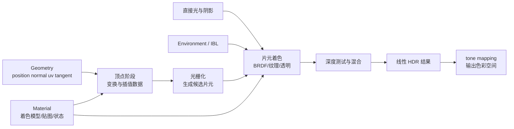

# Three.js 材质、光照与纹理：从 BRDF 到最终像素

同一个球体为什么换成 `MeshBasicMaterial` 后不再受灯光影响？金属模型没有环境贴图时为什么近乎发黑？法线贴图为什么不能标成 sRGB？玻璃为什么会出现排序错误？这些现象看似分散，实际都位于同一条数据链上：**几何提供表面，材质定义如何响应光，纹理提供空间变化，Renderer 把线性 HDR 结果变成屏幕颜色。**

本文以 Three.js **r182.x** 为基线，适合已经理解 Scene、Camera、Renderer、Geometry 与 Mesh 的读者。API 默认值可能随版本演进；本文更关注职责、选择依据和可验证的调试方法，而不是把某组参数包装成永久“最佳实践”。

> 前置阅读：[Geometry、BufferGeometry 与 Mesh](/posts/threejs/geometry-buffergeometry-mesh-explained)与[渲染器详解](/posts/threejs/renderer-explained)。需要完全自定义着色时，再进入 [ShaderMaterial 详解](/posts/threejs/shader-material-explained)。

## 一、Material 在渲染管线中究竟负责什么

`Geometry` 回答“有哪些顶点、三角形、法线和 UV”，`Material` 回答“这些表面如何被着色和写入缓冲”。`Mesh` 把二者组合，Renderer 再结合相机、灯光、阴影、环境和全局输出设置生成绘制程序。



材质通常同时决定三类事情：

| 层次 | 典型配置 | 影响 |
| --- | --- | --- |
| 表面模型 | Basic、Lambert、Phong、Standard、Physical 或自定义 Shader | 是否响应光、如何分配漫反射与镜面反射 |
| 表面输入 | `color`、`map`、`normalMap`、`roughnessMap`、`metalnessMap` 等 | 每个片元的表面参数如何变化 |
| 光栅/合成状态 | `side`、`transparent`、`alphaTest`、`depthWrite`、blending | 哪些面被画、片元是否丢弃、怎样遮挡与混合 |

材质**不负责**创建几何细节、放置光源或设置相机曝光；`normalMap` 可以改变光照法线的观感，却不会改变轮廓、碰撞和真实顶点位置。反过来，灯光存在也不保证任何材质都响应它，例如 `MeshBasicMaterial` 与 `MeshNormalMaterial` 会忽略常规场景灯光。

## 二、先选着色模型：九种常用材质怎样取舍

选择材质时先问三个问题：是否需要场景灯光？是否需要近似物理一致的资产工作流？是否必须完全控制公式？

| 材质 | 响应常规灯光 | 高光/反射模型 | 适合 | 主要边界 |
| --- | --- | --- | --- | --- |
| `MeshBasicMaterial` | 否 | 无 | UI、标记、无光照风格、隔离灯光问题 | 不会因光照变暗，也不是“永远显示在最前” |
| `MeshLambertMaterial` | 是 | 以漫反射为主 | 低成本哑光物体、远景 | 没有可控镜面高光，复杂光照仍有成本 |
| `MeshPhongMaterial` | 是 | 经验型高光 | 非 PBR 老资产、风格化塑料、教学 | 参数不能直接对应 metal-rough 资产 |
| `MeshStandardMaterial` | 是 | PBR metal-rough | 大多数 glTF/写实物体 | 通常需要合理直接光或环境光才能表现材质 |
| `MeshPhysicalMaterial` | 是 | Standard 的扩展 | 清漆、透射、薄膜、光泽织物等 | 启用额外 lobes/特性会增加着色成本 |
| `MeshNormalMaterial` | 否 | 法线映射到 RGB | 检查法线、曲面和几何接缝 | 颜色是诊断编码，不代表真实材质 |
| `MeshDepthMaterial` | 否 | 深度映射 | 自定义深度 pass、调试、阴影配套 | 结果依赖相机 near/far、打包方式和渲染路径 |
| `ShaderMaterial` | 由你实现 | 由你实现 | 程序化表面、特殊形变、完全自定义效果 | 需自行承担光照、阴影、雾、蒙皮、色彩等集成 |
| `RawShaderMaterial` | 由你实现 | 由你实现 | 连 Three.js 注入声明都不需要的底层控制 | 样板与维护成本更高，通常不是首选 |

:::tip 一个实用选择顺序
先用 `MeshStandardMaterial` 匹配常规 glTF/PBR 内容；确有 clearcoat、transmission、iridescence、sheen 等需求时升到 `MeshPhysicalMaterial`；无光照风格用 Basic；诊断法线用 Normal；只有现成材质模型表达不了需求时才考虑 Shader。Lambert/Phong 仍有适用场景，并非“过时就不能用”。
:::

### 最小选择示例

```javascript
import * as THREE from 'three';

const materials = {
  unlit: new THREE.MeshBasicMaterial({ color: '#60a5fa' }),
  matte: new THREE.MeshLambertMaterial({ color: '#60a5fa' }),
  legacyGloss: new THREE.MeshPhongMaterial({
    color: '#60a5fa',
    specular: '#ffffff',
    shininess: 80,
  }),
  pbr: new THREE.MeshStandardMaterial({
    color: '#60a5fa',
    metalness: 0,
    roughness: 0.35,
  }),
  coated: new THREE.MeshPhysicalMaterial({
    color: '#60a5fa',
    metalness: 0,
    roughness: 0.35,
    clearcoat: 1,
    clearcoatRoughness: 0.12,
  }),
  normals: new THREE.MeshNormalMaterial(),
  depth: new THREE.MeshDepthMaterial(),
};

const sphere = new THREE.Mesh(
  new THREE.SphereGeometry(1, 64, 32),
  materials.pbr,
);
scene.add(sphere);
```

`MeshDepthMaterial` 更常用于特定 pass 或 `customDepthMaterial`，而不是把相机深度当成普通表面颜色长期展示。完全自定义材质的最小版本则应先输出固定颜色，确认几何与投影无误：

```javascript
const debugShader = new THREE.ShaderMaterial({
  vertexShader: `
    void main() {
      gl_Position = projectionMatrix * modelViewMatrix * vec4(position, 1.0);
    }
  `,
  fragmentShader: `
    void main() {
      gl_FragColor = vec4(1.0, 0.2, 0.6, 1.0);
    }
  `,
});
```

### 受控对比：只换 Material，其他条件保持不变

下面五个球共用几何、颜色、相机和灯光。Basic 不响应灯光；Lambert 主要展示漫反射；Phong 使用经验型高光；Standard/Physical 使用 metal-rough PBR。拖动视角观察高光随视线变化。

<CodePenDemo title="Basic / Lambert / Phong / Standard / Physical 受控对比" code={`
function MaterialBall({ x, kind }) {
  const common = { color: '#38bdf8' }
  const material = {
    basic: <meshBasicMaterial {...common} />,
    lambert: <meshLambertMaterial {...common} />,
    phong: <meshPhongMaterial {...common} shininess={90} specular="#ffffff" />,
    standard: <meshStandardMaterial {...common} metalness={0} roughness={0.3} />,
    physical: (
      <meshPhysicalMaterial
        {...common}
        metalness={0}
        roughness={0.3}
        clearcoat={1}
        clearcoatRoughness={0.1}
      />
    ),
  }[kind]

  return (
    <group position={[x, 0, 0]}>
      <mesh castShadow>{/* 几何完全相同，只替换材质。 */}
        <sphereGeometry args={[0.62, 48, 24]} />
        {material}
      </mesh>
      <Html position={[0, -0.9, 0]} center>
        <div className="bg-black/70 px-2 py-1 text-xs text-white rounded">{kind}</div>
      </Html>
    </group>
  )
}

function Scene() {
  return (
    <>
      <color attach="background" args={["#111827"]} />
      <ambientLight intensity={0.18} />
      <directionalLight position={[2, 4, 3]} intensity={3} castShadow />
      {['basic', 'lambert', 'phong', 'standard', 'physical'].map((kind, index) => (
        <MaterialBall key={kind} kind={kind} x={(index - 2) * 1.45} />
      ))}
      <OrbitControls enablePan={false} minDistance={5} maxDistance={10} />
    </>
  )
}

render(
  <Canvas shadows camera={{ position: [0, 1.2, 7.5], fov: 42 }}>
    <Scene />
  </Canvas>
)
`} />

:::important 控制变量才有可解释性
比较材质时固定几何、相机、背景、灯光、曝光和色彩设置。若同时换 HDRI、颜色与粗糙度，只能看到“不同”，不能判断差异来自哪里。
:::

## 三、法线、光方向、视线与 BRDF 的直觉

一个表面点至少需要三条方向：

- $N$：单位法线，表示局部表面朝向。
- $L$：从表面点指向光源的单位方向。
- $V$：从表面点指向相机的单位方向。

最基础的漫反射可用余弦项建立直觉：

$$
N\cdot L = \cos\theta,\qquad diffuse \propto \max(N\cdot L, 0)
$$

表面正对光源时接收能量较集中，逐渐侧向时变暗，背向时该直接光贡献为零。镜面高光还依赖 $V$：当观察方向接近理想反射方向或半程向量时，高光更强。于是旋转相机不一定改变漫反射，却会明显移动高光。

<Glossary term="BRDF：双向反射分布函数，描述给定入射方向与出射方向时，表面把多少光反射向观察者。">BRDF</Glossary> 可以先理解为一个受 $N$、$L$、$V$ 和材质参数控制的“光能分配规则”。Lambert BRDF 近似均匀漫反射；Phong/Blinn-Phong 用经验公式制造高光；Standard/Physical 使用更接近微表面理论的模型，把粗糙度理解成微小表面朝向的分散程度。

### 可运行的向量数值实验

```js
// 可运行
const normalize = ([x, y, z]) => {
  const length = Math.hypot(x, y, z) || 1;
  return [x / length, y / length, z / length];
};
const dot = (a, b) => a[0] * b[0] + a[1] * b[1] + a[2] * b[2];

const N = normalize([0, 1, 0]);
for (const light of [[0, 1, 0], [1, 1, 0], [1, 0.2, 0], [0, -1, 0]]) {
  const L = normalize(light);
  console.log(light, 'N·L =', Math.max(dot(N, L), 0).toFixed(3));
}
```

这段代码只表达余弦项，不等于 Three.js 完整光照。真实 PBR 还要处理光强、距离衰减、菲涅耳、微表面分布、几何遮蔽、纹理、阴影与环境积分。

### 错误路径：混用坐标空间

```glsl
// 错误：normal 是局部空间，cameraPosition 是世界空间；代码可编译但旋转后会错。
float facingWrong = dot(normalize(normal), normalize(cameraPosition - position));

// 正确思路之一：全部放到观察空间。
vec4 viewPosition = modelViewMatrix * vec4(position, 1.0);
vec3 viewNormal = normalize(normalMatrix * normal);
vec3 viewDirection = normalize(-viewPosition.xyz);
float facing = max(dot(viewNormal, viewDirection), 0.0);
```

`normalMatrix` 是模型观察矩阵左上部分逆转置的等价表示，用于在非均匀缩放时尽量正确变换法线。不要把点的位置矩阵机械地用于方向，也不要省略归一化。

## 四、五类常用灯光：它们提供什么方向和边界

材质负责“表面如何响应”，Light 负责“从哪里来、是什么颜色、强度多大”。不同灯光的差异不只是形状，还包括是否有方向、是否衰减，以及能否生成阴影贴图。

| Light | 光线模型 | 距离衰减 | 常见用途 | 阴影能力与边界 |
| --- | --- | --- | --- | --- |
| `AmbientLight` | 无方向，给各处统一贡献 | 无 | 防止完全黑、风格化补光 | 不能投影；过强会压平明暗关系 |
| `HemisphereLight` | 天空色与地面色按法线朝向混合 | 无 | 户外柔和环境基底 | 不能投影；不是 HDR 环境反射 |
| `DirectionalLight` | 平行光线，由 position 指向 target | 无 | 日光、远距离主光 | 可投影；使用正交阴影相机，范围需收紧 |
| `PointLight` | 从一点向各方向发射 | 有 | 灯泡、火焰附近照明 | 可投影；通常需立方体多方向深度，成本较高 |
| `SpotLight` | 点光源加锥形范围与软边 | 有 | 舞台灯、手电筒 | 可投影；使用透视阴影相机，角度与 penumbra 影响光斑 |

:::note 关于光强数值
现代 Three.js 的灯光与 physically correct 行为比旧教程更一致，但场景尺度、色调映射、曝光和资产仍会改变最终观感。不要照搬多年前的 `intensity={0.5}`，应固定单位尺度和输出链后再校准。
:::

### 一个可直接运行的灯光切换场景

```javascript
import * as THREE from 'three';

const scene = new THREE.Scene();
const camera = new THREE.PerspectiveCamera(45, innerWidth / innerHeight, 0.1, 100);
camera.position.set(0, 2.5, 6);

const renderer = new THREE.WebGLRenderer({ antialias: true });
renderer.setSize(innerWidth, innerHeight);
renderer.setPixelRatio(Math.min(devicePixelRatio, 2));
renderer.shadowMap.enabled = true;
document.body.appendChild(renderer.domElement);

const subject = new THREE.Mesh(
  new THREE.SphereGeometry(1, 64, 32),
  new THREE.MeshStandardMaterial({ color: '#f97316', roughness: 0.38, metalness: 0 }),
);
subject.castShadow = true;
subject.position.y = 1;
scene.add(subject);

const floor = new THREE.Mesh(
  new THREE.PlaneGeometry(12, 12),
  new THREE.MeshStandardMaterial({ color: '#64748b', roughness: 0.9 }),
);
floor.rotation.x = -Math.PI / 2;
floor.receiveShadow = true;
scene.add(floor);

const ambient = new THREE.AmbientLight('#ffffff', 0.12);
const hemisphere = new THREE.HemisphereLight('#bfe3ff', '#382414', 0.8);
const directional = new THREE.DirectionalLight('#ffffff', 2.5);
directional.position.set(3, 5, 2);
directional.target = subject;
directional.castShadow = true;
directional.shadow.mapSize.set(1024, 1024);

const point = new THREE.PointLight('#60a5fa', 30, 8, 2);
point.position.set(-2, 2.5, 2);
point.castShadow = true;

const spot = new THREE.SpotLight('#fef3c7', 70, 10, Math.PI / 7, 0.35, 2);
spot.position.set(2.5, 5, 3);
spot.target = subject;
spot.castShadow = true;

// 先只启用一组，做受控比较；避免五种灯同时打开后无法解释。
scene.add(ambient, hemisphere, directional);

renderer.setAnimationLoop(() => renderer.render(scene, camera));
```

若要切换，先 `scene.remove(hemisphere, directional)`，再 `scene.add(point)` 或 `scene.add(spot)`；target 指向非 scene 子树对象时，其世界矩阵可能不会按预期更新，因此像示例一样让 target 指向已在场景中的对象，或显式把 target 加入 scene。

### 阴影不是灯光自动变暗，而是额外深度查询

开启 Shadow Map 后，Renderer 先从光源视角记录遮挡者深度，再在主材质中比较当前点和记录深度。至少要同时满足：

```javascript
renderer.shadowMap.enabled = true;
light.castShadow = true;
mesh.castShadow = true;      // 谁挡光
floor.receiveShadow = true;  // 谁接收阴影
```

不同光源的阴影边界：

```javascript
// DirectionalLight：收紧正交阴影相机，提升有限贴图的有效分辨率。
const shadowCamera = directional.shadow.camera;
shadowCamera.left = -4;
shadowCamera.right = 4;
shadowCamera.top = 4;
shadowCamera.bottom = -4;
shadowCamera.near = 0.5;
shadowCamera.far = 15;
shadowCamera.updateProjectionMatrix();

// SpotLight：阴影覆盖光锥，mapSize 越大通常越清晰，但显存与成本也增加。
spot.shadow.mapSize.set(1024, 1024);
spot.shadow.camera.near = 0.5;
spot.shadow.camera.far = 12;

// PointLight：需覆盖多个方向，通常比单个方向光/聚光灯阴影昂贵。
point.shadow.mapSize.set(512, 512);
point.shadow.camera.near = 0.2;
point.shadow.camera.far = 8;
```

`AmbientLight` 和 `HemisphereLight` 没有可用于 Shadow Map 的单一投射方向，因此不投射阴影。它们可以提亮阴影区域，但这与“生成柔和阴影”不是同一回事。

### bias、normalBias 与软边的边界

```javascript
directional.shadow.bias = -0.0002;
directional.shadow.normalBias = 0.02;
```

- acne（表面条纹）常来自深度精度与自遮挡，可小幅调整 bias/normalBias。
- peter-panning（影子与物体脚底分离）往往说明偏移过大。
- 提高 `mapSize` 不会自动修复过大的阴影相机范围；先收紧覆盖范围通常更有效。
- PCF 过滤产生的是贴图采样意义上的软化，不等同于任意面积光源的完整物理软阴影。
- 顶点形变、蒙皮、alpha cutout 若未同步到阴影 pass，主画面与影子轮廓会不一致。

调试时加入辅助对象：

```javascript
scene.add(new THREE.DirectionalLightHelper(directional, 0.5));
scene.add(new THREE.CameraHelper(directional.shadow.camera));
```

## 五、PBR metal-rough：参数不是“效果旋钮”，而是表面描述

`MeshStandardMaterial` 采用 metallic-roughness 工作流。它试图让同一组材质参数在不同合理光照环境中保持相对一致，而不是保证任何环境下看起来完全相同。

### 1. baseColor、metalness、roughness 的分工

- **baseColor**：非金属时主要描述漫反射底色；金属时更多参与有色镜面反射。
- **metalness**：通常按材质类别接近 0 或 1；泥土、塑料、木材多为 0，裸露金属多为 1。锈、灰尘、涂层可在纹理中形成过渡。
- **roughness**：描述微表面法线分散程度。低粗糙度反射集中清晰，高粗糙度反射分散模糊；它不等同于 opacity，也不是简单“高光亮度”。

```javascript
const paintedSteel = new THREE.MeshStandardMaterial({
  color: '#b91c1c',
  metalness: 0,   // 最外层油漆是电介质，不因底下是钢就直接设 1。
  roughness: 0.32,
});

const bareAluminum = new THREE.MeshStandardMaterial({
  color: '#b8bec8',
  metalness: 1,
  roughness: 0.24,
});
```

### 2. 能量分配与菲涅耳直觉

PBR 材质会在漫反射与镜面反射之间分配能量。金属通常几乎没有常规漫反射，主要反射环境；电介质仍有基础镜面反射，并在掠射角增强，这就是常见的 Fresnel 现象。于是：

- 金属在纯黑环境、又没有可见直接反射内容时，变暗是可解释结果，不一定是 bug。
- 把 `metalness` 设为 1 并不会让物体自动“更亮”或“更高级”。
- 粗糙度为 0 的反射需要足够高质量环境信息，否则会暴露环境分辨率与采样问题。

### 3. `MeshPhysicalMaterial` 何时值得使用

它在 Standard 基础上提供额外表面层或传输特性，例如：

```javascript
const carPaint = new THREE.MeshPhysicalMaterial({
  color: '#2563eb',
  metalness: 0.15,
  roughness: 0.3,
  clearcoat: 1,
  clearcoatRoughness: 0.08,
});

const thinGlass = new THREE.MeshPhysicalMaterial({
  color: '#ffffff',
  metalness: 0,
  roughness: 0.08,
  transmission: 1,
  thickness: 0.2,
  ior: 1.5,
  transparent: true,
});
```

`transmission` 是基于屏幕/渲染路径近似的透射功能，并不自动等于完整光线追踪玻璃：屏幕外信息、多层透明、嵌套介质和排序仍有边界。只有确实能看出 clearcoat、transmission、sheen、iridescence 等效果时才启用对应能力。

### 受控实验：做一张 metal × roughness 球阵列

```javascript
const geometry = new THREE.SphereGeometry(0.35, 48, 24);
const materials = [];

for (let row = 0; row < 5; row++) {
  for (let column = 0; column < 5; column++) {
    const material = new THREE.MeshStandardMaterial({
      color: '#d1d5db',
      metalness: column / 4,
      roughness: Math.max(0.04, row / 4),
    });
    materials.push(material);

    const sphere = new THREE.Mesh(geometry, material);
    sphere.position.set((column - 2) * 0.9, (2 - row) * 0.9, 0);
    scene.add(sphere);
  }
}
```

固定环境、曝光和 baseColor 后，横向只改变 metalness，纵向只改变 roughness。若没有任何环境或可反射内容，金属列的信息不足；这正好引出下一节的 IBL。

## 六、直接光与 IBL：为什么 PBR 需要“看见环境”

直接光（Directional/Point/Spot 等）从少数明确方向计算 $N\cdot L$、高光与阴影；<Glossary term="IBL：Image-Based Lighting，用环境图像近似来自大量方向的光照与反射。">IBL</Glossary> 则让表面从整个环境接收光。二者通常协作，而不是互相替代。

| 输入 | 主要提供 | 能否产生常规实时投影 |
| --- | --- | --- |
| 直接光 | 明确方向、局部光斑、可控明暗和高光 | Directional/Point/Spot 可通过 Shadow Map |
| `scene.environment` | PBR 环境漫反射与镜面反射 | 不会自动生成物体投影 |
| `scene.background` | 相机看到的背景 | 本身不等于材质照明 |

`scene.background` 与 `scene.environment` 可以使用同一纹理，也可以分开：摄影棚可能让材质反射 HDRI，却使用纯色背景。

### HDR Environment + PMREM 的完整加载

<Glossary term="PMREM：预过滤 mipmapped 辐射环境映射，把环境按不同粗糙度预积分，使 PBR 材质能高效采样模糊程度不同的反射。">PMREM</Glossary> 不是简单把 HDR 图片“缩小几层”。它为粗糙材质预计算不同角宽度的环境响应。

```javascript
import * as THREE from 'three';
import { RGBELoader } from 'three/addons/loaders/RGBELoader.js';

const renderer = new THREE.WebGLRenderer({ antialias: true });
renderer.toneMapping = THREE.ACESFilmicToneMapping;
renderer.toneMappingExposure = 1;
renderer.outputColorSpace = THREE.SRGBColorSpace;

const pmremGenerator = new THREE.PMREMGenerator(renderer);
pmremGenerator.compileEquirectangularShader();

const hdr = await new RGBELoader().loadAsync('/hdr/studio.hdr');
const envRenderTarget = pmremGenerator.fromEquirectangular(hdr);

scene.environment = envRenderTarget.texture;
scene.background = hdr; // 想看到原始全景时；也可用纯色或另一个背景。

const metal = new THREE.MeshStandardMaterial({
  color: '#d1d5db',
  metalness: 1,
  roughness: 0.2,
  envMapIntensity: 1,
});

// PMREM 已生成自己的纹理，原始 HDR 不再需要时可释放。
hdr.dispose();
pmremGenerator.dispose();

// 场景真正卸载且无人共享时：
envRenderTarget.dispose();
```

也可以把 environment 仅赋给某个材质的 `envMap`。`scene.environment` 更适合统一场景；局部材质覆盖适合特殊展示。若 HDRI 要在其他场景共享，不要在第一个组件卸载时贸然释放。

:::warning 常见错误路径：只加 AmbientLight 修金属黑
AmbientLight 能给支持它的材质增加无方向光照，却不能提供丰富的镜面环境。面对 PBR 金属，优先检查 environment、颜色空间、曝光、法线与 roughness，而不是把 AmbientLight 一直加到画面失去层次。
:::

### 直接光 + IBL 的分工示例

```javascript
scene.environment = studioEnvironment;

const key = new THREE.DirectionalLight('#ffffff', 2.2);
key.position.set(4, 6, 3);
key.castShadow = true;
scene.add(key);

// environment 给出全方向反射和环境基底；key light 提供可读的主方向与投影。
```

是否仍需要直接光取决于内容：纯产品棚拍可主要依赖 HDRI；需要角色落地阴影、舞台聚光或时间变化的太阳时，直接光仍很重要。

## 七、纹理不是都叫“贴图”：先明确每个通道的语义

纹理是按 UV 或其他坐标查询的二维数据。关键不是文件名，而是**采样值代表颜色还是数值参数**。

| Three.js 槽位 | 语义 | 常见通道 | 色彩空间 |
| --- | --- | --- | --- |
| `map` | baseColor/albedo，与 `material.color` 相乘 | RGB | 通常 `SRGBColorSpace` |
| `emissiveMap` | 自发光颜色，与 `emissive`、`emissiveIntensity` 配合 | RGB | 通常 `SRGBColorSpace` |
| `normalMap` | 切线空间或对象空间法线方向 | RGB | `NoColorSpace` |
| `roughnessMap` | 粗糙度调制 | G | `NoColorSpace` |
| `metalnessMap` | 金属度调制 | B | `NoColorSpace` |
| `aoMap` | 间接环境遮蔽近似 | R | `NoColorSpace` |
| `alphaMap` | 透明/裁切权重 | G（Three.js 常规约定） | `NoColorSpace` |
| `bumpMap` | 高度变化推导片元法线 | 灰度 | `NoColorSpace` |
| `displacementMap` | 沿顶点法线移动真实顶点 | 灰度 | `NoColorSpace` |

具体通道以 Three.js 文档、glTF 规范和资产导出约定为准；不要凭图片肉眼“像灰度图”就猜。ORM 打包纹理常把 AO、roughness、metalness 分别放在 R、G、B，以减少纹理采样和文件数量。

### 颜色纹理与数据纹理

```javascript
const loader = new THREE.TextureLoader();

const baseColor = loader.load('/textures/wood-basecolor.jpg');
baseColor.colorSpace = THREE.SRGBColorSpace;

const emissive = loader.load('/textures/sign-emissive.png');
emissive.colorSpace = THREE.SRGBColorSpace;

const normal = loader.load('/textures/wood-normal.png');
normal.colorSpace = THREE.NoColorSpace;

const orm = loader.load('/textures/wood-orm.png');
orm.colorSpace = THREE.NoColorSpace;

const material = new THREE.MeshStandardMaterial({
  color: '#ffffff',          // 会与 map 相乘；不是替代 map。
  map: baseColor,
  emissive: '#ffffff',       // emissiveMap 也会受该基色调制。
  emissiveMap: emissive,
  emissiveIntensity: 2,
  normalMap: normal,
  aoMap: orm,
  roughnessMap: orm,
  metalnessMap: orm,
  roughness: 1,              // 与 roughnessMap 采样共同作用。
  metalness: 1,              // 与 metalnessMap 采样共同作用。
});
```

:::important 自发光不等于灯
`emissive`/`emissiveMap` 让表面自身在着色中发亮，但默认不会照亮旁边物体，也不会自动产生 bloom。要照亮环境需增加 Light 或使用烘焙/全局光照方案；要出现光晕需配置后期 Bloom，并管理 HDR 强度和阈值。
:::

### 错误路径：把 normal map 当 sRGB 颜色

sRGB 解码会改变 RGB 数值，而 normal map 的 RGB 正是在编码方向分量。错误标记会让法线偏转，导致高光和凹凸方向异常：

```javascript
// 错误
normalMap.colorSpace = THREE.SRGBColorSpace;

// 正确：它是向量数据
normalMap.colorSpace = THREE.NoColorSpace;
```

若法线凹凸方向看似反了，还要核对资产使用 OpenGL 还是 DirectX 的绿色通道约定。可以在确认来源后调整：

```javascript
material.normalScale.set(1, -1); // 仅在 Y 通道约定确实相反时翻转，不要盲用。
```

### 纹理采样、重复与 mipmap 的具体设置

```javascript
baseColor.wrapS = baseColor.wrapT = THREE.RepeatWrapping;
baseColor.repeat.set(4, 4);
baseColor.anisotropy = Math.min(8, renderer.capabilities.getMaxAnisotropy());

// 修改采样状态后通知上传；普通 transform 属性会通过纹理矩阵参与更新。
baseColor.needsUpdate = true;
```

各向异性过滤可改善斜视角纹理清晰度，但会增加采样成本；取值应按目标设备和画面收益选择。规则纹理重复还会暴露接缝，内容侧需要可平铺素材。

### `displacementMap` 与 `normalMap` 的受控区别

```javascript
// A：只改变片元光照，轮廓和影子几何不变。
material.normalMap = normalMap;
material.normalScale.set(1, 1);

// B：移动顶点，要求足够细分；轮廓和深度可变化。
material.displacementMap = heightMap;
material.displacementScale = 0.2;
const geometry = new THREE.PlaneGeometry(4, 4, 256, 256);
```

若把 B 的 Geometry 改成 `PlaneGeometry(4, 4, 1, 1)`，高度图只能移动四个角，无法产生细密地形。这是典型的“纹理正确、网格密度错误”。

## 八、UV、tangent 与 TBN：法线贴图怎样贴到任意表面

`uv` 把三维表面映射到纹理二维坐标。一个三角形的三个顶点各自拥有 UV，光栅化后片元得到插值坐标：

```javascript
const uv = geometry.getAttribute('uv');
console.log('UV count:', uv?.count, 'vertex count:', geometry.getAttribute('position').count);
```

UV 展开不可避免地可能产生岛、接缝、拉伸和重叠。baseColor 接缝明显时先检查素材 padding 与 UV；normal map 接缝还要检查切线基底、镜像 UV 与导出器。

### tangent、bitangent、normal 组成 TBN

切线空间 normal map 通常把纹理中的 `[0, 1]` 解码到 `[-1, 1]`，再通过表面局部基底变到参与光照的空间：

$$
N_{surface}=TBN\,N_{map},\qquad TBN=[T\ B\ N]
$$

- $T$：纹理 U 增长方向的切线。
- $B$：纹理 V 增长方向的副切线，常由 $N$、$T$ 和手性推导。
- $N$：几何表面法线。

```glsl
vec3 tangentNormal = texture2D(normalMap, vUv).xyz * 2.0 - 1.0;
mat3 tbn = mat3(normalize(vTangent), normalize(vBitangent), normalize(vNormal));
vec3 shadingNormal = normalize(tbn * tangentNormal);
```

这段 GLSL 只是核心数学；内置材质还会处理坐标空间、导数、双面、法线缩放等细节。常规 Three.js 材质在可用时可根据导数构造切线基底，因此普通 normal map 并非总要求 Geometry 显式携带 tangent；但 glTF 的高质量切线、镜像 UV、各向异性或自定义 Shader 可能需要明确、与烘焙一致的 tangent。

```javascript
// 对索引几何，computeTangents 需要 position、normal、uv；并非所有几何都适合直接计算。
if (
  geometry.index &&
  geometry.getAttribute('position') &&
  geometry.getAttribute('normal') &&
  geometry.getAttribute('uv')
) {
  geometry.computeTangents();
}
```

### AO 为什么常需要第二套 UV

`aoMap` 常用于烘焙环境遮蔽，需要与可重复的 baseColor UV 分离。Three.js 的常规材质使用 `uv1` 属性承载这套坐标：

```javascript
// 只有两套 UV 确实相同时才复制；真实烘焙资产通常应从 DCC 正确导出第二套 UV。
if (!geometry.getAttribute('uv1') && geometry.getAttribute('uv')) {
  geometry.setAttribute('uv1', geometry.getAttribute('uv'));
}
material.aoMap = aoTexture;
material.aoMapIntensity = 1;
```

AO 是对间接环境遮蔽的近似，不应把直射区域永久涂黑，也不能替代实时接触阴影。过强 AO 会产生“脏边”和错误能量感。

## 九、颜色管线：输入解码、线性工作、tone mapping、输出编码

最终像素不是“纹理 RGB 原样显示”。一条可靠的心智模型是：

```text
sRGB 颜色输入 ──解码──┐
                      ├→ 线性工作空间中的光照、BRDF 与合成
线性数据纹理 ────────┘
                      → HDR 线性结果
                      → tone mapping / exposure
                      → 输出色彩空间编码
                      → Canvas 与显示器
```

### 1. 为什么光照在线性空间计算

如果两个光源各贡献 0.25 的线性能量，叠加结果应接近 0.5。sRGB 编码值是为感知与存储设计的非线性值，直接相加会扭曲能量关系。因此颜色纹理先解码，法线/roughness 等数据保持数值，再在线性工作空间计算。

现代 Three.js 默认启用颜色管理。用十六进制或 CSS 字符串构造 `THREE.Color` 时，通常按 sRGB 输入解释并转换到工作空间；从外部系统得到的原始线性数值则应明确其来源，不要再次转换。

```javascript
const colorTexture = loader.load('/textures/chair-basecolor.jpg');
colorTexture.colorSpace = THREE.SRGBColorSpace;

const roughnessTexture = loader.load('/textures/chair-roughness.jpg');
roughnessTexture.colorSpace = THREE.NoColorSpace;

renderer.toneMapping = THREE.ACESFilmicToneMapping;
renderer.toneMappingExposure = 1;
renderer.outputColorSpace = THREE.SRGBColorSpace;
```

### 2. tone mapping 与输出色彩空间不是一件事

- **tone mapping** 把 HDR 线性亮度压缩到显示范围，并形成高光滚降风格。
- **exposure** 是 tone mapping 前的整体曝光缩放。
- **输出编码** 把最终线性显示值编码到 sRGB 等目标空间。

ACES Filmic、Reinhard、Linear 或 NoToneMapping 各有风格和限制。产品色值严格匹配、写实摄影棚和风格化游戏可能做不同选择；“ACES 永远最好”并不成立。

### 3. 错误路径及症状

| 错误 | 常见症状 | 修复方向 |
| --- | --- | --- |
| baseColor 未标 sRGB | 贴图亮度/饱和感异常 | 声明 `SRGBColorSpace` |
| normal/roughness 标成 sRGB | 高光形状、粗糙分布异常 | 使用 `NoColorSpace` |
| 中间 HDR target 过早 tone map | bloom 高光信息不足 | 最终输出阶段再转换 |
| 主材质与最终 pass 都 tone map | 对比和颜色被重复压缩 | 明确唯一最终出口 |
| 画面暗就无限加曝光 | 高光剪切、材质关系失真 | 先核对灯光、environment、单位与纹理 |

使用 EffectComposer 时，应明确由哪个最终 Pass 完成 tone mapping 与输出编码。中间 RenderTarget 若还要用于 Bloom、景深或调色，通常要保留线性/HDR 信息。

### 受控比较建议

```javascript
const presets = [
  { name: 'No tone mapping', value: THREE.NoToneMapping, exposure: 1 },
  { name: 'Reinhard', value: THREE.ReinhardToneMapping, exposure: 1 },
  { name: 'ACES Filmic', value: THREE.ACESFilmicToneMapping, exposure: 1 },
];

function applyPreset(index) {
  const preset = presets[index];
  renderer.toneMapping = preset.value;
  renderer.toneMappingExposure = preset.exposure;
  // 切换 toneMapping 会影响程序配置；让相关材质重新编译。
  scene.traverse((object) => {
    if (!object.isMesh) return;
    const list = Array.isArray(object.material) ? object.material : [object.material];
    list.forEach((material) => { material.needsUpdate = true; });
  });
}
```

比较时固定 HDRI、灯光、相机、材质和曝光；否则很难把差异归因于 tone mapper。

## 十、透明、alphaTest、DoubleSide 与 depthWrite

“能看见后面”至少有三种不同需求：连续半透明、二值镂空、物理透射。它们不应使用同一组开关。

| 需求 | 典型设置 | 优点 | 边界 |
| --- | --- | --- | --- |
| 玻璃/烟雾式连续混合 | `transparent=true`、`opacity<1`、常见 `depthWrite=false` | alpha 连续 | 对象级排序无法解决所有交叉 |
| 树叶/栅栏镂空 | `alphaTest>0`、通常保持不透明路径 | 可写深度，遮挡稳定 | 硬阈值可能锯齿/闪烁 |
| 薄玻璃透射 | `MeshPhysicalMaterial` + `transmission` | 可表现折射近似 | 成本与屏幕空间边界更高 |

### 1. 连续透明

```javascript
const glassLike = new THREE.MeshStandardMaterial({
  color: '#67e8f9',
  transparent: true,
  opacity: 0.35,
  depthTest: true,
  depthWrite: false,
});
```

`depthWrite=false` 让该透明表面不抢占后续透明层的深度，但它仍可被前方不透明物体遮挡，因为 `depthTest` 保持开启。它不是透明排序的万能修复：两个互相穿插的透明 Mesh 仍可能需要拆分几何、调整 `renderOrder` 或换表现方案。

### 2. alphaTest 镂空

```javascript
const leaves = new THREE.MeshStandardMaterial({
  map: leafColor,
  alphaMap: leafAlpha,
  alphaTest: 0.5,
  transparent: false,
  side: THREE.DoubleSide,
});
```

低于阈值的片元被丢弃，其余片元保持实心并可正常写深度。远距离植被还需合适的 mipmap、过滤和抗锯齿策略；阈值 0.5 只是起点。

### 3. `DoubleSide` 是面剔除选择，不是厚度

默认 `FrontSide` 只画正面；`BackSide` 只画背面；`DoubleSide` 两面都画。它适合树叶、纸张、布片等确实可从两面看到的薄面，也常用于短期排查顶点绕序/法线问题。

```javascript
material.side = THREE.DoubleSide;
material.needsUpdate = true; // side 变化会影响着色程序/渲染状态。
```

长期把所有材质设为 DoubleSide 会增加片元工作，并可能掩盖模型法线或绕序错误。它也不会给平面增加真实厚度；需要侧壁、折射路径长度或正确体积阴影时应建模厚度。

### 4. 四个深度/透明开关不要混为一谈

```javascript
material.transparent = true; // 进入透明混合/排序相关路径
material.opacity = 0.5;       // 源 alpha；仅改它不一定启用混合
material.depthTest = true;    // 与已有深度比较
material.depthWrite = false;  // 通过后不写自己的深度
```

错误路径是看到透明穿插就关闭 `depthTest`。这会让本应被墙挡住的透明表面也画到前面。应先画出对象重叠关系，再分别检查排序、`renderOrder`、`depthWrite` 和几何交叉。

## 十一、材质复用、更新与 dispose：明确所有权

### 1. 复用可降低对象和程序变体，但会共享状态

```javascript
const sharedGeometry = new THREE.BoxGeometry(1, 1, 1);
const sharedMaterial = new THREE.MeshStandardMaterial({
  color: '#3b82f6',
  roughness: 0.5,
});

for (let i = 0; i < 100; i++) {
  const mesh = new THREE.Mesh(sharedGeometry, sharedMaterial);
  mesh.position.x = i * 1.2;
  scene.add(mesh);
}
```

修改 `sharedMaterial.color` 会让 100 个 Mesh 一起变化。如果只改一个：

```javascript
selected.material = sharedMaterial.clone();
selected.material.color.set('#ef4444');
```

clone 会复制材质参数，但纹理通常仍是共享引用。是否复制纹理取决于你是否要独立修改其采样状态、变换或生命周期。

大量仅变换不同、材质相同的对象还应评估 `InstancedMesh`，因为“共享材质”不会自动把 100 个 Mesh 合成一个 draw call。

### 2. 什么修改需要 `needsUpdate`

```javascript
// 常规 uniform/属性更新：通常不需重新编译。
material.color.set('#22c55e');
material.roughness = 0.65;
material.map.offset.x += 0.1;

// 改变 Shader 能力、defines 或关键渲染配置时，常需要重新编译。
material.side = THREE.DoubleSide;
material.flatShading = true;
material.needsUpdate = true;
```

不要每帧设置 `needsUpdate=true`，这可能触发不必要的程序重配。切换纹理“有/无”、材质类型或某些功能宏时，应查对应版本文档并在切换点更新，而不是在动画循环中反复执行。

对于 ShaderMaterial，更新 uniform 的 `value`：

```javascript
material.uniforms.uTime.value = clock.getElapsedTime();
// 不要每帧重新 new ShaderMaterial，也通常无需 material.needsUpdate。
```

### 3. 从 Scene 移除不等于释放 GPU 资源

```javascript
scene.remove(mesh);

// 仅当资源不再被任何对象/缓存/场景共享时释放。
mesh.geometry.dispose();
mesh.material.dispose();
baseColor.dispose();
normalMap.dispose();
envRenderTarget.dispose();
```

一个更安全的所有权模式：

```javascript
function createProduct() {
  const geometry = new THREE.SphereGeometry(1, 64, 32);
  const colorMap = new THREE.TextureLoader().load('/textures/product-basecolor.jpg');
  colorMap.colorSpace = THREE.SRGBColorSpace;
  const material = new THREE.MeshStandardMaterial({ map: colorMap, roughness: 0.4 });
  const mesh = new THREE.Mesh(geometry, material);

  return {
    mesh,
    dispose() {
      geometry.dispose();
      material.dispose();
      colorMap.dispose();
    },
  };
}

const product = createProduct();
scene.add(product.mesh);
// 页面卸载：
scene.remove(product.mesh);
product.dispose();
```

若 Loader 缓存、资产管理器或多个组件共享纹理，应由更高层资源管理器做引用计数或集中释放；局部组件不能假定自己是唯一所有者。

### 4. 如何观察泄漏与程序膨胀

```javascript
renderer.render(scene, camera);
console.table({
  calls: renderer.info.render.calls,
  triangles: renderer.info.render.triangles,
  geometries: renderer.info.memory.geometries,
  textures: renderer.info.memory.textures,
  programs: renderer.info.programs?.length,
});
```

反复进入/退出页面后，若不再使用的 geometry/texture 数量持续上升，就要检查 dispose、缓存和异步加载回写。统计值有缓存和内部资源语义，不能只凭单帧数字下结论，应在固定流程中比较趋势。

## 十二、完整示例：把材质、灯光、IBL、纹理与输出串成一帧

下面示例不依赖外部图片：用 Canvas 生成颜色纹理和粗糙度数据纹理，用 `RoomEnvironment + PMREM` 提供 IBL，再加一盏可投影方向光。把代码放入已安装 `three` 的 Vite/Next 客户端入口即可运行。

```javascript
import * as THREE from 'three';
import { OrbitControls } from 'three/addons/controls/OrbitControls.js';
import { RoomEnvironment } from 'three/addons/environments/RoomEnvironment.js';

const canvas = document.querySelector('#scene');
const renderer = new THREE.WebGLRenderer({ canvas, antialias: true });
renderer.setPixelRatio(Math.min(devicePixelRatio, 2));
renderer.shadowMap.enabled = true;
renderer.shadowMap.type = THREE.PCFSoftShadowMap;
renderer.toneMapping = THREE.ACESFilmicToneMapping;
renderer.toneMappingExposure = 1;
renderer.outputColorSpace = THREE.SRGBColorSpace;

const scene = new THREE.Scene();
scene.background = new THREE.Color('#111827');

const camera = new THREE.PerspectiveCamera(45, 1, 0.1, 100);
camera.position.set(3.4, 2.5, 5.5);
const controls = new OrbitControls(camera, canvas);
controls.enableDamping = true;
controls.target.set(0, 0.8, 0);

// 1. IBL：PMREM 为不同 roughness 准备预过滤环境。
const pmrem = new THREE.PMREMGenerator(renderer);
const envTarget = pmrem.fromScene(new RoomEnvironment(), 0.04);
scene.environment = envTarget.texture;
pmrem.dispose();

// 2. 直接光：提供主方向和地面投影。
const sun = new THREE.DirectionalLight('#fff4e6', 2.8);
sun.position.set(3, 5, 2);
sun.castShadow = true;
sun.shadow.mapSize.set(1024, 1024);
sun.shadow.camera.left = -4;
sun.shadow.camera.right = 4;
sun.shadow.camera.top = 4;
sun.shadow.camera.bottom = -4;
sun.shadow.camera.near = 0.5;
sun.shadow.camera.far = 12;
sun.shadow.normalBias = 0.02;
scene.add(sun);

// 3. 生成 sRGB baseColor：蓝白格帮助观察 UV。
function makeColorTexture() {
  const source = document.createElement('canvas');
  source.width = source.height = 256;
  const context = source.getContext('2d');
  const size = 32;
  for (let y = 0; y < 8; y++) {
    for (let x = 0; x < 8; x++) {
      context.fillStyle = (x + y) % 2 ? '#0ea5e9' : '#e0f2fe';
      context.fillRect(x * size, y * size, size, size);
    }
  }
  const texture = new THREE.CanvasTexture(source);
  texture.colorSpace = THREE.SRGBColorSpace;
  texture.wrapS = texture.wrapT = THREE.RepeatWrapping;
  texture.repeat.set(2, 1);
  return texture;
}

// 4. 生成线性 roughness 数据：从左侧光滑过渡到右侧粗糙。
function makeRoughnessTexture() {
  const source = document.createElement('canvas');
  source.width = 256;
  source.height = 16;
  const context = source.getContext('2d');
  const gradient = context.createLinearGradient(0, 0, 256, 0);
  gradient.addColorStop(0, '#101010');
  gradient.addColorStop(1, '#ffffff');
  context.fillStyle = gradient;
  context.fillRect(0, 0, 256, 16);
  const texture = new THREE.CanvasTexture(source);
  texture.colorSpace = THREE.NoColorSpace;
  return texture;
}

const colorMap = makeColorTexture();
const roughnessMap = makeRoughnessTexture();
const material = new THREE.MeshStandardMaterial({
  color: '#ffffff',
  map: colorMap,
  metalness: 0,
  roughness: 1,
  roughnessMap,
});

const geometry = new THREE.SphereGeometry(1, 64, 32);
const sphere = new THREE.Mesh(geometry, material);
sphere.position.y = 1.05;
sphere.castShadow = true;
scene.add(sphere);

const floorGeometry = new THREE.PlaneGeometry(12, 12);
const floorMaterial = new THREE.MeshStandardMaterial({
  color: '#64748b',
  metalness: 0,
  roughness: 0.85,
});
const floor = new THREE.Mesh(floorGeometry, floorMaterial);
floor.rotation.x = -Math.PI / 2;
floor.receiveShadow = true;
scene.add(floor);

function resize() {
  const width = canvas.clientWidth;
  const height = canvas.clientHeight;
  if (width === 0 || height === 0) return;
  renderer.setSize(width, height, false);
  camera.aspect = width / height;
  camera.updateProjectionMatrix();
}

let frameId = 0;
function animate() {
  frameId = requestAnimationFrame(animate);
  resize();
  controls.update();
  renderer.render(scene, camera);
}
animate();

// 在路由卸载或页面销毁时调用。
function dispose() {
  cancelAnimationFrame(frameId);
  controls.dispose();
  geometry.dispose();
  material.dispose();
  colorMap.dispose();
  roughnessMap.dispose();
  floorGeometry.dispose();
  floorMaterial.dispose();
  envTarget.dispose();
  renderer.dispose();
}
```

HTML 只需要一个有明确 CSS 尺寸的 Canvas：

```html
<canvas id="scene" style="display:block;width:100%;height:100vh"></canvas>
```

按以下顺序做受控实验：

1. 删除 `scene.environment`：观察高光与暗部信息减少，尤其把 metalness 改为 1 后。
2. 删除 `sun`：只保留 IBL，观察仍有反射，但方向性投影消失。
3. 把 `roughnessMap.colorSpace` 错设为 sRGB：对比粗糙度渐变不再按原始数据解释。
4. 把 `material` 临时换成 `MeshNormalMaterial`：隔离纹理和光照，检查几何法线。
5. 把 tone mapping 在 NoToneMapping 与 ACES Filmic 间切换：保持 exposure 不变再比较高光。

## 十三、系统调试：沿数据管线向后排查

遇到黑、亮、脏、反光错误或透明穿插时，不要随机调参数。按以下顺序每次只替换一个变量。

<Steps>
### 确认几何、法线与 UV

先用 `MeshNormalMaterial` 检查曲面连续性，用纯色 `MeshBasicMaterial` 排除光照。如果 Basic 也不可见，问题更可能在相机、Geometry、矩阵、面剔除或深度，而不是灯光。

```javascript
const original = mesh.material;
mesh.material = new THREE.MeshNormalMaterial();
// 检查完恢复并 dispose 临时材质。
mesh.material.dispose();
mesh.material = original;
```

### 退回无纹理 Standard

```javascript
mesh.material = new THREE.MeshStandardMaterial({
  color: '#808080', metalness: 0, roughness: 0.5,
});
```

加入一盏 DirectionalLight。若正常，再逐个加回 environment、map、normalMap、ORM，找出第一个导致异常的输入。

### 核对每张纹理的语义

记录来源、槽位、通道、色彩空间、UV set 和绿色通道约定。检查 `material.color`/`roughness`/`metalness` 与贴图相乘后是否意外归零。

### 分开直接光与 IBL

先只开直接光，再只开 environment。直接光正常而 IBL 异常时检查 PMREM、HDR 读取、envMapIntensity 与曝光；反之检查灯光 target、距离、强度和材质是否响应灯光。

### 单独检查阴影 pass

使用 `CameraHelper` 查看阴影覆盖范围，确认 cast/receive 四个条件。关闭阴影后主材质正常，说明问题在阴影相机、bias、形变或 alpha cutout 同步，而非 BRDF 本身。

### 最后检查 tone mapping 与输出

移除 composer 和后期，确认直接输出路径。核对颜色/数据纹理、tone mapping、exposure 和唯一输出编码阶段，再逐个恢复 pass。

### 透明问题画出对象顺序

临时改成不透明鲜艳颜色，确认真实交叉关系。恢复透明后分别尝试 `depthWrite`、拆分 Mesh 与 `renderOrder`；不要直接关闭 `depthTest` 作为永久修复。

### 比较性能与资源趋势

固定相机、DPR 和场景，记录 `renderer.info`。逐项关闭阴影、Physical 特性、透明和高分辨率贴图，判断瓶颈来自 draw call、顶点、片元、额外 pass 还是显存。
</Steps>

### 常见现象速查

| 现象 | 优先检查 | 不要先做 |
| --- | --- | --- |
| Standard 全黑，Basic 正常 | 灯光、environment、法线、曝光 | 直接换 ShaderMaterial |
| 金属像黑塑料 | environment、metalness/roughness、色彩空间 | 无限提高 AmbientLight |
| 法线贴图高光反向 | NoColorSpace、Y 通道约定、TBN/UV | 盲目翻转整个模型 |
| 阴影锯齿/游泳 | 阴影相机范围、mapSize、bias、稳定性 | 只把 mapSize 拉到极高 |
| 树叶出现矩形影子 | 阴影 pass 的 alphaMap/alphaTest | 用透明度把整张图变淡 |
| 透明物穿墙 | depthTest、renderOrder、对象排序 | 永久关闭 depthTest |
| 页面切换后显存上涨 | 纹理/材质/几何/RenderTarget 所有权 | 只 `scene.clear()` |
| 换贴图后没有正确更新 | 贴图加载、槽位、needsUpdate、按需渲染 invalidate | 每帧重建材质 |

## 十四、最终选择表：从需求倒推配置

| 需求 | 首选起点 | 灯光/环境 | 纹理重点 | 透明/深度重点 |
| --- | --- | --- | --- | --- |
| 纯色调试物体 | `MeshBasicMaterial` | 不需要 | 暂不加纹理 | 默认不透明 |
| 哑光低成本道具 | `MeshLambertMaterial` | 少量直接光 | map | 默认不透明 |
| 老式高光/风格塑料 | `MeshPhongMaterial` | 直接光 | map、normalMap | 视需求 |
| 常规 glTF 产品 | `MeshStandardMaterial` | IBL + 可选主光 | baseColor、normal、ORM | 默认不透明 |
| 车漆 | `MeshPhysicalMaterial` + clearcoat | 高质量 IBL | base/normal/roughness、clearcoat maps | 默认不透明 |
| 薄玻璃 | `MeshPhysicalMaterial` + transmission | IBL/背景内容 | roughness、normal、thickness | 检查 transparent、排序与成本 |
| 树叶/铁丝网 | Standard 或 Lambert + alphaTest | 直接光/IBL | map、alphaMap、normal | alphaTest、DoubleSide、阴影裁切 |
| 法线诊断 | `MeshNormalMaterial` | 不需要 | 不需要 | 通常默认深度 |
| 自定义深度/形变阴影 | `MeshDepthMaterial` / customDepthMaterial | 阴影 pass | alpha/displacement 同步 | 与主材质轮廓一致 |
| 完全程序化效果 | `ShaderMaterial` | 自行实现或接入 | 自定义 uniforms/samplers | 自行负责色彩、深度、阴影 |

这张表给的是起点，不是排他结论。例如风格化项目也可用 Standard 后再限制色阶；简单远景也可能因统一资产管线继续使用 Standard。最终选择应以视觉目标、资产来源、维护成本和目标设备测量为依据。

## 十五、练习：用证据完成闭环

### 练习 1：材质阶梯

在同一场景放置 Basic、Lambert、Phong、Standard、Physical 五个球，固定颜色、几何、光源和相机。提交两张截图：有环境贴图与无环境贴图。解释哪些差异来自灯光响应，哪些来自 BRDF。

**验收点：**不能同时改变颜色或几何；能说明 Basic 为什么不随灯变暗，Standard 金属为什么依赖环境。

### 练习 2：灯光隔离

只保留一个 Standard 球和地面，依次启用 Ambient、Hemisphere、Directional、Point、Spot。记录每种灯是否有方向、衰减和阴影；用 Helper 显示 Directional/Spot 的方向与阴影相机。

**错误注入：**故意只设置 `light.castShadow=true`，漏掉另外三项条件，然后按本文清单定位。

### 练习 3：制作一张 ORM 纹理

用 Canvas 生成 RGB 图：R 为 AO、G 为 roughness、B 为 metalness，赋给三个槽位。让球体左半为粗糙非金属，右半为光滑金属；确认纹理使用 `NoColorSpace`，并说明材质常量与贴图如何共同作用。

**验收点：**切换为 sRGB 后能观察并解释数值分布变化，而不是只说“颜色不对”。

### 练习 4：UV 与法线错误实验

给 Box 和 Sphere 使用同一张棋盘 baseColor 与 normal map，检查 Box 棱边、Sphere 经线和极点。旋转、非均匀缩放模型，比较正确 normalMatrix 与混用坐标空间的自定义 Shader。

**验收点：**能区分 UV seam、硬法线 seam、TBN/绿色通道错误。

### 练习 5：透明三选一

用同一叶片纹理分别实现 `opacity` 混合、`alphaTest` 镂空、Physical transmission。让两片叶子互相穿插并放在不透明箱子后方，记录排序、深度和性能差异。

**验收点：**不以关闭 `depthTest` 作为最终方案；能解释 DoubleSide 只改变面剔除、不增加厚度。

### 练习 6：生命周期压力测试

重复创建并销毁完整示例 30 次，记录 `renderer.info.memory.geometries/textures` 和 Program 趋势。先故意漏掉 environment RenderTarget 与纹理 dispose，再修复所有权。

**验收点：**区分缓存平台期与持续增长；共享纹理不会被任一局部 Mesh 提前释放。

## 十六、把闭环记成十个问题

面对一个材质问题，依次问：

1. Geometry 是否提供正确 position、normal、uv、必要的 uv1/tangent？
2. 需求是无光照、经验光照、PBR，还是完全自定义？
3. $N$、$L$、$V$ 是否在同一坐标空间并已归一化？
4. 当前灯光提供方向、距离衰减和所需阴影吗？
5. metalness/roughness 描述的是表面，还是被当成“亮度旋钮”？
6. 直接光与 IBL 各自缺了什么，environment 是否经过合适预过滤？
7. 每张纹理是颜色还是数据，槽位和通道是否正确？
8. 线性计算、tone mapping 与输出编码是否只有一条明确链路？
9. transparent、alphaTest、side、depthTest/depthWrite 是否匹配真实需求？
10. 材质和纹理由谁共享、何时更新、最终由谁 dispose？

## 总结

Material 是 Geometry 与最终像素之间的表面规则：它选择 BRDF 或自定义着色，读取 baseColor、emissive、normal、roughness、metalness、AO 等纹理，并配置面剔除、深度与混合。直接光提供明确方向和可投影照明，IBL/Environment 经 PMREM 为 PBR 提供全方向反射与环境基底；二者共同作用于法线、光方向和视线。

可靠结果还依赖材质之外的完整链路：颜色输入解码到线性工作空间，数据纹理保持数值；光照得到 HDR 结果后再 tone mapping 和输出编码；透明与阴影使用额外排序、深度或 pass；共享资源则必须有明确更新和销毁所有权。掌握这条链后，画面错误不再只是“多加一盏灯试试”，而是可以定位到具体阶段并做受控验证。

> 下一步可沿两条线继续：[Three.js 资产与内容管线：从 Blender 到 Web](/posts/threejs/asset-pipeline-explained)把 PBR 材质与纹理接到 glTF/GLB 导入；[Three.js 动画系统详解：Clip、Mixer、混合与角色状态机](/posts/threejs/animation-system-explained)继续处理动画播放、混合与资源清理。
