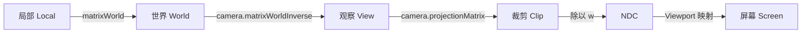

# Three.js 最小数学：从向量到坐标变换

你已经能创建 `Scene`、`Camera`、`Renderer`，也知道 Geometry 用顶点描述形状。接下来的常见卡点往往不是 API，而是：为什么减两个位置会得到方向？为什么子物体的位置没变，世界坐标却变了？鼠标二维坐标又怎么变成三维射线？

这篇文章只建立 Three.js 日常开发所需的**最小数学闭环**。每节都遵循同一顺序：

1. **先预测**：不运行代码，先在纸上写结果。
2. **再验证**：运行纯 JavaScript，或在 Three.js 中打印结果。
3. **最后解释**：把结果连接到真实 API。

我们不会在这里重复矩阵推导和高等数学。需要深挖时，请跳到现有文章：

- [向量是箭头：图形学数学的第二层语言](/posts/math/vectors-as-arrows)
- [向量圣经：点积、叉积与应用](/posts/math/vector-bible)
- [矩阵即变换](/posts/math/matrices-as-transforms)
- [3D 旋转：欧拉角、四元数与万向锁](/posts/math/3d-rotation)
- [坐标系与变换流水线](/posts/math/coordinate-systems-and-transformations)
- [相机与投影矩阵的数学推导](/posts/math/camera-and-projection)
- [三角函数就是圆周运动](/posts/math/trigonometry-as-circles)

:::important 本文的实验约定
Three.js 使用右手坐标系；示例把 `+Y` 当上方。透视相机位于自身原点时朝局部 `-Z` 看。浮点计算可能出现 `6.123e-17`，它在这里可视为 0。
:::

---

## 一、点、向量与方向：数字相同，语义不同

`(3, 2, 1)` 可以表示三件不同的事：

- **点（point）**：空间中的位置，例如角色位于 `(3, 2, 1)`。
- **向量（vector）**：有大小和方向的位移，例如“向右 3、向上 2、向前 1”。
- **方向（direction）**：只关心朝向，通常会归一化为长度 1。

`THREE.Vector3` 不替你区分这些语义；变量名和运算方式必须区分。最重要的四条规则是：

| 运算 | 结果 | 例子 |
|---|---|---|
| 点 + 位移 | 点 | 角色位置 + 本帧位移 = 新位置 |
| 点 - 点 | 向量 | 目标位置 - 角色位置 = 指向目标的向量 |
| 向量 + 向量 | 向量 | 速度 + 加速度造成的变化 |
| 点 + 点 | 通常没有几何意义 | 两个位置相加不是“中点” |

中点应写成 `(a + b) * 0.5`。在齐次坐标中，点写作 `(x,y,z,1)`，方向写作 `(x,y,z,0)`；因此平移会影响点，不会影响方向。

### 先预测

玩家在 `P=(1,2,3)`，目标在 `T=(4,6,3)`：

1. `T - P` 是多少？
2. 玩家到目标的距离是多少？
3. 单位方向是多少？
4. 沿该方向前进 2 个单位后，玩家在哪里？

### 再验证：减法、长度、归一化

```js
// 可运行
const sub = (a, b) => a.map((n, i) => n - b[i]);
const add = (a, b) => a.map((n, i) => n + b[i]);
const scale = (v, s) => v.map(n => n * s);
const length = v => Math.hypot(...v);
const normalize = v => {
  const len = length(v);
  if (len === 0) throw new Error('零向量没有唯一方向');
  return scale(v, 1 / len);
};

const player = [1, 2, 3];
const target = [4, 6, 3];
const toTarget = sub(target, player);
const direction = normalize(toTarget);
const next = add(player, scale(direction, 2));

console.log('目标向量:', toTarget);       // [3, 4, 0]
console.log('距离:', length(toTarget));   // 5
console.log('单位方向:', direction);      // [0.6, 0.8, 0]
console.log('前进 2 后:', next);          // [2.2, 3.6, 3]
```

Three.js 对应写法：

```javascript
const toTarget = new THREE.Vector3().subVectors(target.position, player.position);
const distance = toTarget.length();

if (distance > 0) {
  const direction = toTarget.clone().normalize();
  player.position.addScaledVector(direction, 2);
}
```

:::warning 不要无条件归一化零向量
当玩家和目标重合时，`target - player = (0,0,0)`。数学上它没有唯一方向。Three.js 的 `Vector3.normalize()` 会把零向量保持为零，不会抛错；业务代码仍应先用 `lengthSq()` 或距离判断“是否已经到达”。
:::

## 二、点积：回答“有多同向”

对两个向量：

$$
a\cdot b = a_xb_x+a_yb_y+a_zb_z=|a||b|\cos\theta
$$

如果二者都已归一化，点积就是夹角余弦：

- `1`：同向；
- `0`：垂直；
- `-1`：反向；
- 大于 `0`：在前半球；小于 `0`：在后半球。

### 先预测

守卫朝向 `forward=(0,0,-1)`。目标方向分别为 `A=(0,0,-1)`、`B=(1,0,0)`、`C=(0,0,1)`。三个点积是多少？谁在守卫前方？

### 再验证：视野锥判断

```js
// 可运行
const dot = (a, b) => a.reduce((sum, n, i) => sum + n * b[i], 0);
const normalize = v => {
  const len = Math.hypot(...v);
  return len === 0 ? [0, 0, 0] : v.map(n => n / len);
};

const forward = [0, 0, -1];
const targets = {
  A: [0, 0, -1],
  B: [1, 0, 0],
  C: [0, 0, 1],
  D: normalize([1, 0, -1]),
};
const halfFov = 50 * Math.PI / 180;
const threshold = Math.cos(halfFov);

for (const [name, direction] of Object.entries(targets)) {
  const score = dot(forward, direction);
  console.log(name, score.toFixed(3), score >= threshold ? '视野内' : '视野外');
}
```

仅判断 `dot > 0` 得到的是 180° 的前半球。要做总视角 100° 的视野锥，应比较 `dot >= cos(50°)`；而且两个输入都必须是单位方向。

## 三、叉积：从两个方向得到垂直方向

叉积 `a × b` 的结果同时垂直于 `a` 和 `b`，顺序会改变方向：

$$
a\times b=-(b\times a)
$$

在 Three.js 的右手坐标系中：

$$
+X\times +Y=+Z
$$

右手四指从第一个向量弯向第二个向量，拇指就是结果方向。叉积常用于构造相机的右方向、求三角形法线，以及判断某方向在另一方向的哪一侧。

### 先预测

三角形 `A=(0,0,0)`、`B=(1,0,0)`、`C=(0,1,0)`：`(B-A) × (C-A)` 朝 `+Z` 还是 `-Z`？交换 B、C 后呢？

### 再验证：三角形法线

```js
// 可运行
const sub = (a, b) => a.map((n, i) => n - b[i]);
const cross = (a, b) => [
  a[1] * b[2] - a[2] * b[1],
  a[2] * b[0] - a[0] * b[2],
  a[0] * b[1] - a[1] * b[0],
];

const A = [0, 0, 0];
const B = [1, 0, 0];
const C = [0, 1, 0];
console.log('AB × AC =', cross(sub(B, A), sub(C, A))); // [0, 0, 1]
console.log('AC × AB =', cross(sub(C, A), sub(B, A))); // [0, 0, -1]
```

顶点绕序反转，法线也反转，这正是背面剔除与“模型突然从某一面消失”的数学根源之一。更完整的几何意义见[向量圣经](/posts/math/vector-bible)。

## 四、右手坐标系与弧度：先统一语言

Three.js 的世界是右手系。常见调试配色是：X 红、Y 绿、Z 蓝，可直接加入：

```javascript
scene.add(new THREE.AxesHelper(3));
```

Three.js 的旋转 API 使用**弧度**而不是角度：

$$
180^\circ=\pi\ \text{rad},\qquad \text{rad}=\text{degree}\times\frac{\pi}{180}
$$

### 先预测，再验证

预测 90°、180°、360° 分别是多少弧度，以及绕 Y 轴转 90° 时 `(1,0,0)` 会到哪里。

```js
// 可运行
const degToRad = degree => degree * Math.PI / 180;
const rotateY = ([x, y, z], angle) => [
  Math.cos(angle) * x + Math.sin(angle) * z,
  y,
  -Math.sin(angle) * x + Math.cos(angle) * z,
];

for (const degree of [90, 180, 360]) {
  console.log(`${degree}° =`, degToRad(degree), 'rad');
}
console.log(rotateY([1, 0, 0], degToRad(90)).map(n => Math.abs(n) < 1e-10 ? 0 : n));
// [0, 0, -1]
```

因此应写 `mesh.rotation.y = THREE.MathUtils.degToRad(90)`，而不是 `mesh.rotation.y = 90`。后者是 90 弧度，约等于转了 14.3 圈。


---

## 五、TRS 与局部矩阵：一个 Object3D 怎样搬动顶点

`Object3D` 暴露三个易用属性：

- `position`：Translation，平移；
- `quaternion` / `rotation`：Rotation，旋转的两种表示；
- `scale`：Scale，缩放。

Three.js 将它们组合成局部矩阵 `matrix`：

$$
M_{local}=T\cdot R\cdot S
$$

对列向量从右往左执行，所以一个局部点经历的是：**先缩放，再旋转，最后平移**。

### 先预测

局部点 `p=(1,0,0)`，物体 `scale=(2,1,1)`，绕 Z 轴旋转 90°，再平移 `(10,0,0)`。世界点是多少？

不要把顺序写反：先平移再旋转会让物体绕世界原点“公转”。

### 再验证：逐步计算 TRS

```js
// 可运行
const p = [1, 0, 0];
const scale = ([x, y, z], [sx, sy, sz]) => [x * sx, y * sy, z * sz];
const rotateZ = ([x, y, z], angle) => [
  Math.cos(angle) * x - Math.sin(angle) * y,
  Math.sin(angle) * x + Math.cos(angle) * y,
  z,
];
const translate = (p, t) => p.map((n, i) => n + t[i]);
const clean = p => p.map(n => Math.abs(n) < 1e-10 ? 0 : n);

const afterS = scale(p, [2, 1, 1]);      // [2, 0, 0]
const afterR = rotateZ(afterS, Math.PI/2); // [0, 2, 0]
const afterT = translate(afterR, [10, 0, 0]);

console.log(clean(afterS), clean(afterR), clean(afterT));
// 最终 [10, 2, 0]
```

Three.js 可以直接核对矩阵结果：

```javascript
const object = new THREE.Object3D();
object.position.set(10, 0, 0);
object.rotation.z = Math.PI / 2;
object.scale.set(2, 1, 1);
object.updateMatrix();

const point = new THREE.Vector3(1, 0, 0).applyMatrix4(object.matrix);
console.log(point); // Vector3 { x: 10, y: 2, z: 0 }（浮点误差范围内）
```

通常不要手改 `object.matrix`；让 Three.js 从 TRS 组合它。只有在你明确设置 `matrixAutoUpdate = false` 时，才需要负责何时调用 `updateMatrix()`。

## 六、父子关系与 world matrix：孩子继承的是坐标系

子物体的 `position` 是**相对父物体**的位置。真正把子物体顶点送进世界空间的是 `matrixWorld`：

$$
M_{world,child}=M_{world,parent}\cdot M_{local,child}
$$

这条公式递归到 `Scene`，就是场景图。父节点不只是给孩子“加一个位置”；父节点的旋转和缩放也会改变孩子局部坐标轴的方向与长度。

### 先预测

父节点位于 `(10,0,0)`，绕 Z 轴旋转 90°；子节点局部位置是 `(2,0,0)`。子节点世界位置是 `(12,0,0)` 还是 `(10,2,0)`？

### 再验证：父矩阵乘局部矩阵

```js
// 可运行
const rotateZ = ([x, y, z], a) => [
  Math.cos(a) * x - Math.sin(a) * y,
  Math.sin(a) * x + Math.cos(a) * y,
  z,
];
const add = (a, b) => a.map((n, i) => n + b[i]);
const clean = p => p.map(n => Math.abs(n) < 1e-10 ? 0 : n);

const parentPosition = [10, 0, 0];
const childLocalPosition = [2, 0, 0];
const childInParentAxes = rotateZ(childLocalPosition, Math.PI / 2);
const childWorldPosition = add(parentPosition, childInParentAxes);

console.log(clean(childWorldPosition)); // [10, 2, 0]
```

用真实 API 核对时，要先确保世界矩阵是新的：

```javascript
const parent = new THREE.Group();
parent.position.set(10, 0, 0);
parent.rotation.z = Math.PI / 2;

const child = new THREE.Object3D();
child.position.set(2, 0, 0);
parent.add(child);
scene.add(parent);

scene.updateMatrixWorld(true);
const worldPosition = new THREE.Vector3();
child.getWorldPosition(worldPosition);
console.log(worldPosition); // 约为 (10, 2, 0)
```

实用转换 API：

```javascript
const localPoint = new THREE.Vector3(1, 0, 0);
object.localToWorld(localPoint); // 原地修改 localPoint

const worldPoint = new THREE.Vector3(5, 2, 0);
object.worldToLocal(worldPoint); // 原地修改 worldPoint
```

:::warning Vector3 方法多数会修改调用者
`normalize()`、`add()`、`sub()`、`applyMatrix4()`、`project()` 都会原地修改向量。需要保留原值时先 `clone()`；动画循环中则应复用临时向量，避免每帧制造垃圾。
:::

### 一个容易被低估的边界：非均匀缩放

父节点 `scale=(2,1,1)` 后，孩子局部 X 方向的 1 单位会成为世界中的 2 单位。若再叠加旋转，矩阵还可能包含剪切效果；此时“世界旋转、世界缩放、世界位置”不再能总是无损拆回一组漂亮的 TRS。工程中优先把非均匀缩放放在叶子 Mesh，而不是会继续承载旋转子节点的 Group。

矩阵为什么能组合、为什么乘法顺序不能交换，详见[矩阵即变换](/posts/math/matrices-as-transforms)。


---

## 七、从局部到屏幕：同一个点的六种坐标

一个顶点不是“变了六次身份”，而是**同一个几何点用六套坐标系描述**：



### 1. 局部空间（Local / Model Space）

Geometry 的 `position` attribute 存的就是局部坐标。立方体中心通常在 `(0,0,0)`，无论 Mesh 后来被放到哪里，Geometry 顶点数据本身不必改变。

### 2. 世界空间（World Space）

局部点乘物体 `matrixWorld`：

$$
p_{world}=M_{world}p_{local}
$$

它回答“这个顶点在整个场景哪里”。

### 3. 观察空间（View / Camera Space）

世界点乘视图矩阵：

$$
p_{view}=M_{view}p_{world}
$$

`camera.matrixWorldInverse` 就是相机世界矩阵的逆。观察空间中相机在原点，沿 `-Z` 看；因此相机前方的点通常有负的观察空间 z。

### 4. 裁剪空间（Clip Space）

观察点乘投影矩阵后得到四维齐次坐标：

$$
p_{clip}=M_{projection}p_{view}=(x_c,y_c,z_c,w_c)
$$

GPU 在这里按 `-w ≤ x,y,z ≤ w` 做裁剪。不要把裁剪空间误称为 NDC：它还没有除以 `w`。

### 5. NDC（Normalized Device Coordinates）

透视除法后：

$$
p_{ndc}=\left(\frac{x_c}{w_c},\frac{y_c}{w_c},\frac{z_c}{w_c}\right)
$$

WebGL 的可见 NDC 范围是 `[-1,1]`。透视相机中，远处点往往有更大的 `w`，x、y 除完更接近 0，于是产生“近大远小”。

### 6. 屏幕空间（Screen Space）

对宽 `W`、高 `H`、左上角为原点的 DOM 区域：

$$
x_{screen}=\frac{x_{ndc}+1}{2}W
$$

$$
y_{screen}=\frac{1-y_{ndc}}{2}H
$$

注意 y 翻转：NDC 的 `+Y` 朝上，DOM 像素 y 朝下。

### 先预测

画布 CSS 尺寸为 `800 × 600`：

- NDC `(0,0)` 落在哪个像素？
- NDC `(-1,1)` 呢？
- NDC `(0.5,-0.5)` 呢？

### 再验证：NDC 映射屏幕

```js
// 可运行
function ndcToScreen([x, y], width, height) {
  return [
    (x + 1) * 0.5 * width,
    (1 - y) * 0.5 * height,
  ];
}

for (const ndc of [[0, 0], [-1, 1], [0.5, -0.5]]) {
  console.log(ndc, '→', ndcToScreen(ndc, 800, 600));
}
// [0,0] → [400,300]
// [-1,1] → [0,0]
// [0.5,-0.5] → [600,450]
```

### 完整 Three.js 用法：世界点投到 DOM

```javascript
const world = new THREE.Vector3();
object.getWorldPosition(world);

// project 会把 world 原地改成 NDC
const ndc = world.clone().project(camera);
const rect = renderer.domElement.getBoundingClientRect();

const screen = {
  x: rect.left + (ndc.x + 1) * 0.5 * rect.width,
  y: rect.top + (1 - ndc.y) * 0.5 * rect.height,
};
```

这里使用 **CSS 像素尺寸** `rect.width/height` 定位 DOM 标签，不应换成 drawing buffer 的物理像素尺寸。高 DPR 屏幕上两者不同。

:::tip 判断标签是否值得显示
仅检查 `ndc.x/y` 在 `[-1,1]` 不够：点可能在相机后方，或被其他物体遮挡。工程中还要检查相机前后关系、NDC 深度，并按需发射遮挡射线。
:::

### 一次完整的可计算流水线

为了把六个空间串起来，先用一个简化场景：局部点 `(1,1,0)`；物体只平移 `(2,0,0)`；相机只位于 `(0,0,5)` 且不旋转；这里用简化投影 `x_ndc=x_view/-z_view`、`y_ndc=y_view/-z_view`；屏幕 `800×600`。

### 先预测

按“局部 → 世界 → 观察 → NDC → 屏幕”依次写出数值，再运行：

```js
// 可运行
const local = [1, 1, 0];
const modelTranslation = [2, 0, 0];
const cameraPosition = [0, 0, 5];
const add = (a, b) => a.map((n, i) => n + b[i]);
const sub = (a, b) => a.map((n, i) => n - b[i]);

const world = add(local, modelTranslation);       // [3, 1, 0]
const view = sub(world, cameraPosition);          // [3, 1, -5]
const ndc = [view[0] / -view[2], view[1] / -view[2]];
const screen = [
  (ndc[0] + 1) * 0.5 * 800,
  (1 - ndc[1]) * 0.5 * 600,
];

console.log({ local, world, view, ndc, screen });
// ndc = [0.6, 0.2]，screen = [640, 240]
```

真实透视投影还会考虑 FOV、aspect、near、far，并先产生 clip 的 `w`。完整推导请读[坐标系与变换流水线](/posts/math/coordinate-systems-and-transformations)和[相机与投影矩阵](/posts/math/camera-and-projection)。


---

## 八、Euler 与 Quaternion：两种旋转语言

### Euler：适合人读和编辑

欧拉角把旋转写成“绕 X、Y、Z 各转多少”。Three.js 默认顺序是 `XYZ`：

```javascript
mesh.rotation.set(
  THREE.MathUtils.degToRad(30),
  THREE.MathUtils.degToRad(45),
  0,
  'XYZ'
);
```

顺序是旋转含义的一部分。同一组三个角，`XYZ` 与 `YXZ` 一般得到不同朝向。欧拉角直观，适合属性面板、有限轴控制和简单自转。

### Quaternion：适合组合与插值

四元数用 `(x,y,z,w)` 表示旋转。你不需要手算四个分量；用轴角、欧拉角、`lookAt` 或现有朝向构造：

```javascript
const axis = new THREE.Vector3(0, 1, 0).normalize();
const target = new THREE.Quaternion().setFromAxisAngle(axis, Math.PI / 2);
mesh.quaternion.copy(target);
```

`rotation` 与 `quaternion` 是同一个 Object3D 朝向的两种接口，Three.js 会同步二者。代码设计上应选一种作为主要写入方式，避免一段动画写 `rotation`、另一段动画又覆盖 `quaternion`。

### 万向锁为什么出现

欧拉旋转按顺序套三层旋转轴。当中间轴转到某些姿态时，两根旋转轴重合，三个控制自由度暂时只剩两个，这就是万向锁。它不是“欧拉角数值坏了”，而是这种参数化在该姿态的结构性退化。

四元数不会以三层旋转轴保存姿态，因此可避免这种表示导致的万向锁；但如果你每帧仍把它转回欧拉角、改三个角、再转回四元数，问题可能被重新引入。

### 先预测

物体从 Y 轴 `10°` 转到 `350°`。直接对角度做线性插值，中点是 `180°`，会走 340° 的长路；视觉上更合理的最短路径中点应靠近 `0°`。

### 再验证：角度最短路径

```js
// 可运行
const degToRad = d => d * Math.PI / 180;
const radToDeg = r => r * 180 / Math.PI;

// 把角差包装到 [-PI, PI)
function shortestAngleDelta(from, to) {
  const tau = Math.PI * 2;
  return ((to - from + Math.PI) % tau + tau) % tau - Math.PI;
}

const from = degToRad(10);
const to = degToRad(350);
const naiveMid = (from + to) * 0.5;
const shortestMid = from + shortestAngleDelta(from, to) * 0.5;

console.log('普通线性中点:', radToDeg(naiveMid));       // 180
console.log('最短路径中点:', radToDeg(shortestMid));    // 约 0
```

三维姿态不要逐分量 `lerp` 欧拉角；让四元数做球面插值：

```javascript
const start = mesh.quaternion.clone();
const end = new THREE.Quaternion().setFromEuler(
  new THREE.Euler(0, THREE.MathUtils.degToRad(350), 0)
);

// t 在 [0, 1]；Quaternion.slerp 会选择等价姿态之间的短弧
mesh.quaternion.slerpQuaternions(start, end, t);
```

两个单位四元数 `q` 与 `-q` 表示同一个旋转，这也是不能把四元数当普通四维位置逐分量理解的原因。更深入的推导和万向锁图解见[3D 旋转](/posts/math/3d-rotation)。

## 九、delta 时间：速度乘时间，而不是每帧加常数

“每帧前进 0.1”把速度绑定到帧数：60 FPS 每秒走 6，144 FPS 每秒走 14.4。正确模型是：

$$
\Delta position = velocity\times\Delta time
$$

其中 `delta` 的单位通常是秒。原生 Three.js：

```javascript
const clock = new THREE.Clock();
const speed = 3; // 世界单位 / 秒

function animate() {
  requestAnimationFrame(animate);
  const delta = Math.min(clock.getDelta(), 0.1);
  mesh.position.x += speed * delta;
  renderer.render(scene, camera);
}
animate();
```

`Math.min(..., 0.1)` 是一种简单保护：切换标签页后可能出现很大的 delta，避免物体一步穿过障碍。严谨物理模拟通常使用固定时间步和累加器，而不是只截断 delta。

### 先预测

速度为 `3 unit/s`。分别用 60 个 `1/60s` 帧、30 个 `1/30s` 帧模拟 1 秒，最终距离是否一样？

### 再验证：帧率独立移动

```js
// 可运行
function travel(speed, deltas) {
  return deltas.reduce((position, delta) => position + speed * delta, 0);
}

const at60fps = travel(3, Array(60).fill(1 / 60));
const at30fps = travel(3, Array(30).fill(1 / 30));
console.log(at60fps, at30fps); // 都约等于 3
```

### 阻尼也要帧率独立

固定写 `position.lerp(target, 0.1)` 仍然是“每帧靠近 10%”，高刷新率会更快。把每秒阻尼强度 `lambda` 转成当前帧插值系数：

$$
\alpha=1-e^{-\lambda\Delta t}
$$

```js
// 可运行
function damp(start, target, lambda, deltas) {
  return deltas.reduce((value, delta) => {
    const alpha = 1 - Math.exp(-lambda * delta);
    return value + (target - value) * alpha;
  }, start);
}

const a = damp(0, 10, 5, Array(60).fill(1 / 60));
const b = damp(0, 10, 5, Array(30).fill(1 / 30));
console.log(a.toFixed(6), b.toFixed(6)); // 相同
```

Three.js 提供 `THREE.MathUtils.damp(x, y, lambda, dt)` 处理标量；Vector3 可以逐轴 damp，或用上面的 `alpha` 调用 `position.lerp(target, alpha)`。

## 十、screen → NDC → ray：鼠标为什么不是一个世界点

屏幕点击只有二维 `(clientX, clientY)`。在透视相机中，一条视线上的无数世界点都投到同一像素，所以单个屏幕点无法唯一恢复一个三维点；它能确定的是一条**射线**：

1. 把屏幕坐标映射到 NDC；
2. 用相机投影和视图变换的逆，把 NDC 反投影；
3. 透视相机以相机位置为射线原点，朝反投影点得到方向；
4. 与场景几何体求交，最近命中点才是你要的世界点。

### 先预测

Canvas 位于页面 `(left=100, top=50)`，CSS 尺寸 `800×600`。鼠标位于 Canvas 中心，即 `client=(500,350)`。它的 NDC 应是多少？Canvas 左上角呢？

### 再验证：屏幕坐标转 NDC

```js
// 可运行
function pointerToNdc(clientX, clientY, rect) {
  return {
    x: ((clientX - rect.left) / rect.width) * 2 - 1,
    y: -((clientY - rect.top) / rect.height) * 2 + 1,
  };
}

const rect = { left: 100, top: 50, width: 800, height: 600 };
console.log(pointerToNdc(500, 350, rect)); // { x: 0, y: 0 }
console.log(pointerToNdc(100, 50, rect));  // { x: -1, y: 1 }
```

不要直接除以 `window.innerWidth/innerHeight`：Canvas 可能有边距、滚动偏移或并未铺满窗口。应始终使用 `renderer.domElement.getBoundingClientRect()`。

### Three.js 的完整射线拾取

```javascript
const pointer = new THREE.Vector2();
const raycaster = new THREE.Raycaster();

renderer.domElement.addEventListener('pointerdown', event => {
  const rect = renderer.domElement.getBoundingClientRect();
  pointer.x = ((event.clientX - rect.left) / rect.width) * 2 - 1;
  pointer.y = -((event.clientY - rect.top) / rect.height) * 2 + 1;

  raycaster.setFromCamera(pointer, camera);
  const hits = raycaster.intersectObjects(scene.children, true);

  if (hits.length > 0) {
    const nearest = hits[0];
    console.log('对象:', nearest.object.name);
    console.log('世界命中点:', nearest.point);
    console.log('距离:', nearest.distance);
  }
});
```

`intersectObjects` 的结果按距离从近到远排序。第二个参数 `true` 表示递归检查子节点。射线拾取依赖最新的相机和物体 world matrix；通常渲染循环会更新它们，若你在渲染前刚修改层级变换并立即拾取，可先调用 `scene.updateMatrixWorld(true)`。

:::important 透视相机与正交相机的射线不同
透视相机的射线通常从同一个相机位置向外发散；正交相机的射线方向彼此平行，但原点随屏幕位置变化。`Raycaster.setFromCamera()` 会根据相机类型正确处理，不要自己硬编码“原点永远是 camera.position”。
:::


---

## 十一、综合实验：会追踪目标、且帧率独立转向的物体

下面把“点减点得到方向、长度、归一化、点积、叉积、四元数、delta”串在一起。代码假设已有 `scene`、`camera`、`renderer`，可放进你完成第一帧后的原生 Three.js 项目。

### 先预测

1. 追踪者与目标重合时会不会出现无效方向？
2. 目标在追踪者右侧时，`forward × direction` 的 y 分量是正还是负？
3. 把刷新率从 60Hz 换成 144Hz，单位时间移动距离是否改变？

### 再验证

```javascript
const tracker = new THREE.Mesh(
  new THREE.ConeGeometry(0.35, 1, 16),
  new THREE.MeshNormalMaterial()
);
// ConeGeometry 默认沿 Y 轴，转到局部 -Z 作为“前方”
tracker.geometry.rotateX(-Math.PI / 2);
scene.add(tracker);

const target = new THREE.Mesh(
  new THREE.SphereGeometry(0.2, 16, 16),
  new THREE.MeshBasicMaterial({ color: 0xff5533 })
);
scene.add(target);

const clock = new THREE.Clock();
const toTarget = new THREE.Vector3();
const direction = new THREE.Vector3();
const forward = new THREE.Vector3();
const targetQuaternion = new THREE.Quaternion();
const speed = 2;
const turnLambda = 8;

function animate() {
  requestAnimationFrame(animate);
  const delta = Math.min(clock.getDelta(), 0.1);
  const time = clock.elapsedTime;

  target.position.set(Math.cos(time) * 3, 0, Math.sin(time) * 3);
  toTarget.subVectors(target.position, tracker.position);
  const distance = toTarget.length();

  if (distance > 0.05) {
    direction.copy(toTarget).multiplyScalar(1 / distance);

    // 局部 -Z 经过当前旋转后，得到世界前方向
    forward.set(0, 0, -1).applyQuaternion(tracker.quaternion);
    console.log('朝向相似度:', forward.dot(direction));

    // 让局部 -Z 对准目标方向
    targetQuaternion.setFromUnitVectors(
      new THREE.Vector3(0, 0, -1),
      direction
    );
    const alpha = 1 - Math.exp(-turnLambda * delta);
    tracker.quaternion.slerp(targetQuaternion, alpha);

    // 防止单帧越过目标
    tracker.position.addScaledVector(direction, Math.min(speed * delta, distance));
  }

  renderer.render(scene, camera);
}
animate();
```

为了突出数学，示例在动画循环中创建了一次 `new THREE.Vector3(0,0,-1)`；生产代码应把它也提升为可复用常量。若模型资产的“前方”不是局部 `-Z`，应根据资产轴向改基准向量，而不是用错误方向补神秘角度。

## 十二、遇到坐标 Bug 时，按空间逐站排查

不要随机改正负号。先问“我手里的数属于哪个空间”：

| 现象 | 优先检查 |
|---|---|
| 子物体位置数值没变却移动了 | 父节点的 `matrixWorld` 是否改变 |
| `lookAt`、点积方向忽然错误 | 两个向量是否处于同一空间，方向是否归一化 |
| DOM 标签上下颠倒 | NDC 到屏幕时是否翻转 y |
| 鼠标拾取整体偏移 | 是否减去 Canvas 的 `rect.left/top` |
| 点击命中旧位置 | world matrix 是否已经更新 |
| 高刷新率动画更快 | 是否用了 `speed * delta` |
| 阻尼在不同设备手感不同 | 是否用了固定每帧 lerp 系数 |
| 旋转绕远路或跳变 | 是否逐分量插值 Euler，是否应改用 quaternion slerp |
| 子节点旋转后形状歪斜 | 父节点是否有非均匀缩放 |
| 世界点投屏后标签仍不合理 | 点是否在相机后方、视锥外或被遮挡 |

一个稳定的调试流程是：

```javascript
scene.updateMatrixWorld(true);
camera.updateMatrixWorld(true);

console.log('local position', object.position.clone());
console.log('world position', object.getWorldPosition(new THREE.Vector3()));
console.log('matrix', object.matrix.elements);
console.log('matrixWorld', object.matrixWorld.elements);

scene.add(new THREE.AxesHelper(3));
object.add(new THREE.AxesHelper(1));
```

世界轴和局部轴同时画出来，很多“方向错了”的问题会立即变成可见事实。

## 十三、通关自检：先写答案，再展开

1. `target - position` 得到什么？为什么不能写反？
2. 点积为 0、负数、1 分别意味着什么？
3. 为什么 `a × b` 与 `b × a` 方向相反？
4. `rotation.y = Math.PI / 2` 是多少度？
5. 为什么 `T · R · S` 实际先执行 S？
6. 子物体 `position` 为什么不是世界位置？
7. Clip 与 NDC 的分界操作是什么？
8. NDC 的 `(0,0)` 为什么不是 DOM 的左上角？
9. 为什么单个屏幕点不能唯一反推出一个世界点？
10. 为什么 `position.x += 0.1` 不是帧率独立动画？

::: details 参考答案
1. 从当前位置指向目标的向量；写反会朝远离目标的方向。
2. 垂直、反向半球、完全同向，前提是谈夹角时输入已归一化。
3. 叉积遵循右手定则且反交换。
4. 90°。
5. 列向量在最右边，矩阵作用从右向左嵌套。
6. 它相对父节点；世界位置还要递归乘所有祖先变换。
7. 透视除法，即 clip 的 x、y、z 除以 w。
8. NDC 原点在中心且 y 向上；DOM 原点通常在左上且 y 向下。
9. 同一视线上有无数深度，屏幕点只能确定一条射线，再靠求交确定点。
10. 它表达“每帧 0.1”而非“每秒多少”；应使用 `speed * delta`。
:::

## 总结：真正需要记住的最小闭环

- 点是位置，点减点得到向量；归一化把“多远”去掉，只保留“朝哪”。
- 点积衡量同向程度，叉积构造垂直方向，二者都要求你明确输入所在空间。
- Three.js 是右手系，旋转使用弧度。
- Object3D 的局部矩阵是 TRS 组合，子节点世界矩阵是 `parent.matrixWorld × child.matrix`。
- 顶点依次经过局部、世界、观察、裁剪、NDC、屏幕空间；Clip 到 NDC 的关键是除以 w。
- Euler 便于编辑，Quaternion 便于组合和 slerp；不要逐分量插值复杂三维姿态。
- 运动使用 `速度 × delta`，阻尼使用随 delta 变化的系数。
- 屏幕坐标先转 NDC，再由相机反投影成 ray，最后与几何体求交。

下一步把矩阵层级真正用进对象组织，请继续阅读 [Three.js 场景系统详解](/posts/threejs/scene-system-explained)；随后用观察与投影理解镜头，请阅读 [Three.js 相机体系详解](/posts/threejs/camera-system-explained)。