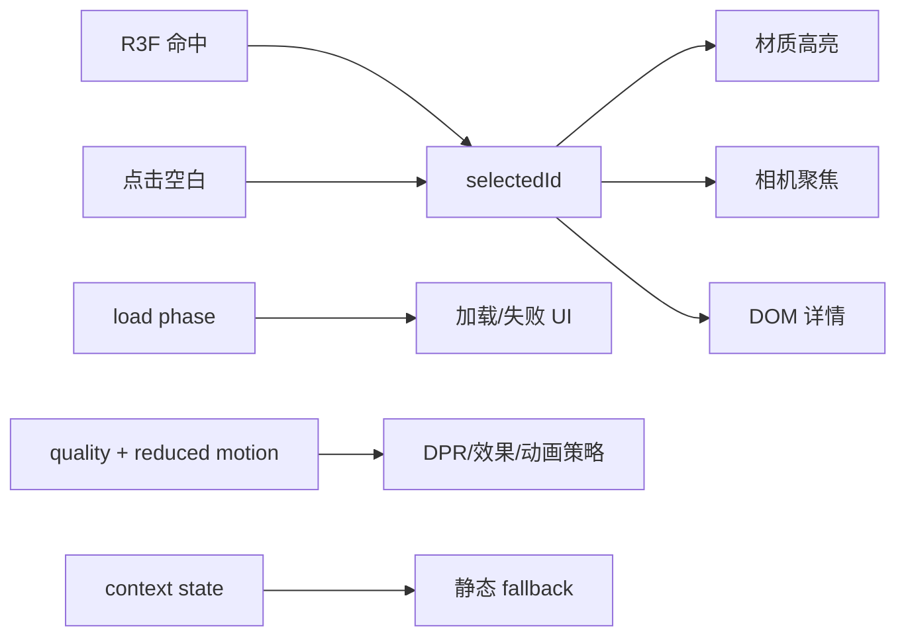

# Three.js 产品查看器综合项目：从验收到性能门禁

前面的专题分别解释了场景、资产、动画、交互、相机、Shader、后期和性能；本篇把它们收束成一个可以验收的产品：围绕仓库中的真实资产 `/blog/models/threejs-course-product.gltf`，构建一个能加载、能选择、能聚焦、能降级、也能安全卸载的产品查看器。

示例以 **Three.js 0.182.x、React 19、React Three Fiber 9.5.x、drei 10.7.x** 为基线。资产是自包含 glTF，不依赖外部 `.bin`、纹理或 decoder；它包含 `Enclosure`、`DisplayPanel`、`StatusControl` 三个 Mesh、三个 PBR 材质，以及 3 秒的 `StatusControlSpin` 动画。本站配置了 `basePath: '/blog'`，所以浏览器资产 URL 必须带 `/blog`；文章链接则不带。

## 一、先写需求与验收，不从 Canvas 开始

### 功能需求

1. 首屏先显示可长期停留的静态内容；模型通过 `Suspense` 等待，失败由 Error Boundary 接管，最多自动/手动重试 2 次。
2. 加载成功后检查真实节点、类型、材质与动画；必要节点不满足契约时进入明确失败 UI，而不是在深层属性访问处崩溃。
3. 播放真实 `StatusControlSpin`；用户启用 reduced motion 时保持静态首帧，不自动旋转或平滑飞镜头。
4. Raycaster/R3F 事件只写一份 `selectedId: PartId | null`。点击 Mesh 选中，点击空白取消；高亮、详情面板和相机全部读取同一 ID。
5. 详情是 Canvas 外的真实 DOM，键盘可达，空数据和失效 ID 都有定义；UI 区域不会误点背后的 3D。
6. 选中后相机聚焦对象，取消或点击“复位”回到入口机位。窗口与容器变化由 R3F resize，DPR 由质量档限制。
7. 高亮不能修改 `useGLTF` 缓存中的共享材质；Geometry 保持共享，只克隆本查看器会改写的 Material。
8. Shader 扫描、Outline/Bloom 是可选增强。关闭它们后核心选择语义仍完整；低档与 reduced motion 默认不启用持续特效。
9. 路由卸载后移除原生监听、停止动作、解除 Mixer 绑定并释放私有材质；不递归 dispose 共享 glTF 缓存。
10. WebGL context lost 时显示静态 DOM fallback；恢复失败也不隐藏产品名称、说明和操作入口。

### 可执行验收

- [ ] 正常网络：模型出现，控制点旋转；Console 中的资产报告恰有 3 个命名 Mesh 和 3 个命名材质。
- [ ] 404/损坏 glTF：fallback 被 Error Boundary 替换；重试次数到上限后按钮禁用，不产生无限请求。
- [ ] 缺少 `DisplayPanel` 或节点类型改变：显示“资产结构不兼容”，不进入可交互态。
- [ ] 依次点击三个部件：任意时刻只有一个 `selectedId`；高亮、标题与镜头目标一致。
- [ ] 点击 Canvas 空白：`selectedId === null`，高亮恢复，详情显示总览，镜头复位。
- [ ] 点击详情面板和质量下拉框：不会触发 3D 选择或取消。
- [ ] 重复进入/离开路由 50 次：context 监听、Mixer、私有 Material 不累积；共享缓存资源没有被叶子组件提前释放。
- [ ] 模拟 `webglcontextlost`：Canvas 上方出现静态 fallback；`webglcontextrestored` 后重新投影当前选择。
- [ ] reduced motion：自动动画和自动平滑运镜关闭，用户仍可主动旋转、选择与复位。
- [ ] 固定设备基线通过文章末尾的 p50/p95、draw call、三角形、首个可交互时间和视觉门禁。

## 二、状态模型：一份业务真相，其他都是派生



不要给三个 Mesh 各放一个 `selected`，也不要让详情面板复制选中对象。最小状态如下：

```ts
export type PartId = 'enclosure' | 'display' | 'control'
export type LoadPhase = 'loading' | 'ready' | 'error'
export type QualityTier = 'low' | 'medium' | 'high'

export interface ViewerState {
  selectedId: PartId | null
  loadPhase: LoadPhase
  retryAttempt: number
  quality: QualityTier
  contextState: 'ready' | 'lost' | 'restoring' | 'failed'
}
```

其中 `selectedId`、`quality` 是业务/UI 状态；相机位置、Mixer 时间和临时 Box3 是 Three.js 逐帧状态，不写入 React state。`loadPhase` 由 Suspense/Error Boundary 的分支表达，不再额外维护一个可能与它们冲突的布尔值。

状态转移必须有边界：

| 事件 | 前置 | 后置 | 失败/取消 |
| --- | --- | --- | --- |
| `part.click(id)` | id 在目录且节点已验证 | `selectedId=id` | 未知 id 拒绝提交 |
| `canvas.missed` | 无 3D 命中 | `selectedId=null` | 地面参与拾取时需由地面显式清空 |
| `retry` | Error Boundary 已失败且 attempt < 2 | 清失败键并创建新 URL 键 | 到上限禁用 |
| `quality.change` | 用户主动选择 | 更新 DPR 与可选效果 | 不重载 glTF |
| `context.lost` | Canvas 仍挂载 | 显示静态 fallback | 不当作 React render error |
| `route.unmount` | 任意阶段 | 失效事件与实例状态 | 晚返回不得写 UI、不得释放共享缓存 |

## 三、项目目录与安装

下面是一个独立 React/Vite 项目的文件布局；复制进现有应用时只需调整入口和 CSS 引入。核心版本与本仓库一致。

```text
src/
├─ main.tsx
├─ App.tsx
└─ product-viewer/
   ├─ catalog.ts
   ├─ quality.ts
   ├─ ModelErrorBoundary.tsx
   ├─ ProductExperience.tsx
   ├─ ProductViewer.tsx
   └─ product-viewer.css
public/
└─ models/
   └─ threejs-course-product.gltf
```

独立项目安装：

```bash
npm install three@0.182.0 react@19.2.3 react-dom@19.2.3 @react-three/fiber@9.5.0 @react-three/drei@10.7.7
```

若直接使用本站资产，不复制文件也可以，但 URL 必须是 `/blog/models/threejs-course-product.gltf`。独立 Vite 项目把文件放进自己的 `public/models` 后，应将常量改为 `/models/threejs-course-product.gltf`。

## 四、目录与质量策略

### `src/product-viewer/catalog.ts`

业务 ID 不直接等于 DCC 名称。目录负责把稳定业务语义映射到资产契约，详情面板也只读这里。

```ts
export const PRODUCT_URL = '/blog/models/threejs-course-product.gltf'
export const MAX_RETRIES = 2

export const PARTS = {
  enclosure: {
    nodeName: 'Enclosure',
    title: '产品外壳',
    materialName: 'CasingMat',
    description: '保护内部结构的金属外壳。',
  },
  display: {
    nodeName: 'DisplayPanel',
    title: '显示面板',
    materialName: 'ScreenMat',
    description: '显示产品状态与主要信息。',
  },
  control: {
    nodeName: 'StatusControl',
    title: '状态控件',
    materialName: 'AccentMat',
    description: '带有 StatusControlSpin 动画的强调控件。',
  },
} as const

export type PartId = keyof typeof PARTS
export type QualityTier = 'low' | 'medium' | 'high'

export function isPartId(value: string): value is PartId {
  return Object.prototype.hasOwnProperty.call(PARTS, value)
}
```

### `src/product-viewer/quality.ts`

质量档不是 UA 判断。这里用 reduced motion、save-data 和并发核数作弱信号，只选择初始档；用户可以覆盖，真实项目还要加入一段受控帧时间采样。

```ts
import type { QualityTier } from './catalog'

export interface QualityProfile {
  dpr: [number, number]
  shadows: boolean
  postprocessing: boolean
}

export const QUALITY: Record<QualityTier, QualityProfile> = {
  low: { dpr: [1, 1], shadows: false, postprocessing: false },
  medium: { dpr: [1, 1.5], shadows: true, postprocessing: false },
  high: { dpr: [1, 2], shadows: true, postprocessing: true },
}

export function chooseInitialQuality(): QualityTier {
  const reduced = matchMedia('(prefers-reduced-motion: reduce)').matches
  const saveData = Boolean(
    (navigator as Navigator & { connection?: { saveData?: boolean } }).connection?.saveData,
  )
  if (reduced || saveData || navigator.hardwareConcurrency <= 4) return 'low'
  return navigator.hardwareConcurrency <= 8 ? 'medium' : 'high'
}
```

R3F 会通过 `ResizeObserver`/内部尺寸状态跟随 Canvas 容器，不需要再监听 `window.resize`。`dpr={[min,max]}` 限制 drawing buffer 比例；CSS 尺寸和 drawing buffer 尺寸不是同一概念。若加入自定义 RenderTarget 或 Composer 外的 Pass，仍要单独同步 `setSize` 并释放旧目标。

## 五、Suspense、Error Boundary 与有限重试

Error Boundary 必须位于会 suspend/throw 的模型子树外。仅清空 Boundary 的 `error` 不够：失败 Promise 仍可能被同一 URL 的 loader cache 命中，所以重试同时清失败键，并使用一个有上限的新 query 作为新资源键。

### `src/product-viewer/ModelErrorBoundary.tsx`

```tsx
import React from 'react'

interface Props {
  resetKey: number
  attempt: number
  maxRetries: number
  onRetry: () => void
  children: React.ReactNode
}

interface State { error: Error | null }

export class ModelErrorBoundary extends React.Component<Props, State> {
  state: State = { error: null }

  static getDerivedStateFromError(error: unknown): State {
    return { error: error instanceof Error ? error : new Error('未知模型错误') }
  }

  componentDidUpdate(previous: Props) {
    if (previous.resetKey !== this.props.resetKey && this.state.error) {
      this.setState({ error: null })
    }
  }

  componentDidCatch(error: Error, info: React.ErrorInfo) {
    // 生产上报只发送稳定错误码、版本和阶段，不上传完整资产数据。
    console.error('PRODUCT_MODEL_FAILED', error, info.componentStack)
  }

  render() {
    const { error } = this.state
    if (!error) return this.props.children

    const exhausted = this.props.attempt >= this.props.maxRetries
    const incompatible = error.message.startsWith('ASSET_CONTRACT:')

    return (
      <div className="pv-status pv-status--error" role="alert">
        <strong>{incompatible ? '资产结构不兼容' : '产品模型加载失败'}</strong>
        <p>
          {incompatible
            ? '模型已下载，但必要节点、材质或类型与查看器契约不一致。'
            : '请检查网络、HTTP 状态、响应 MIME 与控制台错误。'}
        </p>
        <button type="button" onClick={this.props.onRetry} disabled={exhausted}>
          {exhausted ? '已达到重试上限' : `重试（${this.props.attempt}/${this.props.maxRetries}）`}
        </button>
      </div>
    )
  }
}
```

### 重试的精确边界

- `useGLTF.clear(failedUrl)` 只用于**失败且没有成功消费者**的键。不要在普通卸载时清成功缓存，更不要随后递归 dispose 它的 scene。
- query 重试会留下至多 2 个额外缓存键，因此必须有限。生产项目可以让资产缓存提供失败 TTL，而不是无限追加 query。
- Suspense promise 晚返回时，已卸载 React 子树不会提交 `selectedId`；但 loader cache 仍可能接收结果。这是缓存层的存活，不是组件拥有资源的证明。
- `GLTFLoader.loadAsync()` 没有覆盖主文件、外部依赖、图片和 decoder 全阶段的统一 Abort 句柄。若业务允许快速切任意模型，应使用“可取消 fetch + session token + 私有结果晚返回释放”，而不是假装 cleanup 能中止解析。

## 六、核心场景：真实检查、动画、选择与无损高亮

### `src/product-viewer/ProductExperience.tsx`

以下文件是核心实现。它先克隆 Object3D 层级，再只克隆将被高亮修改的材质；Geometry、动画 Clip 与源资产仍由 `useGLTF` 缓存拥有。

```tsx
import { CameraControls, useGLTF } from '@react-three/drei'
import { useFrame, useThree } from '@react-three/fiber'
import type { ThreeEvent } from '@react-three/fiber'
import { useEffect, useMemo, useRef, type ComponentRef } from 'react'
import * as THREE from 'three'
import { PARTS, type PartId } from './catalog'

interface Props {
  url: string
  selectedId: PartId | null
  reducedMotion: boolean
  shadows: boolean
  onSelect: (id: PartId) => void
  onReady: () => void
  onContextState: (state: 'ready' | 'lost' | 'restoring') => void
}

const HOME_EYE = new THREE.Vector3(4.2, 2.8, 5.4)
const HOME_TARGET = new THREE.Vector3(0, 0, 0)

function cloneForViewer(source: THREE.Group) {
  const root = source.clone(true)
  const ownedMaterials = new Set<THREE.Material>()
  const partNodes = new Map<PartId, THREE.Mesh>()
  const seenMaterials = new Set<string>()

  try {
    for (const [id, part] of Object.entries(PARTS) as [
      PartId,
      (typeof PARTS)[PartId],
    ][]) {
      const node = root.getObjectByName(part.nodeName)
      if (!node?.isMesh) {
        throw new Error(`ASSET_CONTRACT:${part.nodeName} 缺失或不是 Mesh`)
      }

      const mesh = node as THREE.Mesh
      const original = Array.isArray(mesh.material) ? mesh.material : [mesh.material]
      if (!original.length || original.some((material) => !material)) {
        throw new Error(`ASSET_CONTRACT:${part.nodeName} 没有有效材质`)
      }

      const cloned = original.map((material) => {
        seenMaterials.add(material.name)
        const copy = material.clone()
        ownedMaterials.add(copy)
        return copy
      })
      mesh.material = Array.isArray(mesh.material) ? cloned : cloned[0]
      mesh.userData.partId = id
      mesh.castShadow = true
      mesh.receiveShadow = true
      partNodes.set(id, mesh)
    }

    for (const part of Object.values(PARTS)) {
      if (!seenMaterials.has(part.materialName)) {
        throw new Error(`ASSET_CONTRACT:材质 ${part.materialName} 缺失`)
      }
    }
  } catch (error) {
    // 契约检查中途失败时，已创建的私有材质同样必须释放。
    ownedMaterials.forEach((material) => material.dispose())
    throw error
  }

  console.table(Array.from(partNodes, ([id, mesh]) => ({
    id,
    node: mesh.name,
    geometry: mesh.geometry.name || mesh.geometry.uuid,
    material: (Array.isArray(mesh.material) ? mesh.material : [mesh.material])
      .map((material) => material.name),
  })))

  return { root, partNodes, ownedMaterials }
}

function findPartId(object: THREE.Object3D, root: THREE.Object3D): PartId | null {
  let current: THREE.Object3D | null = object
  while (current && current !== root) {
    const id = current.userData.partId
    if (id && id in PARTS) return id as PartId
    current = current.parent
  }
  return null
}
```

```tsx
function ContextLifecycle({
  onContextState: onState,
}: Pick<Props, 'onContextState'>) {
  const { gl, invalidate } = useThree()

  useEffect(() => {
    const canvas = gl.domElement
    const lost = (event: Event) => {
      event.preventDefault()
      onState('lost')
    }
    const restored = () => {
      onState('restoring')
      // 等下一次可提交帧再撤掉静态层；复杂自定义 RT 应在这里重建。
      requestAnimationFrame(() => {
        invalidate()
        onState('ready')
      })
    }

    canvas.addEventListener('webglcontextlost', lost)
    canvas.addEventListener('webglcontextrestored', restored)
    return () => {
      canvas.removeEventListener('webglcontextlost', lost)
      canvas.removeEventListener('webglcontextrestored', restored)
    }
  }, [gl, invalidate, onState])

  return null
}

function CameraRig({
  selectedId,
  nodes,
  reducedMotion,
}: {
  selectedId: PartId | null
  nodes: Map<PartId, THREE.Mesh>
  reducedMotion: boolean
}) {
  const controls = useRef<ComponentRef<typeof CameraControls>>(null)

  useEffect(() => {
    const smooth = !reducedMotion
    if (!selectedId) {
      void controls.current?.setLookAt(
        HOME_EYE.x, HOME_EYE.y, HOME_EYE.z,
        HOME_TARGET.x, HOME_TARGET.y, HOME_TARGET.z,
        smooth,
      )
      return
    }

    const object = nodes.get(selectedId)
    if (!object) return
    object.updateWorldMatrix(true, true)
    const box = new THREE.Box3().setFromObject(object)
    const sphere = box.getBoundingSphere(new THREE.Sphere())
    const direction = HOME_EYE.clone().sub(HOME_TARGET).normalize()
    const distance = Math.max(sphere.radius * 4.2, 1.4)
    const eye = sphere.center.clone().addScaledVector(direction, distance)

    void controls.current?.setLookAt(
      eye.x, eye.y, eye.z,
      sphere.center.x, sphere.center.y, sphere.center.z,
      smooth,
    )
  }, [nodes, reducedMotion, selectedId])

  return (
    <CameraControls
      ref={controls}
      makeDefault
      minDistance={1.2}
      maxDistance={12}
      dollyToCursor
    />
  )
}

function applyHighlight(root: THREE.Object3D, selectedId: PartId | null) {
  root.traverse((object) => {
    if (!object.isMesh) return
    const mesh = object as THREE.Mesh
    if (!mesh.userData.partId) return
    const selected = mesh.userData.partId === selectedId
    const materials = Array.isArray(mesh.material) ? mesh.material : [mesh.material]

    for (const material of materials) {
      if (!(material instanceof THREE.MeshStandardMaterial)) continue
      if (!material.userData.pvBaseEmissive) {
        material.userData.pvBaseEmissive = material.emissive.clone()
        material.userData.pvBaseEmissiveIntensity = material.emissiveIntensity
      }
      material.emissive.copy(material.userData.pvBaseEmissive as THREE.Color)
      material.emissiveIntensity = material.userData.pvBaseEmissiveIntensity as number
      if (selected) {
        material.emissive.lerp(new THREE.Color('#38bdf8'), 0.72)
        material.emissiveIntensity = Math.max(material.emissiveIntensity, 0.8)
      }
    }
  })
}

function FrameProbe() {
  const previous = useRef(performance.now())
  const samples = useRef<number[]>([])
  const reported = useRef(false)

  useFrame(() => {
    const now = performance.now()
    const frameMs = now - previous.current
    previous.current = now
    if (samples.current.length < 120) return void samples.current.push(frameMs) // 预热
    if (samples.current.length < 720) return void samples.current.push(frameMs)
    if (reported.current) return

    reported.current = true
    const sorted = samples.current.slice(120).sort((a, b) => a - b)
    const at = (ratio: number) => sorted[Math.ceil(sorted.length * ratio) - 1]
    console.table({ frameP50Ms: at(0.5), frameP95Ms: at(0.95), samples: sorted.length })
  })

  return null
}

export function ProductExperience(props: Props) {
  const gltf = useGLTF(props.url)
  const prepared = useMemo(() => cloneForViewer(gltf.scene), [gltf.scene])
  const mixer = useMemo(() => new THREE.AnimationMixer(prepared.root), [prepared.root])
  const clip = useMemo(() => {
    const found = THREE.AnimationClip.findByName(gltf.animations, 'StatusControlSpin')
    if (!found) throw new Error('ASSET_CONTRACT:动画 StatusControlSpin 缺失')
    return found
  }, [gltf.animations])

  useEffect(() => {
    props.onReady()
  }, [props.onReady])

  useEffect(() => {
    const action = mixer.clipAction(clip, prepared.root)
    if (props.reducedMotion) {
      mixer.setTime(0)
    } else {
      action.reset().setLoop(THREE.LoopRepeat, Infinity).play()
    }
    return () => {
      action.stop()
      mixer.stopAllAction()
      mixer.uncacheRoot(prepared.root)
    }
  }, [clip, mixer, prepared.root, props.reducedMotion])

  useFrame((_, delta) => {
    if (!props.reducedMotion) mixer.update(Math.min(delta, 0.1))
  })

  useEffect(() => {
    applyHighlight(prepared.root, props.selectedId)
    return () => applyHighlight(prepared.root, null)
  }, [prepared.root, props.selectedId])

  useEffect(() => () => {
    // 只释放本实例 clone 的 Material；Geometry 与源材质仍归 useGLTF cache。
    prepared.ownedMaterials.forEach((material) => material.dispose())
  }, [prepared.ownedMaterials])

  const select = (event: ThreeEvent<MouseEvent>) => {
    const id = findPartId(event.object, prepared.root)
    if (!id) return
    event.stopPropagation()
    props.onSelect(id)
  }

  return (
    <>
      <ContextLifecycle onContextState={props.onContextState} />
      <hemisphereLight intensity={1.8} groundColor="#182033" />
      <directionalLight
        castShadow={props.shadows}
        position={[4, 5, 5]}
        intensity={2.8}
        shadow-mapSize={[1024, 1024]}
      />
      <primitive object={prepared.root} dispose={null} onClick={select} />
      <CameraRig
        selectedId={props.selectedId}
        nodes={prepared.partNodes}
        reducedMotion={props.reducedMotion}
      />
      <FrameProbe />
    </>
  )
}
```

这里故意不把 `selectedId` 写进 `mesh.userData`；`userData.partId` 只是资产节点到业务 ID 的静态映射。真实选择仍只有 React 中的一份。`dispose={null}` 阻止 R3F 沿 `<primitive>` 自动释放共享子资源，私有 Material 则由 cleanup 精确释放。

## 七、外层应用：空白取消、DOM 详情与静态 fallback

### `src/product-viewer/ProductViewer.tsx`

```tsx
import { Html, useGLTF } from '@react-three/drei'
import { Canvas } from '@react-three/fiber'
import { Suspense, useCallback, useEffect, useMemo, useState } from 'react'
import { MAX_RETRIES, PARTS, PRODUCT_URL } from './catalog'
import type { PartId, QualityTier } from './catalog'
import { ModelErrorBoundary } from './ModelErrorBoundary'
import { ProductExperience } from './ProductExperience'
import { chooseInitialQuality, QUALITY } from './quality'
import './product-viewer.css'

function useReducedMotion() {
  const query = useMemo(() => matchMedia('(prefers-reduced-motion: reduce)'), [])
  const [reduced, setReduced] = useState(query.matches)

  useEffect(() => {
    const update = () => setReduced(query.matches)
    query.addEventListener('change', update)
    return () => query.removeEventListener('change', update)
  }, [query])

  return reduced
}

function LoadingFallback() {
  return (
    <Html center>
      <div className="pv-status" role="status" aria-live="polite">
        正在下载并准备产品模型…
      </div>
    </Html>
  )
}

function StaticProductFallback({ reason }: { reason: string }) {
  return (
    <div className="pv-static" role="img" aria-label="课程产品静态轮廓">
      <div className="pv-static__product" aria-hidden="true">
        <span className="pv-static__screen" />
        <span className="pv-static__control" />
      </div>
      <strong>课程产品</strong>
      <span>{reason}</span>
    </div>
  )
}

function DetailsPanel({
  selectedId,
  quality,
  onQuality,
  onReset,
}: {
  selectedId: PartId | null
  quality: QualityTier
  onQuality: (quality: QualityTier) => void
  onReset: () => void
}) {
  const part = selectedId ? PARTS[selectedId] : null

  return (
    <aside className="pv-panel" aria-live="polite">
      <p className="pv-panel__eyebrow">Three.js 产品查看器</p>
      <h2>{part?.title ?? '课程产品总览'}</h2>
      <p>{part?.description ?? '点击外壳、显示面板或状态控件查看详情。'}</p>
      <dl>
        <div><dt>选择 ID</dt><dd>{selectedId ?? '无'}</dd></div>
        <div><dt>资产节点</dt><dd>{part?.nodeName ?? 'CourseProductRoot'}</dd></div>
        <div><dt>材质</dt><dd>{part?.materialName ?? '3 个 PBR 材质'}</dd></div>
      </dl>
      <label>
        质量档
        <select value={quality} onChange={(event) => onQuality(event.target.value as QualityTier)}>
          <option value="low">低：DPR 1 / 无阴影</option>
          <option value="medium">中：DPR 1.5 / 阴影</option>
          <option value="high">高：DPR 2 / 可选后期</option>
        </select>
      </label>
      <button type="button" onClick={onReset}>取消选择并复位镜头</button>
    </aside>
  )
}

export function ProductViewer() {
  const reducedMotion = useReducedMotion()
  const [selectedId, setSelectedId] = useState<PartId | null>(null)
  const [attempt, setAttempt] = useState(0)
  const [quality, setQuality] = useState<QualityTier>(() => chooseInitialQuality())
  const [modelReady, setModelReady] = useState(false)
  const [contextState, setContextState] = useState<'ready' | 'lost' | 'restoring'>('ready')
  const profile = QUALITY[quality]
  const loadUrl = attempt === 0 ? PRODUCT_URL : `${PRODUCT_URL}?viewerRetry=${attempt}`

  const markReady = useCallback(() => setModelReady(true), [])
  const retry = useCallback(() => {
    if (attempt >= MAX_RETRIES) return
    // 当前键已失败，不存在成功资源消费者；成功缓存不在普通卸载时 clear。
    useGLTF.clear(loadUrl)
    setSelectedId(null)
    setModelReady(false)
    setAttempt((value) => value + 1)
  }, [attempt, loadUrl])

  return (
    <section className="pv-shell" aria-label="交互式课程产品查看器">
      {!modelReady && contextState === 'ready' && (
        <StaticProductFallback reason="3D 内容准备中，产品信息仍可访问" />
      )}
      {contextState !== 'ready' && (
        <StaticProductFallback
          reason={contextState === 'lost' ? '图形上下文暂时不可用' : '正在恢复图形上下文'}
        />
      )}

      <ModelErrorBoundary
        resetKey={attempt}
        attempt={attempt}
        maxRetries={MAX_RETRIES}
        onRetry={retry}
      >
        <Canvas
          dpr={profile.dpr}
          camera={{ position: [4.2, 2.8, 5.4], fov: 42, near: 0.1, far: 100 }}
          gl={{ antialias: quality !== 'low', powerPreference: 'high-performance' }}
          shadows={profile.shadows}
          onPointerMissed={(event) => {
            if (event.button === 0) setSelectedId(null)
          }}
        >
          <color attach="background" args={['#0b1020']} />
          <Suspense fallback={<LoadingFallback />}>
            <ProductExperience
              url={loadUrl}
              selectedId={selectedId}
              reducedMotion={reducedMotion}
              shadows={profile.shadows}
              onSelect={setSelectedId}
              onReady={markReady}
              onContextState={setContextState}
            />
          </Suspense>
        </Canvas>
      </ModelErrorBoundary>

      <DetailsPanel
        selectedId={selectedId}
        quality={quality}
        onQuality={setQuality}
        onReset={() => setSelectedId(null)}
      />
      {reducedMotion && <p className="pv-motion-note">已遵循“减少动态效果”：自动动画与平滑运镜关闭。</p>}
    </section>
  )
}
```

`onPointerMissed` 只表示此次 R3F 点击没有命中 3D 对象。若以后加入可拾取地面，点击地面不再是 missed，应在地面的 `onClick` 中显式 `stopPropagation()` 并清空选择。DOM 面板是 Canvas 的兄弟覆盖层，它自己接管指针，不会把点击交给背后的 Canvas；不要把整个面板设为 `pointer-events: none`。

### ready 的提交边界

完整实现中的 `onReady` 在 `useGLTF` 完成、资产契约检查通过且模型子树 commit 后触发。它还不等于严格的“首帧已成功显示”；要做这一等级的事务门禁，应由渲染宿主等待目标 scene 的成功帧或截图探针后再撤掉海报。context lost 时静态层会重新覆盖，因此恢复中的空 Canvas 不会被当作可用内容。

### `src/product-viewer/product-viewer.css`

```css
.pv-shell {
  position: relative;
  min-height: 620px;
  overflow: hidden;
  border: 1px solid #27324a;
  border-radius: 20px;
  background: #0b1020;
  color: #e5edf9;
}

.pv-shell canvas {
  position: absolute !important;
  inset: 0;
  width: 100% !important;
  height: 100% !important;
  touch-action: none;
}

.pv-panel {
  position: absolute;
  z-index: 4;
  top: 20px;
  right: 20px;
  width: min(320px, calc(100% - 40px));
  max-height: calc(100% - 40px);
  overflow: auto;
  box-sizing: border-box;
  padding: 20px;
  border: 1px solid rgb(148 163 184 / 25%);
  border-radius: 16px;
  background: rgb(15 23 42 / 88%);
  box-shadow: 0 20px 50px rgb(0 0 0 / 30%);
  backdrop-filter: blur(14px);
}

.pv-panel h2 { margin: 4px 0 8px; font-size: 1.35rem; }
.pv-panel p { overflow-wrap: anywhere; color: #cbd5e1; }
.pv-panel__eyebrow { margin: 0; color: #67e8f9 !important; font-size: .75rem; letter-spacing: .12em; text-transform: uppercase; }
.pv-panel dl { display: grid; gap: 8px; margin: 16px 0; }
.pv-panel dl div { display: grid; grid-template-columns: 92px minmax(0, 1fr); gap: 8px; }
.pv-panel dt { color: #94a3b8; }
.pv-panel dd { min-width: 0; margin: 0; overflow-wrap: anywhere; }
.pv-panel label { display: grid; gap: 6px; margin-top: 14px; }
.pv-panel select,
.pv-panel button {
  width: 100%;
  min-height: 42px;
  margin-top: 8px;
  border: 1px solid #475569;
  border-radius: 9px;
  padding: 8px 10px;
  background: #111c31;
  color: #f8fafc;
}
.pv-panel button { cursor: pointer; }
.pv-panel button:focus-visible,
.pv-panel select:focus-visible { outline: 3px solid #22d3ee; outline-offset: 2px; }

.pv-status {
  width: max-content;
  max-width: min(320px, 80vw);
  padding: 12px 16px;
  border-radius: 10px;
  background: rgb(15 23 42 / 92%);
  color: white;
  text-align: center;
}
.pv-status--error { position: absolute; z-index: 6; inset: 50% auto auto 50%; transform: translate(-50%, -50%); }
.pv-status--error button { min-height: 40px; border: 0; border-radius: 8px; padding: 8px 12px; }
.pv-status--error button:disabled { opacity: .55; }

.pv-static {
  position: absolute;
  z-index: 3;
  inset: 0;
  display: grid;
  place-content: center;
  justify-items: center;
  gap: 10px;
  background: radial-gradient(circle at 45% 40%, #263554, #0b1020 62%);
  color: #dbeafe;
  text-align: center;
}
.pv-static__product {
  position: relative;
  width: 220px;
  height: 132px;
  border: 3px solid #64748b;
  border-radius: 14px;
  background: #1e293b;
  box-shadow: 0 24px 60px rgb(0 0 0 / 45%);
}
.pv-static__screen { position: absolute; inset: 24px 32px 42px; border-radius: 7px; background: #0e7490; }
.pv-static__control { position: absolute; right: 34px; bottom: 16px; width: 28px; height: 12px; border-radius: 4px; background: #ea580c; }
.pv-motion-note { position: absolute; z-index: 4; left: 18px; bottom: 12px; margin: 0; color: #cbd5e1; font-size: .78rem; }

@media (max-width: 700px) {
  .pv-shell { min-height: 720px; }
  .pv-panel { top: auto; bottom: 16px; right: 16px; left: 16px; width: auto; max-height: 46%; }
  .pv-motion-note { top: 12px; bottom: auto; }
}

@media (prefers-reduced-motion: reduce) {
  .pv-panel, .pv-status { scroll-behavior: auto; }
}
```

面板设置了 `max-height + overflow:auto`、`minmax(0,1fr)` 与 `overflow-wrap`，因此长节点名、窄屏和多字段不会静默裁掉。这里没有引用一张并不存在的 fallback 图片；生产项目应换成经过版本化、带响应式尺寸与准确 alt 的产品海报。

### `src/App.tsx` 与 `src/main.tsx`

```tsx
// App.tsx
import { ProductViewer } from './product-viewer/ProductViewer'
export default function App() {
  return <main><ProductViewer /></main>
}
```

```tsx
// main.tsx
import { StrictMode } from 'react'
import { createRoot } from 'react-dom/client'
import App from './App'

createRoot(document.getElementById('root')!).render(
  <StrictMode><App /></StrictMode>,
)
```

StrictMode 会在开发环境演练 effect 的建立与清理。代码若在这里出现重复 listener、两个 Mixer 或材质提前释放，不应通过删除 StrictMode 掩盖，而应修正 cleanup 的幂等性和所有权。

## 八、可选增强的正确边界

核心查看器已经完成选择、高亮和可访问详情。下面两类效果只能增强反馈，不能成为唯一信息通道。

### 1. Shader 扫描：扩展克隆材质，不替换整套 PBR

本资产是静态 Mesh，可以在**本实例克隆出的** `MeshStandardMaterial` 上用 `onBeforeCompile` 注入扫描带，保留原 PBR、阴影和材质参数。不要改 `useGLTF` 返回的源材质，也不要仅为了一条扫描线把它替换成忽略 PBR/阴影的裸 `ShaderMaterial`。

```ts
import * as THREE from 'three'

export function addScanBand(
  material: THREE.MeshStandardMaterial,
  bounds: { minY: number; maxY: number },
) {
  const uniforms = {
    uScanTime: { value: 0 },
    uScanMinY: { value: bounds.minY },
    uScanMaxY: { value: bounds.maxY },
    uScanColor: { value: new THREE.Color('#67e8f9') },
  }

  material.onBeforeCompile = (shader) => {
    Object.assign(shader.uniforms, uniforms)
    shader.vertexShader = shader.vertexShader
      .replace('void main() {', 'varying float vPvWorldY;\nvoid main() {')
      .replace(
        '#include <begin_vertex>',
        '#include <begin_vertex>\n  vPvWorldY = (modelMatrix * vec4(transformed, 1.0)).y;',
      )
    shader.fragmentShader = shader.fragmentShader
      .replace(
        'void main() {',
        `uniform float uScanTime;
         uniform float uScanMinY;
         uniform float uScanMaxY;
         uniform vec3 uScanColor;
         varying float vPvWorldY;
         void main() {`,
      )
      .replace(
        '#include <opaque_fragment>',
        `float pvRange = max(uScanMaxY - uScanMinY, 0.0001);
         float pvHead = mix(uScanMinY, uScanMaxY, fract(uScanTime));
         float pvBand = 1.0 - smoothstep(0.0, pvRange * 0.04, abs(vPvWorldY - pvHead));
         outgoingLight += uScanColor * pvBand * 0.8;
         #include <opaque_fragment>`,
      )
  }
  material.customProgramCacheKey = () => 'product-scan-v1'
  material.needsUpdate = true

  return {
    update(delta: number) { uniforms.uScanTime.value += delta * 0.22 },
    dispose() {
      material.onBeforeCompile = () => {}
      material.customProgramCacheKey = () => ''
      material.needsUpdate = true
    },
  }
}
```

边界有四条：Shader chunk 名称属于当前 Three.js 版本契约，升级要编译回归；世界 Y 扫描要用整个模型的世界包围盒统一归一化；reduced motion 下不要推进 `uScanTime`；材质 clone 和注入会产生 Program variant，质量档切换后应预热并观察 Program 数量。

### 2. Outline 与 Bloom：一个表达选择，一个表达亮度

`Outline` 天然适合“选中了谁”，因为 selection 可以直接来自唯一 `selectedId`：

```tsx
import { EffectComposer, Outline } from '@react-three/postprocessing'

function OptionalOutline({ selected }: { selected: THREE.Object3D | null }) {
  return (
    <EffectComposer multisampling={0}>
      <Outline
        selection={selected ? [selected] : []}
        visibleEdgeColor={0x67e8f9}
        hiddenEdgeColor={0x164e63}
        edgeStrength={3}
      />
    </EffectComposer>
  )
}
```

只有高质量档才挂载 Composer；切换档位要验证 RenderTarget resize 与释放。若版本使用 `<Selection>/<Select>` 上下文 API，可以替换 selection prop，但仍应由同一个 `selectedId` 派生。

Bloom 的阈值按**最终亮度**提取，不知道业务选择。把选中材质的 emissive 提到阈值以上可以得到光晕，但场景中其他高亮像素也会 Bloom；它不是可靠的选择 mask。若使用：

- 只修改实例私有材质；
- 明确 HDR、tone mapping 和输出颜色空间只在正确出口处理一次；
- 在低档关闭或降分辨率；
- 不同时无依据地叠加 Composer MSAA 与 SMAA；
- 用 DOM 标题和材质/Outline 继续表达选择，不能只靠颜色与光晕。

## 九、异步晚返回、缓存与所有权

主实现选择 `useGLTF` 的 URL cache：同一键并发去重，组件只拥有 clone 的节点层级和 Material。它适合固定产品 URL，但不提供全阶段取消。若查看器会快速切换任意私有模型，可以改用下面的 hook；**两套所有权模型不要混用**。

```tsx
import { useEffect, useRef, useState } from 'react'
import * as THREE from 'three'
import { GLTFLoader, type GLTF } from 'three/addons/loaders/GLTFLoader.js'

function disposePrivateScene(root: THREE.Object3D) {
  const geometries = new Set<THREE.BufferGeometry>()
  const materials = new Set<THREE.Material>()
  const textures = new Set<THREE.Texture>()

  root.traverse((object) => {
    if (!object.isMesh) return
    const mesh = object as THREE.Mesh
    geometries.add(mesh.geometry)
    const list = Array.isArray(mesh.material) ? mesh.material : [mesh.material]
    for (const material of list) {
      materials.add(material)
      for (const value of Object.values(material)) {
        if (value instanceof THREE.Texture) textures.add(value)
      }
    }
  })

  textures.forEach((texture) => texture.dispose())
  materials.forEach((material) => material.dispose())
  geometries.forEach((geometry) => geometry.dispose())
}

export function usePrivateLatestGLTF(url: string) {
  const session = useRef(0)
  const [state, setState] = useState<{
    gltf: GLTF | null
    error: Error | null
    loading: boolean
  }>({ gltf: null, error: null, loading: true })

  useEffect(() => {
    const token = ++session.current
    const controller = new AbortController()
    let owned: GLTF | null = null
    setState({ gltf: null, error: null, loading: true })

    void (async () => {
      try {
        const absolute = new URL(url, window.location.href)
        const response = await fetch(absolute, { signal: controller.signal })
        if (!response.ok) throw new Error(`MODEL_HTTP_${response.status}`)
        const bytes = await response.arrayBuffer()
        const gltf = await new GLTFLoader().parseAsync(bytes, new URL('.', absolute).href)

        if (controller.signal.aborted || token !== session.current) {
          disposePrivateScene(gltf.scene) // parse 无法取消时，晚返回仍有释放路径
          return
        }
        owned = gltf
        setState({ gltf, error: null, loading: false })
      } catch (cause) {
        if (controller.signal.aborted || token !== session.current) return
        setState({
          gltf: null,
          error: cause instanceof Error ? cause : new Error('MODEL_UNKNOWN'),
          loading: false,
        })
      }
    })()

    return () => {
      controller.abort() // 直接取消 fetch；已经开始的 parse/外部依赖未必停止
      if (session.current === token) session.current += 1
      if (owned) disposePrivateScene(owned.scene)
      owned = null
    }
  }, [url])

  return state
}
```

这个 hook 明确声明结果私有，所以能 dispose。它只直接取消主文件 fetch；拆分 glTF 的外部 buffer、图片或 decoder 仍可能晚返回，session token 才是“不能提交旧结果”的最后防线。

| 资源 | 本项目 owner | 路由卸载 |
| --- | --- | --- |
| `useGLTF(url)` 的源 scene/geometry/material/clip | URL cache | 不递归 dispose，不普通 clear |
| `source.clone(true)` 的节点层级 | ProductExperience | 从 R3F 树移除即可 |
| 每个 Mesh clone 的 Material | ProductExperience | 去重后逐个 `dispose()` |
| AnimationMixer/Action/绑定 | ProductExperience | stop、移除事件、`uncacheRoot()` |
| CameraControls 与 R3F 事件 | Canvas/R3F | 声明式卸载 |
| context 原生监听 | ContextLifecycle | removeEventListener |
| Composer/私有 RenderTarget | 可选效果组件 | 组件 owner dispose |

缓存淘汰与 GPU dispose 不是一件事：删除 Map 键只是不再可寻址；dispose 是使 GPU 资源失效。共享资源只有缓存 owner 确认引用数为 0 后才有权同时执行二者。

## 十、路由卸载与 context lost 演练

路由切走不是“页面刷新”，所以必须依赖 React cleanup 完成对称释放。主实现的卸载顺序是：

```text
停止提交新的选择
→ 移除 context 监听
→ 停止 Action / Mixer，uncacheRoot
→ 从 R3F 树移除 clone
→ dispose 实例私有 Material
→ Canvas owner 释放 renderer/内部资源
→ 保留应用级 useGLTF cache
```

不要在 cleanup 调用 `gl.forceContextLoss()`；context lost 是异常演练，不是普通销毁 API。也不要在叶子组件调用 `useGLTF.clear(PRODUCT_URL)` 后遍历 dispose，因为别的路由、预加载器或组件可能仍共享同一资源。

开发环境可以从当前 Canvas 获取扩展并演练：

```ts
const gl = canvas.getContext('webgl2') ?? canvas.getContext('webgl')
const extension = gl?.getExtension('WEBGL_lose_context')
extension?.loseContext()
setTimeout(() => extension?.restoreContext(), 1500)
```

该扩展可能不存在，只能用于测试。`webglcontextlost` 中调用 `preventDefault()` 表示应用希望允许恢复；事件不会自动变成 Error Boundary 错误。复杂项目恢复时还要重建自定义 RenderTarget、裸 WebGL handle、第三方后期资源，并重新从 `selectedId` 投影高亮与镜头。

当前静态 fallback 保留了名称和状态说明；生产版本还应保留价格、规格、购买/导航等核心 DOM 功能。3D 可以增强理解，不能成为完成核心业务的唯一入口。

## 十一、明确的失败路径与简化边界

| 失败 | 当前行为 | 不做的事 |
| --- | --- | --- |
| 资产 404/响应为 HTML | Error Boundary 显示网络类错误，允许有限重试 | 不把 `<` 解析错误伪装成“模型损坏”细节 |
| glTF JSON/Buffer 无效 | 进入失败 UI并记录稳定错误码 | 不向用户显示堆栈或内部对象 |
| 必需节点/材质/动画缺失 | 抛 `ASSET_CONTRACT:*`，显示结构不兼容 | 不猜相似名称继续运行 |
| 可选 Shader 编译失败 | 质量档关闭增强，核心材质高亮仍可用 | 不让扫描效果阻塞产品浏览 |
| 点击透明/新增装饰 Mesh | 未映射 `partId` 时不选中 | 不按任意 `object.name` 自动生成业务 ID |
| 选择对象随后失效 | 产品目录/模型更新时应将 ID 校验为 null | 不在面板裸露未知 ID |
| 快速重试/路由离开 | 已卸载子树不提交 UI；缓存结果由 cache owner 管理 | 不声称已取消所有解析/解码 |
| context lost | 静态 DOM 覆盖，等待恢复 | 不依赖 Error Boundary |
| context restore 失败 | 生产实现应保持静态层并提供刷新入口 | 不无限闪烁重建 Canvas |
| 低性能/reduced motion | 降 DPR、关阴影/后期、停自动动画与平滑运镜 | 不禁用用户主动选择和相机操作 |

本项目有意简化以下范围：资产没有纹理、蒙皮、Morph、透明材质、Draco/Meshopt/KTX2 和外部依赖；`clone(true)` 因而足够。若换成角色模型，应使用 `SkeletonUtils.clone()`，每个角色拥有独立 Mixer，并重新评估 picking、骨骼包围盒和 Shader skinning。材质扫描只针对 `MeshStandardMaterial`；其他材质类型保持原样。查看器只有一个产品，不处理多产品分页、权限或购买流程。

## 十二、性能基线：先记录静态事实，再测设备

这个真实资产提供了不会随设备变化的结构基线：

| 指标 | 核心查看器低档理论值 | 说明 |
| --- | ---: | --- |
| Mesh / primitive | 3 / 3 | 三个节点各一个 primitive |
| 主视图 draw calls | 3 | 不含辅助 pass 与内部实现差异 |
| 主视图 triangles | 36 | 每个立方体 12，共 3 个 |
| geometry 数据 | 1 套共享 | position/normal/index 被三个 mesh 引用 |
| glTF buffer | 708 bytes | 不等于整个 HTTP 响应大小 |
| 纹理 | 0 | 静态 fallback CSS 不计 GPU texture |
| 动画 | 1 clip / 3 秒 | 一个四元数旋转 track |
| 阴影开启 | 额外约 3 calls / 36 triangles | 取决于投影对象与 renderer 统计边界 |
| Outline/Bloom | 额外 RenderTarget 与全屏工作 | 必须按具体版本实测 |

先在固定浏览器、固定窗口、固定 DPR 和固定质量档分别采集：

1. 冷启动：navigation 到静态 fallback、模型 commit、成功首帧的时间。
2. 预热 120 帧后采集 600 帧，报告 RAF 间隔 p50/p95；文中 `FrameProbe` 只测用户可见帧间隔，不能单独证明 GPU 时间。
3. 记录 `renderer.info.render.calls/triangles`，注明统计是否覆盖阴影和 Composer。
4. 执行固定脚本：外壳 → 显示面板 → 控件 → 空白 → 复位，每一步截图。
5. 连续运行 10 分钟，记录每分钟 p95 与质量档，观察热降频。
6. 往返路由 50 次，对比 JS heap 趋势、`renderer.info.memory`、监听与 cache refs。

### 初始门禁配置

下面是本项目的**放行目标**，不是声称已在所有设备测得的结果。团队第一次在门禁设备采样后，应保存设备、浏览器和原始 trace，再根据产品目标修订，而不是为了让失败变绿而抬阈值。

```json
{
  "scene": "course-product-viewer-v1",
  "asset": "/blog/models/threejs-course-product.gltf",
  "viewport": { "width": 390, "height": 720 },
  "profiles": {
    "low": {
      "dpr": 1,
      "frameP50MsMax": 19,
      "frameP95MsMax": 28,
      "mainViewDrawCallsMax": 3,
      "mainViewTrianglesMax": 36,
      "modelReadyMsMax": 2500
    },
    "medium": {
      "dprMax": 1.5,
      "frameP50MsMax": 17,
      "frameP95MsMax": 24,
      "frameDrawCallsWithShadowMax": 6,
      "frameTrianglesWithShadowMax": 72,
      "modelReadyMsMax": 2200
    }
  },
  "regression": {
    "relativeP95IncreaseMax": 0.1,
    "routeCycles": 50,
    "contextRecovery": "required",
    "selectionScript": "required",
    "visualSnapshots": "required"
  }
}
```

门禁同时检查绝对上限与相对退化。高质量档的 Outline/Bloom 必须建立自己的基线，不能沿用 3/6 calls；Composer 的成本主要是处理像素、采样、带宽和辅助缓冲，不是“只多一个数字”。CI 虚拟机适合检查资产结构、包体与调用护栏；帧时间更适合固定实体设备。

### 自动与人工放行清单

- **自动结构门禁**：节点/材质/动画名称与类型；708-byte buffer；3 primitives；36 主视图三角形。
- **自动交互门禁**：三个 ID 互斥、空白清空、DOM 操作不穿透、失效 ID 回到 null。
- **自动生命周期门禁**：重试不超过 2；旧 session 不提交；每个私有 Material 至多 dispose 一次；监听数量回基线。
- **视觉门禁**：三部件高亮、镜头构图、低/中档、reduced motion 静态画面、context 恢复后画面。
- **性能门禁**：固定环境多轮 p50/p95、首个可用模型时间、draw/triangle、10 分钟热稳定。

## 十三、专题链接：每个边界都能继续向下追

- 资产结构、路径、缓存、clone 与 decoder：[Three.js 资产管线实战](/posts/threejs/asset-pipeline-explained)
- Clip、Action、Mixer 与卸载清理：[Three.js 动画系统详解](/posts/threejs/animation-system-explained)
- Raycaster、R3F 传播、唯一选择与 DOM 分层：[Three.js 交互系统详解](/posts/threejs/interaction-system-explained)
- CameraControls、投影与运镜边界：[Three.js 相机系统详解](/posts/threejs/camera-system-explained)
- resize、DPR、颜色输出与 context：[Three.js 渲染器详解](/posts/threejs/renderer-explained)
- Geometry、attribute、index 与 Mesh：[Geometry、BufferGeometry 与 Mesh](/posts/threejs/geometry-buffergeometry-mesh-explained)
- PBR 材质、灯光、纹理与颜色空间：[Three.js 材质、光照与纹理](/posts/threejs/material-lighting-texture-explained)
- Shader 扫描与 `onBeforeCompile` 的取舍：[Three.js ShaderMaterial 详解](/posts/threejs/shader-material-explained)
- Outline、Bloom、Composer、RenderTarget 与抗锯齿：[Three.js 后期处理详解](/posts/threejs/post-processing-explained)
- p50/p95、质量档、热稳定与性能门禁：[Three.js 性能优化](/posts/threejs/performance-optimization)
- 状态边界、资源 scope、竞态事务与静态 fallback：[Three.js 生产级架构参考](/posts/threejs/architecture-design)
- 场景图父子关系与世界变换：[Three.js 场景系统详解](/posts/threejs/scene-system-explained)
- Box3、局部/世界坐标与镜头目标：[Three.js 数学与坐标变换](/posts/threejs/math-coordinate-transform-explained)

## 总结

一个真实产品查看器不是“加载 GLTF + OrbitControls”。它是一组可验证不变量：资产成功前有静态内容，失败后有限重试；真实节点先检查再使用；一个 `selectedId` 同时驱动 3D、DOM 与相机；高亮只改实例私有材质；可选 Shader/后期随时可关闭；异步晚返回不能提交旧状态，共享缓存不能被叶子组件释放；路由卸载与 context lost 都有独立清理和 fallback；最后用固定场景、设备和脚本建立性能门禁。

本项目的几何很小，正适合把注意力从“模型有多炫”移到工程边界。等这些边界稳定后，再加入纹理压缩、复杂后期、多产品和角色资产，系统仍有清楚的状态、所有权与失败路径，而不是在功能增长后重新猜测谁该加载、谁该释放、谁才是当前选择。
