# Three.js 渲染器详解：一帧如何变成屏幕像素

调用一次 `renderer.render(scene, camera)`，并不等于“把所有 Mesh 依次画出来”。在真正的像素出现前，CPU 要更新场景图、筛选对象并组织绘制任务，GPU 则要执行顶点处理、裁剪、光栅化、片元着色、深度测试与混合；HDR 结果还要经过色调映射和输出色彩空间编码。

本文不纠缠小版本中的默认值变化，而是建立一套长期有效的心智模型。读完后，你应该能解释这些常见问题：

- 动画为什么在 144 Hz 屏幕上变快，切回隐藏页面后又突然跳跃？
- Canvas 的 CSS 已经铺满容器，为什么画面仍模糊或被拉伸？
- `depthTest`、`depthWrite` 和透明排序究竟各自负责什么？
- `opacity`、`alphaTest` 与加法混合为什么不能互换？
- 颜色为什么要在线性空间计算，色调映射又应该放在哪里？
- 开启阴影为什么可能让场景多渲染好几遍？

> 前置阅读：[Three.js 相机体系详解](/posts/threejs/camera-system-explained)。本文会直接使用视图矩阵、投影矩阵、`aspect`、`near` 和 `far`。

## 一、先建立总图：一帧经过哪些阶段

下面是一条概念化管线。Three.js、浏览器和 GPU 会缓存、合并或并行执行其中一些工作，但数据依赖关系基本不变。

```mermaid
graph LR
  A[requestAnimationFrame] --> B[更新状态<br/>使用 delta]
  B --> C[renderer.render]
  C --> D[遍历场景图<br/>更新世界矩阵]
  D --> E[视锥剔除<br/>收集绘制任务]
  E --> F[排序与状态切换]
  F --> G[Vertex Shader]
  G --> H[图元组装与裁剪]
  H --> I[透视除法与视口变换]
  I --> J[光栅化]
  J --> K[Fragment Shader<br/>着色或 discard]
  K --> L[depth/stencil 等测试]
  L --> M[blend 写入渲染目标]
  M --> N[最终输出阶段<br/>tone mapping]
  N --> O[输出色彩空间编码]
  O --> P[Canvas 显示]
```



如果启用了阴影、反射、后期处理或多相机，这条主线之前或之后还会出现额外渲染通道。一次页面帧不一定只调用一次场景渲染。

## 二、一帧循环与 `delta`

### 1. `requestAnimationFrame` 是显示同步回调，不是固定 60 FPS

浏览器通常在准备下一次绘制前调用 `requestAnimationFrame`（RAF）。刷新率可能是 60、90、120 或 144 Hz，掉帧时两次回调间隔也会变长。因此下面代码是错误的：

```javascript
// 每帧走 0.01：刷新率越高，单位时间走得越远。
cube.position.x += 0.01;
```

应该按经过的秒数积分：

```javascript
const clock = new THREE.Clock();
let animationFrameId = 0;

function animate() {
  animationFrameId = requestAnimationFrame(animate);

  // 页面恢复、断点调试或严重卡顿后，原始 delta 可能很大。
  // 对普通视觉动画限幅，避免一次跨过太远；物理模拟通常应使用固定时间步。
  const delta = Math.min(clock.getDelta(), 0.1);
  cube.rotation.y += THREE.MathUtils.degToRad(45) * delta;
  controls.update(delta);
  renderer.render(scene, camera);
}

animate();

// 页面卸载时记得取消循环。
function disposeLoop() {
  cancelAnimationFrame(animationFrameId);
}
```

这里的速度是每秒 45°，与刷新率无关。`delta` 适合相机阻尼、粒子、简单位移动画；要求稳定碰撞和可复现结果的物理系统通常采用固定步长并累积剩余时间，而不是把任意大的 `delta` 直接喂给求解器。

### 2. `elapsedTime` 和 `delta` 解决的问题不同

- `delta`：上一帧到这一帧经过多久，适合“速度 × 时间”的增量更新。
- `elapsedTime`：从时钟开始累计多久，适合 `sin(time)`、Shader uniform 等可由绝对时间求值的动画。

不要在同一帧多处随意调用 `clock.getDelta()`：第一次调用已重置内部基准，后续调用会得到接近 0 的值。通常在帧入口读取一次，再向下传递。

### 3. 先更新，再渲染

一帧常见顺序是：读取输入 → 更新业务/物理状态 → 更新控制器与相机 → 写入 Shader uniforms → `render`。如果在 `render` 后才修改对象，变化要到下一帧才出现，调试时很容易误判为“一帧延迟”。

## 三、`renderer.render` 在 CPU 侧做什么

### 1. 更新场景与相机矩阵

`Object3D` 的 `position`、`quaternion`、`scale` 先组成局部矩阵，再与父节点世界矩阵相乘得到 `matrixWorld`。开启默认的 `matrixAutoUpdate` 时，Three.js 会在渲染前处理常规更新；手动关闭自动更新后，就必须在合适时机调用 `updateMatrix()` / `updateMatrixWorld()`。

相机也需要最新的世界矩阵与逆矩阵。移动相机却没有更新对应矩阵，会让视锥、排序和最终画面使用旧数据。

### 2. 遍历场景并做视锥剔除

渲染器遍历可见场景节点，结合相机投影与视图矩阵构造视锥。普通 Mesh 通常依据 Geometry 的包围球判断是否完全位于视锥外；被剔除的对象不会进入主绘制列表。

```javascript
mesh.frustumCulled = true; // 默认行为，通常应保留
geometry.computeBoundingSphere();
```

如果 Vertex Shader 把顶点移出了原始包围体，CPU 并不知道形变后的范围，物体可能过早消失。应扩大或重算包围体；只有确有需要时才设 `frustumCulled = false`，否则会失去剔除收益。

:::important 视锥剔除不等于遮挡剔除
在相机视锥内但被墙完全挡住的对象，通常仍会进入绘制任务；后续深度测试会拒绝不可见片元，但 CPU 提交和部分 GPU 工作已经发生。
:::

### 3. 收集灯光、材质与绘制任务

可见 Mesh 会按 Geometry 的 group、材质、渲染层和 `renderOrder` 等信息形成绘制项。一个 Mesh 使用多个材质组时可能产生多个 draw call；相反，`InstancedMesh` 可以让许多实例共享一次或少量绘制调用。

渲染器还会准备当前相机可见的灯光、纹理、uniform、Program 与 GPU 状态。缓存命中时不会每帧重新编译 Shader，但材质宏、灯光能力或某些配置改变可能触发 Program 变体。

### 4. 排序不是“精确解决可见性”

Three.js 会分别维护不透明和透明绘制列表。概念上：

- 不透明项倾向于兼顾 Program/材质状态聚合与较近对象优先，让深度缓冲尽早挡住后面的片元。
- 透明项通常按对象深度从远到近绘制，以满足常见 alpha blending。

具体比较键和优先级属于实现细节，不应把结果理解为所有三角形的全局严格排序。尤其透明列表是**对象级近似排序**：它通常以对象位置或包围信息代表整个 Mesh，不会把互相穿插的两个 Mesh、一个自相交 Mesh 的所有三角形逐片精确排序。

需要稳定控制时可使用 `renderOrder`，但它只是改变提交顺序，不会自动修复错误的 `depthWrite`、相交几何或不合适的混合模型。

## 四、GPU 如何把三角形变成片元

### 1. Vertex Shader：把每个顶点送入裁剪空间

顶点着色器对每个顶点执行。常规 Mesh 最核心的一行是：

```glsl
void main() {
  gl_Position = projectionMatrix
    * modelViewMatrix
    * vec4(position, 1.0);
}
```

`position` 从局部空间依次进入观察空间和裁剪空间。Vertex Shader 还可以计算法线、UV、颜色等 varying，交给后续阶段插值。它处理的是顶点，不是屏幕像素；网格只有四个顶点时，再复杂的顶点位移也无法制造细密曲面。

### 2. 图元组装与裁剪

GPU 根据顶点和索引组装点、线或三角形。越过相机裁剪体边界的三角形不会简单地“整个丢掉”：硬件会在齐次裁剪空间中裁掉外部部分，并为交点生成新的边界顶点。完全位于外部的图元才会被拒绝。

这里说的 GPU 裁剪不同于前面的 CPU 视锥剔除：前者以图元为单位保证画面边界正确，后者以对象包围体为单位减少提交工作。

### 3. 透视除法与视口变换

裁剪后执行透视除法：

```text
NDC = (clip.x / clip.w, clip.y / clip.w, clip.z / clip.w)
```

得到标准化设备坐标（NDC），再通过 viewport 映射到 drawing buffer 的像素区域和深度范围。透视相机的“近大远小”正是在投影矩阵与除以 `w` 的组合中产生的。

### 4. 光栅化

光栅化判断三角形覆盖哪些采样点，并对顶点输出的 varying 做透视校正插值，生成候选片元。片元不是最终像素：它还可能被 `discard`、alpha test、面剔除、深度测试或模板测试淘汰；MSAA 下一个像素还可能包含多个覆盖采样。

### 5. Fragment Shader、深度与混合

Fragment Shader 计算候选片元的颜色以及可选深度；Three.js 的 `alphaTest` 通常会被编译为 Shader 中的阈值判断与 `discard`。深度/模板测试在概念上决定片元能否继续，硬件为了 early-Z 可能在安全时提前执行深度测试。保留下来的源颜色再进入固定功能混合：不透明颜色通常覆盖目标颜色，透明颜色则按混合方程与目标缓冲已有颜色合成。

概念上的普通 alpha blending 为：

$$
C_{out} = C_{src} \alpha_{src} + C_{dst}(1 - \alpha_{src})
$$

这也解释了它为什么通常要求从远到近：公式会读取“已经在颜色缓冲里的背景”。改变绘制顺序一般会改变结果。

:::note Tone mapping 在哪里发生？
上图表达的是“先得到线性场景结果，再完成最终显示转换”的整图心智模型；具体执行位置取决于渲染路径。直接渲染到 Canvas 时，Three.js 常规材质会在自身 Fragment Shader 的末尾执行 tone mapping 与输出编码，随后该次绘制结果才进入硬件混合。渲染到线性 HDR RenderTarget 并使用后期处理时，中间绘制可以保留 HDR，最后由全屏输出 pass 统一 tone mapping 和编码。无论选择哪条路径，都应明确谁负责最终转换，避免在中间纹理上过早或重复处理。
:::

## 五、三个尺寸：CSS、drawing buffer 与 DPR

Canvas 同时生活在两套坐标中：

1. **CSS 尺寸**：页面布局占多大，例如 800 × 450 CSS px。
2. **drawing buffer 尺寸**：GPU 实际渲染多少像素，例如 DPR 为 2 时可能是 1600 × 900。
3. **相机 aspect**：投影使用的宽高比，通常应跟随容器的 CSS 宽高比。

只改 CSS 会让浏览器拉伸旧 drawing buffer；只改 drawing buffer 不更新相机，会让透视投影变形。三者必须联动。

### 1. 不要默认用 `window.innerWidth`

Canvas 经常位于卡片、分栏、弹窗或可伸缩侧栏中。窗口没有变化时，容器仍可能变化，因此应观察**容器**：

```javascript
const container = document.querySelector('#three-container');
const canvas = document.querySelector('#three-canvas');
const renderer = new THREE.WebGLRenderer({ canvas, antialias: true });
const camera = new THREE.PerspectiveCamera(50, 1, 0.1, 100);

// CSS 控制布局；setSize 的 false 表示不要反过来覆盖 CSS width/height。
canvas.style.width = '100%';
canvas.style.height = '100%';
canvas.style.display = 'block';

let currentDpr = 0;

function resizeRenderer() {
  const { width, height } = container.getBoundingClientRect();
  if (width <= 0 || height <= 0) return; // 隐藏 Tab 或折叠容器可能暂时为 0。

  // DPR 越高，像素数按平方增长。上限应依据项目画质和性能预算决定。
  const dpr = Math.min(window.devicePixelRatio || 1, 2);
  if (dpr !== currentDpr) {
    renderer.setPixelRatio(dpr);
    currentDpr = dpr;
  }

  renderer.setSize(width, height, false);
  camera.aspect = width / height;
  camera.updateProjectionMatrix();
}

const resizeObserver = new ResizeObserver(resizeRenderer);
resizeObserver.observe(container);
resizeRenderer();

// 页面销毁时：
function disposeResize() {
  resizeObserver.disconnect();
}
```

`renderer.setPixelRatio(dpr)` 配合 `setSize(cssWidth, cssHeight, false)` 会设置合适的 drawing buffer。不要同时手工把 width 再乘 DPR 后传给 `setSize`，否则可能重复放大。

### 2. DPR 不是越高越好

宽高各乘 2，片元数量约乘 4；阴影、后处理与多个 RenderTarget 也可能跟着增加内存和填充成本。`Math.min(devicePixelRatio, 2)` 只是常见起点，不是通用最优值。重场景可以动态降低 DPR，静态产品展示则可能允许更高分辨率。

### 3. DPR 可能在不 resize 窗口时改变

跨屏拖动窗口、浏览器缩放与系统显示设置都可能改变 `devicePixelRatio`。`ResizeObserver` 负责容器尺寸，但未保证每个环境都会因 DPR 改变触发；稳妥做法是在渲染前低成本比较当前 DPR，或使用匹配当前分辨率的 `matchMedia` 监听并重新注册。

### 4. 正交相机也要联动，但方式不同

透视相机更新 `aspect`；正交相机通常根据容器比例重算 `left/right/top/bottom`，然后调用 `updateProjectionMatrix()`。如果希望世界单位与像素形成特定关系，还要明确 zoom 和逻辑视口规则，不能只照搬透视相机代码。

## 六、深度缓冲：`depthTest` 与 `depthWrite`

深度缓冲为每个像素/采样记录当前最靠前的深度。两个开关职责不同：

| 配置 | 含义 | 关闭后 |
| --- | --- | --- |
| `depthTest` | 当前片元是否与已有深度比较 | 即使被前方物体挡住，也可能继续写颜色 |
| `depthWrite` | 通过测试后是否把自身深度写入缓冲 | 自己可被已有深度挡住，但不会挡住后来对象 |

常见组合：

```javascript
// 普通不透明物体：测试并写入。
material.depthTest = true;
material.depthWrite = true;

// 常见半透明表面：仍被不透明物体遮挡，但不污染后续透明层的深度。
material.transparent = true;
material.depthTest = true;
material.depthWrite = false;
```

`transparent: true` 不等于“关闭深度”。许多透明问题正是混合顺序和深度写入共同造成的；不要一遇到穿插就把 `depthTest` 关掉，那通常只会让所有遮挡关系更加错误。

### 1. Z-fighting 为什么闪烁

两个表面深度非常接近，而有限精度的深度缓冲无法稳定区分先后时，就会交替通过深度测试，形成条纹或闪烁。常见诱因包括：

- 两个几乎共面的平面，例如贴花与墙面重合。
- 透视相机 `near` 过小、`far` 过大，深度精度分配不理想。
- 巨大世界尺度下仍用极薄间距叠放表面。

优先处理几何和相机范围：把 `near` 设到业务允许的更远位置，把 `far` 收到刚好覆盖场景，避免共面。贴花等确实需要靠近表面时，可考虑：

```javascript
material.polygonOffset = true;
material.polygonOffsetFactor = -1;
material.polygonOffsetUnits = -1;
```

偏移正负和合适数值与面朝向、平台及用途有关，应在目标设备验证。超大尺度场景可评估 logarithmic depth buffer 或反向深度等方案，但它们有兼容性、性能或材质限制，不是替代合理 near/far 的万能开关。

## 七、不透明与透明：排序能做什么，不能做什么

### 1. 不透明对象

不透明绘制的最终可见性主要由深度测试决定，所以排序不必绝对正确。先提交较近表面常能让后方片元尽早失败，减少 Fragment Shader 工作；同时按 Program/材质聚合又能减少状态切换。渲染器会在这些目标之间折中。

### 2. 透明对象

普通透明混合依赖颜色缓冲已有结果，因此通常远到近绘制。但 Three.js 默认只能在**对象级**排序：

- 两个透明平面互相穿插时，不存在一个对整个对象都正确的先后顺序。
- 一个透明凹模型的背面和正面可能需要不同顺序。
- 对象原点不能准确代表又长又大的透明几何。

可选策略取决于视觉需求：拆分 Mesh、避免交叉、手动设置 `renderOrder`、对凸体分背面/正面两次绘制、改用 alpha test、加法混合、深度剥离或顺序无关透明方案。没有一个低成本开关能普遍解决所有透明排序。

## 八、`opacity` blending、`alphaTest` 与 additive

这三种效果都可能看起来“透”，实际语义完全不同。

| 方案 | 片元行为 | 深度/排序特征 | 典型用途 |
| --- | --- | --- | --- |
| opacity + normal blending | 每个保留片元按 alpha 与背景混合 | 通常需要远到近；常设 `depthWrite=false` | 玻璃、烟雾、半透明 UI |
| `alphaTest` | alpha 低于阈值的片元直接丢弃，其余仍是实心 | 可进入不透明列表并写深度；边缘是硬阈值 | 树叶、铁丝网、剪纸 |
| additive blending | 源颜色加到背景，越叠越亮 | 顺序影响通常较小，但深度与过曝仍需设计 | 火花、光束、能量粒子 |

```javascript
// 连续半透明
const glass = new THREE.MeshBasicMaterial({
  color: '#38bdf8',
  transparent: true,
  opacity: 0.35,
  depthWrite: false,
});

// 镂空：纹理 alpha 小于 0.5 的片元 discard，保留区域不做半透明混合。
const leaves = new THREE.MeshBasicMaterial({
  map: colorTexture,
  alphaMap,
  alphaTest: 0.5,
  transparent: false,
  side: THREE.DoubleSide,
});

// 发光叠加
const glow = new THREE.SpriteMaterial({
  map: glowTexture,
  color: '#60a5fa',
  transparent: true,
  blending: THREE.AdditiveBlending,
  depthWrite: false,
});
```

`alphaTest` 不适合磨砂玻璃的连续透光，因为它只有“丢弃/保留”的阈值判断；additive 也不会产生物理玻璃，它通常不会用 `(1 - alpha)` 压低背景，只会把能量加亮。

### 真正可运行的 alpha test 对照

下面右侧不是 wireframe。代码实时生成一张黑白 `CanvasTexture` 作为 `alphaMap`：黑色区域因 `alphaTest` 被 `discard`，白色区域作为实心表面参与深度测试并写入深度。左侧则让整个平面以 `opacity` 连续混合。

<CodePenDemo title="Opacity Blending vs Real AlphaTest" code={`
function CutoutComparison() {
  const group = useRef()

  const alphaMap = useMemo(() => {
    const canvas = document.createElement('canvas')
    canvas.width = 256
    canvas.height = 256
    const ctx = canvas.getContext('2d')

    // alphaMap 读取灰度：黑色被丢弃，白色被保留。
    ctx.fillStyle = 'black'
    ctx.fillRect(0, 0, 256, 256)
    ctx.fillStyle = 'white'

    // 画一片具有真实镂空边缘的叶形图案，而不是线框。
    ctx.save()
    ctx.translate(128, 128)
    for (let i = 0; i < 10; i++) {
      ctx.rotate(Math.PI / 5)
      ctx.beginPath()
      ctx.ellipse(48, 0, 54, 19, 0, 0, Math.PI * 2)
      ctx.fill()
    }
    ctx.beginPath()
    ctx.arc(0, 0, 25, 0, Math.PI * 2)
    ctx.fill()
    ctx.restore()

    const texture = new THREE.CanvasTexture(canvas)
    // alphaMap 是数据纹理，不做 sRGB 解码。
    texture.colorSpace = THREE.NoColorSpace
    return texture
  }, [])

  useEffect(() => () => alphaMap.dispose(), [alphaMap])

  useFrame((_, delta) => {
    group.current.rotation.y += delta * 0.25
  })

  return (
    <group ref={group}>
      {/* 背景物体帮助观察“混合”与“挖空”的差别。 */}
      <mesh position={[-1.35, 0, -0.45]}>
        <boxGeometry args={[1.25, 1.25, 0.35]} />
        <meshStandardMaterial color="#f97316" />
      </mesh>
      <mesh position={[1.35, 0, -0.45]}>
        <boxGeometry args={[1.25, 1.25, 0.35]} />
        <meshStandardMaterial color="#f97316" />
      </mesh>

      {/* 左：整个面以 0.45 alpha 与背景混合。 */}
      <mesh position={[-1.35, 0, 0]}>
        <planeGeometry args={[1.9, 1.9]} />
        <meshBasicMaterial
          color="#22d3ee"
          transparent
          opacity={0.45}
          depthWrite={false}
          side={THREE.DoubleSide}
        />
      </mesh>

      {/* 右：低于阈值的片元被真正丢弃，保留部分完全不透明。 */}
      <mesh position={[1.35, 0, 0]}>
        <planeGeometry args={[1.9, 1.9]} />
        <meshBasicMaterial
          color="#22d3ee"
          alphaMap={alphaMap}
          alphaTest={0.5}
          transparent={false}
          side={THREE.DoubleSide}
        />
      </mesh>

      <Html position={[-1.35, -1.35, 0]} center>
        <div className="bg-black/75 text-white px-2 py-1 rounded text-xs whitespace-nowrap">
          opacity blending
        </div>
      </Html>
      <Html position={[1.35, -1.35, 0]} center>
        <div className="bg-black/75 text-white px-2 py-1 rounded text-xs whitespace-nowrap">
          alphaTest + alphaMap
        </div>
      </Html>
    </group>
  )
}

function Scene() {
  return (
    <>
      <color attach="background" args={["#111827"]} />
      <ambientLight intensity={1.5} />
      <directionalLight position={[3, 4, 5]} intensity={2} />
      <CutoutComparison />
      <OrbitControls enablePan={false} minDistance={4} maxDistance={8} />
    </>
  )
}

render(
  <Canvas camera={{ position: [0, 0.4, 5.3], fov: 45 }}>
    <Scene />
  </Canvas>
)
`} />

:::warning alpha 边缘仍需权衡
`alphaTest` 的硬阈值可能产生锯齿和远距离闪烁。应使用合适的 mipmap、纹理过滤与分辨率，并评估 MSAA alpha-to-coverage 或其他抗锯齿方案。它解决的是二值镂空及许多排序问题，不保证任何素材都自动得到平滑边缘。
:::

## 九、色彩链路：输入、线性计算、tone mapping、输出

要避免“颜色发灰、贴图过亮、混合不对”，必须区分三个阶段：

```text
带色彩空间编码的输入
  → 解码到线性工作空间
  → 光照、插值、混合与后期计算
  → tone mapping（HDR → 可显示范围）
  → 输出色彩空间编码
  → Canvas / 显示器
```

### 1. 输入纹理要声明它代表什么

颜色贴图、UI 图片等通常是 sRGB 编码；法线、粗糙度、金属度、AO、深度等是数据，不应做 sRGB 解码：

```javascript
const colorMap = textureLoader.load('/textures/brick-basecolor.jpg');
colorMap.colorSpace = THREE.SRGBColorSpace;

const normalMap = textureLoader.load('/textures/brick-normal.jpg');
normalMap.colorSpace = THREE.NoColorSpace;

const roughnessMap = textureLoader.load('/textures/brick-roughness.jpg');
roughnessMap.colorSpace = THREE.NoColorSpace;
```

GLTFLoader 会按 glTF 语义处理常见纹理色彩空间；手工加载或自建纹理时仍要知道数据来源。错误地把 normal map 标成 sRGB 会扭曲法线数值，不只是“颜色看起来不同”。

### 2. 为什么在线性空间计算

光的叠加、衰减和插值需要与物理量近似成线性关系。sRGB 是面向存储和显示的非线性编码，直接拿编码值做光照和混合会得到错误亮度。因此 Three.js 的材质与颜色管理会把颜色输入转换到线性工作空间，再进行光照。

自定义 ShaderMaterial 时不要凭经验随意 `pow(color, 2.2)`：是否已被框架转换、纹理采样是否带颜色空间处理、最终 pass 是否负责输出，都取决于你接入管线的位置。重复解码或重复编码与完全不处理一样会错。

### 3. Tone mapping 不是输出色彩空间

二者职责不同：

- **Tone mapping**：把可能超过显示范围的线性 HDR 亮度压缩到可输出范围，并配合 exposure 控制整体曝光。
- **输出色彩空间转换**：把最终线性颜色编码为目标显示空间，例如 sRGB，供浏览器/显示器解释。

```javascript
renderer.toneMapping = THREE.ACESFilmicToneMapping;
renderer.toneMappingExposure = 1.0;
renderer.outputColorSpace = THREE.SRGBColorSpace;
```

ACES Filmic、Reinhard、Linear 或不做 tone mapping 都是不同风格与约束下的选择。没有一种算法对所有项目都“最好”：产品颜色复现、写实 HDR、风格化画面和与设计稿逐色匹配的需求并不相同。曝光也不是“画面暗就无限加”，应先确认灯光单位、环境贴图、材质与输入色彩空间正确。

### 4. 后期处理时只在最终出口转换

如果 `EffectComposer` 的中间 RenderTarget 还要参与 bloom、景深或颜色分级，应尽量保留需要的线性/HDR 信息；在最终输出 pass 再做 tone mapping 和输出编码。过早压到 LDR 会丢失高光，重复 tone mapping 会让对比与颜色异常。

`material.toneMapped = false` 表示该材质跳过渲染器 tone mapping，常用于已经是显示参考值的某些 UI/特殊 pass，但它不是让任何发光物体“更正确”的通用选项。在 composer 中更要核对最后由谁完成输出转换。

## 十、阴影为何是额外的深度渲染

Shadow Map 的核心不是“在主画面上画一块灰色”，而是先从光源视角记录深度：

<Steps>
### 从光源视角渲染

渲染器选择 `castShadow` 的对象，使用深度或距离材质渲染到阴影贴图。这个阶段通常不需要主画面的完整 PBR Fragment Shader，但仍要处理顶点形变、蒙皮和 alpha test 等会改变轮廓的逻辑。

### 在主渲染中查询

接收阴影的材质把当前表面位置变换到光源空间，与 Shadow Map 中记录的深度比较，判断它相对光源是否被遮挡。

### 过滤并合成

不同 Shadow Map 类型和参数以不同方式过滤比较结果，形成硬边、较平滑边缘或其他特征。
</Steps>

最小配置如下：

```javascript
renderer.shadowMap.enabled = true;
renderer.shadowMap.type = THREE.PCFShadowMap;

directionalLight.castShadow = true;
directionalLight.shadow.mapSize.set(1024, 1024);

model.castShadow = true;
ground.receiveShadow = true;
```

这意味着开启一盏投影阴影的方向光或聚光灯，通常至少多一次场景深度渲染；点光源需要记录多个方向，代价更高。多盏阴影灯、级联阴影、反射与后期会继续叠加通道，所以“主场景只有 100 个 draw call”不代表整帧只有 100 次。

阴影质量由多个因素共同决定：贴图分辨率、光源阴影相机范围、bias/normalBias、过滤方式、物体尺寸和观察距离。`PCFSoftShadowMap` 不必然“最自然”，更软也不等于更真实；真实阴影软硬还取决于光源角尺寸与接触距离。选择类型前应在目标平台比较伪影、稳定性和成本。

### 形变和镂空为何可能投出错误阴影

如果主材质在 Vertex Shader 中让旗帜摆动，阴影 pass 却仍使用未形变顶点，影子就不会跟随。自定义 ShaderMaterial 往往需要匹配的 `customDepthMaterial`；点光源还可能需要 `customDistanceMaterial`。同理，树叶的 alpha test 必须在阴影深度材质中使用一致 alpha 纹理与阈值，否则镂空叶片会投出整张矩形影子。

## 十一、连续渲染、按需渲染与页面隐藏

### 1. 并非所有页面都需要永久 RAF

游戏、持续粒子和实时 Shader 适合连续渲染。静态模型查看器可以按需渲染：只有相机、尺寸、资源或状态变化时才请求一帧。

```javascript
let framePending = false;

function invalidate() {
  if (framePending) return;
  framePending = true;
  requestAnimationFrame(() => {
    framePending = false;
    controls.update();
    renderer.render(scene, camera);
  });
}

controls.addEventListener('change', invalidate);
resizeObserver.observe(container); // resize 回调末尾也调用 invalidate()
textureLoader.load('/model/albedo.jpg', () => invalidate());
invalidate();
```

按需模式下最常见的“画面不更新”不是材质失效，而是状态变了却没有 `invalidate()`。异步纹理、字体、模型加载完成，GUI 参数改变，控制器阻尼继续运动时，都要确保仍会请求后续帧。React Three Fiber 的 `frameloop="demand"` 也遵循相同思想。

### 2. 页面隐藏时暂停重工作

浏览器通常会限制隐藏标签页的 RAF，但应用仍应明确处理音频、定时器、网络和物理状态。恢复页面时，不要把几秒甚至几分钟累计为一次巨大 delta：

```javascript
function handleVisibilityChange() {
  if (document.hidden) {
    cancelAnimationFrame(animationFrameId);
    animationFrameId = 0;
    return;
  }

  clock.start(); // 重置时间基准，避免恢复帧跳跃。
  if (!animationFrameId) animate();
}

document.addEventListener('visibilitychange', handleVisibilityChange);
```

如果引擎本身会持续安排 RAF，应避免另外再启动一套循环。页面销毁时移除监听。

### 3. WebGL context lost 不是普通 JS 异常

GPU 重置、驱动问题、系统资源压力或浏览器策略可能让 Canvas 丢失 WebGL context。丢失期间 WebGL 资源不可用，默认行为可能尝试恢复。可以监听事件展示状态、暂停逻辑并记录诊断：

```javascript
canvas.addEventListener('webglcontextlost', (event) => {
  event.preventDefault(); // 表示应用准备处理恢复；是否使用取决于恢复策略。
  pauseRendering();
  showMessage('图形上下文已丢失，正在尝试恢复…');
});

canvas.addEventListener('webglcontextrestored', () => {
  // Three.js 可重建许多内部资源；自定义原始 WebGL 资源和外部状态需自行恢复。
  hideMessage();
  resumeRendering();
});
```

不要用 `forceContextLoss()` 当作常规页面清理方式；常规卸载应取消循环和监听，并 `dispose()` Geometry、Material、Texture、RenderTarget、Controls 与 Renderer。context lost 的恢复能力也应在真实浏览器上专门测试，不能只假设所有自定义资源都会自动回来。

## 十二、从黑屏到性能问题：一套可重复的调试流程

不要一开始就随机切换 `transparent`、`DoubleSide`、曝光和阴影类型。按数据经过管线的顺序排查，更容易定位根因。

<Steps>
### 先确认帧真的发生

在帧循环中做限频日志或使用渲染统计，确认 RAF/按需 `invalidate` 正在触发，`renderer.render` 使用的是预期 scene 和 camera。页面是否隐藏、循环是否被取消、异常是否提前中断？

### 再确认尺寸与相机

打印容器 CSS 尺寸、`renderer.getDrawingBufferSize()`、DPR、camera aspect、near/far、position 和朝向。零尺寸容器、旧 aspect、模型在相机后面和错误裁剪面都能造成黑屏或变形。

```javascript
const drawingBufferSize = new THREE.Vector2();
renderer.getDrawingBufferSize(drawingBufferSize);
console.table({
  cssWidth: container.clientWidth,
  cssHeight: container.clientHeight,
  bufferWidth: drawingBufferSize.x,
  bufferHeight: drawingBufferSize.y,
  dpr: renderer.getPixelRatio(),
  cameraAspect: camera.aspect,
});
```

### 用最简单材质隔离问题

临时把目标对象换成 `MeshBasicMaterial`，关闭贴图、灯光、雾、阴影和后期。如果可见，问题位于材质、光照或后期；如果仍不可见，继续查 Geometry、矩阵、裁剪、Layer 与相机。

### 检查 Geometry 与矩阵

确认 `position` attribute、索引、drawRange、包围盒/球、scale、父节点 visibility 和 world matrix。自定义顶点形变时先输出未形变的标准 `gl_Position`，再逐项加回位移。

### 分离面剔除、深度与透明

短暂使用 `DoubleSide` 只用于判断法线/绕序问题；短暂关闭 `depthTest` 只用于判断深度遮挡。确定根因后恢复正确配置，不要把调试开关留作“修复”。透明问题则分别检查对象顺序、`renderOrder`、`depthWrite`、alpha 值和几何穿插。

### 核对色彩链路

确认颜色纹理与数据纹理的 `colorSpace`，检查 tone mapping、exposure、输出色彩空间及 composer 最终输出 pass。暂时移除后期可以判断问题发生在主渲染还是后处理链。

### 单独关闭额外通道

依次关闭阴影、反射、RenderTarget 与各个后期 pass。主画面正确但开启某通道后错误，通常意味着尺寸、颜色格式、深度纹理、形变材质或最终输出重复处理有问题。

### 最后测量，而不是猜性能

观察 `renderer.info.render.calls`、triangles、points、lines 与纹理数量；配合浏览器 Performance 面板和 GPU 分析工具区分 CPU、GPU、纹理上传或 Shader 编译瓶颈。

```javascript
renderer.render(scene, camera);
console.table({
  calls: renderer.info.render.calls,
  triangles: renderer.info.render.triangles,
  geometries: renderer.info.memory.geometries,
  textures: renderer.info.memory.textures,
});
```

`renderer.info` 只能提供线索：draw call 少不代表 Fragment Shader 便宜，三角形多也不一定是当前瓶颈。比较修改前后时应固定相机、尺寸、DPR、设备与场景。
</Steps>

### WebGL 错误和 Shader 问题

开发环境应阅读控制台中的 Shader 编译/链接信息。自定义 Shader 黑屏时先使用固定颜色 Fragment Shader，再检查 varying 类型、坐标空间、精度、纹理绑定和是否产生 NaN/Infinity。浏览器图形调试扩展适合捕获一帧、查看 draw call、Program、纹理和 framebuffer，但不要在生产环境长期开启高开销捕获。

## 十三、把整套心智模型串起来

一帧可以这样理解：

1. RAF 给应用一个更新机会，应用用 `delta` 让运动与刷新率解耦。
2. Three.js 更新矩阵、遍历场景、做对象级视锥剔除并建立绘制任务。
3. 不透明与透明任务使用不同排序目标；透明排序只是对象级近似。
4. Vertex Shader 输出裁剪空间位置，GPU 组装并裁剪图元。
5. 透视除法产生 NDC，视口变换映射到 drawing buffer。
6. 光栅化产生候选片元，Fragment Shader 计算颜色。
7. alpha/depth/stencil 测试决定片元能否继续，blend 决定怎样写入已有颜色。
8. 光照和合成在线性空间进行，最终再 tone mapping 并编码到输出色彩空间。
9. CSS 尺寸、drawing buffer、DPR 与 camera aspect 必须作为同一次 resize 更新。
10. 阴影、反射和后期是额外通道，都会增加 draw call、像素与显存成本。
11. 页面隐藏、按需渲染和 context lost 决定渲染器能否在真实网页生命周期中稳定运行。

掌握渲染器，不是背一组“推荐默认值”，而是知道某个错误像素在哪个阶段产生、修改一个开关会影响哪部分管线，以及怎样用测量验证判断。

> 下一篇：[Three.js 材质、光照与纹理：从 BRDF 到最终像素](/posts/threejs/material-lighting-texture-explained)。在那里会继续把 Geometry 和 Renderer 的输出连接到光照、PBR、纹理与色彩管理。
