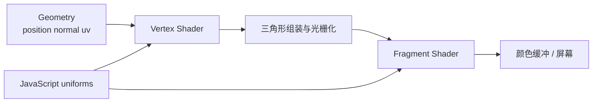

# Three.js ShaderMaterial 详解：从几何体到真实特效

学完 GLSL 语法后，你可能已经会用坐标画颜色、用 `sin()` 制作动画，却仍然不知道：

- Shader 是不是一张 `1 × 1` 的二维平面？
- 同一段 Shader 放到平面、圆、立方体、球体或人物模型上，会发生什么？
- 为什么四个顶点的平面做不出柔软的旗帜？
- 水波为什么不只是让 `position.y` 上下移动？
- 云朵应该画在平面上，还是做成真正的体积？
- 什么情况下应该使用 `ShaderMaterial`，什么情况下不应该？

这些问题不是 API 细节，而是决定你能否独立设计 Shader 效果的核心能力。本文将从渲染管线出发，建立一套从需求到实现的完整方法。

如果还不熟悉 `vec`、UV、`uniform` 和 `varying`，请先阅读 [GLSL 新手指南](/posts/glsl/getting-started-with-glsl)。本文示例适用于 **Three.js 0.182.x、React 19 和 React Three Fiber 9.x**。
## 一、先纠正误解：Shader 不是平面

Shader 是一段 **GPU 程序**，它本身没有宽度、高度、形状和顶点。

当 Three.js 发起一次绘制时，才会把某个 Geometry 的数据交给 Shader：

1. Vertex Shader 对 Geometry 中的每个顶点执行一次。
2. GPU 根据顶点和索引组装三角形。
3. 三角形经过投影后覆盖屏幕上的一片区域。
4. Fragment Shader 对这片区域中的候选片元执行，计算颜色或透明度。



因此，不是 Shader “变成了立方体”，而是：

> 立方体提供顶点和三角形，Shader 决定这些顶点最终在哪里，以及三角形表面每个片元是什么颜色。

### 为什么入门教程看起来都是一张平面？

全屏 Shader 通常只需要一个覆盖屏幕的三角形或四边形。本文的 `fullscreen` 场景使用 `2 × 2` 平面，是因为裁剪空间的 X、Y 范围正好是 `-1` 到 `1`：

```glsl
void main() {
  // 直接输出裁剪空间位置，绕过模型、相机和投影变换
  gl_Position = vec4(position, 1.0);
}
```

这里的 `2 × 2` 是**裁剪空间范围**，不是 2 像素，也不是 Shader 的固有尺寸。图片滤镜、后期处理和 ShaderToy 常这样工作，所以容易让人误以为 Shader 就是一张平面。

:::important 必须记住
Shader 决定“怎么算”，Geometry 决定“在哪里算”。没有 Geometry、Points 或其他绘制输入，Shader 不会自己出现在屏幕上。
:::

## 二、PlaneGeometry 的两个“大小”

Three.js 创建平面的参数是：

```javascript
new THREE.PlaneGeometry(
  width,
  height,
  widthSegments,
  heightSegments,
);
```

例如：

```javascript
new THREE.PlaneGeometry(3, 2, 64, 32);
```

它表示：

- 平面局部坐标宽 3 个世界单位、高 2 个世界单位。
- 横向分成 64 段，纵向分成 32 段。
- 顶点数为 `(64 + 1) × (32 + 1) = 2145`。
- 三角形数为 `64 × 32 × 2 = 4096`。

`width`、`height` 决定轮廓尺寸；segments 决定网格密度。它们不是同一个概念。

### “20 × 20 的平面”到底指什么？

这句话可能有两种完全不同的含义：

```javascript
// 尺寸是 20 × 20，但只有 4 个顶点
new THREE.PlaneGeometry(20, 20, 1, 1);

// 尺寸是 1 × 1，但拥有 21 × 21 = 441 个顶点
new THREE.PlaneGeometry(1, 1, 20, 20);
```

第一种平面很大，但 Vertex Shader 只能移动四个角；第二种平面很小，却可以形成更细腻的几何波浪。

### Fragment 效果和 Vertex 效果对细分要求不同

- 渐变、图片滤镜、程序化颜色主要在 Fragment Shader 中计算。即使平面只有两个三角形，也可以非常细腻，因为 GPU 会为覆盖到的像素执行 Fragment Shader。
- 旗帜、水面、地形等真实轮廓变化发生在 Vertex Shader。顶点太少时，中间没有可以移动的点，只能得到几块僵硬的大三角形。

这也是为什么“把波浪公式写对了”仍可能看不到波浪：问题不一定在公式，而可能在 Geometry。
## 三、Geometry、ShaderMaterial 与 Mesh 怎样连接

原生 Three.js 的最小连接如下：

```javascript
import * as THREE from 'three';

const geometry = new THREE.SphereGeometry(1, 64, 64);
const uniforms = {
  uTime: { value: 0 },
  uColor: { value: new THREE.Color('#38bdf8') },
};

const material = new THREE.ShaderMaterial({
  vertexShader,
  fragmentShader,
  uniforms,
});

const mesh = new THREE.Mesh(geometry, material);
scene.add(mesh);
```

可以把它记成：

```text
Geometry + ShaderMaterial = Mesh
```

Geometry 提供 `position`、`normal`、`uv` 等 attribute；ShaderMaterial 提供两段 GPU 程序和 uniforms；Mesh 提供位置、旋转、缩放以及在场景图中的身份。

在 React Three Fiber 中，同一关系写成：

```jsx
<mesh>
  <sphereGeometry args={[1, 64, 64]} />
  <shaderMaterial
    vertexShader={vertexShader}
    fragmentShader={fragmentShader}
    uniforms={uniforms}
  />
</mesh>
```

本文交互示例左侧包含 `Fragment Shader`、`Vertex Shader` 和只读的 `Three.js 场景` 三个标签。第三个标签展示当前 Demo 实际如何创建 Geometry、uniform 和 ShaderMaterial。

## 四、一次绘制中的数据链路

### 1. attribute：Geometry 为每个顶点提供的数据

常见内置 attribute：

| 名称 | 含义 | 缺少时会怎样 |
| --- | --- | --- |
| `position` | 顶点局部坐标 | 没有形状可画 |
| `normal` | 顶点法线 | 无法正确计算表面朝向与光照 |
| `uv` | 二维纹理坐标 | 无法按预期贴图 |
| `color` | 顶点颜色 | 只有 Geometry 主动创建时才存在 |
| `skinIndex/skinWeight` | 骨骼索引与权重 | 蒙皮模型无法跟随骨骼 |

### 2. uniform：JavaScript 提供的整次绘制共享数据

```javascript
const uniforms = {
  uTime: { value: 0 },
  uProgress: { value: 0.5 },
  uColor: { value: new THREE.Color('#22d3ee') },
};

// 每帧只更新 value，不要重复 new ShaderMaterial
material.uniforms.uTime.value = clock.getElapsedTime();
```

### 3. varying：Vertex 到 Fragment 的插值数据

```glsl
// Vertex Shader
varying vec2 vUv;
void main() {
  vUv = uv;
  gl_Position = projectionMatrix * modelViewMatrix * vec4(position, 1.0);
}
```

```glsl
// Fragment Shader
varying vec2 vUv;
void main() {
  gl_FragColor = vec4(vUv, 0.0, 1.0);
}
```

三角形只有三个顶点，但 GPU 会在内部自动插值 `vUv`，所以 Fragment Shader 能得到连续坐标。

## 五、坐标空间：公式正确但效果错误的主要原因

一个顶点通常经历以下转换：

```text
局部空间 position
  → modelMatrix
世界空间
  → viewMatrix
观察空间
  → projectionMatrix
裁剪空间 gl_Position
```

Three.js 常用矩阵：

| 矩阵 | 作用 |
| --- | --- |
| `modelMatrix` | 局部空间 → 世界空间 |
| `viewMatrix` | 世界空间 → 相机观察空间 |
| `modelViewMatrix` | 局部空间 → 观察空间 |
| `projectionMatrix` | 观察空间 → 裁剪空间 |
| `normalMatrix` | 把局部法线正确转换到观察空间 |

最重要的规则是：**参与点积或距离计算的数据必须处在同一坐标空间。**

例如观察空间中的法线和视线方向：

```glsl
vec4 viewPosition = modelViewMatrix * vec4(position, 1.0);
vec3 viewNormal = normalize(normalMatrix * normal);
vec3 viewDirection = normalize(-viewPosition.xyz);
float facing = dot(viewNormal, viewDirection);
```

不要拿局部空间的 `normal` 直接与世界空间的 `cameraPosition` 做点积。代码可以编译，但物体旋转、缩放后结果会错误。
## 六、同一份 Shader 放到不同 Geometry 上会怎样？

只要 Shader 使用的 attribute 存在，同一个 ShaderMaterial 可以挂到不同几何体上，但结果不会简单地“换个外形”。拓扑、UV 和法线都会影响效果。

| Geometry | 顶点与拓扑特点 | UV/法线特点 | 常见用途与问题 |
| --- | --- | --- | --- |
| `PlaneGeometry` | 规则网格，细分可控 | UV 是完整矩形，初始法线一致 | 图片、旗帜、水面；顶点太少不能柔软形变 |
| `CircleGeometry` | 从中心向圆周组成三角扇 | UV 映射在方形坐标中，圆外区域不存在 | 雷达、圆盘；中心附近形变可能显露放射状拓扑 |
| `BoxGeometry` | 六个面分别生成顶点 | 棱边处法线和 UV 不连续 | 全息扫描、骰子；程序化纹理可能在棱边出现接缝 |
| `SphereGeometry` | 经纬网格，极点顶点密集 | 经线有 UV 接缝，极点会拉伸 | 行星、护盾；适合基于法线的 Fresnel 效果 |
| 静态 GLTF | 拓扑由建模软件决定 | 可能有多套 UV、法线和材质组 | 扫描、溶解、变色；替换材质前要检查 attribute |
| 蒙皮人物 | 顶点受骨骼和 morph target 驱动 | 法线也要跟随骨骼变化 | 角色特效；不能忽略蒙皮阶段直接投影原始 position |

### 圆形几何与“在平面上画圆”不是一回事

```jsx
// 真实圆盘：圆外根本没有三角形
<circleGeometry args={[1, 64]} />

// 仍是方形平面，只是 Fragment Shader 把圆外像素丢弃
<planeGeometry args={[2, 2]} />
```

在平面 Fragment Shader 中写：

```glsl
if (distance(vUv, vec2(0.5)) > 0.5) discard;
```

视觉上会得到圆，但 Geometry 的轮廓、碰撞体和顶点仍然是方形。是否需要真实圆形，取决于你是否关心轮廓、顶点形变、射线检测和性能。

### 立方体为什么容易出现接缝？

立方体看起来只有 8 个角，但为了让六个面拥有不同法线和 UV，同一空间位置经常会存储多份顶点。使用 `uv` 或法线生成图案时，棱边两侧可能不连续；使用局部 `position` 生成三维噪声通常更连续。

### 球体为什么极点会拉伸？

经纬球要把矩形纹理包到球面上。经线首尾存在 UV seam，越靠近极点，很多不同 U 坐标越会收敛到很小区域。行星云层若直接使用二维 UV 噪声，极点常出现拉伸，可以改用局部/世界坐标的三维噪声或立方体贴图。

更底层的 attribute、索引和拓扑知识可以继续阅读 [BufferGeometry 与程序化几何](/posts/glsl/geometry-deep-dive)。

## 七、先判断：你究竟要改变什么？

实际开发不要先问“该写什么公式”，而要先判断效果属于哪一层。

| 目标 | 主要手段 | 是否改变真实轮廓 |
| --- | --- | --- |
| 图片调色、扫描线、溶解颜色 | Fragment Shader | 否 |
| 旗帜飘动、水面起伏、地形 | Vertex Shader + 足够细分 | 是 |
| 砖块凹凸、细小水纹 | 法线贴图/片元法线 | 否，只改变光照观感 |
| 整个屏幕模糊、辉光、故障 | 全屏后处理 pass | 否，处理渲染结果 |
| 粒子云、星河 | Points/Instancing + Shader | 取决于承载方式 |
| 可穿行并有内部光照的云 | 体积 ray marching / 3D 数据 | 表现为体积，不是普通表面 |

顶点位移负责“大形”，法线和 Fragment Shader 负责“小细节”。如果把所有细节都做成顶点，网格会非常昂贵；如果只改颜色和法线，轮廓与阴影又不会真的起伏。

接下来用三个完整案例展示如何从需求倒推 Geometry、Vertex Shader、Fragment Shader 和 uniforms。
## 八、实战一：一面真正会飘动的旗帜

### 1. 先拆需求

旗帜效果至少包含四个约束：

1. 轮廓必须真实起伏，所以要修改顶点位置，而不只是扭曲颜色。
2. 平面需要足够细分，否则布料会像硬纸板。
3. 靠近旗杆的一侧应固定，越远离旗杆摆动越明显。
4. 颜色或图片应跟随变形后的表面，而不是在屏幕空间滑动。

因此选择一个 `3 × 2`、横向 64 段、纵向 32 段的垂直平面。

<ShaderSceneDemo
  title="旗帜飘动：顶点密度与固定端"
  description="调整风力和速度，注意旗杆一侧基本不动，远端摆幅最大。"
  height={420}
  scene={{
    kind: "plane",
    planeSize: [3, 2],
    planeSegments: [64, 32],
    rotation: [0, 0, 0],
    controls: true,
  }}
  vertexShader={`
uniform float uTime;
uniform float uWindStrength;
uniform float uWindSpeed;
varying vec2 vUv;
varying float vWave;

void main() {
  vUv = uv;
  vec3 transformed = position;

  // uv.x 在旗杆处为 0，远端为 1。
  // pow 让旗杆附近更稳定，远端逐渐获得完整摆幅。
  float freeEnd = pow(uv.x, 1.5);
  float time = uTime * uWindSpeed;

  float largeWave = sin(position.x * 3.2 - time * 2.2);
  float smallWave = sin(position.x * 7.0 + position.y * 4.0 - time * 3.7);
  float displacement = (largeWave * 0.75 + smallWave * 0.25)
    * uWindStrength * freeEnd;

  // PlaneGeometry 原本位于 XY 平面，Z 是前后方向。
  transformed.z += displacement;
  transformed.y += sin(position.x * 2.0 - time) * 0.04
    * uWindStrength * freeEnd;

  vWave = displacement;
  gl_Position = projectionMatrix * modelViewMatrix * vec4(transformed, 1.0);
}
  `}
  fragmentShader={`
precision mediump float;
uniform float uWindStrength;
uniform vec3 uPrimaryColor;
uniform vec3 uStripeColor;
varying vec2 vUv;
varying float vWave;

void main() {
  // 六条横向色带，颜色始终使用模型 UV，因此会随旗帜一起变形。
  float stripe = step(0.5, fract(vUv.y * 6.0));
  vec3 baseColor = mix(uPrimaryColor, uStripeColor, stripe * 0.32);

  // 用位移量补一点明暗，帮助观察褶皱；这不是完整布料光照。
  float foldLight = 0.82 + 0.18
    * sin(vWave / max(uWindStrength, 0.001) * 3.14159);
  gl_FragColor = vec4(baseColor * foldLight, 1.0);
}
  `}
  uniforms={[
    {
      name: "uWindStrength",
      type: "float",
      value: 0.22,
      label: "风力",
      control: "range",
      min: 0,
      max: 0.5,
      step: 0.01,
    },
    {
      name: "uWindSpeed",
      type: "float",
      value: 1,
      label: "风速",
      control: "range",
      min: 0,
      max: 3,
      step: 0.05,
    },
    {
      name: "uPrimaryColor",
      type: "color",
      value: "#dc2626",
      label: "旗帜主色",
      control: "color",
    },
    {
      name: "uStripeColor",
      type: "color",
      value: "#fef3c7",
      label: "条纹颜色",
      control: "color",
    },
  ]}
/>

### 2. 为什么不能使用 `PlaneGeometry(3, 2, 1, 1)`？

它只有 4 个顶点和 2 个三角形。即使正弦公式非常复杂，也只能移动四个角，三角形内部仍是直线插值。当前 64 × 32 分段提供 2145 个顶点，才有足够采样点表现连续褶皱。

### 3. 这是不是完整的布料模拟？

不是。这个案例是**程序化顶点动画**：便宜、稳定，适合远景旗帜、海报和装饰布料，但不会计算重力、碰撞和布料自相互作用。角色披风或可交互布料通常需要物理模拟，再把结果写回顶点。
## 九、实战二：不只会升降的水面

### 1. 水面至少有两层问题

- **几何层**：波峰和波谷要改变真实位置、轮廓、深度与遮挡。
- **光照层**：水面形变后，法线也必须变化，否则反光看起来仍像一张平板。

下面使用两组方向不同的波，并根据波函数的解析导数重建法线。

<ShaderSceneDemo
  title="水面：顶点波形与动态法线"
  description="调整浪高、速度和 Fresnel，拖动视角观察反光随法线变化。"
  height={430}
  scene={{
    kind: "plane",
    planeSize: [4.5, 4.5],
    planeSegments: [128, 128],
    controls: true,
  }}
  vertexShader={`
uniform float uTime;
uniform float uWaveHeight;
uniform float uWaveSpeed;
varying float vElevation;
varying vec3 vViewNormal;
varying vec3 vViewDirection;

void main() {
  float time = uTime * uWaveSpeed;
  float phaseA = position.x * 2.4 + time * 1.2;
  float phaseB = position.x * 1.4 + position.y * 2.0 - time * 0.8;

  float waveA = sin(phaseA) * uWaveHeight;
  float waveB = sin(phaseB) * uWaveHeight * 0.55;
  float height = waveA + waveB;

  // 对同一高度函数分别求 x、y 方向导数。
  float dHdx = cos(phaseA) * 2.4 * uWaveHeight
    + cos(phaseB) * 1.4 * uWaveHeight * 0.55;
  float dHdy = cos(phaseB) * 2.0 * uWaveHeight * 0.55;
  vec3 localNormal = normalize(vec3(-dHdx, -dHdy, 1.0));

  vec3 transformed = position;
  transformed.z += height;
  vec4 viewPosition = modelViewMatrix * vec4(transformed, 1.0);

  vElevation = height;
  vViewNormal = normalize(normalMatrix * localNormal);
  vViewDirection = normalize(-viewPosition.xyz);
  gl_Position = projectionMatrix * viewPosition;
}
  `}
  fragmentShader={`
precision mediump float;
uniform float uWaveHeight;
uniform float uFresnelPower;
uniform vec3 uDeepColor;
uniform vec3 uShallowColor;
varying float vElevation;
varying vec3 vViewNormal;
varying vec3 vViewDirection;

void main() {
  vec3 normal = normalize(vViewNormal);
  vec3 viewDirection = normalize(vViewDirection);
  vec3 lightDirection = normalize(vec3(0.4, 0.8, 0.6));

  float diffuse = max(dot(normal, lightDirection), 0.0);
  float facing = max(dot(normal, viewDirection), 0.0);
  float fresnel = pow(1.0 - facing, uFresnelPower);

  float level = clamp(
    vElevation / max(uWaveHeight * 1.55, 0.001) * 0.5 + 0.5,
    0.0,
    1.0
  );
  vec3 waterColor = mix(uDeepColor, uShallowColor, level);
  vec3 skyReflection = vec3(0.55, 0.82, 1.0);
  vec3 color = waterColor * (0.35 + diffuse * 0.65);
  color = mix(color, skyReflection, fresnel * 0.65);

  gl_FragColor = vec4(color, 1.0);
}
  `}
  uniforms={[
    {
      name: "uWaveHeight",
      type: "float",
      value: 0.18,
      label: "浪高",
      control: "range",
      min: 0.01,
      max: 0.45,
      step: 0.01,
    },
    {
      name: "uWaveSpeed",
      type: "float",
      value: 1,
      label: "流动速度",
      control: "range",
      min: 0,
      max: 3,
      step: 0.05,
    },
    {
      name: "uFresnelPower",
      type: "float",
      value: 2.5,
      label: "边缘反射",
      control: "range",
      min: 0.5,
      max: 6,
      step: 0.1,
    },
    {
      name: "uDeepColor",
      type: "color",
      value: "#052e5c",
      label: "深水颜色",
      control: "color",
    },
    {
      name: "uShallowColor",
      type: "color",
      value: "#22d3ee",
      label: "浅水颜色",
      control: "color",
    },
  ]}
/>

### 2. 为什么形变后要重算法线？

原始 PlaneGeometry 的所有法线都朝向局部 Z 轴。如果只移动 position，normal 不会自动知道表面已经倾斜，光照仍按平面计算。这里从波函数导出斜率，再构造：

```glsl
normalize(vec3(-dHdx, -dHdy, 1.0))
```

这相当于告诉光照“波面现在朝向哪里”。更系统的法线知识见 [深入理解法线](/posts/glsl/understanding-normals)。

### 3. 这是不是完整的真实水体？

仍然不是。生产水面通常还需要：

- 渲染场景反射或采样环境贴图。
- 根据法线扭曲折射纹理。
- 读取深度纹理计算岸边颜色与泡沫。
- 处理透明排序、`depthWrite` 和水下效果。
- 近景采用更复杂的波，远景降低网格和反射质量。

这里先把最核心的“几何波形 + 动态法线 + 观察角反射”讲完整，避免用几条 `sin()` 就宣称实现了真实水面。
## 十、实战三：云朵不是只有一种实现

说“实现云朵”之前，必须先确认云在场景中的角色：

| 需求 | 合适方案 | 特点 |
| --- | --- | --- |
| 远处天空背景 | 全屏 Shader / 天空穹顶 | 成本低，不可真正穿行 |
| 场景中的独立云团 | Billboard、Sprite、Instancing | 多个面片始终朝向相机 |
| 飞机可穿过、有内部光照的云 | 3D 噪声 + Ray Marching | 体积感最好，成本很高 |

下面实现的是第一类：**二维程序化云层**。它适合网站背景、远景天空和天气面板，不是假装成体积云。

<ShaderSceneDemo
  title="二维程序化云层"
  description="调整云量、尺度和移动速度；这个案例改变像素颜色，不改变几何轮廓。"
  height={400}
  scene={{ kind: "fullscreen" }}
  fragmentShader={`
precision mediump float;
uniform float uTime;
uniform vec2 uResolution;
uniform float uCloudScale;
uniform float uCoverage;
uniform float uCloudSpeed;
varying vec2 vUv;

float cloudHash(vec2 point) {
  return fract(sin(dot(point, vec2(127.1, 311.7))) * 43758.5453);
}

float cloudNoise(vec2 point) {
  vec2 cell = floor(point);
  vec2 local = fract(point);
  vec2 blend = local * local * (3.0 - 2.0 * local);

  float a = cloudHash(cell);
  float b = cloudHash(cell + vec2(1.0, 0.0));
  float c = cloudHash(cell + vec2(0.0, 1.0));
  float d = cloudHash(cell + vec2(1.0, 1.0));
  return mix(mix(a, b, blend.x), mix(c, d, blend.x), blend.y);
}

float cloudFbm(vec2 point) {
  float value = 0.0;
  float amplitude = 0.5;
  for (int octave = 0; octave < 5; octave++) {
    value += cloudNoise(point) * amplitude;
    point = point * 2.03 + vec2(17.2, 9.1);
    amplitude *= 0.5;
  }
  return value;
}

void main() {
  vec2 uv = vUv;
  vec2 point = uv - 0.5;
  point.x *= uResolution.x / max(uResolution.y, 1.0);
  point *= uCloudScale;
  point.x += uTime * uCloudSpeed;

  float largeShape = cloudFbm(point);
  float detail = cloudFbm(point * 2.1 - vec2(uTime * uCloudSpeed * 0.35, 0.0));
  float density = largeShape * 0.72 + detail * 0.28;
  density = smoothstep(uCoverage, uCoverage + 0.16, density);

  vec3 horizon = vec3(0.38, 0.70, 0.95);
  vec3 zenith = vec3(0.04, 0.18, 0.48);
  vec3 sky = mix(horizon, zenith, smoothstep(0.0, 1.0, uv.y));
  vec3 cloudShadow = vec3(0.55, 0.63, 0.72);
  vec3 cloudLight = vec3(1.0, 0.98, 0.93);
  vec3 cloudColor = mix(cloudShadow, cloudLight, detail);

  gl_FragColor = vec4(mix(sky, cloudColor, density), 1.0);
}
  `}
  uniforms={[
    {
      name: "uCloudScale",
      type: "float",
      value: 3.2,
      label: "云层尺度",
      control: "range",
      min: 1,
      max: 8,
      step: 0.1,
    },
    {
      name: "uCoverage",
      type: "float",
      value: 0.48,
      label: "云量阈值",
      control: "range",
      min: 0.2,
      max: 0.75,
      step: 0.01,
    },
    {
      name: "uCloudSpeed",
      type: "float",
      value: 0.08,
      label: "移动速度",
      control: "range",
      min: 0,
      max: 0.4,
      step: 0.01,
    },
  ]}
/>

### 为什么不能把这张平面云称为体积云？

它没有厚度，也没有沿视线采样内部密度。真正的体积云通常让每个屏幕像素沿射线前进几十步，每一步采样三维噪声、累计透光率和散射：

```text
成本 ≈ 屏幕像素数 × 射线步数 × 每步噪声计算量
```

因此体积云常采用半分辨率渲染、空区域跳过、蓝噪声抖动和时间重投影。选择方案时应根据镜头距离与交互需求，而不是看到“云”就直接上 Ray Marching。
## 十一、人物和其他 GLTF 模型应该怎么处理？

### 1. 静态模型：接法相同，数据不一定相同

GLTF 场景通常包含多个 Mesh。每个 Mesh 都可以使用 ShaderMaterial：

```javascript
const shaderMaterial = new THREE.ShaderMaterial({
  vertexShader,
  fragmentShader,
  uniforms,
});

gltf.scene.traverse((object) => {
  if (object.isMesh) {
    console.log(object.geometry.attributes);
    object.material = shaderMaterial;
  }
});
```

但在替换之前必须逐项确认：

- 模型是否有 `normal`、`uv`、`tangent` 或 `color`。
- 模型是否由多个材质组组成。
- 不同子 Mesh 的局部坐标范围是否一致。
- 原材质使用的颜色贴图、法线贴图和金属度贴图是否仍需保留。
- 透明、双面、阴影和深度写入设置是否需要迁移。

如果一个扫描 Shader 使用局部 `position.y`，不同子 Mesh 的原点和尺度可能完全不同，扫描线就不会同步。真实项目通常先计算模型包围盒，再把统一的世界空间高度或归一化高度传给 Shader。

### 2. 同一种效果放到模型上会发生什么？

| 效果 | 平面 | 立方体/球体 | 人物模型 |
| --- | --- | --- | --- |
| 纯颜色/扫描 | 直接工作 | 会沿 UV 或局部坐标包裹 | 通常可用，但要统一坐标范围 |
| 纹理滤镜 | UV 通常规整 | Box 有 UV 岛，Sphere 有 seam | 取决于模型展开的 UV |
| 顶点波浪 | 像布或水面 | 整个形状被拉伸 | 可能把五官、手脚一起扭曲 |
| 沿法线膨胀 | 整体前后移动 | 球体均匀膨胀 | 可做护盾/描边，但接缝可能裂开 |
| 溶解 | 表面逐渐 discard | 可形成空间化溶解 | 常用于角色传送、死亡和生成 |

“同一段代码能编译”不代表“同一个视觉规则适合所有模型”。效果设计必须理解模型的坐标、法线、UV 和拓扑。

### 3. 蒙皮人物为什么更复杂？

人物动画通常使用 `SkinnedMesh`。原始 position 需要先经过 morph target 和骨骼矩阵变换，再进入模型、观察和投影变换。如果自定义 Vertex Shader 直接写：

```glsl
gl_Position = projectionMatrix * modelViewMatrix * vec4(position, 1.0);
```

角色会回到绑定姿势，或者完全失去骨骼动画。

真实项目有三条路线：

1. **保留内置材质并使用 `onBeforeCompile`**：适合在 PBR、阴影和蒙皮基础上增加扫描、溶解或小幅位移。
2. **使用 NodeMaterial/TSL**：用 Three.js 的节点系统组合效果，减少手工维护 Shader chunk。
3. **完全自定义 ShaderMaterial**：必须正确接入 morph、skinning、法线、阴影等管线，适合确实需要完全控制的高级项目。

对于学习阶段，不建议通过复制一大段骨骼矩阵代码来“假装掌握”人物 Shader。应先在静态模型上验证坐标和材质逻辑，再决定是否保留 Three.js 的蒙皮与 PBR 管线。

## 十二、顶点形变后为什么经常光照不对？

Vertex Shader 修改 position，并不会自动修改 normal。

```glsl
vec3 transformed = position;
transformed.z += sin(position.x * 4.0) * 0.2;

// 如果仍直接使用原始 normal，光照不知道表面已经倾斜。
```

常见策略：

- 数学规则明确的波面：使用解析导数，像前面的水面案例。
- 高度函数不方便求导：采样邻近位置，通过差分计算切线和法线。
- 很细的凹凸：不增加几何体，使用法线贴图改变片元光照。
- 任意复杂模型：在建模阶段细分或烘焙法线贴图，避免运行时昂贵重建。

法线贴图可以制造凹凸明暗，却不能改变轮廓、深度和真实阴影；顶点位移可以改变轮廓，但受顶点密度限制。实际材质经常同时使用两者：顶点负责大波浪，法线贴图负责小水纹。

## 十三、ShaderMaterial、内置材质还是 RawShaderMaterial？

| 方案 | 适用情况 | 你要负责什么 |
| --- | --- | --- |
| `MeshStandardMaterial` | 常规 PBR、灯光、环境贴图和阴影 | 只配置材质参数 |
| `onBeforeCompile` | 保留 PBR/蒙皮，只加入扫描、溶解、小位移 | 替换或插入少量 Shader 代码 |
| `ShaderMaterial` | 完全自定义表面、程序化形变、粒子 | 光照、法线、透明和数据通道 |
| `RawShaderMaterial` | 连 Three.js 注入的声明都要自行控制 | 所有 attribute、uniform、矩阵和精度声明 |

不要因为会写 GLSL，就把所有 `MeshStandardMaterial` 都换成 ShaderMaterial。一个角色如果已经需要 PBR、蒙皮、阴影和几十张材质贴图，保留内置管线通常比从零重写更可靠。
## 十四、性能不是只看 Shader 行数

GPU 成本至少要分四部分观察：

### 1. Vertex 成本

主要受顶点数、蒙皮、形变公式和 attribute 数量影响。

- 64 × 32 的旗帜有 2145 个顶点。
- 128 × 128 的水面有 16641 个顶点。
- 相同 segments 数字在 Plane、Sphere 和 Box 上不代表相同顶点量。

### 2. Fragment 成本

主要受屏幕覆盖面积、透明叠加、纹理采样和噪声循环影响。一张只有两个三角形的全屏 Shader 仍可能很贵，因为它覆盖了数百万像素。

### 3. CPU 与 Draw Call

一千个 Mesh 即使共用简单 Shader，也可能被一千次绘制调用拖慢。大量相似物体应考虑 `InstancedMesh`、Points 或合批。

### 4. 显存与额外渲染通道

纹理、mipmap、RenderTarget、阴影贴图和水面反射都占显存。水面反射可能要求额外渲染一次场景，成本往往高于波浪公式本身。

:::warning 教学 Demo 的默认值不是生产默认值
`ShaderSceneDemo` 为了让不同案例容易观察，会使用双面、透明和关闭视锥裁剪等宽容设置。生产代码应按需求恢复单面渲染、正确的透明/深度策略与视锥裁剪，否则会增加 overdraw 和无效绘制。
:::

移动端没有通用的“最佳 segments”。应根据物体在屏幕上的尺寸设置质量档位，并用真实设备测量，而不是固定追求更高网格密度。

## 十五、从需求到 Shader 的实际工作流

遇到新效果时，可以按下面顺序分析。

<Steps>
### 明确效果改变哪一层

它改变真实轮廓、表面颜色、光照法线、整张屏幕，还是一个体积？这一步决定使用 Vertex、Fragment、后处理还是 Ray Marching。

### 选择承载对象

图片处理用全屏三角形或平面；旗帜和水面用细分 Plane；护盾用 Sphere；大量点用 Points；重复模型用 Instancing；人物模型先确认是否蒙皮。

### 选择坐标空间

图案跟随模型通常用局部坐标或 UV；多个物体共享扫描高度用世界坐标；屏幕故障和后处理用屏幕 UV；光照计算必须让法线、光线和视线位于同一空间。

### 列出输入数据

把时间、颜色、速度、进度、纹理、鼠标和业务状态设计成 uniform；把每个顶点不同的数据设计成 attribute；把 Vertex 结果通过 varying 交给 Fragment。

### 先实现静态版本

先确认 Geometry、坐标、颜色和法线正确，再增加 `uTime`。一开始就加入动画，会让坐标错误更难定位。

### 再处理形变后的法线

如果 Vertex Shader 改变了表面方向，决定使用解析导数、差分、法线贴图还是内置材质扩展。

### 最后验证边界和性能

测试窄屏、高 DPR、不同相机距离、模型缩放、低细分、高细分、透明排序、离开视口、资源销毁和移动端性能。
</Steps>

## 十六、常见黑屏与错误定位

### Shader 编译或链接失败

- Vertex 和 Fragment 中同名 varying 的名称、类型与精度必须一致。
- 两个阶段声明的同名 uniform 也必须一致。
- 避免自定义函数名与 Three.js 注入的 Shader chunk 函数冲突。
- 不要在旧式 `varying/gl_FragColor` 代码中混入 GLSL 3 的 `in/out`。

### 物体存在但看不见

- 相机是否朝向模型，near/far 是否包含模型距离。
- Geometry 是否在相机前方，scale 是否为 0。
- `gl_Position` 是否经过正确的模型、观察和投影矩阵。
- Fragment 是否输出了可见 alpha，透明材质是否被深度设置影响。

### 动画完全不动

- 是否在渲染循环中更新了 `uniforms.uTime.value`。
- 页面是否使用按需渲染但没有请求新帧。
- 平面是否只有四个顶点，导致波形没有中间采样点。
- 位移方向是否与平面局部法线方向一致。

### 模型旋转后光照错误

通常是混用了不同坐标空间，或者没有使用 `normalMatrix`。非均匀缩放时尤其不能简单使用 `mat3(modelMatrix) * normal`。

### 页面切换后越来越卡

原生 Three.js 中要释放 GPU 资源：

```javascript
geometry.dispose();
material.dispose();
texture.dispose();
renderTarget.dispose();
renderer.dispose();
```

同时移除 `requestAnimationFrame`、ResizeObserver、鼠标事件和控制器。更多渲染循环与尺寸问题见 [Three.js 渲染器详解](/posts/threejs/renderer-explained)，系统性能策略见 [Three.js 性能优化](/posts/threejs/performance-optimization)。

## 总结

Shader 不是一张平面。它是被 Geometry、Points、全屏 Pass 或其他绘制任务调用的 GPU 程序。

真正掌握 Three.js ShaderMaterial，需要同时理解：

1. Geometry 决定顶点、拓扑、UV、法线和 Shader 执行范围。
2. Vertex Shader 改变真实几何，受顶点密度限制。
3. Fragment Shader 改变表面像素，不能凭空改变真实轮廓。
4. 局部、世界、观察和裁剪空间不能混用。
5. 旗帜需要细分、固定端和传播波。
6. 水面需要波形，也需要形变后的法线和后续反射/折射通道。
7. 云朵要先区分二维背景、Sprite 云团和真正体积云。
8. 静态模型可以替换 ShaderMaterial，蒙皮人物则要保留或重建骨骼管线。
9. ShaderMaterial 提供自由，但也意味着你要负责光照、阴影、透明和性能。

接下来可以继续深入 [BufferGeometry 与程序化几何](/posts/glsl/geometry-deep-dive)、[法线与光照](/posts/glsl/understanding-normals)、[GLSL 纹理处理](/posts/glsl/mastering-textures) 和 [Three.js 后期处理](/posts/threejs/post-processing-explained)。