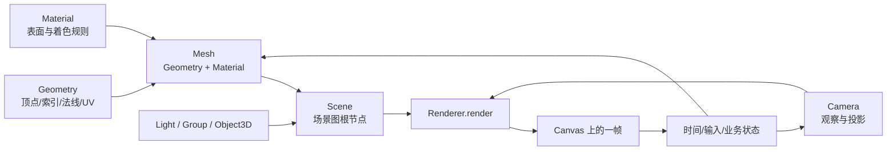
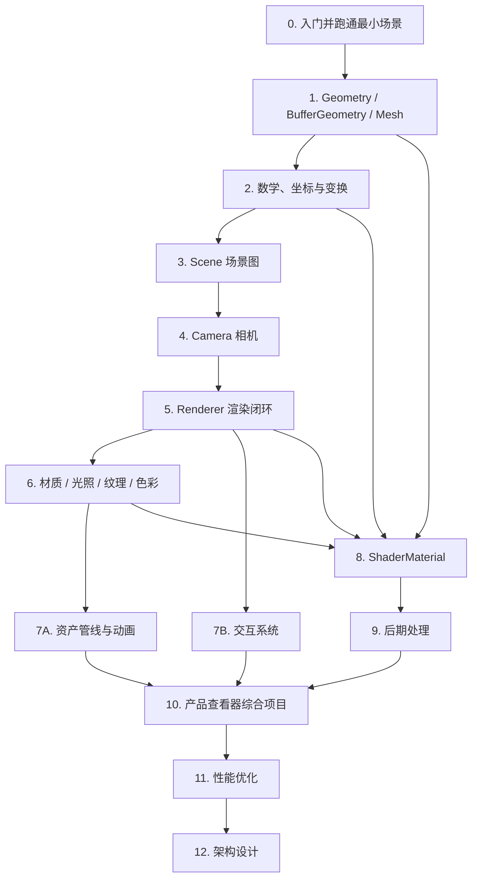

# Three.js 核心概念与学习路线

Three.js 涉及场景图、坐标变换、相机、材质、资产、交互、Shader、后期处理和性能工程。一篇文章不适合把这些模块都“讲透”。本文只做两件事：建立一张可以反复使用的总图，并给出一条有依赖关系的学习路线。每个模块的原理、代码和边界交给对应专题文章展开。

适合刚完成第一个立方体、但还不清楚各对象如何协作的读者。若还没有运行过 Three.js 或 R3F 项目，先读 [Three.js 零基础入门](/posts/threejs/getting-started-with-threejs)。

:::info 本文的边界
本文是课程地图，不是 API 手册。建议先理解原生 Three.js 对象之间的关系，再用 React Three Fiber（下文简称 R3F）组织 React 项目；两者共享同一套 Three.js 渲染与图形学概念。
:::

## 一、先建立总图：一次画面是怎样产生的



这张图里最重要的是四个角色：

| 角色 | 负责什么 | 不负责什么 |
| --- | --- | --- |
| `Scene` | 作为场景图根节点，组织 Mesh、Light、Group 等对象及其父子关系 | 不决定最终观察视角，也不会自行绘制 |
| `Camera` | 定义观察位置、方向和投影；决定哪些空间内容可能进入画面 | 不保存画面像素，也不代替 Renderer |
| `Renderer` | 根据 Scene 与 Camera 发起绘制，把结果写入 canvas；同时管理尺寸、像素比、颜色与渲染状态 | 不自动替你设计场景结构或业务状态 |
| `Mesh` | 把 `Geometry`（画什么形状）与 `Material`（表面怎样着色）组合成可放入场景图的对象 | 不是模型文件的同义词；一个 glTF 模型可包含多个 Mesh |

一次最小渲染可概括为：`renderer.render(scene, camera)`。Renderer 会遍历可见对象、准备几何与材质对应的 GPU 资源并提交绘制；实际过程还涉及视锥裁剪、透明排序、深度测试等，不能简单理解成“把 Scene 截图”。

### 四个角色之间的关系

`Scene`、`Camera` 和 `Mesh` 都继承自 `Object3D`，因此都具备位置、旋转、缩放和父子层级等能力。不过相机通常作为 `renderer.render` 的第二个参数参与观察；它是否同时加入 Scene，要看是否需要让它跟随父节点、携带子对象或参与辅助显示。`WebGLRenderer` 不是 `Object3D`，不属于场景图。
## 二、原生 Three.js 与 R3F：同一模型，两种组织方式

R3F 是 React 的自定义渲染器：它把 JSX 节点协调为 Three.js 对象，并提供 Canvas、生命周期、事件和帧循环集成。它没有改写透视投影、坐标空间、Geometry 或 Material 的含义，也不会让 GPU 成本自动消失。

| 概念/动作 | 原生 Three.js | R3F | 需要保留的共同认知 |
| --- | --- | --- | --- |
| 渲染入口 | `new THREE.WebGLRenderer()` | `<Canvas>` 创建并管理默认 Renderer、Scene、Camera 与循环 | canvas 尺寸、DPR、颜色和帧循环仍有成本 |
| 场景 | `new THREE.Scene()` | `<Canvas>` 内默认场景；`useThree(state => state.scene)` 可访问 | 子节点最终仍进入 Three.js 场景图 |
| 相机 | `new THREE.PerspectiveCamera(...)` | `<Canvas camera={...}>` 或 `<PerspectiveCamera makeDefault />` | FOV、aspect、near、far 的意义不变 |
| Mesh | `new THREE.Mesh(geometry, material)` | `<mesh><boxGeometry /><meshStandardMaterial /></mesh>` | Mesh 仍由 Geometry 与 Material 组成 |
| 加入/移除 | `scene.add(mesh)` / `scene.remove(mesh)` | JSX 挂载/卸载 | 父子层级会影响局部与世界变换 |
| 每帧更新 | `requestAnimationFrame` + `renderer.render` | `useFrame((state, delta) => ...)` | 动画应使用时间增量，避免依赖固定帧率 |
| 尺寸变化 | 更新 renderer 尺寸、camera aspect 和投影矩阵 | Canvas 默认处理容器响应；自定义相机/目标仍需核对 | 分辨率与宽高比是两件事 |
| 资源释放 | 对 Geometry、Material、Texture、RenderTarget 调用 `dispose()` | 声明式对象通常随卸载清理；外部共享或手动创建资源仍要明确所有权 | 从场景移除不等于 GPU 资源必然释放 |
| 点击拾取 | Pointer 坐标 + `Raycaster` | `onClick`、`onPointerOver` 等事件 | 底层仍是从相机发出的射线与几何体求交 |

下面两段代码表达的是同一个渲染闭环。

### 原生 Three.js：显式创建和维护

```javascript
import * as THREE from 'three';

const scene = new THREE.Scene();
const camera = new THREE.PerspectiveCamera(50, innerWidth / innerHeight, 0.1, 100);
camera.position.set(0, 0, 4);

const renderer = new THREE.WebGLRenderer({ antialias: true });
renderer.setSize(innerWidth, innerHeight);
renderer.setPixelRatio(Math.min(devicePixelRatio, 2));
document.body.appendChild(renderer.domElement);

const geometry = new THREE.BoxGeometry(1, 1, 1);
const material = new THREE.MeshNormalMaterial();
const mesh = new THREE.Mesh(geometry, material);
scene.add(mesh);

let frameId;
const clock = new THREE.Clock();
function renderFrame() {
  frameId = requestAnimationFrame(renderFrame);
  mesh.rotation.y += clock.getDelta() * 0.8;
  renderer.render(scene, camera);
}
renderFrame();

function handleResize() {
  camera.aspect = innerWidth / innerHeight;
  camera.updateProjectionMatrix();
  renderer.setSize(innerWidth, innerHeight);
}
window.addEventListener('resize', handleResize);

// 在页面销毁时执行：
function dispose() {
  cancelAnimationFrame(frameId);
  window.removeEventListener('resize', handleResize);
  geometry.dispose();
  material.dispose();
  renderer.dispose();
  renderer.domElement.remove();
}
```

### R3F：由 React 描述同一对象树

```jsx
import { useRef } from 'react';
import { Canvas, useFrame } from '@react-three/fiber';

function Box() {
  const meshRef = useRef(null);
  useFrame((_, delta) => {
    if (meshRef.current) meshRef.current.rotation.y += delta * 0.8;
  });

  return (
    <mesh ref={meshRef}>
      <boxGeometry args={[1, 1, 1]} />
      <meshNormalMaterial />
    </mesh>
  );
}

export default function App() {
  return (
    <Canvas camera={{ position: [0, 0, 4], fov: 50, near: 0.1, far: 100 }} dpr={[1, 2]}>
      <Box />
    </Canvas>
  );
}
```

:::warning 不要把 JSX 名称当成另一套 3D API
小写的 `<mesh>`、`<boxGeometry>`、`<meshStandardMaterial>` 通常对应 `THREE.Mesh`、`THREE.BoxGeometry`、`THREE.MeshStandardMaterial`。遇到投影、材质、深度或性能问题时，仍应回到 Three.js 对象和渲染管线排查。
:::
## 三、课程依赖：先补地基，再扩展效果

推荐顺序不是按 API 数量排列，而是按“后一个主题需要前一个主题解释什么”排列：



资产、动画与交互在掌握 Renderer 后可以交叉学习；Shader 还依赖几何、坐标空间、材质和渲染管线；后期处理依赖 RenderTarget、纹理和颜色输出；性能与架构必须建立在综合项目上，否则容易变成没有测量对象和故障对象的规则清单。

## 四、分阶段学习路线

### 阶段 0：跑通最小闭环

- **课程**：[Three.js 零基础入门](/posts/threejs/getting-started-with-threejs)
- **前置**：JavaScript 模块、DOM 与基础 React（走 R3F 轨时）。
- **学完能力**：能解释 Scene、Camera、Renderer、Mesh 的职责；能运行并修改一个旋转物体；知道原生与 R3F 只是不同组织方式。
- **常见误区**：只背“三大件”而忽略 Mesh；把 R3F 当成独立 3D 引擎；看到黑屏就盲目加灯——`MeshBasicMaterial`、相机方向、裁剪面和尺寸都可能是原因。

### 阶段 1：理解“画什么”

- **课程**：[Geometry、BufferGeometry 与 Mesh](/posts/threejs/geometry-buffergeometry-mesh-explained)
- **前置**：阶段 0。
- **学完能力**：能区分顶点、attribute、index、三角形、Geometry、Material 与 Mesh；能判断细分数为何影响顶点形变与成本。
- **常见误区**：把 Mesh 等同于 Geometry；认为尺寸越大顶点越多；把模型文件、场景节点和单个 Mesh 混为一谈；忘记共享与释放 GPU 资源。

### 阶段 2：掌握空间与变换

- **课程**：[Three.js 数学、坐标系与变换](/posts/threejs/math-coordinate-transform-explained)
- **前置**：阶段 1；需要基本代数，不要求先系统学习线性代数证明。
- **学完能力**：能使用 Vector、Euler/Quaternion、Matrix；能区分局部、世界、观察、裁剪与屏幕空间；能处理父子变换和坐标转换。
- **常见误区**：混用不同坐标空间；忽略旋转顺序；直接修改矩阵后又被 position/rotation/scale 覆盖；把欧拉角数值当作可随意逐项相加的方向。

### 阶段 3：组织世界

- **课程**：[Three.js 场景系统](/posts/threejs/scene-system-explained)
- **前置**：阶段 2。
- **学完能力**：能使用 Object3D、Group 和 Scene 构建层级；能判断对象的局部/世界变换；能设计可遍历、可显示隐藏的场景结构。
- **常见误区**：用扁平数组代替所有层级关系；随意 reparent 导致世界姿态变化；把 `visible`、Layer、移出 Scene 和资源释放当成同一件事。

### 阶段 4：决定怎样观察

- **课程**：[Three.js 相机系统](/posts/threejs/camera-system-explained)
- **前置**：阶段 2～3。
- **学完能力**：能选择 PerspectiveCamera 或 OrthographicCamera；能设置 FOV、aspect、near、far；能处理 resize、`lookAt` 与控制器目标。
- **常见误区**：用移动相机代替焦距/视场角设计；把 near 设得过小、far 设得过大而损失深度精度；只更新 aspect，不调用 `updateProjectionMatrix()`。

### 阶段 5：理解画面如何落到 canvas

- **课程**：[Three.js 渲染器详解](/posts/threejs/renderer-explained)
- **前置**：阶段 1～4。
- **学完能力**：能维护渲染循环、尺寸与 DPR；理解颜色空间、色调映射、透明/深度和 RenderTarget 的位置；能定位常见黑屏与拉伸问题。
- **常见误区**：无上限使用 `devicePixelRatio`；重复启动多个动画循环；认为 Renderer 会自动修复错误相机或材质；把帧率当作唯一性能指标。

### 阶段 6：理解材质、光照、纹理与色彩

- **课程**：[Three.js 材质、光照与纹理](/posts/threejs/material-lighting-texture-explained)
- **前置**：阶段 1～5。
- **学完能力**：能按需求选择 Basic、Standard、Physical 或 ShaderMaterial；理解法线、直接光、IBL、PBR 纹理语义、线性色彩与透明深度边界。
- **常见误区**：把 metalness 当亮度；把 normal map 标成 sRGB；用 AmbientLight 修复缺失环境反射；用 `DoubleSide` 和关闭 `depthTest` 掩盖模型问题。

### 阶段 7：接入真实内容、动画与用户输入

- **课程 A**：[Three.js 资产管线实战](/posts/threejs/asset-pipeline-explained)
- **课程 B**：[Three.js 动画系统](/posts/threejs/animation-system-explained)
- **课程 C**：[Three.js 交互系统](/posts/threejs/interaction-system-explained)
- **前置**：阶段 5～6；动画依赖场景图与 delta，交互依赖坐标与射线，资产依赖 Geometry、材质和场景图。
- **学完能力**：能加载并检查真实 glTF，管理 Clip/Mixer/Action 和状态机，完成拾取、拖拽、唯一选择与相机联动，并明确缓存和实例资源所有权。
- **常见误区**：猜测节点/动画名称；把 MockModel 当资产流程；让多个 Action、物理和业务同时写同一变换；用 CSS 控制 Canvas 内 Mesh 命中；组件卸载时误释放共享缓存。

### 阶段 8：进入可编程渲染

- **课程**：[Three.js ShaderMaterial](/posts/threejs/shader-material-explained)
- **前置**：阶段 1、2、5、6；建议先理解 GLSL 的 attribute、uniform、varying/in-out。
- **学完能力**：能判断效果属于顶点、片元还是全屏处理；能选择合适 Geometry 与坐标空间；能更新 uniform，并理解形变后法线、阴影和拾取为何需要同步考虑。
- **常见误区**：把 Shader 当成一张平面；认为 Fragment Shader 能改变真实轮廓；混用坐标空间；为需要完整 PBR/蒙皮的模型从零重写不必要的 ShaderMaterial。

### 阶段 9：处理整张画面

- **课程**：[Three.js 后期处理](/posts/threejs/post-processing-explained)
- **前置**：阶段 5～6；Shader 基础有助于理解 Pass，但使用现成 Pass 时不必先会复杂 GLSL。
- **学完能力**：能解释 RenderTarget、read/write ping-pong、深度/法线辅助数据与 Pass 链；能按需求加入 Bloom、景深、调色或抗锯齿并评估像素和显存成本。
- **常见误区**：用后期掩盖灯光和材质问题；无依据叠加 MSAA 与 SMAA；忽略顺序、HDR、输出色彩、尺寸和移动端填充率。

### 阶段 10：完成贯穿式产品项目

- **课程**：[Three.js 产品查看器综合项目](/posts/threejs/product-viewer-capstone)
- **前置**：阶段 1～9 中与项目相关的模块。
- **学完能力**：能把真实 glTF、动画、唯一选择、DOM 详情、相机聚焦、材质高亮、质量档、失败重试、context fallback 和性能基线组合成一个可验收产品。
- **常见误区**：把“模型显示出来”当作完成；让 3D 成为核心业务唯一入口；没有失败、取消、重复挂载、窄屏和低性能设备验收。

### 阶段 11：以测量驱动优化

- **课程**：[Three.js 性能优化](/posts/threejs/performance-optimization)
- **前置**：阶段 10 或至少一个包含真实资产、交互和额外渲染通道的项目。
- **学完能力**：能建立设备、帧预算和固定基线；区分 CPU、GPU、网络、JS 堆和 GPU 资源；通过单变量实验、p50/p95、视觉回归和门禁验证优化。
- **常见误区**：只盯 FPS；把 draw call 当唯一瓶颈；一次同时修改 DPR、模型和后期；没有目标设备、原始 trace 和质量回归。

### 阶段 12：把产品组织成可恢复系统

- **课程**：[Three.js 生产级架构参考](/posts/threejs/architecture-design)
- **前置**：阶段 7～11，以及能暴露生命周期、状态、资源和竞态问题的项目。
- **学完能力**：能划分业务/React/逐帧状态，定义资源 scope、缓存 lease、异步 session、可回滚场景切换、context 恢复、静态降级、测试和隐私可观测性。
- **常见误区**：在小 Demo 前过度抽象；把所有状态送入 React；旧请求晚返回覆盖新场景；无条件递归 dispose 共享资源；用 ErrorBoundary 代替 context lost 处理。
## 五、怎样在双轨之间切换

不需要把每个案例机械地写两遍。更有效的方法是先问“当前问题属于哪一层”：

1. **对象关系或图形学问题**：查看原生 Three.js 对象。用 `mesh.geometry`、`mesh.material`、`matrixWorld`、`renderer.info` 等确认真实状态。
2. **React 组织问题**：查看 R3F 的组件挂载、props、ref、`useFrame`、`useThree`、Suspense 和事件传播。
3. **GPU 或画面问题**：回到共同底层，检查 Geometry attributes、材质参数、相机、渲染目标、颜色管理、Shader 与绘制成本。
4. **生命周期问题**：原生轨明确创建与 `dispose()`；R3F 轨明确组件卸载、共享资源和外部资源所有权，不假设所有资源都能自动安全清理。

可以用下面的改写练习确认自己真正建立了对应关系：

- 把原生 `new Mesh()` + `scene.add()` 改写成 R3F JSX，并通过 ref 读取同一个 Three.js Mesh 实例。
- 把 R3F 的 `useFrame` 动画改写成单一 `requestAnimationFrame` 循环，同时补上 resize 与 dispose。
- 在两条轨中打印 `mesh.matrixWorld`、`geometry.attributes.position.count` 和 `renderer.info.render.calls`，确认声明方式不同但底层对象与成本指标相通。

## 六、三个阶段性项目

### 项目 A：可检查的几何展台（阶段 0～5 后）

创建 Box、Sphere 和自定义 BufferGeometry，支持透视/正交相机切换，并在 resize 后保持比例正确。验收重点不是画面华丽，而是能说明对象层级、顶点数据、相机参数和渲染循环。

### 项目 B：材质与动画实验室（阶段 6～7 后）

使用同一 Geometry 对比多种材质、直接光和环境光，加载真实 glTF 并检查节点/材质/动画契约；实现 idle/行动状态切换和部件选择。验收重点是颜色/数据纹理语义、动画状态唯一来源、加载失败与共享资源所有权。

### 项目 C：产品查看器综合项目（阶段 10）

完成 [Three.js 产品查看器综合项目](/posts/threejs/product-viewer-capstone)：加载仓库内真实课程资产，串联有限重试、动画、唯一 `selectedId`、DOM 详情、相机聚焦、材质高亮、静态 fallback、质量档与性能门禁。随后在阶段 11～12 对同一项目做测量优化和架构演进，而不是另起一个无法比较的 Demo。

## 七、路线自检

进入下一阶段前，不必背完当前模块的 API，但应该能回答：

- 当前看到的对象属于 Scene、Camera、Renderer、Mesh，还是 Geometry/Material？
- 数据现在位于局部、世界、观察、裁剪还是屏幕空间？
- 这段逻辑每次挂载执行、状态变化执行，还是每帧执行？
- 资源由谁创建、共享、缓存和释放？
- 问题来自 React 协调、Three.js 对象关系、GPU 渲染，还是资产本身？
- 优化依据是什么，目标设备上的前后测量是否可比较？

如果这些问题暂时答不上来，就回到依赖图中最近的上游课程，而不是继续叠加新的库或视觉效果。

## 总结

Three.js 的核心不是一串互不相关的模块，而是一条协作链：Geometry 与 Material 组成 Mesh，Mesh 进入 Scene，Camera 定义观察，Renderer 把结果写入 canvas，时间、输入与业务状态再驱动下一帧。原生 Three.js 显式管理这条链，R3F 用 React 声明和协调同一批底层对象。

推荐主线是：**入门闭环 → 几何与 Mesh → 数学与坐标 → 场景图 → 相机 → Renderer → 材质/光照/纹理 → 资产/动画/交互 → Shader → 后期 → 综合项目 → 性能 → 架构**。按依赖推进，并用阶段项目验证能力，比试图在一篇文章里记住所有模块更可靠。