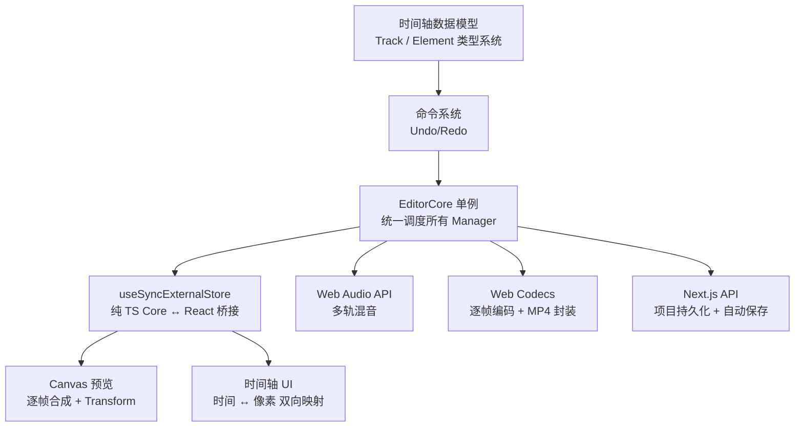

## 引言

浏览器端视频剪辑是目前 Web 技术栈能触达的最复杂应用类型之一。它同时考验你对 Canvas API、Web Audio API、File System 访问、Worker 线程以及复杂状态管理的掌握程度。

本文以 **Next.js App Router 全栈项目**为载体，从零开始系统讲解实现一个视频剪辑器所需的每个核心模块：

1. 时间轴数据模型——轨道（Track）和片段（Element/Clip）的类型设计
2. 编辑器核心（EditorCore）——Manager 单例模式
3. 命令系统——Undo/Redo 的工程实现
4. React 状态桥接——`useSyncExternalStore` 的正确姿势
5. Canvas 实时预览——逐帧渲染循环
6. 时间轴 UI——像素坐标与时间的双向映射
7. 吸附对齐——SnapPoint 算法
8. 音频混合——Web Audio API 构建混音轨
9. 视频导出——Web Codecs + MP4 封装

:::note
本文面向有 Next.js 和 TypeScript 基础的全栈开发者，重点在于讲清楚**工程设计思路**，每个模块都给出可直接参考的代码骨架。
:::

---

## 一、项目结构规划

```
apps/
└── web/
    ├── app/
    │   ├── editor/
    │   │   └── [projectId]/
    │   │       └── page.tsx        # 编辑器页面（客户端重渲染入口）
    │   └── api/
    │       └── projects/           # 项目 CRUD 接口
    ├── src/
    │   ├── core/                   # 编辑器核心（不依赖 React）
    │   │   ├── index.ts            # EditorCore 单例
    │   │   └── managers/           # 各功能 Manager
    │   ├── lib/
    │   │   ├── timeline/           # 时间轴数据模型与工具函数
    │   │   ├── commands/           # Command 模式实现
    │   │   ├── media/              # 媒体资产管理
    │   │   └── export/             # 导出类型定义
    │   ├── hooks/                  # React Hooks（状态桥接层）
    │   ├── components/
    │   │   └── editor/
    │   │       ├── panels/
    │   │       │   ├── timeline/   # 时间轴 UI
    │   │       │   ├── preview/    # Canvas 预览区
    │   │       │   └── properties/ # 属性面板
    │   │       └── toolbar/
    │   └── services/
    │       └── renderer/           # 渲染服务（Canvas 合成）
```

这个结构有一条清晰的分层边界：`core/` 和 `lib/` 是**纯 TypeScript 逻辑层**，不依赖任何 React API；`hooks/` 和 `components/` 是**React 视图层**，通过 hooks 订阅 core 层的状态变化。

---

## 二、时间轴数据模型

所有剪辑状态都存在一个统一的数据结构里。理解它是一切的基础。

### 2.1 核心类型定义

```typescript
// src/lib/timeline/types.ts

// ── 场景（Scene）──────────────────────────────────────────────
export interface TScene {
  id: string;
  name: string;
  tracks: SceneTracks;   // 所有轨道的容器
  createdAt: Date;
}

// ── 轨道容器（一个场景的全部轨道）────────────────────────────────
export interface SceneTracks {
  main: VideoTrack;        // 主视频轨（唯一）
  overlay: OverlayTrack[]; // 叠加轨（视频/文字/图形）数组
  audio: AudioTrack[];     // 纯音频轨数组
}

// ── 轨道类型 ────────────────────────────────────────────────
export type TrackType = "video" | "text" | "audio" | "graphic";

interface BaseTrack {
  id: string;
  name: string;
}

export interface VideoTrack extends BaseTrack {
  type: "video";
  elements: (VideoElement | ImageElement)[];
  muted: boolean;
  hidden: boolean;
}

export interface TextTrack extends BaseTrack {
  type: "text";
  elements: TextElement[];
  hidden: boolean;
}

export interface AudioTrack extends BaseTrack {
  type: "audio";
  elements: AudioElement[];
  muted: boolean;
}

export type OverlayTrack = VideoTrack | TextTrack;
export type TimelineTrack = VideoTrack | TextTrack | AudioTrack;

// ── 片段（Element）基础类型 ──────────────────────────────────
interface BaseTimelineElement {
  id: string;
  name: string;
  startTime: number;   // 在时间轴上的起始时刻（秒）
  duration: number;    // 在时间轴上占据的时长（秒）
  trimStart: number;   // 从源素材头部裁掉多少秒
  trimEnd: number;     // 从源素材尾部裁掉多少秒
  sourceDuration?: number; // 源素材原始时长
}

// ── 变换（位置/缩放/旋转）─────────────────────────────────────
export interface Transform {
  x: number;           // 相对画布中心的偏移（-1 ~ 1 归一化坐标）
  y: number;
  scaleX: number;      // 缩放比例，1.0 = 原始大小
  scaleY: number;
  rotation: number;    // 旋转角度（度）
}

// ── 视频片段 ────────────────────────────────────────────────
export interface VideoElement extends BaseTimelineElement {
  type: "video";
  mediaId: string;          // 对应 MediaAsset 的 id
  volume: number;           // 0 ~ 1
  muted: boolean;
  transform: Transform;
  opacity: number;          // 0 ~ 1
  speed: number;            // 变速倍率，1.0 = 原速
}

// ── 图片片段 ────────────────────────────────────────────────
export interface ImageElement extends BaseTimelineElement {
  type: "image";
  mediaId: string;
  transform: Transform;
  opacity: number;
}

// ── 文字片段 ────────────────────────────────────────────────
export interface TextElement extends BaseTimelineElement {
  type: "text";
  content: string;
  fontSize: number;
  fontFamily: string;
  color: string;
  fontWeight: "normal" | "bold";
  textAlign: "left" | "center" | "right";
  transform: Transform;
  opacity: number;
}

// ── 音频片段 ────────────────────────────────────────────────
export interface AudioElement extends BaseTimelineElement {
  type: "audio";
  mediaId: string;
  volume: number;
  muted: boolean;
  speed: number;
}

export type TimelineElement =
  | VideoElement
  | ImageElement
  | TextElement
  | AudioElement;

export type ElementType = TimelineElement["type"];
```

### 2.2 时间模型的关键概念

片段在时间轴上的时间关系需要格外注意：

```
源素材（sourceDuration = 10s）：
|────────────────────────────|
0s                          10s

经过 trim（trimStart=2, trimEnd=3）后，可用内容为 5s：
|──────────────|
2s             7s（实际播放的部分）

放置到时间轴 startTime=5s，duration=5s：
时间轴坐标：
          |──────────────|
          5s            10s
          ↑              ↑
     startTime    startTime + duration

播放时间轴的 t=6s 时，对应源素材的位置：
sourceTime = trimStart + (t - startTime) * speed
           = 2 + (6 - 5) * 1.0 = 3s（源素材第3秒）
```

```typescript
// src/lib/timeline/time-utils.ts

/** 把时间轴时刻 t 换算到源素材的对应位置 */
export function getSourceTimeAtClipTime(
  element: VideoElement | AudioElement,
  timelineTime: number
): number {
  const clipLocalTime = timelineTime - element.startTime;
  const sourceTime = element.trimStart + clipLocalTime * element.speed;
  return Math.max(element.trimStart, Math.min(
    element.sourceDuration! - element.trimEnd,
    sourceTime
  ));
}

/** 计算整个时间轴的总时长（所有片段的最晚结束时刻） */
export function calculateTotalDuration(tracks: SceneTracks): number {
  let maxEnd = 0;
  const allTracks = [tracks.main, ...tracks.overlay, ...tracks.audio];
  for (const track of allTracks) {
    for (const el of track.elements) {
      maxEnd = Math.max(maxEnd, el.startTime + el.duration);
    }
  }
  return maxEnd;
}
```

---

## 三、编辑器核心：Manager 单例模式

视频编辑器的状态非常复杂，仅靠 React state 或 Zustand 难以优雅管理跨模块联动。推荐使用**纯 TypeScript 的 Manager 单例模式**，React 只负责订阅和渲染。

### 3.1 EditorCore 单例

```typescript
// src/core/index.ts
import { TimelineManager } from "./managers/timeline-manager";
import { PlaybackManager } from "./managers/playback-manager";
import { CommandManager } from "./managers/command-manager";
import { MediaManager } from "./managers/media-manager";
import { RendererManager } from "./managers/renderer-manager";
import { SelectionManager } from "./managers/selection-manager";

export class EditorCore {
  private static instance: EditorCore | null = null;

  // 各功能 Manager，外部通过 editor.timeline.xxx() 调用
  public readonly timeline: TimelineManager;
  public readonly playback: PlaybackManager;
  public readonly command: CommandManager;
  public readonly media: MediaManager;
  public readonly renderer: RendererManager;
  public readonly selection: SelectionManager;

  private constructor() {
    // 注意：command 必须最先创建，其他 Manager 依赖它执行命令
    this.command = new CommandManager(this);
    this.timeline = new TimelineManager(this);
    this.playback = new PlaybackManager(this);
    this.media = new MediaManager(this);
    this.renderer = new RendererManager(this);
    this.selection = new SelectionManager(this);

    // 响应器：轨道变化后自动清理空轨道
    this.command.registerReactor(() => {
      const tracks = this.timeline.getTracks();
      if (!tracks) return;
      const pruned = {
        ...tracks,
        overlay: tracks.overlay.filter(t => t.elements.length > 0),
        audio: tracks.audio.filter(t => t.elements.length > 0),
      };
      if (pruned.overlay.length !== tracks.overlay.length ||
          pruned.audio.length !== tracks.audio.length) {
        this.timeline.updateTracks(pruned);
      }
    });
  }

  static getInstance(): EditorCore {
    if (!EditorCore.instance) {
      EditorCore.instance = new EditorCore();
    }
    return EditorCore.instance;
  }

  /** 重置单例（切换项目时调用）*/
  static reset(): void {
    EditorCore.instance = null;
  }
}
```

### 3.2 Manager 基础模式

每个 Manager 都遵循相同的**订阅-通知**模式：

```typescript
// src/core/managers/base-manager.ts（约定，不是真实基类）
// 每个 Manager 自行实现 subscribe/notify，以下是通用骨架：

class SomeManager {
  private listeners = new Set<() => void>();

  // 外部调用 subscribe 注册监听，返回取消订阅函数（React 的 useSyncExternalStore 需要）
  subscribe(listener: () => void): () => void {
    this.listeners.add(listener);
    return () => this.listeners.delete(listener);
  }

  // 状态变化后调用 notify 通知所有监听者
  private notify(): void {
    this.listeners.forEach(fn => fn());
  }
}
```

### 3.3 TimelineManager

```typescript
// src/core/managers/timeline-manager.ts
import type { EditorCore } from "@/core";
import type {
  SceneTracks, TimelineTrack, TimelineElement,
  TrackType, ElementType
} from "@/lib/timeline/types";
import { calculateTotalDuration } from "@/lib/timeline/time-utils";
import {
  InsertElementCommand,
  DeleteElementsCommand,
  UpdateElementsCommand,
  SplitElementCommand,
  MoveElementCommand,
} from "@/lib/commands/timeline";

export class TimelineManager {
  private tracks: SceneTracks | null = null;
  private listeners = new Set<() => void>();

  constructor(private editor: EditorCore) {}

  // ── 读取 ──────────────────────────────────────────────────

  getTracks(): SceneTracks | null {
    return this.tracks;
  }

  getTotalDuration(): number {
    if (!this.tracks) return 0;
    return calculateTotalDuration(this.tracks);
  }

  findElement(elementId: string): {
    element: TimelineElement; track: TimelineTrack
  } | null {
    if (!this.tracks) return null;
    const allTracks = [
      this.tracks.main,
      ...this.tracks.overlay,
      ...this.tracks.audio,
    ];
    for (const track of allTracks) {
      const element = track.elements.find(e => e.id === elementId);
      if (element) return { element: element as TimelineElement, track };
    }
    return null;
  }

  // ── 写入（所有写操作都经过 Command，支持 Undo）────────────────

  insertElement(element: Omit<TimelineElement, "id">, trackId?: string): void {
    const cmd = new InsertElementCommand(this.editor, element, trackId);
    this.editor.command.execute(cmd);
  }

  deleteElements(elementIds: string[]): void {
    const cmd = new DeleteElementsCommand(this.editor, elementIds);
    this.editor.command.execute(cmd);
  }

  updateElement(elementId: string, patch: Partial<TimelineElement>): void {
    const cmd = new UpdateElementsCommand(this.editor, [{ elementId, patch }]);
    this.editor.command.execute(cmd);
  }

  splitElement(elementId: string, atTime: number): void {
    const cmd = new SplitElementCommand(this.editor, elementId, atTime);
    this.editor.command.execute(cmd);
  }

  moveElement(elementId: string, newStartTime: number, newTrackId: string): void {
    const cmd = new MoveElementCommand(this.editor, elementId, newStartTime, newTrackId);
    this.editor.command.execute(cmd);
  }

  // ── 内部：供 Command 直接操作轨道数据（不走 Undo 记录）────────

  updateTracks(tracks: SceneTracks): void {
    this.tracks = tracks;
    this.notify();
  }

  loadTracks(tracks: SceneTracks): void {
    this.tracks = tracks;
    this.notify();
  }

  // ── 订阅 ──────────────────────────────────────────────────

  subscribe(listener: () => void): () => void {
    this.listeners.add(listener);
    return () => this.listeners.delete(listener);
  }

  private notify(): void {
    this.listeners.forEach(fn => fn());
  }
}
```

---

## 四、命令系统（Undo/Redo）

支持撤销是剪辑器的基本需求。用**命令模式（Command Pattern）** 实现：每个操作封装成一个 Command 对象，包含 `execute()` 和 `undo()` 两个方法。

### 4.1 Command 接口

```typescript
// src/lib/commands/index.ts
export interface Command {
  execute(): void;
  undo(): void;
  description?: string; // 用于显示在历史记录面板
}
```

### 4.2 CommandManager

```typescript
// src/core/managers/command-manager.ts
import type { EditorCore } from "@/core";
import type { Command } from "@/lib/commands";

export class CommandManager {
  private history: Command[] = [];
  private redoStack: Command[] = [];
  private reactors: Array<() => void> = [];
  private listeners = new Set<() => void>();

  // 是否启用波纹编辑（操作一个片段时，后面的片段自动跟随移动）
  public isRippleEnabled = false;

  constructor(private editor: EditorCore) {}

  execute(command: Command): void {
    command.execute();
    this.history.push(command);
    this.redoStack = []; // 执行新命令后清空 redo 栈
    this.runReactors();
    this.notify();
  }

  undo(): void {
    const command = this.history.pop();
    if (!command) return;
    command.undo();
    this.redoStack.push(command);
    this.runReactors();
    this.notify();
  }

  redo(): void {
    const command = this.redoStack.pop();
    if (!command) return;
    command.execute();
    this.history.push(command);
    this.runReactors();
    this.notify();
  }

  canUndo(): boolean { return this.history.length > 0; }
  canRedo(): boolean { return this.redoStack.length > 0; }

  /** 响应器：每次命令执行/undo/redo 后自动运行（用于清理空轨道等副作用） */
  registerReactor(fn: () => void): void {
    this.reactors.push(fn);
  }

  private runReactors(): void {
    this.reactors.forEach(fn => fn());
  }

  subscribe(listener: () => void): () => void {
    this.listeners.add(listener);
    return () => this.listeners.delete(listener);
  }

  private notify(): void {
    this.listeners.forEach(fn => fn());
  }
}
```

### 4.3 实现一个具体 Command：插入片段

```typescript
// src/lib/commands/timeline/insert-element.ts
import type { EditorCore } from "@/core";
import type { TimelineElement, SceneTracks } from "@/lib/timeline/types";
import type { Command } from "@/lib/commands";
import { nanoid } from "nanoid";

export class InsertElementCommand implements Command {
  description = "插入片段";

  private newElementId: string;
  private previousTracks: SceneTracks | null;

  constructor(
    private editor: EditorCore,
    private element: Omit<TimelineElement, "id">,
    private targetTrackId?: string,
  ) {
    this.newElementId = nanoid();
    this.previousTracks = null;
  }

  execute(): void {
    const tracks = this.editor.timeline.getTracks();
    if (!tracks) return;

    // 保存操作前的轨道快照（用于 undo）
    this.previousTracks = structuredClone(tracks);

    const newElement = { ...this.element, id: this.newElementId } as TimelineElement;
    const nextTracks = insertElementIntoTracks(tracks, newElement, this.targetTrackId);
    this.editor.timeline.updateTracks(nextTracks);
  }

  undo(): void {
    if (this.previousTracks) {
      this.editor.timeline.updateTracks(this.previousTracks);
    }
  }
}

function insertElementIntoTracks(
  tracks: SceneTracks,
  element: TimelineElement,
  trackId?: string,
): SceneTracks {
  // 如果指定了 trackId，找到对应轨道插入
  if (trackId) {
    return {
      ...tracks,
      main: tracks.main.id === trackId
        ? { ...tracks.main, elements: [...tracks.main.elements, element as any] }
        : tracks.main,
      overlay: tracks.overlay.map(t =>
        t.id === trackId ? { ...t, elements: [...t.elements, element as any] } : t
      ),
      audio: tracks.audio.map(t =>
        t.id === trackId ? { ...t, elements: [...t.elements, element as any] } : t
      ),
    };
  }

  // 否则根据片段类型选择目标轨道
  if (element.type === "audio") {
    const newAudioTrack = {
      id: nanoid(),
      name: "音频轨道",
      type: "audio" as const,
      elements: [element as any],
      muted: false,
    };
    return { ...tracks, audio: [...tracks.audio, newAudioTrack] };
  }

  if (element.type === "video" || element.type === "image") {
    return {
      ...tracks,
      main: { ...tracks.main, elements: [...tracks.main.elements, element as any] },
    };
  }

  // 文字/图形 → 新建叠加轨
  const newOverlayTrack = {
    id: nanoid(),
    name: element.type === "text" ? "文字轨道" : "图形轨道",
    type: element.type as any,
    elements: [element as any],
    hidden: false,
  };
  return { ...tracks, overlay: [...tracks.overlay, newOverlayTrack] };
}
```

### 4.4 切割片段（Split）

```typescript
// src/lib/commands/timeline/split-element.ts
export class SplitElementCommand implements Command {
  description = "切割片段";
  private previousTracks: SceneTracks | null = null;

  constructor(
    private editor: EditorCore,
    private elementId: string,
    private splitTime: number, // 时间轴绝对时刻（秒）
  ) {}

  execute(): void {
    const tracks = this.editor.timeline.getTracks();
    if (!tracks) return;
    this.previousTracks = structuredClone(tracks);

    const result = this.editor.timeline.findElement(this.elementId);
    if (!result) return;

    const { element, track } = result;
    const { startTime, duration, trimStart } = element;

    // splitTime 必须在片段范围内
    if (splitTime <= startTime || splitTime >= startTime + duration) return;

    const localCutTime = this.splitTime - startTime; // 相对片段起点的切割位置

    // 前半段：保持 startTime，duration 缩短到切割点
    const leftElement: TimelineElement = {
      ...element,
      id: nanoid(),
      duration: localCutTime,
      trimEnd: element.trimEnd + (duration - localCutTime), // 调整后裁剪量
    };

    // 后半段：从切割点开始
    const rightElement: TimelineElement = {
      ...element,
      id: nanoid(),
      startTime: this.splitTime,
      duration: duration - localCutTime,
      trimStart: trimStart + localCutTime, // 调整前裁剪量
    };

    // 用两段替换原片段
    const replaceInTrack = (elements: TimelineElement[]) =>
      elements.flatMap(e =>
        e.id === this.elementId ? [leftElement, rightElement] : [e]
      );

    const nextTracks: SceneTracks = {
      ...tracks,
      main: { ...tracks.main, elements: replaceInTrack(tracks.main.elements as any) as any },
      overlay: tracks.overlay.map(t => ({
        ...t,
        elements: replaceInTrack(t.elements as any) as any,
      })),
      audio: tracks.audio.map(t => ({
        ...t,
        elements: replaceInTrack(t.elements as any) as any,
      })),
    };
    this.editor.timeline.updateTracks(nextTracks);
  }

  undo(): void {
    if (this.previousTracks) {
      this.editor.timeline.updateTracks(this.previousTracks);
    }
  }
}
```

---

## 五、React 状态桥接

EditorCore 是纯 TypeScript 对象，React 通过 `useSyncExternalStore` 订阅它的状态变化。

### 5.1 useEditor Hook

```typescript
// src/hooks/use-editor.ts
import { useCallback, useMemo, useRef, useSyncExternalStore } from "react";
import { EditorCore } from "@/core";

// 辅助函数：浅比较数组（避免引用不变时触发不必要渲染）
function isShallowEqual(a: unknown, b: unknown): boolean {
  if (Object.is(a, b)) return true;
  if (!Array.isArray(a) || !Array.isArray(b)) return false;
  if (a.length !== b.length) return false;
  return a.every((item, i) => Object.is(item, b[i]));
}

// 重载签名
export function useEditor(): EditorCore;
export function useEditor<T>(selector: (editor: EditorCore) => T): T;
export function useEditor<T>(selector?: (editor: EditorCore) => T): EditorCore | T {
  const editor = useMemo(() => EditorCore.getInstance(), []);
  const selectorRef = useRef(selector);
  selectorRef.current = selector;

  // 缓存上一次快照，避免引用变化导致额外渲染
  const snapshotCacheRef = useRef<unknown>(undefined);

  // 订阅所有 Manager 的变化
  const subscribe = useCallback(
    (onChange: () => void) => {
      const unsubs = [
        editor.timeline.subscribe(onChange),
        editor.playback.subscribe(onChange),
        editor.command.subscribe(onChange),
        editor.media.subscribe(onChange),
        editor.selection.subscribe(onChange),
      ];
      return () => unsubs.forEach(u => u());
    },
    [editor],
  );

  const getSnapshot = useCallback(() => {
    const next = selectorRef.current ? selectorRef.current(editor) : editor;
    // 浅比较，相同则返回旧引用（防止不必要的重渲染）
    if (isShallowEqual(snapshotCacheRef.current, next)) {
      return snapshotCacheRef.current as typeof next;
    }
    snapshotCacheRef.current = next;
    return next;
  }, [editor]);

  return useSyncExternalStore(
    selector ? subscribe : () => () => {},
    getSnapshot,
    getSnapshot, // SSR 快照（编辑器页面不 SSR，但仍需提供）
  ) as EditorCore | T;
}
```

### 5.2 在组件中使用

```tsx
// src/components/editor/panels/timeline/index.tsx
"use client";

import { useEditor } from "@/hooks/use-editor";

export function TimelinePanel() {
  // 只订阅轨道数据，轨道数据变化时才重渲染
  const tracks = useEditor(e => e.timeline.getTracks());
  const currentTime = useEditor(e => e.playback.getCurrentTime());
  const isPlaying = useEditor(e => e.playback.getIsPlaying());
  const editor = useEditor(); // 拿到 editor 实例调用方法

  if (!tracks) return <div>加载中...</div>;

  return (
    <div className="timeline-panel">
      {/* 播放控制 */}
      <button onClick={() => editor.playback.toggle()}>
        {isPlaying ? "暂停" : "播放"}
      </button>

      {/* 时间轴轨道渲染 */}
      {[tracks.main, ...tracks.overlay, ...tracks.audio].map(track => (
        <TimelineTrack key={track.id} track={track} currentTime={currentTime} />
      ))}
    </div>
  );
}
```

---

## 六、PlaybackManager：时钟与播放控制

```typescript
// src/core/managers/playback-manager.ts
export class PlaybackManager {
  private isPlaying = false;
  private currentTime = 0;    // 秒
  private rafId: number | null = null;
  private startWallTime = 0;  // performance.now() 起点
  private startTime = 0;      // 对应的时间轴时刻起点
  private listeners = new Set<() => void>();

  constructor(private editor: EditorCore) {}

  play(): void {
    const totalDuration = this.editor.timeline.getTotalDuration();
    if (totalDuration <= 0) return;

    // 如果已经在末尾，从头播放
    if (this.currentTime >= totalDuration) {
      this.currentTime = 0;
    }

    this.isPlaying = true;
    this.startWallTime = performance.now();
    this.startTime = this.currentTime;
    this.tick();
    this.notify();
  }

  pause(): void {
    this.isPlaying = false;
    if (this.rafId !== null) {
      cancelAnimationFrame(this.rafId);
      this.rafId = null;
    }
    this.notify();
  }

  toggle(): void {
    this.isPlaying ? this.pause() : this.play();
  }

  seek(time: number): void {
    const totalDuration = this.editor.timeline.getTotalDuration();
    this.currentTime = Math.max(0, Math.min(time, totalDuration));

    if (this.isPlaying) {
      // 重置计时起点（避免跳跃后时间漂移）
      this.startWallTime = performance.now();
      this.startTime = this.currentTime;
    }
    this.notify();
  }

  getCurrentTime(): number { return this.currentTime; }
  getIsPlaying(): boolean { return this.isPlaying; }

  subscribe(listener: () => void): () => void {
    this.listeners.add(listener);
    return () => this.listeners.delete(listener);
  }

  private tick = (): void => {
    const totalDuration = this.editor.timeline.getTotalDuration();
    const elapsed = (performance.now() - this.startWallTime) / 1000;
    const nextTime = this.startTime + elapsed;

    if (nextTime >= totalDuration) {
      this.currentTime = totalDuration;
      this.isPlaying = false;
      this.notify();
      return;
    }

    this.currentTime = nextTime;
    this.notify();
    this.rafId = requestAnimationFrame(this.tick);
  };

  private notify(): void {
    this.listeners.forEach(fn => fn());
  }
}
```

---

## 七、时间轴 UI：像素坐标与时间的双向映射

时间轴 UI 的核心是**时间轴坐标系**：水平方向对应时间，需要在时间（秒）和像素（px）之间双向换算。

### 7.1 坐标换算

```typescript
// src/lib/timeline/pixel-utils.ts

// 基础比例：1x 缩放下每秒对应多少像素
export const BASE_PIXELS_PER_SECOND = 100;

/** 时间 → 像素 */
export function timeToPixel(
  timeSeconds: number,
  zoomLevel: number,
  scrollLeft: number = 0,
): number {
  return timeSeconds * BASE_PIXELS_PER_SECOND * zoomLevel - scrollLeft;
}

/** 像素 → 时间 */
export function pixelToTime(
  pixelX: number,
  zoomLevel: number,
  scrollLeft: number = 0,
): number {
  return (pixelX + scrollLeft) / (BASE_PIXELS_PER_SECOND * zoomLevel);
}
```

### 7.2 时间轴 Ruler（标尺）

```tsx
// src/components/editor/panels/timeline/timeline-ruler.tsx
"use client";

import { BASE_PIXELS_PER_SECOND } from "@/lib/timeline/pixel-utils";

interface TimelineRulerProps {
  zoomLevel: number;
  scrollLeft: number;
  width: number;       // 可视区宽度（px）
}

export function TimelineRuler({ zoomLevel, scrollLeft, width }: TimelineRulerProps) {
  const pixelsPerSecond = BASE_PIXELS_PER_SECOND * zoomLevel;

  // 根据缩放级别动态选择刻度间隔（避免刻度过密或过疏）
  function getTickInterval(): number {
    if (pixelsPerSecond >= 200) return 0.5;   // 每0.5秒一个刻度
    if (pixelsPerSecond >= 80)  return 1;
    if (pixelsPerSecond >= 40)  return 2;
    if (pixelsPerSecond >= 20)  return 5;
    return 10;
  }

  const tickInterval = getTickInterval();
  const startTime = scrollLeft / pixelsPerSecond;
  const endTime = (scrollLeft + width) / pixelsPerSecond;

  // 生成可视范围内的刻度列表
  const ticks: Array<{ time: number; label: string; isMajor: boolean }> = [];
  const firstTick = Math.floor(startTime / tickInterval) * tickInterval;

  for (let t = firstTick; t <= endTime; t += tickInterval) {
    const isMajor = Number.isInteger(t);
    ticks.push({
      time: t,
      label: isMajor ? formatTime(t) : "",
      isMajor,
    });
  }

  return (
    <div className="relative h-8 bg-zinc-900 border-b border-zinc-700 select-none overflow-hidden">
      {ticks.map(tick => {
        const x = tick.time * pixelsPerSecond - scrollLeft;
        return (
          <div
            key={tick.time}
            className="absolute top-0 flex flex-col items-center"
            style={{ left: x }}
          >
            <div className={`w-px bg-zinc-600 ${tick.isMajor ? "h-4" : "h-2"} mt-auto`} />
            {tick.label && (
              <span className="text-xs text-zinc-400 absolute top-1 -translate-x-1/2">
                {tick.label}
              </span>
            )}
          </div>
        );
      })}
    </div>
  );
}

function formatTime(seconds: number): string {
  const m = Math.floor(seconds / 60);
  const s = Math.floor(seconds % 60);
  return `${m}:${s.toString().padStart(2, "0")}`;
}
```

### 7.3 片段拖拽移动

```tsx
// src/components/editor/panels/timeline/timeline-element.tsx
"use client";

import { useRef, useCallback } from "react";
import { pixelToTime, timeToPixel } from "@/lib/timeline/pixel-utils";
import { useEditor } from "@/hooks/use-editor";
import type { TimelineElement } from "@/lib/timeline/types";

interface TimelineElementProps {
  element: TimelineElement;
  trackId: string;
  zoomLevel: number;
  scrollLeft: number;
}

export function TimelineElementView({
  element, trackId, zoomLevel, scrollLeft
}: TimelineElementProps) {
  const editor = useEditor();
  const dragRef = useRef<{ startMouseX: number; startElementTime: number } | null>(null);

  const x = timeToPixel(element.startTime, zoomLevel, scrollLeft);
  const width = element.duration * BASE_PIXELS_PER_SECOND * zoomLevel;

  const handleMouseDown = useCallback((e: React.MouseEvent) => {
    e.preventDefault();
    dragRef.current = {
      startMouseX: e.clientX,
      startElementTime: element.startTime,
    };

    const handleMouseMove = (e: MouseEvent) => {
      if (!dragRef.current) return;
      const deltaPixels = e.clientX - dragRef.current.startMouseX;
      const deltaTime = deltaPixels / (BASE_PIXELS_PER_SECOND * zoomLevel);
      const newStartTime = Math.max(0, dragRef.current.startElementTime + deltaTime);

      // 实时预览（不记录 Undo）
      editor.timeline.previewElementPosition(element.id, newStartTime);
    };

    const handleMouseUp = (e: MouseEvent) => {
      if (!dragRef.current) return;
      const deltaPixels = e.clientX - dragRef.current.startMouseX;
      const deltaTime = deltaPixels / (BASE_PIXELS_PER_SECOND * zoomLevel);
      const newStartTime = Math.max(0, dragRef.current.startElementTime + deltaTime);

      // 最终提交（记录 Undo）
      editor.timeline.moveElement(element.id, newStartTime, trackId);
      dragRef.current = null;

      document.removeEventListener("mousemove", handleMouseMove);
      document.removeEventListener("mouseup", handleMouseUp);
    };

    document.addEventListener("mousemove", handleMouseMove);
    document.addEventListener("mouseup", handleMouseUp);
  }, [editor, element, trackId, zoomLevel]);

  return (
    <div
      className="absolute top-1 bottom-1 rounded bg-blue-600 cursor-grab active:cursor-grabbing
                 border border-blue-400 overflow-hidden select-none"
      style={{ left: x, width: Math.max(2, width) }}
      onMouseDown={handleMouseDown}
    >
      <div className="px-2 py-1 text-xs text-white truncate">{element.name}</div>
    </div>
  );
}
```

---

## 八、吸附对齐（Snap）

拖拽时让片段自动吸附到其他片段的边缘或播放头，是提升剪辑体验的关键功能。

```typescript
// src/lib/timeline/snap-utils.ts

export interface SnapPoint {
  time: number;
  type: "element-start" | "element-end" | "playhead";
  elementId?: string;
}

export interface SnapResult {
  snappedTime: number;
  didSnap: boolean;
  snapPoint: SnapPoint | null;
}

const SNAP_THRESHOLD_PX = 8; // 吸附吸力范围（像素）

/** 收集当前时间轴上所有吸附点 */
export function collectSnapPoints({
  tracks,
  playheadTime,
  excludeElementId, // 拖拽中的片段本身排除在外
}: {
  tracks: SceneTracks;
  playheadTime: number;
  excludeElementId?: string;
}): SnapPoint[] {
  const points: SnapPoint[] = [];
  const allTracks = [tracks.main, ...tracks.overlay, ...tracks.audio];

  for (const track of allTracks) {
    for (const element of track.elements) {
      if (element.id === excludeElementId) continue;
      points.push(
        { time: element.startTime, type: "element-start", elementId: element.id },
        { time: element.startTime + element.duration, type: "element-end", elementId: element.id },
      );
    }
  }

  // 播放头也是吸附点
  points.push({ time: playheadTime, type: "playhead" });
  return points;
}

/** 把目标时间吸附到最近的吸附点 */
export function snapToPoints({
  targetTime,
  snapPoints,
  zoomLevel,
  threshold = SNAP_THRESHOLD_PX,
}: {
  targetTime: number;
  snapPoints: SnapPoint[];
  zoomLevel: number;
  threshold?: number;
}): SnapResult {
  const pixelsPerSecond = BASE_PIXELS_PER_SECOND * zoomLevel;
  const thresholdSeconds = threshold / pixelsPerSecond;

  let closest: SnapPoint | null = null;
  let closestDist = Infinity;

  for (const point of snapPoints) {
    const dist = Math.abs(targetTime - point.time);
    if (dist < thresholdSeconds && dist < closestDist) {
      closestDist = dist;
      closest = point;
    }
  }

  return {
    snappedTime: closest ? closest.time : targetTime,
    didSnap: closest !== null,
    snapPoint: closest,
  };
}
```

---

## 九、Canvas 实时预览

预览区是一个 `<canvas>`，每帧根据当前播放时刻合成所有可见轨道的内容。

### 9.1 渲染节点树

把时间轴数据结构转换为"渲染节点树"，便于递归合成：

```typescript
// src/services/renderer/scene-builder.ts
import type { SceneTracks } from "@/lib/timeline/types";
import type { MediaAsset } from "@/lib/media/types";

export interface RenderNode {
  type: "video" | "image" | "text" | "audio";
  timeOffset: number;  // 在时间轴上的起始时刻
  duration: number;
  trimStart: number;
  opacity: number;
  transform: Transform;
  // 具体内容（各类型不同）
  payload: VideoPayload | ImagePayload | TextPayload;
}

export interface VideoPayload {
  type: "video";
  url: string;
  file: File;
  speed: number;
}

export interface ImagePayload {
  type: "image";
  url: string;
}

export interface TextPayload {
  type: "text";
  content: string;
  fontSize: number;
  fontFamily: string;
  color: string;
  fontWeight: string;
  textAlign: string;
}

export interface RootNode {
  duration: number;  // 整个场景的总时长
  nodes: RenderNode[];
}

/** 把 SceneTracks 转换为渲染节点树 */
export function buildScene({
  tracks,
  mediaMap,
}: {
  tracks: SceneTracks;
  mediaMap: Map<string, MediaAsset>;
}): RootNode {
  const allTracks = [tracks.main, ...tracks.overlay];
  const nodes: RenderNode[] = [];

  for (const track of allTracks) {
    if (track.hidden) continue;

    for (const element of track.elements) {
      if (element.type === "text") {
        nodes.push({
          type: "text",
          timeOffset: element.startTime,
          duration: element.duration,
          trimStart: 0,
          opacity: element.opacity,
          transform: element.transform,
          payload: {
            type: "text",
            content: element.content,
            fontSize: element.fontSize,
            fontFamily: element.fontFamily,
            color: element.color,
            fontWeight: element.fontWeight,
            textAlign: element.textAlign,
          },
        });
        continue;
      }

      const asset = mediaMap.get(element.mediaId);
      if (!asset?.url) continue;

      if (element.type === "video" && asset.type === "video") {
        nodes.push({
          type: "video",
          timeOffset: element.startTime,
          duration: element.duration,
          trimStart: element.trimStart,
          opacity: element.opacity,
          transform: element.transform,
          payload: {
            type: "video",
            url: asset.url,
            file: asset.file!,
            speed: element.speed,
          },
        });
      } else if (element.type === "image" && asset.type === "image") {
        nodes.push({
          type: "image",
          timeOffset: element.startTime,
          duration: element.duration,
          trimStart: 0,
          opacity: element.opacity,
          transform: element.transform,
          payload: { type: "image", url: asset.url },
        });
      }
    }
  }

  return { duration: calculateTotalDuration(tracks), nodes };
}
```

### 9.2 CanvasRenderer

```typescript
// src/services/renderer/canvas-renderer.ts
import type { RootNode, RenderNode } from "./scene-builder";

export class CanvasRenderer {
  private canvas: HTMLCanvasElement;
  private ctx: CanvasRenderingContext2D;
  private videoElements = new Map<string, HTMLVideoElement>();

  constructor(
    canvas: HTMLCanvasElement,
    private width: number,
    private height: number,
  ) {
    this.canvas = canvas;
    const ctx = canvas.getContext("2d");
    if (!ctx) throw new Error("无法获取 Canvas 2D 上下文");
    this.ctx = ctx;
  }

  async render(rootNode: RootNode, currentTime: number): Promise<void> {
    const ctx = this.ctx;
    ctx.clearRect(0, 0, this.width, this.height);

    // 找出当前时刻所有可见节点（按轨道顺序从下到上绘制）
    const activeNodes = rootNode.nodes.filter(node =>
      currentTime >= node.timeOffset &&
      currentTime < node.timeOffset + node.duration
    );

    for (const node of activeNodes) {
      const localTime = currentTime - node.timeOffset;
      await this.renderNode(node, localTime);
    }
  }

  private async renderNode(node: RenderNode, localTime: number): Promise<void> {
    const ctx = this.ctx;
    ctx.save();

    // 应用变换
    const { x, y, scaleX, scaleY, rotation } = node.transform;
    const cx = this.width / 2 + x * this.width;
    const cy = this.height / 2 + y * this.height;
    ctx.translate(cx, cy);
    ctx.rotate((rotation * Math.PI) / 180);
    ctx.scale(scaleX, scaleY);
    ctx.globalAlpha = node.opacity;

    switch (node.payload.type) {
      case "video":
        await this.renderVideoNode(node, localTime);
        break;
      case "image":
        await this.renderImageNode(node);
        break;
      case "text":
        this.renderTextNode(node);
        break;
    }

    ctx.restore();
  }

  private async renderVideoNode(node: RenderNode, localTime: number): Promise<void> {
    const payload = node.payload as VideoPayload;
    const cacheKey = payload.url;

    let video = this.videoElements.get(cacheKey);
    if (!video) {
      video = document.createElement("video");
      video.src = payload.url;
      video.muted = true;
      await new Promise(resolve => { video!.onloadedmetadata = resolve; });
      this.videoElements.set(cacheKey, video);
    }

    // 计算源素材时刻
    const sourceTime = node.trimStart + localTime * payload.speed;
    if (Math.abs(video.currentTime - sourceTime) > 0.05) {
      video.currentTime = sourceTime;
      await new Promise(resolve => { video!.onseeked = resolve; });
    }

    const w = this.width;
    const h = this.height;
    this.ctx.drawImage(video, -w / 2, -h / 2, w, h);
  }

  private async renderImageNode(node: RenderNode): Promise<void> {
    const payload = node.payload as ImagePayload;
    const img = await loadImage(payload.url);
    this.ctx.drawImage(img, -this.width / 2, -this.height / 2, this.width, this.height);
  }

  private renderTextNode(node: RenderNode): void {
    const p = node.payload as TextPayload;
    const ctx = this.ctx;
    ctx.font = `${p.fontWeight} ${p.fontSize}px ${p.fontFamily}`;
    ctx.fillStyle = p.color;
    ctx.textAlign = p.textAlign as CanvasTextAlign;
    ctx.textBaseline = "middle";
    ctx.fillText(p.content, 0, 0);
  }
}

// 图片缓存
const imageCache = new Map<string, HTMLImageElement>();
async function loadImage(url: string): Promise<HTMLImageElement> {
  if (imageCache.has(url)) return imageCache.get(url)!;
  return new Promise((resolve, reject) => {
    const img = new Image();
    img.onload = () => { imageCache.set(url, img); resolve(img); };
    img.onerror = reject;
    img.src = url;
  });
}
```

### 9.3 预览面板组件

```tsx
// src/components/editor/panels/preview/index.tsx
"use client";

import { useEffect, useRef } from "react";
import { useEditor } from "@/hooks/use-editor";
import { CanvasRenderer } from "@/services/renderer/canvas-renderer";
import { buildScene } from "@/services/renderer/scene-builder";

export function PreviewPanel() {
  const canvasRef = useRef<HTMLCanvasElement>(null);
  const rendererRef = useRef<CanvasRenderer | null>(null);
  const editor = useEditor();

  // 初始化渲染器
  useEffect(() => {
    const canvas = canvasRef.current;
    if (!canvas) return;
    rendererRef.current = new CanvasRenderer(canvas, 1920, 1080);
  }, []);

  // 每帧渲染
  useEffect(() => {
    const renderer = rendererRef.current;
    if (!renderer) return;

    const tracks = editor.timeline.getTracks();
    const mediaMap = editor.media.getMediaMap();
    const currentTime = editor.playback.getCurrentTime();

    if (!tracks) return;

    const rootNode = buildScene({ tracks, mediaMap });
    renderer.render(rootNode, currentTime);
  });
  // 注意：这里不传依赖数组，依赖 useEditor hook 的订阅机制触发重渲染

  return (
    <div className="flex items-center justify-center bg-black flex-1">
      <canvas
        ref={canvasRef}
        width={1920}
        height={1080}
        className="max-w-full max-h-full object-contain"
      />
    </div>
  );
}
```

---

## 十、音频混合

视频剪辑中的音频处理使用 Web Audio API，在导出前需要把所有音频轨道混合为一个 `AudioBuffer`。

```typescript
// src/lib/media/audio-mixer.ts
import type { SceneTracks } from "@/lib/timeline/types";
import type { MediaAsset } from "@/lib/media/types";

const SAMPLE_RATE = 44100;

/**
 * 把时间轴上所有音频轨道混合为一个 AudioBuffer
 * 这个 Buffer 最终会被编码进导出的 MP4/WebM 文件
 */
export async function mixTimelineAudio({
  tracks,
  mediaMap,
  totalDuration,
}: {
  tracks: SceneTracks;
  mediaMap: Map<string, MediaAsset>;
  totalDuration: number;
}): Promise<AudioBuffer> {
  const ctx = new OfflineAudioContext({
    numberOfChannels: 2,
    length: Math.ceil(totalDuration * SAMPLE_RATE),
    sampleRate: SAMPLE_RATE,
  });

  // 收集所有音频片段（视频轨的内嵌音频 + 独立音频轨）
  const audioSources: Array<{
    buffer: AudioBuffer;
    startTime: number;
    trimStart: number;
    volume: number;
    speed: number;
  }> = [];

  // 主视频轨的音频
  for (const el of tracks.main.elements) {
    if (el.type !== "video" || el.muted || tracks.main.muted) continue;
    const asset = mediaMap.get(el.mediaId);
    if (!asset?.file) continue;
    try {
      const buffer = await decodeMediaAudio(ctx, asset.file);
      audioSources.push({
        buffer,
        startTime: el.startTime,
        trimStart: el.trimStart,
        volume: el.volume,
        speed: el.speed,
      });
    } catch { /* 忽略解码失败 */ }
  }

  // 独立音频轨
  for (const track of tracks.audio) {
    if (track.muted) continue;
    for (const el of track.elements) {
      if (el.muted) continue;
      const asset = mediaMap.get(el.mediaId);
      if (!asset?.file) continue;
      try {
        const buffer = await decodeMediaAudio(ctx, asset.file);
        audioSources.push({
          buffer,
          startTime: el.startTime,
          trimStart: el.trimStart,
          volume: el.volume,
          speed: el.speed,
        });
      } catch { /* 忽略 */ }
    }
  }

  // 把每个音频源接入 OfflineAudioContext 并在对应时刻触发
  for (const source of audioSources) {
    const node = ctx.createBufferSource();
    node.buffer = source.buffer;
    node.playbackRate.value = source.speed;

    const gainNode = ctx.createGain();
    gainNode.gain.value = source.volume;

    node.connect(gainNode).connect(ctx.destination);
    // start(when, offset, duration)
    node.start(source.startTime, source.trimStart);
  }

  return ctx.startRendering();
}

async function decodeMediaAudio(ctx: OfflineAudioContext, file: File): Promise<AudioBuffer> {
  const arrayBuffer = await file.arrayBuffer();
  return ctx.decodeAudioData(arrayBuffer);
}
```

---

## 十一、视频导出

导出是整个流程的终点：逐帧渲染 Canvas，用 Web Codecs 编码视频，最终封装为 MP4 文件。

### 11.1 导出类型定义

```typescript
// src/lib/export/types.ts
export type ExportFormat = "mp4" | "webm";
export type ExportQuality = "low" | "medium" | "high" | "very_high";

export interface ExportOptions {
  format: ExportFormat;
  quality: ExportQuality;
  fps: number;             // 帧率，如 30
  width: number;
  height: number;
  includeAudio: boolean;
}

// 各质量等级对应的视频码率（bps）
export const QUALITY_BITRATE: Record<ExportQuality, number> = {
  low:       2_000_000,  //  2 Mbps
  medium:    5_000_000,  //  5 Mbps
  high:     10_000_000,  // 10 Mbps
  very_high: 20_000_000, // 20 Mbps
};
```

### 11.2 SceneExporter：逐帧导出主流程

```typescript
// src/services/renderer/scene-exporter.ts
import type { RootNode } from "./scene-builder";
import type { ExportOptions } from "@/lib/export/types";
import { QUALITY_BITRATE } from "@/lib/export/types";
import { CanvasRenderer } from "./canvas-renderer";

export type ExportProgressCallback = (progress: number) => void;

export async function exportScene({
  rootNode,
  options,
  audioBuffer,
  onProgress,
  signal,
}: {
  rootNode: RootNode;
  options: ExportOptions;
  audioBuffer?: AudioBuffer;
  onProgress?: ExportProgressCallback;
  signal?: AbortSignal; // 支持取消导出
}): Promise<Blob> {
  const { fps, width, height, format, quality, includeAudio } = options;
  const frameCount = Math.floor(rootNode.duration * fps);
  const frameDuration = 1 / fps; // 每帧时长（秒）

  // 创建离屏 Canvas 用于渲染
  const canvas = new OffscreenCanvas(width, height);
  const renderer = new CanvasRenderer(canvas as any, width, height);

  // 初始化 VideoEncoder（Web Codecs）
  const videoCodec = format === "mp4" ? "avc1.42E01E" : "vp09.00.10.08";
  const chunks: EncodedVideoChunk[] = [];

  const encoder = new VideoEncoder({
    output: (chunk) => chunks.push(chunk),
    error: (e) => { throw e; },
  });

  encoder.configure({
    codec: videoCodec,
    width,
    height,
    bitrate: QUALITY_BITRATE[quality],
    framerate: fps,
    latencyMode: "quality", // 导出场景用 quality 模式（非实时）
  });

  // 逐帧渲染 + 编码
  for (let i = 0; i < frameCount; i++) {
    if (signal?.aborted) {
      encoder.close();
      throw new DOMException("导出已取消", "AbortError");
    }

    const currentTime = i * frameDuration;
    await renderer.render(rootNode, currentTime);

    // 从 Canvas 创建 VideoFrame
    const frame = new VideoFrame(canvas as any, {
      timestamp: Math.round(currentTime * 1_000_000), // 微秒
      duration: Math.round(frameDuration * 1_000_000),
    });

    encoder.encode(frame, { keyFrame: i % (fps * 2) === 0 }); // 每2秒一个关键帧
    frame.close();

    onProgress?.(i / frameCount * 0.9); // 渲染阶段占90%进度
  }

  await encoder.flush();
  encoder.close();

  // 封装 MP4（简化版，实际需要使用 mp4-muxer 等库）
  const blob = await muxToMp4({
    videoChunks: chunks,
    audioBuffer: includeAudio ? audioBuffer : undefined,
    fps,
    width,
    height,
  });

  onProgress?.(1);
  return blob;
}

// 使用 mp4-muxer 库封装 MP4
// npm install mp4-muxer
async function muxToMp4({
  videoChunks,
  audioBuffer,
  fps,
  width,
  height,
}: {
  videoChunks: EncodedVideoChunk[];
  audioBuffer?: AudioBuffer;
  fps: number;
  width: number;
  height: number;
}): Promise<Blob> {
  // 动态导入避免 SSR 问题
  const { Muxer, ArrayBufferTarget } = await import("mp4-muxer");

  const target = new ArrayBufferTarget();
  const muxer = new Muxer({
    target,
    video: { codec: "avc", width, height },
    audio: audioBuffer
      ? { codec: "aac", sampleRate: audioBuffer.sampleRate, numberOfChannels: audioBuffer.numberOfChannels }
      : undefined,
    fastStart: "in-memory",
  });

  // 写入视频块
  for (const chunk of videoChunks) {
    muxer.addVideoChunk(chunk);
  }

  // 写入音频（如果有）
  if (audioBuffer) {
    const encoder = new AudioEncoder({
      output: (chunk) => muxer.addAudioChunk(chunk),
      error: (e) => { throw e; },
    });
    encoder.configure({
      codec: "mp4a.40.2", // AAC-LC
      sampleRate: audioBuffer.sampleRate,
      numberOfChannels: audioBuffer.numberOfChannels,
      bitrate: 192_000,
    });
    // 把 AudioBuffer 分块喂给编码器
    const blockSize = 4096;
    for (let i = 0; i < audioBuffer.length; i += blockSize) {
      const data = new Float32Array(blockSize);
      for (let ch = 0; ch < audioBuffer.numberOfChannels; ch++) {
        audioBuffer.getChannelData(ch).subarray(i, i + blockSize);
      }
      const audioData = new AudioData({
        format: "f32-planar",
        sampleRate: audioBuffer.sampleRate,
        numberOfChannels: audioBuffer.numberOfChannels,
        numberOfFrames: Math.min(blockSize, audioBuffer.length - i),
        timestamp: Math.round((i / audioBuffer.sampleRate) * 1_000_000),
        data: audioBuffer.getChannelData(0).subarray(i, i + blockSize),
      });
      encoder.encode(audioData);
      audioData.close();
    }
    await encoder.flush();
    encoder.close();
  }

  muxer.finalize();
  return new Blob([target.buffer], { type: "video/mp4" });
}
```

### 11.3 导出按钮 UI

```tsx
// src/components/editor/export-button.tsx
"use client";

import { useState } from "react";
import { useEditor } from "@/hooks/use-editor";
import { buildScene } from "@/services/renderer/scene-builder";
import { mixTimelineAudio } from "@/lib/media/audio-mixer";
import { exportScene } from "@/services/renderer/scene-exporter";
import type { ExportOptions } from "@/lib/export/types";

export function ExportButton() {
  const editor = useEditor();
  const [progress, setProgress] = useState<number | null>(null);
  const [abortController, setAbortController] = useState<AbortController | null>(null);

  async function handleExport() {
    const tracks = editor.timeline.getTracks();
    const mediaMap = editor.media.getMediaMap();
    if (!tracks) return;

    const options: ExportOptions = {
      format: "mp4",
      quality: "high",
      fps: 30,
      width: 1920,
      height: 1080,
      includeAudio: true,
    };

    const ac = new AbortController();
    setAbortController(ac);
    setProgress(0);

    try {
      // 1. 构建渲染树
      const rootNode = buildScene({ tracks, mediaMap });

      // 2. 混合音频
      const audioBuffer = options.includeAudio
        ? await mixTimelineAudio({
            tracks,
            mediaMap,
            totalDuration: rootNode.duration,
          })
        : undefined;

      // 3. 逐帧导出
      const blob = await exportScene({
        rootNode,
        options,
        audioBuffer,
        onProgress: setProgress,
        signal: ac.signal,
      });

      // 4. 触发下载
      const url = URL.createObjectURL(blob);
      const a = document.createElement("a");
      a.href = url;
      a.download = `export-${Date.now()}.mp4`;
      a.click();
      URL.revokeObjectURL(url);
    } catch (err) {
      if ((err as Error).name !== "AbortError") {
        console.error("导出失败:", err);
        alert("导出失败，请重试");
      }
    } finally {
      setProgress(null);
      setAbortController(null);
    }
  }

  return (
    <div className="flex items-center gap-2">
      {progress !== null ? (
        <>
          <div className="flex-1 bg-zinc-700 rounded-full h-2">
            <div
              className="bg-orange-500 h-2 rounded-full transition-all"
              style={{ width: `${Math.round(progress * 100)}%` }}
            />
          </div>
          <span className="text-sm text-zinc-400">
            {Math.round(progress * 100)}%
          </span>
          <button
            onClick={() => abortController?.abort()}
            className="text-zinc-400 hover:text-white text-sm"
          >
            取消
          </button>
        </>
      ) : (
        <button
          onClick={handleExport}
          className="px-4 py-2 bg-orange-500 hover:bg-orange-600 text-white rounded-lg text-sm font-medium"
        >
          导出视频
        </button>
      )}
    </div>
  );
}
```

---

## 十二、Next.js 全栈层：项目持久化

编辑器本身是纯客户端的，但项目数据的保存/加载需要后端支持。

### 12.1 数据库 Schema（使用 Drizzle ORM）

```typescript
// src/db/schema.ts
import { pgTable, text, jsonb, timestamp, uuid } from "drizzle-orm/pg-core";
import type { SceneTracks } from "@/lib/timeline/types";

export const projects = pgTable("projects", {
  id: uuid("id").primaryKey().defaultRandom(),
  userId: text("user_id").notNull(),
  name: text("name").notNull(),
  // 时间轴数据直接存为 JSON（轻量项目完全够用）
  tracks: jsonb("tracks").$type<SceneTracks>(),
  canvasWidth: text("canvas_width").notNull().default("1920"),
  canvasHeight: text("canvas_height").notNull().default("1080"),
  createdAt: timestamp("created_at").defaultNow().notNull(),
  updatedAt: timestamp("updated_at").defaultNow().notNull(),
});
```

### 12.2 API 路由

```typescript
// app/api/projects/[id]/route.ts
import { NextRequest, NextResponse } from "next/server";
import { db } from "@/db";
import { projects } from "@/db/schema";
import { eq } from "drizzle-orm";

export async function GET(
  _req: NextRequest,
  { params }: { params: { id: string } }
) {
  const project = await db.query.projects.findFirst({
    where: eq(projects.id, params.id),
  });
  if (!project) return NextResponse.json({ error: "Not found" }, { status: 404 });
  return NextResponse.json(project);
}

export async function PATCH(
  req: NextRequest,
  { params }: { params: { id: string } }
) {
  const body = await req.json();
  const updated = await db
    .update(projects)
    .set({ tracks: body.tracks, updatedAt: new Date() })
    .where(eq(projects.id, params.id))
    .returning();
  return NextResponse.json(updated[0]);
}
```

### 12.3 SaveManager（自动保存）

```typescript
// src/core/managers/save-manager.ts
export class SaveManager {
  private saveTimer: ReturnType<typeof setTimeout> | null = null;
  private isDirty = false;
  private projectId: string | null = null;
  private DEBOUNCE_MS = 2000; // 操作停止2秒后自动保存

  constructor(private editor: EditorCore) {}

  init(projectId: string): void {
    this.projectId = projectId;
    // 监听时间轴变化，标记为脏数据
    this.editor.timeline.subscribe(() => this.markDirty());
  }

  private markDirty(): void {
    this.isDirty = true;
    if (this.saveTimer) clearTimeout(this.saveTimer);
    this.saveTimer = setTimeout(() => this.save(), this.DEBOUNCE_MS);
  }

  private async save(): Promise<void> {
    if (!this.isDirty || !this.projectId) return;
    const tracks = this.editor.timeline.getTracks();
    if (!tracks) return;

    try {
      await fetch(`/api/projects/${this.projectId}`, {
        method: "PATCH",
        headers: { "Content-Type": "application/json" },
        body: JSON.stringify({ tracks }),
      });
      this.isDirty = false;
    } catch (err) {
      console.error("自动保存失败:", err);
    }
  }
}
```

---

## 总结

用 Next.js 实现视频剪辑，核心挑战在于这几个方面的工程设计：



每一层都可以独立迭代：
- 渲染质量不够？可以引入 WebGL / WASM 合成器替换 Canvas 2D，Core 层不变
- 需要协同编辑？把 CommandManager 的操作通过 WebSocket 同步，其余不变
- 需要云端转码？把 SceneExporter 移到服务端 Worker，前端只上传渲染树 JSON

这套架构的最大优势是**每层职责清晰，Core 层完全不依赖 React**，单元测试和迭代都非常方便。
